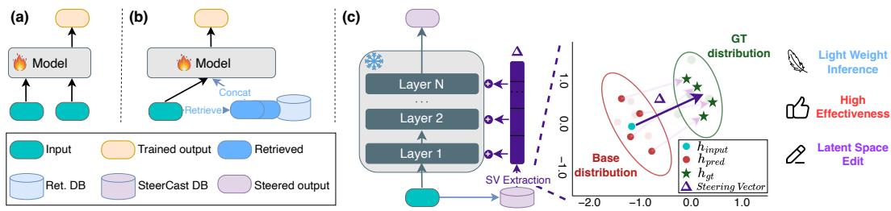
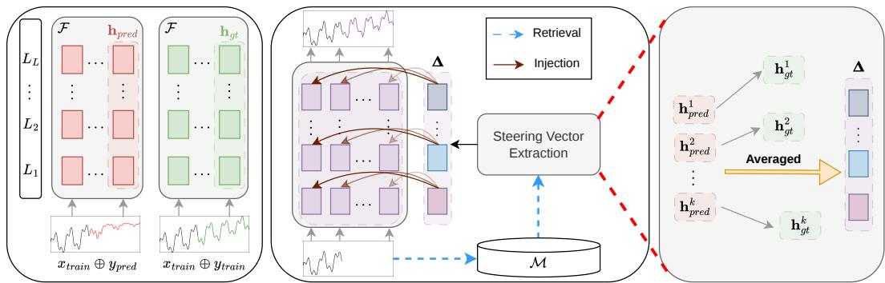
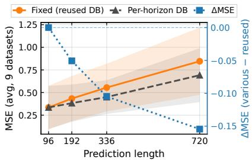
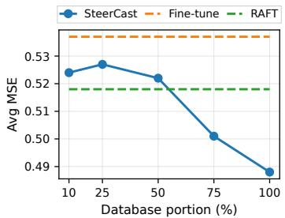
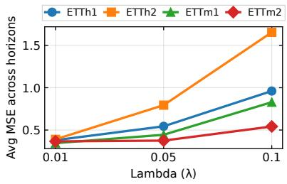
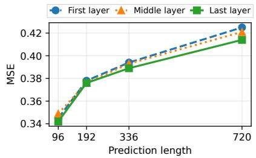
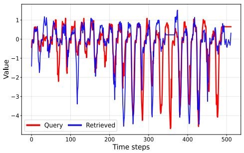
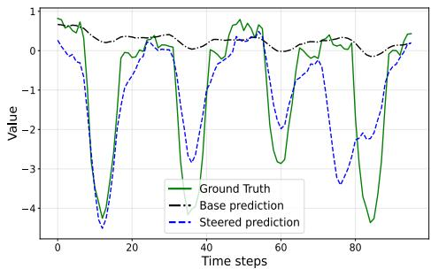
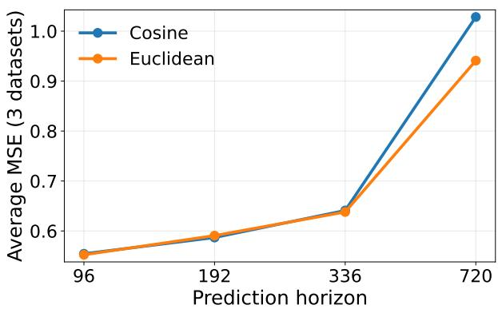

# SteerCast: Retrieval-Based Latent Steering for Decoder-Only Time Series Forecasting

Van Dai Do, Huu Hiep Nguyen, Minh Hoang Nguyen, Hung Le Deakin’s Applied Artificial Intelligence Initiative Deakin University, Geelong, Australia v.do@deakin.edu.au

## Abstract

Time series forecasting aims to predict future values from historical observations and auxiliary features. We propose SteerCast, a retrieval-based latent steering method that improves decoder-only forecaster at inference time, without updating its parameters. SteerCast constructs a database from the training set by storing a representation of each history window together with a steering vector computed in the forecaster’s latent space, defined as the difference between representations induced by the ground-truth continuation and by the model’s own prediction. At test time, SteerCast retrieves nearest neighbors for a query history, aggregates their steering vectors, and injects the resulting signal into the forecaster’s hidden states at every step of autoregressive generation, guiding predictions toward trajectories consistent with similar training cases. Experiments across diverse multivariate benchmarks and multiple horizons show that SteerCast consistently improves forecasting accuracy over the fine-tuned backbone and retrieval-based baselines, while requiring no additional training beyond the original fine-tuning and using only the training set as a retrieval corpus.

## 1 Introduction

Accurate time series forecasting is a requirement in many real-world systems, including energy management [4, 11], finance [21] , economics [5, 10] , and healthcare [9, 33]. Traditional approaches, such as ARIMA [19], rely on explicit statistical assumptions to capture temporal dependencies, but they often struggle with the high-dimensional, non-linear patterns found in modern datasets.

Transformers [26] have become a dominant backbone for long-term time series forecasting, motivating a large body of work that adapts attention-based architectures to improve efficiency and accuracy on long sequences. Representative examples include sparse and efficient attention for long inputs [34], decomposition-based architectures that separate trend and seasonal components [30, 35], and alternative representations that better exploit periodic structure [31]. More recently, patch-based tokenization has improved scalability and generalization by turning long histories into compact token sequences, as demonstrated by Nie et al. [20]. Separately, iTransformer [15] models multivariate structure through variate-centric tokens, enabling effective cross-variable interactions.

The decoder-only time-series models inherit the advantages of next-token generation, flexible context lengths, and strong transfer across domains, and they are increasingly used as high-capacity backbones for forecasting [3, 17, 23]. However, even after fine-tuning, forecasting errors often persist in specific regimes, such as rare or atypical patterns, abrupt distribution shifts and interruptions, and horizon-dependent failure modes driven by cumulative error propagation over long horizons [2, 8, 13]. Improving a fine-tuned forecaster typically requires additional training, ensembling, or further scaling, which increases compute and deployment cost [32]. It can also reduce robustness by over-specializing to a target dataset or evaluation condition under distribution shift [29]. This paper explores an alternative route: improving an already fine-tuned decoder-only forecaster at inference time, without updating its parameters. Our approach is inspired by steering techniques, which are broader trend in language modeling to improve generalization [22]. While input-space retrieval augmentation has been widely studied [7, 14], directly prepending retrieved histories is impractical for decoder-only time series foundation models: their context windows are strict and self-attention’s $\mathcal { O } ( L ^ { 2 } )$ cost grows as $( k { + } 1 ) ^ { 2 }$ when k neighbors are prepended [3, 23, 26].

We propose SteerCast, a retrieval-based inference-time method that improves fine-tuned decoder-only time series forecasters via latent-space steering. SteerCast constructs a database from the training set, where each entry stores (i) a retrieval key that represents the historical context and (ii) a steering vector defined in the latent space of the forecaster. At test time, SteerCast retrieves training histories most similar to the current input window, aggregates their steering vectors, and injects the resulting signal into the forecaster’s hidden states during generation. The key design choice is that steering vectors are computed from the forecaster’s own internal representations, capturing how the latent trajectory changes when conditioning on the ground-truth future versus the model’s initial prediction. This yields a model-aware correction signal that transfers forecast-relevant adjustments from similar training cases while preserving the backbone’s learned capability. To keep interventions stable, we apply a simple similarity-based modulation and normalization when injecting the steering vector.

We evaluate SteerCast on ten multivariate forecasting benchmarks spanning diverse domains, frequencies, and sequence lengths, and report MSE and MAE across multiple horizons. Across three state-of-the-art decoder-only time series forecasters, Time-MoE [23], Timer-XL [17] and TimesFM [3], SteerCast consistently improves over the corresponding fine-tuned models, showing that retrievalguided latent steering is an effective and practical mechanism for inference-time refinement.

Contributions. Our main contributions are: (i) we introduce SteerCast, a latent steering method that improves decoder-only forecasters at inference time without parameter updates; (ii) we propose a database construction procedure that stores retrieval keys and latent steering vectors, together with a lightweight injection rule for stable steering during generation; and (iii) we demonstrate consistent gains across diverse multivariate forecasting datasets, horizons, and modern decoder-only backbones.

## 2 Related Work

Transformer-based Time Series Forecasting. Transformers [26] have evolved into the dominant backbone for time series modeling, broadly bifurcating into encoder-centric and decoder-centric architectures. Encoder-based methods focus on extracting robust representations for direct prediction: Informer [34] pioneered efficient long-sequence modeling via sparse attention, while PatchTST [20] significantly enhanced performance by introducing patch-based tokenization and channel independence. Recent encoder innovations include iTransformer [15], which employs an inverted structure to better capture multivariate correlations, and TimeXer [27], which specifically aligns exogenous variables with endogenous series. Conversely, decoder-based architectures frame forecasting as a generative autoregressive task, often drawing inspiration from Large Language Models (LLMs). AutoTimes [16] demonstrates the adaptability of frozen LLMs for sequential time series generation, while Timer-XL [17] establishes a native large-scale foundation model using variable-resolution decoding. To further scale model capacity, Time-MoE [23] incorporates a Mixture-of-Experts (MoE) design to handle diverse temporal dynamics efficiently. While prior methods typically improve forecasting performance by modifying the training pipeline, our method targets models that are already fine-tuned for each downstream dataset and horizon, and improves their predictions purely at inference time without any further training.

Retrieval-based Forecasting. Retrieval has long been used in forecasting through nearest-neighbor and exemplar-based strategies that reuse similar historical patterns. Contemporary retrieval-based methods build a database of historical windows and retrieve relevant examples to guide prediction, either by directly aggregating retrieved futures or by combining retrieved information with a parametric predictor. RATD [14] integrates a trained retriever into a diffusion-based generative framework; by conditioning on retrieved historical segments, it allows for stochastic sampling that improves both prediction accuracy and uncertainty quantification. Similarly, RAFT [7] retrieves historical segments with patterns similar to the current input and leverages their subsequent values as a predictive signal, typically as part of a trained forecasting pipeline. Both methods also require retrieved sequences to fit within the backbone’s context window, which is restrictive for fixed-budget foundation models. In contrast, SteerCast uses retrieval to select relevant training cases but applies their information as a latent-space correction, without parameter updates or extra input tokens.

  
Figure 1: Schematic illustrations for improving decoder-based time-series forecasters, including (a) model fine-tuning (b) retrieval-based fine-tuning and (c) our approach SteerCast. SteerCast investigates and demonstrates how to effectively improve forecasting performance with latent space editing while requiring no gradient updates where well-developed methods are not capable of.

Latent Steering and Representation Interventions. A separate line of work studies controlling model behavior by intervening on internal representations, often via additive directions in activation space. Early evidence shows that adding a suitable vector to hidden states can steer a frozen language model toward desired generations [24]. More recently, Wilinski et al. [´ 28] show that time-series foundation models can be steered by intervening on internal activations, and demonstrate simple synthetic edits such as introducing sinusoidal structure into an initially constant signal. In LLM literature, in-context vectors recast in-context learning as a latent steering direction computed from demonstration representations and applied at inference time [22]. SteerCast adapts this latent intervention perspective to time series forecasting: rather than steering outputs by modifying inputs or retraining parameters, we compute steering vectors from the forecaster’s own latent trajectories (ground-truth continuation versus model-predicted continuation) and inject these vectors during generation to refine forecasts.

## 3 Method

## 3.1 Overview

Problem Formulation. Let $S \in \mathbb { R } ^ { C \times T }$ be a multivariate time series with $C$ channels and length T. Given an input $\mathbf { X } = [ \mathbf { x } _ { 1 } , \dots , \mathbf { x } _ { C } ] \in \mathbb { R } ^ { C \times P }$ , the forecasting task is to predict the future $\overset { \mathbf { \sigma } } { \mathbf { Y } } =$ $[ \mathbf { y } _ { 1 } , \dots , \mathbf { y } _ { C } ] \in \mathbf { \dot { \mathbb { R } } } ^ { C \times F }$ , where $P$ is the look-back window length and $F$ is the forecasting horizon. When $\mathcal { F }$ uses patch-based tokenization with patch length $p ,$ the look-back window of $\bar { P }$ raw time steps is mapped to $N _ { P } = \lceil P / p \rceil$ input tokens, and the horizon of $F$ raw time steps is produced as $\bar { N _ { F } } = \lceil F / \bar { p rceil }$ forecast tokens. Throughout, we reserve $P , F$ for raw time steps and use $N _ { P } , N _ { F }$ whenever indexing hidden states, retrieval keys, or autoregressive generation steps; for non-patched backbones $p = 1 \ : \mathrm { s o } \ : N _ { P } = P$ and $N _ { F } = F$ . Following the channel-independent formulation [15], we decompose the multivariate series into univariate sequences and process each channel independently using a shared backbone $\mathcal { F }$

Latent Forecast Residuals. A fine-tuned decoder-only forecaster $\mathcal { F }$ makes structured errors: similar histories elicit similar forecast deviations, and errors compound over long horizons even after extensive training. Retraining $\mathcal { F }$ is expensive and can hurt robustness under distribution shift. We instead exploit this structure through SteerCast (Figure 2), which steers $\mathcal { F } \mathrm { { s } }$ latent states at inference time. We first run $\mathcal { F }$ on the training set to build a memory $\mathcal { M }$ of key-value pairs $( \mathbf { r } , \pmb { \Delta } )$ : for each univariate training sample $( \mathbf { x } , \mathbf { y } ) \in \mathcal { D } _ { \mathrm { t r a i n } }$ , r is a representation of the historical context (used as the retrieval $k e y )$ , and $\pmb { \Delta }$ is a steering vector in the latent space of $\mathcal { F }$ (used as the value). At test time, given a query series, we compute its key $\mathbf { r } _ { q } ,$ retrieve the top-k most similar keys in $\mathcal { M }$ , and aggregate their steering vectors to obtain $\pmb { \Delta }$ . We then inject $\pmb { \Delta }$ into the hidden states of $\dot { \mathcal { F } }$ during autoregressive generation at every step via a simple linear update, thereby augmenting the fine-tuned forecaster with forecast-relevant latent adjustments distilled from similar training examples and improving prediction quality on new sequences.

  
Figure 2: SteerCast overview. (Left) For each training example , we run the fine-tuned forecaster $\mathcal { F }$ to obtain an initial prediction $\mathbf { h } _ { p r e d }$ and compute representations for the concatenated sequences $[ \mathbf { x _ { t r a i n } } ; \mathbf { y _ { p r e d } } ]$ and $[ \mathbf { x _ { t r a i n } } ; \mathbf { y _ { t r a i n } } ] ;$ ; their difference yields a steering vector. (Middle) During autoregressive forecasting, we add $\pmb { \Delta }$ into the hidden states at each generation step at every generation step to guide the forecast toward trajectories consistent with retrieved training cases. (Right) We retrieve the top-k training histories whose keys are closest to the current query, then average their steering vectors to obtain $\pmb { \Delta }$

## 3.2 Database Construction

Retrieval Key (r). The key should represent histories that elicit similar forecasts close and unrelated histories far apart. Since this similarity depends on how $\mathcal { F }$ processes a window rather than its surface statistics, we derive the key from $\mathcal { F }$ itself. Let $\mathbf { Z } ( \mathbf { x } ) \in \mathbb { R } ^ { \dot { N } _ { P } \times d }$ denote the final-layer hidden states for input x, with d the hidden dimension. To capture the look-back window’s global context as the query anchor at inference, we average $\mathbf { Z }$ over the temporal dimension to obtain the key r:

$$
\mathbf { r } ( \mathbf { x } ) = \frac { 1 } { N _ { P } } \sum _ { t = 1 } ^ { N _ { P } } \mathbf { Z } _ { t } ( \mathbf { x } ) \in \mathbb { R } ^ { d } .\tag{1}
$$

Steering Vector $( \Delta ) .$ . For every training pair $( \mathbf { x } _ { \mathrm { { t r a i n } } } , \mathbf { y } _ { \mathrm { { t r a i n } } } ) ~ \in ~ { \mathcal { D } } _ { \mathrm { { t r a i n } } } .$ , SteerCast forms two continuations of the same history: a source $\left[ \mathbf { x } _ { \mathrm { t r a i n } } ; \mathbf { y } _ { \mathrm { p r e d } } \right]$ with $\mathbf { y } _ { \mathrm { p r e d } } = \mathcal { F } ( \mathbf { x } _ { \mathrm { t r a i n } } )$ , and a target $\left[ \mathbf { x } _ { \mathrm { t r a i n } } ; \mathbf { y } _ { \mathrm { t r a i n } } \right]$ , where $\mathbf { y } _ { \mathrm { p r e d } }$ and $\mathbf { y } _ { \mathrm { t r a i n } }$ have equal length. Let $\mathbf { h } ( \mathbf { s } ) { \bar { \mathbf { \phi } } } = [ h _ { 1 } , \ldots , h _ { L } ] \in \mathbb { R } ^ { L \times d }$ denote the concatenation of last-token residual-stream states of $\mathcal { F }$ at each block’s output. The steering vector is the difference of h under the two continuations:

$$
\begin{array} { r } { \pmb { \Delta } = \mathbf { h } \big ( [ \mathbf { x } _ { \mathrm { t r a i n } } ; \mathbf { y } _ { \mathrm { t r a i n } } ] \big ) - \mathbf { h } \big ( [ \mathbf { x } _ { \mathrm { t r a i n } } ; \mathbf { y } _ { \mathrm { p r e d } } ] \big ) = \mathbf { h } _ { \mathrm { g t } } - \mathbf { h } _ { \mathrm { p r e d } } . } \end{array}\tag{2}
$$

Intuitively, $\pmb { \Delta }$ captures the latent displacement from the model’s base predictive trajectory (source) to the trajectory consistent with the ground truth (target). Since $\pmb { \Delta }$ is formed by contrasting representations induced by the ground-truth continuation and the model-generated continuation under the same history $\mathbf { X } _ { \mathrm { t r a i n } } .$ , it cancels representational content that depends only on the history and isolates the displacement attributable to the choice of continuation. Although read off at the last-token position, under causal masking, this is the only token whose receptive field spans the full continuation, so $\pmb { \Delta }$ summarizes the cumulative model-vs-truth disagreement over the entire rollout rather than a horizon-end-only signal; the per-step strength of the intervention is then handled by the cosine gate in Eq. (4). Storing these steering vectors enables inference-time correction via lightweight additive steering, avoiding any gradient updates. Finally, SteerCast stores r $\cdot ( \mathbf { x } _ { \mathrm { t r a i n } } )$ as the database key for retrieval and associates it with $\pmb { \Delta }$ as the corresponding steering value, which is later injected at inference time to refine forecasts.

## 3.3 Inference Time Steering

At test time, we estimate the latent forecast residual at the query by nonparametric retrieval and inject the estimate into the forecaster’s autoregressive rollout. Let $\mathbf { \check { x } } \in \mathbb { R } ^ { 1 \times P }$ denote the univariate input

history window. We first compute its retrieval key $\mathbf { r } ^ { q } = \mathbf { r } ( \mathbf { x } )$ and measure proximity to each stored entry $m ^ { j } = ( { \bf r } ^ { j } , { \pmb \Delta } ^ { j } ) \in M$ under Euclidean distance: $d ^ { j } \ = \ \| \mathbf { r } ^ { q } - \mathbf { r } ^ { j } \| _ { 2 } , m ^ { j } \in M$ . We then select the k entries with smallest $d ^ { j }$ and aggregate their stored residuals by mean pooling:

$$
\Delta ( { \bf x } ) = \frac { 1 } { k } \sum _ { j = 1 } ^ { k } \Delta ^ { j } .\tag{3}
$$

Given a forecasting horizon of $F$ raw time steps, the backbone autoregressively generates $N _ { F } =$ $\lceil F / p \rceil$ forecast tokens. Let $\mathbf { h } _ { f , l } \in \mathbb { R } ^ { 1 \times d }$ denote the residual-stream state at block $\bar { l } \in \{ 1 , \ldots , L \} ^ { \prime } \mathrm { s }$ output when generating the f-th forecast token, $f \in \{ 1 , \ldots , N _ { F } \}$ , and let $\pmb { \Delta } ^ { ( l ) } ( \mathbf { x } ) \in \mathbb { R } ^ { 1 \times d }$ be the layer-l segment of the aggregated residual. A naive implementation would simply add $\Delta ^ { ( l ) } ( \mathbf { x } )$ to $\mathbf { h } _ { f , l }$ at every step. This has two failure modes during autoregressive rollout: a constant additive shift continues to push the latent state after the original gap has closed, and the magnitude of the shift can vary substantially across queries, occasionally driving the trajectory off the manifold the backbone was trained on. We therefore control both the direction and the magnitude of the intervention.

Direction: When to steer. We introduce a non-negative cosine gate that weakens the update once the current hidden state is already aligned with the steering direction:

$$
\alpha _ { f , l } = b + \mathrm { R e L U } \Big ( - \cos \big ( \mathbf { h } _ { f , l } , \Delta ^ { ( l ) } ( \mathbf { x } ) \big ) + m \Big ) ^ { p } ,\tag{4}
$$

with fixed hyperparameters $( b , m , p )$ . The gate has three regimes that follow directly from the ReLU. When cos $( \mathbf { h } _ { f , l } , \Delta ^ { ( l ) } ) \ge m -$ the hidden state is already pointed in the steering direction beyond margin $m -$ the gate collapses to its floor b, preventing over-correction. When cos $< m$ , the gate exceeds b by an amount that grows with misalignment, and the exponent p controls how sharply this growth concentrates near the margin (larger p gives a more selective gate). The floor $b > 0$ ensures a small baseline correction even in the aligned regime, which we found necessary to prevent the steering from disengaging entirely once the trajectory briefly drifts toward the right direction.

Magnitude: How strongly to steer. We $\ell _ { 2 } \cdot$ -normalize each layer segment of the aggregated residual before applying the gated update:

$$
\widetilde { \mathbf { h } } _ { f , l } = \mathbf { h } _ { f , l } + \lambda \alpha _ { f , l } \frac { \mathbf { \Delta } \mathbf { \Delta } \mathbf { \Delta } ^ { ( l ) } ( \mathbf { x } ) } { \| \mathbf { \Delta } \mathbf { \Delta } ^ { ( l ) } ( \mathbf { x } ) \| _ { 2 } + \epsilon } ,\tag{5}
$$

where λ is a global steering strength and ϵ a numerical-stability constant. Normalization separates the direction of the residual (which retrieval has estimated) from its scale (which retrieval has not), replacing the latter with a single tunable λ. The resulting per-step, per-layer perturbation magnitude is bounded by λ αmax–where $\alpha _ { \mathrm { m a x } } = b + ( 1 + m ) ^ { p }$ is the maximum value of the cosine gate in Eq. (4)–regardless of the data or backbone, and ϵ prevents division blow-up when $\| \pmb { \Delta } ^ { ( l ) } \| _ { 2 } \approx 0$

## 4 Experiments

## 4.1 Experimental Settings

Datasets. We benchmark SteerCast on ten datasets spanning diverse variates, lengths, and frequencies. ETT (four subsets) [34] contains electricity transformer measurements at 15-minute intervals; Exchange [12] tracks daily exchange rates for eight countries; Weather [18] contains 21 German weather indicators; and Illness [1] reports weekly influenza-like illness ratios. From the Monash archive [6], we use three univariate series: US Births, SaugeenDay (Canadian river discharge), and Sunspots.

Backbones and Baselines. We use Time-MoE [23], Timer-XL [17] and TimesFM [3] as backbones, which are state-of-the-art decoder-only Transformers for time series forecasting. We compare against three baselines: FT, the simple method that fine-tunes model on the downstream dataset; RAFT [7], a retrieval-augmented method that retrieves top-k similar historical patches and uses their subsequent segments alongside the input to produce the forecast; and RAF [25], a training-free method that prepends retrieved (history, future) examples as in-context demonstrations to the backbone.

Table 1: MSE comparison of SteerCast (SC), Fine-tune (FT), RAF [25], and RAFT [7] across 10 datasets, averaged over all prediction lengths, under the various look-back window setting. Promotion: % MSE reduction of SC over RAFT. Full results in Appendix D.
<table><tr><td></td><td>Method</td><td>ETTh1</td><td>ETTh2</td><td>ETTm1</td><td>ETTm2</td><td>Exch.</td><td>Wthr.</td><td>Ill.</td><td>Births</td><td>Saug.</td><td>Suns.</td></tr><tr><td></td><td>FT</td><td>0.389</td><td>0.366</td><td>0.350</td><td>0.367</td><td>0.428</td><td>0.241</td><td>3.392</td><td>0.855</td><td>0.999</td><td>0.429</td></tr><tr><td></td><td>RAF</td><td>0.398</td><td>0.356</td><td>0.358</td><td>0.373</td><td>0.440</td><td>0.249</td><td>3.322</td><td>0.923</td><td>0.996</td><td>0.438</td></tr><tr><td></td><td>RAFT</td><td>0.389</td><td>0.359</td><td>0.349</td><td>0.349</td><td>0.449</td><td>0.242</td><td>3.279</td><td>0.724</td><td>0.966</td><td>0.422</td></tr><tr><td>Time-MoE</td><td>SC (ours)</td><td>0.380</td><td>0.351</td><td>0.345</td><td>0.339</td><td>0.418</td><td>0.242</td><td>3.232</td><td>0.639</td><td>0.983</td><td>0.420</td></tr><tr><td></td><td>Promotion</td><td>2.3%</td><td>2.2%</td><td>1.1%</td><td>2.8%</td><td>6.9%</td><td>0.0%</td><td>1.4%</td><td>11.7%</td><td>-1.8%</td><td>0.5%</td></tr><tr><td></td><td>FT</td><td>0.681</td><td>0.377</td><td>0.384</td><td>0.279</td><td>0.546</td><td>0.252</td><td>2.894</td><td>0.748</td><td>1.082</td><td>0.399</td></tr><tr><td></td><td>RAF</td><td>0.697</td><td>0.424</td><td>0.391</td><td>0.289</td><td>0.561</td><td>0.262</td><td>2.941</td><td>0.674</td><td>1.118</td><td></td></tr><tr><td>Timm-L</td><td>RAFT</td><td>0.709</td><td>0.414</td><td>0.403</td><td>0.304</td><td>0.530</td><td>0.266</td><td>2.893</td><td>0.623</td><td>1.033</td><td>0.395</td></tr><tr><td></td><td>SC (ours)</td><td>0.681</td><td>0.372</td><td>0.381</td><td>0.280</td><td>0.518</td><td>0.255</td><td>2.889</td><td>0.625</td><td>1.029</td><td>0.391</td></tr><tr><td></td><td>Promotion</td><td>3.9%</td><td>10.1%</td><td>5.5%</td><td>7.9%</td><td>2.3%</td><td>4.1%</td><td>0.1%</td><td>-0.3%</td><td>0.4%</td><td>0.391 0.0%</td></tr><tr><td></td><td></td><td></td><td></td><td></td><td></td><td></td><td></td><td></td><td></td><td></td><td></td></tr><tr><td>TimM</td><td>FT</td><td>0.468</td><td>0.421</td><td>0.444</td><td>0.310</td><td>0.503</td><td>0.270</td><td>3.213</td><td>0.667</td><td>1.003</td><td>0.181</td></tr><tr><td></td><td>RAF</td><td>0.462</td><td>0.424</td><td>0.437</td><td>0.325</td><td>0.499</td><td>0.268</td><td>3.156</td><td>0.687</td><td>1.037</td><td>0.371</td></tr><tr><td></td><td>RAFT</td><td>0.452</td><td>0.424</td><td>0.440</td><td>0.307</td><td>0.498</td><td>0.264</td><td>3.167</td><td>0.648</td><td>0.985</td><td>0.173</td></tr><tr><td></td><td>SC (ours)</td><td>0.452</td><td>0.409</td><td>0.434</td><td>0.302</td><td>0.485</td><td>0.255</td><td>3.083</td><td>0.538</td><td>0.956</td><td>0.171</td></tr><tr><td></td><td>Promotion</td><td>0.0%</td><td>3.6%</td><td>1.5%</td><td>1.4%</td><td>2.6%</td><td>3.4%</td><td>2.7%</td><td>16.9%</td><td>2.9%</td><td>1.2%</td></tr></table>

Table 2: MSE comparison of SteerCast (SC), Fine-tune (FT), RAF [25], and RAFT [7] across 10 datasets, averaged over all prediction lengths, under the fixed look-back window setting. Promotion: % MSE reduction of SC over RAFT. Full results in Appendix D.
<table><tr><td></td><td>Method</td><td>ETTh1</td><td>ETTh2</td><td>ETTm1</td><td>ETTm2</td><td>Exch.</td><td>Wthr.</td><td>IlI.</td><td>Births</td><td>Saug.</td><td>Suns.</td></tr><tr><td></td><td>FT</td><td>0.407</td><td>0.537</td><td>0.401</td><td>0.509</td><td>0.425</td><td>0.237</td><td>3.838</td><td>1.012</td><td>1.150</td><td>0.566</td></tr><tr><td></td><td>RAF</td><td>0.400</td><td>0.513</td><td>0.394</td><td>0.518</td><td>0.431</td><td>0.242</td><td>3.848</td><td>0.953</td><td>1.139</td><td>0.541</td></tr><tr><td></td><td>RAFT</td><td>0.402</td><td>0.518</td><td>0.391</td><td>0.519</td><td>0.435</td><td>0.236</td><td>3.868</td><td>0.851</td><td>1.106</td><td>0.500</td></tr><tr><td>Tim-oE</td><td>SC (ours)</td><td>0.394</td><td>0.488</td><td>0.387</td><td>0.513</td><td>0.420</td><td>0.238</td><td>3.817</td><td>0.832</td><td>1.124</td><td>0.483</td></tr><tr><td></td><td>Promotion</td><td>2.0%</td><td>5.8%</td><td>1.0%</td><td>1.2%</td><td>3.4%</td><td>-0.8%</td><td>1.3%</td><td>2.2%</td><td>-1.6%</td><td>3.4%</td></tr><tr><td></td><td>FT</td><td>0.641</td><td>0.394</td><td>0.420</td><td>0.294</td><td>0.537</td><td>0.248</td><td>2.524</td><td>0.704</td><td>1.202</td><td>0.426</td></tr><tr><td></td><td>RAF</td><td>0.653</td><td>0.400</td><td>0.425</td><td>0.305</td><td>0.457</td><td>0.265</td><td>2.606</td><td>0.629</td><td>1.112</td><td></td></tr><tr><td></td><td>RAFT</td><td>0.661</td><td>0.405</td><td>0.422</td><td>0.309</td><td>0.461</td><td>0.271</td><td>2.584</td><td>0.608</td><td>1.095</td><td>0.410 0.413</td></tr><tr><td>Timm-L</td><td>SC (ours)</td><td>0.624</td><td>0.386</td><td>0.418</td><td>0.292</td><td>0.436</td><td>0.246</td><td>2.528</td><td>0.620</td><td>1.102</td><td>0.402</td></tr><tr><td></td><td>Promotion</td><td>5.6%</td><td>4.7%</td><td>0.9%</td><td>5.5%</td><td>5.4%</td><td>9.2%</td><td>2.2%</td><td>-2.0%</td><td>-0.6%</td><td>2.7%</td></tr><tr><td></td><td></td><td></td><td></td><td></td><td></td><td></td><td></td><td></td><td></td><td></td><td></td></tr><tr><td>TimFMM</td><td>FT</td><td>0.502</td><td>0.399</td><td>0.418</td><td>0.303</td><td>0.428</td><td>0.223</td><td>3.300</td><td>0.268</td><td>1.015</td><td>0.338</td></tr><tr><td></td><td>RAF</td><td>0.521</td><td>0.383</td><td>0.416</td><td>0.296</td><td>0.420</td><td>0.221</td><td>3.200</td><td>0.550</td><td>1.040</td><td>0.323</td></tr><tr><td></td><td>RAFT</td><td>0.508</td><td>0.384</td><td>0.412</td><td>0.299</td><td>0.422</td><td>0.219</td><td>3.250</td><td>0.256</td><td>0.984</td><td>0.325</td></tr><tr><td></td><td>SC (ours)</td><td>0.476</td><td>0.381</td><td>0.394</td><td>0.291</td><td>0.408</td><td>0.213</td><td>3.163</td><td>0.249</td><td>0.952</td><td>0.319</td></tr><tr><td></td><td>Promotion</td><td>6.3%</td><td>0.9%</td><td>4.4%</td><td>2.7%</td><td>3.3%</td><td>2.6%</td><td>2.7%</td><td>2.8%</td><td>3.3%</td><td>1.8%</td></tr></table>

Evaluation Protocols. For each dataset, we (i) construct the retrieval database M from the chronological training split only, (ii) select hyperparameters such as the number ofretrieved neighbors k on the held-out validation split, following [7], and (iii) evaluate on the held-out test split (the chronologically last 20% of the series). The validation block sits between the training database and the test set in time and is excluded from M, so no database entry spans timesteps that any test window predicts; we further verify this in Section 5.1. We report mean squared error (MSE) and mean absolute error (MAE), and consider forecasting horizons F ∈ {96, 192, 336, 720} except for Illness, where F ∈ {24, 36, 48, 60}. All evaluations are conducted in the multivariate setting, using all channels of each dataset.

## 4.2 Results

## 4.2.1 Various Look-back Window Forecasting

Setup. We vary the look-back window length for different forecasting horizons. Specifically, for horizons {96, 192, 336, 720}, we use input lengths {512, 1024, 2048, 3072}, respectively. This setting builds a separate retrieval database for each input–prediction length pair.

Table 3: Robustness analyses on ETT with Time-MoE, reporting MSE averaged over prediction horizons. Left: Temporal-isolation ablation: default vs. strict variant dropping the last $P + F =$ 608 train candidates $( k { = } 1 , \lambda { = } 0 . 0 1$ , Euclidean retrieval). Right: Distribution shift, using only the first 50% of training data. ∆: relative MSE reduction of SteerCast (SC) over RAFT. MAE in appendix.
<table><tr><td>Protocol</td><td>ETTh1</td><td>ETTh2</td></tr><tr><td>Default</td><td>0.342</td><td>0.290</td></tr><tr><td>Strict</td><td>0.343</td><td>0.287</td></tr></table>

(a) Temporal-isolation ablation.

<table><tr><td>Dataset</td><td>FT</td><td>RAF</td><td>RAFT</td><td>SC</td><td>Δ</td></tr><tr><td>ETTh1</td><td>0.441</td><td>0.421</td><td>0.409</td><td>0.406</td><td>0.9%</td></tr><tr><td>ETTh2</td><td>0.630</td><td>0.531</td><td>0.529</td><td>0.515</td><td>2.7%</td></tr></table>

(b) Temporal distribution shift (first 50% of train).

Results. Table 1 shows that SteerCast performs consistently across all three forecasting backbones. It achieves the lowest or tied-lowest MSE on 25 of 30 dataset–backbone entries. Compared with RAF, SteerCast reduces MSE by 7.4% on average, with gains observed across most entries. These results show that horizon-specific retrieval databases provide effective steering signals across diverse datasets and backbones.

## 4.2.2 Fixed Look-back Window Forecasting

Setup. We next consider a more efficient setting where the input length is fixed to 512 for all prediction horizons {96, 192, 336, 720}. We build only the retrieval database for the 512-96 setting and reuse the same retrieval keys and steering vectors across all horizons. This evaluates whether SteerCast can transfer a single retrieval-guided correction across different forecasting lengths.

Results. Table 2 shows that SteerCast remains effective under the fixed look-back setting. Across 30 dataset–backbone entries, SteerCast achieves the lowest or tied-lowest MSE on 24 entries. On average, SteerCast reduces MSE by 5.1% over FT, 5.3% over RAF, and 2.7% over RAFT. These results suggest that a single database built from the 512-96 setting can still provide transferable steering signals across longer horizons, reducing the need for horizon-specific database construction.

## 5 Ablation Studies and Model Analysis

## 5.1 Temporal Isolation Ablation

To verify that SteerCast’s gains are not driven by residual boundary effects between the database and the test split, we rebuild the database under a stricter temporal-isolation protocol. The default protocol is already leak-free by construction: the database is built only from the chronological training portion of each series, with the entire validation block acting as a natural buffer. The stricter variant additionally drops the last $P + F = 6 0 8$ candidate windows on the train side at the 512 → 96 setting, enlarging this buffer further. Table 3a compares the two protocols on ETTh1 and ETTh2 with Time-MoE: the strict variant changes MSE by about 0.3% on ETTh1 and 1.0% on ETTh2, with the two deltas pointing in opposite directions (slightly higher error on ETTh1, slightly lower on ETTh2). If boundary windows were carrying forward-looking information into the database, removing them should consistently hurt the strict protocol; instead, the change is small in magnitude and inconsistent in sign, indicating that boundary entries are not a meaningful source of SteerCast’s improvement.

## 5.2 SteerCast Works Well Under Temporal Distribution Shift

We further evaluate SteerCast under a temporally shifted setting by restricting the available training data for all methods to the first 50% of the training set. Since the ETT datasets are chronologically ordered, this creates a harder evaluation scenario in which the training memory is more temporally separated from the held-out test period. As shown in Table 3b, SteerCast remains robust under this setting, achieving the best overall performance on both ETTh1 and ETTh2. Compared with FT and retrieval-based baselines, SteerCast consistently obtains lower average error, indicating that the retrieved latent residuals remain useful even when the available memory is limited to earlier temporal regimes. These results support SteerCast as an effective inference-time correction mechanism under temporal distribution shift.

Figure 3: Database design ablations. (Left) Database protocol on Time-MoE, comparing a single reused database with per-horizon databases. (Right) ETTh2 with Time-MoE: forecasting MSE versus retrieval database size (10%–100%), with Fine-tune and RAFT as horizontal baselines.  

Table 4: Steering Analysis. (a) insertion position of $\pmb { \Delta }$ on ETTh1, averaged over horizons {96, 192, 336, 720} with history 512, weight 0, neighbor 1, and $\lambda = 0 . 0 1$ . (b) gating ablation, where cosine-based gating is disabled and the gate is reduced to a constant $\alpha _ { f , l } \equiv b .$  
(a) ∆ insertion position
<table><tr><td>Layer</td><td>Avg MSE ↓</td><td>Avg MAE↓</td></tr><tr><td>All layers</td><td>0.394</td><td>0.416</td></tr><tr><td>First layer</td><td>0.403</td><td>0.426</td></tr><tr><td>Middle layer</td><td>0.406</td><td>0.429</td></tr><tr><td>Last layer</td><td>0.402</td><td>0.426</td></tr></table>

(b) Gating ablation
<table><tr><td>Dataset</td><td>Pred.</td><td>MSE↓</td><td>MAE↓</td></tr><tr><td>ETTh1</td><td>720 Average</td><td>0.500 0.410</td><td>0.508 0.429</td></tr><tr><td rowspan="2">ETTh2</td><td>720</td><td>0.920</td><td>0.663</td></tr><tr><td>Average</td><td>0.527</td><td>0.480</td></tr></table>

## 5.3 Database Design

Fixed vs. various-history protocol. We compare the fixed-history and various-history database building protocols. Figure 3 (Left) reports MSE averaged over nine datasets (excluding Illness due to its different forecast lengths), with a mean±std band showing cross-dataset variability. Fixed-history is already a strong default, but various-history becomes increasingly beneficial as the horizon grows: the gap between the two curves widens, and ∆MSE (per-horizon minus reused) becomes more negative, indicating that horizon-specific memory better captures long-range dynamics.

Database Size. We study the effect of database size on ETTh2, using Time-MoE as the forecaster. The retrieval databases are constructed using 10%, 25%, 50%, 75%, and 100% of the training set and report results in Figure 3 (Right). As the database grows, SteerCast’s average MSE decreases from 0.524 (10%) to 0.488 (100%), suggesting that larger pools more reliably retrieve close historical matches and thus yield more effective correction vectors. SteerCast consistently outperforms the Fine-tune baseline across all sizes, and it surpasses RAFT once the database reaches 50% (and above), with the largest gains at 75%–100%. The mild non-monotonicity at 10%–50% indicates that smaller pools can still retrieve regime-mismatched neighbors, whereas a sufficiently large memory reduces this risk and improves the consistency of steering.

## 5.4 Anatomy of the Steering Rule

Layer Impact of Steering Vector. We ablate the depth at which ∆ is applied, comparing insertion at a single transformer block (first, middle, or last) against all blocks, with retrieval fixed on ETTh1 at history length 512. Table 4 (a) shows that all-layer insertion performs best, while single-layer steering raises average MSE by 2.0%–3.0%. This indicates that $\pmb { \Delta } \mathbf { \ ' } _ { \mathbf { S } }$ correction signal is not localized to one depth and is most effective when distributed across the forecaster.

Gating ablation. To isolate the benefit of adaptive gating, we disable the ReLU term in Equation (4), thus the gate becomes a constant $\alpha _ { f , l } \equiv b .$ Table 4 (b) reports the resulting errors on ETTh1 and ETTh2 with the same retrieval and steering settings. Without the gate, performance degrades as the horizon grows, with particularly large long-horizon errors at 720 steps, suggesting that a uniform, ungated intervention is more prone to accumulated mis-calibration during autoregressive rollout.

Figure 4: Steering Analysis. (Left) Sensitivity to steering strength λ, where smaller values perform best. (Right) ETTh1 retrieval-key layer ablation: first, middle, or last layer for the retrieval key.  

  
Table 6: Runtime comparison (s/iter and relative to Base) using Time-MoE as the forecaster.

Table 5: Cache storage (GB) of SteerCast using Time-MoE under different database protocols.
<table><tr><td>Protocol</td><td>ETTh1</td><td>ETTh2</td><td>ETTm1</td><td>Avg.</td></tr><tr><td>Fixed</td><td>4.494</td><td>4.957</td><td>5.822</td><td>5.091</td></tr><tr><td>Various</td><td>4.884</td><td>4.900</td><td>5.929</td><td>5.238</td></tr></table>

<table><tr><td>Method</td><td>FT</td><td>SteerCast</td><td>RAF</td><td>RAFT</td></tr><tr><td>s/iter</td><td>0.0921</td><td>0.1034</td><td>0.1089</td><td>0.1473</td></tr><tr><td>Rel.</td><td>1.00×</td><td>1.12×</td><td>1.18×</td><td>1.60×</td></tr></table>

Sensitivity to Steering Strength λ. Across all four ETT datasets (Figure 4, Left), a small $\lambda = 0 . 0 1$ consistently achieves the lowest MSE and MAE, while $\lambda = 0 . 0 5$ and 0.1 substantially degrade performance. Overly strong latent intervention over-corrects the backbone dynamics and pushes trajectories off-manifold, with the effect amplifying at longer horizons. We use λ = 0.01 as the default and recommend tuning within a narrow range around this value.

Retrieval Key. We compare the results when selecting different layers for the retrieval representation, using ETTh1 with Time-MoE. We evaluate three choices: using the first, middle, or last layer to form the retrieval key (our default is the last layer). As reported in Figure 4 (Right), the last-layer representation yields the lowest average error and remains consistently strong across horizons, while the first and middle layers are slightly worse, particularly at longer horizons. This suggests that higher-layer representations better capture task-relevant temporal patterns for retrieval, leading to more compatible neighbors and a more reliable transferred steering signal.

## 5.5 Efficiency

Table 5 shows that the two database protocols require nearly identical cache storage, with minor variation across datasets. Inference-time comparison is in Table 6. SteerCast adds minimal overhead over the FT baseline, comparable to RAF and substantially less than RAFT. We provide more results for storage and latency in Appendices A.9 and A.10; and time-complexity analysis in Appendix B.

## 5.6 Additional Analysis.

We report further ablations on (i) the choice of retrieval metric, (ii) retrieval key choice, (iii) gating ablations, (iv) the number of retrieved neighbors, (v) retrieval quality and failure mode, (vi) additional comparison with output-level ensembling, (vii) distance-weighted neighbor ablation in Appendices A.2, A.3, A.4, A.5, A.6, A.7, A.8. Overall, these results are consistent with our main findings and further support the robustness of our method across retrieval configurations.

## 6 Conclusion

We introduce SteerCast, a test-time latent steering method for decoder-only time series forecasting. Unlike standard retrieval-augmentation, SteerCast injects a model-aware correction—derived from historical representation errors—directly into the hidden states during autoregressive generation. Benchmarks across ten datasets and state-of-the-art backbones demonstrate that SteerCast consistently improves accuracy without requiring additional training, particularly for long-horizon forecasting where it mitigates error accumulation

## Acknowledgments

This research was funded (partially or fully) by the Australian Government through the Australian Research Council. Dr Hung Le is the recipient of an Australian Research Council Discovery Early Career Researcher Award (project number DE250100355) funded by the Australian Government.

## References

[1] Centers for Disease Control and Prevention. Fluview: Influenza-like illness (ili) surveillance. https://gis.cdc.gov/grasp/fluview/fluportaldashboard.html. Accessed: 2025- XX-XX.

[2] Weiqi Chen, Zhaoyang Zhu, Yifan Zhang, Lefei Shen, Linxiao Yang, Qingsong Wen, and Liang Sun. Learning to extrapolate and adjust: Two-stage meta-learning for concept drift in online time series forecasting. In Proceedings of the Thirty-Fourth International Joint Conference on Artificial Intelligence (IJCAI-25), pages 4869–4877. International Joint Conferences on Artificial Intelligence Organization, August 2025. doi: 10.24963/ijcai.2025/542. URL https: //doi.org/10.24963/ijcai.2025/542. Main Track.

[3] Abhimanyu Das, Weihao Kong, Rajat Sen, and Yichen Zhou. A decoder-only foundation model for time-series forecasting, 2024. URL https://arxiv.org/abs/2310.10688.

[4] Chirag Deb, Fan Zhang, Junjing Yang, Siew Eang Lee, and Kwok Wei Shah. A review on time series forecasting techniques for building energy consumption. Renewable and Sustainable Energy Reviews, 74:902–924, 2017.

[5] Philip Hans Franses. Time series models for business and economic forecasting. Cambridge university press, 1998.

[6] Rakshitha Godahewa, Christoph Bergmeir, Geoffrey I. Webb, Rob J. Hyndman, and Pablo Montero-Manso. Monash time series forecasting archive. arXiv preprint arXiv:2105.06643, 2021.

[7] Sungwon Han, Seungeon Lee, Meeyoung Cha, Sercan O. Arik, and Jinsung Yoon. Retrieval augmented time series forecasting. In Proceedings of the 42nd International Conference on Machine Learning, volume 267 of Proceedings ofMachine Learning Research. PMLR, 2025. URL https://proceedings.mlr.press/v267/han25d.html.

[8] Rob J. Hyndman and Bahman Rostami-Tabar. Forecasting interrupted time series. Journal of the Operational Research Society, 76(4):790–803, 2025. doi: 10.1080/01605682.2024.2395315.

[9] Shruti Kaushik, Abhinav Choudhury, Pankaj Kumar Sheron, Nataraj Dasgupta, Sayee Natarajan, Larry A Pickett, and Varun Dutt. Ai in healthcare: time-series forecasting using statistical, neural, and ensemble architectures. Frontiers in big data, 3:4, 2020.

[10] Benjamin F. King. Market and Industry Factors in Stock Price Behavior. The Journal of Business, 39:139–139, 1965. doi: 10.1086/294847. URL https://ideas.repec.org/a/ ucp/jnlbus/v39y1965p139.html.

[11] Irena Koprinska, Dengsong Wu, and Zheng Wang. Convolutional neural networks for energy time series forecasting. In 2018 International Joint Conference on Neural Networks (IJCNN), pages 1–8, 2018. doi: 10.1109/IJCNN.2018.8489399.

[12] Guokun Lai, Wei-Cheng Chang, Yiming Yang, and Hanxiao Liu. Modeling long- and shortterm temporal patterns with deep neural networks. In Proceedings ofthe AAAI Conference on Artificial Intelligence, volume 32, 2018.

[13] Ana Lazcano, Julio E. Sandubete, and Miguel A. Jaramillo-Morán. A comparative framework for multi-horizon time series forecasting: Neural networks with adaptive preprocessing. Machine Learning with Applications, 22:100781, 2025. doi: 10.1016/j.mlwa.2025.100781. URL https://www.sciencedirect.com/science/article/pii/S2666827025001641.

[14] Jingwei Liu, Ling Yang, Hongyan Li, and Shenda Hong. Retrieval-augmented diffusion models for time series forecasting. In The Thirty-eighth Annual Conference on Neural Information Processing Systems, 2024. URL https://openreview.net/forum?id=dRJJt0Ji48.

[15] Yong Liu, Tengge Hu, Haoran Zhang, Haixu Wu, Shiyu Wang, Lintao Ma, and Mingsheng Long. itransformer: Inverted transformers are effective for time series forecasting. arXiv preprint arXiv:2310.06625, 2023.

[16] Yong Liu, Guo Qin, Xiangdong Huang, Jianmin Wang, and Mingsheng Long. Autotimes: Autoregressive time series forecasters via large language models. In The Thirty-eighth Annual Conference on Neural Information Processing Systems, 2024. URL https://openreview. net/forum?id=FOvZztnp1H.

[17] Yong Liu, Guo Qin, Xiangdong Huang, Jianmin Wang, and Mingsheng Long. Timer-XL: Long-context transformers for unified time series forecasting. In The Thirteenth International Conference on Learning Representations, 2025. URL https://openreview.net/forum? id=KMCJXjlDDr.

[18] Max Planck Institute for Biogeochemistry. Weather station beutenberg / weather station saaleaue. https://www.bgc-jena.mpg.de/wetter/. Accessed: 2025-XX-XX.

[19] Irene Nandutu, Marcellin Atemkeng, Nokubonga Mgqatsa, Sakayo Toadoum Sari, Patrice Okouma, Rockefeller Rockefeller, Theophilus Ansah-Narh, Jean Louis Ebongue Kedieng Fendji, and Franklin Tchakounte. Error correction based deep neural networks for modeling and predicting south african wildlife–vehicle collision data. Mathematics, 10(21), 2022. ISSN 2227-7390. doi: 10.3390/math10213988.

[20] Yuqi Nie, Nam H. Nguyen, Phanwadee Sinthong, and Jayant Kalagnanam. A time series is worth 64 words: Long-term forecasting with transformers. In International Conference on Learning Representations, 2023.

[21] Omer Berat Sezer, M. Ugur Gudelek, and Ahmet Murat Özbayoglu. Financial time series forecasting with deep learning : A systematic literature review: 2005-2019. CoRR, abs/1911.13288, 2019. URL http://arxiv.org/abs/1911.13288.

[22] Liu Sheng, Ye Haotian, Xing Lei, and Zou James. In-context vectors: Making in context learning more effective and controllable through latent space steering. 2024.

[23] Xiaoming Shi, Shiyu Wang, Yuqi Nie, Dianqi Li, Zhou Ye, Qingsong Wen, and Ming Jin. Time moe: Billion-scale time series foundation models with mixture of experts. In The Thirteenth International Conference on Learning Representations, 2025. URL https://openreview. net/forum?id=e1wDDFmlVu.

[24] Nishant Subramani, Nivedita Suresh, and Matthew Peters. Extracting latent steering vectors from pretrained language models. In Findings ofthe Associationfor Computational Linguistics: ACL 2022, pages 566–581, Dublin, Ireland, May 2022. Association for Computational Linguistics. doi: 10.18653/v1/2022.findings-acl.48. URL https://aclanthology.org/2022. findings-acl.48/.

[25] Kutay Tire, Ege Onur Taga, Muhammed Emrullah Ildiz, and Samet Oymak. Retrieval augmented time series forecasting. arXiv preprint arXiv:2411.08249, 2024.

[26] Ashish Vaswani, Noam Shazeer, Niki Parmar, Jakob Uszkoreit, Llion Jones, Aidan N Gomez, Łukasz Kaiser, and Illia Polosukhin. Attention is all you need. In Advances in neural information processing systems, pages 5998–6008, 2017. URL http://arxiv.org/abs/1706.03762.

[27] Yuxuan Wang, Haixu Wu, Jiaxiang Dong, Yong Liu, Yunzhong Qiu, Haoran Zhang, Jianmin Wang, and Mingsheng Long. Timexer: Empowering transformers for time series forecasting with exogenous variables. Advances in Neural Information Processing Systems, 2024.

[28] Michał Wilinski, Mononito Goswami, Nina ´ Zukowska, Willa Potosnak, and Artur Dubrawski.˙ Unveiling and manipulating concepts in time series foundation models. In NeurIPS 2024 Workshop: Time Series in the Age of Large Models (TSALM), October 2024. URL https: //openreview.net/forum?id=sDkDYMfu4G. OpenReview submission.

[29] Mitchell Wortsman, Gabriel Ilharco, Jong Wook Kim, Mike Li, Simon Kornblith, Rebecca Roelofs, Raphael Gontijo Lopes, Hannaneh Hajishirzi, Ali Farhadi, Hongseok Namkoong, and Ludwig Schmidt. Robust fine-tuning of zero-shot models. In Proceedings ofthe IEEE/CVF Conference on Computer Vision and Pattern Recognition (CVPR), pages 7959–7971, June 2022.

[30] Haixu Wu, Jiehui Xu, Jianmin Wang, and Mingsheng Long. Autoformer: Decomposition transformers with auto-correlation for long-term series forecasting. In Advances in Neural Information Processing Systems, volume 34, pages 22419–22430, 2021.

[31] Haixu Wu, Tengge Hu, Yong Liu, Hang Zhou, Jianmin Wang, and Mingsheng Long. Timesnet: Temporal 2d-variation modeling for general time series analysis. In The Eleventh International Conference on Learning Representations, 2023.

[32] Marco Zanotti. The cost of ensembling: is it always worth combining? arXiv preprint arXiv:2506.04677, 2025. URL https://arxiv.org/abs/2506.04677.

[33] Xi Nicole Zhang, Yuan Pu, Yuki Kawamura, Andrew Loza, Yoshua Bengio, Dennis Shung, and Alexander Tong. Trajectory flow matching with applications to clinical time series modelling. In The Thirty-eighth Annual Conference on Neural Information Processing Systems, 2024. URL https://openreview.net/forum?id=fNakQltI1N.

[34] Haoyi Zhou, Shanghang Zhang, Jieqi Peng, Shuai Zhang, Jianxin Li, Hui Xiong, and Wenchao Zhang. Informer: Beyond efficient transformer for long sequence time-series forecasting. In Proceedings of the AAAI Conference on Artificial Intelligence, volume 35, pages 11106–11115, 2021.

[35] Tian Zhou, Ziqing Ma, Qingsong Wen, Xue Wang, Liang Sun, and Rong Jin. FEDformer: Frequency enhanced decomposed transformer for long-term series forecasting. In Proc. 39th International Conference on Machine Learning (ICML 2022), 2022.

## A Appendix for SteerCast.

## A.1 Qualitative Analysis

Figure 5 illustrates why SteerCast improves forecasting at inference time. (Left) The retrieved training example closely matches the query over the look-back window, indicating that the retrieval key identifies genuinely similar historical contexts. This alignment makes the transferred correction meaningful: a well-matched neighbor supplies a compatible future pattern from which SteerCast derives an informative adjustment. (Right) Compared to the base forecast, which drifts as the horizon progresses, the steered prediction tracks the ground truth more closely, indicating that the intervention corrects the trajectory rather than merely smoothing the output. Together, these panel link retrieval relevance to downstream gains: SteerCast leverages similar examples to construct a model-aware correction that nudges generation toward a plausible continuation while largely preserving the backbone’s dynamics.

Figure 5: Qualitative retrieval relevance on ETTh1 (512→96) with Time-MoE as the forecaster. (Left) The inference query and its nearest retrieved training sequence closely overlap over the look-back region, indicating high retrieval fidelity. (Right) The retrieved training future provides a coherent continuation that matches the target-horizon dynamics, while the base model prediction exhibits noticeable drift, motivating the use of the retrieved example for steering at inference time.  

## A.2 Different Retrieval Metric

In this section, we replace Euclidean distance with Cosine distance for nearest-neighbor retrieval and report the comparison in Figure 6. After averaging MSE across the three datasets at each horizon, Euclidean retrieval is consistently comparable or better than cosine, and the gap widens as the horizon increases: performance is similar at 96/192, while Euclidean is clearly stronger at 336/720. One plausible explanation is that cosine similarity is invariant to vector magnitude, whereas Euclidean distance retains scale information that can matter for selecting neighbors whose latent correction ∆ is appropriately calibrated. In autoregressive forecasting, small calibration errors can compound over time, so retrieving a neighbor with a more compatible representation scale can yield more stable long-horizon corrections. In addition, cosine similarity can become less informative when representations exhibit strong anisotropy (i.e., many vectors concentrate in a narrow cone), causing many candidates to have similar cosine scores and reducing effective neighbor discrimination.

## A.3 Retrieval-key Ablation

In this section, we study the effect of different ways to represent the keys in our database. Meanpooling, our default choice for the retrieval key r, outperforms the last-token alternative at every horizon we evaluate. Table 7 reports the comparison on ETTh1 with all other hyperparameters held fixed. Substituting the last input token’s final-layer hidden state for the mean-pooled key worsens MSE by +2.03% at h=96, +4.96% at h=192, +0.48% at h=336, and +0.60% at $h { = } 7 2 0$ , for an average penalty of +1.83% in MSE (and a similar trend in MAE). One might expect the last-token key to be preferable a priori because, under causal masking, it is the only position whose hidden state has a receptive field over the entire lookback. We find that this intuition does not translate into improved retrieval: in practice, mean-pooling acts as a temporal regularizer that aggregates evidence from multiple subsequences within the input window and reduces sensitivity to the precise boundary state, and this benefit empirically dominates the receptive-field advantage of the last token.

Figure 6: Average MSE across US\_Births, Saugeenday and Sunspot datasets for SteerCast using Cosine vs. Euclidean neighbor retrieval at forecasting horizons {96, 192, 336, 720}, using Time-MoE as the forecaster. Euclidean retrieval yields consistently lower error, with the gap widening at longer horizons. Lower MSE is better.  

Table 7: Retrieval-key formulation ablation on ETTh1 (Time-MoE, lookback 512, k=1). Meanpooling (our default) outperforms the last-token alternative at every horizon. The rightmost column reports the MSE penalty incurred by switching from mean-pooling to the last-token key; all four entries are positive, indicating that the last-token variant is uniformly worse.
<table><tr><td rowspan="2">Horizon</td><td colspan="2">Mean pooling (default)</td><td colspan="2">Last token</td></tr><tr><td>MSE</td><td>MAE</td><td>MSE</td><td>MAE</td></tr><tr><td>96</td><td>0.345</td><td>0.376</td><td>0.352</td><td>0.389</td></tr><tr><td>192</td><td>0.383</td><td>0.402</td><td>0.402</td><td>0.427</td></tr><tr><td>336</td><td>0.414</td><td>0.430</td><td>0.416</td><td>0.431</td></tr><tr><td>720</td><td>0.500</td><td>0.508</td><td>0.503</td><td>0.510</td></tr><tr><td>Average</td><td>0.411</td><td>0.429</td><td>0.418</td><td>0.439</td></tr><tr><td>Last-token MSE penalty (avg)</td><td colspan="4">+1.83% worse than mean-pooling</td></tr></table>

We therefore retain mean-pooling as the default; the last-token variant is uniformly worse on this benchmark.

## A.4 Gate Hyperparameters Ablation

The cosine gate in Equation (4) introduces three fixed hyperparameters, set to $\begin{array} { r l } { ( b , m , p ) } & { { } = } \end{array}$ (0.1, 0.1, 1.25) in all main experiments. To check whether SteerCast is sensitive to these choices, we sweep each one in isolation on Exchange with Time-MoE, holding the other two at the default and averaging over horizons {96, 192, 336, 720} (Table 8). The first observation is that the spread across all seven configurations is small—between 0.4178 and 0.4215 MSE, a relative range of under 1%—so SteerCast is robust to moderate perturbations of the gate. Within this narrow band, the trends are interpretable. Increasing p from 1.0 to 1.5 slightly improves accuracy, consistent with p controlling how sharply the gate concentrates near the misalignment margin: a more selective gate engages strongly only when the hidden state is genuinely misaligned with $\Delta ^ { ( l ) }$ and otherwise stays near its floor. Increasing the baseline floor b from 0.1 to 0.5 degrades performance, indicating that a heavier baseline correction continues to perturb the latent state even when no correction is needed; setting b=0 recovers comparable accuracy but removes the small floor that keeps steering engaged through transient alignment dips. Increasing the margin m from 0 to 0.5 also degrades performance, because a larger margin causes the gate to fire even on moderately aligned states and over-corrects predictions that are already on track. The configuration (0.1, 0.0, 1.25) slightly improves over the default on this dataset; we retain m=0.1 as the default because the small positive margin acts as a buffer against numerical noise in the cosine score and the difference is well within the 1% band observed across the sweep.

Table 8: Sensitivity to gate hyperparameters $( b , m , p )$ . Sweep on Exchange with Time-MoE, varying one parameter at a time and holding the other two at the default. MSE/MAE are averaged over horizons {96, 192, 336, 720}. The default (0.1, 0.1, 1.25) is shaded; bold marks the best value of each metric.
<table><tr><td>b</td><td>m</td><td>p</td><td>MSE↓</td><td>MAE↓</td></tr><tr><td>0.1</td><td>0.1</td><td>1.25</td><td>0.4200</td><td>0.4510</td></tr><tr><td>0.0 0.5</td><td>Sweep b (baseline gate) 0.1 0.1</td><td>1.25 1.25</td><td>0.4206 0.4215</td><td>0.4511 0.4521</td></tr><tr><td>0.1 0.1</td><td>0.0 0.5</td><td>1.25 1.25</td><td>Sweep m (alignment margin) 0.4178 0.4209</td><td>0.4513 0.4521</td></tr><tr><td>0.1 0.1</td><td>0.1 0.1</td><td>Sweep p (gate sharpness) 1.00 1.50</td><td>0.4214 0.4203</td><td>0.4517 0.4510</td></tr></table>

Table 9: Fine-grained k sensitivity (average MSE across horizons {96, 192, 336, 720}, history 512, Time-MoE).
<table><tr><td>Dataset</td><td>1</td><td>2</td><td>3</td><td>4</td><td>5</td><td>6</td><td>8</td><td>10</td><td>12</td><td>16</td><td>20</td></tr><tr><td>ETTh1</td><td>0.394</td><td>0.397</td><td>0.398</td><td>0.399</td><td>0.400</td><td>0.402</td><td>0.405</td><td>0.410</td><td>0.407</td><td>0.405</td><td>0.404</td></tr><tr><td>ETTh2</td><td>0.488</td><td>0.490</td><td>0.474</td><td>0.470</td><td>0.476</td><td>0.474</td><td>0.473</td><td>0.473</td><td>0.473</td><td>0.476</td><td>0.476</td></tr><tr><td>ETTm1</td><td>0.387</td><td>0.387</td><td>0.387</td><td>0.389</td><td>0.391</td><td>0.391</td><td>0.391</td><td>0.396</td><td>0.392</td><td>0.392</td><td>0.392</td></tr><tr><td>US-Births</td><td>0.941</td><td>0.986</td><td>0.954</td><td>0.939</td><td>0.930</td><td>0.923</td><td>0.918</td><td>0.915</td><td>0.912</td><td>0.907</td><td>0.904</td></tr><tr><td>SaugeenDay</td><td>1.135</td><td>1.143</td><td>1.139</td><td>1.139</td><td>1.137</td><td>1.137</td><td>1.136</td><td>1.130</td><td>1.134</td><td>1.132</td><td>1.128</td></tr></table>

## A.5 Fine-grained Sensitivity to the Number of Neighbors

To verify that SteerCast’s performance is not driven by aggressive tuning of k, we sweep k ∈ {1, 2, 3, 4, 5, 6, 8, 10, 12, 16, 20} at fixed look-back length 512 on five datasets with Time-MoE and report the average MSE in Table 9. The behavior is structured rather than brittle: ETTh1 favors small k, ETTm1 is largely insensitive, ETTh2 improves to a moderate k and then plateaus, and the more irregular Monash datasets (US-Births, SaugeenDay) benefit from larger k. This pattern is consistent with k trading off local correction against noise-reducing averaging—a property of the retrieval pool rather than a hyperparameter to be aggressively tuned. Tuning the number of retrieved neighbors is also standard in retrieval-augmented forecasting [7].

## A.6 Retrieval Quality and Failure-mode Analysis

We probe whether SteerCast’s residual error is driven by the steering mechanism itself or by the quality of the retrieved neighbors. On ETTh1 and ETTh2, we vary the database from 10% to 100% of the training set at horizon 720 with history 512 and report the average retrieval distance (Euclidean in latent space) alongside MSE in Table 10. Both axes shift together: enlarging the database from 10% to 100% approximately halves the average retrieval distance and improves MSE by 23–33%. This indicates that, when SteerCast underperforms, the bottleneck is the absence of close neighbors in the database rather than instability in the steering rule. The cosine gate (Eq. (4)) and per-layer normalization (Eq. (5)) are designed to bound the harm in exactly this regime: when the retrieved direction is poorly aligned with the current latent state, the gate attenuates the update; the gating ablation in Table 4(b) shows that removing this protection turns SteerCast from better than RAFT into worse on ETTh2 at horizon 720 (0.745 → 0.920 MSE).

## A.7 Comparison with Output-level Ensembling

A natural alternative to latent steering is to ensemble the fine-tuned forecast with the retrieved future values directly in the output space. We construct this baseline by averaging the fine-tuned model’s prediction with the mean of the top-4 retrieved future windows, with the interpolation weight η tuned on the validation set $( \eta = 0 . 1$ selected). Table 11 compares the two on nine datasets at fixed history 512. SteerCast outperforms output-level ensembling on every dataset, reducing average MSE from 0.613 to 0.542 (−11.6%). This supports our claim that the gain comes from the model-aware latent correction (the difference between $\mathbf { h } _ { \mathrm { g t } }$ and $ { \mathbf { h } } _ { \mathrm { p r e d } } )$ rather than from the retrieved future values themselves.

Table 10: Retrieval quality vs. forecasting error. Increasing the database size lowers the average distance to retrieved neighbors, which translates into lower MSE.
<table><tr><td>Dataset</td><td>DB Size</td><td>Avg. Retrieval Distance</td><td>MSE</td></tr><tr><td>ETTh1</td><td>10%</td><td>14.87</td><td>0.576</td></tr><tr><td>ETTh1</td><td>100%</td><td>7.43</td><td>0.441</td></tr><tr><td>ETTh2</td><td>10%</td><td>28.68</td><td>1.112</td></tr><tr><td>ETTh2</td><td>100%</td><td>8.75</td><td>0.745</td></tr></table>

Table 11: SteerCast vs. output-level ensembling (FT prediction + mean of top-4 retrieved futures, $\eta = 0 . 1 )$ . Average MSE across horizons {96, 192, 336, 720} at history 512 with Time-MoE; lower is better.
<table><tr><td>Dataset</td><td>SteerCast</td><td>Ensemble</td></tr><tr><td>ETTh1</td><td>0.394</td><td>0.415</td></tr><tr><td>ETTh2</td><td>0.488</td><td>0.574</td></tr><tr><td>ETTm1</td><td>0.387</td><td>0.405</td></tr><tr><td>ETTm2</td><td>0.513</td><td>0.546</td></tr><tr><td>Exchange</td><td>0.420</td><td>0.487</td></tr><tr><td>SaugeenDay</td><td>1.124</td><td>1.310</td></tr><tr><td>Sunspots</td><td>0.483</td><td>0.493</td></tr><tr><td>US-Births</td><td>0.832</td><td>1.045</td></tr><tr><td>Weather</td><td>0.238</td><td>0.241</td></tr><tr><td>Average</td><td>0.542</td><td>0.613</td></tr></table>

## A.8 Distance-weighted Neighbor Aggregation

The default aggregation in Eq. (3) is a uniform mean over the top-k steering vectors. A natural alternative is to weight each neighbor by a decreasing function of its retrieval distance, so that closer neighbors contribute more. We tested softmax-weighted and inverse-distance-weighted aggregation in preliminary experiments on the ETT datasets and observed no consistent improvement over the uniform mean (Table 12): distance-weighted aggregation yields slightly worse MSE and MAE on every ETT subset. A plausible reason is that, since SteerCast already retrieves only the top-k most similar entries (rather than averaging over the full database), most candidates have nearly identical retrieval distances, and exponentiating these small differences amplifies retrieval noise rather than meaningful similarity gradient. We therefore retain uniform mean aggregation for its simplicity, predictability, and one-fewer hyperparameter; richer aggregation schemes (e.g., learned attention over neighbors) are an interesting direction for future work but were not necessary to obtain the reported gains.

## A.9 Storage at Scale on Multivariate Datasets

Under the channel-independent formulation, the steering bank stores one entry per univariate training window, so storage scales with both dataset size and channel count. Table 13 reports the cache footprint at history length 512 on the two highest-dimensional datasets in our benchmark. While the absolute size on Traffic (862 channels, 39.12 GB) is non-trivial, storage grows substantially slower than linear in raw cache entries: Traffic has ≈ 13.7× more entries than Weather, but only $\approx 2 . 2 \times$ larger cache, due to factor-shared layouts in the persistence format. Storage can be further reduced by sub-sampling the database, as shown in Figure 3 (Right), where SteerCast remains effective at

Table 12: Uniform mean (SteerCast) vs. distance-weighted neighbor aggregation. Average MSE and MAE across horizons {96, 192, 336, 720} at history 512 with Time-MoE; lower is better.
<table><tr><td rowspan="2"></td><td colspan="2">SteerCast</td><td colspan="2">Distance-weighted</td></tr><tr><td>Dataset MSE</td><td>MAE</td><td>MSE</td><td>MAE</td></tr><tr><td>ETTh1</td><td>0.394</td><td>0.416</td><td>0.401</td><td>0.420</td></tr><tr><td>ETTh2</td><td>0.488</td><td>0.460</td><td>0.491</td><td>0.463</td></tr><tr><td>ETTm1</td><td>0.387</td><td>0.406</td><td>0.391</td><td>0.408</td></tr><tr><td>ETTm2</td><td>0.512</td><td>0.449</td><td>0.515</td><td>0.451</td></tr></table>

Table 13: Cache footprint at history length 512 on high-dimensional datasets with Time-MoE.
<table><tr><td>Dataset</td><td>Cache (GB)</td><td>Cache entries</td></tr><tr><td>Weather</td><td>17.54</td><td>1,106,616</td></tr><tr><td>Traffic</td><td>39.12</td><td>15,122,928</td></tr></table>

50–75% of the full bank. Approximate-nearest-neighbor indexing and quantized cache entries (e.g., FAISS, product quantization) are natural extensions for very large multivariate corpora.

## A.10 Database Construction Time

Table 14 reports the average wall-clock time to construct the steering memory cache, averaged over horizons {96, 192, 336, 720} with history 512 on Time-MoE. Construction is performed once offline and amortized across all subsequent inference queries; build time is dominated by the cost of running the forecaster on each training window to extract latent representations.

## A.11 Why SteerCast Is Scoped to Decoder-only Forecasters

SteerCast targets decoder-only autoregressive forecasters because its inference-time intervention is naturally defined on the per-step latent rollout that decoder-only architectures expose. Specifically, the injection in Eq. (5) is applied to the residual-stream state $\mathbf { h } _ { f , l }$ at each generation step $f \in$ $\{ 1 , \ldots , N _ { F } \}$ and each transformer block l, which presupposes that the model produces forecast tokens sequentially from a left-to-right rollout under causal masking. Encoder-based forecasters $( \mathrm { e . g . }$ , PatchTST, iTransformer) and direct-prediction models map the entire look-back window to all $N _ { F }$ output tokens in a single forward pass, so there is no per-step latent trajectory to steer; applying SteerCast to such models would require a different formulation of both the stored correction signal (currently the difference between two terminal-token rollouts) and the test-time injection rule (currently per-step gated addition). This is a deliberate scope choice rather than a fundamental limitation: state-of-the-art time series foundation models, including Time-MoE [23], Timer-XL [17], and TimesFM [3], are decoder-only autoregressive models, and our experiments show consistent improvements across all three. Extending the latent-steering perspective to encoder-based forecasters is an interesting direction for future work.

## A.12 Dataset Details

ETT (Electricity Transformer Temperature) [34] The ETT benchmark consists of four subsets recording load and oil temperature from electricity transformers in two separated counties in China between July 2016 and July 2018. ETTh1 and ETTh2 are sampled hourly, while ETTm1 and ETTm2 are sampled every 15 minutes. Each subset contains 7 variables (6 power-load features and 1 oil temperature target). ETT has become a standard benchmark for long-horizon forecasting and is widely used to evaluate models on multivariate sequences with strong daily and weekly seasonality.

Exchange [12] This dataset records the daily exchange rates of eight foreign currencies (Australia, the United Kingdom, Canada, Switzerland, China, Japan, New Zealand, and Singapore) relative to the US dollar from 1990 to 2016. Exchange-rate series are notoriously non-stationary and lack obvious periodic structure, making this a stress test for forecasters that rely on recurring temporal patterns.

Table 14: Average database construction time per dataset (seconds, averaged over horizons {96, 192, 336, 720}, history 512, Time-MoE).
<table><tr><td>Dataset</td><td>Time (s)</td></tr><tr><td>ETTh1</td><td>14.13</td></tr><tr><td>ETTh2</td><td>14.08</td></tr><tr><td>ETTm1</td><td>16.39</td></tr><tr><td>ETTm2</td><td>16.66</td></tr></table>

Weather The Weather dataset1 contains 21 meteorological indicators (e.g., air temperature, humidity, atmospheric pressure, wind velocity, solar radiation) recorded every 10 minutes throughout 2020 at the Max Planck Institute for Biogeochemistry weather station in Jena, Germany. The high sampling frequency and rich set of co-varying physical signals make it useful for evaluating models on dense, multivariate environmental data.

Illness The Illness dataset2 consists of weekly counts of influenza-like illness (ILI) cases reported to the U.S. Centers for Disease Control and Prevention from 2002 to 2021, expressed as the ratio of ILI patients to total patients seen. The series exhibits strong annual seasonality coupled with substantial year-to-year variability driven by epidemic dynamics. Owing to its low sampling rate, the dataset is comparatively short, which is why we use shorter history and forecast horizons (96/24, 192/36, 256/48, 336/60) rather than the standard {96, 192, 336, 720}.

Monash univariate series [6] The Monash time series forecasting archive aggregates a large collection of single-channel real-world series across diverse domains. We use three subsets that complement ETT and Weather by emphasising domains with distinct temporal structure:

US Births. Daily counts of live births in the United States from 1969 to 1988. The series exhibits both pronounced weekly seasonality (fewer births on weekends) and a slow annual cycle.

SaugeenDay. Daily mean river discharge of the Saugeen River in Ontario, Canada, recorded over several decades. The signal combines smooth seasonal flow patterns with sharp transient peaks driven by precipitation and snowmelt events, making it a useful test of how models handle bursty, partially predictable dynamics.

Sunspots. Monthly counts of observed sunspots, one of the longest-running scientific time series. It exhibits a quasi-periodic ∼11-year solar cycle whose amplitude varies substantially across cycles, providing a long-range, slowly-varying signal distinct from the higher-frequency datasets above.

Table 15: Summary of dataset statistics. Variates is the number of channels per series; Length is the total number of timesteps; Frequency is the sampling interval.
<table><tr><td>Dataset</td><td>Variates</td><td>Length</td><td>Frequency</td><td>Domain</td></tr><tr><td>ETTh1/ETTh2</td><td>7</td><td>17,420</td><td>Hourly</td><td>Energy</td></tr><tr><td>ETTm1/ETTm2</td><td>7</td><td>69,680</td><td>15-min</td><td>Energy</td></tr><tr><td>Exchange</td><td>8</td><td>7,588</td><td>Daily</td><td>Finance</td></tr><tr><td>Weather</td><td>21</td><td>52,696</td><td>10-min</td><td>Climate</td></tr><tr><td>Illness</td><td>7</td><td>966</td><td>Weekly</td><td>Health</td></tr><tr><td>US Births</td><td>1</td><td>7,305</td><td>Daily</td><td>Demographics</td></tr><tr><td>SaugeenDay</td><td>1</td><td>23,741</td><td>Daily</td><td>Hydrology</td></tr><tr><td>Sunspots</td><td>1</td><td>73,931</td><td>Daily</td><td>Astronomy</td></tr></table>

## A.13 Hyperparameters

In this section, we provide the hyperparameters used in our experiments for Time-MoE, Timer-XL and TimesFM models. We note that even though they are identical, we still separate them into two tables for clarification. In addition, we note that these parameters are shared for different forecasting horizons within the same dataset.

Table 16: Fixed gating hyperparameters used in the similarity-based gate in Equation 4.
<table><tr><td>Symbol</td><td>Description</td><td>Value</td></tr><tr><td>b</td><td>Baseline gate</td><td>0.1</td></tr><tr><td>m</td><td>Margin</td><td>0.10</td></tr><tr><td>p</td><td>Power</td><td>1.25</td></tr></table>

Table 17: Hyperparameters for fixed look-back window forecasting: number of retrieved neighbors (k) and steering weight (λ) for TIME-MOE, TIMER-XL, and TIMESFM. For each model, we keep k constant across all forecasting horizons and history-length variants.
<table><tr><td>Dataset</td><td>Time-MoE #Neighbors k λ</td><td>#Neighbors k</td><td>Timer-XL λ</td><td>TimesFM # Neighbors k</td><td>λ</td></tr><tr><td>ETTh1</td><td>1</td><td>0.01</td><td>1</td><td></td><td>0.01</td></tr><tr><td>ETTh2</td><td>1</td><td>0.01</td><td>16</td><td></td><td>0.01</td></tr><tr><td>ETTm1</td><td>4</td><td>0.01</td><td>16</td><td></td><td>0.01</td></tr><tr><td>ETTm2</td><td>6</td><td>0.01</td><td>4</td><td></td><td>0.01</td></tr><tr><td>exchange_rate</td><td>1</td><td>0.01</td><td>4</td><td></td><td>0.01</td></tr><tr><td>weather</td><td>1</td><td>0.01</td><td>1</td><td></td><td>0.01</td></tr><tr><td>illness</td><td>1</td><td>0.01</td><td>1</td><td></td><td>0.01</td></tr><tr><td>us_births</td><td>15</td><td>0.01</td><td>2</td><td></td><td>0.01</td></tr><tr><td>saugeenday</td><td>2</td><td>0.01</td><td>13</td><td></td><td>0.01</td></tr><tr><td>sunspots</td><td>5</td><td>0.01</td><td>10</td><td></td><td>0.01</td></tr></table>

## A.14 Shared Parameters

We provide the universal used parameters values in Table 16.

## A.14.1 Fixed Look-back Window Forecasting

We provide hyperparameters for this setting in Table 17.

## A.14.2 Various Look-back Window Forecasting

We provide hyperparameters for this setting in Table 18.

## A.15 Matched Output-Space Residual Correction

Output-level ensembling with retrieved futures does not directly test whether retrieved forecast errors are better applied in latent or output space. We therefore compare SteerCast with an output-residual baseline using the same retrieval keys, top-k neighbors, and per-dataset k. For query x, this baseline predicts

$$
\widehat { y } _ { \mathrm { o u t } } ( x ) = \widehat { y } ( x ) + \beta \frac { 1 } { k } \sum _ { j \in \mathcal { N } _ { k } ( x ) } \bigl ( y _ { j } - \widehat { y } _ { j } \bigr ) ,\tag{6}
$$

where $y _ { j }$ and $\widehat { y } _ { j }$ are the ground-truth and model-predicted continuations of retrieved training example $j .$ We use $\beta$ to distinguish the output correction weight from SteerCast’s layer- and step-dependent gate. We sweep $\beta \in \{ 0 , 0 . 1 , 0 . 2 \bar { 5 } , 0 . 5 , 0 . 7 5 , 1 . 0 \}$ with Time-MoE, history length $P = 5 1 2$ , and forecast horizon $F = 9 6$

Among the tested output weights, the lowest MSE occurs at $\beta = 0$ on ETTh1 and ETTm2, and at $\beta = 0 . 1$ on ETTh2. SteerCast improves on the best tested output correction on ETTh1 and ETTh2 and ties it on ETTm2. Increasing β beyond 0.1 progressively worsens all three results. Thus, reusing the same neighbors through a scalar-weighted output residual does not reproduce the benefit of the complete latent-steering procedure. This comparison supports the proposed method over this particular output baseline; it does not establish that all output-space correction methods are inferior or isolate intervention location from normalization and adaptive gating.

Table 18: Hyperparameters for various look-back window forecasting: number of retrieved neighbors (k) and steering weight (λ) for TIME-MOE, TIMER-XL, and TIMESFM. For each model, we keep k constant across all forecasting horizons and history-length variants.
<table><tr><td rowspan=1 colspan=1>Dataset</td><td rowspan=1 colspan=1>Time-MoE# Neighbors k   λ</td><td rowspan=1 colspan=1>Timer-XL#Neighbors k   λ</td><td rowspan=1 colspan=1>TimesFM# Neighbors k   λ</td></tr><tr><td rowspan=1 colspan=1>ETTh1</td><td rowspan=1 colspan=1>1        0.01</td><td rowspan=1 colspan=1>1        0.01</td><td rowspan=1 colspan=1>1        0.01</td></tr><tr><td rowspan=1 colspan=1>ETTh2</td><td rowspan=1 colspan=1>1        0.01</td><td rowspan=1 colspan=1>16       0.01</td><td rowspan=1 colspan=1>4        0.01</td></tr><tr><td rowspan=1 colspan=1>ETTm1</td><td rowspan=1 colspan=1>1        0.01</td><td rowspan=1 colspan=1>16       0.01</td><td rowspan=1 colspan=1>1        0.01</td></tr><tr><td rowspan=1 colspan=1>ETTm2</td><td rowspan=1 colspan=1>6        0.01</td><td rowspan=1 colspan=1>4        0.01</td><td rowspan=1 colspan=1>1        0.01</td></tr><tr><td rowspan=2 colspan=1>exchange_rateweather</td><td rowspan=1 colspan=1>1        0.01</td><td rowspan=1 colspan=1>4        0.01</td><td rowspan=1 colspan=1>16       0.01</td></tr><tr><td rowspan=1 colspan=1>1        0.01</td><td rowspan=1 colspan=1>1        0.01</td><td rowspan=1 colspan=1>4        0.01</td></tr><tr><td rowspan=1 colspan=1>illness</td><td rowspan=1 colspan=1>1        0.01</td><td rowspan=1 colspan=1>1        0.01</td><td rowspan=1 colspan=1>1        0.01</td></tr><tr><td rowspan=1 colspan=1>us_births</td><td rowspan=1 colspan=1>6        0.01</td><td rowspan=1 colspan=1>4        0.01</td><td rowspan=1 colspan=1>4        0.01</td></tr><tr><td rowspan=1 colspan=1>saugeenday</td><td rowspan=1 colspan=1>2        0.01</td><td rowspan=1 colspan=1>1        0.01</td><td rowspan=1 colspan=1>1        0.01</td></tr><tr><td rowspan=1 colspan=1>sunspots</td><td rowspan=1 colspan=1>4        0.01</td><td rowspan=1 colspan=1>4        0.01</td><td rowspan=1 colspan=1>1        0.01</td></tr></table>

Table 19: Matched output-residual correction versus latent steering. Entries are MSE; lower is better. β = 0 recovers the fine-tuned (FT) backbone.
<table><tr><td>Correction</td><td>ETTh1</td><td>ETTh2</td><td>ETTm2</td></tr><tr><td> $\mathrm { O u t p u t } , \beta = 0 \left( \mathrm { F T } \right)$ </td><td>0.345</td><td>0.300</td><td>0.191</td></tr><tr><td> $\mathrm { O u t p u t } , \beta = 0 . 1$ </td><td>0.348</td><td>0.299</td><td>0.195</td></tr><tr><td> $\mathrm { O u t p u t } , \beta = 0 . 2 5$ </td><td>0.371</td><td>0.310</td><td>0.207</td></tr><tr><td> $\mathrm { O u t p u t } , \beta = 0 . 5$ </td><td>0.458</td><td>0.360</td><td>0.244</td></tr><tr><td> $\mathrm { O u t p u t } , \beta = 0 . 7 5$ </td><td>0.606</td><td>0.448</td><td>0.300</td></tr><tr><td> $\mathrm { O u t p u t } , \beta = 1 . 0$ </td><td>0.815</td><td>0.576</td><td>0.376</td></tr><tr><td>SteerCast</td><td>0.342</td><td>0.290</td><td></td></tr><tr><td></td><td></td><td></td><td>0.191</td></tr></table>

## A.16 Steering Pretrained Backbones Without Fine-Tuning

We apply SteerCast directly to pretrained checkpoints without downstream parameter updates. The memory is constructed from the checkpoint’s own predictions and the training-set ground-truth continuations. We select k on the validation split and fix $\lambda = 0 . 0 1$ , with forecast horizon $F = 9 6$ The backbone is unfine-tuned in both columns of Table 20; the steered variant additionally uses labeled training examples as its retrieval memory. Consequently, this is adaptation without parameter updates, rather than a setting with no access to target-dataset labels.

Table 20: MSE of pretrained checkpoints before and after steering, without fine-tuning. The steering strength is fixed rather than tuned per dataset.
<table><tr><td>Backbone</td><td>Dataset</td><td>Pretrained</td><td>Pretrained + SteerCast</td></tr><tr><td>Time-MoE</td><td>ETTh1</td><td>0.358</td><td>0.357</td></tr><tr><td>Time-MoE</td><td>ETTh2</td><td>0.302</td><td>0.289</td></tr><tr><td>Time-MoE</td><td>ETTm2</td><td>0.197</td><td>0.195</td></tr><tr><td>Time-MoE</td><td>Weather</td><td>0.159</td><td>0.161</td></tr><tr><td>TimesFM</td><td>ETTh1</td><td>0.396</td><td>0.391</td></tr><tr><td>TimesFM</td><td>ETTh2</td><td>0.326</td><td>0.316</td></tr></table>

Steering reduces MSE in five of the six settings. The largest relative reductions occur on ETTh2: approximately 4.3% for Time-MoE and 3.1% for TimesFM. Weather instead regresses by approximately 1.3%, showing that the fixed intervention is not uniformly beneficial. These results establish that prior fine-tuning is not a prerequisite for improvement in the evaluated settings. Although λ = 0 recovers the unsteered checkpoint, including this option in validation-based selection would not guarantee non-degradation on the test set.

## A.17 Temporal Coverage and Retrieval Stress Tests

Full versus reduced training coverage. We compare full training coverage with access to only the first 50% of the chronological training split. The setting uses Time-MoE, $P = 5 1 2$ , and MSE averaged over $F \in \{ 9 6 , 1 9 2 , 3 3 6 , 7 2 0 \}$ . The retrieval configurations use $k = 1$ . Training-data access is reduced for all adapted methods, so this experiment changes both the available fine-tuning data and retrieval data; it is not an isolated intervention on memory size. The zero-shot checkpoint uses neither and is unchanged across coverage levels.

Table 21: MSE under full and first-half training coverage. Relative change is $1 0 0 ( \mathrm { M S E _ { 5 0 \% } / M S E _ { 1 0 0 \% } - 1 ) }$ , computed from the reported rounded MSE values.
<table><tr><td>Dataset</td><td>Method</td><td>Full</td><td>First 50%</td><td>Change</td></tr><tr><td rowspan="5">ETTh1</td><td>Zero-shot</td><td>0.445</td><td>0.445</td><td>0.0%</td></tr><tr><td>FT</td><td>0.407</td><td>0.441</td><td>+8.4%</td></tr><tr><td>RAF</td><td>0.400</td><td>0.421</td><td>+5.3%</td></tr><tr><td>RAFT</td><td>0.402</td><td>0.409</td><td>+1.7%</td></tr><tr><td>SteerCast</td><td>0.394</td><td>0.406</td><td>+3.0%</td></tr><tr><td rowspan="5">ETTh2</td><td>Zero-shot</td><td>0.565</td><td>0.565</td><td>0.0%</td></tr><tr><td>FT</td><td>0.537</td><td>0.630</td><td>+17.3%</td></tr><tr><td>RAF</td><td>0.513</td><td>0.531</td><td>+3.5%</td></tr><tr><td>RAFT</td><td>0.518</td><td>0.529</td><td>+2.1%</td></tr><tr><td>SteerCast</td><td>0.488</td><td>0.515</td><td>+5.5%</td></tr></table>

SteerCast has the lowest absolute MSE at both coverage levels on both datasets. Its relative degradation is smaller than ${ \mathrm { F T } } ^ { \prime } { \mathbf { s } } ,$ but larger than RAFT’s. The results therefore support strong absolute performance under reduced coverage, rather than the smallest sensitivity to coverage reduction.

Temporal position of the memory. We additionally build the database from the first, middle, or last third of the ETTh1 training split. Table 22 reports the results separately from the coverage experiment above. The absolute MSE range across the three memory choices is 0.002, 0.004, 0.007, and 0.007 at horizons 96, 192, 336, and $7 2 0 ,$ , respectively. These variations are modest, although they do not establish invariance to all temporal regimes.

Table 22: ETTh1 MSE when the retrieval database is constructed from different chronological thirds of the training split.
<table><tr><td>Horizon</td><td>First third</td><td>Middle third</td><td>Last third</td></tr><tr><td>96</td><td>0.343</td><td>0.345</td><td>0.345</td></tr><tr><td>192</td><td>0.385</td><td>0.388</td><td>0.384</td></tr><tr><td>336</td><td>0.417</td><td>0.420</td><td>0.413</td></tr><tr><td>720</td><td>0.468</td><td>0.472</td><td>0.465</td></tr></table>

Cross-dataset memory transfer. Replacing the native ETTh2 memory with an ETTh1-built memory increases the reported horizon-average MSE from 0.488 to 0.499 (Table 23). The penalty is larger at horizons 336 and 720 than at 96 and 192. Nevertheless, the transferred-memory result remains below the ETTh2 FT reference of 0.537. This demonstrates useful transfer between the two related datasets, while also showing the value of a native memory. It is not a general guarantee for unrelated domains.

Excluding the nearest candidates. To stress retrieval directly, we exclude the nearest $q \%$ of database candidates for each query before selecting neighbors from the remaining pool. Table 24 reports the resulting MSE. Removing close analogs generally reduces the benefit of steering, although the response is not monotonic on ETTh2. At 90% exclusion, MSE is approximately 0.9% above FT on ETTh1 and 2.3% above FT on ETTh2, using the displayed values. The observed regressions are limited in these tests, but steering does not automatically recover FT when retrieval is poor.

Table 23: ETTh2 forecasting MSE with native and transferred retrieval memories. The average row reproduces the reported horizon average.
<table><tr><td>Horizon</td><td>ETTh2 memory</td><td>ETTh1 memory</td></tr><tr><td>96</td><td>0.290</td><td>0.293</td></tr><tr><td>192</td><td>0.395</td><td>0.397</td></tr><tr><td>336</td><td>0.524</td><td>0.544</td></tr><tr><td>720</td><td>0.745</td><td>0.761</td></tr><tr><td>Average</td><td>0.488</td><td>0.499</td></tr></table>

Table 24: Neighbor-exclusion stress test. Each FT reference belongs to this experiment; results from separate ablations are not pooled.
<table><tr><td>Nearest candidates excluded</td><td>ETTh1</td><td>ETTh2</td></tr><tr><td>FT reference</td><td>0.345</td><td>0.300</td></tr><tr><td>0%</td><td>0.343</td><td>0.289</td></tr><tr><td>25%</td><td>0.343</td><td>0.300</td></tr><tr><td>50%</td><td>0.345</td><td>0.301</td></tr><tr><td>75%</td><td>0.347</td><td>0.296</td></tr><tr><td>90%</td><td>0.348</td><td>0.307</td></tr></table>

These experiments measure forecasting performance under restricted or mismatched retrieval. They do not directly measure the fraction of forecast-relevant neighbors or isolate the gate’s contribution under shift. The gate depends on hidden-state–direction cosine similarity rather than retrieval distance, and its positive floor retains a nonzero intervention for a nonzero retrieved direction. Thus, the observed robustness should not be interpreted as an explicit out-of-distribution detector or a provably safe fallback mechanism.

## A.18 Latent-State Diagnostics During Autoregressive Rollout

Scope of the local perturbation bound. The normalized update bounds an individual intervention, rather than the difference between complete steered and unsteered trajectories. In particular, for $\epsilon > 0$ and $\lambda \geq 0$

$$
\begin{array} { r l } & { \left\| \widetilde { h } _ { f , l } - h _ { f , l } \right\| _ { 2 } = \lambda \alpha _ { f , l } \frac { \| \overline { { \Delta } } ^ { ( l ) } ( x ) \| _ { 2 } } { \| \overline { { \Delta } } ^ { ( l ) } ( x ) \| _ { 2 } + \epsilon } } \\ & { \qquad \leq \lambda \alpha _ { f , l } \leq \lambda \big [ b + ( 1 + m ) ^ { p } \big ] . } \end{array}\tag{7}
$$

At $( b , m , p ) = ( 0 . 1 , 0 . 1 , 1 . 2 5 )$ and $\lambda = 0 . 0 1$ , the upper bound is approximately 0.0123. Here $h _ { f , l }$ is the state immediately before that intervention in the steered rollout. Subsequent layers and feedback through generated predictions can amplify earlier changes, so this bound alone does not establish long-horizon stability.

Displacement and ellipsoidal coverage. We instrument Time-MoE on ETTh1 at $F = 7 2 0 .$ comparing the steered and unsteered runs of the same queries. Relative hidden-state displacement, $\lVert h _ { \mathrm { s t e e r e d } } - h _ { \mathrm { b a s e } } \rVert _ { 2 } / \lVert h _ { \mathrm { b a s e } } \rVert _ { 2 }$ , increases from 0.033 at the first forecast token to 0.277 at token 720. To assess the accompanying distributional change, we measure the fraction of states inside the 95% Mahalanobis ellipsoid of the training hidden-state distribution.

Table 25: Fraction of hidden states inside the training-distribution Mahalanobis ellipsoid at the beginning and end of the ETTh1 rollout (Time-MoE, $\bar { F _ { } } = 7 2 0 )$
<table><tr><td>Model</td><td>First token</td><td>Token 720</td></tr><tr><td>Unsteered</td><td>95.5%</td><td>94.9%</td></tr><tr><td>Steered</td><td>95.6%</td><td>93.4%</td></tr></table>

Coverage falls by 0.6 percentage points in the unsteered run and 2.2 points in the steered run, a difference in decline of 1.6 points. The endpoint gap is 1.5 points. Thus, a substantial trajectory displacement coexists with a relatively small change in this coverage diagnostic.

Table 26: Layer-wise Mahalanobis-ellipsoid coverage on ETTh1 with Time-MoE, pooled over generation steps.
<table><tr><td>Layer</td><td>Unsteered</td><td>Steered</td></tr><tr><td>4</td><td>88.5%</td><td>89.6%</td></tr><tr><td>6</td><td>93.8%</td><td>92.7%</td></tr><tr><td>8</td><td>94.8%</td><td>94.8%</td></tr><tr><td>10</td><td>95.8%</td><td>95.8%</td></tr><tr><td>11</td><td>97.9%</td><td>97.9%</td></tr></table>

The layer-wise coverage differences are at most 1.1 percentage points at the reported precision. Mahalanobis coverage is a coarse distributional diagnostic based on an ellipsoidal approximation: it does not establish membership in a nonlinear data manifold or show that a perturbation is forecastingrelevant. These measurements provide empirical evidence about latent-state changes, not a proof that cumulative drift is absent.

Relation to the gate ablation. The existing constant-gate ablation, $\alpha _ { f , l } \equiv b ,$ increases ETTh1 horizon-average MSE from 0.394 to 0.410 and F = 720 MSE from 0.441 to 0.500. On ETTh2, the corresponding changes are 0.488 to 0.527 and 0.745 to 0.920. The relative penalty is larger at the longest horizon on both datasets, supporting the usefulness of adaptive modulation. Because latent coverage was not reported for this ablation, it does not establish that the gate causes the coverage preservation observed above.

## A.19 Supervision and Query Matching in the Steering Direction

We evaluate five arms at horizon F = 96 on ETTh2 and US Births, using the same fixed subset of windows for all arms within each dataset. The steering arms use the same k, λ, gate, and normalization. Besides FT and SteerCast, we evaluate the global mean of all training steering vectors, a shuffled direction retrieved for another query, and a prediction-only control formed from the difference between prediction-induced hidden states of two random training windows. The global mean removes query-specific retrieval; shuffling breaks the association between a query and its retrieved direction; the prediction-only control removes ground-truth continuation information and also changes the pairing of contexts.

Table 27: Direction-construction controls on a matched window subset. All values are MSE. These subset results should not be conflated with full-test-set results from other experiments.
<table><tr><td>Arm</td><td>ETTh2</td><td>US Births</td></tr><tr><td>FT</td><td>0.297</td><td>0.428</td></tr><tr><td>SteerCast</td><td>0.287</td><td>0.368</td></tr><tr><td>Global mean direction</td><td>0.291</td><td>0.412</td></tr><tr><td>Shuffled retrieved direction</td><td>0.298</td><td>0.417</td></tr><tr><td>Prediction-only difference</td><td>0.303</td><td>0.431</td></tr></table>

The prediction-only control slightly increases MSE relative to FT on both datasets, whereas the global supervised mean improves both. Query-matched SteerCast performs best: compared with the global mean, it further reduces MSE by 0.004 on ETTh2 and 0.044 on US Births. Shuffling also worsens performance relative to SteerCast on both datasets, although it retains an improvement over FT on US Births. These comparisons support the usefulness of supervised direction construction and query matching in the tested settings. Layer-wise normalization controls the raw direction magnitude, but the gate can still assign different effective update strengths to different directions. The ablation therefore evaluates direction choice within the complete steering rule; it does not uniquely identify a causal latent mechanism or exclude query-conditioned residual interpolation as an interpretation.

## A.20 Euclidean Retrieval Versus Dynamic Time Warping

To compare latent retrieval with explicit temporal alignment, we evaluate Euclidean distance between latent keys and dynamic time warping (DTW) between raw histories. We use Time-MoE at F = 96 and a matched candidate pool of 200 examples. Table 28 reports MSE and the wall-clock time of the corresponding evaluation runs.

Table 28: Latent Euclidean retrieval versus raw-history DTW with a matched pool of 200 candidates. Runtime is the reported wall-clock evaluation time, not a per-query latency.
<table><tr><td rowspan="2">Retrieval</td><td colspan="2">ETTh1</td><td colspan="2">US Births</td></tr><tr><td>MSE</td><td>Time</td><td>MSE</td><td>Time</td></tr><tr><td>Euclidean (latent)</td><td>0.353</td><td>2m 04s</td><td>0.369</td><td>0m 17s</td></tr><tr><td>DTW (raw histories)</td><td>0.352</td><td>52m 24s</td><td>0.370</td><td>4m 06s</td></tr></table>

The MSE difference is 0.001 on each dataset, with opposite directions. DTW takes approximately 25.4× as long on ETTh1 and 14.5× as long on US Births. With a pool of 10,000, the DTW evaluations did not complete within 4.5 hours per dataset. These results support latent Euclidean retrieval as a practical accuracy–runtime choice in the tested settings. Since both the representation and distance function differ, this comparison does not isolate the metric alone, establish statistical equivalence, or show that latent keys preserve every temporal feature.

## A.21 Negative Results and Limits of the Empirical Evidence

SteerCast does not improve every dataset–backbone combination. In the fixed-look-back results, Time-MoE on Weather reaches MSE 0.238, compared with 0.237 for FT and 0.236 for RAFT. Time-MoE on SaugeenDay improves over FT (1.150 to 1.124) but remains behind RAFT (1.106). Likewise, Timer-XL on US Births improves over FT (0.704 to 0.620) but remains behind RAFT (0.608). Thus, improvement over the backbone does not imply superiority to every retrieval baseline. The pretrained Weather regression in Table 20 provides another example where a fixed steering strength is not beneficial.

The retrieval-quality ablation and the exclusion experiment provide concrete evidence that memory coverage affects the available correction. However, they do not isolate the cause of every losing configuration. Limited correctable error, insufficiently informative neighbors, and an unsuitable intervention strength are possible explanations rather than established diagnoses for those individual cells. In particular, neither small average regressions nor a bounded individual update guarantees non-degradation under an unseen regime shift. Our conclusions are limited to the reported datasets, checkpoints, and retrieval perturbations.

## B Computational Complexity of SteerCast

We analyze the time and space complexity of SteerCast in Big-O notation, separating (i) offline database construction and (ii) inference-time retrieval and latent steering.

## B.1 Notation.

As mentioned in our paper, let $P$ be the look-back window length and F the forecasting horizon. Let d be the hidden dimension and L the number of Transformer layers. Let k be the number of retrieved neighbors. Let N be the number of entries in the retrieval database M (that is, the number of key-value pairs $( \mathbf { r } , \pmb { \Delta } )$ searched per query). We write $\mathrm { C o s t } _ { \mathcal { F } } ( T )$ for the runtime of a single forward pass of the frozen forecaster $\mathcal { F }$ on a length-T sequence (architecture-dependent), and $\mathrm { C o s t } _ { \mathcal { F } } ^ { \mathrm { g e n } } ( P , F )$ for the runtime of autoregressive generation of $\bar { F }$ steps given context length $P .$

## B.1.1 Offline: Database construction

For each training example $\displaystyle ( \mathbf { x } , \mathbf { y } )$ , SteerCast stores: (i) a retrieval key $\mathbf { r } ( \mathbf { x } ) \in \mathbb { R } ^ { d }$ computed by mean pooling the final-layer hidden states, and (ii) a steering vector $\pmb { \Delta } \in \mathbb { R } ^ { L \times d }$ defined as a difference between latent representations induced by the ground-truth continuation and the model-predicted continuation.

Key computation. Computing $\mathbf { r } ( \mathbf { x } )$ requires one forward pass on the history window plus pooling:

$$
T _ { \mathrm { k e y } } = O \bigl ( \mathrm { C o s t } _ { \mathcal { F } } ( P ) + P d \bigr ) ,
$$

where the $P d$ term is the mean pooling cost and is typically dominated by $\mathrm { C o s t } _ { \mathcal { F } } ( P )$

Steering vector computation. Computing ∆ requires (a) generating $\hat { \mathbf { y } } = \mathcal { F } ( \mathbf { x } )$ and (b) computing two representations for the concatenations $\left[ \mathbf { x } ; \mathbf { y } \right]$ and $\left[ { \bf x } ; \hat { \bf y } \right]$

$$
T _ { \Delta } = O \big ( \mathrm { C o s t } _ { \mathcal { F } } ^ { \mathrm { g e n } } ( P , F ) + 2 \mathrm { C o s t } _ { \mathcal { F } } ( P { + } F ) + L d \big ) ,
$$

where the $L d$ term is the cost to form the difference in latent space once representations are obtained.

Total offline time and storage. Over N stored windows, database construction time is

$$
T _ { \mathrm { b u i l d } } = O \Big ( N \big ( \mathrm { C o s t } _ { \mathcal { F } } ( P ) + \mathrm { C o s t } _ { \mathcal { F } } ^ { \mathrm { g e n } } ( P , F ) + 2 \mathrm { C o s t } _ { \mathcal { F } } ( P + F ) \big ) \Big ) .
$$

The storage footprint of $\mathcal { M }$ is

$$
S _ { \mathcal { M } } = O \bigl ( N d + N L d \bigr ) = O \bigl ( N d ( L { + } 1 ) \bigr ) ,
$$

since each entry stores one key in $\mathbb { R } ^ { d }$ and one steering vector in $\mathbb { R } ^ { L \times d }$

## B.2 Inference: Retrieval and latent steering

Given a query history window $\mathbf { x } ,$ SteerCast: (i) computes $\mathbf { r } ( \mathbf { x } )$ , (ii) retrieves top-k nearest keys in $\mathcal { M }$ under Euclidean distance, (iii) aggregates the retrieved steering vectors by mean pooling to obtain $\pmb { \Delta } ( \mathbf { x } )$ , and (iv) injects $\Delta ( { \bf x } )$ into the hidden states at every generation step and layer using a cosine-similarity gate and a normalized update

Query embedding. Computing the query key is

$$
T _ { \mathrm { q u e r y – k e y } } = O \bigl ( \mathrm { C o s t } _ { \mathcal { F } } ( P ) + P d \bigr ) .
$$

Top-k retrieval (exact). Computing all distances costs $O ( N d )$ . Selecting the top-k elements can be done in $O ( N \log k )$ using a size-k heap, or $O ( N )$ expected time via selection; thus

$$
T _ { \mathrm { r e t r } } = O ( N d + N \log k ) .
$$

Steering aggregation. Mean pooling k steering vectors of size $L \times d$ costs

$$
T _ { \mathrm { a g g } } = { \cal O } ( k L d ) .
$$

Optionally, computing per-layer norms for normalization after aggregation costs an additional $O ( L d )$

Latent injection overhead. For each forecast step $f \in \{ 1 , \ldots , F \}$ and each layer $l \in \{ 1 , \ldots , L \}$ SteerCast computes a cosine-similarity-based gate and applies a normalized additive update. Each such operation is $O ( d )$ , hence

$$
T _ { \mathrm { i n j e c t } } = O ( N _ { F } L d ) .
$$

Total inference time. The overall inference-time cost is the base autoregressive generation plus SteerCast overhead:

$$
T _ { \mathrm { i n f e r } } = O \big ( \mathrm { C o s t } _ { \mathcal F } ^ { \mathrm { g e n } } ( P , F ) \big ) + O ( \mathrm { C o s t } _ { \mathcal F } ( P ) + N d + N \log k ) + k L d + N _ { F } L d .
$$

In typical regimes, the dominant SteerCast-specific overhead terms are exact retrieval $O ( N d )$ and injection $O ( \mathbf { \bar { F } } L d )$

## B.3 Multiple horizon settings

If separate databases are built for multiple $( P , F )$ settings, the offline cost scales linearly with the number of settings. In the efficient setting where a single database is reused across horizons, the offline construction cost is paid once and amortized across all evaluations that share the same retrieval key definition and stored steering vectors.

## C Limitations

## C.1 Architecture Scope

SteerCast is intentionally scoped to decoder-only autoregressive forecasters, where stepwise latent rollout makes the steering injection in Eq. (5) naturally defined. Encoder-based and direct-prediction models do not expose this same per-step latent trajectory, so extending SteerCast to them would require a different formulation of both the stored correction signal and its test-time injection rather than a drop-in replacement. We view this as a deliberate scope choice rather than a fundamental restriction: recent state-of-the-art time series foundation models (Time-MoE, Timer-XL, TimesFM) are decoder-only, so the method targets the most competitive backbones in current use.

## C.2 Hyperparameter Selection

The number of retrieved neighbors k varies across datasets and is selected on the validation set; remaining hyperparameters $( b , m , p , \lambda )$ are largely fixed across our experiments. Validation-based tuning of k is standard for retrieval-augmented forecasting (e.g., RAFT, TS-RAG), and our sweep in Appendix A.5 shows the dependence is structured rather than brittle, but the tuning step does add a modest overhead relative to fully training-free baselines.

## D Full Results

In this section, we provide the full result tables for 2 settings mentioned in our paper: Various Look-back Window Forecasting in Table 29 and Fixed Look-back Window Forecasting in Table 30.

Table 29: Full evaluation results of SteerCast, Fine-tune (FT), RAFT and RAF baselines. For horizons 96/192/336/720, we use history lengths 512/1024/2048/3072, respectively; Illness uses (96,24), (192,36), (256,48), and (336,60). Lower is better. In the Avg. rows, best and second-best entries are highlighted in bold and underline.
<table><tr><td rowspan="3"></td><td rowspan="3"></td><td colspan="8"></td><td colspan="8"></td><td colspan="8"></td></tr><tr><td colspan="2"></td><td></td><td></td><td colspan="2"></td><td colspan="2"></td><td colspan="2"></td><td colspan="2"></td><td colspan="2"></td><td colspan="2"></td><td colspan="2"></td><td colspan="2"></td><td colspan="2"></td><td colspan="2"></td><td colspan="2"></td></tr><tr><td></td><td></td><td></td><td></td><td></td><td></td><td></td><td></td><td></td><td></td><td></td><td></td><td></td><td></td><td></td><td></td><td></td><td></td><td></td><td></td><td></td><td></td><td></td><td></td><td></td></tr><tr><td></td><td></td><td></td><td></td><td></td><td></td><td></td><td></td><td></td><td></td><td></td><td></td><td></td><td></td><td></td><td></td><td></td><td></td><td></td><td></td><td></td><td></td><td></td><td></td><td></td><td></td><td></td></tr><tr><td></td><td></td><td></td><td></td><td></td><td></td><td></td><td></td><td></td><td></td><td></td><td></td><td></td><td></td><td></td><td></td><td></td><td></td><td></td><td></td><td></td><td></td><td></td><td></td><td></td><td></td><td></td></tr><tr><td>ETTm1</td><td>336 720 Avg. 96</td><td>0.343 0.455 0.345 0.191</td><td>0.388 0.460 0.384 0.284</td><td>0.350 0.460 0.350 0.191</td><td>0.391 0.459 0.386 0.284</td><td>0.347 0.447 0.349 0.196</td><td>0.394 0.457 0.392 0.290</td><td>0.423 0.484 0.358 0.262</td><td>0.446 0.608 0.414 0.268</td><td>0.386 0.448 0.381 0.189</td><td>0.409 0.452 0.401 0.270</td><td>0.390 0.454 0.384 0.191</td><td>0.411 0.459 0.405 0.272</td><td>0.418 0.472 0.403 0.193</td><td>0.444 0.486 0.433 0.278</td><td>0.397 0.564 0.391 0.196</td><td>0.481 0.610 0.424 0.186</td><td>0.428 0.491 0.393 0.171</td><td>0.416 0.454 0.396 0.240</td><td>0.439 0.503 0.406 0.176</td><td>0.427 0.466 0.407 0.244</td><td>0.387 0.432 0.502 0.407 0.181</td><td></td><td>0.395 0.426 0.461 0.409 0.257</td><td>0.381 0.487 0.584 0.437 0.174</td><td>0.408 0.555 0.772 0.507 0.220</td></tr><tr><td>ETTm2</td><td>192 336 720 Avg. 96</td><td>0.262 0.362 0.541 0.339 0.108</td><td>0.335 0.418 0.543 0.395 0.239</td><td>0.263 0.387 0.626 0.367 0.109</td><td>0.335 0.418 0.543 0.395 0.240</td><td>0.263 0.363 0.576 0.349 0.135</td><td>0.337 0.407 0.525 0.390 0.267</td><td>0.306 0.396 0.529 0.373 0.134</td><td>0.384 0.491 0.638 0.445 0.153</td><td>0.251 0.295 0.384 0.280 0.152</td><td>0.312 0.348 0.406 0.334 0.274</td><td>0.252 0.292 0.380 0.279 0.170</td><td>0.312 0.347 0.404 0.333 0.287</td><td>0.268 0.329 0.424 0.304 0.166</td><td>0.329 0.378 0.441 0.356 0.280</td><td>0.271 0.305 0.383 0.289 0.156</td><td>0.306 0.387 0.496 0.344 0.173</td><td>0.248 0.290 0.368 0.269 0.290</td><td>0.309 0.345 0.386 0.320 0.355</td><td>0.255 0.297 0.379 0.277 0.310</td><td>0.321 0.362 0.414 0.335 0.375</td><td>0.252 0.294 0.374 0.275</td><td></td><td>0.321 0.346 0.402 0.331</td><td>0.310 0.318 0.498 0.325</td><td>0.357 0.397 0.591 0.391 0.193</td></tr><tr><td>Exchange</td><td>192 336 720 Avg. 96</td><td>0.201 0.366 0.998 0.418 0.147</td><td>0.333 0.455 0.806 0.458 0.197</td><td>0.209 0.371 1.021 0.428 0.147</td><td>0.334 0.457 0.808 0.460 0.198</td><td>0.208 0.371 1.081 0.449 0.149</td><td>0.336 0.456 0.812 0.468 0.208</td><td>0.265 0.497 0.864 0.440 0.183</td><td>0.256 0.656 1.088 0.538 0.168</td><td>0.296 0.515 1.110 0.518 0.181</td><td>0.398 0.543 0.819 0.509 0.241</td><td>0.305 0.551 1.158 0.546 0.182</td><td>0.403 0.563 0.837 0.522 0.241</td><td>0.306 0.520 1.129 0.530 0.286</td><td>0.400 0.545 0.823 0.512</td><td>0.319 0.552 1.218 0.561</td><td>0.409 0.686 1.376 0.661 0.248</td><td>0.392 0.488 0.575 0.436 0.157</td><td>0.430 0.500 0.570 0.464 0.206 0.163</td><td>0.410 0.505 0.594 0.455</td><td>0.445 0.515 0.585 0.480</td><td>0.405 0.500 0.589 0.450</td><td>0.305</td><td>0.370 0.440 0.510 0.580 0.475</td><td>0.148 0.269 0.529 1.047 0.498</td><td>0.288 0.584 1.222 0.572</td></tr><tr><td>weather</td><td>192 336 720 Avg. 24</td><td>0.192 0.246 0.384 0.242 2.944</td><td>0.244 0.288 0.396 0.281 1.057</td><td>0.192 0.241 0.383 0.241 3.010</td><td>0.244 0.283 0.395 0.280 1.088</td><td>0.194 0.244 0.380 0.242 2.989</td><td>0.245 0.294 0.393 0.285 1.059</td><td>0.225 0.248 0.341 0.249 2.912</td><td>0.267 0.326 0.419 0.295 0.906</td><td>0.228 0.271 0.329 0.255 1.897</td><td>0.273 0.306 0.341 0.291 0.885</td><td>0.228 0.271 0.329 0.252 1.900</td><td>0.272 0.297 0.341 0.288 0.886</td><td>0.243 0.283 0.340 0.266</td><td>0.312 0.338 0.374 0.327</td><td>0.218 0.270 0.358 0.262</td><td>0.281 0.362 0.437 0.332 0.856</td><td>0.219 0.291 0.398 0.266 2.850</td><td>0.267 0.316 0.400 0.297 1.050</td><td>0.231 0.310 0.414 0.280</td><td>0.278 0.325 0.417 0.308</td><td>0.229 0.299 0.403 0.273</td><td>0.162</td><td>0.206 0.274 0.318 0.409 0.302</td><td>0.179 0.215 0.272 0.405 0.268</td><td>0.202 0.298 0.320 0.439 0.315</td></tr><tr><td>illness</td><td>36 48 60 Avg.</td><td>3.097 3.288 3.597 3.232</td><td>1.082 1.127 1.211 1.119 0.477</td><td>3.164 3.526 3.866 3.392</td><td>1.100 1.202 1.298 1.172</td><td>3.109 3.418 3.600 3.279</td><td>1.099 1.169 1.212 1.135</td><td>3.332 3.327 3.715 3.322</td><td>0.996 1.075 1.137 1.029</td><td>2.609 3.054 3.997 2.889</td><td>1.041 1.145 1.335 1.102</td><td>2.610 3.067 4.001 2.894</td><td>1.042 1.147 1.337 1.103</td><td>2.006 2.562 3.007 3.999 2.893</td><td>0.925 1.047 1.160 1.336 1.117</td><td>2.545 2.803 3.089 3.325 2.941</td><td>0.892 0.970 1.061 0.945</td><td>2.850 3.050 3.350 3.025</td><td>1.070 1.180 1.280 1.145</td><td>3.000 2.960 3.200 3.480 3.160</td><td>1.100 1.120 1.230 1.330 1.195</td><td>2.920 3.160 3.420 3.113</td><td>2.950</td><td>1.080 1.100 1.210 1.310 1.175</td><td>2.816 3.159 3.206 3.443 3.156</td><td>0.983 1.016 1.155 1.186 1.085</td></tr><tr><td>us_births 96</td><td>96 0.372 192 336 720 Avg.</td><td>0.494 0.509 1.180 0.639</td><td>0.567 0.588 0.927 0.640</td><td>0.430 0.592 0.724 1.673 0.855</td><td>0.527 0.639 0.727 1.122 0.754</td><td>0.392 0.507 0.610 1.386 0.724</td><td>0.485 0.585 0.659 1.016 0.686</td><td>0.348 0.566 0.904 1.874 0.923</td><td>0.298 0.437 0.880 1.402 0.754</td><td>0.393 0.455 0.458 1.194 0.625</td><td>0.478 0.515 0.953 0.826 0.693</td><td>0.404 0.507 0.616 1.465 0.748</td><td>0.481 0.537 0.587 0.939 0.636</td><td>0.390 0.403 0.492 1.208 0.623</td><td>0.470 0.482 0.526 0.830 0.577</td><td>0.238 0.404 0.711 1.341 0.674</td><td>0.156 0.253 0.591 1.214 0.554</td><td>0.225 0.117 0.142 1.356 0.460</td><td>0.370 0.247 0.278 1.014 0.477</td><td>0.239 0.252 0.288 1.461 0.560</td><td>0.389 0.403 0.416 1.057 0.566</td><td>0.544</td><td>0.231 0.245 0.277 1.422</td><td>0.380 0.388 0.408 1.054 0.557</td><td>0.189 0.386 0.756 1.418 0.687</td><td>0.108 0.313 0.607 1.215 0.561</td></tr><tr><td>saugeenday 96</td><td>192 336 720 Avg.</td><td>0.909 0.940 1.114 0.983</td><td>0.550 0.562 0.666 0.584</td><td>0.912 0.965 1.145 0.999</td><td>0.567 0.559 0.579 0.688 0.598</td><td>0.960 0.911 0.928 1.066 0.966</td><td>0.560 0.560 0.571 0.663 0.589</td><td>0.607 0.881 1.046 1.448 0.996</td><td>0.328 0.474 0.607 0.760 0.542</td><td>0.961 0.993 1.057 1.105 1.029</td><td>0.539 0.537 0.539 0.560 0.544 0.392</td><td>1.002 1.013 1.140 1.175 1.082 0.301</td><td>0.554 0.540 0.570 0.559 0.556</td><td>0.961 0.993 1.060 1.120 1.033</td><td>0.539 0.537 0.539 0.560 0.544</td><td>0.758 0.999 1.237 1.476 1.118</td><td>0.414 0.490 0.620 0.801 0.581</td><td>0.917 0.957 0.975 0.936 0.946 0.340 0.214</td><td>0.962 0.478 0.473 0.446 0.468 0.333</td><td>1.003 1.034 0.973 0.993 0.223</td><td>0.499 0.502 0.468 0.494</td><td>0.959 0.975</td><td>0.991 1.005</td><td>0.485 0.484 0.457 0.481</td><td>0.630 0.993 1.103 1.423 1.037</td><td>0.355 0.500 0.572 0.745 0.543 0.312</td></tr><tr><td>sunspots 1st count 2nd count</td><td>192 336 720 Avg.</td><td>0.369 0.465 0.529 0.420</td><td>0.423 0.490 0.545 0.462</td><td>0.371 0.469 0.554 0.429</td><td>0.393 0.425 0.494 0.552 0.466</td><td>0.314 0.377 0.323 0.533 0.422</td><td>0.390 0.424 0.414 0.548 0.465</td><td>0.240 0.399 0.441 0.671 0.438</td><td>0.376 0.420 0.525 0.756 0.519</td><td>0.294 0.349 0.387 0.535 0.391</td><td>0.434 0.457 0.538 0.455</td><td>0.386 0.410 0.500 0.399</td><td>0.445 0.473 0.528 0.460</td><td>0.360 0.375 0.529 0.391</td><td>0.435 0.449 0.533 0.453</td><td>0.321 0.414 0.578 0.395</td><td>0.364 0.471 0.646 0.455</td><td>0.151 0.153 0.165 0.171 2 1 9</td><td>0.286 0.291 0.300 0.303</td><td>0.164 0.160 0.178 0.181</td><td>0.301 0.305 0.315 0.318</td><td></td><td>0.155 0.149 0.172 0.174</td><td>0.295 0.283 0.310 0.308</td><td>0.338 0.368 0.549 0.371</td><td>0.369 0.490 0.621 0.448 1</td></tr></table>

Table 30: Full evaluation results of SteerCast, Fine-tune (FT), RAFT [7] and RAF baselines across 10 datasets using MSE and MAE. For all datasets except Illness, results are shown over forecasting horizons of 96, 192, 336, and 720. For the Illness dataset, forecasting horizons of 24, 26, 48, and 60 are used. All results in this setting use history length of 512. For Illness dataset, the history length is 96. In the Avg. rows only, best performances are bolded, while second bests are underlined.
<table><tr><td rowspan="3"></td><td rowspan="3"></td><td colspan="8"></td><td colspan="8"></td><td colspan="8"></td></tr><tr><td colspan="2"></td><td colspan="2"></td><td colspan="2"></td><td colspan="2"></td><td colspan="2"></td><td colspan="2"></td><td colspan="2"></td><td colspan="2"></td><td colspan="2"></td><td colspan="2"></td><td colspan="2"></td><td colspan="2"></td><td colspan="2"></td></tr><tr><td></td><td></td><td></td><td></td><td></td><td></td><td></td><td></td><td></td><td></td><td></td><td></td><td></td><td></td><td></td><td></td><td></td><td></td><td></td><td></td><td></td><td></td><td></td><td></td><td></td></tr><tr><td></td><td></td><td></td><td></td><td></td><td></td><td></td><td></td><td></td><td></td><td></td><td></td><td></td><td></td><td></td><td></td><td></td><td></td><td></td><td></td><td></td><td></td><td></td><td></td><td></td><td></td><td></td><td></td></tr><tr><td></td><td></td><td></td><td></td><td></td><td></td><td></td><td></td><td></td><td></td><td></td><td></td><td></td><td></td><td></td><td></td><td></td><td></td><td></td><td></td><td></td><td></td><td></td><td></td><td></td><td></td><td></td><td></td><td></td></tr><tr><td></td><td>720 Avg.</td><td>0.513 0.387</td><td>0.491 0.406</td><td>0.543 0.401</td><td>0.430 0.505 0.413</td><td>0.412 0.496 0.391</td><td>0.432 0.487 0.418</td><td>0.411</td><td>0.516 0.394</td><td>0.430 0.498 0.418</td><td>0.437 0.533 0.418</td><td>0.440 0.483 0.420</td><td>0.438 0.539 0.420</td><td>0.432 0.488 0.419</td><td>0.441 0.516 0.422</td><td>0.448 0.492 0.436</td><td>0.440 0.538 0.425</td><td>0.445 0.490 0.431</td><td>0.420 0.502 0.394</td><td>0.414 0.461 0.398</td><td>0.541 0.418</td><td></td><td>0.438 0.482 0.415</td><td>0.433 0.524 0.412</td><td>0.421 0.471 0.411</td><td></td><td>0.454 0.579 0.416</td><td>0.438 0.512 0.417</td></tr><tr><td>ETTm2</td><td>96 192 336 720 Avg.</td><td>0.191 0.317 0.533 1.013 0.513</td><td>0.284 0.364 0.472 0.675 0.449</td><td>0.191 0.315 0.529 1.002 0.509</td><td>0.284 0.363 0.471 0.673 0.448</td><td>0.196 0.318 0.540 1.023 0.519</td><td>0.290 0.365 0.479 0.676 0.453</td><td>0.194 0.318 0.539 1.020 0.518</td><td>0.288 0.365 0.477 0.676 0.452</td><td>0.189</td><td>0.270 0.251 0.311 0.310 0.417 0.292 0.337</td><td>0.191 0.253 0.350 0.312 0.416 0.419 0.294</td><td>0.341</td><td>0.272 0.313 0.361 0.418</td><td>0.193 0.265 0.336 0.443 0.309</td><td>0.278 0.326 0.369 0.432 0.351</td><td>0.192 0.261 0.330 0.436 0.305</td><td>0.276 0.322 0.366 0.428 0.348</td><td>0.171 0.261 0.321 0.409 0.291</td><td>0.240 0.310 0.352 0.413 0.329</td><td>0.176 0.273 0.342 0.423 0.303</td><td>0.244 0.324 0.377 0.427 0.343</td><td>0.299</td><td>0.181 0.268 0.330 0.416</td><td>0.257 0.312 0.356 0.420 0.336</td><td>0.206 0.253 0.320 0.405 0.296</td><td></td><td>0.262 0.306 0.366 0.426 0.340</td></tr><tr><td>Exchange</td><td>96 192 336 720 Avg.</td><td>0.108 0.220 0.406 0.947 0.420</td><td>0.239 0.344 0.474 0.748 0.451</td><td>0.109 0.219 0.403 0.968 0.425</td><td>0.240 0.342 0.470 0.752 0.451</td><td>0.134 0.229 0.415 0.960 0.435</td><td>0.266 0.356 0.491 0.750 0.466</td><td>0.127 0.226 0.413 0.956 0.431</td><td></td><td>0.259 0.352 0.485 0.749 0.461</td><td>0.152 0.273 0.411 0.935 0.436</td><td>0.274 0.380 0.497 0.761 0.478 0.537</td><td>0.170 0.288 0.457 1.232</td><td>0.287 0.387 0.501 0.907 0.520 0.461</td><td>0.166 0.272 0.441 0.967</td><td>0.280 0.382 0.500 0.767</td><td>0.163 0.277 0.433 0.955 0.457</td><td>0.279 0.382 0.499 0.766 0.482</td><td>0.290 0.380 0.448 0.515 0.408</td><td>0.355 0.420 0.475 0.520 0.443</td><td>0.310 0.400 0.467 0.535 0.428</td><td>0.463</td><td>0.375 0.440 0.495 0.540</td><td>0.305 0.395 0.462 0.525</td><td>0.370 0.435 0.490 0.535</td><td></td><td>0.134 0.232 0.442 0.872</td><td>0.252 0.358 0.491 0.739</td></tr><tr><td>weather</td><td>96 192 336 720 Avg.</td><td>0.147 0.196 0.256 0.354 0.238</td><td>0.197 0.247 0.296 0.365 0.276</td><td>0.147 0.196 0.255 0.352 0.237</td><td>0.198 0.247 0.296 0.364 0.276</td><td>0.149 0.196 0.252 0.346 0.236</td><td>0.208 0.254 0.301 0.368 0.283</td><td>0.149 0.200 0.259 0.358 0.242</td><td>0.206 0.252 0.300 0.367 0.281</td><td>|0.181 0.211 0.261 0.330 0.246</td><td>0.241 0.277 0.313 0.363 0.299</td><td>0.182 0.211 0.261 0.339 0.248</td><td>0.241 0.277 0.313 0.363 0.299</td><td>0.271</td><td>0.197 0.239 0.286 0.359</td><td>0.482 0.286 0.316 0.343 0.389 0.334</td><td>0.194 0.232 0.282 0.352 0.265</td><td>0.273 0.307 0.338 0.385 0.326</td><td>0.157 0.209 0.272 0.214 0.213</td><td>0.206 0.251 0.301 0.394 0.288</td><td>0.163 0.223 0.283 0.223 0.223</td><td>0.210 0.270 0.319 0.377 0.294</td><td></td><td>0.162 0.217 0.277 0.220</td><td>0.458 0.206 0.253 0.310 0.403</td><td>0.420 0.152 0.202 0.222 0.308</td><td></td><td>0.460 0.201 0.237 0.279 0.301 0.264</td></tr><tr><td>Illness</td><td>24 36 48 60 Avg.</td><td>2.944 3.737 4.122 4.466 3.817</td><td>1.057 1.069 1.305 1.376 1.202</td><td>3.010 3.756 4.128 4.459 3.838</td><td>1.088 1.231 1.315 1.387 1.255</td><td>2.989 3.777 4.200 4.467 3.858</td><td>1.059 1.070 1.310 1.394</td><td>2.980 3.762 4.181 4.467 1.208 3.848</td><td></td><td>1.059 1.070 1.308 1.390 1.207</td><td>1.897 2.299 2.783 3.134 2.528 1.055</td><td>0.885 1.008 1.129 1.199 2.524</td><td>1.900 2.291 2.802 3.102</td><td>0.886 1.007 1.133 1.194</td><td>2.006 2.486 2.895 2.949</td><td>0.925 1.066 1.177 1.178</td><td>1.966 2.422 2.872 3.165</td><td>0.917 1.044 1.160 1.218</td><td>2.850 3.050 3.250 3.500 3.163</td><td>1.050 1.150 1.220 1.320 1.185</td><td>3.000 3.200 3.380 3.620 3.300</td><td></td><td>1.100 1.200 1.270 1.370</td><td>2.950 3.150 3.320 3.580</td><td>1.080 1.180 1.250 1.350</td><td></td><td>0.221 2.598 2.983 3.433 3.785</td><td>0.960 1.085 1.175 1.299</td></tr><tr><td>us_births Avg.</td><td>96 192 336 720</td><td>0.372 0.613 0.797 1.549 0.832</td><td>0.477 0.641 0.763 1.059 0.735</td><td>0.430 0.742 1.009 1.866</td><td>0.527 0.720 0.871 1.176</td><td>0.392 0.627 0.844 1.542</td><td>0.485 0.656 0.789 1.063</td><td></td><td>0.484 0.723 0.936 1.669</td><td>0.493 0.660 0.802 1.102</td><td>0.393 0.491 0.651 0.945</td><td>0.478 0.541 0.621 0.737</td><td>0.404 0.541 0.778 1.206</td><td>0.481 0.561 0.667 0.815</td><td>0.390 0.485 0.640 0.940</td><td>1.086 0.470 0.535 0.616 0.733</td><td>2.606 0.398 0.496 0.658 0.964</td><td>1.085 0.481 0.544 0.633 0.743</td><td>0.225 0.244 0.253 0.275 0.249</td><td>0.370 0.385 0.392 0.412 0.390</td><td>0.239 0.261 0.272 0.301</td><td></td><td>0.389 0.418 0.419 0.456</td><td>0.231 0.251 0.260 0.285</td><td>0.380 0.396 0.404 0.423</td><td>1.215 0.220 0.358 0.605</td><td>3.200 1.018</td><td>1.130 0.303 0.440 0.632 0.825</td></tr><tr><td>saugeenday</td><td>96 192 336 720 Avg.</td><td>0.968 1.065 1.190 1.274 1.124</td><td>0.557 0.721 0.721 0.768 0.692</td><td>0.974 1.087 1.237 1.303 1.150</td><td>0.567 0.671 0.755 0.794 0.697</td><td>0.960 1.050 1.178 1.235</td><td>0.851 0.560 0.653 0.728 0.766</td><td>0.748</td><td>0.953 0.975 1.074 1.210 1.298</td><td>0.764 0.559 0.729 0.725 0.775 0.697</td><td>0.620 0.633 1.002 1.113 1.144 1.148 1.102</td><td>0.553 0.600 0.608 0.610 0.593 1.202</td><td>1.102 1.211 1.245 1.249 0.677</td><td>0.569 0.600 0.618 0.920</td><td>0.961 1.102 1.156 1.159</td><td>0.579 0.539 0.566 0.575 0.581</td><td>0.629 1.010 1.129 1.152 1.155</td><td>0.600 0.560 0.603 0.612 0.622 0.599</td><td>0.917 0.924 0.971 0.995 0.952</td><td>0.475 0.478 0.477 0.487 0.479</td><td>0.962 0.993 1.039 1.067 1.015</td><td></td><td>0.507 0.495 0.494 0.518</td><td>0.945 0.940 1.012 1.040</td><td>0.496 0.479 0.479 0.488</td><td>0.401 0.920 1.006 0.920</td><td>0.550 1.312 1.040</td><td>0.550 0.432 0.440 0.437 0.576 0.471</td></tr><tr><td>sunspots</td><td>96 192 336 720</td><td>0.317 0.368 0.469 0.778 0.483</td><td>0.391 0.424 0.492 0.649</td><td>0.322 0.380 0.531 1.030</td><td>0.393 0.434 0.527 0.758</td><td>0.314 0.360 0.471 0.854</td><td>0.390 0.424 0.499 0.693</td><td>0.677</td><td>1.139 0.360 0.412 0.511 0.880</td><td>0.402 0.435 0.502 0.694</td><td>0.294 0.323 0.379 0.613</td><td>0.392 0.413 0.453 0.586</td><td>0.301 0.337 0.405 0.663</td><td>0.397 0.425 0.471 0.616</td><td>0.301 0.336 0.392 0.623</td><td>0.396 0.422 0.459 0.591</td><td>1.112 0.298 0.333 0.390 0.620</td><td>0.395 0.420 0.457 0.589</td><td>0.214 0.260 0.317 0.486</td><td>0.333 0.367 0.408 0.499</td><td></td><td>0.223 0.274 0.334 0.520</td><td>0.353 0.379 0.429 0.532</td><td>0.221 0.265 0.310 0.505</td><td>0.343 0.375 0.402 0.511</td><td>0.189 0.254 0.374</td><td>0.475</td><td>0.377 0.429 0.479 0.534</td></tr><tr><td>1st count 2nd count</td><td>Avg.</td><td>7 2</td><td>0.489 8 2</td><td>0.566 1 3</td><td>3</td><td>0.528 1</td><td>0.500 23</td><td>0.501 22</td><td>0.541 02</td><td>0.508 0 5</td><td>0.402 73</td><td>0.461 7 2</td><td>0.426 1 5</td><td>0.477 3 3</td><td>0.413 2 0</td><td>0.467 2 1</td><td></td><td>0.410 0 2</td><td>0.465 0 5</td><td>0.319 10 0</td><td>0.402 7 3</td><td>0.338 0 1</td><td>0.423 0 1</td><td>0.325 0 4</td><td></td><td>0.408 0 6</td><td>0.323 0 5</td><td>0.455 3 0</td></tr></table>

## NeurIPS Paper Checklist

## 1. Claims

Question: Do the main claims made in the abstract and introduction accurately reflect the paper’s contributions and scope?

Answer: [Yes]

Justification: SteerCast scope is on decoder-only time series forecasters, which is consistently mentioned in the main paper. Also, we have included the contributions as a separate paragraph in the introduction.

Guidelines:

• The answer [N/A] means that the abstract and introduction do not include the claims made in the paper.

• The abstract and/or introduction should clearly state the claims made, including the contributions made in the paper and important assumptions and limitations. A [No] or [N/A] answer to this question will not be perceived well by the reviewers.

• The claims made should match theoretical and experimental results, and reflect how much the results can be expected to generalize to other settings.

• It is fine to include aspirational goals as motivation as long as it is clear that these goals are not attained by the paper.

## 2. Limitations

Question: Does the paper discuss the limitations of the work performed by the authors?

Answer: [Yes]

Justification: The Limitations section is included in Appendix

Guidelines:

• The answer [N/A] means that the paper has no limitation while the answer [No] means that the paper has limitations, but those are not discussed in the paper.

• The authors are encouraged to create a separate “Limitations” section in their paper.

• The paper should point out any strong assumptions and how robust the results are to violations of these assumptions (e.g., independence assumptions, noiseless settings, model well-specification, asymptotic approximations only holding locally). The authors should reflect on how these assumptions might be violated in practice and what the implications would be.

• The authors should reflect on the scope of the claims made, e.g., if the approach was only tested on a few datasets or with a few runs. In general, empirical results often depend on implicit assumptions, which should be articulated.

• The authors should reflect on the factors that influence the performance of the approach. For example, a facial recognition algorithm may perform poorly when image resolution is low or images are taken in low lighting. Or a speech-to-text system might not be used reliably to provide closed captions for online lectures because it fails to handle technical jargon.

• The authors should discuss the computational efficiency of the proposed algorithms and how they scale with dataset size.

• If applicable, the authors should discuss possible limitations of their approach to address problems of privacy and fairness.

• While the authors might fear that complete honesty about limitations might be used by reviewers as grounds for rejection, a worse outcome might be that reviewers discover limitations that aren’t acknowledged in the paper. The authors should use their best judgment and recognize that individual actions in favor of transparency play an important role in developing norms that preserve the integrity of the community. Reviewers will be specifically instructed to not penalize honesty concerning limitations.

## 3. Theory assumptions and proofs

Question: For each theoretical result, does the paper provide the full set of assumptions and a complete (and correct) proof?

Answer: [N/A]

Justification: The paper does not include theoretical results

## Guidelines:

• The answer [N/A] means that the paper does not include theoretical results.

• All the theorems, formulas, and proofs in the paper should be numbered and crossreferenced.

• All assumptions should be clearly stated or referenced in the statement of any theorems.

• The proofs can either appear in the main paper or the supplemental material, but if they appear in the supplemental material, the authors are encouraged to provide a short proof sketch to provide intuition.

• Inversely, any informal proof provided in the core of the paper should be complemented by formal proofs provided in appendix or supplemental material.

• Theorems and Lemmas that the proof relies upon should be properly referenced.

## 4. Experimental result reproducibility

Question: Does the paper fully disclose all the information needed to reproduce the main experimental results of the paper to the extent that it affects the main claims and/or conclusions of the paper (regardless of whether the code and data are provided or not)?

Answer: [Yes]

Justification: The paper’s code is submitted, together with all the hyper-parameters for reproducing the results are provided in the Appendix.

Guidelines:

• The answer [N/A] means that the paper does not include experiments.

• If the paper includes experiments, a [No] answer to this question will not be perceived well by the reviewers: Making the paper reproducible is important, regardless of whether the code and data are provided or not.

• If the contribution is a dataset and/or model, the authors should describe the steps taken to make their results reproducible or verifiable.

• Depending on the contribution, reproducibility can be accomplished in various ways. For example, if the contribution is a novel architecture, describing the architecture fully might suffice, or if the contribution is a specific model and empirical evaluation, it may be necessary to either make it possible for others to replicate the model with the same dataset, or provide access to the model. In general. releasing code and data is often one good way to accomplish this, but reproducibility can also be provided via detailed instructions for how to replicate the results, access to a hosted model (e.g., in the case of a large language model), releasing of a model checkpoint, or other means that are appropriate to the research performed.

• While NeurIPS does not require releasing code, the conference does require all submissions to provide some reasonable avenue for reproducibility, which may depend on the nature of the contribution. For example

(a) If the contribution is primarily a new algorithm, the paper should make it clear how to reproduce that algorithm.

(b) If the contribution is primarily a new model architecture, the paper should describe the architecture clearly and fully.

(c) If the contribution is a new model (e.g., a large language model), then there should either be a way to access this model for reproducing the results or a way to reproduce the model (e.g., with an open-source dataset or instructions for how to construct the dataset).

(d) We recognize that reproducibility may be tricky in some cases, in which case authors are welcome to describe the particular way they provide for reproducibility. In the case of closed-source models, it may be that access to the model is limited in some way (e.g., to registered users), but it should be possible for other researchers to have some path to reproducing or verifying the results.

## 5. Open access to data and code

Question: Does the paper provide open access to the data and code, with sufficient instructions to faithfully reproduce the main experimental results, as described in supplemental material?

Answer: [Yes]

Justification: Code is submitted with instructions

Guidelines:

• The answer [N/A] means that paper does not include experiments requiring code.

• Please see the NeurIPS code and data submission guidelines (https://neurips.cc/ public/guides/CodeSubmissionPolicy) for more details.

• While we encourage the release of code and data, we understand that this might not be possible, so [No] is an acceptable answer. Papers cannot be rejected simply for not including code, unless this is central to the contribution (e.g., for a new open-source benchmark).

• The instructions should contain the exact command and environment needed to run to reproduce the results. See the NeurIPS code and data submission guidelines (https: //neurips.cc/public/guides/CodeSubmissionPolicy) for more details.

• The authors should provide instructions on data access and preparation, including how to access the raw data, preprocessed data, intermediate data, and generated data, etc.

• The authors should provide scripts to reproduce all experimental results for the new proposed method and baselines. If only a subset of experiments are reproducible, they should state which ones are omitted from the script and why.

• At submission time, to preserve anonymity, the authors should release anonymized versions (if applicable).

• Providing as much information as possible in supplemental material (appended to the paper) is recommended, but including URLs to data and code is permitted.

## 6. Experimental setting/details

Question: Does the paper specify all the training and test details (e.g., data splits, hyperparameters, how they were chosen, type of optimizer) necessary to understand the results?

Answer: [Yes]

Justification: Details are mentioned in the experiement section of this paper

Guidelines:

• The answer [N/A] means that the paper does not include experiments.

• The experimental setting should be presented in the core of the paper to a level of detail that is necessary to appreciate the results and make sense of them.

• The full details can be provided either with the code, in appendix, or as supplemental material.

## 7. Experiment statistical significance

Question: Does the paper report error bars suitably and correctly defined or other appropriate information about the statistical significance of the experiments?

Answer: [No]

Justification: Tables 29 and Table 30 report point-estimate MSE/MAE per (dataset, horizon), matching the convention of the backbones (Time-MoE, Timer-XL, TimesFM) and retrievalaugmented baselines we compare against. Evaluation is deterministic for a fixed checkpoint, split, and database; multi-seed re-fine-tuning across 10 datasets × 4 horizons × 3 backbones is computationally prohibitive.

## Guidelines:

• The answer [N/A] means that the paper does not include experiments.

• The authors should answer [Yes] if the results are accompanied by error bars, confidence intervals, or statistical significance tests, at least for the experiments that support the main claims of the paper.

• The factors of variability that the error bars are capturing should be clearly stated (for example, train/test split, initialization, random drawing of some parameter, or overall run with given experimental conditions).

• The method for calculating the error bars should be explained (closed form formula, call to a library function, bootstrap, etc.)

• The assumptions made should be given (e.g., Normally distributed errors).

• It should be clear whether the error bar is the standard deviation or the standard error of the mean.

• It is OK to report 1-sigma error bars, but one should state it. The authors should preferably report a 2-sigma error bar than state that they have a 96% CI, if the hypothesis of Normality of errors is not verified.

• For asymmetric distributions, the authors should be careful not to show in tables or figures symmetric error bars that would yield results that are out of range (e.g., negative error rates).

• If error bars are reported in tables or plots, the authors should explain in the text how they were calculated and reference the corresponding figures or tables in the text.

## 8. Experiments compute resources

Question: For each experiment, does the paper provide sufficient information on the computer resources (type of compute workers, memory, time of execution) needed to reproduce the experiments?

Answer: [Yes]

Justification: Details about computer resources can be found in the Appendix. Running time is reported throughout the paper

Guidelines:

• The answer [N/A] means that the paper does not include experiments.

• The paper should indicate the type of compute workers CPU or GPU, internal cluster, or cloud provider, including relevant memory and storage.

• The paper should provide the amount of compute required for each of the individual experimental runs as well as estimate the total compute.

• The paper should disclose whether the full research project required more compute than the experiments reported in the paper (e.g., preliminary or failed experiments that didn’t make it into the paper).

## 9. Code of ethics

Question: Does the research conducted in the paper conform, in every respect, with the NeurIPS Code of Ethics https://neurips.cc/public/EthicsGuidelines?

Answer: [Yes]

Justification: We use only publicly available time series benchmarks (ETT, Weather, Traffic, Exchange, Illness, Monash) intended for forecasting research, with no human subjects or sensitive data, and the method is an inference-time refinement of existing forecasters with no foreseeable misuse beyond standard forecasting deployment.

Guidelines:

• The answer [N/A] means that the authors have not reviewed the NeurIPS Code of Ethics.

• If the authors answer [No], they should explain the special circumstances that require a deviation from the Code of Ethics.

• The authors should make sure to preserve anonymity (e.g., if there is a special consideration due to laws or regulations in their jurisdiction).

## 10. Broader impacts

Question: Does the paper discuss both potential positive societal impacts and negative societal impacts of the work performed?

Answer: [Yes]

Justification: SteerCast is foundational forecasting research with no direct tie to a specific deployment. Positive impacts include more accurate forecasting under fixed compute for applications such as energy, weather, and supply-chain planning, and reduced training cost since the method is inference-time only. Potential negative impacts are those general to forecasting: miscalibration under distribution shift or on rare regimes can mislead downstream decisions in high-stakes domains, so outputs should not substitute for human oversight; the retrieval database also stores latent representations of training windows and should not be released without care. We do not foresee a direct path to malicious applications.

Guidelines:

• The answer [N/A] means that there is no societal impact of the work performed.

• If the authors answer [N/A] or [No], they should explain why their work has no societal impact or why the paper does not address societal impact.

• Examples of negative societal impacts include potential malicious or unintended uses (e.g., disinformation, generating fake profiles, surveillance), fairness considerations (e.g., deployment of technologies that could make decisions that unfairly impact specific groups), privacy considerations, and security considerations.

• The conference expects that many papers will be foundational research and not tied to particular applications, let alone deployments. However, if there is a direct path to any negative applications, the authors should point it out. For example, it is legitimate to point out that an improvement in the quality of generative models could be used to generate Deepfakes for disinformation. On the other hand, it is not needed to point out that a generic algorithm for optimizing neural networks could enable people to train models that generate Deepfakes faster.

• The authors should consider possible harms that could arise when the technology is being used as intended and functioning correctly, harms that could arise when the technology is being used as intended but gives incorrect results, and harms following from (intentional or unintentional) misuse of the technology.

• If there are negative societal impacts, the authors could also discuss possible mitigation strategies (e.g., gated release of models, providing defenses in addition to attacks, mechanisms for monitoring misuse, mechanisms to monitor how a system learns from feedback over time, improving the efficiency and accessibility of ML).

## 11. Safeguards

Answer: [N/A]

Justification: The paper does not release any high-risk models, generative systems, or scraped datasets. SteerCast is an inference-time method applied on top of existing publicly released time series forecasters (Time-MoE, Timer-XL, TimesFM) and uses only publicly available forecasting benchmarks (ETT, Weather, Traffic, Exchange, Illness, Monash).

Question: Does the paper describe safeguards that have been put in place for responsible release of data or models that have a high risk for misuse (e.g., pre-trained language models, image generators, or scraped datasets)?

Guidelines:

• The answer [N/A] means that the paper poses no such risks.

• Released models that have a high risk for misuse or dual-use should be released with necessary safeguards to allow for controlled use of the model, for example by requiring that users adhere to usage guidelines or restrictions to access the model or implementing safety filters.

• Datasets that have been scraped from the Internet could pose safety risks. The authors should describe how they avoided releasing unsafe images.

• We recognize that providing effective safeguards is challenging, and many papers do not require this, but we encourage authors to take this into account and make a best faith effort.

## 12. Licenses for existing assets

Question: Are the creators or original owners of assets (e.g., code, data, models), used in the paper, properly credited and are the license and terms of use explicitly mentioned and properly respected?

## Answer: [Yes]

Justification: All assets are cited and used under their original licenses. No scraped or restricted-license data is used.

## Guidelines:

• The answer [N/A] means that the paper does not use existing assets.

• The authors should cite the original paper that produced the code package or dataset.

• The authors should state which version of the asset is used and, if possible, include a URL.

• The name of the license (e.g., CC-BY 4.0) should be included for each asset.

• For scraped data from a particular source (e.g., website), the copyright and terms of service of that source should be provided.

• If assets are released, the license, copyright information, and terms of use in the package should be provided. For popular datasets, paperswithcode.com/datasets has curated licenses for some datasets. Their licensing guide can help determine the license of a dataset.

• For existing datasets that are re-packaged, both the original license and the license of the derived asset (if it has changed) should be provided.

• If this information is not available online, the authors are encouraged to reach out to the asset’s creators.

## 13. New assets

Question: Are new assets introduced in the paper well documented and is the documentation provided alongside the assets?

Answer: [Yes]

Justification: Code is submitted for review

Guidelines:

• The answer [N/A] means that the paper does not release new assets.

• Researchers should communicate the details of the dataset/code/model as part of their submissions via structured templates. This includes details about training, license, limitations, etc.

• The paper should discuss whether and how consent was obtained from people whose asset is used.

• At submission time, remember to anonymize your assets (if applicable). You can either create an anonymized URL or include an anonymized zip file.

## 14. Crowdsourcing and research with human subjects

Question: For crowdsourcing experiments and research with human subjects, does the paper include the full text of instructions given to participants and screenshots, if applicable, as well as details about compensation (if any)?

Answer: [N/A]

Justification: N/A

Guidelines:

• The answer [N/A] means that the paper does not involve crowdsourcing nor research with human subjects.

• Including this information in the supplemental material is fine, but if the main contribution of the paper involves human subjects, then as much detail as possible should be included in the main paper.

• According to the NeurIPS Code of Ethics, workers involved in data collection, curation, or other labor should be paid at least the minimum wage in the country of the data collector.

## 15. Institutional review board (IRB) approvals or equivalent for research with human subjects

Question: Does the paper describe potential risks incurred by study participants, whether such risks were disclosed to the subjects, and whether Institutional Review Board (IRB) approvals (or an equivalent approval/review based on the requirements of your country or institution) were obtained?

Answer: [N/A]

Justification: N/A

Guidelines:

• The answer [N/A] means that the paper does not involve crowdsourcing nor research with human subjects.

• Depending on the country in which research is conducted, IRB approval (or equivalent) may be required for any human subjects research. If you obtained IRB approval, you should clearly state this in the paper.

• We recognize that the procedures for this may vary significantly between institutions and locations, and we expect authors to adhere to the NeurIPS Code of Ethics and the guidelines for their institution.

• For initial submissions, do not include any information that would break anonymity (if applicable), such as the institution conducting the review.

## 16. Declaration of LLM usage

Question: Does the paper describe the usage of LLMs if it is an important, original, or non-standard component of the core methods in this research? Note that if the LLM is used only for writing, editing, or formatting purposes and does not impact the core methodology, scientific rigor, or originality of the research, declaration is not required.

Answer: [Yes]

Justification: LLM is used to polish writing only.

Guidelines:

• The answer [N/A] means that the core method development in this research does not involve LLMs as any important, original, or non-standard components.

• Please refer to our LLM policy in the NeurIPS handbook for what should or should not be described.