# TEST-TIME COMPUTE FOR TABULAR FOUNDATION MODELS: MECHANISMS, GAINS, AND LIMITS

Kanghui Ning1 Marin Biloš2 James T. Wilson2 Yilang Zhang2 Kashif Rasul2 Dongjin Song1 Anderson Schneider2 Yuriy Nevmyvaka2

1School of Computing, University of Connecticut, Storrs, USA. 2Department of Machine Learning Research, Morgan Stanley, New York, USA.

## ABSTRACT

Which forms of test-time compute improve the predictions of strong pretrained tabular foundation models (TFMs)? We systematically study this along three axes: adaptation, aggregation, and context construction. Our evaluation spans modern TFMs across the TabArena benchmark, supplemented by experiments on wide and large-scale tables from OpenML. For adaptation, we introduce DiagScale, a diagonal query–key similarity update. It trains only 0.003–0.03% of model parameters and achieves gains comparable to full fine-tuning across three independently pretrained backbones. For aggregation, both pool composition and selection strategy matter. TabPFN-3 already averages predictions from different preprocessing variants of the same data, and adding more such predictions yields diminishing returns. With a broader pool of 96 configurations, greedy selection reduces error by 2.4% relative to the default predictor, but uniform averaging increases error. For context construction, attention-guided retrieval improves TabPFN-3’s predictions on some large tables and supports source pools beyond the full context memory limit. The context expansion methods we test yield no consistent improvement. Taken together, our results suggest that adaptation and selective aggregation yield consistent benchmark-level gains. The benefits of context construction depend more on the task and data regime. Adaptation and aggregation over the same backbone yield further gains when combined, but require substantially more computation than default inference. These trade-offs motivate choosing strategies according to the available computation budget. Code is available at https://github.com/kanghui-learning/ test-time-compute-for-tabular-foundation-models.

## 1 INTRODUCTION

Tabular foundation models (TFMs) have become competitive alternatives to task-specific learners for tabular classification and regression (Hollmann et al., 2025; Erickson et al., 2025). Recent studies have explored ways to improve predictions through task-specific training and inference. For example, Rubachev et al. (2025) compare fine-tuning strategies for TabPFN-v2 and analyze how adaptation changes its attention, while LoCalPFN combines local retrieval with fine-tuning (Thomas et al., 2024). In such a combined pipeline, gains can come from the selected context, the parameter updates, or the interaction between them. This motivates examining the contribution of individual operations alongside the performance of the complete method.

The capabilities of the underlying models have also changed substantially. The original TabPFN targeted datasets with up to 1,000 rows and 100 features (Hollmann et al., 2023), whereas TabPFN-3 reports strong performance at 1M rows with 200 features and averages eight predictions by default (Grinsztajn et al., 2026). As tabular foundation models grow increasingly capable out of the box, the extent to which additional test-time computation improves their predictions remains poorly understood. We therefore systematically study additional task-specific computation on frontier TFMs through controlled comparisons, examining which design choices improve predictions and what limits the gains.

We use test-time computation (TTC) to mean computation allocated to a deployed task after pretraining, including task-specific fitting and additional inference. We factorize the prediction to distinguish three modifiable components: parameters (adaptation), member predictions and their reduction (aggregation), and conditioning data (context construction). This framework guides controlled comparisons of what individual interventions contribute and whether combining them provides further gains. We study adaptation across TabPFN-3, TabICL v2, and TabFM, and examine aggregation and context construction in depth on TabPFN-3. Our evaluation combines TabArena with additional wide and large tables from OpenML. The main findings are as follows.

Compact similarity adaptation is effective across backbones. A 25-setting adaptation sweep and targeted component experiments motivate restricting the update to query–key similarity. We develop DiagScale, which learns a diagonal multiplier in each attention module while freezing pretrained weights. It trains 0.003–0.03% of the parameters and achieves gains close to full fine-tuning on all three backbones. These results suggest that a small set of learned similarity corrections can capture much of the adaptation gain on this benchmark.

Aggregation benefits from both diversity and selection Increasing TabPFN-3’s native ensemble gives diminishing returns. Greedy selection from a pool of 96 configurations gains 67 Elo, whereas uniform averaging over the same predictions degrades predictive performance. The larger pool is useful when paired with a reducer that selects among its members, but restricting the selector’s access to training-side labels substantially reduces this advantage.

Changing the context can help or hurt predictions. Attention-guided row selection can improve predictions when the full training set fits within the context capacity and support retrieval from larger pools. In matched comparisons, attention-guided row selection can improve or degrade performance relative to random selection. These contrasting results suggest that the benefits of context selection depend on how the selection rule interacts with data characteristics. The benefits of column selection also vary across datasets, while the tested expansion methods, including synthetic rows, pseudo-labeled examples, and derived features, provide no consistent improvement over the original context.

Combining interventions provides further gains. Combining parameter-efficient fine-tuning (DiagScale) with configuration aggregation reaches +93 Elo on TabPFN-3, improving over either intervention alone. On the same benchmark workload, the combination costs 253 GPU-hours, compared with 6.6 for DiagScale and 248 for aggregation. Adaptation spends most of its compute on task-specific fitting, whereas the evaluated aggregation pipeline generates all 96 configurations’ predictions for selection and evaluation. The additional gain therefore comes with substantially more measured computation than adaptation alone.

## 2 RELATED WORK

Tabular foundation models. Prior-data fitted networks amortize supervised learning through pretraining on synthetic tasks (Müller et al., 2022). TabPFN and its successors, including TabPFN-3.5, have made this approach competitive with strong tabular learners (Hollmann et al., 2023; 2025; Grinsztajn et al., 2026; Jäger et al., 2026). Independently pretrained models include TabICL, TabFM, and LimiX-2 (Qu et al., 2025; 2026; Google Research, 2026; Zhang et al., 2026); other lines extend transfer across tables, context capacity, and semantic information (Ma et al., 2025; Zhu et al., 2023; Kim et al., 2024; Arazi et al., 2025; Spinaci et al., 2025). TabArena standardizes comparisons on curated real-world tasks and reusable predictions (Erickson et al., 2025), building on TabRepo’s evaluation infrastructure (Salinas & Erickson, 2024).

Task-specific learning and inference. Prior work improves pretrained tabular foundation models through task-specific optimization and inference procedures. Rubachev et al. (2025) compare finetuning strategies for TabPFN-v2 and analyze how fine-tuning changes the attention-based weighting of in-context examples. Context optimization and retrieval address limitations in context capacity and the choice of conditioning examples. TuneTables learns a compact context (Feuer et al., 2024), while LoCalPFN and MixturePFN combine context selection with task-specific parameter updates (Thomas et al., 2024; Xu et al., 2025). LimiX uses attention-guided retrieval within its inference pipeline (Zhang et al., 2025). VIP-COP selects training examples and features based on their estimated importance for prediction (Chen et al., 2026). DistPFN adjusts predicted class probabilities at test time to mitigate label shift (Lee, 2026).

Ensembling provides another way to improve predictions through additional computation (Erickson et al., 2020; Ning et al., 2026). TabPFN averages predictions across preprocessing choices and permutations (Hollmann et al., 2025; Ye et al., 2025), while greedy ensemble selection combines selected members from a model library (Caruana et al., 2004). Tuning and ensembling are established components of AutoGluon and TabArena (Erickson et al., 2020; 2025). These practices motivate examining both how candidate predictions are generated and how they are selected or combined.

Against this background, we systematically investigate the benefits and limitations of additional task-specific computation on strong pretrained tabular foundation models. Section 3 organizes this investigation around the components of the inference pipeline.

Test-time compute. Research on language-model test-time compute studies additional sampling, search, and verification (Wang et al., 2023; Snell et al., 2025; Wu et al., 2025). Test-time training provides a related direction in which model parameters are updated using deployment data (Sun et al., 2020; Wang et al., 2021). Our study takes a task-level view of post-pretraining computation, covering both task-specific adaptation on labeled training data and inference on new/unseen queries.

## 3 A FACTORIZED VIEW OF TEST-TIME COMPUTE

We organize TTC around three aspects of the inference pipeline: the model parameters, the collection and combination of member predictions, and the conditioning data. These correspond to adaptation, aggregation, and context construction, respectively (Figure 1).

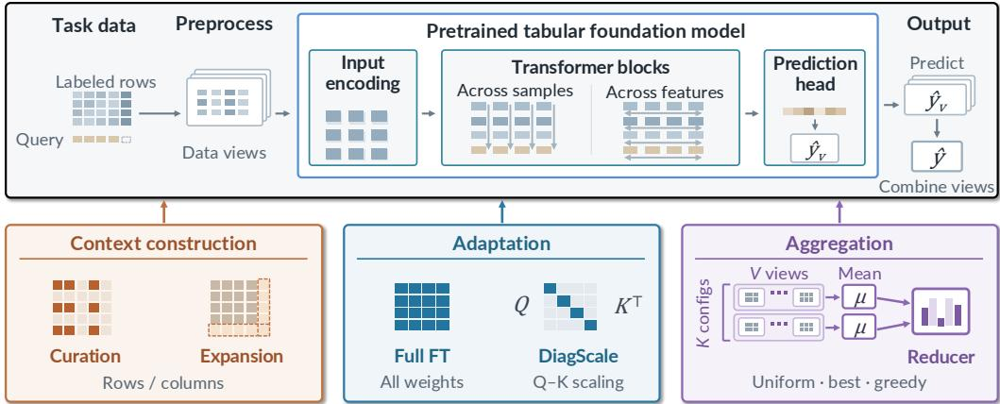  
Figure 1: Three families of test-time compute modify different components of the inference pipeline. Top: an inference pipeline comprising preprocessing, a frozen tabular foundation model, and combination of predictions across data views. Bottom: context construction changes the conditioning data; adaptation changes model parameters; aggregation changes the prediction pool and the rule used to select or combine its members.

For labeled training data D and a query x, we express the inference pipeline as

$$
\begin{array} { r } { \hat { y } ( \pmb { x } ) = \mathcal { R } _ { \pmb { w } } \Big ( \big \{ f _ { \theta _ { m } } \big ( \pmb { x } ; g _ { m } ( D , \pmb { x } ) \big ) \big \} _ { m = 1 } ^ { M } \Big ) . } \end{array}\tag{1}
$$

Here $\theta _ { m }$ is a pretrained or adapted model state; $g _ { m }$ constructs the conditioning rows, columns, and representation; and $\mathcal { R } _ { w }$ combines the M member predictions. The labeled training data may be partitioned for task-specific fitting and validation. Adapted states and fitted reducer weights depend on D, and a constructor that selects rows using the model’s attention also depends on $\theta _ { m }$ (Section 7). Methods may modify several components.

Adaptation changes $\theta _ { m }$ . Restricting the updated parameters controls the family of task-specific corrections and the amount of information needed to estimate them. We compare parameter subsets and test whether a similarity-only correction is sufficient for useful gains.

Aggregation changes the members and their reduction. Individual quality and error complementarity determine what a pool can offer; the reducer and its validation data determine which combination is selected. Uniform averaging uses fixed weights, whereas selecting members or learning their weights requires validation data. This introduces additional design choices concerning the reduction rule and the use of validation data.

Context construction changes $g _ { m }$ . We investigate two directions. First, curation and retrieval select existing rows or columns to form a support set for in-context learning, emphasizing relevant evidence or satisfying capacity constraints. Second, context expansion derives synthetic rows, columns, or labels; we test whether adding this context improves the in-context learning performance of TFMs.

## 4 EVALUATION DESIGN

We study adaptation on TabPFN-3, TabICL v2, and TabFM (Grinsztajn et al., 2026; Qu et al., 2026; Google Research, 2026), and aggregation and context construction on TabPFN-3. We mainly use TabArena (Erickson et al., 2025) as our evaluation benchmark, which comprises 51 classification and regression datasets ranging from 748 to 150,000 rows and covering ten domains, including business and marketing, finance, healthcare, and the natural sciences. We follow its official evaluation protocol (Appendix A.3). Additional datasets for our wide-table and large-row studies are collected from OpenML and evaluated using the splits and reference models specified in Appendices A.3 and D.

We fit Elo ratings from wins, ties, and losses between methods evaluated on the same test splits; Elo rating differences model their expected probabilities of winning against each other (Erickson et al., 2025). We evaluate candidates against 68 fixed reference entries (Table 5), with the fitting setup specified in each experiment. ∆ Elo compares the candidate with its baseline within the same fit. We also report TabArena’s normalized score from the same comparison set, which rescales performance on each dataset to [0, 1] before averaging, and percentage changes in error relative to the baseline. Appendices A.3 and A.4 detail the metrics, aggregation procedures, and evaluation coverage.

## 5 ADAPTATION: A COMPACT SIMILARITY UPDATE

Which parameters should we update? Rubachev et al. (2025) identify full fine-tuning as a practical baseline on TabPFN-v2. We revisit and extend their adaptation menu on TabPFN-3, comparing 25 settings ranging from 1,280 trainable parameters to full fine-tuning. These include LoRA, bias-only tuning, and updates restricted to LayerNorms, embeddings, or selected transformer blocks. Table 8 lists all settings and their results. The sweep asks which parts of the model need to change to obtain the gains of adaptation.

We use a single learning rate for each backbone–adaptation pair across datasets, following the idea of shared hyperparameter defaults (Probst et al., 2019; Holzmüller et al., 2024). Learning rate grids and selection criteria are given in Appendix B.3. Within each run, we select the checkpoint using inner validation and fall back to the pretrained weights if no checkpoint improves validation performance over the pretrained model (Appendix B.2). We evaluate each recipe by adding it separately to the same 68 reference entries (Table 5). Each ∆ Elo is measured against the reference set’s published TabPFN-3 default within that recipe’s fit.

SoftScale stands out in this menu (Table 1). Updating only the pretrained query-scaling modules reaches +26 Elo with 1.03M parameters, close to full fine-tuning at +25 with 58.3M; their normalized scores are 0.703 and 0.704, respectively. This motivates us to examine what the query-side scaling changes and whether a simpler update can retain its benefit.

Table 1: Selected adaptation recipes on TabPFN-3. LoRA uses the rank with the highest Elo. Each fit contains one recipe and the same 68 references; ∆ Elo is relative to the published TabPFN-3 default in that fit. Parameter counts use the regression checkpoint.
<table><tr><td>Setting</td><td>Updated</td><td>Params</td><td>∆ Elo</td><td>Norm. score</td></tr><tr><td>Full fine-tuning</td><td>all trainable weights</td><td>58.3M</td><td>+25</td><td>0.704</td></tr><tr><td>LoRA (r = 16)</td><td>low-rank updates</td><td>3.51M</td><td>+15</td><td>0.684</td></tr><tr><td>Value-output</td><td>Wv, Wo</td><td>12.9M</td><td>+19</td><td>0.693</td></tr><tr><td>Query-key</td><td> $W _ { Q } , W _ { K }$ </td><td>12.9M</td><td>+22</td><td>0.696</td></tr><tr><td>SoftScale</td><td>query-side scaling</td><td>1.03M</td><td>+26</td><td>0.703</td></tr></table>

What SoftScale fine-tuning changes. To improve generalization to longer contexts, TabICL v2 introduced query-aware scalable softmax, which counteracts attention fading as context length grows (Qu et al., 2026). TabPFN-3 adopts this mechanism (Grinsztajn et al., 2026); we refer to fine-tuning its pretrained scaling modules as SoftScale. Within attention layers, each scaling module transforms a query as $\tilde { \mathbf { q } } = \mathbf { q } \odot \pmb { s } ( n ) \odot \pmb { g } ( \pmb { q } )$ , where n is the number of keys in the attention context, s(n) is a learned length-dependent scale, and g is a query-dependent gate. On three diagnostic datasets, we separately fine-tune the networks producing s and g, keeping all other parameters frozen. Training the context-size branch s alone recovers 93–106% of the gain from jointly fine-tuning both branches, compared with 8–16% for the query-dependent gate g (Appendix B.5, Table 11).

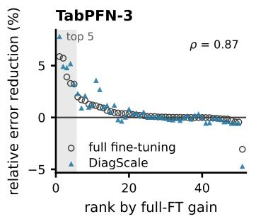

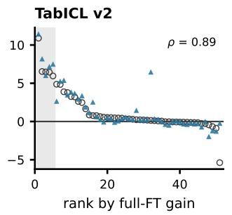

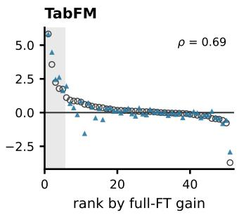  
Figure 2: Per-dataset error reduction for DiagScale and full fine-tuning, relative to the same frozen backbone. Each panel orders 51 datasets by full fine-tuning’s reduction; shading marks its top five. ρ is the Spearman correlation between the two methods’ error reductions.

We further examine how fine-tuning changes the scale vectors on these diagnostic datasets. The learned changes primarily alter the relative scaling of individual dimensions, rather than uniformly rescaling each vector (Appendix Figure 7B). Together with the preceding results, these observations motivate learning dimension-specific query multipliers directly, providing an explicit way to adapt query–key similarity that can also be applied to other TFMs.

DiagScale. For a fixed context size, the scale branch produces one vector per module. Alternatively, we can learn a correction of this form directly, freezing every pretrained parameter. With q denoting the query after its pretrained scaling and k the key, the modified attention logit is

$$
\begin{array} { r } { A _ { \delta } ( q , k ) = q ^ { \top } \big ( I + \mathrm { d i a g } ( \delta ) \big ) k . } \end{array}\tag{2}
$$

Each attention module receives a zero-initialized vector $\delta$ with one entry per head and dimension. The initial mapping equals the frozen model; task loss trains only these multipliers, with training-side checkpoint selection and fallback as specified in Appendix B.2. TabPFN-3 uses 12,672 parameters for regression and 13,056 for classification, including its decoder. At the attention-logit level, DiagScale is equivalent to the key-scaling component of $\mathrm { I A } ^ { \mathrm { \scriptsize \cdot \mathrm { \xi } } }$ (Liu et al., 2022). We investigate whether adapting query–key similarity alone can provide effective adaptation across TFMs.

Table 2: DiagScale and full fine-tuning across three backbones on 51 datasets. Each Elo fit contains one adapted model and 68 fixed references (67 TabArena entries plus frozen TabFM); $\Delta$ Elo is relative to the corresponding reference baseline within that fit. Parameter counts and percentages use regression checkpoints.
<table><tr><td>Backbone</td><td>Backbone params</td><td>Trainable params (% of backbone)</td><td>∆ Elo DiagScale</td><td>∆ Elo Full FT</td></tr><tr><td></td><td></td><td>12.7K (0.022%)</td><td>+26</td><td></td></tr><tr><td>TabPFN-3 TabICL v2</td><td>58.3M 28.5M</td><td>7.3K (0.026%)</td><td>+82</td><td>+25 +77</td></tr><tr><td>TabFM</td><td>1.65B</td><td>53.8K (0.0033%)</td><td>+20</td><td>+28</td></tr></table>

Cross-backbone results. DiagScale achieves gains close to full fine-tuning across all three backbones (Table 2). Its parameter fraction ranges from 0.003% to 0.03%. The per-dataset reductions are correlated with those of full fine-tuning $( \rho = 0 . 6 9 \ – 0 . 8 9 ;$ Figure 2). For both methods, larger improvements are concentrated in a subset of datasets (Figure 2; Appendix E.2). Direct comparisons with full fine-tuning are reported in Appendix Table 9. Together, these results support adapting query–key similarity as an effective alternative to full fine-tuning across these TFMs.

## 6 AGGREGATION: CONFIGURATION BREADTH AND SELECTIVE REDUCTION

Two levels of aggregation. TabPFN-3 already averages multiple predictions under its default inference settings (Hollmann et al., 2025; Ye et al., 2025; Grinsztajn et al., 2026). We investigate how much further aggregation can improve this predictor by increasing the number of predictions within a configuration or combining predictions across configurations. We also examine how the resulting gains depend on the rule used to select or combine these predictions.

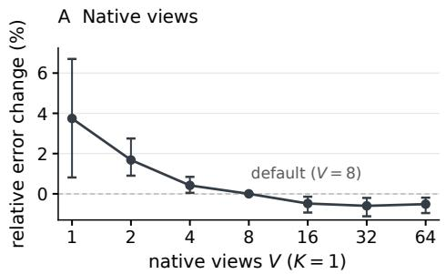

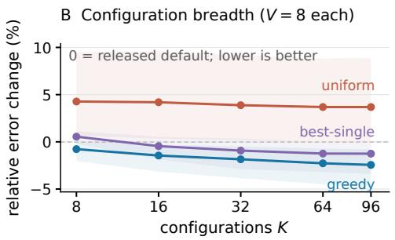  
Figure 3: Aggregation on TabPFN-3. A: varying native views within one configuration. B: varying configuration count under three reducers, with eight native views per configuration. Errors are relative to the released eight-view default; negative values indicate improvement. Error bars and shaded bands show 95% confidence intervals. Complete curves appear in Figure 8.

A configuration specifies the inference and preprocessing settings. Under these settings, the model’s built-in ensemble generates V native views $\bar { ( V = 8 }$ by default): predictions obtained with perturbations such as feature permutations and preprocessing variations. The native aggregation rule $\boldsymbol { A } _ { c }$ combines these views into one member prediction $p _ { c } .$ , using averaging by default. Across K configurations, a reducer selects or combines these members. Writing $f _ { c , v }$ for view v of configuration $c ,$ and $P _ { \mathcal { T } } = \{ p _ { c } : c \in \mathcal { T } \}$ for a pool indexed by $K = | \mathcal { T } |$ configurations, the two levels are

$$
p _ { c } ( \pmb { x } ) = \mathcal { A } _ { c } \big ( \{ f _ { c , v } ( \pmb { x } ) \} _ { v = 1 } ^ { V } \big ) , \qquad \hat { p } ( \pmb { x } ) = \mathcal { R } \big ( P _ { \mathbb { Z } } \big ) ( \pmb { x } ) .\tag{3}
$$

We vary V, K, and the reducer separately, comparing uniform averaging with validation-guided selection and ensembling (Caruana et al., 2004; Erickson et al., 2020; 2025).

We report percentage changes in error relative to the released eight-view default, with calculation details and confidence intervals in Appendix C.3. Elo follows the common protocol in Section 4.

Native-view scaling. Increasing native views beyond the default $V = 8$ yields diminishing returns (Figure 3A). Relative to this default, $V = 1 6$ reduces error by 0.48% and $V = 3 2$ by 0.60% (+21 Elo). Increasing to $V = 6 4$ provides no clear improvement over $V = 3 2$ , which suggests that the gains from native-view averaging have largely saturated. Full results appear in Appendix C.3.

Aggregation across configurations. We next ask whether varying inference configurations provides further gains beyond increasing native views, and how these gains depend on the reducer. We construct a pool of 96 configurations from TabArena’s tuned-TabPFN search space, adapted to TabPFN-3, and evaluate each with eight native views at test time.

Using the same member predictions, we compare three reducers. Uniform averaging gives all members equal weight. Best-single selects the member with the lowest validation loss. Greedy selection (Caruana et al., 2004) builds an ensemble by repeatedly adding the member that minimizes the updated ensemble’s validation loss. Both selection methods use out-of-fold predictions on the training data. Appendix C.2 and Algorithm 1 give the definitions and full procedure.

The same pool produces different outcomes depending on the reducer (Figure 3B). A randomly chosen configuration performs worse than the released default on average. Uniformly averaging all 96 configurations yields a relative error change of +3.68% (95% CI: [+0.02%, +8.86%]). Best-single yields −1.25% (95% CI: [−3.41%, +0.07%]), with an interval that includes zero. Greedy selection yields −2.44% (95% CI: [−4.75%, −0.80%]; +67 Elo), achieving a larger estimated reduction than best-single. Expanding the pool alone therefore does not ensure a gain; how its predictions are selected and combined matters.

We then examine how these comparisons change as the configuration pool grows. For each reducer, we evaluate random subsets of the same 96 configurations and average over draws at each size (Figure 3B). Average error decreases with larger subsets for all three reducers. Uniform averaging remains worse than the default, while best-single’s point estimate is better than the default from $K = 1 6$ onward. Greedy selection achieves a larger estimated error reduction than best-single and performs best with the full K = 96 pool.

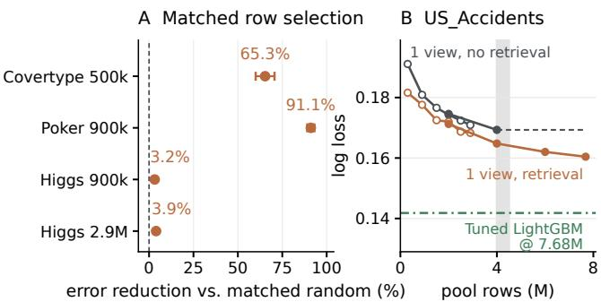

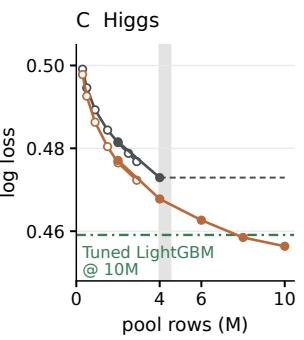  
Figure 4: Row curation on frozen, single-view TabPFN-3. A: error reduction of attention-selected versus matched random rows; 95% paired t intervals over three seeds. B/C: five-seed mean log loss across source-pool sizes. Open and filled points use separate splits from 3M-row subsets and full tables, respectively. Curve labels in B also apply to C. Dashed lines show the no-retrieval loss at 4M rows; shading marks the 4.0–4.5M memory boundary on a single 80 GB GPU.

Dependence on validation data. Since greedy selection uses validation loss to construct the ensemble, we next examine how its gains depend on the amount of validation data available. We hold the 96 configurations and their predictions fixed and vary the fraction of out-of-fold examples used to guide selection. The error grows as fewer examples are available: using all examples reduces error by 2.4%, whereas using one eighth yields an estimated error 0.4% above the default. Thus, the gains from greedy aggregation depend on both the configuration pool and the validation data available for selection. Full results are provided in Appendix C.4.

## 7 CONTEXT CONSTRUCTION: CURATION AND EXPANSION

We investigate two directions for improving predictions through context construction: curating existing rows or columns to form the context, and expanding it with synthetic rows or features. With the backbone frozen, we examine when these changes improve predictions over the original context.

Column curation. TabPFN-3 already handles wide tables through feature subsampling and supports importance-guided selection (Grinsztajn et al., 2026). We evaluate when such selection improves predictions over default sampling. We use TabPFN’s selector, which fits LightGBM on each training split and ranks columns by total split gain (Appendix D.4). We fix the top 200 columns for classification or 500 for regression across all eight views, matching the default per-view counts.

Across seven wide tables, the effects vary substantially. Selection reduces error by 30–67% relative to the default on the genomics, mass-spectrometry, and text datasets, but slightly increases error on three of the four molecular or image datasets. The native importance-based sampler exhibits a similar pattern (Table 23). In a separate comparison that fixes 500 columns across all eight views, importance-based selection reduces error by 66% relative to random selection on amazon-reviews, showing that the choice of columns matters even at the same column budget (Table 22).

Column selection may be particularly useful when the model must identify relevant information among many features from only a few context examples. We test this hypothesis by varying the number of context rows on four wide datasets with relatively large training pools and limited gains from column selection in the initial comparison. Gains increase at small context sizes on three datasets, while CIFAR\_10 shows little change (Appendix D.4).

Attention-guided row selection. Row selection allows the context to be tailored to the queries being predicted. We investigate whether this improves predictions over using all available training rows, even when the full context fits in memory. We adapt the attention-guided retrieval pipeline of LimiX (Zhang et al., 2025) to frozen TabPFN-3. We rank training rows by query-to-context attention, group queries with similar retrieved sets, and predict each group using the union of its retrieved rows (Algorithm 2).

On 15 TabArena datasets, retrieval has mixed effects under the eight-view default: two datasets improve and two worsen, with corrected confidence intervals excluding zero (Appendix D.2). We then evaluate five larger tables using a single native view. At the evaluated sizes where the full context fits in memory, attention-guided retrieval lowers log loss on four of five tables (Table 15).

To test whether the selected rows matter beyond reducing context size, we replace them with uniform random samples of the same size, keeping query groups and the refitting procedure fixed. Attentionselected contexts reduce log loss relative to these matched random contexts by 65% on Covertype, 91% on Poker, and 3–4% on Higgs at two source-pool sizes (Figure 4A). In all four settings, attentionselected contexts outperform the full-context baseline, whereas matched random contexts perform worse. These comparisons indicate that the gains depend on which rows are selected, rather than context reduction alone.

Beyond the memory limit. Retrieval also offers a way to use training pools too large to fit into a single context. In our setup, full-context inference fits 4M training rows on one 80 GB H100 GPU but runs out of memory at 4.5M. We score attention within blocks and combine the retrieved rows, enabling retrieval from pools of up to 10M rows (Appendix D.2). Compared with full-context inference at 4M rows, retrieval reduces log loss by 3.5% on Higgs with a 10M-row pool and 5.2% on US\_Accidents with a 7.68M-row pool, at 3.9 and 2.1 times the baseline’s measured cost, respectively (Figure 4B/C). Within the full-table splits on Higgs, mean log loss decreases as the source pool grows to 10M rows. At the largest evaluated pools, retrieval has lower mean log loss than validation-tuned LightGBM (Ke et al., 2017) on Higgs, but higher on US\_Accidents (Appendix D.2).

A retrieval failure. On COMET\_MC with 900k training rows, attention-guided selection raises log loss from 0.0151 with the full context to 0.2302. To investigate this failure, we replace the selected rows with random samples of the same size, while keeping query groups and refitting fixed. This brings log loss back to 0.0158, indicating that context size alone does not explain the degradation.

Inspecting the retrieved contexts reveals that many queries select the same small set of rows. Retrieval also changes the class composition of the context. The rare class makes up only 1.7% of the training pool, but its share within the retrieved contexts has a median of 40.3%. We replace some retrieved rows to match the training pool’s class proportions, keeping the number of context rows fixed. This reduces log loss from 0.2302 to 0.1270, still well above the full-context value of 0.0151, while AUC falls from 0.950 to 0.569. Thus, this adjustment does not resolve the failure (Appendix D.3). Together with the gains on other datasets, this failure suggests that the benefits of context selection depend on how the selection rule interacts with the characteristics of the data.

Context expansion. Context expansion asks whether adding constructed rows or features can improve predictions from the frozen backbone. We evaluate perturbations and interpolations of training rows, query rows augmented with model-predicted labels, and additional features derived from training-label statistics or out-of-fold predictions. These constructions yield occasional improvements but no consistent gains across the evaluated datasets.

We also investigate whether optimizing the added rows makes expansion more effective. We optimize synthetic rows directly or generate them with an MLP trained through the frozen backbone. In the distillation experiments, the synthetic rows are optimized to support predictions on real training examples on their own, then appended to the original context at inference. These learned additions also fail to yield consistent improvements. The tested expansion strategies therefore provide no reliable gains over the original context (Appendix D.5).

## 8 COMPOSITION, COST, AND VARIATION ACROSS TASKS

We examine whether adaptation and aggregation provide further gains when combined, what computation these gains require, and whether they can be anticipated for a new task. Elo follows the protocol in Section 4; Table 29 lists the evaluated recipes.

Composition. Combining DiagScale with 96-configuration greedy aggregation improves on either intervention alone on TabPFN-3 (Figure 5A). We first adapt TabPFN-3 with DiagScale, then use the adapted model across all 96 configurations for greedy aggregation. The combination gains 93 Elo over the published TabPFN-3 default and reduces error by 2.35% relative to DiagScale alone and 0.64% relative to aggregation alone (Appendix E.1).

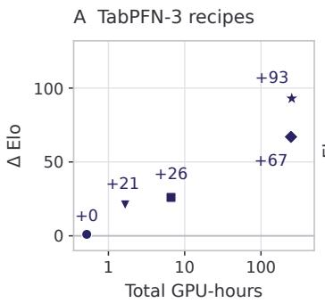

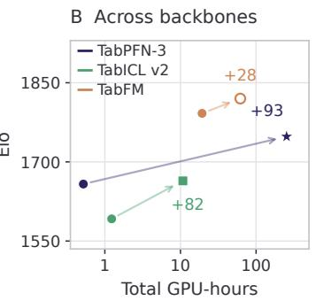

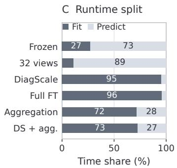  
Frozen 32 native views DiagScale Full fine-tuning Aggregation (96) DiagScale + aggregation  
Figure 5: Performance and runtime on TabArena. (A) TabPFN-3 recipes. (B) Each backbone’s frozen model and highest-Elo evaluated recipe, connected by an arrow. Annotations show ∆ Elo relative to the corresponding reference baseline within each fit. (C) Fitting and prediction time shares for TabPFN-3 recipes. Runtime includes fitting and prediction across 51 datasets (Appendix E.4).

Performance and cost. We compare total fitting and prediction time across the same 51 datasets. On TabPFN-3, 32 native views gain 21 Elo at 1.66 GPU-hours, while DiagScale gains 26 Elo at 6.61 GPU-hours. Aggregation gains 67 Elo at 247.5 GPU-hours. Combining it with DiagScale raises the gain to 93 Elo at 253.1 GPU-hours, a 2.3% cost increase over aggregation alone (Figure 5A).

The methods differ in where they spend computation (Figure 5C). Increasing native views mainly adds prediction cost, while adaptation spends most of its time fitting. DiagScale and full fine-tuning have similar fitting times despite their very different trainable parameter counts, while prediction remains close to the frozen default. Configuration aggregation spends most of its time generating out-of-fold member predictions for selection.

Frozen TabFM achieves a higher Elo than TabPFN-3 with DiagScale and aggregation, at a lower total cost (19.3 vs. 253.1 GPU-hours; Figure 5B). This comparison highlights the importance of backbone choice when allocating task-specific compute. Table 29 gives the full runtime measurements.

Variation and predictability of gains. Benchmark-level gains are unevenly distributed across datasets. Across seven method–backbone combinations involving adaptation or aggregation, the five largest positive per-dataset reductions account for 46–70% of the sum of positive reductions. This variation raises the question of whether gains can be anticipated for a new dataset. For each combination, we examine 21 predictors (dataset size, feature statistics, disagreement among predictions, etc.). Models combining the tested predictors achieve at best a cross-validated R2 of 0.012 when predicting per-dataset error reductions, indicating limited accuracy in predicting gain magnitudes (Appendix E.3).

## 9 DISCUSSION AND CONCLUSION

We systematically study test-time computation for strong tabular foundation models by separating adaptation, aggregation, and context construction. DiagScale shows that a small set of similarity updates can capture much of the fine-tuning gain across three backbones. On TabPFN-3, selective aggregation provides additional gains and combines effectively with DiagScale. Context selection yields substantial improvements on some datasets, whereas the expansion strategies we tested provide no consistent benefit.

These results highlight the value of examining individual design choices within a prediction pipeline. Increasing native views yields diminishing returns, while changing configurations and selecting among their predictions provides further gains. Uniform averaging and greedy selection yield different outcomes from the same pool. Similarly, matched row-selection controls show that the choice of context rows can determine whether selection improves or degrades prediction. These comparisons help distinguish the contribution of each operation from the performance of the full pipeline.

Choosing an appropriate test-time compute recipe for a new dataset remains an open problem. Aggregate benchmark gains do not reliably predict whether a particular recipe will benefit an unseen dataset, and we find that the predictors we tested provide limited guidance at the dataset level. Future work should investigate how model–data interactions determine the effectiveness of different test-time compute strategies and use these signals to guide their selection and composition.

## AI USE STATEMENT

In this work, we used generative AI tools to assist with drafting and polishing parts of the text, retrieving and discovering related work, and writing and refining parts of the software code. We have reviewed all AI-assisted work. We take responsibility for the final content of this work, including text, claims or artifacts produced with the aid of generative AI.

## REPRODUCIBILITY STATEMENT

The main text and appendices describe the model configurations, dataset splits, adaptation and aggregation procedures, and statistical analyses used in our experiments. Additional implementation details and results are provided in Appendices A–E, including runtime measurements and controlled comparisons.

## REFERENCES

Alan Arazi, Eilam Shapira, and Roi Reichart. TabSTAR: A tabular foundation model for tabular data with text fields. In Advances in Neural Information Processing Systems (NeurIPS), 2025. arXiv:2505.18125.

Rich Caruana, Alexandru Niculescu-Mizil, Geoff Crew, and Alex Ksikes. Ensemble selection from libraries of models. In International Conference on Machine Learning (ICML), 2004.

Yilong Chen, Xueying Ding, and Leman Akoglu. VIP-COP: Context optimization for tabular foundation models. arXiv preprint arXiv:2605.12904, 2026.

Nick Erickson, Jonas Mueller, Alexander Shirkov, Hang Zhang, Pedro Larroy, Mu Li, and Alexander Smola. AutoGluon-Tabular: Robust and accurate AutoML for structured data. arXiv preprint arXiv:2003.06505, 2020.

Nick Erickson, Lennart Purucker, Andrej Tschalzev, David Holzmüller, Prateek Mutalik Desai, David Salinas, and Frank Hutter. TabArena: A living benchmark for machine learning on tabular data. In Advances in Neural Information Processing Systems (NeurIPS) Datasets and Benchmarks Track, 2025. arXiv:2506.16791.

Benjamin Feuer, Robin Tibor Schirrmeister, Valeriia Cherepanova, Chinmay Hegde, Frank Hutter, Micah Goldblum, Niv Cohen, and Colin White. TuneTables: Context optimization for scalable prior-data fitted networks. In Advances in Neural Information Processing Systems (NeurIPS), 2024. arXiv:2402.11137.

Google Research. TabFM: A zero-shot foundation model for tabular data. https:// huggingface.co/google/tabfm-1.0.0-pytorch, 2026. Model card.

Léo Grinsztajn, Klemens Flöge, Oscar Key, et al. TabPFN-3: Technical report. arXiv preprint arXiv:2605.13986, 2026. URL https://arxiv.org/abs/2605.13986.

Noah Hollmann, Samuel Müller, Katharina Eggensperger, and Frank Hutter. TabPFN: A transformer that solves small tabular classification problems in a second. In International Conference on Learning Representations (ICLR), 2023. arXiv:2207.01848.

Noah Hollmann, Samuel Müller, Lennart Purucker, Arjun Krishnakumar, Max Körfer, Shi Bin Hoo, Robin Tibor Schirrmeister, and Frank Hutter. Accurate predictions on small data with a tabular foundation model. Nature, 637(8045):319–326, 2025. doi: 10.1038/s41586-024-08328-6.

David Holzmüller, Léo Grinsztajn, and Ingo Steinwart. Better by default: Strong pre-tuned MLPs and boosted trees on tabular data. In Advances in Neural Information Processing Systems, volume 37, 2024. URL https://arxiv.org/abs/2407.04491.

Edward J. Hu, Yelong Shen, Phillip Wallis, Zeyuan Allen-Zhu, Yuanzhi Li, Shean Wang, Lu Wang, and Weizhu Chen. LoRA: Low-rank adaptation of large language models. In International Conference on Learning Representations, 2022. URL https://arxiv.org/abs/2106. 09685.

Benjamin Jäger, Nick Erickson, Léo Grinsztajn, et al. TabPFN-3.5: Technical report. arXiv preprint arXiv:2609.17895, 2026. URL https://arxiv.org/abs/2609.17895.

Guolin Ke, Qi Meng, Thomas Finley, Taifeng Wang, Wei Chen, Weidong Ma, Qiwei Ye, and Tie-Yan Liu. LightGBM: A highly efficient gradient boosting decision tree. In Advances in Neural Information Processing Systems, volume 30, pp. 3146–3154, 2017. URL https://proceedings.neurips.cc/paper/2017/hash/ 6449f44a102fde848669bdd9eb6b76fa-Abstract.html.

Myung Jun Kim, Léo Grinsztajn, and Gaël Varoquaux. CARTE: Pretraining and transfer for tabular learning. In International Conference on Machine Learning (ICML), volume 235 of PMLR, pp. 23843–23866, 2024. arXiv:2402.16785.

Seunghan Lee. Mitigating label shift in tabular in-context learning via test-time posterior adjustment. In International Conference on Machine Learning (ICML), 2026. URL https://openreview. net/forum?id=8N2kUoknvy.

Yingcong Li, Xiangyu Chang, Muti Kara, Xiaofeng Liu, Amit Roy-Chowdhury, and Samet Oymak. When and how unlabeled data provably improve in-context learning. In Advances in Neural Information Processing Systems (NeurIPS), 2025. arXiv:2506.15329.

Haokun Liu, Derek Tam, Mohammed Muqeeth, Jay Mohta, Tenghao Huang, Mohit Bansal, and Colin Raffel. Few-shot parameter-efficient fine-tuning is better and cheaper than in-context learning. In Advances in Neural Information Processing Systems, 2022. URL https://arxiv.org/abs/ 2205.05638.

Junwei Ma, Valentin Thomas, Rasa Hosseinzadeh, Alex Labach, Hamidreza Kamkari, Jesse C. Cresswell, Keyvan Golestan, Guangwei Yu, Anthony L. Caterini, and Maksims Volkovs. TabDPT: Scaling tabular foundation models on real data. In Advances in Neural Information Processing Systems (NeurIPS), 2025. arXiv:2410.18164.

Samuel Müller, Noah Hollmann, Sebastian Pineda Arango, Josif Grabocka, and Frank Hutter. Transformers can do Bayesian inference. In International Conference on Learning Representations (ICLR), 2022. arXiv:2112.10510.

Claude Nadeau and Yoshua Bengio. Inference for the generalization error. In Advances in Neural Information Processing Systems, volume 12, 1999. URL https://proceedings.nips.cc/paper\_files/paper/1999/hash/ 7d12b66d3df6af8d429c1a357d8b9e1a-Abstract.html.

Kanghui Ning, Yushan Jiang, Kashif Rasul, Anderson Schneider, Yuriy Nevmyvaka, and Dongjin Song. TimeRouter: Efficient and adaptive routing of time-series foundation models. arXiv preprint arXiv:2606.11625, 2026. URL https://arxiv.org/abs/2606.11625.

Philipp Probst, Anne-Laure Boulesteix, and Bernd Bischl. Tunability: Importance of hyperparameters of machine learning algorithms. Journal ofMachine Learning Research, 20(53):1–32, 2019. URL https://www.jmlr.org/papers/v20/18-444.html.

Jingang Qu, David Holzmüller, Gaël Varoquaux, and Marine Le Morvan. TabICL: A tabular foundation model for in-context learning on large data. In International Conference on Machine Learning (ICML), 2025. arXiv:2502.05564.

Jingang Qu, David Holzmüller, Gaël Varoquaux, and Marine Le Morvan. TabICLv2: A better, faster, scalable, and open tabular foundation model. arXiv preprint arXiv:2602.11139, 2026.

Ivan Rubachev, Akim Kotelnikov, Nikolay Kartashev, and Artem Babenko. On finetuning tabular foundation models. arXiv preprint arXiv:2506.08982, 2025.

David Salinas and Nick Erickson. TabRepo: A large scale repository of tabular model evaluations and its AutoML applications. In International Conference on Automated Machine Learning (AutoML), 2024. arXiv:2311.02971.

Renat Sergazinov and Shao-An Yin. Chunked TabPFN: Exact training-free in-context learning for long-context tabular data. arXiv preprint arXiv:2509.00326, 2025.

Charlie Snell, Jaehoon Lee, Kelvin Xu, and Aviral Kumar. Scaling LLM test-time compute optimally can be more effective than scaling parameters for reasoning. In International Conference on Learning Representations (ICLR), 2025. arXiv:2408.03314.

Marco Spinaci, Marek Polewczyk, Maximilian Schambach, and Sam Thelin. ConTextTab: A semantics-aware tabular in-context learner. In Advances in Neural Information Processing Systems (NeurIPS), 2025. arXiv:2506.10707; open-source release SAP-RPT-1-OSS.

Yu Sun, Xiaolong Wang, Zhuang Liu, John Miller, Alexei A. Efros, and Moritz Hardt. Testtime training with self-supervision for generalization under distribution shifts. In International Conference on Machine Learning (ICML), 2020. arXiv:1909.13231.

Valentin Thomas, Junwei Ma, Rasa Hosseinzadeh, Keyvan Golestan, Guangwei Yu, Maksims Volkovs, and Anthony Caterini. Retrieval & fine-tuning for in-context tabular models. In Advances in Neural Information Processing Systems (NeurIPS), 2024. arXiv:2406.05207 (LoCalPFN).

Dequan Wang, Evan Shelhamer, Shaoteng Liu, Bruno Olshausen, and Trevor Darrell. Tent: Fully test time adaptation by entropy minimization. In International Conference on Learning Representations (ICLR), 2021. arXiv:2006.10726.

Xuezhi Wang, Jason Wei, Dale Schuurmans, Quoc Le, Ed Chi, Sharan Narang, Aakanksha Chowdhery, and Denny Zhou. Self-consistency improves chain of thought reasoning in language models. In International Conference on Learning Representations (ICLR), 2023. arXiv:2203.11171.

Yangzhen Wu, Zhiqing Sun, Shanda Li, Sean Welleck, and Yiming Yang. Inference scaling laws: An empirical analysis of compute-optimal inference for LLM problem-solving. In International Conference on Learning Representations (ICLR), 2025. arXiv:2408.00724.

Derek Xu, Olcay Cirit, Reza Asadi, Yizhou Sun, and Wei Wang. Mixture of in-context prompters for tabular PFNs. In International Conference on Learning Representations (ICLR), 2025. arXiv:2405.16156.

Han-Jia Ye, Si-Yang Liu, and Wei-Lun Chao. A closer look at TabPFN v2: Understanding its strengths and extending its capabilities. In Advances in Neural Information Processing Systems (NeurIPS), 2025. arXiv:2502.17361.

Xingxuan Zhang, Gang Ren, Han Yu, Hao Yuan, Hui Wang, Jiansheng Li, Jiayun Wu, Lang Mo, Li Mao, et al. LimiX: Unleashing structured-data modeling capability for generalist intelligence. arXiv preprint arXiv:2509.03505, 2025.

Xingxuan Zhang, Gang Ren, Hao Yuan, et al. LimiX-2: A contextual mechanism network towards general structured-data intelligence. arXiv preprint arXiv:2609.17488, 2026. URL https: //arxiv.org/abs/2609.17488.

Bingzhao Zhu, Xingjian Shi, Nick Erickson, Mu Li, George Karypis, and Mahsa Shoaran. XTab: Cross-table pretraining for tabular transformers. In International Conference on Machine Learning (ICML), 2023. arXiv:2305.06090.

## A EVALUATION AND REPRODUCIBILITY DETAILS

## A.1 BACKBONES AND MODEL IMPLEMENTATIONS

We use three independently pretrained in-context tabular FMs: the open-source base checkpoint of TabPFN-3 (Grinsztajn et al., 2026) with 53.2–58.3M parameters, which is our primary backbone; TabICL v2 (Qu et al., 2026) with 27.6–28.5M parameters; and TabFM (Google Research, 2026) with 1.64–1.65B parameters, released under a non-commercial licence for research use. TFM experiments run on a single 80 GB H100; the LightGBM row references use CPUs. TabPFN-3 and TabFM are evaluated in bfloat16; TabICL v2 is evaluated with automatic mixed precision disabled.

Base evaluations use the released packages; adaptation uses project forks of TabICL and TabFM with parameter-efficient hooks. Package versions, fork commits, and environment specifications accompany the code.

For Elo, the baselines are the published TabPFN-3 and TabICLv2 reference entries and the frozen TabFM reproduction of Appendix A.2. Paired-error comparisons use the reproduced frozen configurations with matching runner and inference settings. These baselines are not identical: reproduced frozen TabICL v2 scores about 9 Elo above its published default, so Elo gains relative to that default also include the inference-setting difference. Adapter parameter counts and fine-tuning hyperparameters are given with the adaptation methods in Appendices B.1–B.3.

## A.2 TABFM REPRODUCTION

TabFM’s released TabArena reference results were produced with the JAX backend on TPU with device sharding. We reproduce them with the released PyTorch backend on one 80 GB H100. The pretrained weights, the default preset of 32 augmented views, logit-mean blending, n\_estimators = 32, serial per-view evaluation, the softmax temperature, and the normalization methods are taken from the released implementation. Our reproduction differs from the reference in the following respects.

The backend is PyTorch rather than JAX and runs on one GPU without sharding. The backbone runs in bfloat16 rather than the backend’s fp32 default, which halves activation memory and allows wide and large tables to run at full context. TF32 matmul is enabled. Tall-and-wide tables receive a conditional feature cap: a table keeps the estimator’s default of 500 features when train rows × min(features, 500) ≤ 5M cells, and otherwise falls back to 100 features. This changes the feature count on APSFailure, kddcup09\_appetency, and Amazon\_employee\_access; the other 48 datasets retain the reference’s setting. Finally, our runner wraps the estimator in the benchmark’s model interface, which applies the benchmark’s standard preprocessing before the estimator sees the data, where the reference ran the standalone estimator.

TabFM was released after the TabArena snapshot and has no official leaderboard entry, so the comparison is against the released per-dataset reference numbers rather than an official score. Across the 51 datasets the median absolute relative difference in task error is 0.22%, with 47 within 5% and 42 within 2%, and our run matches or improves on the reference on 34. Table 3 gives the per-dataset comparison.

Table 3: Single-H100 reproduction of TabFM. Per-dataset error for the TPU/JAX reference against our bfloat16 H100 run on all 51 TabArena datasets, with ∆ = (ours − reference)/reference, so a negative value means our run has the lower error. All quantities are errors, lower is better.
<table><tr><td>Dataset</td><td>Reference (TPU/JAX)</td><td>Ours (bf16, H100)</td><td>∆%</td></tr><tr><td>Binary — reported as 1–AUC (30 datasets)</td><td></td><td></td><td></td></tr><tr><td>Amazon_employee_access</td><td>0.1416</td><td>0.1419</td><td>+0.24</td></tr><tr><td>APSFailure</td><td>0.007387</td><td>0.005329</td><td>-27.85</td></tr><tr><td>bank-marketing</td><td>0.2309</td><td>0.2306</td><td>-0.13</td></tr><tr><td>Bank_Customer_Churn</td><td>0.1229</td><td>0.1233</td><td>+0.30</td></tr><tr><td>Bioresponse</td><td>0.1178</td><td>0.1136</td><td>-3.55</td></tr><tr><td>blood-transfusion-service-center</td><td>0.2442</td><td>0.2442</td><td>-0.00</td></tr><tr><td>churn</td><td>0.06743</td><td>0.06663</td><td>-1.19</td></tr></table>

continued on next page

<table><tr><td>Dataset</td><td>Reference (TPU/JAX)</td><td>Ours (bf16, H100)</td><td>∆%</td></tr><tr><td>coil2000_insurance_policies</td><td>0.2124</td><td>0.2122</td><td>-0.13</td></tr><tr><td>credit-g</td><td>0.1942</td><td>0.1942</td><td>+0.00</td></tr><tr><td>credit_card_clients_default</td><td>0.2068</td><td>0.2069</td><td>+0.04</td></tr><tr><td>customer_satisfaction_in_airline</td><td>0.003939</td><td>0.003793</td><td>-3.71</td></tr><tr><td>diabetes</td><td>0.158</td><td>0.1579</td><td>-0.04</td></tr><tr><td>Diabetes130US</td><td>0.3292</td><td>0.3299</td><td>+0.23</td></tr><tr><td>E-CommereShippingData Fitness_Club</td><td>0.2576</td><td>0.2574</td><td>-0.07</td></tr><tr><td></td><td>0.1789</td><td>0.1787</td><td>-0.10</td></tr><tr><td>GiveMeSomeCredit</td><td>0.1313</td><td>0.1312</td><td>-0.07</td></tr><tr><td>hazelnut-spread-contaminant-detection</td><td>0.002297</td><td>0.002257</td><td>-1.73</td></tr><tr><td>heloc HR_Analytics_Job_Change_of_Data_Scientists</td><td>0.1977</td><td>0.1974</td><td>-0.19</td></tr><tr><td></td><td>0.1938</td><td>0.1933</td><td>-0.22</td></tr><tr><td>in_vehicle_coupon_recommendation</td><td>0.1512</td><td>0.1526</td><td>+0.92</td></tr><tr><td>Is-this-a-good-customer</td><td>0.2469</td><td>0.2464</td><td>-0.18</td></tr><tr><td>jm1</td><td>0.2106</td><td>0.2107</td><td>+0.03</td></tr><tr><td>kddcup09_appetency</td><td>0.1559</td><td>0.1596</td><td>+2.37</td></tr><tr><td>Marketing_Campaign</td><td>0.07298</td><td>0.07356</td><td>+0.80</td></tr><tr><td>NATICUSdroid</td><td>0.01136</td><td>0.01139</td><td>+0.29</td></tr><tr><td>online_shoppers_intention</td><td>0.06036</td><td>0.06007</td><td>-0.48</td></tr><tr><td>polish_companies_bankruptcy</td><td>0.005806</td><td>0.004699</td><td>-19.06</td></tr><tr><td>qsar-biodeg seismic-bumps</td><td>0.05805</td><td>0.05804</td><td>-0.02</td></tr><tr><td>taiwanese_bankruptcy_prediction</td><td>0.206</td><td>0.2061</td><td>+0.02</td></tr><tr><td></td><td>0.0503</td><td>0.04909</td><td>-2.39</td></tr><tr><td>Multiclass — log loss (8 datasets)</td><td></td><td></td><td></td></tr><tr><td>anneal hiva_agnostic</td><td>0.01609</td><td>0.0132</td><td>-17.96</td></tr><tr><td>maternal_health_risk</td><td>0.206</td><td>0.1774</td><td>-13.88</td></tr><tr><td>MIC</td><td>0.3711</td><td>0.3706</td><td>-0.12</td></tr><tr><td>SDSS17</td><td>0.4289</td><td>0.4306</td><td>+0.40</td></tr><tr><td>splice</td><td>0.06969</td><td>0.0693</td><td>-0.56</td></tr><tr><td>students_dropout_and_academic_success</td><td>0.09589</td><td>0.09596</td><td>+0.07</td></tr><tr><td>website_phishing</td><td>0.5072</td><td>0.5078</td><td>+0.13</td></tr><tr><td>Regression — RMSE (13 datasets)</td><td>0.2108</td><td>0.2102</td><td>-0.29</td></tr><tr><td>airfoil_self_noise</td><td></td><td></td><td></td></tr><tr><td>Another-Dataset-on-used-Fiat-500</td><td>1.071</td><td>1.072</td><td>+0.07</td></tr><tr><td>concrete_compressive_strength</td><td>703.6 3.986</td><td>703.4 3.97</td><td>-0.04</td></tr><tr><td>diamonds</td><td></td><td>496.5</td><td>-0.40</td></tr><tr><td>Food_Delivery_Time</td><td>499.7</td><td></td><td>-0.64</td></tr><tr><td>healthcare_insurance_expenses</td><td>7.33</td><td>7.333</td><td>+0.04</td></tr><tr><td></td><td>4420.1</td><td>4407.6</td><td>-0.28</td></tr><tr><td>houses</td><td>0.1816</td><td>0.1815</td><td>-0.08</td></tr><tr><td>miami_housing</td><td>74223.7</td><td>74051.8</td><td>-0.23</td></tr><tr><td>physiochemical_protein</td><td>2.888</td><td>2.886</td><td>-0.07</td></tr><tr><td>QSAR-TID-11</td><td>0.7548</td><td>0.7357</td><td>-2.52</td></tr><tr><td>QSAR_fish_toxicity</td><td>0.8535</td><td>0.8537</td><td>+0.02</td></tr><tr><td>superconductivity</td><td>8.952</td><td>8.941</td><td>-0.12</td></tr><tr><td>wine_quality</td><td>0.5864</td><td>0.5864</td><td>-0.00</td></tr></table>

## A.3 DATASETS, SPLITS, AND EVALUATION COVERAGE

TabArena. The benchmark comprises 51 curated datasets: 30 binary classification, 8 multiclass, and 13 regression. They range from 748 to 150,000 rows (median 6,497) and from 4 to 1,776 features (median 17). We use three-fold cross-validation, with 10 repeats for the 17 datasets below 2,500 rows and 3 repeats for the remaining 34. Each dataset–repeat–fold evaluation is a cell: the full protocol has $1 7 \times 3 0 + 3 4 \times 9 = 8 1 6$ cells, and the first repeat has 51 × 3 = 153. All reported Elo ratings use the full protocol. Controlled subsets are identified in their respective tables or captions. Per-dataset identifiers, sizes, task types, and metrics follow the benchmark.

External tables. Row curation is additionally studied on five raw OpenML tables larger than the TabArena datasets (Table 4). For each of five seeds we draw a 50,000-row test set and sample context pools of varying sizes from the remaining rows. Methods within a comparison share the same seed-specific partition. These are study-specific random partitions, not published OpenML task splits. Table 4 distinguishes total source rows from the largest evaluated pool; final context sizes are reported with each method in Appendix D.2. Wide-table datasets and their splits are specified in Appendix D.4. External-table results use task errors rather than Elo.

## A.4 METRICS AND REFERENCE MODELS

Task metrics. Tasks are scored with TabArena’s official metrics (Erickson et al., 2025): ROC AUC for binary classification, log loss for multiclass classification, and RMSE for regression. We use TabArena’s metric implementation, including its probability handling for log loss. All comparisons use a lower-is-better error e: $1 - \mathrm { A U C }$ for binary tasks, log loss for multiclass tasks, and RMSE for regression. The external context studies state their metrics separately in Appendix D; the large-row studies use log loss.

Elo and the comparison field. Let $e _ { m , d , c }$ be method m’s error in cell c of dataset $d ,$ and let $C _ { d }$ be the number of cells for that dataset. Each pair of methods is compared within each cell: the lower error wins, and an exact tie contributes half a win to each. TabArena fits all ratings jointly under the Bradley–Terry model

$$
P ( m { \mathrm { ~ b e a t s ~ } } j ) = \frac { 1 } { 1 + 1 0 ^ { \left( R _ { j } - R _ { m } \right) / 4 0 0 } } .\tag{4}
$$

The fit maximizes the weighted pairwise log likelihood, with cell weight $1 / C _ { d }$ so that each dataset contributes equally to each method pair. We use TabArena’s logistic-regression solver and shift all fitted ratings to set RandomForest (default) to 1000. Higher Elo is better; the displayed ratings are rounded to integers. All reported Elo results, including the adaptation menu, cross-backbone comparisons, aggregation, and composition, use the same 68 reference entries (Table 5): the 67 TabArena entries plus frozen TabFM. The reference field includes tuned classical learners, gradientboosted trees, tabular foundation models, and AutoGluon. Each candidate is inserted separately, yielding a 69-entry fit. Within that fit, $\Delta$ Elo is measured against the published TabPFN-3 or TabICLv2 default, or against frozen TabFM for TabFM adaptations. We compute the difference before rounding it to an integer, and use unrounded differences to select learning rates in the adaptation-menu sweep. The reference predictions are fixed, but their fitted ratings may change with the candidate; we therefore use the baseline rating from that candidate’s fit for every difference. Paired-error interval are defined separately below.

Normalized score. The Score column in the adaptation sweep is TabArena’s normalized score. First average errors over cells within each dataset, $\begin{array} { r } { { \dot { \bar { e } } } _ { m , d } = C _ { d } ^ { - 1 } \sum _ { c } e _ { m , d , c } } \end{array}$ . Within the comparison field, let $a _ { d } = \operatorname* { m i n } _ { m } \bar { e } _ { m , d }$ and $b _ { d } = \mathrm { m e d i a n } _ { m } \bar { e } _ { m , d } .$ . The reported score is

$$
\mathrm { S c o r e } _ { m } = \frac { 1 } { D } \sum _ { d = 1 } ^ { D } \left[ 1 - \mathrm { c l i p } _ { [ 0 , 1 ] } \left( \frac { \bar { e } _ { m , d } - a _ { d } } { \operatorname* { m a x } ( b _ { d } - a _ { d } , 1 0 ^ { - 5 } ) } \right) \right] ,\tag{5}
$$

where $D$ is the number of datasets. Higher is better, and the score lies in [0, 1]. The best method on a dataset receives 1; errors at least max $( b _ { d } - a _ { d } , 1 0 ^ { - 5 } )$ above the best receive 0. Like Elo, this score depends on the comparison field.

Paired error changes and uncertainty. For a fixed reference method $b ,$ the benchmark-level paired summary first averages log error ratios within each dataset and then weights datasets equally:

$$
\ell _ { d } = \frac { 1 } { C _ { d } } \sum _ { c } \log \frac { e _ { m , d , c } } { e _ { b , d , c } } , \qquad \Delta _ { \mathrm { e r r o r } } ( \mathcal { Y } _ { 0 } ) = 1 0 0 \left[ \exp \left( \frac { 1 } { D } \sum _ { d } \ell _ { d } \right) - 1 \right] .\tag{6}
$$

Negative values indicate improvement. We form 95% percentile intervals from 10,000 bootstrap resamples of datasets, retaining all cells within each sampled dataset and applying the same exponen tial transformation to the interval endpoints. These intervals condition on the selected recipes. In these summaries, Wins counts datasets with $\ell _ { d } < 0$ . The adaptation tables also summarize per-dataset relative changes $r _ { d } = 1 0 0 ( \bar { e } _ { m , d } / \bar { e } _ { b , d } - 1 )$ , where e¯ averages cell errors within a dataset; their mean is the arithmetic average of $r _ { d } ,$ , with negative values indicating improvement. The per-dataset gaindistribution analyses instead use $1 0 0 ( 1 - \bar { e } _ { m , d } / \bar { e } _ { b , d } )$ , for which positive values indicate improvement (Appendix E.2). This ratio of arithmetic mean errors and the mean log ratio are different summaries, so their win counts can differ.

Table 4: External OpenML tables used for row curation. Predictors and task type are the effective inputs seen by the model. Largest pool is the biggest context pool evaluated. The US\_Accidents and COMET pools use all remaining rows after the 50,000-row holdout; Higgs is capped at 10M.
<table><tr><td>Dataset</td><td>OpenML ID</td><td>Total rows</td><td>Predictors</td><td>Task</td><td>Largest pool</td></tr><tr><td>Higgs</td><td>45570</td><td>11,000,000</td><td>28</td><td>binary</td><td>10,000,000</td></tr><tr><td>US_Accidents</td><td>46650</td><td>7,728,394</td><td>43</td><td>4-class</td><td>7,678,394</td></tr><tr><td>COMET_MC</td><td>5889</td><td>7,619,400</td><td>4</td><td>binary</td><td>7,569,400</td></tr><tr><td>Poker-Hand</td><td>1567</td><td>1,025,009</td><td>10</td><td>10-class</td><td>900,000</td></tr><tr><td>Covertype</td><td>1596</td><td>581,012</td><td>54</td><td>7-class</td><td>500,000</td></tr></table>

Selection and information sources. Task-specific choices, including checkpoints and reducer weights, use validation or out-of-fold predictions within the training split. Study-level learning rates are selected using aggregate test performance on the same benchmark used to report results, rather than on held-out tasks; both TabFM methods use a five-dataset subset, and each selected rate is shared across datasets (Appendix B.3).

Reference entries. Table 5 lists the 68 fixed references: 67 TabArena entries and our frozen TabFM reproduction. The count refers to benchmark entries, including separate default, tuned, and tuned + ensembled variants, rather than model families. We retain TabArena’s published variant names and reference results (Erickson et al., 2025); reused TabArena and TabRepo predictions (Salinas & Erickson, 2024) supply the reference field. Missing reference results are filled using the benchmark’s default RandomForest fallback; the table gives the dataset-weighted imputation percentage. All evaluated recipes and the frozen TabFM reference have complete results and zero imputation.

Table 5: The 68 reference entries used in every Elo comparison. Imputed (%) records benchmark fallback results. The published TabPFN-3 and TabICLv2 defaults are distinct from our reproduced frozen models.
<table><tr><td>Reference entry</td><td>Imputed (%)</td></tr><tr><td>TabFM (frozen reproduction)</td><td>0</td></tr><tr><td>AutoGluon 1.5 (extreme, 4h)</td><td>0</td></tr><tr><td>TabPFN-3 (default)</td><td>0</td></tr><tr><td>TabPFN-2.6 (default)</td><td>0</td></tr><tr><td>TabICLv2 (default)</td><td>0</td></tr><tr><td>RealTabPFN-2.5 (tuned + ensembled)</td><td>0</td></tr><tr><td>RealTabPFN-2.5 (tuned)</td><td>0</td></tr><tr><td>RealTabPFN-2.5 (default)</td><td>0</td></tr><tr><td>AutoGluon 1.4 (best, 4h)</td><td>0</td></tr><tr><td>RealMLP (tuned + ensembled)</td><td>0</td></tr><tr><td>TabDPT (tuned + ensembled)</td><td>0</td></tr><tr><td>TabM (tuned + ensembled)</td><td>0</td></tr><tr><td>LightGBM (tuned + ensembled)</td><td>0</td></tr><tr><td>RealMLP (tuned)</td><td>0</td></tr><tr><td>CatBoost (tuned + ensembled)</td><td>0</td></tr><tr><td>CatBoost (tuned)</td><td>0</td></tr><tr><td>TabDPT (tuned)</td><td>0</td></tr><tr><td>iLTM (tuned + ensembled)</td><td>0</td></tr><tr><td>TabM (tuned)</td><td>0</td></tr><tr><td>ModernNCA (tuned + ensembled)</td><td>0</td></tr><tr><td>LightGBM (tuned)</td><td>0</td></tr><tr><td>XGBoost (tuned + ensembled)</td><td>0</td></tr><tr><td>CatBoost (default)</td><td>0</td></tr><tr><td>ModernNCA (tuned)</td><td>0</td></tr><tr><td>XGBoost (tuned)</td><td>0</td></tr><tr><td>xRFM (tuned + ensembled)</td><td>0</td></tr><tr><td>TabPFNv2 (tuned + ensembled)</td><td>35.29</td></tr><tr><td>Mitra (default)</td><td>35.29</td></tr><tr><td>TabDPT (default)</td><td>0</td></tr><tr><td>TabICL (default)</td><td>29.41</td></tr><tr><td>xRFM (tuned)</td><td>0</td></tr><tr><td>TabM (default)</td><td>0</td></tr><tr><td>iLTM (tuned)</td><td>0</td></tr><tr><td>TabPFNv2 (tuned)</td><td>35.29</td></tr><tr><td>TorchMLP (tuned + ensembled)</td><td>0</td></tr><tr><td>EBM (tuned + ensembled)</td><td>0</td></tr><tr><td>TabPFNv2 (default)</td><td>35.29</td></tr><tr><td>ModernNCA (default)</td><td>0</td></tr><tr><td>EBM (tuned)</td><td>0</td></tr><tr><td>RealMLP (default)</td><td>0</td></tr><tr><td>XGBoost (default)</td><td>0</td></tr><tr><td>TorchMLP (tuned)</td><td>0</td></tr><tr><td>FastaiMLP (tuned + ensembled)</td><td>0</td></tr><tr><td>EBM (default)</td><td>0</td></tr><tr><td>ExtraTrees (tuned + ensembled)</td><td>0</td></tr><tr><td>LightGBM (default)</td><td>0</td></tr><tr><td>RandomForest (tuned + ensembled)</td><td>0</td></tr><tr><td>ExtraTrees (tuned)</td><td>0</td></tr><tr><td>FastaiMLP (tuned)</td><td>0</td></tr><tr><td>RandomForest (tuned)</td><td>0</td></tr><tr><td>TabSTAR (tuned)</td><td>0</td></tr><tr><td>TabSTAR (tuned + ensembled)</td><td>0</td></tr><tr><td>iLTM (default)</td><td>0</td></tr><tr><td>PerpetualBooster (tuned + ensembled)</td><td>0</td></tr><tr><td>TorchMLP (default)</td><td>0</td></tr><tr><td>PerpetualBooster (tuned)</td><td>0</td></tr><tr><td>xRFM (default)</td><td>0</td></tr><tr><td>FastaiMLP (default)</td><td>0</td></tr><tr><td>TabSTAR (default)</td><td>0</td></tr><tr><td>RandomForest (default)</td><td>0</td></tr><tr><td>KNN (tuned + ensembled)</td><td>0</td></tr><tr><td>ExtraTrees (default)</td><td>0</td></tr><tr><td>Linear (tuned + ensembled)</td><td>0</td></tr><tr><td>Linear (tuned)</td><td>0</td></tr><tr><td>PerpetualBooster (default)</td><td>0</td></tr><tr><td>KNN (tuned)</td><td>0</td></tr><tr><td>Linear (default)</td><td>0</td></tr><tr><td>KNN (default)</td><td>0</td></tr></table>

## B ADAPTATION: IMPLEMENTATION AND ADDITIONAL RESULTS

## B.1 ADAPTATION METHODS AND PARAMETERIZATIONS

The sweep contains three families. Fullfine-tuning updates all trainable weights. Selective settings freeze the backbone except for a named subset of modules: sets of projections within attention (query–key, value–out, the attention out-projection alone), whole sublayer types (all attention, all MLP), depth ranges (the first one to three ICL blocks with the embeddings, the middle three blocks, four blocks spread through the stack, the last one to three blocks with the head), and individual small components (all LayerNorms, all biases, the inducing vectors, the input/feature/label embeddings, the decoder head, the label encoder, the softmax-scaling modules). LoRA (Hu et al., 2022) inserts low-rank adapters of rank 4, 8, or 16 on every linear layer. Table 8 lists all 25.

DiagScale. On TabPFN-3, each softmax-scaling module is replaced by a wrapper that keeps the pretrained scale network frozen and multiplies its output by 1 + δ, with δ zero-initialized and one entry per (head, dimension). All scaling modules are adapted. On TabICL v2 and TabFM, the multiplier is registered in each attention module and applied to the final query before the attention dot product, after the backbone’s own query transformations. At δ = 0, DiagScale reproduces the frozen backbone exactly. These adapters are kept in float32 and cast to the attention compute dtype in the forward pass. The evaluated implementations retain the multiplicative adapters during inference.

The trainable parameter count on TabPFN-3 is task-dependent. The backbone builds three scaling modules in the feature embedder $( 3 \times 1 2 8 = 3 8 4$ entries) and 24 in the ICL blocks $( 2 4 \times 5 1 2 \stackrel { - } { = }$ 12,288), and adds one in the many-class decoder (384) only when the task type is classification. DiagScale therefore trains 12,672 parameters on a regression task and 13,056 on a classification task. Table 2 reports regression counts for all three backbones; the benchmark uses both versions across its 38 classification and 13 regression datasets. DiagScale trains 7,296 parameters on TabICL v2 and 53,760 on TabFM for either task type. Table 6 divides these counts by each task type’s complete checkpoint, counting model parameters rather than only attention weights or an unfrozen subset. Checkpoint buffers are excluded.

Table 6: Exact checkpoint and DiagScale parameter counts. Classification and regression use separate checkpoints. Full-model counts include fixed parameters. Percentages are rounded.
<table><tr><td>Backbone</td><td>Task</td><td>Full checkpoint</td><td>DiagScale</td><td>Fraction (%)</td></tr><tr><td>TabPFN-3</td><td>Classification</td><td>53,153,144</td><td>13,056</td><td>0.02456</td></tr><tr><td></td><td>Regression</td><td>58,274,944</td><td>12,672</td><td>0.02175</td></tr><tr><td>TabICL v2</td><td>Classification</td><td>27,552,258</td><td>7,296</td><td>0.02648</td></tr><tr><td></td><td>Regression</td><td>28,544,991</td><td>7,296</td><td>0.02556</td></tr><tr><td>TabFM</td><td>Classification</td><td>1,639,444,298</td><td>53,760</td><td>0.00328</td></tr><tr><td></td><td>Regression</td><td>1,647,782,989</td><td>53,760</td><td>0.00326</td></tr></table>

## B.2 TRAINING AND MODEL-SELECTION PROTOCOL

Adaptation splits the task’s training data into fitting and validation sets. Training runs for at most 30 epochs with early-stopping patience 8. Validation selects the epoch; if no epoch improves on the pretrained weights, the run returns those weights unchanged. Reported performance therefore reflects both parameter updates and validation-based selection.

Fine-tuning and checkpoint validation use 2 views on all backbones. Deployment uses 8 views on TabPFN-3 and TabICL v2 and 32 on TabFM, matching each backbone’s own default. TabPFN-3 and TabFM run in bfloat16; TabICL v2 runs with automatic mixed precision and FlashAttention-3 both disabled. Weight decay is fixed at 0.01.

## B.3 LEARNING-RATE SELECTION AND SENSITIVITY

Shared recipes and task-level validation. We use one learning rate per backbone and adaptation method across datasets. Shared hyperparameter defaults aim to provide reusable configurations while reducing per-task tuning costs (Probst et al., 2019; Holzmüller et al., 2024). We report the crossbackbone learning-rate grids and assess sensitivity to learning-rate choice and dataset partitioning below.

Tested grids. Our preliminary experiments suggested that updating more parameters generally required smaller learning rates, motivating a lower learning-rate range for full fine-tuning than for DiagScale. For the cross-backbone comparison, full FT on TabPFN-3 and TabICL v2 uses $\{ 1 0 ^ { - 6 } , \stackrel {  } { 3 } \times 1 0 ^ { - 6 } , 1 0 ^ { - 5 } , 3 \times 1 0 ^ { - 5 } , 1 0 ^ { - 4 } \}$ ; DiagScale uses $\{ 1 0 ^ { - 3 } , 3 \times 1 0 ^ { - 3 } , 1 0 ^ { - 2 } , 3 \times 1 0 ^ { - 2 } , 1 0 ^ { - 1 } \}$ Each rate is evaluated over the full 816-cell protocol. The selected rates are $1 0 ^ { - 6 }$ for TabPFN-3 full $\mathrm { F T } , 1 0 ^ { - 5 }$ for TabICL v2 full FT, and $3 \times 1 0 ^ { - 2 }$ for DiagScale on both backbones.

Sensitivity within the tested grids. The full-FT and DiagScale curves peak at different learning rates. For TabPFN-3 and TabICL v2, we select the rate with the highest unrounded ∆ Elo. TabPFN-3 DiagScale falls below the default at its largest tested rate. On TabICL v2, both methods improve over the default at all five tested rates. Across the method-specific learning-rate ranges tested here, DiagScale’s $\Delta$ Elo varies less than full FT’s on both backbones, suggesting greater robustness to learning-rate choice. Restricting updates to dimension-specific scaling may provide strong regularization, making this reduced sensitivity a potential practical advantage over full fine-tuning.

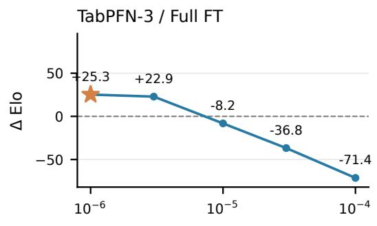

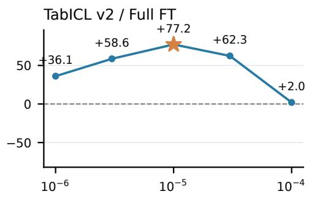

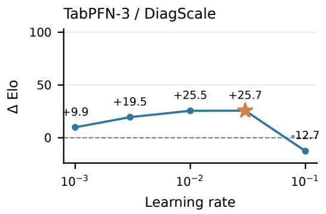

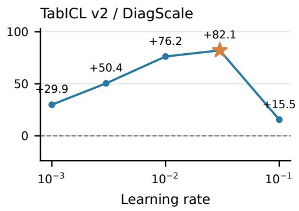  
Figure 6: Learning-rate sensitivity for the cross-backbone adaptation comparison. Each point adds one candidate to the same 68 references; $\Delta$ Elo is relative to the corresponding published default. Stars mark the rates with the highest unrounded $\Delta$ Elo. All panels use five learning rates evaluated on the same 51 datasets.

We also repeat five-fold cross-validation over datasets with 20 random partitions. Each fold selects the rate with the highest $\Delta$ Elo on 40 or 41 datasets and evaluates it on the remaining 10 or 11, keeping all splits of a dataset together. Each repetition combines the held-out results into one Elo fit (Table 7).

Table 7: Learning-rate selection across datasets. Entries are $\Delta$ Elo against the published default, with 68 references and one candidate per fit. Global selects one rate using all 51 datasets; five-fold results report the mean and standard deviation across 20 dataset partitions.
<table><tr><td>Backbone</td><td>Method</td><td>Global</td><td>Five-fold (mean ± SD)</td></tr><tr><td>TabPFN-3</td><td>Full FT</td><td> $+ 2 5 . 2 7$ </td><td> $+ 2 1 . 1 7 \pm 2 . 1 7$ </td></tr><tr><td>TabPFN-3</td><td>DiagScale</td><td> $+ 2 5 . 6 6$ </td><td> $+ 1 9 . 9 0 \pm 2 . 0 6$ </td></tr><tr><td>TabICL v2</td><td>Full FT</td><td> $+ 7 7 . 2 0 $ </td><td> $+ 7 7 . 2 0 \pm 0 . 0 0$ </td></tr><tr><td>TabICL v2</td><td>DiagScale</td><td> $+ 8 2 . 1 2$ </td><td> $+ 7 8 . 6 4 \pm 3 . 6 4$ </td></tr></table>

Within the tested grids, both methods retain positive $\Delta$ Elo in every partition, with similar mean Elo on each backbone.

Complete adaptation menu. Each of the 25 settings in Table 8 is evaluated at $1 0 ^ { - 6 } , 1 0 ^ { - 5 }$ , and $1 0 ^ { - 4 }$ over the full protocol; the table reports the rate with the highest aggregate $\Delta$ Elo for each setting. Of these settings, 15 select a grid endpoint: nine at $1 0 ^ { - 6 }$ and six at $1 \bar { 0 } ^ { - 4 }$ , including SoftScale at the upper endpoint.

Table 8: All 25 adaptation settings on TabPFN-3, each at the global learning rate with the highest ∆ Elo from $\{ 1 0 ^ { - 6 } , 1 0 ^ { - 5 } , 1 0 ^ { - 4 } \}$ . Each candidate is added separately to the same 68 references; ∆ Elo is relative to the published TabPFN-3 default, and Score is TabArena’s normalized score. Error is the mean per-dataset relative change against the frozen backbone, with a 95% dataset-bootstrap interval; negative is better. Wins counts datasets with lower error. Fallback is the fraction of evaluations where validation selects pretrained weights. Parameter counts use the regression checkpoint. Rows are ordered by unrounded ∆ Elo.
<table><tr><td rowspan=1 colspan=13>Setting  Updated          Params   Elo Score Error [95% CI]             WinsFallback</td></tr><tr><td rowspan=1 colspan=13>softscale query scaling         1.0M  +26 0.703 −0.62% [−1.04%, −0.24%]34/51    32%full       all trainable         58.3M  +25 0.704 -0.64% [−1.07%, -0.26%]37/51     36%weightsqk        query + key         12.9M +22 0.696 -0.54% [−0.95%, -0.16%] 33/51    35%projectionsmiddle3  middle ICL blocks   6.4M  +20 0.696 −0.60% [−1.08%, −0.19%] 36/51    34%10-12attn      all attention         26.2M  +20 0.693 -0.33% [−0.61%, -0.09%] 35/51    42%sublayersmlp      all MLP sublayers  25.2M  +19 0.693 −0.37% [−0.66%, −0.11%]38/51     42%</td></tr><tr><td rowspan=1 colspan=3>vo        value + out         12.9M</td><td rowspan=1 colspan=1>+19 0</td><td rowspan=1 colspan=6>.693 −0.38% [−0.68%, −0.12%]</td><td rowspan=2 colspan=3>39/51    39%35/51    36%</td></tr><tr><td rowspan=1 colspan=3>projectionsinducing inducing vectors    49,152</td><td rowspan=1 colspan=1>+18 0</td><td rowspan=1 colspan=3>.690 −0.28% [</td><td rowspan=1 colspan=3>−0.57%, −0.03%]</td></tr><tr><td rowspan=1 colspan=3>attnout   attention             6.4M</td><td rowspan=1 colspan=1>+17 0</td><td rowspan=1 colspan=3>.688 −0.60% [</td><td rowspan=1 colspan=3>−1.10%, −0.15%]</td><td rowspan=2 colspan=3>32/51    36%41%</td></tr><tr><td rowspan=4 colspan=3>out-projectionemb-first3 embeddings + ICL   7.7Mblocks 0-2ends                             6.9M</td><td rowspan=1 colspan=1>+16</td><td rowspan=1 colspan=3>0.689 -0.27%</td><td rowspan=1 colspan=3>[−0.50%, −0.07%</td><td rowspan=1 colspan=2></td></tr><tr><td rowspan=3 colspan=1>+16</td><td rowspan=3 colspan=3>0.688 −0.23%</td><td rowspan=3 colspan=2>[−0.42</td><td rowspan=3 colspan=2>-0.42%,-0.09%</td><td></td><td></td><td></td></tr><tr><td rowspan=2 colspan=1>embeddings +</td><td></td><td></td><td></td></tr><tr><td rowspan=4 colspan=2></td><td rowspan=1 colspan=2>44%</td></tr><tr><td rowspan=1 colspan=1></td><td rowspan=1 colspan=1>decoder head</td><td rowspan=1 colspan=1></td><td rowspan=1 colspan=1></td><td rowspan=3 colspan=3>0.688 -0.24%</td><td rowspan=3 colspan=3>[−0.41%, −0.10%</td><td></td></tr><tr><td rowspan=2 colspan=1>emb-first1</td><td rowspan=2 colspan=1>embeddings + ICL</td><td rowspan=2 colspan=1>3.4M</td><td rowspan=2 colspan=1>+16</td><td rowspan=2 colspan=1>0</td><td></td></tr><tr><td rowspan=3 colspan=3>43%33/51    37%</td></tr><tr><td rowspan=1 colspan=1></td><td rowspan=2 colspan=1>block 0blocks 0/8/16/23</td><td rowspan=2 colspan=1>8.6M</td><td rowspan=2 colspan=1>+16 0</td><td rowspan=2 colspan=3>.691 -0.47% [</td><td rowspan=1 colspan=2></td><td rowspan=2 colspan=2>−0.87%, -0.13%]</td></tr><tr><td rowspan=1 colspan=1>spread4</td><td></td><td></td></tr><tr><td rowspan=1 colspan=1>lora-r16</td><td rowspan=1 colspan=1>LoRA rank 16</td><td rowspan=1 colspan=1>3.5M</td><td rowspan=1 colspan=1>+15 0</td><td rowspan=1 colspan=2>.684</td><td rowspan=1 colspan=1>−0.48%</td><td rowspan=1 colspan=3>−0.88%, −0.13%</td><td rowspan=1 colspan=2>34/51</td><td rowspan=1 colspan=1>38%</td></tr><tr><td rowspan=1 colspan=1>lora-r4</td><td rowspan=1 colspan=1>LoRA rank 4</td><td rowspan=1 colspan=1>877,100</td><td rowspan=1 colspan=1>+15 0</td><td rowspan=1 colspan=2>.682</td><td rowspan=1 colspan=1>-0.70% [</td><td rowspan=1 colspan=3>−1.33%, -0.16%</td><td rowspan=1 colspan=2>30/51</td><td rowspan=1 colspan=1>35%</td></tr><tr><td rowspan=1 colspan=1>emb-first2</td><td rowspan=1 colspan=1>embeddings + ICL</td><td rowspan=1 colspan=1>5.5M</td><td rowspan=1 colspan=1>+14 0</td><td rowspan=1 colspan=2>.688</td><td rowspan=1 colspan=1>-0.23% [</td><td rowspan=1 colspan=3>−0.42%, -0.06%]</td><td rowspan=1 colspan=2>34/51</td><td rowspan=1 colspan=1>44%</td></tr><tr><td rowspan=1 colspan=1></td><td rowspan=1 colspan=1>blocks 0-1</td><td rowspan=1 colspan=1></td><td rowspan=1 colspan=1></td><td rowspan=1 colspan=2></td><td rowspan=1 colspan=1></td><td rowspan=1 colspan=3></td><td rowspan=1 colspan=2></td><td rowspan=1 colspan=1></td></tr><tr><td rowspan=1 colspan=1>emb</td><td rowspan=1 colspan=1>embeddings</td><td rowspan=1 colspan=1>1.3M</td><td rowspan=1 colspan=1>+14 0</td><td rowspan=1 colspan=3>.687 -0.23% [</td><td rowspan=1 colspan=3>−0.42%, -0.08%]</td><td rowspan=1 colspan=3>32/51    43%</td></tr><tr><td rowspan=1 colspan=1>lora-r8</td><td rowspan=1 colspan=1>LoRA rank 8</td><td rowspan=1 colspan=1>1.8M</td><td rowspan=1 colspan=1>+12 0</td><td rowspan=1 colspan=3>.678 −0.28%</td><td rowspan=1 colspan=3>−0.62%, +0.01%]</td><td rowspan=1 colspan=3>32/51    41%</td></tr><tr><td rowspan=1 colspan=1>last3-head</td><td rowspan=1 colspan=1>last 3 ICL blocks +</td><td rowspan=1 colspan=1>12.1M</td><td rowspan=1 colspan=1>+11 0</td><td rowspan=1 colspan=3>.685 −0.26% [</td><td rowspan=1 colspan=3>−0.48%, −0.07%]</td><td rowspan=1 colspan=3>25/51    46%</td></tr><tr><td rowspan=1 colspan=1></td><td rowspan=1 colspan=2>headln        all LayerNorms</td><td rowspan=1 colspan=2>28,288</td><td rowspan=1 colspan=1>+10 0</td><td rowspan=1 colspan=3>.682 -0.08% [</td><td rowspan=1 colspan=2>−0.15%, -0.02%]</td><td rowspan=1 colspan=2>31/51     49%</td></tr><tr><td rowspan=1 colspan=2>last2-head last 2 ICL blocks +</td><td rowspan=1 colspan=1>9.9M</td><td rowspan=1 colspan=1>+6 0</td><td rowspan=1 colspan=3>.678 -0.13% [</td><td rowspan=1 colspan=3>−0.28%, -0.01%]</td><td rowspan=1 colspan=3>22/51    49%</td></tr><tr><td rowspan=1 colspan=2>head</td><td rowspan=2 colspan=1>24,504</td><td rowspan=2 colspan=1>+4 0</td><td rowspan=2 colspan=3>.677 -0.06% [</td><td rowspan=2 colspan=3>−0.14%, +0.01%]</td><td rowspan=2 colspan=3>27/51    53%</td></tr><tr><td rowspan=1 colspan=2>bitfit     biases</td></tr><tr><td rowspan=1 colspan=2>last1-head last ICL block +</td><td rowspan=1 colspan=1>7.8M</td><td rowspan=1 colspan=1>+3 0</td><td rowspan=1 colspan=3>.676 −0.06% [</td><td rowspan=1 colspan=3>−0.14%, +0.00%]</td><td rowspan=1 colspan=3>19/51    54%</td></tr><tr><td rowspan=1 colspan=3>headyenc     y-encoder only       1,280</td><td rowspan=1 colspan=1>+2 0</td><td rowspan=1 colspan=3>.677 -0.01% [</td><td rowspan=1 colspan=3>−0.07%, +0.05%]</td><td rowspan=1 colspan=3>23/51     56%</td></tr><tr><td rowspan=1 colspan=1>head</td><td rowspan=1 colspan=2>decoder + output     5.7M</td><td rowspan=1 colspan=1>+2 0</td><td rowspan=1 colspan=3>.674 -0.07% [</td><td rowspan=1 colspan=3>−0.15%, +0.00%]</td><td rowspan=1 colspan=3>25/51    52%</td></tr><tr><td rowspan=1 colspan=10>head</td><td rowspan=1 colspan=3></td></tr></table>

Learning rates for TabFM. Full fine-tuning and DiagScale each use one learning rate selected on the same five-dataset subset, covering 87 evaluation cells, and applied across all 51 datasets. The subset comprises in\_vehicle\_coupon\_recommendation, airfoil\_self\_noise, hazelnut-spread-contaminantdetection, houses, and polish\_companies\_bankruptcy, chosen for their combined full-FT test gains on TabPFN-3 and TabICL v2. Both methods select the rate with the highest mean per-cell relative error reduction on this subset. TabFM uses $1 0 ^ { - 4 }$ for full FT and $1 0 ^ { - 2 }$ for DiagScale.

## B.4 COMPLETE CROSS-BACKBONE RESULTS

Direct comparison with full fine-tuning. We pair DiagScale and full fine-tuning on the same 816 cells for each backbone. $\operatorname { L e t } \bar { \ell } _ { d }$ be the within-dataset mean of $\log ( e _ { \mathrm { D i a g S c a l e } } / e _ { \mathrm { F T } } )$ . Table 9 transforms the mean over 51 equally weighted datasets with $1 0 0 ( \exp ( \cdot ) - 1 )$ . Its intervals resample datasets 10,000 times and are conditional on the selected learning rates and deployed update-and-selection recipes.

Table 9: Paired error change of DiagScale relative to full fine-tuning; negative is better. Wins count datasets with $\bar { \ell } _ { d } < 0 .$ . The intervals describe the comparison at the selected recipes and do not establish statistical equivalence.
<table><tr><td>Backbone</td><td>Error change</td><td>95% interval</td><td>Wins</td></tr><tr><td>TabPFN-3</td><td>-0.091%</td><td> $\left\lceil - 0 . 2 8 3 \% , + 0 . 0 8 4 \% \right\rceil$ </td><td>21/51</td></tr><tr><td>TabICL v2</td><td>-0.458%</td><td> $\left[ - 1 . 0 6 4 \% , - 0 . 0 1 6 \% \right]$ </td><td>26/51</td></tr><tr><td>TabFM</td><td>+0.102%</td><td> $\left[ - 0 . 0 5 4 \% , + 0 . 2 8 6 \% \right]$ </td><td>28/51</td></tr></table>

Per-dataset distributions. Table 10 summarizes per-dataset error changes against the frozen backbone. Median changes are small, while larger improvements on some datasets contribute to the aggregate gains (Table 27). On TabFM, DiagScale lowers mean relative error by 0.29% but slightly increases the median error $( + 0 . 0 1 \% )$ , improving 25 of 51 datasets. Dataset size has only weak correlations with improvement $( \rho = - 0 . 1 5 \mathrm { t o } + 0 . 2 6 )$ .

Fallback in the evaluated arms. Validation selects the pretrained weights in 297/252 of the 816 full-FT/DiagScale evaluations on TabPFN-3, 225/211 on TabICL v2, and 196/173 on TabFM. These fallback cases are included in the reported results.

## B.5 MECHANISM DIAGNOSTICS AND ABLATIONS

The mechanism experiments use three diagnostic datasets: houses (regression), physiochemical\_protein (regression), and polish\_companies\_bankruptcy (binary classification). These diagnostics are separate from the full-benchmark comparisons.

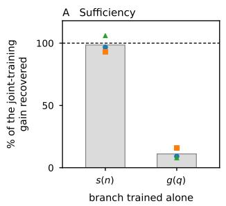

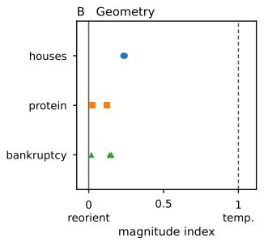

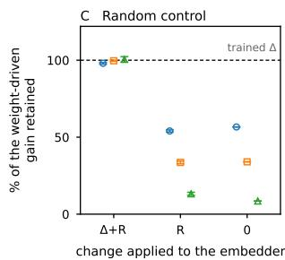  
Figure 7: SoftScale component diagnostics. Blue circles, orange squares, and green triangles denote houses, protein, and bankruptcy. A: fraction of the joint-training gain recovered by separately training only the context-size branch s or the query-dependent gate g; gray bars show the mean across datasets. B: each point summarizes one module group: the feature embedder or ICL stack, plus the classification decoder for bankruptcy. C: feature-embedder controls relative to its pretrained weights: trained change plus random perturbation $( \Delta + R )$ , random perturbation alone (R), or reversion (0); other scale modules remain trained. Error bars in C show standard deviations over five draws for $\Delta + R$ and R. Gains in A and C are normalized by the corresponding loss reduction from jointly training both scale branches relative to pretrained weights along the same inference path.

Diagnostic protocol. The SoftScale diagnostic runs use learning rate $1 0 ^ { - 4 }$ and 30 training epochs. Houses uses fold 0, repeat 0 (13,760 training rows, 6,000 evaluation rows); protein uses fold 0, repeat 1 (30,486 training rows, 6,000 evaluation rows); bankruptcy uses fold 0, repeat 0 (3,940 training rows, 1,970 evaluation rows). The first two are scored by RMSE and the third by log loss. Random controls vary five perturbation draws conditional on the checkpoint. A SoftScale module produces $\tilde { \mathbf { q } } = \mathbf { q } \odot \pmb { s } ( n ) \odot \pmb { g } ( \pmb { q } )$ , where n is the number of key tokens in that attention call. The scale network receives log n, and g is a query-dependent gate. Thus n is the local attention-context length, rather than one table-wide row count shared by every module.

Table 10: Per-dataset relative error change against the frozen backbone, 51 datasets per row, full protocol; negative is better. Best is the largest single reduction. Wins counts datasets with any reduction. These are the deployed arms at fixed learning rates, including checkpoint selection and fallback. $\rho$ is the Spearman correlation between training-set size and the reduction.
<table><tr><td>Backbone</td><td>Method</td><td>Median</td><td>Mean</td><td>Best</td><td>Wins</td><td>ρ(size)</td></tr><tr><td>TabPFN-3</td><td>full fine-tuning</td><td>-0.10%</td><td>-0.64%</td><td>-5.9%</td><td>37/51</td><td>+0.13</td></tr><tr><td>TabPFN-3</td><td>DiagScale</td><td>-0.08%</td><td>-0.73%</td><td>-7.8%</td><td>31/51</td><td>+0.05</td></tr><tr><td>TabICL v2</td><td>full fine-tuning</td><td>-0.34%</td><td>-1.30%</td><td>-10.9%</td><td>35/51</td><td>+0.26</td></tr><tr><td>TabICL v2</td><td>DiagScale</td><td>-0.27%</td><td>-1.60%</td><td>-11.4%</td><td>34/51</td><td>+0.26</td></tr><tr><td>TabFM</td><td>full fine-tuning</td><td>-0.08%</td><td>-0.32%</td><td>-5.8%</td><td>31/51</td><td>+0.16</td></tr><tr><td>TabFM</td><td>DiagScale</td><td>+0.01%</td><td>-0.29%</td><td>-5.8%</td><td>25/51</td><td>-0.15</td></tr></table>

Training individual branches. We run three independent fine-tunes from the pretrained model: both SoftScale branches, the context-size branch s alone, and the query-dependent gate g alone. Each run freezes all parameters outside its designated branches and selects its checkpoint using inner validation. Let $L _ { 0 }$ be the loss with pretrained scale weights along the fine-tuning inference path, $L _ { s , g }$ the loss after training both branches, and $L _ { b }$ the loss after training only branch b. We report 100 $( L _ { 0 } - L _ { b } ) / ( L _ { 0 } - L _ { s , g } \overline { { } } )$ as the percentage of the joint-training gain recovered. Training s alone recovers 92.8–106.2%, whereas training g alone recovers 8.1–16.0% (Table 11). A value above 100% means that the restricted run outperforms joint training on that split.

Table 11: Separate branch training on the three diagnostic datasets. Entries report the percentage of the joint SoftScale training gain recovered; training both branches defines 100%. All other parameters remain frozen in each run.
<table><tr><td>Dataset</td><td>Train s only</td><td>Train g only</td></tr><tr><td>Houses</td><td>96.7%</td><td>9.2%</td></tr><tr><td>Protein</td><td>92.8%</td><td>16.0%</td></tr><tr><td>Bankruptcy</td><td>106.2%</td><td>8.1%</td></tr></table>

Magnitude against direction. For each module we compare the learned change ∆b in the scale vector with the pretrained scale b using | cos(∆b, b)|, the alignment of the change with the original vector. A value of one indicates a change along the original direction, consistent with a temperature adjustment; $\sqrt { 2 / ( \pi D ) }$ is an approximate random-direction baseline in D dimensions. Rescaling the ∥∆b∥-weighted mean between that baseline and one gives a magnitude index of 0.018–0.241 across module groups, indicating that the change is dominated by reorientation rather than a uniform temperature adjustment.

Random-direction control. To test whether the learned direction matters, the control varies only the feature-embedder group and leaves the rest of the scale stack trained. Adding a random tensor R of matched per-key Frobenius norm to the pretrained embedder weights retains 13.2–54.0% over five draws, similar to reverting them outright (8.5–56.6%); adding the same R to the trained weights leaves the result intact (98.0–100.6%). Thus, the trained weights tolerate these perturbations, but matched-norm random updates to the pretrained weights do not recover their benefit. The remaining trained modules contribute to recovery in both controls.

DiagScale ablations. At learning rate $1 0 ^ { - 2 }$ , training δ across all scaling modules recovers 96.3– 137.1% of the loss reduction from jointly training both SoftScale branches. Recovery is measured against each experiment’s joint SoftScale baseline, relative to pretrained scale weights along the same inference path. Restricting δ to the three feature-embedder modules (384 parameters) at the same rate recovers 74.9–82.5%.

## C AGGREGATION: IMPLEMENTATION AND ADDITIONAL RESULTS

## C.1 CONFIGURATION-POOL CONSTRUCTION

The configuration members are drawn from TabArena’s tuned TabPFN-v2.5 search space with its one v2.5-specific entry removed, since TabPFN-3 ships a single checkpoint and publishes an empty search space of its own. Every remaining knob is a preprocessing or inference setting that TabPFN-3 accepts natively: the softmax temperature (9 values), probability balancing (classification only), outlier-removal threshold (3), polynomial features (2), the scaling pipeline (10 alternatives, several of them two-stage), categorical handling (3), whether original features are appended (2), a global transform (3), and, for regression, the target preprocessing chain (7).

The configurations are indexed $c = 0 , \ldots , 9 5$ . Configuration 0 uses the default settings, so the complete $K = 9 6$ pool contains a default member $p _ { \mathrm { 0 } } ;$ the smaller pools are drawn independently and do not use it as a forced anchor. At each pool size, the K sweeps average performance over independent random subsets: 8 draws at $K = 1$ and 8, 4 at 16 and 32, 2 at 64, and the complete pool at $K = 9 6$ . Within each test split, we average errors over subset draws and any validation subsampling seeds before computing the log error ratio to the separately evaluated default baseline pbase.

Each member is evaluated at $V = 8$ native views on the test partition and at $V = 2$ on the validation partition. The complete pool therefore uses $9 6 \times 8 = 7 6 8$ test-side view evaluations, versus 32 when using a single configuration with $V = 3 2$ ; these settings are not compute matched. Appendix E.4 reports measured costs.

## C.2 REDUCERS AND VALIDATION PROTOCOL

For frozen-backbone aggregation, out-of-fold predictions come from cross-validation over the cell’s outer-training partition, with up to eight folds. Classification folds are stratified; the fold count is reduced when a rare class has fewer than eight training examples. Of the 816 cells, 786 use eight folds, 20 use five, and 10 use six.

Uniform averaging assigns equal weights to all members, while best-single selects the member with the lowest out-of-fold loss. Greedy selection (Caruana et al., 2004) adds the member that minimizes the updated ensemble’s out-of-fold loss, with replacement, for $T = 4 0$ rounds. A member selected $n _ { c }$ times receives weight $n _ { c } / T$

Writing $\widehat { L }$ for the loss on the out-of-fold predictions, the reducers are

$$
\begin{array} { r l } & { \mathcal { R } _ { \mathrm { u n i f } } ( P _ { \mathcal { T } } ) = \frac { 1 } { K } \sum _ { c \in \mathcal { T } } p _ { c } , } \\ & { \mathcal { R } _ { \mathrm { b e s t } } ( P _ { \mathcal { T } } ) = p _ { \hat { c } } , \qquad \hat { c } = \underset { c \in \mathcal { T } } { \arg \operatorname* { m i n } } \ \hat { L } ( p _ { c } ) , } \\ & { \mathcal { R } _ { \mathrm { g e s } } ( P _ { \mathcal { T } } ) = \frac { 1 } { T } \sum _ { t = 1 } ^ { T } p _ { c t } , \quad c _ { t } = \underset { c \in \mathcal { T } } { \arg \operatorname* { m i n } } \ \hat { L } \Bigl ( \frac { 1 } { t } \bigl ( p _ { c } + \sum _ { s < t } p _ { c s } \bigr ) \Bigr ) . } \end{array}\tag{7}
$$

Each training row’s out-of-fold prediction uses only the other folds as context. Selection uses log loss for classification and RMSE for regression; for binary tasks, this differs from TabArena’s test metric, ROC AUC.

If a configuration fails during either validation or test prediction, its predictions on both partitions are replaced by configuration 0. This occurs for 11 configurations in each of nine Amazon\_employee\_access cells (99 member–cell replacements), in both the frozen and composed pools. Thus 96 denotes configuration slots; some cells contain repeated default predictions. The composition’s additional adapter-fitting step is described in Appendix E.1.

Algorithm 1 makes the order of prediction generation and selection explicit. Predic $\tau _ { \bar { \theta } , c , V } ( X ; D ^ { \prime } )$ fits the preprocessing and context for configuration c on $D ^ { \prime }$ and predicts X with V native views, without changing ¯θ. Here ¯θ is the pretrained state for frozen aggregation. The default failure is fatal; only nondefault members can fall back to it. Classification outputs are aligned to a common class order before scoring and averaging. The selector uses all training-side rows unless the label-budget analysis restricts Λ. Exact score ties are resolved by the first member in pool order. All 40 selections are retained; the procedure does not stop when its loss plateaus. Uniform and best-single use the same member predictions with the alternative weights in Equation (7).

Algorithm 1 Configuration predictions and greedy aggregation   
Input: Outer-training table $D ,$ unlabeled queries $X _ { Q } ,$ fixed model state $\bar { \theta }$   
Input: Configuration universe $\mathcal { C }$ containing default 0, retained pool $\mathcal { T } \subseteq \mathcal { C }$   
Input: Selector rows $\Lambda \subseteq \{ 1 , \ldots , | D | \}$ , loss $L ,$ selection rounds $T = 4 0$   
Output: Mixture weights w and query predictions $\hat { P }$   
1: Partition D into $\bar { F } \leq$ 8 inner folds; stratify classification and reduce $F$ for rare classes   
2: for each configuration $c \in { \mathcal { C } } ,$ , with default 0 first do   
3: for each inner fold $I _ { f }$ do   
4: $P _ { c } [ I _ { f } ]  \mathrm { P r e d i c t } _ { \bar { \theta } , c , 2 } ( X _ { I _ { f } } ; D _ { - I _ { f } } )$   
5: end for   
6: end for   
7: for each configuration $c \in { \mathcal { C } } ,$ , with default 0 first do   
8: $U _ { c } \gets \mathrm { P r e d i c t } _ { \bar { \theta } , c , 8 } ( X _ { Q } ; D )$   
9: end for   
10: If member c fails at either stage, replace both $( P _ { c } , U _ { c } )$ by $( P _ { 0 } , U _ { 0 } )$   
11: $A  0$ (selector prediction sum); $n _ { c } \gets 0$ for $c \in \mathcal { Z }$   
12: for $t = 1 , \dots , T$ do   
13: ct ← arg minc∈I $L ( y _ { \Lambda } , ( A + P _ { c } [ \Lambda ] ) / t )$   
14: $A  A + P _ { c _ { t } } [ \Lambda ] ; n _ { c _ { t } }  n _ { c _ { t } } + \dot { 1 }$   
15: end for   
16: $\begin{array} { r } { w _ { c } \gets n _ { c } / T ; \hat { P } \gets \sum _ { c \in \mathcal { T } } w _ { c } U _ { c } } \end{array}$   
17: return $( w , \hat { P } )$

## C.3 AGGREGATION RESULTS

Figure 8 and Table 12 extend Figure 3 to every evaluated view count and pool size. Let $\bar { \ell }$ be the mean log error ratio against the default baseline $p _ { \mathrm { b a s e } }$ at $V { = } 8 ,$ averaged within datasets and then over 51 equally weighted datasets. Points and the limits of the $1 0 { , } 0 0 0 ^ { \cdot }$ -resample dataset-cluster bootstrap are both transformed with $1 0 0 ( \exp ( \cdot ) - 1 )$ ) to report percentage error changes. Panel A varies native views of the default configuration; panel B draws configuration pools at $V { = } 8 ,$ , averaging over independent subsets. Its $K { = } 1$ point therefore summarizes randomly sampled single members.

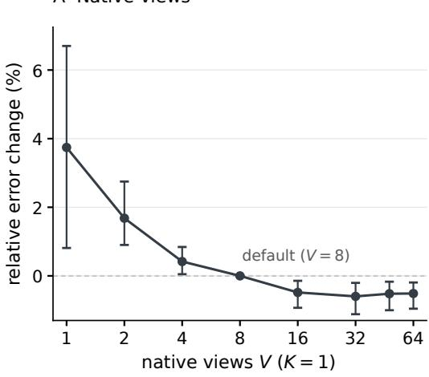

B Configuration breadth $( V = 8$ each)  
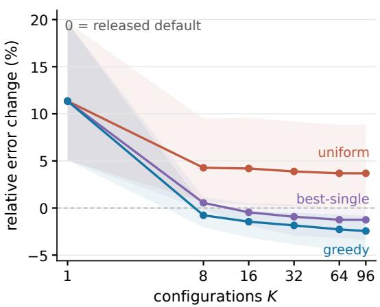  
Figure 8: Complete aggregation curves, including native views below the released default and random single configurations. The three reducers coincide at $K = 1$ . Both panels use the same paired estimator and transformed 95% dataset-cluster bootstrap intervals as Figure 3, with independent vertical ranges and all intervals visible. The additional $V \stackrel { - } { = } 4 8$ point is included between the labeled 32- and 64-view ticks.

Native-view error changes are −0.60%, −0.52%, and −0.51% at $V = 3 2 , 4 8 , 6 4$ , respectively, suggesting a plateau. A randomly sampled configuration increases error by 11.35% on average (95% CI: [5.07%, 19.69%]). With greedy selection, the mean point estimate improves through $K = 9 6$ , the largest pool evaluated. Using 32 native views and greedy selection over 96 configurations yields +21 and +67 Elo, respectively. Each Elo fit adds one candidate to the fixed 68 references and measures ∆ Elo against the published TabPFN-3 default within that fit; the other settings are reported in paired error.

Table 12: Every arm of Figure 8, full protocol (816 cells), against the default baseline $p _ { \mathrm { b a s e } }$ at V=8. Error is the percentage change 100(exp(¯ℓ) − 1) over 51 equally weighted datasets with a transformed 95% dataset-cluster bootstrap interval; negative is better. Configuration rows average over independent random subsets. Wins counts datasets with reduced error and is reported for nativeview settings and the complete configuration pool; dashes indicate counts not reported. Inner uniform averages native views within one configuration.
<table><tr><td>K</td><td>V</td><td>Reducer</td><td>∆ error [95% CI]</td><td></td><td>Wins</td></tr><tr><td>1</td><td>1</td><td>inner uniform</td><td></td><td>+3.74% [+0.81%, +6.70%]</td><td>4/51</td></tr><tr><td>1</td><td>2</td><td>inner uniform</td><td></td><td>+1.68% [+0.90%, +2.75%]</td><td>9/51</td></tr><tr><td>1</td><td>4</td><td>inner uniform</td><td></td><td>+0.42% [+0.05%, +0.84%]</td><td>18/51</td></tr><tr><td>1</td><td>8</td><td>inner uniform</td><td colspan="3">— (baseline)</td></tr><tr><td>1</td><td>16</td><td>inner uniform</td><td></td><td>-0.48% [−0.93%, −0.14%]</td><td>33/51</td></tr><tr><td>1</td><td>32</td><td>inner uniform</td><td></td><td>-0.60% [−1.12%, -0.20%]</td><td>42/51</td></tr><tr><td>1</td><td>48</td><td>inner uniform</td><td></td><td>-0.52% [−1.00%, -0.17%]</td><td>40/51</td></tr><tr><td>1</td><td>64</td><td>inner uniform</td><td></td><td>-0.51% [−0.96%, −0.19%]</td><td>40/51</td></tr><tr><td>1</td><td>8</td><td>mean single member</td><td></td><td>+11.35% [+5.07%, +19.69%]</td><td></td></tr><tr><td>8</td><td>8</td><td>uniform</td><td></td><td>+4.27% [+0.64%, +9.50%]</td><td></td></tr><tr><td>16</td><td>8</td><td>uniform</td><td></td><td>+4.19% [+0.33%, +9.62%]</td><td></td></tr><tr><td>32</td><td>8</td><td>uniform</td><td></td><td>+3.88% [+0.18%, +9.18%]</td><td></td></tr><tr><td>64</td><td>8</td><td>uniform</td><td></td><td>+3.69% [+0.03%, +8.83%]</td><td></td></tr><tr><td>96</td><td>8</td><td>uniform</td><td></td><td>+3.68% [+0.02%, +8.86%]</td><td>14/51</td></tr><tr><td>8</td><td>8</td><td>best-single</td><td></td><td>+0.55% [−0.18%, +1.14%]</td><td></td></tr><tr><td>16</td><td>8</td><td>best-single</td><td>-0.46%</td><td>[-1.85%, +0.53%]</td><td></td></tr><tr><td>32</td><td>8</td><td>best-single</td><td>-0.93%</td><td>[-2.90%, +0.35%]</td><td></td></tr><tr><td>64</td><td>8</td><td>best-single</td><td>-1.24%</td><td>-3.20%, +0.02%]</td><td></td></tr><tr><td>96</td><td>8</td><td>best-single</td><td>-1.25%</td><td>-3.41%, +0.07%]</td><td>29/51</td></tr><tr><td>8</td><td>8</td><td>greedy</td><td>-0.77%</td><td>-2.03%, +0.12%]</td><td></td></tr><tr><td>16</td><td>8</td><td>greedy</td><td>-1.45%</td><td>-3.16%, -0.29%]</td><td></td></tr><tr><td>32</td><td>8</td><td>greedy</td><td>-1.85%</td><td>-3.86%, -0.49%]</td><td></td></tr><tr><td>64</td><td>8</td><td>greedy</td><td>-2.27%</td><td>[−4.50%, −0.70%]</td><td></td></tr><tr><td>96</td><td>8</td><td>greedy</td><td></td><td>-2.44% [-4.75%, −0.80%]</td><td>42/51</td></tr><tr><td></td><td></td><td></td><td></td><td></td><td></td></tr></table>

Greedy selection against best-single. On the same K = 96 predictions, greedy selection lowers error by 1.20% [0.57%, 2.03%] relative to best-single and is better on 42 of 51 datasets.

Results by problem type. Table 13 summarizes the three reducers’ results by task type.

## C.4 DEPENDENCE ON VALIDATION DATA

Figure 9 and Table 14 give the full $K \times f$ surface for greedy selection, where f is the fraction of out-of-fold labels the reducer may use. Member predictions are fixed, and within a cell the configuration subset drawn at each (K, draw) is held fixed across every f and every label seed, so a difference along a row is a difference in the reducer’s label access and not in which members it saw. Label subsets are nested across budgets for a fixed seed and sampled inside each (fold, class) group, using eight seeds for $f < 1 .$ . Errors are averaged over seeds and configuration draws within each cell before computing log error ratios; these are averaged within datasets, with equal weight across the 51 datasets.

At every label budget, larger pools improve the point estimates, but with only one eighth of the labels, point estimates remain above the default for all evaluated pool sizes. Because member predictions and configuration subsets are fixed across budgets, these differences reflect the reducer’s access to validation labels.

Table 13: Relative error change against the default at $K = 9 6 ,$ , by task type; negative is better. Wins count datasets with reduced error.
<table><tr><td>Type</td><td>Metric</td><td>Reducer</td><td>Median</td><td>Worst</td><td>Wins</td></tr><tr><td>binary (30)</td><td>ROC AUC</td><td>uniform</td><td>+0.30%</td><td>+5.29%</td><td>9/30</td></tr><tr><td></td><td></td><td>best-single</td><td>+0.05%</td><td>+4.20%</td><td>13/30</td></tr><tr><td></td><td></td><td>greedy</td><td>-0.31%</td><td>+1.02%</td><td>22/30</td></tr><tr><td>multiclass (8)</td><td>log loss</td><td>uniform</td><td>+5.80%</td><td>+164.30%</td><td>1/8</td></tr><tr><td></td><td></td><td>best-single</td><td>-0.85%</td><td>+0.35%</td><td>7/8</td></tr><tr><td>regression (13)</td><td></td><td>greedy</td><td>-1.21%</td><td>-0.32%</td><td>8/8</td></tr><tr><td></td><td>RMSE</td><td>uniform</td><td>+0.57%</td><td>+2.20%</td><td>4/13</td></tr><tr><td></td><td></td><td>best-single</td><td>-0.12%</td><td>+0.58%</td><td>9/13</td></tr><tr><td></td><td></td><td>greedy</td><td>-0.43%</td><td>+0.21%</td><td>12/13</td></tr></table>

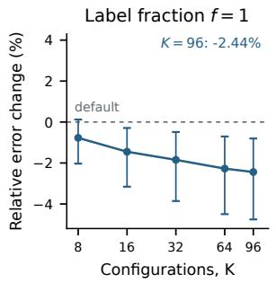

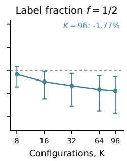

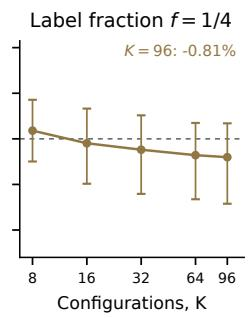

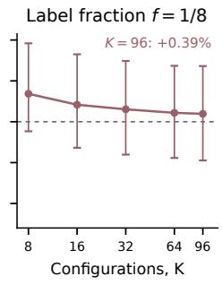  
Figure 9: Greedy aggregation with different fractions of training-side selector labels. All panels share the same axes and fixed member predictions. Points use the dataset-weighted mean log-error ratio against the released default; bars show transformed 95% dataset-bootstrap intervals. Pool breadth improves each curve’s point estimates, while fewer selector labels reduce the gains. Intervals exclude zero for $f \in \{ 1 / 2 , 1 \}$ and $K \geq 1 6 ;$ all others include zero.

Table 14: Greedy selection: relative error change against the default baseline $p _ { \mathrm { b a s e } }$ at $V { = } 8 ,$ , by pool size and out-of-fold label fraction; negative is better. The last row is the change from $K = 8$ to $K = 9 6$ at that budget, in percentage points. The $K = 1$ row is the mean over randomly sampled single-member pools, not $p _ { 0 } ;$ the reducer has nothing to choose between there, so it does not vary with $f .$
<table><tr><td> $K$ </td><td> $f = 0 . 1 2 5$ </td><td> $f = 0 . 2 5$ </td><td> $f = 0 . 5$ </td><td> $f = 1 . 0$ </td></tr><tr><td>1</td><td>+11.35%</td><td>+11.35%</td><td>+11.35%</td><td>+11.35%</td></tr><tr><td>8</td><td>+1.37%</td><td>+0.36%</td><td>-0.35%</td><td>-0.77%</td></tr><tr><td>16</td><td>+0.83%</td><td>-0.19%</td><td>-0.99%</td><td>-1.45%</td></tr><tr><td>32</td><td>+0.61%</td><td>-0.48%</td><td>-1.34%</td><td>-1.85%</td></tr><tr><td>64</td><td>+0.44%</td><td>-0.72%</td><td>-1.66%</td><td>-2.27%</td></tr><tr><td>96</td><td>+0.39%</td><td>-0.81%</td><td>-1.77%</td><td>-2.44%</td></tr><tr><td> $8  9 6$ </td><td>-0.98</td><td>-1.17</td><td>-1.42</td><td>-1.67</td></tr></table>

## D CONTEXT CONSTRUCTION: IMPLEMENTATION AND ADDITIONAL RESULTS

## D.1 SHARED SETUP AND TERMINOLOGY

All studies keep the backbone frozen and change its conditioning context. References and view counts are specified per experiment. The main column comparison uses eight views and matches the default’s per-view column counts. Large-row studies use a single view and compare with full-context inference (feed-all) at the same source-pool size N within memory, or at 4M rows beyond capacity. Model-aware denotes attention-guided row retrieval. Expansion compares with the same context without added rows or columns.

Benchmark experiments use their stated task metric; large-row experiments use log loss, including binary Higgs and COMET. Relative error reductions are 100 × (reference − arm)/reference, so positive is better. Figure 4 uses matched random contexts as the reference in panel A and absolute log loss in panels B/C. Absolute errors are compared within a dataset.

## D.2 ROW CURATION AND RETRIEVAL

The model-aware pipeline. We adapt the released retrieval pipeline of Zhang et al. (2025) to frozen TabPFN-3; Algorithm 2 gives the evaluated procedure. Retrieval uses the last ICL layer’s query-to-context softmax attention, averaged over heads, with retrieval budget $r = \operatorname* { m i n } ( 5 0 0 , N )$ . A binary indicator represents each query by the source rows it retrieves. Queries with similar retrieval sets are clustered, and each cluster receives the unique union of its selected rows.

We use $G = \operatorname* { m i n } ( n _ { Q } , \operatorname* { m a x } ( 4 , \operatorname* { m i n } ( 3 0 , \lfloor n _ { Q } / 2 0 0 0 \rfloor ) ) )$ query clusters, with four KMeans initializations and random seed 0. This gives 25 initial clusters for the 50k-query large-row studies. Scoring uses one native view; per-cluster deployment uses one view in the large-row sweep and one or eight in the TabArena comparison. Both scoring and clustering access the unlabeled query batch, so the constructed contexts depend on which queries are available together; query labels are used only for evaluation. Classification probabilities are aligned to the source pool’s class order, with zero probability for classes missing from a selected context.

Reaching past the memory wall. Chunked TabPFN uses tiled attention to support longer contexts without additional training (Sergazinov & Yin, 2025). In our setup, feed-all becomes infeasible at 4.0–4.5M rows on an 80 GB device. Beyond this limit, we shuffle the pool and score attention separately in 2M-row blocks. Each query retrieves a proportional quota $r | \hat { B } _ { b } | / N$ from each block, rounded to total r (Algorithm 2). Selection uses within-block ranks: the block softmaxes have different denominators and do not define a global top-r ranking. Unsharded scoring uses the whole pool as one block. At 4M rows, two-block scoring increases retrieval log loss relative to unsharded scoring by 0.01% on Higgs, 0.68% on US\_Accidents, and 57.1% on COMET\_MC, averaged over five paired seeds. All five COMET\_MC seeds worsen; the retrieval failure also occurs without sharding.

Union capacity. On Higgs, query clusters whose retrieved union exceeds $C = 4 \mathbf { M }$ rows are recursively split into balanced halves using their retrieval indicators, until every union fits. All retrieved rows are retained. The 6M–10M runs use 26–27 final clusters, below the configured maximum of 64; splitting uses no query labels or prediction losses. Other datasets and the capped Higgs control keep only the C rows with the largest summed retained attention when a union exceeds capacity. For sharded scoring, these values are block-local and are not calibrated across blocks. At 7.68M rows on US\_Accidents, this cap removes 14.8–16.9% of one cluster’s union in each of the five seeds. Table 16 compares the two policies.

The geometric coreset. This comparison clusters query rows in feature space after training-mean imputation and training-fitted standardization. Each cluster is predicted using the 100,000 source rows nearest its centroid, with a separate frozen fit per cluster.

The large-row sweeps use five seeds per setting. On Higgs, US\_Accidents, and COMET\_MC, the sweep through 2.9M rows uses a 3M-row source subset, while the 2M-and-larger sweep uses the full table. Each source has its own seed-specific 50k-row test set; the two sweeps are plotted separately. Table 15 gives selected sizes from Figure 10, together with each dataset’s complete source pool. Within the memory limit both constructions are measured against feed-all at the same N; beyond it, where no such run exists, the reference is feed-all at 4M from the full-table sweep.

Higgs capacity check. The same splitting rule is used at 6M, 8M, and 10M rows, with no truncation in any run. Mean log loss decreases through 10M rows, whereas the capped control rises after 6M (Table 16). Splitting also changes the query partition, so this comparison does not isolate truncation from grouping. Seed 0 informed development; excluding it gives means 0.46258, 0.45874, and 0.45653 over the other four seeds.

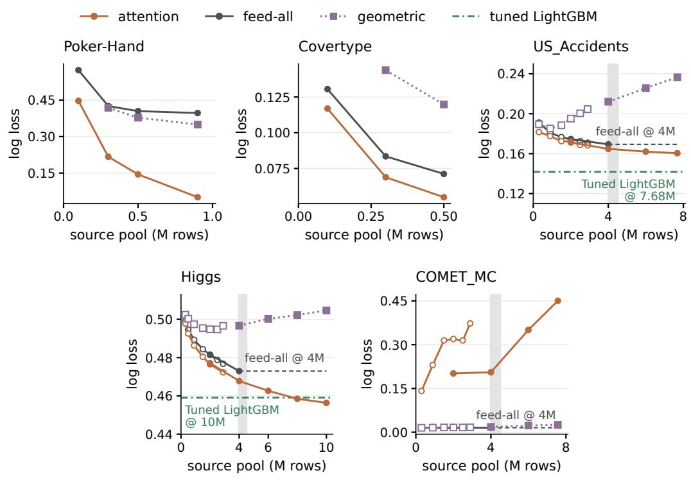  
Figure 10: Complete source-pool sweeps with single-view TabPFN-3 on five large tables, including the geometric construction omitted from the main figure. Points are the five-seed mean log losses; each panel has an independent linear vertical axis. For the three largest tables, open and filled markers distinguish the 3M-subset and full-table splits; lines connect only points from the same split. Feed-all curves contain only measured values, ending at 4M where the pool exceeds capacity. Beyond 4M, dashed lines hold that reference fixed and gray bands mark the 4.0–4.5M capacity boundary. Green lines on US\_Accidents and Higgs are tuned LightGBM endpoint references (Table 17).

Algorithm 2 Model-aware row retrieval with optional sharded scoring   
Input: Labeled pool $D = \{ ( \boldsymbol { x } _ { i } , y _ { i } ) \} _ { i = 1 } ^ { N }$ , unlabeled query batch $X _ { Q }$ , frozen $f _ { \theta }$   
Input: Retrieval budget r, query-cluster count G, block size B, union cap C, deployment views V   
Input: Overflow policy $\pi \in$ {split, truncate} (split for Higgs)   
Output: Predictions for $X _ { Q }$ in its original order   
1: Partition the shuffled pool indices into blocks $B _ { 1 } , \ldots , B _ { J }$ of at most B rows   
2: r ← min(r, N); $u _ { b } \stackrel { . } {  } r | B _ { b } | / N ; r _ { b } \gets \lfloor u _ { b } \rfloor$ for each block b   
3: Add one to the ${ \dot { r } } - \sum _ { b }$ rb quotas with largest fractional remainder ${ u } _ { b } - { r } _ { b }$   
4: for each block b with $\bar { r } _ { b } > 0$ do   
5: Fit a frozen single-view predictor on $D _ { B _ { b } }$ and process $X _ { Q }$   
6: Stream last-ICL-layer query-to-context softmax attention, averaged over heads   
7: For each query j, retain the top-rb pool indices $S _ { j b }$ and their attention values   
8: end for   
9: $\textstyle S _ { j } \gets \bigcup _ { b } S _ { j b }$ for each query j; retain the block-local attention values $a _ { j i }$   
10: Form sparse binary indicators $H _ { j i } = \mathbf { 1 } \{ i \in S _ { j } \}$ over the retrieved pool indices   
11: $( Q _ { 1 } , \ldots , Q _ { G } )  \operatorname { K M e a n s } ( H , { \bar { G } } )$   
12: Initialize a queue with the nonempty query clusters   
13: while the queue is nonempty do   
14: Pop a query cluster $Q _ { g }$   
15: $\textstyle U _ { g } ^ { \setminus } \gets \bigcup _ { j \in Q _ { g } } S _ { j }$   
16: if $| U _ { g } | > C$ and π = split then   
17: Fit two KMeans centers to $H _ { Q _ { g } ; }$ order queries by their distance difference   
18: Push the two balanced halves of this ordering onto the queue   
19: else   
20: if $| U _ { g } | > C$ then   
21: $\begin{array} { r } { s _ { i } \gets \sum _ { j \in Q _ { g } : i \in S _ { j } } a _ { j i } } \end{array}$ for $i \in U _ { g }$   
22: Retain in $U _ { g }$ only the C rows with largest $s _ { i }$   
23: end if   
24: Fit a frozen V-view predictor on $D _ { U _ { g } }$ and predict $X _ { Q _ { g } }$   
25: Align classification probabilities to the pool’s class order and insert into query order   
26: end if   
27: end while   
28: return the assembled predictions

Table 15: Row construction on large tables, frozen TabPFN-3, single view. Relative log-loss reduction against the full-context reference for the regime, in per cent; positive is better. Within memory the reference is feed-all at the same N; beyond the memory wall no such run exists, so it is feed-all at 4M. A dash marks a source pool that never reaches the wall. Entries summarize five seeds. The 2.9M results use the 3M-subset splits; beyond-capacity results and their 4M references use the full-table splits.
<table><tr><td rowspan="2">Dataset</td><td rowspan="2">Total N</td><td colspan="3">Within memory</td><td rowspan="2">Beyond wall Model-aware</td></tr><tr><td>Eval. N</td><td>Geo.</td><td>Model-aware</td></tr><tr><td>Poker-Hand</td><td>1.03M</td><td>900k</td><td>+12.0</td><td>+87.2</td><td></td></tr><tr><td>Covertype</td><td>0.58M</td><td>500k</td><td>-67.9</td><td>+22.9</td><td></td></tr><tr><td>US_Accidents</td><td>7.73M</td><td>2.9M</td><td>-19.8</td><td>+1.5</td><td>+5.2 at 7.68M</td></tr><tr><td>Higgs</td><td>11M</td><td>2.9M</td><td>-4.2</td><td>+0.9</td><td>+2.2 at 6M, +3.5 at 10M</td></tr><tr><td>COMET_MC</td><td>7.62M</td><td>2.9M</td><td>-11.3</td><td>-2375</td><td>-2808 at 7.57M</td></tr></table>

Validation-tuned LightGBM reference. The reference uses the same deterministic per-seed permutation and 50,000 held-out test rows as the full-pool row study. For each of five seeds, it selects among learning rates {0.02, 0.05, 0.1} and leaf counts {63, 255} by validation log loss. Every candidate allows at most 100,000 boosting rounds, with early stopping after 300 rounds without validation improvement. Table 17 reports the selected configurations; all selected models stop before the cap. Test loss does not select the configuration.

Table 16: Higgs union-capacity comparison. Log loss is mean ± standard deviation over five seeds. Time includes attention scoring and is relative to feed-all at 4M rows. Both variants keep the retrieval budget and scoring shards fixed.
<table><tr><td>Pool</td><td>Capped union</td><td>Recursive splitting</td><td>Time (×)</td><td></td></tr><tr><td></td><td></td><td></td><td>Capped</td><td>Split</td></tr><tr><td>6M</td><td> $0 . 4 6 2 7 9 \pm 0 . 0 0 3 1 6$ </td><td> $0 . 4 6 2 6 6 \pm 0 . 0 0 3 4 3$ </td><td>1.95</td><td>2.32</td></tr><tr><td>8M</td><td> $0 . 4 6 8 6 8 \pm 0 . 0 0 2 8 3$ </td><td> $0 . 4 5 8 4 8 \pm 0 . 0 0 3 2 8$   $0 . 4 5 6 3 7 \pm 0 . 0 0 2 7 9$ </td><td>2.20</td><td>3.16</td></tr><tr><td>10M</td><td> $0 . 4 8 5 3 0 \pm 0 . 0 0 3 6 2$ </td><td></td><td>2.47</td><td>3.95</td></tr></table>

For US\_Accidents, the 7,678,394-row pool is split into 7,524,827 fitting rows and 153,567 validation rows. For Higgs, the reference fits on the 10,000,000-row pool and validates on the next 200,000 rows of the remaining training data, outside that pool. Categorical columns with at most 255 distinct training values are declared categorical; higher cardinality columns retain their numeric codes. The runs use 24 CPU threads. The horizontal lines are five-seed endpoint means, 0.14182 for US\_Accidents and 0.45909 for Higgs; they do not represent models tuned separately at every plotted source-pool size.

Table 17: Validation-tuned LightGBM endpoints, five seeds. All selected models use 255 leaves. US\_Accidents fits 7,524,827 rows with 153,567 validation rows; Higgs fits 10M rows with 200k additional validation rows. “Rounds” is the selected best iteration under a 100k cap.
<table><tr><td>Dataset</td><td>Seed</td><td>LR</td><td>Rounds</td><td>Val. loss</td><td>Test loss</td></tr><tr><td rowspan="5">US_Accidents</td><td>0</td><td>0.02</td><td>7,972</td><td>0.14011</td><td>0.13994</td></tr><tr><td>1</td><td>0.02</td><td>8,093</td><td>0.14328</td><td>0.14279</td></tr><tr><td>2</td><td>0.02</td><td>8,056</td><td>0.13990</td><td>0.14081</td></tr><tr><td>3</td><td>0.02</td><td>8,411</td><td>0.13998</td><td>0.14279</td></tr><tr><td>4</td><td>0.02</td><td>7,479</td><td>0.14216</td><td>0.14276</td></tr><tr><td rowspan="5">Higgs</td><td>0</td><td>0.02</td><td>72,769</td><td>0.45890</td><td>0.45808</td></tr><tr><td>1</td><td>0.02</td><td>87,121</td><td>0.45929</td><td>0.46381</td></tr><tr><td>2</td><td>0.05</td><td>32,073</td><td>0.45931</td><td>0.45968</td></tr><tr><td>3</td><td>0.02</td><td>76,666</td><td>0.45639</td><td>0.45530</td></tr><tr><td>4</td><td>0.02</td><td>82,420</td><td>0.45694</td><td>0.45859</td></tr></table>

The benchmark-scale sweep. Table 18 gives all 15 datasets, each evaluated with ten repeats of three-fold cross-validation, including datasets assigned only three repeats in the main TabArena protocol. The mean attention mass retained by the rows selected for each query ranges from 100 % on blood-transfusion to 14 % on diamonds. Under the eight-view default, the corrected intervals exclude zero on four datasets, two positive and two negative; the sign agrees between the single-view and eight-view arms on every dataset that resolves under both.

For each split j, we compute the paired relative error reduction $d _ { j } = 1 0 0 ( 1 - e _ { \mathrm { r e t r i e v a l } , j } / e _ { \mathrm { f u l l } , j } )$ and report its mean ¯d. To account approximately for overlapping training sets, we use the corrected resampled t interval of Nadeau & Bengio (1999):

$$
\bar { d } \pm t _ { 2 9 , 0 . 9 7 5 } s _ { d } \sqrt { \frac { 1 } { 3 0 } + \bar { q } } , \quad \quad \bar { q } = \frac { 1 } { 3 0 } \sum _ { j = 1 } ^ { 3 0 } \frac { n _ { \mathrm { t e s t } , j } } { n _ { \mathrm { t r a i n } , j } } ,\tag{8}
$$

where $s _ { d }$ is the sample standard deviation of the 30 reductions and $\bar { q } \approx 1 / 2$ . These are nominal dataset-wise intervals without adjustment for multiple comparisons.

## D.3 MATCHED-ROW CONTROLS AND THE COMET FAILURE

The model-aware pipeline changes several things at once relative to feed-all: it shrinks the context, partitions the queries, and refits once per partition. To separate those from the choice of rows, we hold attention scoring, query clustering, per-cluster context sizes, refitting, and prediction stitching fixed.

Table 18: Model-aware row construction at TabArena scale, all 15 datasets, 30 splits per dataset. n is the maximum number of training rows across splits, k the number of query clusters, attn. the mean attention mass retained by the rows selected for each query, and union the median per-cluster context size. The last two columns give mean paired relative error reductions at one view and at the released eight-view default, in per cent, with approximate 95 % intervals from Equation (8); positive is better. Bold marks intervals excluding zero.
<table><tr><td>Dataset</td><td>n</td><td>k</td><td>attn. %</td><td>union</td><td>∆1 view</td><td>∆ 8 views</td></tr><tr><td>blood-transfusion-service-center</td><td>499</td><td>4</td><td>100</td><td>499</td><td> $+ 0 . 0 0 \pm 0 . 0 0$ </td><td> $+ 0 . 0 0 { \pm } 0 . 0 0$ </td></tr><tr><td>diabetes</td><td>512</td><td>4</td><td>99</td><td>512</td><td> $+ 0 . 0 0 \pm 0 . 8 5$ </td><td> $+ 0 . 0 4 \pm 0 . 4 5$ </td></tr><tr><td>maternal_health_risk</td><td>676</td><td>4</td><td>91</td><td>634</td><td> $+ 2 . 9 8 \pm 5 . 7 2$ </td><td> $+ 0 . 7 7 \pm 2 . 4 3$ </td></tr><tr><td>concrete_compressive_strength</td><td>687</td><td>4</td><td>93</td><td>684</td><td> $- 0 . 5 7 \pm 1 . 9 6$ </td><td> $- 0 . 1 2 \pm 0 . 8 0$ </td></tr><tr><td>airfoil_self_noise</td><td>1,002</td><td>4</td><td>83</td><td>972</td><td>+0.63 ±3.58</td><td>−0.29 ±1.23</td></tr><tr><td>students_dropout_and_academic_success</td><td>2,950</td><td>4</td><td>50</td><td>1,814</td><td>−0.25 ±1.24</td><td>−0.19 ±0.62</td></tr><tr><td>churn</td><td>3,334</td><td>4</td><td>46</td><td>2,198</td><td>−2.82 ±7.52</td><td>−4.29 ±3.89</td></tr><tr><td>wine_quality</td><td>4,332</td><td>4</td><td>41</td><td>2,726</td><td>−9.02 ±1.69</td><td>−8.94 ±1.66</td></tr><tr><td>Bank_Customer_Churn</td><td>6,667</td><td>4</td><td>29</td><td>3,672</td><td>−0.90 ±0.80</td><td>−0.54±0.61</td></tr><tr><td>heloc</td><td>6,973</td><td>4</td><td>26</td><td>4,146</td><td> $- 0 . 5 5 \pm 0 . 6 8$ </td><td> $- 0 . 5 3 \pm 0 . 5 4$ </td></tr><tr><td>houses</td><td>13,760</td><td>4</td><td>32</td><td>9,878</td><td>+0.04 ±0.80</td><td>+0.19 ±0.38</td></tr><tr><td>credit_card_clients_default</td><td>20,000</td><td>5</td><td>21</td><td>7,784</td><td>−0.18 ±0.40</td><td> $- 0 . 1 5 \pm 0 . 3 0$ </td></tr><tr><td>bank-marketing</td><td>30,141</td><td>7</td><td>16</td><td>10,105</td><td>−0.10 ±0.46</td><td>−0.09 ±0.42</td></tr><tr><td>diamonds</td><td>35,960</td><td>8</td><td>14</td><td>9,446</td><td>+0.67 ±0.60</td><td> $\mathbf { + 0 . 6 1 \pm 0 . 3 6 }$ </td></tr><tr><td>SDSS17</td><td>52,036</td><td>13</td><td>22</td><td>8,840</td><td>+9.35 ±3.85</td><td>+5.36 ±1.47</td></tr></table>

The control replaces only the identities of selected rows with a uniform random draw of the same size. The controls use three paired seeds, except COMET, which uses five. All arms use matched test splits.

Equivalently, after constructing and capping $U _ { g }$ in Algorithm 2, the identity control replaces it by a uniform sample without replacement of $| U _ { g } |$ source rows. The attention-derived query clusters and all subsequent prediction steps are shared.

For Figure 4A and Table 19, define the paired reduction $r _ { s } = 1 0 0 ( 1 - e _ { s , \mathrm { a t t e n t i o n } } / e _ { s , \mathrm { r a n d o m } } )$ for each seed s. We report its arithmetic mean with interval $\bar { r } \pm t _ { 0 . 9 7 5 , n - 1 } \mathrm { s d } ( r ) / \sqrt { n }$ . The main panel shows Covertype, Poker, and both Higgs settings; the COMET control is reported in Table 20.

Table 19: Matched-row identity control. Log loss, mean over three seeds. The final column is the relative change from the random-identity arm to the attention arm; positive means the attentionselected rows are better. This is the contrast plotted in Figure 4A. All four 95% intervals exclude zero.
<table><tr><td>Dataset</td><td>N</td><td>Feed-all</td><td>Random ids</td><td>Attention</td><td colspan="2">Attention vs. random</td></tr><tr><td>Covertype</td><td>500k</td><td>0.0728</td><td>0.1613</td><td>0.0558</td><td>+65.3%</td><td> $[ + 6 0 . 0 , + 7 0 . 6 ]$ </td></tr><tr><td>Poker-Hand</td><td>900k</td><td>0.3928</td><td>0.5272</td><td>0.0469</td><td></td><td>+91.1% [+89.1, +93.1]</td></tr><tr><td>Higgs</td><td>900k</td><td>0.4885</td><td>0.5018</td><td>0.4859</td><td></td><td>+3.2% [+2.8, +3.6]</td></tr><tr><td>Higgs</td><td>2.9M</td><td>0.4759</td><td>0.4911</td><td>0.4717</td><td></td><td>+3.9% [+3.5, +4.3]</td></tr></table>

The random-identity arm is worse than feed-all in all four settings, while attention-selected rows improve on it. Replacing row identities therefore reverses the observed benefit conditional on the fixed clusters, context sizes, and refit pipeline.

COMET\_MC. On COMET\_MC, the matched random control holds each cluster’s context size fixed at the value produced by attention selection. For each cluster, we examine its query count, the number of retrieval draws and distinct rows, and the class composition of its selected context relative to the matched random context and source pool (Table 20).

At the same context sizes and with the same clusters and refits, random selection brings log loss within 5% of feed-all, so context size alone does not explain the failure. The retrieved contexts have a median rare-class share of 40.3%, compared with 1.7% in the source pool. Despite each query retrieving 500 rows, their unions contain fewer than a thousand distinct rows at the median, compared with tens to hundreds of thousands in the other settings (Table 21).

Table 20: COMET\_MC at $N = 9 0 0 \mathbf { k }$ , five seeds, source pool 98.3%/1.7%. Every constructed arm refits on the same 25 clusters with a median context of 977 rows; only the contents differ. The rare-class share is the median over 125 cluster observations.
<table><tr><td>Arm</td><td>Log loss</td><td>vs. feed-all</td><td>AUC</td><td>Rare-class share</td></tr><tr><td>Feed-all  $( N = 9 0 0 \mathbf { k } )$ </td><td>0.0151</td><td></td><td>0.998</td><td>0.017</td></tr><tr><td>Attention union</td><td>0.2302</td><td>-1425%</td><td>0.950</td><td>0.403</td></tr><tr><td>Random identities, same size</td><td>0.0158</td><td>-4.9%</td><td>0.998</td><td>0.017</td></tr><tr><td>Class-marginal repair</td><td>0.1270</td><td>-741%</td><td>0.569</td><td>0.017</td></tr></table>

Table 21: Retrieval concentration within a query cluster. Query count, draws, and union size are medians over clusters and seeds (five seeds for COMET, three for the other settings). “Overlap” is the ratio of the reported median draws to median union size. Poker and Higgs statistics use the matched random-control runs, whose context sizes equal those of attention selection.
<table><tr><td>Dataset</td><td>N</td><td>|Q|</td><td>Draws</td><td>Union</td><td>Overlap</td></tr><tr><td>COMET_MC</td><td>900k</td><td>2,270</td><td>1,135,000</td><td>977</td><td>1162×</td></tr><tr><td>Covertype</td><td>500k</td><td>1,487</td><td>743,500</td><td>40,794</td><td>18×</td></tr><tr><td>Poker-Hand</td><td>900k</td><td>1,570</td><td>785,000</td><td>73,731</td><td>11×</td></tr><tr><td>Higgs</td><td>900k</td><td>1,383</td><td>691,500</td><td>85,188</td><td>8×</td></tr><tr><td>Higgs</td><td>2.9M</td><td>1,202</td><td>601,000</td><td>154,159</td><td>4×</td></tr></table>

Class-distribution diagnostics retain the source pool’s class identities even when their frequencie reverse in a retrieved union. The median total variation between the retrieved and source class distributions is 0.386; per-cluster error correlates with this shift (Spearman +0.81). Union size and rare-class share are themselves correlated (−0.59). These descriptive associations over 125 cluster observations nested within five seeds do not separate the effects of context size and class composition.

At fixed context size, class-marginal repair lowers mean log loss from 0.2302 to 0.1270 but does not restore predictive performance; AUC falls to 0.569. The repair replaces the lowest-attention rows of the over-represented class with uniformly sampled rows of the under-represented class, changing both row identities and class composition.

## D.4 COLUMN CURATION

Selector and protocol. We use TabPFN’s LightGBM feature-importance implementation, which fits LightGBM on the training split for each dataset and seed and ranks columns by total split gain. We compute one ranking and fix its top-ranked columns across all eight views; the native importance-based sampler instead retains top-ranked columns and fills the remaining per-view budget by balanced sampling. Nothing from the test split enters the ranking. The main comparison keeps the top 200 columns on six classification tables and the top 500 on QSAR-TID-11 regression, matching TabPFN-3’s default per-view caps. All eight views receive the same selected set. These counts refer to original columns; each view still applies its native preprocessing. The 500-column grid covers eight wide tables with $D > 1 0 0 0$ . Training contexts are capped at 6,000 rows. Each setting uses fou seeds and the task metric in Table 23.

Arms. The unselected one-view arm disables feature subsampling and uses all D columns. The default eight-view arm uses the backbone’s balanced column sampler. In the $F = 5 0 0$ controls, importance selection fixes the top 500 columns and random selection fixes a uniform 500-column set. The importance ranking is reused across the selection arms of each dataset/seed split. The one-view selected arms use all 500 columns in one view; the pinned arms give all 500 to every one of eight views. The per-view arms restore balanced subsampling within that candidate set, using 200 columns per classification view and 500 per regression view. Thus the pinned/per-view contrast changes both view diversity and actual per-view feature count. The importance-versus-random contrast holds these budgets equal within each view setting. The additional 200-column classification setting uses the eight-view pinned importance arm.

Table 22: Column curation on seven wide tables, frozen TabPFN-3. Entries are relative error reductions from the reference in each header; positive is better. The main selected result fixes 200 columns across all eight views for classification and 500 for QSAR-TID-11 regression, matching the default’s per-view counts. “1 view” uses all D columns. The two rightmost columns report the separate $\bar { \boldsymbol { F } } = 5 0 0$ controls: fixed views each use all 500 selected columns, while per-view subsampling uses the native cap; importance and random selection are compared with 500 columns fixed across eight views. All percentages use unrounded four-seed mean errors. Task metrics and absolute errors appear in Table 23.
<table><tr><td colspan="4"></td><td rowspan="2">Selected vs. default</td><td colspan="2">F = 500 controls</td></tr><tr><td>Dataset</td><td>Domain</td><td>D</td><td>vs. 1 view</td><td>Per view vs. fixed</td><td>Imp. vs. random</td></tr><tr><td>Bioresponse</td><td>molecular</td><td>1,776</td><td>+8.9</td><td>-1.4</td><td>+4.5</td><td>+4.5</td></tr><tr><td>hiva_agnostic</td><td>molecular</td><td>1,617</td><td>+12.8</td><td>-4.5</td><td>+4.7</td><td>-2.7</td></tr><tr><td>QSAR-TID-11</td><td>molecular</td><td>1,024</td><td>+2.0</td><td>+0.5</td><td>+0.0</td><td>+2.5</td></tr><tr><td>CIFAR_10</td><td>image</td><td>3,072</td><td>+6.6</td><td>-2.1</td><td>+1.2</td><td>+0.0</td></tr><tr><td>micro-mass</td><td>mass-spec</td><td>1,300</td><td>-10.5</td><td>+35.1</td><td>-7.1</td><td>+19.2</td></tr><tr><td>11_Tumors</td><td>genomics</td><td>12,533</td><td>+12.9</td><td>+29.8</td><td>+3.6</td><td>+14.1</td></tr><tr><td>amazon-reviews</td><td>text</td><td>10,000</td><td>-43.0</td><td>+67.1</td><td>-31.8</td><td>+65.6</td></tr></table>

The complete grid. Table 23 reports nine settings on eight tables, plus the 200-column, eight-view importance results for six classification tables. The main regression result uses 500 columns. All entries average four seeds; Prostate is shown only in the 500-column grid and excluded from the summaries because its default reference has zero error. For every percentage in Table 22, we first average the errors across seeds, then compute $1 0 0 ( 1 - \bar { e } _ { \mathrm { a r m } } / \bar { e } _ { \mathrm { r e f } } )$ . Rounding is applied only to the displayed values.

Table 23: Complete column-curation grid: mean error over 4 seeds, in each dataset’s own metric, so values compare across a row and not down a column; lower is better. gini denotes the backbone’s importance-based per-view sampler, which also uses LightGBM gain. The Importance and Random groups both keep $\dot { \boldsymbol { F } } = 5 0 0$ columns; pin gives all eight views the same set, and p.v. restores native subsampling within it. The last column adds importance selection with 200 columns fixed across eight views. Dashes denote unavailable 200-column results; regression retains the 500-column result in the main comparison.
<table><tr><td colspan="2"></td><td colspan="3">No selection</td><td colspan="3">Importance,  $F = 5 0 0$ </td><td colspan="3">Random,  $F = 5 0 0$ </td><td rowspan="2"> $F = 2 0 0$ </td></tr><tr><td>Dataset</td><td>Metric</td><td>1 v.</td><td>8 v.</td><td>gini</td><td>1 v.</td><td>pin</td><td>p.v.</td><td>1 v.</td><td>pin</td><td>p.v. Imp. pin</td></tr><tr><td>Bioresponse</td><td>1-AUC 0.14270.1300 0.13200.1394 0.1331 0.1270 0.14590.13930.1358</td><td></td><td></td><td></td><td></td><td></td><td></td><td></td><td></td><td></td><td>0.1319</td></tr><tr><td>hiva_agnostic</td><td></td><td></td><td></td><td></td><td></td><td></td><td></td><td>log loss 0.2085 0.1818 0.1840 0.2121 0.1912 0.1822 0.1951 0.1862 0.1831</td><td></td><td></td><td>0.1899</td></tr><tr><td>QSAR-TID-11</td><td>RMSE</td><td></td><td></td><td></td><td></td><td></td><td></td><td>0.74320.72820.72690.73120.72460.72440.76240.74290.7414</td><td></td><td></td><td></td></tr><tr><td>CIFAR_10</td><td></td><td></td><td></td><td></td><td></td><td></td><td></td><td>log 1oss 1.6399 1.53101.5531 1.6099 1.5523 1.5330 1.6267 1.55291.5440</td><td></td><td></td><td>1.5633</td></tr><tr><td>micro-mass</td><td></td><td></td><td></td><td></td><td>1og 1oss0.47590.52570.33580.45790.34780.37260.55790.43070.5137</td><td></td><td></td><td></td><td></td><td></td><td>0.3409</td></tr><tr><td>11_Tumors</td><td>1og 1oss0.3971 0.34600.22920.31040.24280.23400.36580.28270.3560</td><td></td><td></td><td></td><td></td><td></td><td></td><td></td><td></td><td></td><td>0.2430</td></tr><tr><td>amazon-reviews log 1oss 1.6620 2.3764 0.7896 0.8936 0.78591.0362 2.3523 2.2850 2.6496</td><td></td><td></td><td></td><td></td><td></td><td></td><td></td><td></td><td></td><td></td><td>0.7820</td></tr><tr><td>Prostate</td><td>1-AUC 0.0156 0.0000 0.0039 0.0195 0.0039 0.0000 0.0000 0.0000 0.0000</td><td></td><td></td><td></td><td></td><td></td><td></td><td></td><td></td><td></td><td></td></tr></table>

Varying rows and columns separately. To test whether many columns and few rows explain the benefit, we vary these dimensions separately (Figure 11). The row sweep fixes all D columns and randomly samples $n \in \{ 5 0$ , 100, 200, 400, 800, 1600, 3200} training rows, up to the available pool size, on Bioresponse, hiva\_agnostic, CIFAR\_10, and QSAR-TID-11. Each of four seeds defines a 70/15/15 train/unused-validation/test split; classification splits are stratified. Training pools are capped at $6 { , } 0 0 0$ rows. Context sampling is stratified for classification and uniform without replacement for regression. Both arms use the same sampled rows and fixed test set: one single view receives all D columns, and the other receives the top 200. LightGBM ranks columns once on the full training pool, and the selected set stays fixed across n. Thus the sweep changes the rows given to TabPFN without requiring the selector to learn the ranking from only n labels.

The column sweep fixes the training rows on amazon-reviews, micro-mass, and 11\_Tumors. Every input retains the same top-200 columns and adds randomly drawn lower-ranked columns, with total widths from 500 to 10,000 where available. A single view using these columns is compared with a single view using only the fixed top 200. For both sweeps, we compute $1 0 0 ( 1 - e _ { \mathrm { s e l e c t e d } } / e _ { \mathrm { f u l l } } )$ within each seed and then average over seeds. Small row contexts increase selection gains on Bioresponse, hiva\_agnostic, and QSAR-TID-11, while CIFAR\_10 shows little change; the trends are not monotonic in $D / n$ . Lower importance rank is not assumed to imply absence of predictive information.

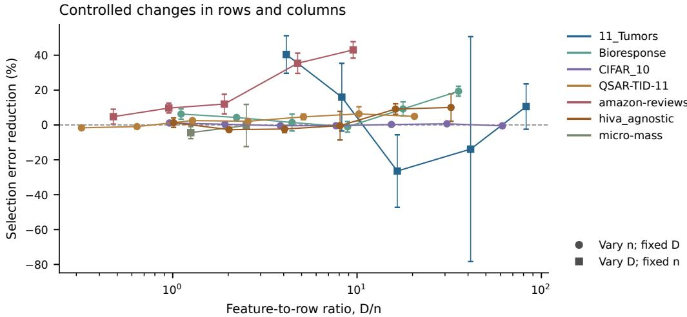  
Figure 11: Column-curation controls at a fixed 200-column selection budget with single-view TabPFN-3, separate from the eight-view comparison in Table 22. Circles vary context rows at fixed width; squares vary width at fixed context size. The LightGBM ranking is fitted once per dataset and seed on the full training pool and held fixed through each sweep. Points are mean paired error reductions over four seeds, relative to using all available columns at that point; bars show one standard error. QSAR-TID-11 uses RMSE.

Sampling without class stratification. We repeat the row sweep on the three classification tables without balancing class counts. For each seed, we shuffle the training pool once and take its first n rows, so smaller contexts are nested within larger ones. The outer splits, test sets, full-pool feature rankings, 200-column budget, and single-view evaluation are unchanged. For classification, stratified sampling and unstratified nested sampling differ in both class stratification and overlap across context sizes, so their differences cannot be attributed solely to stratification.

The four-seed results remain mixed. For example, at n = 100, Bioresponse’s mean error reduction changes from 9.20% to −2.66%, while CIFAR\_10’s unstratified means range from −0.49% to 1.39% across the tested context sizes. The unstratified sweep does not show consistently larger benefits from column selection.

On hiva\_agnostic, the unstratified contexts omit at least one test-set class in three of four seeds at $n = 5 0$ , two at $n = 1 0 0$ , and one at $n = 2 0 0$ . We retain these draws and assign zero predicted probability to unseen classes, using the same float32 log-loss clipping as in the complete-class cases. Both column settings share the missing-class penalty, so changes in their relative gains also reflect class coverage.

## D.5 CONTEXT EXPANSION

Operator families and coverage. Blind synthesis adds jittered or interpolated training rows. Transduction adds observed query features with model-generated labels. Learned rows optimize synthetic features through the frozen backbone, with fixed labels except in the joint regression settings. Derived columns append out-of-fold target encodings or backbone predictions. Table 25 lists 18 expansion settings, an initialization control, and a curation reference over 19 datasets; Table 26 defines their construction and use.

The learned-row summary in Table 24 covers 171 free-row and generator cases from 51 datasets at M ∈ {32, 128, 512}, with coverage varying by dose. Full-size joint rows are a separate five-dataset experiment. Row controls, fold-rotated rows, and compact joint rows appear in Table 25 but are excluded from the family summary.

The summary counts dataset–operator pairs for blind synthesis and transduction, datasets for full-size joint rows and derived columns, and probe–dataset–dose cases for learned rows. For learned rows, 10 of 171 cases meet the decision criterion: mean error reduction above 0.5% and improvement on more than 60% of evaluated splits. This is an effect-and-consistency threshold, not a significance test; 54 of 171 cases show any improvement. Other families count any improvement over the unmodified context. Transduction includes the whole-query pseudo-label control.

Table 24: Context expansion by operator family, frozen TabPFN-3. Relative error reduction against the unmodified context, in per cent; positive is better, as in Tables 22 and 15. The scope column names the unit being counted, which differs by family. Passes criterion counts units meeting that family’s own bar: an improvement over the unmodified context for every row except the learned-row program, where it is that program’s decision criterion.
<table><tr><td>Family</td><td>Scope</td><td>Passes</td><td>Median</td><td>Example/control</td></tr><tr><td>Blind synthesis</td><td>51 dataset × operator</td><td>3</td><td>-4.6</td><td>none</td></tr><tr><td>Transduction</td><td>57 dataset × operator</td><td>14</td><td>-1.8</td><td>anneal +12.8, airfoil +1.2</td></tr><tr><td>Learned rows</td><td>171 probe/dataset/dose</td><td>10</td><td>-0.1</td><td>concrete improves over placebo</td></tr><tr><td>Full-size joint rows</td><td>5 datasets</td><td>0</td><td>-11.8</td><td>no improvement observed</td></tr><tr><td>Self-stacking</td><td>19 datasets</td><td>1</td><td>-3.0</td><td>Marketing_Campaign only</td></tr><tr><td>OOF target encoding</td><td>9 datasets</td><td>2</td><td>-0.2</td><td>Marketing_Campaign +9.4</td></tr></table>

Table 25: Expansion settings and controls over the 19-dataset evaluation. Relative error reduction against the unmodified context, in per cent; positive is better. n is the number of datasets on which the operator ran; some operators apply only to specific task types or class structures. Improves counts datasets with any reduction. For learned rows, this differs from the decision criterion in Table 24. M is the number of added rows. Nearest-row curation selects 70% of the training rows nearest each query-cluster centroid as a curation reference.
<table><tr><td>Operator</td><td>Family</td><td>n</td><td>Median</td><td>IQR</td><td>Improves</td></tr><tr><td>Gaussian jitter</td><td>Blind synthesis</td><td>19</td><td>-6.19</td><td>[−11.01, -3.99]</td><td>2/19</td></tr><tr><td>Row interpolation</td><td>Blind synthesis</td><td>19</td><td>-2.95</td><td>-5.49, −1.84]</td><td>1/19</td></tr><tr><td>Class-balanced interpolation</td><td>Blind synthesis</td><td>13</td><td>-5.90</td><td>-20.02, -3.39]</td><td>0/13</td></tr><tr><td>Whole-query pseudo-labels</td><td>Transduction</td><td>19</td><td>-12.66</td><td>-44.80, -3.44]</td><td>3/19</td></tr><tr><td>Cross-half pseudo-labels</td><td>Transduction</td><td>19</td><td>-2.26</td><td>-2.76, +0.04]</td><td>5/19</td></tr><tr><td>Cross-half, confidence ≥ 0.9</td><td>Transduction</td><td>14</td><td>-0.59</td><td>[−1.41, -0.33]</td><td>2/14</td></tr><tr><td>Cross-half, interval filtering</td><td>Transduction</td><td>5</td><td>+0.05</td><td>[+0.05, +0.09]</td><td>4/5</td></tr><tr><td>Class duplication with jitter</td><td>Row control</td><td>14</td><td>-0.01</td><td>[−0.13, +0.09]</td><td>7/14</td></tr><tr><td>Noise rows, class proportions</td><td>Row control</td><td>14</td><td>-0.04</td><td>[−0.41, +0.05]</td><td>5/14</td></tr><tr><td>Noise rows, majority class</td><td>Row control</td><td>14</td><td>-0.21</td><td>[−0.30, −0.00]</td><td>4/14</td></tr><tr><td>Target-tail duplication</td><td>Row control</td><td>3</td><td>+0.04</td><td>−0.17, +0.15]</td><td>2/3</td></tr><tr><td>Fold-rotated rows</td><td>Learned rows</td><td>19</td><td>-0.06</td><td>[−0.15, +0.01]</td><td>6/19</td></tr><tr><td>Distilled rows (M = 32)</td><td>Learned rows</td><td>19</td><td>-0.10</td><td>-0.19, +0.16]</td><td>9/19</td></tr><tr><td>Initial rows (M = 32)</td><td>Init. control</td><td>19</td><td>-0.06</td><td>−0.18, +0.12]</td><td>8/19</td></tr><tr><td>Generated rows (M = 32)</td><td>Learned rows</td><td>19</td><td>-0.02</td><td>-0.27, +0.07]</td><td>7/19</td></tr><tr><td>Joint rows (M = 32)</td><td>Learned rows</td><td>5</td><td>+0.03</td><td>-0.14,+0.10]</td><td>3/5</td></tr><tr><td>Joint rows (full size)</td><td>Full-size joint</td><td>5</td><td>-11.76</td><td>[−12.97, -8.01]</td><td>0/5</td></tr><tr><td>OOF target encoding</td><td>Derived columns</td><td>9</td><td>-0.23</td><td>[-0.47, −0.04]</td><td>2/9</td></tr><tr><td>Self-stacking</td><td>Derived columns</td><td>19</td><td>-3.00</td><td>-5.19, -0.65]</td><td>1/19</td></tr><tr><td>Nearest-row curation (70%)</td><td>Curation reference</td><td>19</td><td>-1.55</td><td>-2.51, −0.47]</td><td>3/19</td></tr></table>

Table 26: Construction and use of expansion settings. All backbone weights are frozen. D denotes the outertraining table and Z denotes constructed rows. Only transductive settings use query features to construct the conditioning data; query labels are reserved for evaluation.
<table><tr><td>Setting</td><td>Training / construction</td><td>Deployment</td><td>Labels / selection</td></tr><tr><td>Blind synthesis</td><td>Jitter, pair interpolation, or class-balanced interpolation of training rows; no optimization.</td><td>D + Z, with at most  $n / 2$  added rows.</td><td>Inherited training labels; interpolated targets for regression mixup.</td></tr><tr><td>Transduction</td><td>Predict the query batch from D. For cross-half expansion, split queries into two parts.</td><td>D plus pseudo-labeled rows from the other half; the whole-query control adds the whole batch.</td><td>Model predictions only; optional probability or quantile-width filter.</td></tr><tr><td>Row controls</td><td>Duplicate training rows or sample noise anchors; no optimization.</td><td>D plus the constructed rows.</td><td>Training labels or target tails for duplication; labels for noise anchors sampled from training class proportions or fixed to the majority</td></tr><tr><td>Fold-rotated rows</td><td>Optimize free rows using real training folds plus Z as context; score a different training fold.</td><td>D + Z.</td><td>class. Fixed seed-row labels; training-side early stopping.</td></tr><tr><td>Free-row distillation</td><td>Optimize row features with Z alone D + Z; Z alone is a as context; predict real training queries.</td><td>diagnostic arm.</td><td>Fixed seed-row labels; Nominal 10% training-side checkpoint slice; initialization details below.</td></tr><tr><td>MLP-generated rows Same distillation objective;</td><td>optimize a conditional MLP with a fixed latent bank.</td><td>D plus generated rows.</td><td>Fixed conditioning labels from training rows; training-side checkpoint selection.</td></tr><tr><td>Joint rows</td><td>Distill with Z alone, optimizing both features and continuous targets; M = 32 or the full training size.</td><td>D + Z.</td><td>Regression training targets supervise the objective; same checkpoint rule.</td></tr><tr><td>Derived columns</td><td>Five-fold training-side target statistics or backbone predictions form new columns.</td><td>Append columns to real context and query features.</td><td>Out-of-fold values for training rows; full-training fit for queries.</td></tr></table>

Transductive and row-control definitions. Prior work also investigates the use of unlabeled examples through repeated application of tabular foundation models (Li et al., 2025). Algorithm 3 specifies cross-half expansion: its pseudo-labels are fixed predictions from the original context, and each query receives pseudo-rows only from the other half of the unlabeled batch. The whole-query control instead includes the whole batch’s pseudo-labels in every query’s context. Classification confidence filtering retains pseudo-rows with maximum predicted class probability at least 0.9. For regression, interval filtering uses $( q _ { 0 . 9 } - q _ { 0 . 1 } ) / \operatorname { s d } ( y _ { \mathrm { t r a i n } } )$ and retains the half with width at or below the batch median before cross-half prediction. Neither filter reads true query labels. Gaussian jitter has standard deviation 0.05 times the training-column standard deviation. Class-balanced interpolation uses random within-class pairs. The class-duplication control adds four sampled rows per class with jitter. Noise-row controls add 32 rows labeled by training class proportions or the majority class.

Target-tail duplication adds at most 64 jittered rows from the outer 5% target tails. These fixed row controls are separate from the optimized-row program.

Algorithm 3 Cross-half pseudo-label expansion   
Input: Labeled training table D, unlabeled query batch $X _ { Q } ,$ , frozen predictor $f _ { \theta }$   
Input: Optional confidence rule and a fixed random seed   
Output: Predictions for every query, without using its own pseudo-label as context   
1: $\mathbf { \dot { \Gamma } } P ^ { 0 } \gets \operatorname { P r e d i c t } _ { \theta , 8 } ( X _ { Q } ; \dot { D } )$   
2: Form fixed pseudo-labels $\tilde { y } _ { j }$ from $P ^ { 0 } ;$ : most probable class or regression mean   
3: Mark eligible pseudo-rows using the confidence rule, or retain all if none is specified   
4: Randomly partition query indices into halves $Q _ { 1 } , Q _ { 2 }$   
5: for $h = 1 , \bar { 2 }$ do   
6: $Z _ { h } \gets \{ ( \pmb { x } _ { j } , \tilde { y } _ { j } ) : j \in Q _ { 3 - h } , j$ is eligible}   
7: $\hat { P } [ Q _ { h } ] \gets$ Predict ${ \mathsf { \Omega } } _ { , 8 } ( X _ { Q _ { h } } ; D \cup Z _ { h } )$   
8: end for   
9: return $\hat { P }$ in original query order

Derived-column construction. Self-stacking first predicts each training fold from the other four folds, producing one probability column per class or one regression-mean column. Predictions from a fit on all training rows supply the corresponding query columns. A new frozen predictor then uses the original features concatenated with these columns. Target encoding follows the same five-fold construction, replacing each categorical value by a smoothed target mean computed on the other folds: $( n _ { a } \bar { y } _ { a } + \bar { 1 } 0 \bar { y } ) / \bar { ( n _ { a } + 1 0 ) }$ for category $^ { a , }$ with the fold’s overall mean y¯ for unseen categories. Query encodings use full-training statistics. Thus the new training features exclude each row’s own target; neither construction uses query labels.

Datasets and optimization. The 19-dataset matrix covers blood-transfusion-servicecenter; diabetes; credit-g; qsar-biodeg; Fitness\_Club; Is-this-a-goodcustomer; Marketing\_Campaign; hazelnut-spread-contaminant-detection; seismic-bumps; anneal; maternal\_health\_risk; website\_phishing; MIC; students\_dropout\_and\_academic\_success; QSAR\_fish\_toxicity; concrete\_ compressive\_strength; healthcare\_insurance\_expenses; airfoil\_self\_ noise; Another-Dataset-on-used-Fiat-500.

The broader learned-row program comprises 95 classification, 32 regression, and 44 generator probe– dataset–dose cases. Free-row distillation uses up to 300 Adam steps at learning rate $3 \times 1 0 ^ { \dot { - } 2 }$ and optimizes synthetic inputs as the sole training context against real training queries, with a trainingside checkpoint slice. Deployment appends the result to the complete real context. This evaluates independently distilled rows as augmentation; its objective does not optimize the real-plus-synthetic deployment context. The fold-rotated setting includes real context during optimization, rotating over four training folds with a training-side checkpoint slice. It uses $M = \mathrm { \bar { c l i p } } ( \mathrm { r o u n d } ( 0 . 1 N / d ) , \mathrm { \bar { 8 } } , N )$ synthetic rows for N training rows and d features. Generator distillation uses a two-layer, 64-unit MLP and a fixed latent bank, optimized for up to 400 steps at learning rate $3 \times 1 0 ^ { - 3 }$ . The initialization is evaluated separately as a placebo. Optimization uses two differentiable views; evaluation uses eight views with constructed rows mapped back to raw feature space. Experiments use the official outer split grids, with coverage varying by operator, dataset, and row dose.

Algorithm 4 spells out the free-row classification and regression probes. The optimization loss L is cross-entropy for classification and mean squared error of the predictive mean for regression. The checkpoint slice has max(20, min(2048, $\underline { { | 0 . 1 | } } D | \underline { { | } } ) )$ rows. Classification initializes from classproportional seed draws over the complete outer-training table, including the checkpoint slice, with at least one seed per class; rounded quotas can make the realized row count differ from the nominal dose M. Regression draws seeds only from the optimization-query partition. Consequently, the classification checkpoint slice is excluded from gradient-loss queries but not from seed selection. Continuous seed features receive Gaussian noise of standard deviation 0.05 in standardized units; categorical entries and seed labels remain fixed. The penalty Ω combines squared distance to the unperturbed seed rows (coefficient $1 0 ^ { - 3 } )$ and a soft box penalty outside [−3, 3] (coefficient $1 0 ^ { - 2 } )$ , applied to continuous entries. Checkpoint improvement tolerances are $1 { \dot { 0 } } ^ { - 5 }$ for classification and $1 0 ^ { - 7 }$ for regression. The initialization is itself a checkpoint candidate. Free-row runs use patience 4 checkpoint checks; the generator uses patience 5 and an improvement tolerance of $1 0 ^ { - 7 }$ for both task types. Real rows are absent from the optimization context and are restored for the final augmentation evaluation. The fold-rotated and generator settings retain the distinct objectives and parameterizations in Table 26.

Algorithm 4 Free-row distillation evaluated as context augmentation   
Input: Outer-training table D, unlabeled queries $X _ { Q } ,$ frozen $f _ { \theta } ,$ row dose $\overline { { M } }$   
Output: Augmented-context predictions and matched initialization-control predictions   
1: Standardize features using $D ;$ split its rows into optimization queries $D _ { o } ^ { - }$ and checkpoint slice $D _ { h }$   
2: Initialize synthetic rows $\breve { Z } ^ { 0 } = \dot { ( } X _ { Z } ^ { 0 } , y _ { Z } { ) }$ at nominal dose M, as specified in the text   
3: $Z  Z ^ { 0 } ;$ ; freeze $\theta , y _ { Z } ,$ , and categorical entries; retain $Z ^ { 0 }$ for the initialization control   
4: $Z ^ { \star }  Z ^ { \hat { 0 } }$ ; evaluate its checkpoint loss using $\dot { Z } ^ { 0 }$ alone as context   
5: for at most 300 optimization steps do   
6: Draw a query minibatch $( X _ { b } , y _ { b } )$ from $D _ { o }$ (use all if there are at most 4096 rows)   
7: $\mathcal { L } \gets L ( \mathit { \hat { f } _ { \theta } ( \dot { X } _ { b } ; Z ) , y _ { b } } ) \dot { + } \Omega ( \dot { X } _ { Z } ^ { \prime } )$ , using two differentiable views   
8: Take an Adam step on the continuous entries of $X _ { Z } ,$ with learning rate $3 \times 1 0 ^ { - 2 }$   
9: if this is a checkpoint step (every 25 steps) then   
10: Evaluate $L ( { \hat { f } } _ { \theta } ( X _ { h } ; { \hat { Z } } ) ,$ yh) on $D _ { h } ,$ , using $Z$ alone as context   
11: Save a copy of $\dot { Z }$ as $Z ^ { \star }$ if its loss improves; stop after four unsuccessful checks   
12: end if   
13: end for   
14: Map $Z ^ { \star }$ and $Z ^ { 0 }$ back to raw feature space   
15: return Predict $\mathfrak { g } _ { , 8 } \mathopen { } \mathclose \bgroup \left( X _ { Q } ; D \cup Z ^ { \star } \aftergroup \egroup \right)$ and $\operatorname { P r e d i c t } _ { \theta , 8 } ( X _ { Q } ; D \cup Z ^ { 0 } )$

The placebo control. Optimised rows change two things at once, since adding M rows perturbs the context whether or not those rows were optimised. Every learned-row cell is therefore paired with a matched arm that adds the same number of rows at their initialisation, before optimisation. The difference between the two is the part attributable to the optimisation; the initialised arm is the part attributable to having more rows at all. For free-row distillation on concrete at $M = 3 2 .$ , the optimized context lowers error by 0.684%, whereas its initialization raises it by 0.063%: a 0.747 percentage-point benefit from optimization. In some other cases, improvements also occur with the unoptimized initialization.

Results by dose. Coverage differs across doses, so these are separate descriptive summaries. At $M = 3 2$ , the median reduction is −0.03%: 28 of 72 cases improve, and 7 meet the decision criterion. At M = 128, the median is −0.13%: 21 of 69 improve, and 2 meet the criterion. At M = 512, the median is −0.12%: 5 of 30 improve, and 1 meets the criterion.

## E ADDITIONAL CROSS-INTERVENTION ANALYSES

## E.1 COMPOSITION OF INTERVENTIONS

Method and information flow. The composed arm applies 96-configuration greedy aggregation after DiagScale adaptation of TabPFN-3. One adapter is fitted per outer cell at learning rate $1 0 ^ { - 2 }$ for up to 30 epochs, using an internal 90/10 split for fitting and checkpoint selection. The pretrained weights remain frozen. Algorithm 1 uses this shared pretrained-plus-adapter state as $\overrightharpoon { \theta }$ for every configuration during both inner-fold prediction and testing. Inner folds rebuild preprocessing and contexts without retraining the adapter.

Interaction on log error. Elo is a fitted, field-dependent scale, so adding Elo gains does not establish additivity in predictive performance. We measure interaction on log error, comparing four independently executed recipes on the same 816 outer-test cells: the frozen backbone, DiagScale, the frozen 96-configuration pool, and DiagScale plus that pool. Their descriptive interaction on log error is

$$
I ~ = ~ \left[ \log e ( \mathrm { p o o l } + \mathrm { D i a g S c a l e } ) - \log e ( \mathrm { D i a g S c a l e } ) \right] ~ - ~ \left[ \log e ( \mathrm { p o o l } ) - \log e ( \mathrm { b a s e } ) \right] ,\tag{9}
$$

where each log error is first averaged over cells within a dataset, then over the 51 equally weighted datasets. Positive I indicates less reduction than the sum of the standalone gains. Intervals use

10,000 dataset bootstrap samples, conditional on these selected recipes. The standalone adapter and composition use separate fitting and inference paths; the comparison does not assume that the composition’s configuration 0 reproduces the standalone predictions exactly.

Result. DiagScale lowers mean log error by 0.007420, the pool by 0.024774, and the composition by 0.031226. The interaction is +0.000968 [−0.002323, +0.003923]; this interval does not establish equivalence to zero. The composition’s error change is −2.352% [−4.557%, −0.742%] relative to DiagScale and −0.643% [−0.973%, −0.353%] relative to aggregation, using the exponentiated mean log ratio. It improves over both on 27 of 51 datasets.

Sensitivity to the default member. We also score configuration 0 from both pools on all 816 cells. Relative to the standalone frozen and DiagScale runs, its error changes are −0.038% [−0.116%, +0.002%] and −0.076% [−0.353%, +0.149%], respectively. Using these pool-internal references gives an interaction of +0.001340 [−0.000037, +0.003170], and the composition still lowers error by 2.279% [0.704%, 4.460%] relative to its own adapted default member. This sensitivity check uses each pool’s own reference predictions.

## E.2 CONCENTRATION OF GAINS

For each dataset, we compute $1 0 0 ( 1 - \bar { e } _ { \mathrm { a r m } } / \bar { e } _ { \mathrm { b a s e } } )$ , using arithmetic mean cell errors in both numerator and denominator. The top-five share divides the sum of the five largest positive reductions by the sum of all positive reductions. The inputs are the seven deployed outcomes, including validation-selected fallback for adaptation. This ratio-of-means estimator yields 41 aggregation wins; the mean-log-ratio estimator in Table 12 yields 42. Table 27 summarizes gain concentration.

Table 27: Concentration of positive per-dataset error reductions.
<table><tr><td>Backbone</td><td>Method</td><td>Top-5 share</td><td>Datasets improved</td></tr><tr><td>TabFM</td><td>DiagScale</td><td>70%</td><td>25/51</td></tr><tr><td>TabFM</td><td>full fine-tuning</td><td>62%</td><td>31/51</td></tr><tr><td>TabICL v2</td><td>DiagScale</td><td>46%</td><td>34/51</td></tr><tr><td>TabICL v2</td><td>full fine-tuning</td><td>48%</td><td>35/51</td></tr><tr><td>TabPFN-3</td><td>DiagScale</td><td>56%</td><td>31/51</td></tr><tr><td>TabPFN-3</td><td>aggregation</td><td>68%</td><td>41/51</td></tr><tr><td>TabPFN-3</td><td>full fine-tuning</td><td>59%</td><td>37/51</td></tr></table>

## E.3 PREDICTING GAINS

Design. We screen 23 predictor columns representing 21 distinct rank tests against seven outcomes (147 tests): DiagScale and full fine-tuning on three backbones, and 96-configuration greedy aggregation on TabPFN-3. The logarithms of training size and feature count duplicate their Spearman ranks and are counted only once. Predictors include dataset size, width, task type, class balance, missingness, cardinality, feature correlation, univariate signal concentration, frozen-model error and calibration, and view disagreement. Outcomes use the ratio-of-means estimator above. This screen and the task-type sensitivity analysis are exploratory.

All behavior-based covariates use TabPFN-3 predictions, including when predicting TabICL or TabFM adaptation. Classification disagreement is mean pairwise Jensen–Shannon divergence (base two) among native-view probabilities, averaged over query rows. Regression disagreement is mean across-view prediction variance normalized by the variance of training-side labels. Frozen error, its fold variation, and calibration use training-side out-of-fold predictions; feature statistics use training rows. Query labels do not enter the predictors. Error and calibration have different interpretations across task types, motivating the stratified sensitivity analysis below.

Univariate screen. We report Spearman correlations and Benjamini–Hochberg adjusted values both within each outcome (21 tests) and globally (147 tests). $\mathrm { A t } q \le 0 . 1 0$ , native-view disagreement is the only predictor passing a within-outcome screen: for aggregation and both TabICL adaptations. Under global BH, only its aggregation association passes. Table 28 gives all seven associations.

Table 28: Native-view disagreement and intervention gains. Disagreement uses TabPFN-3 predictions for all outcomes. $\rho _ { 3 2 }$ is its Spearman correlation with per-dataset error reduction using 32 views; q21 and $q _ { 1 4 7 }$ are Benjamini–Hochberg adjusted p-values within each outcome and across all outcomes, respectively. $q _ { 2 1 , 8 }$ repeats the within-outcome correction using eight views, four from each of the two preprocessing pipelines.
<table><tr><td>Outcome</td><td>ρ32</td><td>q21</td><td>q147</td><td>q21,8</td></tr><tr><td>TabFM / DiagScale</td><td>0.212</td><td>0.282</td><td>0.599</td><td>0.358</td></tr><tr><td>TabFM / full FT</td><td>0.284</td><td>0.906</td><td>0.528</td><td>0.941</td></tr><tr><td>TabICL v2 / DiagScale</td><td>0.426</td><td>0.039</td><td>0.130</td><td>0.123</td></tr><tr><td>TabICL v2 / full FT</td><td>0.412</td><td>0.056</td><td>0.130</td><td>0.138</td></tr><tr><td>TabPFN-3 / DiagScale</td><td>0.339</td><td>0.317</td><td>0.444</td><td>0.264</td></tr><tr><td>TabPFN-3 / aggregation</td><td>0.496</td><td>0.004</td><td>0.031</td><td>0.013</td></tr><tr><td>TabPFN-3 / full FT</td><td>0.277</td><td>0.581</td><td>0.528</td><td>0.581</td></tr></table>

Measurement budget and task type. The balanced eight-view variant has an aggregation association of $\rho = 0 . 4 6 2$ , with within-outcome $q = 0 . 0 1 3$ . The 32-view result is $\rho = 0 . 4 9 6$ , with global $q = 0 . 0 3 1$ . The association varies across task types: for aggregation it $\mathrm { i s \ t { 1 } . 5 6 7 }$ on 30 binary tasks, +0.231 on 13 regression tasks, and −0.310 on eight multiclass tasks. These post-hoc subgroup estimates are descriptive; the small groups and differing disagreement definitions limit their interpretation.

Multivariate prediction. We repeat five-fold cross-validation over datasets 20 times with fixed seeds, using gradient-boosted trees and ridge regression, with rank transformation applied only to ridge. Imputation and transformations are fitted within training folds. Among 14 model–outcome combinations, 13 have negative mean out-of-fold $R ^ { 2 }$ . The exception is ridge for aggregation, $R ^ { 2 } = 0 . 0 1 2$ and mean Spearman $\rho = 0 . 2 9 9 ;$ ; boosted trees give $\dot { R } ^ { 2 } = - 0 . 0 \dot { 8 } 3$ on that outcome. Accuracy in predicting gain magnitudes remains limited despite the univariate association.

## E.4 RUNTIME AND COST ACCOUNTING

Table 29: Measured runtime over the same 816 TabArena cells on single H100 GPUs. Fit includes adaptation or out-of-fold member evaluation and selection; predict covers the full test batches. Poolbased methods include predictions from all 96 configurations. Elo uses 68 fixed references and one candidate per fit; $\Delta$ Elo uses the corresponding baseline within that fit. Frozen TabPFN-3 and TabICL ${ \bf v } _ { 2 }$ compare reproduced models with published defaults, so their deltas need not be zero. Frozen TabFM uses its rating in the TabFM full-FT fit. Runtime multiples use the reproduced frozen models.
<table><tr><td>Recipe</td><td>Elo</td><td>∆ Elo</td><td>Fit (h)</td><td>Predict (h)</td><td>Total (h)</td><td>× frozen</td></tr><tr><td>TabPFN-3</td><td></td><td></td><td></td><td></td><td></td><td></td></tr><tr><td>Frozen</td><td>1658</td><td>+1</td><td>0.14</td><td>0.38</td><td>0.52</td><td>1.0</td></tr><tr><td>32 native views</td><td>1675</td><td>+21</td><td>0.19</td><td>1.47</td><td>1.66</td><td>3.2</td></tr><tr><td>DiagScale</td><td>1682</td><td>+26</td><td>6.30</td><td>0.31</td><td>6.61</td><td>12.7</td></tr><tr><td>Full fine-tuning</td><td>1681</td><td>+25</td><td>7.42</td><td>0.31</td><td>7.73</td><td>14.9</td></tr><tr><td>Aggregation (96)</td><td>1721</td><td>+67</td><td>177.71</td><td>69.79</td><td>247.50</td><td>476.4</td></tr><tr><td>DiagScale + aggregation</td><td>1748</td><td>+93</td><td>184.02</td><td>69.07</td><td>253.09</td><td>487.2</td></tr><tr><td>TabICL v2</td><td></td><td></td><td></td><td></td><td></td><td></td></tr><tr><td>Frozen</td><td>1592</td><td>+9</td><td>0.15</td><td>1.08</td><td>1.23</td><td>1.0</td></tr><tr><td>DiagScale</td><td>1664</td><td>+82</td><td>9.68</td><td>1.08</td><td>10.76</td><td>8.7</td></tr><tr><td>Full fine-tuning</td><td>1659</td><td>+77</td><td>9.85</td><td>1.04</td><td>10.88</td><td>8.8</td></tr><tr><td>TabFM</td><td></td><td></td><td></td><td></td><td></td><td></td></tr><tr><td>Frozen</td><td>1792</td><td>+0</td><td>0.12</td><td>19.19</td><td>19.32</td><td>1.0</td></tr><tr><td>DiagScale</td><td>1812</td><td>+20</td><td>11.23</td><td>48.14</td><td>59.37</td><td>3.1</td></tr><tr><td>Full fine-tuning</td><td>1820</td><td>+28</td><td>13.89</td><td>48.00</td><td>61.89</td><td>3.2</td></tr></table>

Figure 5 uses the totals in Table 29; phase shares divide each phase’s summed time by the summed total.

For configuration aggregation, out-of-fold member predictions account for 177.6 hours, approximately 72% of the 247.5-hour total. The total includes test predictions from all 96 configurations; selectedmember serving was not timed. The label-fraction study uses those fixed predictions and does not measure runtime.