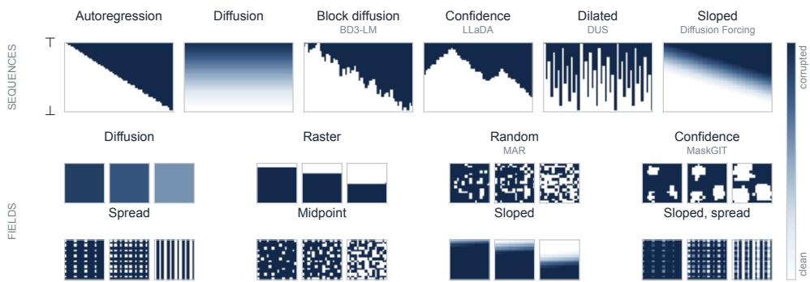
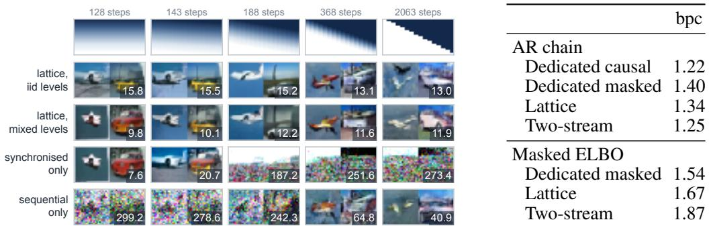
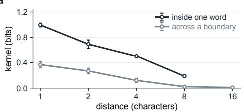
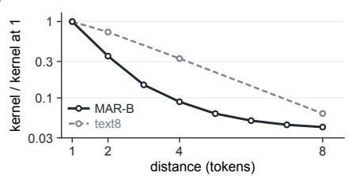
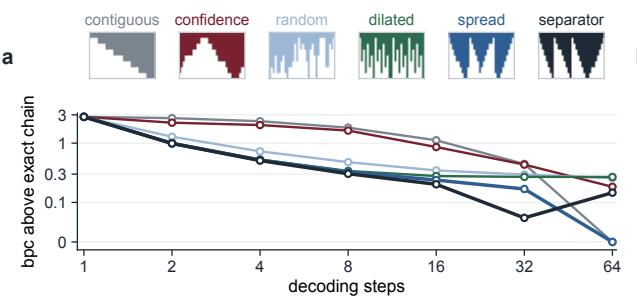
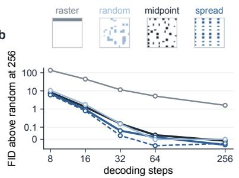
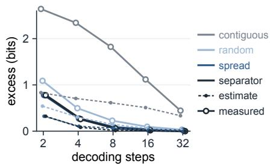
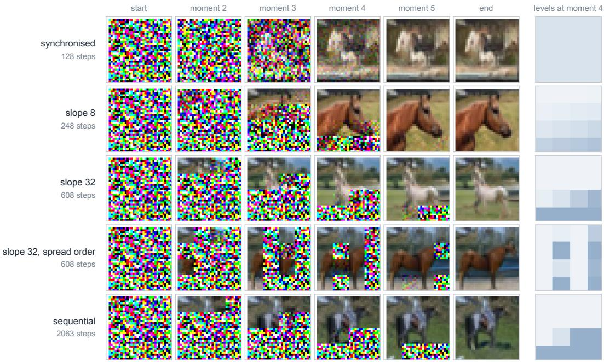

# THE LATTICE OF TRANSITION LAWS

T. Y. Tsui, Jiatao Gu, Lingjie Liu University of Pennsylvania

## ABSTRACT

Diffusion and autoregression (AR) have long been seen as different categories of generative models, with diffusion specialising in continuous fields and AR specialising in discrete tokens. Recent work seeks to combine the advantages of the two models, and each hybrid fixes its decoding schedule by design. In this paper, we ask whether the performance of decoding schedules of one model can be predicted before decoding at a fixed number of steps. We describe diffusion, AR, and models in between as paths on one corruption lattice, and define the cost of a schedule as the dependence its parallel steps discard. The cost shows that the fewest steps of a zero-cost schedule are set by the geometry of the data, in the same way for tokens and for continuous fields. In particular, for data that are Markov on a graph and dependent along its paths, the fewest steps equal the graph’s treedepth, which is logarithmic in the length of a sequence and linear in the side length of a grid. With fewer steps than the treedepth, every schedule pays a positive cost, whose ranking we predict before decoding with a kernel of pairwise dependence estimated from pretrained weights. Across text generation, image generation, and video generation, we verify most of the predictions about the rankings of different schedules under different metrics and benchmarks. This work therefore provides a design principle for decoding for future AR models, diffusion models, and anything in between. Our code is available at https://github.com/TSUITUENYUE/The-Latticeof-Transition-Laws.

## 1 INTRODUCTION

Autoregression, the default method for discrete tokens, generates each coordinate conditioned on what is already revealed (van den Oord et al., 2016). Diffusion, the default for continuous fields, progressively removes noise from all coordinates together (Ho et al., 2020; Song et al., 2021). Recent work combines their advantages in both domains. For continuous fields, coordinate-by-coordinate generation conditions each coordinate on the content generated before it (Li et al., 2024) and lets a video grow to any length (Chen et al., 2024; 2025). For discrete tokens, parallel updates reduce the one step per token required by autoregression (Nie et al., 2025).

In existing hybrid models, the design of each model fixes how autoregression and diffusion are combined (Arriola et al., 2025; Liu et al., 2026a; Sahoo et al., 2026; Wu et al., 2023; Ruhe et al., 2024; Kim et al., 2024). However, their measured quality reports only the schedule each model fixes. The schedule matters: with the same weights and the same few-step budget, the image quality of MAR varies by an order of magnitude across reveal orders (Table 3). Yet we lack a design principle that decides the schedule for a given model and data. A candidate schedule can only be judged after decoding with it. We therefore ask whether the performance of the decoding schedules of one model can be predicted before decoding.

Such a principle first needs a space that contains every schedule it can choose from and compare against. We assign a corruption level to each coordinate and let the levels vary independently, so that some coordinates can be clean while others are partly or fully corrupted. These assignments form the corruption lattice Ld. A decoding schedule then decides a path through the lattice: at each step, it chooses which coordinates to update and by how much (Figure 1).

A unifying space alone is not sufficient to be a design principle. Ranking different schedules needs a quantified cost. Earlier work also unifies the two families on discrete tokens: the training objective of masked diffusion is that of an any-order autoregressive model (Ou et al., 2025), and a per-position noise schedule on tokens expresses autoregression as a special case of diffusion (Fathi et al., 2025). Our lattice holds continuous fields as well, where Diffusion Forcing trains video with an independent noise level per frame, as next-token prediction with uncertainty (Chen et al., 2024). These prior works describe schedules, while our lattice adds a cost that compares them before decoding and predicts their performance. On our lattice, every step has an exact joint law for the coordinates it updates, and the cost of a parallel step is the dependence lost when each of them is drawn from its own conditional, which adds up along the path to the schedule’s divergence from exact sampling (Section 3). For data that are Markov on a graph and dependent along its paths, the ideal zero-cost schedule follows an elimination tree of the graph, updating the coordinates at one depth of the tree per step. The least depth of such a tree, the treedepth, is a lower bound on the number of steps of any zero-cost schedule (Section 4).

  
Figure 1: Decoder schedules on the lattice. Top: columns are coordinates, rows are successive states from ⊤ to ⊥, and shades run from white (clean) to blue (corrupted). Bottom: image-token schedules at 12.5%, 25% and 50% of the path; the last two show noise gradients in raster and spread order; Table 1 defines the rules.

With even fewer steps than the treedepth, every schedule will need to pay a cost. Two coordinates depend on each other less the farther apart they are, and a step that spreads its coordinates apart pays less than one that updates neighbours. Before decoding, we measure from a pretrained model how this dependence decreases with distance, as a kernel over pairs of positions, and use it to predict how the schedules of the model rank (Section 5).

In this paper, our contributions are:

• We place diffusion, autoregression and every schedule between them on one corruption lattice, and show that one set of weights can traverse it.

• We define the dependence cost of a schedule, the dependence its parallel steps discard, show that it equals the divergence of the path from exact sampling, for both discrete tokens and continuous values, and derive that for data Markov on a graph and dependent along its paths the fewest zero-cost steps equal the graph’s treedepth.

• We predict how schedules rank before decoding from a kernel of pairwise dependence estimated from pretrained weights, and test the predictions on released language, image and video models.

Related work is discussed in Appendix A.

## 2 DECODING SCHEDULES ON THE CORRUPTION LATTICE

The space must hold every decoder as a sequence of transition laws, each conditioned on a partially corrupted state. We write diffusion and autoregression in this form first. The forward process adds Gaussian noise with variance a, $y _ { a } = x _ { 0 } + { \sqrt { a } } \varepsilon$ , at levels $a _ { 0 } > \cdots > a _ { B }$ . A transition between two adjacent levels requires the conditional mean $\hat { x } _ { k } ( y ) = \mathbb { E } [ x _ { 0 } \mid y _ { a _ { k } } = y ]$ . Sampling fresh noise around the exact conditional mean of $y _ { k + 1 }$ gives the Gaussian law

$$
\begin{array} { r } { \widehat { p } ( y _ { k + 1 } \mid y _ { k } ) = \mathcal { N } \big ( r y _ { k } + ( 1 - r ) \widehat { x } _ { k } ( y _ { k } ) , \tau _ { k } I \big ) , \qquad \tau _ { k } = a _ { k + 1 } ( a _ { k } - a _ { k + 1 } ) / a _ { k } , } \end{array}\tag{1}
$$

with $r = a _ { k + 1 } / a _ { k }$ . Carrying the noise of $y _ { k }$ forward gives the deterministic law

$$
y _ { k + 1 } = { \hat { x } } _ { k } + { \sqrt { r } } \left( y _ { k } - { \hat { x } } _ { k } \right) .\tag{2}
$$

  
Figure 2: Both corners from one weight set. Pixels: columns give schedules and step counts (Figure 1), rows give training distributions, and cells show 2 samples and CIFAR-10 FID-50K. Tokens: text8 bpc at 85M; AR-chain rows use the identity order and masked-ELBO rows the maskeddiffusion bound (protocol in Appendix B.2).

Both diffusion laws use $\hat { x } _ { k } .$ , with $a _ { k }$ identifying the noise level of the conditioning state. Autoregression likewise specifies a transition law conditioned on a partially corrupted state. In the next-token conditional $p ( x _ { i } \mid x _ { < i } )$ , generated coordinates are clean and the rest are fully corrupted, and each step takes one coordinate from fully corrupted to clean. The causal mask carries these level labels.

## 2.1 ONE LEVEL PER COORDINATE

Let coordinate i carry its own level $\ell _ { i } \in L .$ , ordered from clean to fully corrupted: a noise variance in [0, ∞] for continuous data, and for tokens the absorbing channel, whose $\ell \to \infty$ end is the mask. Deployed token decoders use only the two ends (Austin et al., 2021; Sahoo et al., 2024; Nie et al., 2025); an interior level lets a step also choose how far to advance each coordinate (Appendix C.7). Conditioning on a lattice point ℓ includes the corrupted values it carries, which we leave implicit.

Definition 1 (Corruption lattice). The corruption lattice is $L ^ { d } ,$ , ordered coordinatewise. A decoding schedule is a monotone path from ⊤, every coordinate corrupted, $t o \perp ,$ , every coordinate clean. A stepfrom ℓ to $\ell ^ { \prime } \preceq \ell$ advances the coordinates $S = \{ i : \ell _ { i } ^ { \prime } < \dot { \ell } _ { i } \}$ . Its transition law is $p _ { \ell \to \ell ^ { \prime } } ( x _ { S } ^ { \prime } \mid \ell )$ with $x _ { S } ^ { \prime }$ the updated values at the destination levels $\ell _ { S } ^ { \prime } .$ . Coordinates outside S retain their values.

When the step or schedule fixes the destination levels, we write $p ( x _ { S } \mid \ell )$ for the transition law, with $x _ { S }$ the updated values. Entropies and mutual information below use the same convention.

Lemma 1 (Path representation). Let F be thefamily oftransition laws $p _ { \ell \to \ell ^ { \prime } }$ between lattice points $\ell ^ { \prime } \preceq \ell .$ Every monotone path composes elements of F into a law whose marginal on the clean coordinates is the data distribution, and two paths differ only in which elements ofF they evaluate.

The autoregressive chain rule is the sequential path, one coordinate at a time, and the diffusion chain the synchronised path on the noise axis; we define the lattice’s corners as these two paths. A trained model supplies the laws of Lemma 1 at the lattice points its training distribution covers, and trained diffusion and autoregressive models differ in that distribution as well as in their schedules.

## 2.2 ONE MODEL FOR EVERY SCHEDULE

The rest of the paper compares schedules on this lattice. We first show that one model can traverse it: one model, trained on a distribution over the whole lattice, decodes both corners and the schedules between them with the same weights (Figure 2). At the sequential token corner, its bits per character (bpc) are 0.06 below those of a dedicated masked model trained on random subsets. On pixels, the schedules it decodes span an order of magnitude in step count.

Following a path requires an architecture that expresses its conditionals and training that covers it.   
Trained on one family of paths, a model collapses on the others (Figure 2; Appendix B.2).

## 3 THE DEPENDENCE COST OF A SCHEDULE

Independent sampling replaces each joint law in Lemma 1 with a product of coordinate conditionals.   
We compare schedules at a fixed number of steps by the dependence they discard.

masked revealed advanced in this step pair the step pays for   
a b   
contiguous step 10   
spread step 2 000000● 000000   
step 3○○● ○○● ○○● ○   
separator●   
step4●●●●●●●

Figure 3: (a) The contiguous, spread and separator rules for a width-4 step on a chain of 16 coordinates, the separator rule from a state with 3 revealed coordinates. Arcs connect consecutive advanced coordinates, with heavier arcs indicating shorter distances. (b) The midpoint rule on 15 coordinates, advancing the midpoint of every run of masked coordinates at each step.

Proposition 1 (Exact path cost of parallel advance). Let $\pi = ( \ell ^ { ( 0 ) } , \dots , \ell ^ { ( T ) } )$ be a monotone schedule on the corruption lattice with advanced sets $S _ { t } .$ . Write $x _ { S _ { t } }$ for the updated values at the destination levels $\ell _ { S _ { t } } ^ { ( t + 1 ) }$ , with the transition indexfixed by π and suppressed. Let Pπ be the law ofthe path that draws each step from the exact joint law $p ( x _ { S _ { t } } \ | \ \ell ^ { ( t ) } )$ , and ${ \widetilde P } ^ { \pi }$ the law of the path that draws each stepfrom the product $\textstyle \prod _ { i \in S _ { t } } p ( x _ { i } \mid \ell ^ { ( t ) } )$ ofthe same coordinate conditionals. Then

$$
D _ { \mathrm { K L } } \big ( P ^ { \pi } \parallel \widetilde { P } ^ { \pi } \big ) \ = \ \sum _ { t = 0 } ^ { T - 1 } \mathbb { E } _ { P ^ { \pi } } \Big [ \operatorname { T C } \big ( S _ { t } \mid \ell ^ { ( t ) } \big ) \Big ] , \qquad \operatorname { T C } ( S \mid \ell ) = \sum _ { i \in S } H ( x _ { i } \mid \ell ) - H ( x _ { S } \mid \ell ) ,\tag{3}
$$

and the divergence between the two laws of the finished sample is at most the same sum.

Proposition 1 holds on every monotone path of the lattice, for continuous values and interior levels as well as for tokens, and the identity of Chen et al. (2026) is its special case on the two-level absorbing lattice with every advanced set fixed. The two also answer different questions. Averaged over positions drawn at random, their identity depends only on how many tokens each step unmasks, through the mean information that a token shares with a random set of revealed tokens, and their schedules choose these step widths. Proposition 1 keeps the positions and levels of a given path and asks which coordinates each step should update. Two schedules with the same widths can differ widely in this cost, since neighbouring coordinates share more information than distant ones. On text8, switching from contiguous to spread selection at fixed widths lowers bpc by about 2 bits, while changing the widths at a fixed rule moves it by less than 0.3 bits (Appendix C.6). Along a random scan of the absorbing lattice, the sum is the one that Cai & Li (2026) control.

At an interior level, the cost is the total correlation of the values that the step reaches. Advancing a set to an interior level before the clean level reduces the cost by the information that the other coordinates’ interior values carry about each coordinate beyond its own (Appendix C.7). Two advances per coordinate double the step width at a fixed step budget.

The dependence cost in Proposition 1 vanishes on a sequential path, where each step advances one coordinate. On a channel with a continuum of levels it also vanishes along the synchronised path, as the level increments tend to zero. On the two-level token channel the synchronised path is a single step that reveals every coordinate and pays their full total correlation.

When dependence decreases with distance, selecting adjacent coordinates incurs the largest cost at a given width. The contiguous rule of Table 1 makes this selection at every step.

A continuous decoder applies the conditional mean through equation 1 or equation 2 at each step. Its measured decoding error comprises the dependence cost in Proposition 1, errors in the trained conditionals, and the one-step error of the continuous channel.

## 4 SCHEDULES WITH ZERO DEPENDENCE COST

Revealed coordinates separate the masked ones: on a chain, one coordinate per masked run is a conditionally independent set (Figure 3). We define a coordinate as resolved once it is clean.

Theorem 1 (Separator schedules). Fix a lattice state and suppose that, given its revealed coordinates, the unresolved coordinates are Markov with respect to a graph G, and that at this and every later state any two unresolved coordinates joined by a path of unresolved coordinates are dependent. Then thefewest steps ofa schedule with zero dependence cost equal the treedepth td(G) ofG.

Given the revealed coordinates, coordinates in different connected components of G are independent, and a step that resolves one coordinate per component has zero cost (Appendix C). Two coordinates of one component are dependent, and a zero-cost step resolves at most one of them. Resolving a coordinate removes it from G and can split its component. Hence a zero-cost schedule traces an elimination tree of G, in which each resolved coordinate is the parent of the components it leaves and each step resolves one depth. The least depth of such a tree is the treedepth (Nesetˇ ˇril & Ossona de Mendez, 2006). On a chain of d coordinates, the midpoint rule resolves the midpoint of every run, which halves every run, and finishes in $\lceil \log _ { 2 } ( d + 1 ) \rceil$ steps, the chain’s treedepth. On an $n \times n$ grid, splitting the grid takes a whole row or column, and the treedepth lies between n + 1 and a constant multiple of n (Nesetˇ ˇril & Ossona de Mendez, 2012; Bodlaender, 1998; George, 1973).

The separator rule starts a step at the middle masked coordinate and adds, one at a time, the masked coordinate farthest from those already chosen, at most one per masked run until every run has one.

## 5 RANKING SCHEDULES BELOW THE TREEDEPTH

When the coordinates are dependent along the graph’s paths, every schedule with fewer steps than the treedepth pays a positive cost (Theorem 1). At a fixed step budget, we compare the candidates’ path costs in equation 3 through a pairwise lower bound. For a specified advance from a lattice state, we define the kernel as the conditional mutual information between two updated coordinate values, with the destination levels suppressed,

$$
\kappa ( i , j \mid \ell ) ~ = ~ I { \big ( } x _ { i } ; x _ { j } \mid \ell { \big ) } ,
$$

which is equation 3 for the pair $S = \{ i , j \}$

Lemma 2 (The pairwise lower bound). For an advanced set $S = \{ i _ { 1 } < \cdots < i _ { k } \}$ , at any state and under any data distribution,

$$
\mathrm { T C } ( S \mid \ell ) \ \geq \ \sum _ { j = 2 } ^ { k } I { \big ( } x _ { i _ { j } } ; x _ { i _ { j - 1 } } \mid \ell { \big ) } ,
$$

the kernel summed over consecutive members of S. Equality holds exactly when, given the state, each selected coordinate is independent of the earlier selected ones given its predecessor: a firstorder Markov reference.

We define a schedule’s pairwise estimate by summing this bound over its steps. The estimate needs only the path and the kernel and is computed before decoding.

Corollary 1 (The reference model). On the reference model ofLemma 2, afirst-order Markov chain at every state, a step of k coordinates with consecutive gaps at least s, where $\kappa \leq \varepsilon$ at distances $\geq s ,$ , pays at most $( k - 1 ) \varepsilon . \ A$ schedule whosefirst step advances $S _ { 1 } = \{ i _ { 1 } < \cdots < i _ { m } \}$ and whose every later step advances the midpoint of every run of masked coordinates pays $\operatorname { T C } ( S _ { 1 } \mid { \mathsf { T } } ) =$ $\begin{array} { r } { \sum _ { j = 2 } ^ { m } \kappa ( i _ { j - 1 } , \dot { i } _ { j } ) } \end{array}$ and completes within budget $\dot { T }$ when every gap of $\{ 0 \} \cup \bar { S _ { 1 } } \cup \{ d + 1 \}$ is at most $2 ^ { { \check { T } } - 1 }$

## 6 EXPERIMENTS

We compare predicted and measured rankings of the selection rules of Table 1, at matched step budgets, on our text8 model, the released MAR-B image model, which generates continuous-valued tokens with a per-token diffusion head (Li et al., 2024), LLaDA-8B (Nie et al., 2025) and a pretrained Diffusion Forcing video model (Chen et al., 2025). The rules keep a parallel step cheap by the distance between its coordinates or by their separation (Section 4), or come from released decoders.

On text8, we score the true characters after a revealed prefix against the left-to-right chain (Figure 5a) and against each schedule’s own sequential chain, which reveals the same coordinates one at a time.

## 6.1 THE KERNEL

We estimate the two entropy terms in equation 3 using the trained model. A single forward pass gives the marginal entropies $\bar { H ( \boldsymbol { x } _ { i } \mid \boldsymbol { \ell } ) }$ . To obtain the joint entropy $H ( x _ { S } \mid \ell )$ , we sum the conditional entropies along a chain that reveals the coordinates of S one at a time, requiring one forward pass per coordinate. On text8, we estimate the kernel as a function of distance and mask rate, for pairs within a word and pairs across a word boundary (Figure 4a, Table 12), and evaluate it at each step’s distances and mask rate. At distances up to 4, dependence within a word is 2 to 4 times that across a boundary at the same distance; by distance 16, the kernel is near zero.

Table 1: Selection rules by principle, what each step selects, and the models they are tested on. Schematics as in Figure 1: 16 coordinates from all masked (top) to all clean (bottom) under steps of widths 1, 2, 4 and 9, or one snapshot of an image-token grid. Contiguous, random and confidence selection follow Arriola et al. (2025), Sahoo et al. (2024) and Nie et al. (2025); dilated and lowdiscrepancy selection follow Luxembourg et al. (2026) and Besnier et al. (2025).
<table><tr><td>Principle</td><td>Rule</td><td>Each step selects</td><td>Schedule text8</td><td></td><td></td><td>MAR LLaDA</td></tr><tr><td rowspan="3">released</td><td>contiguous</td><td rowspan="3">neighbours, in order (raster) random positions</td><td></td><td>√</td><td>√</td><td></td></tr><tr><td>random</td><td></td><td>√</td><td></td><td>了</td></tr><tr><td>confidence the most confident</td><td></td><td>√</td><td></td><td>√</td></tr><tr><td rowspan="4">distance</td><td>spread</td><td>evenly spaced</td><td></td><td>√</td><td></td><td>V</td></tr><tr><td>dilated</td><td>a fixed interleaved order</td><td>H</td><td></td><td></td><td></td></tr><tr><td>low-discrepancy</td><td>an evenly covering order</td><td>深用</td><td></td><td></td><td></td></tr><tr><td>spread, then raster</td><td>spread, then rows</td><td></td><td></td><td>√</td><td></td></tr><tr><td rowspan="3">separation</td><td>separator</td><td>one per masked run</td><td></td><td>√</td><td></td><td></td></tr><tr><td>midpoint</td><td>farthest from revealed</td><td></td><td>√</td><td>√</td><td></td></tr><tr><td>nested</td><td>middle row and column first</td><td></td><td></td><td>√</td><td></td></tr><tr><td rowspan="2"></td><td>constrained min-distance</td><td>confident, kept apart</td><td>t</td><td></td><td></td><td>√</td></tr><tr><td>separator constraint confident, one per run</td><td></td><td></td><td></td><td></td><td>√</td></tr></table>

Table 2: MAR-B kernels at revealed fraction 0.5 (left) and 8-step floors (right). The kernels give the relative displacement of a masked token’s prediction when a revealed neighbour at Chebyshev distance d is perturbed, and the Kullback–Leibler divergence in bits of its head law when such a neighbour is revealed. A floor sums the kernel at fraction 0.5 over consecutive tokens of each step and over the steps; spread-then-raster’s floors came after its decode. FID-50K as in Table 3.
<table><tr><td rowspan="2">d</td><td colspan="2">kernel</td><td rowspan="2">8 steps</td><td colspan="2">floor</td><td rowspan="2">FID</td></tr><tr><td>displacement</td><td>information</td><td>displacement</td><td>information</td></tr><tr><td>1</td><td>0.330</td><td>1.449</td><td>raster</td><td>77.1</td><td>338</td><td>139.80</td></tr><tr><td>2</td><td>0.119</td><td>0.209</td><td>spread, then raster</td><td>46.4</td><td>182</td><td>17.44</td></tr><tr><td>3</td><td>0.051</td><td>0.048</td><td>random</td><td>8.11</td><td>14.7</td><td>13.02</td></tr><tr><td>4</td><td>0.030</td><td>0.017</td><td>midpoint</td><td>7.56</td><td>12.5</td><td>10.63</td></tr><tr><td>5</td><td>0.021</td><td>0.009</td><td>low-discrepancy</td><td>3.87</td><td>1.57</td><td>8.32</td></tr><tr><td></td><td></td><td></td><td>nested</td><td>3.76</td><td>2.10</td><td>13.73</td></tr><tr><td></td><td></td><td></td><td>spread</td><td>3.27</td><td>0.641</td><td>9.44</td></tr></table>

a  

b  
  
Figure 4: Kernels measured before decoding. (a) Entropy decrease in bits when a second text8 coordinate is revealed, at mask rate 0.5, by sequence distance: within-word and across-boundary pairs, mean and s.e.m. over 3 seeds, 512 pairs per cell. (b) Relative displacement of a masked-token prediction after a revealed-token perturbation on MAR-B, at revealed fraction 0.5, by grid distance, beside the across-boundary curve of (a); both are normalised at distance 1.

On the MAR token grid, we measure dependence by the relative change in a prediction when a revealed token is perturbed. This response stands in for the mutual-information kernel and falls below 5% of its nearest-neighbour value by grid distance 8 (Figure 4b). An information kernel, the Kullback–Leibler divergence of a masked token’s head law when one more neighbour is revealed, falls much faster with distance than this response; floors built from the two order the rules alike, up to 2 rules whose displacement floors nearly tie (Table 2, Appendix C.4).

Table 3: Measured quality by selection rule and number of decoding steps. Left: text8 bpc under the protocol of Figure 5; the contiguous rule uses one step per block. Right: FID-50K on ImageNet-256 from released MAR-B weights and MAR’s released evaluator, with only the reveal order changed; 1 seed per cell, except random and midpoint at 8 and 16 steps, averaged over 3 seeds within 0.25 FID. The 256-step random rule reproduces the published score.
<table><tr><td>text8, bpc</td><td>8</td><td>16</td><td>32</td><td>64</td></tr><tr><td>contiguous</td><td>3.14</td><td>2.44 2.18</td><td>1.77 1.76</td><td>1.32 1.50</td></tr><tr><td>confidence random</td><td>2.95 1.80</td><td>1.67</td><td>1.62</td><td>1.58</td></tr><tr><td>dilated</td><td>1.66</td><td>1.60</td><td>1.59</td><td>1.59</td></tr><tr><td>spread</td><td>1.65</td><td>1.56</td><td>1.49</td><td>1.32</td></tr><tr><td>separator</td><td>1.63</td><td>1.52</td><td>1.38</td><td>1.47</td></tr></table>

<table><tr><td>MAR-B, FID</td><td>8</td><td>16</td><td>32</td><td>64</td><td>256</td></tr><tr><td>raster</td><td>139.80</td><td>46.97</td><td>13.98</td><td>7.49</td><td>3.93</td></tr><tr><td>random, the model&#x27;s own</td><td>13.02</td><td>4.10</td><td>2.48</td><td>2.32</td><td>2.33</td></tr><tr><td>midpoint</td><td>10.63</td><td>3.63</td><td>2.48</td><td>2.36</td><td>2.31</td></tr><tr><td>spread</td><td>9.44</td><td>3.27</td><td>2.40</td><td>2.34</td><td>2.28</td></tr><tr><td>low-discrepancy</td><td>8.32</td><td>3.13</td><td>2.36</td><td>2.27</td><td>2.29</td></tr><tr><td>nested</td><td>13.73</td><td>4.26</td><td>2.37</td><td>一</td><td>一</td></tr><tr><td>spread, then raster</td><td>17.44</td><td>5.80</td><td>一</td><td>一</td><td>一</td></tr></table>

  
Figure 5: Schedule quality versus decoding steps. (a) Excess bpc over the exact left-to-right chain on 64 held-out text8 characters after a revealed 192-character prefix, teacher forced on one weight set. Insets show the schedules. (b) Excess FID-50K over MAR-B’s 256-step random order; patches show the first 32 tokens of each order and the dashed blue curve is low-discrepancy. Both vertical axes are linear below 0.1 and logarithmic above.

## 6.2 THE RANKING OF SCHEDULES

We rank the selection rules by their pairwise estimates, computed from the model’s kernel using Lemma 2. On the sequence, contiguous selection groups the pairs with the largest kernel values. Confidence selection favours coordinates already determined by local context, which usually lie close together, and its estimate is large as well. Random selection mixes near and distant pairs and has an intermediate estimate. The spread rule and the separator rule keep selected pairs farther apart and have the smallest estimates. On the grid, raster order has the largest estimate, then the random and midpoint rules, and the spread, nested and low-discrepancy rules the smallest.

On text8, the rules of Table 5 rank as their pairwise estimates predict at 8, 16 and 32 steps (Figure 5a, Table 3). At 64 steps, each rule selects one coordinate per step, so dependence cost vanishes and bpc reflects order-dependent errors in the trained conditionals (Section 6.3).

On MAR, FID follows the predicted ordering of the raster, random, midpoint and spread rules at 8 and 16 steps, random and midpoint tie at 32, and the low-discrepancy rule, which the estimates place above spread, reads lowest (Figure 5b, Table 3). The spread rule’s gain is largest at 8 steps, where it lowers FID by more than 25% from the model’s own random order. Each step then advances 32 of the 256 tokens on average, and up to 49. Randomly selecting that many tokens places many pairs at distances where the kernel is still large, and smaller selections place fewer. At 64 steps, every order except raster lies within 0.1 FID of the others, as their estimates predict.

We use LLaDA to test rankings under generative perplexity and task accuracy. Confidence selection chooses tokens by the model’s output, which a position-only rule ignores. The kernel predicts a gain from keeping the model’s confidence ranking while excluding strongly dependent pairs, which the min-distance rule and the separator constraint do. Relative to plain confidence, the min-distance rule lowers perplexity at every measured budget, also once repetition is controlled (Appendix C.9), and both constraints improve GSM8K accuracy from 8 to 32 steps (Table 4). The GSM8K gain is largest at 8 and 16 steps, where steps are widest, and disappears from 64 steps on.

Table 4: Changes relative to plain confidence on LLaDA-8B-Base. GSM8K: strict-match percentage points, 5-shot greedy decoding on 1,319 problems, paired standard errors. Perplexity: change in log generative perplexity (nats), bootstrap intervals (Table 25). One 256-position block; minimum distance 6. When too few positions satisfy a constraint, confidence fills the step: 1–21% of GSM8K steps for min-distance and 8–55% for the separator constraint.
<table><tr><td>Steps</td><td>8</td><td>16</td><td>32</td><td>64</td><td>128</td></tr><tr><td>accuracy, min-distance</td><td> $+ 9 . 7 \pm 0 . 8$ </td><td> $+ 7 . 6 \pm 0 . 9$ </td><td> $+ 5 . 3 \pm 1 . 5$ </td><td> $- 0 . 9 \pm 1 . 6$ </td><td> $- 0 . 2 \pm 1 . 4$ </td></tr><tr><td>accuracy, separator constraint</td><td> $+ 9 . 7 \pm 0 . 8$ </td><td> $+ 8 . 2 \pm 0 . 9$ </td><td> $+ 6 . 5 \pm 1 . 5$ </td><td> $- 2 . 0 \pm 1 . 6$ </td><td> $- 1 . 4 \pm 1 . 3$ </td></tr><tr><td>perplexity, min-distance</td><td>-1.04</td><td>-0.90</td><td>-1.49</td><td> $- 1 . 5 6$ </td><td></td></tr><tr><td>95% interval</td><td>[−1.25, -0.83] [−1.16, -0.65] [−1.82, -1.15] [−1.88, -1.25]</td><td></td><td></td><td></td><td></td></tr></table>

<table><tr><td>estimate / measured</td><td>2 steps</td><td>8 steps</td><td>32 steps</td></tr><tr><td>contiguous</td><td>0.83 / 2.64</td><td>0.62 / 1.82</td><td>0.33 / 0.44</td></tr><tr><td>random</td><td>0.54 / 1.09</td><td>0.15 / 0.23</td><td>0.02 / 0.03</td></tr><tr><td>spread</td><td>0.32 / 0.78</td><td>0.06 / 0.09</td><td>0.00 / 0.01</td></tr><tr><td>separator</td><td>0.32 / 0.78</td><td>0.01 / 0.06</td><td>0.00 / 0.00</td></tr></table>

  
Table 5: Pairwise estimate and measured excess bpc over each schedule’s own sequential chain (protocol of Figure 5). The plot adds 4 and 16 steps; estimates filled, measurements open.

The cost also predicts a trend, which we verify with the above experiments: the fewer the steps, the larger the gain over the released models’ own rules, in FID and GSM8K accuracy (Tables 3 and 4).

On a Diffusion Forcing video model (Chen et al., 2024; 2025), the schedule controls memory depth: how many earlier frames each segment conditions on. Greater depth costs more steps, and the slowly decaying inter-frame kernel predicts the same quality, as subject consistency shows (Appendix D). Appendices C.8, C.9 and C.11 test free generation, position-only LLaDA rules and HumanEval.

## 6.3 THE MAGNITUDE OF THE COST

To see whether the estimate also gives the size of the cost, and how the cost compares with errors in the trained conditionals, we measure it on text8 as the excess bpc of a decode over the schedule’s own sequential chain (Table 5). The estimate is at or below this excess at every budget and ranks the rules in the same order, including the spread–separator tie at 2 steps. At 2 steps it is about 30% to 50% of the excess; the absolute gap narrows with more steps.

A schedule’s total bpc (Table 3) minus its excess is the bpc of its sequential chain, and differences between chains are conditional errors, since text entropy is independent of order. The left-to-right chain has the lowest bpc, but contiguous selection pays the largest dependence cost, and spread a lower one with higher conditional error. When steps are wide, their difference in dependence cost is several times their difference in conditional error. When steps narrow, the random, spread and separator rules have almost the same dependence cost, but conditional errors that differ by tenths of a bit. Conditional errors explain the separator rule’s rise from 32 to 64 steps and the tie of contiguous and spread at 64.

## 6.4 SEPARATION

Section 4 keeps a step cheap by separation, which gives zero cost on a Markov graph, or by distance, which only lowers it, and we test which of the two the rankings follow: on text8 one revealed character splits a run, and on MAR’s token grid a split takes a whole row. On text8, a revealed character leaves most of the dependence between its neighbours within a word, and among the rules that take one coordinate per run, the separator rule, which also keeps its coordinates apart, has at most 25% of the midpoint rule’s excess (Appendix C.2). On the grid, any advantage of midpoint selection comes from distance: it lowers FID below random by about 20% at 8 steps and 10% at 16, as the kernel’s decay predicts. Spread and low-discrepancy selection lower it further, while spread-then-raster reads above random, in the order of its floors (Tables 2 and 3). Below the grid’s treedepth, distance sets the ranking.

Table 6: Bpc of a complete decode, all stages scored, at equal steps on held-out text8; one 85M backbone per channel.
<table><tr><td>Steps</td><td>8</td><td>16</td><td>32</td><td>64</td></tr><tr><td>absorbing, spread</td><td>1.691</td><td>1.600</td><td>1.584</td><td>1.555</td></tr><tr><td>graded, class then character</td><td>1.790</td><td>1.736</td><td>1.716</td><td>1.703</td></tr><tr><td>graded, character at once</td><td>1.886</td><td>1.793</td><td>1.749</td><td>1.717</td></tr></table>

Theorem 1 also sets the zero-cost budget. A chain of 64 masked text8 characters has treedepth 7, so the 8-step budget suffices on the first-order Markov reference (Corollary 1). Real text retains dependence across revealed characters (Appendix C.2): at 8 steps the separator rule’s measured excess is several times its estimate, and both are almost zero only at 32 (Table 5). MAR’s 16 × 16 token grid has treedepth between 17 and 46, and under the assumptions of Theorem 1 every order has a positive cost in 8 and 16 steps, and every rule with a 64-step reading has a higher FID at both budgets. The nested rule follows the grid’s separators and its 8-step floors lie below random’s (Table 2), yet it reads above random at both budgets (Table 3).

## 6.5 INTERIOR LEVELS

A common observation in diffusion language models is that the absorbing channel works best (Austin et al., 2021; Lou et al., 2024; Sahoo et al., 2024), and the cost defined on the lattice gives one explanation consistent with it. An interior level, such as a token under uniform noise or a revealed character class, lowers the dependence cost of each set, since the other coordinates’ interior values carry part of the dependence, but adds an advance to every coordinate, which widens every step at a fixed budget (Section 3); it helps when the saving exceeds the cost of the wider steps. We measure this trade-off with a graded text8 model whose interior level reveals whether a character is a space, a vowel or a consonant. Before decoding, the pairwise estimates of its two stages sum to 2 times the absorbing model’s at 8 steps, where the wider steps win, and to within a few thousandths of it from 16, where the two about cancel. The absorbing model’s bpc is lower at every budget (Table 6), at 8 steps mostly through the larger dependence cost and from 16 steps mostly through the graded model’s own sequential chain (Appendix C.7).

## 7 CONCLUSION

In this paper we ask whether the performance of the decoding schedules of one model can be predicted before decoding, and build a space and a cost that a design principle for choosing a schedule needs. The corruption lattice is a space that contains diffusion, autoregression and every schedule between them as paths through one family of transition laws. The dependence cost ranks these paths: it is the total correlation that a path’s parallel steps discard, and it equals the path’s divergence from exact sampling. When the data are Markov on a graph and dependent along its paths, the fewest steps of a zero-cost schedule equal the graph’s treedepth for tokens and continuous values alike, which is logarithmic in the length of a sequence but linear in the side length of a grid. With even fewer steps than the treedepth, a kernel of pairwise dependence estimated from pretrained weights predicts how schedules rank before decoding. Where schedules differ in dependence cost, most measured rankings follow the predicted ones across modalities and benchmarks.

The exceptions mark what the framework leaves out. Errors in the trained conditionals lie outside the cost and can determine the ranking when dependence costs are close and reverse a prediction at one training budget that holds at a larger one (Appendices C.3 and B.2). The pairwise bound is tight only on a first-order Markov reference. On MAR, the nested rule reads above random and the lowdiscrepancy rule below spread, against the order of their floors (Sections 6.2 and 6.4, Appendix C.4). Nonetheless, the lattice and its cost provide a quantified design principle with which future diffusion, autoregressive and intermediate decoders can be designed.

## ETHICS STATEMENT

We use public datasets and released model weights, and train our own models on text8, CIFAR-10 and ImageNet-256. On released models we change only how they decode, and what they can produce stays as released.

## REPRODUCIBILITY STATEMENT

Appendices B and C contain the formal statements and proofs. Table 1, Section 4 and Appendix C.4 define the decoding rules, and the table and figure captions state the evaluation protocols. We evaluate released models with their released weights. The supplementary code trains our models, estimates the kernels and decodes under every schedule. Each table and figure that reports a measurement has one script, named by its number in the paper, that writes its data.

## AI USE STATEMENT

We used generative AI tools to polish the manuscript and check novelty against existing publications. We also used them for coding and for checking derivations. We have reviewed all AI-assisted work and take responsibility for the content of the paper.

## REFERENCES

Marianne Arriola, Aaron Gokaslan, Justin T. Chiu, Zhihan Yang, Zhixuan Qi, Jiaqi Han, Subham Sekhar Sahoo, and Volodymyr Kuleshov. Block diffusion: Interpolating between autoregressive and diffusion language models. In ICLR, 2025.

Hikaru Asano, Tadashi Kozuno, Kuniaki Saito, and Yukino Baba. Where-to-unmask: Groundtruth-guided unmasking order learning for masked diffusion language models. arXiv preprint arXiv:2602.09501, 2026.

Jacob Austin, Daniel D. Johnson, Jonathan Ho, Daniel Tarlow, and Rianne van den Berg. Structured denoising diffusion models in discrete state-spaces. In NeurIPS, 2021.

Victor Besnier, Mickael Chen, David Hurych, Eduardo Valle, and Matthieu Cord. Halton scheduler for masked generative image transformer. In ICLR, 2025.

Hans L. Bodlaender. A partial k-arboretum of graphs with bounded treewidth. Theoretical Computer Science, 209(1–2):1–45, 1998.

Changxiao Cai and Gen Li. Confidence-based decoding is provably efficient for diffusion language models. arXiv preprint arXiv:2603.22248, 2026.

Huiwen Chang, Han Zhang, Lu Jiang, Ce Liu, and William T. Freeman. MaskGIT: Masked generative image transformer. In CVPR, 2022.

Boyuan Chen, Diego Mart´ı Monso, Yilun Du, Max Simchowitz, Russ Tedrake, and Vincent Sitz-´ mann. Diffusion forcing: Next-token prediction meets full-sequence diffusion. In NeurIPS, 2024.

Guibin Chen, Dixuan Lin, Jiangping Yang, Chunze Lin, Junchen Zhu, Mingyuan Fan, Hao Zhang, Sheng Chen, Zheng Chen, Chengcheng Ma, Weiming Xiong, Wei Wang, Nuo Pang, Kang Kang, Zhiheng Xu, Yuzhe Jin, Yupeng Liang, Yubing Song, Peng Zhao, Boyuan Xu, Di Qiu, Debang Li, Zhengcong Fei, Yang Li, and Yahui Zhou. SkyReels-V2: Infinite-length film generative model. arXiv preprint arXiv:2504.13074, 2025.

Ricky T. Q. Chen, Yulia Rubanova, Jesse Bettencourt, and David Duvenaud. Neural ordinary differential equations. In NeurIPS, 2018.

Sitan Chen, Kevin Cong, and Jerry Li. Optimal inference schedules for masked diffusion models. In COLT, 2026.

Nima Fathi, Torsten Scholak, and Pierre-Andre No´ el. Unifying autoregressive and diffusion-based¨ sequence generation. In COLM, 2025.

Alan George. Nested dissection of a regular finite element mesh. SIAM Journal on Numerical Analysis, 10(2):345–363, 1973.

Joseph E. Gonzalez, Yucheng Low, Arthur Gretton, and Carlos Guestrin. Parallel Gibbs sampling: From colored fields to thin junction trees. In AISTATS, pp. 324–332, 2011.

Jonathan Ho, Ajay Jain, and Pieter Abbeel. Denoising diffusion probabilistic models. In NeurIPS, 2020.

Emiel Hoogeboom, Alexey A. Gritsenko, Jasmijn Bastings, Ben Poole, Rianne van den Berg, and Tim Salimans. Autoregressive diffusion models. In ICLR, 2022.

Metod Jazbec, Theo X. Olausson, Louis Bethune, Pierre Ablin, Michael Kirchhof, Jo ´ ao Monteiro, ˜ Victor Turrisi, Jason Ramapuram, and Marco Cuturi. Learning unmasking policies for diffusion language models. In ICML, 2026.

Jihwan Kim, Junoh Kang, Jinyoung Choi, and Bohyung Han. FIFO-diffusion: Generating infinite videos from text without training. In NeurIPS, 2024.

Sanghyun Lee, Seungryong Kim, Jongho Park, and Dongmin Park. Lookahead unmasking elicits reliable decoding in diffusion language models. In ICML, 2026.

Gen Li and Changxiao Cai. Breaking AR’s sampling bottleneck: Provable acceleration via diffusion language models. In NeurIPS, 2025.

Tianhong Li, Yonglong Tian, He Li, Mingyang Deng, and Kaiming He. Autoregressive image generation without vector quantization. In NeurIPS, 2024.

Jingyu Liu, Xin Dong, Zhifan Ye, Rishabh Mehta, Yonggan Fu, Vartika Singh, Jan Kautz, Ce Zhang, and Pavlo Molchanov. TiDAR: Think in diffusion, talk in autoregression. In MLSys, 2026a.

Kunhao Liu, Wenbo Hu, Jiale Xu, Ying Shan, and Shijian Lu. Rolling forcing: Autoregressive long video diffusion in real time. In ICLR, 2026b.

Aaron Lou, Chenlin Meng, and Stefano Ermon. Discrete diffusion modeling by estimating the ratios of the data distribution. In ICML, 2024.

Omer Luxembourg, Haim Permuter, and Eliya Nachmani. Plan for speed: Dilated scheduling for masked diffusion language models. In ICML, 2026.

Jaroslav Nesetˇ ˇril and Patrice Ossona de Mendez. Tree-depth, subgraph coloring and homomorphism bounds. European Journal ofCombinatorics, 27(6):1022–1041, 2006.

Jaroslav Nesetˇ ˇril and Patrice Ossona de Mendez. Sparsity: Graphs, Structures, and Algorithms, volume 28 of Algorithms and Combinatorics. Springer, 2012.

Shen Nie, Fengqi Zhu, Zebin You, Xiaolu Zhang, Jingyang Ou, Jun Hu, Jun Zhou, Yankai Lin, Ji-Rong Wen, and Chongxuan Li. Large language diffusion models. In NeurIPS, 2025.

Jingyang Ou, Shen Nie, Kaiwen Xue, Fengqi Zhu, Jiacheng Sun, Zhenguo Li, and Chongxuan Li. Your absorbing discrete diffusion secretly models the conditional distributions of clean data. In ICLR, 2025.

David Ruhe, Jonathan Heek, Tim Salimans, and Emiel Hoogeboom. Rolling diffusion models. In ICML, 2024.

Subham Sekhar Sahoo, Marianne Arriola, Yair Schiff, Aaron Gokaslan, Edgar Marroquin, Justin T. Chiu, Alexander Rush, and Volodymyr Kuleshov. Simple and effective masked diffusion language models. In NeurIPS, 2024.

Subham Sekhar Sahoo, Zhihan Yang, Yash Akhauri, Johnna Liu, Deepansha Singh, Zhoujun Cheng, Zhengzhong Liu, Eric Xing, John Thickstun, and Arash Vahdat. Esoteric language models: A family of any-order diffusion LLMs. In ICML, 2026.

Yang Song, Jascha Sohl-Dickstein, Diederik P. Kingma, Abhishek Kumar, Stefano Ermon, and Ben Poole. Score-based generative modeling through stochastic differential equations. In ICLR, 2021.

Aaron van den Oord, Nal Kalchbrenner, and Koray Kavukcuoglu. Pixel recurrent neural networks.¨ In ICML, 2016.

Tong Wu, Zhihao Fan, Xiao Liu, Hai-Tao Zheng, Yeyun Gong, Yelong Shen, Jian Jiao, Juntao Li, Zhongyu Wei, Jian Guo, Nan Duan, and Weizhu Chen. AR-diffusion: Auto-regressive diffusion model for text generation. In NeurIPS, 2023.

Zhilin Yang, Zihang Dai, Yiming Yang, Jaime Carbonell, Ruslan Salakhutdinov, and Quoc V. Le. XLNet: Generalized autoregressive pretraining for language understanding. In NeurIPS, 2019.

## A RELATED WORK

## A.1 HYBRIDS OF AUTOREGRESSION AND DIFFUSION

Order-agnostic autoregression and absorbing diffusion are special cases of autoregressive diffusion models, which support parallel generation adapted to a given budget of steps (Hoogeboom et al., 2022), and the training objective of absorbing diffusion is that of an any-order autoregressive model (Ou et al., 2025). Block diffusion generates autoregressively across blocks and uses diffusion within each block (Arriola et al., 2025). Draft-verify systems propose tokens with a diffusion head and accept them under an autoregressive model (Liu et al., 2026a). Their deployed distribution remains autoregressive, with diffusion accelerating the proposals. Esoteric language models interpolate between the two objectives using a masking-rate hyperparameter (Sahoo et al., 2026).

Hyperschedules assign each token position a monotone noise schedule, with autoregression and diffusion as members of the resulting family (Fathi et al., 2025). Each schedule is a path on our lattice. The authors also study block and sliding-window schedules that advance from left to right on discrete text, obtaining each by fine-tuning a model trained with the diffusion schedule. AR-Diffusion assigns fewer denoising steps to tokens on the left, which therefore resolve first (Wu et al., 2023). Both works train under the likelihood bound of the chosen schedule. Both show that autoregression can be written as a diffusion schedule. Neither quantifies the dependence discarded when selected coordinates are sampled independently, so each schedule must be trained before it can be compared. Proposition 1 gives this quantity for every path. With a kernel from an existing model, we can compare schedules before decoding or before training the target model. The chosen schedule runs on the pretrained weights; every schedule we compare on released models in Section 6 uses those weights as released.

Video models also use intermediate corruption levels. Diffusion Forcing trains with an independent level per coordinate on a causal architecture, motivated as uncertainty-aware next-token prediction (Chen et al., 2024). We represent these corruption patterns on a lattice and derive the dependence cost of each step, including steps over spatial coordinates. Rolling schedules and diagonal denoising fix the slope in advance (Ruhe et al., 2024; Kim et al., 2024); streaming windows carry monotonically increasing levels (Liu et al., 2026b). These arrangements are paths on the same lattice (Figure 1), whose per-step dependence cost Section 3 defines. For training across paths, we use two-stream attention from the order-modelling literature (Yang et al., 2019) to recover the supervision density of autoregression.

## A.2 THE DEPENDENCE COST OF A DECODING STEP

On the absorbing lattice with every advanced set fixed, Proposition 1 is due to Chen et al. (2026). They sharpen the parallel-decoding bound of Li & Cai (2025) to an identity: the divergence between the data and the finished sample is the sum over steps of the total correlation of the advanced coordinates conditioned on the revealed ones. Drawing the positions of each step uniformly among those still masked, they reduce the expected divergence to the distance between a curve of mean mutual information and its step approximation, choose how many coordinates each step advances, and derive $O ( \log d )$ schedules for d tokens in terms of the total and dual total correlation of the data. The averaging over positions removes the geometry that the kernel of Section 5 keeps: their $O ( \log d )$ steps bound the error for data of small total or dual total correlation, and the treedepth of Theorem 1 counts the steps of exact sampling for data Markov on a graph and dependent along its paths, where the positions each step updates decide the cost. Proposition 1 extends the identity to every monotone path on the lattice, with coordinates at different levels, and to continuous channels. It gives the dependence cost of each schedule, allowing us to compare autoregressive and diffusion paths with block, sloped and confidence schedules on both tokens and continuous fields.

Luxembourg et al. (2026) study coordinate selection with a fixed number of steps per block. They unmask dilated groups of non-adjacent positions in parallel, minimise an upper bound on joint entropy gain, and outperform confidence planners on reasoning and code benchmarks at deployment scale. The selection pattern is fixed before decoding. Independence comes from distance: on a fast-mixing Markov chain, well-separated positions have a joint entropy within ε of the sum of their marginal entropies. Section 4 obtains exact independence from separation: when the data are Markov on a graph, revealed coordinates divide it into components, and selecting one coordinate per component gives zero total correlation at any state. The two mechanisms make different predictions on a grid, which Section 6.4 tests. Parallel Gibbs sampling updates the variables of one colour class of a Markov random field at once, since they are independent given all their neighbours (Gonzalez et al., 2011). A decoding step conditions only on the revealed coordinates, and its zero-cost sets are those separated by revealed coordinates. The fewest such steps are the treedepth of Theorem 1, while a chain or a grid needs only 2 colours.

Confidence-based parallel decoding dates to MaskGIT (Chang et al., 2022). Subsequent work replaces confidence selection with supervised planners (Asano et al., 2026), learned policies (Jazbec et al., 2026), or lookahead over unmasking paths (Lee et al., 2026). These methods train a planner or require extra forward passes per step. The rules we compare require a sort or a position computation per step. Dilated selection uses a pattern fixed before decoding; Appendix C.10 times the other rules. Cai & Li (2026) prove acceleration for an entropy-capped rule that follows a uniformly random scan, unmasking until the sum of the batch’s conditional entropies crosses a threshold. Their theorem derives and controls equation 3 summed along the schedule as the exact cost of parallel unmasking. The averaging argument requires a random scan and does not cover the sorted rule used by deployed decoders. Moreover, the entropy cap uses the marginal entropies in equation 3, while the cost also depends on the joint entropy of the selected coordinates. We measure the dependence cost of selecting coordinates by confidence in Appendix C (Tables 15 and 19).

## B THE LATTICE AND ITS CORNERS

Lemma 1 (Path representation). Let F be the family of transition laws $p _ { \ell \to \ell ^ { \prime } }$ between lattice points $\ell ^ { \prime } \preceq \ell .$ Every monotone path composes elements of F into a law whose marginal on the clean coordinates is the data distribution, and two paths differ only in which elements of F they evaluate.

Proof. A monotone path visits states $\ell ^ { ( 0 ) } = \top \succ \dots \succ \ell ^ { ( T ) } = \bot$ . The joint law of the states along this path factorises into transition laws. The factor at step t is by definition the transition law $p _ { \ell ^ { ( t ) } \to \ell ^ { ( t + 1 ) } }$ , an element of F indexed by the source and destination lattice points. Composed from ⊤, the factors run the corruption process in reverse. The marginal on the clean coordinates is the data law. When the corrupted state is a function of the data and the levels, the same composition is a factorisation of the data likelihood itself. Each factor depends on its two endpoint states. Two paths through the same lattice draw their factors from the same family. □

The synchronised path gives a likelihood bound, and the sequential path the exact likelihood, which the AR-chain rows of Figure 2 evaluate and which continuous-time diffusion computes through its probability-flow ODE (Song et al., 2021; Chen et al., 2018).

We define the corner quality gap at a corner as the difference in quality between a model trained on the whole lattice and one trained only for that corner.

Corollary 2 (No representational corner quality gap). A model that realises F realises the conditionals of every path. Any measured corner quality gap is attributable to finite capacity or optimisation, to the allocation of the training distribution over paths, or to which conditionals the architecture can supervise at a lattice point, and not to the coexistence ofthe two corners in one weight set.

Proof. By Lemma 1 the conditionals of every path are elements of one family F. A model that realises F evaluates the conditionals of every path by restriction. A trained model departs from F only through a model class that does not contain F or training that does not reach it, through the probability its training distribution assigns to each path, or through an architecture that cannot supervise the conditionals at a lattice point. When these restrictions are absent, the realised conditionals coincide with F at both corners. □

## B.1 THE INTERIOR STATES

Figure 6 shows the pixel model’s intermediate states under 5 schedules. The synchronised path denoises the whole field at a common level, whereas a sloped path produces a visible noise gradient across the image at a given step. Applying the sloped path in spread order denoises separated patches first, leaving noisy regions between the clean ones. The sequential path denoises one patch at a time.

  
Figure 6: Intermediate states of the CIFAR-10 lattice model with 16 patches of 8 by 8 and 128 transitions. Each row shows one of five schedules at 6 points along its path; all rows use the same seed. The last column gives the level map at the fourth point, from white (clean) to blue (corrupted). On the grid of 128 transitions, the mean noise-level index in each patch column decreases from left to right by 19 at slope 8, by 24 at slope 32 and by 32 along the sequential path. It is constant along the synchronised path. In spread order, the 4 column means are 128, 47, 128 and 15.

## B.2 THE CORNER QUALITY GAPS

Figure 2 shows the first 2 pixel samples at a fixed seed and reads CIFAR-10 FID-50K with one evaluator. Its text8 models at 85M share data, budget and seed, and are teacher forced after 192 revealed characters. The lattice model’s training distribution splits every batch equally among prefix states, random-subset masking and intermediate widths, the last with a co-trained head that predicts the advanced coordinates jointly. Each model is read at its validation minimum: 25K training steps for the causal model, 165K for the dedicated masked model, 185K for the two-stream model and 510K for the lattice model. The dedicated masked model is clearly better at its minimum than at its last checkpoint, while the lattice and two-stream models read the same at both. The masked-ELBO rows average the chain over random orders, which the causal backbone cannot evaluate.

At the synchronised corner, the dedicated model’s FID is about 2 points lower; the lattice model assigns 25% of its training distribution there (Table 7). Corollary 2 separates what such a gap can come from.

The text8 gaps depend on which conditionals a backbone supervises in one forward pass (Appendix B.3). At the sequential corner, the two-stream model’s bpc lies 0.03 bits above the dedicated causal model’s. Under the masked-diffusion bound, the lattice model’s gap to the dedicated masked model is 0.13 bits (Figure 2).

For the mixed model, replacing raster order with spread order lowers FID at slope 4 but raises it at slope 16 (Table 7). The dependence cost favours spread order at both slopes, since it keeps apart the patches that advance together. The held-out objective has been flat since 60K training steps, and continuing the model to 120K steps on fresh data changes it by less than 0.1%. With this doubled budget, the spread rule has lower FID than raster order at slope 16, over 10K samples and over 50K (Table 7).

On ImageNet-256 we repeat the comparison with 2 SiT-B/2 models (Table 8). At the synchronised corner the lattice model’s FID is within 4 of the dedicated model’s. At the sequential corner the synchronised-only model collapses, and the lattice model’s FID is more than 2 times its own syn chronised value and above that of its synchronised path at 16 steps, which updates each coordinate as often. One weight set reaches both corners at unequal quality.

Table 7: CIFAR-10 FID over 50K samples for the models in Figure 2. Rows specify the training distribution and columns the decoding schedule; the two lattice distributions appear above the two single-schedule controls. On a sloped path each patch starts its 128 transitions a fixed number of steps after the patch before it, the slope s, and the path takes 128 + 15s steps. Each column labelled spread uses the sloped path at the indicated slope, with patches selected by the spread rule in place of raster order. The first lattice distribution draws each coordinate’s level independently, reaching a corner with vanishing probability. The second assigns 25% of its mass to each corner; its row at 120K steps continues the same model on fresh data.

<table><tr><td colspan="3"></td><td colspan="2">slope 4</td><td colspan="2">slope 16</td><td rowspan="2">seq. 2063</td></tr><tr><td>steps</td><td>128</td><td>sync. slope 1 143</td><td>raster spread 188</td><td>188</td><td>raster 368</td><td>spread 368</td></tr><tr><td>iid levels</td><td>15.8</td><td>15.5</td><td>15.2</td><td>14.0</td><td>13.1</td><td>12.0</td><td>13.0</td></tr><tr><td>mixed levels at 120K steps</td><td>9.8</td><td>10.1</td><td>12.2</td><td>11.0</td><td>11.6 11.1</td><td>12.1 10.5</td><td>11.9</td></tr><tr><td>synchronised only sequential only</td><td>7.6 299.2</td><td>20.7 278.6</td><td>187.2 242.3</td><td>171.2 272.4</td><td>251.6 64.8</td><td>241.0 189.9</td><td>273.4 40.9</td></tr></table>

Table 8: FID-50K on ImageNet-256 against the ADM reference for 2 SiT-B/2 models trained for 400K steps at batch size 256. The models differ only in their training distribution over levels and are sampled at guidance scale 1, using 1 seed. At the sequential corner, both follow the same path through 16 groups of 16 patches. The final row uses the synchronised path, updating each coordinate as often as at the sequential corner.
<table><tr><td>steps</td><td>synchronised 249</td><td>sequential 256</td></tr><tr><td>lattice, mixed levels</td><td>43.3</td><td>98.7</td></tr><tr><td>synchronised only</td><td>39.9</td><td>205.5</td></tr><tr><td>lattice, synchronised at 16 steps</td><td>54.5</td><td></td></tr></table>

## B.3 LATTICE POINTS AN ARCHITECTURE CAN SUPERVISE

A causal model computes every conditional along its path in one forward pass because each position depends only on its prefix. A backbone that takes mask tokens as input computes coordinate conditionals at a single lattice state per pass. Consequently, at the same wall-clock time, the lattice model trains on orders of magnitude fewer autoregressive targets than the dedicated causal model.

Table 9: Advances from lattice states evaluated under each architecture at matched data, budget and size, 16 seeds with one shared conditioning pattern per seed. A cell reports the loss under the law expressed by its architecture: a sequential chain for the causal and two-stream rows and a product law for the bidirectional row. We report the mean and standard deviation over the 16 draws. An empty cell is an advance the architecture cannot express. Variation in the interior width-1 column reflects position-to-position differences in data entropy. The paired excess of the two-stream value over the bidirectional value in the interior width-1 column is 0.27±0.08 bits, positive in every draw.
<table><tr><td></td><td>prefix, width 1</td><td>interior, width 1</td><td>interior, width 8</td></tr><tr><td>causal</td><td> $1 . 2 2 { \pm } 0 . 1 1$ </td><td></td><td></td></tr><tr><td>bidirectional</td><td> $1 . 4 1 { \pm } 0 . 1 0$ </td><td> $2 . 0 0 { \pm } 1 . 1 0 \ \ $ </td><td> $1 . 0 1 { \pm } 0 . 3 1$ </td></tr><tr><td>two-stream</td><td> $1 . 2 6 { \pm } 0 . 1 0 $ </td><td> $2 . 2 6 { \pm } 1 . 1 3$ </td><td> $1 . 3 1 { \pm } 0 . 3 7$ </td></tr></table>

We increase the supervision density with two-stream attention. We sample an order π and give the backbone two streams, one carrying the true tokens and one carrying positions, with attention masked so that a query at rank $j$ attends to content at ranks below j (Yang et al., 2019). One forward pass then supervises every conditional along the sampled path. Under the identity order the construction reduces to autoregression exactly.

Of the models in Figure 2, the lattice and dedicated masked models supervise coordinate conditionals at one lattice state per pass, and at the sequential corner the lattice model’s bpc is 0.06 bits lower. The causal and two-stream backbones supervise every conditional along a path and lower the bpc by about 0.1 bits more. The two-stream backbone also evaluates the masked-diffusion bound by using its query stream with every revealed coordinate placed before every masked coordinate. Its masked ELBO is 0.2 bits above the lattice model’s. Dense supervision improves the sequential corner but not the masked-diffusion bound.

We compare the advances available from a lattice state under each architecture (Table 9). An architecture expresses an advance when one forward pass provides the law of every advanced coordinate. A causal mask allows width-1 advances from prefix states. A bidirectional backbone computes coordinate conditionals at any one lattice state per pass. Two-stream attention also accepts any lattice state and supervises every conditional along the sampled path in one pass. For a set of several coordinates, a product law and a sequential chain evaluate different distributions, so we score each architecture under the law it expresses for that advance. To compare supervision density, we use width-1 advances, where these laws coincide. This tests the supervision term in Corollary 2.

## C THE SCHEDULE ON THE LATTICE

Proposition 1 (Exact path cost of parallel advance). Let $\pi = ( \ell ^ { ( 0 ) } , \dots , \ell ^ { ( T ) } )$ be a monotone schedule on the corruption lattice with advanced sets $S _ { t }$ . Write $x _ { S _ { t } }$ for the updated values at the destination levels $\ell _ { S _ { t } } ^ { ( t + 1 ) }$ , with the transition index fixed by π and suppressed. Let $P ^ { \pi }$ be the law of the path that draws each step from the exact joint law $p ( x _ { S _ { t } } \ | \ \ell ^ { ( t ) } )$ , and ${ \widetilde P } ^ { \pi }$ the law of the path that draws each step from the product $\textstyle \prod _ { i \in S _ { t } } p ( x _ { i } \mid \ell ^ { ( t ) } )$ ofthe same coordinate conditionals. Then $\begin{array} { r } { D _ { \mathrm { K L } } \big ( P ^ { \pi } \parallel \widetilde { P } ^ { \pi } \big ) = \sum _ { t = 0 } ^ { T - 1 } \mathbb { E } _ { P ^ { \pi } } [ \mathrm { T C } ( S _ { t } \mid \ell ^ { ( t ) } \big ) ] } \end{array}$ with $\begin{array} { r } { \mathrm { T C } ( S \mid \ell ) = \sum _ { i \in S } H ( x _ { i } \mid \ell ) - H ( x _ { S } \mid \ell ) } \end{array}$ , and the divergence between the two laws ofthefinished sample is at most the same sum.

Proof. Both $P ^ { \pi }$ and ${ \widetilde P } ^ { \pi }$ are Markov chains with the same initial state $\top$ and the same sequence of level assignments π. They differ only in the step kernel. By the chain rule for relative entropy over a Markov chain,

$$
D _ { \mathrm { K L } } \big ( P ^ { \pi } \parallel \widetilde { P } ^ { \pi } \big ) = \sum _ { t = 0 } ^ { T - 1 } \mathbb { E } _ { P ^ { \pi } } \Big [ D _ { \mathrm { K L } } \Big ( p ( x _ { S _ { t } } \mid \ell ^ { ( t ) } ) \Big \vert \Big \vert \prod _ { i \in S _ { t } } p ( x _ { i } \mid \ell ^ { ( t ) } ) \Big ) \Big ] ,
$$

the inner divergence taken at the state the exact chain reaches at step t. The divergence of a joint law from the product of its own marginals is the total correlation, which gives the identity. The finished sample is a function of the path, and relative entropy does not increase under a function, which gives the bound. The argument applies to both channels and all levels of the coordinates in $S _ { t } \colon$ the step kernel at a graded lattice point is the joint law of the advanced values given the state, and its product form is the product of the same conditionals. For a singleton $S _ { t }$ , the joint law equals its sole marginal, so the total correlation is zero. Two schedules over the same $F$ enter the sum only through their advanced sets $S _ { t } .$ , the states from which they advance and their destination levels.

Lemma 2 (The pairwise lower bound). For an advanced set $S = \{ i _ { 1 } < \cdots < i _ { k } \}$ , at any state and under any data distribution, $\begin{array} { r } { \mathrm { T C } ( S \mid \ell ) \ge \sum _ { j = 2 } ^ { k } I ( x _ { i _ { j } } ; x _ { i _ { j - 1 } } \mid \ell ) } \end{array}$ , the kernel summed over consecutive members ofS. Equality holds exactly when, given the state, each selected coordinate is independent ofthe earlier selected ones given its predecessor: afirst-order Markov reference.

Proof. By the chain rule for mutual information,

$$
\mathrm { T C } ( S \mid \ell ) = \sum _ { i \in S } H ( x _ { i } \mid \ell ) - H ( x _ { S } \mid \ell ) = \sum _ { j = 2 } ^ { k } I { \bigl ( } x _ { i _ { j } } ; x _ { i _ { 1 } } , \ldots , x _ { i _ { j - 1 } } { \bigr | } \ell { \bigr ) } .
$$

Mutual information is monotone in its second argument, so the jth term is at least $I ( x _ { i _ { j } } ; x _ { i _ { j - 1 } } \ )$ ℓ), which is the bound. The difference in the jth term is $I ( x _ { i _ { j } } ; x _ { i _ { 1 } } , \dots , x _ { i _ { j - 2 } } \ | \ x _ { i _ { j - 1 } } , \ell )$ . It is nonnegative and equals zero exactly when $\boldsymbol { x } _ { i _ { j } }$ is independent of the earlier selected coordinates given its predecessor and the state, as in the stated reference model. A first-order Markov chain satisfies this conditional-independence condition at every state. Conditioning a Markov chain on the values at a fixed set of sites preserves the Markov property over the remaining sites, and every selected position other than $i _ { j - 1 }$ in the jth term lies before it.

Theorem 1 (Separator schedules). Fix a lattice state and suppose that, given its revealed coordinates, the unresolved coordinates are Markov with respect to a graph $G ,$ and that at this and every later state any two unresolved coordinatesjoined by a path ofunresolved coordinates are dependent. Then the fewest steps of a schedule with zero dependence cost equal the treedepth td(G) of G.

Proof. Condition on the revealed coordinates. The unresolved coordinates are Markov on $G ,$ , so coordinates in distinct connected components are independent given the revealed ones. A step that advances at most one coordinate per component advances a set of mutually independent coordinates, whose joint law is the product of its marginals, and its total correlation is zero. On a chain the unresolved coordinates form runs whose boundaries are revealed, and each run is one component. Resolving the midpoint of every run advances one coordinate per component, so the step costs zero, and it splits a run of length g into two runs of length at most $\lfloor g / 2 \rfloor$ . A run of length d is resolved after $\lceil \log _ { 2 } ( d + 1 ) \rceil$ such steps.

For the number of steps, let $f ( G )$ be the least number of zero-cost steps that resolve every coordinate of G. A coordinate leaves the graph only when it is resolved: revealing it separates its neighbours, while a coordinate at an interior level stays unresolved and leaves its component connected. A single coordinate needs one step. On a disconnected graph the components are independent given the revealed coordinates and are resolved side by side, so ${ \mathsf { \bar { f } } } ( G ) = \operatorname* { m a x } _ { C } f ( C )$ over the components $C$ On a connected graph a step that advances only one coordinate $v ,$ to the clean level, costs zero and leaves $G - v , \mathrm { s o } ^ { \overline { { f } } } ( \overline { G } ) \leq 1 + \operatorname* { m i n } _ { v } f ( G - v )$ . These recursions define the treedepth (Nesetˇ ˇril & Ossona de Mendez, 2006), and by induction on the number of coordinates $f ( G ) \leq \operatorname { t d } ( G )$ , which needs only the Markov property. Under the dependence assumption, a step that resolves two coordinates of one component has a joint law that is not the product of its marginals and a positive total correlation. A step that moves coordinates only to interior levels leaves all of them unresolved and, by the same assumption, leaves every component connected. A zero-cost step on a connected graph therefore resolves at most one coordinate, $f ( G ) \geq 1 + \operatorname* { m i n } _ { v } f ( G - v )$ , and $f ( G ) = \operatorname { t d } ( G )$ ; every schedule with fewer steps contains a step of positive cost. On a path of d coordinates $\mathrm { t \dot { d } = \lceil \log _ { 2 } ( \it d + 1 ) \rceil }$ (Nesetˇ ˇril & Ossona de Mendez, 2012), which the midpoint schedule attains as shown above. On the $n \times n$ grid the treedepth exceeds the treewidth (Nesetˇ ˇril & Ossona de Mendez, 2012), which is n (Bodlaender, 1998). Deleting the middle line across the longer side of each remaining rectangle and recursing on the two halves, as in nested dissection (George, 1973), resolves the grid with zero cost, which gives the upper bound: 46 steps for $n = 1 6$ , about 3n in general. □

On text, a step that advances one coordinate per run pays the conditional total correlation of Proposition 1 across the separators. Appendix C.2 measures it through the separator and midpoint rules, which advance one coordinate per run whenever the runs allow.

Corollary 1 (The reference model). On the reference model of Lemma 2, a first-order Markov chain at every state, a step of k coordinates with consecutive gaps at least s, where κ $\leq \ \varepsilon$ at distances $\geq s ,$ , pays at most $( k - 1 ) \varepsilon . \ A$ schedule whose first step advances $S _ { 1 } = \{ i _ { 1 } < \cdots < i _ { m } \}$ and whose every later step advances the midpoint ofevery run ofmasked coordinates pays $\mathrm { T C } ( S _ { 1 }$ $\begin{array} { r } { \top ) = \sum _ { j = 2 } ^ { m } \kappa ( i _ { j - 1 } , i _ { j } ) } \end{array}$ and completes within budget T when every gap of $\{ 0 \} \cup S _ { 1 } \cup \{ d + 1 \}$ is at most $2 ^ { T - 1 }$

Proof. A first-order Markov chain is Markov on the chain graph, so a step whose coordinates are pairwise separated by revealed coordinates advances one coordinate per component and has zero cost, since coordinates in different components are independent given the revealed ones (Section 4). For coordinates in one run, the bound of Lemma 2 is an equality on the reference model, so the cost is the sum of the $k - 1$ kernel terms. When every gap is at least s, each term is at most ε. Lemma 2 gives the first step’s cost at the empty state, and the separation just shown gives zero cost at every later step. Once its boundaries are revealed, a gap of size $g$ between consecutive members of $\{ 0 \} \stackrel { \cdot } { \cup } S _ { 1 } \cup \bar { \{ d + 1 \} }$ , whose two added positions stand for the ends of the chain, is resolved by repeatedly selecting its midpoint, in $\left\lceil \log _ { 2 } g \right\rceil$ further steps with at most one of its coordinates selected per step. □

## C.1 THE TEXT8 KERNEL AND THE PAIRWISE ESTIMATES

We tabulate the kernel of Figure 4a (Table 10) and measure it over the mask rates encountered during decoding (Table 12) to compute the estimates in Table 5.

Prediction requires a schedule and a kernel. We test whether the kernel must come from the model that will use the schedule by computing the estimates with the kernel of our 26M text8 model and comparing them with the costs measured on the 85M model (Table 13). The smaller model predicts the larger model’s ranking at every budget. Here the smaller model’s kernel would have chosen the larger model’s schedule before the larger model was trained. We also evaluate each rule’s sequential chain on the 85M model (Table 14) and add the triplet term to the pairwise estimate (Table 15).

Table 10: The pair kernel $\kappa \cdot$ the decrease in entropy at one masked coordinate when a second coordinate at the given distance is revealed. Values are in bits at mask rate 0.5, mean ± standard deviation over 3 seeds with 512 pairs per cell. A cell is left blank when too few pairs are available.
<table><tr><td>Distance</td><td>1</td><td>2</td><td>4</td><td>8</td><td>16</td></tr><tr><td>inside one word</td><td> $0 . 9 9 6 \pm 0 . 0 5 0$ </td><td>0.694 ± 0.114</td><td> $0 . 5 0 5 \pm 0 . 0 3 0$ </td><td> $0 . 1 8 7 \pm 0 . 0 2 1$ </td><td></td></tr><tr><td>across a boundary</td><td> $0 . 3 6 8 \pm 0 . 0 8 6$ </td><td> $0 . 2 6 9 \pm 0 . 0 7 7$ </td><td> $0 . 1 2 1 \pm 0 . 0 5 8$ </td><td> $0 . 0 2 3 \pm 0 . 0 3 2$ </td><td> $0 . 0 0 9 \pm 0 . 0 0 5$ </td></tr></table>

Across the mask rates encountered during decoding, the spread rule’s advanced sets have lower total correlation than the random rule’s at every width, by an order of magnitude at width 8 and a factor of 3 to 5 at width 32 (Table 11).

Table 11: Total correlation of the advanced set at 3 mask rates, in $1 0 ^ { - 3 }$ bits per coordinate over 3 seeds.
<table><tr><td>Rule</td><td>mask rate</td><td>width 8</td><td>width 16</td><td>width 32</td></tr><tr><td>random</td><td>0.3</td><td> $2 6 . 4 \pm 1 2 . 5$ </td><td> $6 3 . 4 \pm 9 . 8$ </td><td> $1 1 9 . 7 \pm 1 . 0$ </td></tr><tr><td>random</td><td>0.5</td><td> $7 3 . 1 \pm 7 . 7$ </td><td> $1 4 4 . 6 \pm 1 2 . 8$ </td><td> $2 6 8 . 1 \pm 1 8 . 6$ </td></tr><tr><td>random</td><td>0.7</td><td> $1 0 2 . 7 \pm 1 8 . 6$ </td><td> $2 2 8 . 7 \pm 9 . 2$ </td><td> $4 2 0 . 6 \pm 2 0 . 0$ </td></tr><tr><td>spread</td><td>0.3</td><td> $2 . 7 \pm 3 . 2$ </td><td> $6 . 7 \pm 2 . 5$ </td><td> $2 5 . 0 \pm 3 . 3$ </td></tr><tr><td>spread</td><td>0.5</td><td> $4 . 4 \pm 1 . 0$ </td><td> $1 3 . 1 \pm 1 . 1$ </td><td> $6 8 . 6 \pm 1 0 . 6$ </td></tr><tr><td>spread</td><td>0.7</td><td> $6 . 1 \pm 2 . 3$ </td><td> $2 7 . 4 \pm 8 . 6$ </td><td> $1 3 0 . 7 \pm 2 . 7$ </td></tr></table>

Table 12: The pair kernel in Table 10 at 5 mask rates, in bits, averaged over 3 seeds. At each distance, we weight pairs inside a word and pairs across a boundary by their proportions in the corpus. To predict the costs in Table 5, we evaluate the kernel at each step’s mask rate, interpolating linearly between measured rates and using the nearest value outside their range.
<table><tr><td>Mask rate</td><td>d = 1</td><td>d = 2</td><td>d = 4</td><td>d = 8</td></tr><tr><td>0.1</td><td>0.216</td><td>0.115</td><td>0.020</td><td>0.003</td></tr><tr><td>0.2</td><td>0.298</td><td>0.162</td><td>0.051</td><td>0.000</td></tr><tr><td>0.3</td><td>0.425</td><td>0.289</td><td>0.093</td><td>0.013</td></tr><tr><td>0.5</td><td>0.785</td><td>0.480</td><td>0.214</td><td>0.030</td></tr><tr><td>0.7</td><td>0.936</td><td>0.646</td><td>0.331</td><td>0.118</td></tr></table>

Table 13: Pairwise contribution estimated from the 26M model’s kernel for the schedules and mask rates in Table 5, compared with the 85M model’s measured excess over each schedule’s sequential chain. Values are in bits per character.
<table><tr><td>predicted / measured</td><td>2 steps</td><td>4 steps</td><td>8 steps</td><td>16 steps</td><td>32 steps</td></tr><tr><td>contiguous</td><td>0.92 / 2.64</td><td>0.80 / 2.34</td><td>0.71 / 1.82</td><td>0.59 / 1.12</td><td>0.39 / 0.44</td></tr><tr><td>random</td><td>0.58 / 1.09</td><td>0.33 / 0.50</td><td>0.16 / 0.23</td><td>0.07 / 0.10</td><td>0.02 / 0.03</td></tr><tr><td>spread</td><td>0.31 / 0.78</td><td>0.11 / 0.27</td><td>0.07 / 0.09</td><td>0.04 / 0.03</td><td>0.01 / 0.01</td></tr><tr><td>separator</td><td>0.31 / 0.78</td><td>0.08 / 0.26</td><td>0.01 / 0.06</td><td>0.01 / 0.02</td><td>0.00 / 0.00</td></tr></table>

Table 14: Bits per character of each rule’s sequential chain on the 85M model, for the decodes in Table 5. We reveal the coordinates in each selected set one at a time, following the schedule’s order. The entropy of the text does not depend on this order; differences between rows arise from the orderdependent error of the trained conditionals.
<table><tr><td>Steps</td><td>2</td><td>4</td><td>8</td><td>16</td><td>32</td></tr><tr><td>contiguous</td><td>1.32</td><td>1.32</td><td>1.32</td><td>1.32</td><td>1.32</td></tr><tr><td>confidence</td><td>1.40</td><td>1.38</td><td>1.35</td><td>1.44</td><td>1.48</td></tr><tr><td>random</td><td>1.51</td><td>1.55</td><td>1.57</td><td>1.57</td><td>1.58</td></tr><tr><td>spread</td><td>1.53</td><td>1.57</td><td>1.56</td><td>1.52</td><td>1.48</td></tr><tr><td>separator</td><td>1.53</td><td>1.57</td><td>1.56</td><td>1.50</td><td>1.38</td></tr></table>

Table 15: The second-order estimate and measured excess, in bits per character under the convention of Table 5. We add the pairwise estimate in that table to the triplet term $I ( x _ { c } ; x _ { a } \mid x _ { b } , \ell )$ of the proof of Lemma 2, estimated on consecutive triples of the same schedule with no revealed coordinate between them, each step at its own mask rate, with 512 triples per cell over 3 seeds. For confidence selection, we compute the estimate after decoding from the sets selected during decoding. We compare it with the measured excess bpc over the sequential chain that reveals those same coordinates in the same order.
<table><tr><td>second-order estimate / measured</td><td>2 steps</td><td>4 steps</td><td>8 steps</td><td>16 steps</td><td>32 steps</td></tr><tr><td>contiguous</td><td>1.28 / 2.64</td><td>1.07 / 2.34</td><td>0.90 / 1.82</td><td>0.69 / 1.12</td><td>0.33 / 0.44</td></tr><tr><td>random</td><td>0.76 / 1.09</td><td>0.39 / 0.50</td><td>0.17 / 0.23</td><td>0.07 / 0.10</td><td>0.02 / 0.03</td></tr><tr><td>spread</td><td>0.48 / 0.78</td><td>0.12 / 0.27</td><td>0.06 / 0.09</td><td>0.03 / 0.03</td><td>0.00 / 0.01</td></tr><tr><td>separator</td><td>0.48 / 0.78</td><td>0.10 / 0.26</td><td>0.02 / 0.06</td><td>0.01 / 0.02</td><td>0.00 / 0.00</td></tr><tr><td>confidence, measured after the decode</td><td>1.12 / 2.13</td><td>0.94 / 1.96</td><td>0.81 / 1.60</td><td>0.42 / 0.74</td><td>0.16 / 0.28</td></tr></table>

## C.2 SEPARATION ON TEXT

After its first step, the midpoint rule advances at most one coordinate per masked run, which leaves a revealed coordinate between every pair it advances. The separator rule does the same except when a step needs more coordinates than there are runs, which after the first step happens in the second step at 8 steps and in every step at 16. The first-order Markov reference of Lemma 2 charges zero to a pair with a revealed coordinate between them and gives the two rules estimates within 0.02 bits. On text8, the midpoint rule’s measured excess is at least 4 times the separator rule’s from 8 steps on (Table 17).

The two rules place their coordinates differently. Most pairs of consecutive coordinates in a midpoint step sit 2 or 4 positions apart, with a single revealed character between them, whereas the separator rule places its coordinates as far apart as the runs allow. We read the kernel with the characters between a pair controlled: exactly s of them are revealed, and the rest of the window is masked at the step’s rate. Within a word, one revealed character between two masked characters leaves more than 50% of their dependence at every distance we read (Table 16). On text, a single revealed character therefore does not separate its neighbours in the sense of Theorem 1.

Charging every pair the kernel at its distance and its number of revealed characters between, in place of the reference’s zero, gives the midpoint rule most of its measured excess and keeps the separator rule’s estimate within 0.01 bits of its measured excess (Table 17). We also computed this estimate before decoding a third rule, which advances the midpoints of the longest runs and spreads its choices among runs of equal length. The estimate placed that rule’s excess below the midpoint rule’s at 8, 16 and 32 steps, as its decode then measured.

Table 16: Text8 kernel of the 85M model at mask rate 0.5, with s of the characters between the pair revealed and the rest of the window masked at that rate: entropy decrease in bits when the second coordinate is revealed, mean over 3 seeds with 512 pairs per cell and seed.
<table><tr><td>Distance, pair</td><td>s = 0</td><td>s = 1</td><td>s = 2</td><td>s = 3</td></tr><tr><td>2, within a word</td><td>0.83</td><td>0.51</td><td></td><td></td></tr><tr><td>2, across a boundary</td><td>0.34</td><td>0.17</td><td></td><td></td></tr><tr><td>3, within a word</td><td>0.81</td><td>0.60</td><td>0.36</td><td></td></tr><tr><td>3, across a boundary</td><td>0.32</td><td>0.18</td><td>0.08</td><td></td></tr><tr><td>4, within a word</td><td>0.69</td><td>0.66</td><td>0.43</td><td>0.21</td></tr><tr><td>4, across a boundary</td><td>0.25</td><td>0.16</td><td>0.12</td><td>0.04</td></tr></table>

Table 17: Excess bpc over each schedule’s own sequential chain on the 85M model under the protocol of Table 5, for three rules that advance at most one coordinate per masked run whenever the runs allow, beside 2 estimates from kernel reads like those of Table 16 at mask rates 0.1 to 0.7, each step at its own rate. The first-order reference charges a pair of advanced coordinates the kernel at its distance when they share a run and zero when a revealed character lies between them; the estimate with the state between charges every pair the kernel at its distance and its number of revealed characters between. The third rule advances the midpoints of the longest runs and spreads its choices among runs of equal length; its estimate was computed before its decode.
<table><tr><td colspan="2">Rule</td><td>8 steps</td><td>16 steps</td><td>32 steps</td></tr><tr><td rowspan="3">separator</td><td>first-order reference</td><td>0.01</td><td>0.01</td><td>0.00</td></tr><tr><td>with the state between</td><td>0.06</td><td>0.01</td><td>0.00</td></tr><tr><td>measured</td><td>0.06</td><td>0.02</td><td>0.00</td></tr><tr><td rowspan="3">midpoint</td><td>first-order reference</td><td>0.01</td><td>0.00</td><td>0.00</td></tr><tr><td>with the state between</td><td>0.18</td><td>0.14</td><td>0.09</td></tr><tr><td>measured</td><td>0.26</td><td>0.19</td><td>0.09</td></tr><tr><td rowspan="3">midpoint, ties spread</td><td>first-order reference</td><td>0.01</td><td>0.00</td><td>0.00</td></tr><tr><td>with the state between</td><td>0.05</td><td>0.00</td><td>0.00</td></tr><tr><td>measured</td><td>0.07</td><td>0.01</td><td>0.00</td></tr></table>

## C.3 TEXT8 DECODING FROM 2 TO 64 STEPS

The spread and dilated rules are tied in bpc through 8 steps (Figure 5, Table 3) but diverge from 16 steps onward. The dilated order is fixed before decoding, so its sequential chain is its 64-step reading at every budget, and from 16 steps its bpc lies within 0.01 bits of that chain. The spread rule’s chains are lower (Table 14), which gives it the lower bpc although its dependence cost is larger. Table 18 extends these readings to 2 and 4 steps, with standard deviations over sampling seeds.

Table 18: Bits per character on the last 64 characters of held-out windows, teacher forced after a revealed 192-character prefix, using one weight set over full sequences. Decoding is deterministic except for the random rule, whose selections vary across the 3 sampling seeds. The 64-step column evaluates the sequential chain.
<table><tr><td>Steps</td><td>64</td><td>32</td><td>16</td><td>8</td><td>4</td><td>2</td></tr><tr><td>spread</td><td> $1 . 3 2 \pm 0 . 0 0$ </td><td> $1 . 4 9 \pm 0 . 0 0$ </td><td> $1 . 5 6 \pm 0 . 0 0$ </td><td> $1 . 6 5 \pm 0 . 0 0$ </td><td> $1 . 8 4 \pm 0 . 0 0$ </td><td> $2 . 3 1 \pm 0 . 0 0$ </td></tr><tr><td>random</td><td> $1 . 5 8 \pm 0 . 0 0$ </td><td> $1 . 6 2 \pm 0 . 0 1$ </td><td> $1 . 6 7 \pm 0 . 0 1$ </td><td> $1 . 8 0 \pm 0 . 0 0$ </td><td> $2 . 0 5 \pm 0 . 0 1$ </td><td> $2 . 6 0 \pm 0 . 0 1$ </td></tr><tr><td>contiguous</td><td> $1 . 3 2 \pm 0 . 0 0$ </td><td> $1 . 7 7 \pm 0 . 0 0$ </td><td> $2 . 4 4 \pm 0 . 0 0$ </td><td> $3 . 1 4 \pm 0 . 0 0$ </td><td> $3 . 6 6 \pm 0 . 0 0$ </td><td> $3 . 9 6 \pm 0 . 0 0$ </td></tr></table>

## C.4 ORDERS AND KERNELS ON MAR-B

On MAR-B’s $1 6 \times 1 6$ token grid a rule chooses only the permutation that MAR reveals, in chunks set by its cosine schedule. The midpoint rule orders the tokens farthest point first: each next token is the one farthest in Chebyshev distance from those already revealed, with ties broken at random. The low-discrepancy rule takes the cells in the order a two-dimensional Halton sequence in bases 2 and 3 first reaches them. The nested rule takes the middle row and column first, then the middle row and column of each part they leave, as in nested dissection (George, 1973). The spread rule follows the bit-reversed Morton order, and spread then raster takes the first 64 tokens of the spread order and the rest row by row. MAR reveals a permutation from its end, and we reverse the midpoint, lowdiscrepancy, nested and spread-then-raster orders, which are built first-revealed-first, before MAR reads them.

The kernel of Figure 4b measures how far a masked token’s prediction moves when a revealed neighbour is perturbed. MAR-B’s diffusion head also gives each masked token’s law, and the Kullback– Leibler divergence between that law with and without one more revealed neighbour measures the information the neighbour carries. Before reading it, we registered that the floors built from the two kernels would order the rules alike, counting a reversal only where the displacement floors differ by more than 10%. The information kernel falls much faster with distance than the displacement kernel (Table 2). The two sets of floors order the rules alike at 8, 16, 32 and 64 steps, except low-discrepancy and nested, whose displacement floors lie within 3% of each other. Against the measured FIDs at 8 steps, both place nested well below random and spread below low-discrepancy, where the measurements put nested above random and low-discrepancy lowest. The information floor puts midpoint about 15% below random and the displacement floor about 7%, against a measured 18%.

## C.5 CONFIDENCE UNDER A MINIMUM DISTANCE

Imposing a minimum distance excludes the closest pairs from confidence selection. Table 19 compares the resulting positions, pairwise estimates and measured bpc. The min-distance rule’s pairwise estimate is within 0.01 bits of the spread rule’s, yet its bpc remains close to that of the random rule.

## C.6 WIDTH PROFILES

For a fixed selection rule and step budget, the width profile specifies how many coordinates advance at each step. A kernel estimated only as a function of distance assigns the same cost to all contiguous profiles. Every gap between consecutive coordinates selected in a step is 1, and every profile has the same total number of these gaps. Consistent with the distance-only estimate, measured bpc differs by only a few hundredths across contiguous profiles at 8 steps and across the polynomial profiles at 16 steps (Table 20). The geometric profiles at 16 steps have bpc up to 0.2 bits higher. Their widest step advances 33% of the sequence and so includes dependence beyond pairs. Under the spread

Table 19: Selection rules at 16 steps over the 64 decoded characters, width 4, using the evaluation protocol of Table 18. Separation is the mean gap between consecutive selected positions within a step, 16.0 for an even grid over the decoded region. The last column is the pairwise estimate of Table 5 on each rule’s own sets, in bits per character. Min-distance keeps the positions of a step at least 8 apart.
<table><tr><td>Selection rule</td><td>bpc</td><td>separation</td><td>pairwise estimate</td></tr><tr><td>confidence</td><td>2.18</td><td>2.0</td><td>0.34</td></tr><tr><td>min-distance</td><td>1.66</td><td>11.7</td><td>0.02</td></tr><tr><td>random</td><td>1.67</td><td>13.0</td><td>0.06</td></tr><tr><td>spread</td><td>1.56</td><td>16.0</td><td>0.03</td></tr></table>

rule, the uniform profile has the lowest bpc because the wider steps in geometric profiles reduce the separation between selected coordinates.

Table 20: Width profiles compared at matched step counts. We report bits per character for complete decodes using one weight set, deterministically evaluated on fixed windows. Every profile distributes the same total number of coordinate advances over the same number of steps. Wide-first and wide-late use $w _ { t } \propto ( t { + } 1 ) ^ { \mp 1 }$ ; the geometric profiles scale width by $2 / 3$ or $3 / 2$ per step.
<table><tr><td></td><td>contiguous 8</td><td>contiguous 16</td><td>spread 8</td><td>spread 16</td></tr><tr><td>uniform</td><td>3.96</td><td>3.70</td><td>1.74</td><td>1.64</td></tr><tr><td>wide first</td><td>3.94</td><td>3.69</td><td>1.92</td><td>1.81</td></tr><tr><td>wide late</td><td>3.97</td><td>3.75</td><td>1.79</td><td>1.69</td></tr><tr><td>geometric, wide first</td><td>3.94</td><td>3.84</td><td>1.95</td><td>1.91</td></tr><tr><td>geometric, wide late</td><td>3.99</td><td>3.89</td><td>1.86</td><td>1.85</td></tr></table>

## C.7 THE GRADED CHANNEL

Proposition 1 holds for every set of levels L. We define the graded channel as the token channel with one interior level, at which coordinate i shows a function $b _ { i } = g ( x _ { i } )$ of its value.

Let a set S be revealed in two stages, first $b _ { S }$ and then $x _ { S }$ . The chain rule gives

$$
\mathrm { T C } ( b _ { S } \mid \ell ) + \mathrm { T C } ( x _ { S } \mid b _ { S } , \ell ) = \mathrm { T C } ( x _ { S } \mid \ell ) - \sum _ { i \in S } \Big [ H ( x _ { i } \mid b _ { i } , \ell ) - H ( x _ { i } \mid b _ { S } , \ell ) \Big ] .\tag{4}
$$

The reduction in cost equals the information that the other coordinates’ interior values provide about $x _ { i }$ beyond its own interior value $b _ { i }$ . Revealing every coordinate in two stages requires twice as many coordinate advances. At the same step budget, the steps must therefore be twice as wide. The graded channel reduces the cost at matched steps when the saving in equation 4 exceeds the cost of this increase in width.

The text8 channel uses 3 character classes as its interior level: space, vowel and consonant. The classes are fixed before training, and their 3 symbols are added to the vocabulary. Both models draw every coordinate’s level uniformly and independently, the graded model among mask, class and character and the absorbing model between mask and character, and score the character of every coordinate not yet revealed, weighted by the reciprocal of the unrevealed fraction of its row.

We estimate the bound for each stage from the graded model’s kernels (Table 22). For both models, the excess bpc over their own sequential chains exceeds the corresponding pairwise estimate at every budget (Table 21). From 32 steps, the two models’ excesses lie within 0.01 bits of each other, and the graded model’s higher bpc comes from its sequential chain.

## C.8 FREE GENERATION ON TEXT8

In the teacher-forced evaluation of Section 6, we score the true characters at the selected positions and reveal them before the next step, so sampling errors cannot affect subsequent conditionals. For free generation, we start from the empty state and sample the model at the positions selected in each step. We score the completed text with the separately trained autoregressive model and measure unigram divergence from the corpus to check whether a low scorer loss accompanies degenerate text.

Table 21: Sequential-chain bpc, excess bpc from parallel decoding, and the pairwise estimate for the two models on the schedules in Table 6. For each model, the chain follows its own schedule, revealing the coordinates of each set one at a time. The excess is the difference between the parallel decode and this chain. The estimate is computed from the model’s own kernels (Table 22).
<table><tr><td>Steps</td><td>8</td><td>16</td><td>32</td><td>64</td></tr><tr><td>chain, absorbing</td><td>1.586</td><td>1.564</td><td>1.545</td><td>1.542</td></tr><tr><td>chain, graded</td><td>1.628</td><td>1.644</td><td>1.683</td><td>1.688</td></tr><tr><td>excess, absorbing</td><td>0.105</td><td>0.036</td><td>0.039</td><td>0.012</td></tr><tr><td>excess, graded</td><td>0.162</td><td>0.091</td><td>0.033</td><td>0.015</td></tr><tr><td>estimate, absorbing</td><td>0.029</td><td>0.014</td><td>0.011</td><td>0.004</td></tr><tr><td>estimate, graded (class + character)</td><td>0.057</td><td>0.013</td><td>0.008</td><td>0.007</td></tr></table>

Table 22: Pair kernels of the two models at mask rate 0.7, following the convention of Figure 4. Entries give bits for a pair within one word / a pair across a boundary, with 512 pairs per cell. We report the absorbing model’s character kernel and the graded model’s class kernel and character kernel conditioned on the classes.
<table><tr><td>Distance</td><td>1</td><td>2</td><td>4</td><td>8</td></tr><tr><td>absorbing, character</td><td>1.172 / 0.797</td><td>0.900 / 0.446</td><td>0.609 / 0.315</td><td>0.374 / 0.112</td></tr><tr><td>graded, class</td><td>0.177 / 0.283</td><td>0.054 / 0.127</td><td>0.019 / 0.080</td><td>0.021 / 0.008</td></tr><tr><td>graded, character given classes</td><td>0.494 / 0.006</td><td>0.560 / 0.016</td><td>0.455 / 0.054</td><td>0.262 / 0.026</td></tr></table>

The selection rules retain their ranking at every parallel width in free generation. Rules that select clustered coordinates also have the largest unigram divergence from the corpus (Table 23). Wordaware spread reads above spread at every budget. At the sequential limit, where the rules differ only in coordinate order, contiguous order gives the lowest scorer loss.

Table 23: Free generation at matched steps: bits per character of the sampled text under the dedicated autoregressive scorer over 3 sampling seeds. The last column is the unigram divergence against the corpus at 16 steps. Word-aware spread is the separator rule with words as the segments, at most one coordinate per word until every word has one, with word boundaries read from the spaces decoded so far and the model’s own space predictions.
<table><tr><td>Rule</td><td>8</td><td>16</td><td>64</td><td>256</td><td>unigram KL</td></tr><tr><td>contiguous</td><td> $6 . 3 5 \pm . 0 1$ </td><td> $6 . 1 1 \pm . 0 1$ </td><td> $5 . 3 8 \pm . 0 3$ </td><td> $1 . 4 2 \pm . 0 2$ </td><td> $. 0 5 3 \pm . 0 0 1$ </td></tr><tr><td>confidence</td><td> $6 . 0 1 \pm . 0 2$ </td><td> $5 . 9 1 \pm . 0 1$ </td><td> $4 . 6 9 \pm . 0 2$ </td><td> $1 . 8 2 \pm . 0 1$ </td><td> $. 0 4 8 \pm . 0 0 1$ </td></tr><tr><td>random</td><td> $3 . 8 1 \pm . 0 2$ </td><td> $3 . 0 8 \pm . 0 2$ </td><td> $2 . 4 1 \pm . 0 1$ </td><td> $2 . 1 7 \pm . 0 1$ </td><td> $. 0 0 1 \pm . 0 0 0$ </td></tr><tr><td>spread</td><td> $2 . 6 0 \pm . 0 1$ </td><td> $2 . 1 6 \pm . 0 2$ </td><td> $1 . 9 8 \pm . 0 2$ </td><td> $1 . 4 6 \pm . 0 1$ </td><td> $. 0 0 2 \pm . 0 0 0$ </td></tr><tr><td>word-aware spread</td><td> $2 . 7 0 \pm . 0 1$ </td><td> $2 . 2 1 \pm . 0 4$ </td><td> $2 . 0 3 \pm . 0 5$ </td><td> $1 . 8 0 \pm . 0 1$ </td><td> $. 0 0 2 \pm . 0 0 0$ </td></tr></table>

## C.9 GENERATIVE PERPLEXITY ON THE RELEASED LANGUAGE MODEL

We evaluate the selection rules on the released language model using generative perplexity. At every budget, its kernel gives a larger pairwise estimate for the random rule than for the spread or midpoint rule; from 32 steps onward, the difference is only a few hundredths of a bit per token. The text8 ranking also predicts higher perplexity for confidence than for random, and a reduction when confidence selection is constrained to the minimum distance indicated by the kernel. At 8 and 16 steps, all these comparisons hold: the 95% bootstrap intervals for the corresponding log-perplexity differences exclude zero (Table 25). Min-distance has lower perplexity than plain confidence at every budget, and plain confidence has higher perplexity than random at every budget. At 32 steps, the intervals for all pairwise differences among the random, spread and midpoint rules include zero. At 64 steps the random rule’s perplexity is below the spread rule’s, with an interval that excludes zero, although its pairwise estimate is larger by a few hundredths of a bit per token.

Repetition lowers generative perplexity, and the min-distance rule’s samples repeat more 4-token sequences than plain confidence’s at every budget (Table 25). We regress each sample’s log perplexity on the rule, its unigram entropy and its share of repeated 4-token sequences. With both measures

Table 24: Change in log generative perplexity (nats) of the min-distance rule against plain confidence, on the samples of Table 25. Pooled: the difference in Table 4. Controlled: the rule’s coefficient when each sample’s log perplexity is regressed on the rule, its unigram entropy and its share of repeated 4-token sequences, with a 95% bootstrap interval over samples. Less repetitive half: the pooled difference among the samples whose share of repeated 4-token sequences lies below the median of both rules’ samples.
<table><tr><td>Steps</td><td>8</td><td>16</td><td>32</td><td>64</td></tr><tr><td>pooled</td><td>-1.04</td><td>-0.90</td><td>-1.49</td><td>-1.56</td></tr><tr><td>controlled</td><td>-0.90</td><td>-0.67</td><td>-1.20</td><td>-0.92</td></tr><tr><td>95% interval less repetitive half</td><td>[-1.08, -0.71] -0.83</td><td>[-0.88,-0.47] -0.61</td><td>[-1.55, -0.90] -1.16</td><td>[-1.25,-0.59] -1.48</td></tr></table>

Table 25: Generative perplexity on released LLaDA-8B-Base weights, with only the selection rule changed in the sampler. We generate 512-token samples with nucleus sampling at probability threshold 0.9; confidence ranks positions by the probability of the predicted token, and GPT-2-large scores each whole sample, re-tokenised, with a sliding window. Each cell pools 192 samples over 3 sam pling seeds and reports perplexity with a 95% bootstrap interval over samples. Min-distance keeps the positions of a step at least 6 apart, the first distance at which the kernel on these weights falls to 10% of its value at distance 1; when it leaves too few positions, the most confident remaining positions fill the step. The lower blocks report the samples’ unigram entropy in bits and their share of repeated 4-token sequences in the scorer’s tokens, averaged over the 192 samples.
<table><tr><td>Steps</td><td>8</td><td>16</td><td>32</td><td>64</td></tr><tr><td>random</td><td>283 [246,323]</td><td>147 [123,175]</td><td>54 [47,61]</td><td>27 [23,32]</td></tr><tr><td>confidence min-distance</td><td>375 [331,431] 133 [114,157]</td><td>212 [182,245] 86 [71,105]</td><td>180 [142,239] 41 [33,52]</td><td>97 [74,130] 20 [17,24]</td></tr><tr><td>midpoint</td><td>163 [147,182]</td><td>94 [83,106]</td><td>50 [44,57]</td><td>31 [27,35]</td></tr><tr><td>spread</td><td>168 [149,190]</td><td>112 [98,130]</td><td>54 [47,64]</td><td>35 [31,41]</td></tr><tr><td></td><td></td><td></td><td></td><td></td></tr><tr><td colspan="5">unigram entropy, bits</td></tr><tr><td>random</td><td>7.70</td><td>7.46</td><td>7.16</td><td>7.09</td></tr><tr><td>confidence</td><td>7.68</td><td>7.49</td><td>7.02</td><td>6.16</td></tr><tr><td>min-distance</td><td>7.55</td><td>7.22</td><td>6.72</td><td>6.56</td></tr><tr><td>midpoint</td><td>7.64</td><td>7.46</td><td>7.31</td><td>7.04</td></tr><tr><td>spread</td><td>7.64</td><td>7.46</td><td>7.30</td><td>7.05</td></tr><tr><td colspan="5">repeated 4-token sequences, %</td></tr><tr><td>random</td><td>5.0</td><td>6.9</td><td>10.1</td><td>13.4</td></tr><tr><td>confidence</td><td>3.6</td><td>3.9</td><td>5.1</td><td>11.0</td></tr><tr><td>min-distance</td><td>7.3</td><td>10.5</td><td>15.6</td><td>22.4</td></tr><tr><td>midpoint</td><td>7.0</td><td>7.5</td><td>9.1</td><td>13.7</td></tr><tr><td>spread</td><td>6.1</td><td>6.4</td><td>9.8</td><td>13.2</td></tr></table>

held fixed, the min-distance rule’s log perplexity stays below plain confidence’s at every budget, with bootstrap intervals that exclude zero, and among the less repetitive half of the samples it keeps most of its reduction (Table 24).

## C.10 THE COST OF SELECTING

Each selection rule computes positions or sorts the model’s output. On both decoders, selection takes less than 1% of the time for a forward pass (Table 26). The minimum-distance constraint takes the longest, below 0.75% of the forward pass on the released model and below 0.5% on the text8 decoder.

## C.11 HUMANEVAL ON THE RELEASED LANGUAGE MODEL

We evaluate confidence and its two constrained forms on HumanEval under the same sampler (Table 27). Here and in Table 4 every prompt is decoded on its own, since decoding prompts in leftpadded batches changes the model’s outputs. We compare paired outcomes on the 164 problems using McNemar’s exact test. Both constrained rules have higher pass@1 than plain confidence from 8 to 64 steps, with significant paired differences at each of these budgets, and the two constrained rules tie at every budget. At 128 steps, where each step advances 2 coordinates, the three rules tie. Under LLaDA’s sampling at 64 steps on GSM8K, the min-distance rule has higher accuracy than

Table 26: Forward-pass and selection time per decoding step, reported as medians over the timed steps on one L40. The device is synchronised around each timed region. We evaluate LLaDA-8B-Base at 64 steps on the first 20 GSM8K problems in Table 4, one prompt at a time, and the text8 85M decoder at 16 steps on 256 windows with a revealed 192-character prefix.
<table><tr><td rowspan="2">Rule</td><td colspan="3">LLaDA-8B-Base, 64 steps</td><td colspan="3">text8 85M, 16 steps</td></tr><tr><td>forward, ms</td><td>select, ms</td><td>%</td><td>forward, ms</td><td>select, ms</td><td>%</td></tr><tr><td>contiguous</td><td></td><td></td><td></td><td>211.3</td><td>0.09</td><td>0.04</td></tr><tr><td>random</td><td>170.8</td><td>0.12</td><td>0.07</td><td>212.3</td><td>0.13</td><td>0.06</td></tr><tr><td>confidence</td><td>170.9</td><td>0.28</td><td>0.17</td><td>216.9</td><td>0.22</td><td>0.10</td></tr><tr><td>min-distance</td><td>170.3</td><td>1.24</td><td>0.73</td><td>217.6</td><td>1.01</td><td>0.46</td></tr><tr><td>separator constraint</td><td>171.6</td><td>0.78</td><td>0.46</td><td></td><td></td><td></td></tr><tr><td>separator</td><td></td><td></td><td></td><td>214.4</td><td>0.97</td><td>0.45</td></tr><tr><td>midpoint</td><td>171.7</td><td>0.73</td><td>0.42</td><td>215.4</td><td>0.70</td><td>0.33</td></tr><tr><td>spread</td><td>170.3</td><td>0.92</td><td>0.54</td><td>213.0</td><td>0.63</td><td>0.30</td></tr></table>

plain confidence, paired over the 1,319 problems (Table 27), where greedy decoding at the same budget gives a tie (Table 4).

Table 27: HumanEval pass@1 in percent on released LLaDA-8B-Base weights, with only the selection rule changed in LLaDA’s sampler. We use greedy decoding on all 164 problems, one prompt at a time, score completions with the original code-execution harness in a sandbox and report binomial standard errors. Min-distance keeps the positions of a step at least 6 apart. The lower block reports GSM8K strict match at 64 steps on the 1,319 problems, using LLaDA’s sampling procedure in place of greedy decoding; the paired difference is $4 . 5 \pm 1 . 6$ points. Under plain confidence at 256 steps, the same harness gives $\bar { 7 } 1 . 4 \pm 1 . 2$ on GSM8K, against the 70.0 that LLaDA’s repository reports at this setting.
<table><tr><td>Steps</td><td></td><td>32</td><td>64</td><td>128</td></tr><tr><td>confidence</td><td> $1 . 8 \pm 1 . 0$   $2 . 4 \pm 1 . 2$ </td><td> $5 . 5 \pm 1 . 8$ </td><td> $1 1 . 0 \pm 2 . 4$ </td><td> $2 6 . 2 \pm 3 . 4$ </td></tr><tr><td>min-distance  $7 . 9 \pm 2 . 1$ </td><td> $9 . 1 \pm 2 . 3$ </td><td> $1 2 . 2 \pm 2 . 6$ </td><td> $1 7 . 7 \pm 3 . 0$ </td><td> $2 6 . 8 \pm 3 . 5$ </td></tr><tr><td>separator constraint  $7 . 9 \pm 2 . 1$ </td><td> $8 . 5 \pm 2 . 2$ </td><td> $1 3 . 4 \pm 2 . 7$ </td><td> $1 8 . 3 \pm { 3 . 0 }$ </td><td> $2 5 . 6 \pm 3 . 4$ </td></tr><tr><td colspan="5">GSM8K, sampling, 64 steps</td></tr><tr><td>confidence</td><td></td><td> $4 1 . 3 \pm 1 . 4$ </td><td></td><td></td></tr><tr><td>min-distance</td><td></td><td> $4 5 . 8 \pm 1 . 4$ </td><td></td><td></td></tr></table>

## D THE FRAME AXIS ON RELEASED VIDEO WEIGHTS

Table 28: Memory depth and decoding steps on the released SkyReels-V2 checkpoint (Chen et al., 2025) at 8 times its training horizon, in the 4 VBench dimensions declared before decoding, measured over the entire 773-frame rollout with every frame denoised. The shipped row gives the mean over 3 prompts; the other rows give the paired difference from it over the same prompts, with its paired standard error.
<table><tr><td>Memory depth</td><td>steps</td><td>subject consistency</td><td>background consistency</td><td>motion smoothness</td><td>imaging quality</td></tr><tr><td>17 frames, as shipped</td><td>300</td><td>0.8998</td><td>0.9505</td><td>0.9937</td><td>65.70</td></tr><tr><td>5 frames</td><td>270</td><td></td><td></td><td> $- 0 . 0 0 8 7 \pm 0 . 0 2 0 6 - 0 . 0 0 5 3 \pm 0 . 0 0 4 7 - 0 . 0 0 1 5 \pm 0 . 0 0 1 3$ </td><td> $- 3 . 4 9 \pm 2 . 4 4$ </td></tr><tr><td>25 frames</td><td>330</td><td></td><td></td><td> $- 0 . 0 0 6 8 \pm 0 . 0 1 3 0 - 0 . 0 0 3 3 \pm 0 . 0 1 2 0 + 0 . 0 0 0 0 \pm 0 . 0 0 0 4$ </td><td> $- 3 . 5 0 \pm 1 . 4 3$ </td></tr><tr><td>33 frames</td><td>360</td><td></td><td></td><td> $\begin{array} { l l l } { { - 0 . 0 1 0 9 \pm 0 . 0 1 2 8 } } & { { - 0 . 0 0 0 7 \pm 0 . 0 0 6 2 } } & { { + 0 . 0 0 0 1 \pm 0 . 0 0 0 6 } } \end{array}$ </td><td> $- 0 . 3 4 \pm 1 . 4 1$ </td></tr><tr><td>57 frames</td><td>540</td><td> $- 0 . 0 2 7 8 \pm 0 . 0 1 8 1$ </td><td></td><td>−0.0190 ± 0.0026 +0.0009 ± 0.0005</td><td> $- 5 . 1 5 \pm 3 . 1 5$ </td></tr></table>

We also compare schedules on released video weights using the kernel. A checkpoint from the Diffusion Forcing family supports an independent level per frame, allowing schedules to vary the memory depth: the number of earlier frames on which each segment conditions (Chen et al., 2024; 2025). Before decoding, we estimate the kernel between frames on these weights. It falls to about 60% of its value between adjacent frames within 6 latent frames and changes little beyond, whereas the token kernel in Figure 4 falls to near zero by distance 16. The plateau is dependence that every earlier frame shares with the segment, which the nearest frames already carry. The pairwise estimate therefore predicts that greater memory depth keeps quality the same while requiring more steps. Table 28 reports the 4 VBench dimensions we declared before decoding. In subject consistency, every other setting lies below the shipped one, within 2 paired standard errors. We decode with the synchronised schedule and causal blocks of 1 frame, so that each segment conditions on exactly the frames its row states, and every frame is denoised before the rollout is scored. With blocks of 5 frames the released code truncates each segment’s prefix to whole blocks, and the 5-, 25- and 33-frame depths would condition on 0, 17 and 17 frames. We compute the step count directly from the schedule and score the entire rollout so that the evaluation includes discontinuities between segments, which separate scoring of each segment would miss. On every dimension, every setting scores at most 2 paired standard errors above the shipped one, and 2 cells score more than 2 below it: background consistency at 57 frames and imaging quality at 25 frames.