# σTRANSFER: UNCERTAINTY TRANSFER FROM SMALL TO LARGE NETWORKS UNDER $\mu \mathrm { P }$

Richard Bergna1,2\* Fernando Ruiz Mazo1 Nicolò Felicioni2

José Miguel Hernández-Lobato¹ Kamil Ciosek²

1University of Cambridge 2Spotify

## ABSTRACT

Reliable predictive uncertainty in Laplace approximations depends critically on the prior precision, yet selecting it requires a posterior sweep that is prohibitively expensive for neural networks with billions of parameters. Under the Maximal Update Parametrization $( \mu \mathrm { P } )$ , we derive a rescaling of the prior covariance that makes the selected precision stable as model width grows. This leads to σTransfer: we select the precision on a smaller model and zero-shot transfer it to the much larger model, i.e., without searching for the precision on the larger model at all. We show convergence of the prior kernel, posterior covariance, selected precision, and posterior-derived decisions under explicit conditions, and verify σTransfer across regression, image classification, and Transformer readouts. For example, measured precision-sweep speedups reach \~5000× when transferring from width 128 to 4096 on MNIST, at a target-NLL degradation of 0.002; transferring from a public 1B to 7B model gives a median search speedup of ${ \sim } 2 . 3 \times$ (up to ∼330×), with a mean measured target-NLL increase below $\mathrm { i 0 ^ { - 4 } }$ across ten tasks. The same posterior stability also enables transfer of acquisition, OOD-detection, and abstention decisions without constructing a target posterior.

## 1 INTRODUCTION

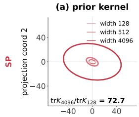

(b) GP posterior at λ128  
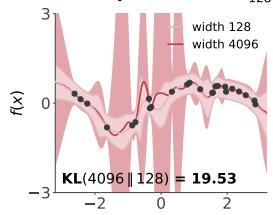

(c) λ selection (evidence)  
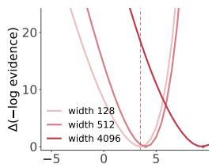

(d) NLL concordance  
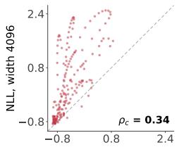

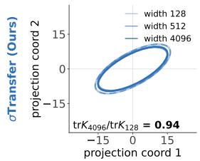

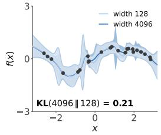

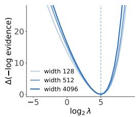

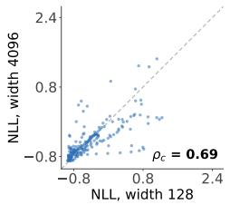  
Figure 1: Why prior precision transfers under σTransfer. The same regression architecture at widths 128, 512, and 4096, under standard parametrization (SP, red) and σTransfer (blue). (a) The prior kernel, in a common two-dimensional projection. (b) Predictive posteriors using the precision selected at width 128. (c) Plug-in evidence curves used to select it; the dashed line marks the width-128 optimum. (d) Predictive NLL per example, width 128 versus wider networks; points on the diagonal indicate agreement. Overall, σTransfer remains stable across width, while $\mathrm { S P }$ can drift.

The Laplace approximation for neural networks (Denker & LeCun, 1990; MacKay, 1992) provides predictive uncertainty estimates and supports evidence-based model selection. Its linearised form places a Gaussian posterior on a trained network, yielding predictive distributions useful for outof-distribution detection (Daxberger et al., 2021; Kristiadi et al., 2020), active learning (Gal et al. 2017; Kirsch et al., 2019), and selective prediction. The resulting uncertainty estimates depend on the prior precision, a hyperparameter that controls the scale of posterior uncertainty and is commonly selected using validation or marginal likelihood (Kristiadi et al., 2021; Immer et al., 2021a; Antorán et al., 2022). Selecting it typically requires repeated posterior evaluations across candidate precisions, making the sweep increasingly costly as network width grows.

Can we instead search for the prior precision on a small network and reuse it, unchanged, on a much larger one? Under standard parametrization (SP), PyTorch's default and the convention of a single global learning rate, this transfer can be unreliable: the same precision can produce different uncertainty at different widths. The Maximal Update Parametrization $( \mu \mathrm { P } ;$ Yang & Hu, 2021; Yang et al., 2021) is an alternative convention that rescales each layer's initialization, forward multiplier, and learning rate with width. This stabilizes training dynamics across width, allowing hyperparameters such as the learning rate to be tuned at a small width and reused at a larger one. Applying the Laplace approximation to a $\mu \mathrm { P }$ network is not enough on its own: the prior precision that is optimal at one width is still not optimal at another.

We introduce σTransfer, which builds on $\mu \mathrm { P }$ to make the optimal prior precision stable across width (Figure 1(c)), so a precision chosen on a small (cheap) network is near-optimal for a large (expensive) one. σTransfer normalizes the prior geometry: each layer's prior is scaled by a factor fixed by the width and $\mu \mathrm { P } \mathbf { \vec { s } }$ coordinate scalings (Section 4). This adds no new hyperparameter.

Roughly speaking, under σTransfer, networks of different widths approximate the same limiting prior kernel: the function-space covariance that the parameter prior induces on predictions, once the network is linearized around its trained weights. If this kernel is stable across width, we show that the Laplace posterior is stable too. We use this stability in two ways: a small network can select the prior precision for a larger one (prior-precision transfer), or make uncertainty-based decisions itself, such as which data to label or when the larger network should abstain, without constructing a Laplace posterior for it (decision transfer). Under the conditions of Section 5, our main guarantees can be summarized by the progression

$$
\begin{array} { r } { \underbrace { K _ { n }  K _ { \infty } } _ { \mathrm { p r i o r - k e m e l ~ s t a b i l i t y } } \implies \underbrace { m _ { n } ^ { \lambda }  m _ { \infty } ^ { \lambda } , C _ { n } ^ { \lambda }  C _ { \infty } ^ { \lambda } } _ { \mathrm { p o s t e r i o r ~ m e a n ~ a n d ~ c o v a r i a n c e ~ s t a b i l i t y } } \implies \underbrace { \lambda _ { n } ^ { \star }  \lambda ^ { \star } } _ { \mathrm { p r i o r - p r e c t i s t o n ~ t r a n s f e r } } , \underbrace { \mathrm { s a m e ~ d e c i s i o n } . } _ { \mathrm { d e c i s i o n ~ t r a n s f e r } } . } \end{array}
$$

Figure 1 illustrates this progression at finite width, from the prior kernel to the posterior, the selected precision, and per-point negative log-likelihood (NLL) concordance. Our contributions are:

1. We introduce σTransfer, a method that stabilizes the prior kernel and therefore the Laplace posterior across width, so that uncertainty computed on a small (cheap) network transfers to a much larger (expensive) one.

2. Prior-precision transfer: the optimal prior precision is stable across width (Figure 1(c)), so a precision chosen on the small network is near-optimal for the large one, and we bound the excess NLL from using it. The large network then fits a single posterior instead of a full sweep.

3. Decision transfer: decisions made from the small network's posterior are approximately those the large network would make, because the posterior mean and covariance both approach a common limit and so approach each other. We demonstrate this for data acquisition, out-of-distribution detection, and abstention, where the large network needs no Laplace posterior at all.

## 2 RELATED WORK

The Tensor Programs series developed a mathematical framework for neural networks at large width, settling questions such as the convergence of standard architectures to Gaussian processes in the infinite-width limit (Yang, 2020a;b; 2019). A key practical outcome was the Maximal Update Parametrization $( \mu \mathrm { P } ;$ Yang & Hu, 2021), which scales initialization and per-layer multipliers so that feature updates neither vanish nor explode as width grows, keeping training stable and expressive regardless of model size. Because $\mu \mathrm { P }$ networks converge to a common limit as width grows, optimization hyperparameters such as the learning rate tuned on a small proxy carry over to a larger target. Yang et al. (2021) demonstrated this with µTransfer, transferring these settings from a 40Mparameter proxy to a 6.7B-parameter language model at a search cost of about 7% of one pretraining run, then training the large model once with the optimal learning rate found on the smaller proxy.

Denker & LeCun (1990) first used the Hessian to obtain predictive error bars for neural networks; MacKay (1992) developed this into a full Bayesian framework, placing a Gaussian posterior over trained weights and selecting the prior precision by maximising the marginal likelihood. Laplace posteriors have since achieved strong results in out-of-distribution detection, active learning, and selective prediction (Daxberger et al., 2021). The main computational barrier is the Hessian: storing it costs $O ( P ^ { 2 } )$ and inverting it ${ \cal O } ( P ^ { 3 } )$ in the number of parameters P. Last-layer restrictions (Daxberger et al., 2021), Kronecker-factored curvature (Ritter et al., 2018), and online evidence maximisation (Immer et al., 2021a) have each reduced this cost. Even so, selecting the prior precision requires sweeping over many candidates and evaluating the posterior at each one. When the target model has millions or billions of parameters, this search alone can dominate the cost of Laplace inference.

## 3 PRELIMINARIES

Linearized Laplace. The Laplace approximation represents the parameter posterior by a Gaussian centred at the trained parameters $\hat { \theta } _ { n }$ of a network with width n. Under the standard Gaussian prior $\theta \mid \lambda \sim \mathcal { N } ( 0 , \lambda ^ { - 1 } I )$ , the Laplace approximation gives

$$
\theta \mid D , \lambda \sim { \mathcal { N } } { \Big ( } { \hat { \theta } } _ { n } , ( H _ { n } + \lambda I ) ^ { - 1 } { \Big ) } , \qquad H _ { n } = J _ { n } ( D ) ^ { \top } \Omega _ { n } J _ { n } ( D ) .
$$

Here $H _ { n }$ is the generalized Gauss-Newton curvature, D the training inputs, and $X , X ^ { \prime }$ arbitrary finite sets of evaluation inputs. The function $f _ { n } ( x ; \theta ) \in \mathbb { R } ^ { d _ { \mathrm { o u t } } }$ denotes the neural-network output: a scalar in our regression experiments and the pre-softmax logit vector in classification; $J _ { n } ( X ) =$ $\partial f _ { n } ( X ; \hat { \theta } _ { n } ) / \partial \theta$ is its Jacobian with respect to the stored parameters, stacked over the inputs in $X ,$ and $\Omega _ { n }$ is the negative-log-likelihood Hessian with respect to these outputs, evaluated at the trained predictions. Linearized Laplace (Immer et al., 2021b) uses a first-order expansion of $f _ { n }$ around $\hat { \theta } _ { n }$ to propagate the Gaussian parameter posterior to the output space of $f _ { n }$ . The resulting Gaussian output posterior has mean and covariance

$$
m _ { n } ^ { \lambda } ( X ) = f _ { n } ( X ; \hat { \theta } _ { n } ) , \qquad C _ { n } ^ { \lambda } ( X , X ^ { \prime } ) = J _ { n } ( X ) ( H _ { n } + \lambda I ) ^ { - 1 } J _ { n } ( X ^ { \prime } ) ^ { \top } .
$$

With the trained parameters $\hat { \theta } _ { n }$ held fixed, λ leaves the mean unchanged and controls the scale of posterior uncertainty: larger values contract the covariance, whereas smaller values permit greater uncertainty. For classification, predictive class probabilities are defined by averaging softmax over the Gaussian logit posterior; we approximate this expectation using either a probit approximation or Monte Carlo sampling. For Gaussian regression, observation noise is added when forming the predictive distribution. The validation-NLL curve is the map $\lambda \mapsto \mathrm { N L L } _ { n } ( \lambda )$ from prior precision to the NLL of the width-n posterior predictive on a fixed validation set.

$\mu \mathrm { P }$ and hyperparameter transfer. The Maximal Update Parametrization $( \mu \mathrm { P } )$ , introduced by Yang & Hu (2021), enables training hyperparameters such as the learning rate to transfer across model widths (Yang et al., 2021). $\mu \mathrm { P }$ achieves this through width-dependent scaling of the initialization, forward pass, and parameter updates. Each layer is updated as much as possible without causing logits or activations to diverge as width tends to infinity, so hidden representations keep changing during training instead of staying close to their random initialization as the network widens. The same $\mu \mathrm { P }$ network can be expressed using different parameter units. Writing $\theta _ { n }$ for the stored weights of a network with width $n ,$ we introduce rescaled parameter coordinates $\phi _ { n }$ through

$$
\phi _ { n } = T _ { n } ^ { - 1 } \theta _ { n } , \qquad T _ { n } = \mathrm { b l o c k d i a g } \big ( t _ { 1 } ( n ) I , \ t _ { 2 } ( n ) I , \dots \big ) .
$$

Here $T _ { n }$ applies one positive scale factor to each parameter tensor. These factors depend on width but remain fixed during training. The initialization and update rules are adjusted consistently with these parameter units (Yang & Littwin, 2023, Proposition 2.2.3).

## 4 METHOD: σTransfer

We introduce σTransfer, a Laplace method that rescales the prior so that a selected prior precision or posterior-based decisions can transfer from a smaller network to a larger one. This section defines σTransfer and develops the intuition for its stability across width; Section 5 states the conditions and formal guarantees for both, and Appendix K provides the proofs.

The transfer problem. To transfer a prior precision or posterior-based decision across width, the same numerical value of the prior λ must induce similar linearized Laplace output posteriors as the network width grows. If the predictive mean $m _ { n } ^ { \lambda }$ and covariance $C _ { n } ^ { \lambda }$ each approach fixed limits, then sufficiently wide networks of widths n and $N$ approximate the säme limiting posterior and hence one another, even when $N \gg n$ . We call a quantity evaluated on fixed inputs width-stable when it approaches a fixed limit as width grows; Definition 1 makes this precise.

Definition 1 (Width-stability). Fix a finite input set X. A quantity $Q _ { n }$ indexed by the network width n and evaluated on X is width-stable if it converges entrywise, $Q _ { n } \to Q _ { \infty }$ as $n  \infty .$

Predictive-mean stability has already been established.1 We therefore focus on stabilizing the covariance. Section 3 gives the posterior covariance under an isotropic prior, which we write here as

$$
\begin{array} { r } { C _ { n , I } ^ { \lambda } ( X , X ^ { \prime } ) = J _ { n } ( X ) ( H _ { n } + \lambda I ) ^ { - 1 } J _ { n } ( X ^ { \prime } ) ^ { \top } , \qquad H _ { n } = J _ { n } ( D ) ^ { \top } \Omega _ { n } J _ { n } ( D ) . } \end{array}\tag{1}
$$

Here n denotes the network width, $J _ { n }$ is the network-output Jacobian at the trained parameters, and $\Omega _ { n }$ is the output-space NLL curvature on the training data. This covariance expression does not reveal when width-stability holds, because $J _ { n }$ and $H _ { n }$ change dimension with width.

To identify how to make this covariance width-stable, we apply the Woodbury identity (Woodbury, 1950) to rewrite it in function space. The key step is to do so for a general Gaussian prior with covariance $\lambda ^ { - 1 } S _ { n } ,$ rather than the isotropic prior alone. For the full GGN and $\lambda > 0$

$$
C _ { n } ^ { \lambda } ( X , X ^ { \prime } ) = \frac { K _ { n } ( X , X ^ { \prime } ) } { \lambda } - \frac { K _ { n } ( X , D ) } { \lambda ^ { 2 } } \Omega _ { n } ^ { 1 / 2 } \big ( I + \lambda ^ { - 1 } \Omega _ { n } ^ { 1 / 2 } K _ { n } ( D , D ) \Omega _ { n } ^ { 1 / 2 } \big ) ^ { - 1 } \Omega _ { n } ^ { 1 / 2 } K _ { n } ( D , X ^ { \prime } ) ,\tag{2}
$$

where $K _ { n } ( X , X ^ { \prime } ) = J _ { n } ( X ) S _ { n } J _ { n } ( X ^ { \prime } ) ^ { \top }$ is the prior kernel. In this form, the prior geometry $S _ { n }$ enters the posterior covariance only through $K _ { n }$ . The posterior also depends on the prior precision λ, which is fixed, and the likelihood curvature $\Omega _ { n } ,$ which is width-stable for the likelihoods considered here.² However, $K _ { n }$ is not guaranteed to be width-stable: for instance, the isotropic choice $S _ { n } = I$ gives $K _ { n , I } = J _ { n } J _ { n } ^ { \top }$ , which can diverge as width grows. We therefore need to choose $S _ { n }$ so that $K _ { n }$ is width-stable; Eq. (2) then implies that $C _ { n } ^ { \lambda }$ is width-stable.

The σTransfer prior kernel. We now construct $S _ { n }$ so that the prior kernel $K _ { n }$ is width-stable. Building on the width scalings of $\mu \mathrm { P }$ , we introduce width-normalized parameter coordinates $\phi _ { n } =$ $T _ { n } ^ { - 1 } \theta _ { n }$ . The block-diagonal map $T _ { n }$ rescales each parameter tensor so that its contribution to the prior kernel remains at a comparable scale across widths. Appendix J derives these factors.

The reason for working in these coordinates is that we prove that the isotropic prior kernel in these width-normalized coordinates is width-stable. Under the conditions of Theorem 1 (see Section 5 for the precise statement),

$$
K _ { n } ( X , X ^ { \prime } ) = J _ { \phi , n } ( X ) J _ { \phi , n } ( X ^ { \prime } ) ^ { \top } \xrightarrow { n \to \infty } K _ { \infty } ( X , X ^ { \prime } ) .
$$

Here $J _ { \phi , n }$ is the network-output Jacobian with respect to the width-normalized coordinates $\phi _ { n }$ , rather than the stored parameters. Since $\phi _ { n } = T _ { n } ^ { - 1 } \theta _ { n }$ , the chain rule gives $J _ { \phi , n } = J _ { n } T _ { n }$ . We can therefore express this same stable kernel in the stored parameter coordinates:

$$
K _ { n } ( X , X ^ { \prime } ) = J _ { \phi , n } ( X ) J _ { \phi , n } ( X ^ { \prime } ) ^ { \top } = J _ { n } ( X ) T _ { n } T _ { n } ^ { \top } J _ { n } ( X ^ { \prime } ) ^ { \top } = J _ { n } ( X ) S _ { n } J _ { n } ( X ^ { \prime } ) ^ { \top } ,\tag{3}
$$

where $S _ { n } = T _ { n } T _ { n } ^ { \top }$ . Equivalently, $\lambda S _ { n } ^ { - 1 }$ is the isotropic precision λI of the width-normalized coordinates expressed in the stored coordinates, which is why we call it a width-normalized prior. The posterior covariance in the stored parameter coordinates is therefore

$$
C _ { n } ^ { \lambda } ( X , X ^ { \prime } ) = J _ { n } ( X ) \big ( H _ { n } + \lambda S _ { n } ^ { - 1 } \big ) ^ { - 1 } J _ { n } ( X ^ { \prime } ) ^ { \top } .\tag{4}
$$

Thus σTransfer changes only the prior term from λI to $\lambda S _ { n } ^ { - 1 }$ ; the trained checkpoint, predictions, and likelihood curvature remain unchanged, and λ remains the only tuned prior hyperparameter. Section 5 states the conditions under which this gives prior-precision and decision transfer across width. In practice, $S _ { n }$ is never constructed as a dense matrix: within a parameter tensor with width factor $t ,$ the prior precision is the scalar $\lambda / t ^ { 2 }$ , which is what one passes to the Laplace implementation. Appendix J gives the block scales and verifies the coordinate identity numerically.

## 5 THEORETICAL GUARANTEES

Section 4 constructed the σTransfer prior so that the prior kernel $K _ { n }$ is width-stable. We now propagate this stability through the posterior to practical transfer guarantees; formal statements and proofs appear in Appendix K. Together with convergence of the likelihood curvature and trained predictive mean, the results build on each other under the conditions below:

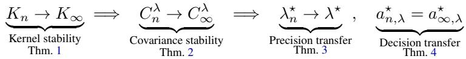

Theorem 1 (Prior-kernel stability; informal). Consider the scalar-output, fixed-depth, equal-width ReLU µP MLP of Appendix J. Suppose its checkpoint is obtained after a fixed finite number of widthmatched $\mu \mathrm { P }$ training steps and satisfies the regularity conditions stated precisely in Appendix K.1. Then, on every xed inite input set, the σTransfer prior kernel $K _ { n } ( \dot { x } , x ^ { \prime } ) = \dot { J } _ { n } ( \dot { x } ) \dot { S } _ { n } J _ { n } ( x ^ { \prime } ) ^ { \top }$ converges jointly almost surely as $n \to \infty ;$ the trained outputs converge jointly as well. The same conclusion holds for any fxed output dimension. The full statement, assumptions, and proof are in Appendix K.1.

The proof builds on Tensor Programs (Yang & Littwin, 2023), which establish large-width limits for empirical averages arising during a fixed number of training steps. The σTransfer normalization expresses the prior kernel as a finite combination of these averages, so their convergence implies convergence of the kernel. Appendix K.1 provides the smoothing argument needed to extend this reasoning to ReLU.

Theorem 2 (Posterior-covariance stability; informal). For full-GGN Laplace, given prior-kernel convergence and width-stable positive-semidefinite likelihood curvature, the linearized-Laplace output covariance $C _ { n } ^ { \lambda }$ converges uniformly over any interval $[ \lambda _ { - } , \lambda _ { + } ]$ with $0 < \lambda _ { - } \leq \lambda _ { + } <$ ∞ (proof in Appendix $K . 3 ,$ 1

Thus the same numerical precision produces increasingly similar posterior uncertainty as the networks become wider.

Theorem 3 (Prior-precision transfer; informal). If the posterior mean and covariance on a fixed validation set converge uniformly in λ over an interval $\bar { \Lambda ^ { = } } [ \lambda _ { - } , \lambda _ { + } ]$ with $0 < \lambda _ { - } \leq \lambda _ { + } < \infty ,$ then the validation-NLL curves converge uniformly. If the limiting curve has a unique minimizer $\lambda ^ { \star }$ , any sequence of minimizers satisfies $\bar { \lambda } _ { n } ^ { \star } \to \bar { \lambda } ^ { \star }$ . Even without a unique minimizer, the excess NLL from using the width-n proxy's precision on a target of width N satisfies

$$
\mathrm { N L L } _ { N } ( \lambda _ { n } ^ { \star } ) - \operatorname* { m i n } _ { \lambda \in \Lambda } \mathrm { N L L } _ { N } ( \lambda ) \leq 2 \operatorname* { s u p } _ { \lambda \in \Lambda } \lvert \mathrm { N L L } _ { n } ( \lambda ) - \mathrm { N L L } _ { N } ( \lambda ) \rvert .\tag{5}
$$

Full conditions and proof in Appendix K.5.

Theorem 4 (Posterior-derived decision transfer; informal). Fix λ > 0 and a finite action set. Suppose the posterior mean and covariance converge on the xed fnite set containing all inputs used by the action scores. If the scores depend continuously on these moments through scoring rules shared across widths, they converge uniformly. If the limiting best action has a positive gap over all alternatives, two sufficiently wide networks choose the same action. At inite widths, even without this gap, the loss in target score from using the proxy's action is at most twice the largest proxy-target score difference. Full conditions and proof appear in Appendix K.6.

Scope. The posterior-transfer results apply beyond MLPs: for any width-indexed architecture with $\theta _ { n } = T _ { n } \phi _ { n }$ , Theorems 2–4 apply under their stated conditions whenever the width-normalized prior kernel, predictive mean, and likelihood curvature converge. Theorem 1 establishes kernel convergence for the stated finite-step ReLU MLP setting. For last-layer Laplace, the kernel condition reduces to convergence of the normalized final-feature Gram matrix. Extensions to diagonal/KFAC curvature, to finitely many sequential acquisition rounds, and to decisions at the transferred precision appear in Appendices K.4 and K.6, under additional conditions. Precision transfer using fixed-checkpoint evidence additionally requires convergence of the prior-weighted squared parameter norm and a unique limiting maximizer; posterior convergence alone is insufficient (Appendix K.5).

## 6 RESULTS

We evaluate σTransfer in two deployment regimes. Under Regime A (prior transfer), a small proxy selects the Laplace prior precision λ, and the larger target constructs one posterior at the transferred value. This removes the target-side precision sweep, not the target posterior itself. Under Regime B (decision transfer), the proxy supplies posterior-derived decisions, such as acquisition rankings and active-learning selections, and the target requires no posterior at deployment. Target posteriors in our Regime-B experiments are constructed only as evaluation references. To measure transfer quality we track two estimands: the selection gap $| \Delta \lambda |$ , the distance between the proxy and target optimal precisions in bits, and the predictive transfer gap $| \Delta \mathrm { N L L } |$ , the absolute target test-NLL difference between proxy-selected and target-selected precisions. All posteriors are post-hoc GGN Laplace around fixed checkpoints; formal definitions of all evaluation metrics are in Appendix B.

The main tables compare four methods. SP with an isotropic prior is standard Laplace practice and serves as the main baseline. We add three further comparisons to isolate the source of any improvement. $\mu \mathrm { P }$ with an isotropic prior uses the $\mu \mathrm { P }$ parametrization but keeps the standard Laplace prior, testing whether $\mu \mathrm { P }$ training alone helps transfer. SP + metric applies our prior geometry under the standard parametrization; this combination is not covered by Theorem 1, but it serves as a mis-specification control and, as we see below, sometimes helps empirically. σTransfer combines $\mu \mathrm { P }$ training with the width-normalized prior. The two $\mu \mathrm { P }$ methods share MAP checkpoints, so any difference between them is due to the prior geometry alone. Appendix C.4 evaluates additional empirical scale-matching controls on the same checkpoints.

## 6.1 REGRESSION

FreeSolv: evidence landscapes for prior selection (LL-full, 5 seeds)  
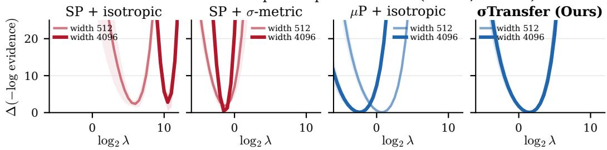  
Figure 2: Evidence as a function of prior precision λ on FreeSolv. Light and dark curves show proxy (width 512) and target (width 4096); bands are mean ± SEM over five seeds. Under SP the landscape shifts with width, so the proxy's optimum is far from the target's. Under σTransfer the two curves nearly overlap. Table 1 reports numerical results for all three datasets.

Table 1: Prior-precision transfer on three regression datasets (proxy width 512, target width 4096, full-covariance last-layer Laplace, five paired seeds, mean ± s.d.). |∆NLL| scaled by $1 0 ^ { 3 } \colon$ lower is better for all columns. See Appendix B for metric definitions.
<table><tr><td rowspan="2">Method</td><td colspan="3">ESOL</td><td colspan="3">FreeSolv</td><td colspan="3">Lipophilicity</td></tr><tr><td>|∆λ|</td><td>|∆NLL|</td><td> $\mathrm { K L } _ { 4 0 9 6 \parallel 5 1 2 }$ </td><td>|∆λ|</td><td>|∆NLL|</td><td> $\mathrm { K L _ { 4 0 9 6 \parallel 5 1 2 } }$ </td><td>|∆λ|</td><td>|∆NLL|</td><td> $\mathrm { K L _ { 4 0 9 6 \parallel 5 1 2 } }$ </td></tr><tr><td>SP + isotropic</td><td> $1 . 5 { \pm } 0 . 4$ </td><td> $4 1 . 8 { \scriptstyle \pm 3 0 . 7 }$ </td><td> $0 . 2 0 8 { \scriptstyle \pm 0 . 0 7 3 }$ </td><td> $5 . 0 { \pm } 2 . 2$ </td><td> $4 5 2 . 8 { \scriptstyle \pm 4 2 9 . 5 }$ </td><td> $0 . 0 7 9 { \scriptstyle \pm 0 . 0 5 5 }$ </td><td> $4 . 0 { \pm } 2 . 7$ </td><td> $1 4 0 . 2 { \scriptstyle \pm 1 1 9 . 7 }$ </td><td> $0 . 1 7 3 { \scriptstyle \pm 0 . 0 2 7 }$ </td></tr><tr><td>SP + metric</td><td> $1 . 5 { \scriptstyle \pm 0 . 5 }$ </td><td> $8 . 4 0 { \scriptstyle \pm 6 . 5 9 }$ </td><td> $0 . 2 0 8 _ { \pm 0 . 0 7 1 }$ </td><td> $1 . 2 _ { \pm 1 . 4 }$ </td><td> $9 . 6 5 { \scriptstyle \pm 1 0 . 9 5 }$ </td><td> $0 . 0 7 9 _ { \pm 0 . 0 5 5 }$ </td><td> $2 . 1 _ { \pm 1 . 2 }$ </td><td> $3 . 3 9 { \scriptstyle \pm 1 . 9 3 }$ </td><td> $0 . 1 7 3 { \scriptstyle \pm 0 . 0 2 8 }$ </td></tr><tr><td> $\mu \mathrm { P } \cdot$  + isotropic</td><td> $3 . 0 { \overset { - } { \pm } } 1 . 4$ </td><td> $0 . 9 4 7 { \scriptstyle \pm 0 . 5 6 6 }$ </td><td> $\mathbf { 0 . 1 6 7 _ { \pm 0 . 0 8 7 } }$ </td><td> $3 . 1 _ { \pm 0 . 5 }$ </td><td> $1 . 5 6 4 { \scriptstyle \pm 0 . 8 2 5 }$ </td><td> $\mathbf { 0 . 0 0 8 _ { \pm 0 . 0 0 4 } }$ </td><td> $3 . 2 _ { \pm 1 . 0 }$ </td><td> $0 . 0 9 4 { \scriptstyle \pm 0 . 0 2 4 }$ </td><td> $\mathbf { 0 . 0 5 7 _ { \pm 0 . 0 5 8 } }$ </td></tr><tr><td>σTransfer (ours)</td><td> $\mathbf { 0 . 9 \pm } \mathbf { 0 . 8 }$ </td><td> $\mathbf { 0 . 5 4 8 _ { \pm 0 . 4 1 2 } }$ </td><td> $\mathbf { 0 . 1 6 7 _ { \pm 0 . 0 8 7 } }$ </td><td> $\mathbf { 0 . 5 \pm 0 . 4 }$ </td><td> $\mathbf { 0 . 4 6 1 { \scriptstyle \pm 0 . 4 3 0 } }$ </td><td> $\mathbf { 0 . 0 0 8 _ { \pm 0 . 0 0 4 } }$ </td><td> $\mathbf { 0 . 4 \pm 0 . 2 }$ </td><td> $\mathbf { 0 . 0 3 3 _ { \pm 0 . 0 1 9 } }$ </td><td> $\mathbf { 0 . 0 5 7 { \scriptstyle \pm 0 . 0 5 8 } }$ </td></tr></table>

We test Regime A on ESOL (Delaney, 2004), FreeSolv (Mobley & Guthrie, 2014), and Lipophilicity (Wu et al., 2018) under scaffold shift, transferring an evidence-selected precision from width 512 to 4096 using full-covariance last-layer Laplace and five paired seeds (full protocol in Appendix C.3). On FreeSolv the SP + isotropic evidence landscape shifts markedly across widths, whereas the σTransfer curves nearly overlap (Figure 2). Across all three datasets σTransfer gives the smallest selection gap [∆λ| (0.4–0.9 bits, against 1.5–5.0 for SP + isotropic) and a predictive transfer gap |∆NLL| orders of magnitude smaller (Table 1). We also report KL divergence to measure agreement between the proxy's and target's predictive distributions (Appendix B).

## 6.2 IMAGE CLASSIFICATION

Table 2: Prior-precision transfer on MNIST and Fashion-MNIST across three last-layer Laplace approximations (proxy width 128, target width 4096, validation-NLL-selected λ, 10 paired seeds, mean $\pm \ : \mathrm { s . d . } )$ . |∆NLL| scaled by $1 0 ^ { 2 } { \mathrm { ; } }$ lower is better for all columns. See Appendix B for metric definitions and Appendix D for evidence-selected results.
<table><tr><td rowspan="3">Method</td><td colspan="6">MNIST</td><td colspan="6">FMNIST</td></tr><tr><td colspan="2">LL full |∆λ| |∆NLL|</td><td colspan="2">LL diag |∆λ| |ΔNLL|</td><td colspan="2">LL KFAC |∆λ| |∆NLL|</td><td colspan="2">LL full</td><td colspan="2">LL diag</td><td colspan="2">LL KFAC |∆λ| |∆NLL|</td></tr><tr><td></td><td></td><td></td><td></td><td></td><td></td><td>|∆λ|</td><td>|∆NLL|</td><td>|∆λ|</td><td> $| \bar { \Delta } \mathrm { N L L } |$ </td><td></td><td></td></tr><tr><td>SP + isotropic</td><td> $1 . 7 5 { \scriptstyle \pm . 2 6 }$ </td><td> $9 . 8 { \scriptstyle \pm 4 . 6 }$ </td><td> $0 . 4 5 { \scriptstyle \pm . 2 8 }$ </td><td> $0 . 8 { \scriptstyle \pm 0 . 9 }$ </td><td> $1 . 5 0 { \scriptstyle \pm . 2 4 }$ </td><td> $6 . 9 { \scriptstyle \pm 3 . 2 }$ </td><td> $1 . 5 5 { \scriptstyle \pm . 2 8 }$ </td><td> $9 . 0 _ { \pm 4 . 1 }$ </td><td> $\mathbf { 0 . 2 5 \pm . 3 5 }$ </td><td> $0 . 9 { \scriptstyle \pm 1 . 2 }$ </td><td> $1 . 8 5 { \scriptstyle \pm . 2 4 }$ </td><td> $1 3 . 2 { \scriptstyle \pm 3 . 2 }$ </td></tr><tr><td> $\mathbf { S P + m e t r i c }$ </td><td> $3 . 2 5 { \scriptstyle \pm . 2 6 }$ </td><td> $9 . 6 _ { \pm 2 . 1 }$ </td><td> $4 . 5 5 { \scriptstyle \pm . 2 8 }$ </td><td>14.8±1.9</td><td> $3 . 5 0 { \scriptstyle \pm . 2 4 }$ </td><td> $1 0 . 7 { \pm } 1 . 9$ </td><td> $3 . 4 5 { \scriptstyle \pm . 2 8 }$ </td><td> $3 9 . 0 { \scriptstyle \pm 6 . 3 }$ </td><td> $5 . 2 5 { \scriptstyle \pm . 3 5 }$ </td><td> $6 7 . 2 { \scriptstyle \pm 7 . 3 }$ </td><td> $3 . 1 5 { \scriptstyle \pm . 2 4 }$ </td><td> $3 3 . 3 { \scriptstyle \pm 5 . 5 }$ </td></tr><tr><td> $\mu \mathrm { P } + \mathrm { i s o t r o p i c }$ </td><td> $4 . 7 5 { \scriptstyle \pm . 2 6 }$ </td><td> $1 5 . 7 { \pm } 3 . 0 $ </td><td> $5 . 3 0 { \scriptstyle \pm . 2 6 }$ </td><td> $2 0 . 6 { \scriptstyle \pm 3 . 2 }$ </td><td> $4 . 7 5 { \scriptstyle \pm . 2 6 }$ </td><td> $1 6 . 5 { \scriptstyle \pm 2 . 7 }$ </td><td> $4 . 6 0 \pm . 2 1$ </td><td> $3 4 . 9 { \pm } 2 . 8 $ </td><td> $4 . 5 5 { \pm } . 2 8 $ </td><td> $4 7 . 2 { \scriptstyle \pm 5 . 0 }$ </td><td> $4 . 4 5 { \scriptstyle \pm . 2 8 }$ </td><td> $3 0 . 5 { \scriptstyle \pm 2 . 6 }$ </td></tr><tr><td>σTransfer (ours)</td><td> $\mathbf { 0 . 2 5 \pm . 2 6 }$ </td><td> $\mathbf { 0 . 2 \pm 0 . 3 }$ </td><td> ${ \bf 0 . 3 0 { \scriptstyle \pm . 2 6 } }$ </td><td> $\mathbf { 0 . 1 \pm 0 . 2 }$ </td><td> $\mathbf { 0 . 2 5 \pm . 2 6 }$ </td><td>0.2±0.3</td><td> $\mathbf { 0 . 4 0 } \pm . 2 1$ </td><td> $\mathbf { 0 . 4 \pm 0 . 4 }$ </td><td> $0 . 4 5 { \scriptstyle \pm . 2 8 }$ </td><td> $\mathbf { 0 . 6 \pm 0 . 6 }$ </td><td> $\mathbf { 0 . 5 5 \pm . 2 8 }$ </td><td> $\mathbf { 0 . 3 \pm 0 . 3 }$ </td></tr></table>

Prior transfer (Regime A). Table 2 reports both estimands on MNIST (LeCun et al., 1998) and Fashion-MNIST (Xiao et al., 2017) across three last-layer Laplace approximations (full, diagonal, KFAC; see Appendix C.1 for definitions). Among the four methods in Table 2, σTransfer has the smallest predictive transfer gap |∆NLL| in every column, and its worst case $( 0 . 6 \times 1 0 ^ { - 2 }$ , FMNIST LL-diagonal) still beats every other method on every approximation and dataset. Its selection gap [∆λ| is smallest in five of the six columns and never exceeds 0.55 bits, against up to 1.85 for SP + isotropic; the exception is FMNIST LL-diagonal, where SP + isotropic selects marginally closer. The same selection-gap ordering holds under plug-in evidence selection, although its optimum is not always test-NLL-optimal (Appendix D). Table 3 reports the compute: proxy-side selection is \~5000× faster than the target-side sweep for the full last-layer posterior and 94× for all-parameter diagonal Laplace, and after transfer the target builds one posterior at the transferred precision for a test-NLL degradation of only 0.002. When the selection criterion is OOD detection instead of validation NLL, σTransfer also transfers: at width 4096 the proxy-selected precision achieves 0.950 AUROC on held-out OOD data, matching target-side tuning, whereas SP loses 0.072 and $\mu \mathrm { P }$ with an isotropic prior loses 0.327. The match holds at every width above the proxy (Appendix E).

Decision transfer (Regime B). Figure 3 shows a sequential active-learning experiment on MNIST (1,000 labelled points, 50 rounds). Selecting data with the proxy produces nearly the same learning curve on the target as using the target's own posterior, with final accuracy only 0.003 below the target reference and a paired area-under-the-learning-curve difference covering zero; under SP the curves diverge, meaning decisions are not transferable. Per-round Spearman correlation between proxy and target EPIG scores (Bickford Smith et al., 2023) is $\bar { \rho } = 0 . 7 5$ under σTransfer, against 0.07 for SP + isotropic (Figure 3, right panel), consistent with our theoretical guarantees (Section 5). On a fixed candidate pool the agreement is higher still: $\rho = 0 . 8 5 4 \pm 0 . 0 2 5$ under σTransfer, against 0.669 for SP. The same agreement ordering holds on Fashion-MNIST; we claim decision transfer on both datasets and downstream utility on MNIST. Appendix F gives full learning curves, AULC contrasts, and per-dataset acquisition-agreement tables.

## 6.3 LANGUAGE MODELS

We train a ladder of decoder-only GPT models at widths 128, 256, 512, 1024, and 2048 (8 layers, 8 heads) on $1 0 ^ { 9 }$ FineWeb-Edu tokens (Penedo et al., 2024) under both $\mathrm { S P }$ and $\mu \mathrm { P }$ . Training and posterior details are in Appendix G.

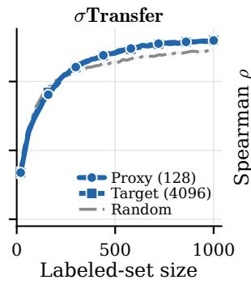

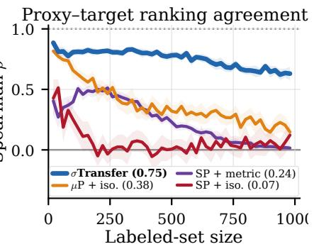  
Figure 3: Sequential active learning on MNIST with proxy acquisition (EPIG, proxy width 128, target width 4096, 20 seeds, bands: 95% CI). Left and centre: target test accuracy under proxy, targetreference, and random acquisition. Under σTransfer the proxy and target curves nearly overlap; under SP + isotropic the target's own acquisition falls below random. Right: per-round Spearman ρ between proxy and target rankings. See Appendix F for Fashion-MNIST and AULC contrasts.

Prior transfer (Regime A). Figure 4 (left) shows the evidence-selected prior precision across this ladder (ten downstream tasks). Under σTransfer the optimum converges with width; under SP it drifts about 0.65 bits per width doubling without saturating, so no proxy width is safe. The proxy's choice under σTransfer lands $0 . 6 5 \pm 0 . { \bar { 3 } } 4$ bits from the target's own and degrades target test NLL by only 0.0014 on average, compared to $2 . 6 5 \pm 0 . 6 3$ bits and a 0.013 degradation under SP (nearly an order of magnitude larger). Three of ten tasks have absolute target-NLL changes below $1 0 ^ { - 4 }$ ; the largest change is 0.0082 (Figure 4, middle). On the public u $- \mu \mathrm { P }$ pairs (Blake et al., 2025) (1B→7B), seven of ten tasks select the same precision as the target, and eight have absolute target-NLL changes below $1 0 ^ { - 4 }$ (Figure 4, right; Appendices H and I).

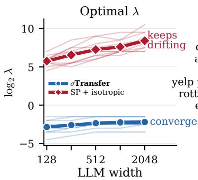

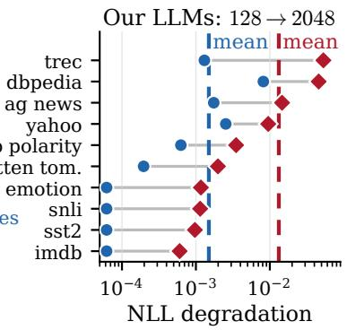

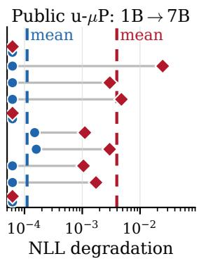  
Figure 4: A prior precision chosen on a proxy transfers under σTransfer, not under SP. Left: evidencebased selection on in-distribution training data, per task (thin) and task mean (thick). Middle and right: target NLL at the proxy's λ minus the target's own (lower is better), same ten tasks.

Decision transfer (Regime B). Figure 5 runs sequential EPIG on AG News (Zhang et al., 2015): proxy widths 128 to 1024 acquire labels for a width-2048 target, all at a common, untuned λ = 1. σTransfer has the highest mean Spearman correlation between proxy and target rankings of which data to label, across all proxy widths and initial label budgets. For 128→2048 transfer with 5,000 initial labels, target accuracy is lower by 0.0014 with proxy-selected labels than with target-selected labels (Table 3). The bottom row trains the larger model on the datapoints the smaller one selected, and measures the absolute test-NLL gap to training it on the target's own selections, an oracle that requires the very target posterior we are avoiding. σTransfer has the smallest mean absolute test-NLL gap in nine of twelve settings. Appendix G reports a second Regime-B test, where a width-128 proxy gate lets the target answer by MAP alone: it abstains on 86–88% of unseen OOD prompts while serving 96% of in-distribution traffic.

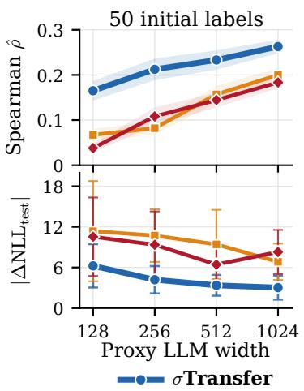

Active learning for a width-2048 target LLM  
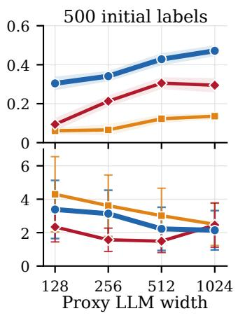

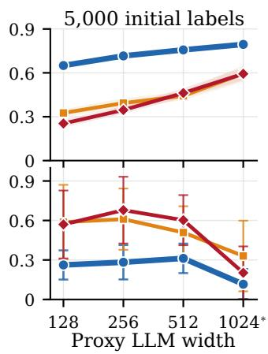  
Figure 5: Sequential active learning on AG News, starting with 50, 500 or 5,000 labelled examples and acquiring 250 additional labels using EPIG. Top: Spearman correlation between the proxy's and target's rankings of unlabelled data by informativeness (EPIG), averaged over acquisition steps. Bottom: mean absolute test-NLL gap when the target is trained on proxy-selected rather than targetselected labels (ticks $\times 1 0 ^ { - 3 } ;$ lower is better). All methods use $\lambda = 1$ Means and 95% CIs over ten seeds; the starred setting uses five.

## 6.4 COMPUTATIONAL SAVINGS AND LIMITATIONS

<table><tr><td>Task</td><td>Dataset</td><td>Transfer</td><td>Approx.</td><td>Proxy (s)</td><td>Target (s)</td><td>Speedup</td><td>Degradation</td></tr><tr><td>λ sweep</td><td>MNIST</td><td>128→4096</td><td>LL full</td><td>1.5</td><td>7,560</td><td>~5000×</td><td>0.002 NLL</td></tr><tr><td>OOD-aware λ</td><td>MNIST</td><td>128→4096</td><td>all + diag</td><td>4.1</td><td>384</td><td>94×</td><td>0.001 AUROC</td></tr><tr><td>evidence search</td><td>LLM (ours)</td><td>128→2048</td><td>LL full</td><td>3.5</td><td>25</td><td> ${ \sim } 7 \times$ </td><td>0.0014 NLL</td></tr><tr><td>evidence search</td><td>LLM (public)</td><td>1B→7B</td><td>LL full</td><td>4</td><td>9</td><td>~2.3×</td><td>0NLL</td></tr><tr><td>EPIG acquisition</td><td>AG News</td><td>128→2048</td><td>LL full</td><td>64.9</td><td>187.6</td><td>~3×</td><td>0.0014 ACC</td></tr><tr><td>evidence search</td><td>PenDigits</td><td> $3 2  1 2 8$ </td><td> $\mathrm { a l l } + \mathrm { f u l l }$ </td><td>0.68</td><td>14.95</td><td>~22×</td><td>-0.007 NLL</td></tr><tr><td>evidence search</td><td>letter</td><td>32→128</td><td> $\mathrm { a l l } + \mathrm { f u l l }$ </td><td>0.77</td><td>24.74</td><td>~32×</td><td>0.078 NLL</td></tr></table>

Table 3: σTransfer does the expensive selection on the proxy rather than the target. Speedup is target ÷ proxy selection time; deployment still fits one target posterior, so the end-to-end saving is capped by the 61-point grid. Degradation is the resulting change in the stated metric, positive meaning worse. EPIG times average 10 seeds; all times exclude common MAP training and one-off frozen-trunk feature extraction. For the public 1B→7B pair, the row reports AG News, whose speedup is the median across nine timed tasks, calculated from the rounded times in Table 15. LL = last-layer.

Table 3 shows the saving scaling with the cost of the target-side procedure: up to ～5000× on MNIST, where the target would otherwise sweep a full last-layer Laplace, and a median \~2.3× on the public 1B→7B pair (Blake et al., 2025), ranging from 1× to ～330× across nine timed tasks. It is far smaller where that procedure is already cheap, and σTransfer does not always win: on FMNIST under last-layer diagonal curvature, SP + isotropic selects a marginally closer precision. Appendix C.5 gives the PenDigits and Letter setup.

## 7 CONCLUSION

We introduced σTransfer, a method that uses a small (cheap) network to make uncertainty estimation and uncertainty-based decision-making cheaper for a much larger (expensive) network. It supports two forms of transfer. In prior-precision transfer, the precision search is performed on the small network and the selected precision is transferred zero-shot to the much larger network, without any target-side search. In decision transfer, the small network's uncertainty estimates are used directly to select data, flag out-of-distribution inputs, or decide when the larger network should abstain. We justify both forms of transfer theoretically through a series of results showing accurate transfer across network widths. Empirically, σTransfer preserves predictive performance while reducing the cost of uncertainty-sensitive tasks by up to several orders of magnitude. We discuss the limitations of our approach and directions for future work in Appendix A.

## AI USE STATEMENT

We derived the main theoretical results. For Theorem 1, generative AI tools helped us navigate the Tensor Programs literature (Yang, 2019; 2020a; Yang & Hu, 2021; Yang & Littwin, 2023) and identify its key tools, including the Master Theorem (Yang & Littwin, 2023, Theorem 2.6.10), which we then instantiated for our setting. AI tools also assisted with writing up proofs and some derivation steps, implementing the method and experiments, analysing results, literature search, feedback on the experiments and manuscript, and drafting and editing. We reviewed all AI-assisted work, checked numerical claims against saved outputs and theoretical statements against their proofs, and take full responsibility for the content of this paper.

## REPRODUCIBILITY STATEMENT

The appendices provide the parameterization conventions, implementation details, assumptions, and complete proofs used in this work. Experimental protocols report model widths, random seeds, posterior approximations, hyperparameter-selection rules, evaluation metrics, and compute measurements. Code, configuration files, and result manifests will be included in the supplementary material.

## REFERENCES

Ethem Alpaydin and Fevzi Alimoglu. Pen-based recognition of handwritten digits. UCI Machine LearningRepository,1996.URL https://doi.org/10.24432/C5MG6K.

Javier Antorán, David Janz, James U. Allingham, Erik Daxberger, Riccardo Barbano, Eric Nalisnick, and José Miguel Hernández-Lobato. Adapting the linearised Laplace model evidence for modern deep learning. In International Conference on Machine Learning, pp. 796–821. PMLR, 2022.

Javier Antorán, Shreyas Padhy, Riccardo Barbano, Eric Nalisnick, David Janz, and José Miguel Hernández-Lobato. Sampling-based inference for large linear models, with application to linearised Laplace. In International Conference on Learning Representations, 2023.

Freddie Bickford Smith, Andreas Kirsch, Sebastian Farquhar, Yarin Gal, Adam Foster, and Tom Rainforth. Prediction-oriented Bayesian active learning. In International Conference on Artificial Intelligence and Statistics, pp. 7331–7348. PMLR, 2023.

Stella Biderman, Hailey Schoelkopf, Quentin Gregory Anthony, Herbie Bradley, Kyle O'Brien, Eric Hallahan, Mohammad Aflah Khan, Shivanshu Purohit, USVSN Sai Prashanth, Edward Raff, et al. Pythia: A suite for analyzing large language models across training and scaling. In International conference on machine learning, pp. 2397–2430. PMLR, 2023.

Charlie Blake, Constantin Eichenberg, Josef Dean, Lukas Balles, Luke Y. Prince, Björn Deiseroth, Andres Felipe Cruz-Salinas, Carlo Luschi, Samuel Weinbach, and Douglas Orr. u-µP: The unitscaled maximal update parametrization. In International Conference on Learning Representations, 2025.

Samuel R Bowman, Gabor Angeli, Christopher Potts, and Christopher D Manning. A large annotated corpus for learning natural language inference. In Proceedings of the 2015 conference on empirical methods in natural language processing, pp. 632–642, 2015.

Tarin Clanuwat, Mikel Bober-Irizar, Asanobu Kitamoto, Alex Lamb, Kazuaki Yamamoto, and David Ha. Deep learning for classical japanese literature. arXiv preprint arXiv:1812.01718, 2018.

Erik Daxberger, Agustinus Kristiadi, Alexander Immer, Runa Eschenhagen, Matthias Bauer, and Philipp Hennig. Laplace redux-effortless bayesian deep learning. Advances in neural information processing systems, 34:20089–20103, 2021.

John S Delaney. Esol: estimating aqueous solubility directly from molecular structure. Journal of chemical information and computer sciences, 44(3):1000–1005, 2004.

John Denker and Yann LeCun. Transforming neural-net output levels to probability distributions. Advances in neural information processing systems, 3, 1990.

Yarin Gal, Riashat Islam, and Zoubin Ghahramani. Deep bayesian active learning with image data. In International conference on machine learning, pp. 1183–1192. PMLR, 2017.

Dan Hendrycks and Kevin Gimpel. A baseline for detecting misclassified and out-of-distribution examples in neural networks. arXiv preprint arXiv:1610.02136, 2016.

Neil Houlsby, Ferenc Huszár, Zoubin Ghahramani, and Máté Lengyel. Bayesian active learning for classification and preference learning. arXiv preprint arXiv:1112.5745, 2011.

Weihua Hu, Matthias Fey, Marinka Zitnik, Yuxiao Dong, Hongyu Ren, Bowen Liu, Michele Catasta, and Jure Leskovec. Open graph benchmark: Datasets for machine learning on graphs. Advances in neural information processing systems, 33:22118–22133, 2020.

Alexander Immer, Matthias Bauer, Vincent Fortuin, Gunnar Rätsch, and Khan Mohammad Emtiyaz. Scalable marginal likelihood estimation for model selection in deep learning. In International Conference on Machine Learning, pp. 4563–4573. PMLR, 2021a.

Alexander Immer, Maciej Korzepa, and Matthias Bauer. Improving predictions of bayesian neural nets via local linearization. In International conference on artificial intelligence and statistics, pp. 703–711. PMLR, 2021b.

Andreas Kirsch, Joost Van Amersfoort, and Yarin Gal. Batchbald: Efficient and diverse batch acquisition for deep bayesian active learning. Advances in neural information processing systems, 32, 2019.

Simon Kornblith, Mohammad Norouzi, Honglak Lee, and Geoffrey Hinton. Similarity of neural network representations revisited. In International conference on machine learning, pp. 3519–3529. PMLR, 2019.

Agustinus Kristiadi, Matthias Hein, and Philipp Hennig. Being bayesian, even just a bit, fixes overconfidence in relu networks. In International conference on machine learning, pp. 5436–5446. PMLR, 2020.

Agustinus Kristiadi, Matthias Hein, and Philipp Hennig. Learnable uncertainty under laplace approximations. In Uncertainty in Artificial Intelligence, pp. 344–353. PMLR, 2021.

Yann LeCun, Léon Bottou, Yoshua Bengio, and Patrick Haffner. Gradient-based learning applied to document recognition. Proceedings of the IEEE, 86(11):2278–2324, 1998.

Xin Li and Dan Roth. Learning question classifiers. In Coling 2002: The 19th international conference on computational linguistics, 2002.

Andrew Maas, Raymond E Daly, Peter T Pham, Dan Huang, Andrew Y Ng, and Christopher Potts. Learning word vectors for sentiment analysis. In Proceedings of the 49th annual meeting of the association for computational linguistics: Human language technologies, pp. 142–150, 2011.

David JC MacKay. A practical bayesian framework for backpropagation networks. Neural computation, 4(3):448–472, 1992.

James Martens and Roger Grosse. Optimizing neural networks with kronecker-factored approximate curvature. In International conference on machine learning, pp. 2408–2417. PMLR, 2015.

David L Mobley and J Peter Guthrie. Freesolv: a database of experimental and calculated hydration free energies, with input files. Journal of computer-aided molecular design, 28(7):711–720, 2014.

Bo Pang and Lillian Lee. Seeing stars: Exploiting class relationships for sentiment categorization with respect to rating scales. In Proceedings of the 43rd annual meeting of the association for computational linguistics (ACL’05), pp. 115–124, 2005.

Guilherme Penedo, Hynek Kydlíček, Loubna Ben Allal, Anton Lozhkov, Margaret Mitchell, Colin Raffel, Leandro Von Werra, and Thomas Wolf. The FineWeb datasets: Decanting the web for the finest text data at scale. Advances in Neural Information Processing Systems, 37:30811–30849, 2024.

Hippolyt Ritter, Aleksandar Botev, and David Barber. A scalable laplace approximation for neural networks. In International conference on learning representations, 2018.

David Rogers and Mathew Hahn. Extended-connectivity fingerprints. Journal of chemical information and modeling, 50(5):742–754, 2010.

Elvis Saravia, Hsien-Chi Toby Liu, Yen-Hao Huang, Junlin Wu, and Yi-Shin Chen. Carer: Contextualized affect representations for emotion recognition. In Proceedings of the 2018 conference on empirical methods in natural language processing, pp. 3687–3697, 2018.

David Slate. Letter recognition. UCI Machine Learning Repository, 1991. URL https : / / doi . org/10.24432/C5ZP40.

Richard Socher, Alex Perelygin, Jean Wu, Jason Chuang, Christopher D Manning, Andrew Y Ng, and Christopher Potts. Recursive deep models for semantic compositionality over a sentiment treebank. In Proceedings of the 2013 conference on empirical methods in natural language processing, pp. 1631–1642, 2013.

Max A Woodbury. Inverting modified matrices. Department of Statistics, Princeton University, 1950.

Zhenqin Wu, Bharath Ramsundar, Evan N Feinberg, Joseph Gomes, Caleb Geniesse, Aneesh S Pappu, Karl Leswing, and Vijay Pande. Moleculenet: a benchmark for molecular machine learning. Chemical science, 9(2):513–530, 2018.

Han Xiao, Kashif Rasul, and Roland Vollgraf. Fashion-mnist: a novel image dataset for benchmarking machine learning algorithms. arXiv preprint arXiv:1708.07747, 2017.

Greg Yang. Wide feedforward or recurrent neural networks of any architecture are gaussian processes. Advances in neural information processing systems, 32, 2019.

Greg Yang. Tensor programs ii: Neural tangent kernel for any architecture. arXiv preprint arXiv:2006.14548, 2020a.

Greg Yang. Tensor programs iii: Neural matrix laws. arXiv preprint arXiv:2009.10685, 2020b.

Greg Yang and Edward J Hu. Tensor programs iv: Feature learning in infinite-width neural networks. In International Conference on Machine Learning, pp. 11727–11737. PMLR, 2021

Greg Yang and Etai Littwin. Tensor programs ivb: Adaptive optimization in the infinite-width limit. arXiv preprint arXiv:2308.01814, 2023.

Greg Yang, Edward Hu, Igor Babuschkin, Szymon Sidor, Xiaodong Liu, David Farhi, Nick Ryder, Jakub Pachocki, Weizhu Chen, and Jianfeng Gao. Tuning large neural networks via zero-shot hyperparameter transfer. Advances in Neural Information Processing Systems, 34:17084–17097, 2021.

Xiang Zhang, Junbo Zhao, and Yann LeCun. Character-level convolutional networks for text classification. Advances in neural information processing systems, 28, 2015.

Table 4: Roadmap to the appendix.
<table><tr><td>Location</td><td>Contents</td></tr><tr><td>Appendix A</td><td>Limitations and directions for future work.</td></tr><tr><td>Appendix B</td><td>Metrics for prior-precision and decision transfer.</td></tr><tr><td>Appendix C</td><td>Curvature approximations, the geometric mechanism, regression setup, and additional normalization baselines.</td></tr><tr><td>Appendix D</td><td>Evidence-selected precision transfer on MNIST and Fashion-MNIST.</td></tr><tr><td>Appendix E</td><td>Additional results under distribution shift.</td></tr><tr><td>Appendix F</td><td>Sequential active-learning setup and results.</td></tr><tr><td>Appendix G</td><td>OOD detection and abstention setup, calibration, and per-dataset results.</td></tr><tr><td>Appendix H</td><td>Per-dataset precision transfer and the neural g-prior comparison.</td></tr><tr><td>Appendix I</td><td>External validation on public u-μP/SP model pairs.</td></tr><tr><td>Appendix J</td><td>Coordinate definition, MLP derivation, block scales, and implementation details.</td></tr><tr><td>Appendix K</td><td>Formal proofs, structured curvature, and covered decision rules.</td></tr></table>

## A LIMITATIONS AND FUTURE WORK

Theorem 1 establishes kernel convergence for fixed-depth ReLU MLPs under finite-step training and regularity assumptions. Establishing the corresponding convergence conditions for our Transformer settings and determining the proxy width needed for a given transfer accuracy remain open.

Future work could extend σTransfer to applications in which reliable uncertainty is especially important, including medical prediction and generative models such as diffusion models. Another important direction is to move beyond width-only transfer and derive prior-scaling rules for models whose width and depth increase together. This would extend the broader $\mu \mathrm { P }$ scaling programme to Laplace priors and could enable prior precision and uncertainty-based decisions to transfer across entire model families, rather than only across networks of different widths.

## B EVALUATION METRICS

All experiments evaluate transfer fidelity: how well does a quantity chosen or computed at proxy width reproduce the corresponding quantity at target width? The metrics below are grouped by regime. Where a 95% confidence interval is reported, it is an interval for the mean using the Student-t critical value with $n - 1$ degrees of freedom, where n is the number of seeds. Tables and figures that report ± give sample standard deviations unless stated otherwise. For language-model prior transfer, ± denotes sample standard deviation across tasks. Our models use one pretraining seed per width and parametrization; the public models use one checkpoint per size and parametrization.

Regime A (prior transfer). Each method selects ${ \boldsymbol { \lambda } } _ { n } ^ { \star }$ independently at every width n by minimizing validation NLL or maximizing the fixed-checkpoint plug-in Laplace evidence score over a fixed grid $\log _ { 2 } \lambda \in [ - 1 5 , 1 5 ]$ . Target-side selection is performed only to define the reference optimum for these metrics. In zero-shot deployment, the proxy-selected value is reused and the target constructs its posterior once at that value.

Selection gap. The absolute distance between the proxy and target optima, measured in bits of log-precision:

$$
| \Delta \lambda | = | \mathrm { l o g } _ { 2 } \lambda _ { \mathrm { p r o x y } } ^ { \star } - \mathrm { l o g } _ { 2 } \lambda _ { \mathrm { t a r g e t } } ^ { \star } | .\tag{6}
$$

A gap of zero means both widths select the same grid point. We compute the absolute value per seed or task and report the mean ± sample standard deviation.

Predictive transfer gap. The absolute difference in target test NLL between using the proxy-selected precision and the target's own optimum:

$$
| \Delta \mathrm { N L L } | \ = \ \big | \mathrm { N L L } _ { \mathrm { t a r g e t } } \big ( \lambda _ { \mathrm { p r o x y } } ^ { \star } \big ) - \mathrm { N L } \mathrm { L } _ { \mathrm { t a r g e t } } \big ( \lambda _ { \mathrm { t a r g e t } } ^ { \star } \big ) \big | .\tag{7}
$$

This measures the predictive discrepancy induced by trusting the proxy's choice. As with the selection gap, absolute values are taken per seed before averaging. In the regression tables the values are scaled by $1 0 ^ { 3 }$ ; in the classification tables by $1 0 ^ { 2 }$

Cross-width predictive KL. A post-hoc diagnostic used in the regression experiments:

$$
\begin{array} { r } { \mathrm { K L } _ { t \parallel p } = \mathbb { E } _ { \boldsymbol { x } } \mathrm { K L } \big [ p _ { \mathrm { t a r g e t } } ^ { \lambda _ { \mathrm { t a r g e t } } ^ { \star } } ( \cdot \mid \boldsymbol { x } ) \big \rvert \big \lvert p _ { \mathrm { p r o x y } } ^ { \lambda _ { \mathrm { p r o x y } } ^ { \star } } ( \cdot \mid \boldsymbol { x } ) \big ] , } \end{array}\tag{8}
$$

in nats (including observation noise). This measures overall predictive-distribution agreement, not action agreement or a transferred-minus-local performance difference. Because methods using isotropic and width-normalized priors share trained checkpoints within each parametrization family their KL values are expected to be nearly identical.

OOD AUROC. When the selection criterion is OOD detection rather than validation NLL, we report the area under the receiver operating characteristic curve for distinguishing in-distribution from out-of-distribution test inputs at the selected precision. The OOD-AUROC regret is the gap between the transferred and target-selected AUROC values.

Regime B (decision transfer). Spearman rank correlation $( \rho ) .$ The rank correlation between the proxy's and target's acquisition scores (e.g. EPIG values) over a common candidate pool. Higher ρ means the proxy ranks candidates in the same order as the target. Reported per round in sequential active learning and on a single fixed pool for one-shot acquisition.

Top-K overlap. The fraction of the proxy's top-K selected candidates that also appear in the target's top-K. It complements rank correlation by focusing on the items that would actually be chosen.

Area under the learning curve (AULC). In sequential active learning, we integrate the test accuracy over acquisition rounds. The proxy-AULC is compared to the target-reference AULC and to random acquisition to assess whether proxy-guided selection translates into downstream utility.

OOD abstention gate. In the language-model gating experiment (Section 6.3), the proxy's BALD score (Houlsby et al., 2011) is thresholded to decide whether the target should abstain. We report the fraction of OOD prompts correctly abstained on (OOD-accuracy) and the fraction of in-distribution traffic served, calibrated on one OOD source and evaluated on a different, unseen one.

## C EXPERIMENTAL DETAILS

Our main benchmark is a two-hidden-layer ReLU MLP on flattened MNIST $( d = 7 8 4 )$ , with hidden width n ∈ {128, 256, 512, 1024, 2048, 4096}. We compare SP, standard parametrization with an isotropic stored-coordinate prior; $\mu \mathrm { P }$ + isotropic, $\mu \mathrm { P }$ training with the same stored-coordinate prior; and σTransfer, $\mu \mathrm { P }$ training with the width-normalized prior (ours). The two $\mu \mathrm { P }$ methods share the same trained checkpoints, isolating the effect of the prior geometry. All models reach 100% training accuracy; at width 4096, mean validation accuracy is 0.950 for $\mathrm { S P }$ and 0.934 for the $\mu \mathrm { P }$ models, so any SP uncertainty failure below is not an optimization failure.

For MNIST and Fashion-MNIST, we sample 5,000 training and 1,000 validation examples from the official training split, and 2,000 test examples from the official test split. Flattened pixels lie in [0, 1], and the classification head has no bias. We use Adam for SP and MuAdam for $\mu \mathrm { P }$ , with the same base learning rate $1 0 ^ { - 3 }$ across widths and parametrizations, for 2,000 full-batch updates without early stopping or weight decay.

Unless stated otherwise, we use a GGN Laplace approximation and search a fixed 61-point grid, $\log _ { 2 } \lambda \in [ - 1 5 , 1 5 ]$ . The width-128 model is the proxy; target widths use the proxy-selected numerical λ unchanged. Each target constructs one posterior at this transferred value; target-side sweeps are run only to obtain reference optima and predictive-transfer-gap metrics. We report 10 seeds; numerical summaries use sample standard deviations. We select by validation NLL in the primary experiment and retain the fixed-checkpoint plug-in Laplace evidence score as a diagnostic of criterion dependence. The implementation is verified against hand-built references: full-curvature posterior precisions agree to relative Frobenius error $\sim 1 0 ^ { \bar { - } 8 }$

## C.1 CURVATURE APPROXIMATIONS

The GGN Hessian H can be stored and inverted in several ways, offering different accuracy-compute trade-offs. The full approximation stores the entire $P \times P$ matrix $( O ( P ^ { 2 } )$ memory, $O ( P ^ { 3 } )$ inversion), giving the exact linearized posterior. The diagonal approximation retains only the diagonal of H $( O ( P )$ memory), discarding all off-diagonal correlations between parameters. The Kroneckerfactored (KFAC) approximation (Martens & Grosse, 2015; Ritter et al., 2018) stores a Kronecker product of two factors for each layer block, capturing within-layer structure at reduced computational cost. In all three cases the prefix last-layer (LL) means the approximation is applied only to the parameters of the final linear layer, with earlier layers frozen at their MAP values; this reduces P from the full parameter count to the output-layer dimension alone.

## C.2 THE GEOMETRIC MECHANISM

We isolate the mechanism on two moons, selecting λ on validation data and then measuring kernel and uncertainty agreement on a disjoint held-out pool. Relative kernel drift from width 128 to 4096 falls from $2 0 . 4 \pm 3 . 9$ under standard practice to $0 . 6 4 \pm 0 . 1 1$ under σTransfer; the selected precision moves $2 . 9 \pm 0 . 1$ bits versus $- 0 . 5 \pm 0 . 8$ bits, and held-out uncertainty-rank agreement rises from $0 . 2 2 \pm 0 . 0 5$ to $0 . 6 9 \pm 0 . 0 4$ . The geometric correction therefore changes not only the scale of the prior kernel but the posterior quantities used downstream.

On MNIST, linear CKA (Kornblith et al., 2019) is about 0.999 for every method, indicating that in this last-layer diagnostic the $\mu \mathrm { P }$ width-dependent head scale stabilizes kernel magnitude rather than changing its shape. Kernel stability alone does not imply posterior stability: the exact last-layer posteriors of Section 6 test whether it survives conditioning.

## C.3 REGRESSION UNDER SCAFFOLD SHIFT

The regression benchmark is a three-hidden-layer tanh MLP on binary Morgan fingerprints (Rogers & Hahn, 2010) $( d = 2 0 4 8 .$ , radius 2, computed with RDKit), with a bias-free readout and base width 128. Each dataset uses the OGB scaffold split (Hu et al., 2020) of its MoleculeNet original (ogbg-molesol, ogbg-molfreesolv, ogbg-mollipo), so training, validation, and test molecules occupy disjoint scaffolds. Inputs are left unstandardized, so a bit absent from the training scaffolds stays 0/1 when it first appears at validation or test time; targets use trainingsplit standardization.

We train for 20,000 iterations at batch size 100 and learning rate $1 0 ^ { - 3 }$ , validating every 250 iterations. The width-512 model is the proxy and width 4096 the target. We report five seeds, shared across all four arms; as in the classification benchmark the two $\mu \bar { \mathrm { P } }$ arms share trained checkpoints, so their difference isolates the prior geometry.

## C.4 ADDITIONAL NORMALIZATION BASELINES

We construct empirical controls that match the average prior-kernel magnitude across widths. Their scales use trained features; σTransfer derives its scales from the architecture and parametrization.

For proxy width $n _ { 0 }$ and training inputs $D ,$ set

$$
r _ { n } = \frac { 1 } { | D | } \sum _ { x \in D } \| J _ { \mathrm { h e a d } , n } ( x ) \| _ { F } ^ { 2 } , \qquad S _ { n } ^ { \mathrm { m e a s } } = s _ { 0 } \frac { r _ { n _ { 0 } } } { r _ { n } } I ,
$$

where $J _ { \mathrm { h e a d } , n }$ is the Jacobian with respect to stored readout weights, including any forward multiplier. The prior covariance is $\lambda ^ { - 1 } S _ { n } ^ { \mathrm { m e a s } }$ . We take $s _ { 0 } = 1$ for SP and the proxy's architectural covariance scale for $\mu \mathrm { P }$ . These controls use training features from both the proxy and target, without a target precision search. They match the average prior-kernel trace; this alone does not ensure kernel or posterior convergence. With one bias-free readout block, global and blockwise normalization coincide, giving one “+ empirical" control per parametrization. “SP + metric" uses the width-normalized prior under SP.

Tables 5 and 6 extend Tables 1 and 2, respectively, with the empirical controls. For matching seeds within each parametrization, priors share checkpoints, data splits, and likelihood settings. All use the same 61-point grid $\log _ { 2 } \lambda \in [ - 1 5 , 1 5 ]$ with half-bit spacing; selection criteria and seed counts are given in the captions.

Table 5: Additional normalization baselines for regression: width 512 → 4096, full-covariance lastlayer Laplace, and evidence-selected prior precision. Results are mean ± sample standard deviation over five seeds for the methods reproduced from Table 1 and ten seeds for the empirical controls. $| \Delta \mathrm { N L L } |$ is multiplied by $1 0 ^ { 3 } ;$ other metrics follow Table 1. Bold marks the smallest reported mean precision and NLL transfer gaps; lower is better.
<table><tr><td rowspan="2">Method</td><td colspan="3">ESOL</td><td colspan="3">FreeSolv</td><td colspan="3">Lipophilicity</td></tr><tr><td>|∆λ|</td><td>|∆NLL|</td><td> $\mathrm { K L _ { 4 0 9 6 \parallel 5 1 2 } }$ </td><td>|∆λ|</td><td>|∆NLL|</td><td>KL4096|512 |</td><td>|∆λ|</td><td>|∆NLL|</td><td>KL4096512</td></tr><tr><td>SP + isotropic</td><td> $1 . 5 { \pm } 0 . 4$ </td><td> $4 1 . 8 { \scriptstyle \pm 3 0 . 7 }$ </td><td> $0 . 2 0 8 { \scriptstyle \pm 0 . 0 7 3 }$ </td><td> $5 . 0 { \pm } 2 . 2$ </td><td> $4 5 2 . 8 { \scriptstyle \pm 4 2 9 . 5 }$ </td><td> $0 . 0 7 9 { \scriptstyle \pm 0 . 0 5 5 }$ </td><td> $4 . 0 { \scriptstyle \pm 2 . 7 }$ </td><td> $1 4 0 . 2 { \scriptstyle \pm 1 1 9 . 7 }$ </td><td> $0 . 1 7 3 { \scriptstyle \pm 0 . 0 2 7 }$ </td></tr><tr><td> $\mathrm { S P + m e t r i c }$ </td><td> $1 . 5 { \scriptstyle \pm 0 . 5 }$ </td><td> $8 . 4 0 { \scriptstyle \pm 6 . 5 9 }$ </td><td> $0 . 2 0 8 _ { \pm 0 . 0 7 1 }$ </td><td>1.2±1.4</td><td> $9 . 6 5 { \scriptstyle \pm 1 0 . 9 5 }$ </td><td> $0 . 0 7 9 { \scriptstyle \pm 0 . 0 5 5 }$ </td><td> $2 . 1 _ { \pm 1 . 2 }$ </td><td> $3 . 3 9 { \scriptstyle \pm 1 . 9 3 }$ </td><td>0.173±0.028</td></tr><tr><td> $\mu \mathrm { P } \cdot$  + isotropic</td><td> $3 . 0 { \pm } 1 . 4 $ </td><td> $0 . 9 4 7 { \scriptstyle \pm 0 . 5 6 6 }$ </td><td> $0 . 1 6 7 { \scriptstyle \pm 0 . 0 8 7 }$ </td><td> $3 . 1 { \pm } 0 . 5$ </td><td> $1 . 5 6 4 { \scriptstyle \pm 0 . 8 2 5 }$ </td><td> $0 . 0 0 8 { \scriptstyle \pm 0 . 0 0 4 }$ </td><td> $3 . 2 { \pm } 1 . 0$ </td><td> $0 . 0 9 4 { \scriptstyle \pm 0 . 0 2 4 }$ </td><td> $0 . 0 5 7 { \scriptstyle \pm 0 . 0 5 8 }$ </td></tr><tr><td>σTransfer (ours)</td><td> $\mathbf { 0 . 9 \pm } 0 . 8$ </td><td> $\mathbf { 0 . 5 4 8 _ { \pm 0 . 4 1 2 } }$ </td><td> $0 . 1 6 7 _ { \pm 0 . 0 8 7 }$ </td><td> $\mathbf { 0 . 5 \pm 0 . 4 }$ </td><td> $\mathbf { 0 . 4 6 1 _ { \pm 0 . 4 3 0 } }$ </td><td> $0 . 0 0 8 _ { \pm 0 }$  .004</td><td> $\mathbf { 0 . 4 _ { \pm 0 . 2 } }$ </td><td> $\mathbf { 0 . 0 3 3 _ { \pm 0 . 0 1 9 } }$ </td><td> $0 . 0 5 7 { \scriptstyle \pm 0 . 0 5 8 }$ </td></tr><tr><td> $\mathrm { S P + e m p i r i c a l }$ </td><td> $1 . 3 { \scriptstyle \pm 0 . 7 }$ </td><td> $1 7 . 6 { \scriptstyle \pm 1 . 6 5 }$ </td><td> $0 . 2 5 0 { \scriptstyle \pm 0 . 2 7 }$ </td><td> $3 . 0 _ { \pm 2 . 2 }$ </td><td> $3 5 . 7 _ { \pm 8 . 2 }$ </td><td> $0 . 1 0 { \scriptstyle \pm 0 . 2 2 }$ </td><td> $2 . 8 \pm 2 . 8$ </td><td> $2 . 5 { \scriptstyle \pm 2 . 0 }$ </td><td> $0 . 2 0 0 { \scriptstyle \pm 0 . 2 6 }$ </td></tr><tr><td> $\mu \mathrm { P } + \mathrm { e m p i r i c a l }$ </td><td> $1 . 1 _ { \pm 0 . 9 }$ </td><td> $0 . 6 5 0 { \scriptstyle \pm 0 . 4 1 2 }$ </td><td> $0 . 2 0 0 { \scriptstyle \pm 0 . 2 6 }$ </td><td> $0 . 7 _ { \pm 0 . 5 3 7 }$ </td><td> $0 . 6 5 0 { \scriptstyle \pm 0 . 4 7 5 }$ </td><td> $0 . 0 5 { \scriptstyle \pm 0 . 2 }$ </td><td> $0 . 5 { \scriptstyle \pm 0 . 7 8 2 }$ </td><td> $0 . 0 5 0 { \scriptstyle \pm 0 . 1 6 }$ </td><td> $0 . 1 0 { \scriptstyle \pm 0 . 2 2 }$ </td></tr></table>

σTransfer has the smallest reported mean NLL transfer gap across all regression and classification settings, tying $\mu \mathrm { P } +$ empirical on MNIST LL-diagonal and FMNIST LL-full. These comparisons concern mean transfer gaps, not statistical significance or absolute predictive quality.

Table 6: Additional normalization baselines for image classification: width 128 → 4096, validation-NLL-selected prior precision, and full, diagonal, and KFAC last-layer Laplace. Results are mean ± sample standard deviation over ten paired seeds. $| \Delta \mathrm { N L L } |$ is multiplied by $1 0 ^ { 2 } \colon$ ; other metrics follow Table 2. Bold marks the smallest reported mean in each column; lower is better.
<table><tr><td rowspan="3">Method</td><td colspan="6">MNIST</td><td colspan="6">FMNIST</td></tr><tr><td colspan="2">LL full |∆λ| |∆NLL|</td><td colspan="2">LL diag |∆λ|  $| \check { \Delta } \mathrm { N L L } |$ </td><td colspan="2">LL KFAC |∆λ| |∆NLL|</td><td colspan="2">LL full |∆λ| |∆NLL|</td><td colspan="2">LL diag |∆λ|  $| \check { \Delta } \mathrm { N L L } |$ </td><td colspan="2">LL KFAC |∆λ| |∆NLL|</td></tr><tr><td>SP + isotropic</td><td> $1 . 7 5 { \scriptstyle \pm 0 . 2 6 }$ </td><td> $9 . 8 { \scriptstyle \pm 4 . 6 }$ </td><td> $0 . 4 5 { \scriptstyle \pm 0 . 2 8 }$ </td><td> $0 . 8 { \scriptstyle \pm 0 . 9 }$ </td><td> $1 . 5 0 { \scriptstyle \pm 0 . 2 4 }$ </td><td> $6 . 9 { \scriptstyle \pm 3 . 2 }$ </td><td> $1 . 5 5 { \scriptstyle \pm 0 . 2 8 }$ </td><td> $9 . 0 _ { \pm 4 . 1 }$ </td><td> $\mathbf { 0 . 2 5 _ { \pm 0 . 3 5 } }$ </td><td> $0 . 9 { \scriptstyle \pm 1 . 2 }$ </td><td> $1 . 8 5 { \scriptstyle \pm 0 . 2 4 }$ </td><td> $1 3 . 2 { \scriptstyle \pm 3 . 2 }$ </td></tr><tr><td>SP + metric</td><td> $3 . 2 5 { \scriptstyle \pm 0 . 2 6 }$ </td><td> $9 . 6 _ { \pm 2 . 1 }$ </td><td>4.55±0.28</td><td> $1 4 . 8 { \scriptstyle \pm 1 . 9 }$ </td><td>3.50±0.24</td><td> $1 0 . 7 { \pm } 1 . 9$ </td><td>3.45±0.28</td><td> $3 9 . 0 { \scriptstyle \pm 6 . 3 }$ </td><td> $5 . 2 5 { \scriptstyle \pm 0 . 3 5 }$ </td><td> $6 7 . 2 { \scriptstyle \pm 7 . 3 }$ </td><td> $3 . 1 5 { \scriptstyle \pm 0 . 2 4 }$ </td><td> $3 3 . 3 { \scriptstyle \pm 5 . 5 }$ </td></tr><tr><td> $\mu \mathrm { P } + \mathrm { i s o t r o p i c }$ </td><td> $4 . 7 5 { \scriptstyle \pm 0 . 2 6 }$ </td><td> $1 5 . 7 { \scriptstyle \pm 3 . 0 }$ </td><td> $5 . 3 0 { \scriptstyle \pm 0 . 2 6 }$ </td><td> $2 0 . 6 { \scriptstyle \pm 3 . 2 }$ </td><td> $4 . 7 5 { \scriptstyle \pm 0 . 2 6 }$ </td><td> $1 6 . 5 { \scriptstyle \pm 2 . 7 }$ </td><td> $4 . 6 0 _ { \pm 0 . 2 1 }$ </td><td> $3 4 . 9 { \scriptstyle \pm 2 . 8 }$ </td><td> $4 . 5 5 { \scriptstyle \pm 0 . 2 8 }$ </td><td> $4 7 . 2 { \scriptstyle \pm 5 . 0 }$ </td><td> $4 . 4 5 _ { \pm 0 . 2 8 }$ </td><td> $3 0 . 5 { \scriptstyle \pm 2 . 6 }$ </td></tr><tr><td>σTransfer (ours)</td><td> $\mathbf { 0 . 2 5 _ { \pm 0 . 2 6 } }$ </td><td> ${ \bf 0 . 2 \pm } 0 . 3$ </td><td> $\mathbf { 0 . 3 0 } _ { \pm 0 . 2 6 }$ </td><td> ${ \bf 0 . 1 _ { \pm 0 . 2 } }$ </td><td> $\mathbf { 0 . 2 5 _ { \pm 0 . 2 6 } }$ </td><td>0.2±0.3</td><td> $\mathbf { 0 . 4 0 _ { \pm 0 . 2 1 } }$ </td><td> $\mathbf { 0 . 4 \pm _ { 0 . 4 } }$ </td><td> $0 . 4 5 { \scriptstyle \pm 0 . 2 8 }$ </td><td> ${ \bf 0 . 6 _ { \pm 0 . 6 } }$ </td><td> $\mathbf { 0 . 5 5 { \scriptstyle \pm 0 . 2 8 } }$ </td><td> ${ \bf 0 . 3 _ { \pm 0 . 3 } }$ </td></tr><tr><td> $\mathrm { S P + e m p i r i c a l }$ </td><td> $1 . 3 5 { \scriptstyle \pm 0 . 3 4 }$ </td><td> $7 . 5 0 { \scriptstyle \pm 3 . 3 }$ </td><td> $\mathbf { 0 . 3 _ { \pm 0 . 3 5 } }$ </td><td> $0 . 5 { \scriptstyle \pm 0 . 5 }$ </td><td> $0 . 5 0 { \scriptstyle \pm 0 . 4 1 }$ </td><td> $1 . 7 _ { \pm 0 . 4 }$ </td><td> $1 . 6 0 _ { \pm 0 . 3 2 }$ </td><td> $1 0 . 1 { \scriptstyle \pm 4 . 1 }$ </td><td> $0 . 4 5 { \scriptstyle \pm 0 . 2 8 }$ </td><td> $0 . 7 5 { \scriptstyle \pm 0 . 3 6 }$ </td><td> $2 . 0 5 _ { \pm 0 . 3 7 }$ </td><td> $1 4 . 8 { \scriptstyle \pm 4 . 0 }$ </td></tr><tr><td> $\mu \mathrm { P } + \mathrm { e m p i r i c a l }$ </td><td> $0 . 3 5 { \scriptstyle \pm 0 . 3 4 }$ </td><td>0.65±0.42</td><td> $0 . 3 5 { \scriptstyle \pm 0 . 3 4 }$ </td><td> ${ \bf 0 . 1 _ { \pm 0 . 3 } }$ </td><td> $0 . 4 { \scriptstyle \pm 0 . 2 1 1 }$ </td><td>0.35±0.3</td><td> $0 . 6 { \scriptstyle \pm 0 . 3 }$ </td><td> $\mathbf { 0 . 4 \pm } 0 . 5$ </td><td> $0 . 6 0 { \scriptstyle \pm 0 . 3 2 }$ </td><td>1.10±0.8</td><td> $0 . 6 5 { \scriptstyle \pm 0 . 3 4 }$ </td><td> $0 . 6 { \scriptstyle \pm 0 . 4 }$ </td></tr></table>

## C.5 ADDITIONAL CLASSIFICATION DATASETS

We evaluate prior-precision transfer on PenDigits (Alpaydin & Alimoglu, 1996) and Letter Recognition (Slate, 1991), using two-hidden-layer ReLU MLPs with proxy width 32 and target width 128. For each dataset, we use 5,000 training and 1,000 validation examples and standardize inputs using training-set statistics. PenDigits retains its provided test split; Letter uses its final 4,000 examples for testing. The $\mu \mathrm { P }$ models are trained with MuSGD for 500 epochs, batch size 128, momentum 0.9, and an initial learning rate of 0.05 with cosine decay.

We use full-GGN Laplace over all parameters, with the common-logit head direction held fixed. At each trained checkpoint, we select the prior precision by maximizing the fixed-checkpoint Laplace log-evidence. The proxy-selected precision is then applied unchanged to the target. Table 3 reports the resulting target test-NLL change relative to target-side evidence selection. Timings include the complete Laplace fit and precision search, excluding network training.

These all-parameter evidence searches extend beyond the convergence guarantee of Corollary 5. Empirically, proxy-side selection gives approximately 22× and 32× speedups on PenDigits and Letter, respectively, with target test-NLL changes of —0.007 and 0.078 relative to target-side evidence selection.

## D EVIDENCE-SELECTED TRANSFER ON MNIST/FMNIST

Table 7 repeats the main-text comparison with λ chosen by the fixed-checkpoint plug-in Laplace evidence score instead of validation NLL. The selection gaps tell the same story, but the NLL column must be read with care: at width 4096 the target's own plug-in score optimum sits away from the test optimum, so a transferred precision can attain a lower test NLL than the target's own selection. This is criterion miscalibration, not a transfer gain, which is why validation NLL is the primary criterion here.

Table 7: Evidence-selected prior transfer (proxy 128 → target 4096, 10 seeds, exact implementations; per-seed absolute values, |∆NLL| scaled by $1 0 ^ { 2 } ;$ notation as in Table 2).
<table><tr><td rowspan="3">Method</td><td colspan="6">MNIST</td><td colspan="6">FMNIST</td></tr><tr><td colspan="2">LL full</td><td colspan="2">LL diag |∆λ|</td><td colspan="2">LL KFAC ||∆λ| |∆NLL|</td><td colspan="2">LL full</td><td colspan="2">LL diag |∆λ| |∆NLL| ||∆λ| |∆NLL|</td><td colspan="2">LL KFAC</td></tr><tr><td>|∆λ|</td><td>|∆NLL|</td><td></td><td>|ΔNLL|</td><td></td><td></td><td>|∆λ|</td><td>|∆NLL|</td><td></td><td></td><td></td><td></td></tr><tr><td>SP + isotropic</td><td> $1 . 1 5 { \scriptstyle \pm . 2 4 }$ </td><td> $2 1 . 8 { \scriptstyle \pm 5 . 2 }$ </td><td> $2 . 4 5 { \scriptstyle \pm . 1 6 }$ </td><td> $6 9 . 2 { \scriptstyle \pm 5 . 4 }$ </td><td></td><td></td><td> $1 . 7 5 { \scriptstyle \pm . 2 6 }$ </td><td> $3 5 . 0 { \scriptstyle \pm 5 . 6 }$ </td><td> $3 . 1 0 _ { \pm . 3 2 }$ </td><td>82.6±7.3</td><td></td><td></td></tr><tr><td>SP + metric</td><td> $6 . 1 5 { \scriptstyle \pm . 2 4 }$ </td><td> $1 3 3 . 5 { \scriptstyle \pm 2 . 1 }$ </td><td> $7 . 4 5 { \scriptstyle \pm . 1 6 }$ </td><td> $1 4 4 . 1 _ { \pm 3 . 2 }$ </td><td></td><td></td><td> $6 . 7 5 { \scriptstyle \pm . 2 6 }$ </td><td> $1 0 5 . 2 { \scriptstyle \pm 4 . 1 }$ </td><td> $8 . 1 0 { \scriptstyle \pm . 3 2 }$ </td><td> $7 5 . 7 { \scriptstyle \pm 6 . 2 }$ </td><td></td><td></td></tr><tr><td>µP + isotropic</td><td> $5 . 7 5 { \scriptstyle \pm . 3 5 }$ </td><td> $5 8 . 3 { \scriptstyle \pm 5 . 0 }$ </td><td> $5 . 6 0 { \scriptstyle \pm . 3 2 }$ </td><td> $6 8 . 2 { \scriptstyle \pm 7 . 1 }$ </td><td></td><td></td><td> $5 . 3 0 { \scriptstyle \pm . 2 6 }$ </td><td> $3 4 . 2 { \scriptstyle \pm 3 . 3 }$ </td><td> $4 . 7 0 { \scriptstyle \pm . 2 6 }$ </td><td> $7 . 9 { \pm } 4 . 6 $ </td><td></td><td></td></tr><tr><td>σTransfer (ours)</td><td> $\mathbf { 0 . 7 5 \pm . 3 5 }$ </td><td>17.4±8.1 |0.60±.32</td><td></td><td> $\mathbf { 1 7 . 8 \pm 9 . 3 }$ </td><td></td><td></td><td></td><td>0.30±.26 6.2±5.4</td><td>0.30±.26 5.8±5.0</td><td></td><td></td><td></td></tr></table>

## E ADDITIONAL OOD-TRANSFER RESULTS

Figure 6 shows the time-to-quality tradeoff, and Table 8 gives the width-4096 OOD transfer comparison summarized in the main text. Table 9 expands this across all measured target widths. Selection and evaluation use the same disjoint datasets. The signed regret can be slightly negative because each target selects on FMNIST but is evaluated on unseen EMNIST and on

λ-selection wall-clock (log scale)

## O0D prior-precision transfer: width 128 → 4096

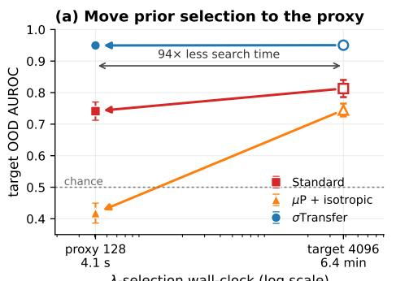

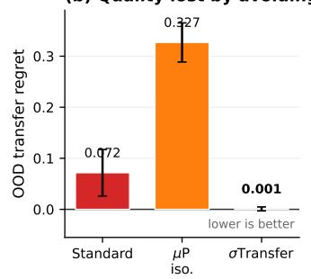  
Selection: MNIST-val vs FMNIST. Evaluation: disjoint MNIST-test vs EMNIST+KMNIST. Mean ± s.d. over 10 seeds; all+diag. Timing is a matched A100 benchmark  
Figure 6: Time-to-quality tradeoff for OOD precision transfer (128 → 4096, all-parameter diagonal GGN). Filled markers use the proxy-selected precision; open markers use target-side selection. Arrows point toward the cheaper proxy search. The reported A100 times compare proxyside and target-side selection procedures (4.1 seconds versus 6.4 minutes, 94×). Zero-shot transfer removes the target sweep but retains one target posterior at the transferred precision. The right panel reports paired transfer regret over 10 seeds. Only σTransfer removes the target search without measurable OOD-quality loss.

KMNIST (Clanuwat et al., 2018); in those cases the proxy-selected precision generalizes marginally better to the evaluation distributions.
<table><tr><td>Method</td><td>AUROC using  $\lambda _ { 1 2 8 } ^ { \star }$ </td><td> $\mathbf { A U R O C \ u s i n g \lambda } _ { 4 0 9 6 } ^ { \star }$ </td><td>Transfer regret ↓</td></tr><tr><td>SP</td><td> $0 . 7 4 1 \pm 0 . 0 2 9$ </td><td> $0 . 8 1 3 \pm 0 . 0 2 7$ </td><td> $0 . 0 7 2 \pm 0 . 0 4 6$ </td></tr><tr><td> $\mu \mathrm { P } + \mathrm { i s o t r o p i c }$ </td><td> $0 . 4 1 8 \pm 0 . 0 3 2$ </td><td> $0 . 7 4 5 \pm 0 . 0 2 0$ </td><td> $0 . 3 2 7 \pm 0 . 0 3 8$ </td></tr><tr><td>σTransfer (ours)</td><td> $\mathbf { 0 . 9 5 0 \pm 0 . 0 0 3 }$ </td><td> $\mathbf { 0 . 9 5 0 \pm 0 . 0 0 4 }$ </td><td> $\mathbf { 0 . 0 0 1 \pm 0 . 0 0 4 }$ </td></tr></table>

Table 8: OOD-aware precision transfer at width 4096 (10 seeds; mean ± sample s.d.). The precision is selected on MNIST-validation versus FMNIST and evaluated on disjoint MNIST-test versus EMNIST+KMNIST. Transfer regret is $\mathrm { A U R O C } ( \lambda _ { 4 0 9 6 } ^ { \star } ) - \mathrm { A U R O C } ( \lambda _ { 1 2 8 } ^ { \star } )$ ; lower is better.

<table><tr><td>Method</td><td>Target width n AUROC using</td><td> $\lambda _ { 1 2 8 } ^ { \star }$ </td><td>AUROC using  ${ \boldsymbol { \lambda } } _ { n } ^ { \star }$ </td><td>Regret↓</td></tr><tr><td rowspan="4">SP</td><td>128</td><td> $0 . 9 5 7 \pm 0 . 0 0 5$ </td><td> $0 . 9 5 7 \pm 0 . 0 0 5$ </td><td> $0 . 0 0 0 0 \pm 0 . 0 0 0 0$ </td></tr><tr><td>512</td><td> $0 . 9 0 9 \pm 0 . 0 0 8$ </td><td> $0 . 9 0 9 \pm 0 . 0 0 8$ </td><td> $0 . 0 0 0 0 \pm 0 . 0 0 0 0$ </td></tr><tr><td>2048</td><td> $0 . 8 0 7 \pm 0 . 0 1 2$ </td><td> $0 . 8 0 2 \pm 0 . 0 1 3$ </td><td> $- 0 . 0 0 4 4 \pm 0 . 0 1 9 3$ </td></tr><tr><td>4096</td><td> $0 . 7 4 1 \pm 0 . 0 2 9$ </td><td> $0 . 8 1 3 \pm 0 . 0 2 7$ </td><td> $0 . 0 7 1 6 \pm 0 . 0 4 5 5$ </td></tr><tr><td rowspan="4"> $\mu \mathrm { P } \cdot$  + isotropic</td><td>128</td><td> $0 . 9 5 7 \pm 0 . 0 0 4$ </td><td> $0 . 9 5 7 \pm 0 . 0 0 4$ </td><td> $0 . 0 0 0 0 \pm 0 . 0 0 0 0$ </td></tr><tr><td>512</td><td> $0 . 8 6 8 \pm 0 . 0 2 4$ </td><td> $0 . 8 6 8 \pm 0 . 0 2 4$ </td><td> $0 . 0 0 0 0 \pm 0 . 0 0 0 0$ </td></tr><tr><td>2048</td><td> $0 . 4 4 5 \pm 0 . 0 2 5$ </td><td> $0 . 7 4 3 \pm 0 . 0 2 2$ </td><td> $0 . 2 9 7 7 \pm 0 . 0 2 8 0$ </td></tr><tr><td>4096</td><td> $0 . 4 1 8 \pm 0 . 0 3 2$ </td><td> $0 . 7 4 5 \pm 0 . 0 2 0$ </td><td> $0 . 3 2 6 9 \pm 0 . 0 3 8 3$ </td></tr><tr><td rowspan="4">σTransfer</td><td>128</td><td> $0 . 9 6 2 \pm 0 . 0 0 3$ </td><td> $0 . 9 6 2 \pm 0 . 0 0 3$ </td><td> $0 . 0 0 0 0 \pm 0 . 0 0 0 0$ </td></tr><tr><td>512</td><td> $0 . 9 5 8 \pm 0 . 0 0 4$ </td><td> $0 . 9 5 8 \pm 0 . 0 0 4$ </td><td> $0 . 0 0 0 3 \pm 0 . 0 0 0 5$ </td></tr><tr><td>2048</td><td> $0 . 9 5 2 \pm 0 . 0 0 4$ </td><td> $0 . 9 5 1 \pm 0 . 0 0 4$ </td><td> $- 0 . 0 0 0 6 \pm 0 . 0 0 1 2$ </td></tr><tr><td>4096</td><td> $\mathbf { 0 . 9 5 0 \pm 0 . 0 0 3 }$ </td><td> $\mathbf { 0 . 9 5 0 \pm 0 . 0 0 4 }$ </td><td> $\mathbf { 0 . 0 0 0 8 \pm 0 . 0 0 3 9 }$ </td></tr></table>

Table 9: OOD-aware precision transfer across width (10 seeds; mean ± sample s.d.). Both AUROC columns evaluate target width $n ; \lambda _ { 1 2 8 } ^ { \star }$ is selected on the proxy and ${ \boldsymbol { \lambda } } _ { n } ^ { \star }$ on that target. Regret is $\mathrm { A U R O C } ( \lambda _ { n } ^ { \star } ) - \mathrm { A U R O C } ( \breve { \lambda } _ { 1 2 8 } ^ { \star } )$ on the held-out evaluation distributions. The main text reports $n = 4 0 9 6 .$

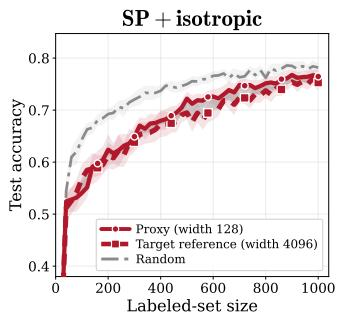

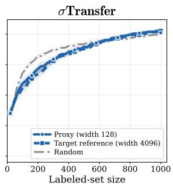

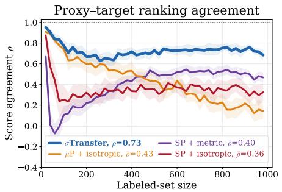  
Figure 7: Sequential active learning on Fashion-MNIST (20 seeds; panels and encoding as in Figure 3). The agreement ordering replicates with a compressed baseline spread $( \bar { \rho } = 0 . 7 3$ for σTransfer against 0.36–0.43). On this task the acquisition curves do not separate from random, so we claim decision transfer on both datasets and downstream utility on MNIST only.

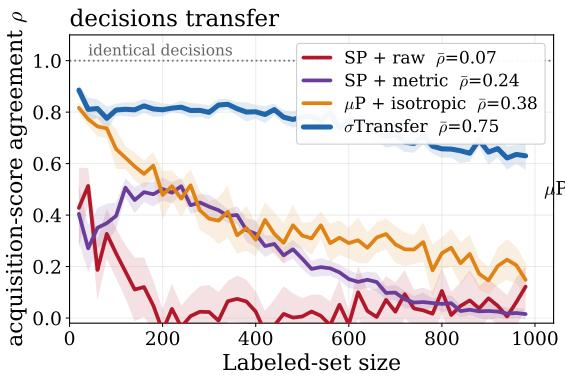

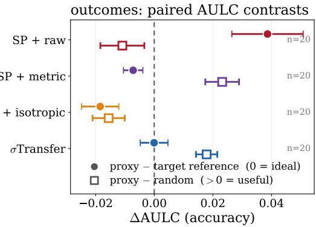  
Figure 8: Sequential active learning: decisions and outcomes (10-class MNIST, last-layer diagonal posterior at fixed $\log _ { 2 } \lambda = 0$ , width 128 → 4096, 20 seeds). $L e f t .$ per-round Spearman correlation between the width-128 and width-4096 acquisition scores (band: 95% CI of the mean). σTransfer holds $\rho { \approx } 0 . 6 { - 0 . 8 }$ for the whole trajectory while every baseline decays toward zero, and the trajectory means are $\bar { \rho } = 0 . 7 5 \pm 0 . 0 1$ (σTransfer), $0 . 3 8 \pm 0 . 0 2$ (µP + isotropic), $0 . 2 4 \pm 0 . 0 1$ (SP + metric) and $0 . 0 7 \pm 0 . 0 3$ (SP + isotropic). Right: paired area-under-the-learning-curve contrasts (per seed, then averaged; bars: 95% CI). Filled: proxy — target reference, so 0 means the proxy acquires as well as the target's own posterior; open: proxy — random. Only σTransfer is simultaneously faithful (its fidelity interval is the only one covering zero, —0.0001, $[ - 0 . 0 0 5 , + 0 . 0 0 5 ] \cdot$ ) and useful (+0.018, $[ + 0 . 0 1 4 , \dot { + } 0 . 0 2 2 ] ) ;$ SP + isotropic's apparent +0.039 fidelity reflects a degenerate target reference that itself falls 0.050 below random. Full learning curves: Figure 10; Fashion-MNIST: Figures 9 and 11.

## F SEQUENTIAL ACTIVE LEARNING DETAILS

For sequential acquisition on MNIST and Fashion-MNIST, we use three-hidden-layer ReLU MLPs of widths 128 and 4096. Each run starts with 20 labelled examples and acquires 20 per round until 1,000 are labelled, giving 50 evaluations including the initial fit. The unlabelled pool initially contains 2,000 examples. Each round scores 500 randomly sampled remaining candidates using EPIG, 200 reference inputs and 256 posterior samples. We use 500 validation and 1,000 test examples. Initial labelled, pool and validation sets are disjoint, class-balanced subsets of the official training split; reference and test inputs are disjoint, class-balanced subsets of the official test split. EPIG uses only the reference inputs.

Acquisition uses last-layer diagonal Laplace, including the head bias, at fixed $\lambda = 1$ . We warm-start the weights each round and use full-batch Adam (SP) or MuAdam $( \mu \mathrm { P } )$ , both at learning rate $1 0 ^ { - 3 }$ for at most 500 updates. Validation NLL is checked every 10 updates, with patience 150 updates, and the best checkpoint is restored. The strategies share initial splits across 20 seeds.

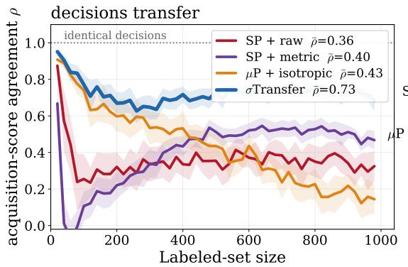

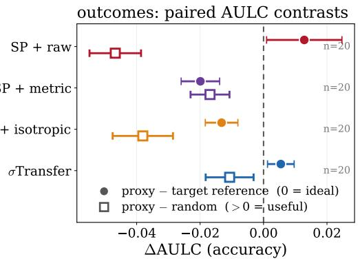  
Figure 9: Sequential active learning on Fashion-MNIST: decisions and outcomes (20 seeds; same protocol and panels as Figure 8). The agreement ordering replicates $( \bar { \rho } = 0 . 7 3 \pm 0 . 0 2$ for σTransfer against $0 . 3 6 \mathrm { - } 0 . 4 3 ;$ see also Figure 7), with a compressed baseline spread. The outcome panel is negative for every method: on this task EPIG acquisition does not beat random over the trajectory (a cold-start effect that endpoint accuracy alone conceals). At 20 seeds every method's utility interval excludes zero; σTransfer is the least affected $( - 0 . 0 1 1 , [ - 0 . 0 1 8 , - 0 . 0 \dot { 0 } 3 ] )$ against $- 0 . 0 4 7 \left[ - 0 . 0 5 5 , - 0 . 0 3 9 \right]$ for SP + isotropic. We therefore claim decision transfer on both datasets and downstream utility on MNIST only.

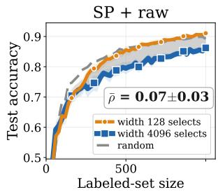

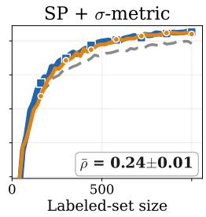

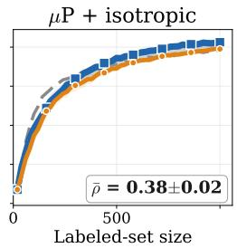

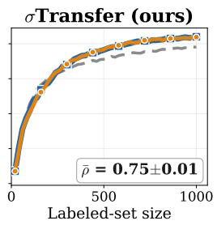  
Figure 10: Sequential active learning on 10-class MNIST (last-layer diagonal posterior, 20 seeds; bands: 95% CI of the mean). Every curve is averaged over the same complete-trajectory seed set. One panel per method, titled above each panel. Orange selects each acquisition batch with the width-128 posterior and blue with the width-4096 posterior; both are then evaluated on the same width-4096 model, and the grey band between them is the acquisition-transfer gap. The thin orange line is drawn over the thicker blue one, so a method in which the proxy reproduces the target's decisions shows orange tracing blue with no blue visible beneath. Markers (circles for width 128, squares for width 4096) are stamped every seventh acquisition round and carry no information beyond series identity. $\bar { \rho }$ is the mean rank correlation between the two posteriors' acquisition scores over the trajectory, the direct measure of how closely the small model reproduces the large model's decisions. Accuracy on this task is largely insensitive to acquisition quality, but the decisions are not: $\bar { \rho }$ rises from 0.07 (SP + isotropic) through 0.24 (SP + metric) and 0.38 $( \mu \mathrm { { P } + i s o t r o p i c ) }$ to 0.75 under σTransfer, so neither the parametrization nor the prior geometry alone suffices.

Figure 10 gives the full per-method learning curves for the 50-round sequential active-learning experiment summarised in Section 6.2; Table 11 gives the endpoint statistics at n = 1000 labelled points, and Figure 12 and Table 10 the one-shot EPIG acquisition-agreement metrics for both datasets.

## G DECISION TRANSFER FOR LANGUAGE MODELS

We use a width-128 model to decide whether a width-2048 model should answer a prompt. The small model computes the uncertainty score, and the large model supplies the prediction.

Models and pretraining. We train decoder-only Transformers at hidden widths 128, 256, 512, 1024, 2048. All models have 8 layers, 8 attention heads, context length 512

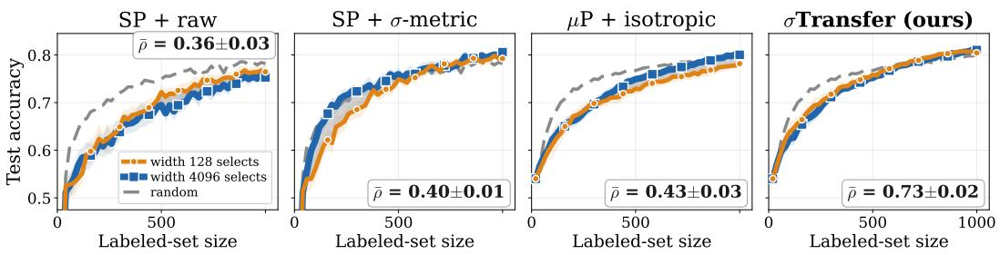  
Figure 11: Sequential active learning on Fashion-MNIST (last-layer diagonal posterior, 20 seeds; bands: 95% CI of the mean; same protocol and encoding as Figure 10). The decision-agreement ordering matches MNIST, with $\bar { \rho } = 0 . 7 3$ under σTransfer, compared with 0.36–0.43 for the three baselines. SP + isotropic has higher agreement on Fashion-MNIST than on MNIST (0.36 versus 0.07).

Acquisition-decision transfer from the width-128 proxy (EPiG, exact posterior, 10 seeds)

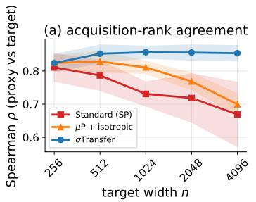

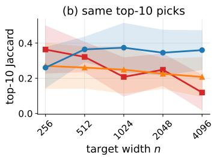

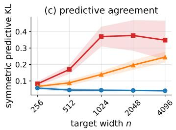  
Figure 12: Direct acquisition transfer (EPIG, exact last-layer posterior, validation-NLL-selected transferred precision, 10 seeds; bands 95% CI of the mean). (a) Proxy-target acquisition-rank agreement. (b) Top-10 Jaccard overlap. (c) Symmetric predictive KL. The target posterior is used only to measure agreement; the proxy choices do not require it.

and the Pythia padded vocabulary of 50,304 entries (Biderman et al., 2023). They are trained on the same stream of $1 0 ^ { 9 }$ FineWeb-Edu tokens (Penedo et al., 2024). We use one pretraining seed for each width and parametrization.

The $\mu \mathrm { P }$ models use MuReadout, set\_base\_shapes, and MuAdamW, with base width 128 and base learning rate 0.01. SP uses nn . Linear and AdamW at learning rate 0.0003. These rates are fixed across widths. Both use $\beta = ( 0 . 9 , 0 . 9 5 )$ , weight decay 0.1, 2% warmup, cosine decay to 10% of the initial rate, and gradient-norm clipping at 1, without dropout. Each update accumulates four batches of 32 length-512 sequences.

Classification heads. We freeze the backbone and fit a linear classifier to the final-layernormalization output h at the last real token. Its logits are $W ( h / c ) + b ,$ where $c ^ { 2 }$ is the mean squared feature norm on the training inputs. We minimize summed cross-entropy plus $( \| W \| _ { F } ^ { 2 } + \| b \| ^ { 2 } ) / 2$ using L-BFGS in float64. For each backbone and task, prior comparisons share the fitted head, which is held fixed throughout the precision sweep.

We apply last-layer Laplace with width-normalized or isotropic priors. For raw features of dimension d, their weight covariance scales are $d ^ { - 1 } I$ and I, respectively. In the fitted head's coordinates, these become $\begin{array} { r } { S _ { W } = ( c ^ { 2 } / d ) I } \end{array}$ and $S _ { W } = c ^ { 2 } I ;$ both use $\bar { S _ { b } } \bar { = } I$ . These definitions apply to both backbone parametrizations; $\mu \mathrm { P }$ with the width-normalized prior gives σTransfer. We use full-GGN curvature in float64 and evaluate prior precision on a 61-point $\log _ { 2 } \lambda$ grid. For precision selection and OOD gating, scores use 200 Monte Carlo samples of the Gaussian logits, with common random numbers.

Active learning on AG News. Figure 5 starts with 50, 500 or 5,000 labelled examples and acquires 250 labels one at a time from a common pool of 512 examples, disjoint from the initial labelled sets. EPIG uses 256 validation reference inputs and 2,048 posterior samples. We refit the heads after each acquisition and use full-GGN Laplace at fixed $\lambda = 1$ After the final acquisition, we evaluate the target's MAP predictions on 7,600 test examples. The σTransfer arm uses the width-normalized prior defined above. The feature normalization c is fixed from the full training feature cache throughout acquisition.

Table 10: EPIG acquisition transfer on MNIST and FMNIST (proxy 128 → target 4096, validation-NLL-selected λ, exact last-layer posterior; MNIST 10 seeds, FMNIST 5 seeds). Agreement between the proxy and target posteriors, with the target evaluated at the transferred precision: Spearman rank correlation of EPIG scores, top-10 acquisition-set Jaccard, and symmetric predictive KL (lower better). Bold = best per column.
<table><tr><td rowspan="3">Method</td><td colspan="3">MNIST</td><td colspan="3">FMNIST</td></tr><tr><td>| Spearman ρ</td><td> $\mathrm { J a c c _ { 1 0 } }$ </td><td> $\mathrm { K L _ { s y m } }$ </td><td>| Spearman ρ</td><td> $\mathrm { J a c c _ { 1 0 } }$ </td><td> $\mathrm { K L _ { s y m } }$ </td></tr><tr><td>SP + isotropic</td><td> $0 . 6 6 9 { \scriptstyle \pm . 1 0 3 }$ </td><td> $0 . 1 1 9 { \scriptstyle \pm . 1 0 5 }$ </td><td> $0 . 3 4 8 { \scriptstyle \pm . 1 2 4 }$ </td><td> $0 . 5 8 9 { \scriptstyle \pm . 1 3 7 }$ </td><td> $0 . 1 1 8 { \scriptstyle \pm . 0 9 9 }$ </td><td> $0 . 9 4 4 { \scriptstyle \pm . 1 9 3 }$ </td></tr><tr><td> $\mu \mathrm { P } +$  isotropic</td><td> $0 . 7 0 0 { \scriptstyle \pm . 0 3 4 }$ </td><td> $0 . 2 0 7 { \scriptstyle \pm . 1 1 7 }$ </td><td> $0 . 2 4 5 { \scriptstyle \pm . 0 3 2 }$ </td><td> $0 . 6 2 9 { \scriptstyle \pm . 0 6 3 }$ </td><td> $0 . 1 3 4 { \scriptstyle \pm . 1 2 4 }$ </td><td> $0 . 4 1 8 { \scriptstyle \pm . 0 6 0 }$ </td></tr><tr><td>σTransfer (ours)</td><td> $\mathbf { 0 . 8 5 4 { \scriptstyle \pm . 0 2 5 } }$ </td><td> $\mathbf { 0 . 3 6 0 { \scriptstyle \pm . 1 1 7 } }$ </td><td> $\mathbf { 0 . 0 4 0 { \scriptstyle \pm . 0 0 4 } }$ </td><td> $\mathbf { 0 . 7 5 0 { \scriptstyle \pm . 0 6 6 } }$ </td><td> $\mathbf { 0 . 1 9 8 _ { \pm . 1 0 4 } }$ </td><td> $\mathbf { 0 . 1 6 7 { \scriptstyle \pm . 0 2 1 } }$ </td></tr></table>

<table><tr><td></td><td></td><td>Test acc.</td><td>Test NLL</td><td>Regret</td></tr><tr><td>SP</td><td>random</td><td> $0 . 9 0 1 \pm 0 . 0 1 6$ </td><td> $0 . 9 7 6 \pm 0 . 1 4 1$ </td><td>+0.009</td></tr><tr><td>SP</td><td>proxy EPIG</td><td> $0 . 9 2 0 \pm 0 . 0 1 2$ </td><td> $0 . 7 7 4 \pm 0 . 1 7 1$ </td><td>-0.011</td></tr><tr><td>SP</td><td>oracle EPIG</td><td> $0 . 9 1 0 \pm 0 . 0 0 8$ </td><td> $0 . 9 3 1 \pm 0 . 1 1 1$ </td><td></td></tr><tr><td> $\mu \mathrm { P + i s o t r o p i c }$ </td><td>random</td><td> $0 . 8 9 0 \pm 0 . 0 0 9$ </td><td> $0 . 9 2 0 \pm 0 . 1 2 0$ </td><td>+0.028</td></tr><tr><td> $\mu \mathrm { P + i s o t r o p i c }$ </td><td>proxy EPIG</td><td> $0 . 8 8 9 \pm 0 . 0 2 1$ </td><td> $0 . 9 0 9 \pm 0 . 2 9 8$ </td><td>+0.029</td></tr><tr><td> $\mu \mathrm { P + i s o t r o p i c }$ </td><td>oracle EPIG</td><td> $0 . 9 1 8 \pm 0 . 0 0 4$ </td><td> $0 . 6 9 4 \pm 0 . 1 0 7$ </td><td></td></tr><tr><td> $\sigma \mathrm { T r a n s f e r }$ </td><td>random</td><td> $0 . 8 8 8 \pm 0 . 0 0 6$ </td><td> $0 . 9 5 3 \pm 0 . 1 5 2$ </td><td> $+ 0 . 0 3 7$ </td></tr><tr><td>σTransfer</td><td>proxy EPIG</td><td> $\mathbf { 0 . 9 2 3 \pm 0 . 0 1 1 }$ </td><td> $\mathbf { 0 . 7 0 0 \mathop { \pm } 0 . 1 0 9 }$ </td><td> $\mathbf { + 0 . 0 0 3 }$ </td></tr><tr><td>σTransfer</td><td>oracle EPIG</td><td> $0 . 9 2 6 \pm 0 . 0 1 0$ </td><td> $0 . 6 6 1 \pm 0 . 1 5 3$ </td><td></td></tr></table>

Table 11: Sequential active-learning utility at $n = 1 0 0 0$ (10-class MNIST, 1ast-layer diagonal posterior at fixed $\log _ { 2 } \lambda = 0$ width $1 2 8 \to 4 0 9 6 ;$ mean ± sample s.d.). Regret = oracle-EPIG accuracy — method accuracy. Round wall-clock is dominated by retraining the width-4096 model and is the same for every strategy, so this experiment is a decision-transfer result, not a speed result.

OOD data. For each classification task, we take OOD prompts from two other datasets, denoted A and B. We score them using the ID task's classification head and count abstention as the correct action. Sentiment-to-sentiment pairs are excluded. Table 12 gives the source assignments and test-set sizes.

Table 12: OOD source assignments and test-set sizes.
<table><tr><td>ID tasks (test-set sizes)</td><td>Source A (pool size)</td><td>Source B (pool size)</td></tr><tr><td>AG News (7600), DBpedia (8000)</td><td>SST-2 (872)</td><td>TREC (500)</td></tr><tr><td>IMDB (8000), Rotten Tomatoes (1066), Yelp Polarity (8000), SST-2 (872)</td><td>AG News (7600)</td><td>TREC (500)</td></tr><tr><td>Emotion (2000), SNLI (8000), Yahoo (8000), TREC (500)</td><td>AG News (7600)</td><td>SST-2 (872)</td></tr></table>

Dataset sources are Zhang et al. (2015) for AG News, DBpedia, Yahoo Answers, and Yelp Polarity; Socher et al. (2013) for SST-2; Li & Roth (2002) for TREC; Maas et al. (2011) for IMDB; Pang & Lee (2005) for Rotten Tomatoes; Saravia et al. (2018) for Emotion; and Bowman et al. (2015) for SNLI.

Decision rule and calibration. We choose the proxy's prior precision using ID validation data and OOD source A. The selected $\lambda _ { \mathrm { o o d } }$ maximizes the AUROC of BALD (Houlsby et al., 2011) for distinguishing ID prompts from source A. At this precision, we choose a threshold τ that maximizes Youden's J, defined as ID retention plus OOD recall minus one.

The large model answers a prompt when the proxy's BALD score is at most τ; otherwise, the system abstains. Answered prompts use the large model's MAP predictions. We evaluate on ID test data and OOD source B, which was not used for calibration. We then exchange A and B and average the two results.

Metrics and results. OOD recall is the fraction of OOD prompts rejected, and ID retention is the fraction of ID prompts answered. Answered accuracy is the accuracy among answered prompts, counting answered OOD prompts as errors. Abstention agreement is the fraction of the proxy's rejected prompts that are also rejected by the separately calibrated target model.

Table 13 gives the results for each task. The final row reports the mean and population standard deviation across the ten tasks, after averaging the two source orderings within each task.

Table 13: Proxy-based abstention results for width 128 → 2048. Each entry reports OOD recall / ID retention / answered accuracy / abstention agreement, averaged over the two source orderings.
<table><tr><td>Dataset</td><td>SP + isotropic</td><td>σTransfer</td></tr><tr><td>AG News</td><td>0.846 / 0.969 / 0.872 / 0.784</td><td>0.895 / 0.963 / 0.866 / 0.702</td></tr><tr><td>DBpedia</td><td>0.981 / 0.999 / 0.899 / 0.985</td><td>0.987 / 0.998 / 0.869 / 0.966</td></tr><tr><td>Emotion</td><td>1.000 / 0.999 / 0.485 / 0.998</td><td>0.998 / 0.999 / 0.479 / 0.998</td></tr><tr><td>IMDB</td><td>0.605 / 0.826 / 0.603 / 0.846</td><td>0.725 / 0.837 / 0.643 / 0.873</td></tr><tr><td>Rotten Tomatoes</td><td>0.875 / 0.977 / 0.477 / 0.955</td><td>0.937/0.984/0.547/0.969</td></tr><tr><td>SNLI</td><td>0.958 / 0.992 / 0.496 / 0.953</td><td>0.974 / 0.986 / 0.512 / 0.921</td></tr><tr><td>SST-2</td><td>0.836 / 0.968 / 0.456 / 0.950</td><td>0.732 / 0.939 / 0.431 / 0.912</td></tr><tr><td>TREC</td><td>0.998 / 1.000 / 0.696 / 1.000</td><td>0.999 / 0.996 / 0.655 / 0.998</td></tr><tr><td>Yahoo</td><td>0.676 / 0.976 / 0.468 / 0.774</td><td>0.662 / 0.968 / 0.454 / 0.816</td></tr><tr><td>Yelp Polarity</td><td>0.775 / 0.927 / 0.713 / 0.729</td><td>0.854 / 0.926 / 0.760 / 0.734</td></tr><tr><td>Mean ± SD</td><td>0.855±.13 / 0.963±.05 / 0.616±.16 /0.898±.10</td><td>0.876±.12 /0.959±.05 /0.621±.16 /0.889±.10</td></tr></table>

Comparison with target decisions. For evaluation, we also apply the same calibration procedure to the target's own posterior. This gives mean OOD recall of 0.972/0.980, ID retention of 0.975/0.978, and answered accuracy of 0.693/0.694 for SP/σTransfer. Using the proxy instead reduces OOD recall by approximately 10–12 percentage points, ID retention by 1–2 points, and answered accuracy by 7–8 points. Deployment requires only the proxy posterior and target MAP predictions.

Additional comparisons. The target's mean NLL on answered ID prompts differs from ungated prediction by -0.004/ – 0.005 nats for SP/σTransfer. Replacing BALD with one minus the maximum probability of the posterior predictive (1 – MSP; Hendrycks & Gimpel, 2016) gives proxy OOD recall of 0.41–0.42 while retaining approximately half the ID prompts. Applying this alternative to the target gives OOD recall of 0.84–0.85 and answered accuracy of 0.64–0.66.

Selecting λ using ID evidence alone gives OOD recall of 0.85–0.86; selecting τ still uses source A. BALD magnitudes vary across widths. In the experiment reported here, the threshold is always applied to the proxy's scores.

## H PRIOR-PRECISION TRANSFER IN LANGUAGE MODELS

Both tables use the fixed-checkpoint plug-in evidence-score criterion on ID training data at the proxy, the shared half-bit grid, and the target's own evidence search only as an evaluation reference. In zero-shot deployment, the target constructs one posterior at the transferred proxy precision. ∆NLL is transferred-minus-own test NLL at the target; sweep arrays use 200 MC samples.

## H.1 COMPARISON WITH THE DIAGONAL NEURAL G-PRIOR

We test whether the diagonal neural g-prior of Antorán et al. (2023) supports prior-precision transfer in our fixed-checkpoint Laplace setting. Its precision is αD, where $D = \arg ( H )$ and H is the summed last-layer GGN. We compute D from training data at each width and transfer α from width 128 to 2048. The fitted classification heads remain fixed throughout the precision search.

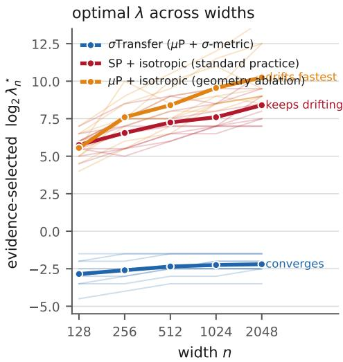

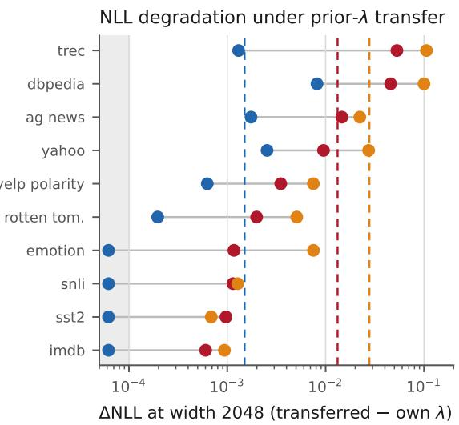  
Figure 13: Figure 4 with the geometry ablation added: the same $\mu \mathrm { P }$ checkpoints with an isotropic prior drift faster than SP $( 5 . 5 \stackrel { - } {  } 1 0 . 2 $ bits mean optimum, $4 . 7 \pm 1 . { \dot { 3 } }$ bits at $1 \bar { 2 8 } \to 2 0 4 8 )$ and produce the largest mean target-NLL degradation (0.028, reaching 0.1 on TREC).

Table 14: Our language models, width 128 → 2048 (Section 6.3). λ values are $\log _ { 2 }$
<table><tr><td></td><td colspan="3">σTransfer</td><td colspan="3">SP + isotropic</td></tr><tr><td>Dataset</td><td> $\lambda _ { 1 2 8 } ^ { \star }$ </td><td> $\lambda _ { 2 0 4 8 } ^ { \star }$ </td><td>∆NLL</td><td> $\lambda _ { 1 2 8 } ^ { \star }$ </td><td> $\lambda _ { 2 0 4 8 } ^ { \star }$ </td><td>∆NLL</td></tr><tr><td>AG News</td><td>-3.5</td><td>-2.5</td><td>+0.0017</td><td>+4.5</td><td>+7.0</td><td>+0.0146</td></tr><tr><td>DBpedia</td><td>-4.5</td><td>-3.5</td><td>+0.0082</td><td>+5.0</td><td>+7.5</td><td>+0.0458</td></tr><tr><td>Emotion</td><td>-3.0</td><td>-2.5</td><td>-0.0001</td><td>+6.0</td><td>+8.5</td><td>+0.0012</td></tr><tr><td>IMDB</td><td>-2.0</td><td>-1.5</td><td>-0.0000</td><td>+6.5</td><td>+9.5</td><td>+0.0006</td></tr><tr><td>Rotten Tomatoes</td><td>-2.0</td><td>-1.5</td><td>+0.0002</td><td>+7.0</td><td>+10.5</td><td>+0.0020</td></tr><tr><td>SNLI</td><td>-1.5</td><td>-1.5</td><td>+0.0000</td><td>+5.5</td><td>+7.5</td><td>+0.0011</td></tr><tr><td>SST-2</td><td>-3.0</td><td>-2.5</td><td>+0.0000</td><td>+6.0</td><td>+9.0</td><td>+0.0010</td></tr><tr><td>TREC</td><td>-2.5</td><td>-2.0</td><td>+0.0013</td><td>+5.5</td><td>+8.0</td><td>+0.0530</td></tr><tr><td>Yahoo</td><td>-3.5</td><td>-2.5</td><td>+0.0025</td><td>+5.5</td><td>+7.0</td><td>+0.0095</td></tr><tr><td>Yelp Polarity</td><td>-3.0</td><td>-2.0</td><td>+0.0006</td><td>+6.0</td><td>+9.5</td><td>+0.0035</td></tr><tr><td>Mean gap (bits) / ∆NLL</td><td> $0 . 6 5 \pm 0 . 3 4 / + 0 . 0 0 1 4$ </td><td></td><td></td><td> $2 . 6 5 \pm 0 . 6 3 / + 0 . 0 1 3 2$ </td><td></td><td></td></tr></table>

The mean absolute precision gap is 3.95 bits for SP and 3.50 bits for $\mu \mathrm { P } ,$ , with mean target test-NLL increases of 0.0367 and 0.0229, respectively, when transferring the proxy precision (Table 16). Thus this normalization leaves substantial precision drift in our fixed-checkpoint experiment.

## I EXTERNAL VALIDATION ON PUBLIC $\scriptstyle \mathrm { U - } \mu \mathrm { P } / \mathrm { S P }$ PAIRS: DETAILS

Checkpoints. We use public unit-scaled $\mu \mathrm { P } \left( \mathrm { u } \mathrm { - } \mu \mathrm { P } \right)$ and SP checkpoints from Blake et al. (2025) at approximately 1B (d=2048, 16 layers) and 7B (d=4096, 32 layers), pretrained on 300B SlimPajama tokens. Width and depth increase together. We evaluate one checkpoint per size and parametrization; SP training hyperparameters were not retuned for each size. Checkpoint revisions and inference code are pinned. The extracted final-normalization representations reproduce the released logits for both 1B models. Last-layer inference follows Appendix G.

Precision transfer. Table 17 compares precision transfer across the four combinations of parametrization and prior. The corrected evidence score adds a quadratic estimate of the gain in log posterior from locally adjusting the trained weights at each prior precision. All selected precisions are interior to the grid. The correction changes the selection gaps and method ordering:

Table 15: Public u-μP/SP pairs, 1B→7B, all ten tasks (primary cells; extends Table 17). Each model's search time is its curvature eigendecomposition plus grid sweep (u-μP family; SP within 10%); Yahoo and DBpedia run on CPU because their 41k/57k-dimensional eigenproblems exceed the GPU solver. The reported ratios compare proxy- and target-side search procedures, not end-toend Regime-A deployment; the 7B model still constructs one posterior at the transferred precision. Timing results are available for nine tasks; SST-2 is excluded from the timing summary. Speedups are approximate ratios of the displayed, rounded times.
<table><tr><td></td><td colspan="2"> $\mathbf { u } { - } { \boldsymbol { \mu } } \mathrm { P } + { \boldsymbol { \sigma } } { \mathrm { - } } \mathrm { m e t r i c }$ </td><td colspan="2">SP + isotropic</td><td colspan="4"></td></tr><tr><td>Dataset</td><td>gap</td><td>∆NLL</td><td>gap</td><td>∆NLL</td><td>search 1B</td><td></td><td>search 7B</td><td>speedup</td></tr><tr><td>AG News</td><td>0.0</td><td>+0.0000</td><td>0.5</td><td>+0.0030</td><td>4s</td><td></td><td>9s</td><td>~2.3×</td></tr><tr><td>DBpedia</td><td>0.0</td><td>+0.0000</td><td>1.0</td><td></td><td>+0.0247</td><td>40s</td><td>3.7h</td><td>330×</td></tr><tr><td>Emotion</td><td>0.5</td><td>+0.0002</td><td>1.0</td><td></td><td>+0.0030</td><td>5s</td><td>24 s</td><td>5×</td></tr><tr><td>IMDB</td><td>0.0</td><td>+0.0000</td><td>0.5</td><td>-0.0016</td><td></td><td>2s</td><td>4s</td><td>2×</td></tr><tr><td>Rotten Tomatoes</td><td>0.5</td><td>+0.0002</td><td>0.5</td><td>+0.0011</td><td></td><td>2s</td><td>3s</td><td>2×</td></tr><tr><td>SNLI</td><td>0.5</td><td>+0.0000</td><td>1.5</td><td></td><td>+0.0011</td><td>3s</td><td>6s</td><td>2×</td></tr><tr><td>SST-2</td><td>0.0</td><td>+0.0000</td><td>1.0</td><td></td><td>+0.0017</td><td></td><td></td><td></td></tr><tr><td>TREC</td><td>0.0</td><td>+0.0000</td><td>0.0</td><td>+0.0000</td><td></td><td>5s</td><td>23 s</td><td>5×</td></tr><tr><td>Yahoo</td><td>0.0</td><td>+0.0000</td><td>0.5</td><td></td><td>+0.0048</td><td>19s</td><td>81 min</td><td>260×</td></tr><tr><td>Yelp Polarity</td><td>0.0</td><td>+0.0000</td><td>0.5</td><td></td><td>-0.0015</td><td>3s</td><td>4s</td><td>1x</td></tr><tr><td>Mean</td><td> $0 . 1 5 \pm 0 . 2 4$ </td><td>+0.0000</td><td> $0 . 7 0 \pm 0 . 4 2$ </td><td></td><td>+0.0036</td><td></td><td></td><td></td></tr></table>

Table 16: Diagonal neural g-prior on our language models (128 → 2048, ten tasks, one checkpoint seed). $| \Delta \log _ { 2 } \alpha |$ is the mean absolute proxy-target selection gap and ∆NLL is mean transferredminus-target-local test NLL, both under the fixed-checkpoint plug-in evidence score. Counts give tasks with both proxy and target selections strictly inside the search grid. Validation-NLL gaps are omitted because only five of twenty pairs satisfy this condition.
<table><tr><td>Parametrization</td><td> $| \Delta \log _ { 2 } \alpha |$ </td><td>∆NLL</td><td>Evidence: interior</td><td>Val. NLL: interior</td></tr><tr><td>SP</td><td>3.95</td><td>+0.0367</td><td>10/10</td><td>4/10</td></tr><tr><td> $\mu \mathrm { P }$ </td><td>3.50</td><td>+0.0229</td><td>10/10</td><td>1/10</td></tr></table>

σTransfer and SP with an isotropic prior both have a mean gap of 0.56 bits under the corrected criterion.

Using the gate protocol in Appendix G, both public-model proxy gates retain approximately 99.8% of in-distribution inputs and reject 96% of out-of-distribution inputs on average, with similar performance on a common target.

## J TECHNICAL FORMULATION OF THE σTransfer PRIOR

We derive the prior scales used in Section 4 for the MLP setting of Theorem 1 and give the implementation details.

Prior coordinates. For the zero-mean prior $\theta _ { n } \ \sim \ \mathcal { N } ( 0 , \lambda ^ { - 1 } S _ { n } )$ with $\lambda ~ > ~ 0$ , write $S _ { n } \ =$ blockdiag $( s _ { 1 , n } I , \ldots , s _ { G , n } I )$ , with one block per parameter tensor and $s _ { g , n } > 0$ . Taking $T _ { n } =$ blockdiag $( \sqrt { s _ { 1 , n } } I , \ldots , \sqrt { s _ { G , n } } I )$ gives $S _ { n } = T _ { n } T _ { n } ^ { \top }$ . The prior $\phi _ { n } \sim \mathcal { N } ( 0 , \lambda ^ { - 1 } I )$ then induces the stated prior on $\theta _ { n } = T _ { n } \dot { \phi _ { n } }$ . At the trained checkpoint, the Jacobians satisfy $J _ { \phi , n } = J _ { n } T _ { n }$ , SO

$$
K _ { n } ( x , x ^ { \prime } ) = J _ { n } ( x ) S _ { n } J _ { n } ( x ^ { \prime } ) ^ { \top } = J _ { \phi , n } ( x ) J _ { \phi , n } ( x ^ { \prime } ) ^ { \top } .
$$

A common width-independent factor in $S _ { n }$ can be absorbed into $\lambda ;$ relative block constants specify the prior.

Table 17: Public 1B→7B prior-precision transfer on eight tasks excluding Yahoo and DBpedia. Precision gaps are in bits (mean ± s.d. across tasks); the 61-point grid has 0.5-bit spacing. ∆NLL is mean target test NLL at the proxy's precision minus that at the target's own precision, both selected by fixed-checkpoint plug-in evidence. The two primary comparisons cover all ten tasks in Table 15. Sweep arrays use 200 MC samples in fp16.
<table><tr><td>Cell</td><td>gap, plug-in evid. (bits) gap, corrected evid.</td><td></td><td>∆NLL</td></tr><tr><td> $\mathbf { u } { - } { \boldsymbol { \mu } } \mathrm { P } + { \boldsymbol { \sigma } } { \mathrm { - } } \mathrm { m e t r i c }$ </td><td> $0 . 1 9 \pm 0 . 2 6$ </td><td> $0 . 5 6 \pm 0 . 3 2$ </td><td> $+ 4 \times 1 0 ^ { - 5 }$ </td></tr><tr><td> $\mathbf { S P } + { \boldsymbol { \sigma } } { \mathrm { - m e t r i c } }$ </td><td> $0 . 0 6 \pm 0 . 1 8$ </td><td> $0 . 3 8 \pm 0 . 2 3$ </td><td> $- 1 \times 1 0 ^ { - 4 }$ </td></tr><tr><td> $\mathrm { \ u - } \mu \mathrm { P + i s o t r o p i c }$ </td><td> $0 . 8 8 \pm 0 . 2 3$ </td><td> $1 . 1 9 \pm 0 . 6 5$ </td><td> $+ 1 . 1 \times 1 0 ^ { - 3 }$ </td></tr><tr><td>SP + isotropic (standard)</td><td> $0 . 6 9 \pm 0 . 4 6$ </td><td> $0 . 5 6 \pm 0 . 4 2$ </td><td> $+ 8 . 6 \times 1 0 ^ { - 4 }$ </td></tr></table>

MLP construction. Consider a scalar-output MLP with fixed depth $L ,$ fixed input dimension $n _ { 0 } = d _ { \mathrm { i n } }$ , and hidden widths $n _ { 1 } = \cdot \cdot \cdot = n _ { L } = n$ Set $h ^ { 0 } ( x ) = x$ and

$$
z _ { i } ^ { \ell } ( x ) = \frac { 1 } { \sqrt { n _ { \ell - 1 } } } \sum _ { j } W _ { i j } ^ { \ell } h _ { j } ^ { \ell - 1 } ( x ) + b _ { i } ^ { \ell } , \qquad h _ { i } ^ { \ell } ( x ) = \mathrm { R e L U } ( z _ { i } ^ { \ell } ( x ) ) ,
$$

$$
f _ { n } ( x ) = \frac { 1 } { n } a ^ { \top } h ^ { L } ( x ) + c .
$$

All quantities below are evaluated at $\widehat { \theta } _ { n } = \theta _ { n , T }$ , with $T$ fixed independently of width and training satisfying Assumptions 1 and 2. In these coordinates, choose

$$
\begin{array} { c c c } { { S _ { W ^ { 1 } , n } = n d _ { \mathrm { i n } } I , } } & { { S _ { W ^ { \ell } , n } = n I } } & { { ( 2 \leq \ell \leq L ) , } } \\ { { S _ { b ^ { \ell } , n } = n I , } } & { { S _ { a , n } = n I , } } & { { S _ { c , n } = 1 . } } \end{array}
$$

Thus $T _ { n }$ has factor $\sqrt { n d _ { \mathrm { i n } } }$ on the input-weight block, $\sqrt { n }$ on the remaining weight and hiddenbias blocks, and 1 on the output bias. For an internal matrix, $\widetilde { W } ^ { \ell } = W ^ { \ell } / \sqrt { n }$ is the canonical $\mu \mathrm { P }$ matrix parameter; parameter and optimizer scalings transform together under Yang & Littwin (2023, Proposition 2.2.3 and Definition 2.9.12). The prior map $T _ { n }$ is defined by the choice of $S _ { n }$ above.

Kernel derivation. For $\ell = 1 , \ldots , L$ , define the sensitivity $r _ { i } ^ { \ell } ( x ) = n \partial f _ { n } ( x ) / \partial z _ { i } ^ { \ell } ( x )$ and the Gram entries

$$
\Sigma _ { \ell , n } ( x , x ^ { \prime } ) = \frac { h ^ { \ell } ( x ) ^ { \top } h ^ { \ell } ( x ^ { \prime } ) } { n } , \qquad \Pi _ { \ell , n } ( x , x ^ { \prime } ) = \frac { r ^ { \ell } ( x ) ^ { \top } r ^ { \ell } ( x ^ { \prime } ) } { n } .
$$

For the input layer, set $\Sigma _ { 0 , n } ( x , x ^ { \prime } ) = \Sigma _ { 0 } ( x , x ^ { \prime } ) = d _ { \mathrm { i n } } ^ { - 1 } x ^ { \top } x ^ { \prime }$ . The parameter derivatives are

$$
\frac { \partial f _ { n } } { \partial a _ { i } } = \frac { h _ { i } ^ { L } } { n } , \qquad \frac { \partial f _ { n } } { \partial b _ { i } ^ { \ell } } = \frac { r _ { i } ^ { \ell } } { n } ,
$$

$$
\frac { \partial f _ { n } } { \partial W _ { i j } ^ { \ell } } = \frac { r _ { i } ^ { \ell } h _ { j } ^ { \ell - 1 } } { n \sqrt { n _ { \ell - 1 } } } , \quad \frac { \partial f _ { n } } { \partial c } = 1 .
$$

Multiplying by the prior blocks and summing gives the exact finite-width identity

$$
\begin{array} { l } { { \displaystyle K _ { n } ( x , x ^ { \prime } ) = 1 + \Sigma _ { L , n } ( x , x ^ { \prime } ) + \Pi _ { 1 , n } ( x , x ^ { \prime } ) \big ( 1 + d _ { \mathrm { i n } } \Sigma _ { 0 } ( x , x ^ { \prime } ) \big ) } } \\ { { \displaystyle \qquad + \sum _ { \ell = 2 } ^ { L } \Pi _ { \ell , n } ( x , x ^ { \prime } ) \big ( 1 + \Sigma _ { \ell - 1 , n } ( x , x ^ { \prime } ) \big ) . } } \end{array}\tag{9}
$$

Under the stated assumptions, Lemma 2 establishes joint almost-sure convergence of these Gram entries on every fixed finite input set. The kernel therefore converges by continuity of finite sums and products. Corollary 1 gives the extension to any fixed output dimension.

Stored-coordinate scales. Under an invertible linear change $\theta _ { n } ^ { \prime } = R _ { n } \theta _ { n }$ , the prior and Jacobian transform as $S _ { n } ^ { \prime } = R _ { n } S _ { n } R _ { n } ^ { \top }$ and $J _ { n } ^ { \prime } = J _ { n } R _ { n } ^ { - 1 }$ , preserving ${ \bar { J _ { n } } } { \bar { S _ { n } } } { \bar { J _ { n } } } .$ Absorbing the forward factors into $W _ { \mathrm { s t o r e d } } ^ { \ell } \stackrel { \cdots } { = } W ^ { \ell } / \sqrt { n _ { \ell - 1 } }$ and $a _ { \mathrm { s t o r e d } } = a / n$ gives input-weight scale $n ,$ internal-weight scales $n / n _ { \ell - 1 } { \mathrm { ~ f o r ~ } } \ell \geq 2$ , and readout scale $1 / n$ . For a readout $\begin{array} { r } { f = c _ { \mathrm { o u t } } w ^ { \top } h + c , } \end{array}$ the weight scale is $1 \dot { / } ( \mathrm { f a n } \dot { \mathrm { - i n } } c _ { \mathrm { o u t } } ^ { 2 } )$ . Table 18 lists the implementation scales.

<table><tr><td>Parameter block</td><td>Stored-coordinate  $s _ { g , n }$ </td></tr><tr><td>Input weight</td><td>fan_out</td></tr><tr><td>Hidden weight</td><td> $\mathrm { f a n \mathrm { . o u t / f a n \mathrm { . i n } } }$ </td></tr><tr><td>Hidden bias</td><td>fan_out</td></tr><tr><td>MuReadout weight</td><td> $1 / ( \mathrm { f a n . i n } c _ { \mathrm { o u t } } ^ { 2 } )$ </td></tr><tr><td>Output bias</td><td>1</td></tr></table>

Table 18: Prior-covariance scales for Linear/MLP parameters, with $\begin{array} { r l } { c _ { \mathrm { o u t } } } & { { } = } \end{array}$ output\_mult/width\_mult.

Implementation and checks. The adapter supports nn.Linear and MuReadout parameters. It supplies laplace-torch with precision $\lambda / \bar { s } _ { g , n }$ for every parameter in block $g \colon$ a per-parameter vector for full or diagonal curvature, and one scalar per parameter tensor for KFAC. The structuredcurvature results use undamped KFAC $( \mathrm { d a m p i n g = F a l s e } )$ , whose blocks are $Q _ { g } + ( \lambda / s _ { g , n } ) I $ For MuReadout, width\_mult is frozen before functional Jacobian evaluation, and extracted last-layer features include $c _ { \mathrm { o u t } }$ to match the forward pass.

The prior-kernel coordinate identity above is checked numerically to machine precision. Fullcurvature posterior-precision checks against $H _ { n } + \lambda S _ { n } ^ { - 1 }$ have relative Frobenius error below $2 \times 1 0 ^ { - 8 }$ for all-parameter regression, all-parameter classification, and last-layer classification. The diagonal and undamped-KFAC function-covariance identities in Proposition 1, under blockwise rescaling, are verified to relative errors below $2 \times 1 0 ^ { - 1 5 }$

## K PROOFS OF THE THEORETICAL STATEMENTS

This appendix states the formal versions of Theorems 1-4 (summarized informally in Section 5) and gives their proofs. For the first result, finite-set forward and backward Gram convergence is derived from TP-admissible finite-step $\mu \mathrm { P }$ training rather than assumed. The subsequent posterior and transfer results additionally assume stable data-space curvature, compact prior-precision search, convergence of the selected Laplace parameter subset's prior-weighted squared norm for fixed-checkpoint plug-in evidence-score transfer, and nonzero decision margins wherever exact argmax agreement is claimed.

Throughout, D denotes a finite training set, $V$ a finite validation set, $\mathcal { P }$ a finite candidate pool, and U a fixed finite input collection containing all points needed by a decision score. For finite input sets A, B, write

$$
K _ { n } ( A , B ) = J _ { n } ( A ) S _ { n } J _ { n } ( B ) ^ { \top }
$$

for the width-normalized prior kernel used by σTransfer, induced by the zero-mean weight prior $\theta _ { n } \sim \mathcal { N } ( 0 , \sigma _ { p } ^ { 2 } S _ { n } )$ . The Laplace posterior mean and covariance at prior precision $\lambda = \sigma _ { p } ^ { - 2 }$ are

$$
m _ { n } ^ { \lambda } ( X ) = f _ { n } ( X ; \hat { \theta } _ { n } ) , \qquad C _ { n } ^ { \lambda } ( X , X ^ { \prime } ) = J _ { n } ( X ) \left( H _ { n } + \lambda S _ { n } ^ { - 1 } \right) ^ { - 1 } J _ { n } ( X ^ { \prime } ) ^ { \top } .
$$

The results after Theorem 1 are deterministic continuity statements applied pathwise. When their premises are supplied by that theorem, convergence and eventual agreement are understood almost surely. If analogous premises hold only in probability, the numerical conclusions hold in probability and the probability of the stated decision agreement tends to one.

## K.1 FORMAL STATEMENT AND PROOF OF THEOREM 1: PRIOR-KERNEL STABILITY

Assumption 1 (TP-admissible finite-step $\mu \mathrm { P }$ training). The depth, input and output dimensions, training and evaluation sets, and number of optimizer steps $T < \infty$ are fxed independently of width. The width sequence uses the Gaussian setup and general $\mu \mathrm { P }$ scaling of Yang & Littwin (2023, Setup 2.6.3 and Defnition 2.9.12), up to the equivalent finite-width reparametrization of their Proposition 2.2.3. Wide parameter groups are independently initialized, zero-initialized biases and deterministic scalar parameters are handled as in their Remarks 2.9.10 and 2.9.27, and all widths are realized on a common probability space. The minibatch path and other external training choices are shared across widths. Apart from the ReLU derivative treated below, the loss-error and optimizerhistory maps satisfy the regularity conditions of Yang & Littwin (2023, Assumption 2.9.17); in particular, the optimizer is entrywise and globally Lipschitz in each fixed fnite gradient history. This includes SGD and positive-stabilizer Adam/AdamW with the prescribed $\mu \mathrm { P }$ gradient, or equivalently stabilizer, scaling (Yang & Littwin, 2023, Remark 2.2.6). When used, decoupled weight decay has width-independent multiplicative shrinkage as in their Section 2.10.1.

Assumption 2 (ReLU smoothing condition). Use the convention ReI $. \mathrm { U } ^ { \prime } ( 0 ) = 0 .$ At every $t \leq T ,$ layer $\ell \leq L$ , and input x in the fxed training/evaluation set, the empirical preactivation law has no asymptotic atom at the ReLU kink:

$$
\operatorname* { l i m } _ { \delta \downarrow 0 } \operatorname* { l i m } _ { n  \infty } \operatorname* { s u p } _ { n _ { \ell } } \sum _ { i = 1 } ^ { n _ { \ell } } \mathbf { 1 } \big \{ | z _ { i , n , t } ^ { \ell } ( x ) | \leq \delta \big \} = 0 \qquad a l m o s t s u r e l y .
$$

For every xed $p < \infty$ , the empirical pth moments of all forward, backward, and optimizer-history coordinates through time $T$ are almost surely bounded uniformly in n, using $n ^ { - \mathrm { \hat { 1 } } } \Sigma _ { i }$ for vector histories and $n ^ { - 2 } \textstyle \sum _ { i , j }$ for matrix-indexed histories.

Lemma 1 (Finite-horizon ReLU stability). Under Assumptions 1 and $^ { 2 , }$ couple the exact-ReLU network with a network trained from the same initialization and along the same external training path, but with ReLU replaced by a smooth function φδ satisfying

$$
\operatorname* { s u p } _ { u } \lvert \varphi _ { \delta } ( u ) - \mathrm { R e L U } ( u ) \rvert \leq C \delta , \qquad 0 \leq \varphi _ { \delta } ^ { \prime } \leq 1 , \qquad \varphi _ { \delta } ^ { \prime } ( u ) = { \bf 1 } \{ u > 0 \} \quad w h e n \lvert u \rvert > \delta .
$$

Along a fixed countable sequence $\delta \downarrow 0 ,$ for every fxed $t \leq T$ , layer $\ell ,$ and input x,

$$
\operatorname* { l i m } _ { \delta \downarrow 0 } \operatorname* { l i m } _ { n \to \infty } \left( \| h _ { n , t } ^ { \ell , \delta } ( x ) - h _ { n , t } ^ { \ell } ( x ) \| _ { n , 2 } + \| r _ { n , t } ^ { \ell , \delta } ( x ) - r _ { n , t } ^ { \ell } ( x ) \| _ { n , 2 } \right) = 0 \qquad a l m o s t s u r e l y ,
$$

where $\begin{array} { r } { \| v \| _ { n , 2 } ^ { 2 } = n ^ { - 1 } \sum _ { i } | v _ { i } | ^ { 2 } } \end{array}$ . The analogous discrepancies vanish in operator norm for each effective hidden matrix, in $\| \cdot \| _ { n , 2 } f o r$ each wide vector parameter, and in absolute value for scalar parameters. Consequently, the trained outputs and the forward and backward Gram entries are asymptotically unchanged by smoothing.

Proof. The forward nonlinearity obeys

$$
\Vert \varphi _ { \delta } ( u ^ { \delta } ) - \mathrm { R e L U } ( u ) \Vert _ { n , 2 } \leq \Vert u ^ { \delta } - u \Vert _ { n , 2 } + C \delta .
$$

For the derivative gate, whenever $\epsilon > \delta .$

$$
| \mathbf { 1 } \{ u > 0 \} - \varphi _ { \delta } ^ { \prime } ( v ) | \leq \mathbf { 1 } \{ | u | \leq \epsilon \} + \mathbf { 1 } \{ | u - v | \geq \epsilon - \delta \} .
$$

After averaging, Assumption 2 controls the first term, whereas Markov's inequality bounds the second by $\| u - v \| _ { n , 2 } ^ { 2 } / ( \epsilon - \delta ) ^ { 2 }$ . Sending first $n  \infty .$ , then $\delta \downarrow 0$ , and finally $\epsilon \downarrow 0$ gives normalized $L ^ { 2 }$ convergence of the gates. The moment condition and Hölder's inequality give the same conclusion after multiplication by the corresponding reverse signals.

Updates preserve the coupling. For an effective hidden matrix, $\Delta \widetilde { W } _ { i j } = \eta _ { \vartheta } n ^ { - 1 } Q _ { \vartheta , t } ( G _ { i j } )$ , where $G _ { i j }$ is its finite gradient history. Global Lipschitz continuity of $Q _ { \vartheta , t }$ gives

$$
\lVert \Delta \widetilde { W } ^ { \delta } - \Delta \widetilde { W } \rVert _ { \mathrm { o p } } \leq \eta _ { \vartheta } L _ { \vartheta , t } \left[ \frac { 1 } { n ^ { 2 } } \sum _ { i , j } \lVert G _ { i j } ^ { \delta } - G _ { i j } \rVert _ { 2 } ^ { 2 } \right] ^ { 1 / 2 } .
$$

Each history component is a finite sum of forward-reverse outer products, so the right-hand side vanishes by Cauchy-Schwarz and the preceding estimates. The same calculation, using $| Q ( g ) | \leq$ $\vert Q ( 0 ) \vert { + } L \vert \vert g \vert \vert _ { 2 }$ and the moment bound, shows that every increment has O(1) operator norm. Gaussian initialization supplies $O ( 1 )$ effective-matrix norms (Yang & Littwin, 2023, Proposition 2.6.8); hence the trained effective matrices remain $O ( 1 )$ through the fixed number of steps. Moreover,

$$
\begin{array} { r } { \| \boldsymbol { W } ^ { \delta } \boldsymbol { v } ^ { \delta } - \boldsymbol { W } \boldsymbol { v } \| _ { n , 2 } \leq \| \boldsymbol { W } ^ { \delta } \| _ { \mathrm { o p } } \| \boldsymbol { v } ^ { \delta } - \boldsymbol { v } \| _ { n , 2 } + \| \boldsymbol { W } ^ { \delta } - \boldsymbol { W } \| _ { \mathrm { o p } } \| \boldsymbol { v } \| _ { n , 2 } , } \end{array}
$$

and likewise for transpose multiplication. Vector and scalar updates are analogous, and fixed multiplicative weight decay is linear.

These estimates close a finite induction through every forward, reverse, and update instruction. Finally, the normalized readout $f = n ^ { - 1 } a ^ { \top } h ^ { L } + c$ is stable by Cauchy–Schwarz, as are the empirical forward and backward inner products. This proves the lemma. □

Lemma 2 (Tensor-program Gram convergence). Let $h _ { n , t } ^ { \ell } ( x )$ be the layer-l activations and define the rescaled backward sensitivities

$$
r _ { n , t } ^ { \ell } ( x ) = n _ { \ell } \frac { \partial f _ { n } ( x ; \theta _ { n , t } ) } { \partial z _ { n } ^ { \ell } ( x ; \theta _ { n , t } ) } .
$$

Under Assumptions 1 and 2, for every $t \leq T , \ell \leq L ,$ and pair $x , x ^ { \prime }$ in a fxed nite input set,

$$
\Sigma _ { \ell , n } ^ { t } ( x , x ^ { \prime } ) = \frac { 1 } { n _ { \ell } } \sum _ { i } h _ { i , n , t } ^ { \ell } ( x ) h _ { i , n , t } ^ { \ell } ( x ^ { \prime } ) , \qquad \Pi _ { \ell , n } ^ { t } ( x , x ^ { \prime } ) = \frac { 1 } { n _ { \ell } } \sum _ { i } r _ { i , n , t } ^ { \ell } ( x ) r _ { i , n , t } ^ { \ell } ( x ^ { \prime } )
$$

converge jointly almost surely to finite limits. The corresponding outputs converge jointly as well.

Proof. Fix δ. The smoothed MLP is $\mathrm { N E } \otimes \mathrm { O R } ^ { \top }$ -representable (Yang & Littwin, 2023, Section 2.6 and Example 2.9.6); its vector and scalar biases are admissible parameter types (Yang & Littwin, 2023, Definitions 2.9.1 and 2.9.7). The forward and scaled reverse computations form one total program (Yang & Littwin, 2023, Definitions 2.9.14 and 2.9.16), and the displayed $1 / n$ readout makes the reverse variables precisely the sensitivities $r _ { n , t } ^ { \ell } .$ The smooth derivative and the loss and optimizer maps satisfy the required regularity conditions. Thus fixed-T training, including memoryful Adam/AdamW and decoupled weight decay, is covered by Yang & Littwin (2023, Theorem 2.9.30 and Section 2.10.1).

Append the coordinatewise products

$$
h _ { i , n , t } ^ { \ell } ( x ) h _ { i , n , t } ^ { \ell } ( x ^ { \prime } ) , \qquad r _ { i , n , t } ^ { \ell } ( x ) r _ { i , n , t } ^ { \ell } ( x ^ { \prime } ) ,
$$

and their averaging instructions to this program. The product map is pseudo-Lipschitz, so the $\mathrm { N E } \otimes \mathrm { O R } ^ { \top }$ Master Theorem (Yang & Littwin, 2023, Theorem 2.6.10) gives joint almost-sure convergence of the two empirical averages and of the output for this fixed δ. Intersect the probabilityone events over the chosen countable sequence $\delta \downarrow 0 .$

Lemma 1 and Cauchy-Schwarz make the exact-ReLU Gram entries and outputs uniformly close, in the stated iterated limit, to their smoothed counterparts. The fixed-δ limits are therefore Cauchy as $\delta \downarrow 0$ , and a three-€ argument gives the claimed limits for exact ReLU. There are only finitely many inputs, layers, and training steps, so the convergence is joint. □

Theorem (Formal statement of Theorem 1). Consider the scalar-output, fxed-depth MLP and prior covariance $S _ { n }$ defined in Appendix J, with fxed input dimension and hidden widths $n _ { 1 } = \cdots =$ $n _ { L } = n _ { ☉ }$ Let $\widehat { \theta } _ { n } = \theta _ { n , T }$ be obtained under Assumptions 1 and 2, and let $J _ { n }$ be the Jacobian at this checkpoint. On a fixed finite input set $X ,$ write $\dot { \Sigma _ { \ell } } ( x , x ^ { \prime } )$ and $\Pi _ { \ell } ( x , x ^ { \prime } )$ for the almost-sure $t = T$ limits in Lemma 2, and set $\Sigma _ { 0 } ( x , x ^ { \prime } ) = n _ { 0 } ^ { - 1 } x ^ { \top } x ^ { \prime }$ . Then, jointly over $x , x ^ { \prime } \in X$

$$
K _ { n } ( x , x ^ { \prime } ) = J _ { n } ( x ) S _ { n } J _ { n } ( x ^ { \prime } ) ^ { \top } \xrightarrow { \mathrm { a . s . } } K _ { \infty } ( x , x ^ { \prime } ) ,
$$

where

$$
\begin{array} { l } { { \displaystyle K _ { \infty } ( x , x ^ { \prime } ) = 1 + \Sigma _ { L } ( x , x ^ { \prime } ) + \Pi _ { 1 } ( x , x ^ { \prime } ) \big ( 1 + d _ { \mathrm { i n } } \Sigma _ { 0 } ( x , x ^ { \prime } ) \big ) } } \\ { { \displaystyle \qquad + \sum _ { \ell = 2 } ^ { L } \Pi _ { \ell } ( x , x ^ { \prime } ) \big ( 1 + \Sigma _ { \ell - 1 } ( x , x ^ { \prime } ) \big ) . } } \end{array}
$$

The trained outputs $f _ { n } ( X ; \theta _ { n , T } )$ converge jointly almost surely as well.

Proof. Equation (9) is an exact finite-width identity. By Lemma 2, all of its Gram factors converge jointly almost surely on the fixed finite set X. Since L and $d _ { \mathrm { i n } }$ are fixed, continuity of finite products and sums gives the displayed $K _ { \infty }$ and almost-sure entrywise convergence of the finite kernel matrix. Output convergence is the final assertion of Lemma 2. □

Corollary 1 (Fixed-dimensional outputs). Let the preceding network have a fixed output dimension q, a shared hidden trunk, and separate readout vectors and biases for its outputs. For output index a, defne

$$
r _ { i } ^ { \ell , a } ( x ) = n _ { \ell } \frac { \partial f _ { n , a } ( x ) } { \partial z _ { i } ^ { \ell } ( x ) } ,
$$

and, for output indices a, b, define

$$
\Pi _ { \ell , n } ^ { a b } ( x , x ^ { \prime } ) = \frac { 1 } { n _ { \ell } } \sum _ { i } r _ { i } ^ { \ell , a } ( x ) r _ { i } ^ { \ell , b } ( x ^ { \prime } ) .
$$

Under Assumptions 1 and 2, all these entries converge jointly almost surely. The prior-kernel blocks

$$
K _ { n } ^ { a b } ( x , x ^ { \prime } ) : = J _ { n , a } ( x ) S _ { n } J _ { n , b } ( x ^ { \prime } ) ^ { \top } \xrightarrow { \mathrm { a . s . } } K _ { \infty } ^ { a b } ( x , x ^ { \prime } )
$$

converge jointly, where

$$
\begin{array} { l } { { { \cal K } _ { \infty } ^ { a b } ( x , x ^ { \prime } ) = \delta _ { a b } \big ( 1 + \Sigma _ { L } ( x , x ^ { \prime } ) \big ) + \Pi _ { 1 } ^ { a b } ( x , x ^ { \prime } ) \big ( 1 + d _ { \mathrm { i n } } \Sigma _ { 0 } ( x , x ^ { \prime } ) \big ) } } \\ { { \phantom { K _ { \infty } ^ { a b } ( x , x ^ { \prime } ) = } + { \displaystyle \sum _ { \ell = 2 } ^ { L } } \Pi _ { \ell } ^ { a b } ( x , x ^ { \prime } ) \big ( 1 + \Sigma _ { \ell - 1 } ( x , x ^ { \prime } ) \big ) . } } \end{array}
$$

Here $\delta _ { a b }$ is the Kronecker delta. The q-dimensional trained outputs converge jointly almost surely as well.

Proof. Definition 2.9.16 of Yang & Littwin (2023) places the forward and backpropagation programs for all q output coordinates in one total program. Since q is fixed, the proof of Lemma 2 applies jointly to every output and output pair, giving both output convergence and the limits $\Pi _ { \ell } ^ { a b }$ . Separate readout and output-bias blocks contribute the factor $\delta _ { a b } ;$ the shared hidden blocks give the displayed sum. □

## K.2 COORDINATE-INVARIANT INTERPRETATION OF THEOREM 1

Let $\phi _ { n }$ denote the width-normalized local perturbation coordinates used by σTransfer and suppose the stored implementation parameters satisfy

$$
\theta _ { n } = T _ { n } \phi _ { n } ,
$$

where $T _ { n }$ is block diagonal. Then

$$
J _ { \phi , n } ( X ) = J _ { \theta , n } ( X ) T _ { n } .
$$

An isotropic zero-mean prior in these width-normalized coordinates,

$$
\phi _ { n } \sim { \mathcal { N } } ( 0 , \sigma _ { p } ^ { 2 } I ) ,
$$

induces in stored coordinates

$$
\theta _ { n } = T _ { n } \phi _ { n } \sim \mathcal { N } ( 0 , \sigma _ { p } ^ { 2 } T _ { n } T _ { n } ^ { \top } ) .
$$

Therefore

$$
S _ { n } = T _ { n } T _ { n } ^ { \top } .
$$

The induced prior kernel is

$$
J _ { \theta , n } ( X ) S _ { n } J _ { \theta , n } ( X ^ { \prime } ) ^ { \top } = J _ { \theta , n } ( X ) T _ { n } T _ { n } ^ { \top } J _ { \theta , n } ( X ^ { \prime } ) ^ { \top } = J _ { \phi , n } ( X ) J _ { \phi , n } ( X ^ { \prime } ) ^ { \top } .
$$

Thus the σTransfer prior is equivalently an isotropic local prior in width-normalized perturbation coordinates. Prior-kernel stability is the statement that this normalized-coordinate Jacobian kernel has a stable large-width limit.

## K.3 FORMAL STATEMENT AND PROOF OF THEOREM 2: POSTERIOR-COVARIANCE STABILITY

Theorem (Formal statement of Theorem 2). Fix finite sets $D , X , X ^ { \prime } ;$ , and assume $S _ { n } \succ 0$ for every n. Suppose that for every $A , B \subseteq D \cup X \cup X ^ { \prime }$

$$
K _ { n } ( A , B ) = J _ { n } ( A ) S _ { n } J _ { n } ( B ) ^ { \top } \longrightarrow K _ { \infty } ( A , B ) .
$$

Assume the Laplace curvature has generalized Gauss-Newton form $H _ { n } = J _ { n } ( D ) ^ { \top } \Omega _ { n } J _ { n } ( D )$ , where $\Omega _ { n } \succeq 0$ and $\bar { \Omega _ { n } } \to \Omega _ { \infty }$ in operator norm. Then, for every compact interval $\Lambda = [ \lambda _ { - } , \lambda _ { + } ] \subset ( 0 , \infty )$

$$
\operatorname* { s u p } _ { \lambda \in \Lambda } \lVert C _ { n } ^ { \lambda } ( X , X ^ { \prime } ) - C _ { \infty } ^ { \lambda } ( X , X ^ { \prime } ) \rVert _ { \mathrm { o p } } \to 0 ,
$$

where

$$
\begin{array} { l } { { C _ { \infty } ^ { \lambda } ( X , X ^ { \prime } ) = \lambda ^ { - 1 } K _ { \infty } ( X , X ^ { \prime } ) - \lambda ^ { - 2 } K _ { \infty } ( X , D ) \Omega _ { \infty } ^ { 1 / 2 } \big ( I + \lambda ^ { - 1 } \Omega _ { \infty } ^ { 1 / 2 } K _ { \infty } ( D , D ) \Omega _ { \infty } ^ { 1 / 2 } \big ) ^ { - 1 } } } \\ { { \mathrm { } \qquad \times \Omega _ { \infty } ^ { 1 / 2 } K _ { \infty } ( D , X ^ { \prime } ) . } } \end{array}
$$

Proof. For any finite set A, define the whitened Jacobian

$$
G _ { A , n } = J _ { n } ( A ) S _ { n } ^ { 1 / 2 } .
$$

Then

$$
K _ { n } ( A , B ) = G _ { A , n } G _ { B , n } ^ { \top } .
$$

The GGN posterior precision can be written as

$$
J _ { n } ( D ) ^ { \top } \Omega _ { n } J _ { n } ( D ) + \lambda S _ { n } ^ { - 1 } = S _ { n } ^ { - 1 / 2 } \left( G _ { D , n } ^ { \top } \Omega _ { n } G _ { D , n } + \lambda I \right) S _ { n } ^ { - 1 / 2 } .
$$

Therefore

$$
\begin{array} { r l } & { C _ { n } ^ { \lambda } ( X , X ^ { \prime } ) = J _ { n } ( X ) \left( J _ { n } ( D ) ^ { \top } \Omega _ { n } J _ { n } ( D ) + \lambda S _ { n } ^ { - 1 } \right) ^ { - 1 } J _ { n } ( X ^ { \prime } ) ^ { \top } } \\ & { \qquad = G _ { X , n } \left( G _ { D , n } ^ { \top } \Omega _ { n } G _ { D , n } + \lambda I \right) ^ { - 1 } G _ { X ^ { \prime } , n } ^ { \top } . } \end{array}
$$

Apply the Woodbury identity to

$$
G _ { D , n } ^ { \top } \Omega _ { n } G _ { D , n } + \lambda I .
$$

With

$$
M _ { n } ( \lambda ) = I + \lambda ^ { - 1 } \Omega _ { n } ^ { 1 / 2 } G _ { D , n } G _ { D , n } ^ { \top } \Omega _ { n } ^ { 1 / 2 } ,
$$

we obtain

$$
\begin{array} { r l r } {  { C _ { n } ^ { \lambda } ( X , X ^ { \prime } ) = \lambda ^ { - 1 } G _ { X , n } G _ { X ^ { \prime } , n } ^ { \top } } } \\ & { } & { \phantom { \frac { 1 } { 1 } } - \lambda ^ { - 2 } G _ { X , n } G _ { D , n } ^ { \top } \Omega _ { n } ^ { 1 / 2 } M _ { n } ( \lambda ) ^ { - 1 } \Omega _ { n } ^ { 1 / 2 } G _ { D , n } G _ { X ^ { \prime } , n } ^ { \top } . } \end{array}
$$

Since

$$
G _ { A , n } G _ { B , n } ^ { \top } = K _ { n } ( A , B ) ,
$$

this becomes the finite-dimensional data-space expression

$$
\begin{array} { l } { { C _ { n } ^ { \lambda } ( X , X ^ { \prime } ) = \lambda ^ { - 1 } K _ { n } ( X , X ^ { \prime } ) \nonumber } } \\ { { \nonumber } } \\ { { \qquad - \lambda ^ { - 2 } K _ { n } ( X , D ) \Omega _ { n } ^ { 1 / 2 } \left( I + \lambda ^ { - 1 } \Omega _ { n } ^ { 1 / 2 } K _ { n } ( D , D ) \Omega _ { n } ^ { 1 / 2 } \right) ^ { - 1 } \Omega _ { n } ^ { 1 / 2 } K _ { n } ( D , X ^ { \prime } ) . } } \end{array}
$$

By assumption,

$$
K _ { n } ( A , B ) \to K _ { \infty } ( A , B )
$$

for all finite A, $B \subseteq D \cup X \cup X ^ { \prime }$ , and

$$
\Omega _ { n }  \Omega _ { \infty } .
$$

The square-root map is continuous on finite-dimensional positive semidefinite matrices, so

$$
\Omega _ { n } ^ { 1 / 2 } \to \Omega _ { \infty } ^ { 1 / 2 } .
$$

Moreover,

$$
M _ { n } ( \lambda ) = I + \lambda ^ { - 1 } \Omega _ { n } ^ { 1 / 2 } K _ { n } ( D , D ) \Omega _ { n } ^ { 1 / 2 } \succeq I .
$$

Hence $M _ { n } ( \lambda )$ is invertible and

$$
\| M _ { n } ( \lambda ) ^ { - 1 } \| _ { \mathrm { o p } } \leq 1 .
$$

The convergence of $M _ { n } ( \lambda )$ to

$$
M _ { \infty } ( \lambda ) = I + \lambda ^ { - 1 } \Omega _ { \infty } ^ { 1 / 2 } K _ { \infty } ( D , D ) \Omega _ { \infty } ^ { 1 / 2 }
$$

is uniform for $\lambda \in [ \lambda _ { - } , \lambda _ { + } ]$ , because $\lambda ^ { - 1 }$ is bounded and continuous on this compact interval. Since both $M _ { n } ( \lambda )$ and $\bar { M } _ { \infty } ( \lambda )$ are bounded below by $I ,$

$$
\lVert M _ { n } ( \lambda ) ^ { - 1 } - M _ { \infty } ( \lambda ) ^ { - 1 } \rVert _ { \mathrm { o p } } \leq \lVert M _ { n } ( \lambda ) - M _ { \infty } ( \lambda ) \rVert _ { \mathrm { o p } } ,
$$

so the inverses also converge uniformly. Substituting each uniformly convergent finite-dimensional factor into the Woodbury expression yields

$$
\operatorname* { s u p } _ { \lambda \in \Lambda } \lVert C _ { n } ^ { \lambda } ( X , X ^ { \prime } ) - C _ { \infty } ^ { \lambda } ( X , X ^ { \prime } ) \rVert _ { \mathrm { o p } } \to 0 .
$$

Corollary 2 (Last-layer Laplace stability). For the MLP of Appendix J, consider a last-layer Laplace approximation over only the readout weights a and output bias c. If the fnal-layer feature Gram matrix satisies

$$
\frac { 1 } { n _ { L } } \sum _ { i = 1 } ^ { n _ { L } } { h _ { i } ^ { L } ( x ) h _ { i } ^ { L } ( x ^ { \prime } ) }  \Sigma _ { L } ( x , x ^ { \prime } ) ,
$$

then the last-layer prior kernel

$$
K _ { L L , n } ( x , x ^ { \prime } ) = 1 + \frac { 1 } { n _ { L } } \sum _ { i = 1 } ^ { n _ { L } } h _ { i } ^ { L } ( x ) h _ { i } ^ { L } ( x ^ { \prime } )
$$

converges to

$$
K _ { L L , \infty } ( x , x ^ { \prime } ) = 1 + \Sigma _ { L } ( x , x ^ { \prime } ) .
$$

Consequently, the last-layer Laplace posterior covariance is stable under the assumptions of Theorem 2.

Proof. For the readout weights,

$$
\frac { \partial f _ { n } ( x ) } { \partial a _ { i } } = \frac { h _ { i } ^ { L } ( x ) } { n _ { L } } , \qquad S _ { a , n } = n _ { L } I _ { a } .
$$

Therefore

$$
n _ { L } \sum _ { i = 1 } ^ { n _ { L } } \frac { \partial f _ { n } ( x ) } { \partial a _ { i } } \frac { \partial f _ { n } ( x ^ { \prime } ) } { \partial a _ { i } } = \frac { 1 } { n _ { L } } \sum _ { i = 1 } ^ { n _ { L } } h _ { i } ^ { L } ( x ) h _ { i } ^ { L } ( x ^ { \prime } ) .
$$

The output-bias contribution is 1. Hence

$$
K _ { L L , n } ( x , x ^ { \prime } ) = 1 + \frac { 1 } { n _ { L } } \sum _ { i = 1 } ^ { n _ { L } } h _ { i } ^ { L } ( x ) h _ { i } ^ { L } ( x ^ { \prime } )  1 + \Sigma _ { L } ( x , x ^ { \prime } ) .
$$

The posterior-covariance statement then follows by applying Theorem 2 with $K _ { n } = K _ { L L , n }$ □

Corollary 3 (Exact-Hessian residual condition). Under the kernel and curvature assumptions of Theorem 2, suppose the exact Hessian decomposes as

$$
H _ { n } = J _ { n } ( D ) ^ { \top } \Omega _ { n } J _ { n } ( D ) + R _ { n } .
$$

If

$$
E _ { n } = S _ { n } ^ { 1 / 2 } R _ { n } S _ { n } ^ { 1 / 2 }  0
$$

in operator norm, then the exact-Hessian Laplace posterior covariance has the same large-width limit as the GGN posterior covariance. The convergence is uniform for λ in every compact interval $\Lambda \subset ( 0 , \infty )$

Proof. In whitened coordinates, the exact-Hessian covariance is

$$
\widetilde { C } _ { n } ^ { \lambda } ( X , X ^ { \prime } ) = G _ { X , n } \left( G _ { D , n } ^ { \top } \Omega _ { n } G _ { D , n } + E _ { n } + \lambda I \right) ^ { - 1 } G _ { X ^ { \prime } , n } ^ { \top } .
$$

Let

$$
A _ { n } ( \lambda ) = G _ { D , n } ^ { \top } \Omega _ { n } G _ { D , n } + \lambda I .
$$

Then

$$
A _ { n } ( \lambda ) \succeq \lambda _ { - } I , \qquad \| A _ { n } ( \lambda ) ^ { - 1 } \| _ { \mathrm { o p } } \leq \lambda _ { - } ^ { - 1 }
$$

uniformly for $\lambda \in \Lambda$ . For large $n , \| E _ { n } \| _ { \mathrm { o p } } < \lambda _ { - } / 2 ,$ SO

$$
A _ { n } ( \lambda ) + E _ { n } \succeq \frac { \lambda _ { - } } { 2 } I
$$

and

$$
\| ( A _ { n } ( \lambda ) + E _ { n } ) ^ { - 1 } \| _ { \mathrm { o p } } \leq \frac { 2 } { \lambda _ { - } } .
$$

The resolvent identity gives

$$
\widetilde { C } _ { n } ^ { \lambda } ( X , X ^ { \prime } ) - C _ { n } ^ { \lambda } ( X , X ^ { \prime } ) = - G _ { X , n } \left( A _ { n } ( \lambda ) + E _ { n } \right) ^ { - 1 } E _ { n } A _ { n } ( \lambda ) ^ { - 1 } G _ { X ^ { \prime } , n } ^ { \top } .
$$

Since

$$
\| G _ { X , n } \| _ { \mathrm { o p } } ^ { 2 } = \| K _ { n } ( X , X ) \| _ { \mathrm { o p } } = O ( 1 )
$$

and similarly for $X ^ { \prime }$ , we obtain

$$
\operatorname* { s u p } _ { \lambda \in \Lambda } \| \widetilde C _ { n } ^ { \lambda } ( X , X ^ { \prime } ) - C _ { n } ^ { \lambda } ( X , X ^ { \prime } ) \| _ { \mathrm { o p } } \leq O ( 1 ) \frac { 2 } { \lambda _ { - } ^ { 2 } } \| E _ { n } \| _ { \mathrm { o p } } \to 0 .
$$

Thus the exact-Hessian residual does not change the function-space covariance limit.

## K.4 STRUCTURED-CURVATURE EXTENSIONS: DIAGONAL AND KFAC

Theorem 2 uses the full GGN because its data-space form is determined entirely by $K _ { n }$ and $\Omega _ { n }$ . Diagonal and Kronecker-factored approximations retain the width-normalized coordinate interpretation, but their width limits depend on more than $K _ { n }$ . We separate these two facts below.

Let $\theta _ { n } = T _ { n } \phi _ { n }$ map width-normalized coordinates $\phi _ { n }$ to stored coordinates $\theta _ { n }$ , let $S _ { n } = T _ { n } T _ { n } ^ { \top }$ , and write $J _ { \phi , n } = J _ { \theta , n } T _ { n }$ . For an approximate positive-semidefinite curvature $\widetilde { H } _ { \theta , n }$ in stored coordinates, define $\widetilde { H } _ { \phi , n } = T _ { n } ^ { \top } \widetilde { H } _ { \theta , n } T _ { n }$ and

$$
\widetilde { C } _ { n } ^ { \lambda } ( A , B ) = J _ { n } ( A ) \left( \widetilde { H } _ { \theta , n } + \lambda S _ { n } ^ { - 1 } \right) ^ { - 1 } J _ { n } ( B ) ^ { \top } .
$$

Proposition 1 (Finite-width coordinate covariance). At every finite width, the following storedcoordinate computations equal the corresponding computations with an isotropic prior in the widthnormalized coordinates.

1. For diagonal Laplace, the claim holds whenever $T _ { n }$ is diagonal.

2. For block-Kronecker Laplace, it holds whenever $T _ { n } = { \mathrm { b l o c k d i a g } _ { g } ( t _ { n , g } I _ { g } ) }$ with $t _ { n , g } > 0 ,$ the curvature blocks and prior groups are aligned, and the block approximătion $\mathcal { Q } _ { g }$ is positively homogeneous:

$$
\begin{array} { r } { \mathcal { Q } _ { g } ( t ^ { 2 } H ) = t ^ { 2 } \mathcal { Q } _ { g } ( H ) . } \end{array}
$$

The Kronecker statement concerns additive prior damping $\begin{array} { r } { \mathcal { Q } _ { g } ( H ) + \lambda I _ { g } , } \end{array}$ not multiplicative factor damping.

The verified Linear/MLP width-normalized prior satisfies these structural conditions because its scale is constant within every weight or bias tensor.

Proof. The exact curvature transforms as $H _ { \phi , n } = T _ { n } ^ { \top } H _ { \theta , n } T _ { n } . \mathrm { I f } \ T _ { n }$ is diagonal, then

$$
\mathrm { d i a g } ( H _ { \phi , n } ) = T _ { n } ^ { \top } \mathrm { d i a g } ( H _ { \theta , n } ) T _ { n } .
$$

Consequently,

$$
\begin{array} { r l } & { J _ { \phi , n } ( A ) \left( \mathrm { d i a g } ( H _ { \phi , n } ) + \lambda I \right) ^ { - 1 } J _ { \phi , n } ( B ) ^ { \top } } \\ & { \quad = J _ { \theta , n } ( A ) \left( \mathrm { d i a g } ( H _ { \theta , n } ) + \lambda S _ { n } ^ { - 1 } \right) ^ { - 1 } J _ { \theta , n } ( B ) ^ { \top } . } \end{array}
$$

For a Kronecker block, $T _ { n , g } = t _ { n , g } I _ { g }$ gives $H _ { \phi , n , g } = t _ { n , g } ^ { 2 } H _ { \theta , n , g }$ . Homogeneity therefore gives $\mathcal { Q } _ { g } ( H _ { \phi , n , g } ) = t _ { n , g } ^ { 2 } \mathcal { Q } _ { g } ( H _ { \theta , n , g } )$ . In particular,

$$
\begin{array} { r l } & { J _ { \phi , n , g } ( A ) \left( \mathcal { Q } _ { g } ( H _ { \phi , n , g } ) + \lambda I _ { g } \right) ^ { - 1 } J _ { \phi , n , g } ( B ) ^ { \top } } \\ & { \quad = J _ { \theta , n , g } ( A ) \left( \mathcal { Q } _ { g } ( H _ { \theta , n , g } ) + \lambda t _ { n , g } ^ { - 2 } I _ { g } \right) ^ { - 1 } J _ { \theta , n , g } ( B ) ^ { \top } . } \end{array}
$$

Summing the block contributions proves the second statement.

Finite-width covariance does not by itself imply convergence across width. The following proposition states one sufficient condition that covers both diagonal and Kronecker curvature.

Proposition 2 (Conditional width stability for structured curvature). Work in the width-normalized coordinates and set $G _ { n } ( A ) = J _ { \theta , n } ( A ) T _ { n }$ . Let the structured curvature have spectral decomposition

$$
\widetilde { H } _ { \phi , n } = \sum _ { r = 1 } ^ { p _ { n } } q _ { n , r } u _ { n , r } u _ { n , r } ^ { \top } , \qquad q _ { n , r } \ge 0 .
$$

For fixed finite sets A, B, defne the matrix-valued spectral measure

$$
\mathcal { M } _ { n } ^ { A , B } = \sum _ { r = 1 } ^ { p _ { n } } \bigl ( G _ { n } ( A ) u _ { n , r } \bigr ) \bigl ( G _ { n } ( B ) u _ { n , r } \bigr ) ^ { \top } \delta _ { q _ { n , r } } .
$$

For finite signed measures, write

$$
d _ { \mathrm { B L } } ( \mu , \nu ) = \operatorname* { s u p } _ { \| h \| _ { \infty } + \mathrm { L i p } ( h ) \leq 1 } \left| \int h d ( \mu - \nu ) \right| .
$$

Suppose that every scalar entry of $\mathcal { M } _ { n } ^ { A , B }$ converges in dBL to a finite signed measure $\mathcal { M } _ { \infty } ^ { A , B }$ for all required A, B. Then, for every compact $\Lambda = [ \lambda _ { - } , \lambda _ { + } ] \subset ( 0 , \infty )$

$$
\operatorname* { s u p } _ { \lambda \in \Lambda } \left\| \widetilde C _ { n } ^ { \lambda } ( A , B ) - \int _ { [ 0 , \infty ) } \frac { 1 } { t + \lambda } d { \cal M } _ { \infty } ^ { A , B } ( t ) \right\| \longrightarrow 0 .
$$

For diagonal Laplace, $q _ { n , r }$ are the per-coordinate diagonal curvatures. For undamped KFAC, they are the eigenvalues of its block-Kronecker curvature.

Proof. The spectral theorem gives the exact representation

$$
\begin{array} { l } { { \displaystyle \widetilde C _ { n } ^ { \lambda } ( A , B ) = G _ { n } ( A ) ( \widetilde H _ { \phi , n } + \lambda I ) ^ { - 1 } G _ { n } ( B ) ^ { \top } } } \\ { { \displaystyle = \int _ { [ 0 , \infty ) } \frac { 1 } { t + \lambda } d { \mathcal { M } _ { n } ^ { A , B } ( t ) } . } } \end{array}
$$

For $h _ { \lambda } ( t ) = ( t + \lambda ) ^ { - 1 }$ and $\lambda \in [ \lambda _ { - } , \lambda _ { + } ]$

$$
\| h _ { \lambda } \| _ { \infty } \leq \lambda _ { - } ^ { - 1 } , \qquad \mathrm { L i p } ( h _ { \lambda } ) \leq \lambda _ { - } ^ { - 2 } .
$$

The family $\{ h _ { \lambda } : \lambda \in \Lambda \}$ therefore has uniformly bounded norm in the bounded-Lipschitz class. Applying the assumed convergence entrywise and using equivalence of norms in the fixed-dimensional output space yields the stated uniform convergence. □

Corollary 4 (Structured-approximation validation-NLL and decision transfer). Under Proposition 2, if the corresponding predictive means converge uniformly and the assumptions of Theorems 3 and 4 hold, then their validation-NLL precision-transfer and decision-transfer conclusions hold with $C _ { n } ^ { \lambda }$ replaced by $\widetilde { C } _ { n } ^ { \lambda }$

Proof. Proposition 2 supplies the uniform covariance convergence used in the proofs of Theorems 3 and 4; the remaining assumptions are unchanged. □

Status for the structured-curvature experiments. The finite-width coordinate-covariance identity is verified numerically, but the projected spectral-measure convergence condition of Proposition 2 is not directly tested. The diagonal/KFAC asymptotic extension is therefore conditional; the reported finite-width transfer is empirical evidence for its conclusion.

Why prior-kernel convergence alone is insufficient. Consider one training input $d ,$ one test input x, scalar output, and unit likelihood curvature. Two normalized Jacobian pairs are

$$
\frac { G ( d ) } { \mathrm { ~ I ~ } \left| \begin{array} { c c } { { \left( 1 , 0 \right) } } & { { \left( 0 , 1 \right) } } \\ { { 2 ^ { - 1 / 2 } ( 1 , 1 ) } } & { { 2 ^ { - 1 / 2 } ( - 1 , 1 ) . } } \end{array} \right. }
$$

Both have exactly the same prior kernel: $K ( d , d ) = K ( x , x ) = 1$ and $K ( d , x ) = 0$ . Yet diagonal curvature gives

$$
\widetilde { C } _ { \mathrm { I } } ^ { \lambda } ( x , x ) = \lambda ^ { - 1 } , \qquad \widetilde { C } _ { \mathrm { I I } } ^ { \lambda } ( x , x ) = ( \lambda + { \textstyle { \frac { 1 } { 2 } } } ) ^ { - 1 } .
$$

An alternating width sequence therefore has a constant $K _ { n }$ but a nonconvergent diagonal posterior covariance. The example does not challenge Proposition 1: it uses a rotation, whereas the widthnormalized prior is diagonal and block-scalar. It shows why the extra spectral condition in Proposition 2 is necessary. KFAC likewise depends on its retained block-factor spectrum, not only on the sum $G _ { n } G _ { n } ^ { \top }$

Other approximations. Proposition 2 applies more generally to any positive-semidefinite curvature approximation whose projected spectral measures satisfy its assumption. The implementation checks cover full, diagonal, and KFAC curvature for Linear/MLP models.

## K.5 FORMAL STATEMENT AND PROOF OF THEOREM 3: INFERENCE-HYPERPARAMETER TRANSFER

Theorem (Formal statement of Theorem 3). Let $\Lambda = [ \lambda _ { - } , \lambda _ { + } ] \subset ( 0 , \infty )$ be the prior-precision search interval. Suppose that on a finite validation set $V ,$ the predictive mean and covariance converge uniformly in λ:

$$
\operatorname* { s u p } _ { \lambda \in \Lambda } \lVert m _ { n } ^ { \lambda } ( V ) - m _ { \infty } ^ { \lambda } ( V ) \rVert \to 0 , \qquad \operatorname* { s u p } _ { \lambda \in \Lambda } \lVert C _ { n } ^ { \lambda } ( V , V ) - C _ { \infty } ^ { \lambda } ( V , V ) \rVert \to 0 .
$$

For scalar Gaussian regression with observation noise $\tau ^ { 2 } > 0 ,$ or for softmax classification with Gaussian logit posterior, the validation NLL curves converge uniformly: $\operatorname* { s u p } _ { \lambda \in \Lambda } \left. \operatorname { N L L } _ { n } ( \lambda ) \ - \ \right.$ $\mathrm { N L L } _ { \infty } ( \lambda ) | \overset { \cdot } { \to } 0 . \ I f \mathrm { N L L } _ { \infty }$ has a unique minimizer $\lambda ^ { \star }$ , then every sequence of minimizers satisfies ${ \lambda } _ { n } ^ { \star }  { \bar { \lambda } } ^ { \star }$ . Moreover, for a proxy width n and target width $N ,$

$$
\mathrm { N L L } _ { N } ( \lambda _ { n } ^ { \star } ) - \operatorname* { m i n } _ { \lambda \in \Lambda } \mathrm { N L L } _ { N } ( \lambda ) \leq 2 \operatorname* { s u p } _ { \lambda \in \Lambda } | \mathrm { N L L } _ { n } ( \lambda ) - \mathrm { N L L } _ { N } ( \lambda ) | .
$$

Proof. Let

$$
\mathcal { L } _ { n } ( \lambda ) = \mathrm { N L L } _ { n } ( \lambda ) .
$$

Because $\lambda \geq \lambda _ { - } > 0 .$ , the finite-width Laplace mean and covariance are continuous in $\lambda ;$ their uniform limits are therefore continuous as well. We first show uniform convergence of the validation NLL curves from uniform convergence of the predictive posterior mean and covariance.

Gaussian regression. For the usual sum of marginal predictive NLLs, put

$$
s _ { n , \lambda , i } = C _ { n , \lambda } ( x _ { i } , x _ { i } ) + \tau ^ { 2 } , \qquad \tau ^ { 2 } > 0 .
$$

Then

$$
\mathcal { L } _ { n } ( \lambda ) = \frac { 1 } { 2 } \sum _ { i = 1 } ^ { | V | } \left[ \frac { ( y _ { i } - m _ { n , \lambda } ( x _ { i } ) ) ^ { 2 } } { s _ { n , \lambda , i } } + \log s _ { n , \lambda , i } + \log ( 2 \pi ) \right] .
$$

Positive semidefiniteness gives $s _ { n , \lambda , i } \geq \tau ^ { 2 }$ . The assumptions imply uniform convergence of every $m _ { n , \lambda } ( x _ { i } )$ and $s _ { n , \lambda , i }$ . Because the validation set and output dimension are fixed, the arguments remain in a compact subset of $\mathbb { R } \times [ \tau ^ { 2 } , \infty )$ , on which each displayed summand is uniformly continuous. Therefore

$$
\operatorname* { s u p } _ { \lambda \in \Lambda } \vert \mathcal { L } _ { n } ( \lambda ) - \mathcal { L } _ { \infty } ( \lambda ) \vert  0 .
$$

Softmax classification. For classification, let the Laplace posterior over logits at validation point $x _ { i }$ be

$$
f _ { i } \sim \mathcal { N } \left( m _ { n , \lambda } ( x _ { i } ) , C _ { n , \lambda } ( x _ { i } , x _ { i } ) \right) .
$$

The predictive probability of the observed class $y _ { i }$ is

$$
\begin{array} { r } { p _ { n , \lambda } ( y _ { i } \mid x _ { i } ) = \mathbb { E } _ { f _ { i } } \left[ \operatorname { s o f t m a x } _ { y _ { i } } ( f _ { i } ) \right] . } \end{array}
$$

The validation NLL is

$$
\mathcal { L } _ { n } ( \lambda ) = - \sum _ { i = 1 } ^ { | V | } \log p _ { n , \lambda } ( y _ { i } \mid x _ { i } ) .
$$

The map

$$
f \mapsto \operatorname { s o f t m a x } _ { y _ { i } } ( f )
$$

is bounded and continuous. In finite dimension, expectations of bounded continuous functions under a Gaussian distribution depend continuously on the Gaussian mean and covariance. Because the posterior means and covariances converge uniformly over compact Λ, we get

$$
\operatorname* { s u p } _ { \lambda \in \Lambda } \vert p _ { n , \lambda } ( y _ { i } \mid x _ { i } ) - p _ { \infty , \lambda } ( y _ { i } \mid x _ { i } ) \vert  0
$$

for each i. More explicitly, the limiting mean-covariance pairs form a compact image of $\Lambda ,$ and the finite-width pairs eventually remain in a compact neighborhood of that image; the Gaussianexpectation map is therefore uniformly continuous on the relevant set.

For every finite mean and covariance,

$$
p _ { \infty , \lambda } ( y _ { i } \mid x _ { i } ) > 0 .
$$

The map

$$
\lambda \mapsto p _ { \infty , \lambda } ( y _ { i } \mid x _ { i } )
$$

is continuous on compact $\Lambda ,$ SO

$$
\rho _ { i } = \operatorname* { i n f } _ { \lambda \in \Lambda } p _ { \infty , \lambda } ( y _ { i } \mid x _ { i } ) > 0 .
$$

Uniform convergence then implies that for sufficiently large n,

$$
p _ { n , \lambda } ( y _ { i } \mid x _ { i } ) \geq { \frac { \rho _ { i } } { 2 } }
$$

for all $\lambda \in \Lambda$ . Since — log t is uniformly continuous on $[ \rho _ { i } / 2 , 1 ]$

$$
\operatorname* { s u p } _ { \lambda \in \Lambda } \vert - \log p _ { n , \lambda } ( y _ { i } \mid x _ { i } ) + \log p _ { \infty , \lambda } ( y _ { i } \mid x _ { i } ) \vert  0 .
$$

Summing over the finite validation set gives

$$
\operatorname* { s u p } _ { \lambda \in \Lambda } \vert \mathcal { L } _ { n } ( \lambda ) - \mathcal { L } _ { \infty } ( \lambda ) \vert  0 .
$$

The same argument covers a deterministic continuous probit approximation and a fixed commonrandom-number Monte Carlo rule, using the symmetric covariance square root for reparameterization. Independent fixed-sample Monte Carlo draws at each width retain simulation noise and are not covered without a growing sample count or an additional probabilistic error bound.

It remains to prove convergence of minimizers. Let

$$
\lambda ^ { \star } = \operatorname * { a r g m i n } _ { \lambda \in \Lambda } \mathcal { L } _ { \infty } ( \lambda )
$$

be the unique limiting minimizer, and let

$$
\lambda _ { n } ^ { \star } \in \arg \operatorname* { m i n } _ { \lambda \in \Lambda } \mathcal { L } _ { n } ( \lambda ) .
$$

Fix $\varepsilon > 0$ and define

$$
B _ { \varepsilon } = \{ \lambda \in \Lambda : | \lambda - \lambda ^ { \star } | \geq \varepsilon \} .
$$

Since $\Lambda$ is compact, $B _ { \varepsilon }$ is compact. Since $\mathcal { L } _ { \infty }$ is continuous and has a unique minimizer at $\lambda ^ { \star }$

$$
\gamma _ { \varepsilon } = \operatorname* { i n f } _ { \lambda \in B _ { \varepsilon } } \left[ \mathcal { L } _ { \infty } ( \lambda ) - \mathcal { L } _ { \infty } ( \lambda ^ { \star } ) \right] > 0 .
$$

Uniform convergence gives, for sufficiently large $n ,$

$$
\operatorname* { s u p } _ { \lambda \in \Lambda } \vert \mathcal { L } _ { n } ( \lambda ) - \mathcal { L } _ { \infty } ( \lambda ) \vert < \frac { \gamma _ { \varepsilon } } { 3 } .
$$

If ${ \lambda } _ { n } ^ { \star } \in B _ { \varepsilon }$ , then

$$
\begin{array} { r } { \mathcal { L } _ { \infty } ( \lambda _ { n } ^ { \star } ) \geq \mathcal { L } _ { \infty } ( \lambda ^ { \star } ) + \gamma _ { \varepsilon } . } \end{array}
$$

Therefore

$$
\mathcal { L } _ { n } ( \lambda _ { n } ^ { \star } ) \geq \mathcal { L } _ { \infty } ( \lambda _ { n } ^ { \star } ) - \frac { \gamma _ { \varepsilon } } { 3 } \geq \mathcal { L } _ { \infty } ( \lambda ^ { \star } ) + \frac { 2 \gamma _ { \varepsilon } } { 3 } .
$$

But also

$$
\mathcal { L } _ { n } ( \lambda ^ { \star } ) \leq \mathcal { L } _ { \infty } ( \lambda ^ { \star } ) + \frac { \gamma _ { \varepsilon } } { 3 } .
$$

Thus

$$
\begin{array} { r } { \mathcal { L } _ { n } ( \lambda _ { n } ^ { \star } ) > \mathcal { L } _ { n } ( \lambda ^ { \star } ) , } \end{array}
$$

contradicting the fact that ${ \boldsymbol { \lambda } } _ { n } ^ { \star }$ minimizes ${ \mathcal { L } } _ { n }$ . Hence, for sufficiently large $n ,$

$$
| { \lambda } _ { n } ^ { \star } - { \lambda } ^ { \star } | < \varepsilon .
$$

Since $\varepsilon > 0$ was arbitrary,

$$
{ \lambda } _ { n } ^ { \star }  { \lambda } ^ { \star } .
$$

Finally, for a proxy width n and target width N, define

$$
\Delta _ { n , N } = \operatorname* { s u p } _ { \lambda \in \Lambda } \vert \mathcal { L } _ { n } ( \lambda ) - \mathcal { L } _ { N } ( \lambda ) \vert .
$$

Let

$$
\lambda _ { N } ^ { \star } \in \mathop { \arg \operatorname* { m i n } } _ { \lambda \in \Lambda } \mathcal { L } _ { N } ( \lambda ) .
$$

Because ${ \boldsymbol { \lambda } } _ { n } ^ { \star }$ minimizes ${ \mathcal { L } } _ { n }$

$$
\begin{array} { r } { \mathcal { L } _ { n } ( \lambda _ { n } ^ { \star } ) \leq \mathcal { L } _ { n } ( \lambda _ { N } ^ { \star } ) . } \end{array}
$$

Therefore

$$
\begin{array} { r l } & { { \mathcal L } _ { N } ( \lambda _ { n } ^ { \star } ) - { \mathcal L } _ { N } ( \lambda _ { N } ^ { \star } ) = [ { \mathcal L } _ { N } ( \lambda _ { n } ^ { \star } ) - { \mathcal L } _ { n } ( \lambda _ { n } ^ { \star } ) ] } \\ & { \phantom { { \mathcal L } _ { N } ( \lambda _ { n } ^ { \star } ) - { \mathcal L } _ { N } ( \lambda _ { N } ^ { \star } ) } + [ { \mathcal L } _ { n } ( \lambda _ { n } ^ { \star } ) - { \mathcal L } _ { n } ( \lambda _ { N } ^ { \star } ) ] } \\ & { \phantom { { \mathcal L } _ { N } ( \lambda _ { n } ^ { \star } ) - { \mathcal L } _ { N } ( \lambda _ { N } ^ { \star } ) } + [ { \mathcal L } _ { n } ( \lambda _ { N } ^ { \star } ) - { \mathcal L } _ { N } ( \lambda _ { N } ^ { \star } ) ] } \\ & { \phantom { { \mathcal L } _ { N } ( \lambda _ { n } ^ { \star } ) - { \mathcal L } _ { N } ( \lambda _ { n } ^ { \star } ) } \leq \Delta _ { n , N } + 0 + \Delta _ { n , N } = 2 \Delta _ { n , N } . } \end{array}
$$

This proves the transferred excess-NLL bound.

Corollary 5 (Evidence-score precision transfer). Retain the fixed-training-set and full-GGN assumptions of Theorem 2. Use the zero-mean σTransfer prior $\theta _ { n } \sim \mathcal { N } ( \bar { 0 } , \lambda ^ { - 1 } S _ { n } ) ,$ ; for each $n ,$ hold all likelihood hyperparameters fixed and do not refit $\hat { \theta } _ { n }$ as λ varies. Fix a compact $\Lambda = [ \lambda _ { - } , \lambda _ { + } ] \subset ( 0 , \infty )$ . Let

$$
q _ { n } = \hat { \theta } _ { n } ^ { \top } S _ { n } ^ { - 1 } \hat { \theta } _ { n } .
$$

Assume $q _ { n } \to q _ { \infty } < \infty ,$ and define

$$
B _ { n } = \Omega _ { n } ^ { 1 / 2 } K _ { n } ( D , D ) \Omega _ { n } ^ { 1 / 2 } , \qquad B _ { \infty } = \Omega _ { \infty } ^ { 1 / 2 } K _ { \infty } ( D , D ) \Omega _ { \infty } ^ { 1 / 2 } .
$$

Define the centered fixed-checkpoint plug-in Laplace evidence score used in our experiments by

$$
{ \mathcal E } _ { n } ( \lambda ) = - \frac { \lambda } { 2 } q _ { n } + \frac { 1 } { 2 } \log \operatorname* { d e t } ( \lambda S _ { n } ^ { - 1 } ) - \frac { 1 } { 2 } \log \operatorname* { d e t } ( H _ { n } + \lambda S _ { n } ^ { - 1 } ) , \qquad \lambda \in \Lambda .
$$

Terms independent of λ, including the likelihood at ${ \widehat { \theta } } _ { n } ,$ are omitted because they do not affect the selected precision within this fixed-checkpoint score. Let

$$
\mathcal { E } _ { \infty } ( \lambda ) = - \frac \lambda 2 q _ { \infty } - \frac 1 2 \log \operatorname* { d e t } \bigl ( I + \lambda ^ { - 1 } B _ { \infty } \bigr ) .
$$

Then

$$
\operatorname* { s u p } _ { \lambda \in \Lambda } \vert \mathcal { E } _ { n } ( \lambda ) - \mathcal { E } _ { \infty } ( \lambda ) \vert  0 .
$$

$H \mathcal { E } _ { \infty }$ has a unique maximizer ${ \lambda _ { \mathrm { e v } } ^ { \star } } _ { }$ , then every sequence $\lambda _ { n , \mathrm { e v } } ^ { \star } \in \arg \operatorname* { m a x } _ { \lambda \in \Lambda } \mathcal { E } _ { n } ( \lambda )$ satisfies $\lambda _ { n , \mathrm { e v } } ^ { \star } $ ${ \lambda } _ { \mathrm { e v } } ^ { \star } .$ Moreover, for proxy width n and target width $N$

$$
\operatorname* { m a x } _ { \lambda \in \Lambda } \mathcal { E } _ { N } ( \lambda ) - \mathcal { E } _ { N } ( \lambda _ { n , \mathrm { e v } } ^ { \star } ) \leq 2 \operatorname* { s u p } _ { \lambda \in \Lambda } \vert \mathcal { E } _ { n } ( \lambda ) - \mathcal { E } _ { N } ( \lambda ) \vert .
$$

For a fixed finite grid $G \subset \Lambda , i f \lambda _ { \mathrm { e v } , G } ^ { \star } = \arg \operatorname* { m a x } _ { \lambda \in G } \mathcal { E } _ { \infty } ( \lambda )$ is unique, then

$$
\arg \operatorname* { m a x } _ { \lambda \in G } \mathcal { E } _ { n } ( \lambda ) = \lambda _ { \mathrm { e v } , G } ^ { \star }
$$

for all sufficiently large n.

Proof. By definition, ${ \mathcal { E } } _ { n }$ is the λ-dependent part of the fixed-checkpoint plug-in score. Let $\widetilde { J } _ { n } = J _ { n } ( D ) S _ { n } ^ { 1 / 2 }$ . Factoring $S _ { n } ^ { - 1 / 2 }$ from the two parameter-space determinants and then applying Sylvester's determinant identity gives

$$
\begin{array} { r l } & { \log \operatorname* { d e t } ( \lambda S _ { n } ^ { - 1 } ) - \log \operatorname* { d e t } ( H _ { n } + \lambda S _ { n } ^ { - 1 } ) } \\ & { \quad = - \log \operatorname* { d e t } \Bigl ( I + \lambda ^ { - 1 } \widetilde { J _ { n } } \Omega _ { n } \widetilde { J } _ { n } \Bigr ) = - \log \operatorname* { d e t } \bigl ( I + \lambda ^ { - 1 } B _ { n } \bigr ) . } \end{array}
$$

Hence

$$
\mathcal { E } _ { n } ( \lambda ) = - \frac { \lambda } { 2 } q _ { n } - \frac { 1 } { 2 } \log \operatorname* { d e t } \bigl ( I + \lambda ^ { - 1 } B _ { n } \bigr ) .
$$

Each $B _ { n }$ is positive semidefinite, so the matrix inside the log-determinant is positive definite for every $\lambda > 0$ , including when $\Omega _ { n }$ is singular. Because the stacked training output has fixed finite dimension, convergence of $K _ { n } ( D , D )$ and $\Omega _ { n } .$ , together with continuity of the positive-semidefinite square-root map, implies $B _ { n } \to B _ { \infty }$ in operator norm. If r is the dimension of $B _ { n }$ , Weyl's inequality and the Lipschitz bound for t → log $( 1 + t / \lambda )$ give

$$
\operatorname* { s u p } _ { \lambda \in \Lambda } \vert \mathcal { E } _ { n } ( \lambda ) - \mathcal { E } _ { \infty } ( \lambda ) \vert \leq \frac { \lambda _ { + } } { 2 } \vert q _ { n } - q _ { \infty } \vert + \frac { r } { 2 \lambda _ { - } } \Vert B _ { n } - B _ { \infty } \Vert _ { \mathrm { o p } } \to 0 .
$$

Applying the minimizer-consistency argument of Theorem $3 ~ \mathrm { t o } \ - { \mathcal { E } } _ { n }$ proves convergence of the maximizers. Applying the same three-term comparison used for the excess-NLL bound proves the stated finite-width evidence-regret bound. The finite-grid conclusion follows from the same uniform convergence: once the uniform error is smaller than half the positive gap between the best and second-best limiting grid points, no other grid point can overtake the maximizer. □

Scope of the evidence result. The convergence of $q _ { n }$ is an additional assumption, not a consequence of prior-kernel or posterior convergence: likelihood-null parameter directions can change $q _ { n }$ and the plug-in evidence-score optimum without changing the predictive posterior. This condition can hold for normalized last-layer readouts, but generally fails for a zero-mean all-parameter prior containing $n \times n$ hidden matrices: in the explicit-coordinate convention, one such block with $O ( 1 )$ entries contributes $n ^ { - 1 } \| \hat { W } _ { n } \| _ { F } ^ { 2 } = \Theta ( n )$ to $q _ { n }$ . The corollary covers only the full-GGN version of the fixed-checkpoint plug-in criterion on the chosen Laplace parameter subset; $\hat { \theta } _ { n }$ and $S _ { n }$ are restricted to that subset. The experiments do not by themselves establish asymptotic convergence of $q _ { n }$ . This plug-in score is not the marginal likelihood obtained by refitting the posterior mode at every λ. Such refitted evidence, mode-relaxation corrections, and diagonal or KFAC curvature require further mode, gradient, or log-determinant stability assumptions and are not covered here. The approximate-optimization and finite-grid statements below also apply to this evidence criterion after replacing $\mathcal { L } _ { n }  { \mathrm { b y } } - \mathcal { E } _ { n }$

Corollary 6 (Approximate hyperparameter optimization). $I f { \tilde { \lambda } } _ { n }$ is an approximate minimizer satisfying

$$
\mathcal { L } _ { n } ( \tilde { \lambda } _ { n } ) \leq \operatorname* { i n f } _ { \lambda \in \Lambda } \mathcal { L } _ { n } ( \lambda ) + \eta _ { n } , \qquad \eta _ { n } \to 0 ,
$$

then $\tilde { \lambda } _ { n } \to \lambda ^ { \star }$ under the assumptions of Theorem $^ { 3 . }$

Proof. The proof is the same as the argmin-consistency part of Theorem 3. For fixed $\varepsilon > 0$ , use the same limiting margin $\gamma _ { \varepsilon } > 0$ . For sufficiently large n,

$$
\operatorname* { s u p } _ { \lambda \in \Lambda } | \mathcal { L } _ { n } ( \lambda ) - \mathcal { L } _ { \infty } ( \lambda ) | < \frac { \gamma _ { \varepsilon } } { 3 } , \qquad \eta _ { n } < \frac { \gamma _ { \varepsilon } } { 3 } .
$$

Any approximate minimizer outside the ε-ball around $\lambda ^ { \star }$ would then have objective value more than $\eta _ { n }$ above the best attainable value, contradicting the definition of $\tilde { \lambda } _ { n }$ □

Corollary 7 (Finite-grid hyperparameter search). Let $G = \left\{ \lambda _ { 1 } , \ldots , \lambda _ { R } \right\} \subset \Lambda$ be a finite grid. If

$$
\operatorname* { m a x } _ { \lambda \in G } \vert { \mathcal L } _ { n } ( \lambda ) - { \mathcal L } _ { \infty } ( \lambda ) \vert  0
$$

and the limiting grid optimum

$$
\lambda _ { G } ^ { \star } = \arg \operatorname* { m i n } _ { \lambda \in G } \mathcal { L } _ { \infty } ( \lambda )
$$

is unique, then

$$
\underset { \lambda \in G } { \mathrm { a r g m i n } } \mathcal { L } _ { n } ( \lambda ) = \lambda _ { G } ^ { \star }
$$

for all sufficiently large n

Proof. Define the grid margin

$$
\gamma _ { G } = \operatorname* { m i n } _ { \lambda \in G , \lambda \neq \lambda _ { G } ^ { \star } } \left[ \mathcal { L } _ { \infty } ( \lambda ) - \mathcal { L } _ { \infty } ( \lambda _ { G } ^ { \star } ) \right] > 0 .
$$

Once

$$
\operatorname* { m a x } _ { \lambda \in G } | \mathcal { L } _ { n } ( \lambda ) - \mathcal { L } _ { \infty } ( \lambda ) | < \frac { \gamma _ { G } } { 2 } ,
$$

no grid point can overtake $\lambda _ { G } ^ { \star }$ . Hence the grid minimizer agrees exactly for all sufficiently large $n .$ □

K.6 FORMAL STATEMENT AND PROOF OF THEOREM 4: DECISION AND ACTIVE-LEARNING TRANSFER

Theorem (Formal statement of Theorem 4). Let $\mathcal { P } = \{ u _ { 1 } , . . . , u _ { M } \}$ be a inite candidate pool, let $u \supseteq \mathcal { P }$ be a ixed finite input collection containing alì candidate and auxiliary target/evaluation points used by the scores, and let A be a finite action set, such as $\mathcal { A } = \mathcal { P } f o r$ single-point acquisition or $\mathcal { A } = \{ S \stackrel { \cdot } { \subset } \mathcal { P } : | S | = K \}$ for batch acquisition. $F i x \lambda > 0 .$ Suppose $m _ { n } ^ { \lambda } \bar { ( \mathcal { U } ) } \dot { } \to m _ { \infty } ^ { \lambda } \bar { ( \mathcal { U } ) }$ and $C _ { n } ^ { \lambda } ( \mathcal { U } , \mathcal { U } ) \to C _ { \infty } ^ { \lambda } ( \mathcal { U } , \mathcal { U } )$ . Let $A _ { n } ^ { \lambda } ( a ) = \dot { F _ { a } } ( m _ { n } ^ { \lambda } ( { \mathcal U } ) , C _ { n } ^ { \lambda } ( { \mathcal U } , { \mathcal U } ) , \lambda )$ , where each $F _ { a }$ is continuous at $( m _ { \infty } ^ { \lambda } ( \mathcal { U } ) , C _ { \infty } ^ { \lambda } ( \mathcal { U } , \mathcal { U } ) , \lambda )$ . Then ma $\mathrm { x } _ { a \in { \mathcal { A } } } | A _ { n } ^ { \lambda } ( a ) - A _ { \infty } ^ { \lambda } ( a ) | \to 0 . \ I f a _ { \infty } ^ { \star } = \arg \operatorname* { m a x } _ { a \in { \mathcal { A } } } A _ { \infty } ^ { \lambda } ( a )$ is unique with margin $\gamma = A _ { \infty } ^ { \lambda } ( a _ { \infty } ^ { \star } ) - \operatorname* { m a x } _ { a \neq a _ { \infty } ^ { \star } } A _ { \infty } ^ { \lambda } ( a ) > 0 ,$ then for all sufficiently large n, arg $\begin{array} { r } { \operatorname* { m a x } _ { a \in \mathcal { A } } A _ { n } ^ { \lambda } ( a ) = a _ { \infty } ^ { \star } } \end{array}$

Proof. For readability, write $A _ { n , \lambda } \ = \ A _ { n } ^ { \lambda }$ and use the same subscript convention for m and $C$ throughout this proof. For each action $a \in { \mathcal { A } }$

$$
A _ { n , \lambda } ( a ) = F _ { a } \left( m _ { n , \lambda } ( \mathcal { U } ) , C _ { n , \lambda } ( \mathcal { U } , \mathcal { U } ) , \lambda \right) .
$$

By assumption,

$$
m _ { n , \lambda } ( \mathcal { U } ) \to m _ { \infty , \lambda } ( \mathcal { U } ) , \qquad C _ { n , \lambda } ( \mathcal { U } , \mathcal { U } ) \to C _ { \infty , \lambda } ( \mathcal { U } , \mathcal { U } ) .
$$

Since $F _ { a }$ is continuous at the limiting posterior,

$$
A _ { n , \lambda } ( a ) \to A _ { \infty , \lambda } ( a )
$$

for each fixed $a \in A .$ Because A is finite, pointwise convergence implies uniform convergence:

$$
\delta _ { n } : = \operatorname* { m a x } _ { a \in \mathcal { A } } \lvert A _ { n , \lambda } ( a ) - A _ { \infty , \lambda } ( a ) \rvert \to 0 .
$$

Now let

$$
a _ { n } \in \arg \operatorname* { m a x } _ { a \in \mathcal { A } } A _ { n , \lambda } ( a ) ,
$$

and let

$$
a _ { \infty } ^ { \star } \in \underset { a \in \mathcal { A } } { \arg \operatorname* { m a x } } A _ { \infty , \lambda } ( a ) .
$$

Because $a _ { n }$ maximizes $A _ { n , \lambda }$

$$
A _ { n , \lambda } ( a _ { n } ) \geq A _ { n , \lambda } ( a _ { \infty } ^ { \star } ) .
$$

Therefore

$$
\begin{array} { r l } & { A _ { \infty , \lambda } ( a _ { \infty } ^ { \star } ) - A _ { \infty , \lambda } ( a _ { n } ) = [ A _ { \infty , \lambda } ( a _ { \infty } ^ { \star } ) - A _ { n , \lambda } ( a _ { \infty } ^ { \star } ) ] } \\ & { \phantom { = } + [ A _ { n , \lambda } ( a _ { \infty } ^ { \star } ) - A _ { n , \lambda } ( a _ { n } ) ] } \\ & { \phantom { = } + [ A _ { n , \lambda } ( a _ { n } ) - A _ { \infty , \lambda } ( a _ { n } ) ] } \\ & { \phantom { = } \le \delta _ { n } + 0 + \delta _ { n } = 2 \delta _ { n } . } \end{array}
$$

Thus the proxy-selected action is asymptotically optimal for the limiting acquisition objective.

Finally assume the limiting maximizer is unique with margin

$$
\gamma = A _ { \infty , \lambda } ( a _ { \infty } ^ { \star } ) - \operatorname* { m a x } _ { a \neq a _ { \infty } ^ { \star } } A _ { \infty , \lambda } ( a ) > 0 .
$$

For large enough n,

$$
\delta _ { n } < { \frac { \gamma } { 2 } } .
$$

For the optimal action,

$$
A _ { n , \lambda } ( a _ { \infty } ^ { \star } ) \geq A _ { \infty , \lambda } ( a _ { \infty } ^ { \star } ) - \delta _ { n } .
$$

For any $a \ne a _ { \infty } ^ { \star } ,$

$$
A _ { n , \lambda } ( a ) \leq A _ { \infty , \lambda } ( a ) + \delta _ { n } \leq A _ { \infty , \lambda } ( a _ { \infty } ^ { \star } ) - \gamma + \delta _ { n } .
$$

Therefore

$$
A _ { n , \lambda } ( a _ { \infty } ^ { \star } ) - A _ { n , \lambda } ( a ) \geq \gamma - 2 \delta _ { n } > 0 .
$$

So no suboptimal action can overtake $a _ { \infty } ^ { \star }$ , and

$$
\underset { a \in \mathcal { A } } { \arg \operatorname* { m a x } } A _ { n , \lambda } ( a ) = a _ { \infty } ^ { \star }
$$

for all sufficiently large n.

Corollary 8 (Decision transfer at proxy-selected precision). For each width $j ,$ deine $A _ { j } ^ { \lambda } ( a ) =$ $F _ { a } ( m _ { i } ^ { \lambda } ( \mathcal { U } ) , C _ { i } ^ { \lambda } ( \mathcal { U } , \mathcal { U } ) , \lambda )$ . Let $n _ { k } \to \infty$ be proxy widths and let $N _ { k } \to \infty$ be target widths. Suppose ${ \lambda } _ { n _ { k } } ^ { \star } \ \stackrel { \cdot } {  } \ { \lambda } ^ { \star }$ is selected on each proxy either by validation NLL under Theorem 3 or by the fixedcheckpoint plug-in evidence score under Corollary 5. Suppose that on the finite input collection U,

$$
\operatorname* { s u p } _ { \lambda \in \Lambda } \lVert m _ { n } ^ { \lambda } ( \mathcal { U } ) - m _ { \infty } ^ { \lambda } ( \mathcal { U } ) \rVert \to 0 , \qquad \operatorname* { s u p } _ { \lambda \in \Lambda } \lVert C _ { n } ^ { \lambda } ( \mathcal { U } , \mathcal { U } ) - C _ { \infty } ^ { \lambda } ( \mathcal { U } , \mathcal { U } ) \rVert \to 0 ,
$$

that the limiting posterior is continuous in $\lambda ,$ and that each $F _ { a }$ is jointly continuous in $( m , C , \lambda )$ · Then, uniformly over the fnite action set,

$$
A _ { n _ { k } } ^ { \lambda _ { n _ { k } } ^ { \star } } ( a )  A _ { \infty } ^ { \lambda _ { \infty } ^ { \star } } ( a ) , \qquad A _ { N _ { k } } ^ { \lambda _ { n _ { k } } ^ { \star } } ( a )  A _ { \infty } ^ { \lambda _ { \infty } ^ { \star } } ( a ) .
$$

If the limiting best action is unique with the margin of Theorem 4, the proxy decision and the target decision evaluated at the transferred proxy precision agree for all sufficiently large k.

Proof. Apply uniform posterior convergence along the proxy sequence and the target sequence. Together with $\lambda _ { n _ { k } } ^ { \star } \ \to \ \lambda ^ { \star }$ and joint continuity, this gives both displayed limits for each action. Finiteness of the action set makes both convergences uniform. The margin argument in the proof of Theorem 4 makes both maximizers equal to the unique limiting maximizer for all sufficiently large k. □

Corollary 9 (Proxy-to-target decision transfer). Let n be a proxy width and N a target width. Define

$$
\epsilon _ { n , N } = \operatorname* { m a x } _ { a \in \mathcal { A } } | A _ { n , \lambda } ( a ) - A _ { N , \lambda } ( a ) | .
$$

If

$$
a _ { n } \in \underset { a \in \mathcal { A } } { \arg \operatorname* { m a x } } A _ { n , \lambda } ( a )
$$

and

$$
a _ { N } ^ { \star } \in \underset { a \in \mathcal { A } } { \arg \operatorname* { m a x } } A _ { N , \lambda } ( a ) ,
$$

then

$$
A _ { N , \lambda } ( a _ { N } ^ { \star } ) - A _ { N , \lambda } ( a _ { n } ) \leq 2 \epsilon _ { n , N } .
$$

If the target model has margin

$$
\gamma _ { N } = A _ { N , \lambda } ( a _ { N } ^ { \star } ) - \operatorname* { m a x } _ { a \neq a _ { N } ^ { \star } } A _ { N , \lambda } ( a ) > 0
$$

and

$$
2 \epsilon _ { n , N } < \gamma _ { N } ,
$$

then

$$
a _ { n } = a _ { N } ^ { \star } .
$$

Proof. The proof is identical to the near-optimality and margin parts of Theorem 4, replacing the infinite-width score $A _ { \infty , \lambda }$ by the target-width score $A _ { N , \lambda }$ □

## K.7 EXAMPLES OF ACQUISITION FUNCTIONS COVERED

Posterior-variance acquisition. For scalar regression and $x \in \mathcal { P }$

$$
A _ { n , \lambda } ( x ) = C _ { n , \lambda } ( x , x ) .
$$

Since $C _ { n , \lambda } ( \mathcal { U } , \mathcal { U } ) \to C _ { \infty , \lambda } ( \mathcal { U } , \mathcal { U } )$ , the marginal variance converges uniformly over $x \in \mathcal { P }$ . For vector-valued outputs, the same argument covers

$$
A _ { n , \lambda } ( x ) = \mathrm { t r } C _ { n , \lambda } ( x , x )
$$

and

$$
A _ { n , \lambda } ( x ) = \log \operatorname * { d e t } \left( C _ { n , \lambda } ( x , x ) + \tau ^ { 2 } I \right) , \qquad \tau ^ { 2 } > 0 ,
$$

because trace and log-determinant on uniformly positive-definite matrices are continuous.

Gaussian information gain. For a candidate batch $S \subseteq { \mathcal { P } }$ and observation noise $\tau ^ { 2 } > 0$ , define

$$
A _ { n , \lambda } ( S ) = \frac { 1 } { 2 } \log \operatorname * { d e t } \left( I + \tau ^ { - 2 } C _ { n , \lambda } ( S , S ) \right) .
$$

The submatrix $C _ { n , \lambda } ( S , S )$ converges to $C _ { \infty , \lambda } ( S , S )$ , and

$$
I + \tau ^ { - 2 } C _ { n , \lambda } ( S , S ) \succeq I .
$$

Hence the log-determinant is continuous and

$$
A _ { n , \lambda } ( S ) \to A _ { \infty , \lambda } ( S ) .
$$

Because there are finitely many K-batches in a finite pool, convergence is uniform over all batches.

Integrated variance reduction. For scalar regression, a candidate batch $S \subseteq { \mathcal { P } }$ , and a fixed target/evaluation set $T \subseteq { \mathcal { U } }$ , define

$$
A _ { n , \lambda } ( S ) = \sum _ { x \in T } C _ { n , \lambda } ( x , S ) \left( C _ { n , \lambda } ( S , S ) + \tau ^ { 2 } I \right) ^ { - 1 } C _ { n , \lambda } ( S , x ) , \qquad \tau ^ { 2 } > 0 .
$$

Since

$$
C _ { n , \lambda } ( S , S ) + \tau ^ { 2 } I \succeq \tau ^ { 2 } I ,
$$

matrix inversion is stable. Every factor in every summand converges, and T is finite. Therefore

$$
A _ { n , \lambda } ( S ) \to A _ { \infty , \lambda } ( S ) .
$$

Predictive information gain between candidate and target sets. Let $S \subseteq { \mathcal { P } }$ be a candidate batch and let $T \subseteq { \mathcal { U } }$ be a fixed target set. For Gaussian regression with observation noise $\tau ^ { 2 } > 0$ , define

$$
Y _ { S } = f _ { S } + \varepsilon _ { S } , \qquad Y _ { T } = f _ { T } + \varepsilon _ { T } ,
$$

with independent

$$
\varepsilon _ { S } , \varepsilon _ { T } \sim \mathcal { N } ( 0 , \tau ^ { 2 } I ) .
$$

The covariance of $( Y _ { S } , Y _ { T } )$ is

$$
\Sigma _ { n , \lambda } ( S , T ) = \binom { C _ { n , \lambda } ( S , S ) + \tau ^ { 2 } I } { C _ { n , \lambda } ( T , S ) } \quad C _ { n , \lambda } ( T , T ) + \tau ^ { 2 } I \thinspace ) \thinspace \cdot
$$

All blocks converge, and the noise terms make the covariance uniformly positive definite. Therefore any mutual-information expression written as a finite sum and difference of log-determinants of these covariance matrices converges.

BALD-style classification acquisition. For classification and $x \in \mathcal { P }$ , suppose the Laplace posterior over logits at x is

$$
f _ { n } ( x ) \sim \mathcal { N } \left( m _ { n , \lambda } ( x ) , C _ { n , \lambda } ( x , x ) \right) .
$$

The BALD score is

$$
A _ { n , \lambda } ( x ) = H \left( \mathbb { E } _ { f _ { n } ( x ) } [ p ( y \mid f _ { n } ( x ) ) ] \right) - \mathbb { E } _ { f _ { n } ( x ) } \left[ H ( p ( y \mid f _ { n } ( x ) ) ) \right] .
$$

The softmax map is continuous, and categorical entropy is continuous and bounded on the probability simplex. Since Gaussian means and covariances converge in finite dimension, the corresponding Gaussian laws converge weakly. Expectations of bounded continuous functions therefore converge, SO

$$
A _ { n , \lambda } ( x )  A _ { \infty , \lambda } ( x ) .
$$

On a finite pool, this convergence is uniform over $x \in \mathcal { P }$ . This statement concerns the exact Gaussian expectations. It also holds for a fixed common-random-number Monte Carlo rule by continuity of its finite reparameterized sum. Independent fixed-sample draws across widths require a separate Monte Carlo error bound.

Top-K ranking agreement. Suppose individual scores $a _ { n , \lambda } ( x )$ satisfy

$$
\operatorname* { m a x } _ { x \in \mathcal { P } } | a _ { n , \lambda } ( x ) - a _ { \infty , \lambda } ( x ) |  0 .
$$

Let the limiting scores be ordered as

$$
a _ { \infty , \lambda } ( x _ { ( 1 ) } ) \geq a _ { \infty , \lambda } ( x _ { ( 2 ) } ) \geq \cdots \geq a _ { \infty , \lambda } ( x _ { ( M ) } ) .
$$

If the top-K margin

$$
\Delta _ { K } = a _ { \infty , \lambda } ( x _ { ( K ) } ) - a _ { \infty , \lambda } ( x _ { ( K + 1 ) } ) > 0 ,
$$

then for sufficiently large n the width-n top-K set equals the limiting top-K set. Indeed, once the uniform score error is below $\Delta _ { K } / 2 ,$ , every limiting top-K candidate still has larger width-n score than every non-top-K candidate.

Selective prediction and detection. Suppose a detection or rejection score is

$$
s _ { n , \lambda } ( x ) = g \left( m _ { n , \lambda } ( x ) , C _ { n , \lambda } ( x , x ) \right) ,
$$

where g is continuous. Then

$$
s _ { n , \lambda } ( x ) \to s _ { \infty , \lambda } ( x )
$$

uniformly on finite U. For a threshold rule

$$
\mathrm { f l a g ~ } x \quad \Longleftrightarrow \quad s _ { n , \lambda } ( x ) > t ,
$$

exact flag agreement requires the threshold margin

$$
\eta = \operatorname* { m i n } _ { x \in \mathcal { U } } \lvert s _ { \infty , \lambda } ( x ) - t \rvert > 0 .
$$

Once the uniform score error is below $\eta ,$ the width-n and limiting rules make identical flag/no-flag decisions on all of U.

Finite-round sequential active learning. The one-step result extends to finitely many acquisition rounds by induction. Suppose the following convergence and margin conditions hold conditionally along the common limiting acquisition history: at each round $r = 1 , \ldots , R$

$$
m _ { n , \lambda } ^ { ( r ) } ( \mathcal { U } ) \to m _ { \infty , \lambda } ^ { ( r ) } ( \mathcal { U } ) , \qquad C _ { n , \lambda } ^ { ( r ) } ( \mathcal { U } , \mathcal { U } ) \to C _ { \infty , \lambda } ^ { ( r ) } ( \mathcal { U } , \mathcal { U } ) ,
$$

and the limiting acquisition rule at that round has a nonzero margin. Then the round-1 selected action agrees for all sufficiently large n. Conditional on that agreement, the updated training set is the same for the width-n and limiting processes, so the round-2 hypotheses apply on their common history. Repeating for finitely many rounds gives agreement of the entire finite acquisition trajectory.