# Uncertainty-Aware Optimization for Physics-Aware Highway Trajectory Prediction

Aanchal Chugh Technische Hochschule Augsburg TTZ Landsberg am Lech aanchal.rajesh.chugh@tha.de

## Abstract

Accurate trajectory forecasting and welldefined predictive uncertainty are crucial for reliable, safety-critical applications such as autonomous driving. Most trajectory predic tion approaches provide point estimates only, while uncertainty-aware approaches typically quantify uncertainty only in the trajectory space. In physics-aware approaches, uncertainty in the predicted motion variables should be explicitly modeled and propagated through the vehicle dynamics. Otherwise, the resulting trajectory-space uncertainty may not fully reflect the variability introduced by the underlying motion prediction. Therefore, in this work, uncertaintyaware extensions of X-TRACK (X-TRACK-DE and X-TRACK-MCD), a physics-aware trajectory prediction framework, are proposed. The proposed framework predicts future vehicle motion variables and models both aleatoric and epistemic uncertainties by propagating motion space uncertainty to trajectory space. Additionally, conformal prediction is applied to the trajectory space predictive covariance to construct uncertainty regions targeting a desired marginal coverage level. Evaluation on the highD dataset shows that X-TRACK-DE improves trajectory prediction accuracy over the deterministic baseline, while both uncertainty-aware variants provide predictive uncertainty that can be conformally calibrated to the desired marginal coverage level.

## 1 INTRODUCTION

In the domain of autonomous driving, accurate trajectory prediction of neighboring vehicles is a crucial task

Sebastian Dorn Technische Hochschule Augsburg TTZ Landsberg am Lech sebastian.dorn@tha.de

to support downstream tasks such as motion planning, collision avoidance, and risk assessment (Bahari et al., 2022). Recent deep learning-based trajectory prediction approaches have shown significant improvements by modeling temporal dependencies, neighboring vehicle interactions, and multi-modal future trajectories. However, in the case of safety-critical applications such as autonomous driving, it is insuficient to have only accurate predictions, as the future motion is uncertain due to interactions among road users, measurement noise, partially observed driver intentions, and scenarios that may be insuficiently represented in the training data (Nayak et al., 2024).

Existing neural uncertainty-aware trajectory prediction approaches predominantly estimate uncertainty directly in trajectory space (Nayak et al., 2022; Hu et al., 2022; Liu et al., 2024). However, when an underlying dynamical system produces the future trajectory, the uncertainty arises not only from the future positions but also from the variables governing the vehicle state’s evolution. In this case, the uncertainty over predicted vehicle motion variables could be propagated through such dynamics to capture uncertainty over future trajectories. Previous work proved that uncertainty entering a forecasting pipeline can not be disregarded. It is essential to propagate the uncertain perpetual states through trajectory forecasting. Otherwise, it could lead to overconfident predictions (Ivanovic et al., 2022).

In this paper, an uncertainty-aware extension of X-TRACK (Chugh et al., 2025) (eXtended LSTM for TRAjectory prediction Constrained by Kinematics) is proposed. X-TRACK is a physics-aware vehicle trajectory framework that decouples the prediction of vehicle motion variables from the future trajectory generation. The model learns to predict the vehicle motion parameters and propagate them through a kinematic layer to obtain vehicle positions. Therefore, X-TRACK is suitable for estimating uncertainties in the vehicular motion space, followed by propagation through the non-linear vehicle dynamics to estimate uncertainty in trajectory space.

In this paper, highway trajectory prediction using the observed motion histories of the target and surrounding vehicles is considered. In this setting, given 3 s of historical observations, the model predicts 5 s of future motion without relying on an HD map or additional semantic scene information. In this setting, future motion is inferred from observed vehicle states and interactions without relying on additional map priors, representing a map-independent prediction scenario.

The proposed extension of X-TRACK captures both aleatoric and epistemic uncertainty. The epistemic uncertainty is estimated using Monte Carlo (MC) dropout (Gal and Ghahramani, 2016) and deep ensembles (Lakshminarayanan et al., 2017), whereas the aleatoric uncertainty is represented through heteroscedastic Gaussian distributions over the predicted vehicle motion variables. Samples drawn from these distributions pass through the kinematic layer, allowing uncertainty to evolve over the prediction horizon according to the underlying vehicle dynamics. The main contributions are as follows:

• Introduce an uncertainty-aware trajectory prediction framework built on X-TRACK that explicitly models both aleatoric and epistemic uncertainty over predicted vehicle motion variables.

• Formulate a probabilistic motion-to-trajectory uncertainty propagation framework to obtain trajectory space uncertainty estimates from motion space.

• Evaluate uncertainty modeling, propagation, and conformal prediction with respect to prediction accuracy, calibration, and coverage.

## 2 RELATED WORK

This section covers related prior works on physicsaware deep learning networks and the existing uncertainty quantification methods.

## 2.1 Physics-aware and Probabilistic Trajectory Prediction

Integration of a kinematic layer into a deep learning framework enables the model to generate trajectories consistent with the underlying vehicle motion model (Cui et al., 2020). While many existing trajectory prediction frameworks (Deo and Trivedi, 2018; Messaoud et al., 2021; Mo et al., 2021) predict future positions in Cartesian space, physics-aware approaches (Neumeier et al., 2024; Salzmann et al.,

2020) incorporate vehicle dynamics to constrain the generated trajectories according to an underlying motion model. This type of hybrid approach usually improves both prediction accuracy and physical feasibility. X-TRACK, a physics-aware highway trajectory prediction framework, explicitly predicts future vehicle motion variables followed by a kinematic rollout to obtain the vehicle position. This separation between the prediction of motion variables and position coordinates is particularly significant for our work as it enables us to propagate uncertainty estimated in motion space to trajectory space.

## 2.2 Uncertainty Quantification in Trajectory Prediction

For uncertainty-aware trajectory prediction, it is essential to produce probabilistic predictions of future motion rather than obtaining a deterministic output (Kahn et al., 2017; Wu et al., 2021). Bayesian Neural Networks have been widely adopted to capture uncertainty in both classification and regression tasks. As exact Bayesian inference is computationally challenging, approximate inference methods such as MC dropout (Gal and Ghahramani, 2016) and deep ensembles (Lakshminarayanan et al., 2017) have been developed. Without making substantial changes to the model architecture, these methods have been proven to approximate the posterior and output probabilistic predictions. The uncertainty estimated using these approaches is termed epistemic uncertainty, which arises from the model’s lack of knowledge.

The remaining uncertainty comes from the aleatoric component, which is uncertainty inherent in observations and is irreducible. In the case of deep neural networks, heteroscedastic likelihood models are widely used to represent input-dependent aleatoric uncertainty. Nayak et al. (2022) shows the significance of ensemble disagreement for uncertainty-aware pedestrian trajectory forecasting under sensing uncertainty. Distelzweig et al. (2024) has focused on uncertainty estimation for trajectory-space prediction (without an explicit physics-based rollout), investigating how uncertainty can be decomposed and evaluated rather than considering the spread of multi-modal predictions as a single notion of confidence.

## 2.3 Uncertainty Propagation and Calibration

As uncertainty is to be captured in the case of a hybrid approach, it is important to understand how uncertainty should propagate through the trajectory prediction pipeline. Ivanovic et al. (2022) demonstrated that ignoring uncertain inputs could lead to overconfident predictions, making it essential to propagate upstream perceptual state through trajectory forecasting. Their focus is on the uncertainty associated with the perceived input state. In contrast, our work focuses on uncertainty in predicted future vehicle motion variables and its propagation through the non-linear physics-based kinematic layer, which contributes to uncertainty in trajectory space.

Correspondence between predictive uncertainty and trajectory prediction errors is crucial for reliable uncertainty estimates. Cao et al. (2024) proposed a calibration technique specifically for uncertainty-aware motion planning and also proved that the uncertainty estimated by such networks could be poorly calibrated, making a calibration technique significant. Therefore, probabilistic metrics such as negative loglikelihood (NLL), empirical coverage, calibration error, etc. should be considered in addition to trajectory prediction metrics to evaluate the performance of trajectory forecasting models.

In autonomous driving, conformal prediction has recently gained attention for constructing trajectory prediction regions with coverage guarantees for safe planning in dynamic environments (Lindemann et al., 2023). In this work, underlying aleatoric and epistemic uncertainty is combined with conformal prediction to create prediction regions that target a specified marginal coverage level at each prediction horizon.

## 3 BACKGROUND

This section provides a brief overview of X-TRACK. Instead of explicitly predicting future positions, X-TRACK (Chugh et al., 2025), a physics-based trajectory prediction approach, predicts the vehicle’s motion state, followed by a kinematic layer to obtain the vehicle’s future trajectory; see Fig. 1. Given the observed motion histories of a target vehicle and its surrounding vehicles, X-TRACK independently encodes each vehicle using an xLSTM (Beck et al., 2024). The resulting vehicle-level embeddings are passed to a GAT (Veliˇckovi´c et al., 2018), which aggregates the encoded motion information of neighboring vehicles into the target representation using a predefined interaction graph that encodes the spatial vehicle configuration. The LSTM (Hochreiter and Schmidhuber, 1997) decoder predicts a sequence of future vehicle dynamics: longitudinal acceleration and yaw rate.

Conventionally, trajectory prediction approaches directly predict future positions, whereas X-TRACK generates future trajectories by propagating the predicted vehicle motion variables through a kinematic bicycle model (Polack et al., 2017). The input to the X-TRACK model is the history of a target vehicle along with its neighboring vehicles observed for $t _ { \mathrm { o b s } }$

and is defined as

$$
\mathbf { X } ^ { ( i ) } = \left[ \mathbf { u } _ { 1 } ^ { ( i ) } , \mathbf { u } _ { 2 } ^ { ( i ) } , \ldots , \mathbf { u } _ { t _ { \mathrm { o b s } } } ^ { ( i ) } \right] ,\tag{1}
$$

where $\mathbf { u } _ { t } ^ { ( i ) } = [ a _ { x , t } ^ { ( i ) } , \dot { \psi } _ { t } ^ { ( i ) } ] ^ { \top }$ represents the motion variable input of vehicle i at time step t. Here, $a _ { x }$ and $\dot { \psi }$ are the longitudinal acceleration and yaw rate, respectively. The decoder predicts the motion state vector for $t _ { f }$ future time steps

$$
\hat { \mathbf { U } } = \left[ \hat { \mathbf { u } } _ { t _ { \mathrm { o b s } } + 1 } , \hat { \mathbf { u } } _ { t _ { \mathrm { o b s } } + 2 } , \dots , \hat { \mathbf { u } } _ { t _ { \mathrm { o b s } } + t _ { f } } \right] ,\tag{2}
$$

where $\hat { \mathbf { u } } _ { t } = [ \hat { a } _ { x , t } , \hat { \dot { \psi } } _ { t } ] ^ { \top }$ . Let the current state of the vehicle at time t be denoted by $\mathbf { s } _ { t } = [ x _ { t } , y _ { t } , v _ { t } , \psi _ { t } ] ^ { \top }$ 2 where $( x _ { t } , y _ { t } )$ represents the vehicle’s position, $v _ { t }$ is the velocity, and $\psi _ { t }$ is the heading angle.

The future trajectory is obtained by recursively updating the vehicle state using the underlying physical laws of motion $\mathbf { s } _ { t } = f ( \mathbf { s } _ { t - 1 } , \mathbf { u } _ { t } )$ , where $f ( \cdot )$ is the kinematic model used for trajectory rollout. This yields $\mathbf { p } _ { t } ~ = ~ [ x _ { t } , y _ { t } ] ^ { \top }$ , giving the vehicle’s position coordinates at time t. Therefore, the future trajectory would be:

$$
\mathbf { P } = \left[ \mathbf { p } _ { t _ { \mathrm { o b s } } + 1 } , \mathbf { p } _ { t _ { \mathrm { o b s } } + 2 } , \dots , \mathbf { p } _ { t _ { \mathrm { o b s } } + t _ { f } } \right] .\tag{3}
$$

X-TRACK explicitly separates the prediction of vehicle motion variables and the physics-based trajectory rollout. This separation enables propagation of prediction uncertainty from vehicle motion variables to positions, forming the basis of the uncertainty propagation framework proposed in this paper. On the highD benchmark, X-TRACK has demonstrated competitive performance relative to the highway trajectory prediction baselines evaluated in Chugh et al. (2025).

## 4 METHODOLOGY

In this section, the modeling of aleatoric and epistemic uncertainties is described, followed by propagation of vehicle motion uncertainties via physics-based rollout and calibration using conformal prediction.

## 4.1 Predictive Uncertainty Modeling

Vehicle trajectory prediction is a supervised regression problem where a neural network predicts a deterministic future trajectory. As X-TRACK is trained with deterministic regression objectives, only point estimates of future vehicle motion variables are generated without a measure of prediction confidence. In safety-critical scenarios, however, the model must also quantify the associated predictive uncertainty to support reliable, risk-aware decision-making (Kahn et al., 2017).

Aleatoric uncertainty (also called statistical uncertainty) reflects the intrinsic stochasticity of future vehicle behavior that is inherent in the data-generating process (Davis et al., 2020). Epistemic uncertainty (also known as model uncertainty) captures uncertainty in the model and its predictions due to lack of knowledge (Davis et al., 2020). The total predictive uncertainty can be decomposed into aleatoric and epistemic components through the law of total covariance (Nayak et al., 2024): $\Sigma _ { \mathrm { t o t a l } , t } = \Sigma _ { \mathrm { a l e } , t } + \Sigma _ { \mathrm { e p i } , t }$

The following subsections describe the approaches for estimating epistemic uncertainty, followed by the proposed modeling of aleatoric uncertainty in the predicted vehicle motion variables.

## 4.1.1 Epistemic Uncertainty

In Bayesian inference, epistemic uncertainty is captured by a posterior distribution over the model parameters. As accurate Bayesian inference is often computationally intractable for deep neural networks, practical approximation methods such as MC Dropout and Deep Ensembles have become widely known for estimating prediction uncertainty (Gawlikowski et al., 2022).

MC Dropout. Gal and Ghahramani (2016) introduced dropout as a posterior approximation by performing multiple stochastic forward passes, keeping dropout active during inference. Given the input $\mathbf { X } ,$ the M stochastic forward passes during inference generate M predicted trajectories, given by

$$
\mathcal { P } _ { \mathrm { m c } } = \left\{ \mathbf { P } ^ { ( m ) } \right\} _ { m = 1 } ^ { M } ,\tag{4}
$$

where $\mathbf { P } ^ { ( m ) }$ is the $m ^ { \mathrm { t h } }$ future trajectory obtained from $\hat { \mathbf { U } } ^ { ( m ) }$ after the kinematic rollout, where ${ \bf p } _ { t } ^ { ( m ) } = { \bf \Psi }$ $[ x _ { t } ^ { ( m ) } , y _ { t } ^ { ( m ) } ] ^ { \top }$ . The predictive mean $\mu _ { \mathrm { m c } , t }$ is estimated as the arithmetic mean, while the epistemic covariance is computed as

$$
\Sigma _ { \mathrm { m c } , t } = \frac { 1 } { M } \sum _ { m = 1 } ^ { M } \left( \mathbf { p } _ { t } ^ { ( m ) } - \mu _ { \mathrm { m c } , t } \right) \left( \mathbf { p } _ { t } ^ { ( m ) } - \mu _ { \mathrm { m c } , t } \right) ^ { \top }\tag{5}
$$

The resulting $2 \times 2$ positional covariance reflects the model’s sensitivity to uncertainty in the learned parameters.

Deep Ensembles. Lakshminarayanan et al. (2017) estimate the epistemic uncertainty by training K independently initialized neural networks on the same data. Every model generates an independent prediction P(k):

$$
\mathcal { P } _ { \mathrm { d e } } = \left\{ \mathbf { P } ^ { ( k ) } \right\} _ { k = 1 } ^ { K } ,\tag{6}
$$

from which the predictive mean and covariance for deep ensembles are computed analogously to MC

Dropout. Epistemic uncertainty in deep ensembles arises from disagreement between the ensemble members, as each network converges to a diferent local optimum.

## 4.2 Aleatoric Uncertainty

Driver intentions, sensor noise, interactions with neighboring vehicles, etc., impact future motion variables of the vehicle. These irreducible sources of uncertainty contribute to aleatoric uncertainty.

The proposed framework predicts a probability distribution over future vehicle motion variables to estimate the aleatoric uncertainty (H¨ullermeier and Waegeman, 2021). The prediction head of X-TRACK is modified to output both the mean and variance of the future vehicle motion variables. Therefore, instead of predicting $\hat { \mathbf { u } } _ { t } .$ the model predicts $\widehat { \pmb { \theta } } _ { t } .$ , where

$$
\begin{array} { r } { \hat { \pmb { \theta } } _ { t } = \left[ \mu _ { a _ { x } , t } , \mu _ { \dot { \psi } , t } , \sigma _ { a _ { x } , t } ^ { 2 } , \sigma _ { \dot { \psi } , t } ^ { 2 } \right] ^ { \top } . } \end{array}\tag{7}
$$

## 4.3 Physics-based Uncertainty Propagation

As the mapping from vehicle motion variables to vehicle position coordinates is non-linear, the uncertainty estimated in motion space needs to be propagated through the kinematic rollout.

For each time step t, the longitudinal acceleration $\boldsymbol { a } _ { x , t }$ and yaw rate $\psi _ { t }$ are drawn from the predicted Gaussian distribution $a _ { x , t } \ \sim \ N \left( \mu _ { a _ { x , t } } , \sigma _ { a _ { x , t } } ^ { 2 } \right)$ , and $\dot { \psi } _ { t } \sim \mathcal { N } \left( \mu _ { \dot { \psi } _ { t } } , \sigma _ { \dot { \psi } _ { t } } ^ { 2 } \right)$ . Here, longitudinal acceleration and yaw rate are modeled using diagonal heteroscedastic Gaussian distributions. Therefore, cross-covariance between the predicted motion variables is not explicitly modeled. However, as the nonlinear kinematic rollout could induce correlation between the x, y positions, the final trajectory space uncertainty is represented using a full $2 \times 2$ positional covariance matrix. The samples are drawn independently to have N different longitudinal accelerations and yaw rates for each time step t: $\left\{ a _ { x , t } ^ { ( n ) } , \dot { \psi } _ { t } ^ { ( n ) } \right\} _ { n = 1 } ^ { N }$

The state $\mathbf { s } _ { t - 1 } ^ { ( n ) }$ for the $n ^ { t h }$ sample drawn from the predicted distribution is passed through the kinematic model to compute the next state $\mathbf { s } _ { t } ^ { ( n ) } = f ( \mathbf { s } _ { t - 1 } ^ { ( n ) } , \mathbf { u } _ { t } ^ { ( n ) } )$ where $f ( \cdot )$ is the kinematic layer of the X-TRACK model (Chugh et al., 2025). Hence, each sample drawn from the predicted distribution generates one complete trajectory, given by: $\mathcal { P } _ { \mathrm { a l e } } = \left\{ \mathbf { P } ^ { * ( n ) } \right\} _ { n = 1 } ^ { N }$ , where $n ^ { \mathrm { t h } }$ trajectory is

$$
\mathbf { P } ^ { * ( n ) } = \left[ \mathbf { p } _ { t _ { \mathrm { o b s } } + 1 } ^ { * ( n ) } , \mathbf { p } _ { t _ { \mathrm { o b s } } + 2 } ^ { * ( n ) } , \dots , \mathbf { p } _ { t _ { \mathrm { o b s } } + t _ { f } } ^ { * ( n ) } \right] .\tag{8}
$$

With $\mathbf { p } _ { t } ^ { * ( n ) } ~ = ~ [ x _ { t } ^ { * ( n ) } , y _ { t } ^ { * ( n ) } ] ^ { \top }$ , the mean trajectory is the arithmetic mean of the trajectories generated through aleatoric sampling, and the corresponding positional covariance is estimated from their deviations around this mean. The predicted mean motion variables are propagated through the kinematic layer to obtain a deterministic mean-control trajectory:

$$
\mathbf { P } _ { \mathrm { d e t } } = f _ { \mathrm { r o l l o u t } } \left( \mathbf { s } _ { t _ { \mathrm { o b s } } } , \{ \mu _ { \mathbf { u } , t } \} _ { t = t _ { \mathrm { o b s } } + 1 } ^ { t _ { \mathrm { o b s } } + t _ { f } } \right) ,\tag{9}
$$

where $\mu _ { \mathbf { u } , t } = [ \mu _ { a _ { x , t } } , \mu _ { \dot { \psi } _ { t } } ] ^ { \top }$ . Here, $f _ { \mathrm { r o l l o u t } } ( \cdot )$ is the kinematic rollout which is applied iteratively from time step $t _ { \mathrm { o b s } } + 1 ~ \mathrm { t o } ~ t _ { \mathrm { o b s } } + t _ { f }$

## 4.4 Combined Uncertainty

To estimate combined uncertainty, i.e., both epistemic and aleatoric, a nested approach is followed. In the case of MC dropout, M stochastic forward passes are performed with dropout enabled during inference. For the $m ^ { \mathrm { t h } }$ stochastic forward pass, the model predicts the vehicular motion distributions at every future time step:

$$
\pmb { \theta } _ { t } ^ { ( m ) } = \left[ \mu _ { a _ { x } , t } ^ { ( m ) } , \mu _ { \dot { \psi } , t } ^ { ( m ) } , \sigma _ { a _ { x } , t } ^ { 2 ( m ) } , \sigma _ { \dot { \psi } , t } ^ { 2 ( m ) } \right] ^ { \top } .\tag{10}
$$

For each stochastic pass m, N diferent vehicle motion variables are sampled according to

$$
a _ { x , t } ^ { ( m , n ) } \sim \mathcal { N } \left( \mu _ { a _ { x , t } } ^ { ( m ) } , \sigma _ { a _ { x , t } } ^ { 2 ( m ) } \right) ,\tag{11}
$$

$$
\begin{array} { r } { \dot { \psi } _ { t } ^ { ( m , n ) } \sim \mathcal { N } \left( \mu _ { \dot { \psi } _ { t } } ^ { ( m ) } , \sigma _ { \dot { \psi } _ { t } } ^ { 2 ( m ) } \right) , } \end{array}\tag{12}
$$

where $m = 1 , 2 , \ldots , M$ and $n = 1 , 2 , \ldots , N$ . Each sampled vehicle motion state is propagated through the kinematic layer to obtain the vehicle’s future coordinates $\mathbf { s } _ { t } ^ { ( m , n ) } \overset { \sim } { = } f ( \mathbf { s } _ { t - 1 } ^ { ( m , n ) } , \mathbf { u } _ { t } ^ { ( m , n ) } )$ , where $\mathbf { u } _ { t } ^ { ( m , n ) } =$ $[ a _ { x , t } ^ { ( m , n ) } , \dot { \psi } _ { t } ^ { ( m , n ) } ] ^ { \top }$ resulting in $M \times N$ trajectories. At time step $t ,$ the vehicle position is represented by $\mathbf { p } _ { t } ^ { ( m , n ) } = \bar { [ { x _ { t } ^ { ( m , n ) } , y _ { t } ^ { ( m , n ) } } ] } ^ { \top }$

For each trajectory generated from the M stochastic forward passes along with N aleatoric samples drawn from the predicted motion distribution, the conditional mean position $\bar { \mathbf { p } } _ { t } ^ { ( m ) }$ is computed as the arithmetic mean, and the predictive mean trajectory is

$$
\bar { \mathbf { p } } _ { t } ^ { * } = \frac { 1 } { M } \sum _ { m = 1 } ^ { M } \bar { \mathbf { p } } _ { t } ^ { ( m ) } = \frac { 1 } { M N } \sum _ { m = 1 } ^ { M } \sum _ { n = 1 } ^ { N } \mathbf { p } _ { t } ^ { ( m , n ) } .\tag{13}
$$

The aleatoric covariance is computed by averaging the within-model covariance over all stochastic forward passes as well as sampled vehicle motion variables:

$$
\begin{array} { r l } & { \Sigma _ { \mathrm { a l e } , t } = \cfrac { 1 } { M } \displaystyle \sum _ { m = 1 } ^ { M } \left[ \frac { 1 } { N } \sum _ { n = 1 } ^ { N } \left( \mathbf { p } _ { t } ^ { ( m , n ) } - \bar { \mathbf { p } } _ { t } ^ { ( m ) } \right) \right. } \\ & { \qquad \left. \left( \mathbf { p } _ { t } ^ { ( m , n ) } - \bar { \mathbf { p } } _ { t } ^ { ( m ) } \right) ^ { \top } \right] . } \end{array}\tag{14}
$$

Conditioning on a fixed model realization, $\mathbf { \boldsymbol { \Sigma } } _ { \mathrm { a l e } , t }$ captures the expected covariance resulting from the stochasticity of the predicted vehicle motion variables. The disagreement between the conditional mean trajectories generated by the M stochastic forward passes provides the estimation of the epistemic covariance

$$
\pmb { \Sigma } _ { \mathrm { e p i } , t } = \frac { 1 } { M } \sum _ { m = 1 } ^ { M } \left( \bar { \pmb { \mathrm { p } } } _ { t } ^ { ( m ) } - \bar { \pmb { \mathrm { p } } } _ { t } ^ { * } \right) \left( \bar { \pmb { \mathrm { p } } } _ { t } ^ { ( m ) } - \bar { \pmb { \mathrm { p } } } _ { t } ^ { * } \right) ^ { \top } .\tag{15}
$$

Therefore, the total predictive covariance $\Sigma _ { \mathrm { t o t a l } , t }$ in trajectory space, followed by the law of total covariance, is given by $\Sigma _ { \mathrm { t o t a l } , t } = \Sigma _ { \mathrm { a l e } , t } + \Sigma _ { \mathrm { e p i } , t }$ , where

$$
\begin{array} { r } { \Sigma _ { \mathrm { t o t a l } , t } = \left[ \sigma _ { x , t } ^ { 2 } \quad \sigma _ { x y , t } \right] . } \end{array}\tag{16}
$$

The covariance matrix captures correlations between longitudinal and lateral positional uncertainty that may arise through the nonlinear kinematic rollout.

## 4.5 Conformal Prediction

The estimation of aleatoric and epistemic uncertainty does not necessarily guarantee that the resulting trajectory space uncertainty regions are calibrated to a desired coverage level. Therefore, conformal prediction (CP) (Angelopoulos and Bates, 2022) is employed to calibrate the uncertainty regions obtained from the underlying uncertainties.

Let $S _ { \mathrm { c a l } }$ be the number of calibration scenarios. For calibration scenario i and prediction time step $t ,$ the positional residual is $\mathbf { e } _ { t , i } = \mathbf { p } _ { t , i } - \mu _ { t , i }$ , where $\mathbf { p } _ { t , i } \in \mathbb { R } ^ { 2 }$ and $\boldsymbol { \mu } _ { t , i } \in \mathbb { R } ^ { 2 }$ are the ground-truth position and the corresponding predictive mean, respectively.

The conformal score is defined using the Mahalanobis distance under the total positional covariance: $r _ { t , i } =$ $\sqrt { { \bf e } _ { t , i } ^ { \top } \left( { \pmb { \Sigma } } _ { \mathrm { t o t a l } , t , i } + \epsilon { \bf I } \right) ^ { - 1 } { \bf e } _ { t , i } } , \qquad \epsilon = 1 0 ^ { - 8 }$ . For every prediction horizon $t ,$ the calibration scores are collected as $\mathcal { R } _ { t } = \{ r _ { t , i } \} _ { i = 1 } ^ { S _ { \mathrm { c a l } } }$

For a desired coverage level 1−δ, the finite-sample conformal rank is $j = \lceil ( S _ { \mathrm { c a l } } + 1 ) ( 1 - \delta ) \rceil$ , and the corresponding horizon-wise conformal quantile is $q _ { t } = r _ { t , ( j ) }$ where $r _ { t , ( j ) }$ denotes the jth smallest score in $\mathcal { R } _ { t }$

$\mathrm { A t }$ test time, the conformalized total covariance is defined as

$$
\hat { \Sigma } _ { \mathrm { c p } , t , s } = q _ { t } ^ { 2 } \left( \Sigma _ { \mathrm { t o t a l } , t , s } + \epsilon \mathbf { I } \right) .\tag{17}
$$

The corresponding conformal prediction region is

$$
\mathcal { C } _ { t , s } = \left\{ \mathbf { p } : \left( \mathbf { p } - \pmb { \mu } _ { t , s } \right) ^ { \top } \hat { \Sigma } _ { \mathrm { c p } , t , s } ^ { - 1 } \left( \mathbf { p } - \pmb { \mu } _ { t , s } \right) \leq 1 \right\}\tag{18}
$$

A separate conformal quantile is estimated for each prediction horizon, allowing the prediction regions to account for the increase in prediction error and uncertainty over time.

Figure 1 shows the uncertainty-aware extension of X-TRACK (Chugh et al., 2025), where a probabilistic vehicle motion head is employed. The motion head predicts the mean and variance of the longitudinal acceleration and yaw rate, representing a distribution over the vehicle motion controls. From the predicted motion distribution, aleatoric sampling is performed along with MC Dropout or Deep Ensembles to capture both aleatoric and epistemic uncertainty. The samples drawn are propagated through the physics-based kinematic layer to obtain the uncertainties in trajectory space. As a post-hoc step, conformal prediction is applied to construct uncertainty regions targeting the desired marginal coverage level.

## 5 EXPERIMENTS

This section provides an overview of the dataset, evaluation metrics, and implementation details.

## 5.1 Dataset

The experiments are performed on the highD (Krajewski et al., 2018) dataset, which has a sample rate of f = 25 Hz, captured using a drone at six diferent highway locations in Germany. The data preprocessing is performed similarly to X-TRACK to ensure a fair comparison to the uncertainty-aware extension framework proposed in this paper.

In order to perform conformal prediction, the validation set is split in half to create a calibration dataset, keeping equal proportions of scenarios. The training, validation, calibration, and test ratios are 70 : 5 : 5 : 20, with 9604, 686, 685, and 2747 samples, respectively. Each trafic scenario spans 8s, with 3s of observed history and 5s of future trajectory.

## 5.2 Evaluation Metrics and Implementation Details

The definitions of the widely adopted metrics for eval uation of trajectory prediction and uncertainty quantification are described in Appendix B.1 and B.2. The detailed information on model training, hyperparameters, loss function, and settings for the uncertainty quantification, evaluated models, along with information on licenses of the existing assets, can be found in Appendix A.1 and A.2. Preliminary experiments with additional horizon-wise variance scaling showed negligible changes after conformal calibration because multiplicative scaling is largely absorbed by the normalized conformal score and corresponding quantile.

Table 1: ADE and FDE (in meters) evaluated at a 5s prediction horizon for the evaluated models
<table><tr><td>Architecture</td><td>ADE</td><td>FDE</td><td></td><td>↓ minADE ↓ minFDE ↓</td></tr><tr><td>X-TRACK (Chugh et al., 2025)</td><td>0.56</td><td>1.76</td><td></td><td></td></tr><tr><td>X-TRACK-MCD (Ours)</td><td>0.54</td><td>1.79</td><td>0.20</td><td>0.41</td></tr><tr><td>X-TRACK-DE (Ours)</td><td>0.44</td><td>1.49</td><td>0.15</td><td>0.33</td></tr><tr><td>MHA-LSTM (Messaoud et al., 2021)</td><td>1.97</td><td>4.72</td><td></td><td></td></tr><tr><td>iNATran (Chen et al., 2022)</td><td>1.84</td><td>3.95</td><td></td><td></td></tr><tr><td>GFTNNv2 (Neumeier et al., 2023)</td><td>0.92</td><td>2.20</td><td></td><td></td></tr><tr><td>cVMD (Neumeier et al., 2024)</td><td>1.74</td><td>4.95</td><td></td><td></td></tr><tr><td>cVMDx (Neumeier et al., 2026)</td><td>1.34</td><td>3.80</td><td>0.66</td><td>1.70</td></tr><tr><td>X-TRAJ (Chugh et al., 2025)</td><td>1.14</td><td>2.65</td><td></td><td></td></tr></table>

Note: minADE and minFDE are reported only for methods for which multiple sampled trajectories were evaluated in this study. Therefore, these metrics are unavailable for the remaining baselines.

Therefore, this additional scaling step is not used in the final framework.

## 6 RESULTS AND DISCUSSION

In this section, X-TRACK and its uncertainty-aware versions (Deep Ensembles and MC Dropout) are compared in terms of evaluation metrics. Both uncertainty-aware versions capture aleatoric and epistemic uncertainty along with calibration using conformal prediction. The major diference in the two versions lies in how the epistemic uncertainty is estimated. Therefore, X-TRACK with MC dropout as an epistemic uncertainty approach is termed X-TRACK-MCD, and with deep ensembles is termed X-TRACK-DE.

Trajectory Prediction Performance. Table 1 compares the deterministic X-TRACK baseline and its uncertainty-aware variants in terms of the trajectory prediction metrics. X-TRACK-DE achieves the best trajectory accuracy, reducing ADE from 0.56 to 0.44 and FDE from 1.76 to 1.49. Over the baseline, X-TRACK-DE has approximately 21.4% and 15.3% relative improvements in ADE and FDE, respectively. X-TRACK-MCD achieves a minor improvement in ADE from 0.56 to 0.54 but achieves a slightly higher FDE than the baseline. This indicates that toward the end of the prediction horizon, its mean prediction becomes slightly less accurate.

While comparing the minADE@80 and minFDE@80, X-TRACK-DE and X-TRACK-MCD yield a minADE of 0.15 and 0.20, indicating that the trajectories generated from both methods are substantially closer to the ground truth trajectory than their respective predictive means. The lowest minFDE has been achieved by X-TRACK-DE (0.33), as compared to X-TRACK-MCD (0.41). This demonstrates that there is at least one trajectory generated by deep ensembles with a more accurate position at the final time step.

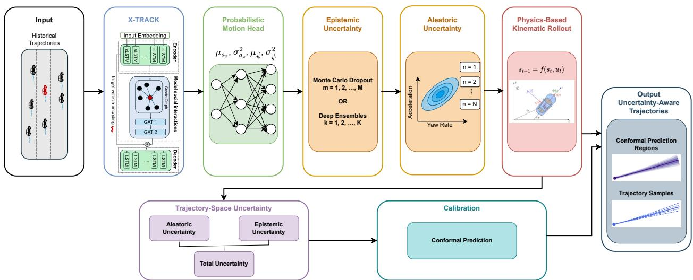  
Figure 1: Overview of the uncertainty-aware X-TRACK framework. Aleatoric uncertainty is estimated by sampling from the predicted motion distributions, and epistemic uncertainty is obtained using MC Dropout or Deep Ensembles. The sampled vehicle motion variables are propagated through the physics-based kinematic layer to obtain uncertainty in trajectory space. To obtain calibrated trajectory uncertainty regions, conformal prediction is applied.

Table 2: Comparison of the proposed variants with the baseline models evaluated in the considered highway trajectory prediction setting in terms of RMSE at diferent prediction horizons.
<table><tr><td>Architecture</td><td>1s</td><td>2s</td><td>3s</td><td>4s</td><td>5s</td></tr><tr><td>X-TRACK (Chugh et al., 2025)</td><td>0.10</td><td>0.31</td><td>0.71</td><td>1.31</td><td>2.16</td></tr><tr><td>X-TRACK-MCD (Ours)</td><td>0.06</td><td>0.22</td><td>0.66</td><td>1.34</td><td>2.23</td></tr><tr><td>X-TRACK-DE (Ours)</td><td>0.04</td><td>0.16</td><td>0.51</td><td>1.09</td><td>1.87</td></tr><tr><td>MHA-LSTM (Messaoud et al., 2021)</td><td>0.71</td><td>1.62</td><td>2.85</td><td>4.31</td><td>6.06</td></tr><tr><td>iNATran (Chen et al., 2022)</td><td>0.88</td><td>1.62</td><td>2.35</td><td>3.58</td><td>4.95</td></tr><tr><td>GFTNNv2 (Neumeier et al., 2023)</td><td>0.47</td><td>0.61</td><td>1.05</td><td>1.75</td><td>2.69</td></tr><tr><td>cVMD (Neumeier et al., 2024)</td><td>0.26</td><td>1.03</td><td>2.27</td><td>3.93</td><td>5.99</td></tr><tr><td>cVMDx (Neumeier et al., 2026)</td><td>0.20</td><td>0.78</td><td>1.71</td><td>2.93</td><td>4.43</td></tr><tr><td>X-TRAJ (Chugh et al., 2025)</td><td>0.48</td><td>1.01</td><td>1.58</td><td>2.20</td><td>3.17</td></tr></table>

Horizon-wise Prediction Performance. Table 2 reports the RMSE at each prediction horizon for X-TRACK along with its uncertainty-aware variants. The RMSE increases with the prediction horizon for all the methods. X-TRACK-DE achieves the lowest RMSE across all horizons among the evaluated methods, reducing the baseline from 0.10 to 0.04 at 1s and from 2.16 to 1.87 at 5s. This corresponds to a relative improvement of 13.4% over the X-TRACK baseline at the 5s horizon. Compared to the baseline, X-TRACK-MCD reduces error at shorter horizons, up to 3s, and yields a higher error than the baseline at 4s and 5s, with RMSE values of 1.34 m and 2.23 m.

Uncertainty Quantification Performance. Table 3 reports predictive-distribution and conformal set metrics (see Appendix B.2) for the evaluated uncertainty-aware approaches. NLL, ECE, Pearson correlation, mean predictive uncertainty, and MR are evaluated prior to conformal calibration, whereas CP coverage and MPIW characterize the conformal prediction regions. Both approaches achieve approximately the same coverage (95%). X-TRACK-DE achieves a lower miss rate (0.01 vs. 0.02) compared to X-TRACK-MCD, indicating more frequent finalposition hits within 2 m. In addition, the Pearson correlation between ADE and predictive uncertainty is similar: 0.34 for X-TRACK-MCD and 0.33 for X-TRACK-DE, indicating a moderate positive correlation between error and uncertainty. The lowest ECE is achieved by cVMDx followed by X-TRACK-DE.

Table 3: Uncertainty quantification and calibration performance of the evaluated uncertainty-aware trajectory prediction approaches.
<table><tr><td>Metric</td><td>X-TRACK MCD</td><td>X-TRACK DE</td><td>cVMDx</td></tr><tr><td>NLL ↓</td><td>0.47</td><td>0.51</td><td>11.32</td></tr><tr><td>ECE↓</td><td>0.17</td><td>0.12</td><td>0.10</td></tr><tr><td>Pearson Correlation (ρ) ↑</td><td>0.34</td><td>0.33</td><td>0.05</td></tr><tr><td>Mean Predictive Uncertainty (m2)</td><td>1.32</td><td>0.75</td><td>4.04</td></tr><tr><td>Miss Rate (MR) @ 2 m ↓</td><td>0.02</td><td>0.01</td><td>0.31</td></tr><tr><td>CP Coverage@95%</td><td>95.72%</td><td>95.39%</td><td></td></tr><tr><td>MPIW@95% (after CP) ↓</td><td>2.61</td><td>2.11</td><td></td></tr><tr><td>ECE (after CP) ↓</td><td>0.11</td><td>0.11</td><td></td></tr></table>

In terms of estimated uncertainty and prediction interval, X-TRACK-MCD yields a higher mean variance of 1.32 and a wider prediction interval of 2.61, compared with 0.75 and 2.11 for X-TRACK-DE, respectively. This shows that X-TRACK-DE gives narrower uncertainty regions even though the targeted and observed coverage are the same as X-TRACK-MCD. In terms of NLL, X-TRACK-DE achieves higher NLL (0.51) as compared to X-TRACK-MCD (0.47). After conformal prediction, both methods achieve approximately 95.5% empirical conformal coverage, which closely aligns with the nominal target of 95% at the evaluated horizon-wise marginal coverage level.

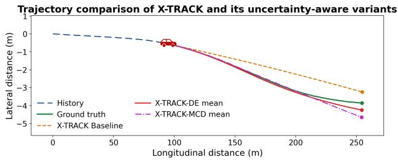  
Figure 2: Qualitative comparison of ground truth with deterministic X-TRACK and predictive means of X-TRACK-MCD and X-TRACK-DE.

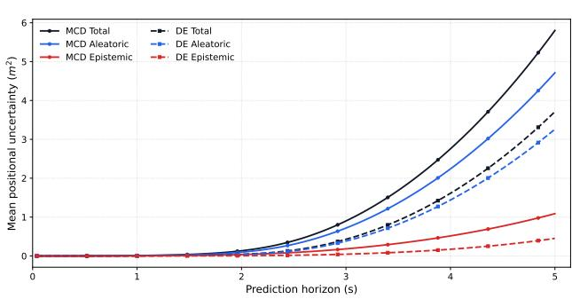  
Figure 3: Decomposition of uncertainty into individual components for both variants.

Qualitative Analysis. Figure 2 compares the ground truth trajectory with the trajectories generated by X-TRACK (baseline) and its uncertainty variants. Given a scenario, X-TRACK-DE (shown in red) yields the best trajectory. Here, X-TRACK-MCD outputs a predictive mean trajectory that closely aligns with the ground truth as compared to the baseline prediction.

Fig. 3 shows the decomposition of the trajectory space uncertainty into aleatoric, epistemic, and total for X-TRACK-MCD and X-TRACK-DE over the predictive horizon. The aleatoric uncertainty has a significant contribution to the total, which increases nonlinearly with time for both methods. X-TRACK-MCD exhibits a stronger growth in both uncertainties, resulting in a larger total positional uncertainty at longer prediction horizons compared with X-TRACK-DE.

Fig. 4 shows the relationship between empirical coverage and nominal confidence level for both uncertaintyaware approaches. Across most confidence levels, both methods achieve empirical coverage above the ideal calibration line. As compared to X-TRACK-MCD, X-TRACK-DE remains closer to the calibration line over most of the confidence range. Both methods approach the ideal calibration behavior, as the nominal confidence approaches the target coverage level. Additional qualitative trajectory predictions, uncertainty regions, uncertainty with time, and sampled predictive trajectories are provided in the Appendix D.

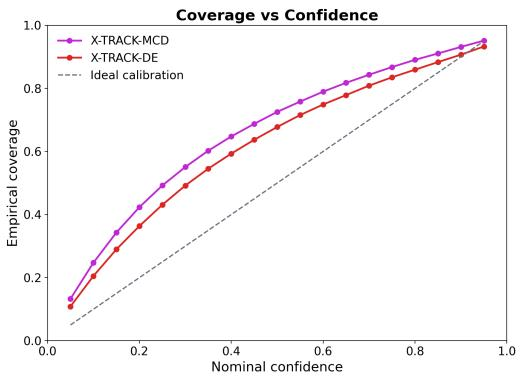  
Figure 4: Comparing empirical coverage and nominal confidence for raw predictive distributions of X-TRACK-MCD and X-TRACK-DE.

## 7 CONCLUSION

This paper presented an uncertainty-aware extension of X-TRACK that incorporates predictive uncertainty into a physics-aware vehicle trajectory prediction framework. The proposed approach models uncertainty in the predicted vehicle motion variables and propagates it through the nonlinear kinematic rollout, rather than directly predicting or estimating uncertainty after obtaining the future position coordinates. Epistemic uncertainty is estimated using MC Dropout and Deep Ensembles, while aleatoric uncertainty is estimated using heteroscedastic Gaussian distributions over vehicle motion variables, longitudinal acceleration, and yaw rate. The estimated uncertainty is prop agated from motion to trajectory space. Additionally, conformal prediction is applied to construct prediction regions with empirical coverage close to the nominal target.

Overall, within the considered highway trajectory prediction setting, X-TRACK-DE improves prediction accuracy while X-TRACK-MCD mainly benefits shorter horizons. Both variants achieve empirical coverage close to the target level. Future work will focus on more diverse highway and trafic scenarios and improving conformal calibration methods.

## ACKNOWLEDGMENT

This research was supported by Technische Hochschule Augsburg and the Hightech Agenda Bavaria, funded by the Free State of Bavaria, Germany. The authors thank their colleagues at the Data Science und Autonome Systeme Technologietransferzentrum (TTZ) Landsberg for their insightful discussions and support.

## References

Angelopoulos, A. N. and Bates, S. (2022). A Gentle Introduction to Conformal Prediction and Distribution-Free Uncertainty Quantification. arXiv:2107.07511 [cs.LG].

Bahari, M., Saadatnejad, S., Rahimi, A., Shaverdikondori, M., Shahidzadeh, A. H., Moosavi-Dezfooli, S.- M., and Alahi, A. (2022). Vehicle trajectory prediction works, but not everywhere. In 2022 IEEE/CVF Conference on Computer Vision and Pattern Recognition (CVPR). ISSN: 2575-7075.

Beck, M., P¨oppel, K., Spanring, M., Auer, A., Prudnikova, O., Kopp, M. K., Klambauer, G., Brandstetter, J., and Hochreiter, S. (2024). xLSTM: Extended long short-term memory. In The Thirty-eighth Annual Conference on Neural Information Processing Systems.

Cao, C., Chen, X., Wang, J., Song, Q., Tan, R., and Li, Y.-H. (2024). CCTR: Calibrating Trajectory Prediction for Uncertainty-Aware Motion Planning in Autonomous Driving. Proceedings of the AAAI Conference on Artificial Intelligence.

Chen, X., Zhang, H., Zhao, F., Cai, Y., Wang, H., and Ye, Q. (2022). Vehicle Trajectory Prediction Based on Intention-Aware Non-Autoregressive Transformer With Multi-Attention Learning for Internet of Vehicles. IEEE Transactions on Instrumentation and Measurement.

Chugh, A. R., Neumeier, M., and Dorn, S. (2025). X-TRACK: Physics-Aware xLSTM for Realistic Vehicle Trajectory Prediction. arXiv:2511.00266 [cs.LG] version: 2.

Cui, H., Nguyen, T., Chou, F.-C., Lin, T.-H., Schneider, J., Bradley, D., and Djuric, N. (2020). Deep Kinematic Models for Kinematically Feasible Vehicle Trajectory Predictions. In 2020 IEEE International Conference on Robotics and Automation (ICRA). ISSN: 2577-087X.

Davis, J., Zhu, J., Oldfather, J., MacDonald, S., and Trzaskowski, M. (2020). Quantifying uncertainty in deep learning systems. Technical report, Amazon Web Services (AWS) Prescriptive Guidance.

Deo, N. and Trivedi, M. M. (2018). Convolutional Social Pooling for Vehicle Trajectory Pre-

diction. In 2018 IEEE/CVF Conference on Computer Vision and Pattern Recognition Workshops (CVPRW). ISSN: 2160-7516.

Distelzweig, A., Look, A., Kosman, E., Janjos, F., Wagner, J., and Valada, A. (2024). Entropy-based uncertainty modeling for trajectory prediction in autonomous driving. arXiv:2410.01628 [cs.RO].

Gal, Y. and Ghahramani, Z. (2016). Dropout as a Bayesian Approximation: Representing Model Uncertainty in Deep Learning. In Proceedings of The 33rd International Conference on Machine Learning. PMLR.

Gawlikowski, J., Tassi, C. R. N., Ali, M., Lee, J., Humt, M., Feng, J., Kruspe, A., Triebel, R., Jung, P., Roscher, R., Shahzad, M., Yang, W., Bamler, R., and Zhu, X. X. (2022). A Survey of Uncertainty in Deep Neural Networks. arXiv:2107.03342 [cs.LG].

Hochreiter, S. and Schmidhuber, J. (1997). Long short-term memory. Neural Computation, 9(8):1735–1780.

Hu, H., Wang, Q., Du, L., Lu, Z., and Gao, Z. (2022). Vehicle trajectory prediction considering aleatoric uncertainty. Knowledge-Based Systems.

H¨ullermeier, E. and Waegeman, W. (2021). Aleatoric and Epistemic Uncertainty in Machine Learning: An Introduction to Concepts and Methods. Machine Learning. arXiv:1910.09457 [cs.LG].

Ivanovic, B., Lin, Y., Shrivastava, S., Chakravarty, P., and Pavone, M. (2022). Propagating State Uncertainty Through Trajectory Forecasting. In 2022 International Conference on Robotics and Automation (ICRA).

Kahn, G., Villaflor, A., Pong, V., Abbeel, P., and Levine, S. (2017). Uncertainty-Aware Reinforcement Learning for Collision Avoidance. arXiv:1702.01182 [cs.LG].

Kingma, D. P. and Ba, J. (2015). Adam: A Method for Stochastic Optimization. In International Conference on Learning Representations (ICLR).

Krajewski, R., Bock, J., Kloeker, L., and Eckstein, L. (2018). The highD Dataset: A Drone Dataset of Naturalistic Vehicle Trajectories on German Highways for Validation of Highly Automated Driving Systems. In 2018 21st International Conference on Intelligent Transportation Systems (ITSC), Maui, HI, USA. IEEE Press.

Lakshminarayanan, B., Pritzel, A., and Blundell, C. (2017). Simple and scalable predictive uncertainty estimation using deep ensembles. In Proceedings of the 31st International Conference on Neural Information Processing Systems, NIPS’17, Red Hook, NY, USA. Curran Associates Inc.

Lindemann, L., Cleaveland, M., Shim, G., and Pappas, G. J. (2023). Safe Planning in Dynamic Environments using Conformal Prediction. IEEE Robotics and Automation Letters, 8:5116–5123.

Liu, Y., Ye, Z., Wang, R., Li, B., Sheng, Q. Z., and Yao, L. (2024). Uncertainty-aware pedestrian trajectory prediction via distributional difusion. Knowledge-Based Systems.

Merity, S., Keskar, N. S., and Socher, R. (2018). Regularizing and Optimizing LSTM Language Models. In International Conference on Learning Representations (ICLR).

Messaoud, K., Yahiaoui, I., Verroust-Blondet, A., and Nashashibi, F. (2021). Attention Based Vehicle Trajectory Prediction. IEEE Transactions on Intelligent Vehicles.

Mo, X., Xing, Y., and Lv, C. (2021). Graph and Recurrent Neural Network-based Vehicle Trajectory Prediction For Highway Driving. In 2021 IEEE International Intelligent Transportation Systems Conference (ITSC).

Nayak, A., Eskandarian, A., and Doerzaph, Z. (2022). Uncertainty Estimation of Pedestrian Future Trajectory Using Bayesian Approximation. IEEE Open Journal of Intelligent Transportation Systems.

Nayak, A., Eskandarian, A., Doerzaph, Z., and Ghorai, P. (2024). Pedestrian Trajectory Forecasting Using Deep Ensembles Under Sensing Uncertainty. IEEE Transactions on Intelligent Transportation Systems.

Neumeier, M., Dorn, S., Botsch, M., and Utschick, W. (2023). Prediction and Interpretation of Vehicle Trajectories in the Graph Spectral Domain. In 2023 IEEE 26th International Conference on Intelligent Transportation Systems (ITSC), pages 1172–1179.

Neumeier, M., Dorn, S., Botsch, M., and Utschick, W. (2024). Reliable Trajectory Prediction and Uncertainty Quantification with Conditioned Difusion Models. In 2024 IEEE/CVF Conference on Computer Vision and Pattern Recognition Workshops (CVPRW). ISSN: 2160-7516.

Neumeier, M., Roßberg, N., Botsch, M., and Utschick, W. (2026). Uncertainty-aware difusion model for multimodal highway trajectory prediction via ddim sampling. In 2026 IEEE Intelligent Vehicles Symposium (IV), pages 1610–1617.

Polack, P., Altch´e, F., d’Andr´ea Novel, B., and de La Fortelle, A. (2017). The kinematic bicycle model: A consistent model for planning feasible trajectories for autonomous vehicles? In 2017 IEEE Intelligent Vehicles Symposium (IV).

Salzmann, T., Ivanovic, B., Chakravarty, P., and Pavone, M. (2020). Trajectron++: Dynamically-Feasible Trajectory Forecasting with Heterogeneous Data. In Computer Vision – ECCV 2020: 16th European Conference, Glasgow, UK, August 23–28, 2020, Proceedings, Part XVIII, Berlin, Heidelberg. Springer-Verlag.

Veliˇckovi´c, P., Cucurull, G., Casanova, A., Romero, A., Li\`o, P., and Bengio, Y. (2018). Graph Attention Networks. In International Conference on Learning Representations (ICLR).

Wu, X., Nayak, A., and Eskandarian, A. (2021). Motion Planning of Autonomous Vehicles under Dynamic Trafic Environment in Intersections Using Probabilistic Rapidly Exploring Random Tree. SAE International Journal of Connected and Automated Vehicles.

# Supplementary Material

## A EXPERIMENTAL SETUP

This section describes the evaluated baseline models, along with the training and implementation details provided to ensure reproducibility.

## A.1 Evaluated Baseline Models

Below are the models included in the comparison to evaluate the performance of the uncertainty-aware extension of X-TRACK with the competitive highway trajectory prediction baseline models.

• Multi-Head Attention LSTM (MHA-LSTM) (Messaoud et al., 2021): The model captures social interactions by using both global and local attention with an LSTM-based encoder-decoder model.

• Intention-aware Non-Autoregressive Transformer (iNATran) (Chen et al., 2022): To capture social and temporal dependencies, this model integrates GAT with a transformer (encoder) and temporal attention learning (TAL). The decoder combines cross-attention learning with intention-aware query generation.

• Graph Fourier Transformation Neural Network (GFTNNv2) (Neumeier et al., 2023): Graph Fourier Transform (GFT) is used to transform vehicle interactions into a spectral scenario representation. By applying the inverse GFT, the prediction of the neural network is converted to the spatio-temporal domain.

• Conditioned Vehicle Motion Difusion (cVMD) (Neumeier et al., 2024): The approach employs difusion models and a kinematic layer, along with uncertainty quantification, to improve prediction performance.

• Uncertainty-Aware Conditioned Vehicle Motion Difusion (cVMDx) (Neumeier et al., 2026): An uncertainty-aware difusion-based framework that represents predictive uncertainty using a Gaussian Mixture Model and eficiently generates multi-modal trajectories using Denoising Difusion Implicit Model (DDIM) sampling.

• xLSTM-based vehicle trajectory prediction (X-TRAJ) (Chugh et al., 2025): A variant of X-TRACK that predicts future vehicle positions directly in trajectory space without the physics-based kinematic rollout used in X-TRACK.

## A.2 Training and Implementation Details

The model is trained for a maximum of 150 epochs using a batch size of 32 with the Adam optimizer (Kingma and Ba, 2015) and an initial learning rate of $1 0 ^ { - 3 }$ . A multi-step learning rate scheduler is employed, reducing the learning rate by a factor of 0.1 after 30 and 60 epochs. LeakyReLU with a negative slope of 0.1 is used. Patience is set to 15 to enable early stopping and terminate training when no improvement is observed for 15 consecutive epochs. All the models are implemented in PyTorch 2.3 using CUDA 12.4 and trained on an NVIDIA L40S-4Q GPU with 4 GB of GPU memory. Each model is trained independently on a single GPU.

The framework is trained using a Gaussian negative log-likelihood in both the trajectory and motion spaces. The trajectory loss $\mathcal { L } _ { \mathrm { t r a j } }$ supervises the propagated trajectory distribution obtained through aleatoric sampling and kinematic rollout, while the dynamic loss $\mathcal { L } _ { \mathrm { d y n } }$ supervises the predicted Gaussian distributions of vehicle motion variables, i.e., longitudinal acceleration and yaw rate. For each training sample, the overall loss is given by:

$$
\begin{array} { r } { \mathcal { L } = \mathcal { L } _ { \mathrm { t r a j } } + \alpha _ { \mathrm { d y n } } \mathcal { L } _ { \mathrm { d y n } } , } \end{array}\tag{19}
$$

Table 4: Architectural modification of X-TRACK for the Deep Ensemble members.
<table><tr><td>Model</td><td>Architectural Changes</td></tr><tr><td>Baseline</td><td>Default architecture</td></tr><tr><td>Wider Encoder</td><td>Encoder: 96, Decoder: 160, Dynamic Embedding: 96</td></tr><tr><td>Wider Embedding</td><td>Input Embedding: 48, Dy- namic Embedding: 80</td></tr><tr><td>More Heads</td><td>GAT Heads: 6</td></tr><tr><td>Deeper Decoder</td><td>Number of Decoder LSTM Layers: 3, Dropout: 0.25</td></tr></table>

where $\alpha _ { \mathrm { d y n } }$ influences the contribution to the total NLL L coming from vehicle motion variables. In all experiments, $\alpha _ { \mathrm { d y n } } = 0 . 1$ is set through empirical evaluation balancing the influence of vehicle motion variables and trajectory accuracy. The contributions $\mathcal { L } _ { \mathrm { t r a j } }$ and $\mathcal { L } _ { \mathrm { d y n } }$ are defined on a per-sample basis as:

$$
\mathcal { L } _ { \mathrm { t r a j } } = \frac { 1 } { 2 t _ { f } } \sum _ { t = t _ { \mathrm { o b s } } + 1 } ^ { t _ { \mathrm { o b s } } + t _ { f } } \sum _ { d \in \{ x , y \} } \left[ \log \left( \sigma _ { d , t } ^ { 2 } \right) + \frac { \left( p _ { d , t } ^ { \mathrm { g t } } - \mu _ { d , t } \right) ^ { 2 } } { \sigma _ { d , t } ^ { 2 } } \right] ,\tag{20}
$$

$$
\mathcal { L } _ { \mathrm { d y n } } = \frac { 1 } { 2 t _ { f } } \sum _ { t = t _ { \mathrm { o b s } } + 1 } ^ { t _ { \mathrm { o b s } } + t _ { f } } \sum _ { d \in \{ a _ { x } , \dot { \psi } \} } \left[ \log \left( \sigma _ { d , t } ^ { 2 } \right) + \frac { \left( u _ { d , t } ^ { \mathrm { g t } } - \mu _ { d , t } \right) ^ { 2 } } { \sigma _ { d , t } ^ { 2 } } \right] .\tag{21}
$$

During training, the per-sample losses are averaged over a mini-batch of size $B = 3 2$ . The resulting training objective is

$$
\mathcal { L } _ { \mathrm { b a t c h } } = \frac { 1 } { B } \sum _ { b = 1 } ^ { B } \left( \mathcal { L } _ { \mathrm { t r a j } } ^ { ( b ) } + \alpha _ { \mathrm { d y n } } \mathcal { L } _ { \mathrm { d y n } } ^ { ( b ) } \right) , \qquad B = 3 2 .\tag{22}
$$

MC Dropout Settings. For MC Dropout, dropout is enabled during both training and inference. At multiple stages of the X-TRACK architecture, dropout is introduced, including the input embedding layer, xLSTM encoder, GAT layer, and decoder. The corresponding dropout probabilities are set to 0.15, 0.20, 0.20, and 0.20, respectively. Both the dropouts that are after the xLSTM encoder and the LSTM decoder are locked dropout (Merity et al., 2018), which means that a single dropout mask is sampled once and reused for the entire sequence rather than generating a new random dropout mask at every single time step. For each input, $M = 2 0$ stochastic forward passes are performed, keeping dropout active during inference.

Deep Ensemble Settings. Five independently trained X-TRACK models are used in this case, i.e., $K = 5 .$ . To introduce model diversity, random seed initialization and slight changes in network architecture are employed, as shown in Table 4, keeping the training process similar. The design choices associated with the deep ensembles are further described in additional ablation studies C.1.

Aleatoric Uncertainty Settings. As the model predicts the mean and variance of longitudinal acceleration and yaw rate at each time step, $N = 1 6$ vehicle motion variables are sampled from the predicted Gaussian distributions. These are propagated through the kinematic layer rollout to obtain future trajectories. For aleatoric and MC dropout, the total number of trajectories is $M \times N$ , and for aleatoric and ensembles, it is $K \times N$

Conformal Prediction Settings. The held-out calibration set contains $S _ { \mathrm { c a l } } = 6 8 5$ scenarios. The target coverage level is set to 95%, making $\delta \ = \ 0 . 0 5 .$ The conformal quantile is selected using the finite-sample rank $\lceil ( S _ { \mathrm { c a l } } + 1 ) 0 . 9 5 \rceil$ . The dataset split is performed at the scenario level, and the held-out calibration set is kept strictly separate from model training and hyperparameter selection. The conformal calibration assumes exchangeability between the calibration and test scenarios. As a separate conformal quantile is estimated for each prediction time step, the resulting prediction regions provide horizon-wise marginal coverage under the exchangeability assumption between calibration and test samples. At each time step, a single conformal quantile is estimated using Mahalanobis scores computed from the $2 \times 2$ total positional covariance.

## A.3 Code, Reproducibility and Asset Information

The source code of the proposed uncertainty-aware X-TRACK framework will be made publicly available upon acceptance. The released repository will include the code for training and evaluating both X-TRACK-MCD and X-TRACK-DE. The README file will provide instructions for environment setup and dependencies, dataset preparation, model training, and evaluation, along with the configuration files required to reproduce the experimental setting reported in the paper. Appendix A.2 provides details on the hyperparameters and training procedure.

Existing Assets. Experiments are performed on the highD dataset (Krajewski et al., 2018), which, subject to the terms and conditions specified by its providers, is available free of charge for academic and research purposes. The dataset permits eligible non-commercial research use and restricts redistribution. Therefore, the highD dataset will not be included in the released code, and instructions for obtaining the dataset from the oficial provider will be included in the README file.

The framework proposed in this paper extends X-TRACK (Chugh et al., 2025). X-TRACK is distributed under the MIT License, and its implementation is used in accordance with this license. The uncertainty-quantification extensions introduced in this work will also be released under the MIT License.

## B EVALUATION METRICS

In this section, the widely used trajectory prediction and uncertainty quantification metrics are covered.

## B.1 Trajectory Prediction Metrics

Average Displacement Error (ADE): The average Euclidean distance across all time steps and all trajectories between the ground truth and predictive mean trajectories.

$$
\mathrm { A D E } = \frac { 1 } { S t _ { f } } \sum _ { s = 1 } ^ { S } \sum _ { t = t _ { \mathrm { o b s } } + 1 } ^ { t _ { \mathrm { o b s } } + t _ { f } } \left. \hat { \mathbf { p } } _ { t , s } - \mathbf { p } _ { t , s } \right. _ { 2 } ,\tag{23}
$$

where S denotes the number of test scenarios, $\widehat { \mathbf { p } } _ { t , s }$ is the predicted mean position for the test trajectory s at time step t, and $\mathbf { p } _ { t , s }$ is the corresponding ground truth position.

Final Displacement Error (FDE): The Euclidean distance, averaged across all trajectories, between the ground truth and predicted final positions for each predictive mean trajectory.

$$
\mathrm { F D E } = \frac { 1 } { S } \sum _ { s = 1 } ^ { S } \left. \hat { \mathbf { p } } _ { t _ { \mathrm { o b s } } + t _ { f } , s } - \mathbf { p } _ { t _ { \mathrm { o b s } } + t _ { f } , s } \right. _ { 2 } .\tag{24}
$$

Root Mean Square Error (RMSE) at time t: For every S trajectories, the square root of the average of the squared diferences between the predicted and the ground truth positions.

$$
\mathrm { R M S E } ( t ) = \sqrt { \frac { 1 } { S } \sum _ { s = 1 } ^ { S } \left. \hat { \mathbf { p } } _ { t , s } - \mathbf { p } _ { t , s } \right. _ { 2 } ^ { 2 } } .\tag{25}
$$

Minimum ADE (minADE): Among all predicted trajectories, minADE measures the smallest average displacement error.

$$
\mathrm { m i n A D E } = \frac { 1 } { S } \sum _ { s = 1 } ^ { S } \operatorname* { m i n } _ { q = 1 , \ldots , Q } \left[ \frac { 1 } { t _ { f } } \sum _ { t = t _ { \mathrm { o b s } } + 1 } ^ { t _ { \mathrm { o b s } } + t _ { f } } \left\| \hat { { \mathbf p } } _ { t , s } ^ { ( q ) } - { \mathbf p } _ { t , s } \right\| _ { 2 } \right] , \qquad Q = 8 0 .\tag{26}
$$

where Q is the number of sampled trajectories for each test scenario.

Minimum FDE (minFDE): The smallest final displacement error (FDE) across all the predicted trajectories.

$$
\mathrm { m i n F D E } = \frac { 1 } { S } \sum _ { s = 1 } ^ { S } \operatorname* { m i n } _ { \substack { q = 1 , \ldots , Q } } \left\| \hat { \mathbf { p } } _ { t _ { \mathrm { o b s } } + t _ { f } , s } ^ { ( q ) } - { \mathbf { p } } _ { t _ { \mathrm { o b s } } + t _ { f } , s } \right\| _ { 2 } , \qquad Q = 8 0 .\tag{27}
$$

Miss Rate (MR): The percentage of predicted trajectories with final displacement errors (FDE) greater than a given threshold $d = 2 \mathrm { m }$

$$
\mathrm { M R } = \frac { 1 } { S } \sum _ { s = 1 } ^ { S } \mathbb { I } \left( \mathrm { m i n F D E } _ { s } > d \right) ,\tag{28}
$$

To ensure a fair comparison of both the uncertainty-aware variants, the number of sampled trajectories is set to 80 for minADE, minFDE, and MR. As the total number of trajectories generated by MC dropout is 320, 80 trajectories are sampled from the total trajectories.

Note that the predictive mean trajectory (defined in Eq. 13) is used for trajectory-error metrics, likelihood evaluation, conformal residual computation, and qualitative trajectory visualization. Due to the nonlinear kinematic rollout, this predictive mean generally difers from the deterministic mean-control trajectory defined in Eq. 9.

## B.2 Uncertainty Evaluation Metrics

Negative Log Likelihood (NLL): Evaluates the likelihood assigned to the ground-truth trajectory under the predicted two-dimensional Gaussian distribution. Let $\mathbf { e } _ { t , s } = \mathbf { p } _ { t , s } - \mu _ { t , s } $ , the per-time-step NLL is

$$
\ell _ { t , s } ^ { \mathrm { N L L } } = \frac { 1 } { 2 } \left[ 2 \log ( 2 \pi ) + \log \operatorname* { d e t } \left( \Sigma _ { \mathrm { t o t a l } , t , s } + \epsilon \mathbf { I } \right) + { \mathbf { e } _ { t , s } ^ { \top } } \left( \Sigma _ { \mathrm { t o t a l } , t , s } + \epsilon \mathbf { I } \right) ^ { - 1 } \mathbf { e } _ { t , s } \right] ,\tag{29}
$$

$$
\mathrm { { N L L } } = \frac { 1 } { S t _ { f } } \sum _ { s = 1 } ^ { S } \sum _ { t = t _ { \mathrm { o b s } } + 1 } ^ { t _ { \mathrm { o b s } } + t _ { f } } \ell _ { t , s } ^ { \mathrm { { N L L } } } .\tag{30}
$$

NLL is evaluated using the raw predictive covariance before conformal prediction. Lower values indicate that the predicted probabilistic distribution assigns higher likelihood to the observed trajectory.

Confidence-level Coverage (C): For a confidence level $c ,$ the squared Mahalanobis distance is

$$
D _ { t , s } ^ { 2 } = \mathbf { e } _ { t , s } ^ { \top } \left( \Sigma _ { \mathrm { t o t a l } , t , s } + \epsilon \mathbf { I } \right) ^ { - 1 } \mathbf { e } _ { t , s } .\tag{31}
$$

For a two-dimensional Gaussian distribution, the corresponding $\chi ^ { 2 }$ threshold with two degrees of freedom is

$$
\tau _ { c } = F _ { \chi _ { 2 } ^ { 2 } } ^ { - 1 } ( c ) = - 2 \log ( 1 - c ) , \qquad c \in \{ 0 . 0 5 , 0 . 1 0 , \ldots , 0 . 9 5 \} .\tag{32}
$$

The empirical coverage is then

$$
C ( c ) = \frac { 1 } { S t _ { f } } \sum _ { s = 1 } ^ { S } \sum _ { t = t _ { \mathrm { o b s } } + 1 } ^ { t _ { \mathrm { o b s } } + t _ { f } } \mathbb { I } \left( D _ { t , s } ^ { 2 } \leq \tau _ { c } \right) .\tag{33}
$$

Expected Calibration Error (ECE): Measures the discrepancy between nominal confidence levels and empirical coverage of the raw predictive distribution:

$$
\mathrm { E C E } = \frac { 1 } { L } \sum _ { \ell = 1 } ^ { L } \left| C ( c _ { \ell } ) - c _ { \ell } \right| , \qquad L = 1 9 .\tag{34}
$$

The coverage $C ( c _ { \ell } )$ is computed from the full total positional covariance using $\operatorname { E q }$ . 31. ECE is evaluated before conformal calibration.

Pearson Correlation Coeficient $( \rho ) \colon$ Estimates the linear relationship between the predicted uncertainty and the average displacement error (ADE).

$$
\rho _ { \mathrm { A D E } , u } = \frac { \mathrm { C o v } ( \mathrm { A D E } , u ) } { \sigma _ { \mathrm { A D E } } \sigma _ { u } } ,\tag{35}
$$

$$
u _ { s } = \frac { 1 } { t _ { f } } \sum _ { t = t _ { \mathrm { o b s } } + 1 } ^ { t _ { \mathrm { o b s } } + t _ { f } } \mathrm { t r } \left( \Sigma _ { \mathrm { t o t a l } , t , s } \right) ,\tag{36}
$$

$$
\mathrm { A D E } _ { s } = \frac { 1 } { t _ { f } } \sum _ { t = t _ { \mathrm { o b s } } + 1 } ^ { t _ { \mathrm { o b s } } + t _ { f } } \left. \hat { \mathbf { p } } _ { t , s } - \mathbf { p } _ { t , s } \right. _ { 2 } ,\tag{37}
$$

where $s = 1 , 2 , \ldots , S$ are the indexes of test scenarios. Cov(ADE, u) denotes the covariance between the trajectory error ADE and the predicted uncertainty u, and $\sigma _ { \mathrm { A D E } }$ and $\sigma _ { u }$ denote their standard deviations. The scalar uncertainty measure is therefore the trace of the raw total predictive covariance, and is evaluated before conformal calibration.

Mean Predictive Uncertainty: The average total positional uncertainty over all test scenarios and prediction horizons is defined as

$$
\bar { \sigma } ^ { 2 } = \frac { 1 } { S t _ { f } } \sum _ { s = 1 } ^ { S } \sum _ { t = t _ { \mathrm { o b s } } + 1 } ^ { t _ { \mathrm { o b s } } + t _ { f } } \mathrm { t r } \left( \Sigma _ { \mathrm { t o t a l } , t , s } \right) .\tag{38}
$$

Conformal Prediction Coverage (CP Coverage): The empirical conformal coverage is evaluated using the conformalized total covariance $\hat { \Sigma } _ { \mathrm { c p } , t , s } \mathrm { : }$

$$
C _ { \mathrm { c p } } = \frac { 1 } { S t _ { f } } \sum _ { s = 1 } ^ { S } \sum _ { t = t _ { \mathrm { o b s } } + 1 } ^ { t _ { \mathrm { o b s } } + t _ { f } } \mathbb { I } \left[ \mathbf { e } _ { t , s } ^ { \top } \hat { \Sigma } _ { \mathrm { c p } , t , s } ^ { - 1 } \mathbf { e } _ { t , s } \le 1 \right] .\tag{39}
$$

The coverage reported in Table 3 corresponds to empirical conformal coverage at the target 95% level.

Mean Prediction Interval Width (MPIW): Measures the average axis-aligned coordinate width of the conformal prediction ellipse.

$$
\mathrm { M P I W } = \frac { 1 } { 2 S t _ { f } } \sum _ { s = 1 } ^ { S } \sum _ { t = t _ { \mathrm { o b s } } + 1 } ^ { t _ { \mathrm { o b s } } + t _ { f } } \sum _ { d \in \{ x , y \} } \left( U _ { d , t , s } - L _ { d , t , s } \right) ,\tag{40}
$$

where

$$
L _ { d , t , s } = \mu _ { d , t , s } - \sqrt { \left[ \hat { \mathbf { \boldsymbol { \Sigma } } } _ { \mathrm { c p } , t , s } \right] _ { d d } } ,\tag{41}
$$

$$
U _ { d , t , s } = \mu _ { d , t , s } + \sqrt { \Big [ \hat { \mathbf { \Sigma } } _ { \mathrm { c p } , t , s } \Big ] _ { d d } } .\tag{42}
$$

## C ABLATION STUDIES

This section presents additional ablation studies conducted to evaluate the impact of key design choices of the proposed framework.

## C.1 Homogeneous and Heterogeneous Deep Ensembles

To understand the influence of ensemble diversity on predictive and epistemic uncertainty, additional experiments are carried out. A homogeneous ensemble uses identical X-TRACK architectures trained with diferent random seeds, and a heterogeneous ensemble uses additional minor architectural variations, as described in Appendix A.2. Both variants estimate only the epistemic uncertainty, without aleatoric modeling or conformal calibration.

The heterogeneous ensemble improves both trajectory prediction and epistemic uncertainty estimation as compared to the homogeneous ensemble. In the case of heterogeneous ensembles, ADE improves from 0.65 to 0.58 and FDE from 1.85 to 1.72. In addition to this, the empirical pre-CP coverage increases from 25.2% to 42.4%, while ECE decreases from 0.25 to 0.08. However, since the heterogeneous ensemble members also difer in mode capacity, this ablation does not isolate architectural diversity as the sole source of these improvements.

Total uncertainty bands at each prediction horizon  
Table 5: Comparison of homogeneous and heterogeneous ensembles to assess the impact of architectural diversity.
<table><tr><td>Architecture</td><td>ADE↓</td><td>FDE↓</td><td>Pre-CP C@95% ↑</td><td>ECE↓</td></tr><tr><td>Homogeneous Ensemble</td><td>0.65</td><td>1.85</td><td>25.2%</td><td>0.25</td></tr><tr><td>Heterogeneous Ensemble</td><td>0.58</td><td>1.72</td><td>42.4%</td><td>0.08</td></tr></table>

Note: Both variants estimate only epistemic uncertainty. The reported coverage is evaluated before conformal prediction.

Table 6: Efect of conformal prediction on the uncertainty-aware variants.
<table><tr><td rowspan="2">Metric</td><td colspan="2">X-TRACK-MCD</td><td colspan="2">X-TRACK-DE</td></tr><tr><td>Pre-CP</td><td>Post-CP</td><td>Pre-CP</td><td>Post-CP</td></tr><tr><td>Coverage@95%↑</td><td>67.47%</td><td>95.72%</td><td>62.01%</td><td>95.39%</td></tr><tr><td>MPIW↓</td><td>2.24</td><td>2.61</td><td>1.57</td><td>2.11</td></tr><tr><td>ECE↓</td><td>0.17</td><td>0.11</td><td>0.12</td><td>0.11</td></tr></table>

However, the empirical coverage is substantially below the target 95% coverage level, indicating that both ensembles remain overconfident. This motivates the modeling of aleatoric uncertainty and conformal calibration.

## C.2 Analyzing the Efect of Conformal Prediction

To investigate the impact of applying conformal prediction to the underlying uncertainty estimation framework, Table 6 shows the comparison of empirical coverage of the raw total predictive covariance with the coverage obtained after conformal prediction. Using the held-out calibration set, conformal prediction is applied to the total 2 × 2 positional covariance.

Conformal prediction substantially reduces the deviation between empirical and nominal coverage for both approaches (X-TRACK-DE and X-TRACK-MCD). After calibration, it was observed that the empirical coverage closely matches the target 95% level, indicating that this step calibrates the raw predictive uncertainty.

## D ADDITIONAL QUALITATIVE TRAJECTORY PREDICTION RESULTS

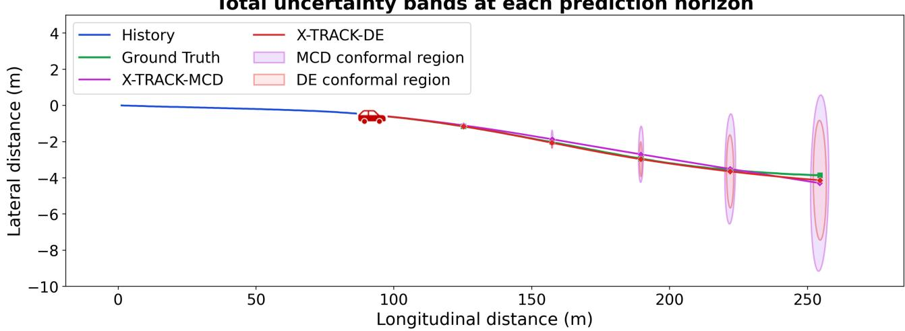  
Figure 5: Comparison of total predictive uncertainty for X-TRACK-MCD and X-TRACK-DE over diferent prediction horizons.

Figure 5 illustrates the total uncertainty in trajectory space for both X-TRACK-MCD and X-TRACK-DE at diferent prediction horizons. The plot confirms that the uncertainty regions are compact at shorter horizons, while the regions expand with the prediction horizon. Qualitatively, for the given scenario, X-TRACK-MCD exhibits wider uncertainty regions than its DE counterpart. Both the predictive mean trajectories remain close to the ground truth trajectory despite increasing uncertainty and seem to diverge only at the 5s prediction horizon.

Total uncertainty in trajectory space over the prediction horizon (different scales)  
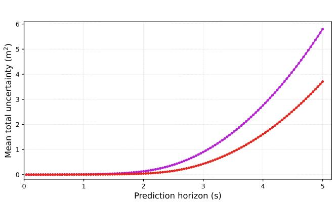  
(a)

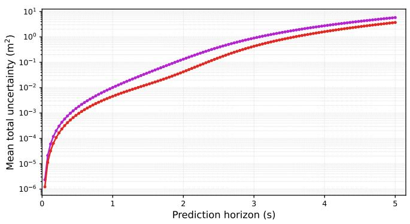  
(b)

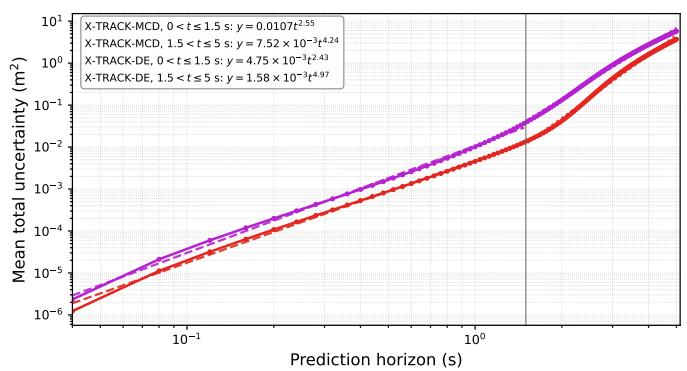  
(c)  
Figure 6: Total predictive uncertainty in trajectory space over the prediction horizon for X-TRACK-MCD and X-TRACK-DE. The same mean uncertainty is shown using (a) linear, (b) semi-logarithmic, and (c) log-log scales.

Figure 6 presents the total trajectory space uncertainty with respect to the prediction horizon using linear, semi-logarithmic, and log-log scales. The logarithmic representations show that the predictive uncertainty spans several orders of magnitude and increases nonlinearly with the prediction horizon, with comparatively smal uncertainty at shorter horizons followed by a substantially stronger increase at longer horizons. This nonlinear increase is consistent with the accumulation and propagation of motion space uncertainty through the iterative kinematic rollout.

Figure 7 represents the predictive trajectory distributions obtained using X-TRACK-DE and X-TRACK-MCD for a particular trafic scenario. The multiple possible trajectories (Q = 80) correspond to diferent aleatoric samples, along with diferent ensemble predictions or stochastic MC dropout forward passes. The predictive mean of both approaches follows the ground truth closely and diverges progressively at longer horizons. The color of each trajectory represents its deviation from the corresponding predictive mean.

Figure 8 shows a qualitative comparison of the ground truth trajectory along with the prediction obtained using deterministic X-TRACK and its uncertainty-aware variants based on Deep Ensembles (X-TRACK-DE) and Monte Carlo Dropout (X-TRACK-MCD). The predicted trajectories seem to diverge toward the end of the prediction horizon, and in general all model variants follow the right direction of the future vehicle motion. The sample trajectories from the test set illustrate the diferent trajectories predicted by the deterministic as well as uncertainty-aware approaches despite having the same underlying X-TRACK backbone.

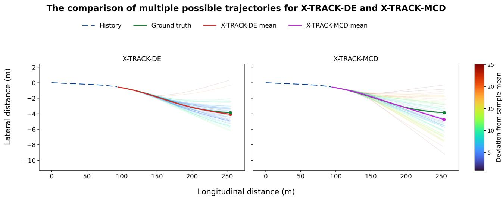  
Figure 7: Comparison of predictive multiple trajectories obtained by X-TRACK-DE and X-TRACK-MCD.

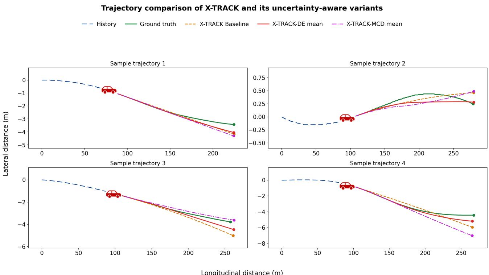  
Figure 8: Qualitative comparison of ground-truth trajectories with deterministic X-TRACK and the predictive means of its uncertainty-aware variants.

Fig. 9 shows the uncertainty decomposition on semi-logarithmic and log-log scales as an extension of figure 3. The semi-logarithmic representation highlights the increasing rate of uncertainty growth at longer prediction horizons. In the log-log representation, the varying slope suggests that the growth of the diferent uncertainty components is not well described by a single power law over the entire prediction horizon, with stronger growth at longer horizons.

Uncertainty decomposition into components: aleatoric, epistemic, and total MCD Total MCD Aleatoric MCD Epistemic DE Total DE Aleatoric DE Epistemic

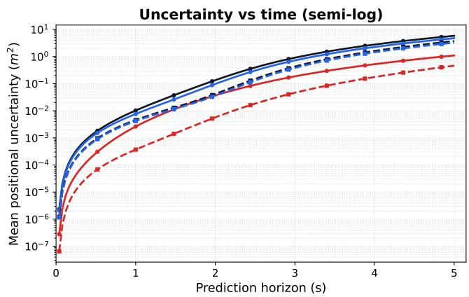

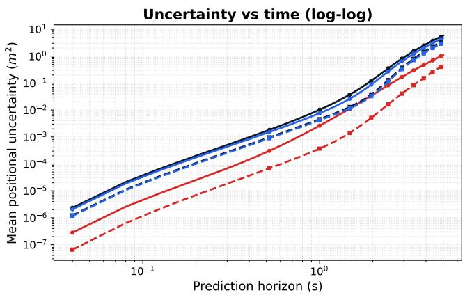  
Figure 9: Decomposition of trajectory space predictive uncertainty (diferent scales) into aleatoric, epistemic, and total components for X-TRACK-MCD and X-TRACK-DE.