# Understanding Latent-Dimension Scaling in Dynamical-System Learning through Spectral Reliability

Itsushi Sakata1\*, Yuta Miyauchi2 and Yoshinobu Kawahara2,1

1\*RIKEN Center for Advanced Intelligence Project, Tokyo, Japan. 2Graduate School of Information Science and Technology, The University of Osaka, Suita, Osaka, Japan.

\*Corresponding author(s). E-mail(s): itsushi.sakata@riken.jp; Contributing authors: y-miyauchi@ist.osaka-u.ac.jp; kawahara@ist.osaka-u.ac.jp;

## Abstract

In deep learning, approximation theory motivates increasing representation size. We ask whether this benefit extends to dynamics learning through autoregressive prediction. We analyze the learned time evolution through the eigenstructure of Koopman operators, using relative residuals to detect spurious eigenpairs arising even as one-step error falls. For bounded Koopman operators, we show that minimal residuals over learned dictionary spaces converge pointwise to their full-space counterparts as these spaces approximate the observable space in L2. Our hypothesis is that Koopman spectral reliability helps explain how consistently rollout error decreases with increasing dimension. We compare two models of a shared Koopman autoencoder trained alternately for reconstruction and latent evolution, using latent-prediction loss (one-step prediction errors in latent coordinates) or spectral-residual loss (relative residuals of candidate eigenpairs). Across six chaotic systems, both models reduced median windowed rollout error from smallest to largest dimension. The spectral-residual model achieved lower medians than the latent-prediction model for all systems and dimensions, and its median fell by a larger factor in every system. Its median decreased monotonically with dimension in four systems, against one for latent prediction. Against four baseline families, its mean valid prediction times were nearly always longer. At the largest dimension under two-stage training, we compared eigenvalue positions with each learned dictionary’s residual contours. Spectral-residual eigenvalues concentrated in low-residual regions, whereas latent-prediction eigenvalues also appeared in high-residual regions, consistent with the hypothesis.

Keywords: Koopman operator, Koopman autoencoder, Latent-dimension scaling, Autoregressive rollout, Pseudospectra, Chaotic dynamical systems

## 1 Introduction

In deep learning, studies have reported power-law decreases in loss with model size, data volume, and computation across multiple domains and for language models [1, 2], and examined how a fixed compute budget should be allocated between model parameters and training data [3]. Zhai et al. [4] have reported improvements from scaling in visual recognition with Vision Transformers. For surrogate models of partial diferential equations, a tendency for prediction error to decrease with increasing parameter count was reported [5–7]; in weather forecasting with Stormer, larger models had lower forecast errors, and diferences between models were greater at longer prediction horizons [8]. World models use their predictions of future states or observations for action planning and policy learning [9, 10], and in DreamerV3 and TD-MPC2, increasing parameter count improved control performance on the evaluated tasks [11, 12]. In contrast, for zero-shot prediction of chaotic systems, no statistically significant diference in median valid prediction time was observed among the three Chronos models with the highest parameter counts [13]. Approximation theory characterizes the expressivity of neural networks. Universal approximation [14] and approximation rates for rectified linear unit (ReLU) networks [15–17] characterize the relationship between representation size and achievable approximation error under regularity and architecture assumptions. Increasing the latent dimension increases the number of observables encoding the state and expands the family of representable dynamics.

When one-step predictors trained on true inputs feed their predictions back as inputs during autoregressive rollout, the input distribution changes; scheduled sampling and training with self-generated inputs address this change [18, 19]. To limit error accumulation, Model-Based Policy Optimization used short model rollouts starting from real-environment data for policy learning [20]. In model-based reinforcement learning, Asadi et al. [21] bound multi-step Wasserstein error by the one-step error bound multiplied by a sum of powers of the smaller Lipschitz constant of the true and learned transitions. In control, Lambert et al. [22] also reported cases where cumulative reward decreases even as one-step prediction likelihood improves. We ask how the magnitude and consistency of improvement in autoregressive predictions with increasing representation size depend on the loss used to learn latent time evolution. In this paper, scaling means the dependence of prediction error on representation size N, and for the two Koopman autoencoder models, N sets the latent dimension and the hidden-layer width.

Existing approaches intervene in the latent transition model, training inputs, training objective, and constraints on the learned operator, and this paper focuses on the training objective. Sanchez-Gonzalez et al. [23] perturbed training inputs using noise, and Brandstetter et al.

[24] using self-predictions. Schif et al. [25] used measure-matching regularization for the longterm distribution, and Mamakoukas et al. [26] imposed stability constraints on the learned operator. List et al. [27] compared prediction errors across multiple network sizes for one-step training and unrolled training, which unfolds predictions through time. With increasing latent dimension, Gonzalez and Balajewicz [28] reported decreasing field prediction error, while Wu et al. [29] showed nonmonotonic multi-step prediction error. Alkin et al. [30] evaluated flow-field rollouts at multiple model sizes but did not evaluate whether the dependence of prediction error on model size varies with the loss function for the dynamics.

The Koopman operator represents nonlinear state evolution through a linear operator on a space of observables, and its spectrum is used for dynamical systems analysis [31–33]. We use a Koopman autoencoder [34] that learns an encoder outputting a dictionary of observables, evolves the latent coordinates linearly in time, and reconstructs the state with a nonlinear decoder. Since repeated application of a learned matrix generates latent dynamics, we evaluate them using rollout error and spectral properties. Increasing the latent dimension N, the number of dictionary elements, increases the size of the finite-dimensional approximation of the operator.

Spectral pollution occurs when eigenvalues of a finite approximation accumulate outside the spectrum of the Koopman operator even as the approximation size increases [35]. Residual dynamic mode decomposition (ResDMD) checks candidate eigenpairs obtained from finite approximations by evaluating their relative residuals with respect to the original Koopman operator [35, 36]. The relative residual measures the discrepancy between an observable’s evolution and its multiplication by a candidate eigenvalue, normalized by the observable’s magnitude. Evaluation of empirical residuals from sample pairs [37] has been studied, and ResDMD has also been applied to systems with continuous spectra [38]. Methods have been proposed for learning dictionaries using operator residuals [39], for penalizing residuals and condition numbers [40], and for using a firstorder approximation to a multi-step error bound as the training objective [41]. Conradie et al. [41] compare multi-step forecasts from full and truncated Koopman matrices and one-step errors as a function of the number of retained modes. We evaluate the prediction error at each latent dimension and compare the positions of the estimated eigenvalues with the minimal residual for the learned dictionary.

Abuduweili et al. [42] augmented the state into the embedding and recovered it via a fixed linear projection, compared prediction error across latent dimensions for autonomous polynomial and robotic systems, and compared closed-loop control across combinations of latent dimensions and auxiliary-loss settings. Whereas that study analyzed convergence rates for sampling and projection errors under assumptions on spectral decay and subspace approximation, our convergence analysis concerns the minimal residual for bounded Koopman operators and sequences of learned spaces. We train a shared Koopman autoencoder using nonlinear reconstruction [34] in two stages and compare the Stage 2 losses: latentprediction loss, measuring one-step prediction error in latent coordinates, and spectral-residual loss, measuring the empirical relative residuals of candidate eigenpairs. With the spectral-residual loss, the dictionary is learned using residuals, as in the methods of Xu et al. [39] and Coote and Colbrook [40]. We hypothesize that the placement of eigenvalues in regions where empirical residuals are small (spectral reliability [40]) helps explain how consistently the two models translate added dimensions into lower rollout error, and we expect the spectral-residual model to translate additional dimensions into more consistent and larger rollout improvements.

We make three contributions. (i) We show that, under two-stage training, the spectralresidual model reduces median windowed rollout error more consistently with increasing latent dimension and by a larger factor from the smallest to the largest dimension than the latent-prediction model. (ii) For bounded operators and sequences of learned spaces that asymptotically approximate every observable in $L ^ { 2 }$ , we establish that the minimal residual converges pointwise to the infimum of the relative residual over the whole observable space. (iii) Under two-stage training, at the largest dimension in each of the six chaotic systems, the estimated Koopman eigenvalues of the spectral-residual model concentrated in low empirical-residual regions for the corresponding learned dictionaries, whereas latent-prediction eigenvalues also appeared in high-residual regions.

Section 2 states the prediction problem and convergence results. Section 3 describes the methods and experiments. Sections 4 and 5 present prediction errors and spectral properties, and Sect. 6 concludes the paper.

## 2 Problem formulation

## 2.1 Koopman operator and observables

We take the $d _ { x }$ -dimensional observation vector $\mathbf { x } _ { t }$ in the state space $\Omega ~ \subseteq ~ \mathbb { R } ^ { d _ { x } }$ as the state and consider systems whose state evolves in discrete time steps according to a map $F ~ : ~ \Omega \ \to ~ \Omega$ that is, $\mathbf { x } _ { t + 1 } = F ( \mathbf { x } _ { t } )$ . The observation vector is a delay-coordinate vector of the measured state for systems with delay-coordinate inputs, and the measured state itself for the remaining systems. A function $g : \Omega  \mathbb { C }$ of the state is called an observable.

Let $\mu$ be a probability measure on $\Omega ,$ and let $\mathcal { H } = L ^ { 2 } ( \Omega , \mu ; \mathbb { C } )$ be the Hilbert space of complexvalued square-integrable observables. We assume that composition $g \mapsto g \circ F$ defines a bounded linear operator $\mathcal { K } : \mathcal { H }  \mathcal { H }$ on $L ^ { 2 }$ equivalence classes and denote its operator norm by $\lVert \boldsymbol { \mathcal { K } } \rVert$ . Even when $F$ is nonlinear, K is linear in the observable, and we analyze system behavior through the operator’s eigenstructure and spectrum [32, 33]. K is generally infinite-dimensional; it need not have a finite-dimensional invariant subspace beyond the one spanned by the constant observables and can have a continuous spectrum [33, 35].

For latent dimension $N \in \mathbb N$ , the encoder $\phi _ { \theta _ { \mathrm { e } } }$ $\mathbb { R } ^ { d _ { x } }  \mathbb { R } ^ { N }$ and decoder $\psi _ { \theta _ { \mathrm { d } } } : \mathbb { R } ^ { N }  \mathbb { R } ^ { d _ { x } }$ are maps parameterized by $\theta _ { \mathrm { e } }$ and $\theta _ { \mathrm { { d } } } .$ , respectively. For fixed parameters and an estimated latent matrix $\widehat { \mathbf { A } } \in \bar { \mathbb { R } } ^ { N \times N }$ , prediction is given by $\widehat { \mathbf { z } } _ { 0 } = \phi _ { \theta _ { \mathrm { e } } } ( \mathbf { x } _ { 0 } )$ , $\widehat { \mathbf { z } } _ { t + 1 } = \widehat { \mathbf { A } } \widehat { \mathbf { z } } _ { t }$ , and $\widehat { \mathbf { x } } _ { t } = \psi _ { \boldsymbol { \theta } _ { \mathrm { d } } } ( \widehat { \mathbf { z } } _ { t } )$

On the state space Ω, we denote the encoder $\phi _ { \theta _ { \epsilon } }$ learned at each latent dimension N by $\phi _ { N }$ the learned dictionary. We assume that the N coordinate observables of $\phi _ { N }$ belong to $\mathcal { H }$ and let $V _ { N } \subset \mathcal { H }$ be the finite-dimensional subspace they span. Any element of $V _ { N }$ can be written as $\phi _ { N } ^ { \top } \mathbf { a }$ for some $\mathbf { a } \in \mathbb { C } ^ { N }$ . We assume that $V _ { N } \neq \{ 0 \}$

## 2.2 Relative residuals and pseudospectra

For $g \in { \mathcal { H } } \backslash \{ 0 \}$ and $\lambda \in \mathbb { C }$ , following Colbrook and Townsend [35], we measure the accuracy of a candidate eigenpair $( \lambda , g )$ of the Koopman operator by the following relative residual:

$$
\operatorname { r e s } ( \lambda , g ) : = { \frac { \| K g - \lambda g \| _ { \mathcal { H } } } { \| g \| _ { \mathcal { H } } } } .\tag{1}
$$

Equation (1) tests a specified observable; minimizing over $V _ { N }$ tests whether this space contains a nonzero observable with a small residual at $\lambda .$ For each $\lambda \in \mathbb { C }$ , define [35, 36]

$$
\begin{array} { r } { \tau _ { N } ( \lambda ) : = \underset { g \in V _ { N } \setminus \{ 0 \} } { \operatorname* { i n f } } \mathrm { r e s } ( \lambda , g ) , } \\ { \tau ( \lambda ) : = \underset { g \in \mathcal { H } \setminus \{ 0 \} } { \operatorname* { i n f } } \mathrm { r e s } ( \lambda , g ) . } \end{array}\tag{2}
$$

In particular, $\tau _ { N } ( \lambda ) ~ \leq ~ \mathrm { r e s } ( \lambda , g )$ for every $g \in$ $V _ { N } \backslash \{ 0 \}$ . Thus, a large $\tau _ { N } ( \lambda )$ implies large residuals for all candidates in $V _ { N }$ , whereas a small $\tau _ { N } ( \lambda )$ implies that some candidate has a small residual but does not guarantee the accuracy of a particular computed eigenpair. For $\epsilon > 0 .$ we define the restricted and full-space strict sublevel sets.

$$
\begin{array} { r l } & { \sigma _ { N , \epsilon , \mathrm { a p } } ( \mathcal { K } ) : = \{ \lambda \in \mathbb { C } : \tau _ { N } ( \lambda ) < \epsilon \} , } \\ & { \quad \sigma _ { \epsilon , \mathrm { a p } } ( \mathcal { K } ) : = \{ \lambda \in \mathbb { C } : \tau ( \lambda ) < \epsilon \} . } \end{array}\tag{3}
$$

The approximate point ϵ-pseudospectrum of Colbrook and Townsend [35] is the closure of the full-space strict sublevel set $\sigma _ { \epsilon , \mathrm { a p } } ( \kappa )$ . The approximate point spectrum is $\sigma _ { \mathrm { a p } } ( \mathcal { K } ) \overset { \cdot } { = } \{ \lambda \in \mathbb { C } : \tau ( \lambda ) = $ 0}.

We also define the minimal residual based on M observed snapshot pairs $( \mathbf { x } ^ { ( i ) } , \mathbf { y } ^ { ( i ) } )$ of states one time step apart, with $\mathbf { x } ^ { ( i ) } \in \Omega , \mathbf { y } ^ { ( i ) } = F ( \mathbf { x } ^ { ( i ) } )$ ), and $i = 1 , \dots , M$ . We choose a basis of $V _ { N }$ , fix a measurable representative of each basis function, and define point evaluations using linear combinations of these representatives. For given $M , N ,$ , assume that every nonzero $g \in V _ { N }$ satisfies $\begin{array} { r } { \frac { \mathrm { ~ i ~ } } { M } \sum _ { i = 1 } ^ { M } | g ( \mathbf { x } ^ { ( i ) } ) | ^ { 2 } > 0 } \end{array}$ . For $\lambda \in \mathbb { C }$ and $g \in$ $V _ { N } \ \backslash \ \{ 0 \}$ , we define the empirical relative residual resc $_ M ( \lambda , g ) \geq 0$ computed from snapshot data as the nonnegative square root of the following

expression:

$$
\begin{array} { r l } & { \widehat { \mathrm { r e s } } _ { M } ( \lambda , g ) ^ { 2 } } \\ & { \quad \quad : = \frac { \sum _ { i = 1 } ^ { M } | g ( \mathbf { y } ^ { ( i ) } ) - \lambda g ( \mathbf { x } ^ { ( i ) } ) | ^ { 2 } } { \sum _ { i = 1 } ^ { M } | g ( \mathbf { x } ^ { ( i ) } ) | ^ { 2 } } . } \end{array}\tag{4}
$$

We define the minimal residual over $V _ { N }$ by the following expression:

$$
\widehat { \tau } _ { M , N } ( \lambda ) : = \operatorname* { m i n } _ { g \in V _ { N } \setminus \{ 0 \} } \widehat { \mathrm { r e s } } _ { M } ( \lambda , g ) .\tag{5}
$$

Let $\widehat { \mathbf A }$ be a candidate finite-dimensional approximation of the Koopman operator on the learned dictionary, estimated using the procedure in Sect. 3.1, and let τbnum be the minimal residual defined in Sect. 3.3. Operationally, spectral reliability means that the eigenvalues of $\widehat { \mathbf A }$ fall where $\widehat \tau _ { M , N } ^ { \mathrm { n u m } }$ is small, that is, where the retained numerical subspace of $V _ { N }$ contains a candidate whose empirical relative residual is small at that λ.

## 2.3 Convergence assumptions

For each $g \in { \mathcal { H } } .$ define $E _ { N } ( g )$ by

$$
E _ { N } ( g ) : = \operatorname* { i n f } _ { v \in V _ { N } } \| g - v \| _ { \mathcal { H } } .\tag{6}
$$

(A1) Composition defines a bounded linear operator K (if $\mu$ is F-invariant, then K is an isometry [35]).

(A2) Each coordinate observable of $\phi _ { N }$ belongs to ${ \mathcal { H } } ,$ , and $V _ { N } \neq \{ 0 \}$ . The population Gram and cross-correlation matrices are defined by the H inner products of the fixed basis and the action of $\kappa$

(A3) For the limit in latent dimension, we assume that $E _ { N } ( g ) \to 0$ for every $g \in { \mathcal { H } }$ . It allows non-nested sequences.

(A4) For the limit in sample size, we assume that, for each N, the empirical Gram and crosscorrelation matrices for a basis of $V _ { N }$ converge to the corresponding population matrices on a common set of full measure as $M \to \infty$ (the sampling conditions and proof are given in Appendix A).

Proposition 2.1 (Latent-dimension limit) Let $V _ { N } \subset$ H be the complex linear span of the learned dictionary defined above, and assume that $\mathcal { K } : \mathcal { H } \to \mathcal { H }$ is bounded. Suppose that $E _ { N } ( g ) \to 0$ as $N \to \infty$ for every $g \in \mathcal { H }$

Then, for every $g \in \mathcal { H }$ and $\delta > 0$ , there exists $N _ { * } \in \mathbb { N }$ such that, for every $N \geq N _ { * }$ , there exists vN $\in \ V _ { N }$ satisfying

$$
\| g - v _ { N } \| _ { \mathcal { H } } + \| \mathcal { K } g - \mathcal { K } v _ { N } \| _ { \mathcal { H } } < \delta .\tag{7}
$$

For every $\lambda \in \mathbb { C } ,$

$$
\tau _ { N } ( \lambda )  \tau ( \lambda ) \qquad ( N  \infty ) .\tag{8}
$$

Thus, for every $\lambda \in \mathbb { C }$ and $\epsilon > 0 ,$ $i f \tau ( \lambda ) < \epsilon ,$ then $\lambda \in \sigma _ { N , \epsilon , \mathrm { a p } } ( \mathcal { K } )$ for suficiently large N.

Building on Colbrook and Townsend [35] and Colbrook et al. [43], this proposition shows convergence of the minimal residual for bounded Koopman operators under the assumption that the learned dictionary spaces, which need not be nested, approximate every observable (proof in Appendix A). This convergence shows that, as the approximation error of each observable by the dictionary tends to zero, the minimal residual on the dictionary approaches the infimum of the relative residual over the whole observable space.

The inclusion $V _ { N } ~ \subset ~ \mathcal { H }$ gives $\tau ( \lambda ) \ \leq \ \tau _ { N } ( \lambda )$ Boundedness implies that the $L ^ { 2 }$ approximation in (A3) also holds in the graph norm $\| g \| _ { \mathcal { H } } + \| \mathcal { K } g \| _ { \mathcal { H } } .$ so a nonzero observable with residual arbitrarily close to $\tau ( \lambda )$ can be approximated by a sequence of elements $v _ { N } \in V _ { N }$ , one for each $N$ ; the numerator and denominator of the residual then converge, with a positive denominator limit, giving $\tau _ { N } ( \lambda ) $ $\tau ( \lambda )$ (see Appendix A for the full proof). This convergence is uniform on compact sets: for each N and any $\lambda , \zeta \in \mathbb { C } , | \tau _ { N } ( \lambda ) - \tau _ { N } ( \zeta ) | \leq | \lambda - \zeta |$ holds (and the same holds for τ), so the common Lipschitz bound strengthens pointwise convergence to uniform convergence on compact sets.

Under (A4), on a common set of full measure, $\widehat { \tau } _ { M , N }$ converges uniformly to τN on every compact set $\Lambda \subset \mathbb { C }$ (see the proof of Proposition A.1 in Appendix A).

Corollary 2.2 (Ordered limits) Under Assumptions $( A 1 ) { - } ( A 4 )$ , on a set of full measure common to all $N$ successive limits [43] taken in the order $M \to \infty , N \to$ ∞, ϵ ↓ 0 characterize the approximate point spectrum:

$$
\begin{array} { r l r } {  { \sigma _ { \mathrm { a p } } ( \mathcal { K } ) = \bigcap _ { \epsilon > 0 } \sigma _ { \epsilon , \mathrm { a p } } ( \mathcal { K } ) } } \\ & { } & { = \Big \{ \lambda \in \mathbb { C } : \operatorname* { l i m } _ { N  \infty } \operatorname* { l i m } _ { M  \infty } \widehat { \tau } _ { M , N } ( \lambda ) = 0 \Big \} . } \end{array}\tag{9}
$$

The proof is given as Proposition A.2 in Appendix A. The next section describes learning

dictionaries and candidate eigenpairs and computing the plotted minimal residual $\widehat { \tau } _ { M , N } ^ { \mathrm { n u m } }$

## 3 Methods

The main comparison evaluates the model trained with latent-prediction loss and the model trained with spectral-residual loss within a shared twostage Koopman autoencoder family as representation size increases. Both models also enter comparisons with and without the operator-norm penalty, under two-stage and joint training, and with four baseline families.

## 3.1 Model and training losses

Because latent transition losses or Koopman regression losses alone admit zero or constant observables as trivial solutions, we include a reconstruction loss to limit the mapping of distant observation vectors to the same latent coordinates (Lemma A.1, Appendix A). To avoid this degeneracy, Takeishi et al. [44] and Otto and Rowley [34] used reconstruction losses, while Li et al. [45] included the state coordinates in the dictionary. The encoder $\phi _ { \theta _ { \mathrm { e } } }$ and the decoder $\psi _ { \theta _ { \mathrm { d } } }$ of both models are fully connected multilayer perceptrons (MLPs) with hidden layers of width N and afine output layers.

Stage 1 updates the encoder and decoder using the reconstruction loss, and Stage 2 then holds the decoder fixed and updates the encoder using either the latent-prediction loss or the spectral-residual loss. The reconstruction loss for $n _ { \mathrm { r e c } }$ observation vectors $\mathbf { x } ^ { ( i ) }$ is

$$
\mathcal { L } _ { \mathrm { r e c } } ( \theta _ { \mathrm { e } } , \theta _ { \mathrm { d } } ) = \frac { 1 } { n _ { \mathrm { r e c } } d _ { x } } \sum _ { i = 1 } ^ { n _ { \mathrm { r e c } } } \bigl \| \mathbf { x } ^ { ( i ) } - \psi _ { \theta _ { \mathrm { d } } } \bigl ( \phi _ { \theta _ { \mathrm { e } } } ( \mathbf { x } ^ { ( i ) } ) \bigr ) \bigr \| _ { 2 } ^ { 2 } .\tag{10}
$$

## 3.1.1 Operator estimation

At each Stage 2 update, we draw an estimation minibatch from one pool of training pairs and a held-out minibatch from a second, disjoint pool. The held-out minibatch is not used to estimate the operator at that update; it is used to evaluate the loss function for time evolution that updates the encoder [46, 47] (Appendix B). The estimation minibatch consists of m snapshot pairs $( \mathbf { x } ^ { ( i ) } , \mathbf { y } ^ { ( i ) } ) , ~ i ~ = ~ 1 , \ldots , m$ , with $\mathbf { y } ^ { ( i ) } ~ = ~ F ( \mathbf { x } ^ { ( i ) } )$

The superscripts ⊤ and ∗ denote the transpose and conjugate transpose, respectively; ${ \mathbf I } _ { n }$ denotes the $n \times n$ identity matrix, and $\| \cdot \| _ { F }$ denotes the Frobenius norm. Let $\mathbf { Z } _ { X }$ and $\mathbf { Z } _ { Y }$ be the latent snapshot matrices whose ith columns are $\phi _ { N } ( \mathbf { x } ^ { ( i ) } )$ and $\phi _ { N } ( \mathbf { y } ^ { ( i ) } )$ , respectively:

$$
\begin{array} { r } { \mathbf { Z } _ { X } = [ \phi _ { N } ( \mathbf { x } ^ { ( 1 ) } ) , \dots , \phi _ { N } ( \mathbf { x } ^ { ( m ) } ) ] \in \mathbb { R } ^ { N \times m } , } \\ { \mathbf { Z } _ { Y } = [ \phi _ { N } ( \mathbf { y } ^ { ( 1 ) } ) , \dots , \phi _ { N } ( \mathbf { y } ^ { ( m ) } ) ] \in \mathbb { R } ^ { N \times m } . } \end{array}\tag{11}
$$

The matrices ${ \bf Z } _ { X } ^ { \prime } , { \bf Z } _ { Y } ^ { \prime } \in \mathbb { R } ^ { N \times m }$ are constructed analogously from the held-out minibatch. Define the Gram matrices $\mathbf { G } _ { X X } , \mathbf { G } _ { Y Y }$ and the crosscorrelation matrix $\mathbf { G } _ { X Y }$

$$
\begin{array} { l } { { \displaystyle { \bf G } _ { X X } = \frac { 1 } { m } { \bf Z } _ { X } { \bf Z } _ { X } ^ { \top } } , \qquad { \bf G } _ { X Y } = \frac { 1 } { m } { \bf Z } _ { X } { \bf Z } _ { Y } ^ { \top } , \qquad }  \\ { { \displaystyle { \bf G } _ { Y Y } = \frac { 1 } { m } { \bf Z } _ { Y } { \bf Z } _ { Y } ^ { \top } } . } \end{array}\tag{12}
$$

For $\| \mathbf { Z } _ { X } \| _ { F } > 0$ , the estimated latent matrix is the regularized least-squares solution

$$
\begin{array} { r } { \widehat { \mathbf { A } } = \mathbf { Z } _ { Y } \mathbf { Z } _ { X } ^ { \top } \left( \mathbf { Z } _ { X } \mathbf { Z } _ { X } ^ { \top } + \varepsilon \mathbf { I } _ { N } \right) ^ { - 1 } } \\ { = \mathbf { G } _ { X Y } ^ { \top } \left( \mathbf { G } _ { X X } + \varepsilon \mathbf { I } _ { N } / m \right) ^ { - 1 } . } \end{array}\tag{13}
$$

Because the Gram matrix becomes nearly singular when the latent coordinates are nearly linearly dependent, we use regularization to stabilize the least-squares solution [35]. The regularization parameter $\varepsilon > 0$ is also used as the threshold for retaining eigenvalues of $\mathbf { Z } _ { X } \mathbf { Z } _ { X } ^ { \top }$ , and its value is given in Appendix B.

## 3.1.2 Loss functions

Latent-prediction loss. The latent-prediction loss is

$$
\mathcal { L } _ { \mathrm { p r e d } } ( \theta _ { \mathrm { e } } ) = \frac { 1 } { N m } \left\| \mathbf { Z } _ { Y } ^ { \prime } - \widehat { \mathbf { A } } \mathbf { Z } _ { X } ^ { \prime } \right\| _ { F } ^ { 2 } .\tag{14}
$$

Spectral-residual loss. For $\textbf { a } ~ \in ~ \mathbb { C } ^ { N }$ with $\mathbf { a } ^ { * } \mathbf { G } _ { X X } \mathbf { a } \ > \ 0$ , the empirical squared residual of $\phi _ { N } ^ { \top } \mathbf { a } .$ , corresponding to Eq. (1) [35, 36], is

$$
\begin{array} { r l r } {  { \frac { \mathbf { a } ^ { * } [ \mathbf { G } _ { Y Y } - \lambda \mathbf { G } _ { X Y } ^ { * } - \lambda \mathbf { G } _ { X Y } + | \lambda | ^ { 2 } \mathbf { G } _ { X X } ] \mathbf { a } } { \mathbf { a } ^ { * } \mathbf { G } _ { X X } \mathbf { a } } } } \\ & { } & { = \frac { \| \mathbf { a } ^ { \top } ( \mathbf { Z } _ { Y } - \lambda \mathbf { Z } _ { X } ) \| _ { 2 } ^ { 2 } } { \| \mathbf { a } ^ { \top } \mathbf { Z } _ { X } \| _ { 2 } ^ { 2 } } . } \end{array}\tag{15}
$$

For orthonormal eigenvectors $\mathbf { u } _ { j }$ of the matrix $\mathbf { Z } _ { X } \mathbf { Z } _ { X } ^ { \top } = m \mathbf { G } _ { X X }$ with eigenvalues $\kappa _ { j }$ , let $r \geq 1$ be the number of eigenvalues satisfying $\kappa _ { j } \geq \varepsilon \colon$

$$
\begin{array} { r l } & { \mathbf { U } = [ \mathbf { u } _ { j } : ~ \boldsymbol { \kappa } _ { j } \geq \varepsilon ] \in \mathbb { R } ^ { N \times r } , } \\ & { \widetilde { \mathbf { A } } = \mathbf { U } ^ { \top } \widehat { \mathbf { A } } \mathbf { U } \in \mathbb { R } ^ { r \times r } , \qquad r \geq 1 . } \end{array}\tag{16}
$$

The transpose $\widetilde { \mathbf { A } } ^ { \top }$ acts on observable coeficients. We assume that $\widetilde { \mathbf { A } } ^ { \top }$ is diagonalizable [35, 37]. For its right eigenpairs $\widetilde { \mathbf { A } } ^ { \top } \mathbf { v } _ { k } = \lambda _ { k } \mathbf { v } _ { k }$ , with $\lambda _ { k } \in \mathbb { C }$ and $\mathbf { v } _ { k } \in \mathbb { C } ^ { r } \setminus \{ 0 \}$ , set $\mathbf { a } _ { k } = \mathbf { U } \mathbf { v } _ { k }$ , which gives the candidate eigenfunction $\phi _ { N } ^ { \top } \mathbf { a } _ { k } \in V _ { N }$ . Normalization by the candidate eigenfunction’s sample norm makes the residual scale-independent [37]. Assume $\| \mathbf { a } _ { k } ^ { \top } \mathbf { Z } _ { X } ^ { \prime } \| _ { 2 } ~ > ~ 0$ for every retained eigenpair $k = 1 , \ldots , r$ . Let $\rho _ { k } \geq 0$ be the square root of the right-hand side of Eq. (15), evaluated at $( \lambda , \mathbf { a } ) ~ = ~ ( \lambda _ { k } , \mathbf { a } _ { k } )$ with the matrices $\mathbf { Z } _ { X } ^ { \prime } , \mathbf { Z } _ { Y } ^ { \prime }$ in place of $\mathbf { Z } _ { X } , \mathbf { Z } _ { Y }$ . We define the spectral-residual loss by

$$
\mathcal { L } _ { \mathrm { r e s } } ( \theta _ { \mathrm { e } } ) = \frac { 1 } { r } \sum _ { k = 1 } ^ { r } \rho _ { k } ^ { 2 } .\tag{17}
$$

ResKoopNet [39] also learns the dictionary by minimizing the sum of squared empirical residuals over all computed eigenpairs. When the retained subspace is the whole latent space, the numerator of $\rho _ { k } ^ { 2 }$ is the squared norm of the one-step prediction error in latent coordinates along ${ \bf a } _ { k } ;$ when it is smaller, the numerator also includes contributions from coordinates outside the retained subspace.

## 3.1.3 Training

The loss function for time evolution $\mathcal { L } _ { \mathrm { e v o } }$ is set to $\mathcal { L } _ { \mathrm { p r e d } }$ or ${ \mathcal { L } } _ { \mathrm { r e s } }$ depending on the model, with the operator-norm penalty $w _ { \mathrm { o p } } \lVert \widehat { \mathbf { A } } \rVert _ { 2 }$ added when the penalty is used in auxiliary comparisons. Starting from the initial parameters obtained from reconstruction pretraining, we run the two-stage training in Algorithm 1 for 200 epochs, allowing at most $J _ { 1 } ~ = ~ J _ { 2 } ~ = ~ 2 5 0$ updates per stage in each epoch and using the plateau stopping rule in Appendix B.

## 3.1.4 Auxiliary comparisons

Following prior Koopman models that learn a dictionary and regularize the finite-dimensional evolution matrix with Tikhonov, $L _ { 2 }$ , or spectral-norm terms [45, 48–51], we compare both models with and without the penalty $w _ { \mathrm { o p } } \| \widehat { \mathbf { A } } \| _ { 2 }$ for each system. In the figure labels, Prediction and Residual denote the latent-prediction and spectral-residual models.

Algorithm 1 One epoch of two-stage training for   
the latent-prediction and spectral-residual models   
Input: Training pairs, current parameters   
$( \theta _ { \mathrm { e } } , \theta _ { \mathrm { d } } )$ , Stage 2 loss $\mathcal { L } _ { \mathrm { e v o } } .$ per-epoch update   
limits $( J _ { 1 } , J _ { 2 } )$   
Output: Updated parameters $( \theta _ { \mathrm { e } } , \theta _ { \mathrm { d } } )$   
1: for up to $J _ { 1 }$ Stage 1 updates do   
2: Update $( \theta _ { \mathrm { e } } , \theta _ { \mathrm { d } } )$ with the reconstruction   
loss in Eq. (10)   
3: end for   
4: Hold $\theta _ { \mathrm { d } }$ fixed during Stage 2   
5: for up to $J _ { 2 }$ Stage 2 updates do   
6: Draw an estimation minibatch and a held  
out minibatch from the two disjoint pools of   
training pairs   
7: Form $( \mathbf { Z } _ { X } , \mathbf { Z } _ { Y } )$ and $( { \bf Z } _ { X } ^ { \prime } , { \bf Z } _ { Y } ^ { \prime } )$ from the   
respective minibatches using the current   
encoder   
8: Estimate $\widehat { \mathbf A }$ by Eq. (13)   
9: Update $\theta _ { \mathrm { e } }$ with $\mathcal { L } _ { \mathrm { e v o } }$   
10: end for   
11: return $( \theta _ { \mathrm { e } } , \theta _ { \mathrm { d } } )$

## 3.1.5 Joint training

Joint training uses the same operator estimate and the same loss function for time evolution, simultaneously updating the encoder and decoder:

$$
\begin{array} { r } { \mathcal { L } _ { \mathrm { j o i n t } } ( \theta _ { \mathrm { e } } , \theta _ { \mathrm { d } } ) = w _ { \mathrm { e v o } } \mathcal { L } _ { \mathrm { e v o } } ( \theta _ { \mathrm { e } } ) + w _ { \mathrm { r e c } } \mathcal { L } _ { \mathrm { r e c } } ( \theta _ { \mathrm { e } } , \theta _ { \mathrm { d } } ) . } \end{array}\tag{18}
$$

The weights are $( w _ { \mathrm { { e v o } } } , w _ { \mathrm { { r e c } } } ) = ( 2 , 1 )$ . The number of epochs, learning rate, initialization, and model selection match those of two-stage training, and joint training allows at most 250 updates per epoch.

## 3.2 Benchmark systems

We evaluate both models on the six chaotic dynamical systems summarized in Table 1. These include systems where continuous or mixed Koopman spectral components can prevent closure with finitely many eigenfunctions [33]. The mixing Lorenz attractor is one such example [52].

For each of the five seeds, both models use the same six preprocessed trajectories, while initial conditions vary across seeds. Here t is continuous time; all state and parameter symbols below are local. The R¨ossler equations are

$$
\dot { x } = - y - z , \qquad \dot { y } = x + a y , \qquad \dot { z } = b + z ( x - c ) ,\tag{19}
$$

with $\begin{array} { c c l } { ( a , b , c ) } & { = } & { \left( 0 . 2 , 0 . 2 , 5 . 7 \right) } \end{array}$ . The Lorenz-63 equations [53] are

$$
\dot { x } = \sigma ( y - x ) , \qquad \dot { y } = x ( \rho - z ) - y , \qquad \dot { z } = x y - \beta z .\tag{20}
$$

Here, $( \sigma , \rho , \beta ) = ( 1 0 , 2 8 , 8 / 3 )$ . The Dufing dynamics are

$$
\ddot { x } + \delta \dot { x } + \alpha x + \beta x ^ { 3 } = \gamma \cos ( \omega t ) ,\tag{21}
$$

with $( \delta , \alpha , \beta , \omega , \gamma ) = ( 0 . 3 , - 1 , 1 , 1 . 2 , 0 . 5 )$ . For Dufing, the measured state is $[ x , \dot { x } ] ^ { \top } ~ \in ~ \mathbb { R } ^ { 2 }$ , where x is the scalar coordinate and x˙ is its velocity. Mackey–Glass follows the delay diferential equation [54]:

$$
\dot { x } ( t ) = \beta _ { \mathrm { M G } } \frac { x ( t - \tau ) } { 1 + x ( t - \tau ) ^ { n _ { \mathrm { M G } } } } - \gamma _ { \mathrm { M G } } x ( t ) .\tag{22}
$$

Here, $( \gamma _ { \mathrm { M G } } , \beta _ { \mathrm { M G } } , \tau , n _ { \mathrm { M G } } ) = ( 0 . 1 , 0 . 2 , 1 7 , 1 0 )$ . For Lorenz-96 [55],

$$
\begin{array} { c } { \dot { x } _ { i } = ( x _ { i + 1 } - x _ { i - 2 } ) x _ { i - 1 } - x _ { i } + F _ { \mathrm { L 9 6 } } , } \\ { \dot { \phantom { x _ { i } } } i = 1 , \dots , 4 0 , } \end{array}\tag{23}
$$

with periodic boundary conditions and forcing $F _ { \mathrm { L 9 6 } } ~ = ~ 8$ . For the Kuramoto–Sivashinsky system, the scalar field $u ( x , t )$ on the periodic domain $x \in [ 0 , L )$ satisfies the following equation:

$$
u _ { t } + u _ { x x } + u _ { x x x x } + u u _ { x } = 0 .\tag{24}
$$

R¨ossler, Lorenz-63, Dufing, and Lorenz-96 are integrated with the explicit RK45 Runge– Kutta 5(4) method [56], with absolute and relative tolerances of $\mathrm { i 0 ^ { - i 2 } }$ . We numerically integrate Mackey–Glass using JiTCDDE [57]. For Kuramoto–Sivashinsky, with $L = 2 2$ , we use the fourth-order exponential time-diferencing Runge– Kutta method ETDRK4 [58] in Fourier space with a time step equal to the sampling interval, and apply $2 / 3 \AA$ -rule dealiasing. The grid is subsampled from 128 to 64 points by retaining every other grid point when the solution is sampled.

Let d be the dimension of the measured state, and let $x _ { t , j } , j = 1 , \ldots , d ,$ denote its coordinates at time step t. For R¨ossler, Lorenz-63, Dufing, and Mackey–Glass, the delay-coordinate vector $\mathbf { x } _ { t }$ stacks $q$ consecutive samples of the measured state, one time step apart, so that past state information is available for one-step prediction [59, 60]:

$$
\begin{array} { r l } & { \mathbf { x } _ { t } = \left[ x _ { t - q + 1 , 1 } , \ldots , x _ { t - q + 1 , d } , \ldots , \right. } \\ & { \left. \qquad x _ { t , 1 } , \ldots , x _ { t , d } \right] ^ { \top } \in \mathbb { R } ^ { d _ { x } } , } \\ & { d _ { x } = q d = N _ { 0 } . } \end{array}\tag{25}
$$

For Dufing, the history carries the phase of the external periodic forcing. For Mackey–Glass, whose state description requires a history, 30 samples span 29 time units of history for the delay $\tau { \it \Delta \phi } = 1 7$ . Both models receive the same delay-coordinate input $\mathbf { x } _ { t }$ at every latent dimension N. For the high-dimensional Lorenz-96 and Kuramoto–Sivashinsky systems, we set $q = 1$ , so $\mathbf { x } _ { t }$ is the measured state itself. Using a common chronological split, we divide each raw trajectory into equal-length training/validation and test intervals, and construct delay-coordinate vectors within each interval.

Next, we divide the training/validation delaycoordinate vectors chronologically into a training set and a validation set in a 9 : 1 ratio, so that the nominal training:validation:test ratio is 45 : 5 : 50 [61, 62]. We center the resulting trajectories using the componentwise means of the training set and preserve the original variance scale. Initialcondition generation is described in Appendix B. The sampling interval ∆t is expressed in the time units of each system’s governing equations. With one Lyapunov time (LT) defined as the reciprocal of each system’s largest Lyapunov exponent, the number of steps per LT in Table 1 was determined from numerical estimates of that exponent. The evaluation window, prediction horizons, and valid prediction time are expressed in LT.

## 3.3 Evaluation metrics

## 3.3.1 Prediction metrics

Let t denote the prediction step from a single test starting point, with predicted and reference observation vectors $\widehat { \mathbf { x } } _ { t } , \mathbf { x } _ { t }$ . Write $\langle \cdot \rangle$ for the mean over the $d _ { x }$ components of the observation vector, set $\bar { x } _ { t } : = \left. \mathbf { x } _ { t } \right.$ , and let $\varepsilon _ { \mathrm { v r m s e } } ~ = ~ 1 0 ^ { - 7 }$ . For the Variance-Scaled Root Mean Squared Error (VRMSE), we apply The Well’s definition for spatial fields to the components of observation vectors [63]:

$$
\begin{array} { r l } & { \mathrm { V R M S E } ( \widehat { \mathbf x } _ { t } , \mathbf x _ { t } ) } \\ & { \quad = \left( \frac { \big \langle | \widehat { \mathbf x } _ { t } - \mathbf x _ { t } | ^ { 2 } \big \rangle } { \big \langle | \mathbf x _ { t } - \bar { x } _ { t } | ^ { 2 } \big \rangle + \varepsilon _ { \mathrm { v r m s e } } } \right) ^ { 1 / 2 } . } \end{array}\tag{26}
$$

For valid prediction time $( \mathrm { V P T } )$ , let $\boldsymbol { x } _ { t , j }$ and $\widehat { x } _ { t , j }$ denote the jth of the final d components of the reference observation vector $\mathbf { x } _ { t }$ and the prediction $\widehat { \mathbf { x } } _ { t }$ at prediction step t, respectively. We compute the temporal standard deviation std $\textstyle ! ( x _ { \cdot , j } )$ once from the time series $x _ { \cdot , j }$ over the reference test observation vectors and use the same value for all starting points. With ν denoting the number of steps per LT, let the prediction horizon be $K = \lceil 5 \nu \rceil$ steps. VPT is the number of consecutive prediction steps from the first prediction step for which the normalized error $e _ { t }$ stays below the threshold $\epsilon _ { \mathrm { V P T } } = 0 . 5$ , counted within this horizon and expressed in LT [61]:

$$
\begin{array} { r l r } {  { \operatorname { V P T } _ { \epsilon _ { \mathrm { V P T } } } = \frac { 1 } { \nu } \operatorname* { m a x } \{ n \in \{ 0 , \dots , K \} : } }  \\ & { } & { \quad \quad \epsilon _ { t } < \epsilon _ { \mathrm { V P T } } \mathrm { ~ f o r ~ } t = 1 , \dots , n \} , } \\ & { } & { \quad \quad \epsilon _ { t } = [ \frac { 1 } { d } \sum _ { j = 1 } ^ { d } ( \frac { \widehat { x } _ { t , j } - x _ { t , j } } { \operatorname { s t d } ( x _ { \cdot , j } ) } ) ^ { 2 } ] ^ { 1 / 2 } . } \end{array}\tag{27}
$$

For each of five seeds, we average VRMSE over test starting points and steps within the evaluation window, and average VPT over starting points after computing it at each one. Across seeds, we summarize VRMSE by the median and interquartile range, and VPT by the mean and sample standard deviation (Table 2). Rollout error is summarized by VRMSE over (0.5, 0.7] LT, where the diferences in prediction accuracy between the models are clear. VPT measures how long the normalized prediction error stays below the threshold within the specified prediction horizon.

Table 1 Measured state dimension d, input dimension $N _ { 0 }$ after delay coordinates, and simulation settings for the six systems.
<table><tr><td>System</td><td>d</td><td> $N _ { \mathrm { 0 } }$ </td><td>∆t</td><td>Steps</td><td>Burn-in</td><td>Steps per LT</td></tr><tr><td>Rössler</td><td>3</td><td>30</td><td>0.01</td><td>442,000</td><td>2,000</td><td>1,365.75</td></tr><tr><td>Lorenz-63</td><td>3</td><td>30</td><td>0.01</td><td>202,000</td><td>2,000</td><td>110.75</td></tr><tr><td>Duffing</td><td>2</td><td>30</td><td>0.075</td><td>180,000</td><td>14,000</td><td>133</td></tr><tr><td>Mackey-Glass</td><td>1</td><td>30</td><td>1.0</td><td>112,000</td><td>12,000</td><td>175.2</td></tr><tr><td>Lorenz-96</td><td>40</td><td>40</td><td>0.01</td><td>230,500</td><td>30,000</td><td>60.375</td></tr><tr><td>Kuramoto-Sivashinsky</td><td>64</td><td>64</td><td>0.25</td><td>88,000</td><td>8,000</td><td>70.5</td></tr></table>

For each system and representation size, we randomly sample 3,000 test starting points without replacement using a fixed random seed from positions where the entire prediction horizon lies within the test trajectory, and use the same set across all eight model variants and the four baselines.

## 3.3.2 Spectral plots

For the spectral reliability plots (Sect. 5.1), we pool all M consecutive pairs within the training, validation, and test splits, and obtain the retained subspace of the learned dictionary from a truncated singular value decomposition (SVD) of their weighted latent snapshot matrix $\bar { M } ^ { - 1 / 2 } \big [ \phi _ { N } ( \mathbf { x } ^ { ( i ) } ) ^ { \top } \big ] _ { i = 1 } ^ { \bar { M } }$ . For each λ on a grid in the complex plane, we compute $\widehat { \tau } _ { M , N } ^ { \mathrm { n u m } } ( \lambda )$ by minimizing the empirical ResDMD relative residual over nonzero observables in this subspace. This restriction gives $\widehat { \tau } _ { M , N } ^ { \mathrm { n u m } } ( \lambda ) \geq \widehat { \tau } _ { M , N } ( \lambda )$ whenever the latter is defined in Eq. (5). The numerical settings for the residual contours are given in Appendix B. The sublevel set $\{ \lambda : \widehat { \tau } _ { M , N } ( \lambda ) < \epsilon \}$ , defined using the full dictionary space, is the ResDMD estimate of the approximate point ϵ-pseudospectrum [35].

## 3.4 Experimental setup

Following prior work [29, 42], we sweep $N \in$ $\left\{ N _ { 0 } , 2 N _ { 0 } , 4 N _ { 0 } , 8 N _ { 0 } , 1 6 N _ { 0 } \right\}$ relative to each system’s input dimension $N _ { 0 } ~ = ~ d _ { x }$ . The operators used for validation and for the spectral plots are specified in Appendix B.

After each epoch, we evaluate the current model and select the model with the lowest onestep prediction VRMSE on the validation interval [61, 63, 64]. Final metrics are computed on the test interval using the selected parameters $( \widehat { \theta } _ { \mathrm { e } } , \widehat { \theta } _ { \mathrm { d } } )$

We use a latent-state neural ordinary differential equation (Neural ODE) [65], a Consistent Koopman Autoencoder (Consistent KAE)

[62], kernel dynamic mode decomposition (kernel DMD) [66, 67] with random Fourier features (RFF) [68], and an Echo State Network (ESN) [69] as baselines. The four baselines use the same raw trajectories, data splits, centering by the trainingset means, five random seeds, VRMSE definition, and Lyapunov-time window as the main experiment. All four baselines are trained, selected, and rolled out using centered inputs divided by the training-set standard deviations, and their autoregressive predictions from observed test starting points are transformed back to the centered original scale for evaluation. N denotes the latent dimension for the two Koopman autoencoder models, the latent state dimension for Neural ODE, the autoencoder latent dimension for Consistent KAE, the number of RFF observables for kernel DMD, and the number of reservoir units for ESN. The setting rules shared across systems are summarized in Appendix B.

## 4 Prediction error across representation sizes

## 4.1 Median error and variability

In the main two-stage comparison in Fig. 1, the median windowed VRMSE of the spectral-residual model was lower than that of the latent-prediction model at all five evaluated latent dimensions for each of the six systems. This median was below the latent-prediction first quartile in 29 of the 30 cases, except for Lorenz-96 at $N = 2 N _ { 0 }$ . For the reported rollouts, the spectral-residual model uses $\widehat { \mathbf { A } } _ { \mathrm { t r } }$ estimated from all training pairs, whereas the latent-prediction model uses the rank-constrained rollout operator derived from this matrix using the method in Appendix B because rollouts with the matrix diverged.

Under two-stage training, the spectral-residual reduction in median VRMSE from $N _ { 0 }$ to $1 6 N _ { 0 }$ relative to each model’s $N _ { 0 }$ median, ranged from

f  
b  
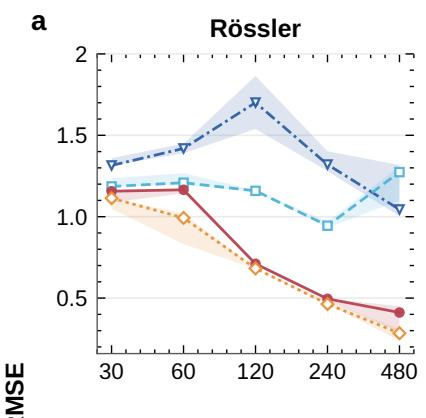

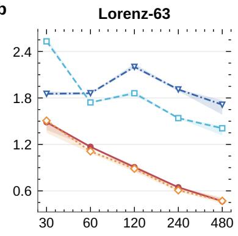

c  
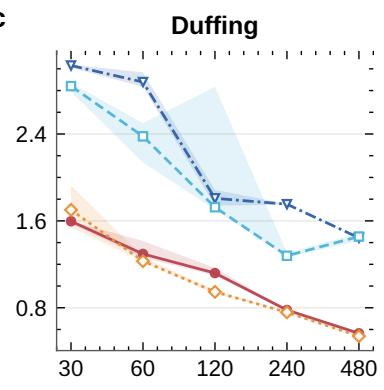

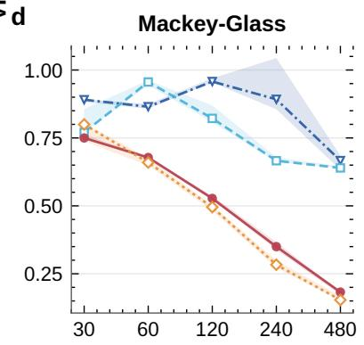

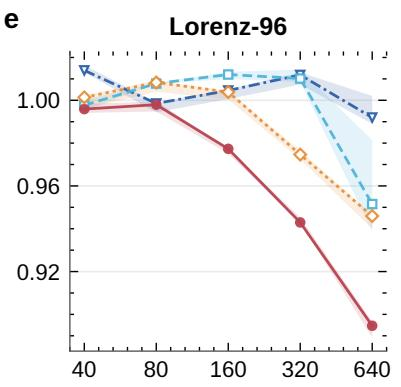

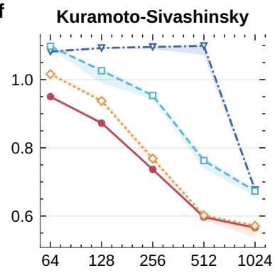  
Fig. 1 Windowed autoregressive rollout VRMSE versus latent dimension for the two Stage 2 objectives in two-stage training (lower is better). Prediction and Residual denote the latent-prediction and spectral-residual models, and +L2 adds the operator-norm penalty $w _ { \mathrm { o p } } \lVert \widehat { \mathbf { A } } \rVert _ { 2 }$ . Panels a–f show R¨ossler, Lorenz-63, Dufing, Mackey–Glass, Lorenz-96, and Kuramoto–Sivashinsky. The evaluation window is (0.5, 0.7] LT, and the latent dimensions are 1, 2, 4, 8, and 16 times the input dimension N0 of each system. For each seed, we average VRMSE over the test starting points and prediction steps within the evaluation window. Lines show the median of these averages across five seeds, and bands show the interquartile range. Each panel uses a linear vertical scale adjusted to its interquartile range

10% for Lorenz-96 to 76% for Mackey–Glass, compared with 2%–52% for latent prediction; the reduction was larger for the spectral-residual model in each system.

The spectral-residual median decreased between every consecutive pair of dimensions for Lorenz-63, Dufing, Mackey–Glass, and Kuramoto–Sivashinsky; the exceptions were R¨ossler and Lorenz-96, where the median increased by less than 1% over the first interval before decreasing. For the latent-prediction model, Dufing was the only system with a decrease between every consecutive pair of dimensions; in the other five systems, the median increased over 10 of the 20 intervals, by less than 1% over 6 of them and by up to 20%.

For Kuramoto–Sivashinsky, the reductions from $N _ { 0 }$ to $1 6 N _ { 0 }$ were comparable (40% and 38% for the spectral-residual and latentprediction models), but the spectral-residual median decreased over every interval, whereas the latent-prediction median stayed between 1.08 and 1.10 up to $8 N _ { 0 }$ and fell sharply to 0.68 at $1 6 N _ { 0 }$ and the absolute gap between the two medians was smaller at $1 6 N _ { 0 }$ than at $N _ { 0 }$

Under two-stage training with the operatornorm penalty applied to both models (+L2 in Fig. 1), the spectral-residual model had a lower median VRMSE than the latent-prediction model in 27 of the 30 cases, except for Mackey–Glass at $N = N _ { 0 }$ , and Lorenz-96 at $N = N _ { 0 }$ and $N = 2 N _ { 0 }$

## 4.2 Training variants and valid prediction time

In the VPT evaluation $( \mathrm { E q . ~ ( 2 7 ) } ) ~ [ 6 1 , ~ 6 9 , ~ 7 0 ] .$ the spectral-residual model in the main two-stage comparison also achieved a longer mean VPT than the latent-prediction model at all five evaluated latent dimensions for each of the six systems, by factors from 1.06 to 5.21 (Table 2). The spectralresidual mean VPT increased in all six systems under two-stage training, by factors from 1.39 to 5.07 from $N _ { 0 }$ to $1 6 N _ { 0 }$ . It is nondecreasing across the evaluated latent dimensions in all six systems under both two-stage and joint training, with or without the penalty.

Over the first dimension interval, the spectralresidual median VRMSE increased slightly for R¨ossler and Lorenz-96, whereas mean VPT increased.

Lorenz-96 and Kuramoto–Sivashinsky were the two systems with the smallest reductions in median windowed VRMSE from $N _ { 0 }$ to $1 6 N _ { 0 }$ for the spectral-residual model, but mean VPT for Kuramoto–Sivashinsky increased from 0.27 LT at $N _ { 0 }$ to 0.61 LT at $1 6 N _ { 0 }$ . Mean VPT for Lorenz-96 was approximately 0.20–0.27 LT throughout the dimension sweep, shorter than the time to the start of the evaluation window (0.5, 0.7].

For R¨ossler at $N = N _ { 0 }$ , mean VPT was longer for the spectral-residual model under two-stage training and for the latent-prediction model under joint training (Table 2). At 16N , the mean VPT of the spectral-residual model was longer under two-stage training than under joint training in all six systems, and with the operator-norm penalty, it was longer in five systems, with Lorenz-96 as the exception. Without an added operator-norm penalty, the mean VPT of the spectral-residual model was longer under two-stage training than under joint training in 23 of the 30 cases.

At $1 6 N _ { 0 }$ with two-stage training, the penalty increased the mean VPT of the spectral-residual model in five systems (Table 2); mean VPT decreased for Lorenz-96. For the latent-prediction model, mean VPT increased for Lorenz-63, Mackey–Glass, and Lorenz-96, decreased for R¨ossler, and changed little for Dufing and Kuramoto–Sivashinsky. Under two-stage training with the penalty, the spectral-residual model also had a longer mean VPT than latent prediction at all five evaluated latent dimensions for each of the six systems.

## 4.3 Comparison with baselines

In Fig. 2, the median windowed VRMSE of the spectral-residual model under two-stage training was lower than that of the four baselines (Sect. 3.4) at every comparison point, except for kernel DMD on R¨ossler at $N = 1 6 N _ { 0 }$ and Consistent KAE on Lorenz-96 at $N = N _ { 0 } , N = 2 N _ { 0 }$ and $N = 4 N _ { 0 }$ . At $1 6 N _ { 0 }$ , this median is lower than the lowest median among the four baseline families by factors from 1.08 to 1.76 in five systems; for R¨ossler, the kernel DMD median is lower by a factor of 1.46.

In Table 2, the baselines had shorter mean VPTs than the two-stage spectral-residual model, with eight exceptions. In five of the eight exceptions, the diference in mean VPT was smaller than the sample standard deviation of the baseline’s seed-level means across seeds. Seven of the eight exceptions occurred at small representation sizes $N ~ \leq ~ 4 N _ { 0 } ;$ the remaining exception involved kernel DMD on R¨ossler at $1 6 N _ { 0 } .$ . On Lorenz-96, the mean VPT of kernel DMD is 0 at all five representation sizes. On Lorenz-96 at $N = N _ { 0 } , N = 2 N _ { 0 }$ , and $N = 4 N _ { 0 }$ , Consistent KAE has lower median windowed VRMSE than the two-stage spectral-residual model, whereas the spectral-residual model has longer mean VPT.

In Fig. 2, the median windowed VRMSE of the two-stage spectral-residual model decreased monotonically with dimension in four systems, whereas no baseline family did so in more than three systems.

The following factors quantify changes from the smallest to the largest representation size: the kernel DMD median [71] decreases for R¨ossler, Lorenz-63, Dufing, and Mackey–Glass, by factors from 2.08 to 6.26, and is approximately constant for Lorenz-96 and Kuramoto–Sivashinsky. The ESN median decreases for Mackey–Glass, by a factor of 2.16, and is approximately constant or nonmonotonic for the other systems.

Table 2 VPT for 12 conditions in LT (longer is better). Rows correspond to systems and representation sizes $N ;$ columns correspond to the four two-stage and four joint model variants and the four baselines. Prediction and Residual denote the latent-prediction and spectral-residual models, and +L2 adds the operator-norm penalty (Fig. 1). Section 3.4 defines what N counts for each model family. For each seed, VPT at a threshold of 0.5 is averaged over 3,000 test starting points; the table reports the mean ± sample standard deviation of these seed-level means across five seeds. Bold indicates the cell with the largest unrounded mean in each row, and a displayed value of 0.00 indicates an unrounded mean below 0.005 LT.
<table><tr><td rowspan="2">System</td><td rowspan="2">N</td><td colspan="4">Two-stage</td><td colspan="4">Joint</td><td colspan="4">Baselines</td></tr><tr><td>Prediction</td><td>Prediction +L2</td><td>Residual</td><td>Residual +L2</td><td>Prediction</td><td>Prediction +L2</td><td>Residual</td><td>Residual +L2</td><td>ESN</td><td>Kernel DMD</td><td>Neural ODE</td><td>Consistent KAE</td></tr><tr><td rowspan="5">Rössler</td><td>30 0.16±0.01</td><td>0.19±0.01</td><td>0.26±0.01</td><td>0.24±0.02</td><td>0.28±0.01</td><td>0.26±0.01</td><td>0.24±0.00</td><td>0.24±0.01</td><td>0.01±0.00</td><td>0.05±0.02</td><td>0.12±0.02</td><td></td><td>0.01±0.01</td></tr><tr><td>600.16±0.00</td><td>0.25±0.05</td><td>0.27±0.00</td><td>0.33±0.03</td><td>0.16±0.00</td><td>0.16±0.00</td><td>0.28±0.01</td><td>0.30±0.02</td><td>0.01±0.01</td><td>0.04±0.01</td><td></td><td>0.09±0.01</td><td>0.05±0.03</td></tr><tr><td>120 0.16±0.01</td><td>0.24±0.03</td><td>0.33±0.01</td><td>0.37±0.01</td><td>0.19±0.02</td><td>0.20±0.01</td><td>0.31±0.01</td><td>0.31±0.01</td><td></td><td>0.01±0.01 0.05±0.01</td><td></td><td>0.09±0.01</td><td>0.03±0.00</td></tr><tr><td>240 0.27±0.04</td><td>0.34±0.01</td><td>0.50±0.02</td><td>0.53±0.02</td><td>0.28±0.01</td><td>0.25±0.01</td><td>0.39±0.01</td><td></td><td>0.39±0.01</td><td>0.01±0.00</td><td>0.27±0.09</td><td>0.09±0.01</td><td>0.03±0.00</td></tr><tr><td>480 0.42±0.05</td><td>0.33±0.04</td><td>0.68±0.03</td><td>0.78±0.06</td><td>0.27±0.05</td><td>0.24±0.01</td><td>0.42±0.01</td><td>0.42±0.01</td><td>0.01±0.00</td><td>0.72±0.11</td><td></td><td>0.08±0.02</td><td>0.03±0.00</td></tr><tr><td rowspan="5">Lorenz-63</td><td>30 0.19±0.01</td><td>0.21±0.01</td><td>0.34±0.01</td><td>0.38±0.02</td><td>0.20±0.01</td><td>0.22±0.00</td><td>0.34±0.00</td><td>0.35±0.00</td><td>0.12±0.03</td><td>0.04±0.02</td><td>0.50±0.04</td><td></td><td>0.04±0.02</td></tr><tr><td>60 0.20±0.01</td><td>0.39±0.06</td><td>0.44±0.01</td><td>0.51±0.01</td><td>0.20±0.01</td><td>0.22±0.00</td><td>0.45±0.01</td><td></td><td>0.45±0.00</td><td>0.15±0.04</td><td>0.06±0.03</td><td>0.48±0.06</td><td>0.12±0.03</td></tr><tr><td>120 0.13±0.00</td><td>0.37±0.02</td><td>0.58±0.01</td><td>0.61±0.01</td><td>0.21±0.01</td><td>0.33±0.06</td><td>0.54±0.01</td><td></td><td>0.54±0.00</td><td>0.14±0.05</td><td>0.13±0.05</td><td>0.42±0.03</td><td>0.08±0.01</td></tr><tr><td>240 0.25±0.02</td><td>0.39±0.01</td><td>0.78±0.03</td><td>0.82±0.04</td><td>0.20±0.00</td><td>0.45±0.02</td><td></td><td>0.67±0.01</td><td>0.70±0.07</td><td>0.12±0.02</td><td>0.52±0.04</td><td>0.44±0.04</td><td>0.05±0.00</td></tr><tr><td>480 0.37±0.01</td><td>0.43±0.06</td><td>1.01±0.01</td><td>1.06±0.03</td><td>0.35±0.03</td><td>0.41±0.01</td><td>0.81±0.01</td><td></td><td>0.88±0.14</td><td>0.14±0.02</td><td>0.84±0.02</td><td>0.34±0.02</td><td>0.05±0.00</td></tr><tr><td rowspan="5">Duffing</td><td>30 0.11±0.00</td><td>0.18±0.02</td><td>0.29±0.02</td><td>0.29±0.05</td><td>0.13±0.01</td><td>0.15±0.00</td><td>0.25±0.00</td><td>0.25±0.00</td><td>0.40±0.15</td><td>0.03±0.01</td><td>0.33±0.03</td><td></td><td>0.07±0.04</td></tr><tr><td>600.12±0.03</td><td>0.21±0.00</td><td>0.34±0.02</td><td>0.38±0.02</td><td>0.11±0.00</td><td>0.20±0.00</td><td></td><td>0.30±0.00</td><td>0.29±0.00</td><td>0.38±0.11 0.05±0.03</td><td></td><td>0.33±0.02</td><td>0.13±0.04</td></tr><tr><td>120 0.19±0.02</td><td>0.20±0.01</td><td>0.45±0.04</td><td>0.65±0.06</td><td>0.19±0.00</td><td>0.20±0.00</td><td></td><td>0.39±0.01</td><td>0.40±0.01</td><td>0.50±0.14</td><td>0.09±0.04</td><td>0.32±0.03</td><td>0.08±0.02</td></tr><tr><td>240 0.19±0.01</td><td>0.40±0.02</td><td>1.01±0.08</td><td>1.13±0.11</td><td>0.21±0.00</td><td>0.18±0.00</td><td></td><td>0.62±0.01</td><td>0.61±0.01</td><td>0.47±0.17</td><td>0.38±0.19</td><td>0.33±0.04</td><td>0.04±0.00</td></tr><tr><td>480 0.30±0.02</td><td>0.30±0.02</td><td>1.46±0.08</td><td>1.55±0.09</td><td>0.33±0.00</td><td>0.33±0.00</td><td></td><td>1.04±0.04</td><td>1.05±0.04</td><td>0.42±0.17</td><td>0.97±0.08</td><td>0.34±0.03</td><td>0.03±0.00</td></tr><tr><td rowspan="5">Mackey- Glass</td><td>30 0.07±0.01</td><td>0.20±0.00</td><td>0.20±0.03</td><td>0.22±0.01</td><td>0.06±0.01</td><td>0.08±0.00</td><td>0.22±0.00</td><td>0.22±0.00</td><td>0.11±0.02</td><td>0.01±0.00</td><td>0.43±0.07</td><td></td><td>0.04±0.01</td></tr><tr><td>60 0.11±0.00</td><td>0.30±0.00</td><td>0.38±0.03</td><td>0.42±0.03</td><td>0.11±0.00</td><td></td><td>0.18±0.00</td><td>0.36±0.00</td><td>0.35±0.00</td><td>0.18±0.02</td><td>0.02±0.00</td><td>0.32±0.02</td><td>0.06±0.01</td></tr><tr><td>120 0.16±0.04</td><td>0.25±0.02</td><td>0.55±0.02</td><td>0.59±0.02</td><td>0.20±0.01</td><td>0.24±0.03</td><td></td><td>0.46±0.00</td><td>0.46±0.00</td><td>0.27±0.06</td><td>0.03±0.02</td><td>0.31±0.01</td><td>0.05±0.01</td></tr><tr><td>240 0.24±0.02</td><td>0.40±0.01</td><td>0.64±0.03</td><td>0.74±0.02</td><td>0.22±0.01</td><td>0.33±0.07</td><td></td><td>0.60±0.00</td><td>0.60±0.00</td><td>0.52±0.13</td><td>0.21±0.05</td><td>0.30±0.02</td><td>0.03±0.00</td></tr><tr><td>480 0.40±0.03</td><td>0.42±0.02</td><td>0.92±0.05</td><td>0.96±0.03</td><td>0.37±0.02</td><td>0.37±0.02</td><td></td><td>0.78±0.01</td><td>0.78±0.01</td><td>0.66±0.33</td><td>0.89±0.02</td><td>0.26±0.01</td><td>0.02±0.00</td></tr><tr><td rowspan="5">Lorenz-96</td><td>40 0.09±0.00</td><td>0.19±0.00</td><td>0.20±0.00</td><td>0.20±0.00</td><td>0.19±0.00</td><td>0.19±0.00</td><td>0.20±0.00</td><td></td><td>0.20±0.00</td><td>0.00±0.00 0.00±0.00</td><td></td><td>0.09±0.00</td><td>0.05±0.01</td></tr><tr><td>80 0.20±0.00</td><td>0.20±0.01</td><td>0.21±0.00</td><td>0.21±0.00</td><td>0.21±0.00</td><td></td><td>0.21±0.00</td><td>0.21±0.00</td><td>0.21±0.00</td><td>0.01±0.00</td><td>0.00±0.00</td><td>0.09±0.00</td><td>0.15±0.00</td></tr><tr><td>160 0.20±0.00</td><td>0.21±0.00</td><td>0.22±0.00</td><td>0.21±0.00</td><td>0.20±0.00</td><td>0.20±0.00</td><td></td><td>0.22±0.00</td><td>0.21±0.00</td><td>0.05±0.00</td><td>0.00±0.00</td><td>0.08±0.00</td><td>0.10±0.00</td></tr><tr><td>320 0.21±0.00</td><td>0.21±0.01</td><td>0.23±0.00</td><td>0.23±0.00</td><td>0.21±0.00</td><td>0.22±0.02</td><td></td><td>0.23±0.00</td><td>0.22±0.00</td><td>0.10±0.00</td><td>0.00±0.00</td><td>0.08±0.00</td><td>0.08±0.00</td></tr><tr><td>640 0.22±0.01</td><td>0.24±0.01</td><td>0.27±0.00</td><td>0.26±0.00</td><td>0.23±0.00</td><td>0.22±0.00</td><td></td><td>0.26±0.00</td><td>0.34±0.00</td><td>0.12±0.00</td><td>0.00±0.00</td><td>0.08±0.00</td><td>0.13±0.00</td></tr><tr><td rowspan="5">Kuramoto Sivashinsky</td><td>64 0.25±0.01</td><td>0.24±0.01</td><td>0.27±0.00</td><td>0.25±0.00</td><td>0.24±0.01</td><td>0.25±0.00</td><td>0.29±0.01</td><td>0.27±0.01</td><td></td><td>0.10±0.00 0.00±0.00</td><td></td><td>0.03±0.00</td><td>0.12±0.01</td></tr><tr><td>128 0.25±0.01</td><td>0.27±0.02</td><td>0.31±0.01</td><td>0.30±0.00</td><td></td><td>0.25±0.01</td><td>0.30±0.01</td><td>0.29±0.01</td><td>0.31±0.01</td><td>0.12±0.01</td><td>0.00±0.00</td><td>0.03±0.00</td><td>0.11±0.01</td><td></td></tr><tr><td>256 0.25±0.01</td><td>0.31±0.00</td><td>0.42±0.01</td><td>0.42±0.01</td><td></td><td>0.26±0.01</td><td>0.37±0.01</td><td>0.36±0.01</td><td>0.36±0.01</td><td>0.13±0.01</td><td>0.00±0.00</td><td></td><td>0.03±0.00</td><td>0.07±0.00</td></tr><tr><td>512 0.25±0.01</td><td>0.45±0.01</td><td>0.56±0.01 0.61±0.01</td><td>0.57±0.01 0.62±0.02</td><td></td><td>0.32±0.01 0.51±0.01</td><td>0.33±0.01 0.46±0.01</td><td>0.48±0.01 0.57±0.01</td><td>0.49±0.01 0.57±0.01</td><td>0.16±0.01 0.18±0.01</td><td>0.00±0.00 0.00±0.00</td><td>0.06±0.00</td><td>0.03±0.00</td><td>0.07±0.01 0.03±0.00</td></tr><tr><td>1024 0.50±0.01 0.50±0.01</td></table>

The Neural ODE medians for R¨ossler and Mackey–Glass increase over the first interval and then decrease; overall, the former decreases by a factor of 1.80 and the latter increases by a factor of 1.35. The median increases by factors of 1.36 for Lorenz-63 and 1.14 for Kuramoto–Sivashinsky, and decreases by factors of 1.21 for Dufing and 1.24 for Lorenz-96.

The Consistent KAE median decreases for R¨ossler, Lorenz-63, Mackey–Glass, and Kuramoto–Sivashinsky, by factors from 1.29 to 1.84, and is approximately constant for Dufing. For Lorenz-96, it is between 0.96 and 0.97 up to $4 N _ { 0 }$ and is 2.44 at $8 N _ { 0 }$ and 1.60 at 16N .

The Gaussian radial basis function (RBF) kernel of kernel DMD is universal on compact input domains [72, 73], and convergence of extended dynamic mode decomposition (EDMD)

for a dense sequence of observables [74] is a population-level result. This comparison concerns estimates from finite data at a fixed bandwidth (Appendix B).

Compared with the latent-prediction model in two-stage training, the spectral-residual model combined lower median windowed VRMSE with larger reductions from $N _ { 0 }$ to $1 6 N _ { 0 }$ and more consistent improvement with increasing dimension.

## 5 Spectral properties and predictions

## 5.1 Spectral analysis of the learned operators

Following ResDMD, we compare contours of the minimal residual τbnumM,N over the retained subspace of each learned dictionary with the estimated Koopman eigenvalues for a posteriori verification [35, 39]. For the eight model variants at the largest evaluated latent dimension $1 6 N _ { 0 } , \mathrm { F i g . 3 }$ shows the eigenvalues and contours of the minimal residual for R¨ossler, and the spectral plots and predictions for the other five systems are shown in Online Resource 1, Figs. S1–S10. The rollout matrix $\widehat { \mathbf A }$ and $\mathbf { z } _ { t } = \phi _ { \widehat { \theta _ { e } } } ( \mathbf { x } _ { t } )$ satisfy

e  
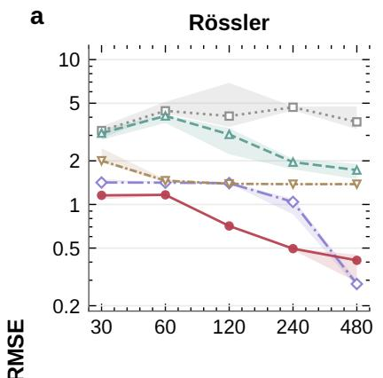

b  
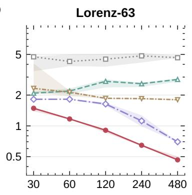

c  
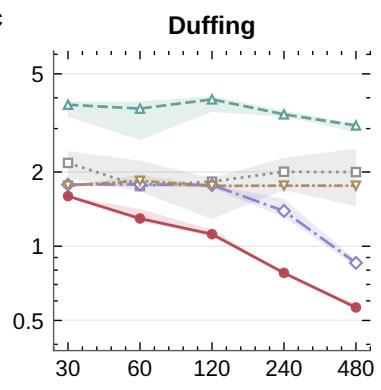

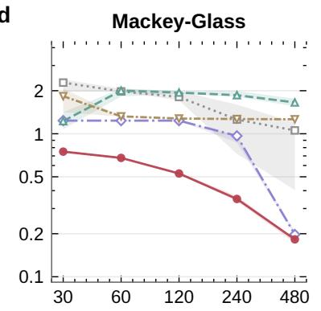

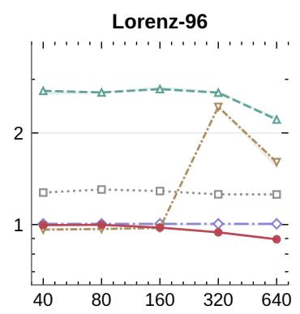

f  
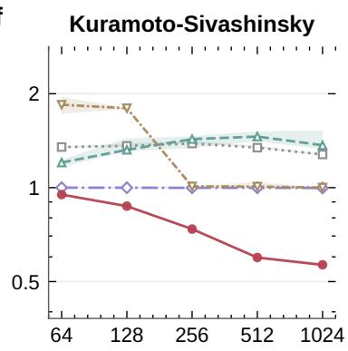  
Representation size N  
Fig. 2 Autoregressive rollout VRMSE versus representation size for the baseline families and the spectral-residual model (lower is better). “Residual (two stage)” denotes the spectral-residual model under two-stage training. Panels a–f show R¨ossler, Lorenz-63, Dufing, Mackey–Glass, Lorenz-96, and Kuramoto–Sivashinsky. The evaluation window is the same (0.5, 0.7] LT window as in Fig. 1. Markers show medians over five random seeds, and shaded bands show interquartile ranges. The vertical axis is logarithmic

$$
\mathbf { z } _ { n } - \widehat { \mathbf { A } } ^ { n } \mathbf { z } _ { 0 } = \sum _ { t = 0 } ^ { n - 1 } \widehat { \mathbf { A } } ^ { n - 1 - t } \big ( \mathbf { z } _ { t + 1 } - \widehat { \mathbf { A } } \mathbf { z } _ { t } \big ) .
$$

Multi-step state prediction error depends on reconstruction error at the target state, one-step prediction errors in all latent directions, their propagation by powers of ${ \widehat { \mathbf { A } } } ,$ and the decoder. The eigenvalues of $\widehat { \mathbf { A } } _ { \mathrm { t r } }$ are plotted for both models, whereas latent-prediction rollouts use the rankconstrained operator of Appendix B to avoid divergence.

Under two-stage training, spectral-residual eigenvalues in all six systems were concentrated in regions where the plotted minimal residual was small. By contrast, latent-prediction eigenvalues in both Prediction and Prediction+L2 also scattered into high-residual regions inside and outside the unit circle. In the main two-stage comparison, the one-step prediction error of the latentprediction model decreased from $N _ { 0 }$ to $1 6 N _ { 0 }$ in all six systems.

Under joint training, spectral-residual eigenvalues extended farther toward the origin than those from two-stage training, and latentprediction eigenvalues were also scattered across high-residual regions for their learned dictionary. In the Prediction column for Lorenz-96, most eigenvalues clustered in low-residual regions near $\lambda ~ = ~ 1$ under both training methods (Online Resource 1, Fig. S7).

## 5.2 Qualitative comparison of predictions

We compare the four model variants separately for two-stage training and joint training. Figure 4 shows predictions made from diferent observation vectors at each prediction horizon. For R¨ossler in Fig. 4, the spectral-residual model with two-stage training shows the reference fold at 0.6 LT, and at 1.0 LT it shows the main loop and a single excursion in the third coordinate that is lower than the highest excursions of the reference. The overall shape is also captured when the operator-norm penalty is added. For the spectral-residual model with joint training, the fold at 0.6 LT is lower than the highest excursions of the reference, and at 1.0 LT only the planar loop is visible. For the latentprediction model, the loop is distorted at 0.2 LT under both two-stage and joint training.

For Lorenz-63, Dufing, and Mackey–Glass, the spectral-residual model with two-stage training captures the overall shapes of the reference attractors at the displayed prediction horizons up to 1.0 LT. For Lorenz-63, two lobes smaller than those of the reference attractor can be distinguished even at 1.0 LT, and small kinks appear in the curves. For the spectral-residual model with joint training, the two lobes of Lorenz-63, the outer orbit and the loops on both sides in Dufing, and the folding structure of Mackey–Glass are visible at 1.0 LT, but all are smaller in extent than their reference counterparts and are distorted. Compared with predictions from two-stage training, those from joint training have a noticeably smaller extent for Lorenz-63 and Dufing from 0.6 LT onward, while the diference in overall shape is small for Mackey– Glass. For the latent-prediction model, distortions are present at 0.2 LT under both two-stage and joint training; for Mackey–Glass, pronounced loss of the reference folding structure occurs at 0.6 LT. For Lorenz-96 and Kuramoto–Sivashinsky, the striped structure of the field is distorted for both models at 0.6 LT under both two-stage and joint training (Online Resource 1, Figs. S8 and S10).

At $1 6 N _ { 0 }$ , the spectral-residual model under two-stage training had eigenvalues concentrated in low-residual regions for its learned dictionary, achieved a longer mean VPT than the latentprediction model under two-stage training and the spectral-residual model under joint training, and achieved a lower median windowed VRMSE than the former. This correspondence is consistent with an interpretation of this better prediction performance in terms of spectral reliability.

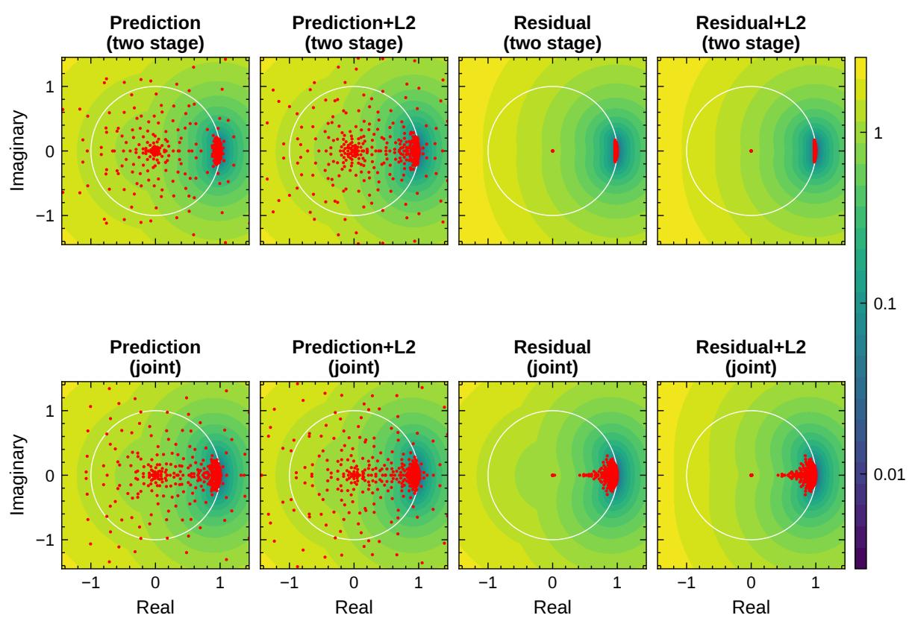  
Fig. 3 Minimal residuals $\widehat { \tau } _ { M , N } ^ { \mathrm { n u m } }$ and eigenvalues for eight model variants in R¨ossler at latent dimension $1 6 N _ { 0 }$ . Colors show, on a logarithmic scale, contours of the minimal residual computed over the retained numerical subspace, with the same color range across all panels. Low-residual regions appear near $\lambda = 1$ in all eight panels. White curves mark the unit circle, and red points mark the estimated Koopman eigenvalues within the plotted range. The weighted latent snapshot matrix used for the contours is defined in Sect. $3 . 3 ,$ , and the matrix whose eigenvalues are plotted is defined in $\mathrm { A p } \mathrm { \Delta }$ endix B. The top row shows two-stage training, and the bottom row shows joint training. From left to right, the columns show Prediction (the latent-prediction model), Prediction+L2, Residual (the spectral-residual model), and Residual+L2; +L2 adds the operatornorm penalty $w _ { \mathrm { o p } } \| \widehat { \mathbf { A } } \|$ 2

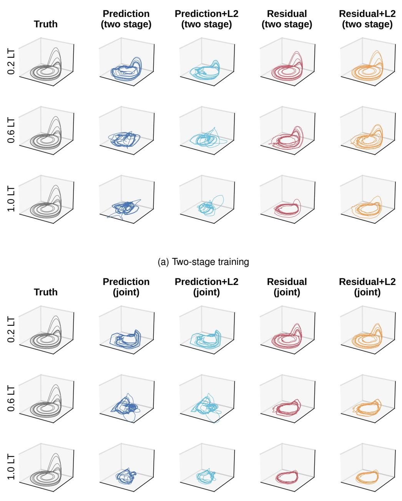  
(b) Joint training  
Fig. 4 Predictions for R¨ossler at latent dimension 16N (top: two-stage training; bottom: joint training). From left to right, the columns show the reference trajectory, Prediction (the latent-prediction model), Prediction+L2, Residual (the spectralresidual model), and Residual+L2; +L2 adds the operator-norm penalty $w _ { \mathrm { o p } } \| \widehat { \mathbf { A } } \| _ { 2 }$ . Each row corresponds to one prediction horizon (0.2, 0.6, or 1.0 LT), and predictions are made that far ahead from diferent observation vectors in the reference trajectory. The plots show the three components of the measured state extracted from predictions whose target times fall within the first 5 LT of the test trajectory. Axis limits follow the reference trajectory and are shared across all panels

## 6 Conclusions

In the main two-stage comparison, the spectralresidual model reduced median windowed rollout error more consistently with increasing latent dimension than the latent-prediction model, and its error fell by a larger factor from the smallest to the largest dimension in every system. Although both models reduced median error from the smallest to the largest dimension in all six chaotic systems, the spectral-residual model achieved lower median windowed errors and longer mean VPTs at all five evaluated latent dimensions in each system. In the comparison with baseline families using family-specific training settings, the spectral-residual model also achieved favorable results on the same two metrics, with some exceptions.

In our theoretical analysis of bounded Koopman operators, we showed that as the space spanned by the learned dictionary approximates the observable space, the minimal residual over the dictionary space converges to the infimum of the relative residual over the whole observable space. This result provides a mathematical basis for expecting residual-based spectral information to become more reliable as the latent dimension increases.

Under two-stage training at the largest evaluated dimension, the estimated Koopman eigenvalues of the spectral-residual model were concentrated in low-residual regions for its learned dictionary, whereas those of the latent-prediction model also appeared in high-residual regions. The concentration of the eigenvalues of the spectralresidual model in low-residual regions for its learned dictionary, seen when they are overlaid on dictionary-specific residual contours, corresponds to longer mean VPT, and this correspondence is consistent with an interpretation of the prediction results in terms of spectral reliability. Predictions from the spectral-residual model preserved the overall shapes of several reference attractors, whereas in field predictions for Lorenz-96 and Kuramoto–Sivashinsky, structures were distorted for both models despite the concentration of spectral-residual eigenvalues.

The next question is how spectral residuals, the propagation of one-step prediction errors in latent coordinates, and decoding jointly determine the dependence of rollout error on latent dimension. For Koopman operators with continuous spectrum, a further question is under what conditions this dependence follows a power law, and what determines the exponent.

## Appendix A Spectral convergence and reconstruction

## Convergence of the minimal residual

We take the limits in the order M → ∞, then N → ∞. Joint or exchanged limits generally

require additional assumptions relating M and N [43].

## Setting

We use $\mathcal { H } , \phi _ { N } , V _ { N }$ , and K as defined in Sect. 2.1, and let I denote the identity operator on H. For the data limit, we hold N and the space $V _ { N }$ fixed, set $d _ { N } \ =$ dim $V _ { N } ~ \leq ~ N$ , and choose a basis $b _ { 1 } , \dots , b _ { d _ { N } }$ independently of the evaluation samples. Each $g \ \in \ V _ { N }$ can be written as $\begin{array} { r } { g = \sum _ { j = 1 } ^ { d _ { N } } a _ { j } b _ { j } } \end{array}$ with a unique coeficient vector $\mathbf { a } \in \mathbb { C } ^ { d _ { N } }$ , and we define point evaluations by linear combinations of fixed measurable representatives of the basis. Define the evaluation matrices of the fixed basis, $\Psi _ { X } , \Psi _ { Y } \in \mathbb { C } ^ { M \times d _ { N } }$ , and the Gram and cross-correlation matrices as follows:

$$
\begin{array} { r l r } & { ( \Psi _ { X } ) _ { i j } = b _ { j } ( \mathbf { x } ^ { ( i ) } ) , } & { \quad 1 \leq i \leq M , 1 \leq j \leq d _ { N } , } \\ & { ( \Psi _ { Y } ) _ { i j } = b _ { j } ( \mathbf { y } ^ { ( i ) } ) , } & { \quad 1 \leq i \leq M , 1 \leq j \leq d _ { N } , } \end{array}
$$

$$
\begin{array} { r l } & { { \bf G } _ { X X } ^ { ( M , N ) } = { \Psi } _ { X } ^ { * } { \bf W } { \Psi } _ { X } , } \\ & { { \bf G } _ { X Y } ^ { ( M , N ) } = { \Psi } _ { X } ^ { * } { \bf W } { \Psi } _ { Y } , } \\ & { { \bf G } _ { Y Y } ^ { ( M , N ) } = { \Psi } _ { Y } ^ { * } { \bf W } { \Psi } _ { Y } , \qquad { \bf W } = { \bf I } _ { M } / M . } \end{array}
$$

When $d _ { N } = N$ and the coordinate observables of ϕN are chosen in this order as the basis $b _ { 1 } , \dots , b _ { N }$ 2 these matrices coincide with those in Sect. 3.1 if the same pairs are used with $M = m$ . Positive definiteness of $\mathbf { G } _ { X X } ^ { ( M , N ) }$ is equivalent to the denominator positivity condition stated before Eq. (5), and under this condition the minimal residual has the following expression in terms of quadratic forms [35, 36]:

$$
\begin{array} { r l } & { \widehat \tau _ { M , N } ( \lambda ) ^ { 2 } } \\ & { = \underset { \mathbf { a } \in \mathbb { C } ^ { d _ { N } } } { \mathrm { m i n } } \frac { \mathbf { a } ^ { * } \left( \mathbf { G } _ { Y Y } ^ { ( M , N ) } - \lambda ( \mathbf { G } _ { X Y } ^ { ( M , N ) } ) ^ { * } \right. } { \left. - \lambda \mathbf { G } _ { X Y } ^ { ( M , N ) } + \left| \lambda \right| ^ { 2 } \mathbf { G } _ { X X } ^ { ( M , N ) } \right) \mathbf { a } } { \mathbf { a } ^ { * } \mathbf { G } _ { X X } ^ { ( M , N ) } \mathbf { a } } . } \end{array}\tag{A1}
$$

With the point evaluations fixed, the minimum is independent of the choice of basis.

## Assumptions for the data limit

(i) The snapshot pairs $( \mathbf { x } ^ { ( i ) } , \mathbf { y } ^ { ( i ) } )$ are generated from independent and identically distributed samples $\mathbf { x } ^ { ( i ) } \sim \mu ;$ or

(ii) F is µ-measure-preserving and ergodic, and the snapshot pairs are drawn from a single trajectory $\begin{array} { r } { \hat { \textbf { x } } ^ { ( i ) } ~ = ~ F ^ { i } ( \mathbf { x } ^ { ( 0 ) } ) } \end{array}$ ), with the trajectory averages of the integrable Gram observables converging to their integrals for almost every initial condition $\mathbf { x } ^ { ( 0 ) }$

Proposition A.1 (Convergence with respect to the number of snapshot pairs $( M \ \to \ \infty ) )$ Let $\mu$ be a probability measure, fix $N , \ V _ { N }$ , and a basis of $V _ { N }$ independently of the evaluation samples, and assume sampling condition $( i )$ or (ii) above. Then, on a common set of full measure, $\mathbf { G } _ { X X } ^ { ( M , N ) }$ is positive definite for all suficiently large M. Under (i), this set is an event of probability one for the sample sequence; under $( i i )$ , it contains µ-almost every initial condition. On the same set, the following holds for every compact set $\Lambda \subset \mathbb { C }$

$$
\operatorname* { s u p } _ { \lambda \in \Lambda }  \widehat { \tau } _ { M , N } ( \lambda ) - \tau _ { N } ( \lambda )   0 \qquad ( M  \infty ) .
$$

Proof of Proposition A.1 Since $b _ { j } , K b _ { j } \in \mathcal { H }$ , the products below are integrable by the Cauchy–Schwarz inequality. By the strong law of large numbers under condition (i) and Birkhof’s ergodic theorem under condition (ii), the following entrywise convergence holds on a set of full measure common to all j, k [35]:

$$
\begin{array} { r l } & { \underset { M  \infty } { \operatorname* { l i m } } [ \mathbf { G } _ { X X } ^ { ( M , N ) } ] _ { j k } = \displaystyle \int _ { \Omega } b _ { k } ( \mathbf { x } ) \overline { { b _ { j } ( \mathbf { x } ) } } \mathrm { d } \mu ( \mathbf { x } ) , } \\ & { \underset { M  \infty } { \operatorname* { l i m } } [ \mathbf { G } _ { X Y } ^ { ( M , N ) } ] _ { j k } = \displaystyle \int _ { \Omega } b _ { k } ( F ( \mathbf { x } ) ) \overline { { b _ { j } ( \mathbf { x } ) } } \mathrm { d } \mu ( \mathbf { x } ) , } \\ & { \underset { M  \infty } { \operatorname* { l i m } } [ \mathbf { G } _ { Y Y } ^ { ( M , N ) } ] _ { j k } = \displaystyle \int _ { \Omega } b _ { k } ( F ( \mathbf { x } ) ) \overline { { b _ { j } ( F ( \mathbf { x } ) ) } } \mathrm { d } \mu ( \mathbf { x } ) . } \end{array}
$$

Since only finitely many matrix entries are involved, the three matrices also converge in norm. By linear independence of the basis, the limit of $\mathbf { G } _ { X X } ^ { ( \bar { M } , N ) }$ is positive definite, and $\mathbf { G } _ { X X } ^ { ( M , N ) }$ is also positive definite for all suficiently large M. The quotient in Eq. (A1) is homogeneous in ${ \mathbf { a } } ,$ so the minimization can be restricted to the coeficient unit sphere, and the minimum of the population quotient is $\tau _ { N } ( \lambda ) ^ { 2 }$ . Since the limiting Gram matrix is positive definite, the empirical denominators are bounded below by a common positive constant on the coeficient unit sphere for all suficiently large M. The convergence of the Gram and cross-correlation matrices then gives uniform convergence of the Rayleigh quotients on the product of this sphere and any compact set $\Lambda \subset \mathbb { C }$ , and hence of their minima. Finally, the inequality $| { \sqrt { u } } - { \sqrt { v } } | \leq$ $\sqrt { \left| u - v \right| }$ for nonnegative u, v gives uniform convergence of $\widehat { \tau } _ { M , N }$ to $\tau _ { N }$ on $\Lambda ,$ including at points of zero residual. □

## Assumption for the latent-dimension limit

Density results for feedforward networks are classical [75, 76], and for real-valued ReLU networks with two hidden layers, density in $L ^ { 2 } ( \mathbb { R } ^ { d _ { x } } )$ with Lebesgue measure is known [77]. Here, Assumption (A3) plays the role of the core condition in Colbrook and Townsend [35, Appendix B].

Proof of Proposition 2.1 Fix $\textit { g } \in \textit { \textbf { \mathscr { H } } }$ and $\delta \mathrm { ~  ~ { ~ > ~ } ~ } 0 .$ Because $E _ { N } ( g ) \to 0 .$ , each suficiently large N admits $v _ { N } \in V _ { N }$ satisfying $\| g - v _ { N } \| _ { \mathcal { H } } < \delta / ( 1 + \| \mathcal { K } \| )$ , and boundedness gives

$\begin{array} { r } { \| g - v _ { N } \| _ { \mathcal { H } } + \| \mathcal { K } g - \mathcal { K } v _ { N } \| _ { \mathcal { H } } \le ( 1 + \| \mathcal { K } \| ) \| g - v _ { N } \| _ { \mathcal { H } } < \delta . } \end{array}$ Next, fix $\lambda \in \mathbb { C }$ and $\eta > 0 ,$ and choose $g \in \mathcal { H }$ such that $\| g \| _ { \mathcal { H } } = 1$ and $\operatorname { r e s } ( \lambda , g ) < \tau ( \lambda ) + \eta$ [35, Appendix B]. By Assumption (A3), we can choose $v _ { N } \in V _ { N }$ such that $v _ { N }  g ,$ and boundedness gives

$\| ( K - \lambda I ) ( v _ { N } - g ) \| _ { \mathcal { H } } \leq ( \| K \| + | \lambda | ) \| v _ { N } - g \| _ { \mathcal { H } } \to 0 .$ Moreover, since $\| v _ { N } \| _ { \mathcal { H } } \to 1$ , for suficiently large N we have $v _ { N } \neq 0$ and res $( \lambda , v _ { N } )  \mathrm { r e s } ( \lambda , g )$ ). From the inclusion $V _ { N } \subset \mathcal { H }$ and $\tau _ { N } ( \lambda ) \leq \mathrm { r e s } ( \lambda , v _ { N } )$ , we obtain

$$
\begin{array} { r l } & { \tau ( \lambda ) \leq \underset { N  \infty } { \operatorname* { l i m } \operatorname* { i n f } } \tau _ { N } ( \lambda ) \leq \underset { N  \infty } { \operatorname* { l i m } \operatorname* { s u p } } \tau _ { N } ( \lambda ) } \\ & { \quad \leq \mathrm { r e s } ( \lambda , g ) < \tau ( \lambda ) + \eta . } \end{array}
$$

Since $\eta > 0$ was arbitrary, we obtain $\tau _ { N } ( \lambda ) \to \tau ( \lambda )$ Therefore, if $\tau ( \lambda ) < \epsilon ,$ , then $\lambda \in \sigma _ { N , \epsilon , \mathrm { a p } } ( \mathcal { K } )$ for all suficiently large N. □

## Approximate point pseudospectra

Proposition 2.1 and the proposition below concern $\sigma _ { N , \epsilon , \mathrm { a p } } ( \mathcal { K } ) , \ \sigma _ { \epsilon , \mathrm { a p } } ( \mathcal { K } )$ , and $\sigma _ { \mathrm { a p } } ( \boldsymbol { K } )$ , defined in Sect. 2.2 [35, Appendix B]. For a general nonnormal operator, treating points in the residual spectrum may require a construction using the corresponding adjoint operator. Here, $\sigma _ { \mathrm { a p } } ( \kappa )$ coincides with the standard approximate point spectrum of a bounded operator on a nonzero Hilbert space, the strict sublevel sets are open, and $\sigma _ { \mathrm { a p } } ( \kappa )$ is closed.

Proposition A.2 (Zero-residual characterization $( \epsilon \mathrm { ~  ~ \nu ~ } , 0 ) )$ Under Assumptions $( A 1 ) - ( A 4 ) ;$ on a common set of full measure for all $N _ { z }$ $\begin{array} { r } { \operatorname* { l i m } _ { N \to \infty } \operatorname* { l i m } _ { M \to \infty } \widehat { \tau } _ { M , N } ( \lambda ) = \tau ( \lambda ) } \end{array}$ for every $\lambda \in \mathbb { C }$ For each $\lambda \in \mathbb { C } ,$

$$
\begin{array} { r } { \lambda \in \sigma _ { \mathrm { a p } } ( { \cal K } ) \Longleftrightarrow \tau ( \lambda ) = 0 } \\ { \iff \big [ \forall \epsilon > 0 , \lambda \in \sigma _ { \epsilon , \mathrm { a p } } ( { \cal K } ) \big ] . } \end{array}
$$

Proof of Proposition A.2 Under Assumption (A4), the argument used in the proof of Proposition A.1 to deduce uniform convergence from matrix convergence shows that, for each $N _ { ; }$ , there is a set of full measure on which the convergence $\widehat { \tau } _ { M , N } \to \tau _ { N }$ is uniform on every compact subset of $\mathbb { C } .$ On the countable intersection of these sets over $N$ , Proposition 2.1 gives lim ${ } . N {  } { \infty } \operatorname* { l i m } _ { M  \infty } { \widehat { \tau } } _ { M , N } ( \lambda ) = \tau ( \lambda )$ for every $\lambda \in \mathbb { C }$ From $\mathrm { E q . \ ( 3 ) }$ and $\tau ( \lambda ) \geq 0$ , we obtain

$$
\bigcap _ { \epsilon > 0 } \sigma _ { \epsilon , \mathrm { a p } } ( \mathcal { K } ) = \{ \lambda \in \mathbb { C } : \tau ( \lambda ) = 0 \} = \sigma _ { \mathrm { a p } } ( \mathcal { K } ) .
$$

$\mathrm { I f } \ \tau ( \lambda ) = 0$ , then for every $\epsilon > 0 .$ , all suficiently large N satisfy $\tau _ { N } ( \lambda ) < \epsilon / 2$ , and for each such $N ,$ all sufficiently large M satisfy $\widehat { \tau } _ { M , N } ( \lambda ) < \epsilon$ . Conversely, if $\tau ( \lambda ) > 0 .$ , choose $0 < \epsilon < \tau ( \lambda ) ;$ the same successive limits then give $\widehat { \tau } _ { M , N } ( \lambda ) > \epsilon$ for all suficiently large N and, for each such $N ,$ all suficiently large $M . \ \sqcap$

## Reconstruction and exact latent collisions

The bound applies to each trained model with its own $e _ { \mathrm { r e c } }$

Lemma A.1 (A pointwise reconstruction bound limits exact latent collisions) Assume the following for every sampled observation vector x under consideration.

$$
\begin{array} { r } { \| \mathbf { x } - \psi _ { \theta _ { \mathrm { d } } } ( \phi _ { \theta _ { \mathrm { e } } } ( \mathbf { x } ) ) \| _ { 2 } \leq e _ { \mathrm { r e c } } . } \end{array}\tag{A2}
$$

$I f \mathbf { x } ^ { ( i ) }$ and $\mathbf { x } ^ { ( j ) }$ satisfy $\phi _ { \theta _ { \mathrm { e } } } ( \mathbf { x } ^ { ( i ) } ) = \phi _ { \theta _ { \mathrm { e } } } ( \mathbf { x } ^ { ( j ) } )$ , then

$$
\| \mathbf { x } ^ { ( i ) } - \mathbf { x } ^ { ( j ) } \| _ { 2 } \leq 2 e _ { \mathrm { r e c } } .\tag{A3}
$$

Proof of Lemma A.1 If $\phi _ { \theta _ { \mathrm { e } } } ( \mathbf { x } ^ { ( i ) } ) ~ = ~ \phi _ { \theta _ { \mathrm { e } } } ( \mathbf { x } ^ { ( j ) } )$ , the decoder outputs coincide. Therefore

$$
\begin{array} { r l } & { \| \mathbf { x } ^ { ( i ) } - \mathbf { x } ^ { ( j ) } \| _ { 2 } \leq \| \mathbf { x } ^ { ( i ) } - \psi _ { \theta _ { \mathrm { d } } } ( \phi _ { \theta _ { \mathrm { e } } } ( \mathbf { x } ^ { ( i ) } ) ) \| _ { 2 } } \\ & { \qquad + \| \mathbf { x } ^ { ( j ) } - \psi _ { \theta _ { \mathrm { d } } } ( \phi _ { \theta _ { \mathrm { e } } } ( \mathbf { x } ^ { ( j ) } ) ) \| _ { 2 } } \\ & { \qquad \leq 2 e _ { \mathrm { r e c } } . } \end{array}
$$

## Appendix B Training and baseline settings

## Common preparation

Initial conditions

The initial conditions are based on [59] for R¨ossler, Dufing, and Mackey–Glass, [61] for Lorenz-63, [78] for Lorenz-96, and [34, 79] for Kuramoto– Sivashinsky. For R¨ossler, Lorenz-63, Dufing, and Lorenz-96, we add independent zero-mean Gaussian perturbations with standard deviation 1 to each component of the reference states $( 1 , 1 , 1 )$ 2 (1, 1, 1), (0, 0.01), and the state with all components equal to $F _ { \mathrm { L 9 6 } }$ , respectively. For Mackey– Glass, the initial history is the constant max(0.5+ $\xi , 1 0 ^ { - 6 } )$ , where $\xi$ is a standard normal random variable. For Kuramoto–Sivashinsky, we set $\hat { u } _ { k } =$ $0 . 1 ( \xi _ { k } + i \eta _ { k } )$ for Fourier modes $k = 1 , 2 , 3$ , use their conjugates for negative modes, and set all other coeficients to zero, where $\xi _ { k }$ and $\eta _ { k }$ are independent standard normal random variables. The step counts in the Steps column of Table 1 include the burn-in steps, which are discarded before the data are split, and random seeds vary the initial-condition perturbations and minibatch sampling.

## Computational environment

All experiments ran on NVIDIA RTX 6000 Ada graphics processing units (GPUs).

## Koopman autoencoder settings

## Training protocol

We train for 200 epochs using the settings in Table B1, with 20 warm-up epochs followed by 180 epochs of cosine learning-rate decay and weight decay of $1 0 ^ { - 2 }$ . The encoder and decoder are initialized with autoencoder weights pretrained using a reconstruction loss and a learning rate of $3 \times 1 0 ^ { - 4 }$ for 300,000 updates on a separate trajectory of the same system at the same latent dimension. Two-stage training allows at most $J _ { 1 } = J _ { 2 } = 2 5 0$ updates per stage in each epoch, and joint training allows at most 250 updates per epoch. In two-stage training, each stage stops when the relative decrease between the mean losses in the two halves of a 150-update window, expressed per 100 updates, is at most 1%. For each operator estimate, we draw 2,048 pairs for operator estimation and 2,048 pairs for evaluating the evolution loss from two disjoint pools formed by assigning successive temporal blocks of 2 LT alternately to the two pools. The regularization parameter is $\varepsilon =$ $1 0 ^ { - 6 } \Vert \mathbf { Z } _ { X } \Vert _ { F } ^ { 2 } / N$ , and the auxiliary comparisons use the operator-norm penalty weight $w _ { \mathrm { o p } } = 0 . 0 1$

## Operators for rollouts and validation

Both models estimate $\widehat { \mathbf { A } } _ { \mathrm { t r } }$ from all $M _ { \mathrm { t r } }$ encoded training pairs $\begin{array} { r l r } { { \bf Z } _ { X , \mathrm { t r } } , { \bf Z } _ { Y , \mathrm { t r } } } & { { } \in } &  \mathbb { R } ^ { N \times M _ { \mathrm { t r } } } \end{array}$ using Eq. (13) with regularization parameter $\begin{array} { r l } { \varepsilon _ { \mathrm { t r } } } & { { } = } \end{array}$ $1 0 ^ { - 6 } \| \mathbf { Z } _ { X , \mathrm { t r } } \| _ { F } ^ { 2 } / N$ The spectral-residual model uses $\bf \tilde { A } _ { \mathrm { t } }$ for rollouts. For latent prediction, rollouts with $\bf \dot { A } _ { \mathrm { t r } }$ diverged, so we use a rank-constrained operator. In the SVD $\mathbf { Z } _ { X , \mathrm { t r } } = \mathbf { U } _ { \mathrm { t r } } \mathbf { \Sigma } \mathbf { \Sigma } \mathbf { \Sigma } _ { \mathrm { t r } } \mathbf { V } _ { \mathrm { t r } } ^ { \top }$ , with singular values $\sigma _ { j }$ in nonincreasing order, we choose the smallest rank r that retains at least 99.9% of the sum of the squared singular values. With $\mathbf { U } _ { \mathrm { t r } , r }$ and $\mathbf { V } _ { \mathrm { t r } , r }$ denoting the first r singular-vector columns and $\Sigma _ { \mathrm { t r } , r }$ the diagonal matrix of the retained singular values, let $\mathbf { Q } _ { r } = \mathbf { Z } _ { Y , \mathrm { t r } } \mathbf { V } _ { \mathrm { t r } , r } \pmb { \Sigma } _ { \mathrm { t r } , r } ( \pmb { \Sigma } _ { \mathrm { t r } , r } ^ { 2 } + \varepsilon _ { \mathrm { t r } } \pmb { \bar { \mathbf { I } _ { { r } } } } ) ^ { - 1 }$ and $\hat { \mathbf { A } } _ { \mathrm { t r } , r } =$ $\mathbf { Q } _ { r } \mathbf { U } _ { \mathrm { t r } , r } ^ { \top } \mathbf { Q } _ { r } \mathbf { Q } _ { r } ^ { \dagger }$ . Here I is the $r \times r$ identity matrix and † denotes the Moore–Penrose pseudoinverse. Validation uses this rank-constrained construction for both models, with r equal to the number of singular directions satisfying $\sigma _ { j } ^ { 2 } \geq \varepsilon _ { \mathrm { t r } }$ . The eigenvalues overlaid on the residual contours are those of $\widehat { \mathbf { A } } _ { \mathrm { t r } }$ for both models.

## Residual contours

In the SVD described in Sect. 3.3, we retain the singular values satisfying $\sigma _ { j } > 1 0 ^ { - 1 0 } \sigma _ { 1 }$ , where $\sigma _ { 1 }$ is the largest singular value. We evaluate the residual contours on a 150×150 grid over $[ - 1 . 4 5 , 1 . 4 5 ] ^ { 2 }$ with the color range determined separately for each figure from the combined values of its eight panels.

## Baseline settings

We select the Neural ODE and Consistent KAE models with the lowest VRMSE on the validation interval.

## Latent-state Neural ODE

The encoder, decoder, and latent vector field of the Neural ODE [65] have input and output dimensions $d _ { x } , N , N , d _ { x }$ , and N, N, respectively, with one hidden layer each in the encoder and decoder and two hidden layers in the latent vector field. All hidden layers have width 128 and tanh activations, all output layers are linear, and we integrate the latent ODE with dopri5. We train with Adam at a constant learning rate of $1 0 ^ { - 3 }$ for 300 epochs with batch size 8,192, using every training starting point once per epoch in minibatches. The training loss is the mean squared error between observations and decoded values over n steps of autonomous evolution from an encoded starting point. For training and validation, we use $n = q .$

Table B1 Training parameters for the Koopman autoencoders.
<table><tr><td>Parameter</td><td>Value</td></tr><tr><td>Hidden layers per network</td><td> $2$ </td></tr><tr><td>Hidden width</td><td> $N$ </td></tr><tr><td>Activation</td><td>ReLU</td></tr><tr><td>Optimizer</td><td>AdamW</td></tr><tr><td>Learning rate</td><td> $1 0 ^ { - 4 }$ </td></tr><tr><td>Batch size</td><td> $2 { , } 0 4 8$ </td></tr></table>

## Kernel DMD with random Fourier features

Kernel DMD uses RFF [66–68] with the RBF kernel $\exp ( - \gamma \Vert \mathbf { x } - \mathbf { x } ^ { \prime } \Vert _ { 2 } ^ { 2 } ) \ ( \gamma \ = \ 1 . 0 )$ and fits on all training pairs. The representation size is $N = 2 D$ We sample the frequencies $\mathbf { W } _ { \mathrm { R F F } } \in \mathbb { R } ^ { D \times d _ { x } }$ with normally distributed entries of mean zero and variance $2 \gamma ,$ and the feature map is $\phi _ { \mathrm { R F F } } ( \mathbf { x } ) =$ $D ^ { - 1 / 2 } [ \cos ( \mathbf { W } _ { \mathrm { R F F } } \mathbf { x } ) ^ { \top } , \sin ( \mathbf { W } _ { \mathrm { R F F } } \mathbf { \bar { x } } ) ^ { \top } ] ^ { \top } \mathbf { \Sigma } \in \mathbf { \Sigma } \mathbb { R } ^ { 2 D }$ Using the same training snapshots, we learn a linear readout and use it to reconstruct the input state from the observables advanced by repeated application of the EDMD operator. For the reported rollouts, we retain the sampled features and estimate the EDMD operator at the smallest rank retaining 99.9% of the sum of the squared singular values of the training feature matrix.

## Consistent KAE

Consistent KAE [62] combines an MLP encoder and decoder connecting observation dimension $d _ { x }$ and latent dimension N with $N \times N$ forward and backward evolution matrices. Each network has two hidden layers of width N with tanh activations, and the decoder output layer is linear, as in the original paper. Forward and backward evolution each use 4 steps, with loss weights of 1 for forward evolution, 1 for reconstruction, 0.01 for backward evolution, and 0.001 for consistency. We train with AdamW at an initial learning rate of

$1 0 ^ { - 3 }$ and weight decay 0 (the default of the original implementation) for 100 epochs with batch size 1,024, multiplying the learning rate by 0.2 at epochs 5, 33, 67, and 83. Dimension-sweep evaluation projects the learned forward operator onto the training latent subspace using the same 99.9% energy threshold.

## Echo state network

The tanh reservoir [69] uses a spectral radius of 0.9, a leaking rate of 0.3, input scaling of 1.0, input and reservoir connectivity of 0.1, and a regularization coeficient of $1 0 ^ { - 6 }$ . After discarding the initial 100 training steps, we fit the ESN readout by closed-form ridge regression to predict the onestep-ahead input vector from the reservoir state. For prediction, we reset the reservoir state to zero and feed it up to q preceding observation vectors in sequence, followed by the starting observation vector. We then advance it autoregressively.

## References

[1] Hestness, J., Narang, S., Ardalani, N., Diamos, G., Jun, H., Kianinejad, H., Patwary, M.M.A., Yang, Y., Zhou, Y.: Deep learning scaling is predictable, empirically. arXiv preprint arXiv:1712.00409 (2017) https://doi.org/10.48550/arXiv.1712.00409

[2] Kaplan, J., McCandlish, S., Henighan, $\mathrm { T . , }$ Brown, T.B., Chess, B., Child, R., Gray, $\mathrm { S } . ,$ Radford, A., Wu, J., Amodei, D.: Scaling laws for neural language models. arXiv preprint arXiv:2001.08361 (2020) https://doi.org/10. 48550/arXiv.2001.08361

[3] Hofmann, J., Borgeaud, S., Mensch, A., Buchatskaya, E., Cai, T., Rutherford, E., de Las Casas, D., Hendricks, L.A., Welbl, J.,

Clark, A., Hennigan, T., Noland, E., Millican, K., van den Driessche, G., Damoc, B., Guy, A., Osindero, S., Simonyan, K., Elsen, E., Vinyals, O., Rae, J.W., Sifre, L.: Training compute-optimal large language models. In: Advances in Neural Information Processing Systems, vol. 35, pp. 30016–30030 (2022). https://doi.org/10.52202/068431-2176

[4] Zhai, X., Kolesnikov, A., Houlsby, N., Beyer, L.: Scaling vision transformers. In: Proceedings of the IEEE/CVF Conference on Computer Vision and Pattern Recognition, pp. 12104–12113 (2022). https://doi.org/10. 1109/CVPR52688.2022.01179

[5] Hao, Z., Su, C., Liu, S., Berner, J., Ying, C., Su, H., Anandkumar, A., Song, J., Zhu, J.: DPOT: Auto-regressive denoising operator transformer for large-scale PDE pre-training. In: International Conference on Machine Learning, pp. 17616–17635 (2024). PMLR

[6] McCabe, M., R´egaldo-Saint Blancard, B., Parker, L., Ohana, R., Cranmer, M., Bietti, A., Eickenberg, M., Golkar, S., Krawezik, G., Lanusse, F., Pettee, M., Tesileanu, T., Cho, K., Ho, S.: Multiple physics pretraining for spatiotemporal surrogate models. In: Advances in Neural Information Processing Systems, vol. 37, pp. 119301–119335 (2024). https://doi.org/10.52202/079017-3791

[7] Herde, M., Raoni´c, B., Rohner, T., K¨appeli, R., Molinaro, R., de B´ezenac, E., Mishra, S.: Poseidon: Eficient foundation models for PDEs. In: Advances in Neural Information Processing Systems, vol. 37, pp. 72525–72624 (2024). https://doi.org/10. 52202/079017-2311

[8] Nguyen, T., Shah, R., Bansal, H., Arcomano, T., Maulik, R., Kotamarthi, V., Foster, I., Madireddy, S., Grover, A.: Scaling transformer neural networks for skillful and reliable medium-range weather forecasting. In: Advances in Neural Information Processing Systems, vol. 37, pp. 68740–68771 (2024). https://doi.org/10.52202/079017-2196

[9] Hafner, D., Lillicrap, T., Fischer, I., Villegas, R., Ha, D., Lee, H., Davidson, J.: Learning

latent dynamics for planning from pixels. In: International Conference on Machine Learning, pp. 2555–2565 (2019). PMLR

[10] Micheli, V., Alonso, E., Fleuret, F.: Transformers are sample-eficient world models. In: International Conference on Learning Representations (2023)

[11] Hafner, D., Pasukonis, J., Ba, J., Lillicrap, T.: Mastering diverse control tasks through world models. Nature 640(8059), 647–653 (2025) https: //doi.org/10.1038/s41586-025-08744-2

[12] Hansen, N., Su, H., Wang, X.: TD-MPC2: Scalable, robust world models for continuous control. In: International Conference on Learning Representations, vol. 2024, pp. 47376–47405 (2024)

[13] Zhang, Y., Gilpin, W.: Zero-shot forecasting of chaotic systems. In: International Conference on Learning Representations, vol. 2025, pp. 93873–93899 (2025)

[14] Hornik, K., Stinchcombe, M., White, H.: Multilayer feedforward networks are universal approximators. Neural Networks 2(5), 359–366 (1989) https: //doi.org/10.1016/0893-6080(89)90020-8

[15] Yarotsky, D.: Error bounds for approximations with deep ReLU networks. Neural Networks 94, 103–114 (2017) https://doi.org/10. 1016/j.neunet.2017.07.002

[16] Yarotsky, D., Zhevnerchuk, A.: The phase diagram of approximation rates for deep neural networks. In: Advances in Neural Information Processing Systems, vol. 33, pp. 13005– 13015 (2020)

[17] Nakada, R., Imaizumi, M.: Adaptive approximation and generalization of deep neural network with intrinsic dimensionality. Journal of Machine Learning Research 21(174), 1–38 (2020)

[18] Bengio, S., Vinyals, O., Jaitly, N., Shazeer, N.: Scheduled sampling for sequence prediction with recurrent neural networks. In:

Advances in Neural Information Processing Systems, vol. 28, pp. 1171–1179 (2015)

[19] Vlachas, P.R., Koumoutsakos, P.: Learning on predictions: Fusing training and autoregressive inference for long-term spatiotemporal forecasts. Physica D: Nonlinear Phenomena 470, 134371 (2024) https://doi.org/10. 1016/j.physd.2024.134371

[20] Janner, M., Fu, J., Zhang, M., Levine, S.: When to trust your model: Model-based policy optimization. In: Advances in Neural Information Processing Systems, vol. 32 (2019)

[21] Asadi, K., Misra, D., Littman, M.L.: Lipschitz continuity in model-based reinforcement learning. In: International Conference on Machine Learning, pp. 264–273 (2018). PMLR

[22] Lambert, N., Amos, B., Yadan, O., Calandra, R.: Objective mismatch in model-based reinforcement learning. In: Learning for Dynamics and Control, pp. 761–770 (2020). PMLR

[23] Sanchez-Gonzalez, A., Godwin, J., Pfaf, T., Ying, R., Leskovec, J., Battaglia, P.W.: Learning to simulate complex physics with graph networks. In: International Conference on Machine Learning, pp. 8459–8468 (2020). PMLR

[24] Brandstetter, J., Worrall, D.E., Welling, M.: Message passing neural PDE solvers. In: International Conference on Learning Representations (2022)

[25] Schif, Y., Wan, Z.Y., Parker, J.B., Hoyer, S., Kuleshov, V., Sha, F., Zepeda-N´u˜nez, L.: DySLIM: Dynamics stable learning by invariant measure for chaotic systems. In: International Conference on Machine Learning, pp. 43649–43684 (2024). PMLR

[26] Mamakoukas, G., Abraham, I., Murphey, T.D.: Learning stable models for prediction and control. IEEE Transactions on Robotics 39(3), 2255–2275 (2023) https://doi.org/10. 1109/TRO.2022.3228130

[27] List, B., Chen, L.-W., Bali, K., Thuerey, N.: Diferentiability in unrolled training of neural physics simulators on transient dynamics. Computer Methods in Applied Mechanics and Engineering 433, 117441 (2025) https: //doi.org/10.1016/j.cma.2024.117441

[28] Gonzalez, F.J., Balajewicz, M.: Deep convolutional recurrent autoencoders for learning low-dimensional feature dynamics of fluid systems. arXiv preprint arXiv:1808.01346 (2018) https://doi.org/10.48550/arXiv.1808. 01346

[29] Wu, T., Maruyama, T., Leskovec, J.: Learning to accelerate partial diferential equations via latent global evolution. In: Advances in Neural Information Processing Systems, vol. 35, pp. 2240–2253 (2022). https://doi.org/10. 52202/068431-0163

[30] Alkin, B., F¨urst, A., Schmid, S., Gruber, L., Holzleitner, M., Brandstetter, J.: Universal physics transformers: A framework for eficiently scaling neural operators. In: Advances in Neural Information Processing Systems, vol. 37, pp. 25152–25194 (2024). https://doi. org/10.52202/079017-0793

[31] Koopman, B.O.: Hamiltonian systems and transformation in Hilbert space. Proceedings of the National Academy of Sciences of the United States of America 17(5), 315– 318 (1931) https://doi.org/10.1073/pnas.17. 5.315

[32] Koopman, B.O., von Neumann, J.: Dynamical systems of continuous spectra. Proceedings of the National Academy of Sciences of the United States of America 18(3), 255– 263 (1932) https://doi.org/10.1073/pnas.18. 3.255

[33] Mezi´c, I.: Spectral properties of dynamical systems, model reduction and decompositions. Nonlinear Dynamics 41(1–3), 309–325 (2005) https: //doi.org/10.1007/s11071-005-2824-x

[34] Otto, S.E., Rowley, C.W.: Linearly recurrent autoencoder networks for learning dynamics.

SIAM Journal on Applied Dynamical Systems 18(1), 558–593 (2019) https://doi.org/ 10.1137/18M1177846

[35] Colbrook, M.J., Townsend, A.: Rigorous data-driven computation of spectral properties of Koopman operators for dynamical systems. Communications on Pure and Applied Mathematics 77(1), 221–283 (2024) https:// doi.org/10.1002/cpa.22125

[36] Colbrook, M.J., Ayton, L.J., Sz˝oke, M.: Residual dynamic mode decomposition: Robust and verified Koopmanism. Journal of Fluid Mechanics 955, A21 (2023) https://doi.org/10.1017/jfm.2022.1052

[37] Colbrook, M.J.: Another look at residual dynamic mode decomposition in the regime of fewer snapshots than dictionary size. Physica D: Nonlinear Phenomena 469, 134341 (2024) https://doi.org/10.1016/j.physd.2024. 134341

[38] Sakata, I., Kawahara, Y.: Enhancing spectral analysis in nonlinear dynamics with pseudoeigenfunctions from continuous spectra. Scientific Reports 14(1), 19276 (2024) https: //doi.org/10.1038/s41598-024-69837-y

[39] Xu, Y., Shao, K., Logothetis, N.K., Shen, Z.: ResKoopNet: Learning Koopman representations for complex dynamics with spectral residuals. In: International Conference on Machine Learning, pp. 69647–69674 (2025). PMLR

[40] Coote, G., Colbrook, M.J.: Residual-guided dictionary learning for spectrally accurate Koopman approximation. arXiv preprint arXiv:2606.29083 (2026) https://doi.org/10. 48550/arXiv.2606.29083

[41] Conradie, G., Boull´e, N., Loiseau, J.-C., Brunton, S.L., Colbrook, M.J.: Trustworthy Koopman operator learning: Invariance diagnostics and error bounds. arXiv preprint arXiv:2603.15091 (2026) https://doi.org/10. 48550/arXiv.2603.15091

[42] Abuduweili, A., Pang, Y., Li, F., Liu,

C.: Scaling law of neural Koopman operators. arXiv preprint arXiv:2602.19943 (2026) https://doi.org/10.48550/arXiv.2602.19943

[43] Colbrook, M.J., Mezi´c, I., Stepanenko, A.: Adversarial dynamical systems characterize when data-driven learning succeeds or fails. Nature Communications 17(1), 5397 (2026) https://doi.org/10.1038/ s41467-026-74220-8

[44] Takeishi, N., Kawahara, Y., Yairi, T.: Learning Koopman invariant subspaces for dynamic mode decomposition. In: Advances in Neural Information Processing Systems, vol. 30, pp. 1130–1140 (2017)

[45] Li, Q., Dietrich, F., Bollt, E.M., Kevrekidis, I.G.: Extended dynamic mode decomposition with dictionary learning: A data-driven adaptive spectral decomposition of the Koopman operator. Chaos: An Interdisciplinary Journal of Nonlinear Science 27(10), 103111 (2017) https://doi.org/10.1063/1.4993854

[46] Bertinetto, L., Henriques, J.F., Torr, P.H.S., Vedaldi, A.: Meta-learning with diferentiable closed-form solvers. In: International Conference on Learning Representations (2019)

[47] Lee, K., Maji, S., Ravichandran, A., Soatto, S.: Meta-learning with diferentiable convex optimization. In: Proceedings of the IEEE/CVF Conference on Computer Vision and Pattern Recognition, pp. 10649–10657 (2019). https://doi.org/10.1109/CVPR.2019. 01091

[48] Yeung, E., Kundu, S., Hodas, N.O.: Learning deep neural network representations for Koopman operators of nonlinear dynamical systems. In: 2019 American Control Conference (ACC), pp. 4832–4839 (2019). https: //doi.org/10.23919/ACC.2019.8815339

[49] Terao, H., Shirasaka, S., Suzuki, H.: Extended dynamic mode decomposition with dictionary learning using neural ordinary differential equations. Nonlinear Theory and Its Applications, IEICE 12(4), 626–638 (2021) https://doi.org/10.1587/nolta.12.626

[50] Su, Y., Jin, J., Peng, W., Tang, K., Khan, A., An, S., Xing, M.: A convex relaxation approach for learning the robust Koopman operator. Wireless Communications and Mobile Computing 2022(1), 5010251 (2022) https://doi.org/10.1155/2022/5010251

[51] Xiao, Y., Tang, Z., Xu, X., Zhang, X., Shi, Y.: A deep Koopman operator-based modelling approach for long-term prediction of dynamics with pixel-level measurements. CAAI Transactions on Intelligence Technology 9(1), 178–196 (2024) https://doi.org/10. 1049/cit2.12149

[52] Arbabi, H., Mezi´c, I.: Ergodic theory, dynamic mode decomposition, and computation of spectral properties of the Koopman operator. SIAM Journal on Applied Dynamical Systems 16(4), 2096–2126 (2017) https: //doi.org/10.1137/17M1125236

[53] Lorenz, E.N.: Deterministic nonperiodic flow. Journal of the Atmospheric Sciences 20(2), 130–141 (1963) https://doi.org/10.1175/ 1520-0469(1963)020⟨0130:DNF⟩2.0.CO;2

[54] Mackey, M.C., Glass, L.: Oscillation and chaos in physiological control systems. Science 197(4300), 287–289 (1977) https://doi. org/10.1126/science.267326

[55] Lorenz, E.N.: Predictability: A problem partly solved. In: Palmer, T., Hagedorn, R. (eds.) Predictability of Weather and Climate, pp. 40–58. Cambridge University Press, Cambridge (2006). https://doi.org/10.1017/ CBO9780511617652.004

[56] Dormand, J.R., Prince, P.J.: A family of embedded Runge–Kutta formulae. Journal of Computational and Applied Mathematics 6(1), 19–26 (1980) https://doi.org/10.1016/ 0771-050X(80)90013-3

[57] Ansmann, G.: Eficiently and easily integrating diferential equations with JiTCODE, JiTCDDE, and JiTCSDE. Chaos: An Interdisciplinary Journal of Nonlinear Science 28(4), 043116 (2018) https://doi.org/10. 1063/1.5019320

[58] Kassam, A.-K., Trefethen, L.N.: Fourthorder time-stepping for stif PDEs. SIAM Journal on Scientific Computing 26(4), 1214–1233 (2005) https://doi.org/10.1137/ S1064827502410633

[59] Brunton, S.L., Brunton, B.W., Proctor, J.L., Kaiser, E., Kutz, J.N.: Chaos as an intermittently forced linear system. Nature Communications 8(1), 19 (2017) https://doi.org/10. 1038/s41467-017-00030-8

[60] Das, S., Giannakis, D.: Delay-coordinate maps and the spectra of Koopman operators. Journal of Statistical Physics 175(6), 1107–1145 (2019) https://doi.org/10.1007/ s10955-019-02272-w

[61] Vlachas, P.R., Pathak, J., Hunt, B.R., Sapsis, T.P., Girvan, M., Ott, E., Koumoutsakos, P.: Backpropagation algorithms and reservoir computing in recurrent neural networks for the forecasting of complex spatiotemporal dynamics. Neural Networks 126, 191– 217 (2020) https://doi.org/10.1016/j.neunet. 2020.02.016

[62] Azencot, O., Erichson, N.B., Lin, V., Mahoney, M.: Forecasting sequential data using consistent Koopman autoencoders. In: International Conference on Machine Learning, pp. 475–485 (2020). PMLR

[63] Ohana, R., McCabe, M., Meyer, L., Morel, R., Agocs, F.J., Beneitez, M., Berger, M., Burkhart, B., Dalziel, S.B., Fielding, D.B., Fortunato, D., Goldberg, J.A., Hirashima, K., Jiang, Y.-F., Kerswell, R.R., Maddu, S., Miller, J., Mukhopadhyay, P., Nixon, S.S., Shen, J., Watteaux, R., R´egaldo-Saint Blancard, B., Rozet, F., Parker, L.H., Cranmer, M., Ho, S.: The Well: a large-scale collection of diverse physics simulations for machine learning. In: Advances in Neural Information Processing Systems, vol. 37, pp. 44989–45037 (2024). https://doi.org/10. 52202/079017-1430

[64] Lusch, B., Kutz, J.N., Brunton, S.L.: Deep learning for universal linear embeddings of nonlinear dynamics. Nature Communications 9(1), 4950 (2018) https://doi.org/10.1038/

[65] Chen, R.T.Q., Rubanova, Y., Bettencourt, J., Duvenaud, D.K.: Neural ordinary differential equations. In: Advances in Neural Information Processing Systems, vol. 31, pp. 6572–6583 (2018)

[66] Williams, M.O., Kevrekidis, I.G., Rowley, C.W.: A data-driven approximation of the Koopman operator: Extending dynamic mode decomposition. Journal of Nonlinear Science 25(6), 1307–1346 (2015) https://doi. org/10.1007/s00332-015-9258-5

[67] DeGennaro, A.M., Urban, N.M.: Scalable extended dynamic mode decomposition using random kernel approximation. SIAM Journal on Scientific Computing 41(3), A1482–A1499 (2019) https://doi.org/ 10.1137/17M115414X

[68] Rahimi, A., Recht, B.: Random features for large-scale kernel machines. In: Advances in Neural Information Processing Systems, vol. 20, pp. 1177–1184 (2007)

[69] Pathak, J., Hunt, B., Girvan, M., Lu, Z., Ott, E.: Model-free prediction of large spatiotemporally chaotic systems from data: A reservoir computing approach. Physical Review Letters 120(2), 024102 (2018) https://doi. org/10.1103/PhysRevLett.120.024102

[70] Bofetta, G., Cencini, M., Falcioni, M., Vulpiani, A.: Predictability: a way to characterize complexity. Physics Reports 356(6), 367–474 (2002) https://doi.org/10. 1016/S0370-1573(01)00025-4

[71] Kawahara, Y.: Dynamic mode decomposition with reproducing kernels for Koopman spectral analysis. In: Advances in Neural Information Processing Systems, vol. 29, pp. 911–919 (2016)

[72] Steinwart, I.: On the influence of the kernel on the consistency of support vector machines. Journal of Machine Learning Research 2, 67– 93 (2001)

[73] Sriperumbudur, B.K., Fukumizu, K., Lanckriet, G.R.G.: Universality, characteristic kernels and RKHS embedding of measures. Journal of Machine Learning Research 12(70), 2389–2410 (2011)

[74] Korda, M., Mezi´c, I.: On convergence of extended dynamic mode decomposition to the Koopman operator. Journal of Nonlinear Science 28(2), 687–710 (2018) https:// doi.org/10.1007/s00332-017-9423-0

[75] Hornik, K.: Approximation capabilities of multilayer feedforward networks. Neural Networks 4(2), 251–257 (1991) https://doi.org/ 10.1016/0893-6080(91)90009-T

[76] Leshno, M., Lin, V.Y., Pinkus, A., Schocken, S.: Multilayer feedforward networks with a nonpolynomial activation function can approximate any function. Neural Networks 6(6), 861–867 (1993) https://doi.org/10. 1016/S0893-6080(05)80131-5

[77] Wang, M.-X., Qu, Y.: Approximation capabilities of neural networks on unbounded domains. Neural Networks 145, 56–67 (2022) https://doi.org/10.1016/j.neunet.2021.10. 001

[78] Tsuyuki, T., Tamura, R.: Nonlinear data assimilation by deep learning embedded in an ensemble Kalman filter. Journal of the Meteorological Society of Japan. Ser. II 100(3), 533–553 (2022) https://doi.org/10. 2151/jmsj.2022-027

[79] Su, L., Shu, J., Liu, R., Meng, D., Xu, Z.: KoopGen: Koopman generator networks for representing and predicting dynamical systems with continuous spectra. arXiv preprint arXiv:2602.14011 (2026) https://doi.org/10. 48550/arXiv.2602.14011

## Statements and Declarations

## Funding

This work was supported in part by JSPS KAKENHI Grant Numbers JP24K20864 and

JP26H02498 from the Japan Society for the Promotion of Science and by JST Moonshot R&D Program Grant Number JPMJMS263K from the Japan Science and Technology Agency.

## Competing Interests

The authors have no relevant financial or nonfinancial interests to disclose.

## Author Contributions

I.S., Y.M., and Y.K. conceived the study and developed the method. Y.K. supervised the project. I.S. performed the theoretical analysis, conducted the experiments, and wrote the first draft. I.S. and Y.M. implemented the software. All authors reviewed and edited the manuscript, and read and approved the final manuscript.

## Data Availability

The code and configuration files used to generate the data and the numerical results included in this paper are available at https://github.com/uosaka-mlsyslab/ koopman-autoencoder-spectral-reliability.

# Supplementary Information for

# Understanding Latent-Dimension Scaling in Dynamical-System Learning through Spectral Reliability

Journal: Nonlinear Dynamics

Authors: Itsushi Sakata, Yuta Miyauchi, and Yoshinobu Kawahara

Corresponding author: Itsushi Sakata, RIKEN Center for Advanced Intelligence Project, Tokyo, Japan E-mail: itsushi.sakata@riken.jp

This supplement provides additional figures for the two analyses in Sect. 5 of the main text. Sections S1–S5 pair spectral plots for eight model variants with predictions at latent dimension 16N for the five systems other than Rössler. The supplemental figures follow the procedures for residual contours and predictions described in the main text. Time is expressed in Lyapunov time (LT), the inverse of the largest Lyapunov exponent of each system.

## S1 Lorenz-63 system

Figures S1 and S2 show the spectral plots and predictions for Lorenz-63. In the prediction figure, the spectral-residual model with two-stage training captures the overall shape of the reference attractor at the displayed prediction horizons up to 1.0 LT, and two lobes smaller than those of the reference attractor can be distinguished (Sect. 5 of the main text).

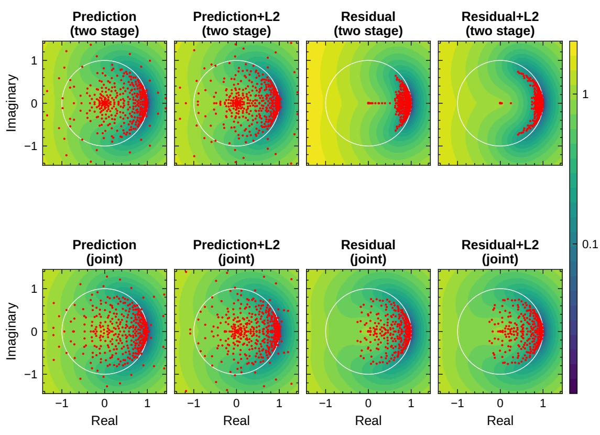  
Fig. S1: Minimal residuals $\widehat \tau _ { M , N } ^ { \mathrm { n u m } }$ and eigenvalues for eight model variants in Lorenz-63 at latent dimension $1 6 N _ { 0 }$ . Colors show, on a logarithmic scale, contours of the minimal residual computed over the retained numerical subspace, with the same color range across all panels. White curves mark the unit circle, and red points mark the estimated Koopman eigenvalues within the plotted range. The top row shows two-stage training, and the bottom row shows joint training. From left to right, the columns show Prediction (the latent-prediction model), Prediction+L2, Residual (the spectral-residual model), and Residual+L2; +L2 adds the operator-norm penalty

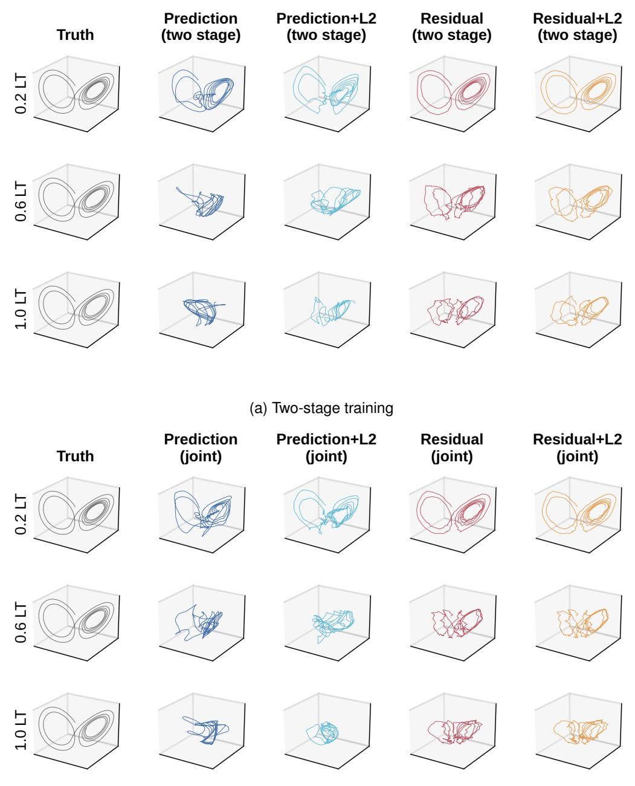  
(b) Joint training

Fig. S2: Predictions for Lorenz-63 at latent dimension $1 6 N _ { 0 }$ (top: two-stage training; bottom: joint training). The predictions are plotted in $( x , y , z )$ coordinates. From left to right, the columns show the reference trajectory, Prediction (the latent-prediction model), Prediction+L2, Residual (the spectral-residual model), and Residual+L2; +L2 adds the operator-norm penalty. Each row corresponds to one prediction horizon (0.2, 0.6, or 1.0 LT), and predictions are made that far ahead from diferent observation vectors in the reference trajectory. The prediction target times fall within the first 5 LT of the test trajectory. Axis limits follow the reference trajectory and are shared across all panels

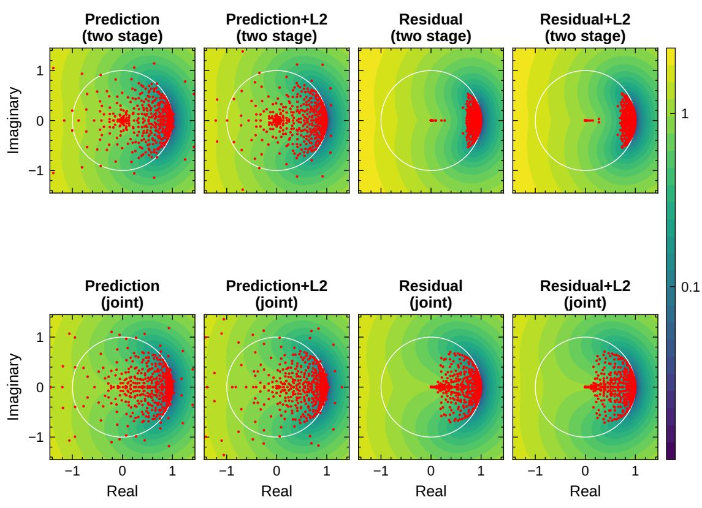  
Fig. S3: Minimal residuals $\widehat \tau _ { M , N } ^ { \mathrm { n u m } }$ and eigenvalues for eight model variants in Dufing at latent dimension $1 6 N _ { 0 } .$ . Colors show, on a logarithmic scale, contours of the minimal residual computed over the retained numerical subspace, with the same color range across all panels. White curves mark the unit circle, and red points mark the estimated Koopman eigenvalues within the plotted range. The top row shows two-stage training, and the bottom row shows joint training. From left to right, the columns show Prediction (the latent-prediction model), Prediction+L2, Residual (the spectral-residual model), and Residual+L2; +L2 adds the operator-norm penalty

## S2 Dufing system

Figures S3 and S4 show the spectral plots and predictions for Dufing. In the prediction figure, the spectral-residual model with two-stage training captures the overall shape of the reference attractor at the displayed prediction horizons up to 1.0 LT, and predictions from the same model with joint training have a noticeably smaller extent from 0.6 LT onward (Sect. 5 of the main text).

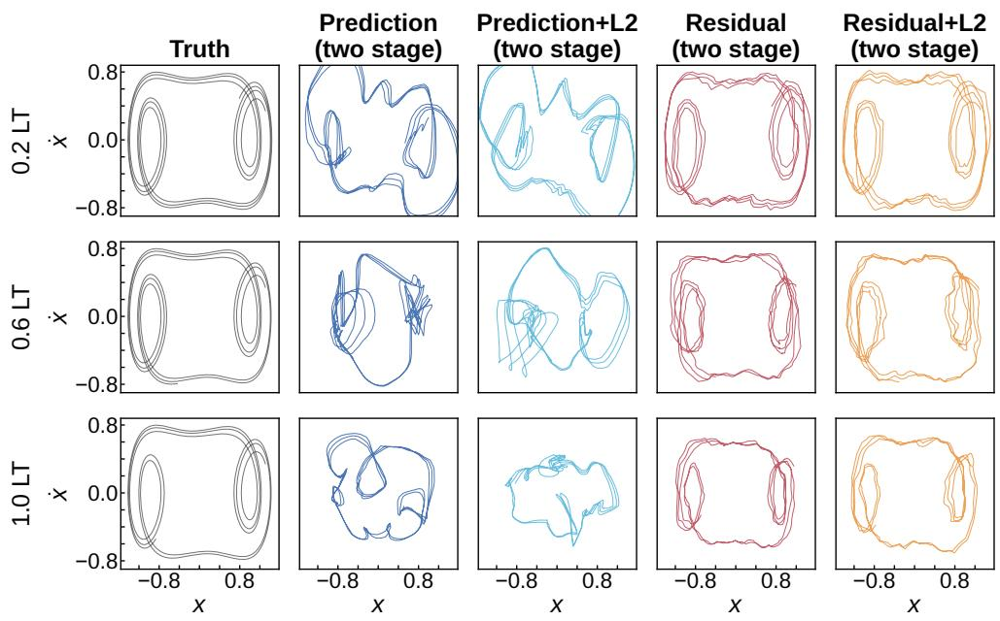

(a) Two-stage training  
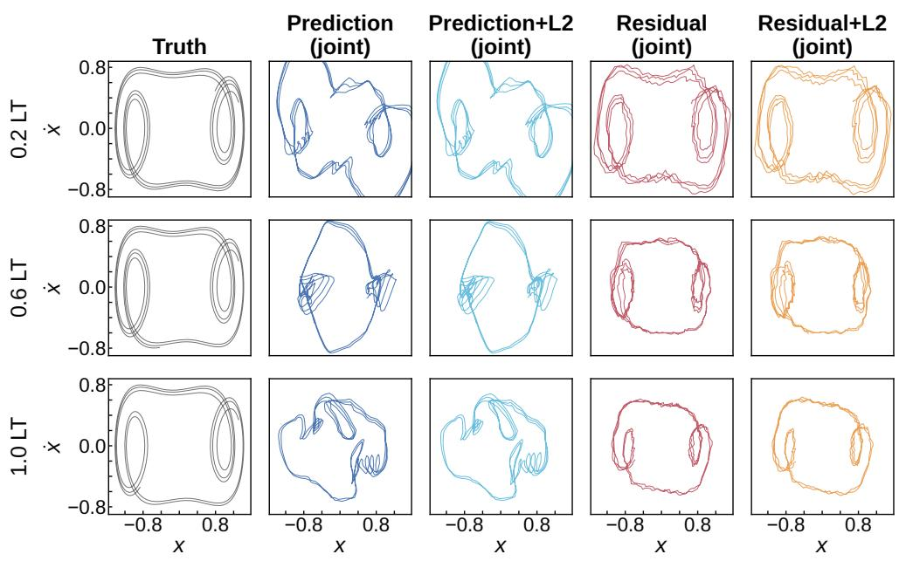  
(b) Joint training  
Fig. S4: Predictions for Dufing at latent dimension 16N (top: two-stage training; bottom: joint training). The predictions are plotted in the (x, x˙ ) plane. From left to right, the columns show the reference trajectory, Prediction (the latent-prediction model), Prediction+L2, Residual (the spectralresidual model), and Residual+L2; +L2 adds the operator-norm penalty. Each row corresponds to one prediction horizon (0.2, 0.6, or 1.0 LT), and predictions are made that far ahead from diferent observation vectors in the reference trajectory. The prediction target times fall within the first 5 LT of the test trajectory. Axis limits follow the reference trajectory and are shared across all panels

## S3 Mackey–Glass system

Figures S5 and S6 show the spectral plots and predictions for Mackey–Glass. In the spectral-residual panels for two-stage training, low-residual regions form a band along the unit circle.

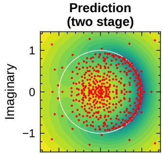  
Prediction+L2 (two stage)

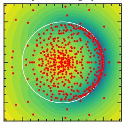  
Residual (two stage)

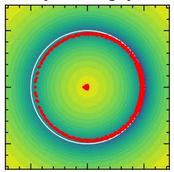  
Residual+L2 (two stage)

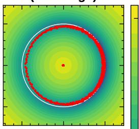

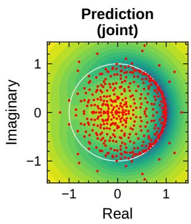

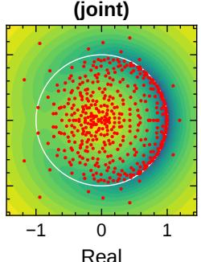

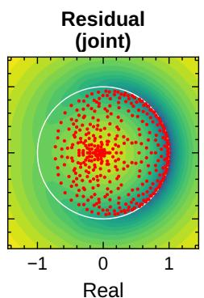

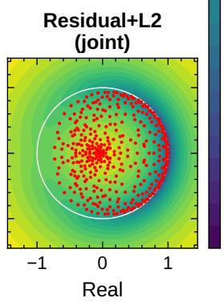  
Fig. S5: Minimal residuals $\widehat \tau _ { M , N } ^ { \mathrm { n u m } }$ and eigenvalues for eight model variants in Mackey–Glass at latent dimension $1 6 N _ { 0 } .$ Colors show, on a logarithmic scale, contours of the minimal residual computed over the retained numerical subspace, with the same color range across all panels. White curves mark the unit circle, and red points mark the estimated Koopman eigenvalues within the plotted range. The top row shows two-stage training, and the bottom row shows joint training. From left to right, the columns show Prediction (the latent-prediction model), Prediction+L2, Residual (the spectral-residual model), and Residual+L2; +L2 adds the operator-norm penalty

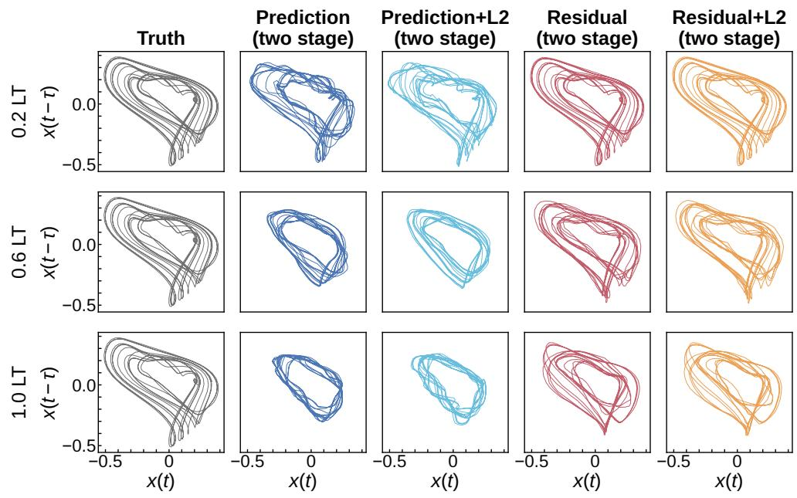

(a) Two-stage training  
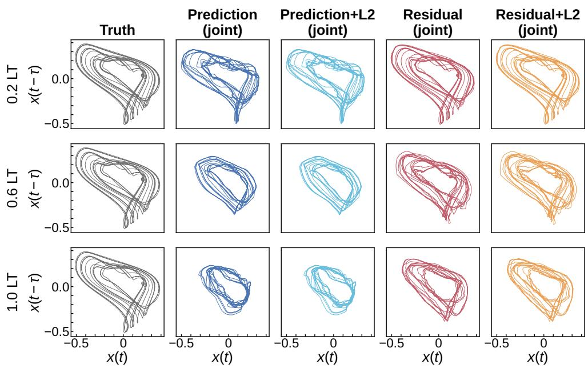  
(b) Joint training  
Fig. S6: Predictions for Mackey–Glass at latent dimension $1 6 N _ { 0 }$ (top: two-stage training; bottom: joint training). The predictions are plotted in the delay plane $( x ( t ) , x ( t - \tau ) )$ , with $\tau = 1 7$ in the time units of the governing equation. From left to right, the columns show the reference trajectory, Prediction (the latent-prediction model), Prediction+L2, Residual (the spectral-residual model), and Residual+L2; +L2 adds the operator-norm penalty. Each row corresponds to one prediction horizon (0.2, 0.6, or 1.0 LT), and predictions are made that far ahead from diferent observation vectors in the reference trajectory. The prediction target times fall within the first 5 LT of the test trajectory. Axis limits follow the reference trajectory and are shared across all panels

## S4 Lorenz-96 system

Figures S7 and S8 show the spectral plots and predictions for Lorenz-96. In the spectral plot, most estimated eigenvalues of the latent-prediction model in the Prediction column cluster in low-residual regions near $\lambda = 1$ under both two-stage and joint training (Sect. 5 of the main text), and more of them are scattered into high-residual regions under two-stage training. In the prediction figure, the striped structure of the field is distorted at 0.6 LT for all eight model variants. For Lorenz-96, increasing the latent dimension from $N _ { 0 }$ to $2 N _ { 0 }$ increased the mean valid prediction time (VPT) of the spectral-residual model under two-stage training from 0.198 to 0.211 LT, while median Variance-Scaled Root Mean Squared Error (VRMSE) increased from 0.9959 to 0.9980 (Sect. 4 of the main text).

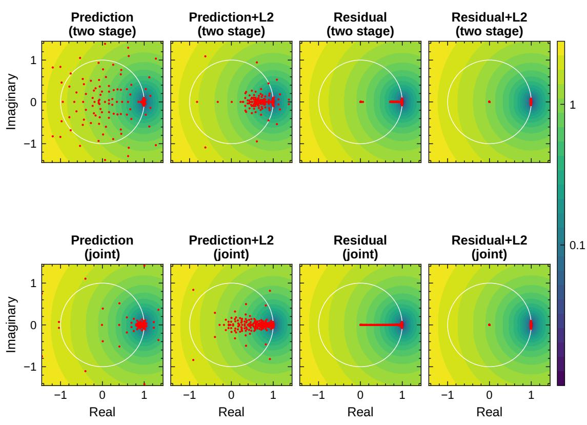  
Fig. S7: Minimal residuals $\widehat \tau _ { M , N } ^ { \mathrm { n u m } }$ and eigenvalues for eight model variants in Lorenz-96 at latent dimension $1 6 N _ { 0 } .$ Colors show, on a logarithmic scale, contours of the minimal residual computed over the retained numerical subspace, with the same color range across all panels. White curves mark the unit circle, and red points mark the estimated Koopman eigenvalues within the plotted range. The top row shows two-stage training, and the bottom row shows joint training. From left to right, the columns show Prediction (the latent-prediction model), Prediction+L2, Residual (the spectral-residual model), and Residual+L2; +L2 adds the operator-norm penalty

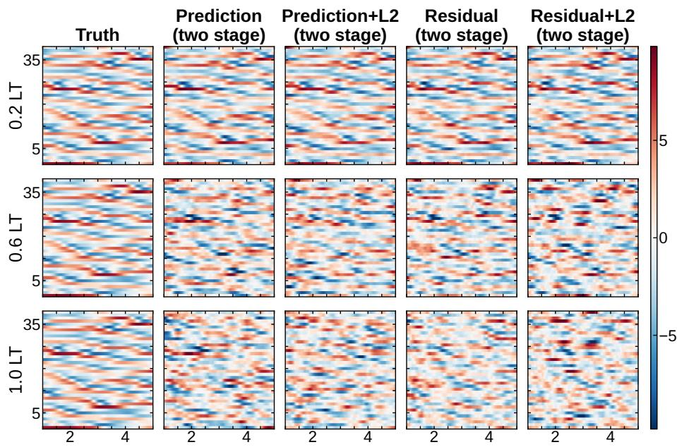

(a) Two-stage training  
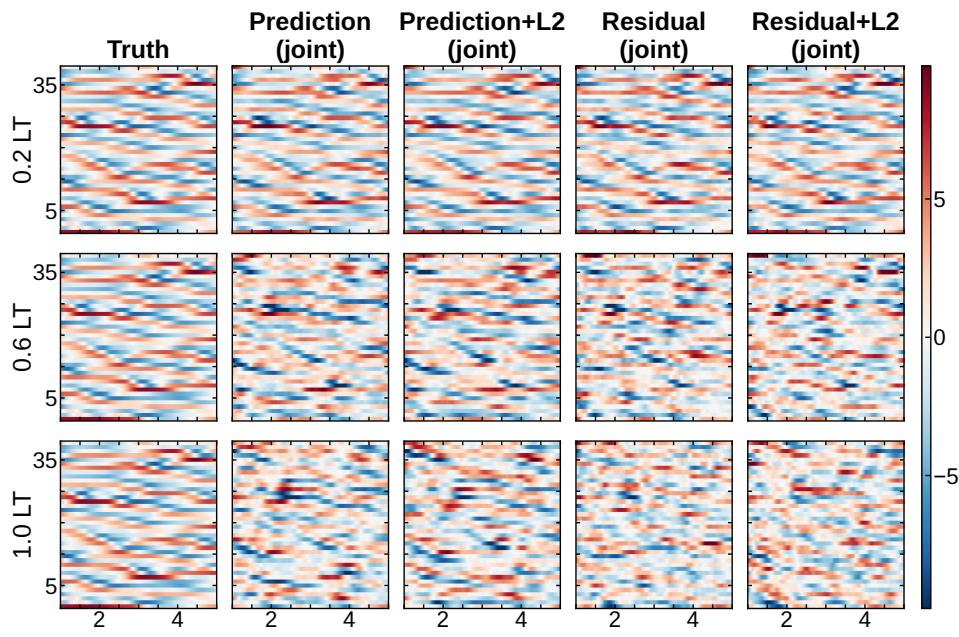  
(b) Joint training  
Fig. S8: Predictions for Lorenz-96 at latent dimension $1 6 N _ { 0 }$ (top: two-stage training; bottom: joint training). From left to right, the columns show the reference field, Prediction (the latent-prediction model), Prediction+L2, Residual (the spectral-residual model), and Residual+L2; +L2 adds the operator-norm penalty. Each row corresponds to one prediction horizon (0.2, 0.6, or 1.0 LT), and predictions are made that far ahead from diferent observation vectors in the reference trajectory. Horizontal axis: prediction target time in LT; vertical axis: component index 0–39; color: component value, with the same color range across all panels. Component indices 0–39 correspond, in order, to $x _ { 1 } , \ldots , x _ { 4 0 }$ in the main text

## S5 Kuramoto–Sivashinsky system

Figures S9 and S10 show the spectral plots and predictions for Kuramoto–Sivashinsky. In the prediction figure, the striped structure of the field is distorted at 0.6 LT for all eight model variants.

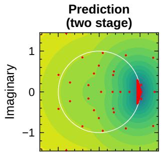  
Prediction+L2 (two stage)

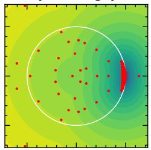  
Residual (two stage)

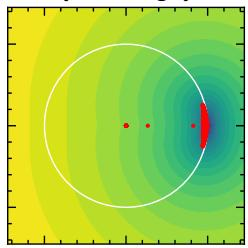  
Residual+L2 (two stage)

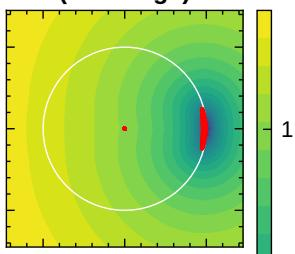

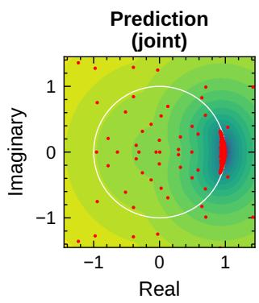

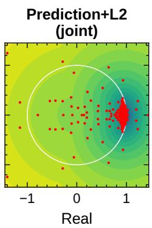

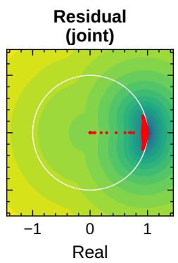

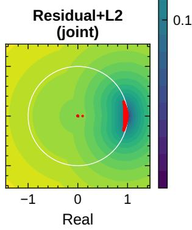  
Fig. S9: Minimal residuals $\widehat { \tau } _ { M , N } ^ { \mathrm { n u m } }$ and eigenvalues for eight model variants in Kuramoto–Sivashinsky at latent dimension $1 6 N _ { 0 } .$ . Colors show, on a logarithmic scale, contours of the minimal residual computed over the retained numerical subspace, with the same color range across all panels. White curves mark the unit circle, and red points mark the estimated Koopman eigenvalues within the plotted range. The top row shows two-stage training, and the bottom row shows joint training. From left to right, the columns show Prediction (the latent-prediction model), Prediction+L2, Residual (the spectral-residual model), and Residual $+ \mathrm { L 2 } ; + \mathrm { L 2 }$ adds the operator-norm penalty

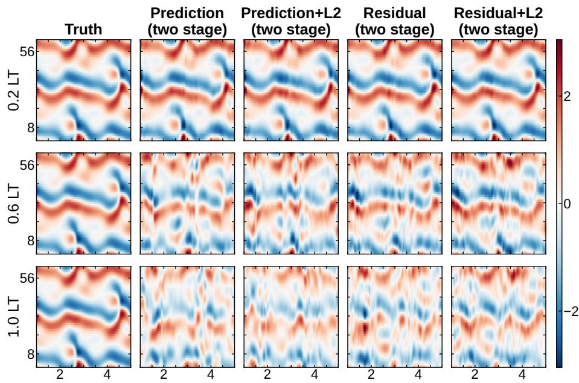

(a) Two-stage training  
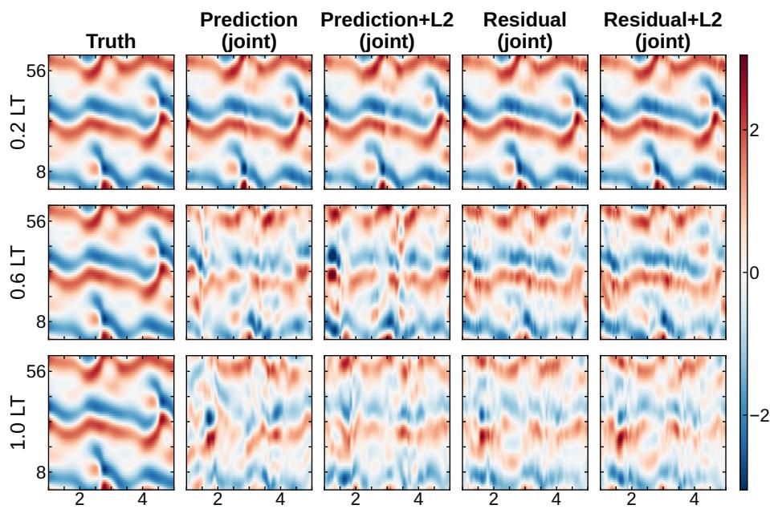  
(b) Joint training  
Fig. S10: Predictions for Kuramoto–Sivashinsky at latent dimension $1 6 N _ { 0 }$ (top: two-stage training; bottom: joint training). From left to right, the columns show the reference field, Prediction (the latent-prediction model), Prediction+L2, Residual (the spectral-residual model), and Residual+L2; +L2 adds the operator-norm penalty. Each row corresponds to one prediction horizon (0.2, 0.6, or 1.0 LT), and predictions are made that far ahead from diferent observation vectors in the reference trajectory. Horizontal axis: prediction target time in LT; vertical axis: spatial sample index 0–63 on a domain of length 22; color: field value, with the same color range across all panels