# Verification with Transfer: Exact Information Frontiers and Their Price in Calls

Hazar Yueksel

hazar@hazaryueksel.com

## Abstract

A verifier that accepts or rejects whole answers reveals little: under a flat prior over k-bit answers, zero error needs 2k − 1 verifications. The usual remedy is to solve related source tasks, either all first, as a curriculum does, or interleaved with verification. We price this remedy in information and in calls. With an exact verifier, the least causal information that any interleaving of source calls and n verifications needs to succeed with probability s is a list rate–distortion function, attained by one observation before any verification. It lower-bounds the expected number of binary source calls, which designed sources meet within 1 + log 5 calls for unique answers and within a logarithmic term in general, where no additive constant sufices. With an exact verifier and fixed sources, moving every call before the first verification preserves all hard caps on calls, although interleaving can save unboundedly many expected calls; under a noisy verifier, source-first protocols can lose unbounded factors in information and in error. For linear banks over F2, optimal accuracy has a closed form, and after a polynomial-time reduction the budget profile is computable in time $2 ^ { O ( h ^ { 2 } ) } \operatorname { p o l y } ( J , k + h )$ for J sources and nuisance dimension h. In these banks, for zero error under a hard cap, the calls beyond the rounded-up information price are exactly those spent on nuisance. Every numbered result apart from two clauses about the planner is machine-checked in Lean 4, assuming two published results. Used as a ruler, the frontier shows a small transformer using all delivered bits at latent dimension 5 and none at 11 within fixed training budgets; in a test with predictions recorded before training, low XOR degree of the target bits did not sufice for their use.

## 1 Introduction

A verifier that accepts or rejects a complete answer reveals little per call. A learner that has made n verifications succeeds only if it has tried the answer or can output it as a final guess, so its success probability is at most the prior mass of the n + 1 answers it could have covered (Proposition 1). For a k-bit answer with a flat prior, zero error takes 2k − 1 verifications. The same limit appears in exact learning with equivalence queries (Angluin, 1988), in guessing (Massey, 1994; Arikan, 1996), and in reinforcement learning from verifiable rewards, where a policy that has never been rewarded receives no gradient (Shao et al., 2024).

The usual remedy is transfer: related, easier source tasks whose answers exclude many target answers at once. Curricula and autocurricula exploit exactly this structure (Bengio et al., 2009; Rajaraman et al., 2026a). They also raise a scheduling question. Should a learner work through its source tasks first and only then turn to the target, as a curriculum does, or interleave, choosing each source in light of what the verifier has already said? We answer this and the questions around it, exactly for information and, with fixed sources, for hard caps. A learner has a latent world, a target verifier, and source tasks that reveal information about the world, and it may interleave source calls and verifications in any order. How much source information does it need to succeed with probability s within n verifications? How many source calls? When does putting all source calls first lose nothing? For a concrete family of banks, what does each call buy, and how is the best set of calls found?

The answers separate three regimes for source-first protocols, which make every source call before the first verification, as a curriculum does. Under exact verification they lose nothing in information when the sources can be designed, nothing in hard caps on calls when the sources are fixed, and, for unique answers, only a constant number of expected calls with designed sources. Against a given set of sources they can lose an unbounded number of expected calls, and more information. Under a noisy verifier they can lose unbounded factors in information and in error.

## Contributions.

• Information frontier (Section 2). The least causal auxiliary information over all interleaved protocols equals a list rate–distortion function, and one observation before any verification attains it (Theorem 2). The converse is a change of measure that keeps exact verifications in the reference law, so they cancel and are never charged; the dual is the classical rate–distortion dual in list-coverage coordinates.

• Call frontier (Section 2). Binary source calls cost at least this information in expectation. For unique answers the bound is tight to an additive constant at every success level $( 1 + \log _ { 2 } 5 ,$ and 2 at zero error), whereas for general acceptance sets the gap between chromatic and graph entropy makes the excess unbounded, though at most logarithmic (Theorem 4 and Proposition 5, Figure 2). Against a given set of sources, interleaving can save an unbounded number of expected calls, but for unique answers it saves only a constant over designed source-first protocols (Proposition 6). With fixed sources, moving every source call before the first verification preserves hard caps on calls (Theorem 7). Under a noisy verifier the converse survives and is exact on our instance, but source-first protocols can lose unbounded factors in information and in error (Proposition 8).

• Linear banks (Section 3). When the target and the sources are linear over $\mathbb { F } _ { 2 }$ and the prior is uniform, the optimal accuracy under any interleaving is min $\{ 1 , ( n + 1 ) 2 ^ { - k + \rho _ { b } } \}$ , where $\rho _ { b }$ is the number of target dimensions the best b sources resolve (Theorem 9). The profile $b \mapsto \rho _ { b }$ inverts a relative generalized Hamming weight hierarchy, and after a polynomial-time reduction a planner computes it for J sources in time $2 \overset { O ( h ^ { 2 } ) } { \operatorname { p o l y } } ( J , k + \mathbf { \bar { \phi } } _ { h } )$ in the nuisance dimension h (Theorem 10). For zero error under a hard cap, the calls a bank needs beyond the rounded-up information price are exactly the calls its optimal subset spends on nuisance (Corollary 11).

• A ruler for learned decoders (Section 4). On such banks we measure how much of the delivered information a small transformer turns into target probability, and what the rest costs in verifications.

Several ingredients are classical and credited where used (list-Fano and rate–distortion duals, guessing with side information, interactive change of measure, relative weight hierarchies; Section 5). What is new is the accounting when verification and transfer interleave: exact verifications are never charged, so the interleaved frontier equals the static one (Theorem 2); reordering is free under hard caps with fixed sources and an exact verifier, but not in expected calls or under noise (Theorem 7 and Propositions 6 and 8); and in a linear bank at zero error the calls beyond the rounded-up information price are exactly the nuisance an optimal subset pays for (Corollary 11). Every numbered result apart from two clauses about the planner is machinechecked in Lean 4; the scope is stated at the start of the appendix.

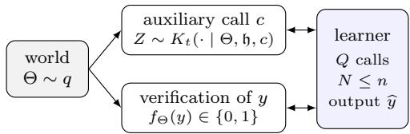  
Figure 1: Verification with transfer. Auxiliary calls reveal information about the world; a verification accepts or rejects a whole response, and an accepted response may be output. We price the auxiliary information $\boldsymbol { B } _ { \mathrm { a u x } }$ (defined in (3)) and the calls $Q$ needed to succeed with probability s within n verifications.

## 2 Verification with side information

Model. A latent world $\Theta \in [ M ]$ has a full-support prior q. A finite response set Y and known maps $f _ { \theta }$ $\mathcal { V }  \{ 0 , 1 \}$ define the target task. Every world has an acceptable response, and acceptance sets may overlap; unique answers means $\boldsymbol { \mathcal { V } } = [ M ]$ and $f _ { \theta } ( y ) = { \bf 1 } \{ \theta = y \}$ At each step the learner does one of three things. It verifies a response y and observes $f _ { \Theta } ( y )$ . It makes an auxiliary call c and observes $Z \sim K _ { t } ( \cdot \mid \Theta , \mathfrak { h } , c )$ , a finite-alphabet kernel that may depend on the whole history h. Or it stops and outputs $\widehat { y } \ \mathrm { ( F i g u r e \ 1 ) }$ . A request c is any label from a finite set and may encode the learner’s coins; the history records every request and reply. Actions depend on the history and a private seed ξ independent of $\Theta ; C _ { t }$ is the tth action and $H _ { t - 1 }$ the history before it. Every input correlated with Θ, including an informed source’s choice of what to reveal, enters through a charged auxiliary call. We write N for the number of verifications, $Q$ for the number of auxiliary calls, and $\operatorname { a c c } = f _ { \Theta } ( { \widehat { y } } )$ . The horizon is finite. Sources are designed when the learner may choose every kernel $K _ { t }$ , and fixed when the kernels are given in advance and do not depend on verifications (made precise before Theorem 7).

Verification difers from twenty questions because an accepted response is itself a valid output, so a learner without auxiliary calls is efectively a list. Let ${ \mathcal { L } } _ { n }$ be the lists of at most $n + 1$ responses, and let

$$
\begin{array} { r l } & { \quad c _ { \theta L } = \mathbf { 1 } \{ \exists y \in L : f _ { \theta } ( y ) = 1 \} , } \\ & { V _ { n } ( r ) = \displaystyle \operatorname* { m a x } _ { L \in \mathcal { L } _ { n } } \sum _ { \theta } r _ { \theta } c _ { \theta L } . } \end{array}\tag{1}
$$

Proposition 1 (Local benchmark). Without auxiliary calls, the best accuracy under $N \leq n$ with prior r is $V _ { n } ( r )$ , and every stopping rule has

$$
\mathbb { P } _ { r } ( \operatorname { a c c } = 1 , N \leq n ) \leq V _ { n } ( r ) .\tag{2}
$$

Fix the seed and follow the trajectory on which every verification is rejected. Succeeding within n verifications requires an accepted response on that trajectory or a correct final output, and these form a list of at most n+1 responses (Appendix A). For unique answers, $V _ { n }$ is the mass of the $n + 1$ most probable answers. In general it is weighted maximum coverage (Nemhauser et al., 1978).

Causal information. Let $\textstyle { \overline { { K } } } _ { t } ( z \mid \mathfrak { h } , c ) = \sum _ { \theta } P ( \theta \mid$ $\mathfrak { h } , c ) K _ { t } ( z \mid \theta , \mathfrak { h } , c )$ be the posterior-predictive kernel, and charge

$$
\begin{array} { r } { B _ { \mathrm { a u x } } = \sum _ { t } \mathbb { E } \big [ { \mathbf { 1 } } \{ C _ { t } \mathrm { a u x i l i a r y } \} \mathcal { D } _ { t } \big ] , } \end{array}\tag{3}
$$

$$
\mathcal { D } _ { t } = D _ { \mathrm { K L } } \big ( K _ { t } ( \cdot \mid \Theta , H _ { t - 1 } , C _ { t } ) \mid \mid \overline { { K } } _ { t } ( \cdot \mid H _ { t - 1 } , C _ { t } ) \big ) ,
$$

bits. This is the directed information from the world to the auxiliary observations, conditioned causally on everything else the learner has seen (Massey, 1990). It discounts whatever verifications and earlier calls already revealed.

## 2.1 The information frontier

With reproduction alphabet ${ \mathcal { L } } _ { n }$ and distortion $1 - c _ { \theta L }$ ， define the list-coverage rate–distortion function

$$
\begin{array} { r } { \mathcal { R } _ { n } ( q , s ) = \operatorname* { m i n } \big \{ I ( \Theta ; L ) : { L \sim W ( \cdot \mid \Theta ) } , \mathbb { E } c _ { \Theta L } \geq s \big \} . } \end{array}\tag{4}
$$

Write $h _ { 2 }$ for the binary entropy function, $\operatorname { k l } ( a \| b )$ for the binary relative entropy, and set $\operatorname { k l } _ { + } ( a \| b ) =$ $\mathrm { k l } ( a \| b ) \mathbf { 1 } \{ a > b \}$

Theorem 2 (Information frontier). The infimum of $\boldsymbol { B } _ { \mathrm { a u x } }$ over learners and auxiliary mechanisms with $N \leq$ n almost surely and $\mathbb { P } ( \operatorname { a c c } = 1 ) \geq s$ equals $\textstyle { \mathcal { R } } _ { n } ( q , s )$ . It is attained by a single auxiliary observation before any verification, and

$$
{ \mathcal { R } } _ { n } ( q , s ) = \operatorname* { s u p } _ { r : q \ll r } \big \{ \mathrm { k l } _ { + } \big ( s \| V _ { n } ( r ) \big ) - D _ { \mathrm { K L } } ( q \| r ) \big \} .\tag{5}
$$

Under an arbitrary stopping rule, $\begin{array} { r l r } { B _ { \mathrm { a u x } } } & { { } \ge } & { \ge } \end{array}$ $\mathcal { R } _ { n } { \big ( } q , \mathbb { P } ( \operatorname { a c c } = 1 , N \leq n ) { \big ) }$ .

Proof idea. Build a reference law $\widetilde { P }$ with prior $r _ { \mathrm { : } }$ the same learner and the same exact verifications, but with every auxiliary kernel replaced by its posterior predictive $\overline { { K } } _ { t }$ . Verification transitions are identical under the two laws, so they cancel from the likelihood ratio, and over complete histories

$$
D _ { \mathrm { K L } } ( P \Vert \widetilde { P } ) = D _ { \mathrm { K L } } ( q \Vert r ) + B _ { \mathrm { a u x } } .\tag{6}
$$

Under $\widetilde { P }$ every auxiliary observation can be simulated from the history, so Proposition 1 gives $\widetilde P ( \mathrm { a c c } = 1 , N \leq$ $n ) \leq V _ { n } ( r )$ , and data processing to that event, as in the fundamental inequality of Garivier et al. (2019), yields the following (Appendix B).

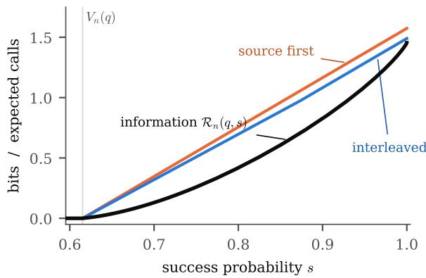  
Figure 2: Information and call frontiers for a $\mathrm { Z i p f }$ prior $q _ { i } \propto i ^ { - 1 . 2 }$ on $M = 8$ unique answers with $n = 1$ verification. Black: $\textstyle { \mathcal { R } } _ { n } ( q , s )$ . Blue and orange: the exact minimum expected number of binary calls over all interleaved and all source-first protocols with designed sources, computed by dynamic programming over candidate sets. They exceed the information price by at most 0.28 and 0.35 calls; Theorem 4(ii) guarantees less than $1 + \log _ { 2 } 5$

Lemma 3 (Selective-channel converse). For every protocol and every reference prior r with $q \ll r ,$

$$
\begin{array} { r } { \mathrm { k l } _ { + } \big ( \mathbb { P } ( \operatorname { a c c } = 1 , N \leq n ) \| V _ { n } ( r ) \big ) \leq D _ { \mathrm { K L } } ( q \| r ) + B _ { \mathrm { a u x } } . } \end{array}\tag{7}
$$

Optimizing r makes the bound exact: (5) is the rate–distortion dual of Csisz´ar (1974) written in the coordinates of a reference prior (Appendix C). For achievability, send an optimal list, verify all but its last entry, and output the last entry if none is accepted.

For unique answers, uniform q and $n + 1 < M$ , the frontier is the list-Fano value $\operatorname { k l } _ { + } ( s \parallel ( n + 1 ) / M )$ (Sakai, 2020), so each optimally placed bit halves the verification budget. For $q = ( 0 . 8 , 0 . 1 , 0 . 1 )$ and $n = 1$ , zero error costs $\mathcal { R } _ { n } ( q , 1 ) = 0 . 2$ bits: list answer 1 together with answer 2 or 3, each with probability $1 / 2$ (Corollary 12 in Appendix E); the value at $r = q$ is only $\log _ { 2 } ( 1 / 0 . 9 ) =$ 0.152. With overlapping acceptance sets, taking $r = q$ in (5) gives only the lower bound kl $\left( s \| V _ { n } ( q ) \right)$ , and the optimal r need not be uniform even when q is $( \mathrm { A p - }$ pendix E). The theorem prices an optimally designed source; a fixed source with the same mutual information can be far less useful (Appendix L): as in the comparison of experiments (Blackwell, 1953), no single number such as mutual information ranks sources for every task.

## 2.2 From information to calls

A learner pays for sources in calls. The next results convert the information price into calls.

Theorem 4 (Calls and information). Call sources binary when each auxiliary observation takes two values.

(i) Every protocol has $\begin{array} { r } { B _ { \mathrm { a u x } } \leq \operatorname { \mathbb { E } } \sum _ { t } \log _ { 2 } \left| \mathcal { Z } _ { t } \right| } \end{array}$ over its auxiliary observations. With exact verification and binary sources, any protocol with $N \leq n$ almost surely and $\mathbb { P } ( \operatorname { a c c } = 1 ) \geq s$ therefore makes $\mathbb { E } Q \geq$ $\textstyle { \mathcal { R } } _ { n } ( q , s )$ calls, whatever its source mechanisms or order.

(ii) For unique answers the bound is tight to an additive constant. For every s, designed binary sources that ignore target history, with no shared randomness, support a source-first protocol with $N \leq n , \mathbb { P } ( \operatorname { a c c } =$ 1) $\geq s$ , a bounded number of calls and

$$
\begin{array} { r l } & { \mathbb { E } Q < \mathcal { R } _ { n } ( q , s ) + 1 + h _ { 2 } ( s ) + 2 s } \\ & { \qquad \le \mathcal { R } _ { n } ( q , s ) + 1 + \log _ { 2 } 5 . } \end{array}
$$

At zero error, sources that are deterministic functions of the world give $\mathbb { E } Q < \mathcal { R } _ { n } ( q , 1 ) + 2$ , and no constant below 1 is possible.

Why the bounds hold. Part (i) holds because a binary observation carries at most one bit. For (ii) at zero error, the optimal list channel includes world θ with probability $a _ { \theta } = \operatorname* { m i n } \{ 1 , q _ { \theta } / \tau \}$ , where $\textstyle \sum _ { \theta } a _ { \theta } = n + 1$ (Corollary 12). Code lengths $\left\lceil \log _ { 2 } ( 1 / a _ { \theta } ) \right\rceil + 1$ satisfy a list version of the Kraft inequality once worlds are grouped $n + 1$ at a time in order of length. The sources can therefore reveal a prefix-free code for θ’s group, and the learner then verifies the group. For $s < 1$ , conditioning any list channel with coverage s on coverage shows $I ( \Theta ; L ) \geq s \mathcal { R } _ { n } ( q _ { 1 } , 1 ) - h _ { 2 } ( s )$ , where $q _ { 1 , \theta } \propto q _ { \theta } c _ { \theta }$ and $c _ { \theta }$ is the probability that θ is covered. One stochastic call that reports coverage, followed by the zero-error protocol for $q _ { 1 }$ , attains the bound (Appendix I).

For unique answers the list structure keeps the excess constant; for general acceptance sets it does not.

Proposition 5 (General acceptance sets). No constant sufices for general acceptance sets, for any n. Let $n = 0$ , let the responses be the independent sets of a graph G on [M], and let $f _ { \theta } ( I ) = { \bf 1 } \{ \theta \in I \}$ . Every zeroerror protocol with binary sources has $\mathbb { E } Q \ge H _ { \chi } ( G , q )$ ， the least entropy of a colouring of G, while $\textstyle { \mathcal { R } } _ { n } ( q , 1 )$ is the graph entropy $H _ { \mathrm { K } } ( G , q )$ of K¨orner (1973); their diference is unbounded. Pairing each world with an index that an accepted response must match extends the gap to every n. The excess is at most logarithmic: sources that are deterministic functions of the world and the request achieve $\begin{array} { r } { \mathbb { E } Q \leq \mathcal { R } _ { n } ( q , s ) + \log _ { 2 } ( \mathcal { R } _ { n } ( q , s ) + } \end{array}$ 1) + 5 for every s.

For $n = 0$ and unique answers, $\mathcal { R } _ { 0 } ( q , s )$ is Erokhin’s ϵ-entropy (Erokhin, 1958) $( \epsilon = 1 - s )$ , which governs variable-length compression with errors (Kostina et al., 2015). At zero error, $\textstyle { \mathcal { R } } _ { n } ( q , 1 )$ is a hypergraph entropy (Csisz´ar et al., 1990); for graphs the chromatic entropy is at least the graph entropy (Alon and Orlitsky, 1996) and can exceed it without bound (Cardinal et al., 2008, Prop. 2), which is Proposition 5. For general acceptance sets, the strong functional representation lemma (Li and El Gamal, 2018) writes an optimal list as a function of the world and an independent variable V with $H ( L \mid V ) \leq { \mathcal { R } } _ { n } + \log _ { 2 } ( { \mathcal { R } } _ { n } + 1 ) + 4$ , as in one-shot channel simulation (Harsha et al., 2010). Because V is independent of Θ, each value v gives a deterministic list map $g _ { v } . \mathrm { A t } s = 1$ the learner takes the v of positive probability that minimizes $H ( g _ { v } ( \Theta ) )$ ); for $s < 1$ , a mixture of two values, chosen by a coin the learner sends in its request, meets the coverage constraint. The sources then send a Hufman codeword of $g _ { v } ( \Theta )$ . At $n = 0$ and $s = 1$ the proof of Proposition 5 gives $H _ { \chi } \leq H _ { \mathrm { K } } + \log _ { 2 } ( H _ { \mathrm { K } } + 1 ) + 4$ for every graph, an existential analogue of the bound proved for greedy colourings of perfect graphs (Cardinal et al., 2010, 2012). The logarithmic order is attained: on the comparability graphs of the interval orders $I _ { k }$ of Cardinal et al. (2010), with M vertices and a uniform prior, $H _ { \chi } - H _ { \mathrm { K } } = \Omega ( \log \log M )$ , and $H _ { \mathrm { K } } \leq \log _ { 2 } M .$ , so the excess in Proposition 5 can be $\Omega ( \log H _ { \mathrm { K } } )$

Proposition 6 (What interleaving saves). Against a given set of sources, interleaving can save an unbounded number of expected calls, even with exact verification. For unique answers, $q = ( 1 - \epsilon , \epsilon / K , \dots , \epsilon / K ) , n = 1$ ， $s = 1$ and sources that return the $\log _ { 2 } K$ bits $( K \geq 4$ a power of two) of an index in which world 1 shares the index of world 2, an interleaved protocol makes $\epsilon \log _ { 2 } K$ expected calls and every source-first protocol at least $( 1 - \epsilon ) \log _ { 2 } K$ . Interleaving can also divide EQ by an unbounded factor: for $\boldsymbol { q } = \left( 1 - 2 p , p , p \right)$ with $0 < p \leq 1 / 4 , n = 1$ and $s = 1$ , an interleaved protocol makes $\mathbb { E } Q = 2 p = \mathcal { R } _ { n } ( q , 1 )$ calls, while every sourcefirst protocol makes $\mathbb { E } Q \geq 1$ . Against designed sources and unique answers, however, Theorem 4 bounds the saving by $1 + \log _ { 2 } 5 < 3 . 3 3$ calls, and by 2 at zero error.

Proposition 6 shows why the next theorem is stated for hard caps. Precisely, sources are fixed when each kernel may depend on the world and on earlier source requests and replies, but not on whether or how the target has been verified; the learner may still choose sources adaptively. Let $Z _ { \sigma }$ be the transcript of a sourceonly policy σ.

Theorem 7 (Source-first sufices for fixed sources). With exact verification and fixed sources, any interleaved protocol with $Q \leq b$ and $N \leq n$ can be replaced, with the same source mechanisms, by a source-first protocol: all its source calls, then all its verifications. The replacement has at least the same success probability and obeys the same caps, including a total cap

$Q + N \leq C$ . Hence

$$
\mathsf { A } _ { b , n } : = \operatorname* { s u p } \mathbb { P } ( \operatorname { a c c } = 1 ) = \operatorname* { s u p } _ { \sigma : Q \leq b } \mathbb { E } V _ { n } \big ( q ( \cdot \mid Z _ { \sigma } ) \big ) .\tag{8}
$$

The replacement simulates the learner with every verification rejected, makes its source calls, records its candidate responses and final output, and verifies that list afterwards. Coupling through the first true acceptance shows that nothing is lost (Appendix G). Equation (8) is sequential value of information with terminal utility $V _ { n }$ (Krause and Guestrin, 2009; Golovin and Krause, 2011). Exactness of verification cannot be dropped:

Proposition 8 (What survives a noisy verifier). Let a verification of y return a bit drawn from a binary-input kernel $G ( \cdot \mid f _ { \Theta } ( y ) )$ , independent of the history, and let $V _ { n } ^ { G } ( r )$ be the best value of $\displaystyle { \mathbb P } _ { r } ( \mathrm { a c c } = 1 , N \le n )$ without auxiliary information.

(i) The converse survives in two forms: $\operatorname { k l } _ { + } ( \mathbb { P } ( \operatorname { a c c } =$ 1, $N \leq n ) \| V _ { n } ^ { G } ( r ) \big ) \leq D _ { \mathrm { K L } } ( q \| r ) + B _ { \mathrm { a u x } } \ f o r$ every r with $q \ll r ,$ and, with $N \leq n$ almost surely and $\mathbb { P } ( \operatorname { a c c } = 1 ) \geq s , B _ { \operatorname { a u x } } \geq \mathcal { R } _ { 0 } ( q , s ) - n \operatorname { c a p } ( G )$ ， where cap(G) is the capacity of G.

(ii) Neither reduction survives. Source-first protocols can need an unbounded factor more information than interleaved ones: for one flipped query at zero error, 1 bit against $h _ { 2 } ( \epsilon )$ (Theorem 13). At equal call caps, take a uniform binary answer A, let the verifier flip its reply with probability ϵ, and let two fixed sources report $\mathbf { 1 } \{ A \neq r \}$ for $r = 0 , 1$ , each missing a true 1 with probability η. With one call and one verification, interleaving reaches error $\epsilon \eta ,$ while every source-first protocol has error at least min $\{ \eta / 2 , \epsilon ( 1 + \eta ) / 2 \}$ , which the best one attains. $A t \epsilon = \eta$ the ratio is $1 / ( 2 \eta )$ , so Theorem 7 fails.

The first form of (i) repeats the proof of (7) with the noisy kernel inside the reference law. Since a noisy verifier is a garbling of the exact one, $V _ { n } ^ { G } \leq V _ { n }$ , and Theorem 4(i) extends to it. The second form is the chain rule: the transcript carries at most $B _ { \mathrm { a u x } } + n \ \mathrm { c a p } ( G )$ bits about Θ, and the output alone must carry $\mathcal { R } _ { 0 } ( q , s )$ On the instance of Theorem 13 the first form is loose, while the second gives $h _ { 2 } ( \epsilon ) - h _ { 2 } ( \delta )$ at error δ, which is exactly the interleaved optimum (Appendix J). With exact verification the second form gives only $\mathcal { R } _ { 0 } ( q , s ) - n$ which is weaker than Theorem 2: an exact verification is worth more than its one bit of capacity, because an accepted response is itself the output. In part (ii) the interleaved protocol uses the noisy reply to choose which source to call, and one extra call closes the gap: calling both sources first also reaches ϵη.

## 3 Linear task banks

Rank law. Let W be uniform on $\mathbb { F } _ { 2 } ^ { d }$ , let the target be $A = T W$ for a known $k \times d$ matrix $T$ of rank k, and let a bank of J binary source tasks return $Z _ { j } = v _ { j } W$ . A source task is itself verifiable: one source call, verifying the candidate $0 ,$ reveals $Z _ { j }$ whether it is accepted or rejected. A target verification tests an entire k-bit vector. For a selected set S of sources with rows $B _ { S }$ the number of target dimensions it resolves is

$$
\rho ( S ) = k + \operatorname { r a n k } ( B _ { S } ) - \operatorname { r a n k } \left[ { \frac { T } { B _ { S } } } \right] = I ( A ; Z _ { S } ) ,\tag{9}
$$

and $\rho _ { b } = \operatorname* { m a x } _ { | S | \leq b } \rho ( S )$ . This is the equivocation identity of linear secret sharing (Kurihara et al., 2012): rows in $B _ { S }$ that do not reduce the target’s uncertainty only reveal nuisance directions of W.

Theorem 9 (Exact accuracy). For arbitrary adaptive interleaving,

$$
\mathsf { A } _ { b , n } = \operatorname* { m i n } \{ 1 , ( n + 1 ) 2 ^ { - k + \rho _ { b } } \} ,\tag{10}
$$

$$
\mathsf { A } _ { C } = \operatorname* { m a x } _ { 0 \leq b \leq \operatorname* { m i n } ( C , J ) } \operatorname* { m i n } \{ 1 , ( C - b + 1 ) 2 ^ { - k + \rho _ { b } } \} .\tag{11}
$$

A fixed maximizing subset followed by enumeration of the compatible targets attains both. Neither outcomeadaptive source selection nor adaptive budget allocation helps.

On every source-only leaf the posterior of $W$ is uniform on an afine fiber, so the target is uniform on $2 ^ { k - \rho ( S ) }$ vectors. Theorem $7$ and Proposition 1 finish the proof (Appendix H). We write $C ^ { \star }$ for the least total cap with $\mathsf { A } _ { C } = 1$ and $( b ^ { \star } , n ^ { \star } )$ for an optimal split of it. Target-only search needs $2 ^ { k } - 1$ verifications for zero error; a bank with $\rho _ { b } = b$ for $b \leq k$ needs only k source calls.

Computing the profile. Choosing a maximizing subset contains syndrome decoding, which is NPhard (Berlekamp et al., 1978), so with unbounded nuisance no algorithm polynomial in J is expected. The tractable parameter is the nuisance dimension. Let $\mathcal { T } = \mathrm { r o w } ( T ) , \mathcal { V } = \mathrm { s p a n } ( T , v _ { 1 } , \dots , v _ { J } )$ and $h \ =$ dim $\nu - k$ Let $\bar { v } _ { j }$ be the image of $v _ { j }$ in the $h -$ dimensional quotient $\nu / \tau$ . For a subspace $U$ of the quotient spanned by some of the $\bar { v } _ { j }$ , define

$$
\begin{array} { r l } & { \mathcal { E } ( U ) = \{ j : \bar { v } _ { j } \in U \} , } \\ & { \quad t ( U ) = \operatorname { r a n k } \{ v _ { j } : j \in \mathcal { E } ( U ) \} - \dim U . } \end{array}\tag{12}
$$

These are the sources whose nuisance content lies in $U _ { : }$ and the target rank they carry once U is paid for.

Theorem 10 (Quotient-subspace planner, QSP). For every source budget b, with $( x ) _ { + } = \operatorname* { m a x } \{ x , 0 \}$

$$
\rho _ { b } = \operatorname* { m a x } _ { U } \operatorname* { m i n } \{ t ( U ) , ( b - \dim U ) _ { + } \} .\tag{13}
$$

After a polynomial-time reduction, all budgets and maximizing subsets are computed in $\mathcal { N } _ { h } \operatorname { p o l y } ( J , k + h )$ field operations, where $\begin{array} { r } { \mathcal { N } _ { h } = \sum _ { u = 0 } ^ { h } \left[ \begin{array} { l } { h } \\ { u } \end{array} \right] _ { 2 } = 2 ^ { O ( h ^ { 2 } ) } } \end{array}$ counts the subspaces of $\mathbb { F } _ { 2 } ^ { h }$ .

A subset whose images span $U$ gains at most $t ( U )$ and at most |S| − dim U. Conversely, a basis of $U$ extended to a basis of the eligible rows realizes every gain up to $t ( U )$ with dim $U$ plus that many sources (Appendix M). The static profile is classical. Let $K _ { 0 } \subseteq K _ { 1 } \subseteq \mathbb { F } _ { 2 } ^ { J }$ be the kernels of the linear maps that send the jth unit vector to $v _ { j }$ and to $\bar { v } _ { j } ;$ ; then

$$
\rho ( S ) = \mathrm { d i m } ( K _ { 1 } \cap \mathbb { F } _ { 2 } ^ { S } ) - \mathrm { d i m } ( K _ { 0 } \cap \mathbb { F } _ { 2 } ^ { S } ) ,\tag{14}
$$

so min $\{ b : \rho _ { b } \ge t \}$ is the tth relative generalized Hamming weight of the pair (Luo et al., 2005; Kurihara et al., 2012; Zhuang et al., 2014). QSP enumerates the $2 ^ { O ( h ^ { 2 } ) }$ subspaces of the nuisance quotient instead of the $2 ^ { J }$ subsets of sources, which is enumeration on the small side of Forney’s duality (Forney, 1994) (Appendix N). General algorithms exist (San-Jos´e, 2025). For $k = 1$ , a breadth-first search over $\mathbb { F } _ { 2 } ^ { h + 1 }$ decides ρb in $2 ^ { h + 1 } J$ steps, so we do not claim that the exponent is optimal.

The call price of nuisance. Theorem 10 also says what nuisance costs in calls under a hard cap.

Corollary 11 (In a linear bank the call excess is nuisance). In a uniform linear bank, take zero error with n verifications, $n + 1 < 2 ^ { k }$ , and let $\kappa = \lceil k -$ $\log _ { 2 } ( n + 1 ) ] = \lceil \mathcal { R } _ { n } ( q , 1 ) \rceil$ . A hard source cap b sufices $i f$ and only $i f b \geq b _ { n }$ , where

$$
b _ { n } = \kappa + u ( \kappa ) , \qquad u ( \kappa ) = \operatorname* { m i n } \{ \dim U : \mathrm { ~ } t ( U ) \geq \kappa \} ,
$$

over the subspaces U ofTheorem $1 0 \left( b _ { n } = \infty i f \rho _ { J } < \kappa \right)$ The same $b _ { n }$ is the least expected number of calls of a source-first protocol. The excess over the rounded-up information price, $b _ { n } - \kappa = u ( \kappa ) \leq h _ { \astrosun }$ , is the number of calls an optimal subset spends on nuisance directions, and it vanishes exactly when an optimal subset resolves one new target dimension per call.

The proof combines (10), (13) and the list-Fano value (Appendix I). The subspace U is what the learner must pay for, one call per dimension, before the remaining calls resolve one target dimension each. Interleaved protocols can do better in expectation. With $k = 2$ two sources that reveal one target bit each, and $n = 2$ verifying two candidates first and calling a source only if both are rejected uses $\mathbb { E } Q = 1 / 2$ calls, against $b _ { n } = 1$

Learning the bank, and checks. A bank of rank $\ell \leq \ell _ { 0 }$ is recovered from $\ell _ { 0 } + \lceil \log _ { 2 } ( 1 / \delta ) \rceil$ ⌉ fully labelled contexts with probability $1 - \delta ,$ , after which $\mathrm { Q S P }$ plans optimally (Proposition 14; Helmbold et al., 1992). Exhaustive checks on small banks agree with QSP and with Corollary 11 (Appendices I and P). We also ran the unmodified generalized-Hamming-weight package GHWs of San-Jos´e (2025) on 27 banks under a 15- second cap: profiles agree wherever both finish, QSP finishes all 27 and GHWs 21, and GHWs is faster on high-nuisance banks and on the Reed–Muller code $\mathrm { R M } ( 2 , 4 )$ (Appendix Q). Heuristics do fall short of the optimum. On the 40 label-fitted banks of Appendix $\mathrm { Q } ,$ the best of all our source-aware baselines reaches accuracy 0.750 on the 16 independent and 0.875 on the 16 nuisance-clustered banks at the exact zero-error cap $C ^ { \star }$ , where QSP reaches one by definition, and matches QSP there on the eight coded variants; averaged over all budgets, its gaps on the first two groups are only 2.28 and 1.10 percentage points. On the $d = 1 1$ banks of Section 4, one-step greedy delivers 6.58 bits where the optimum is 7.00.

## 4 The frontier as a ruler

On a uniform linear bank the exact posterior after acquiring a set $S$ with replies z is uniform on the $2 ^ { k - \rho ( S ) }$ compatible targets. A trained network that receives the same labels induces its own distribution over the $2 ^ { k }$ targets, which we compute exactly by teacher forcing, and for a secret $W ^ { \star }$ with target $A ^ { \star } = T W ^ { \star }$ we measure

$$
\begin{array} { r } { \mathrm { b i t s ~ u s e d } = k + \log _ { 2 } \mathbb { E } P ( A ^ { \star } \mid \mathrm { a c q u i r e d } ) \phantom { x x x x x x x x x x x x x x x x x x x x x x x x x x x x x x x x x } } \\ { \leq k + \log _ { 2 } \mathbb { E } 2 ^ { \rho ( S ) - k } = \mathrm { b i t s ~ d e l i v e r e d } , } \end{array}\tag{15}
$$

with the expectation over the secret $W ^ { \star }$ and, when banks are pooled, over banks. The inequality holds because, given the labels, the true target’s expected probability under any predictor is at most $2 ^ { \rho - \bar { k } }$ ; with four secrets per bank an estimate can exceed it by sampling noise (2.01 against 2.00 on one bank). Unused bits cost verifications: sampling the policy until a verification accepts takes $\mathbb { E } [ 1 / { \cal P } ( \bar { A ^ { \star } } ) ] \ge 2 ^ { k - \mathrm { b } }$ its used samples, against $\mathbb { E } 2 ^ { k - \rho }$ for the exact posterior.

How much is used. The learner is a two-layer transformer (0.4M parameters) trained from scratch on sequences that list acquired (source, label) pairs followed by the k target bits; at test time the planner chooses which labels appear, one call each. We use latent dimensions $d = k + h \in \{ 5 , 6 , 7 , 8 , 1 1 \}$ with three random banks each and evaluate at the zero-error split $( b ^ { \star } , n ^ { \star } )$ of Section 3 (setup in Appendix T). At $d = 5$ the decoder is on the frontier: all 12 of 12 contexts are within 0.2 bit of their delivered $\rho ( S )$ (Figure 3). With the planner’s sources, the fraction used (pooled over banks) then falls to 84% at $d = 6$ , 49% at d = 7, 14% at $d = 8$ and 0% at $d = 1 1$ , although the signal is there to learn:

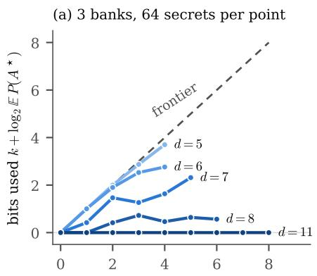  
bits delivered ½(S), planner profile

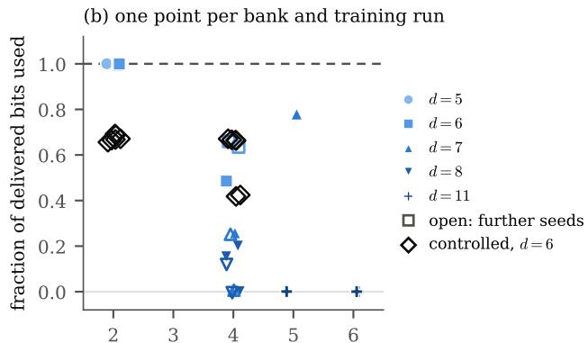  
largest XOR degree of a determined bit at b

Figure 3: The frontier as a ruler. (a) Bits a two-layer transformer uses against bits the planner’s sources deliver, pooled over three banks per latent dimension d and 64 secrets per point (the zero-error-split fractions in the text use four secrets per bank); the dashed line is the exact posterior. (b) Fraction of delivered bits used at the zero-error split, one point per bank and training run, against the largest XOR degree among the determined target bits (small horizontal jitter). Filled markers are the 15 banks of (a) with their first training seed, open markers the two further seeds of bank 0 at $d \in \{ 6 , 7 , 8 \}$ , and diamonds the degree-controlled banks a $( k , h , J ) = ( 4 , 2 , 1 2 )$ , selected and predicted before training.

the Bayes-optimal pretraining loss at d = 11 is 0.50 nats against ln 2 = 0.69 for a model that ignores the labels. Training seeds move single banks substantially (seed ranges on bank 0 in Appendix T), and none of 8 configurations at d = 8 (14 runs, widths 64–512, up to 20,000 steps) reached the frontier (Table 8). The unused bits have a price: at d = 8 the planner’s sources leave the learner 20.9 guesses against the exact posterior’s 1.8, so a better choice of sources helps only as far as the decoder can use it (Appendix T).

Which bits are used. Each determined target bit is the XOR of some acquired labels and earlier, teacherforced target bits; the fewest such terms is its degree. Across these 15 banks the decoder is on the frontier on exactly the five banks where every determined bit has degree at most two (Figure 3(b)), which suggests that degree decides use. A controlled test says otherwise. To separate degree from dimension, we fixed (k, h, J) = (4, 2, 12), chose three new banks of each kind from the bank alone, and recorded two predictions before training: (P1) the decoder uses at least 95% of the delivered bits on every low-degree bank and less on every high-degree bank; (P2) on every high-degree bank, the bits it uses are at most the number of determined bits of degree at most two, plus 0.5. Over two training seeds each, it used 66%–69% of the delivered bits on the low-degree banks and 42%–67% on the high-degree ones. Prediction P1 failed; P2 held on the controlled banks, but its bound fails on two of the 15 banks above, so at this budget degree neither guarantees nor bounds use (Appendix T). At four times the training budget three of the six controlled banks recover further bits. What the ruler adds to known parity failures (Barak et al., 2022; Bhattamishra et al., 2024) is a count of the unused delivered bits against an exact reference, and their price in verifications.

## 5 Related work

Verification, guessing and exact learning. A verifier that accepts whole answers is an equivalence-query oracle, and the target-only lower bound is the all-“no” adversary of exact learning (Angluin, 1988; Heged˝us, 1995). For unique answers, the target-only problem is guessing (Massey, 1994; Arikan, 1996). How much side information reduces guessing has been studied for a fixed helper, a compressed description, or a distortion criterion (Arikan and Merhav, 1998; Bunte and Lapidoth, 2014; Weinberger and Shayevitz, 2020; Graczyk et al., 2022). The static list rate–distortion function and its list-Fano special case are classical (Csisz´ar, 1974; Sakai, 2020). We add the interleaved, causal version: adaptivity buys nothing in information under exact verification (Theorem 2), and Theorems 4 and 7 and Propositions 5 and 6 say what it buys in calls.

Lower bounds with interaction and value of information. The converse is a change of measure (Kaufmann et al., 2016; Simchowitz et al., 2017; Garivier et al., 2019) of the interactive-Fano type (Chen et al., 2024). The diference is that exact verifications stay in the reference law, where they cancel and are never charged. Charging interaction by information rather than by messages follows information complexity (Braverman and Rao, 2014); the gap between the information price and the expected number of calls (Theorem 4 and Proposition 5) rests on the gap between graph and chromatic entropy in source coding with side information (Alon and Orlitsky, 1996), whose interactive version is studied by Orlitsky (1992). Noisy verification is a search game with lies (Pelc, 2002). In noisy twenty questions a non-adaptive policy is optimal for entropy loss (Jedynak et al., 2012), much as one upfront observation attains Theorem 2, whereas for error probability adaptive query selection matters (Naghshvar and Javidi, 2013), as interleaving does in Proposition 8. Equation (8) is sequential value of information (Krause and Guestrin, 2005, 2009; Golovin and Krause, 2011) with list coverage as the terminal utility.

Reinforcement learning from verifiable rewards. Recent theory studies coverage and sharpening (Chen et al., 2026; Huang et al., 2025), autocurricula (Rajaraman et al., $^ \mathrm { 2 0 2 6 a , b ) }$ , compositional structure (Barzilai et al., 2026), budgets (Wachi et al., 2026), the limits of outcome feedback (Chen et al., 2025), and the query complexity of generation with a verifier (Botta et al., 2025). Without sources, $V _ { n } ( q )$ is the best pass@(n + 1) (Chen et al., 2021; Brown et al., 2024) of any list of n + 1 answers. Those works analyse learning or generation across prompts; we price what source tasks deliver about a single instance.

Codes and parities. The profile ρb is a relative dimension/length profile (Wei, 1991; Forney, 1994; Luo et al., 2005; Kurihara et al., 2012; Zhuang et al., 2014), with a general solver (San-Jos´e, 2025). That delivered information need not be usable information is the premise of V-information (Xu et al., 2020). The ruler of Section 4 measures that gap against an exact reference and prices it in verifications.

## 6 Limitations and conclusion

The frontiers assume finite alphabets. Theorem 2 prices designed sources and Theorem 7 fixed ones. Reordering to source-first preserves hard caps, not expected calls, and it needs exact verification (Propositions 6 and 8); under noise we have converses, one of them exact on our instance, but no general frontier. Under hard caps the call frontier is exact for fixed sources, as the recursion (8), and in closed form for linear banks. In expectation it is tight to an additive constant for unique answers and to a logarithmic term in general, where the excess can be unbounded. The rank law, planner and learner assume uniform, noiseless linear banks, and the planner is eficient only for small nuisance dimension. The neural measurements use small transformers trained from scratch on synthetic banks, with three banks per dimension, few training seeds and fixed budgets of 6,000 pretraining steps (8,000 at $d = 1 1 )$ ); at 24,000 steps three of the six controlled banks recover further bits, so the fractions used depend on the budget. The degree analysis rests on few banks, and none of these measurements is a claim about pretrained language models.

What this means for curricula. With an exact verifier and sources whose replies do not depend on verification outcomes, all source calls can be scheduled first at no cost under any hard cap on calls (Theorem 7); interleaving can still save expected calls (Proposition 6) and information (Appendix G). With a noisy verifier, interleaving can reduce the error at equal call caps by an unbounded factor (Proposition 8), and the information needed for zero error by an unbounded factor (Theorem 13). The information price $\textstyle { \mathcal { R } } _ { n } ( q , s )$ lowerbounds the expected number of binary calls, and designed sources meet it within $1 + \log _ { 2 } 5$ calls for unique answers (Theorem 4); in a linear bank at zero error under a hard cap, the calls beyond the rounded-up price go to nuisance directions that the planner identifies (Corollary 11). Whether a learned decoder uses what the sources deliver is a separate question, which the ruler measures.

## AI Use Statement

In this work, we used generative AI tools for helping to develop the theoretical framework and to formulate mathematical claims, for providing ingredients for their proofs and drafting them, for proposing and refining hypotheses, designing experiments and giving feedback on the methodology, and for implementing the numerical methods and experiments and interpreting their results. We have not used generative AI tools to generate data sets or results: the synthetic task banks are generated by released code, and every reported number is computed by that code from logged runs. Translation, data-set cleaning and qualitative or thematic data analysis are not applicable to this work. Additionally, we used generative AI tools for literature search and checking the bibliography, for writing code, figures and the Lean formalization, and for drafting and editing the text. We have reviewed all AI-assisted work. We checked all AI-assisted proofs, code and descriptions of cited work, and the numbered results are also machinechecked in Lean 4, with the exceptions and the two assumed published results stated at the start of the appendix. We take responsibility for the final content of this work, including text, claims, or artifacts produced with the aid of generative AI.

## References

Emmanuel Abbe, Elisabetta Cornacchia, and Aryo Lotfi. Provable advantage of curriculum learning on parity targets with mixed inputs. In Advances in Neural Information Processing Systems, volume 36, pages 24291–24321, 2023. doi: 10.52202/075280- 1056.

Emmanuel Abbe, Samy Bengio, Aryo Lotfi, Colin Sandon, and Omid Saremi. How far can transformers reason? The globality barrier and inductive scratchpad. In Advances in Neural Information Processing Systems, volume 37, pages 27850–27895, 2024. doi: 10.52202/079017-0874.

Ekin Aky¨urek, Dale Schuurmans, Jacob Andreas, Tengyu Ma, and Denny Zhou. What learning algorithm is in-context learning? Investigations with linear models. In International Conference on Learning Representations, 2023. arXiv:2211.15661.

Zeyuan Allen-Zhu and Yuanzhi Li. Physics of language models: Part 3.2, knowledge manipulation. In International Conference on Learning Representations, 2025.

Noga Alon and Alon Orlitsky. Source coding and graph entropies. IEEE Transactions on Information Theory, 42(5):1329–1339, 1996. doi: 10.1109/18.532875.

Dana Angluin. Queries and concept learning. Machine Learning, 2(4):319–342, 1988. doi: 10.1023/A: 1022821128753.

Erdal Arikan. An inequality on guessing and its application to sequential decoding. IEEE Transactions on Information Theory, 42(1):99–105, 1996.

Erdal Arikan and Neri Merhav. Guessing subject to distortion. IEEE Transactions on Information Theory, 44(3):1041–1056, 1998. doi: 10.1109/18.669158.

Boaz Barak, Benjamin L. Edelman, Surbhi Goel, Sham Kakade, Eran Malach, and Cyril Zhang. Hidden progress in deep learning: SGD learns parities near the computational limit. In Advances in Neural Information Processing Systems, volume 35, 2022. arXiv:2207.08799.

Daniel Barzilai, Yotam Wolf, and Ronen Basri. When is compositional reasoning learnable from verifiable rewards? arXiv preprint arXiv:2602.07992, 2026.

Yoshua Bengio, J´erˆome Louradour, Ronan Collobert, and Jason Weston. Curriculum learning. In Proceedings of the 26th Annual International Conference on

Machine Learning, pages 41–48. ACM, 2009. doi: 10.1145/1553374.1553380.

Lukas Berglund, Meg Tong, Max Kaufmann, Mikita Balesni, Asa Cooper Stickland, Tomasz Korbak, and Owain Evans. The reversal curse: LLMs trained on “A is B” fail to learn “B is A”. In International Conference on Learning Representations, 2024.

Elwyn R. Berlekamp, Robert J. McEliece, and Henk C. A. van Tilborg. On the inherent intractability of certain coding problems. IEEE Transactions on Information Theory, 24(3):384–386, 1978. doi: 10. 1109/TIT.1978.1055873.

Satwik Bhattamishra, Arkil Patel, Phil Blunsom, and Varun Kanade. Understanding in-context learning in transformers and LLMs by learning to learn discrete functions. In International Conference on Learning Representations, 2024.

David Blackwell. Equivalent comparisons of experiments. The Annals of Mathematical Statistics, 24(2): 265–272, 1953. doi: 10.1214/aoms/1177729032.

Richard E. Blahut. Computation of channel capacity and rate-distortion functions. IEEE Transactions on Information Theory, 18(4):460–473, 1972. doi: 10.1109/TIT.1972.1054855.

Edoardo Botta, Yuchen Li, Aashay Mehta, Jordan T. Ash, Cyril Zhang, and Andrej Risteski. On the query complexity of verifier-assisted language generation. In Proceedings of the 42nd International Conference on Machine Learning, volume 267 of Proceedings of Machine Learning Research, pages 5124–5155. PMLR, 2025.

Mark Braverman and Anup Rao. Information equals amortized communication. IEEE Transactions on Information Theory, 60(10):6058–6069, 2014. doi: 10.1109/TIT.2014.2347282.

Bradley Brown, Jordan Juravsky, Ryan Ehrlich, Ronald Clark, Quoc V. Le, Christopher R´e, and Azalia Mirhoseini. Large language monkeys: Scaling inference compute with repeated sampling, 2024. arXiv:2407.21787.

Christoph Bunte and Amos Lapidoth. Encoding tasks and R´enyi entropy. IEEE Transactions on Information Theory, 60(9):5065–5076, 2014.

Jean Cardinal, Samuel Fiorini, and Gwena¨el Joret. Minimum entropy coloring. Journal of Combinatorial Optimization, 16(4):361–377, 2008. doi: 10.1007/ s10878-008-9152-2.

Jean Cardinal, Samuel Fiorini, Gwena¨el Joret, Rapha¨el M. Jungers, and J. Ian Munro. An eficient algorithm for partial order production. SIAM Journal on Computing, 39(7):2927–2940, 2010. doi: 10.1137/090759860.

Jean Cardinal, Samuel Fiorini, and Gwena¨el Joret. Minimum entropy combinatorial optimization problems. Theory of Computing Systems, 51(1):4–21, 2012. doi: 10.1007/s00224-011-9371-2.

Fan Chen, Dylan J. Foster, Yanjun Han, Jian Qian, Alexander Rakhlin, and Yunbei Xu. Assouad, Fano, and Le Cam with interaction: A unifying lower bound framework and characterization for bandit learnability. In Advances in Neural Information Processing Systems, volume 37, pages 75585–75641, 2024. doi: 10.52202/079017-2407.

Fan Chen, Zeyu Jia, Alexander Rakhlin, and Tengyang Xie. Outcome-based online reinforcement learning: Algorithms and fundamental limits. In Advances in Neural Information Processing Systems, volume 38, 2025.

Fan Chen, Audrey Huang, Noah Golowich, Sadhika Malladi, Adam Block, Jordan T. Ash, Akshay Krishnamurthy, and Dylan J. Foster. The coverage principle: How pre-training enables post-training. In International Conference on Learning Representations, 2026.

Mark Chen, Jerry Tworek, Heewoo Jun, Qiming Yuan, Henrique Ponde de Oliveira Pinto, Jared Kaplan, Harri Edwards, Yuri Burda, Nicholas Joseph, Greg Brockman, Alex Ray, Raul Puri, Gretchen Krueger, Michael Petrov, Heidy Khlaaf, Girish Sastry, Pamela Mishkin, Brooke Chan, Scott Gray, Nick Ryder, Mikhail Pavlov, Alethea Power, Lukasz Kaiser, Mohammad Bavarian, Clemens Winter, Philippe Tillet, Felipe Petroski Such, Dave Cummings, Matthias Plappert, Fotios Chantzis, Elizabeth Barnes, Ariel Herbert-Voss, William Hebgen Guss, Alex Nichol, Alex Paino, Nikolas Tezak, Jie Tang, Igor Babuschkin, Suchir Balaji, Shantanu Jain, William Saunders, Christopher Hesse, Andrew N. Carr, Jan Leike, Josh Achiam, Vedant Misra, Evan Morikawa, Alec Radford, Matthew Knight, Miles Brundage, Mira Murati, Katie Mayer, Peter Welinder, Bob McGrew, Dario Amodei, Sam McCandlish, Ilya Sutskever, and Wojciech Zaremba. Evaluating large language models trained on code, 2021. arXiv:2107.03374.

Xi Chen, Adityanand Guntuboyina, and Yuchen Zhang. On Bayes risk lower bounds. Journal of Machine Learning Research, 17(218):1–58, 2016.

Mung Chiang and Stephen Boyd. Geometric programming duals of channel capacity and rate distortion. IEEE Transactions on Information Theory, 50(2): 245–258, 2004. doi: 10.1109/TIT.2003.822581.

Tianzhe Chu, Yuexiang Zhai, Jihan Yang, Shengbang Tong, Saining Xie, Dale Schuurmans, Quoc V. Le, Sergey Levine, and Yi Ma. SFT memorizes, RL generalizes: A comparative study of foundation model post-training. In Proceedings of the 42nd International Conference on Machine Learning, volume 267 of Proceedings of Machine Learning Research, pages 10818–10838. PMLR, 2025.

Elisabetta Cornacchia and Elchanan Mossel. A mathematical model for curriculum learning for parities. In Proceedings of the 40th International Conference on Machine Learning, volume 202 of Proceedings of Machine Learning Research, pages 6402–6423. PMLR, 2023.

Imre Csisz´ar. On an extremum problem of information theory. Studia Scientiarum Mathematicarum Hungarica, 9:57–71, 1974.

Imre Csisz´ar, J´anos K¨orner, L´aszl´o Lov´asz, Katalin Marton, and G´abor Simonyi. Entropy splitting for antiblocking corners and perfect graphs. Combinatorica, 10(1):27–40, 1990. doi: 10.1007/BF02122693.

Yuval Dagan, Yuval Filmus, Ariel Gabizon, and Shay Moran. Twenty (simple) questions. In Proceedings of the 49th Annual ACM SIGACT Symposium on Theory of Computing, pages 9–21, 2017. doi: 10. 1145/3055399.3055422.

Leonardo de Moura and Sebastian Ullrich. The Lean 4 theorem prover and programming language. In Automated Deduction – CADE 28, volume 12699 of Lecture Notes in Computer Science, pages 625–635. Springer, 2021. doi: 10.1007/978-3-030-79876-5 37.

V. Erokhin. ε-entropy of a discrete random variable. Theory of Probability and Its Applications, 3(1):97– 100, 1958. doi: 10.1137/1103008.

Guhao Feng, Bohang Zhang, Yuntian Gu, Haotian Ye, Di He, and Liwei Wang. Towards revealing the mystery behind chain of thought: A theoretical perspective. In Advances in Neural Information Processing Systems, volume 36, 2023. arXiv:2305.15408.

G. D. Forney. Dimension/length profiles and trellis complexity of linear block codes. IEEE Transactions on Information Theory, 40(6):1741–1752, 1994. doi: 10.1109/18.340452.

Dylan J. Foster, Zakaria Mhammedi, and Dhruv Rohatgi. Is a good foundation necessary for eficient

reinforcement learning? The computational role of the base model in exploration. In Conference on Learning Theory, volume 291 of PMLR, pages 2026– 2142, 2025.

Jason Fulman and Larry Goldstein. Stein’s method and the rank distribution of random matrices over finite fields. The Annals of Probability, 43(3):1274–1314, 2015. doi: 10.1214/13-AOP889.

Shivam Garg, Dimitris Tsipras, Percy Liang, and Gregory Valiant. What can transformers learn incontext? A case study of simple function classes. In Advances in Neural Information Processing Systems, volume 35, 2022. arXiv:2208.01066.

Aur´elien Garivier, Pierre M´enard, and Gilles Stoltz. Explore first, exploit next: The true shape of regret in bandit problems. Mathematics of Operations Research, 44(2):377–399, 2019.

S´ebastien Gerchinovitz, Pierre M´enard, and Gilles Stoltz. Fano’s inequality for random variables. Statistical Science, 35(2):178–201, 2020. doi: 10.1214/19- STS716.

Daniel Golovin and Andreas Krause. Adaptive submodularity: Theory and applications in active learning and stochastic optimization. Journal of Artificial Intelligence Research, 42:427–486, 2011.

Robert Graczyk, Amos Lapidoth, Neri Merhav, and Christoph Pfister. Guessing based on compressed side information. IEEE Transactions on Information Theory, 68(7):4244–4256, 2022.

Steve Hanneke and Samory Kpotufe. On the value of target data in transfer learning. In Advances in Neural Information Processing Systems, volume 32, pages 9871–9881, 2019.

Prahladh Harsha, Rahul Jain, David A. McAllester, and Jaikumar Radhakrishnan. The communication complexity of correlation. IEEE Transactions on Information Theory, 56(1):438–449, 2010. doi: 10. 1109/TIT.2009.2034824.

Tibor Heged˝us. Generalized teaching dimensions and the query complexity of learning. In Proceedings of the Eighth Annual Conference on Computational Learning Theory, pages 108–117. ACM, 1995. doi: 10.1145/225298.225311.

D. P. Helmbold, R. Sloan, and M. K. Warmuth. Learning integer lattices. SIAM Journal on Computing, 21 (2):240–266, 1992. doi: 10.1137/0221019.

Audrey Huang, Adam Block, Dylan J. Foster, Dhruv Rohatgi, Cyril Zhang, Max Simchowitz, Jordan T.

Ash, and Akshay Krishnamurthy. Self-improvement in language models: The sharpening mechanism. In International Conference on Learning Representations, 2025.

Yu Huang, Zixin Wen, Yuejie Chi, Yuting Wei, Aarti Singh, Yingbin Liang, and Yuxin Chen. On the emergence of implicit curriculum in RLVR learning dynamics, 2026. arXiv:2602.14872.

Bruno Jedynak, Peter I. Frazier, and Raphael Sznitman. Twenty questions with noise: Bayes optimal policies for entropy loss. Journal of Applied Probability, 49 (1):114–136, 2012. doi: 10.1239/jap/1331216837.

Nirmit Joshi, Gal Vardi, Adam Block, Surbhi Goel, Zhiyuan Li, Theodor Misiakiewicz, and Nathan Srebro. A theory of learning with autoregressive chain of thought. In Proceedings of Thirty Eighth Conference on Learning Theory, volume 291 of Proceedings of Machine Learning Research, pages 3161–3212. PMLR, 2025.

Emilie Kaufmann, Olivier Capp´e, and Aur´elien Garivier. On the complexity of best-arm identification in multi-armed bandit models. Journal of Machine Learning Research, 17(1):1–42, 2016.

Juno Kim and Taiji Suzuki. Transformers provably solve parity eficiently with chain of thought. In International Conference on Learning Representations, 2025.

J´anos K¨orner. Coding of an information source having ambiguous alphabet and the entropy of graphs. In Transactions of the Sixth Prague Conference on Information Theory, Statistical Decision Functions, Random Processes, pages 411–425, Prague, 1973. Academia.

Victoria Kostina, Yury Polyanskiy, and Sergio Verd´u. Variable-length compression allowing errors. IEEE Transactions on Information Theory, 61(8):4316– 4330, 2015. doi: 10.1109/TIT.2015.2438831.

Andreas Krause and Carlos Guestrin. Near-optimal nonmyopic value of information in graphical models. In Proceedings of the Twenty-First Conference on Uncertainty in Artificial Intelligence, pages 324–331, 2005. arXiv:1207.1394.

Andreas Krause and Carlos Guestrin. Optimal value of information in graphical models. Journal of Artificial Intelligence Research, 35:557–591, 2009. doi: 10. 1613/jair.2737.

Jun Kurihara, Tomohiko Uyematsu, and Ryutaroh Matsumoto. Secret sharing schemes based on linear codes can be precisely characterized by the relative

generalized Hamming weight. IEICE Transactions on Fundamentals of Electronics, Communications and Computer Sciences, E95-A(11):2067–2075, 2012. doi: 10.1587/transfun.E95.A.2067.

Cheuk Ting Li and Abbas El Gamal. Strong functional representation lemma and applications to coding theorems. IEEE Transactions on Information Theory, 64(11):6967–6978, 2018. doi: 10.1109/TIT.2018. 2865570.

Zhiyuan Li, Hong Liu, Denny Zhou, and Tengyu Ma. Chain of thought empowers transformers to solve inherently serial problems. In International Conference on Learning Representations, 2024. arXiv:2402.12875.

Yuan Luo, Chaichana Mitrpant, A. J. Han Vinck, and Kefei Chen. Some new characters on the wiretap channel of type II. IEEE Transactions on Information Theory, 51(3):1222–1229, 2005. doi: 10.1109/TIT.2004.842763.

Eran Malach. Auto-regressive next-token predictors are universal learners. In Proceedings of the 41st International Conference on Machine Learning, volume 235 of Proceedings of Machine Learning Research, pages 34417–34431. PMLR, 2024.

James L. Massey. Causality, feedback and directed information. In Proceedings of the 1990 International Symposium on Information Theory and its Applications (ISITA-90), Waikiki, Hawaii, 1990.

James L. Massey. Guessing and entropy. In IEEE International Symposium on Information Theory, page 204, 1994.

William Merrill and Ashish Sabharwal. The expressive power of transformers with chain of thought. In International Conference on Learning Representations, 2024. arXiv:2310.07923.

Mohammad Naghshvar and Tara Javidi. Active sequential hypothesis testing. The Annals of Statistics, 41 (6):2703–2738, 2013. doi: 10.1214/13-AOS1144.

George L. Nemhauser, Laurence A. Wolsey, and Marshall L. Fisher. An analysis of approximations for maximizing submodular set functions—I. Mathematical Programming, 14:265–294, 1978. doi: 10.1007/ BF01588971.

Alon Orlitsky. Average-case interactive communication. IEEE Transactions on Information Theory, 38(5): 1534–1547, 1992. doi: 10.1109/18.149503.

Adam Paszke, Sam Gross, Francisco Massa, Adam Lerer, James Bradbury, Gregory Chanan, Trevor

Killeen, Zeming Lin, Natalia Gimelshein, Luca Antiga, Alban Desmaison, Andreas K¨opf, Edward Yang, Zachary DeVito, Martin Raison, Alykhan Tejani, Sasank Chilamkurthy, Benoit Steiner, Lu Fang, Junjie Bai, and Soumith Chintala. PyTorch: An imperative style, high-performance deep learning library. In Advances in Neural Information Processing Systems, volume 32, 2019.

Andrzej Pelc. Searching games with errors—fifty years of coping with liars. Theoretical Computer Science, 270(1–2):71–109, 2002. doi: 10.1016/S0304-3975(01) 00303-6.

Nived Rajaraman, Audrey Huang, Miro Dud´ık, Rob Schapire, Dylan Foster, and Akshay Krishnamurthy. Learning to reason with curriculum I: Provable benefits of autocurriculum. In Proceedings of Thirty Ninth Conference on Learning Theory, volume 336 of Proceedings of Machine Learning Research, pages 5518–5555. PMLR, 2026a.

Nived Rajaraman, Audrey Huang, Miroslav Dud´ık, Robert Schapire, Dylan Foster, and Akshay Krishnamurthy. Learning to reason with curriculum II: Compositional generalization, 2026b. arXiv:2606.27721.

Yuval Ran-Milo, Yotam Alexander, Shahar Mendel, and Nadav Cohen. Outcome-based RL provably leads transformers to reason, but only with the right data, 2026. arXiv:2601.15158.

Allan Ravent´os, Mansheej Paul, Feng Chen, and Surya Ganguli. Pretraining task diversity and the emergence of non-Bayesian in-context learning for regression. In Advances in Neural Information Processing Systems, volume 36, 2023. arXiv:2306.15063.

Shota Saito and Toshiyasu Matsushima. Nonasymptotic fundamental limits of guessing subject to distortion, 2018. arXiv:1808.06190.

Yuta Sakai. Generalizations of Fano’s inequality for conditional information measures via majorization theory. Entropy, 22(3):288, 2020. doi: 10.3390/ e22030288.

Rodrigo San-Jos´e. An algorithm for computing generalized Hamming weights and the Sage package GHWs. ACM Transactions on Mathematical Software, 51(4), 2025. doi: 10.1145/3773284. Preprint arXiv:2503.17764.

Zhihong Shao, Peiyi Wang, Qihao Zhu, Runxin Xu, Junxiao Song, Xiao Bi, Haowei Zhang, Mingchuan Zhang, Y. K. Li, Y. Wu, and Daya Guo. DeepSeek-Math: Pushing the limits of mathematical reasoning in open language models. arXiv preprint arXiv:2402.03300, 2024.

Idan Shenfeld, Jyothish Pari, and Pulkit Agrawal. RL’s razor: Why online reinforcement learning forgets less. In International Conference on Learning Representations (ICLR), 2026. arXiv:2509.04259.

Max Simchowitz, Kevin Jamieson, and Benjamin Recht. The simulator: Understanding adaptive sampling in the moderate-confidence regime. In Conference on Learning Theory, volume 65 of PMLR, pages 1794– 1834, 2017.

The mathlib Community. The Lean mathematical library. In Proceedings of the 9th ACM SIGPLAN International Conference on Certified Programs and Proofs, pages 367–381. ACM, 2020. doi: 10.1145/ 3372885.3373824.

The Sage Developers. SageMath, the Sage mathematics software system (Version 10.6). https: //www.sagemath.org, 2025.

Akifumi Wachi, Hirota Kinoshita, Shokichi Takakura, Rei Higuchi, and Taiji Suzuki. A relative-budget theory for reinforcement learning with verifiable rewards in large language model reasoning. arXiv preprint arXiv:2602.01523, 2026.

Zixuan Wang, Eshaan Nichani, Alberto Bietti, Alex Damian, Daniel Hsu, Jason D. Lee, and Denny Wu. Learning compositional functions with transformers from easy-to-hard data. In Proceedings of Thirty Eighth Conference on Learning Theory, volume 291 of Proceedings of Machine Learning Research, pages 5632–5711. PMLR, 2025.

V. K. Wei. Generalized Hamming weights for linear codes. IEEE Transactions on Information Theory, 37(5):1412–1418, 1991. doi: 10.1109/18.133259.

Nir Weinberger and Ofer Shayevitz. Guessing with a bit of help. Entropy, 22(1):39, 2020. doi: 10.3390/ e22010039.

Kaiyue Wen, Huaqing Zhang, Hongzhou Lin, and Jingzhao Zhang. From sparse dependence to sparse attention: Unveiling how chain-of-thought enhances transformer sample eficiency. In International Conference on Learning Representations, 2025.

Noam Wies, Yoav Levine, and Amnon Shashua. Subtask decomposition enables learning in sequence to sequence tasks. In International Conference on Learning Representations, 2023. arXiv:2204.02892.

Aolin Xu and Maxim Raginsky. Information-theoretic lower bounds on Bayes risk in decentralized estimation. IEEE Transactions on Information Theory, 63 (3):1580–1600, 2017. doi: 10.1109/TIT.2016.2646342.

Yilun Xu, Shengjia Zhao, Jiaming Song, Russell Stewart, and Stefano Ermon. A theory of usable information under computational constraints. In International Conference on Learning Representations, 2020.

Yang Yue, Zhiqi Chen, Rui Lu, Andrew Zhao, Zhaokai Wang, Yang Yue, Shiji Song, and Gao Huang. Does reinforcement learning really incentivize reasoning capacity in LLMs beyond the base model? In Advances in Neural Information Processing Systems, volume 38, 2025. doi: 10.52202/085713-1933.

Zhuojun Zhuang, Bin Dai, Yuan Luo, and A. J. Han Vinck. On the relative profiles of a linear code and a subcode. Designs, Codes and Cryptography, 72(2): 219–247, 2014. doi: 10.1007/s10623-012-9750-y.

Contents. Appendices A to L hold the proofs for Section 2 and for the rank law, in this order: local benchmark, selective-channel converse, dual, zero error, frontier illustrations, fixed sources, rank law, calls and Corollary 11, noisy verification, and what information quantity leaves out. Appendices M to O give the planner, its codingtheory form and learning the bank; Appendices $\mathrm { P }$ to R the planner experiments; Appendices S and T the neura experiments with the degree analysis and controls; Appendix U numerical methods; and Appendix V extended related work.

Where each result is proved. Proposition 1: Appendix A. Theorem 2: Appendices B and C. Lemma 3: Appendix B. Theorem 4, Propositions 5, 6 and 8, and Corollary 11: Appendix I. Theorem 7: Appendix G. Theorem 9: Appendix H. Theorem 10: Appendix M. Corollary 12: Appendix D (statement in Appendix E). Theorem 13: Appendix K (statement in Appendix J). Proposition 14: Appendix O.

Machine-checked results. All numbered results are formalized in Lean 4 (de Moura and Ullrich, 2021) with Mathlib (The mathlib Community, 2020) and checked by the Lean kernel (ancillary files, lean/; Paper.lean maps each statement to its Lean counterpart and records the modelling choices), except the algorithmic claim of Theorem 10 (correctness and running time of the enumeration) and the last clause of Proposition 14. Two published results (Cardinal et al., 2008; Li and El Gamal, 2018) are assumed as axioms, both used only for Proposition 5. Some formal proofs take a diferent route from the written ones. The numerical and empirica claims, and a few unnumbered remarks listed in the ancillary files, are not formalized.

## A Complete proof of the local benchmark

All alphabets and the protocol horizon are finite. A private seed may have any distribution independent of Θ; the arguments below first condition on that seed. Any history-only stochastic kernel can be realized from an independent uniform random variable. Include all such uniforms in a complete seed u. Thus, when a protocol has no informative auxiliary channel, fixing u makes every action deterministic in the past target replies.

Run this deterministic protocol with every target reply forced to zero, including at histories that are impossible for a particular world. The policy has an arbitrary fixed extension to such histories. Form $L _ { n } ( u )$ from the first n target queries on this silent trajectory, or all queries if it stops sooner. Include its final output only if it stops after at most n queries. If it has not stopped by its (n + 1)st query, no fallback is needed. Repeated responses are kept only once, so $| L _ { n } ( u ) | \leq n + 1$

For a real trajectory on which $\operatorname { a c c } = 1 , N \leq n$ , there are two possibilities. If a positive target reply occurs, the first such reply follows the same actions as the silent trajectory up to that time. Its acceptable queried response belongs to $L _ { n } ( u )$ . If no positive reply occurs, the entire real trajectory agrees with the silent trajectory through stopping, and its acceptable output is the included fallback. Consequently,

$$
\{ \theta : \operatorname { a c c } ( \theta , u ) = 1 , N ( \theta , u ) \leq n \} \subseteq \bigcup _ { y \in L _ { n } ( u ) } \{ \theta : f _ { \theta } ( y ) = 1 \} .
$$

The prior mass of this union is at most $V _ { n } ( r )$ . Average over the independent seed to prove (2). If the protocol obeys a hard cap, the same event is simply ac ${ \mathrm { c } } = 1$

For attainability, take a maximizing lis $L = \{ y _ { 1 } , . . . , y _ { k } \}$ with $k \leq n + 1$ . Query $y _ { 1 } , \ldots , y _ { k - 1 }$ until one receives reward one and then output that response. If none succeeds, output $y _ { k }$ . This succeeds precisely in worlds covered by L. Multiple acceptable responses and overlap between their acceptance sets cause no dificulty. Computationally, this is maximum coverage rather than arbitrary twenty-questions search: after a positive reply, the goal has already been achieved.

## B Complete selective-channel construction

Write the history as $( \xi , H _ { t - 1 } )$ , including all randomness belonging to the learner, and treat the learner’s action $C _ { t }$ as a deterministic function of it. A target-query transition returns $f _ { \Theta } ( y _ { t } ) ;$ ; a source transition has kernel $K _ { t } ( \cdot \mid \Theta , H _ { t - 1 } , C _ { t } )$ . Stop and padding transitions are deterministic. Any randomized final output is included in $\xi .$ Under P, the initial law is $q \otimes P _ { \xi }$ . Define $\overline { { K } } _ { t }$ by the $P$ posterior predictive at every positive- $P$ auxiliary history. At other histories choose any fixed probability distribution on the observation alphabet. Define $\widetilde { P }$ using initial law $r \otimes P _ { \xi }$ , the same action functions and target replies, and auxiliary kernels $\overline { { K } } _ { t }$

Absolute continuity. At any positive- $P$ atom $( \theta , u , \mathfrak { h } ) , q _ { \theta } > 0$ implies $r _ { \theta } > 0$ . At every auxiliary node on its path, the conditional posterior gives positive weight to θ. Thus an observation with $K _ { t } ( z \mid \theta , \mathfrak { h } , c ) > 0$ also has $\overline { { K } } _ { t } ( z \mid \mathfrak { h } , c ) > 0$ . Every positive-P terminal path has positive $\widetilde { P }$ probability. For general private seeds this statement holds for almost every $u ,$ and conditional integration gives the same result. The extension at null histories does not enter any P-expected divergence.

Likelihood ratio. Along such a path, private-seed probabilities and learner-action transitions cancel; target, stop, and padding transitions agree. Only the prior and source factors remain:

$$
\log _ { 2 } \frac { P ( \theta , u , \mathfrak { h } _ { T } ) } { \widetilde { P } ( \theta , u , \mathfrak { h } _ { T } ) } = \log _ { 2 } \frac { q _ { \theta } } { r _ { \theta } } + \sum _ { \substack { t : C _ { t } \mathrm { ~ a u x i l i a r y } } } \log _ { 2 } \frac { K _ { t } ( z _ { t } \mid \theta , \mathfrak { h } _ { t - 1 } , c _ { t } ) } { \overline { { K } } _ { t } ( z _ { t } \mid \mathfrak { h } _ { t - 1 } , c _ { t } ) } .\tag{16}
$$

Taking expectation gives (6). Target feedback may be informative under both laws, but it is not charged a second time: its conditional experiment is identical under the two laws.

Why the reference has no auxiliary information. At a fixed history, $\overline { { K } } _ { t }$ does not depend on the realized θ. It may be a table constructed from the true model P and the entire learner, but it can be simulated using only its history and independent random bits. It is therefore part of a target-only randomized protocol under initial prior r. Such a protocol need not have the same unconditional distribution of transcripts as the original one. Nor must it obey a cap that held only P-almost surely; this is precisely why Proposition 1 was stated for joint success–budget events.

Set $E _ { n } = \{ \operatorname { a c c } = 1 , N \leq n \} , a = P ( E _ { n } ) , b = \widetilde P ( E _ { n } )$ , and $c = V _ { n } ( r )$ . Data processing gives $\operatorname { k l } ( a \| b ) \leq$ $D _ { \mathrm { K L } } ( q \| r ) + B _ { \mathrm { a u x } } .$ , and Proposition 1 gives $b \leq c .$ . For $a > c ,$ binary KL decreases in its second argument below $^ { a , }$ so $\operatorname { k l } ( a \| c ) \leq \operatorname { k l } ( a \| b )$ . For $a \leq c ,$ the one-sided divergence is zero. Endpoint cases follow by absolute continuity and the usual extended-value conventions. This proves Lemma 3.

A useful consequence for unconstrained stopping is, for every fixed integer $n ,$

$$
\begin{array} { r } { P ( \mathrm { a c c } = 1 ) \le P ( N > n ) + \operatorname* { s u p } \{ s \in [ 0 , 1 ] : \mathcal { R } _ { n } ( q , s ) \le B _ { \mathrm { a u x } } \} . } \end{array}
$$

This is a tail decomposition, not an expectation of a fixed-budget frontier evaluated at $N$ . No independence of N from Θ is assumed.

## C Rate–distortion dual and exact operational reduction

This appendix proves (5) through the Gibbs variational form

$$
( \ln 2 ) \mathcal { R } _ { n } ( q , s ) = \operatorname* { s u p } _ { \beta \geq 0 } \Big \{ \beta s - \operatorname* { m a x } _ { \mu \in \Delta ( \mathcal { L } _ { n } ) } \sum _ { \theta } q _ { \theta } \ln \sum _ { L } \mu _ { L } e ^ { \beta c _ { \theta L } } \Big \} ,\tag{17}
$$

whose inner value is in $\displaystyle { \mathrm { f } _ { r > 0 } \{ D ( q \| r ) + \ln ( 1 + ( e ^ { \beta } - 1 ) V _ { n } ( r ) ) \} }$ ; the binary log-moment dual then yields (5). The result is the classical rate–distortion dual (Csisz´ar, 1974) in the coordinates of a reference prior; we include a self-contained finite-alphabet derivation because the list-coverage distortion and the reference-prior form are what the protocol theorem uses. Only in this appendix use natural logarithms, with D and I in nats; write $R ^ { \mathrm { n a t } } ( s ) = ( \ln 2 ) \mathcal { R } _ { n } ( q , s )$ . The source prior has full support, and the union of covered worlds is all of [M]. The finite channel space is compact, mutual information is continuous there, and the success constraint is closed. Thus the minimum is attained for every $s \in [ 0 , 1 ]$

## C.1 The finite-alphabet Gibbs formula

For a channel W and any list distribution $\mu ,$

$$
\sum _ { \theta } q _ { \theta } D ( W ( \cdot \mid \theta ) \| \mu ) = I _ { q } ( \Theta ; L ) + D ( q W \| \mu ) .\tag{18}
$$

It follows that $I _ { q } ( \Theta ; L )$ is the minimum of the left side over $\mu ,$ attained at $\mu = q W$ . The Lagrange multiplier for $\mathbb { E } c _ { \Theta L } \ge s$ is $\beta \geq 0$ . For any fixed $\mu _ { ; }$

$$
\operatorname* { m i n } _ { W ( \cdot | \theta ) } \left[ D ( W ( \cdot \mid \theta ) \| \mu ) - \beta \sum _ { L } W ( L \mid \theta ) c _ { \theta L } \right] = - \ln \sum _ { L } \mu _ { L } e ^ { \beta c _ { \theta L } } .
$$

Indeed, the bracket equals divergence to the normalized Gibbs distribution $\mu _ { L } e ^ { \beta c _ { \theta L } } / Z _ { \theta }$ minus ln $Z _ { \theta }$ . The minimizations over $W$ and $\mu$ are over a product space and may be exchanged. Convex duality for the finite channel problem therefore gives (17) for $s < 1$ , where a strictly better-than-s success channel exists. For $s \leq V _ { n } ( q )$ a constant maximizing list has zero information, and the same formula has value zero.

For $s = 1$ , choose $s _ { j } \uparrow 1$ and corresponding minimizing channels. A convergent subsequence has success one and, by continui ${ \mathrm { , y , } }$ information equal to the limit of their costs. Monotonicity then gives $R ^ { \mathrm { n a t } } ( s _ { j } ) \uparrow R ^ { \mathrm { n a t } } ( 1 )$ Taking increasing limits in the dual establishes the endpoint formula without assuming a finite optimal multiplier.

## C.2 Optimizing the reference prior

Fix $\beta \geq 0$ and put $\begin{array} { r } { E _ { \theta L } = e ^ { \beta c _ { \theta L } } , Z _ { \theta } = \sum _ { L } \mu _ { L } E _ { \theta L } } \end{array}$ , and $\begin{array} { r } { F _ { \beta } ( { \boldsymbol { \mu } } ) = \sum _ { \theta } } \end{array}$ qθ ln $Z _ { \theta }$ . For any strictly positive prior $r ,$ Jensen gives

$$
F _ { \beta } ( \mu ) = D ( q \| r ) + \sum _ { \theta } q _ { \theta } \ln { \frac { r _ { \theta } Z _ { \theta } } { q _ { \theta } } }\tag{19}
$$

$$
\leq D ( q \| r ) + \ln \sum _ { \theta } r _ { \theta } Z _ { \theta }\tag{20}
$$

$$
\leq D ( q \| r ) + \ln \operatorname* { m a x } _ { L } \sum _ { \theta } r _ { \theta } E _ { \theta L }\tag{21}
$$

$$
= D ( q \| r ) + \ln \big ( 1 + ( e ^ { \beta } - 1 ) V _ { n } ( r ) \big ) .\tag{22}
$$

We next show that this upper bound is attained, establishing the identity

$$
\operatorname* { m a x } _ { \mu } F _ { \beta } ( \mu ) = \operatorname* { i n f } _ { r > 0 } \{ D ( q \| r ) + \ln ( 1 + ( e ^ { \beta } - 1 ) V _ { n } ( r ) ) \} .\tag{23}
$$

Let $\mu ^ { * }$ maximize the smooth concave function $F _ { \beta }$ over the simplex. Its gradient is

$$
g _ { L } = \sum _ { \theta } { \frac { q _ { \theta } E _ { \theta L } } { Z _ { \theta } } } .
$$

The simplex first-order condition gives $g _ { L } \leq \lambda ,$ , with equality on the support of $\mu ^ { * }$ . Since $\begin{array} { r } { \sum _ { L } \mu _ { L } ^ { * } g _ { L } = \sum _ { \theta } q _ { \theta } = 1 } \end{array}$ $\lambda = 1$ and max $_ { \cdot } { } _ { L } g _ { L } = 1$ . Define

$$
C _ { 0 } = \sum _ { \theta } q _ { \theta } / Z _ { \theta } , \qquad r _ { \theta } ^ { * } = \frac { q _ { \theta } } { C _ { 0 } Z _ { \theta } } .
$$

Then

$$
D ( q \| r ^ { * } ) = F _ { \beta } ( \mu ^ { * } ) + \ln C _ { 0 } , \qquad \operatorname* { m a x } _ { L } \sum _ { \theta } r _ { \theta } ^ { * } E _ { \theta L } = 1 / C _ { 0 } .
$$

Their sum is $F _ { \beta } ( \mu ^ { * } )$ , proving equality in (23). Positivity of $E$ makes $Z$ and $r ^ { * }$ strictly positive. No minimax interchange between nonconvex feasible sets is used in this step.

Substitute (23) into (17). The two suprema may be exchanged:

$$
\begin{array} { l } { { \displaystyle R ^ { \mathrm { n a t } } ( s ) = \operatorname* { s u p } _ { r > 0 } \left[ - D ( q \| r ) + \operatorname* { s u p } _ { \beta \geq 0 } \{ \beta s - \ln ( 1 + ( e ^ { \beta } - 1 ) V _ { n } ( r ) ) \} \right] } } \\ { { \displaystyle \quad = \operatorname* { s u p } _ { r > 0 } \{ \mathrm { k l } _ { \mathrm { n a t } , + } ( s \| V _ { n } ( r ) ) - D ( q \| r ) \} . } } \end{array}\tag{24}
$$

(25)

For $0 < c < 1$ , the inner supremum is attained at $\beta = 0 { \mathrm { ~ i f ~ } } s \leq c ,$ and otherwise at $\beta = \ln [ s ( 1 - c ) / ( c ( 1 - s ) ) ]$ with its limiting interpretation at $s = 1$ . Its value is the one-sided binary KL. This proves (5) after division by ln 2. Values $V _ { n } ( r ) = 1$ yield zero; impossible-support endpoints follow by limits.

## C.3 From the dual to the protocol theorem

For any protocol, Lemma 3 holds for every r. Taking the supremum over r gives $B _ { \mathrm { a u x } } \geq \mathcal { R } _ { n } ( q , P ( \operatorname { a c c } = 1 , N \leq n ) )$ .   
Under a hard cap, this is at least $\textstyle { \mathcal { R } } _ { n } ( q , s )$ whenever accuracy is at least $s ,$ since $\mathcal { R } _ { n }$ is nondecreasing.

Conversely, take a minimizing $W ( L \mid \Theta )$ in (4). The auxiliary observation is the list L itself, at the initial history. Its information charge is $I ( \Theta ; L )$ . The target-only list strategy of Appendix A succeeds exactly when the list covers $\Theta ,$ uses at most n queries, and has success at least s. This constructs a finite upfront protoco attaining the converse for every finite prior and acceptance geometry. Initial randomization to choose list order carries no target information.

## D Zero error, list allocation, and uniform sharpness

This appendix proves Corollary 12 and (28), both stated in Appendix E.

## D.1 Coverage-polytope entropy

At zero error, any feasible list channel satisfies $W ( L \mid \theta ) = 0$ whenever $c _ { \theta L } = 0$ . For a proposed list distribution $\mu ,$ let $\begin{array} { r } { a _ { \theta } = \sum _ { L } \mu _ { L } c _ { \theta L } } \end{array}$ . On the support of a zero-error W,

$$
D ( W ( \cdot \mid \theta ) \| \mu ) = D \bigg ( W ( \cdot \mid \theta ) \bigg | \bigg | { \frac { \mu _ { L } c _ { \theta L } } { a _ { \theta } } } \bigg ) + \log _ { 2 } ( 1 / a _ { \theta } ) .
$$

Use (18) at $\mu = q W$ to obtain a lower bound by the right-hand side of (26). Every feasible a is a convex combination of coverage vectors.

For equality, minimize $- \sum q _ { \theta }$ ln $a _ { \theta }$ over $a = C \mu$ . A finite optimizer exists with every $a _ { \theta } > 0$ , since a uniform mixture of all lists covers every world with positive probability. For an optimal $\mu ,$ the first-order conditions for maximizing $\sum q _ { \theta }$ ln aθ give

$$
g _ { L } = \sum _ { \theta } q _ { \theta } c _ { \theta L } / a _ { \theta } \leq 1 , \qquad g _ { L } = 1 \quad \mathrm { i f ~ } \mu _ { L } > 0 .
$$

Set $W ( L \mid \theta ) = \mu _ { L } c _ { \theta L } / a _ { \theta }$ . Its rows sum to one; its marginal is $\mu _ { L } g _ { L } = \mu _ { L } ;$ and its information is exactly $\sum q _ { \theta } \log _ { 2 } ( 1 / a _ { \theta } )$ . This proves (26) and provides the attaining channel. The static convex-corner formula is classical; its interpretation as the exact causal price follows from Theorem 2.

## D.2 Unique answers

For lists of size $\ell < M$ , the coverage polytope of maximal-size lists is $\begin{array} { r } { \{ a \in [ 0 , 1 ] ^ { M } : \sum _ { i } a _ { i } = \ell \} } \end{array}$ . To see this, every indicator list lies in that polytope; conversely any nonintegral point has at least two fractional coordinates and can be perturbed in opposite directions while preserving their sum, so cannot be an extreme point. The extreme points are precisely the indicator lists. Smaller lists are dominated by extensions and cannot improve the decreasing objective.

The optimizer has $a _ { i } > 0$ because $q _ { i } > 0$ . The KKT equations for minimizing $- \sum _ { i } q _ { i }$ ln $a _ { i }$ with the sum and upper-bound constraints give $a _ { i } = q _ { i } / \tau$ at unsaturated coordinates and $a _ { i } = 1$ at saturated ones. Hence (27). The function $\textstyle \sum _ { i }$ min $( 1 , q _ { i } / \tau )$ decreases continuously from M to zero and identifies the needed τ when $\ell < M$ For $q = ( 0 . 8 , 0 . 1 , 0 . 1 ) , \ell = 2$ , take the two lists {1, 2} and {1, 3} with equal marginal probability. Conditional on $A = 1$ choose either equally; conditional on $A = 2 { \mathrm { ~ o r ~ } } 3$ , choose its corresponding list. The cost is $0 . 8 \cdot 0 + 0 . 2 \cdot 1 =$ 0.2 bits. An alternative interleaved protocol queries answer one first, and only after failure receives the bit distinguishing answers two and three. It also costs 0.2 causal bits. The upfront message still has one raw bit of entropy: mutual information and message length are distinct resources.

## D.3 Uniform finite-error frontier

For q uniform, $\ell = n + 1 < M .$ and $s \geq \ell / M$ , choose a size-ℓ subset L uniformly, and define the posterior of A to be $s / \ell$ on L and $( 1 - s ) / ( M - \ell )$ of $L .$ Symmetry makes the marginal of A uniform. The equivalent conditional channel chooses L given the already sampled A. Then

$$
I ( A ; L ) = s \log _ { 2 } \frac { s } { \ell / M } + ( 1 - s ) \log _ { 2 } \frac { 1 - s } { 1 - \ell / M } = \mathrm { k l } ( s \Vert \ell / M ) ,
$$

and list coverage is s. Lemma 3 with $r = q$ proves the matching converse. For $s \leq \ell / M .$ , no source is necessary. This reproduces the static list-Fano extremizer (Sakai, 2020) and establishes its optimality over the larger interleaved protocol class under the causal information budget.

# E Zero-error price and the remaining exponential cost

Let $\mathcal { A } _ { n } = \mathrm { c o n v } \{ c _ { \cdot L } : L \in \mathcal { L } _ { n } \}$ be the coverage polytope.

Corollary 12 (Exact zero-error transfer price). The minimum auxiliary information for zero error and n target queries is

$$
\mathcal { R } _ { n } ( q , 1 ) = \operatorname* { m i n } _ { a \in \mathcal { A } _ { n } } \sum _ { \theta } q _ { \theta } \log _ { 2 } ( 1 / a _ { \theta } ) .\tag{26}
$$

For unique answers, let $\ell = \operatorname* { m i n } ( n + 1 , M )$ $I f \ell < M$ , choose $\tau > 0$ so that

$$
a _ { i } ^ { * } = \operatorname* { m i n } \{ 1 , q _ { i } / \tau \} , \quad \quad \sum _ { i } a _ { i } ^ { * } = \ell . \quad T h e n \quad \mathcal { R } _ { n } ( q , 1 ) = \sum _ { q _ { i } < \tau } q _ { i } \log _ { 2 } ( \tau / q _ { i } ) .\tag{27}
$$

$I f \ell = M$ , the price is zero.

The static expression (26) is a standard convex-corner/hypergraph-entropy representation (Csisz´ar et al., 1990); the clipped formula is its elementary specialization. Theorem 2 makes it the exact interleaved verification price. A direct proof and channel construction appear in Appendix D.

For example, take $q = ( 0 . 8 , 0 . 1 , 0 . 1 )$ and one query. Fixing $r = q$ in (7) gives only $- \log _ { 2 } ( 0 . 9 ) = 0 . 1 5 2 0$ bits for zero error. The exact price is 0.2 bits: the optimum has inclusion probabilities $( 1 , 1 / 2 , 1 / 2 )$ , and $r = ( 2 / 3 , 1 / 6 , 1 / 6 )$ attains (5). Thus optimizing the comparison prior is substantively stronger than relabeling the prior-mode bound (Figure 4).

For unique answers $( \mathcal { V } = [ M ] , f _ { \theta } ( y ) = \mathbf { 1 } \{ \theta = y \} )$ , uniform q and $n < M - 1$ , the complete frontier simplifies to the classical list-Fano value

$$
\mathcal { R } _ { n } ( q , s ) = \mathrm { k l } _ { + } \left( s \bigg | \bigg | \frac { n + 1 } { M } \right) , \qquad \mathcal { R } _ { n } ( q , 1 ) = \mathrm { l o g } _ { 2 } \frac { M } { n + 1 } .\tag{28}
$$

An upfront ${ \mathrm { s i z e } } { - } ( n + 1 )$ list with posterior uniform inside and outside the list attains every point (Sakai, 2020). For unique answers and uniform q, zero error with B optimally placed auxiliary bits is therefore possible exactly when $n + 1 \geq M 2 ^ { - B } ;$ each such bit halves the verifications needed. This does not count the calls needed to obtain those bits, which Theorem 4 prices. With overlapping acceptance sets, $r = q$ in (5) gives only the lower bound $\operatorname { k l } _ { + } ( s \Vert V _ { n } ( q ) )$ , and it can be strict even for uniform q. With $M = 4 , n = 0$ and two responses accepted on $\{ 1 , 2 , 3 \}$ and {4}, zero error requires learning $\mathbf { 1 } \{ \Theta = 4 \}$ , so $\mathcal { R } _ { n } ( q , 1 ) = h _ { 2 } ( 1 / 4 ) = 0 . 8 1 1$ bits, while $\operatorname { k l } ( 1 \| 3 / 4 ) = 0 . 4 1 5$ bits. The bound is attained when the automorphism group of the acceptance structure acts transitively on worlds: averaging a maximum-coverage list over its orbit and taking the posterior uniform inside and outside its coverage set gives a channel with uniform marginal and information $\operatorname { k l } ( s \Vert V _ { n } ( q ) )$ .

Why a random-budget shortcut is invalid. Let A be uniform on three answers, draw an independent uniform permutation, and stop querying that permutation at the first success. The count N is uniform conditional on every A, hence $N \perp A ,$ yet accuracy is one and $\mathbb { E } V _ { N } ( q ) = 8 / 9$ . Marginal independence is not an exogenous budget. The stopped-event version of Theorem 2 avoids this conditioning error.

## F Information-frontier illustrations

## G Source-first sufices for fixed sources

This section concerns hard call counts rather than the causal information budget. Let the finite source interaction mechanism return an outcome with kernel $K _ { j } ( z \mid \theta , h _ { \mathrm { s r c } } )$ , where $h _ { \mathrm { s r c } }$ records source selections and replies. It may restrict availability based on that source history (for example, one-use sources). It cannot change its response or availability merely because a target query was made. A latent variable shared by several sources can be included in Θ. Each source transition can be generated using an independent uniform random variable and its specified kernel. The learner’s random seed is also independent of the world. Condition on this complete collection of random variables when comparing paths; integrate afterward.

First modify any candidate protocol to enforce its hard caps at all histories, not just histories of positive true probability: whenever its next action would exceed a cap, stop and choose an arbitrary fallback. This changes nothing almost surely under the true law. There is no advantage to continuing after a positive target reply, but the argument below does not require the original learner to stop there.

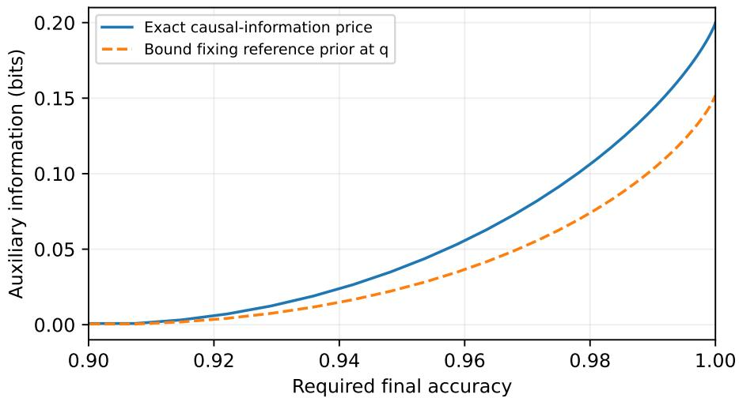

Figure 4: The optimized bound is exact beyond uniform priors. Unique answers, $q = ( 0 . 8 , 0 . 1 , 0 . 1 )$ , one target query. Curves are certified finite-alphabet optimization. At zero error, the exact price is 0.2 bits, versus 0.1520 for the unoptimized reference.  
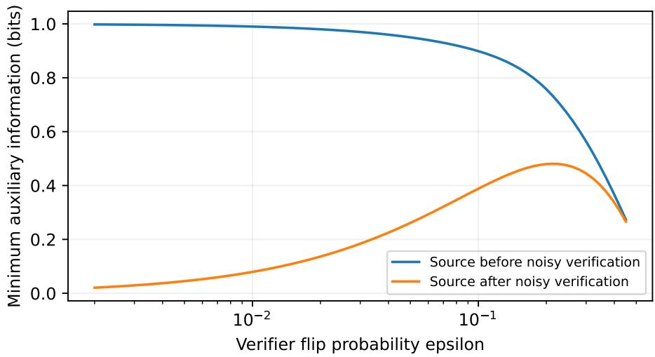  
Figure 5: The upfront reduction fails for noisy feedback. Uniform binary target, one noisy query, error tolerance $\delta = \epsilon ^ { 2 }$ . Both curves are exact optimal information costs. At $\epsilon = 0 . 0 1$ , the costs are 0.9900 bits upfront and 0.0793 bits with interleaving.

Construct an upfront policy by running a virtual copy of the modified learner. At a source request, request that same source from the actual source mechanism and pass the result to the virtual learner. At a virtual target request, record the candidate response and pass a zero to the virtual learner without making a real target query. At a virtual stop, record its output as the fallback. The virtual source requests obey the source mechanism’s availability restrictions because its source-only history agrees with the one actually realized. The virtual execution respects the globally enforced caps. Its transcript Z determines a list of t virtual target candidates and a fallback, where $t \leq n$ . After source acquisition, query these t candidates in order, stopping at the first positive reply and otherwise outputting the fallback. Repeated candidates may be omitted.

Couple an original and a transformed execution in the same world using the same independent seeds at their matching source histories. Before the original’s first positive target reply, all actual target replies equal the virtua zeros, so actions, source choices, and source replies coincide. If a first positive occurs, its candidate belongs to the virtual list, including when the continuation beyond that point is of the original support. Therefore the transformed protocol succeeds. If the original sees no positive reply but has a correct final fallback, its entire history agrees with the virtual execution and that fallback is included. Thus every original successful path is transformed into a successful path under this coupling, up to null events. The source cap and target cap hold pathwise for the transformed policy.

For a hard total cap $Q + N \leq C$ , enforce that single cap on the virtual learner. If its virtual path used m source requests and t target requests, then $m + t \leq C .$ . The transformed protocol performs the same m sources and at most t actual target queries. Its total is at most C. The same coupling proves success domination. This statement would be false for a constraint only on expected call counts: the transformation can acquire sources on worlds where the original stops after an early target success.

Condition on the upfront transcript, including the acquisition policy’s independent seed. With at most n target queries, Proposition 1 gives the optimum $V _ { n } ( q ( \cdot \mid Z ) )$ . Any source-only policy can be followed by an optimal posterior list. This gives both inequalities in (8) and proves Theorem 7. The source policy may select later sources based on earlier source outcomes; a source-first protocol need not use a fixed subset.

A source-adaptivity boundary. Let the four equally likely worlds be 0, 1, 2, 3, with the world itself the target answer. Three binary source masks are {2, 3}, {1}, and {3}. Query the first mask and, according to its answer, query the second $_ { \mathrm { o r } }$ third. Two source calls identify the world. Any fixed two-source subset has only three nonempty outcome cells, so its best final accuracy without target queries is $3 / 4$ . This example is not a linear uniform source bank in the sense of Theorem 9, and shows why that theorem needs its assumptions.

An expected-cost and information-cost boundary. Let the target have prior $( 1 - 2 p , p , p )$ with $0 < p < 1 / 2$ and let the only source be $Z = { \bf 1 } \{ A = 3 \}$ . Query target answer one first. On success stop; on failure query the source and distinguish answers two and three. Zero error uses one target query, at most one source query, and only $2 p$ source queries in expectation. An upfront protocol achieving zero error with one target query must always acquire the source: otherwise its single query and fallback leave one positive-prior answer uncovered. Its expected source count is one. The original causal source information is $2 p$ bits, whereas the upfront source information is $h _ { 2 } ( p )$ . Thus Theorem 7 preserves hard caps and success, not either of these other currencies. This also distinguishes it from the freely designed information-preserving optimum in Theorem 2.

## H Exact transfer rank and total-query optimization

All ranks and afine spaces in this section are over $\mathbb { F } _ { 2 }$ . Let T have rank k, W be uniform on $\mathbb { F } _ { 2 } ^ { d }$ , and B stack a chosen set of source rows. Each attainable source value $z = B W$ gives a fiber $w _ { 0 } + \ker B$ , and the posterior of W is uniform on that fiber. Its target image is $T w _ { 0 } + T ( \ker B )$ . Every element of this image has the same number of preimages. Moreover,

$$
\begin{array}{c} \begin{array} { l } { \dim T ( \ker B ) = \dim \ker B - \dim ( \ker B \cap \ker T ) } \\ { = ( d - \operatorname { r a n k } B ) - \left( d - \operatorname { r a n k } \Big [ \right)} \\ { \qquad \quad } \end{array}  = k - \rho ( S ) .  \end{array}
$$

This proves the claimed uniform target support of size $2 ^ { k - \rho ( S ) }$ , and also the familiar identity $I ( A ; B W ) = \rho ( S )$ for a fixed source set. Counting uniform linear fibers is elementary; we do not claim the entropy–rank correspondence as a new result.

For an adaptive source-only policy, fix its independent seed. On any leaf let S be the queried rows and z their replies in order. The event of reaching that leaf is exactly the afine system $B _ { S } W = z$ . In one direction the event imposes those equations. Conversely, any world satisfying the equations supplies the same sequential replies and therefore follows the same chosen sources and stopping decisions. There is no additional hidden restriction caused by the policy’s adaptivity. Repeated rows can be deleted without changing the fiber.

For rectangular caps, Theorem 7 reduces any interleaved policy to such leaves followed by at most n target queries. At a leaf the local value is

$$
\operatorname* { m i n } \{ 1 , ( n + 1 ) 2 ^ { - k + \rho ( S ) } \} \leq \operatorname* { m i n } \{ 1 , ( n + 1 ) 2 ^ { - k + \rho _ { b } } \} .
$$

Average over leaves and seeds to obtain the upper bound in (10). Choose a maximizing fixed subset $S ,$ solve its linear system, and enumerate any $n + 1$ distinct points of the target afine image (or all points if fewer remain). The first n serve as verification candidates and the last as fallback. This achieves the upper bound. Gaussian elimination implements decoding, although finding the maximizing subset can be combinatorial.

For a total cap, apply the total-cap transformation in Appendix G. If a leaf spent m source calls, at most $C - m$ target queries remain, giving an upper bound

$$
\operatorname* { m i n } \{ 1 , ( C - m + 1 ) 2 ^ { - k + \rho ( S ) } \} \leq \operatorname* { m a x } _ { 0 \leq b \leq \operatorname* { m i n } ( C , J ) } \operatorname* { m i n } \{ 1 , ( C - b + 1 ) 2 ^ { - k + \rho _ { b } } \} .
$$

If more than J source requests occurred, delete repeats first: a repeated deterministic source is already known and cannot help. For attainment choose a maximizing budget b and a fixed subset with at most b rows attaining $\rho _ { b } .$ , then use at most $C - b$ target queries. Unused source capacity need not be spent. This proves (11), including policies whose actual source/target allocation depends on the observed values.

## I Calls and information

An auxiliary call is one auxiliary observation, and $Q$ counts them. Sources are binary when every auxiliary alphabet has two letters, as in the linear banks of Section 3. This appendix proves Theorem 4, Propositions 5 and 6, Corollary 11 and Proposition $\mathrm { 8 ; }$ theory checks/check bridge.py and theory checks/exact calls.py check the finite claims numerically.

## I.1 Proof of Theorem 4

(i) Converse. Let verification be exact; Proposition 8 extends the bound to verifiers that garble exact replies. At an auxiliary node with history h and request c, the term charged in (3) is the conditional mutual information $I ( \Theta ; Z _ { t } \mid H _ { t - 1 } = \mathfrak { h } , C _ { t } = c ) \le H ( Z _ { t } \mid H _ { t - 1 } = \mathfrak { h } , C _ { t } = c ) \le \log _ { 2 } | \mathcal { Z } _ { t } |$ . Weighting by the probability of reaching the node and summing gives $\begin{array} { r } { B _ { \mathrm { a u x } } \leq \mathbb { E } \sum _ { t : C _ { t } \mathrm { ~ a u x i l i a r y } } \log _ { 2 } \left| \mathcal { Z } _ { t } \right| , } \end{array}$ , which is EQ for binary sources. Theorem 2 then gives $\mathbb { E } Q \geq B _ { \mathrm { a u x } } \geq \mathcal { R } _ { n } ( q , s )$ under $N \leq n$ almost surely and $\mathbb { P } ( \operatorname { a c c } = 1 ) \ \geq \ s$ , and its stopped form gives $\begin{array} { r } { \mathbb { E } Q \geq \mathcal { R } _ { n } ( q , \mathbb { P } ( \operatorname { a c c } = 1 , N \leq n ) ) } \end{array}$ for an arbitrary stopping rule. For a noisy verifier, Proposition $8 ( \mathrm { i } )$ bounds $\boldsymbol { B } _ { \mathrm { a u x } }$ below by supr $\{ \mathrm { k l } _ { + } ( s \| V _ { n } ^ { G } ( r ) ) - D _ { \mathrm { K L } } ( q \| r ) \}$ , and $V _ { n } ^ { G } \leq V _ { n }$ because a learner facing an exact verifier can simulate the noisy one by garbling its replies, so this supremum is at least $\textstyle { \mathcal { R } } _ { n } ( q , s )$ . Nothing else in the argument uses exact verification, fixed kernels, or source-first order.

(ii) Zero error with unique answers. If $\ell = n + 1 \geq M .$ , no call is needed. Otherwise, by Corollary 12, $\begin{array} { r } { \mathcal { R } _ { n } ( q , 1 ) = \sum _ { \theta } q _ { \theta } \log _ { 2 } ( 1 / a _ { \theta } ) } \end{array}$ with $a _ { \theta } = \operatorname* { m i n } \{ 1 , q _ { \theta } / \tau \}$ and $\textstyle \sum _ { \theta } a _ { \theta } = \ell .$ Set $L _ { \theta } = \lceil \log _ { 2 } ( 1 / a _ { \theta } ) \rceil + 1 \geq 1$ , so that $2 ^ { - L _ { \theta } } \leq a _ { \theta } / 2$ and

$$
\begin{array} { r } { \sum _ { \theta } 2 ^ { - L _ { \theta } } \leq \ell / 2 . } \end{array}
$$

Order the worlds by increasing $L _ { \theta }$ and cut the order into consecutive blocks $B _ { 1 } , B _ { 2 } , \ldots$ of ℓ worlds each, except possibly the last. Give block $B _ { i }$ the depth $D _ { i } = \operatorname* { m i n } _ { \theta \in B _ { i } } L _ { \theta }$ . For $i \geq 2$ , every world of the full block $B _ { i - 1 }$ has $\begin{array} { r } { L _ { \theta } \leq \bar { D _ { i } } , \mathrm { s o } 2 ^ { - D _ { i } } \leq \ell ^ { - 1 } \sum _ { \theta \in B _ { i - 1 } } 2 ^ { - L _ { \theta } } } \end{array}$ . Hence

$$
\begin{array} { r } { \sum _ { i } 2 ^ { - D _ { i } } \leq 2 ^ { - D _ { 1 } } + \ell ^ { - 1 } \sum _ { \theta } 2 ^ { - L _ { \theta } } \leq \frac { 1 } { 2 } + \frac { 1 } { 2 } = 1 , } \end{array}
$$

and Kraft’s inequality gives a binary prefix-free code with codeword length $D _ { i }$ for block $B _ { i }$ . The $j \mathrm { t h }$ source returns the $j \mathrm { t h }$ bit of the codeword of $\theta \mathrm { { s } }$ block, a deterministic function of θ and j. The learner reads bits until the codeword is complete, verifies $\ell - 1$ worlds of the block, and outputs the last if none is accepted, so $N \leq n$ and the error is zero. The number of calls is at most maxi $D _ { i } .$ , and

$$
\begin{array} { r } { \mathbb { E } Q = \sum _ { \theta } q _ { \theta } D _ { i ( \theta ) } \leq \sum _ { \theta } q _ { \theta } L _ { \theta } < \sum _ { \theta } q _ { \theta } \big ( \log _ { 2 } ( 1 / a _ { \theta } ) + 2 \big ) = \mathcal { R } _ { n } ( q , 1 ) + 2 . } \end{array}
$$

The construction’s constant is approached (uniform q with M just above $\ell 2 ^ { j } )$ , but the optimum’s may be smaller. Exact dynamic programming over candidate sets on 200 random priors with $M ~ \leq ~ 8$ (theory checks/exact calls.py) never finds a gap above one, and a gap of one is approached with $n = 0$ and $q$ near a point mass, where one call is unavoidable while $\mathscr { R } _ { n } ( q , 1 ) \to 0$

(ii) Every success level with unique answers. If $s \leq V _ { n } ( q )$ , verifying the n most probable answers and outputting the next succeeds with probability $V _ { n } ( q ) \geq s$ without calls. Let $s > V _ { n } ( q )$ . The function $\textstyle { \mathcal { R } } _ { n } ( q , \cdot )$ is convex and nondecreasing, and it vanishes exactly on $[ 0 , V _ { n } ( q ) ]$ , because zero information means a list independent of Θ. It is therefore strictly increasing on $[ V _ { n } ( q ) , 1 ]$ , so an optimal channel W for $\textstyle { \mathcal { R } } _ { n } ( q , s )$ covers with probability exactly s. Let $C = \mathbf { 1 } \{ \Theta \in L \} , c _ { \theta } = \mathbb { P } ( C = 1 \mid \Theta = \theta )$ and $q _ { 1 , \theta } = q _ { \theta } c _ { \theta } / s$ , the law of Θ given $C = 1$ , restricted to its support. Since C is a function of $( \Theta , L ) , H ( \Theta \mid L ) = H ( C \mid L ) + H ( \Theta \mid L , C ) \leq h _ { 2 } ( s ) + H ( \Theta \mid L , C )$ , so

$$
\begin{array} { r } { I ( \Theta ; L ) \geq H ( \Theta \mid C ) - h _ { 2 } ( s ) - H ( \Theta \mid L , C ) = I ( \Theta ; L \mid C ) - h _ { 2 } ( s ) \geq s I ( \Theta ; L \mid C = 1 ) - h _ { 2 } ( s ) . } \end{array}
$$

Given $C = 1 , \Theta \sim q _ { 1 }$ and $\Theta \in L$ almost surely, so $I ( \Theta ; L \mid C = 1 ) \ge \mathcal { R } _ { n } ( q _ { 1 } , 1 )$ . This lower bound holds for every channel with coverage $s ,$ not only optimal ones. For achievability, the first source reports $C ^ { \prime } \sim \mathrm { B e r n o u l l i } ( c _ { \Theta } )$ , a stochastic kernel of the world alone. Given $C ^ { \prime } = 1$ the posterior is exactly $q _ { 1 } ,$ , and the learner runs the zero-error protocol above for $q _ { 1 }$ , which needs no calls if $q _ { 1 }$ has at most $n + 1$ atoms. Given $C ^ { \prime } = 0$ it outputs any response. Success is at least $s , N \leq n$ , and

$$
\begin{array} { r } { \mathbb { E } Q < 1 + s \big ( \mathcal { R } _ { n } ( q _ { 1 } , 1 ) + 2 \big ) \le 1 + \mathcal { R } _ { n } ( q , s ) + h _ { 2 } ( s ) + 2 s \le \mathcal { R } _ { n } ( q , s ) + 1 + \log _ { 2 } 5 , } \end{array}
$$

since $h _ { 2 } ( s ) + 2 s$ is maximized at $s = 4 / 5$ with value $\log _ { 2 } 5 .$ No randomness is shared: the only randomization is inside the first source. On 750 near-optimal Blahut–Arimoto channels the construction is within 3.1 calls of $I ( W )$

## I.2 Proof of Proposition 5

Let G be a graph on [M], let the responses be the independent sets of G with $f _ { \theta } ( I ) = \mathbf { 1 } \{ \theta \in I \}$ , and let $n = 0$ A zero-error list is then a single independent set containing Θ, so $\mathcal { R } _ { 0 } ( q , 1 )$ is K¨orner’s graph entropy $H _ { \mathrm { K } } ( G , q )$ (Csisz´ar et al., 1990; Alon and Orlitsky, 1996). Represent every stochastic kernel and the learner’s seed by independent uniform variables U. For each fixed U the protocol is a binary decision tree whose leaves output independent sets, and the worlds reaching a leaf lie in its output. The leaves therefore colour $G ,$ and the expected depth is at least the entropy of that colouring, hence at least the chromatic entropy $H _ { \chi } ( G , q )$ . Averaging over U gives $\mathbb { E } Q \ge H _ { \chi } ( G , q )$ . Cardinal et al. (2008, Proposition 2) show that $H _ { \chi } - H _ { \mathrm { K } }$ is unbounded even for chordal graphs with uniform q. The gap persists for every $n \geq 1$ . Let the world be $( v , w )$ with $v \sim q$ on the vertices of G and an independent index w uniform on $[ n + 1 ]$ , let the responses be pairs $( I , j )$ of an independent set and an index, and let $f _ { ( v , w ) } ( I , j ) = \mathbf { 1 } \{ v \in I , \ j = w \}$ . The list $\{ ( I , 1 ) , \ldots , ( I , n + 1 ) \}$ with I drawn from an optimal channel for $H _ { \mathrm { K } } ( G , q )$ covers every world, so ${ \mathcal { R } } _ { n } \leq H _ { \mathrm { K } } ( G , q )$ . Conversely, fix U and $w .$ . The transcript of binary source replies and verification replies is then a prefix-free function of v, of expected length $\mathbb { E } [ Q + N \mid w , U ]$ , and it determines the output ${ \widehat { y } } .$ At zero error $\widehat { y } = ( I _ { v } , w )$ with $v \in I _ { v } .$ , so $v \mapsto I _ { v }$ colours G and $\mathbb { E } [ Q + N \mid w , U ] \ge H _ { \chi } ( G , q )$ . Since $N \leq n$ , averaging gives $\mathbb { E } Q \ge H _ { \chi } ( G , q ) - n$ , and $\begin{array} { r } { \mathbb { E } Q - \mathcal { R } _ { n } \geq H _ { \chi } ( G , q ) - H _ { \mathrm { K } } ( G , q ) - n } \end{array}$ , which is unbounded for every fixed n. For the upper bound, take general acceptance sets and any n, and let L be distributed by an optimal channel for $\textstyle { \mathcal { R } } _ { n } ( q , s )$ , which covers with probability at least s. The strong functional representation lemma (Li and El Gamal, 2018, Theorem 1) gives a random variable V independent of Θ, taking at most $M ( | \mathcal { L } _ { n } | - 1 ) + 2$ values, and a function g with $L = g ( \Theta , V )$ and $I ( \Theta ; V \mid L ) \leq \log _ { 2 } ( I ( \Theta ; L ) + 1 ) + 4$ . Since $V$ is independent of Θ and L is a function of $( \Theta , V )$

$$
H ( L \mid V ) = I ( \Theta ; L \mid V ) = I ( \Theta ; L ) + I ( \Theta ; V \mid L ) \le I ( \Theta ; L ) + \log _ { 2 } \left( I ( \Theta ; L ) + 1 \right) + 4 .
$$

For each value v, the map $g _ { v } = g ( \cdot , v )$ is a deterministic list map with entropy $H _ { v } = H ( g _ { v } ( \Theta ) )$ and coverage $\sigma _ { v } =$ $\mathbb { P } ( \Theta$ is covered by $g _ { v } ( \Theta ) )$ , where $\Theta \sim q$ . Averaging over V gives $\textstyle \sum _ { v } P _ { V } ( v ) H _ { v } = H ( L \mid V )$ and $\begin{array} { r } { \sum _ { v } P _ { V } ( v ) \sigma _ { v } = } \end{array}$ $\mathbb { E } c _ { \Theta L } \ge s ,$ . Minimizing $\textstyle \sum _ { v } p _ { v } H _ { v }$ over distributions $p$ subject to $\begin{array} { r } { \sum _ { v } p _ { v } \sigma _ { v } \ \ge \ s } \end{array}$ is a linear program with one constraint besides normalization, so an optimal p is supported on at most two values $v _ { 1 } , v _ { 2 }$ , and its objective is at most $H ( L \mid V )$ $\mathrm { A t } \ s = 1$ every $g _ { v }$ with $P _ { V } ( v ) > 0$ covers every world, so a single value sufices. The learner flips one coin with the optimal bias to choose $v \in \{ v _ { 1 } , v _ { 2 } \}$ and fixes a binary Hufman code for the law of $g _ { v } ( \Theta )$ whose expected length is at most $H _ { v } + 1$ and whose image has at most M lists, so no codeword is longer than $M - 1$ bits. A request is a pair $( v , j )$ , and the source returns the jth bit of the codeword of $g _ { v } ( \theta )$ , a deterministic function of the world and the request that never depends on target history. Carrying v in the request is the only randomness shared with the sources. The learner requests bits until the codeword is complete, decodes the list, verifies all but its last entry in turn, and outputs the last entry if none is accepted. Then $N \leq n , \mathbb { P } ( \operatorname { a c c } = 1 ) \geq s$ at most $M - 1$ calls are made on every path, and

$$
\begin{array} { r } { \mathbb { E } Q \leq \sum _ { v } p _ { v } ( H _ { v } + 1 ) \leq H ( L \mid V ) + 1 \leq { \mathcal { R } } _ { n } ( q , s ) + \log _ { 2 } ( { \mathcal { R } } _ { n } ( q , s ) + 1 ) + 5 . } \end{array}
$$

This is one-shot channel simulation (Harsha et al., 2010; Li and El Gamal, 2018), derandomized because only the coverage constraint couples the values of V. At $n = 0$ and $s = 1$ in the graph setting, each $g _ { v }$ assigns every world an independent set containing it, so its classes colour $G _ { \ l }$ , and for the best value $v ^ { \star }$

$$
H _ { \chi } ( G , q ) \leq H { \big ( } g _ { v ^ { \star } } ( \Theta ) { \big ) } \leq H ( L \mid V ) \leq H _ { \mathrm { K } } ( G , q ) + \log _ { 2 } { \big ( } H _ { \mathrm { K } } ( G , q ) + 1 { \big ) } + 4
$$

for every graph and prior. The gap in the lower bound is therefore at most logarithmic in $H _ { \mathrm { K } }$ . On the chordal graphs of Cardinal et al. (2008, Lemmas 5 and 6) it is at least lo ${ \xi } _ { 2 } k - o ( 1 )$ , where k is the depth of the construction and $o ( 1 )$ vanishes as the clique sizes grow with k fixed, while $H _ { \mathrm { K } }$ grows as well. The logarithmic order is attained. In the tightness proof of Cardinal et al. (2010), the comparability graph of the interval order $I _ { k }$ has $M = k 2 ^ { k - 1 }$ vertices, and under a uniform prior its chromatic entropy exceeds its graph entropy by at least l $\operatorname { p g } _ { 2 } k - \log _ { 2 } e - 1$ This is $\Omega ( \log \log M )$ , and hence $\Omega ( \log H _ { \mathrm { K } } )$ because $H _ { \mathrm { K } } \leq \log _ { 2 } M$ (see also Cardinal et al., 2012).

## I.3 Proof of Proposition 6

Take unique answers, $q = ( 1 - 2 p , p , p )$ with $0 < p \leq 1 / 4 , n = 1$ and $s = 1$ . By Corollary 12 (list water-filling with inclusion probabilities $( 1 , \frac { 1 } { 2 } , \frac { 1 } { 2 } ) ) , \mathcal { R } _ { n } ( q , 1 ) = 2 p$ . The interleaved protocol verifies answer 1 and stops if it is accepted. Otherwise it makes one binary call that distinguishes answers 2 and 3 and outputs the result without a second verification. It has zero error, $N \leq 1$ and $\exists Q = \mathbb { P } ( \Theta \neq 1 ) = 2 p .$ , so it meets the converse of Theorem 4(i) with equality. In a source-first protocol, the decision to make a first call depends only on the private seed, so the event that no call precedes the first verification is independent of Θ. On that event the learner’s candidate list is a function of the seed, has at most two elements, and misses a world of positive prior. Zero error therefore forces a call on almost every seed, so $\mathbb { E } Q \geq 1$ , and the ratio $1 / ( 2 p )$ is unbounded. The saving over the best designed source-first protocol is bounded by Theorem 4. Against a given bank it is not. At zero error, take $q = ( 1 - \epsilon , \epsilon / K , \dots , \epsilon / K )$ on $K + 1$ worlds with $K \geq 4$ a power of two, $n = 1$ , and sources that return the $\log _ { 2 } K$ bits of an index in which world 1 shares the index of world 2. Verifying world 1 first and then reading the index costs $\epsilon \log _ { 2 } K$ expected calls. A source-first protocol must separate world 1 from every world except world 2 before its single verification, which takes all $\log _ { 2 } K$ bits whenever $\Theta = 1$ , so it costs at least $( 1 - \epsilon ) \log _ { 2 } K$

## I.4 Proof of Corollary 11

Hard caps. By Theorem 9, $\mathsf { A } _ { b , n } = 1$ exactly when $( n + 1 ) 2 ^ { - k + \rho _ { b } } \geq 1$ , that is, when $\rho _ { b } \geq k - \log _ { 2 } ( n + 1 )$ ; since $\rho _ { b }$ is an integer this is $\rho _ { b } \geq \kappa$ . By Theorem $1 0 , \rho _ { b } \ge \kappa$ holds exactly when some subspace U generated by the $\bar { v } _ { j }$ has $t ( U ) \geq \kappa$ and b − dim $U \geq \kappa ;$ if no U has $t ( U ) \geq \kappa$ then $\rho _ { J } <$ κ and no cap sufices. The least such b is $\kappa + u ( \kappa )$ . For the uniform prior on $2 ^ { k }$ unique answers, (28) gives $\begin{array} { r } { \mathcal { R } _ { n } ( q , 1 ) = k - \log _ { 2 } ( n + 1 ) } \end{array}$ , so $b _ { n } \geq \lceil \mathcal { R } _ { n } ( q , 1 ) \rceil$ with equality exactly when $u ( \kappa ) = 0$ . Because $\rho _ { b + 1 } \leq \rho _ { b } + 1$ , the least budget with $\rho _ { b } \geq \kappa$ has $\rho _ { b _ { n } } = \kappa ,$ so the excess $b _ { n } - \kappa = u ( \kappa )$ equals $b _ { n } - \rho _ { b _ { n } }$ , the calls of an optimal subset that land on nuisance directions.

Source-first expected calls. In a source-first protocol, the posterior of the target on every source-only leaf is uniform on $2 ^ { k - \rho ( S ) }$ vectors, where S is the set of sources called on that path (Appendix H). Zero error with n verifications requires $2 ^ { k - \rho ( S ) } \leq n + 1$ , so $\rho ( S ) \geq \kappa$ and hence $| S | \geq b _ { n }$ on every path; a fixed optimal subset attains $b _ { n }$ on every path.

Interleaving can use fewer expected calls. Take $k = 2 , h = 0 .$ two sources that return $a _ { 0 }$ and $a _ { 1 }$ , and $n = 2 .$ , so $\kappa = 1$ and $b _ { n } = 1$ . Verify 00, then 01; if both are rejected, the remaining candidates 10 and 11 difer only in $a _ { 1 } .$ , so call the source for $a _ { 1 }$ and output the one it indicates. The error is zero and $\mathbb { E } Q = \mathbb { P } ( \mathrm { b o t h ~ r e j e c t e d } ) = 1 / 2 < b _ { n }$ while $\mathcal { R } _ { n } ( q , 1 ) = 2 - \log _ { 2 } 3 = 0 . 4 1 5 \leq \mathbb { E } Q$ , as Theorem 4(i) requires.

On 300 random banks with $k \leq 5 , h \leq 4$ and $J \le 1 2$ , the identity $b _ { n } = \kappa + u ( \kappa )$ agrees with exhaustive search over all source subsets for all 940 pairs (bank, κ) with $1 \leq \kappa \leq k$ (and trivially for $\kappa = 0 )$

## I.5 Proof of Proposition 8

(i) Repeat the construction of Appendix B with the target kernel G in place of exact replies: $\widetilde { P }$ has prior $r ,$ the same learner, the same target kernel, and auxiliary kernels $\overline { { K } } _ { t } .$ . Given $\theta ,$ a target transition has the same probability $G ( \cdot \mid f _ { \theta } ( y ) )$ under both laws, so it cancels in (16), and (6) holds unchanged. Under $\widetilde { P }$ every auxiliary observation can be simulated from the history and independent randomness, so the protocol is a target-only protocol under prior r and $\widetilde { P } ( \mathrm { a c c } = 1 , N \leq n ) \leq V _ { n } ^ { G } ( r )$ . Data processing to the event $\left\{ \mathrm { a c c } = 1 , N \leq n \right\}$ completes the proof as in Lemma $3 .$

(i), second form. Include the private seed $\xi$ in the initial history; $I ( \Theta ; \xi ) = 0$ . By the chain rule, $I ( \Theta ; \xi , H _ { T } )$ is the sum over steps of the conditional information of each observation given the past. Actions are functions of the past and add nothing. Auxiliary observations contribute exactly $\boldsymbol { B } _ { \mathrm { a u x } }$ . A verification reply depends on Θ only through the binary input $f _ { \Theta } ( y _ { t } )$ to $G .$ so it contributes at most $\exp ( G )$ , and there are at most n of them. The output $\widehat { y }$ is a function of $( \xi , H _ { T } )$ and is acceptable with probability at least $s ,$ so $I ( \Theta ; \widehat { y } ) \ge \mathcal { R } _ { 0 } ( q , s )$ by the definition of the rate–distortion function with single-response lists. Hence $\mathcal { R } _ { 0 } ( q , s ) \leq B _ { \mathrm { a u x } } + n \mathrm { c a p } ( G )$ . On the instance of Theorem 13, $\mathcal { R } _ { 0 } ( q , 1 - \delta ) = 1 - h _ { 2 } ( \delta )$ for the uniform binary answer and cap $\begin{array} { r } { \mathbf { \nabla } \cdot ( G ) = 1 - h _ { 2 } ( \epsilon ) } \end{array}$ for the binary symmetric verifier, so with $n = 1$ the bound is $h _ { 2 } ( \epsilon ) - h _ { 2 } ( \delta )$ , the exact interleaved optimum (29).

(ii) The information statement is Theorem 13. For counted calls, let A be uniform on $\{ 0 , 1 \}$ and let one noisy equality query return $\mathbf { 1 } \{ A = y \} \oplus E$ with $E \sim \mathrm { B e r n o u l l i } ( \epsilon )$ . Two fixed sources are available; source $c _ { r }$ reports $\mathbf { 1 } \{ A \neq r \}$ through a Z-channel that misses a true 1 with probability η and never reports a false 1. Both kernels depend on A only.

Interleaved. Query $y = 0$ and let $g$ be the answer the reply favours, so $\mathbb { P } ( g \neq A ) = \epsilon .$ . Call $c _ { g }$ and output $1 - g$ if it reports 1, else $g .$ An error needs $g \neq A$ and a miss, so it has probability ϵη.

Source first. A source-first protocol calls $c _ { 0 }$ , calls $c _ { 1 }$ , or calls nothing, possibly at random, and a random choice has the average error of the three. Calling nothing leaves error ϵ. By symmetry consider $c _ { 0 }$ . A report of 1 reveals $A = 1$ . After a report of 0, which has probability $( 1 + \eta ) / 2$ , the posterior of the less likely answer is $\eta / ( 1 + \eta )$ and the Bayes error after one noisy reply from posterior minority mass v is min $\{ v , \epsilon \}$ (Appendix K). The error is therefore $\frac { 1 { \overset { \cdot } { + } } \eta } { 2 }$ min $\textstyle \left\{ { \frac { \eta } { 1 + \eta } } , \epsilon \right\} = \operatorname* { m i n } \{ \eta / 2 , \epsilon ( 1 + \eta ) / 2 \}$ , which is also below the error ϵ of using no source, so it is the least error of any source-first protocol. Exhaustive search over all policies with at most one call and one query reproduces both values. $\mathrm { A t } ~ \epsilon = \eta$ the source-first error is $\eta / 2$ , so the ratio of the two errors is $1 / ( 2 \eta )$ , unbounded as $\eta  0$ . The only thing the interleaved protocol uses is the choice of source after seeing the target reply, which is exactly what source-first order forbids. The separation is in error at equal caps, not in the number of calls: calling both sources first and then verifying also reaches error $\epsilon \eta ,$ at the cost of one extra call.

## J Noisy verification makes information order matter

Theorem 2 needs exact verification. Take A ∼ Bernoulli(1/2) and at most one equality query, whose reply is independently flipped with probability $\epsilon \in ( 0 , 1 / 2 )$ . The output is still required to equal the true A. Let $h _ { 2 }$ be the binary entropy function. Compare arbitrary source/target interleaving with the restriction that every auxiliary observation precedes the noisy query; both charge conditional information exactly as in (3).

Theorem 13 (Exact noisy ordering separation). For error probability at most $\delta \in [ 0 , \epsilon ]$ , the minimum interleaved auxiliary information is

$$
B _ { \mathrm { i n t e r } } ( \epsilon , \delta ) = h _ { 2 } ( \epsilon ) - h _ { 2 } ( \delta ) .\tag{29}
$$

Let $v _ { \epsilon } \in ( 0 , \epsilon )$ be the unique solution of $h _ { 2 } ( v ) + ( \epsilon - v ) h _ { 2 } ^ { \prime } ( v ) = 1$ . If all auxiliary observations must precede the query, the minimum is

$$
\begin{array} { r } { B _ { \mathrm { u p f r o n t } } ( \epsilon , \delta ) = \left\{ \begin{array} { l l } { 1 - h _ { 2 } ( \delta ) , } & { 0 \leq \delta \leq v _ { \epsilon } , } \\ { ( \epsilon - \delta ) h _ { 2 } ^ { \prime } ( v _ { \epsilon } ) , } & { v _ { \epsilon } \leq \delta \leq \epsilon . } \end{array} \right. } \end{array}\tag{30}
$$

In particular, zero error costs $h _ { 2 } ( \epsilon )$ versus one bit. With the strictly positive error tolerance $\delta = \epsilon ^ { 2 }$ , the interleaved cost tends to zero and the upfront cost tends to one as $\epsilon  0$

Proof sketch. A single noisy reply contributes at most $1 - h _ { 2 } ( \epsilon )$ bits, whereas final error δ requires at least $1 - h _ { 2 } ( \delta )$ total bits. Query first, then optimally describe the remaining Bernoulli-ϵ error: the elementary binary rate– distortion test channel attains the diference. For an upfront source $Z ,$ set $v = \operatorname* { m i n } \{ P ( A = 1 \mid Z ) , P ( A = 0 \mid Z ) \}$ Optimal error after the query is min $. ( v , \epsilon )$ . By symmetry, any distribution over $v \in [ 0 , 1 / 2 ]$ is realizable with mean prior $1 / 2$ . Maximizing $\mathbb { E } h _ { 2 } ( v )$ subject to E min $( v , \epsilon ) \leq \delta$ gives the upper concave envelope of $h _ { 2 } ( v )$ and the point $( \epsilon , 1 )$ , hence (30). Appendix K proves the constructions, the tangent condition, and the limiting separation.

The formulas use classical binary rate distortion and posterior convexification; the point is the exact change in the verification protocol’s operational behavior. The after-query source sees the query history. Restricting it not to see that history defines a diferent problem. These costs are mutual information, not raw message lengths or $\mathrm { W y n e r - Z i v }$ communication rates.

## K Noisy ordering theorem: full proof

Here only, target observations are noisy and the exact-verifier reduction does not apply. Query $y \in \{ 0 , 1 \}$ and observe $\mathbf { 1 } \{ A = y \} \oplus E$ , where $E \sim$ Bernoulli(ϵ) is independent of all prior history. Knowing $y ,$ this is equivalent to a binary symmetric observation $R = A \oplus E$

## K.1 Optimal arbitrary interleaving

By the information chain rule, total transcript information is the sum of the causal source budget and the conditional information of target replies. Actions are functions of the history and private seed and contribute no additional information. With at most one noisy query, the latter contribution is at most $1 - h _ { 2 } ( \epsilon )$ , including protocols that sometimes make no query. This follows from $H ( R \mid H ) \leq 1$ and $H ( R \mid A , H ) = h _ { 2 } ( \epsilon )$ at every reached query node.

If the final guess has error at most $\delta \le \epsilon < 1 / 2$ , binary Fano gives $I ( A ; H _ { T } ) \ge 1 - h _ { 2 } ( \delta )$ . Consequently $B _ { \mathrm { a u x } } \geq h _ { 2 } ( \epsilon ) - h _ { 2 } ( \delta )$

For achievability, query first. Since A is uniform, R is uniform and the residual $X = A \oplus R$ is independent of $R ,$ with law Bernoulli(ϵ). Choose a joint law for $( X , { \widehat { X } } )$ by drawing

$$
\widehat { X } \sim \mathrm { B e r n o u l l i } \left( \frac { \epsilon - \delta } { 1 - 2 \delta } \right) , \quad D \sim \mathrm { B e r n o u l l i } ( \delta ) \mathrm { ~ i n d e p e n d e n t l y } , \quad X = \widehat { X } \oplus D .
$$

The marginal of X is Bernoulli(ϵ). Use the resulting conditional law of $\widehat { X } \mathrm { \ g i }$ ven X as the source kernel, with source access to $( A , R )$ , and output ${ \widehat { A } } = R \oplus { \widehat { X } }$ . The error is δ and

$$
I ( A ; \widehat { X } \mid R ) = I ( X ; \widehat { X } ) = h _ { 2 } ( \epsilon ) - h _ { 2 } ( \delta ) .
$$

This proves (29). At $\delta = 0$ the source reveals the remaining error exactly; at $\delta = \epsilon$ no source information is needed.

## K.2 Optimal upfront information

Aggregate all upfront observations into $Z ,$ conditioning also on the learner’s independent seed. For posterior $p = P ( A = 1 \mid Z )$ , set $v = \operatorname* { m i n } ( p , 1 - p )$ . The Bayes error after one binary symmetric observation is

$$
\begin{array} { l } { { e ( p ) = \mathrm { m i n } \{ p ( 1 - \epsilon ) , ( 1 - p ) \epsilon \} + \mathrm { m i n } \{ p \epsilon , ( 1 - p ) ( 1 - \epsilon ) \} } } \\ { { \nonumber } } \\ { { = \mathrm { m i n } \{ p , 1 - p , \epsilon \} = \mathrm { m i n } \{ v , \epsilon \} . } } \end{array}
$$

The source cost is $1 - \mathbb { E } h _ { 2 } ( v )$ . Every distribution of $v \in [ 0 , 1 / 2 ]$ can be realized: give posterior v and $1 - v$ equal conditional weights, thereby preserving the uniform prior. Thus the optimization is exactly

$$
\begin{array} { r } { 1 - B _ { \mathrm { u p f r o n t } } ( \epsilon , \delta ) = \operatorname* { s u p } \{ \mathbb { E } h _ { 2 } ( v ) : \mathbb { E } \operatorname* { m i n } ( v , \epsilon ) \le \delta \} . } \end{array}
$$

For $v \geq \epsilon$ , the error coordinate is fixed at ϵ and entropy is maximized by $v = 1 / 2 ,$ , attaining the point (ϵ, 1). For $v \leq \epsilon ,$ the achievable upper boundary is $( v , h _ { 2 } ( v ) )$ . Randomization takes their upper concave envelope.

Define $\Gamma ( v ) = h _ { 2 } ( v ) + ( \epsilon - v ) h _ { 2 } ^ { \prime } ( v )$ . On $( 0 , \epsilon ) , \Gamma ^ { \prime } ( v ) = ( \epsilon - v ) h _ { 2 } ^ { \prime \prime } ( v ) < 0 , \Gamma ( v ) \to \infty \mathrm { ~ a s ~ } v \downarrow 0$ , and $\Gamma ( \epsilon ) = h _ { 2 } ( \epsilon ) < 1$ Hence a unique $v _ { \epsilon }$ has $\Gamma ( v _ { \epsilon } ) = 1$ . The envelope follows $h _ { 2 } ( v )$ until $v _ { \epsilon }$ and its tangent line from there to $( \epsilon , 1 )$ Concavity of $h _ { 2 }$ makes the line a global upper support; matching slopes at the join gives a concave envelope.

For $\delta \leq v _ { \epsilon }$ , choose posterior pairs $\delta , 1 - \delta$ . For $\delta \geq v _ { \epsilon }$ , mix posterior error $v _ { \epsilon }$ with probability $( \epsilon - \delta ) / ( \epsilon - v _ { \epsilon } )$ and posterior error $1 / 2$ otherwise. These constructions attain the envelope and prove (30). The tangent equation can also be written

$$
- \epsilon \log _ { 2 } { v _ { \epsilon } } - ( 1 - \epsilon ) \log _ { 2 } ( 1 - v _ { \epsilon } ) = 1 .
$$

Our implementation solves it in log-odds coordinates to avoid underflow for small $\epsilon .$

Table 1: Source quantity versus value. Uniform $M = 2 5 6$ targets, 15 exact queries. Information and oracle accuracy are exact. Learned values span 15 runs (five seeds, three learning rates) at step 400. A single number means all runs agree at the displayed precision.
<table><tr><td>Source</td><td>Information (bits)</td><td>Oracle accuracy</td><td>Learned accuracy</td></tr><tr><td>Balanced partition</td><td>4.0</td><td>1.000000</td><td>1.000000</td></tr><tr><td>Reveal-erasure,  $\alpha = 0 . 5 0$ </td><td>4.0</td><td>0.531250</td><td>0.531250</td></tr><tr><td>Reveal-erasure,  $\alpha = 0 . 5 5$ </td><td>4.4</td><td>0.578125</td><td>0.578125</td></tr><tr><td>Uninformative</td><td>0.0</td><td>0.062500</td><td>0.062500</td></tr></table>

## K.3 Nonzero-error asymptotic separation

For every $v \le 1 / 2 , \operatorname* { m i n } ( v , \epsilon ) \ge 2 \epsilon v$ . Therefore error at most δ implies $\mathbb { E } v \le \delta / ( 2 \epsilon )$ , and Jensen gives

$$
B _ { \mathrm { u p f r o n t } } ( \epsilon , \delta ) \geq 1 - h _ { 2 } \left( \frac { \delta } { 2 \epsilon } \right) , \qquad 0 \leq \delta \leq \epsilon .
$$

At $\delta = \epsilon ^ { 2 }$ , this lower bound tends to one. The cost cannot exceed one, while $h _ { 2 } ( \epsilon ) - h _ { 2 } ( \epsilon ^ { 2 } )$ tends to zero. The advantage in information cost is therefore unbounded. This separation is not based solely on the zero-error discontinuity of a full-support noisy channel.

## L Information quantity is not source usefulness

Theorem 2 concerns an optimized source; another source carrying the same B bits can fall far short of the frontier. For a fixed upfront source K, the exact local value is

$$
A _ { n } ( K ) = \mathbb { E } _ { Z } V _ { n } ( q ( \cdot \mid Z ) ) .\tag{31}
$$

This follows by conditioning Proposition 1 and is a task-specific Bayes value of information. It leads to diferent source choices than maximizing $I ( \Theta ; Z )$

Consider a uniform unique answer on $M = 2 5 6$ symbols, with n = 15. A balanced partition into sixteen groups reveals four bits and leaves exactly sixteen candidates: accuracy one is possible. A source that reveals the exact answer with probability $1 / 2$ and otherwise erases also carries four bits, but its best accuracy is $\textstyle { \frac { 1 } { 2 } } + { \frac { 1 } { 2 } } ( 1 6 / 2 5 6 ) = 0 . 5 3 1 2 5$ . Increasing the reveal probability to 0.55 raises information to 4.4 bits but reaches only 0.578125. More generally, with M uniform answers and list size ℓ, a balanced partition and reveal–erasure source of equal information $B = \log _ { 2 } ( M / \ell )$ have accuracies 1 and $\alpha + ( 1 - \alpha ) \ell / M$ , where $\alpha = B / \log _ { 2 } M$ . Along $M = 2 ^ { k ^ { 2 } }$ and $\ell = M / 2 ^ { k }$ , the latter tends to zero while the former remains one. Both accuracies are exact optima for their channels, so the gap comes from the shape of the channel.

A learned decoder check. We train a 58,816-parameter message-to-answer network from scratch on independent draws from the partition and reveal–erasure channels, then let its highest-scoring sixteen answers define the verification list. The network has a 64-dimensional message embedding and one 128-unit GELU hidden layer. Training uses 400 Adam steps, batches of 512, five seeds, and three learning rates, with no early selection of the reported checkpoint. Evaluation sums exactly over the finite target–message distribution, so variation across runs comes from optimization alone.

The test separates decoding a source correctly from the source’s usefulness: the gap between sources remains under perfect posterior decoding. The alphabets are small and explicit, so the experiment does not show that neural representations in general reach the optimized-channel frontier. Full learning curves and the learning-rate sweep are released.

## M Quotient-subspace optimization and certificates

All spaces and ranks in this section are over $\mathbb { F } _ { 2 }$ . Work in $\mathcal { V } = \operatorname { s p a n } ( T , B )$ , removing unobservable latent directions, so dim $\nu = k + h$ . Gaussian elimination selects coordinates for the quotient by ${ \mathcal { T } } = \operatorname { r o w } ( T )$ . The projected source rows $\bar { v } _ { j }$ span the full quotient, although a particular lower-dimensional quotient subspace need not be generated by available rows.

## M.1 Exact profile and attaining subsets

Let $\mathcal { U } = \{ \operatorname { s p a n } ( \bar { v } _ { j } : j \in S ) : S \subseteq [ J ] \}$ . For $U \in \mathcal { U }$ , the images of the eligible set ${ \mathcal { E } } ( U )$ span exactly U: inclusion gives one direction, and a generating set of U is contained in ${ \mathcal { E } } ( U )$ . Rank-nullity therefore gives

$$
\dim { \big ( } \operatorname { s p a n } ( v _ { j } : j \in { \mathcal { E } } ( U ) ) \cap { \mathcal { T } } { \big ) } = \operatorname { r a n k } ( v _ { j } : j \in { \mathcal { E } } ( U ) ) - \dim U = t ( U ) .
$$

For any feasible set $S ,$ write $u \ = \ \dim \operatorname { s p a n } ( { \bar { v } } _ { j } \ : j \ \in \ S )$ . Its original-space rank is at most $| S |$ , so $\rho ( S ) \leq$ $| S | - u \le b - u$ . Since its source span is a subspace of the eligible source span, $\rho ( S ) \leq t ( U )$ . This proves $\rho _ { b } \leq \operatorname* { m a x } _ { U \in \mathcal { U } }$ min $( t ( U ) , ( b - \dim U ) _ { + } )$ . Only states with $u \leq b$ are needed for this direction; states with $u > b$ contribute zero and do not afect the inequality.

For the converse, choose u eligible rows with independent quotient images. Any dependence of those rows in V would project to a dependence in the quotient, so the rows are independent. Their span has zero intersection with $\tau$ . Extend these rows to an ordered basis of the eligible source span. The extension has length $R = u + t ( U )$ every added row leaves the quotient span unchanged but increases original rank by one. The first $u + s$ rows therefore have target gain s, for $0 \leq s \leq t ( U )$ . Given $b \geq u ,$ the prefix of length $u + \operatorname* { m i n } ( t ( U ) , b - u )$ attains the expression in (13). When the expression is zero, the empty source set also attains it. This proves both directions, including zero sources, zero nuisance dimension, dependent or repeated source rows, and budgets exceeding the number of independent sources.

## M.2 Closure enumeration and complexity

Represent each quotient subspace by its unique reduced row basis. Begin with the empty basis and maintain a queue and hash set of encountered bases. For each encountered U and each available direction ${ \bar { v } } _ { j } .$ , compute $U + \mathrm { s p a n } ( \bar { v } _ { j } )$ and insert its canonical basis if new. Every inserted state is generated by available directions. Conversely, induction over a generating source subset shows that every $U \in \mathcal { U }$ is eventually inserted. No inclusion in a nongenerated subspace is required.

There are at most $\begin{array} { r } { \mathcal { N } _ { h } = \sum _ { u = 0 } ^ { h } \binom { h } { u } _ { 2 } } \end{array}$ states. The Gaussian coeficient counts reduced subspaces, and

$$
\left[ \begin{array} { l } { h } \\ { u } \end{array} \right] _ { 2 } = \prod _ { i = 0 } ^ { u - 1 } \frac { 2 ^ { h } - 2 ^ { i } } { 2 ^ { u } - 2 ^ { i } } \le 4 \cdot 2 ^ { u ( h - u ) } \le 2 ^ { h ^ { 2 } / 4 + 2 } .
$$

Thus $\mathcal { N } _ { h } \leq ( h + 1 ) 2 ^ { h ^ { 2 } / 4 + 2 } = 2 ^ { O ( h ^ { 2 } ) }$ . Per state, at most J Gaussian reductions generate its successors; testing eligibility, constructing original/quotient bases, and updating J + 1 budget entries require poly $( J , k + h )$ field operations. Preprocessing the input costs polynomial time in its original dimension; after removal of redundant coordinates the stated bound applies. The count includes polynomial-length source witnesses, not just optimum values.

A state limit in the implementation raises an explicit exception; it never calls a partially explored search globally optimal. The limit is 500,000 states (5,000 for the stress-test fits). Counts of reached states can be far below $\mathcal { N } _ { h }$ , but there is no polynomial-in-h claim. All finite-field operations are exact bit operations; runtime measurements are properties of this implementation and machine, not a comparison to every coding solver.

## M.3 Checkable proof objects

The export contains $T , B ,$ quotient images, every generated reduced quotient basis, the eligible source IDs, original and quotient ranks, and an ordered achieving source basis. A verifier checks: (i) the quotient map is linear on the joint row space, vanishes on $\tau$ , and has rank $h ; \mathrm { ( i i ) }$ the state set contains zero and is closed under adjoining every available direction; (iii) every state is generated by its reported eligible directions; (iv) eligible sets and all ranks are exact; (v) each basis prefix has its advertised cost and target rank; and (vi) the reported profile is the maximum in (13) and each chosen subset attains it. Closure and the initial state rule out omission of a superior generated subspace.

The independent verifier uses dense binary matrices and a separate Gaussian-elimination implementation rather than importing the planner’s bit-packed rank routines. These checks certify the mathematical optimization for the exported model. They do not verify that a fitted model describes a real data source.

## M.4 Online target generation

After the selected source labels $z = B _ { S } W$ are observed, solve that system for one representative $w _ { 0 }$ and a basis of its nullspace. The compatible targets form $T w _ { 0 } + T ( \ker B _ { S } )$ . Reduce the projected nullspace to a basis, and enumerate at most $n + 1$ distinct linear combinations. A positive exact target query supplies the output; after n failures use the last candidate. This avoids enumerating all latent worlds or all target candidates when the requested list is short. A learned model that receives inconsistent source labels reports that failure instead of inventing a posterior.

## N Relation to relative generalized Hamming weights

Let $B : \mathbb { F } _ { 2 } ^ { J }  \mathcal { V }$ send coordinate vector $e _ { j }$ to source row $v _ { j }$ , and $N = p B$ with $p : \mathcal { V } \to \mathcal { V } / \mathcal { T }$ the quotient map. Define $K _ { 0 } =$ ker $B \subseteq K _ { 1 } = \ker N$ . Let $\mathbb { F } _ { 2 } ^ { S }$ denote the coordinate subspace supported on S. Restricted rank-nullity gives

$$
\dim ( K _ { 1 } \cap \mathbb { F } _ { 2 } ^ { S } ) - \dim ( K _ { 0 } \cap \mathbb { F } _ { 2 } ^ { S } ) = ( | S | - \operatorname { r a n k } N _ { S } ) - ( | S | - \operatorname { r a n k } B _ { S } ) = \rho ( S ) .
$$

In the standard relative-weight definition, the tth weight is the smallest support of a t-dimensional subcode $D \subseteq K _ { 1 }$ with $D \cap K _ { 0 } = \{ 0 \}$ (Luo et al., 2005; Kurihara et al., 2012; San-Jos´e, 2025). Such a subcode supported in $S$ exists if and only if the displayed dimension diference is at least t: one direction follows by injecting D into the quotient; the other chooses a complement to $K _ { 0 } \cap \mathbb { F } _ { 2 } ^ { S }$ in $K _ { 1 } \cap \mathbb { F } _ { 2 } ^ { S }$ . Hence the relative weights are precisely the inverse thresholds of $\rho _ { b }$

Because $K _ { 1 } ^ { \bot }$ has dimension h, each U corresponds to a subcode of $K _ { 1 } ^ { \bot }$ , its annihilator, and ${ \mathcal { E } } ( U )$ is the complement of that subcode’s support. QSP is therefore enumeration on the small side of Forney’s duality (Forney, 1994), which is the right side when the nuisance dimension is small.

The algorithms of San-Jos´e (2025) address generalized and relative weights using generalized Brouwer– Zimmermann search and a Sage implementation. Our search is over the dimension-h image quotient and is intended for bounded nuisance dimension, with a learning and verification-policy interface. Appendix Q runs that package, unmodified and pinned, on the same inputs: the profiles agree wherever both finish, and neither implementation is uniformly faster. The released source-aware baselines are specified independently in Appendix P; they are not proxies for all exact coding algorithms.

Hardness without a nuisance bound. Given a binary syndrome-decoding instance with matrix H, nonzero syndrome t, and weight cap b, take source rows to be the columns of H and the single target row to be t. Then $\rho _ { b } \geq 1$ holds if and only if t lies in the span of at most b columns, equivalently if $H c = t$ has a binary solution of Hamming weight at most b. Thus deciding this profile contains classical syndrome decoding (Berlekamp et al., 1978). This reduction locates the algorithm’s parameter dependence; it is not claimed as a new coding-hardness result. The assumption $k = 1$ does not bound h.

## O Learning the full uniform-linear joint model

Proposition 14 (Learning the bank). Suppose training contexts supply the target answer and all J source labels, drawn independently and uniformly from an unknown rank-ℓ subspace of $\mathbb { F } _ { 2 } ^ { k + J }$ with target rank k, and let $\ell _ { 0 } \geq \ell$ be a declared bound. If

$$
m \ge \ell _ { 0 } + \lceil \log _ { 2 } ( 1 / \delta ) \rceil ,\tag{32}
$$

then with probability at least $1 - \delta$ the span of m contexts is the whole subspace, and ${ Q S P }$ applied to it returns optimal policies for every budget, with nuisance dimension $h = \ell - k$

We prove Proposition 14 using the closure argument of Helmbold et al. (1992), specialized to uniform sampling. Let the true joint support be a rank-ℓ linear space $\mathcal { X } \subseteq \mathbb { F } _ { 2 } ^ { k + J }$ , with target marginal rank k. Independent training vectors are uniform on X. Their span is always a subspace of X. If it is proper, some nonzero linear functional on X annihilates every sample. There are $2 ^ { \ell } - 1$ such functionals, and each vanishes on one uniform draw with probability $1 / 2 .$ . Consequently

$$
P ( \widehat { \mathcal { X } } \neq \mathcal { X } ) \leq ( 2 ^ { \ell } - 1 ) 2 ^ { - m } < 2 ^ { \ell - m } .
$$

For $m \geq \ell ,$ the exact success probability is

$$
P ( \widehat { \mathcal { X } } = \mathcal { X } ) = \prod _ { i = 0 } ^ { \ell - 1 } ( 1 - 2 ^ { i - m } ) ;\tag{33}
$$

for $m < \ell$ it is zero. To derive the product, choose coordinates on X and view the samples as the rows of an $m \times \ell$ matrix with independent uniform entries. Its columns are independent uniform vectors of $\mathbb { F } _ { 2 } ^ { m }$ . The first column avoids zero with probability $1 - 2 ^ { - m }$ , and the next avoids a previously spanned dimension-i space with probability $1 - 2 ^ { i - m }$ . The formula is classical random-matrix counting (Fulman and Goldstein, 2015).

Given the observed basis Γ (rows of length $k + J )$ , every point of $\widehat { \mathcal X }$ is represented uniquely as αΓ. On exact recovery, uniform X corresponds exactly to uniform ${ \boldsymbol { \alpha } } \in \mathbb { F } _ { 2 } ^ { \ell }$ . The first k columns of Γ, transposed into coeficient rows, form the target matrix; the remaining columns form the source bank. A change of row basis merely changes latent coordinates, not any observable distribution, quotient dimension, or acquisition value. Thus on the single recovery event, all the hypotheses of the linear-rank theorem hold simultaneously for all budgets. No union bound over budgets or future test contexts is required. The learned nuisance dimension is then exactly $\ell - k$

Training computation is polynomial-time binary row reduction. Planning costs $\mathcal { N } _ { \ell - k } \mathrm { p o l y } ( J , \ell )$ field operations. For declared $\ell _ { 0 } \geq \ell .$ , the sample size in (32) makes the common recovery event have probability at least $1 - \delta$ Conditional on that event, zero-error policies have a worst-case online guarantee over the support. For other budgets their accuracy is the optimal uniform-prior accuracy, not a guarantee of success on every world.

The observation cost is m target demonstrations and Jm source labels. A binary source label can be acquired by one exact verification of zero; a target demonstration conveys the whole k-bit target. The online budget does not include either pretraining resource. Knowledge of the uniform-linear model class, a rank bound for selecting sample size, and exact labels are assumptions. When the sample does not span, the empirical model may falsely identify constraints and produce wrong outputs. Our estimator abstains if even the target rank is deficient, but this alone cannot certify full recovery. These failures are retained in the released learning curves.

## P Planner and learning experiments

These experiments use finite binary linear tasks, exact algebra, and noiseless source and target acceptance mechanisms. A target query tests the entire target vector, while a source call reveals one binary source label. The learning method is row-space estimation followed by algebraic planning. The seed plan, every instance, raw training labels, held-out worlds, all budget profiles, and timings are released in results v4/.

## P.1 Instance generation and input separation

The base seed is 202609061. An independent bank has target rows spanning k target coordinates and J source rows with independently sampled target coeficients and nuisance coeficients in $\mathbb { F } _ { 2 } ^ { h }$ . The clustered variant samples two thirds of nuisance coeficients from a lower-dimensional quotient subspace and the remainder from the ful quotient. Random invertible elementary coordinate operations and a source permutation hide the presentation while preserving the linear dependence structure; they do not sample uniformly from all invertible matrices.

The main comparison uses 16 independently generated banks of each random family with $k = 1 6 , h = 4 , J = 4 8$ A third diagnostic starts with the parity-check matrix of the binary length-15 Hamming code, whose columns are all nonzero vectors of $\mathbb { F } _ { 2 } ^ { 4 }$ . The target rows are a basis of its 11-dimensional kernel. Fifteen sources give the underlying 15 latent bits. Two further source pairs give masked linear target coordinates, introducing two independent pads and four sources. Thus $k = 1 1 , J = 1 9$ , the joint rank is $^ { 1 7 , }$ and $h = 6$ . Eight coordinate/source scramblings of this one construction test the algorithms’ sensitivity to presentation.

For the acquisition comparisons, each instance produces $\ell + 1 2$ joint labeled contexts. The learner receives only the packed labels, with the first k bits denoting target labels and the remaining $J$ bits source labels. It is not given latent world vectors, source coeficients, target coeficients, or coordinate permutations. All 40 fits recover the support in this sample; a fit that did not would be recorded as a failure, not resampled. The evaluator checks model recovery, and its latent information is never passed to a planner. Every baseline receives the same fitted coeficient representation.

## P.2 Baselines and budget matching

For a current source set $S ,$ lookahead-ℓ evaluates the joint target-rank gain per added source over all unselected blocks of size at most ℓ, rather than summing one-step gains. It adds a maximizing block, records each prefix, and repeats until the largest plotted source cap. Among tied scores the implementation uses a fixed seeded priority order; if all joint gains are zero, it first favors an independent row with minimum added nuisance rank. One- and two-step methods run on every bank. Four-step lookahead and eight seeded two-step restarts run on the coded diagnostic only.

The randomized comparator generates 32 linearly independent source-basis orderings. For each source budget it chooses the most informative prefix among these schedules, which is stronger than querying all J raw sources or using a single random ordering. One-exchange local search starts from the best lookahead and randomized subsets at each cap. It pads to the permitted source size and repeatedly makes a strictly rank-improving swap of one chosen and one unchosen source. Two-exchange search, only on the coded diagnostic, starts from the one-exchange solutions and permits removal/addition of up to two sources. It therefore corrects dependencies missed by simple lookahead on this example. Its recorded timing includes initialization, restarts, and the randomized and greedy starting solutions.

For each strategy and each total budget C, all available source caps $b \leq C$ are compared using min $( 1 , ( C - b +$ $1 ) 2 ^ { - k + \rho ( S _ { b } ) } )$ . The methods may choose diferent source/target splits but have the same total cap. The displayed operating point $C ^ { \star }$ is the smallest budget for which the exact profile reaches one; it is chosen from the exact model. All curves for C from $k - 2$ to $C ^ { \star } + 2$ are released. Population accuracies are computed from the exact posterior support rather than by Monte Carlo. Means over random banks describe variation across instances, not a test-set confidence interval.

A source-only reconstruction comparator can discard linearly redundant observations and query a basis of all source rows. For the three main families it uses 20, 20, and 17 calls, while mean optimal mixed budgets are 18.4375, 17.6875, and 15. These savings over source-aware reconstruction are modest. The exact planner additionally gives every partial-budget optimum and a certificate. Two-exchange local search matches its accuracy on the coded family.

## P.3 General-bank model learning and undersampling

The learning study generates 80 banks, alternating $k = 8$ and 16, cycling $h = 1 , 2 , 3 , 4$ , taking $J = 4 k$ , and alternating independent and clustered generations. Each bank has joint rank $\ell = k + h$ . The declared generative dimension sets the sample sizes; the fitting function is given only label dimensions and samples. We use training prefixes with $m - \ell \in \{ - 2 , 0 , 2 , 4 , 7 , 1 0 \}$ of a fixed pool of $\ell + 1 0$ independent contexts. Each bank generates 512 further worlds not appearing in its training pool. These test worlds are reused across prefixes, so the comparison is paired: each sample size has 40,960 context evaluations on the same contexts.

The estimator abstains if its target coeficient rows are not full rank. Otherwise it plans in the fitted support, chooses that model’s smallest zero-error cap, acquires only the selected true source labels, and tests the generated target list against the actual target. The evaluator records support recovery, target-rank abstention, incompatible observations, query caps, and correctness. False fitted relations are not replaced by the true ones. Below, “expected” sums (33) over banks; “test errors” count abstentions as failures, out of 40,960 at every prefix.

<table><tr><td>m − l</td><td>Recovered (banks of 80)</td><td>Expected (banks)</td><td>Abstentions (banks)</td><td>Test errors (contexts)</td></tr><tr><td>-2</td><td>0</td><td>0.00</td><td>45</td><td>36544</td></tr><tr><td>0</td><td>18</td><td>23.11</td><td>19</td><td>20480</td></tr><tr><td>2</td><td>59</td><td>61.62</td><td>6</td><td>7008</td></tr><tr><td>4</td><td>75</td><td>75.11</td><td>2</td><td>1799</td></tr><tr><td>7</td><td>80</td><td>79.38</td><td>0</td><td>0</td></tr><tr><td>10</td><td>80</td><td>79.92</td><td>0</td><td>0</td></tr></table>

At $m = \ell + 7 ,$ the suficient failure bound is $2 ^ { - 7 } < 0 . 0 1$ , with 16–27 target demonstrations and 512–1728 source calls per bank. All 80 fits recover and all held-out policies succeed. At $m = \ell$ and below, fitted supports are often incorrect and test contexts fail. The model is learned as a full uniform-linear joint distribution rather than through supplied pairs; it does not cover nonlinear, noisy, or nonuniform latent relations.

## P.4 Scaling, exact checks, and reproducibility

The scaling grid crosses k = 16, 32, 64, $J = 4 k ,$ and $h = 2 , 4 , 6 $ , with three generated inputs per cell. The solver receives coeficient matrices in this computation-only experiment; the separate learning study measures labeleddata requirements. Timings measure the complete QSP call, including quotient preprocessing and construction of every budget witness, and exclude file serialization and data generation. The environment and raw timings are in summary.json and scaling.json.gz. They measure our Python implementation; the comparison with an independent solver is in Appendix R.1.
<table><tr><td>k</td><td>J</td><td>h</td><td>Mean seconds</td><td>Max. states</td></tr><tr><td>16</td><td>64</td><td>2</td><td>0.0009</td><td>5</td></tr><tr><td>32</td><td>128</td><td>2</td><td>0.0042</td><td>5</td></tr><tr><td>64</td><td>256</td><td>2</td><td>0.0286</td><td>5</td></tr><tr><td>16</td><td>64</td><td>4</td><td>0.0086</td><td>67</td></tr><tr><td>32</td><td>128</td><td>4</td><td>0.0434</td><td>67</td></tr><tr><td>64</td><td>256</td><td>4</td><td>0.2813</td><td>67</td></tr><tr><td>16</td><td>64</td><td>6</td><td>0.2915</td><td>2543</td></tr><tr><td>32</td><td>128</td><td>6</td><td>1.0044</td><td>2796</td></tr><tr><td>64</td><td>256</td><td>6</td><td>5.1482</td><td>2825</td></tr></table>

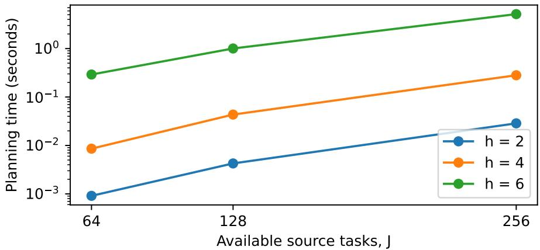  
Figure 6: Scaling with available sources and nuisance dimension. Each point averages three generated inputs. Target dimension is $k = J / 4$ . The number of subspace states is at most $\hat { \mathcal { N } } _ { h } = 2 ^ { O ( h ^ { 2 } ) }$ (5, 67 and 2825 for $h = 2 , 4 , 6 ;$ Appendix M).

Small-instance checks use 240 additional random banks with latent dimension at most seven and at most eleven source tasks. Exhaustive enumeration of source subsets agrees on all 1911 budget entries, using exact integer ranks. The independent certificate checker validates 40 closure-complete exports: 4104 subspace states and 1728 profile entries. Tamper tests cover incorrect ranks and incomplete state sets. Additional regression tests compare relative-weight definitions, Gaussian subspace counts, afine decoding, learned coordinate changes, and exact Bellman values.

The planner suite (python -m revision.run planner experiments), the independent certificate verifier (revision.verify planner certificate) and the saved-label and outcome audit (revision.audit learned plans) produce and check these results, and revision.make v4 assets regenerates their macros, runtime table and plots. No pretrained model is used. The audits check code and proof witnesses for finite models. The numbered results are checked separately in Lean 4 (start of the appendix).

## Q External comparison, local search and stress tests: results

This appendix reports in full the three experiments summarized in Section 3: a comparison with a published solver, the local-search comparison behind the best-baseline numbers, and stress tests of the learning proposition under label noise and nonuniform training. They measure, in turn, the planner’s speed in the parameter regime it targets, the quality of its acquisitions against source-aware search, and the sensitivity of the learned model to its assumptions. The external comparison receives known matrices; the local-search and stress studies fit models from labels. Protocols, software environments, seeds, acquisition costs, uncertainty and the replay procedure are in Appendix R.

<table><tr><td>Bank family</td><td>(k, h, J)</td><td>Banks</td><td>Agree</td><td>QSP (ms)</td><td>GHWs (ms)</td><td>Done</td></tr><tr><td>Low nuisance</td><td>(4,2, 12)</td><td>6</td><td> $6 / 6$ </td><td>0.37</td><td>30.91</td><td> $6 / 6$ </td></tr><tr><td>Wider low nuisance</td><td>(8, 3, 24)</td><td>6</td><td></td><td>1.49</td><td>timeout</td><td>0/6</td></tr><tr><td>Intermediate nuisance</td><td>(4,5, 12)</td><td>6</td><td>6/6</td><td>6.87</td><td>50.72</td><td>6/6</td></tr><tr><td>High nuisance, short bank</td><td>(3, 7, 12)</td><td>6</td><td>6/6</td><td>35.46</td><td>18.25</td><td> $6 / 6$ </td></tr><tr><td>RM(1,3)</td><td>(2,2,8)</td><td>1</td><td>1/1</td><td>0.37</td><td>13.13</td><td> $1 / 1$ </td></tr><tr><td>RM(1,4)</td><td>(2, 3, 16)</td><td>1</td><td> $1 / 1$ </td><td>0.78</td><td>16.44</td><td> $1 / 1$ </td></tr><tr><td>RM(2,4)</td><td>(4, 7, 16)</td><td>1</td><td> $1 / 1$ </td><td>106.79</td><td>18.95</td><td> $1 / 1$ </td></tr></table>

Table 2: An independent implementation computes the same profiles. Where both solvers finish, their complete rank profiles agree on every bank. Both compute the complete rank profile from identical inputs on one CPU, with two fresh-worker repetitions and a common 15-second wall cap. Times are medians over per-bank medians, excluding imports/worker startup but including input conversion. QSP completes all 27 banks; timeout entries are censored. RM rows are standard Reed–Muller constructions.

Published coding solver. We run the unmodified GHWs package of San-Jos´e (2025) at a pinned commit. Both solvers compute the complete rank profile. The kernels $K _ { 0 } = \ker B \subseteq K _ { 1 } = \ker N$ of (14), constructed in Appendix N, are nested codes, where N contains nuisance-quotient columns and B contains full source columns; GHWs computes their relative weight hierarchy. We use six independently generated banks in each of four $( k , h , J )$ regimes and three standard Reed–Muller constructions. Both methods run under the same SageMath 10.6 process environment on one CPU, with fresh workers, alternating order, two repetitions, and a 15-second wall cap per invocation. Timings exclude imports and worker startup but include input conversion; raw wall times and memory are also saved. QSP completes all 27 banks and GHWs 21, and every profile computed by both agrees exactly. The twelve censored GHWs invocations are the two repetitions on each of the six wider low-nuisance banks. GHWs is faster on the high-nuisance short banks and on RM(2,4), so the speed advantage depends on the parameter regime. The scaling grid of Appendix P, which does not involve GHWs, reaches $k = 6 4 , J = 2 5 6 , h = 6$ in about 5.15 seconds.

Two-exchange search on every acquisition family. We extend the largest-neighborhood local-search comparator to all 40 label-fitted banks: 16 independent and 16 nuisance-clustered banks with $( k , h , J ) = ( 1 6 , 4 , 4 8 )$ and eight scramblings of one coded geometry. Both methods receive the same fitted support, and each optimizes its own source/target split. The baseline starts from one-/two-step lookahead and the best of 32 random independent-source bases, then exhaustively considers one- and two-element swaps with steepest strict rank improvement. A residual-rank implementation evaluates the same neighborhood faster and is checked against the original exhaustive implementation. Timings include initialization, which uses neither the exact optimum nor the true coeficients. At the exact zero-error cap $C ^ { \star }$ , two-exchange accuracy is 0.734 on the independent banks and 0.812 on the clustered banks, and it matches QSP on all coded variants. The larger neighborhood does not always help, because this run’s lookahead breaks ties with diferent seeds than in Appendix P (its random bases also difer): on 1 independent and 2 clustered banks, the one-step lookahead there reaches accuracy one at C⋆ and two-exchange does not. We therefore also report the per-bank best over all released source-aware baselines: 0.750 and 0.875 at $C ^ { \star }$ . Evaluation at $C ^ { \star }$ magnifies small diferences in query counts. Averaged over the complete integer-budget grid, the gaps to $\mathrm { Q S P }$ are 2.83 and 2.36 percentage points for the two-exchange run and 2.28 and 1.10 for the best baseline; intervals and runtimes are in Table 4, and the lookahead and one-exchange results in Appendix P. Against source-aware baselines, QSP’s savings are modest, not exponential.

Source-label noise. On 24 further banks with $( k , h , J ) = ( 8 , 3 , 2 4 )$ , we fit from 18 joint labeled contexts and decode 512 independent test contexts per condition. Only source replies are flipped, independently, at rates 0, 0.001, 0.01, 0.03, 0.1; target demonstrations and target verification remain exact. The span learner is used unchanged, with a fixed computational guard that abstains when the fitted nuisance dimension exceeds six. We report success yield over every attempted context, counting abstention as unsuccessful, and accuracy conditional on producing a plan.

<table><tr><td>Family</td><td></td><td colspan="2">Two-exchange run</td><td colspan="2">Best released baseline</td><td>QSP</td></tr><tr><td></td><td>Banks</td><td>Acc. at  $C ^ { \star }$ </td><td>Gap (pp)</td><td>Acc. at  $C ^ { \star }$ </td><td>Gap (pp)</td><td>Acc. at  $C ^ { \star }$ </td></tr><tr><td>Independent linear</td><td>16</td><td>0.734</td><td>2.83</td><td>0.750</td><td>2.28</td><td>1.000</td></tr><tr><td>Clustered linear</td><td>16</td><td>0.812</td><td>2.36</td><td>0.875</td><td>1.10</td><td>1.000</td></tr><tr><td>Coded scramblings</td><td>8</td><td>1.000</td><td>0.01</td><td>1.000</td><td>0.00</td><td>1.000</td></tr></table>

Table 3: Local search on every family, against the best released baseline. Every method receives the same label-fitted model and optimizes its own source/target split. The two-exchange run uses a larger neighborhood than the lookahead and one-exchange heuristics of Appendix P but diferent random starts, and loses to one-step lookahead at $C ^ { \star }$ on three of the forty banks; the right-hand pair therefore reports the per-bank best over all released source-aware baselines. Gap averages QSP-minus-baseline population accuracy over all integer budgets from zero through source rank plus one. $\mathrm { Q S P }$ has accuracy one at $C ^ { \star }$ by definition of $C ^ { \star }$ . The coded rows are scramblings of one geometry.

At 1% noise, single measurements yield 0.402 overall: 13 of 24 banks abstain, and accuracy on the remaining eleven is 0.877. Three-measurement majority voting at both training and test raises yield to 0.9979 (bankbootstrap 95% interval [0.9972, 0.9986]), but increases training source calls from 432 to 1296 and the mean online physical cap to 25.25, compared with the clean single-measurement cap 9.25. All runs additionally use 18 noiseless target demonstrations. At 3% noise the learner without repetition abstains on every bank. The span learner is thus not robust to source-label noise, and $\mathrm { Q S P ^ { \prime } s }$ certificates hold for the fitted model, not for the true bank.

Nonuniform training and distribution shift. Using the same 24 banks without label noise, we draw independent latent bits with training probabilities $p = 0 . 5 , 0 . 2 , 0 . 0 5$ and fit at $m = 1 8 , 2 2 , 4 4$ . With $p = 0 . 5 , m = 1 8$ all supports recover and all evaluated policies succeed. With $p = 0 . 2$ , recovery rises from $1 7 / 2 4$ at $m = 1 8$ to $2 4 / 2 4$ at $m = 4 4$ . With $p = 0 . 0 5 , m = 4 4$ , only $9 / 2 4$ recover: yield is 0.876 under the training prior and 0.642 on uniform test worlds. Span learning therefore needs the training data to cover the latent support, and the finite-sample guarantee, which assumes uniform data, does not apply to these distributions. Every training context costs one target demonstration and 24 source calls

Validation and uncertainty. The test suite passes 199 tests. Saved-label replay checks all 368,640 stored context outcomes across the 720 stress cells and re-decodes the 559 of them that produced a plan; every successful external profile is recomputed with QSP. Intervals use 10,000 bootstrap resamples of banks, not of test contexts; conditions and training prefixes are paired. Complete protocols and results, including all noise and prior-shift failures, are in Appendix R.

## R External comparison, local search and stress tests: protocols

This appendix gives the protocols for the experiments of Appendix Q.

## R.1 Pinned external solver and equal computational task

The GHWs package (San-Jos´e, 2025) is released under the GPL-3.0 license. We obtain it from its public repository at commit eec8adb39deeac01bd0701026747c945367e4501, invoke it unmodified, and do not redistribute its source. We call rhierarchy(C1,C0,verbose=False) with default algorithmic options and do not tune it or test its optional low-memory variants. Before timing, its documented six-coordinate example is run and returns the documented weights (3, 5).

For full source columns B and quotient columns N, both over $\mathbb { F } _ { 2 }$ , we construct the nested codes

$$
C _ { 1 } = K _ { 1 } = \ker N , \qquad C _ { 0 } = K _ { 0 } = \ker B \subseteq C _ { 1 } .
$$

A relative generalized weight $d _ { r } ( C _ { 1 } , C _ { 0 } )$ equals the first source budget at which $\rho _ { b } \geq r$ . Consequently the complete relative weight hierarchy determines the same all-budget profile as QSP. GHWs timing includes code conversion, kernel computations, and hierarchy-to-profile conversion; QSP timing includes quotient preprocessing, state enumeration, and construction of its complete profile and source witnesses. Neither includes generating inputs or importing Sage and the packages. GHWs is not asked to produce QSP’s planner certificates.

Inputs, randomness, and limits. The four random regimes $\mathrm { a r e } \qquad ( k , h , J )$ ∈ $\{ ( 4 , 2 , 1 2 ) , ( 8 , 3 , 2 4 ) , ( 4 , 5 , 1 2 ) , ( 3 , 7 , 1 2 ) \}$ , with seeds $i ~ = ~ 0 , \ldots , 5$ . For each, Python’s random.Random receives seed $7 0 0 0 1 + 1 0 0 0 k + 1 0 0 h + i ;$ source columns are independent draws from the nonzero binary (k + h)-vectors, resampled as an entire bank until they span that space. Target rows are the first k coordinate vectors. Three further inputs use generator-matrix columns from Sage’s binary Reed–Muller codes RM(1,3), RM(1,4), and RM(2,4), with target ranks 2, 2, 4. All 27 banks are saved in results v5/external/instances.json.

Both solvers execute in fresh forked workers after imports, in alternating order for two repetitions. A parent process imposes the same 15-second wall deadline on every worker; at the deadline it terminates the worker and records a timeout. The time reported for completed runs is the internal algorithm timer, and wall time including worker overhead is saved separately. Timeouts are reported as censored: they are not converted to finite runtimes, dropped from completion counts, or counted as incorrect profiles. Group summaries take the median of the two timings for each bank, then the median over banks. The experiment has 108 solver invocations: 96 complete and 12 are censored, with no recorded solver errors. All 54 QSP invocations complete, and all 42 completed GHWs invocations agree exactly with QSP. The six GHWs-censored banks are censored in both repetitions.

The external run uses SageMath 10.6, Python 3.12.5, and the oficial Sage Docker image with its immutable digest recorded in image.json. The container has one CPU, a 5 GB memory limit, and no network access during algorithm execution. CPU information is saved in cpu.txt. Peak resident memory includes the Sage interpreter’s footprint. Timings in the local-search and stress experiments below come from a diferent environment and are not compared with these.

Crossover and preprocessing. Table 2 reports every regime. On the high-nuisance short banks the median runtime is 35.46 ms for QSP and 18.25 ms for GHWs. On RM(2,4) it is 106.79 versus 18.95 ms. On the wider low-nuisance banks QSP takes a median 1.49 ms, while neither GHWs repetition finishes within 15 seconds. Per-invocation conversion time, total time, returned profiles, censoring flags, and memory are released. With six banks per random regime and two timing repetitions, these runs locate the crossover but do not give precise speed ratios.

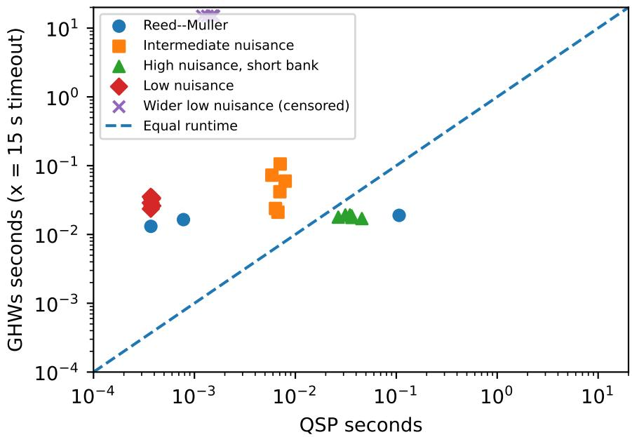  
Figure 7: Every external-comparison instance. Each point is the median of two repetitions. Crosses at 15 seconds are censored GHWs runs. Points on both sides of the diagonal show the crossover.

## R.2 Expanded two-exchange local search

The 40 banks and their joint training labels are those of Appendix P: 16 independent, 16 clustered, and eight coded scramblings. We refit the model from each stored label matrix and check that its fitted support equals the saved support. QSP and the baseline receive only this fitted target/source representation; the true coeficients are used only by the evaluator. All source queries are charged, and each strategy chooses its own source/target split.

The baseline initializes a per-budget best subset from one- and two-step joint-information lookahead and 32 randomized independent-source bases. It then examines all one- and two-element replacements, selecting the largest strictly positive transfer-rank increase, and repeats until none exists, so it stops at a zero-improvement plateau. Ties have deterministic iteration order. Its timings include the lookahead and random-basis initialization.

A residual-rank implementation evaluates the same neighborhood more eficiently. After dropping one or two source indices, reduce each candidate full vector and quotient vector modulo the respective remaining row spaces. The rank increment of two binary residuals u, v is

$$
\mathbf { 1 } \{ u \neq 0 { \mathrm { ~ o r ~ } } v \neq 0 \} + \mathbf { 1 } \{ u \neq 0 , v \neq 0 , u \neq v \} .
$$

Subtracting quotient-rank increment from full-rank increment gives the exact transfer-rank change. Twelve tests check on small banks that complete profiles and selected subsets agree with the brute-force neighborhood evaluator. The seeds and every fitted model, initial/final subset, runtime, and all-budget curve are in two exchange all families.json.

Let $C ^ { \star }$ be the exact model’s smallest total-call cap yielding zero error; QSP has accuracy one there by construction. Each bank also records its accuracy at every integer $C = 0 , \ldots , \operatorname { r a n k } ( B ) + 1$ , and the mean gap in Table 3 averages the population-accuracy diference over this grid, with equal weight on each budget. In the coded family the heuristic matches the zero-error threshold in all eight scramblings, which does not imply equality at every smaller budget.

<table><tr><td>Family</td><td>Acc. 95% interval</td><td>Gap interval (pp)</td><td>QSP (ms)</td><td>Two-exchange (ms)</td></tr><tr><td>Independent</td><td>[0.625,0.844]</td><td>[2.13,3.50]</td><td>10.56</td><td>500.65</td></tr><tr><td>Clustered</td><td>[0.688,0.938]</td><td>[1.34,3.40]</td><td>8.70</td><td>480.65</td></tr><tr><td>Coded</td><td>[1.000,1.000]</td><td>[0.00,0.03]</td><td>18.33</td><td>76.81</td></tr></table>

Table 4: Bank-bootstrap percentile intervals and mean runtimes for the expanded local-search comparison. Coded intervals reflect only eight scramblings of one geometry. These timings come from a diferent host than those of Table 2.

Confidence intervals use 10,000 percentile bootstrap resamples with bank as the resampling unit and seed 202609079. For the coded family they reflect only variation across scramblings of one geometry, and coded banks are not pooled with the independently generated ones.

## R.3 Source-label noise and repeated measurements

The stress generator creates 24 banks with $k = 8 , h = 3 , J = 2 4$ , alternating the independent and clustered generators with seed 202609071 ${ } + i , i = 0 , \ldots , 2 3$ . Every joint target/source support has rank 11. The logical source/target budget is fixed to each clean bank’s exact zero-error cap $C ^ { \star }$ (mean 9.25 calls). This cap is chosen from the true bank, so the study does not test whether the learner can choose a safe budget from corrupted data. We fit from $m = 1 8$ joint labeled contexts and draw 512 independent test contexts in each cell.

Noise flips each source measurement independently with $\epsilon \in \{ 0 , . 0 0 1 , . 0 1 , . 0 3 , . 1 \}$ . The target demonstrations in training remain noiseless, and test-time target equality queries remain exact. For repetition counts $r \in \{ 1 , 3 , 9 \}$ the source label is the majority of r independently noisy measurements in both training and test. Every physica measurement is charged: training costs 18 · 24 · r source queries and 18 target demonstrations, and a fitted policy that selects b sources and n target queries has online physical cap $r b + n$

All conditions reuse each bank’s clean training and test worlds and uniform noise arrays, with repetitions using prefixes, so cells are paired rather than independent. Worlds are independent draws from a finite space, so training and test worlds can coincide. The learner sees only its training joint labels. The evaluator stores labels for all potential test sources, but decoding reads only the selected indices; unit tests check that changing unrequested test source labels leaves the outcome unchanged.

Model misspecification and abstention. We apply the empirical-span learner without a robust-fitting change. It abstains if the target rank cannot be represented or if the inferred nuisance dimension exceeds the fixed computational guard $h = 6$ . As $\mathcal { N } _ { h } = 2 ^ { O ( h ^ { 2 } ) }$ , the guard caps planning at $\mathcal { N } _ { 6 } = 2 8 2 5$ states, as timed in Appendix P. Failed fits are not repaired with the true coeficients: planned policies keep their fitted supports, which can be incorrect, and contradictory observed source equations also produce unsuccessful outcomes.

We report support recovery, the number of banks producing a plan, success yield over all test attempts, and accuracy conditional on a plan. Abstentions count as unsuccessful in yield but not as incorrect answers. The online caps shown are averages over planned banks; training calls are incurred on abstaining banks too.
<table><tr><td>Noise (%)</td><td>Reps</td><td>Recovered</td><td>Planned</td><td>Yield</td><td>Conditional</td><td>Online cap</td><td>Train calls</td></tr><tr><td>0</td><td>1</td><td>24/24</td><td>24/24</td><td>1.0000</td><td>1.0000</td><td>9.25</td><td>432</td></tr><tr><td>0</td><td>3</td><td>24/24</td><td>24/24</td><td>1.0000</td><td>1.0000</td><td>25.25</td><td>1296</td></tr><tr><td>0</td><td>9</td><td>24/24</td><td>24/24</td><td>1.0000</td><td>1.0000</td><td>73.25</td><td>3888</td></tr><tr><td>0.1</td><td>1</td><td>14/24</td><td>24/24</td><td>0.9914</td><td>0.9914</td><td>9.25</td><td>432</td></tr><tr><td>0.1</td><td>3</td><td>24/24</td><td>24/24</td><td>1.0000</td><td>1.0000</td><td>25.25</td><td>1296</td></tr><tr><td>0.1</td><td>9</td><td>24/24</td><td>24/24</td><td>1.0000</td><td>1.0000</td><td>73.25</td><td>3888</td></tr><tr><td>1</td><td>1</td><td>0/24</td><td>11/24</td><td>0.4020</td><td>0.8771</td><td>9.18</td><td>432</td></tr><tr><td>1</td><td>3</td><td>20/24</td><td>24/24</td><td>0.9979</td><td>0.9979</td><td>25.25</td><td>1296</td></tr><tr><td>1</td><td>9</td><td>24/24</td><td>24/24</td><td>1.0000</td><td>1.0000</td><td>73.25</td><td>3888</td></tr><tr><td>3</td><td>1</td><td>0/24</td><td>0/24</td><td>0.0000</td><td></td><td></td><td>432</td></tr><tr><td>3</td><td>3</td><td>5/24</td><td>24/24</td><td>0.9705</td><td>0.9705</td><td>25.17</td><td>1296</td></tr><tr><td>3</td><td>9</td><td>24/24</td><td>24/24</td><td>1.0000</td><td>1.0000</td><td>73.25</td><td>3888</td></tr><tr><td>10</td><td>1</td><td>0/24</td><td>0/24</td><td>0.0000</td><td></td><td></td><td>432</td></tr><tr><td>10</td><td>3</td><td>0/24</td><td>0/24</td><td>0.0000</td><td></td><td></td><td>1296</td></tr><tr><td>10</td><td>9</td><td>18/24</td><td>24/24</td><td>0.9931</td><td>0.9931</td><td>73.25</td><td>3888</td></tr></table>

Table 5: All source-noise conditions. Yield counts abstaining banks as unsuccessful; conditional accuracy excludes them. “Recovered” means the fitted support equals the true support, which is used for evaluation only. Online cap is the mean physical cap over planned banks, charging every repeated source measurement. Every row also costs 18 noiseless target demonstrations per bank.

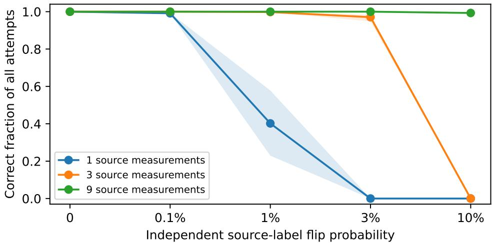  
Figure 8: The span learner is not noise-robust. Bands are bank-bootstrap intervals for yield, with abstention counted as failure. Repetition improves some conditions but multiplies acquisition cost, so the curves are not at equal physical budgets. Target feedback stays exact.

The noise study has 360 bank–noise–repetition cells. At 1% noise without repeats, 13 banks abstain and yield is 0.4020 (95% interval [0.2292, 0.5781]). Conditional accuracy on the eleven planned banks is 0.8771. Three repeats produce plans on every bank and yield 0.9979 ([0.9972, 0.9986]), at a mean physical online cap of 25.25 and 1296 training source calls. At 3% noise, one measurement produces no plans; three repeats yield 0.9705 ([0.9484, 0.9829]). Nine repeats incur 3888 training source calls and a mean physical online cap of 73.25 on planned banks. Repetition factors were not optimized.

## R.4 Nonuniform training and prior shift

The same 24 banks are evaluated without source-label noise. In the generator’s latent coordinates, bits are independent Bernoulli(p), with $p \in \{ . 5 , . 2 , . 0 5 \}$ . Target/source coeficient matrices remain fixed; only the latent distribution changes. Training sizes are $m \in \{ 1 8 , 2 2 , 4 4 \}$ . For $p < . 5 ,$ we evaluate both matched-prior test draws and a shift to independent uniform latent bits; for $p = . 5$ these coincide and are counted once. There are therefore 216 fitted models and 360 evaluation cells.

Training sets use prefixes of the same bank-specific uniform arrays, and test conditions use paired independent uniform arrays. Each evaluation uses 512 test draws, with repeat values allowed. The fitting procedure still treats its estimated support as uniform and uses the same clean threshold $C ^ { \star }$ , so the prior is misspecified. A nonuniform law with full support eventually reveals the correct span, but the finite-sample bound for uniform data does not apply. When the true support is recovered, a zero-error list covers that support whatever its prior weights; below zero error, the planner’s optimality guarantee assumes the uniform prior.
<table><tr><td>Train bit p</td><td>Contexts</td><td>Recovered</td><td>Planned</td><td>Same-prior yield</td><td>Uniform-test yield</td><td>Train calls</td></tr><tr><td>0.05</td><td>18</td><td>0/24</td><td>4/24</td><td>0.1436</td><td>0.0405</td><td>432</td></tr><tr><td>0.05</td><td>22</td><td>0/24</td><td>8/24</td><td>0.2834</td><td>0.0731</td><td>528</td></tr><tr><td>0.05</td><td>44</td><td>9/24</td><td>22/24</td><td>0.8761</td><td>0.6416</td><td>1056</td></tr><tr><td>0.2</td><td>18</td><td>17/24</td><td>24/24</td><td>0.9213</td><td>0.8516</td><td>432</td></tr><tr><td>0.2</td><td>22</td><td>22/24</td><td>24/24</td><td>0.9836</td><td>0.9563</td><td>528</td></tr><tr><td>0.2</td><td>44</td><td>24/24</td><td>24/24</td><td>1.0000</td><td>1.0000</td><td>1056</td></tr><tr><td>0.5</td><td>18</td><td>24/24</td><td>24/24</td><td>1.0000</td><td>1.0000</td><td>432</td></tr><tr><td>0.5</td><td>22</td><td>24/24</td><td>24/24</td><td>1.0000</td><td>1.0000</td><td>528</td></tr><tr><td>0.5</td><td>44</td><td>24/24</td><td>24/24</td><td>1.0000</td><td>1.0000</td><td>1056</td></tr></table>

Table 6: All nonuniform-training and shift conditions. Each training context costs one noiseless target demonstration in addition to the source calls shown. Rows share the same 24 banks and test random numbers. The uniform-data theorem does not provide its stated finite-sample recovery guarantee at $p < 1 / 2$

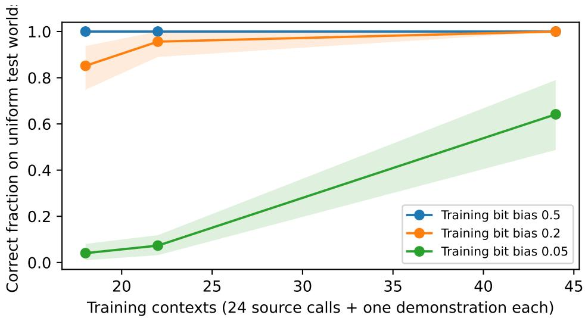  
Figure 9: Coverage of the latent support matters. Uniform-test yield after fitting under each training prior; bands resample banks. More training contexts overcome moderate bias but not the strongest bias tested. Each training context costs 24 source calls and one noiseless target demonstration.

At $p = . 0 5 , m = 4 4$ , only nine supports recover and 22 banks produce a plan; yield is 0.8761 on matched-prior test worlds and 0.6416 on uniform ones. We did not add a robust span estimator or select a best test-time

checkpoint.

## R.5 Saved evidence and reproduction

experiments v5/audit.py re-verifies each saved fitted support against its training labels by a rank identity, replays selected-source decoding on the 559 of 720 stress cells that produced a plan (286,208 decoded contexts), and checks all 368,640 stored per-context outcomes; the remaining cells are recorded abstentions, for which there is no plan to replay. It independently computes the rank of each fitted support from dense binary matrices. It also recomputes the 27 external profiles with QSP and checks every successful returned profile against the released inputs. SHA256 checks identify the external input file and exported byte content. The replay checks arithmetic and data integrity only.

The 199-test suite covers the planner, the rate–distortion solvers, the measurement, call-count and local-search implementations, and the scratchpad trace format. The 1,911 exhaustive profile comparisons, 5,440 exact Bellman comparisons, and 960 numerical rate–distortion points are released with their result files. The release includes all outcomes, among them timeouts, abstentions, incorrect fitted supports, and competitor wins.

Run bash scripts/reproduce paper.sh for the tests, the local experiments, the saved-external replay, the figures except Figures 4 and 5, and the manuscript build. By default it checks the saved external outputs without running Sage; with RUN EXTERNAL=1 on a host with Docker and network access it also reruns the pinned external solver (scripts/run external v5.sh).

## S Neural transfer experiments: details

All neural experiments use the decoder-only transformer of the released code: two pre-LayerNorm blocks with four-head attention and a GELU MLP of width $4 d _ { \mathrm { m o d e l } } , d _ { \mathrm { m o d e l } } = 1 2 8$ , learned positional embeddings, and a two-symbol output head over bits. Pretraining uses AdamW (learning rate $1 0 ^ { - 3 }$ , cosine decay, weight decay 0.01), batch 256, and the step counts listed with each run. Everything runs on CPU with four threads. A default pretraining run takes minutes at $d \leq 7 ;$ the widest and longest in-context runs and the scratchpad executors take between one and nine hours. Throughout, “seeds” index secrets $W ^ { \star }$ (and curricula) evaluated on a single pretraining run per bank; variation across banks is reported wherever a fraction is quoted. Seeds, banks, pretrained checkpoints’ statistics, per-run result files, and all exact distributions are in results v5/, produced by neural/exp transfer.py (in-weight learner) and neural/exp incontext.py (in-context learner).

Banks. Banks are generated by revision.planner instances.random bank with the seeds recorded in each result $\mathrm { f l e } ;$ latent dimension $d = k + h$ , independent target and nuisance coeficients, and an invertible coordinate scramble. The exact profile, $C ^ { \star }$ , and $( b ^ { \star } , n ^ { \star } )$ come from the quotient-subspace planner. Bit packing follows revision/quotient planner.py: coeficient i is bit i, and a target vector is indexed by $\textstyle \sum _ { i } a _ { i } 2 ^ { i }$

In-weight learner. Tokens are $[ \mathrm { B O S } , c , q ]$ with a context token c and a query token q naming a source or the target; target answers are emitted as k binary tokens fed back autoregressively. Pretraining draws a context uniformly among $n _ { \mathrm { k n o w n } }$ known contexts (fixed $W _ { c } )$ and 8 uncertain contexts (W resampled per sequence), and a query that is the target with probability $1 / 2 ;$ the loss is next-bit cross-entropy on answer positions. A held-out fraction of $1 / 4$ of the known contexts never shows its target prompt during pretraining, and target accuracy on those contexts is the structure diagnostic. Post-training uses one uncertain context and a secret $W ^ { \star }$ per seed. SFT acquisition reveals $v _ { j } W ^ { \star }$ with one verifier call (candidate zero passes or fails) and takes Adam steps (learning rate $3 \cdot 1 0 ^ { - 4 } )$ on that prompt until $P ( \mathrm { b i t } ) \geq 0 . 9$ , at most 300 steps; GRPO acquisition draws groups of $G = 8$ rollouts with group-normalized advantages, no KL term and no clipping (the $\mathrm { G R P O + K L }$ variant adds the penalty $0 . 1 \mathrm { K L } ( \pi \parallel \pi _ { \mathrm { r e f } } )$ to the loss on the source prompt, with $\pi _ { \mathrm { r e f } }$ the pretrained policy), until the same threshold or 25 groups, counting every rollout as a call. The target phase runs GRPO (G = 8, Adam $3 \cdot 1 0 ^ { - 4 } )$ until $P ( A ^ { \star } ) \geq 0 . 9$ , capped at min $( 3 0 / P _ { 0 } , 3 0 \cdot 2 ^ { k } ) + 5 0$ rollouts where $P _ { 0 }$ is the exact target probability after acquisition.

In-context learner. Sequences are [BOS], then (source , label) token pairs for a uniformly random ordered subset of at most min $( J , d + 2 )$ sources, then a target token and the k target bits. Pretraining draws W uniformly per sequence and trains next-bit prediction on every source label and target bit. At test time the prompt contains exactly the labels the curriculum acquired for $W ^ { \star }$ (one call each), and the target phase is as above. The budget profile sweeps the planner’s optimal subset at every source budget $b \leq \mathrm { r a n k } ( B )$ over 64 fresh worlds each, reporting the mean bits used, mean coset mass, the fraction of worlds whose argmax lies in the coset, and the mean rank of $A ^ { \star }$ (the calls of a most-probable-first eliminating learner), against the Bayes value $( 2 ^ { k - \rho } + 1 ) / 2$

Scratchpad learner. Banks are generated in canonical coordinates $( T$ is the identity on the first k latent bits; make canonical bank). This is a diferent generator from random bank: with the same seed it draws a diferent bank, and at $( k , h , J ) = ( 6 , 2 , 1 6 )$ the scratchpad bank has $\boldsymbol { b } ^ { \star } = 5$ where the in-context bank 0 ha $b ^ { \star } = 4$ $\mathrm { A }$ ppendix T runs the plain decoder on the scratchpad’s bank. A row is $d + 1$ bits in the column order nuisance bits, then $a _ { k - 1 } , \ldots , a _ { 0 }$ , then the right-hand side. For each acquired source, in acquisition order, the trace writes the row, then for each column $p = 0 , \ldots , d - 1$ writes the row again after XOR with the slot-p row if bit $p$ is set and slot $p$ is filled, and finally stores the reduced row in the slot of its pivot column (or writes an empty marker); slots are never modified once written. For each target bit $a _ { i }$ in the order $a _ { 0 } , \ldots , a _ { k - 1 }$ the trace writes the index tag, then, if the slot of $a _ { i } \mathrm { : }$ ’s column is filled, the running parity of that row’s right-hand side with the row’s entries at the already generated bits, and then the answer token; if the slot is empty it writes a free marker and the answer token, which is uniform under the data distribution. The model is the same two-block transformer with an added embedding of the token’s column within its row (TraceGPT); it is trained on the whole sequence except the prompt with batch 64 at $d = 5$ and 32 at $d = 8 .$ At test time the trace is generated greedily up to the target tag; each target bit’s chain of thought is generated greedily given the candidate’s earlier bits, and the probability of the answer token is read out, so $P ( A ^ { \star } )$ and the full distribution over $2 ^ { k }$ candidates use the model’s own computation. Trace length is linear in the number of acquired sources and quadratic in the latent dimension: with independent acquired rows it is $3 + 2 | S | + | S | ( d + 2 ) ^ { 2 }$ tokens up to the target tag (207 at $d = 5 , \vert S \vert = 4 )$ ; a dependent row emits a single empty marker instead of a stored row. Three executors are reported: at $d = 5 .$ width 128, two layers, 3000 steps, and width 256, three layers, 8000 steps; at $d = 8 ,$ width 256, three layers, 6000 steps (2.6M parameters, a trace of 513 tokens per context); a first version of the small executor with inconsistent field ids between training and generation is retained in results $\mathtt { \mathtt { - v } 5 / }$ with a buggyfields sufix and is not used.

Curricula. QSP uses the certificate’s attaining subset at budget $b ;$ greedy is one-step joint transfer-rank gain with seeded tie breaking (planner baselines.schedule); random is the prefix of a random independent source basis; none acquires no sources. Every method has the same $b ^ { \star }$ and the same secret, and all reported probabilities are computed exactly. Table 9 in Appendix T reports every curriculum at $b ^ { \star }$ for $d = 5 ,$ 8 and 11.
<table><tr><td>acquisition</td><td>curriculum</td><td>runs</td><td>calls</td><td>coset mass</td><td>bits used</td><td>up/down</td><td>wrecked</td><td>rollouts (ref.)</td><td></td></tr><tr><td>SFT</td><td>none</td><td>9</td><td>0</td><td>1.000</td><td>-0.03</td><td>0/0</td><td>0</td><td></td><td>65.6 (64.0)</td></tr><tr><td></td><td>qsp</td><td>9</td><td>5</td><td>0.054</td><td>-2.06</td><td>0/9</td><td>3</td><td></td><td>26893 (2.7)</td></tr><tr><td></td><td>greedy</td><td>9</td><td>5</td><td>0.049</td><td>-0.41</td><td>2/4</td><td>2</td><td> $3 . 1 \times 1 0 ^ { 1 1 } \ \dot { ( 2 . 7 ) }$ </td><td></td></tr><tr><td></td><td>random</td><td>9</td><td>5</td><td>0.076</td><td>-0.08</td><td>3/5</td><td>0</td><td></td><td>81.6 (8.0)</td></tr><tr><td>GRPO</td><td>none</td><td>9</td><td>0</td><td>1.000</td><td>-0.03</td><td>0/0</td><td>0</td><td></td><td>65.6 (64.0)</td></tr><tr><td></td><td>qsp</td><td>9</td><td>437</td><td>0.000</td><td>-3.75</td><td>0/9</td><td>7</td><td></td><td> $2 . 9 \times 1 0 ^ { 1 8 } \ : ( 2 . 7 )$ </td></tr><tr><td></td><td>greedy</td><td>9</td><td>436</td><td>0.000</td><td>-3.98</td><td>0/9</td><td>7</td><td> $9 . 6 \times 1 0 ^ { 1 7 }$ </td><td>(2.7)</td></tr><tr><td></td><td>random</td><td>9</td><td>532</td><td>0.000</td><td>-2.42</td><td>0/9</td><td>6</td><td></td><td> $3 . 1 \times 1 0 ^ { 1 8 } \ \mathrm { \dot { ( } 8 . 0 \dot { ) } }$ </td></tr><tr><td> $\mathrm { G R P O + K L }$ </td><td>none</td><td>9</td><td>0</td><td>1.000</td><td>-0.03</td><td>0/0</td><td>0</td><td></td><td>65.6 (64.0)</td></tr><tr><td></td><td>qsp</td><td>9</td><td>400</td><td>0.012</td><td>-2.71</td><td>0/9</td><td>4</td><td> $5 . 7 \times 1 0 ^ { 1 1 } \ : \mathrm { ( 2 . 7 ) }$ </td><td></td></tr><tr><td></td><td>greedy</td><td>9</td><td>430</td><td>0.000</td><td>-1.37</td><td>1/8</td><td>5</td><td> $2 . 2 \times 1 0 ^ { 1 6 }$ </td><td>(2.7)</td></tr><tr><td></td><td>random</td><td>9</td><td>453</td><td>0.000</td><td>-2.19</td><td>0/7</td><td>6</td><td> $1 . 0 \times 1 0 ^ { 1 7 } \ \mathrm { \dot { ( } 8 . 0 \dot { ) } }$ </td><td></td></tr></table>

Table 7: In-weight acquisition at $k = 6$ (three banks, three secrets each). Calls are verifier calls spent on sources (mean over runs); coset mass is the median over runs; bits used is $k + \log _ { 2 }$ of the mean over runs of $P ( A ^ { \star } )$ after acquisition; up/down counts runs whose own bits used moved above +0.2 or below −0.2; a run is wrecked when the coset mass falls below $1 0 ^ { - 2 }$ ; rollouts is the expected number of policy samples until the first verified success, $\mathbb { E } \left[ 1 / P ( A ^ { \star } ) \right]$ over runs, with the exact posterior in parentheses. GRPO runs whose source becomes confidently wrong receive no reward gradient afterwards (all-fail groups) and spend their remaining cal budget without acquiring the label.

Bayes-optimal training loss. For the in-context task, the optimal predictor of each supervised bit is the exact posterior given the labels seen so far, computed by enumerating all $2 ^ { d }$ worlds (neural/bayes loss.py, 1000 sampled training sequences per bank). Its average cross-entropy is 0.44 nats at d = 5, 0.48 at $d = 6 , 0 . 4 8$ at $d = 7 , 0 . 4 8$ at $d = 8$ , and 0.50 at $d = 1 1$ , against ln $2 = 0 . 6 9 3$ for an uninformed predictor; a model whose training loss stays at ln 2 has captured none of the available signal.

<table><tr><td>bank</td><td>width</td><td>layers</td><td>steps</td><td>lr</td><td>final training loss</td><td>bits used at b*</td></tr><tr><td>0</td><td>64</td><td>2</td><td>6,000</td><td>0.001</td><td>0.693</td><td>-0.01 of 4</td></tr><tr><td>0</td><td>128</td><td>2</td><td>6,000</td><td>0.0003</td><td>0.693</td><td>-0.04 of 4</td></tr><tr><td>0</td><td>128</td><td>2</td><td>6,000</td><td>0.001</td><td>0.693</td><td>0.00 of 4</td></tr><tr><td>0</td><td>128</td><td>2</td><td>6,000</td><td>0.003</td><td>0.693</td><td>0.00 of 4</td></tr><tr><td>0</td><td>256</td><td>2</td><td>6,000</td><td>0.001</td><td>0.692</td><td>-0.03 of 4</td></tr><tr><td>0</td><td>256</td><td>2</td><td>20,000</td><td>0.001</td><td>0.693</td><td>0.00 of 4</td></tr><tr><td>0</td><td>256</td><td>4</td><td>6,000</td><td>0.001</td><td>0.693</td><td>0.01 of 4</td></tr><tr><td>0</td><td>512</td><td>2</td><td>6,000</td><td>0.001</td><td>0.693</td><td>0.00 of 4</td></tr><tr><td>1</td><td>64</td><td>2</td><td>6,000</td><td>0.001</td><td>0.617</td><td>1.96 of 5</td></tr><tr><td>1</td><td>128</td><td>2</td><td>6,000</td><td>0.001</td><td>0.634</td><td>1.00 of 5</td></tr><tr><td>1</td><td>256</td><td>2</td><td>6,000</td><td>0.001</td><td>0.646</td><td>1.00 of 5</td></tr><tr><td>2</td><td>64</td><td>2</td><td>6,000</td><td>0.001</td><td>0.692</td><td>0.01 of 5</td></tr><tr><td>2</td><td>128</td><td>2</td><td>6,000</td><td>0.001</td><td>0.685</td><td>0.77 of 5</td></tr><tr><td>2</td><td>256</td><td>2</td><td>6,000</td><td>0.001</td><td>0.693</td><td>0.00 of 5</td></tr></table>

Table 8: In-context decoder capacity sweep at $k = 6 \ ( d = 8 )$ : 8 configurations in 14 runs, 3 of them on all three banks and the rest on bank 0, one pretraining seed per row. The Bayes-optimal training loss for banks 0, 1, 2 is 0.477, 0.476, 0.472 nats against the uninformed value ln $2 = 0 . 6 9 3$ , so every configuration that stays at ln 2 has left the whole learnable signal on the table.

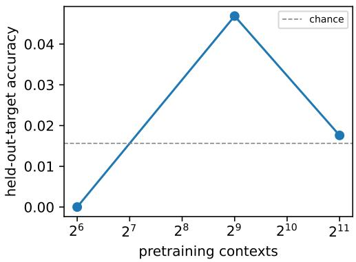

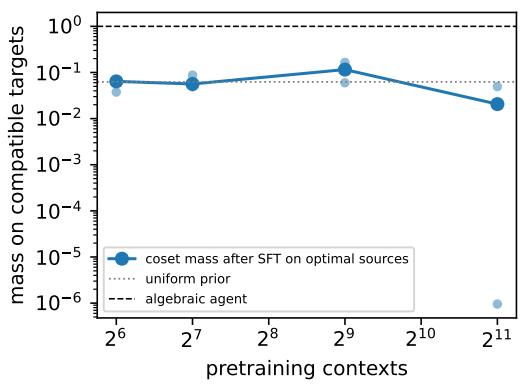  
Figure 10: Diversity does not buy structure for the in-weight learner. $k = 6 ,$ one bank; left, target accuracy on known contexts whose target prompt was held out of pretraining; right, coset mass after SFT on the planner’s sources, per run and median, against the prior and the algebraic agent.

GRPO lock-in. A source whose answer has become confidently wrong through earlier updates receives only all-fail groups, whose group-normalized advantage is zero, and the label is never acquired within the cap of 25 groups. The implementation still takes an optimizer step on such groups, and one Adam state is shared across sources, so momentum keeps moving the parameters without a policy gradient. We count a source as locked in when its final probability is below $1 0 ^ { - 2 }$ . Under GRPO, 16 of the 27 runs with a curriculum end with a locked-in source, and 51% of the source calls of all 27 runs go to sources that end locked in (13 runs and 47% with the KL term). The damage to the target prior is partly an artifact of this implementation, so these runs say nothing general about policy-gradient methods.

Undiscovered runs. A target run that reaches its cap without a reward is reported as undiscovered and counted at its cap in call totals. GRPO acquisition on source prompts often drives the target probability below $1 0 ^ { - 6 } ;$ those runs are retained.

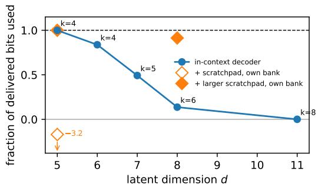

Figure 11: Fraction of delivered bits used against latent dimension, at the zero-error split with the planner’s sources. In-context decoder: three banks per point at width 128 (one pretraining run per bank). Diamonds: the scratchpad executors, each on its own canonical bank, which difers from the in-context banks. The smaller $d = 5$ executor puts less probability on $A ^ { \star }$ than the uniform prior, so its fraction is negative; it is drawn at the bottom edge with its value.  
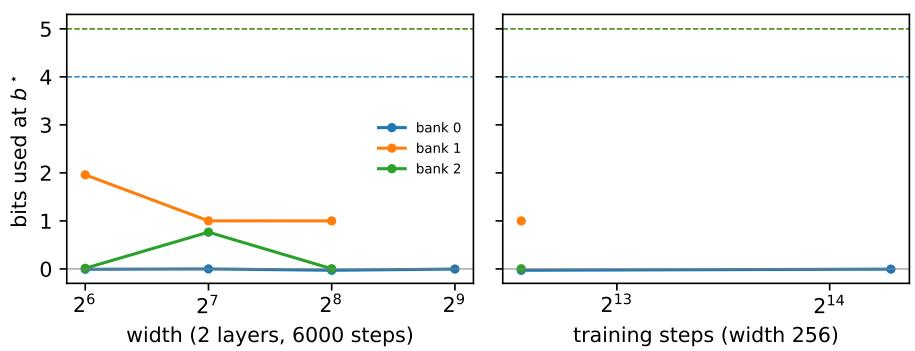  
Figure 12: Capacity sweep at $d = 8 .$ . In-context decoder on each of the three $d = 8$ banks, one pretraining seed per configuration: bits used at the zero-error split against width (two layers, 6000 steps) and against training steps (width 256). Dashed lines mark each bank’s delivered bits (4, 5 and 5). No configuration reaches the frontier, and with one seed per configuration there is no clear trend in width or steps.

## T Curricula, degree analysis and controls

Setup of Section 4. The in-context learner is a two-layer decoder-only transformer $( d _ { \mathrm { m o d e l } } = 1 2 8 .$ about 0.4M parameters) trained from scratch. It is pretrained on sequences that list the acquired (source, label) pairs for a random subset of sources, followed by the k target bits. At test time the planner chooses which labels appear in the prompt, one call each. We use $( k , h , J ) \in \{ ( 4 , 1 , 8 ) , ( 4 , 2 , 1 2 ) , ( 5 , 2 , 2 0 ) , ( 6 , 2 , 1 6 ) , ( 8 , 3 , 3 2 ) \}$ , so the latent dimension is $d = k + h \in \{ 5 , 6 , 7 , 8 , 1 1 \}$ , with three random banks for each and four secrets per bank. Each bank has one pretraining run of 6,000 steps (8,000 at $d = 1 1 )$ , and bank 0 at $d \in \{ 6 , 7 , 8 \}$ is repeated with three training seeds (Appendix S). We evaluate at the zero-error split, with the $b ^ { \star }$ sources of an optimal split of $C ^ { \star }$ (Section 3).

Spread over banks and seeds. At the zero-error split the fraction used ranges over banks from 49% to 100% at $d = 6 ,$ 0% to 78% at $d = 7$ and 0% to 20% at $d = 8$ . On bank 0, three training seeds span 49%–66% at $d = 6 .$ 1%–26% at $d = 7$ and 0%–12% at $d = 8 .$ . Bayes-optimal pretraining losses are in Appendix S. Post hoc per-bit scores (Table 10) show that at 6,000 steps each determined bit is used almost fully or almost not at all.

What choosing sources is worth. Table 9 compares curricula at the zero-error split. At $d = 5 ,$ , where the decoder decodes, the learner reproduces the ordering that the exact references fix. The planner’s sources need 2.7 expected samples against the posterior’s 2.7; a random basis needs 7.8 against 5.3; no sources need 16.0. At $d = 8$ the exact references still difer by a factor of 24.0 between the planner’s sources and none, but the learner’s costs difer by a factor of 1.4. Counted in distinct verifications instead, as in Theorem 9, the planner’s sources leave the

Supervised traces. A variant pretrained to write out the elimination, reducing each acquired row against a table of pivots, uses 91% of the delivered bits with the planner’s sources on a separately drawn $d = 8$ bank. The variant is larger (2.6M parameters) and supervised at every step, so this separates neither size nor serial computation from process supervision (Wies et al., 2023; Abbe et al., 2024; Kim and Suzuki, 2025).

Curricula. Table 9 gives the costs quoted in Section 4. Guesses count distinct verifications, as in Theorem 9;   
samples count draws with replacement, as a policy makes them.

Table 9: Curricula at the zero-error split (in-context decoder, three banks, four secrets each; |S| ranges over banks, whose b⋆ difer). Bits are $k + \log _ { 2 } \mathbb { E }$ over contexts of $2 ^ { \rho - k }$ (delivered) and of $P ( A ^ { \star } )$ (used). On frontier is the fraction of contexts whose own bits used are within 0.2 of their own $\rho ( S )$ ; coset mass is the mean probability the learner puts on the targets compatible with the acquired labels. Samples is the expected number of draws, with replacement, from the unchanged policy until a verification accepts, $\mathbb { E } [ 1 / P ( A ^ { \star } ) ]$ ; guesses is the number of distinct verifications made by a learner that verifies its most probable answers first, as in Theorem 9, averaged over contexts. The exact posterior is in parentheses: $\mathbb { E } [ 2 ^ { k - \rho } ]$ samples and $\mathbb { E } [ ( 2 ^ { k - \rho } + 1 ) / 2 ]$ guesses. Means are over twelve contexts and are therefore noisy: without sources every learner has the same expected number of guesses as the exact posterior, $( 2 ^ { k } + 1 ) / 2 ,$ so the diference in those rows is sampling noise.
<table><tr><td>d</td><td>sources</td><td>|S|</td><td>delivered</td><td>used</td><td>on frontier</td><td>coset mass</td><td>samples (exact)</td><td>guesses (exact)</td></tr><tr><td rowspan="4">5</td><td>none</td><td>0</td><td>0.00</td><td>0.00</td><td>1.00</td><td>1.00</td><td>16.0 (16.0)</td><td>8.0 (8.5)</td></tr><tr><td>random basis</td><td>2-3</td><td>1.74</td><td>1.40</td><td>0.75</td><td>0.86</td><td>7.8 (5.3)</td><td>4.2 (3.2)</td></tr><tr><td>greedy</td><td>2-3</td><td>2.74</td><td>2.65</td><td>0.92</td><td>0.96</td><td>2.8 (2.7)</td><td>1.8 (1.8)</td></tr><tr><td>planner</td><td>2-3</td><td>2.74</td><td>2.74</td><td>1.00</td><td>1.00</td><td>2.7 (2.7)</td><td>1.6 (1.8)</td></tr><tr><td rowspan="4">8</td><td>none</td><td>0</td><td>0.00</td><td>0.00</td><td>1.00</td><td>1.00</td><td>64.0 (64.0)</td><td>34.8 (32.5)</td></tr><tr><td>random basis 4–6</td><td></td><td>3.58</td><td>0.44</td><td>0.00</td><td>0.14</td><td>51.8 (8.0)</td><td>24.0 (4.5)</td></tr><tr><td>greedy</td><td>4-6</td><td>4.74</td><td>0.63</td><td>0.00</td><td>0.06</td><td>45.6 (2.7)</td><td>23.6 (1.8)</td></tr><tr><td>planner</td><td>4-6</td><td>4.74</td><td>0.65</td><td>0.00</td><td>0.06</td><td>45.2 (2.7)</td><td>20.9 (1.8)</td></tr><tr><td rowspan="4">11</td><td>none</td><td>0</td><td>0.00</td><td>0.00</td><td>1.00</td><td>1.00</td><td>256 (256)</td><td>105.2 (128.5)</td></tr><tr><td>random basis</td><td>8</td><td>5.00</td><td>0.00</td><td>0.00</td><td>0.03</td><td>256 (8.0)</td><td>96.6 (4.5)</td></tr><tr><td>greedy</td><td>8</td><td>6.58</td><td>0.00</td><td>0.00</td><td>0.01</td><td>256 (3.0)</td><td>103.2 (2.0)</td></tr><tr><td>planner</td><td>8</td><td>7.00</td><td>0.00</td><td>0.00</td><td>0.01</td><td>256 (2.0)</td><td>104.1 (1.5)</td></tr></table>

Degree. Target bits are emitted in the order $a _ { 0 } , \ldots , a _ { k - 1 }$ and teacher-forced, so when the decoder predicts $a _ { i }$ it has seen the acquired labels and $a _ { 0 } , \ldots , a _ { i - 1 }$ . Bit $a _ { i }$ is determined when $T _ { i }$ lies in the span of the acquired rows $B _ { S }$ and $T _ { 0 } , \dots , T _ { i - 1 }$ , and its degree is the fewest of those rows whose XOR is $T _ { i }$ . The degree is computed from the bank and the planner’s subset alone (neural/select degree banks.py). Table 11 lists every bank. On the released banks, a bank’s largest degree separates the five banks on the frontier (at least 99% of the delivered bits used) from the ten that are not (at most 78%); no released bank has largest degree three. The per-bit account is weaker: at $d \geq 7$ some banks use none of their degree-two bits.

Degree-controlled test. Because degree grows with d in the released banks, we fixed $( k , h , J ) = ( 4 , 2 , 1 2 )$ drew banks from a seed range disjoint from all other runs, and, among banks with at least three determined bits, kept the first three whose determined bits all have degree at most two and the first three with a bit of degree four or more (results v6/degree banks.json). Before training we recorded two predictions: (P1) at least 95% of the delivered bits are used on every low bank and less than 95% on every high bank; (P2) on every high bank the bits used are at most the number of determined bits of degree at most two, plus 0.5. Each bank was trained with the default configuration and two training seeds. On the low banks the decoder used 66%–69% of the delivered bits, and on the high banks 42%–67%. P1 failed: every low-degree run lost between 0.92 and 1.03 of its 3 delivered bits, so low degree is not suficient. In ten of the twelve runs, low- and high-degree alike, the decoder used between 1.97 and 2.08 of the 3 bits. P2 held on the controlled banks, but its bound fails on two of the 15 banks above: bank 0 at $d = 6$ converted 1.98 and 1.90 bits under two further training seeds with only one bit of degree at most two, and bank 2 at $d = 8$ converted 0.77 bits with no bit of degree at most two. Degree therefore neither guarantees nor bounds use.

Which bit is lost (post hoc). To see which delivered bit the decoder loses, we reran the first training seed of the controlled banks with the same seeds, which reproduces every recorded probability exactly, stored the full distribution over targets, and scored the budget curve on all $2 ^ { d } = 6 4$ secrets (Table 10; results v6/run perbit2.sh). On all six banks the decoder uses each determined bit either almost fully (at least 0.99 bit) or almost not at all (at most 0.14 bit). At $b ^ { \star }$ the lost bits are $a _ { 0 }$ on two banks (degrees 2, 2); $a _ { 1 }$ on four banks (degrees 2, 3, 4, 4); $a _ { 2 }$ on one bank (degree 4). With every source given, so that every target bit is determined, it uses $a _ { 0 }$ on no bank, $a _ { 1 }$ on two, a2 on four and $a _ { 3 }$ on all six banks: at this budget use depends on the position of a bit in the answer, and the first bit is never used. We have no explanation for this pattern. Degree does not predict it, nor does how often a bit is determined during pretraining. The fewest acquired labels a bit needs, counting earlier target bits as free, separates used from lost bits on 17 of the 18 determined bits here, but it fails on the released banks at $d \in \{ 5 , 6 \}$ , where bits that need two labels are used (neural/perbit diagnostics.py). Scoring all 64 secrets instead of four changes the bits used by at most 0.21 bit.

Four times the training budget (post hoc). After bank 202609503 reached the frontier when trained for 24,000 steps instead of 6,000, we recorded two predictions for the remaining five banks before any of their results were seen (results v6/long predictions.json): (L1) at least 95% of the delivered bits used at $b ^ { \star }$ on every low-degree bank and less on every high-degree bank; (L2) on every high-degree bank, bits used at most the number of determined bits of degree at most two, plus 0.5. Training four times longer (24,000 steps, same seeds): on bank 202609500 the final loss moved from 0.579 to 0.541 nats (Bayes-optimal 0.471) and the bits used from 2.17 to 3.00 of 3; on bank 202609503 the final loss moved from 0.490 to 0.482 nats (Bayes-optimal 0.445) and the bits used from 2.00 to 3.00 of 3, at the frontier for every source budget; on bank 202609512 the final loss moved from 0.549 to 0.519 nats (Bayes-optimal 0.463) and the bits used from 2.00 to 2.00 of 3; on bank 202609506 the final loss moved from 0.621 to 0.527 nats (Bayes-optimal 0.480) and the bits used from 1.16 to 2.76 of ${ 3 ; }$ on bank 202609518 the final loss moved from 0.568 to 0.530 nats (Bayes-optimal 0.466) and the bits used from 2.00 to 2.01 of 3; on bank 202609534 the final loss moved from 0.564 to 0.540 nats (Bayes-optimal 0.477) and the bits used from 2.00 to 2.00 of 3. Scored on all 64 secrets with one training seed (the 6,000-step ranges of Section 4 use four secrets and two seeds), the low-degree banks used 67%–100% of the delivered bits and the high-degree banks 67%–92%; prediction (L1) failed and (L2) failed. Longer training lowers the loss on every bank, but whether a bit is recovered is not predicted by its degree: the recovered bits have degrees two and three, one of degree four is recovered partly (0.72 bit), and a degree-two bit $\left( a _ { 1 } \right)$ stays lost on bank 202609512.

Table 10: Which bit is lost (post hoc). Controlled banks, first training seed, 6,000 pretraining steps unless stated, rerun with the same seeds (reproducing the recorded runs exactly) and scored on all $2 ^ { d } = 6 4$ secrets. Per-bit use of $a _ { i }$ is $1 + \mathbb { E } \log _ { 2 } P ( a _ { i } \mid a _ { < i } $ , labels); the four terms add up to $k + \mathbb { E } \log _ { 2 } P ( A ^ { \star } )$ , which is at most the bits used $k + \log _ { 2 } \mathbb { E } P ( A ^ { \star } )$ by Jensen’s inequality. Bits used over all 64 secrets are compared with the four-secret estimate of Table 11. The column for all sources scores the largest budget on the planner’s profile, where every target bit is determined; the last column repeats $b ^ { \star }$ after 24,000 steps.
<table><tr><td>set</td><td>bank</td><td>degrees at  $b ^ { \star }$ </td><td>per-bit use at  $b ^ { \star }$ </td><td>used (64)</td><td>used (4)</td><td>per-bit use, all sources</td><td>at  ${ b ^ { \star } , }$  24,000 steps</td></tr><tr><td>low</td><td>202609500</td><td>(2, 2, ·, 1)</td><td>0.13, 1.00, 0.00, 1.00</td><td>2.17</td><td>1.97</td><td>0.02, 1.00, 0.03, 1.00</td><td>1.00, 1.00, 0.00, 1.00</td></tr><tr><td>low</td><td>202609503</td><td>(2, 2, ., 2)</td><td>0.00, 1.00, 0.00, 1.00</td><td>2.00</td><td>2.00</td><td>0.00, 1.00, 1.00, 1.00</td><td>1.00, 1.00, 0.00, 1.00</td></tr><tr><td>low</td><td>202609512</td><td>(·, 2, 1, 2)</td><td>0.00, 0.00, 1.00, 1.00</td><td>2.00</td><td>2.00</td><td>0.00, 0.00, 1.00, 1.00</td><td>0.00, 0.00, 1.00, 1.00</td></tr><tr><td>high</td><td>202609506</td><td>(·, 3, 4, 2)</td><td>0.00, 0.02, 0.11, 1.00</td><td>1.16</td><td>1.27</td><td>0.01, 0.02, 0.03, 1.00</td><td>0.00, 1.00, 0.72, 1.00</td></tr><tr><td>high</td><td>202609518</td><td>(·, 4, 2, 1)</td><td>0.00, 0.00, 1.00, 1.00</td><td>2.00</td><td>2.00</td><td>0.00, 0.00, 1.00, 1.00</td><td>0.00, 0.01, 1.00, 1.00</td></tr><tr><td>high</td><td>202609534</td><td>(, 4, 2, 2)</td><td>0.00, 0.00, 1.00, 1.00</td><td>2.00</td><td>2.00</td><td>0.02, 0.02, 1.00, 1.00</td><td>0.00, 0.00, 1.00, 1.00</td></tr></table>

Same-bank control for the scratchpad. The d = 8 scratchpad executor was trained and evaluated on its own bank, drawn by make canonical bank. The plain decoder, trained on that same bank, uses 40% with the planner’s sources (37% over the three curricula). The comparison with the scratchpad therefore concerns one bank, twelve contexts, and learners that difer in supervision, architecture and size, as well as in serial computation.

Table 11: XOR degrees and bits used at the zero-error split. Degree of target bit ${ { a } _ { i } } \mathrm { : }$ the fewest rows among the planner’s acquired source rows and the earlier target rows whose XOR is $T _ { i }$ (· = not determined). Bits are $k + \log _ { 2 }$ E of $2 ^ { \rho - k }$ (delivered) and of $P ( A ^ { \star } )$ (used) over four secrets with the planner’s sources. Released banks list one training seed, except bank 0 at $d \in \{ 6 , 7 , 8 \}$ , which lists three; controlled banks list both training seeds.
<table><tr><td>set</td><td> $d$ </td><td>bank</td><td>degrees  $( a _ { 0 } , \ldots , a _ { k - 1 } )$ </td><td>delivered</td><td>used</td></tr><tr><td>released</td><td>5</td><td>0</td><td>(·, 1, , 2)</td><td>2.00</td><td>2.01</td></tr><tr><td>released</td><td>5</td><td>1</td><td>(·, 2, 2, 2)</td><td>3.00</td><td>2.99</td></tr><tr><td>released</td><td>5</td><td>2</td><td>(·, 2, 2, 2)</td><td>3.00</td><td>3.00</td></tr><tr><td>released</td><td>6</td><td>0</td><td>(, 1,4, 3)</td><td>3.00</td><td>1.46, 1.98, 1.90</td></tr><tr><td>released</td><td>6</td><td>1</td><td>(∴, , 2, 2)</td><td>2.00</td><td>1.99</td></tr><tr><td>released</td><td>6</td><td>2</td><td>(·, 2, 2, 2)</td><td>3.00</td><td>3.00</td></tr><tr><td>released</td><td>7</td><td>0</td><td>(2, ·, 4, 2, 3)</td><td>4.00</td><td>1.03, 0.03, 1.01</td></tr><tr><td>released</td><td>7</td><td>1</td><td>(·, 5, 2, 2, 2)</td><td>4.00</td><td>3.12</td></tr><tr><td>released</td><td>7</td><td>2</td><td>(·, 4, 3, 2, 2)</td><td>4.00</td><td>0.02</td></tr><tr><td>released</td><td>8</td><td>0</td><td>(·, , 3, 3, 2, 4)</td><td>4.00</td><td>0.00, -0.02, 0.48</td></tr><tr><td>released</td><td>8</td><td>1</td><td>(1, 4, ·, 2, 3, 3)</td><td>5.00</td><td>1.00</td></tr><tr><td>released</td><td>8</td><td>2</td><td>(3, · , 3, 3, 4, 3)</td><td>5.00</td><td>0.77</td></tr><tr><td>released</td><td>11</td><td>0</td><td>(·, 6, 3, 5, 3, 3, 2, 3)</td><td>7.00</td><td>0.00</td></tr><tr><td>released</td><td>11</td><td>1</td><td>(·, 5, 2, 3, 3, 4, 4, 3)</td><td>7.00</td><td>0.00</td></tr><tr><td>released</td><td>11</td><td>2</td><td>(6, 2, ·, 3, 3, 3, 5, 4)</td><td>7.00</td><td>0.00</td></tr><tr><td>controlled (low)</td><td>6</td><td>202609500</td><td>(2, 2, , 1)</td><td>3.00</td><td>1.97, 2.06</td></tr><tr><td>controlled (low)</td><td>6</td><td>202609503</td><td>(2, 2, , 2)</td><td>3.00</td><td>2.00, 2.08</td></tr><tr><td>controlled (low)</td><td>6</td><td>202609512</td><td>(·, 2, 1, 2)</td><td>3.00</td><td>2.00, 2.01</td></tr><tr><td>controlled (high)</td><td>6</td><td>202609506</td><td>(·, 3, 4, 2)</td><td>3.00</td><td>1.27, 1.25</td></tr><tr><td>controlled (high)</td><td>6</td><td>202609518</td><td>(·, 4, 2, 1)</td><td>3.00</td><td>2.00, 1.99</td></tr><tr><td>controlled (high)</td><td>6</td><td>202609534</td><td>(·, 4, 2, 2)</td><td>3.00</td><td>2.00, 2.01</td></tr></table>

## U Numerical methods, certificates, and reproducibility

## U.1 Two independently formulated optimizations

For fixed $\beta ,$ enumerate coverage columns and maximize $\begin{array} { r } { F _ { \beta } ( \mu ) = \sum _ { \theta } q _ { \theta } \ln \sum _ { L } \mu _ { L } e ^ { \beta c _ { \theta L } } } \end{array}$ over the simplex, using analytic gradients and a sequential quadratic programming optimizer. A multiplicative Blahut–Arimoto polishing step is available. The returned Gibbs channel is evaluated directly, using its actual marginal $\mu ^ { \prime } = q W$ rather than assuming that the optimization variable is already its marginal.

There is a globally valid certificate even before convergence. For the current $\mu ,$ define Z, $\begin{array} { r } { g _ { L } = \sum _ { \theta } q _ { \theta } e ^ { \beta c _ { \theta L } } / Z _ { \theta } } \end{array}$ and $g _ { \mathrm { m a x } } = \operatorname* { m a x } _ { L } { g _ { L } }$ . At the channel’s achieved success $s ,$ a lower bound on its optimal information cost is

$$
{ \frac { \beta s - F _ { \beta } ( \mu ) - \ln g _ { \mathrm { m a x } } } { \ln 2 } } .
$$

The actual channel information equals $[ \beta s - F _ { \beta } ( \mu ) - D _ { \mathrm { n a t } } ( \mu ^ { \prime } \| \mu ) ] / \ln 2$ . Their diference is a primal–dual gap; failed certificates raise an error rather than being reported as optima. An explicit reference prior $r _ { \theta } \propto q _ { \theta } / Z _ { \theta }$ can further strengthen the lower bound via (5).

The second optimization does not parameterize a list marginal or construct a Gibbs channel. It maximizes

$$
\frac { \sum _ { \theta } q _ { \theta } t _ { \theta } - \sum _ { \theta } q _ { \theta } \ln q _ { \theta } + \beta s } { \ln 2 } \quad \mathrm { s u b j e c t ~ t o } \quad \log \mathrm { s u m e x p } _ { \theta } ( t _ { \theta } + \beta c _ { \theta L } ) \leq 0 \quad \forall L , \quad \beta \geq 0 .
$$

This is a classical rate–distortion geometric-programming dual in logarithmic coordinates (Chiang and Boyd, 2004). After optimization, subtract the largest constraint violation, plus $1 0 ^ { - 1 3 }$ , from every $t _ { \theta }$ to restore feasibility before reporting the bound. Both formulations use floating-point arithmetic, and the release reports their numerica tolerances.

## U.2 Experimental configurations

The certificate generator uses NumPy seed 202609051. There are 240 prior–geometry settings with $M \in \{ 3 , \ldots , 9 \}$ worlds, local budgets in {0, 1, 2}, and either unique-answer identity geometry or overlapping binary acceptance matrices with three to seven responses. Each world is made coverable. Priors are drawn from a Dirichlet distribution with concentration 0.7. Four natural-unit multipliers $\beta \in \{ 0 . 1 5 , 0 . 7 , 2 , 6 \}$ produce 960 points. Success targets are those attained by the primal channel; the independent dual is solved at exactly those targets. A separate program computes the zero-error value on every setting.

The source-protocol audits recursively enumerate every finite transcript of fixed-seed adaptive policies. They vary priors, reference priors, acceptance geometry, queries, Bernoulli source kernels, and stopping decisions. The 2,000-tree suite is run, and its first 240 trees are also checked using independently optimized rate–distortion duals for their joint success–budget probabilities. The coverage check uses both exhaustive subsets and an independent Bellman recursion. All branches of each generated tree are summed; no trajectories are sampled.

For the noisy theorem, 81 values of ϵ are logarithmically spaced between .002 and .45, with $\delta = \epsilon ^ { 2 }$ . The explicit conditional test-channel joint distributions are independently evaluated for error and information. Unit tests compare the upfront formula to a posterior-mixture linear program on a 1,001-point grid augmented with the analytic tangent and target-error points, at four noise levels and four error budgets each.

Computational limits. Response-list enumeration is exponential, and the information ledger requires the true probabilistic model. Released channel matrices and independent dual variables can be checked without optimization using python -m revision.verify saved certificates.

Commands. Run bash scripts/reproduce paper.sh for the test suite, the theory checks (including python -m theory checks.check bridge), the stress and local-search experiments, the replay of the saved external-solver outputs, the number macros and all figures except Figures 4 and 5 (redrawn by python -m revision.run frontier experiments), and the manuscript. With RUN NEURAL=1 it also reruns every transformer run, listed in scripts/reproduce v5 neural.sh; in sequence they take one to two days of CPU time.

## V Extended related work

Information frontier. Static list-Fano functions, rate–distortion duals and convex-corner entropies underlie the frontier (Csisz´ar, 1974; Sakai, 2020; Blahut, 1972; Chiang and Boyd, 2004; Csisz´ar et al., 1990). Guessing with side information has been priced for a helper of fixed rate, a compressed description and a distortion criterion (Arikan and Merhav, 1998; Bunte and Lapidoth, 2014; Weinberger and Shayevitz, 2020; Saito and Matsushima, 2018; Graczyk et al., 2022); Saito and Matsushima (2018) already allow queries of the form “is this answer acceptable”, which corresponds to overlapping acceptance sets here. The causal charge (3) is directed information (Massey, 1990). The converse uses change of measure (Kaufmann et al., 2016; Simchowitz et al., 2017) and the fundamental inequality of Garivier et al. (2019) in the interactive-Fano form (Chen et al., 2024); related Bayes-risk lower bounds via small-ball probabilities are Chen et al. (2016); Xu and Raginsky (2017); Gerchinovitz et al. (2020), where the small-ball probability plays the role of $V _ { n }$ . The achievability part of Proposition 5 is channel simulation with common randomness through the strong functional representation lemma (Li and El Gamal, 2018).

Queries and value of information. Verification is an equivalence query and source calls are membership-style queries (Angluin, 1988); twenty questions with equality and comparison queries (Dagan et al., 2017) counts every query, whereas here verifications are capped but free and only auxiliary calls are counted. For $n = 0$ and unique answers, $\mathcal { R } _ { 0 } ( q , s )$ is Erokhin’s ϵ-entropy, and the expected-call results relate to variable-length compression allowing errors (Kostina et al., 2015). Deterministic source-first protocols at zero error are minimum-entropy covers, whose gap to hypergraph entropy is studied by Alon and Orlitsky (1996); Cardinal et al. (2008). The terminal utility of Theorem 7 is classical value of information (Krause and Guestrin, 2009), and XOR complementarity is the textbook failure of one-step information gain (Krause and Guestrin, 2005; Golovin and Krause, 2011). Source-versus-target data trade-ofs in transfer learning (Hanneke and Kpotufe, 2019) concern statistical estimation rather than a verifier budget.

Linear banks. The rank profile is a relative dimension/length profile (Wei, 1991; Forney, 1994; Luo et al., 2005; Kurihara et al., 2012; Zhuang et al., 2014), with existing solvers (San-Jos´e, 2025), one of which we run directly. Support recovery is closure learning of subspaces (Helmbold et al., 1992) with random-matrix counting (Fulman and Goldstein, 2015).

Reinforcement learning from verifiable rewards. Recent analyses study base-model coverage (Foster et al., 2025; Chen et al., 2026), sharpening (Huang et al., 2025), compositional learnability (Barzilai et al., 2026), generation budgets (Wachi et al., 2026), autocurricula (Rajaraman et al., 2026a,b), implicit curricula (Huang et al., 2026), outcome-based learning of reasoning (Ran-Milo et al., 2026), the limits of outcome feedback (Chen et al., 2025), query complexity with a verifier (Botta et al., 2025), whether such training extends or sharpens a base model (Yue et al., 2025), how it compares with supervised fine-tuning (Chu et al., 2025), and why it forgets less than supervised fine-tuning (Shenfeld et al., 2026). We price the information and calls that source tasks deliver about one instance; we do not model generalization across prompts.

Parities and learned decoders. The in-context decoder is in-context learning of a function class (Garg et al., 2022; Aky¨urek et al., 2023), here linear systems over F2. Gradient descent learns sparse parities slowly (Barak et al., 2022), transformers fail at in-context parities (Bhattamishra et al., 2024), and curricula or intermediate supervision make parities learnable (Abbe et al., 2023; Cornacchia and Mossel, 2023; Wang et al., 2025; Wies et al., 2023; Abbe et al., 2024; Kim and Suzuki, 2025; Malach, 2024; Joshi et al., 2025; Wen et al., 2025). Expressivity results for chains of thought (Feng et al., 2023; Li et al., 2024; Merrill and Sabharwal, 2024) concern representation, not learnability. Usable versus Shannon information is formalized by V-information (Xu et al., 2020). The in-weight learner’s failure to compose stored facts is the known dificulty of knowledge manipulation (Allen-Zhu and Li, 2025; Berglund et al., 2024), and its failure to gain structure from more contexts echoes the diversity threshold for in-context learning (Ravent´os et al., 2023). The policy-gradient learner is GRPO (Shao et al., 2024).