# WOVEN: Weaving Visual World Modeling into Multimodal LLMs

Zheyu Fan1, Yue Zhang3, Mingkai Deng2, Kangrui Wang1, Qineng Wang1, Canyu Chen1, Jie Hao4, Xing Fan4, Chenlei Guo4, Eric P. Xing2, Mohit Bansal3, Manling Li1

1Northwestern University 2Carnegie Mellon University 3UNC Chapel Hill 4Amazon € Website § Code õ Dataset

Multimodal large language models (MLLMs) struggle with spatial, embodied, physical, and temporal reasoning. We hypothesize that these failures reflect a shared deficit in visual transition reasoning, and test whether this capability can serve as a shared training primitive (one that different models can learn from different supervision sources and reuse across different tasks), and seek a systematic training recipe that benefits diverse downstream tasks. Existing benchmarks document these deficits separately but do not support controlled comparisons across scenes, actions, and reasoning operations. To enable such comparisons, we introduce WOVEN, a training source and benchmark for visual transition reasoning that organizes transition supervision by scene, action, and reasoning type, using diverse, realistic rollouts from video-pretrained generative models. It comprises 36,076 examples across 20 scene types (e.g., kitchen, park), 5 action types (e.g., object manipulation, camera motion), and 8 reasoning types (e.g., forward dynamics, counterfactual substitution). Using WOVEN, we first evaluate 38 frontier MLLMs (e.g., GPT-5.4 and Qwen3-VL-235B-A22B) and find a substantial and systematic deficit: even the strongest models fall far below humans, and the failures recur across model families and persist with scale. We then train MLLMs at multiple scales on WOVEN and find that they learn a shared capability that transfers broadly: training subsets of only about 2,000 items each collectively improve 22 of 26 external benchmarks by up to 27.3 percentage points, and WOVEN data can even replace 30–50% of a task’s own training data with comparable accuracy. More importantly, controlled comparisons reveal what supervision transfers best and yield a training recipe for visual world modeling, validated prospectively on held-out benchmarks: supervision should be selected by the reasoning operation it teaches rather than by the actions, scenes, or domains it shows, and larger changes to the visual state during training bring greater robustness. Our work establishes visual transition reasoning as a reusable foundation for improving diverse downstream capabilities, paving the way for systematic visual world-model training in MLLMs.

## 1. Introduction

Multimodal large language models (MLLMs) perform well on visual recognition and languageconditioned reasoning (Bai et al., 2025b), yet remain unreliable on tasks involving visual change, including spatial, physical, embodied, and temporal reasoning (Chow et al., 2025; Huang et al., 2026; Ma et al., 2026; Wang et al., 2026a). For example, they may misjudge camera rotation, predict outcomes that violate physical constraints, recommend actions that conflict with the task goal, or misorder video frames (Fig. 1(1)). Despite their different goals, many of these tasks share a common structure: an action � links an initial visual state � to a resulting state $s ^ { \prime }$ (Fig. 1(2)). Predicting outcomes, inferring actions from observed changes, and reasoning about alternative actions are different inferences over the same $( s , a , s ^ { \prime } )$ triplet. We hypothesize that a shared deficit in action-conditioned visual transition reasoning underlies failures across these tasks.

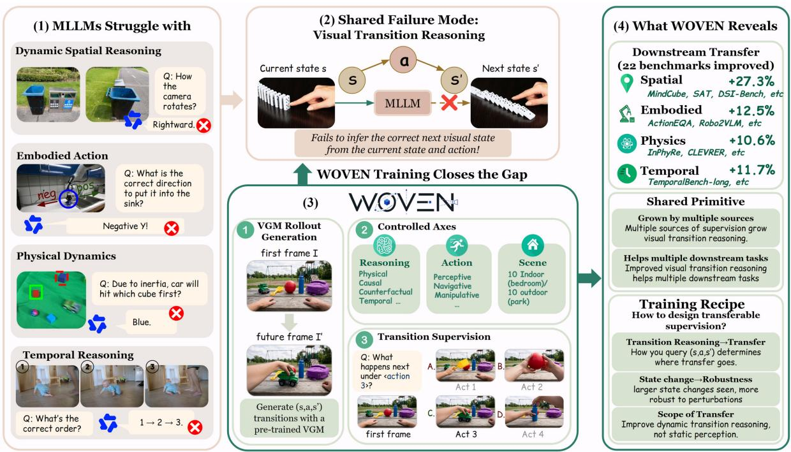  
Figure 1 | Overview. (1) MLLMs fail across spatial, embodied, physical, and temporal tasks. (2) These failures share a weakness: reasoning about how visual states, actions, and outcomes relate. (3) WOVEN generates $( s , a , s ^ { \prime } )$ transitions with a video generation model, organizes them along controlled axes of reasoning, action, and scene, and turns them into error-typed multiple-choice supervision. (4) Training on WOVEN improves 22 of 26 external benchmarks; the gains come from a shared primitive that different sources build and different tasks use; and controlled comparisons yield a training recipe: the reasoning operation decides where transfer goes, larger state changes give robustness, and transfer covers transition tasks rather than static perception.

This hypothesis motivates exploring a shared training primitive for otherwise distinct downstream capabilities: rather than improving each capability separately, we ask whether and how visual transition reasoning can serve as a common training target across models and benefit diverse downstream tasks. In this paper, we pursue this goal through four key questions. First, do failures in visual transition reasoning exhibit consistent patterns across model families, and how pronounced are these deficits? Second, can it be learned through transition supervision, and do the benefits extend beyond the training tasks? Third, do these gains arise from separate training components helping separate tasks, or from learning visual transition reasoning that different models can reuse across different tasks? Fourth, and more fundamentally, what governs the downstream transfer and should therefore guide a systematic training recipe: similarities in actions, scenes, or application domains, or the reasoning operation applied to the transition $( s , a , s ^ { \prime } ) \ ?$

Answering these questions calls for controlled comparisons that allow us to examine the roles of individual components of the $( s , a , s ^ { \prime } )$ triplet. Existing task-specific benchmarks document important deficits, but do not readily support such comparisons (Cai et al., 2024; Chow et al.,

2025; Foss et al., 2025; Huang et al., 2026; Ma et al., 2026; Wang et al., 2026a). We therefore introduce WOVEN (WOrld modeling via controllable Video gENeration), a diagnostic and training source that draws on the transition priors of video-pretrained generative models (Wan et al., 2025). Generated rollouts provide known actions and endpoints for forward and inverse supervision, outcomes under alternative actions for counterfactual supervision, and temporally coherent intermediate states for temporal supervision. Organizing this supervision along scene, action, and reasoning dimensions enables controlled studies of learning and transfer (Fig. 1(3)). The collection comprises 36,076 examples spanning 20 scene types (e.g., kitchen, park, and living room), five action types (e.g., passive physical events, camera motion, and object manipulation), and eight reasoning types across four families (e.g., causal dynamics, temporal coherence, and counterfactual reasoning). We also provide diagnostic splits which cover in-distribution evaluation, held-out scenes, and state perturbations, with error-typed distractors supporting fine-grained analysis of the effects of training (§2).

To examine visual transition reasoning as a common training target, we first ask whether its deficits recur across model families and whether learning it yields gains beyond the training tasks. Through fine-grained evaluation of 38 frontier MLLMs (e.g., GPT-5.4 (OpenAI, 2026), Qwen3- VL-235B-A22B (Bai et al., 2025a), and Llama-4-Maverick (Meta AI, 2025)), we identify recurring failure patterns across model families. These deficits are substantial: even the strongest model achieves only 65.8% accuracy against a 92.3% human baseline. These recurring deficits identify visual transition reasoning as a common target for improving current MLLMs, establishing a training need that extends beyond the weaknesses of any individual model (§3.1). We then ask whether this capability can be learned and whether the resulting gains extend beyond the training tasks. Crucially, our empirical results from post-training MLLMs at multiple scales (§3.3) demonstrate substantial gains: training on the full WOVEN training set raises the indistribution accuracy of Qwen2.5-VL-3B (Bai et al., 2025b) from 26.4% to 89.3%, with 88.2% on held-out scenes (§3.2). The benefits extend to 12 of 26 external benchmarks across multiple domains. Controlled subsets containing approximately 2,000 examples each collectively expand this coverage to 22 of 26 benchmarks, with gains of up to 27.3 percentage points (Fig. 1(4)).

However, broad transfer alone does not establish visual transition reasoning as a shared training primitive that different models can reuse from different sources in learning different tasks, as the downstream gains could arise from separate parts of the training source, each helping only its own tasks. To serve as a shared training primitive, visual transition reasoning must be a common capability that models acquire from different sources, and the gains on downstream tasks must result from this common capability. We therefore first test whether different sources improve the same capability, and find that every controlled subset improves WOVEN accuracy, including on the action types it does not train on (§3.2), meeting the first requirement. We then examine whether the downstream gains result from this common capability, by checking whether subsets that improve it more also transfer more. Results show that the more a subset improves WOVEN accuracy, the larger its average gain on the external benchmarks (�=0.86), and that the gains come from visual transition reasoning itself rather than from a generally stronger model or the answer format (§4). We further test causality by intervening on the training data: replacing 30–50% of task-specific examples with WOVEN under a fixed training budget preserves comparable accuracy (Fig. 3; §4), showing that transition supervision can take over part of the training normally supplied by task-specific data. Together with transfer across model scales (§3.3), these results establish visual transition reasoning as a shared training primitive.

More importantly, our controlled comparisons yield a training recipe for visual world modeling, validated prospectively on held-out benchmarks (§5). (1) Select supervision by reasoning operation. Surprisingly, supervision that teaches the same reasoning operation produces similar patterns of downstream gains even when the actions differ, whereas supervision that shares only an action type does not (Fig. 1(4)). The reasoning operation therefore provides a basis for selecting supervision with relevant downstream benefits. Once the operation is selected, (2) choose supervision with larger changes to the visual state for robustness. Supervision whose actions change more of the scene, such as object manipulation, yields larger robustness gains than supervision that only moves the camera. (3) Supervise temporal and agent-driven tasks directly. Transfer does not cross the boundary between the temporal family and the other three reasoning families, nor the boundary between passive physical events and agent-driven actions. (4) Keep dedicated supervision for capabilities beyond state transitions. Transition supervision improves diverse tasks that involve state transitions, but does not necessarily generalize to capabilities such as static perception, which therefore need their own supervision (§5). Taken together, our study establishes visual transition reasoning as a shared, trainable primitive and provides a systematic recipe for training it, offering a controlled framework for advancing visual world modeling in MLLMs.

Table 1 | Eight reasoning operations considered in this work. The same operation can be applied to different actions and scenes (§2). Notation: $a _ { \mathrm { a l t } } ,$ an alternative action from the same initial state; $a _ { \mathrm { { e x o } } } ,$ a passive event; $a _ { q } , a _ { \mathrm { e x o } }$ with a cue naming the physical principle; $\mathbf { s } = ( s _ { 0 } , \ldots , s _ { L } )$ , sampled states in time order with $s _ { 0 } = s$ and $s _ { L } = s ^ { \prime } ; \widetilde { \mathbf { s } } ,$ , the same states shuffled; $s _ { - } , s _ { + }$ , the neighbors in time of a reference state $s _ { \mathrm { r e f } }$ . In the physical and temporal families the action description is optional.
<table><tr><td>Family</td><td>Reasoning operation</td><td></td><td>Distribution Reasoning operation</td><td>Distribution</td></tr><tr><td>Causal</td><td>Forward dynamics</td><td> $P ( s ^ { \prime } \mid s , a )$ </td><td>Inverse dynamics</td><td> $P ( a \mid s , s ^ { \prime } )$ </td></tr><tr><td>Counterfactual</td><td>Counterfactual removal</td><td> $P ( s \mid a , s ^ { \prime } )$ </td><td>Counterfactual substitution</td><td> $P ( s _ { a _ { \mathrm { a l t } } } ^ { \prime } \mid a , s ^ { \prime } , a _ { \mathrm { a l t } } )$ </td></tr><tr><td>Physical</td><td>Outcome prediction</td><td> $P ( s ^ { \prime } \mid s , a _ { \mathrm { e x o } } )$ </td><td>Cued prediction</td><td> $P ( s ^ { \prime } \mid s , a _ { q } )$ </td></tr><tr><td>Temporal</td><td>Temporal ordering</td><td> $P ( \mathbf { s } \mid \widetilde { \mathbf { s } } , a )$ </td><td>Temporal adjacency</td><td> $P ( s _ { - } , s _ { + } \mid s _ { \mathrm { r e f } } , \widetilde { \bf s } , a )$ </td></tr></table>

## 2. WOVEN

We present WOVEN, a training source and benchmark for visual transition reasoning, designed for controlled comparisons of supervision. We first formalize visual transition reasoning in §2.1 as the theoretical foundation. Then, we define our taxonomy in §2.2, which labels every item along three axes, scene, action, and reasoning type, so that supervision can be varied independently along each axis. As real video offers neither controlled actions nor alternative outcomes from the same initial state, and simulators are limited in realism and in scene and object diversity, we generate the transitions specified by our taxonomy with a video generation model, which produces rollouts from specified initial states and actions, and alternative rollouts from the same state under different actions (§2.3). Finally, we turn the rollouts into multiple-choice items with error-typed distractors and split them into a training set and three test sets (§2.4).

## 2.1. Visual Transition Reasoning

Given a transition $( s , a , s ^ { \prime } )$ , where � and $s ^ { \prime }$ are the visual states of a scene before and after an action $^ { a , }$ which may be agent-driven or passive, visual transition reasoning is the process of inferring unobserved component(s) of the transition from its known or observed parts. Different choices of which parts are given or to be inferred define different reasoning operations, each written as a conditional distribution such as $P ( s ^ { \prime } \mid s , a )$ (shorthand for $P ( S ^ { \prime } = s ^ { \prime } \mid S = s , A = a ) )$ This work considers eight operations in four families (Table 1). Appendix A.1 gives the semantics of each operation.

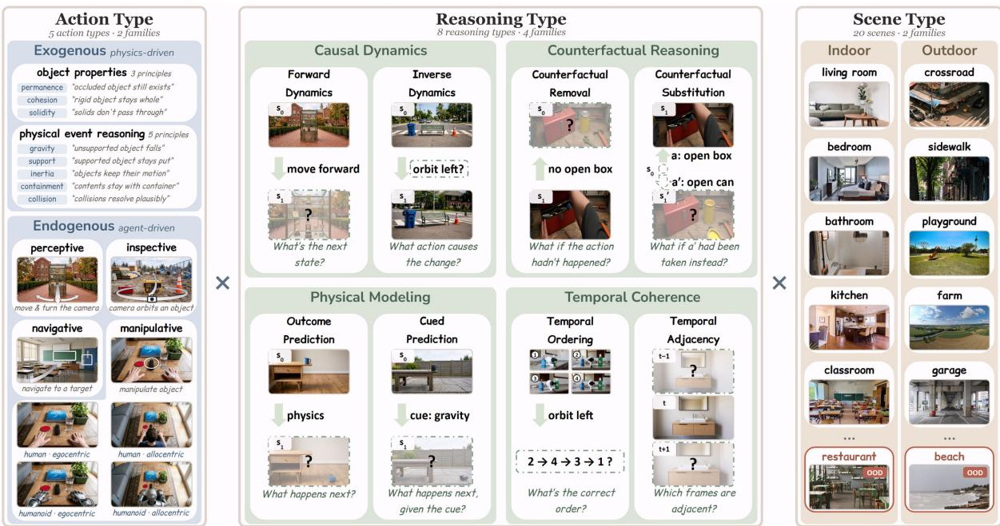  
Figure 2 | The WOVEN taxonomy. Every item is labeled along the three axes shown from left to right (§2.2). Left: the exogenous action type with its eight principles, and the four endogenous types, where manipulative actions combine subject (human, humanoid) and view (egocentric, allocentric). Middle: the eight reasoning types in four families; in each schematic, the dashed box marks the element of $( s , a , s ^ { \prime } )$ that the question asks for. Right: example scenes; restaurant and beach are held out for the scene-OOD test.

## 2.2. Controlled Axes

We define the taxonomy along three axes and categorize each item accordingly: (1) the scene in which its transition occurs, (2) the action producing the change, and (3) the reasoning operation applied to the transition (Fig. 2). Scene type has 20 categories, evenly divided between indoor and outdoor environments (e.g., kitchen, living room, park, and beach). Action type has 5 categories: one exogenous type, passive physical events (Exo), divided into 8 principles from cognitive science (3 object properties and 5 physical events), and four endogenous, agentdriven types: perceptive, that is, camera motion (Perc), inspective, that is, object inspection (Insp), navigative, that is, navigation (Navi), and manipulative, that is, object manipulation (Mani) (Fig. 2). Reasoning type instantiates the eight operations of Table 1, grouped in pairs into four families: forward dynamics (Fwd) and inverse dynamics (Inv) in causal dynamics, counterfactual removal (Rmv) and counterfactual substitution (Sub) in counterfactual reasoning, outcome prediction (Otm) and cued prediction (Cue) in physical modeling, and temporal ordering (Ord) and temporal adjacency (Adj) in temporal coherence. The tables use these abbreviations. Within compatible combinations, each axis can be varied while the other two are held fixed. Category definitions and cognitive motivation are in Appendices B.3–B.6.

## 2.3. Controlled Rollout Generation

We use Wan2.2-I2V-A14B (Wan et al., 2025) to generate rollouts from initial frames and action descriptions, following two construction principles. (P1) World-model isolation. Resulting and intermediate states are produced by the rollout rather than prescribed in the conditioning prompt, so supervision draws on learned transition dynamics. (P2) Counterfactual rollouts.

Table 2 | Visual transition reasoning in frontier MLLMs against the human baseline. Accuracy (%) on the in-distribution test set, overall and by action type and by reasoning type, and on the state-perturbation test set under geometric and appearance changes. Human accuracy is the mean of three annotators. Results for all 38 models are in Appendix E, with the corresponding analyses in Appendix F.
<table><tr><td></td><td></td><td colspan="5">Action type</td><td colspan="8">Reasoning type</td><td colspan="2">Perturbation</td></tr><tr><td></td><td>Overall</td><td>Exo</td><td>Perc</td><td>Insp</td><td>Navi</td><td>Mani</td><td>Fwd</td><td>Inv</td><td>Rmv</td><td>Sub</td><td>Otm</td><td>Cue</td><td>Ord</td><td>Adj</td><td>Geo</td><td>App</td></tr><tr><td>Human</td><td>92.3</td><td>92.8</td><td>92.8</td><td>92.6</td><td>90.6</td><td>92.8</td><td>92.8</td><td>92.8</td><td>91.1</td><td>92.2</td><td>93.3</td><td>91.1</td><td>92.8</td><td>91.7</td><td>97.3</td><td>98.7</td></tr><tr><td>GPT-5.4</td><td>65.8</td><td>62.4</td><td>61.2</td><td>58.3</td><td>68.8</td><td>81.2</td><td>83.8</td><td>81.7</td><td>64.5</td><td>76.0</td><td>81.9</td><td>85.8</td><td>57.1</td><td>27.0</td><td>62.7</td><td>95.5</td></tr><tr><td>Intern-S1-Pro</td><td>63.2</td><td>56.2</td><td>52.8</td><td>53.7</td><td>70.1</td><td>87.1</td><td>77.6</td><td>77.5</td><td>66.7</td><td>73.3</td><td>61.5</td><td>69.1</td><td>63.4</td><td>26.5</td><td>33.3</td><td>79.2</td></tr><tr><td>Qwen2.5-VL-72B</td><td>58.9</td><td>53.7</td><td>47.7</td><td>47.8</td><td>66.4</td><td>83.4</td><td>74.7</td><td>74.7</td><td>54.8</td><td>72.0</td><td>59.4</td><td>76.0</td><td>49.4</td><td>28.0</td><td>38.5</td><td>83.0</td></tr><tr><td>Gemma-4-31B</td><td>57.8</td><td>50.8</td><td>49.4</td><td>53.1</td><td>61.2</td><td>74.3</td><td>76.3</td><td>76.6</td><td>63.6</td><td>64.5</td><td>64.9</td><td>70.5</td><td>30.8</td><td>25.3</td><td>59.0</td><td>95.5</td></tr></table>

From the same initial state, we generate several independent rollouts under different actions, so that alternative outcomes of the same scene are available. Generation, frame extraction, and quality-control details are provided in Appendix B.2.

## 2.4. Supervision Construction and Dataset Splits

We build multiple-choice questions from the rollouts, each referred to as an item and is defined on all three axes: its scene and action types are those of the transition it is built from, and its reasoning type (Table 1) determines which parts of the transition are given and which part is asked for. Each question is phrased with one of 30 templates drawn at random to ensure linguistic diversity. The three distractor options are usually drawn from other rollouts sharing the same initial state, each wrong in a specific way (e.g., the outcome of a different action) and labeled with its error type (e.g., “reversed direction” or “violating gravity”), enabling finegrained error analysis and statistical attribution beyond overall accuracy. For physical-modeling items, the distractors are produced by an image editor, so the correct option is also passed through the same editor with an instruction to change nothing; a control experiment shows that editing artifacts do not reveal the answer. See Appendices B.9 and D for details.

WOVEN has one training set (22,728), one validation set (2,508), and three test sets, totaling 36,076 four-option multiple-choice items (Appendix B.7). Each test set differs from the training set in one respect. The in-distribution test set (6,228) contains new transitions from the same 18 scenes as the training set. The scene-OOD test set $^ { ( 3 , 4 9 6 ) }$ contains transitions from two held-out scenes, restaurant and beach, following held-out-environment evaluation in embodied AI (Cheng et al., 2025; Majumdar et al., 2024). The state-perturbation test set (1,116) measures robustness to controlled changes in the initial state: following the logic of contrast sets (Gardner et al., 2020), each item perturbs one condition of an in-distribution item’s initial state, either its spatial configuration or its appearance, while keeping the action and the multiple-choice question fixed, testing whether a model actually models the state rather than the typical effect of the action (Appendix B.10).

## 3. Is Visual Transition Reasoning Learnable and Transferable?

Using WOVEN as an error-typed and shortcut-resistant diagnostic and training source, we ask how far current MLLMs fall short in visual transition reasoning (§3.1), whether it can be learned from transition supervision (§3.2), and whether the learned reasoning transfers beyond the training tasks (§3.3). Throughout, training is carried out in two complementary ways:

Table 3 | WOVEN test accuracy (%) of Qwen2.5-VL-3B-Instruct after training on the full training set, and gains (percentage points over the base model) after training on each controlled subset. In-distribution results are reported overall, by action type, and on temporal adjacency; bold marks the action type a subset trains on. Results after SFT alone and by every reasoning type are in Appendix G.17.
<table><tr><td></td><td colspan="7">ID test</td><td>OOD scenes test</td><td colspan="3">Perturbation test</td></tr><tr><td>Training</td><td>Overall</td><td>Exo</td><td>Perc</td><td>Insp</td><td>Navi</td><td>Mani</td><td>Adj</td><td>Overall</td><td>Overall</td><td>Geo</td><td>App</td></tr><tr><td>Base</td><td>26.4</td><td>23.8</td><td>27.0</td><td>23.5</td><td>30.0</td><td>28.8</td><td>25.7</td><td>27.8</td><td>21.1</td><td>22.6</td><td>19.7</td></tr><tr><td>Full training set</td><td>89.3</td><td>79.4</td><td>90.7</td><td>90.5</td><td>90.0</td><td>95.3</td><td>69.7</td><td>88.2</td><td>38.3</td><td>35.0</td><td>41.6</td></tr><tr><td colspan="10">Gain over the base model after training on one subset</td><td></td><td></td><td></td></tr><tr><td>perc_causal</td><td>+22.9</td><td>+5.1 +33.0 +13.4 +26.9</td><td></td><td></td><td></td><td>+39.8</td><td>+0.2</td><td>+20.0</td><td>+1.7</td><td>+0.9</td><td>+2.5</td></tr><tr><td>perc_temporal</td><td>+6.6</td><td>+8.4</td><td>+10.9</td><td>+4.9</td><td>+8.0</td><td>+1.3</td><td>+29.9</td><td>+2.9</td><td>+4.1</td><td>+5.6</td><td>+2.7</td></tr><tr><td>insp_causal</td><td>+25.3</td><td>+6.8</td><td>+8.9</td><td>+39.9</td><td>+27.2</td><td>+37.7</td><td>+0.9</td><td>+20.8</td><td>+3.0</td><td>+1.1</td><td>+4.8</td></tr><tr><td>insp_cf</td><td>+25.1</td><td>+6.6</td><td>+7.3</td><td>+38.5</td><td>+24.8</td><td>+42.7</td><td>+1.3</td><td>+24.7</td><td>+3.2</td><td>+3.2</td><td>+3.2</td></tr><tr><td>insp_temporal</td><td>+6.1</td><td>+9.2</td><td>+6.4</td><td>+3.4</td><td>+11.2</td><td>+1.2</td><td>+33.1</td><td>-2.0</td><td>+5.2</td><td>+2.5</td><td>+7.9</td></tr><tr><td>navi_causal</td><td>+21.6</td><td>+7.6</td><td>+10.1</td><td>+12.7</td><td>+30.0</td><td>+50.9</td><td>+4.9</td><td>+20.7</td><td>+13.6</td><td>+16.0</td><td>+11.3</td></tr><tr><td>navi_temporal</td><td>+6.9</td><td>+8.1</td><td>+12.2</td><td>+4.0</td><td>+8.6</td><td>+2.9</td><td>+32.0</td><td>+5.7</td><td>+6.8</td><td>+6.8</td><td>+6.8</td></tr><tr><td>mani_causal</td><td>+19.9</td><td>+8.2</td><td>+3.9</td><td>+5.7</td><td>+26.2</td><td>+61.4</td><td>+2.3</td><td>+25.2</td><td>+23.2</td><td>+13.1</td><td>+33.3</td></tr><tr><td>mani_cf</td><td>+21.3</td><td>+10.6</td><td>+5.2</td><td>+5.5</td><td>+27.2</td><td>+64.2</td><td>+2.9</td><td>+23.6</td><td>+20.2</td><td>+14.0</td><td>+26.4</td></tr><tr><td>exo_physical</td><td>+9.4</td><td>+27.4</td><td>-1.2</td><td>+5.7</td><td>+6.7</td><td>+9.6</td><td>-1.5</td><td>+11.1</td><td>+29.9</td><td>+15.4</td><td>+44.4</td></tr><tr><td>exo_temporal</td><td>+6.6</td><td>+8.4</td><td>+7.1</td><td>+5.5</td><td>+10.1</td><td>+2.3</td><td>+30.6</td><td>+5.5</td><td>+6.9</td><td>+5.6</td><td>+8.2</td></tr></table>

on the full WOVEN training set, and on controlled subsets, each containing only items of a specified action type and reasoning family and named after the two (perc\_causal, for example, holds camera-motion items of the causal family, and insp\_cf object-inspection items of the counterfactual family); WOVEN’s training set consists of 11 such subsets, each of about 2,000 items. The full training set is trained with supervised fine-tuning, and each subset with supervised fine-tuning followed by GRPO (Shao et al., 2024) (Appendix G.1), on MLLMs of multiple scales (Appendix G.15). Evaluation uses the three WOVEN test sets and, zero-shot, 26 external benchmarks: 22 that involve visual transitions, spanning spatial, embodied, physical, temporal reasoning, etc., and 4 benchmarks of static perception and general video QA. A benchmark counts as improved when the gain over the base model exceeds 2 percentage points.

## 3.1. Current MLLMs Show a Systematic Deficit

To establish the need for training, we first quantify the size and distribution of the deficit in visual transition reasoning by evaluating 38 frontier MLLMs on the in-distribution and stateperturbation test sets; Table 2 reports the four strongest against the human baseline. The best model, GPT-5.4, reaches 65.8% in-distribution accuracy against 92.3% for humans (the mean of three annotators), and the next three fall between 57.8% and 63.2%, a gap that persists across model scales and cannot be closed by scaling alone (Appendix F.2). The gap also has a consistent structure across model families: for every model, temporal adjacency is harder than ordering (25.3%–28.0% versus 30.8%–63.4%), counterfactual removal is harder than substitution (54.8%– 66.7% versus 64.5%–76.0%), and accuracy drops more under geometric than under appearance changes (33.3%–62.7% versus 79.2%–95.5%), suggesting a systematic deficit in visual transition reasoning rather than an idiosyncrasy of any particular family or training recipe. These results provide a fine-grained baseline for the training study that follows. The model inventory, human protocol, and detailed results are in Table 15 and Appendices C.2, E, and F; complementary evaluations of a VGM, V-JEPA 2 (Assran et al., 2025), and an IGM are in Appendix B.1.

Table 4 | Zero-shot transfer after training on the complete WOVEN training set. Accuracy (%) on the 12 improved benchmarks; Δ is the larger of the SFT and GRPO gains. AEQA: ActionEQA; TB-L: TemporalBench-L; WM-AB: WM-ABench; WPred: WorldPrediction; BSwan: BlackSwan; SpViz: SpatialViz. References, results for all 26 benchmarks, and category breakdowns are in Appendix G.13.
<table><tr><td>SAT InPhyRe MindCube AEQA TB-L WM-AB WPred TOMATO BSwan ERQA SpViz CV-Bench</td><td colspan="10"></td></tr><tr><td>Base</td><td>37.3</td><td>22.0</td><td>37.2</td><td>43.4</td><td>16.6</td><td>31.0</td><td>34.8</td><td>31.6</td><td>61.8</td><td>33.8 27.7</td><td>69.3</td></tr><tr><td>WOVEN SFT</td><td>55.3</td><td>24.6</td><td>37.8</td><td>49.5 11.5</td><td>37.1</td><td>39.6</td><td>31.5</td><td>55.9</td><td>37.5</td><td>28.8</td><td>72.0</td></tr><tr><td>WOVEN GRPO</td><td>61.3</td><td>34.9</td><td>48.6</td><td>54.4 26.8</td><td>39.8</td><td>41.5</td><td>36.1</td><td>65.6</td><td>34.5</td><td>31.1</td><td>72.4</td></tr><tr><td>Δ</td><td>+24.0</td><td>+13.0</td><td>+11.3</td><td>+11.0 +10.3</td><td>+8.9</td><td>+6.7</td><td>+4.5</td><td>+3.8</td><td>+3.8</td><td>+3.4</td><td>+3.0</td></tr></table>

Table 5 | Broad transfer from controlled training subsets. Results on 8 of the 22 improved benchmarks and, in the last four columns, on the 4 benchmarks of static perception and general video QA; each column uses the best-performing subset for that benchmark, named in the last row (for the last four, its selected checkpoint). Abbreviations as in Table 4; R2VLM: Robo2VLM; DSI: DSI-Bench; 3DSR: 3DSRBench; CoreCog: CoreCognition; PercTest: PerceptionTest; EgoTQA: EgoTaskQA. Results for all 22 benchmarks are in Appendix G.13 (Table 50).
<table><tr><td></td><td>SAT AEQA</td><td></td><td>TB-L InPhyRe R2VLM WPred</td><td></td><td></td><td></td><td>DSI MindCube 3DSR CoreCog PercTest EgoTQA</td><td></td><td></td><td></td><td></td></tr><tr><td>Base</td><td>37.3</td><td>43.4</td><td>16.6</td><td>22.0</td><td>33.5</td><td>34.8</td><td>34.9</td><td>37.2 51.2</td><td>59.8</td><td>62.9</td><td>81.5</td></tr><tr><td>Subset SFT</td><td>63.3</td><td>47.5</td><td>22.0</td><td>32.3</td><td>40.5</td><td>40.1</td><td>40.3</td><td>40.0 52.6</td><td>58.8</td><td>63.7</td><td>82.6</td></tr><tr><td>Subset GRPO Δ</td><td>64.7 +27.3</td><td>55.9 +12.5 +11.7</td><td>28.2</td><td>32.6 +10.6</td><td>42.4 +8.9</td><td>42.9 +8.1</td><td>40.9 +6.0</td><td>43.1 +5.9 +1.4</td><td>-1.0</td><td>+0.8</td><td>+1.1</td></tr><tr><td></td><td>perc</td><td>perç mani</td><td></td><td>insp</td><td>insp</td><td>mani</td><td>perc</td><td>perc navi</td><td>exo</td><td>perc</td><td>exo</td></tr><tr><td>Subset</td><td>causal</td><td>causal</td><td>cf</td><td>cf</td><td>cf</td><td>causal causal</td><td></td><td>temporal causal</td><td>physical</td><td>causal</td><td>physical</td></tr></table>

## 3.2. Visual Transition Reasoning Is Learnable

As shown in Table 3, supervised fine-tuning of Qwen2.5-VL-3B-Instruct on the full training set raises in-distribution accuracy from 26.4% to 89.3%, with 88.2% on held-out scenes. The gains also hold on models of larger scales and different families (Appendices G.15 and I.2). Each controlled subset also raises WOVEN accuracy on its own, by 6.1 to 25.3 percentage points in distribution, and also on action types it does not train on (Table 3), so different kinds of supervision improve the same capability rather than only the action they were specifically trained on. The deficit is therefore learnable as a whole from transition supervision, and the learning generalizes across scenes. The learning is also data-efficient: with about 7 hours of generated video, WOVEN post-training yields a larger gain on a spatial-reasoning benchmark than Orca (Wang et al., 2026c), which mid-trains the same backbone on 125,000 hours of video (Appendix G.16).

## 3.3. Learned Transition Reasoning Transfers Broadly

We then examine whether the learned reasoning transfers to other tasks. The full training set improves as many as 12 of the 26 external benchmarks, with gains of up to 24.0 percentage points on SAT (Table 4). The controlled subsets transfer effectively as well, despite holding only about 2,000 items each: with the best subset chosen for each benchmark, the coverage rises to a remarkable 22 of 26, that is, every benchmark that involves visual transitions, and gains reach up to 27.3 percentage points (Table 5; selection and seed checks in Appendix I.1). The transfer also holds at scale (Appendix G.15) and across model families (Appendix I.2). The 4 benchmarks of static perception and general video QA do not improve under any training (Table 5), so the gains are not due to an overall stronger model or to better multiple-choice answering (Appendix H.2). Full scores and evaluation procedures are in Appendices G.13 and D.

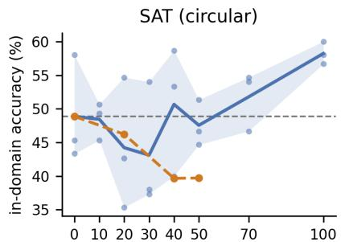  
WOVEN share of the training budget (%)

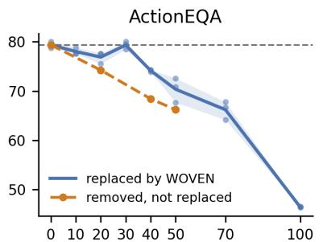  
WOVEN share of the training budget (%)

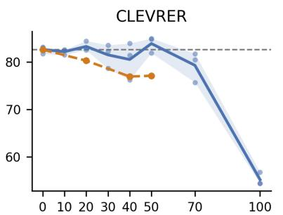  
WOVEN share of the training budget (%)  
Figure 3 | WOVEN supervision substitutes for in-domain training data. Each panel retrains one external benchmark on a fixed 2,000-item budget in which a share � of the benchmark’s own training data is replaced by items from a selected WOVEN subset (blue dots: 3 seeds; blue line: seed mean; band: seed range; gray dashed: $p { = } 0$ mean; orange dashed: deletion control). Replacing 30–50% of task-specific supervision preserves comparable accuracy; on SAT, training exclusively on WOVEN yields the highest accuracy in the sweep. The protocol, full per-seed tables, and trend statistics for each benchmark are in Appendix G.14.

## 4. Does Visual Transition Reasoning Serve as a Shared Primitive?

The gains so far could still be a sum of separate effects, with each subset helping only the downstream tasks closest to its own content. For visual transition reasoning to serve as a shared training primitive, two requirements must hold:

(a) Different sources improve the same capability. Every subset improves WOVEN accuracy on the action types it does not train on (§3.2, Table 3); the capability also spans reasoning operations, as training on forward prediction alone raises counterfactual substitution and removal by 48 and 25 percentage points (Appendices G.8 and I.3), and it is not a shortcut (Table 94; Appendix H.3).

(b) The downstream gains result from that capability. $\operatorname { I f } \ s \mathbf { o } ,$ all subsets should improve largely the same benchmarks, and subsets that improve the capability more should transfer more. Results show that the transfer profiles of the 11 subsets are all positively correlated (Fig. 4, left), so the subsets improve largely the same benchmarks (detailed analysis in Appendix G.13). Moreover, the more a subset improves WOVEN accuracy, the larger its average gain on the external benchmarks (�=0.86; Appendix G.13), as expected, and the same WOVEN format with permuted or mirrored transitions does not reproduce the downstream gains (Appendix H.1). Together with the specificity shown in §3.3, the downstream gains therefore come from the learned capability rather than from the individual subsets. We further test causality by intervention on the training data. With the training set fixed at 2,000 items, we replace a growing share of task-specific items with a WOVEN subset on three benchmarks (SAT (Ray et al., 2025), ActionEQA (Bao et al., 2026), and CLEVRER (Yi et al., 2020)) from three different domains, and average results over three seeds. Results show that substituting up to 30–50% (depending on the benchmark) of the task-specific items leaves accuracy comparable to training on these items alone, and above a control that simply deletes the replaced items (Fig. 3; Appendix G.14). Transition supervision thus supplies part of what these tasks would otherwise learn from their own data, supporting the conclusion that the downstream gains result from the learned capability.

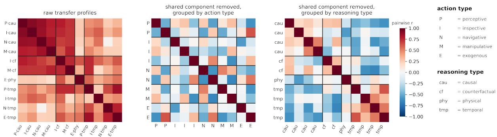  
Figure 4 | Correlation of transfer profiles under the two candidate groupings. Pairwise Pearson correlation of the 11 subsets’ 26-benchmark transfer profiles. Left: raw profiles, all pairs positive (the common component of §4). Middle and right: the same residual matrix after the perbenchmark �-score, ordered by action type and by reasoning family; only the latter produces diagonal blocks.

Together, these results establish visual transition reasoning as a shared training primitive; how its transfer is organized beyond this common component is the subject of §5.

## 5. Is There a Systematic Recipe for Training Visual World Modeling?

Sections 3 and 4 establish visual transition reasoning as a shared, trainable primitive. From the transfer profiles, error-typed analyses, and perturbation robustness of the controlled subsets, we distill a training recipe for visual world modeling in MLLMs (Fig. 1(4)): (1) to improve a downstream task, select supervision that teaches the reasoning operation the task requires, not supervision that matches its actions, scenes, or domains; (2) for robustness, prefer supervision with large state changes, such as object manipulation over camera motion; (3) supervise temporal and agent-driven tasks directly: transfer does not cross the boundary between the temporal family and the other three, nor the boundary between passive physical events and agent-driven actions; and (4) for downstream tasks that involve no transition, such as static perception, transition supervision does not help. The following subsections give the evidence behind each item; §5.4 tests the recipe prospectively on held-out benchmarks.

## 5.1. What Determines Where Supervision Transfers?

Similarity in scenes, actions, or application domains offers an intuitive basis for selecting transferable supervision. To test whether such similarity predicts downstream benefit, we compare subsets that share only an action type with those that share only a reasoning family. All transfer profiles contain the common component of §4, so we remove it by standardizing the gains within each benchmark, which leaves each subset’s relative pattern of benefit, and correlate these residual profiles pairwise (Fig. 4).

Surprisingly, results show that subsets teaching the same reasoning family have similar residual profiles, with a mean pairwise correlation of +0.32, whereas subsets sharing only an action type are no more similar than subsets sharing neither (−0.22 versus −0.23), so the action shown in a transition does not predict where its supervision transfers. Moreover, the same ordering holds under three other normalizations of the gains (Fig. 4; Appendix G.13). Together with the transfer to held-out scenes (§3.2) and to external domains (§3.3), the reasoning operation a source of supervision teaches, not the actions or scenes it shows, decides which downstream tasks it helps. Recipe (1). To improve a downstream task, select supervision that teaches the reasoning operation the task requires, not supervision that matches its actions, scenes, or domains; Table 5 and Appendix G.13 list the best-transferring subset for each benchmark.

## 5.2. What Makes the Learned Capability Robust?

Recipe (1) leaves the extent of state change open. We examine whether larger state changes improve robustness by comparing subsets that differ in the actions that transform the scene. Among the causal subsets, robustness gains increase from camera motion (+1.7) and object inspection (+3.0) to navigation (+13.6) and object manipulation (+23.2), and passive physical events give the largest gain of all subsets (+29.9; Table 3; Appendix G.17). Recipe (2). For robustness, prefer supervision with large state changes, such as object manipulation over camera motion.

## 5.3. Where Does Transfer Break?

Although supervision on one reasoning operation often teaches others, as forward-dynamics supervision alone raises counterfactual substitution and removal by 48 and 25 percentage points (§4), two kinds of transition reasoning are not learned this way, nor are capabilities beyond state transitions. (a) Temporal localization is learned only from temporal supervision: the four temporal subsets raise temporal-adjacency accuracy from 25.7% to 55.6–58.7%, whereas the seven other subsets leave it near the baseline, and supervision on temporal adjacency and on temporal ordering do not transfer to each other (Table 3; Appendix G.9). (b) Endogenous (agent-driven) transitions are not learned from exogenous supervision: the subset of passive physical events contains no agent action to learn from, and it lowers accuracy on the two

Table 6 | Gains on the two agentaction benchmarks by non-temporal subset (percentage points over the base model; base accuracy: WorldPrediction 34.8, ActionEQA 43.4). Temporal subsets are covered by (a).
<table><tr><td>Subset</td><td>World Prediction</td><td>Action EQA</td></tr><tr><td>perc_causal</td><td>+2.4</td><td>+12.5</td></tr><tr><td>insp_causal</td><td>+5.1</td><td>+10.9</td></tr><tr><td>navi_causal</td><td>+4.1</td><td>+4.4</td></tr><tr><td>mani_causal</td><td>+8.1</td><td>+11.6</td></tr><tr><td>insp_cf</td><td>-5.1</td><td>+12.5</td></tr><tr><td>mani_cf</td><td>+7.7</td><td>+9.8</td></tr><tr><td>exo_physical</td><td>-10.2</td><td>-1.7</td></tr></table>

benchmarks built on an agent’s action and its outcome, WorldPrediction (−10.2) and ActionEQA (−1.7; Table 6; Appendix G.13). Recipe (3). Supervise temporal and agent-driven tasks directly: transfer does not cross the boundary between the temporal family and the other three reasoning families, nor the boundary between passive physical events and agent-driven actions. (c) Capabilities beyond state transitions are not learned from transition supervision: the 4 benchmarks of static perception and general video QA do not improve under any training (Table 5). Recipe (4). For downstream tasks that involve no transition, transition supervision does not help.

## 5.4. Can the Recipe Predict Transfer on Held-Out Benchmarks?

To test the generality of our recipe, we use it to select training supervision before any training and evaluate the resulting models on external benchmarks that played no part in its derivation. For questions about agent actions and their outcomes, we compose a training mixture of WOVEN items by the recipe (Recipe) and compare it with mixtures of the same size composed in other ways: by matching the action (Camera-heavy), by a different reasoning operation (Temporalheavy), by passive physical events (Exogenous-heavy), or with no selection (Uniform). We train Qwen2.5-VL-3B-Instruct on each mixture with 8 seeds and evaluate the models on questions from MMSI-Bench (Yang et al., 2026), VLM4D (Zhou et al., 2025b), PhysBench (Chow et al., 2025),

Table 7 | Prospective test of the recipe on held-out benchmarks. Accuracy (%), mean over 8 models; $\Delta = { \mathrm { R e c i p e } } -$ comparison mixture; Item = recipe item tested; Base = untrained model on the same questions; Set A: agent-action questions, Set B: passive-physics questions, Set C: camera-motion questions.
<table><tr><td>Comparison mixture</td><td>Item</td><td>Questions</td><td>Base</td><td>Recipe</td><td>Comp.</td><td>Δ</td><td>95% CI</td><td>p</td></tr><tr><td>Temporal-heavy</td><td>(1)</td><td>Set A</td><td>31.1</td><td>37.9</td><td> $3 4 . 4 \quad + 3 . 5 \quad$ </td><td></td><td> $\left[ + 2 . 0 3 , + 4 . 9 2 \right]$ </td><td>0.0002</td></tr><tr><td>Uniform</td><td>(1)</td><td>Set A</td><td>31.1</td><td>37.9</td><td></td><td></td><td>36.4 +1.5 [+0.18, +2.81]</td><td>0.03</td></tr><tr><td>Camera-heavy</td><td>(1)</td><td>Set C</td><td>54.1</td><td>58.4</td><td> $5 7 . 8 \quad + 0 . 6 $ </td><td></td><td> $\left[ + 0 . 0 2 , + 1 . 1 4 \right]$ </td><td>0.04</td></tr><tr><td>Exogenous-heavy</td><td>(3)</td><td>Set A</td><td>31.1</td><td>37.9</td><td> $3 3 . 2 + 4 . 7 $ </td><td></td><td>[+3.19, +6.17]</td><td>0.0002</td></tr><tr><td>Exogenous-heavy</td><td>(3)</td><td>Set B</td><td>70.3</td><td>71.0</td><td> $7 1 . 5 \quad - 0 . 5 $ </td><td></td><td>[-1.05, -0.02]</td><td>0.04</td></tr></table>

SPAR-Bench (Zhang et al., 2026a), MVBench (Li et al., 2024), IntPhys 2 (Bordes et al., 2025), and CameraBench (Lin et al., 2025) (Appendix J). Results show that all five comparisons come out as the recipe predicts (Table 7). On agent-action questions, the Recipe mixture exceeds the others by 1.5 to 4.7 percentage points $\left( p \leq 0 . 0 3 \right)$ , and on camera-motion questions it also outperforms the mixture matched to the camera actions (+0.6, � = 0.04), so selecting supervision by the reasoning operation matters more than matching the action. On passive-physics questions, the Exogenous-heavy mixture is ahead instead $( - 0 . 5 , p = 0 . 0 4 )$ , as item (3) predicts. Our recipe therefore generalizes to new benchmarks.

## 6. Related Work

World models and video priors. World models predict how a scene evolves, either in a latent space (Assran et al., 2025; Hafner et al., 2025) or by generating video (Ball et al., 2025; Brooks et al., 2024; NVIDIA, 2025; Wan et al., 2025), and video models increasingly serve as simulators for planning (Du et al., 2023; Zhou et al., 2024) and as sources of training data for downstream learning (Jang et al., 2025). Transition-level supervision has also been used directly: state transition pretraining teaches GUI agents the forward and inverse dynamics of interface states (Liu et al., 2026), and intervention-based world-state data support controlled generation, action prediction, and policy transfer (Cai et al., 2026). WOVEN uses video-pretrained transition priors for a different purpose, as a source of controlled supervision for studying which transition reasoning MLLMs learn and reuse, which complements evaluations of rollout quality (Huang et al., 2024; NVIDIA, 2025) and of world models on planning and interaction tasks (Chen et al., 2025a; Warrier et al., 2026).

Benchmarks and supervision for multimodal reasoning. A large body of benchmarks tests MLLMs on one facet of visual change at a time: spatial reasoning under viewpoint change (Li et al., 2025a; Wang et al., 2026a,b; Yang et al., 2026), physical and intuitive-physics reasoning (Bordes et al., 2025; Chow et al., 2025; Sreekumar and Boddeti, 2026; Yi et al., 2020), counterfactual reasoning about videos (Chinchure et al., 2025; Foss et al., 2025; Li et al., 2025c; Patel et al., 2022), temporal ordering and localization (Cai et al., 2024; Liu et al., 2024; Shangguan et al., 2024), and embodied and robotic question answering (Bao et al., 2026; Chen et al., 2025b; Majumdar et al., 2024), with recent suites targeting world modeling as a whole (Chen et al., 2025a; Gao et al., 2025). On the supervision side, synthetic data has been used to teach MLLMs spatial reasoning (Ray et al., 2025) and transferable reasoning through rule-based games (Xie et al., 2025), and fully controlled scenes have been used to study what fine-tuning transfers to real images (Rizzoli et al., 2026). WOVEN relates these facets through a common $( s , a , s ^ { \prime } )$ representation and controlled training comparisons, separating the reasoning operation of a task from its action and scene content, so that supervision built for one facet can be tested on every other facet and the resulting gains compared on equal terms (Appendices A.6 and A.4).

## 7. Conclusion

We used a factorized experimental design to study how the content and reasoning demands of supervision shape the acquisition and transfer of visual transition reasoning. The rollout priors and conditional generation of video generation models supplied the controlled transitions for these comparisons. To the best of our knowledge, we are the first to establish visual transition reasoning as a shared training primitive in MLLMs across diverse task domains and derive a systematic training recipe from controlled comparisons of its downstream transfer. More broadly, our work paves the way for developing visual world modeling in MLLMs through reusable reasoning capabilities whose training supervision is designed by controlled experiments.

## Acknowledgments

We thank Amazon for their support of this work.

## References

M. Assran, A. Bardes, D. Fan, Q. Garrido, R. Howes, M. Komeili, M. Muckley, A. Rizvi, C. Roberts, K. Sinha, A. Zholus, S. Arnaud, A. Gejji, A. Martin, F. R. Hogan, D. Dugas, P. Bojanowski, V. Khalidov, P. Labatut, F. Massa, M. Szafraniec, K. Krishnakumar, Y. Li, X. Ma, S. Chandar, F. Meier, Y. LeCun, M. Rabbat, and N. Ballas. V-JEPA 2: Selfsupervised video models enable understanding, prediction and planning, 2025. URL https://arxiv.org/abs/2506.09985.

S. Bai, Y. Cai, R. Chen, K. Chen, X. Chen, Z. Cheng, L. Deng, W. Ding, C. Gao, C. Ge, W. Ge, Z. Guo, Q. Huang, J. Huang, F. Huang, B. Hui, S. Jiang, Z. Li, M. Li, M. Li, K. Li, Z. Lin, J. Lin, X. Liu, J. Liu, C. Liu, Y. Liu, D. Liu, S. Liu, D. Lu, R. Luo, C. Lv, R. Men, L. Meng, X. Ren, X. Ren, S. Song, Y. Sun, J. Tang, J. Tu, J. Wan, P. Wang, P. Wang, Q. Wang, Y. Wang, T. Xie, Y. Xu, H. Xu, J. Xu, Z. Yang, M. Yang, J. Yang, A. Yang, B. Yu, F. Zhang, H. Zhang, X. Zhang, B. Zheng, H. Zhong, J. Zhou, F. Zhou, J. Zhou, Y. Zhu, and K. Zhu. Qwen3-VL technical report, 2025a. URL https://arxiv.org/abs/2511.21631.

S. Bai, K. Chen, X. Liu, J. Wang, W. Ge, S. Song, K. Dang, P. Wang, S. Wang, J. Tang, H. Zhong, Y. Zhu, M. Yang, Z. Li, J. Wan, P. Wang, W. Ding, Z. Fu, Y. Xu, J. Ye, X. Zhang, T. Xie, Z. Cheng, H. Zhang, Z. Yang, H. Xu, and J. Lin. Qwen2.5-VL technical report, 2025b. URL https://arxiv.org/abs/2502.13923.

R. Baillargeon. Object permanence in 3½- and 4½-month-old infants. Developmental Psychology, 23(5):655–664, Sept. 1987. doi: 10.1037/0012-1649.23.5.655.

P. J. Ball, J. Bauer, F. Belletti, B. Brownfield, A. Ephrat, S. Fruchter, A. Gupta, K. Holsheimer, A. Holynski, J. Hron, C. Kaplanis, M. Limont, M. McGill, Y. Oliveira, J. Parker-Holder, F. Perbet, G. Scully, J. Shar, S. Spencer, O. Tov, R. Villegas, E. Wang, J. Yung, C. Baetu, J. Berbel, D. Bridson, J. Bruce, G. Buttimore, S. Chakera, B. Chandra, P. Collins, A. Cullum, B. Damoc, V. Dasagi, M. Gazeau, C. Gbadamosi, W. Han, E. Hirst, A. Kachra, L. Kerley, K. Kjems, E. Knoepfel, V. Koriakin, J. Lo, C. Lu, Z. Mehring, A. Moufarek, H. Nandwani, V. Oliveira, F. Pardo, J. Park, A. Pierson, B. Poole, H. Ran, T. Salimans, M. Sanchez, I. Saprykin, A. Shen, S. Sidhwani,

D. Smith, J. Stanton, H. Tomlinson, D. Vijaykumar, L. Wang, P. Wingfield, N. Wong, K. Xu, C. Yew, N. Young, V. Zubov, D. Eck, D. Erhan, K. Kavukcuoglu, D. Hassabis, Z. Gharamani, R. Hadsell, A. van den Oord, I. Mosseri, A. Bolton, S. Singh, and T. Rocktäschel. Genie 3: A new frontier for world models. 2025.

T. Bao, Q. Wang, K. Wang, M. Deng, G. Liu, J. Mao, L. Birnbaum, Z. Hu, E. P. Xing, Z. Wang, and M. Li. ActionEQA: Action interface for embodied question answering. Transactions on Machine Learning Research, 2026. ISSN 2835-8856. URL https://openreview.net/forum ?id=HY2ruqdMt4.

P. W. Battaglia, J. B. Hamrick, and J. B. Tenenbaum. Simulation as an engine of physical scene understanding. Proceedings ofthe National Academy ofSciences, 110(45):18327–18332, 2013. doi: 10.1073/pnas.1306572110. URL https://www.pnas.org/doi/abs/10.1073/pnas.1306 572110.

F. Bordes, Q. Garrido, J. T. Kao, A. Williams, M. Rabbat, and E. Dupoux. IntPhys 2: Benchmarking intuitive physics understanding in complex synthetic environments, 2025. URL https: //arxiv.org/abs/2506.09849.

T. Brooks, B. Peebles, C. Holmes, W. DePue, Y. Guo, L. Jing, D. Schnurr, J. Taylor, T. Luhman, E. Luhman, C. Ng, R. Wang, and A. Ramesh. Video generation models as world simulators. 2024. URL https://openai.com/research/video-generation-models-as-world -simulators.

N. Burgess. Spatial memory: how egocentric and allocentric combine. Trends in Cognitive Sciences, 10(12):551–557, Dec. 2006. doi: 10.1016/j.tics.2006.10.005.

M. Cai, R. Tan, J. Zhang, B. Zou, K. Zhang, F. Yao, F. Zhu, J. Gu, Y. Zhong, Y. Shang, Y. Dou, J. Park, J. Gao, Y. J. Lee, and J. Yang. TemporalBench: Benchmarking fine-grained temporal understanding for multimodal video models, 2024. URL https://arxiv.org/abs/2410 .10818.

R. Cai, J. Y. Zhang, P. Henzler, Z. Li, N. Snavely, and R. Martin-Brualla. Can generative video models help pose estimation? In Proceedings of the IEEE/CVF Conference on Computer Vision and Pattern Recognition (CVPR), pages 16764–16773, June 2025.

Y. Cai, F. Yu, M. Yu, Z. Shi, P. Yuan, and Y. Guo. CG-World: A large-scale world-state dataset and protocol for world models, 2026. URL https://arxiv.org/abs/2607.26452.

D. Chen, W. Chung, Y. Bang, Z. Ji, and P. Fung. WorldPrediction: A benchmark for high-level world modeling and long-horizon procedural planning. arXiv preprint arXiv:2506.04363, 2025a.

K. E. Chen, S. Xie, Z. Ma, P. Sanketi, and K. Goldberg. Robo2VLM: Improving visual question answering using large-scale robot manipulation data. In D. Belgrave, C. Zhang, H. Lin, R. Pascanu, P. Koniusz, M. Ghassemi, and N. Chen, editors, Advances in Neural Information Processing Systems, volume 38, Main Conference. Curran Associates, Inc., 2025b. doi: 10.52202 /085713-0733. URL https://proceedings.neurips.cc/paper\_files/paper/2025/ file/1f467c3e37abf9f86c78f44c6a27ee7c-Paper-Datasets\_and\_Benchmarks\_T rack.pdf.

S. Chen, T. Zhu, Z. Wang, J. Zhang, K. Wang, R. Zhou, S. Gao, T. Xiao, Y. W. Teh, J. He, and M. Li. Why do LLM agents fail in exploring new environments? a world-modeling perspective, 2026. URL https://arxiv.org/abs/2510.15047.

Z. Cheng, Y. Tu, R. Li, S. Dai, J. Hu, S. Hu, J. Li, Y. Shi, T. Yu, W. Chen, L. Shi, and M. Sun. EmbodiedEval: Evaluate multimodal LLMs as embodied agents, 2025. URL https://arxi v.org/abs/2501.11858.

A. Chinchure, S. Ravi, R. Ng, V. Shwartz, B. Li, and L. Sigal. Black swan: Abductive and defeasible video reasoning in unpredictable events. In Proceedings of the IEEE/CVF Conference on Computer Vision and Pattern Recognition (CVPR), pages 24201–24210, June 2025.

W. Chow, J. Mao, B. Li, D. Seita, V. Guizilini, and Y. Wang. PhysBench: Benchmarking and enhancing vision-language models for physical world understanding. arXiv preprint arXiv:2501.16411, 2025.

D. Cores, M. Dorkenwald, M. Mucientes, C. G. M. Snoek, and Y. M. Asano. Lost in time: A new temporal benchmark for VideoLLMs. In 36th British Machine Vision Conference 2025, BMVC 2025, Sheffield, UK, November 24-27, 2025. BMVA, 2025. URL https://bmva-archive.org .uk/bmvc/2025/assets/papers/Paper\_857/paper.pdf.

R. Dang, Y. Yuan, W. Zhang, Y. Xin, B. Zhang, L. Li, L. Wang, Q. Zeng, X. Li, and L. Bing. ECBench: Can multi-modal foundation models understand the egocentric world? a holistic embodied cognition benchmark. In Proceedings of the IEEE/CVF Conference on Computer Vision and Pattern Recognition (CVPR), pages 24593–24602, June 2025.

Y. Du, M. Yang, P. Florence, F. Xia, A. Wahid, B. Ichter, P. Sermanet, T. Yu, P. Abbeel, J. B. Tenenbaum, et al. Video language planning. arXiv preprint arXiv:2310.10625, 2023.

R. A. Epstein, E. Z. Patai, J. B. Julian, and H. J. Spiers. The cognitive map in humans: spatial navigation and beyond. Nature Neuroscience, 20(11):1504–1513, Nov. 2017. doi: 10.1038/nn.4 656.

Z. Fan, J. Liu, Y. Zhang, Z. Wang, Y. R. Fung, M. Li, and H. Ji. EMCompress: Video-LLMs with endomorphic multimodal compression. In M. Liakata, V. P. Moreira, J. Zhang, and D. Jurgens, editors, Findings of the Association for Computational Linguistics: ACL 2026, pages 137–162, San Diego, California, United States, July 2026. Association for Computational Linguistics. ISBN 979-8-89176-395-1. doi: 10.18653/v1/2026.findings-acl.8. URL https: //aclanthology.org/2026.findings-acl.8/.

A. Foss, C. Evans, S. Mitts, K. Sinha, A. Rizvi, and J. T. Kao. CausalVQA: A physically grounded causal reasoning benchmark for video models, 2025. URL https://arxiv.org/abs/2506 .09943.

K. Friston. The free-energy principle: a unified brain theory? Nature Reviews Neuroscience, 11(2): 127–138, Jan. 2010. doi: 10.1038/nrn2787.

X. Fu, Y. Hu, B. Li, Y. Feng, H. Wang, X. Lin, D. Roth, N. A. Smith, W.-C. Ma, and R. Krishna. BLINK: Multimodal large language models can see but not perceive. In A. Leonardis, E. Ricci, S. Roth, O. Russakovsky, T. Sattler, and G. Varol, editors, Computer Vision – ECCV 2024, pages 148–166, Cham, 2024. Springer Nature Switzerland. ISBN 978-3-031-73337-6.

Q. Gao, X. Pi, K. Liu, J. Chen, R. Yang, X. Huang, X. Fang, L. Sun, G. Kishore, B. Ai, S. Tao, M. Liu, J. Yang, C.-J. Lai, C. Jin, J. Xiang, B. Huang, Z. Chen, D. Danks, H. Su, T. Shu, Z. Ma, L. Qin, and Z. Hu. Do vision-language models have internal world models? towards an atomic evaluation. In W. Che, J. Nabende, E. Shutova, and M. T. Pilehvar, editors, Findings of the Associationfor Computational Linguistics: ACL 2025, pages 26170–26195, Vienna, Austria, July

2025. Association for Computational Linguistics. ISBN 979-8-89176-256-5. doi: 10.18653/v1/ 2025.findings-acl.1342. URL https://aclanthology.org/2025.findings-acl.1342/.

M. Gardner, Y. Artzi, V. Basmov, J. Berant, B. Bogin, S. Chen, P. Dasigi, D. Dua, Y. Elazar, A. Gottumukkala, N. Gupta, H. Hajishirzi, G. Ilharco, D. Khashabi, K. Lin, J. Liu, N. F. Liu, P. Mulcaire, Q. Ning, S. Singh, N. A. Smith, S. Subramanian, R. Tsarfaty, E. Wallace, A. Zhang, and B. Zhou. Evaluating models’ local decision boundaries via contrast sets. In T. Cohn, Y. He, and Y. Liu, editors, Findings of the Association for Computational Linguistics: EMNLP 2020, pages 1307–1323, Online, Nov. 2020. Association for Computational Linguistics. doi: 10.18653/v1/2020.findings-emnlp.117. URL https://aclanthology.org/2020.findin gs-emnlp.117/.

J. J. Gibson. The Ecological Approach to Visual Perception. Houghton Mifflin, 1979.

M. A. Goodale and A. Milner. Separate visual pathways for perception and action. Trends in Neurosciences, 15(1):20–25, 1992. ISSN 0166-2236. doi: https://doi.org/10.1016/0166-2236(92 )90344-8. URL https://www.sciencedirect.com/science/article/pii/01662236 92903448.

Google DeepMind. Nano banana 2 (Gemini 3.1 Flash Image). https://deepmind.google/ models/gemini-image/flash/, 2026. Image generation and editing model.

D. Hafner, J. Pasukonis, J. Ba, and T. Lillicrap. Mastering diverse control tasks through world models. Nature, 640(8059):647–653, Apr. 2025. doi: 10.1038/s41586-025-08744-2.

P. Haggard. Human volition: towards a neuroscience of will. Nature Reviews Neuroscience, 9(12): 934–946, Dec. 2008. doi: 10.1038/nrn2497.

T. Huang, Z. Zhang, and H. Tang. 3D-R1: Enhancing reasoning in 3D VLMs for unified scene understanding, 2025. URL https://arxiv.org/abs/2507.23478.

Y. Huang, K. Wen, R. Gao, D. Liu, Y. Lou, J. Wu, J. Xu, J. Zhang, Z. Yang, Y. Lin, C. Li, P. Pan, J. Lu, J. Jiang, X. Ding, Y. Huang, and Z. Wang. Thinking in dynamics: How multimodal large language models perceive, track, and reason dynamics in physical 4D world, 2026. URL https://arxiv.org/abs/2603.12746.

Z. Huang, Y. He, J. Yu, F. Zhang, C. Si, Y. Jiang, Y. Zhang, T. Wu, Q. Jin, N. Chanpaisit, Y. Wang, X. Chen, L. Wang, D. Lin, Y. Qiao, and Z. Liu. VBench: Comprehensive benchmark suite for video generative models. In Proceedings of the IEEE/CVF Conference on Computer Vision and Pattern Recognition (CVPR), pages 21807–21818, June 2024.

J. Jang, S. Ye, Z. Lin, J. Xiang, J. Bjorck, Y. Fang, F. Hu, S. Huang, K. Kundalia, Y.-C. Lin, L. Magne, A. Mandlekar, A. Narayan, Y. L. Tan, G. Wang, J. Wang, Q. Wang, Y. Xu, X. Zeng, K. Zheng, R. Zheng, M.-Y. Liu, L. Zettlemoyer, D. Fox, J. Kautz, S. Reed, Y. Zhu, and L. Fan. DreamGen: Unlocking generalization in robot learning through video world models, 2025. URL https://arxiv.org/abs/2505.12705.

B. Jia, T. Lei, S.-C. Zhu, and S. Huang. EgoTaskQA: Understanding human tasks in egocentric videos. In S. Koyejo, S. Mohamed, A. Agarwal, D. Belgrave, K. Cho, and A. Oh, editors, Advances in Neural Information Processing Systems, volume 35, pages 3343–3360. Curran Associates, Inc., 2022. doi: 10.52202/068431-0242. URL https://proceedings.neurips.cc/p aper\_files/paper/2022/file/161c94a58ca25bafcaf47893e8233deb-Paper-Dat asets\_and\_Benchmarks.pdf.

K. Kessler and L. A. Thomson. The embodied nature of spatial perspective taking: Embodied transformation versus sensorimotor interference. Cognition, 114(1):72–88, 2010. ISSN 0010- 0277. doi: https://doi.org/10.1016/j.cognition.2009.08.015. URL https://www.scienced irect.com/science/article/pii/S0010027709002133.

N. Khalighinejad, A. Schurger, A. Desantis, L. Zmigrod, and P. Haggard. Precursor processes of human self-initiated action. NeuroImage, 165:35–47, 2018. ISSN 1053-8119. doi: https: //doi.org/10.1016/j.neuroimage.2017.09.057. URL https://www.sciencedirect.com/ science/article/pii/S1053811917308054.

W. Kong, Q. Tian, Z. Zhang, R. Min, Z. Dai, J. Zhou, J. Xiong, X. Li, B. Wu, J. Zhang, K. Wu, Q. Lin, J. Yuan, Y. Long, A. Wang, A. Wang, C. Li, D. Huang, F. Yang, H. Tan, H. Wang, J. Song, J. Bai, J. Wu, J. Xue, J. Wang, K. Wang, M. Liu, P. Li, S. Li, W. Wang, W. Yu, X. Deng, Y. Li, Y. Chen, Y. Cui, Y. Peng, Z. Yu, Z. He, Z. Xu, Z. Zhou, Z. Xu, Y. Tao, Q. Lu, S. Liu, D. Zhou, H. Wang, Y. Yang, D. Wang, Y. Liu, J. Jiang, and C. Zhong. HunyuanVideo: A systematic framework for large video generative models, 2025. URL https://arxiv.org/abs/2412.03603.

B. Krojer, M. Komeili, C. Ross, Q. Garrido, K. Sinha, N. Ballas, and M. Assran. A shortcut-aware video-QA benchmark for physical understanding via minimal video pairs. Transactions on Machine Learning Research, 2025. ISSN 2835-8856. URL https://openreview.net/forum ?id=gvFgNJcSw1.

D. Lewis. Counterfactuals. Harvard University Press, 1973.

D. Li, H. Li, Z. Wang, Y. Yan, H. Zhang, S. Chen, G. Hou, S. Jiang, W. Zhang, Y. Shen, W. Lu, and Y. Zhuang. ViewSpatial-Bench: Evaluating multi-perspective spatial localization in vision-language models, 2025a. URL https://arxiv.org/abs/2505.21500.

K. Li, Y. Wang, Y. He, Y. Li, Y. Wang, Y. Liu, Z. Wang, J. Xu, G. Chen, P. Luo, L. Wang, and Y. Qiao. MVBench: A comprehensive multi-modal video understanding benchmark, 2024. URL https://arxiv.org/abs/2311.17005.

Y. Li, Q. Gao, T. Zhao, B. Wang, H. Sun, H. Lyu, R. D. Hawkins, N. Vasconcelos, T. Golan, D. Luo, and H. Deng. Core knowledge deficits in multi-modal language models. In A. Singh, M. Fazel, D. Hsu, S. Lacoste-Julien, F. Berkenkamp, T. Maharaj, K. Wagstaff, and J. Zhu, editors, Proceedings of the 42nd International Conference on Machine Learning, volume 267 of Proceedings of Machine Learning Research, pages 34379–34409. PMLR, 13–19 Jul 2025b. URL https://proceedings.mlr.press/v267/li25p.html.

Z. Li, H. Wang, D. Liu, C. Zhang, A. Ma, J. Long, and W. Cai. Multimodal causal reasoning benchmark: Challenging multimodal large language models to discern causal links across modalities. In W. Che, J. Nabende, E. Shutova, and M. T. Pilehvar, editors, Findings of the Association for Computational Linguistics: ACL 2025, pages 5509–5533, Vienna, Austria, July 2025c. Association for Computational Linguistics. ISBN 979-8-89176-256-5. doi: 10.18653/v1/ 2025.findings-acl.288. URL https://aclanthology.org/2025.findings-acl.288/.

Z. Lin, S. Cen, D. Jiang, J. Karhade, H. Wang, C. Mitra, Y. T. T. Ling, Y. Huang, R. Zawar, X. Bai, Y. Du, C. Gan, and D. Ramanan. Towards understanding camera motions in any video. In D. Belgrave, C. Zhang, H. Lin, R. Pascanu, P. Koniusz, M. Ghassemi, and N. Chen, editors, Advances in Neural Information Processing Systems, volume 38, Main Conference. Curran Associates, Inc., 2025. doi: 10.52202/085713-4477. URL https://proceedings.neurips. cc/paper\_files/paper/2025/file/c2d7b739f61ffbea729dad2cf9ec8c60-Paper -Datasets\_and\_Benchmarks\_Track.pdf.

X. Ling, C. Zhu, M. Wu, H. Li, X. Feng, C. Yang, A. Hao, J. Zhu, J. Wu, and X. Chu. VMBench: A benchmark for perception-aligned video motion generation, 2025. URL https://arxiv.or g/abs/2503.10076.

X. Liu, K. Li, H. Wang, B. Wu, M. Fang, L. Dou, C. Du, M. Q. Shieh, and T. Pang. Scaling GUI agents with visual state transitions, 2026. URL https://arxiv.org/abs/2607.24112.

Y. Liu, S. Li, Y. Liu, Y. Wang, S. Ren, L. Li, S. Chen, X. Sun, and L. Hou. TempCompass: Do video LLMs really understand videos? In L.-W. Ku, A. Martins, and V. Srikumar, editors, Findings of the Association for Computational Linguistics: ACL 2024, pages 8731–8772, Bangkok, Thailand, Aug. 2024. Association for Computational Linguistics. doi: 10.18653/v1/2024.findings-acl.517. URL https://aclanthology.org/2024.findings-acl.517/.

Y. Luo, C.-K. Fan, M. Dong, J. Shi, X. Mi, M. Zhao, B.-W. Zhang, C. Chi, J. Liu, G. Dai, R. Zhang, R. An, K. Wu, Z. Che, S. Xie, G. Yao, Z. Zhao, P. Wang, G. Liu, Z. Wang, T. Huang, and S. Zhang. Robobench: A comprehensive evaluation benchmark for multimodal large language models as embodied brain, 2026. URL https://arxiv.org/abs/2510.17801.

W. Ma, H. Chen, G. Zhang, Y.-C. Chou, J. Chen, C. de Melo, and A. Yuille. 3DSRBench: A comprehensive 3D spatial reasoning benchmark. In Proceedings of the IEEE/CVF International Conference on Computer Vision (ICCV), pages 6924–6934, October 2025.

W. Ma, C. Wang, R. Yuan, H. Chen, N. Dai, S. K. Zhou, Y. Yang, A. Yuille, and J. Chen. CausalSpatial: A benchmark for object-centric causal spatial reasoning, 2026. URL https: //arxiv.org/abs/2601.13304.

A. Majumdar, A. Ajay, X. Zhang, P. Putta, S. Yenamandra, M. Henaff, S. Silwal, P. Mcvay, O. Maksymets, S. Arnaud, K. Yadav, Q. Li, B. Newman, M. Sharma, V. Berges, S. Zhang, P. Agrawal, Y. Bisk, D. Batra, M. Kalakrishnan, F. Meier, C. Paxton, A. Sax, and A. Rajeswaran. OpenEQA: Embodied question answering in the era of foundation models. In Proceedings of the IEEE/CVF Conference on Computer Vision and Pattern Recognition (CVPR), pages 16488–16498, June 2024.

Meta AI. The Llama 4 herd: The beginning of a new era of natively multimodal AI innovation. https://ai.meta.com/blog/llama-4-multimodal-intelligence/, 2025. Blog post; April 2025.

A. D. Milner and M. A. Goodale. The Visual Brain in Action. Oxford University Press, 1995.

NVIDIA. Cosmos-Predict2: World simulation model for physical AI. https://github.com/n vidia-cosmos/cosmos-predict2, 2025. GitHub repository.

NVIDIA. PBench: A physical AI benchmark for world models, 2025. URL https://huggingf ace.co/datasets/nvidia/PBench.

NVIDIA, :, A. Azzolini, J. Bai, H. Brandon, J. Cao, P. Chattopadhyay, H. Chen, J. Chu, Y. Cui, J. Diamond, Y. Ding, L. Feng, F. Ferroni, R. Govindaraju, J. Gu, S. Gururani, I. E. Hanafi, Z. Hao, J. Huffman, J. Jin, B. Johnson, R. Khan, G. Kurian, E. Lantz, N. Lee, Z. Li, X. Li, M. Liao, T.-Y. Lin, Y.-C. Lin, M.-Y. Liu, X. Lu, A. Luo, A. Mathau, Y. Ni, L. Pavao, W. Ping, D. W. Romero, M. Smelyanskiy, S. Song, L. Tchapmi, A. Z. Wang, B. Wang, H. Wang, F. Wei, J. Xu, Y. Xu, D. Yang, X. Yang, Z. Yang, J. Zhang, X. Zeng, and Z. Zhang. Cosmos-reason1: From physical common sense to embodied reasoning, 2025. URL https://arxiv.org/abs/2503.15558.

OpenAI. Introducing GPT-5.4. https://openai.com/index/introducing-gpt-5-4/, Mar. 2026. Model release; March 5, 2026.

R. E. Passingham, S. L. Bengtsson, and H. C. Lau. Medial frontal cortex: from self-generated action to reflection on one’s own performance. Trends in Cognitive Sciences, 14(1):16–21, Jan. 2010. doi: 10.1016/j.tics.2009.11.001.

M. Patel, T. Gokhale, C. Baral, and Y. Yang. CRIPP-VQA: Counterfactual reasoning about implicit physical properties via video question answering, 2022. URL https://arxiv.org/abs/22 11.03779.

V. Patraucean, L. Smaira, A. Gupta, A. Recasens, L. Markeeva, D. Banarse, S. Koppula, j. heyward, M. Malinowski, Y. Yang, C. Doersch, T. Matejovicova, Y. Sulsky, A. Miech, A. Fréchette, H. Klimczak, R. Koster, J. Zhang, S. Winkler, Y. Aytar, S. Osindero, D. Damen, A. Zisserman, and J. Carreira. Perception test: A diagnostic benchmark for multimodal video models. In A. Oh, T. Naumann, A. Globerson, K. Saenko, M. Hardt, and S. Levine, editors, Advances in Neural Information Processing Systems, volume 36, pages 42748–42761. Curran Associates, Inc., 2023. doi: 10.52202/075280-1852. URL https://proceedings.neurips.cc/paper\_fil es/paper/2023/file/8540fba4abdc7f9f7a7b1cc6cd60e409-Paper-Datasets\_an d\_Benchmarks.pdf.

J. Pearl. Causality: Models, Reasoning, and Inference. Cambridge University Press, Sept. 2009. doi: 10.1017/cbo9780511803161.

P. Pezeshkpour and E. Hruschka. Large language models sensitivity to the order of options in multiple-choice questions, 2023. URL https://arxiv.org/abs/2308.11483.

Y. Qi, H. Zhao, Z. Guo, S. Ma, Z. Chen, Y. Han, R. Zhang, Z. Lin, Y. Zhu, S. Xin, Y. Huang, B. Hu, K. Cheng, P. Wang, J. Liu, J. Zhang, Y. Zhu, W. Wang, Y. Qin, H. Huang, and L. L. S. Wong. Dissecting embodied abilities in multimodal language models through skill-level evaluation and diagnosis, 2026. URL https://arxiv.org/abs/2510.08759.

A. Ray, J. Duan, E. Brown, R. Tan, D. Bashkirova, R. Hendrix, K. Ehsani, A. Kembhavi, B. A. Plummer, R. Krishna, K.-H. Zeng, and K. Saenko. SAT: Dynamic spatial aptitude training for multimodal language models, 2025. URL https://arxiv.org/abs/2412.07755.

G. Rizzolatti, L. Fogassi, and V. Gallese. Neurophysiological mechanisms underlying the understanding and imitation of action. Nature Reviews Neuroscience, 2(9):661–670, Sept. 2001. doi: 10.1038/35090060.

M. Rizzoli, S. Alghisi, S. M. Mousavi, and G. Riccardi. Synthetic stimuli, real gains: Rethinking VLM fine-tuning through fully controlled data generation, 2026. URL https://arxiv.org/ abs/2511.11440.

N. J. Roese. Counterfactual thinking. Psychological Bulletin, 121(1):133–148, 1997. doi: 10.1037/ 0033-2909.121.1.133.

D. Schwenk, A. Khandelwal, C. Clark, K. Marino, and R. Mottaghi. A-OKVQA: A benchmark for visual question answering using world knowledge. In S. Avidan, G. Brostow, M. Cissé, G. M. Farinella, and T. Hassner, editors, Computer Vision – ECCV 2022, pages 146–162, Cham, 2022. Springer Nature Switzerland. ISBN 978-3-031-20074-8.

Z. Shangguan, C. Li, Y. Ding, Y. Zheng, Y. Zhao, T. Fitzgerald, and A. Cohan. TOMATO: Assessing visual temporal reasoning capabilities in multimodal foundation models, 2024. URL https://arxiv.org/abs/2410.23266.

Z. Shao, P. Wang, Q. Zhu, R. Xu, J. Song, X. Bi, H. Zhang, M. Zhang, Y. K. Li, Y. Wu, and D. Guo. DeepSeekMath: Pushing the limits of mathematical reasoning in open language models, 2024. URL https://arxiv.org/abs/2402.03300.

G. Sheng, C. Zhang, Z. Ye, X. Wu, W. Zhang, R. Zhang, Y. Peng, H. Lin, and C. Wu. HybridFlow: A flexible and efficient RLHF framework. In Proceedings of the Twentieth European Conference on Computer Systems, EuroSys ’25, page 1279–1297. ACM, Mar. 2025. doi: 10.1145/3689031.3696 075. URL http://dx.doi.org/10.1145/3689031.3696075.

E. S. Spelke. What Babies Know: Core Knowledge and Composition Volume 1. Oxford University Press, 11 2022. ISBN 9780190618247. doi: 10.1093/oso/9780190618247.001.0001. URL https://doi.org/10.1093/oso/9780190618247.001.0001.

E. S. Spelke and K. D. Kinzler. Core knowledge. Developmental Science, 10(1):89–96, 2007. doi: https://doi.org/10.1111/j.1467-7687.2007.00569.x. URL https://onlinelibrary.wiley. com/doi/abs/10.1111/j.1467-7687.2007.00569.x.

G. Sreekumar and V. N. Boddeti. InPhyRe discovers: Large multimodal models struggle in inductive physical reasoning, 2026. URL https://arxiv.org/abs/2509.12263.

G. Team, A. Kamath, J. Ferret, S. Pathak, N. Vieillard, R. Merhej, S. Perrin, T. Matejovicova, A. Ramé, M. Rivière, L. Rouillard, T. Mesnard, G. Cideron, J. bastien Grill, S. Ramos, E. Yvinec, M. Casbon, E. Pot, I. Penchev, G. Liu, F. Visin, K. Kenealy, L. Beyer, X. Zhai, A. Tsitsulin, R. Busa-Fekete, A. Feng, N. Sachdeva, B. Coleman, Y. Gao, B. Mustafa, I. Barr, E. Parisotto, D. Tian, M. Eyal, C. Cherry, J.-T. Peter, D. Sinopalnikov, S. Bhupatiraju, R. Agarwal, M. Kazemi, D. Malkin, R. Kumar, D. Vilar, I. Brusilovsky, J. Luo, A. Steiner, A. Friesen, A. Sharma, A. Sharma, A. M. Gilady, A. Goedeckemeyer, A. Saade, A. Feng, A. Kolesnikov, A. Bendebury, A. Abdagic, A. Vadi, A. György, A. S. Pinto, A. Das, A. Bapna, A. Miech, A. Yang, A. Paterson, A. Shenoy, A. Chakrabarti, B. Piot, B. Wu, B. Shahriari, B. Petrini, C. Chen, C. L. Lan, C. A. Choquette-Choo, C. Carey, C. Brick, D. Deutsch, D. Eisenbud, D. Cattle, D. Cheng, D. Paparas, D. S. Sreepathihalli, D. Reid, D. Tran, D. Zelle, E. Noland, E. Huizenga, E. Kharitonov, F. Liu, G. Amirkhanyan, G. Cameron, H. Hashemi, H. Klimczak-Pluci ´nska, H. Singh, H. Mehta, H. T. Lehri, H. Hazimeh, I. Ballantyne, I. Szpektor, I. Nardini, J. Pouget-Abadie, J. Chan, J. Stanton, J. Wieting, J. Lai, J. Orbay, J. Fernandez, J. Newlan, J. yeong Ji, J. Singh, K. Black, K. Yu, K. Hui, K. Vodrahalli, K. Greff, L. Qiu, M. Valentine, M. Coelho, M. Ritter, M. Hoffman, M. Watson, M. Chaturvedi, M. Moynihan, M. Ma, N. Babar, N. Noy, N. Byrd, N. Roy, N. Momchev, N. Chauhan, N. Sachdeva, O. Bunyan, P. Botarda, P. Caron, P. K. Rubenstein, P. Culliton, P. Schmid, P. G. Sessa, P. Xu, P. Stanczyk, P. Tafti, R. Shivanna, R. Wu, R. Pan, R. Rokni, R. Willoughby, R. Vallu, R. Mullins, S. Jerome, S. Smoot, S. Girgin, S. Iqbal, S. Reddy, S. Sheth, S. Põder, S. Bhatnagar, S. R. Panyam, S. Eiger, S. Zhang, T. Liu, T. Yacovone, T. Liechty, U. Kalra, U. Evci, V. Misra, V. Roseberry, V. Feinberg, V. Kolesnikov, W. Han, W. Kwon, X. Chen, Y. Chow, Y. Zhu, Z. Wei, Z. Egyed, V. Cotruta, M. Giang, P. Kirk, A. Rao, K. Black, N. Babar, J. Lo, E. Moreira, L. G. Martins, O. Sanseviero, L. Gonzalez, Z. Gleicher, T. Warkentin, V. Mirrokni, E. Senter, E. Collins, J. Barral, Z. Ghahramani, R. Hadsell, Y. Matias, D. Sculley, S. Petrov, N. Fiedel, N. Shazeer, O. Vinyals, J. Dean, D. Hassabis, K. Kavukcuoglu, C. Farabet, E. Buchatskaya, J.-B. Alayrac, R. Anil, Dmitry, Lepikhin, S. Borgeaud, O. Bachem, A. Joulin, A. Andreev, C. Hardin, R. Dadashi, and L. Hussenot. Gemma 3 technical report, 2025a. URL https://arxiv.org/abs/2503.19786.

G. R. Team, S. Abeyruwan, J. Ainslie, J.-B. Alayrac, M. G. Arenas, T. Armstrong, A. Balakrishna, R. Baruch, M. Bauza, M. Blokzijl, S. Bohez, K. Bousmalis, A. Brohan, T. Buschmann,

A. Byravan, S. Cabi, K. Caluwaerts, F. Casarini, O. Chang, J. E. Chen, X. Chen, H.-T. L. Chiang, K. Choromanski, D. D’Ambrosio, S. Dasari, T. Davchev, C. Devin, N. D. Palo, T. Ding, A. Dostmohamed, D. Driess, Y. Du, D. Dwibedi, M. Elabd, C. Fantacci, C. Fong, E. Frey, C. Fu, M. Giustina, K. Gopalakrishnan, L. Graesser, L. Hasenclever, N. Heess, B. Hernaez, A. Herzog, R. A. Hofer, J. Humplik, A. Iscen, M. G. Jacob, D. Jain, R. Julian, D. Kalashnikov, M. E. Karagozler, S. Karp, C. Kew, J. Kirkland, S. Kirmani, Y. Kuang, T. Lampe, A. Laurens, I. Leal, A. X. Lee, T.-W. E. Lee, J. Liang, Y. Lin, S. Maddineni, A. Majumdar, A. H. Michaely, R. Moreno, M. Neunert, F. Nori, C. Parada, E. Parisotto, P. Pastor, A. Pooley, K. Rao, K. Reymann, D. Sadigh, S. Saliceti, P. Sanketi, P. Sermanet, D. Shah, M. Sharma, K. Shea, C. Shu, V. Sindhwani, S. Singh, R. Soricut, J. T. Springenberg, R. Sterneck, R. Surdulescu, J. Tan, J. Tompson, V. Vanhoucke, J. Varley, G. Vesom, G. Vezzani, O. Vinyals, A. Wahid, S. Welker, P. Wohlhart, F. Xia, T. Xiao, A. Xie, J. Xie, P. Xu, S. Xu, Y. Xu, Z. Xu, Y. Yang, R. Yao, S. Yaroshenko, W. Yu, W. Yuan, J. Zhang, T. Zhang, A. Zhou, and Y. Zhou. Gemini robotics: Bringing AI into the physical world, 2025b. URL https://arxiv.org/abs/2503.20020.

S. Tong, E. Brown, P. Wu, S. Woo, M. Middepogu, S. C. Akula, J. Yang, S. Yang, A. Iyer, X. Pan, A. Wang, R. Fergus, Y. LeCun, and S. Xie. Cambrian-1: A fully open, vision-centric exploration of multimodal LLMs. In A. Globerson, L. Mackey, D. Belgrave, A. Fan, U. Paquet, J. Tomczak, and C. Zhang, editors, Advances in Neural Information Processing Systems, volume 37, pages 87310–87356. Curran Associates, Inc., 2024. doi: 10.52202/079017-2771. URL https: //proceedings.neurips.cc/paper\_files/paper/2024/file/9ee3a664ccfeabc0d a16ac6f1f1cfe59-Paper-Conference.pdf.

L. G. Ungerleider and M. Mishkin. Two cortical visual systems. In D. J. Ingle, M. A. Goodale, and R. J. W. Mansfield, editors, Analysis of Visual Behavior, pages 549–586. MIT Press, Cambridge, MA, 1982.

T. Wan, A. Wang, B. Ai, B. Wen, C. Mao, C.-W. Xie, D. Chen, F. Yu, H. Zhao, J. Yang, J. Zeng, J. Wang, J. Zhang, J. Zhou, J. Wang, J. Chen, K. Zhu, K. Zhao, K. Yan, L. Huang, M. Feng, N. Zhang, P. Li, P. Wu, R. Chu, R. Feng, S. Zhang, S. Sun, T. Fang, T. Wang, T. Gui, T. Weng, T. Shen, W. Lin, W. Wang, W. Wang, W. Zhou, W. Wang, W. Shen, W. Yu, X. Shi, X. Huang, X. Xu, Y. Kou, Y. Lv, Y. Li, Y. Liu, Y. Wang, Y. Zhang, Y. Huang, Y. Li, Y. Wu, Y. Liu, Y. Pan, Y. Zheng, Y. Hong, Y. Shi, Y. Feng, Z. Jiang, Z. Han, Z.-F. Wu, and Z. Liu. Wan: Open and advanced large-scale video generative models, 2025. URL https://arxiv.org/abs/2503.20314.

Q. Wang, Z. Zhang, B. Xie, X. Jin, Y. Wang, S. Wang, L. Zheng, X. Yang, and W. Zeng. Disentangled world models: Learning to transfer semantic knowledge from distracting videos for reinforcement learning. In Proceedings of the IEEE/CVF International Conference on Computer Vision (ICCV), pages 2599–2608, October 2025.

Q. Wang, B. Yin, P. Zhang, J. Zhang, K. Wang, Z. Wang, J. Zhang, K. Chandrasegaran, H. Liu, R. Krishna, S. Xie, J. Wu, L. Fei-Fei, and M. Li. MindCube: Spatial mental modeling from limited views, 2026a. URL https://arxiv.org/abs/2506.21458.

S. Wang, M. Pei, L. Sun, C. Deng, Y. Li, K. Shao, Z. Tian, H. Zhang, and J. Wang. SpatialViz-Bench: A cognitively-grounded benchmark for diagnosing spatial visualization in MLLMs, 2026b. URL https://arxiv.org/abs/2507.07610.

Y. Wang, Y. Ji, M. Cao, Y. Shen, R. Xiao, H. Lyu, S. Xie, E. Liu, K. Tian, T. Long, Y. Zhang, Z. Cai, R. Chen, J. Zhao, R. Shi, Z. Tang, J. Lyu, W. Tan, N. Zhang, Y. Hu, Y. Gao, X. Chen, J. Zhao, C. Xu, B. Zhu, Z. Wang, Y. Feng, Q. Zhang, Y. Zhao, Y. Ao, S. Xie, Y. Liu, G. Yao, L. Zhang, X. Liu, Y. Zhang, Y. Jiao, X. Yang, J. Wei, X. Liu, T. Pan, S. Nie, C. Men, S. Cui, X. Jin, H. Li,

J. Luo, Y. Mu, Y. Wei, J. Yan, H. Zhao, X. Zheng, J. Li, Y. Lin, T. Huang, Z. Wang, and P. Wang. Orca: The world is in your mind, 2026c. URL https://arxiv.org/abs/2606.30534.

A. Warrier, D. Nguyen, M. Naim, M. Jain, Y. Liang, K. Schroeder, C. Yang, J. B. Tenenbaum, S. Vollmer, K. Ellis, and Z. Tavares. Benchmarking world-model learning with environmentlevel queries, 2026. URL https://arxiv.org/abs/2510.19788.

D. M. Wolpert, Z. Ghahramani, and M. I. Jordan. An internal model for sensorimotor integration. Science, 269(5232):1880–1882, Sept. 1995. doi: 10.1126/science.7569931.

X. Wu, D. Yu, Y. Huang, O. Russakovsky, and S. Arora. ConceptMix: A compositional image generation benchmark with controllable difficulty. In A. Globerson, L. Mackey, D. Belgrave, A. Fan, U. Paquet, J. Tomczak, and C. Zhang, editors, Advances in Neural Information Processing Systems, volume 37, pages 86004–86047. Curran Associates, Inc., 2024. doi: 10.52202/079017-2 731. URL https://proceedings.neurips.cc/paper\_files/paper/2024/file/9c3 563bbeb2ad7f3b3b8ed0fcd3b440f-Paper-Datasets\_and\_Benchmarks\_Track.pdf.

S. Xiao, Y. Wang, J. Zhou, H. Yuan, X. Xing, R. Yan, C. Li, S. Wang, T. Huang, and Z. Liu. OmniGen: Unified image generation, 2024. URL https://arxiv.org/abs/2409.11340.

Y. Xie, Y. Ma, S. Lan, A. Yuille, J. Xiao, and C. Wei. Play to generalize: Learning to reason through game play. arXiv preprint arXiv:2506.08011, 2025.

E. Xing, M. Deng, and J. Hou. Critique of world model, 2026. URL https://arxiv.org/abs/ 2507.05169.

M. Xue, Z. Hu, L. Liu, K. Liao, S. Li, H. Han, M. Zhao, and C. Yin. Strengthened symbol binding makes large language models reliable multiple-choice selectors, 2024. URL https: //arxiv.org/abs/2406.01026.

J. Yang, S. Yang, A. W. Gupta, R. Han, L. Fei-Fei, and S. Xie. Thinking in space: How multimodal large language models see, remember, and recall spaces. In Proceedings of the IEEE/CVF Conference on Computer Vision and Pattern Recognition (CVPR), pages 10632–10643, June 2025a.

R. Yang, H. Chen, J. Zhang, M. Zhao, C. Qian, K. Wang, Q. Wang, T. V. Koripella, M. Movahedi, M. Li, H. Ji, H. Zhang, and T. Zhang. EmbodiedBench: Comprehensive benchmarking multi-modal large language models for vision-driven embodied agents. In A. Singh, M. Fazel, D. Hsu, S. Lacoste-Julien, F. Berkenkamp, T. Maharaj, K. Wagstaff, and J. Zhu, editors, Proceedings of the 42nd International Conference on Machine Learning, volume 267 of Proceedings of Machine Learning Research, pages 70576–70631. PMLR, 13–19 Jul 2025b. URL https://proceedings.mlr.press/v267/yang25f.html.

S. Yang, J. C. Walker, J. Parker-Holder, Y. Du, J. Bruce, A. Barreto, P. Abbeel, and D. Schuurmans. Position: Video as the new language for real-world decision making. In R. Salakhutdinov, Z. Kolter, K. Heller, A. Weller, N. Oliver, J. Scarlett, and F. Berkenkamp, editors, Proceedings ofthe 41st International Conference on Machine Learning, volume 235 of Proceedings ofMachine Learning Research, pages 56465–56484. PMLR, 21–27 Jul 2024a. URL https://proceedings. mlr.press/v235/yang24z.html.

S. Yang, R. Xu, Y. Xie, S. Yang, M. Li, J. Lin, C. Zhu, X. Chen, H. Duan, X. Yue, D. Lin, T. Wang, and J. Pang. MMSI-Bench: A benchmark for multi-image spatial intelligence, 2026. URL https://arxiv.org/abs/2505.23764.

Y. Yang, J. Liu, Z. Zhang, S. Zhou, R. Tan, J. Yang, Y. Du, and C. Gan. MindJourney: Test-time scaling with world models for spatial reasoning, 2025c. URL https://arxiv.org/abs/25 07.12508.

Z. Yang, J. Teng, W. Zheng, M. Ding, S. Huang, J. Xu, Y. Yang, W. Hong, X. Zhang, G. Feng, et al. CogVideoX: Text-to-video diffusion models with an expert transformer. arXiv preprint arXiv:2408.06072, 2024b.

K. Yi, C. Gan, Y. Li, P. Kohli, J. Wu, A. Torralba, and J. B. Tenenbaum. CLEVRER: collision events for video representation and reasoning. In ICLR, 2020.

S. Yuan, J. Huang, Y. Xu, Y. Liu, S. Zhang, Y. Shi, R. Zhu, X. Cheng, J. Luo, and L. Yuan. ChronoMagic-Bench: A benchmark for metamorphic evaluation of text-to-time-lapse video generation. In A. Globerson, L. Mackey, D. Belgrave, A. Fan, U. Paquet, J. Tomczak, and C. Zhang, editors, Advances in Neural Information Processing Systems, volume 37, pages 21236– 21270. Curran Associates, Inc., 2024. doi: 10.52202/079017-0669. URL https://proceedi ngs.neurips.cc/paper\_files/paper/2024/file/25b9960c8a5bd887eb5476c9512 60403-Paper-Datasets\_and\_Benchmarks\_Track.pdf.

J. Zhang, Y. Chen, Y. Zhou, Y. Xu, Z. Huang, J. Mei, J. Chen, Y.-J. Yuan, X. Cai, G. Huang, X. Quan, H. Xu, and L. Zhang. From flatland to space: Teaching vision-language models to perceive and reason in 3D, 2026a. URL https://arxiv.org/abs/2503.22976.

J. Zhang, M. Jiang, N. Dai, T. Lu, A. Uzunoglu, S. Zhang, Y. Wei, J. Wang, V. M. Patel, P. P. Liang, D. Khashabi, C. Peng, R. Chellappa, T. Shu, A. Yuille, Y. Du, and J. Chen. World-in-world: World models in a closed-loop world, 2026b. URL https://arxiv.org/abs/2510.18135.

S. Zhang, J. Wang, Y. Zhang, K. Zhao, H. Yuan, Z. Qin, X. Wang, D. Zhao, and J. Zhou. I2VGen-XL: High-quality image-to-video synthesis via cascaded diffusion models, 2023. URL https: //arxiv.org/abs/2311.04145.

W. Zhang, Z. Zhou, X. Zeng, X. Liu, J. Fang, C. Gao, J. Cui, Y. Li, X. Chen, and X.-P. Zhang. Open3D-VQA: A benchmark for embodied spatial concept reasoning with multimodal large language model in open space. In Proceedings of the 33rd ACM International Conference on Multimedia, MM ’25, pages 12784–12791. ACM, Oct. 2025a. doi: 10.1145/3746027.3758219.

Z. Zhang, F. Hu, J. Lee, F. Shi, P. Kordjamshidi, J. Chai, and Z. Ma. Do vision-language models represent space and how? evaluating spatial frame of reference under ambiguities. In The Thirteenth International Conference on Learning Representations, 2025b. URL https: //openreview.net/forum?id=84pDoCD4lH.

Z. Zhang, Z. Wang, G. Zhang, W. Dai, Y. Xia, Z. Yan, M. Hong, and Z. Zhao. DSI-Bench: A benchmark for dynamic spatial intelligence, 2025c. URL https://arxiv.org/abs/2510 .18873.

C. Zheng, H. Zhou, F. Meng, J. Zhou, and M. Huang. Large language models are not robust multiple choice selectors. In The Twelfth International Conference on Learning Representations, 2024. URL https://openreview.net/forum?id=shr9PXz7T0.

F. Zhou, J. Huang, J. Li, D. Ramanan, and H. Shi. PAI-Bench: A comprehensive benchmark for physical AI, 2025a. URL https://arxiv.org/abs/2512.01989.

S. Zhou, Y. Du, J. Chen, Y. Li, D.-Y. Yeung, and C. Gan. RoboDreamer: Learning compositional world models for robot imagination. In R. Salakhutdinov, Z. Kolter, K. Heller, A. Weller, N. Oliver, J. Scarlett, and F. Berkenkamp, editors, Proceedings of the 41st International Conference on Machine Learning, volume 235 of Proceedings of Machine Learning Research, pages 61885–61896. PMLR, 21–27 Jul 2024. URL https://proceedings.mlr.press/v235/zhou24f.html.

S. Zhou, A. Vilesov, X. He, Z. Wan, S. Zhang, A. Nagachandra, D. Chang, D. Chen, X. E. Wang, and A. Kadambi. VLM4D: Towards spatiotemporal awareness in vision language models. In Proceedings of the IEEE/CVF International Conference on Computer Vision (ICCV), pages 8600–8612, October 2025b.

## Appendix

## Table of Contents

A Background and motivation 27   
A.1 World modeling as a cognitive primitive 27   
A.2 The two axes as the intrinsic structure of the primitiv 28   
A.3 Failure-mode triangulation across external benchmarks 29   
A.4 Cell-level prior-work coverage and downstream surfaces 30   
A.5 Empirical correspondence between external failures and WO 32   
A.6 Extended related work 34   
B Benchmark construction details 35   
B.1 Off-the-shelf video priors on WOVEN 35   
B.2 Construction pipeline details 36   
B.3 Why action type over motor comman 37   
B.4 Scene set 37   
B.5 Cognitive Science support of Exogenous principles 37   
B.6 Manipulative cross-factoring 40   
B.7 Splits: stratification and pool sizes 41   
B.8 Action type–reasoning type adjacency 42   
B.9 Distractor design: scope of typed labeling 43   
B.10 Perturbation probe: construction and scope 45   
C Evaluation cohort and human studies 46   
C.1 Cohort: model inventory 46   
C.2 Human baseline 47   
C.3 Human audit of the test splits 47   
D Statistical methodology 49   
D.1 Methodological choices 49   
D.2 Per-finding statistical detail 50   
E Per-cohort evaluation tables 51   
F Diagnostic results 51   
F.1 Rotation deficit details 51   
F.2 Geometric vs. appearance scaling dissoci 51   
F.3 Capability–representation decouplin 54   
F.4 Temporal ordering–adjacency dissociati 54   
F.5 MoE active-parameter tax 54   
F.6 Emergence ordering and gravity violation asymmetr 54   
F.7 Counterfactual cost asymmetry 54   
F.8 Manipulative pair-mate independence + view-axis dominanc 55   
F.9 Per-scene invariance within ID 55   
F.10 Small-scale no-op prior . 55   
F.11 Family fingerprinting via principle vector 55   
G Training recipes and finding details 55   
G.1 Shared supervised fine-tuning protocol 55   
G.2 Full-mix SFT calibration 56   
G.3 Cross-benchmark transfer 56   
G.4 Targeted training and diagnostic correspondence 56   
G.5 Inverse-text per-cell own result 57   
G.6 Narrow SFT data-scale margin 57   
G.7 Cross-action-type forward transfer matri 57   
G.8 Within-action-type cross-reasoning- 57   
G.9 Temporal ordering and adjacency 57   
G.10 Rotation chirality at 7B 58   
G.11 Move chirality at 7B . 58   
G.12 Emergence ordering as curriculum 58   
G.13 Downstream transfer: protocol, full results, and analyses 69   
G.14 In-domain substitution sweep: protocol and full tables 72   
G.15 Transfer at scale: 7B and 32B . 81   
G.16 Same-backbone comparison with video-SSL mid-trainin 81   
G.17 WOVEN results by supervision source and training stage 81   
H Controls for the transfer results 99   
H.1 Content control: transition content versus training format . 100   
H.2 Letter-balance control: circular scoring . 102   
H.3 Shortcut control for cross-operation transfer: the unchanged-scene option . . . 104   
Robustness and consistency of the results 105   
I.1 Selection and seed robustness of the best-subset gains . 105   
I.2 Generalization across model families 105   
I.3 Consistency between forward and inverse dynamics 107   
Prospective validation of the training recipe 108   
K Limitations 112

## A. Background and motivation

## A.1. World modeling as a cognitive primitive

This appendix unfolds the developmental, neuroscientific, and AI-program evidence that world modeling is a cognitive primitive with an intrinsic structure, established independently of any benchmark, summarized in §1. The point of assembling this evidence is not decorative: it is what licenses treating the two axes of §2.2 as the primitive’s own structure rather than a decomposition we impose, and it is why the scattered external failures noted in $\ S 1$ can be read as manifestations of that structure.

Interpretation of the query formulation. The formulation in §2.1 connects forward and inverse internal models (Wolpert et al., 1995) with physical simulation (Battaglia et al., 2013) and counterfactual reasoning (Pearl, 2009). A shared trajectory mechanism makes the episode conditions explicit:

$$
\tau _ { a } = \mathcal { G } ( s , a , u ) , \qquad \mathrm { s t a r t } ( \tau _ { a } ) = s , \qquad \mathrm { e n d } ( \tau _ { a } ) = s ^ { \prime } ,\tag{1}
$$

Here � collects the episode’s remaining background conditions; evaluating an alternative action in $\mathcal { G }$ preserves the same initial state and background conditions. This notation describes the transition structure underlying the query distributions.

Forward, inverse, and removal recover the resulting state, action, and initial state, respectively; removal asks what the scene would look like had the action not occurred, so its target is the initial state. Substitution retains the factual action and observed endpoint as evidence for the alternative outcome; its input does not include the initial state. Outcome and cued prediction share a physical prediction target but differ in the supplied principle information, such as containment. Ordering and adjacency recover global and local temporal relations within the same transition, with adjacency defined among the sampled frames. In the physical and temporal families, the action description enters the condition only when it is given.

Developmental psychology. Predicting the visual consequence of an action and inferring the action behind a state change is documented in infants from the first months of life. Spelke’s core-knowledge programme identifies object permanence, cohesion, and solidity as innate primitives (Spelke, 2022; Spelke and Kinzler, 2007), with violation-of-expectation paradigms (e.g., Baillargeon 1987) demonstrating sensitivity to physical events long before language acquisition. Counterfactual thought is a classical topic in cognitive science (Lewis, 1973; Roese, 1997) formalized in causal inference (Pearl, 2009). The temporal structure of a single action is represented within the forward model itself: forward models predict the time course of a movement, not only its endpoint, and this trajectory representation underlies online prediction and correction (Wolpert et al., 1995). Mental simulation of physical outcomes admits computational analogues in noisy-simulation accounts (Battaglia et al., 2013).

Cognitive neuroscience. Action-conditioned prediction maps onto the predictive-coding and forward-model accounts of motor and perception (Friston, 2010; Wolpert et al., 1995). Actionfrom-observation maps onto the mirror-neuron and action-understanding circuitry (Rizzolatti et al., 2001). The exo/endo dissociation distinguishes externally-triggered from self-initiated actions with distinct prefrontal signatures and behavioral dissociations (Haggard, 2008; Khalighinejad et al., 2018; Passingham et al., 2010). Within the visual system, the dorsal/ventral two-stream dissociation (Goodale and Milner, 1992; Milner and Goodale, 1995; Ungerleider and Mishkin, 1982) is the structural basis for the geometric/appearance partition of the perturbation probe (§2.4).

Recurring target across AI research programs. The primitive recurs under several labels: embodied planning requires forward rollout from current observation and a proposed action (Du et al., 2023; Luo et al., 2026; Majumdar et al., 2024; Yang et al., 2025b); counterfactual and causal video reasoning requires reasoning over $( s , a , s ^ { \prime } )$ triples under intervention on � (Foss et al., 2025; Li et al., 2025c; Patel et al., 2022); mental simulation of “what-if” movement is the primary axis of recent spatial-reasoning benchmarks (Wang et al., 2026a; Zhou et al., 2025b).

## A.2. The two axes as the intrinsic structure of the primitive

The action and reasoning axes are not a decomposition we impose on the data; each enumerates distinctions that cognitive science documents as real and dissociable, so their cross-product is the primitive’s own structure made measurable rather than a set of principal components fit to failures.

Reasoning axis. The operations one can perform over $( s , a , s ^ { \prime } )$ are organized by three orthog onal structural properties of a predictive model. The first is causal depth: Pearl’s hierarchy separates prediction from intervention (do(�)) from counterfactual reasoning, a strictly nested ladder in which each rung expresses what the one below cannot (Pearl, 2009). Physical modeling occupies the predictive base, the passive dynamics of objects under intuitive physics (Battaglia et al., 2013; Spelke and Kinzler, 2007); causal dynamics occupies the intervention rung, the visual effect of a deliberate action; counterfactual reasoning occupies the top rung, the visual scene under an action that did not occur. The second property is direction of inference, the paired internal models of sensorimotor control: a forward model predicts the consequences of an action and an inverse model recovers the action from an observed change (Friston, 2010; Wolpert et al., 1995), and within the counterfactual rung the analogous split is removal of an action versus its substitution by an alternative. The third property is temporal granularity: because a forward model represents the time course of a single action rather than its endpoints alone (Wolpert et al., 1995), the temporal family probes that trajectory at two grains within one transition, coarse ordering of the intermediate states and fine adjacency of consecutive ones. The eight reasoning types are the cells of these three properties, and the causal-depth nesting further predicts a difficulty ordering, physical below causal below counterfactual, that the evaluation tests directly (Appendix F).

Action axis. The kinds of transition the primitive must represent track the core systems through which human cognition represents the physical world. The coarsest cut is agency: cognitive neuroscience separates externally triggered from self-initiated action with distinct prefrontal signatures (Haggard, 2008; Khalighinejad et al., 2018; Passingham et al., 2010), giving one exogenous type, the passive physics of objects, against agentic types. The exogenous type is organized by object core knowledge, with permanence, cohesion, and solidity as object primitives and gravity, support, inertia, containment, and collision as physical-event classes (Battaglia et al., 2013; Spelke and Kinzler, 2007). The agentic types are separated by the reference frame in which the action transforms the visual state: egocentric self-motion and object-centered transformation rely on different reference frames (Burgess, 2006; Epstein et al., 2017), and object-based mental rotation is behaviorally and neurally dissociable from egocentric perspective-taking, giving perceptive (egocentric viewpoint change) and inspective (object-centered examination) as distinct cells, with navigative (goal-directed locomotion) and manipulative (goal-directed action on an object) grounded in the agent core system. The five action types thus partition how a visual state can be caused to change, each a documented system rather than a label.

Why this makes the external failures legible. Because the two axes are the primitive’s own degrees of freedom, any benchmark that exercises world modeling necessarily lands somewhere on their grid. Existing benchmarks each fix one axis and leave the other uncontrolled: intuitivephysics suites fix the exogenous, passive-prediction corner; spatial suites fix the perceptive and inspective actions while mixing operations; counterfactual video QA fixes the counterfactual operation while mixing actions; temporal suites fix the temporal operation. Their failures are therefore scattered marginals of one grid, which is why they look unrelated until the grid is drawn. WOVEN draws it by instantiating both axes jointly; the empirical correspondence between each external marginal and the WOVEN cell it falls in is quantified in §A.5.

## A.3. Failure-mode triangulation across external benchmarks

This appendix unfolds the three-sub-domain triangulation summarized in §1.

Spatial sub-domain (dorsal-stream correspondence). Cognitive neuroscience distinguishes object identity, processed in the ventral “what” pathway, from spatial relations and viewpoint, processed in the dorsal “where” pathway (Goodale and Milner, 1992; Milner and Goodale, 1995; Ungerleider and Mishkin, 1982). The AI analogues of dorsal-stream competence are precisely the tasks on which MLLMs fail hardest: MindCube reports near-random MLLM performance on perspective-taking and “what-if” camera movement (Wang et al., 2026a); VLM4D identifies systematic failure modes on translational and rotational motion (Zhou et al., 2025b); 3DSRBench documents degraded accuracy under uncommon viewpoints (Ma et al., 2025); COMFORT finds VLMs fail to track reference frames across perspective change (Zhang et al., 2025b). Each is, in world-modeling terms, a forward-prediction query under a self-initiated viewpoint or navigation action.

Physical sub-domain (Spelke “objects” core system). Developmental psychology documents infants’ intuitive physics, object permanence, solidity, continuity, inertia, as core knowledge emerging in the first months of life (Baillargeon, 1987; Spelke, 2022; Spelke and Kinzler, 2007). AI counterparts consistently report MLLMs at or near chance: IntPhys 2 shows that state-ofthe-art vision models approach 50% on violation-of-expectation items (Bordes et al., 2025); PhysBench reports persistent MLLM shortfalls against human baselines across four physicalreasoning domains (Chow et al., 2025); CRIPP-VQA probes counterfactual reasoning about implicit physical properties and finds comparable weakness (Patel et al., 2022).

Causal/counterfactual sub-domain. Direct video-reasoning analogues, CausalVQA for physically grounded counterfactual video QA (Foss et al., 2025) and MuCR for cross-modal causal-link identification (Li et al., 2025c), together with the counterfactual-simulation dimension of WM-ABench (Gao et al., 2025), report systematic MLLM weakness on intervention-on-action queries.

Parallel positive evidence: VGMs pass where MLLMs fail. Benchmarks evaluating VGMs directly on action-conditioned rollout report frontier models (Ball et al., 2025; Kong et al., 2025; NVIDIA, 2025; Wan et al., 2025; Yang et al., 2024b) passing well above chance: PBench evaluates world-model rollout across physics, robotics, and commonsense dimensions (NVIDIA, 2025); VBench decomposes generation quality into 16 hierarchical dimensions with human-aligned metrics (Huang et al., 2024); ChronoMagic-Bench targets metamorphic temporal evolution (Yuan et al., 2024). Downstream work assumes the world-modeling capability and exploits it as a black-box simulator: MindJourney couples a frozen VLM to a video-diffusion world model and reports an 8% boost on SAT (Yang et al., 2025c); DreamGen distills a video world model into robot policies that generalize to 22 new behaviors (Jang et al., 2025); InterPose uses VGMhallucinated intermediate frames to outperform DUSt3R (Cai et al., 2025); RoboDreamer (Zhou et al., 2024) and VLP (Du et al., 2023) exploit the same rollout capability.

Existing world-model benchmarks do not close the gap. WM-ABench (Gao et al., 2025), WorldPrediction (Chen et al., 2025a), WorldTest (Warrier et al., 2026), and PBench (NVIDIA, 2025) target world-modeling evaluation but leave the world modeling in MLLMs question open: they aggregate across capabilities without controlling interventions on �, treat VGMs rather than MLLMs as the subject, confine themselves to grid-world or text-only environments, or probe only a single sub-domain.

## A.4. Cell-level prior-work coverage and downstream surfaces

  
Figure 5 | Navigative action type: representative QA items showing in-scene navigation targets across all four navigative reasoning types.

This appendix collects the per-axis prior-work coverage discussion and the per-cell downstream-relevance argument deferred from §2. Together they substantiate the claim, made in §1, that prior benchmarks each touch a slice of world modeling but no single benchmark commits to the full action type × reasoning type cross-factoring.

Action axis: prior-work cell coverage. Existing benchmarks at the action-axis cell touch only sub-fragments of WOVEN’s taxonomy. Embodied-AI evaluation suites are dominated by the manipulative and navigative cells (Cheng et al., 2025; Dang et al., 2025; Luo et al., 2026; Majumdar et al., 2024; Yang et al., 2025b); spatial-reasoning benchmarks center on perceptive and inspective (Chen et al., 2026; Huang et al., 2025; Wang et al., 2026a; Yang et al., 2025c; Zhang et al., 2025a; Zhou et al., 2025b); physical-reasoning benchmarks operate primarily on exogenous (Bordes et al., 2025; Chow et al., 2025; Gao et al., 2025; NVIDIA, 2025; Qi et al., 2026). Each line implicitly probes a slice of world modeling but stops short of formalizing the action axis as such, and no single benchmark commits to a full cross-section. WOVEN’s contribution at this axis is the explicit, exhaustive partition; failure attribution then becomes a question of which cell rather than whether the model is broken in some unspecified way.

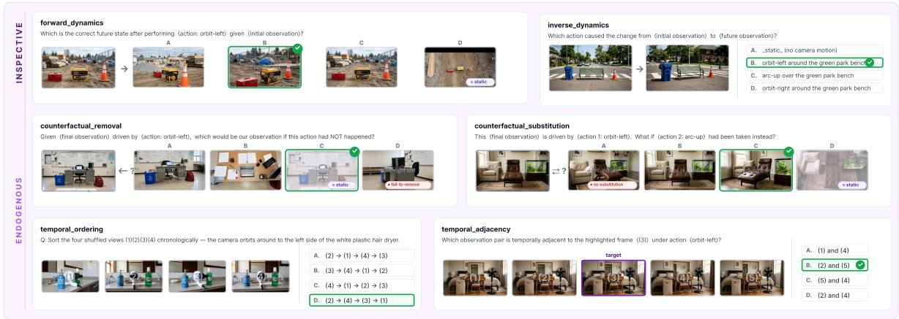  
Figure 6 | Inspective action type: representative QA items showing orbit-L / orbit-R / arc-up actions paired with all six inspective reasoning types.

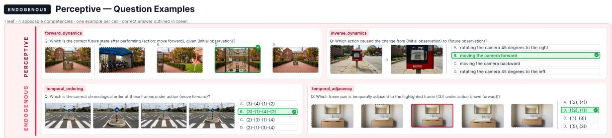  
Figure 7 | Perceptive action type: representative QA items across all four perceptive reasoning types (forward dynamics, inverse dynamics, temporal ordering, temporal adjacency).

Reasoning axis: prior-work cell coverage. Single reasoning types appear scattered across prior benchmarks: forward prediction is the standard probe in physical-modeling work (Bordes et al., 2025; Chow et al., 2025; Gao et al., 2025; NVIDIA, 2025); counterfactual reasoning is the dedicated focus of (Foss et al., 2025; Li et al., 2025c; Zhang et al., 2025b) and the concept-mixing variant of (Wu et al., 2024); temporal coherence is unpacked in video-generation evaluation (Huang et al., 2024; Ling et al., 2025; Yuan et al., 2024) and in video-language understanding suites (Li et al., 2024; Yang et al., 2024a). None co-instantiate all four families on a shared, controlled action axis, leaving the cross-family interaction structure unmeasured. WOVEN holds the four families jointly factored against the action axis of §2; the resulting (action type, reasoning type) cells are the elementary units of fine-grained diagnosis.

Action axis: downstream surfaces. Each action type tracks a distinct downstream surface: exogenous feeds physical-AI safety (Chow et al., 2025; NVIDIA, 2025); perceptive and inspective feed visual spatial-mental-modeling (Chen et al., 2026; Huang et al., 2025; Wang et al., 2026a; Yang et al., 2025c); navigative and manipulative feed embodied agents and visual planners (Cheng et al., 2025; Du et al., 2023; Jang et al., 2025; Majumdar et al., 2024; Yang et al., 2025b). A failure localized to one action type identifies which downstream surface the model is most unfit for.

Reasoning axis: downstream surfaces. Forward dynamics is the central capability behind embodied planning and visual world-model rollouts (Du et al., 2023; Hafner et al., 2025; Jang et al., 2025; Zhou et al., 2024); inverse dynamics underlies action recognition and learningfrom-observation (Rizzolatti et al., 2001); counterfactual templates underlie causal video reasoning (Foss et al., 2025; Zhang et al., 2025b); physical-modeling templates underlie physical-AI safety (Chow et al., 2025; NVIDIA, 2025); temporal-coherence templates underlie videounderstanding pipelines (Li et al., 2024). As with the action type axis, failure localized to a reasoning type family identifies the downstream surface most affected.

Scene axis: scale and breadth. A central premise of the methodology is that scene diversity is a controlled dimension to be held fixed while the action and reasoning axes are perturbed. Realworld video corpora cannot guarantee both the action-axis controllability of §2 and full scene-axis breadth simultaneously. Simulators, prevalent in embodied-AI benchmarks (Cheng et al., 2025; Dang et al., 2025; Luo et al., 2026; Majumdar et al., 2024; Yang et al., 2025b) and physical-AI benchmarks (Bordes et al., 2025; Gao et al., 2025), deliver controllability but commit to a small number of pre-built environments with a documented visual-domain gap. A VGM stimulus engine delivers both: under fixed scene specification, the rollout produces visually realistic stimuli at every (action type, scene type) cell, and across scenes, lexical scene specification swaps cleanly without further pipeline change. This is the most direct realization of the VGM-asstimulus-engine argument of §2.2.

## A.5. Empirical correspondence between external failures and WOVEN cells

This appendix makes the claim of §A.2 quantitative: the failures external benchmarks report in isolation are the marginals of WOVEN’s grid, so the cell where each external failure falls should be hard in WOVEN exactly when the external task is hard. We establish the correspondence in two layers, a conceptual mapping of each benchmark to its WOVEN cell and three statistical tests of that mapping, all computed from published baselines and our existing 38-model evaluation without additional experiments.

Conceptual mapping. Table 8 assigns each external benchmark, at the sub-task level where one is provided, to the WOVEN (action type, reasoning type) cell it instantiates. The mapping is many-to-one by construction: several external benchmarks fall in the same WOVEN cell because each isolates one axis while WOVEN crosses both, which is the precise sense in which WOVEN unifies rather than duplicates them.

Table 8 | Conceptual mapping of external benchmarks to the WOVEN cells they instantiate. Several benchmarks fall in one cell (many-to-one), the sense in which WOVEN unifies scattered marginals rather than duplicating any one of them. Stat marks which correspondence test the pair primarily supports: M model-level rank correlation, D cell-level difficulty correlation.
<table><tr><td>External benchmark (sub-task)</td><td>WOVEN cell / axis</td><td>Stat</td></tr><tr><td>VSI-Bench (Yang et al., 2025a) (relative direction)</td><td>perceptive/inspective × forward</td><td>M, D</td></tr><tr><td>VSI-Bench (appearance order)</td><td>perceptive × temporal</td><td>M, D</td></tr><tr><td>VSI-Bench (route planning)</td><td>navigative × forward</td><td>M, D</td></tr><tr><td>ViewSpatial-Bench (camera vs. human)</td><td>manipulative view-axis (ego/allo)</td><td>M, D</td></tr><tr><td>3DSRBench (orientation, uncommon view)</td><td>inspective × forward; orientation perturbation</td><td>M, D</td></tr><tr><td>VLM4D (rotational/directional motion)</td><td>inspective/perceptive rotation</td><td>D</td></tr><tr><td>MindCube (perspective-taking, what-if)</td><td>inspective × {forward, counterfactual}</td><td>M, D</td></tr><tr><td>IntPhys 2 (object principles)</td><td>exogenous × physical</td><td>D</td></tr><tr><td>PhysBench (physical reasoning)</td><td>exogenous × {physical, forward}</td><td>M, D</td></tr><tr><td>CLEVRER (predictive, counterfactual)</td><td>exogenous × {physical, counterfactual}</td><td>D</td></tr><tr><td>CausalVQA (counterfactual, hypothetical)</td><td>manipulative × counterfactual</td><td>D</td></tr><tr><td>TemporalBench (event order/adjacency)</td><td>all actions × temporal</td><td>M, D</td></tr></table>

Statistical tests. Three complementary analyses, all from published numbers and our evaluation, test whether the mapping holds empirically. (i) Model-level rank correlation. Our cohort and the external benchmarks share a backbone of commonly evaluated models, principally the Qwen2.5-VL ladder (3/7/32/72B) and Gemma-3 (4/12/27B), which appear in most recent spatial and physical benchmarks, often with the sub-task breakdowns that map to WOVEN cells. For each mapped pair we compute the Spearman correlation between the shared models’ WOVEN-cell accuracy and their external sub-task accuracy; the Qwen2.5-VL ladder is the strongest anchor because its four scale points trace a controlled difficulty gradient, so a monotone co-trend is itself evidence. As the shared set per benchmark is small (about 4 to 8 models), this layer is corroborating. (ii) Cell-level difficulty correlation. For each mapped pair we take the WOVEN-cell difficulty (frontier accuracy or human-frontier gap, from our evaluation) and the external sub-task difficulty (published frontier-vs-human gap), and correlate the difficulty profile across all pairs. This needs no model overlap and tests the structural claim directly, whether the WOVEN cells that are hard are the external tasks that are hard, and is the statistical backbone of the correspondence. (iii) Common-reference normalization. For benchmarks reporting few of our models, we normalize both sides to a shared anchor, performance relative to Qwen2.5-VL-72B or to the human ceiling, so that thin-overlap benchmarks still enter the cell-level correlation on a common scale.

Reading the result. A positive correspondence supports the central claim that WOVEN’s taxonomy is the primitive’s intrinsic structure and reflects the same failure modes external work reports, while the many-to-one mapping preserves WOVEN’s distinct contribution: the correspondence is convergence onto one grid rather than redundancy with any benchmark on it.

## A.6. Extended related work

WOVEN sits at the intersection of three programs; cell-level prior-work coverage and downstream-surface mapping are in Appendix A.4.

World modeling. The term world model spans heterogeneous formal commitments: latent predictive architectures (DreamerV3 (Hafner et al., 2025), V-JEPA 2 (Assran et al., 2025)); generative pixel-rollout simulators (Sora (Brooks et al., 2024), Genie 3 (Ball et al., 2025), Cosmos-Predict2 (NVIDIA, 2025), HunyuanVideo (Kong et al., 2025); quality benchmarks (Huang et al., 2024; Ling et al., 2025; Yuan et al., 2024)); symbolic-environment learners (Chen et al., 2026; Warrier et al., 2026); and procedural-planning formulations (Chen et al., 2025a). Recent surveys note that no single operationalization dominates (Xing et al., 2026), and existing world-model evaluation benchmarks inherit this fragmentation (Gao et al., 2025; NVIDIA, 2025; Wang et al., 2025; Zhang et al., 2026b). We focus on action-conditioned visual transition reasoning over (�, �, �′), using a common transition representation to study the shared and distinct supervision requirements of visual reasoning tasks.

VGMs as world simulators. The Sora technical report (Brooks et al., 2024) introduced the “video generation as world simulator” framing, since adopted by CogVideoX (Yang et al., 2024b), HunyuanVideo (Kong et al., 2025), the Wan family (Wan et al., 2025), Cosmos-Predict2 (NVIDIA, 2025), and Genie 3 (Ball et al., 2025), with Yang et al. (2024a) articulating the strongest version of the claim. Empirical support comes from direct rollout measurement (Huang et al., 2024; Ling et al., 2025; NVIDIA, 2025; Yuan et al., 2024) and downstream exploitation as black-box simulators (Cai et al., 2025; Du et al., 2023; Jang et al., 2025; Wang et al., 2025; Yang et al., 2025c; Zhou et al., 2024); closed-loop evaluation (Zhang et al., 2026b) additionally validates that VGM-rollout controllability drives embodied utility. These findings motivate our use of Wan2.2-I2V-A14B (Wan et al., 2025) to generate diverse, controllable transitions for structured supervision.

Multimodal reasoning benchmarks. Independent literatures document MLLM failures along axes that each touch a slice of action-conditioned visual world modeling without naming it: counterfactual video reasoning (CausalVQA (Foss et al., 2025), MuCR (Li et al., 2025c), CRIPP-VQA (Patel et al., 2022)); post-event physical prediction (IntPhys 2 (Bordes et al., 2025), PhysBench (Chow et al., 2025), BEAR (Qi et al., 2026)); viewpoint-conditioned spatial inference (MindCube (Wang et al., 2026a), VLM4D (Zhou et al., 2025b), 3DSRBench (Ma et al., 2025), COMFORT (Zhang et al., 2025b), Open3D-VQA (Zhang et al., 2025a), 3D-R1 (Huang et al., 2025)); and video un derstanding plus embodied evaluation (MVBench (Li et al., 2024), ECBench (Dang et al., 2025), OpenEQA (Majumdar et al., 2024), EmbodiedBench (Yang et al., 2025b), EmbodiedEval (Cheng et al., 2025), RoboBench (Luo et al., 2026); on the training side, EMCompress (Fan et al., 2026)). These four families have been pursued in isolation with disjoint distractor designs, yet their failure modes factor through a shared structural deficit (Appendix A.3 makes the triangulation explicit). WOVEN builds on these diagnostic insights by expressing reasoning tasks over a common $( s , a , s ^ { \prime } )$ representation and varying the semantic components of supervision, enabling controlled study of shared training requirements and the organization of transfer.

## B. Benchmark construction details

## B.1. Off-the-shelf video priors on WOVEN

Before training, we ask whether engines pretrained at scale on video reconstruction and futureframe prediction already solve WOVEN, and whether the transition knowledge they hold is directly queryable. We evaluate three frozen off-the-shelf engines on test\_id under one shared read-out recipe: the engine scores every option of the 4-way MCQ and the argmax is taken (chance = 25%).

Video encoder. V-JEPA2 (ViT-L) (Assran et al., 2025). Non-action reasoning types use its native energy read-out zero-shot; action-conditioned types are read out by a probe trained on the frozen representation at two capacities, linear and attentive, with an open-vocabulary action space reached through a CLIP text bridge.

Video generator. I2VGen-XL (Zhang et al., 2023) (2.84B denoiser). Options are scored by conditional denoising likelihood over a fixed grid of diffusion steps with shared noise. Its forward-only rollouts cover 7 of the 8 reasoning types (counterfactual substitution has no forward likelihood read-out).

Image generator. OmniGen (Xiao et al., 2024) (3.8B, matched to the video generator’s denoiser scale), an image-editing generative model conditioned on the initial frame and the action instruction, scored with the identical likelihood recipe. This engine tests whether an image prior could stand in for a video prior as the WOVEN rollout generator.

Table 9 | Off-the-shelf video priors on WOVEN (test\_id, 4-way MCQ accuracy in %, chance = 25). Columns are reasoning types, abbreviated as in §2.2. For the encoder, the event cue of cued prediction is text and outside its input space, so outcome and cued prediction share one read-out. Overall for the generator engines spans the seven reasoning types their forward-only read-out covers.
<table><tr><td>Model</td><td>Fwd</td><td>Inv</td><td>Rmv</td><td>Sub</td><td>Otm</td><td>Cue</td><td>Ord</td><td>Adj</td><td>Overall</td></tr><tr><td>V-JEPA2 linear</td><td>51.3</td><td>51.9</td><td>66.5</td><td>20.0</td><td>29.2</td><td>29.2</td><td>37.5</td><td>16.9</td><td>39.3</td></tr><tr><td>V-JEPA2 attentive</td><td>70.7</td><td>75.4</td><td>57.7</td><td>35.9</td><td>29.2</td><td>29.2</td><td>37.5</td><td>16.9</td><td>47.7</td></tr><tr><td>Video generator</td><td>19.8</td><td>27.7</td><td>37.6</td><td>一</td><td>13.2</td><td>13.9</td><td>53.1</td><td>56.2</td><td>36.4</td></tr><tr><td>Image generator</td><td>20.0</td><td>22.5</td><td>24.5</td><td>一</td><td>13.5</td><td>12.5</td><td>22.0</td><td>21.5</td><td>19.5</td></tr></table>

WOVEN is not trivially solvable from off-the-shelf priors. The strongest read-out reaches 47.7% overall against the 92.3% human baseline, and each engine’s profile is partial: the encoder is strong on action-conditioned types (forward 70.7, inverse 75.4) but weak on temporal ones (37.5/16.9), while the video generator shows the complementary profile (temporal 53.1/56.2, forward 19.8).

The transition prior lives in the video prior. At matched denoiser scale and under the identical likelihood recipe, the image-editing generator scores 19.5% overall with no reasoning type above chance. An image prior cannot stand in for a video prior as the rollout generator, which supports building WOVEN on VGM rollouts.

The knowledge is present but not directly accessible. On identical frozen V-JEPA2 features, the attentive probe recovers +19 to +34pp over the linear probe on action-conditioned types, and a random-initialization control (same probe, same training data, randomly initialized encoder) trails the pretrained encoder by 27.6pp on average, positive on all 12 action cells: the gain is attributable to the pretrained representation, and the transition knowledge it holds is recoverable but not linearly accessible. This is the premise behind $\ S 3 { : }$ video-pretrained engines hold the $( s , a , s ^ { \prime } )$ prior (which is what makes them strong rollout generators for WOVEN) but do not expose it to direct querying, and post-training on $( s , a , s ^ { \prime } )$ supervision is what installs the access.

## B.2. Construction pipeline details

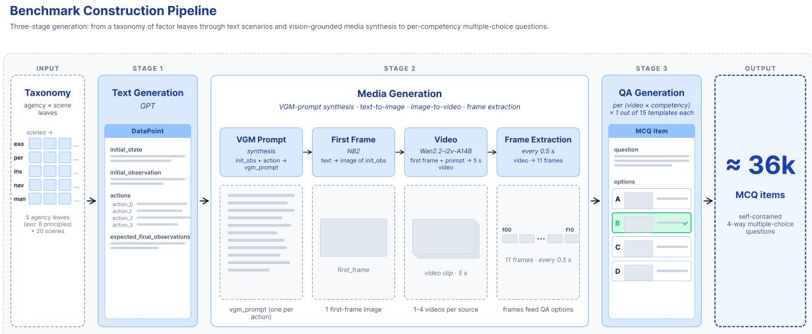  
Figure 8 | Construction pipeline: stage-1 textual specification, stage-2 VGM rollout (Wan2.2-I2V-A14B), stage-3 typed-distractor MCQ assembly, with quality-control filters at each stage.

This appendix documents the technical realization of the three-stage construction pipeline summarized in §2.4.

Stage 1 (text specification). For each (action type, scene) combination we generate a textual specification consisting of: (i) the initial environment state and the first-person observation of $s _ { t } ;$ (ii) one or more action descriptions with deterministic identifiers; and (iii) the expected postaction state. Action vocabularies are action-type-specific: exogenous draws one principle per item from the closed inventory of 8 principles; perceptive draws all 4 fixed camera-translation/rotation actions; inspective draws all 3 fixed camera-orbit actions; navigative draws 4 in-scene targets; manipulative draws 4 object interactions consistent with the scenario-group definition (§2).

Stage 2 (media synthesis). The first frame is synthesized from the initial-observation text by an image generative model. The post-action 5-second video at 24 fps is then synthesized by Wan2.2-I2V-A14B (Wan et al., 2025) conditioned on $( s _ { t } , a )$ . We extract 11 uniformly spaced frames per video, indexed $f _ { 0 0 } , \ldots , f _ { 1 0 } ,$ with $f _ { 0 0 } = s _ { t }$ and $f _ { 1 0 } = s _ { t + 1 }$ . Intermediate frames are reserved for temporal-coherence reasoning types.

Stage 3 (MCQ assembly). Four-way MCQs are assembled from the resulting frames per the reasoning-type-specific distractor strategies of $\ S 2$ . Each item additionally exposes structured metadata, taxonomy path, action-type-specific auxiliary fields (e.g., manipulated object, pairedvariant indices, exogenous principle), per-frame paths, and the deterministic distractor type label where applicable, to support fine-grained downstream analysis.

Quality control. Media-level rule-based and model-based filters are applied to first frames and videos to reject outputs that fail per-action-type physical plausibility checks; layout and orientation perturbations carry an additional automated edit-faithfulness, scene-consistency, and artifact-absence check. Quality control operates only on media; it does not gate question generation.

## B.3. Why action type over motor command

Existing world-model action taxonomies organize � by embodiment: discrete vs. continuous in latent-policy world models (Hafner et al., 2025), joint/wheel/keyboard by application domain in driving and robotics WMs, or DOF-counted action vectors in egocentric WMs. These conventions are appropriate for embodiment-bound WM training, where the action space is fixed by the agent’s effectors and the state space by the simulator. WOVEN instead evaluates a cognitive primitive across heterogeneous embodiments, bodiless cameras, simulated humans, simulated humanoids, externally-caused physical events. An embodiment-centric taxonomy would force inter-action-type alignment via low-level motor parameters that have no shared semantics across these settings (a wheel-radian and a translation-meter are not commensurable diagnostics for world modeling). Organizing by action type, “who initiates the change and how it changes the visual state”, operationalizing the cognitive-science notion of agency (Haggard, 2008; Khalighinejad et al., 2018; Passingham et al., 2010), preserves cross-embodiment comparability while remaining cognitively grounded. We retain the cognitive-science terms agency (for the action axis) and competency (for the reasoning axis) only here, as the interface that motivates the taxonomy; the benchmark itself is named by action type, reasoning type, and scene type.

## B.4. Scene set

The indoor set is {living\_room, bedroom, bathroom, restaurant, kitchen, classroom, office, supermarket, gym, hospital}; the outdoor set is {crossroad, sidewalk, playground, farm, garage, park, construction\_ site, yard, school\_campus, beach}. The held-out OOD pair is (restaurant, beach).

## B.5. Cognitive Science support of Exogenous principles

The eight exogenous principles in WOVEN are organized in two cog-sci-grounded groups, each instantiating a separate strand of intuitive-physics evidence.

Group 1: object properties (permanence, cohesion, solidity). These are the three foundational primitives of Spelke’s core-knowledge inventory (Spelke, 2022; Spelke and Kinzler, 2007). Permanence: an object continues to exist when occluded; the diagnostic violation is dis-appearance during occlusion (Baillargeon, 1987). Cohesion: an object’s parts move together as a connected whole; the diagnostic violation is mid-event part-splitting. Solidity: distinct objects do not interpenetrate; the diagnostic violation is one object passing through another. Each principle has its own Stage 1 prompt template in the construction pipeline, ensuring coverage of the principle-specific scene type and event type.

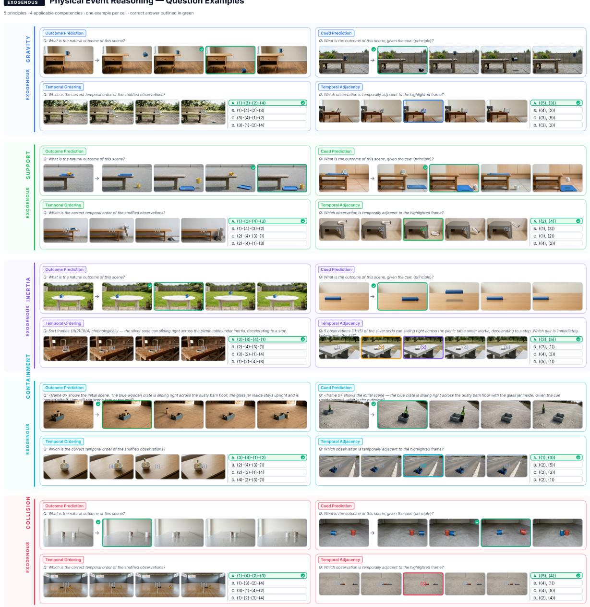  
Figure 9 | Exogenous physical events (gravity, support, inertia, containment, collision): perprinciple illustration showing the action-conditioned violation-of-expectation distractor design.

Group 2: physical events (gravity, support, inertia, containment, collision). These are five principal physical-event classes routinely catalogued in computational intuitive-physics work (Battaglia et al., 2013) and in violation-of-expectation studies (Baillargeon, 1987). Gravity: unsupported objects fall in expected directions and trajectories. Support: an object resting on a surface remains supported absent additional cause. Inertia: motion persists or stops in cause-consistent ways. Containment: contained objects move with their containers and constrain motion. Collision: contact events transfer motion in expected ways.

The two groups jointly span the principles of object-state-as-property (Group 1) and objectstate-as-event (Group 2), giving the exogenous action type a clean cross-section. Each principle is tied to its own IEM violation-of-expectation distractor inventory in outcome prediction and cued prediction (§2).

## B.6. Manipulative cross-factoring

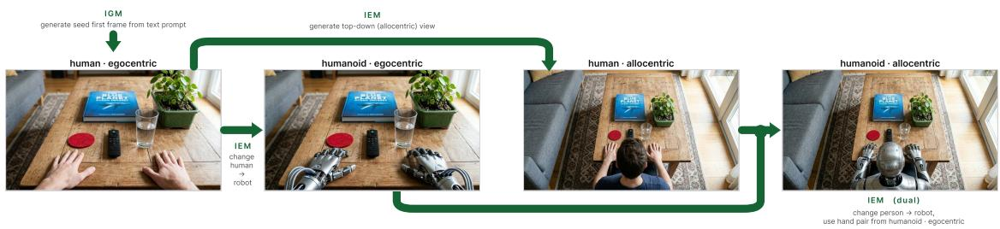  
Figure 11 | Manipulative cross-factoring: {human, humanoid} × {egocentric, allocentric} derivation showing the four pair-mate cells used by the pair-mate independence analysis (Appendix F.8) and the cross-action-type transfer analysis (Appendix G.7).

Why 2 × 2. The cross-factoring along subject ∈ {human, humanoid} × view ∈ {egocentric, allocentric} is motivated by two complementary cog-sci traditions. The subject axis distinguishes biologically natural actors from kinematically constrained robotic actors, isolating an MLLM’s robustness to embodiment-shape variation in action-recognition pathways (Gibson, 1979; Rizzolatti et al., 2001). The view axis instantiates the egocentric/allocentric reference-frame distinction, a foundational dichotomy in spatial cognition (Burgess, 2006; Epstein et al., 2017; Kessler and Thomson, 2010): egocentric views ground the action in the actor’s effector frame, while allocentric views ground it in a third-person scene frame. Cross-factoring isolates whether world-modeling competence is invariant to actor identity at fixed view, invariant to view at fixed actor, or jointly entangled across the two.

Generation pipeline. Each manipulative scenario specifies five non-rotationally-symmetric, color-distinct everyday objects within a fixed scene. Four of them are designated as targets of four independent (“parallel-universe”) actions; the fifth, the bystander, is held visible and unmoved across all four actions, anchoring the geometric/appearance perturbations of §2.4. The four paired (subject, view) variants share the same scenario specification, the same five-object configuration, and the same four action verbs, differing only in actor identity and camera frame.

  
Figure 12 | Manipulative action type: representative QA items showing object-interaction A/B/C/D action structure with all four manipulative reasoning types (forward dynamics, inverse dynamics, counterfactual substitution, counterfactual removal).

Per scenario, this yields four sources that share underlying content but differ in embodiment and frame-of-reference; within-scenario consistency tests are the basis for the embodiment-vs-frameof-reference dissociation analysis in Appendix F.8. The construction pipeline is multi-stage and inter-stage-dependent, subject-and-view selection → five-object selection (with diversity and rotational-asymmetry constraints) → action-verb selection (four mutually-independent verbs targeting four different objects) → bystander designation → per-(subject, view)-variant Stage 2 media synthesis with view-dependent prompt instructions.

Split-time invariant. The four-way scenario-group is the atomic unit of partitioning at split time, ensuring all four paired variants land in the same split. Validation is carved at the scenario-group level (10% of groups, seed 42); training/test partition is at the source level within remaining groups. This prevents the most direct visual-leakage failure mode, a humanoidallocentric variant in train and the matching human-egocentric variant in val/test sharing the underlying scene, object configuration, and action verbs.

## B.7. Splits: stratification and pool sizes

Partitioning is performed at the pre-MCQ-assembly stage. For each action type × scene stratum, the underlying generation pool is partitioned 80%/20% into a train candidate pool and a test candidate pool. Manipulative is partitioned at the four-way scenario-group level (Appendix B.6). The validation set is then carved as ∼ 10% of the train pool, stratified by action type and exogenous principle (random seed 42). The scene-OOD test set is generated by an identical Stage 1–3 pipeline restricted to the two held-out scenes (restaurant, beach). The perturbation test is generated by the same pipeline from ID-test sources whose initial frames are edited with a geometric or appearance change before rollout (§2.4, Appendix B.10). The resulting per-split item counts are reported in Fig. 13 and Table 22.

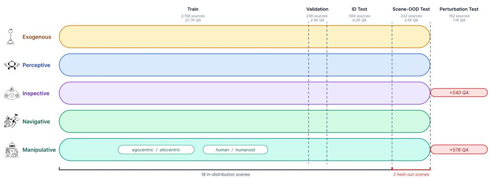  
Figure 13 | WOVEN splits: train\_pool (used only for training), test\_id (�=6,228), test\_ perturbation\_id (�=1,116), and held-out OOD scenes (beach, restaurant). The OOD set is reserved for future fine-tuning evaluations.

## B.8. Action type–reasoning type adjacency

Not every (action type, reasoning type) cell is instantiated in the benchmark: counterfactual reasoning applies where the action meaningfully alters scene state, and physical modeling is exogenous-specific. The full instantiation matrix is given in Table 10.

Table 10 | Action type–reasoning type adjacency: which reasoning types instantiate items for each action type. ✓: instantiated; —: not instantiated. Reasoning types are abbreviated as in §2.2.
<table><tr><td>Action type</td><td>Otm</td><td>Cue</td><td>Ord</td><td>Adj i</td><td></td><td>Fwd Inv</td><td>Rmv</td><td>Sub</td></tr><tr><td>Exogenous</td><td>√</td><td>√</td><td>√</td><td>√</td><td>一</td><td>一</td><td></td><td>一</td></tr><tr><td>Perceptive Inspective</td><td>一</td><td></td><td>√</td><td>√</td><td>√</td><td>√</td><td></td><td></td></tr><tr><td></td><td>一</td><td></td><td>√</td><td>√</td><td>√</td><td>√</td><td>√</td><td>√</td></tr><tr><td>Navigative</td><td>一</td><td>一</td><td>√</td><td>√</td><td>√</td><td>√</td><td></td><td></td></tr><tr><td>Manipulative</td><td>一</td><td>1</td><td>一</td><td>一</td><td>√</td><td>√</td><td>√</td><td>√</td></tr></table>

Why each cell is or is not instantiated. Physical Modeling (Otm, Cue) is exogenous-specific: only externally-driven physical events admit a violation-of-expectation outcome judgement that does not depend on agent choice. Causal Dynamics (Fwd, Inv) is endogenous-specific: the source datapoint must contain multiple sibling actions for the cross-action MCQ to admit nontrivial distractors, which exogenous’s single-action structure does not afford. Temporal Coherence (Ord, Adj) applies wherever visual change unfolds over time within a single rollout, which excludes manipulative whose inter-frame dynamics are dominated by hand-occlusion artifacts unrelated to scene-state evolution. Counterfactual Reasoning (counterfactual\_substitution, counterfactual\_removal) requires the action to meaningfully alter scene state, producing an $s _ { t + 1 }$ informatively different from $s _ { t } ,$ which holds for inspective (camera viewpoint changes the visible object configuration) and manipulative (object configuration itself changes), but not perceptive (camera-only, scene unchanged) or navigative (scene-positional change without state change).

## B.9. Distractor design: scope of typed labeling

The scope of the typed-label property of distractors (§2) varies by reasoning type family.

Fully-typed distractors. For reasoning types that draw distractors from sibling actions in action types with a small fixed action vocabulary, perceptive (4 fixed actions: translation and rotation) and inspective (3 fixed actions: orbit-L, orbit-R, arc-up; plus a static-camera padding option to bring the option set to four), each distractor carries a deterministic, globally trackable label such as rotate\_left. Item-level error attribution to specific failure modes is therefore directly cross-comparable across items within an action type.

Family-level-typed distractors. For reasoning types whose action vocabulary varies per item, navigative (the four targets are scene-specific) and manipulative (the four object interactions are scenario-specific), distractors are still drawn from the closed sibling-action set, but their labels are not globally trackable across items. Failure-mode attribution is informative at the family level (e.g., “selected a sibling action that shares object identity but differs in motion direction”) but does not align item-by-item.

Closed-class distractors. For temporal reasoning types (temporal ordering and temporal adjacency), distractors are drawn from a closed inventory of permutation classes (swap, off-byone, endpoint-swap, adjacent-swap variants). Each class corresponds to a specific temporalcognition error mode and is family-level trackable.

IEM-edit distractors. For physical-modeling reasoning types (outcome prediction and cued prediction), distractors are constructed by editing $s _ { t + 1 }$ via Gemini 3.1 Flash Image (Google DeepMind, 2026) from a closed inventory of physically-violating edit types (object-property and physical-event violations). Each edit type is globally trackable and aligned with a specific violation-of-expectation hypothesis. The correct outcome frame is also passed once through the same editor under a null instruction that asks for the same image with nothing changed, so every image option of a physical-modeling item has been through the editor exactly once (all 1,488 exogenous sources). All four options of an item are released at the same size and in the same format.

Editing-artifact control. The null pass gives the correct option and the distractors the same editing history only if the editor re-renders the whole image rather than inpainting the edited region. We test this on all 864 edited distractor frames of the test set. Each edited frame is resized to the size of its source frame and compared with the source in the half of the image farthest from the edit; the control is the source frame resized to the editor’s output size and back, which is what an untouched region looks like after resampling alone. Table 11 reports the result. The far-region residual is about 20× the resampling floor, present in every frame and every violation type, spatially structured (lag-1 autocorrelation 0.58), and not reduced by any global shift, so it is neither a resampling nor an alignment effect. The null-edited correct options show the same footprint (far-region residual median 2.0, whole-image median 3.4). The editor therefore re-renders the full image regardless of the instruction, and the correct option and the distractors share the same editing process everywhere in the image.

We further test whether any residual difference between a null pass and a violation edit is detectable. The test is designed to see editing artifacts only and no task-relevant content. We randomly sample 166 test sources and use their 278 distractors that are edits of the outcome frame, since only these share unedited content with the correct option. A probe sees only 28×28 patches from the half of each image farthest from the edited region, where the content is identical across options, taken at the same positions for the correct option and its distractors. The probe is a six-layer convolutional network (3×3 convolutions with 32–128 channels, batch normalization, ReLU, global average pooling, and a linear output), trained with AdamW (learning rate $2 \times 1 0 ^ { - 3 }$ weight decay $1 0 ^ { - 4 } ,$ one-cycle schedule) for 1,500 steps on batches of 1,024 patches balanced across labels, with random horizontal flips. Evaluation uses five-fold cross-validation over sources with three training seeds, so no source appears in both training and test folds. We report patch-level balanced accuracy (chance 50%) and image-level AUC from each image’s mean patch logit (chance 0.50), against a permutation null that relabels one randomly chosen option per source as correct and reruns the same pipeline (10 seeds). Table 12 shows no detectable signal above the null. As a positive control, we run the same probe, cross-validation, and permutation null on the same 166 option sets with the correct option replaced by the original outcome frame that has not been through the editor (Table 13). There the correct option is clearly separable (55.9% balanced accuracy, AUC 0.718; �=11.3 and 14.2), so the probe has the power to detect editing artifacts when they exist. Without the null edit the correct option is separable from the distractors; with it, it is not. The null pass therefore removes the editing signature that would otherwise mark the correct option, and the only systematic difference between the correct option and a distractor is the edited content itself.

Table 11 | The editor re-renders the whole image. Far-region residual between edited distractor frames and their source frames (test set, 864 edited frames; gray levels on a 0–255 scale).
<table><tr><td>Measurement</td><td>Value</td></tr><tr><td>Mean absolute residual, far half of the image, edited vs. source</td><td>3.8 (median 1.9, p90 8.0)</td></tr><tr><td>Same measurement for the resize round-trip of the source frame (control)</td><td>0.17</td></tr><tr><td>Ratio edited / control, per frame</td><td>median 20.6×; 0 of 864 below 1.5×</td></tr><tr><td>Lag-1 spatial autocorrelation of the far-region residual Reduction of the far-region residual by the best global</td><td>0.58</td></tr><tr><td>shift (±3 px, 0.5 px steps, 80 frames)</td><td>0%</td></tr><tr><td>Ratio edited / control by violation type (23 types)</td><td>10×-36×, every type</td></tr></table>

Table 12 | Editing-artifact probe on the released data (test set, 166 sources, 166 correct options, 278 distractors).
<table><tr><td>Metric</td><td></td><td>Observed Permutation null (10 seeds)</td><td>Z</td></tr><tr><td>Patch-level balanced accuracy (%)</td><td>51.1</td><td> $5 0 . 9 \pm 0 . 4$ </td><td>0.5</td></tr><tr><td>Image-level AUC</td><td>0.532</td><td> $0 . 5 2 0 \pm 0 . 0 0 8$ </td><td>1.4</td></tr></table>

Per-cell traceability coverage. Table 14 summarizes which (action type, reasoning type) cells receive fully-typed (item-level globally trackable) versus family-level (closed-class but itemdependent) distractors.

Table 13 | Positive control: the same probe on a constructed subset without the null edit, with the correct option replaced by the original, unedited outcome frame (test set, 166 sources, 166 correct options, 278 distractors).
<table><tr><td>Metric</td><td></td><td>Observed Permutation null (10 seeds)</td><td>Z</td></tr><tr><td>Patch-level balanced accuracy (%)</td><td>55.9</td><td> $5 0 . 5 \pm 0 . 5$ </td><td>11.3</td></tr><tr><td>Image-level AUC</td><td>0.718</td><td> $0 . 5 0 8 \pm 0 . 0 1 5$ </td><td>14.2</td></tr></table>

Table 14 | Distractor-type coverage by (action type, reasoning type) cell. F = fully-typed siblingaction distractors, globally trackable item-by-item. C = closed-class sibling-action distractors, family-level trackable. I = IEM-edit distractors, globally trackable. S = sequence-permutation distractors, family-level trackable; —: cell not instantiated. Reasoning types are abbreviated as in §2.2.
<table><tr><td></td><td>Otm</td><td>Cue</td><td>Ord</td><td>Adj</td><td>Fwd</td><td>Inv</td><td>Rmv</td><td>Sub</td></tr><tr><td>Exogenous</td><td>I</td><td>I</td><td>S</td><td>S</td><td>1</td><td></td><td></td><td>一</td></tr><tr><td>Perceptive</td><td></td><td>一</td><td>S</td><td>S</td><td>F</td><td>F</td><td></td><td></td></tr><tr><td>Inspective</td><td></td><td></td><td>S</td><td>S</td><td>F</td><td>F</td><td>F</td><td>F</td></tr><tr><td>Navigative</td><td></td><td>一</td><td>S</td><td>S</td><td>C</td><td>C</td><td></td><td></td></tr><tr><td>Manipulative</td><td></td><td>一</td><td></td><td>一</td><td>C</td><td>C</td><td>C</td><td>C</td></tr></table>

A cell labeled F or I contributes per-item failure-mode counts that license the per-cell binomial, $\chi ^ { 2 } ,$ and two-proportion-� tests of §2.4. A cell labeled C or S contributes to family-level distributional tests but not to per-item attribution. The fully-typed cells cover all of perceptive’s and inspective’s causal-dynamics + counterfactual structure, i.e., the action types on which the perturbation probe (§2.4) also concentrates, ensuring that the most diagnostically loaded subset of the benchmark is also the subset with the strongest statistical instrumentation.

## B.10. Perturbation probe: construction and scope

Construction. The perturbation test follows the same Stage 1–3 pipeline as the other splits. For each source, the designated object in the initial frame is edited with a geometric (layout or orientation) or an appearance change, the edited frame passes the edit-faithfulness, sceneconsistency, and artifact-absence checks of Appendix B.2, and the VGM is rolled out again from the edited frame under the same action. Questions are assembled from the new rollout as for the in-distribution test, so each perturbed item shares its action and query with an unperturbed item and differs only in the initial state.

Scope: inspective + manipulative only. Geometric and appearance perturbations are welldefined when the action operates on a discrete object whose perturbation can be cleanly localized. Inspective actions orbit/arc around a designated main object, and the perturbation targets that main object. Manipulative actions act on one of four target objects per scenario; the perturbation targets the bystander object that is held visible and unmoved across all four actions (§2, Appendix B.6), so the perturbation does not disturb the action’s primary target. For perceptive and navigative, no such designated object exists and the action changes the whole frame, so a localized edit of the initial frame has no stable target whose change the prediction should track. Exogenous similarly lacks a clean target: the relevant “state” is the multi-object configuration jointly, and the perturbation would re-define the principle being probed. Inspective and manipulative thus offer the cleanest diagnostic signal for the dorsal/ventral state-axis dualization the probe targets.

## C. Evaluation cohort and human studies

## C.1. Cohort: model inventory

We evaluate 38 frontier MLLMs spanning closed-source frontier, open-source dense ladders, and MoE families (Table 15). Where vendors do not publish parameter counts $( \mathrm { e . g . , G P T } \mathrm { - } 5 . x ,$ Qwen-VL-Max, Intern-S1, MiniMax, Seed, GLM-4.6V), the column is marked N/A; where they publish active vs. total separately (e.g., 30B-A3B = 30B total / 3B active), we list both.

Table 15 | Model inventory.
<table><tr><td>Model</td><td>Family</td><td>Params</td></tr><tr><td>GPT-5.4</td><td>GPT</td><td>N/A</td></tr><tr><td>GPT-5.2</td><td>GPT</td><td>N/A</td></tr><tr><td>Qwen-VL-Max</td><td>Qwen-max</td><td>N/A</td></tr><tr><td>Qwen2.5-VL-3B</td><td>Qwen2.5</td><td>3B</td></tr><tr><td>Qwen2.5-VL-7B</td><td>Qwen2.5</td><td>7B</td></tr><tr><td>Qwen2.5-VL-32B</td><td>Qwen2.5</td><td>32B</td></tr><tr><td>Qwen2.5-VL-72B</td><td>Qwen2.5</td><td>72B</td></tr><tr><td>Qwen3-VL-8B-Instruct</td><td>Qwen3</td><td>8B</td></tr><tr><td>Qwen3-VL-30B-A3B</td><td>Qwen3</td><td>30B-A3B (MoE)</td></tr><tr><td>Qwen3-VL-32B-Instruct</td><td>Qwen3</td><td>32B</td></tr><tr><td>Qwen3-VL-235B-A22B</td><td>Qwen3</td><td>235B-A22B (MoE)</td></tr><tr><td>Intern-S1</td><td>Intern</td><td>N/A</td></tr><tr><td>Intern-S1-Mini</td><td>Intern</td><td>N/A</td></tr><tr><td>Intern-S1-Pro</td><td>Intern</td><td>N/A</td></tr><tr><td>InternVL3.5-241B-A28B</td><td>Intern</td><td>241B-A28B (MoE)</td></tr><tr><td>InternVL3.5-Latest</td><td>Intern</td><td>N/A</td></tr><tr><td>Gemma-3-4B</td><td>Gemma3</td><td>4B</td></tr><tr><td>Gemma-3-12B</td><td>Gemma3</td><td>12B</td></tr><tr><td>Gemma-3-27B</td><td>Gemma3</td><td>27B</td></tr><tr><td>Gemma-4-26B-A4B</td><td>Gemma4</td><td>26B-A4B (MoE)</td></tr><tr><td>Gemma-4-31B</td><td>Gemma4</td><td>31B</td></tr><tr><td>Llama-4-Scout</td><td>Llama4</td><td>Scout (109B-MoE)</td></tr><tr><td>Llama-4-Maverick</td><td>Llama4</td><td>Maverick (400B-MoE)</td></tr><tr><td>Mistral-Small-3.2</td><td>Mistral</td><td>24B</td></tr><tr><td>Mistral-Large-2512</td><td>Mistral</td><td>N/A</td></tr><tr><td>Pixtral-Large-2411</td><td>Mistral</td><td>123B</td></tr><tr><td>MiniMax-01</td><td>MiniMax</td><td>N/A</td></tr><tr><td>Qwen3.5-9B</td><td>Qwen3.5</td><td>9B</td></tr><tr><td>Qwen3.5-27B</td><td>Qwen3.5</td><td>27B</td></tr><tr><td>Qwen3.5-35B-A3B</td><td>Qwen3.5</td><td>35B-A3B (MoE)</td></tr><tr><td>Qwen3.5-122B-A10B</td><td>Qwen3.5</td><td>122B-A10B (MoE)</td></tr><tr><td>Qwen3.5-397B-A17B</td><td>Qwen3.5</td><td>397B-A17B (MoE)</td></tr><tr><td>GLM-4.6V</td><td>GLM</td><td>N/A</td></tr><tr><td>Seed-1.6-Flash</td><td>Seed</td><td>N/A</td></tr><tr><td>Seed-2.0-Mini</td><td>Seed</td><td>N/A</td></tr><tr><td>Nemotron-Nano-12B-V2-VL</td><td>Nemotron</td><td>12B</td></tr><tr><td>ERNIE-4.5-VL-28B-A3B</td><td>ERNIE</td><td>28B-A3B (MoE)</td></tr><tr><td>ERNIE-4.5-VL-424B-A47B</td><td>ERNIE</td><td>424B-A47B (MoE)</td></tr></table>

## C.2. Human baseline

Three annotators, none of whom are authors, answered 990 in-distribution items, sampled uniformly over the combinations of action type and reasoning type, and 1,000 perturbation items (500 appearance, 500 geometric) through the interface in Fig. 14, which presents the same frames, question, and four options as the model input. Each answer is saved when chosen and cannot be changed. We compute each annotator’s accuracy per category and report the mean over the three annotators: 92.3% on the in-distribution items (Table 16) and 98.0% on the perturbation items (Table 17). Annotators were paid in accordance with local wage standards.

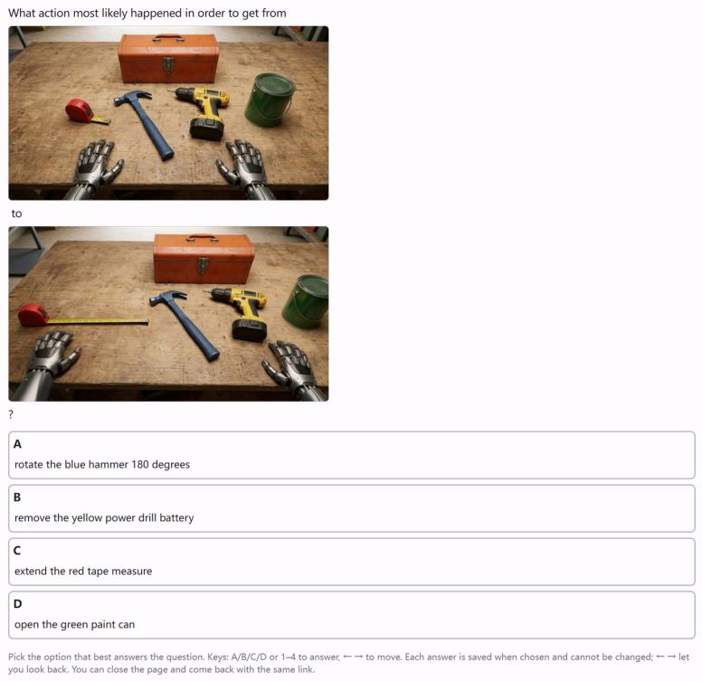  
Figure 14 | Human study interface. Annotators see the same frames, question, and four options as the models. Each answer is saved when chosen and cannot be changed.

Table 16 | Human accuracy (%) on the ID test, averaged over three annotators.
<table><tr><td></td><td colspan="5">Per-action type</td><td colspan="10">Per-reasoning type</td></tr><tr><td></td><td>Exo</td><td></td><td></td><td></td><td>Perc Insp Navi Mani </td><td></td><td>i | Cue Otm</td><td></td><td>Adj</td><td>Ord Fwd Inv</td><td></td><td></td><td>Rmv</td><td></td><td>Sub | Overall</td></tr><tr><td>human 92.8</td><td></td><td>92.8</td><td>92.6</td><td>90.6</td><td></td><td>92.8</td><td>91.1</td><td>93.3</td><td>91.7</td><td>92.8</td><td>92.8</td><td>92.8</td><td>91.1</td><td>92.2</td><td>92.3</td></tr></table>

Table 17 | Human accuracy (%) on the perturbation probe, averaged over three annotators.
<table><tr><td></td><td>appearance</td><td>geometric</td><td>overall</td></tr><tr><td>human</td><td>98.7</td><td>97.3</td><td>98.0</td></tr></table>

## C.3. Human audit of the test splits

The labelled answers of WOVEN’s test questions are valid for at least 98% of the questions, 92.5% of the rollouts carry out the scripted action fully and 98.5% at least partly, and 98.7% of the perturbation edits follow their instruction without other changes. WOVEN’s questions and answers are produced automatically from generated rollouts, so three things could be wrong without being visible in model accuracy: a labelled answer may not be the correct one, a rollout may not carry out the scripted action or may show an implausible or discontinuous process, and an edited option in the perturbation split may not follow its edit instruction or may change more than instructed. Two annotators, who are not authors, independently audited a stratified sample of the test splits in three parts through a web page with one item per screen, both seeing the same items in the same fixed, shuffled order; every choice is stored server-side in a hash-chained log per annotator. The sample holds 250 questions from 228 sources of the in-distribution and held-out-scene test splits: 200 main questions stratified by action type (exogenous 43, inspective 43, manipulative 43, perceptive 36, navigative 35; exogenous questions are physical-modeling questions, and for the other action types the questions cycle over every reasoning type the action type has) and 50 perturbation questions (inspective 25, manipulative 25; geometric and appearance edits split evenly), each with three edited options.

In Part 1 (250 questions), the annotator answers each question as a model does, without seeing the labelled answer, states a confidence (guessing, fairly sure, sure), and says whether another option could also be correct; answers can be changed until the page is confirmed, after which it is locked. In Part 2 (100 rollout videos, 20 per action type), the annotator sees the video the question was generated from, with its start frame, frames, and scripted action (for exogenous items, the described event), and judges whether the scripted action is carried out (yes, partly, no), whether the final state is a plausible result of it, whether the video is continuous (nothing appears, vanishes, jumps, or changes shape without cause), and, for exogenous items, whether the process follows the stated physical principle. In Part 3 (50 perturbation questions, 150 edits), the annotator sees the unedited image beside the three edited options with their edit instructions and judges whether all three edits were carried out as instructed with nothing else changed, and if not, which edits have a problem. Parts 2 and 3 follow Part 1 because the videos and the unedited images reveal the answers.

Table 18 | Human audit, Part 1: blind answering (accuracy %, 250 questions).
<table><tr><td></td><td>Annotator 1</td><td>Annotator 2</td><td>Pooled [95% CI]</td></tr><tr><td>All questions</td><td>94.0</td><td>93.6</td><td>93.8 [91.3,95.6]</td></tr><tr><td>Main questions (200)</td><td>94.0</td><td>93.5</td><td>93.8</td></tr><tr><td>Perturbation questions (50)</td><td>94.0</td><td>94.0</td><td>94.0</td></tr><tr><td>Exogenous (43)</td><td>95.3</td><td>93.0</td><td>94.2</td></tr><tr><td>Inspective (43)</td><td>95.3</td><td>93.0</td><td>94.2</td></tr><tr><td>Manipulative (43)</td><td>95.3</td><td>93.0</td><td>94.2</td></tr><tr><td>Perceptive (36)</td><td>91.7</td><td>91.7</td><td>91.7</td></tr><tr><td>Navigative (35)</td><td>91.4</td><td>97.1</td><td>94.3</td></tr><tr><td>Answered with “sure&quot;</td><td>97.5 (204)</td><td>96.2 (212)</td><td>96.9</td></tr></table>

Table 19 | Human audit, Part 2: rollout videos (% of 100 videos).
<table><tr><td>Question</td><td>Annotator 1 Annotator 2</td><td></td><td>Pooled [95% CI]</td><td>Agreement</td></tr><tr><td>Scripted action carried out (yes)</td><td>94</td><td>91</td><td>92.5 [88.0, 95.4]</td><td>92%</td></tr><tr><td>Scripted action carried out (yes or partly)</td><td>99</td><td>98</td><td>98.5 [95.7,99.5]</td><td></td></tr><tr><td>Final state plausible</td><td>99</td><td>98</td><td>98.5 [95.7,99.5]</td><td>97%</td></tr><tr><td>Video continuous</td><td>98</td><td>97</td><td>97.5 [94.3,98.9]</td><td>97%</td></tr><tr><td>Follows the stated physical principle (exogenous, 20)</td><td>100</td><td>100</td><td>100 [91.2, 100]</td><td>100%</td></tr></table>

In Part 1 the annotators answered blind with 93.8% accuracy (Table 18); they chose the same option on 92.0% of the questions (Cohen’s � = 0.89) and both answered correctly on 225 questions. On 5 questions (2.0% [0.9, 4.6]) both chose the same option different from the labelled answer, which bounds the rate of invalid labelled answers from above. In Part 2, 92.5% of the rollouts carry out the scripted action fully and 98.5% at least partly, 98.5% end in a plausible state, 97.5% are continuous, and all exogenous events follow the stated physical principle (Table 19); both annotators judged the scripted action as not carried out on 1 of the 100 videos. In Part 3, 98.7% of the edits follow their instruction without other changes and the annotators agreed on whether all three edits of a question were correct for 96% of the questions (Table 20), so the perturbation split tests what it is designed to test.

Table 20 | Human audit, Part 3: edited images.
<table><tr><td></td><td>Annotator 1</td><td>Annotator 2</td><td>Pooled [95% CI]</td></tr><tr><td>Edits carried out as instructed with nothing else changed</td><td>149/150</td><td>147/150</td><td>98.7% [96.6,99.5]</td></tr><tr><td>Questions with all three edits correct</td><td>49/50</td><td>47/50</td><td>96.0%</td></tr></table>

## D. Statistical methodology

This appendix has two parts. D.1 enumerates the non-default methodological choices made across the paper, each with a one-line rationale. D.2 gives per-finding statistical details (test, �, statistic, raw and Bonferroni-adjusted $p ,$ effect size) for every quantitative claim that enters the main text.

## D.1. Methodological choices

Above-chance threshold. A model is treated as “above chance” on a cell when accuracy $> 2 5 \%$ and one-sided binomial $p { < } 1 0 ^ { - 4 }$ . Twenty-five percent is the four-way-MCQ chance floor; the $1 0 ^ { - 4 }$ threshold gives Bonferroni-style headroom for the cohort-level screen of 38 models × up to 8 reasoning types (≈ 300 simultaneous binomials), preserving family-wise $\alpha < 0 . 0 5$ before any downstream test is applied.

OLS on $\log _ { 1 0 } N .$ . Within-family scaling fits use $y = a + b \log _ { 1 0 } N$ with � in pts/decade. The log axis is the standard scaling-law parameterisation; pts/decade is directly comparable across axes (geometric vs. appearance, ID vs. perturbation).

Cramér’s �. Effect-size companion to per-model $\chi ^ { 2 }$ goodness-of-fit on distractor-class concentrations. Bounded in [0, 1] and normalized by sample size, so it is comparable across models with different total error counts; conventional thresholds (small 0.10, medium 0.30, large 0.50) apply at df=2.

Centred cosine similarity. Cosine similarity on the 8-dimensional per-principle accuracy vector after subtracting each model’s own mean. The centring step isolates representational shape (which principles a model is relatively strong on) from level (overall accuracy), so two strong models with the same competence profile look similar even if one is uniformly higher.

Two-proportion � for within-model gap. Used for the within-model appearance-vsgeometric perturbation gap $( \mathrm { e . g . }$ , Qwen2.5-VL-7B at 50.5% vs. 23.5%). Standard form, no continuity correction at the � values reported here $( n _ { \mathrm { g e o } } { = } n _ { \mathrm { a p p } } { = } 5 5 8 )$

Paired Wilcoxon signed-rank. Per-model paired test for the counterfactual-removal cost asymmetry (§D.2; Appendix F.7), pairing cost(Fwd→Rmv) vs. cost(Fwd→Sub) within each model. Two-sided; ties handled by mid-rank (Pratt method); restricted to the 24 above-chance models so that “cost” is measured against a non-degenerate forward-dynamics baseline.

Bootstrap, 1000× on residuals. OLS scaling-fit confidence intervals come from parametric bootstrap on regression residuals, 1000 resamples, slope CIs as $2 . 5 / 9 7 . 5$ quantiles. The slope estimates and CIs are stable to two decimal places at this resample count given the four-rung ladders in question.

Bonferroni for family-wise control. The seven findings of Appendix F tested in $\ S _ { \mathrm { D } . 2 }$ form the relevant family. We apply Bonferroni at $k { = } 7$ on top of each finding’s raw $p$ value. Bonferroni rather than Benjamini–Hochberg is chosen for conservativeness: at our cohort size, controlling family-wise error is the stronger guarantee a benchmark paper can offer reviewers. All seven findings remain significant $( p _ { \mathrm { a d j } } < 0 . 0 0 1 )$ ) under this correction.

Scene-CV per model. Per-scene accuracy variability is summarized by $\operatorname { C V } { = } \sigma / \mu$ within each model across the 15 ID scenes used for the noise-floor estimate. The dimensionless form makes the noise floor (median CV 5.6%) interpretable across models at different overall accuracy levels.

Pair-mate Pearson aggregation. Pair-mate independence (Appendix F.8) reports Pearson � between the four (subject × view) cells of each manipulative scenario, averaged over the ∼152 available (model × reasoning type) combinations. Aggregation is by Fisher-� transform, mean over combinations, inverse-transform back; reported � is the inverse-transformed mean.

## D.2. Per-finding statistical details

Every finding of Appendix F is summarized in one row. Raw and Bonferroni-adjusted $p$ are reported with $k { = } 7$ across this family of findings. Effect sizes use Cramér’s � for $\chi ^ { 2 } ,$ Cohen’s � for �-tests, slope $- R ^ { 2 }$ for OLS, � for Spearman/Pearson, and the matched within-model gap for paired Wilcoxon.

Table 21 | Per-finding statistical details for the findings of Appendix F. Family-wise correction applies Bonferroni at �=7. All seven findings remain significant under correction.
<table><tr><td>ID Claim</td><td>n Test</td><td>Statistic (df)</td><td>Raw p</td><td>Bonf. adj. p</td><td>Effect size</td></tr><tr><td>Inspective below manipulative, frontier</td><td>11 models sign test</td><td>11/11 positive</td><td>9.8×10−4</td><td>6.9×10-3</td><td>gap range 16.2–35.6pp</td></tr><tr><td>F.1 Mirror confusion, frontier</td><td>7 families 1-sided binomial vs. 1/3</td><td>βmin=0.55</td><td>10-10 each</td><td>«10−9 each</td><td>β−1/3 ∈ [0.22,0.56]</td></tr><tr><td>Orientation concentration, GPT-5.4</td><td>231 err χ2 vs. uniform 1/3</td><td>65.22 (df=2)</td><td>6.9×10-15</td><td>4.8×10-14</td><td>V=0.376 (med-large)</td></tr><tr><td>Orientation concentration, Qwen2.5-VL-7B</td><td>477 err χ2 vs. uniform 1/3</td><td>31.74 (df=2)</td><td>1.3×10-7</td><td>9.1×10-7</td><td>V=0.182 (small)</td></tr><tr><td>Appearance vs. geometric scaling slope F.2</td><td>4 dense ladders, 11 models OLS log-linear, per-ladder intercepts, slope b app b=39.8, geo b=11.1 pts/dec (t=4.43, 4.83; df=6) 4.4×10-3, 2.9×10-3</td><td></td><td></td><td></td><td>3.1×10−2, 2.0×10-2 slope difference 28.7 pts/dec, 95% CI [8.1,49.4]</td></tr><tr><td>Within-model app-geo gap, Qwen2.5-VL-7B</td><td>558+558 two-proportion z</td><td>z=9.34</td><td>&lt; 10-20</td><td>&lt; 10-19</td><td>Δ=27pP</td></tr><tr><td></td><td></td><td></td><td></td><td></td><td></td></tr><tr><td>F.3 ID vs. Appearance correlation</td><td>38 Spearman</td><td>ρ=+0.90 (df=36)</td><td>1.5×10-14</td><td>1.1×10-13 2.2×10-7</td><td>R2=0.86</td></tr><tr><td>ID vs. Geometric correlation</td><td>38 Spearman</td><td>ρ=+0.76 (df=36)</td><td>3.1×10-8</td><td></td><td>R2=0.52</td></tr><tr><td>F.4 Ord-Adj within-model gap</td><td>11 frontier paired Wilcoxon, two-sided</td><td>W=66 (nnonzero=11)</td><td>9.8×10-4</td><td>6.9×10-3</td><td>median gap +20.7pp</td></tr><tr><td>F.5 Dense premium at matched total params</td><td>3 within-family pairs one-sample t vs. 0</td><td>t=14.3 (df=2)</td><td>4.8×10-3</td><td>3.4×10-2</td><td>d=8.3, mean +12.4pp</td></tr><tr><td></td><td>3 ladders Spearman rank concordance</td><td>Kendall&#x27;s W=0.93</td><td>&lt; 10-3</td><td>&lt;7×10-3</td><td>W&gt;0.9 (strong)</td></tr><tr><td>Gravity rise suppressed below 1/3</td><td>12 models one-sample t vs. 1/3</td><td>t=−3.85 (df=11)</td><td>2.7×10-3</td><td>1.9×10-2</td><td>d=-1.11, mean 0.205</td></tr><tr><td>F.7 Rmv vs. Sub cost asymmetry</td><td>24 above-chance paired Wilcoxon, two-sided</td><td>W=293 (n=24, Pratt zero handling)</td><td>1.4×10-6</td><td>9.8×10-6</td><td>median gap +11.0pp</td></tr><tr><td>F.8 Pair-mate independence</td><td>~152 groups Pearson r, Fisher-z aggregated</td><td>ī ∈ [0.02, 0.16]</td><td>per-pair &gt; 0.05 (n.s.)</td><td></td><td>all |ī| &lt; 0.20</td></tr></table>

Notes on aggregation. For the mirror-confusion test of Appendix F.1, we report the worst-ofseven raw $p ;$ the seven families are individually corrected (i.e. effective �=49 if treated as separate hypotheses), and all seven remain $\scriptstyle { p < 1 0 ^ { - 9 } }$ adjusted. For Appendices F.4 and F.7, paired Wilcoxon is computed on the per-model paired difference $\Delta _ { i } ;$ ties handled by Pratt’s method; only abovechance models contribute to $\mathrm { F } { \bar { G } }$ to keep “cost” well-defined. For F-H, the claim is the absence of a strong correlation, so we report the magnitude bound rather than a $p$ value: all six pair-mate correlations satisfy $| \bar { r } | < 0 . 2 0 .$ , well below conventional moderate-correlation thresholds. For F-B’s slope CIs, parametric bootstrap on residuals (1000 resamples) gives appearance slope 95% CI [24.0, 38.4] and geometric slope 95% CI [6.5, 11.3]; the two CIs do not overlap, reproducing the 3.5× ratio finding under resampling.

## E. Per-cohort evaluation tables

Table 22 | Benchmark scale.

<table><tr><td>Set</td><td>QA count</td><td>Sources</td></tr><tr><td>ID reasoning type items</td><td>6,228</td><td>594</td></tr><tr><td>ID perturbation items</td><td>1,116</td><td>320</td></tr><tr><td>Scene-OOD reasoning type</td><td>3,496</td><td>332</td></tr></table>

Table 23 | Action type × reasoning type adjacency.
<table><tr><td>Action type</td><td>#Comp</td><td>Reasoning type list</td></tr><tr><td>exogenous</td><td>4</td><td>Otm, Cue, Ord, Adj</td></tr><tr><td>perceptive</td><td>4</td><td>Fwd, Inv, Ord, Adj</td></tr><tr><td>inspective</td><td>6</td><td>Fwd, Inv, Rmv, Sub, Ord, Adj</td></tr><tr><td>navigative</td><td>4</td><td>Fwd, Inv, Ord, Adj</td></tr><tr><td>manipulative</td><td>4</td><td>Fwd, Inv, Rmv, Sub</td></tr></table>

## F. Diagnostic results

This appendix details the diagnostic baseline summarized in §3.1. Figure 15 compares the action, reasoning, and perturbation profiles of eight frontier models; Tables 25, 26, and 29 report the full cohort. The following analyses examine geometric reasoning, scaling, temporal and counterfactual asymmetries, architecture, and scenario factors.

## F.1. Rotation deficit details

The geometric reasoning deficit is supported by four converging observations. (A.1) Inspective accuracy falls below manipulative accuracy for 11/11 frontier models, with manipulative−inspective gaps of +16.2 to +35.6pp (Table 30). (A.2) Within perceptive, translation ≫ rotation accuracy by +8 to +55pp (28/29 above-chance models positive; Table 31). (A.3) Errors on rotation cells concentrate on the mirror-direction distractor at frontier scale. (A.4) $\chi ^ { 2 } ( \mathrm { d f } { = } 2 ) > 1 0 0 \mathrm { f o r } 9 / 1 1$ frontier models on perturbation geometric distractors when restricted to orientation-flip items, Cramér’s $V > 0 . 3 0$

## F.2. Geometric vs. appearance scaling dissociation

Within-family scaling fit on Qwen2.5-VL dense ladder is OLS log-linear $y \ = \ a + b \log _ { 1 0 } N$ with $b _ { \mathrm { a p p } } = 3 1 . 2$ pts/decade $\scriptstyle ( R ^ { 2 } = 0 . 7 0 )$ $b _ { \mathrm { g e o } } = 8 . 9$ pts/decade $\scriptstyle ( R ^ { 2 } = 0 . { \dot { 7 } } 3 )$ , ratio 3.5× (Figure 16). Pooled over the four dense ladders (Qwen2.5-VL {3, 7, 32, 72}B, Qwen3-VL {8, 32}B, Gemma-3 {4, 12, 27}B, Qwen3.5 {9, 27}B; 11 models) with a separate intercept per ladder, both slopes are significant (appearance 39.8 pts/decade, $p { = } 0 . 0 0 4 ;$ geometric 11.1 pts/decade, $p { = } 0 . 0 0 3 ; \mathrm { d f } { = } 6 )$ and the appearance slope exceeds the geometric slope by 28.7 pts/decade (95% CI [8.1, 49.4], $_ { p = 0 . 0 1 5 ) }$ . The lower appearance $R ^ { 2 }$ reflects a non-monotonicity at 7B; we leave the point in the fit. First-order extrapolation places 50% geometric at $N \approx 2 . 9 { \times } 1 0 ^ { \dot { 1 } 2 }$ and 60% at $N \approx 3 . 8 { \times } 1 0 ^ { 1 3 }$ parameters; ‘we report this to communicate the gap’s severity, with the log-linear fit’s $R ^ { 2 } { = } 0 . 7 3$ holding within the 3B–72B range only and no claim made beyond it. Within-model two-proportion �-test on Qwen2.5-VL-7B: $\overset { \sim } { p _ { \mathrm { a p p } } } = \overset { \sim } { 0 . 5 } 0 5 , p _ { \mathrm { g e o } } = 0 . 2 3 5 , n _ { \mathrm { a p p } } \overset { \sim } { = } n _ { \mathrm { g e o } } = 5 5 8 , z = 9 . 3 4 , p { < } 1 0 ^ { - 2 0 }$

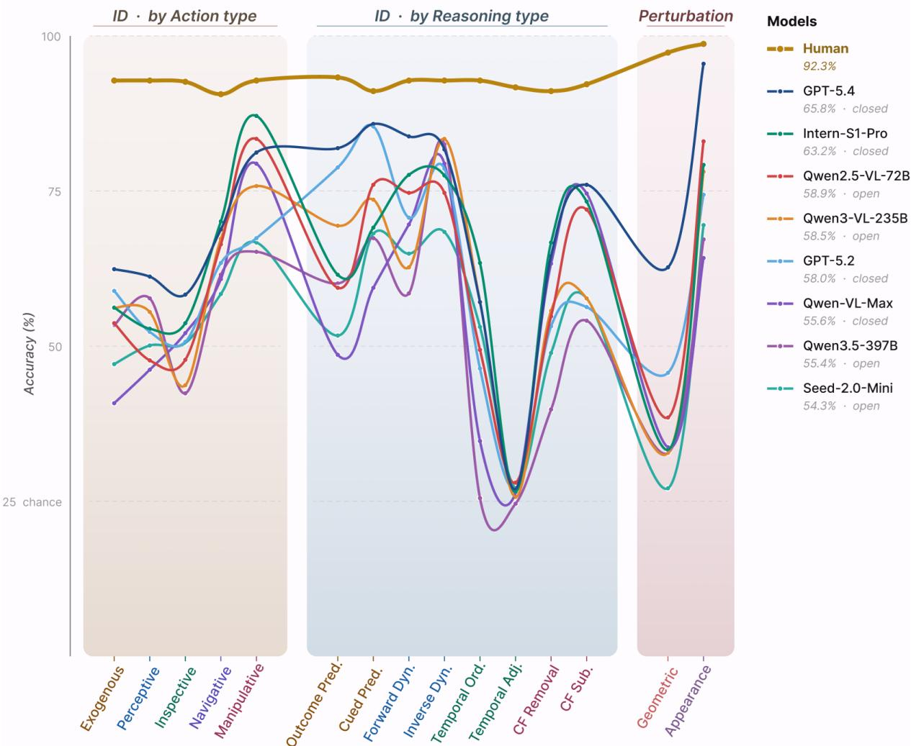  
Figure 15 | Diagnostic profiles of eight frontier MLLMs against the human baseline. Performance is grouped by action type (left), reasoning type (middle), and state-axis perturbation (right). Full 38-model results are reported in Appendix E.

Appearance vs geometric scaling (Qwen2.5-VL dense)  
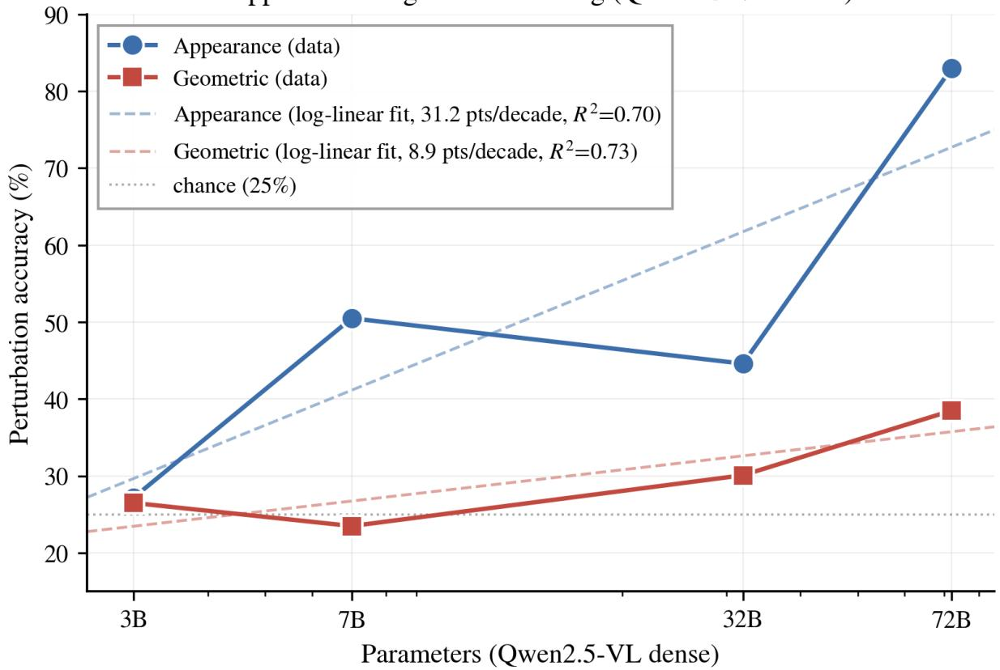  
Figure 16 | Appearance and geometric robustness across the Qwen2.5-VL dense model ladder ({3, 7, 32, 72}B). Appearance robustness scales 3.5× faster than geometric robustness, with fitted slopes of 31.2 and 8.9 percentage points per decade of parameters, respectively.

## F.3. Capability–representation decoupling

ID-overall vs. perturbation Spearman correlations across �=38 models: $\rho _ { \mathrm { a p p } } { = } { + } 0 . 9 0 \ ( R ^ { 2 } { = } 0 . 8 6 )$ $\rho _ { \mathrm { g e o } } { = } { + } 0 . 7 6 \ ( R ^ { 2 } { = } 0 . 5 2 )$ . Roughly 48% of geometric-robustness variance is independent of overall capability. The rank-shift table makes the decoupling visible: ERNIE-4.5-VL-424B-A47B drops from ID rank 11 to geometric rank 30 (Δ=+19); Seed-1.6-Flash rises from ID rank 15 to geometric rank $5 \left( \Delta = - 1 0 \right)$

## F.4. Temporal ordering–adjacency dissociation

The frontier median ordering–adjacency gap is +20.7pp (mean +20.9pp, range +5.5 to +36.9, 11/11 frontier models positive; Table 37). For GPT-5.4, temporal adjacency is 27.0%, within 2pp of chance, consistent with temporal adjacency being the most isolated reasoning type family in WOVEN. Both queries operate within a single action’s frame sequence, so the dissociation indicates that models recover the coarse order of the transition’s intermediate states but not their fine temporal resolution, the two grains of the trajectory representation of §A.2.

## F.5. MoE active-parameter tax

Three matched-total within-family pairs yield dense premia of +12.4, +13.9, +10.9pp respectively (Table 38). Visual world-modeling capability tracks active parameters rather than total. Scaling plots that compare MoE to dense must use the active-parameter axis under penalty of ∼12pp overstatement.

## F.6. Emergence ordering and gravity violation asymmetry

Emergence ordering. Eight exogenous principles cross the 40% ID threshold in a cross-ladder order on Qwen2.5-VL: gravity, inertia at 7B; cohesion, permanence, containment at 32B; support, solidity at 72B; collision never crosses (frontier mean 31.4%). The ordering replicates on Qwen3-VL ladder (8B→ 235B-A22B) and Gemma-3 ladder (4B→ 27B), aligning with the developmental sequence in infant cognition (Baillargeon, 1987; Spelke and Kinzler, 2007).

Gravity violation asymmetry. The violation-of-expectation distractor breakdown on cued prediction for the gravity principle shows directional asymmetry: across 12 above-chance models from 7 architecturally distinct families, �(rise | err)=20.5% vs. �(float | err)=37.0% vs. �(lateral | err)=38.6% (one-sample �=−3.85, �=0.003). The pattern replicates on outcome prediction.

## F.7. Counterfactual cost asymmetry

Define cost(Fwd $\to X ) : = \operatorname { a c c } ( \operatorname { F w } \mathrm { d } ) - \operatorname { a c c } ( X )$ for $X \ \in \ \{ \mathrm { R m v } , \mathrm { S u b } \}$ . Across 24 above-chance models, 23 satisfy cost(Rmv) > cost(Sub) with mean gap +11.0pp (paired Wilcoxon $\scriptstyle { p < 1 0 ^ { - 5 } } )$ Mechanism is scale-dependent: frontier models distribute counterfactual-removal errors away from the actually-occurring action’s outcome (mean $P _ { \mathrm { a c t u a l l e r r } } { = } 2 0 . 4 \% ,$ , all below 1/3 uniform; GPT-5.4 24.0%); mid-scale models revert to it $( \mathrm { Q w e n } 2 . 5 \mathrm { - V L } \mathrm { - } 7 \mathrm { B } 6 3 . 6 \% )$ . Pearson �(ID overall, $P _ { \mathrm { a c t u a l | e r r } } ) { = } { - } 0 . 0 6$ across 38 models. Appendix G.8 provides converse evidence (Appendix G.8).

## F.8. Manipulative pair-mate independence + view-axis dominance

Cell-hardness ladder: h\_ego > hh\_ego > h\_allo > hh\_allo (cohort-mean source-acc 54.2 > $5 2 . 6 > 4 9 . 5 > 4 4 . 6 )$ . View axis (ego vs. allo) shifts ∼ 5pp; combined with subject shift adds another ∼5pp.

Pair-mate independence. Pearson � between cell pairs across 18 scenario-groups, averaged over ∼152 (model × reasoning type) combinations: all six pairwise � in [+0.02, +0.16]. Diagonal cells (h\_ego ↔ hh\_allo) essentially uncorrelated; same-axis (allo ↔ allo) highest. Models do not have a unified scenario representation.

View-axis dominates subject-axis in single-axis failures. Of 14 (model, reasoning type) combinations with ≥ 4/18 scenarios exhibiting single-axis failure, 11 are view-axis (ego/allo) and only 3 are subject-axis (human/humanoid). Within view-axis failures, ego-only-correct dominates.

## F.9. Per-scene invariance within ID

Across 12 above-chance models on 15 ID scenes, per-model scene CV ranges 4.04 to 8.58%, median 5.6%. Per-model max−min scene gap 8 to 16pp. Most uniform: GPT-5.4 (CV 4.04%, gap 8.4pp); least uniform: ERNIE-4.5-VL-424B (CV 8.58%, gap 16.1pp). This sets a measurementvalidity floor for OOD-gap interpretation: beach + restaurant OOD vs. ID gaps larger than ∼5 to 9pp can be attributed to scene novelty.

## F.10. Small-scale no-op prior

Qwen2.5-VL-3B picks the static (“no action”) option on 34.0% of inspective forward-dynamics items, well above the 25% uniform-chance baseline (one-sided binomial, �=102, �=300, �=3.1×10−4). When the smallest model is uncertain about camera motion, it defaults to “nothing happened.” This signature disappears at ≥ 7B and is absent from frontier models.

## F.11. Family fingerprinting via principle vectors

Each model’s 8-dim per-principle accuracy vector serves as a representational fingerprint. Centred cosine similarity (after subtracting each model’s own mean, measures shape rather than capability level) shows within-family similarity is high but not uniform.

Gemma’s 3→4 generation transition produces an orthogonal per-principle reasoning type profile (+0.104), unlike Qwen2.5 → Qwen3 which preserves shape (+0.951). Within-provider scaling does not preserve representational shape.

## G. Training recipes and finding details

## G.1. Shared supervised fine-tuning protocol

Base models and reporting. The main teachability and transfer comparisons use Qwen2.5- VL-3B-Instruct (Bai et al., 2025b). Model-scale experiments use Qwen2.5-VL-7B-Instruct and Qwen2.5-VL-32B-Instruct (Appendix G.15); the matched-backbone video-supervision comparison uses Qwen3.5-4B (Appendix G.16). SFT and subsequent GRPO (Shao et al., 2024) results are reported separately where both stages are evaluated.

Shared SFT optimization. All SFT experiments, including full-mix, single-cell, and temporal supervision, use LoRA with �=16, �=4, dropout 0.05, and target modules $\{ q , k , \nu , o \} _ { \mathrm { p r o j } }$ . Training uses 3 epochs, batch size 32, AdamW with learning rate $1 { \times } 1 0 ^ { - 4 }$ , cosine scheduling, 5% warmup, and fp16 precision.

Option-permutation augmentation. For WOVEN-only training, each item is presented under 4 permutations of its MCQ options, with the answer updated consistently, to reduce dependence on answer position. Fixed-budget substitution experiments use the answer-balanced data construction described in Appendix G.14.

## G.2. Full-mix SFT calibration

Full-mix SFT uses the 22,728-item WOVEN training set and the shared optimization protocol in Appendix G.1. On Qwen2.5-VL-3B-Instruct, it reaches 89.3% on the in-distribution test and 88.2% on held-out scenes (§3.2).

## G.3. Cross-benchmark transfer

Full-mix cross-benchmark transfer under the final locked protocol is reported in the main text (Tables 4 and 5); per-benchmark, per-category breakdowns for all training configurations are in Appendix G.13. Within WM-ABench, the gains concentrate on the transition dimensions (Prediction/Transitivity +21.7, Prediction/Mechanistic +18.6) while the static Visual dimension is flat (±1); see the WM-ABench table in Appendix G.13.

## G.4. Targeted training and diagnostic correspondence

Inverse-text is the strongest narrow world-modeling signal. Narrow SFT on inverse dynamics with text-described action options across the 4 endogenous action types $\scriptstyle ( n = 4 , 1 3 2 ,$ shared SFT protocol; Appendix G.5) yields +54pp own-cell average (inspective +77, perceptive +70, navigative +39, manipulative +32). Holding option modality constant and switching only direction from forward to inverse gives +51pp: the gain comes from the inverse direction rather than the text-options modality.

Cross-action-type forward transfer is asymmetric. Single-action-type forward-dynamics training across the four endogenous action types yields three asymmetries (Appendix G.7): (i) navigative↔manipulative double-strong (+61pp both directions); (ii) perceptive↔inspective weakly symmetric $( + 1 3 / + 1 4 \mathrm { p p } ) ;$ (iii) P/I→N/M strong but N/M→P/I weak (+47 to +57 vs. +1 to +11). One hypothesis is that P/I training teaches both visual grounding and spatial reasoning, while N/M training teaches only grounding.

Imagining absence stays hard even when its neighbors are trained. Within an action type (Appendix G.8), inspective forward dynamics teaches own +65pp, transfers to counterfactual substitution +48 and counterfactual removal +25, but not to temporal templates. Counterfactualsubstitution training transfers to forward dynamics +66 and inverse dynamics +34 but to removal ≈ 0pp. The Sub $\nrightarrow$ Rmv non-transfer triangulates the cohort-level cost asymmetry: “imagining absence” is intrinsic to the reasoning type rather than a coverage shortage.

Temporal reasoning is the most isolated family in WOVEN. Temporal adjacency is teachable in narrow SFT (own +30 to +35pp across 4 action types; Appendix G.9); temporal ordering is not under our setup; the two sister reasoning types show ≈ 0pp transfer in both directions. Combined with the cohort-level dissociation of §3.1, this means temporal skill neither arrives with the other families nor spreads to them: it must be trained directly.

Chirality is direction-asymmetric and capacity-dependent. Balanced rotation training teaches both directions (Appendix G.10, G.11) (+55 to +61pp own); single-direction teaches own-direction but cross-direction Δ ≈ 0 at 3B. At 7B, perceptive cross-direction becomes negative (model specialises harder than at 3B), and inspective single-direction breaks symmetry: or $\mathrm { \partial _ { - } } 1  \mathrm { o r b \_ r i u m p s } + 2 7 \mathrm { p p }$ but reverse stays at −4. Balanced mv\_fwd+mv\_bwd on 7B saturates own directions to 100% while cross-onto-rotation drops −25 to −27pp: move and rotation are treated as separate action classes.

The developmental emergence ordering works as a training curriculum. The exogenous emergence ordering of Appendix F.6 (Appendix G.12) (gravity, inertia → cohesion, permanence, containment → support, solidity) operationalizes as a curriculum: training the same data in emergence order vs. random shuffle gives +4.8pp own-bench at 1 epoch. Developmental ordering can be a useful prior on data scheduling.

Five of the seven evaluation findings of Appendix F replicate train-side. In detail: (i) the appearance/geometric scaling dissociation (Appendix F.2) replicates as +21.9 vs. +12.4pp on the perturbation probe after full-mix SFT, preserving the stronger improvement under appearance perturbations; (ii) temporal isolation appears in both the cohort and the training transfers (Appendix G.9); (iii) the counterfactual-removal cost asymmetry is intrinsic rather than a coverage shortage (F6); (iv) chirality blindness manifests train-side as direction-asymmetric, capacity-dependent transfer (Appendices G.10 and G.11); (v) the exogenous developmental ordering operationalizes as a curriculum prior with +4.8pp gain (Appendix G.12). The two non-replicated findings, the MoE active-parameter dependence (Appendix F.5) and scenario pair-mate independence (F-H), target base-model architecture and item-factor structure, axes outside the post-training intervention surface. The convergence of observation and intervention supports the cohort-side structural claims as representational rather than artifactual.

## G.5. Inverse-text per-cell own results

The matched forward-text run (text options, the same SFT protocol and �=4,132) has own-cell mean 44.3%; switching only direction from forward to inverse yields +51pp, driven by inverse direction.

## G.6. Narrow SFT data-scale margin

A 1×-data run (�=4132) vs. a 2×-data run (�=8264), all other config identical. Own-bench overall: $1 \times 5 0 . 7 \% , 2 \times 5 6 . 4 \% , \Delta \mathrm { { = } + 5 . 7 p p }$ on 2× data. Sample efficiency exhibits diminishing marginal returns under narrow SFT.

## G.7. Cross-action-type forward transfer matrix

## G.8. Within-action-type cross-reasoning-type

## G.9. Temporal ordering and adjacency

One run trains temporal ordering across 4 action types $scriptstyle ( n = 4 , 1 3 2 ) ;$ a second trains temporal adjacency across 4 action types $( n { = } 4 , 1 3 2 )$ . Both use the shared SFT optimization protocol (Appendix G.1). Across 4 action types (averaged): the adjacency run gains +30 to +35pp on Adj (own) and ≈ 0pp on Ord (cross); the ordering run gains ≈ 0pp on Ord (own) and ≈ 0pp on Adj (cross). Conversely, the four temporal subsets leave every other reasoning type within 3.3 points of the base model under SFT (Table 84).

## G.10. Rotation chirality at 7B

G.11. Move chirality at 7B

## G.12. Emergence ordering as curriculum

Train data: 7 exogenous principles (cohesion, solidity, gravity, support, inertia, containment, permanence; collision excluded), 1,820 raw items ×4× within-item permutation = 7,280 items. Both curriculum conditions use the shared SFT optimization protocol (Appendix G.1); Table 49 reports accuracy after the first epoch.

Order: gravity → inertia → cohesion → containment → permanence → support → solidity.

Table 24 | ID overall accuracy (�=6,228, sorted).
<table><tr><td>Model</td><td>Family</td><td>Params</td><td>ID acc</td></tr><tr><td>GPT-5.4</td><td>GPT</td><td>N/A</td><td>65.8%</td></tr><tr><td>Intern-S1-Pro</td><td>Intern</td><td>N/A</td><td>63.2%</td></tr><tr><td>Qwen2.5-VL-72B</td><td>Qwen2.5</td><td>72B</td><td>58.9%</td></tr><tr><td>Qwen3-VL-235B-A22B</td><td>Qwen3</td><td>235B-A22B (MoE)</td><td>58.5%</td></tr><tr><td>GPT-5.2</td><td>GPT</td><td>N/A</td><td>58.0%</td></tr><tr><td>Gemma-4-31B</td><td>Gemma4</td><td>31B</td><td>57.8%</td></tr><tr><td>Qwen-VL-Max</td><td>Qwen-max</td><td>N/A</td><td>55.6%</td></tr><tr><td>Qwen3.5-397B-A17B</td><td>Qwen3.5</td><td>397B-A17B (MoE)</td><td>55.4%</td></tr><tr><td>Qwen3-VL-32B-Instruct</td><td>Qwen3</td><td>32B</td><td>55.2%</td></tr><tr><td>Seed-2.0-Mini</td><td>Seed</td><td>N/A</td><td>54.3%</td></tr><tr><td>ERNIE-4.5-VL-424B-A47B</td><td>ERNIE</td><td>424B-A47B (MoE)</td><td>51.7%</td></tr><tr><td>Pixtral-Large-2411</td><td>Mistral</td><td>123B</td><td>48.4%</td></tr><tr><td>Qwen2.5-VL-32B</td><td>Qwen2.5</td><td>32B</td><td>47.7%</td></tr><tr><td>Gemma-3-27B</td><td>Gemma3</td><td>27B</td><td>47.0%</td></tr><tr><td>Seed-1.6-Flash</td><td>Seed</td><td>N/A</td><td>45.3%</td></tr><tr><td>ERNIE-4.5-VL-28B-A3B</td><td>ERNIE</td><td>28B-A3B (MoE)</td><td>44.9%</td></tr><tr><td>Gemma-4-26B-A4B</td><td>Gemma4</td><td>26B-A4B (MoE)</td><td>43.9%</td></tr><tr><td>Qwen3-VL-30B-A3B</td><td>Qwen3</td><td>30B-A3B (MoE)</td><td>42.8%</td></tr><tr><td>Mistral-Small-3.2</td><td>Mistral</td><td>24B</td><td>42.5%</td></tr><tr><td>Qwen2.5-VL-7B</td><td>Qwen2.5</td><td>7B</td><td>41.6%</td></tr><tr><td>Gemma-3-12B</td><td>Gemma3</td><td>12B</td><td>41.5%</td></tr><tr><td>Mistral-Large-2512</td><td>Mistral</td><td>N/A</td><td>40.4%</td></tr><tr><td>Qwen3.5-27B</td><td>Qwen3.5</td><td>27B</td><td>33.3%</td></tr><tr><td>Qwen3-VL-8B-Instruct</td><td>Qwen3</td><td>8B</td><td>33.1%</td></tr><tr><td>Llama-4-Scout</td><td>Llama4</td><td>Scout (109B-MoE)</td><td>32.6%</td></tr><tr><td>MiniMax-01</td><td>MiniMax</td><td>N/A</td><td>31.9%</td></tr><tr><td>Nemotron-Nano-12B-V2-VL</td><td>Nemotron</td><td>12B</td><td>31.5%</td></tr><tr><td>Qwen3.5-9B</td><td>Qwen3.5</td><td>9B</td><td>30.1%</td></tr><tr><td>Gemma-3-4B</td><td>Gemma3</td><td>4B</td><td>28.9%</td></tr><tr><td>Llama-4-Maverick</td><td>Llama4</td><td>Maverick (400B-MoE)</td><td>28.7%</td></tr><tr><td>Qwen3.5-122B-A10B</td><td>Qwen3.5</td><td>122B-A10B (MoE)</td><td>26.9%</td></tr><tr><td>Qwen2.5-VL-3B</td><td>Qwen2.5</td><td>3B</td><td>26.3%</td></tr><tr><td>InternVL3.5-Latest</td><td>Intern</td><td>N/A</td><td>25.1%</td></tr><tr><td>InternVL3.5-241B-A28B</td><td>Intern</td><td>241B-A28B (MoE)</td><td>25.1%</td></tr><tr><td>Intern-S1-Mini</td><td>Intern</td><td>N/A</td><td>24.4%</td></tr><tr><td>Intern-S1</td><td>Intern</td><td>N/A</td><td>24.2%</td></tr><tr><td>GLM-4.6V</td><td>GLM</td><td>N/A</td><td>22.6%</td></tr><tr><td>Qwen3.5-35B-A3B</td><td>Qwen3.5</td><td>35B-A3B (MoE)</td><td>22.5%</td></tr></table>

Table 25 | ID accuracy by reasoning type (%, all 38 models).
<table><tr><td>Model</td><td>Fwd</td><td>Inv</td><td>Rmv</td><td>Sub</td><td>Otm</td><td>Cue</td><td>Ord</td><td>Adj</td></tr><tr><td>GPT-5.4</td><td>83.8 81.7</td><td></td><td>64.5 76.0</td><td></td><td>81.9</td><td>85.8</td><td>57.1</td><td>27.0</td></tr><tr><td>GPT-5.2</td><td>70.7</td><td>78.6</td><td>53.2 56.3</td><td></td><td>78.8</td><td>85.4</td><td>46.4</td><td>27.1</td></tr><tr><td>Qwen-VL-Max</td><td>69.6</td><td>79.4</td><td>63.3</td><td>74.6</td><td>48.6</td><td>59.4</td><td>34.7</td><td>26.3</td></tr><tr><td>Qwen2.5-VL-3B</td><td>19.7</td><td>42.2</td><td>21.0 17.6</td><td></td><td>22.6</td><td>23.3</td><td>26.9</td><td>25.1</td></tr><tr><td>Qwen2.5-VL-7B</td><td>53.4</td><td>53.8</td><td>37.1 54.8</td><td></td><td>36.5</td><td>43.8</td><td>31.2</td><td>24.3</td></tr><tr><td>Qwen2.5-VL-32B</td><td>49.4</td><td>70.5</td><td>40.3</td><td>46.1</td><td>36.1</td><td>49.0</td><td>49.3</td><td>28.6</td></tr><tr><td>Qwen2.5-VL-72B</td><td>74.7</td><td>74.7</td><td>54.8</td><td>72.0</td><td>59.4</td><td>76.0</td><td>49.4</td><td>28.0</td></tr><tr><td>Qwen3-VL-8B-Instruct</td><td>24.8</td><td>69.4</td><td></td><td>24.9 19.2</td><td>24.0</td><td>25.3</td><td>28.8</td><td>24.8</td></tr><tr><td>Qwen3-VL-30B-A3B</td><td>40.2</td><td>76.2</td><td></td><td>36.7 36.2</td><td>32.3</td><td>41.0</td><td>38.5</td><td>24.6</td></tr><tr><td>Qwen3-VL-32B-Instruct</td><td>71.4</td><td>81.2</td><td></td><td>45.9 71.9</td><td>51.4</td><td>62.8</td><td>37.1</td><td>26.3</td></tr><tr><td>Qwen3-VL-235B-A22B</td><td>62.7</td><td>83.4</td><td></td><td>55.7 57.7</td><td>69.4</td><td>73.6</td><td>57.2</td><td>25.7</td></tr><tr><td>Intern-S1</td><td>24.8</td><td>24.1</td><td></td><td>23.3 25.8</td><td>23.6</td><td>22.2</td><td>23.8</td><td>24.6</td></tr><tr><td>Intern-S1-Mini</td><td>25.7</td><td>23.9</td><td></td><td>23.1 27.6</td><td>22.6</td><td>23.3</td><td>23.0</td><td>24.5</td></tr><tr><td>Intern-S1-Pro</td><td>77.6</td><td>677.5</td><td></td><td>66.7 73.3</td><td>61.5</td><td>69.1</td><td>63.4</td><td>26.5</td></tr><tr><td>InternVL3.5-241B-A28B</td><td>23.5</td><td>26.5</td><td></td><td>25.4 24.9</td><td>25.3</td><td>28.5</td><td>24.7</td><td>25.0</td></tr><tr><td>InternVL3.5-Latest</td><td>26.3</td><td>324.8</td><td></td><td>25.3 24.2</td><td>24.3</td><td>24.7</td><td>25.6</td><td>24.7</td></tr><tr><td>Gemma-3-4B</td><td>24.5</td><td>53.8</td><td></td><td>21.5 18.5</td><td>21.5</td><td>24.0</td><td>25.6</td><td>23.7</td></tr><tr><td>Gemma-3-12B</td><td></td><td>49.5 56.5</td><td></td><td>41.6 46.2</td><td>40.6</td><td>49.7</td><td>29.5</td><td>26.1</td></tr><tr><td>Gemma-3-27B</td><td>62.2</td><td>62.6</td><td></td><td>47.8 62.7</td><td>39.2</td><td>47.9</td><td>30.6</td><td>26.2</td></tr><tr><td>Gemma-4-26B-A4B</td><td>51.1</td><td>59.4</td><td></td><td>39.2 55.6</td><td>49.7</td><td>56.2</td><td>29.2</td><td>26.1</td></tr><tr><td>Gemma-4-31B</td><td>76.3</td><td>76.6</td><td></td><td>63.6 64.5</td><td>64.9</td><td>70.5</td><td>30.8</td><td>25.3</td></tr><tr><td>Llama-4-Scout</td><td>19.8</td><td>67.7</td><td></td><td>18.8 18.1</td><td>18.4 15.3</td><td></td><td>32.6</td><td>31.9</td></tr><tr><td>Llama-4-Maverick</td><td>14.9</td><td>59.2</td><td></td><td>12.5 13.6</td><td>15.6</td><td>17.4</td><td>49.1</td><td>23.9</td></tr><tr><td>Mistral-Small-3.2</td><td>49.8</td><td>353.0</td><td></td><td>39.4 44.8</td><td>38.9</td><td>45.1</td><td>27.1</td><td>24.6</td></tr><tr><td>Mistral-Large-2512</td><td>52.0</td><td>054.7</td><td></td><td>29.2 50.9</td><td>40.3</td><td>54.5</td><td>26.9</td><td>22.7</td></tr><tr><td>Pixtral-Large-2411</td><td></td><td>56.4 59.9</td><td></td><td>45.2 50.5</td><td>35.8</td><td>47.9</td><td>21.8</td><td>27.1</td></tr><tr><td>MiniMax-01</td><td>23.6</td><td>659.8</td><td></td><td>22.6 26.5</td><td>29.5</td><td>24.3</td><td>28.0</td><td>26.0</td></tr><tr><td>Qwen3.5-9B</td><td>16.5</td><td>67.5</td><td></td><td>19.5 15.2</td><td>22.6</td><td>13.5</td><td>29.8</td><td>24.5</td></tr><tr><td>Qwen3.5-27B</td><td>28.2</td><td>67.8</td><td></td><td>25.4 21.7</td><td>25.3</td><td>32.2</td><td>35.6</td><td>24.6</td></tr><tr><td>Qwen3.5-35B-A3B</td><td>12.2</td><td>67.0</td><td></td><td>14.6 12.9</td><td>4.2</td><td>5.9</td><td>26.2</td><td>25.4</td></tr><tr><td>Qwen3.5-122B-A10B</td><td>19.6</td><td>18.6</td><td>26.5</td><td>19.5</td><td>50.0</td><td>56.9</td><td>17.6</td><td>23.9</td></tr><tr><td>Qwen3.5-397B-A17B</td><td>75.0</td><td>67.7</td><td>47.7</td><td>53.4</td><td>53.5</td><td>68.4</td><td>25.5</td><td>24.6</td></tr><tr><td>GLM-4.6V</td><td>10.5</td><td>25.3</td><td></td><td>9.018.0</td><td>39.6</td><td>60.4</td><td>42.2</td><td>26.1</td></tr><tr><td>Seed-1.6-Flash</td><td>50.7</td><td>65.0</td><td></td><td>27.9 60.4</td><td>44.4</td><td>56.2</td><td>25.7</td><td>25.9</td></tr><tr><td>Seed-2.0-Mini</td><td>76.0</td><td>67.4</td><td>50.5</td><td>50.9</td><td></td><td>43.4 53.5</td><td>53.1</td><td>27.2</td></tr><tr><td>Nemotron-Nano-12B-V2-VL</td><td>35.0</td><td>49.0</td><td></td><td>27.637.5</td><td>25.2</td><td>27.2</td><td>27.5</td><td>25.9</td></tr><tr><td>ERNIE-4.5-VL-28B-A3B</td><td>53.7</td><td>67.7</td><td>37.7</td><td>56.3</td><td>41.5</td><td>53.8</td><td>43.9</td><td>23.0</td></tr><tr><td>ERNIE-4.5-VL-424B-A47B</td><td></td><td>64.6 64.4</td><td>33.5</td><td>62.4</td><td>47.9</td><td></td><td>58.4 47.3</td><td>27.9</td></tr></table>

Table 26 | ID accuracy by action type (%, all 38 models).
<table><tr><td>Model</td><td>Exo</td><td>Perc</td><td>Insp</td><td>Navi</td><td>Mani</td></tr><tr><td>GPT-5.4</td><td>62.4</td><td>61.2</td><td>58.3</td><td>68.8</td><td>81.2</td></tr><tr><td>GPT-5.2</td><td>58.9</td><td>52.3</td><td>50.7</td><td>63.4</td><td>67.4</td></tr><tr><td>Qwen-VL-Max</td><td>40.8</td><td>46.2</td><td>52.1</td><td>60.8</td><td>79.4</td></tr><tr><td>Qwen2.5-VL-3B</td><td>24.2</td><td>24.9</td><td>22.8</td><td>32.2</td><td>28.9</td></tr><tr><td>Qwen2.5-VL-7B</td><td>33.5</td><td>32.2</td><td>34.4</td><td>46.4</td><td>64.3</td></tr><tr><td>Qwen2.5-VL-32B</td><td>39.6</td><td>43.2</td><td>39.6</td><td>61.0</td><td>58.3</td></tr><tr><td>Qwen2.5-VL-72B</td><td>53.7</td><td>47.7</td><td>47.8</td><td>66.4</td><td>83.4</td></tr><tr><td>Qwen3-VL-8B-Instruct</td><td>28.1</td><td>29.0</td><td>29.5</td><td>42.3</td><td>38.2</td></tr><tr><td>Qwen3-VL-30B-A3B</td><td>33.0</td><td>42.1</td><td>38.0</td><td>51.2</td><td>51.4</td></tr><tr><td>Qwen3-VL-32B-Instruct</td><td>43.7</td><td>52.3</td><td>47.8</td><td>61.9</td><td>73.2</td></tr><tr><td>Qwen3-VL-235B-A22B</td><td>56.2</td><td>55.5</td><td>43.7</td><td>67.3</td><td>75.8</td></tr><tr><td>Intern-S1</td><td>24.5</td><td>22.9</td><td>26.2</td><td>23.9</td><td>22.9</td></tr><tr><td>Intern-S1-Mini</td><td>25.2</td><td>23.5</td><td>24.9</td><td>23.0</td><td>24.9</td></tr><tr><td>Intern-S1-Pro</td><td>56.2</td><td>52.8</td><td>53.7</td><td>70.1</td><td>87.1</td></tr><tr><td>InternVL3.5-241B-A28B</td><td>26.6</td><td>24.6</td><td>26.7</td><td>22.7</td><td>24.3</td></tr><tr><td>InternVL3.5-Latest</td><td>25.5</td><td>25.3</td><td>25.8</td><td>24.0</td><td>24.8</td></tr><tr><td>Gemma-3-4B</td><td>22.7</td><td>26.9</td><td>27.3</td><td>39.1</td><td>29.3</td></tr><tr><td>Gemma-3-12B</td><td>37.3</td><td>28.0</td><td>39.8</td><td>46.4</td><td>56.4</td></tr><tr><td>Gemma-3-27B</td><td>36.6</td><td>31.1</td><td>44.6</td><td>54.0</td><td>69.6</td></tr><tr><td>Gemma-4-26B-A4B</td><td>40.5</td><td>32.1</td><td>42.9</td><td>47.9</td><td>56.0</td></tr><tr><td>Gemma-4-31B</td><td>50.8</td><td>49.4</td><td>53.1</td><td>61.2</td><td>74.3</td></tr><tr><td>Llama-4-Scout</td><td>23.6</td><td>34.0</td><td>32.2</td><td>42.4</td><td>30.5</td></tr><tr><td>Llama-4-Maverick</td><td>20.9</td><td>27.7</td><td>26.8</td><td>42.5</td><td>26.3</td></tr><tr><td>Mistral-Small-3.2</td><td>34.1</td><td>27.5</td><td>44.4</td><td>64.6</td><td>44.1</td></tr><tr><td>Mistral-Large-2512</td><td>36.5</td><td>31.8</td><td>40.8</td><td>51.2</td><td>41.3</td></tr><tr><td>Pixtral-Large-2411</td><td>33.6</td><td>35.5</td><td>55.6</td><td>80.6</td><td>48.6</td></tr><tr><td>MiniMax-01</td><td>27.7</td><td>27.5</td><td>29.8</td><td>37.6</td><td>37.9</td></tr><tr><td>Qwen3.5-9B</td><td>22.5</td><td>28.3</td><td>27.0</td><td>40.1</td><td>33.9</td></tr><tr><td>Qwen3.5-27B</td><td>30.3</td><td>29.5</td><td>21.5</td><td>44.2</td><td>43.1</td></tr><tr><td>Qwen3.5-35B-A3B</td><td>10.3</td><td>29.3</td><td>15.3</td><td>27.6</td><td>30.0</td></tr><tr><td>Qwen3.5-122B-A10B</td><td>41.5</td><td>31.4</td><td>22.7</td><td>23.3</td><td>21.6</td></tr><tr><td>Qwen3.5-397B-A17B</td><td>53.4</td><td>57.7</td><td>42.4</td><td>61.5</td><td>65.2</td></tr><tr><td>GLM-4.6V</td><td>32.2</td><td>16.0</td><td>20.3</td><td>30.2</td><td>17.2</td></tr><tr><td>Seed-1.6-Flash</td><td>35.5</td><td>31.2</td><td>42.4</td><td>49.5</td><td>68.8</td></tr><tr><td>Seed-2.0-Mini</td><td>47.1</td><td>50.1</td><td>50.5</td><td>58.4</td><td>66.7</td></tr><tr><td>Nemotron-Nano-12B-V2-VL</td><td>26.0</td><td>24.4</td><td>31.9</td><td>34.6</td><td>40.7</td></tr><tr><td>ERNIE-4.5-VL-28B-A3B</td><td>36.6</td><td>34.2</td><td>40.8</td><td>51.4</td><td>63.0</td></tr><tr><td>ERNIE-4.5-VL-424B-A47B</td><td>40.1</td><td>40.5</td><td>48.7</td><td>66.6</td><td>63.4</td></tr></table>

Table 27 | Exogenous sub-principle accuracy (%, ID; capable models shown, full 38 in repo).
<table><tr><td>Model</td><td>permanence</td><td>cohesion solidity</td><td></td><td>gravity</td><td>support</td><td>inertia</td><td>collision</td><td>containment</td></tr><tr><td>GPT-5.4</td><td>56.2</td><td>61.8</td><td>69.4</td><td>75.0</td><td>62.5</td><td>60.4</td><td>43.8</td><td>70.1</td></tr><tr><td>GPT-5.2</td><td>57.6</td><td>60.4</td><td>62.5</td><td>75.0</td><td>50.7</td><td>55.6</td><td>43.8</td><td>66.0</td></tr><tr><td>Qwen-VL-Max</td><td>29.9</td><td>44.4</td><td>38.9</td><td>56.9</td><td>41.7</td><td>47.2</td><td>18.8</td><td>48.6</td></tr><tr><td>Qwen2.5-VL-7B</td><td>37.5</td><td>37.5</td><td>28.5</td><td>47.2</td><td>34.0</td><td>41.0</td><td>21.5</td><td>20.8</td></tr><tr><td>Qwen2.5-VL-32B</td><td>41.0</td><td>42.3</td><td>36.4</td><td>44.2</td><td>37.6</td><td>41.6</td><td>32.4</td><td>41.8</td></tr><tr><td>Qwen2.5-VL-72B</td><td>54.2</td><td>51.4</td><td>45.8</td><td>76.4</td><td>58.3</td><td>59.0</td><td>32.6</td><td>52.1</td></tr><tr><td>Qwen3-VL-32B-Instruct</td><td>34.7</td><td>51.4</td><td>41.7</td><td>56.9</td><td>43.8</td><td>44.4</td><td>27.1</td><td>49.3</td></tr><tr><td>Qwen3-VL-235B-A22B</td><td>52.8</td><td>61.1</td><td>49.3</td><td>73.6</td><td>61.8</td><td>61.1</td><td>33.3</td><td>56.2</td></tr><tr><td>Intern-S1-Pro</td><td>45.8</td><td>41.7</td><td>61.8</td><td>77.8</td><td>68.8</td><td>61.1</td><td>36.8</td><td>56.2</td></tr><tr><td>Gemma-3-12B</td><td>37.5</td><td>44.4</td><td>35.4</td><td>61.8</td><td>38.2</td><td>33.3</td><td>25.7</td><td>22.2</td></tr><tr><td>Gemma-3-27B</td><td>34.7</td><td>38.9</td><td>31.9</td><td>61.8</td><td>34.0</td><td>47.2</td><td>27.8</td><td>16.7</td></tr><tr><td>Gemma-4-26B-A4B</td><td>34.0</td><td>47.1</td><td>46.5</td><td>56.4</td><td>42.6</td><td>44.2</td><td>22.9</td><td>30.4</td></tr><tr><td>Gemma-4-31B</td><td>55.5</td><td>54.2</td><td>48.5</td><td>49.6</td><td>58.6</td><td>58.1</td><td>23.7</td><td>58.9</td></tr><tr><td>Pixtral-Large-2411</td><td>39.3</td><td>31.2</td><td>31.2</td><td>50.7</td><td>26.3</td><td>26.8</td><td>25.4</td><td>37.3</td></tr><tr><td>Qwen3.5-397B-A17B</td><td>51.0</td><td>58.6</td><td>46.5</td><td>60.0</td><td>54.1</td><td>62.5</td><td>30.8</td><td>66.3</td></tr><tr><td>Seed-2.0-Mini</td><td>51.5</td><td>50.7</td><td>42.0</td><td>66.2</td><td>46.1</td><td>62.9</td><td>29.9</td><td>28.2</td></tr><tr><td>ERNIE-4.5-VL-424B-A47B</td><td>41.1</td><td>37.0</td><td>37.7</td><td>60.4</td><td>37.0</td><td>36.8</td><td>25.2</td><td>45.3</td></tr></table>

Table 28 | T07b Manipulative subject × view accuracy (%, ID; capable models).
<table><tr><td>Model</td><td>h/ego</td><td>h/allo</td><td>hh/ego</td><td>hh/allo</td></tr><tr><td>GPT-5.4</td><td>87.2</td><td>80.9</td><td>82.6</td><td>74.3</td></tr><tr><td>GPT-5.2</td><td>69.8</td><td>67.7</td><td>64.9</td><td>67.4</td></tr><tr><td>Qwen-VL-Max</td><td>85.1</td><td>79.2</td><td>81.2</td><td>72.2</td></tr><tr><td>Qwen2.5-VL-7B</td><td>68.8</td><td>65.6</td><td>66.7</td><td>56.2</td></tr><tr><td>Qwen2.5-VL-32B</td><td>66.7</td><td>59.0</td><td>60.8</td><td>46.9</td></tr><tr><td>Qwen2.5-VL-72B</td><td>91.3</td><td>84.4</td><td>85.8</td><td>72.2</td></tr><tr><td>Qwen3-VL-32B-Instruct</td><td>83.0</td><td>70.5</td><td>75.0</td><td>64.2</td></tr><tr><td>Qwen3-VL-235B-A22B</td><td>83.0</td><td>77.1</td><td>79.2</td><td>63.9</td></tr><tr><td>Intern-S1-Pro</td><td>89.6</td><td>87.5</td><td>89.6</td><td>81.6</td></tr><tr><td>Gemma-3-27B</td><td>76.7</td><td>67.4</td><td>75.0</td><td>59.4</td></tr><tr><td>Gemma-4-31B</td><td>78.1</td><td>74.7</td><td>77.8</td><td>66.7</td></tr><tr><td>Pixtral-Large-2411</td><td>60.8</td><td>40.6</td><td>56.6</td><td>36.5</td></tr><tr><td>Qwen3.5-397B-A17B</td><td>68.1</td><td>61.8</td><td>65.6</td><td>65.3</td></tr><tr><td>Seed-2.0-Mini</td><td>70.1</td><td>66.7</td><td>70.1</td><td>59.7</td></tr><tr><td>ERNIE-4.5-VL-424B-A47B</td><td>75.7</td><td>63.5</td><td>69.8</td><td>44.4</td></tr></table>

Table 29 | Perturbation accuracy (overall / geo / app, �=1,116, all 38).
<table><tr><td>Model</td><td>overall</td><td>geo</td><td>app</td></tr><tr><td>GPT-5.4</td><td>79.1</td><td>62.7</td><td>95.5</td></tr><tr><td>GPT-5.2</td><td>60.0</td><td>45.7</td><td>74.4</td></tr><tr><td>Qwen-VL-Max</td><td>48.9</td><td>33.7</td><td>64.2</td></tr><tr><td>Qwen2.5-VL-3B</td><td>21.1</td><td>22.6</td><td>19.7</td></tr><tr><td>Qwen2.5-VL-7B</td><td>37.0</td><td>23.5</td><td>50.5</td></tr><tr><td>Qwen2.5-VL-32B</td><td>37.4</td><td>30.1</td><td>44.6</td></tr><tr><td>Qwen2.5-VL-72B</td><td>60.8</td><td>38.5</td><td>83.0</td></tr><tr><td>Qwen3-VL-8B-Instruct</td><td>23.0</td><td>25.1</td><td>21.0</td></tr><tr><td>Qwen3-VL-30B-A3B</td><td>34.1</td><td>25.6</td><td>42.5</td></tr><tr><td>Qwen3-VL-32B-Instruct</td><td>50.4</td><td>32.4</td><td>68.5</td></tr><tr><td>Qwen3-VL-235B-A22B</td><td>55.5</td><td>32.8</td><td>78.1</td></tr><tr><td>Intern-S1</td><td>26.7</td><td>26.5</td><td>27.0</td></tr><tr><td>Intern-S1-Mini</td><td>26.4</td><td>26.4</td><td>26.4</td></tr><tr><td>Intern-S1-Pro</td><td>56.3</td><td>33.3</td><td>79.2</td></tr><tr><td>InternVL3.5-241B-A28B</td><td>26.7</td><td>26.3</td><td>27.1</td></tr><tr><td>InternVL3.5-Latest</td><td>26.8</td><td>26.0</td><td>27.6</td></tr><tr><td>Gemma-3-4B</td><td>24.4</td><td>24.6</td><td>24.2</td></tr><tr><td>Gemma-3-12B</td><td>40.3</td><td>32.6</td><td>48.0</td></tr><tr><td>Gemma-3-27B</td><td>49.5</td><td>36.4</td><td>62.5</td></tr><tr><td>Gemma-4-26B-A4B</td><td>34.1</td><td>25.4</td><td>42.8</td></tr><tr><td>Gemma-4-31B</td><td>77.2</td><td>59.0</td><td>95.5</td></tr><tr><td>Llama-4-Scout</td><td>15.2</td><td>17.0</td><td>13.4</td></tr><tr><td>Llama-4-Maverick</td><td>11.3</td><td>9.9</td><td>12.7</td></tr><tr><td>Mistral-Small-3.2</td><td>34.3</td><td>27.3</td><td>41.3</td></tr><tr><td>Mistral-Large-2512</td><td>31.7</td><td>27.1</td><td>36.4</td></tr><tr><td>Pixtral-Large-2411</td><td>50.1</td><td>35.1</td><td>65.1</td></tr><tr><td>MiniMax-01</td><td>25.0</td><td>26.3</td><td>23.7</td></tr><tr><td>Qwen3.5-9B</td><td>20.6</td><td>20.8</td><td>20.4</td></tr><tr><td>Qwen3.5-27B</td><td>36.8</td><td>31.2</td><td>42.5</td></tr><tr><td>Qwen3.5-35B-A3B</td><td>12.6</td><td>10.6</td><td>14.7</td></tr><tr><td>Qwen3.5-122B-A10B</td><td>25.8</td><td>24.4</td><td>27.2</td></tr><tr><td>Qwen3.5-397B-A17B</td><td>50.0</td><td>32.8</td><td>67.2</td></tr><tr><td>GLM-4.6V</td><td>7.2</td><td>5.4</td><td>9.0</td></tr><tr><td>Seed-1.6-Flash</td><td>54.9</td><td>38.4</td><td>71.5</td></tr><tr><td>Seed-2.0-Mini</td><td>48.3</td><td>27.1</td><td>69.5</td></tr><tr><td>Nemotron-Nano-12B-V2-VL</td><td>25.5</td><td>27.1</td><td>24.0</td></tr><tr><td>ERNIE-4.5-VL-28B-A3B</td><td>42.5</td><td>32.5</td><td>52.5</td></tr><tr><td>ERNIE-4.5-VL-424B-A47B</td><td>35.3</td><td>25.1</td><td>45.5</td></tr></table>

Table 30 | Manipulative−inspective accuracy gap (frontier).
<table><tr><td>Model</td><td>manipulative</td><td>inspective</td><td>gap</td></tr><tr><td>GPT-5.4</td><td>81.2</td><td>58.3</td><td>+23.0</td></tr><tr><td>GPT-5.2</td><td>67.4</td><td>50.7</td><td>+16.7</td></tr><tr><td>Qwen-VL-Max</td><td>79.4</td><td>52.1</td><td>+27.3</td></tr><tr><td>Qwen2.5-VL-7B</td><td>64.3</td><td>34.4</td><td>+29.9</td></tr><tr><td>Qwen2.5-VL-32B</td><td>58.3</td><td>39.6</td><td>+18.8</td></tr><tr><td>Qwen2.5-VL-72B</td><td>83.4</td><td>47.8</td><td>+35.6</td></tr><tr><td>Qwen3-VL-32B</td><td>73.2</td><td>47.8</td><td>+25.4</td></tr><tr><td>Qwen3-VL-235B-A22B</td><td>75.8</td><td>43.7</td><td>+32.1</td></tr><tr><td>Intern-S1-Pro</td><td>87.1</td><td>53.7</td><td>+33.4</td></tr><tr><td>Gemma-4-31B</td><td>74.3</td><td>53.1</td><td>+21.2</td></tr><tr><td>Seed-2.0-Mini</td><td>66.7</td><td>50.5</td><td>+16.2</td></tr></table>

Table 31 | Perceptive translation vs. rotation (frontier).
<table><tr><td>Model translation</td><td>rotation</td><td>gap</td></tr><tr><td>GPT-5.4</td><td>92.4</td><td>74.0 +18.4</td></tr><tr><td>GPT-5.2</td><td>88.2</td><td>56.6 +31.6</td></tr><tr><td>Qwen-VL-Max</td><td>82.6 42.7</td><td>+39.9</td></tr><tr><td>Qwen2.5-VL-7B</td><td>56.6</td><td>17.0 +39.6</td></tr><tr><td>Qwen2.5-VL-32B</td><td>58.0</td><td>41.3 +16.7</td></tr><tr><td>Qwen2.5-VL-72B</td><td>77.1</td><td>42.7 +34.4</td></tr><tr><td>Qwen3-VL-32B</td><td>86.1</td><td>61.5 +24.7</td></tr><tr><td>Qwen3-VL-235B-A22B</td><td>88.2</td><td>60.1 +28.1</td></tr><tr><td>Intern-S1-Pro</td><td>76.7</td><td>57.6 +19.1</td></tr><tr><td>Gemma-4-31B</td><td>91.0</td><td>47.9 +43.1</td></tr><tr><td>Pixtral-Large-2411</td><td>67.4</td><td>12.2 +55.2</td></tr><tr><td>Seed-2.0-Mini</td><td>79.9 34.4</td><td>+45.5</td></tr></table>

Table 32 | Qwen2.5-VL dense scaling (%).
<table><tr><td>Model</td><td>Params</td><td>ID overall</td><td>geo</td><td>app</td></tr><tr><td>Qwen2.5-VL-3B</td><td>3B</td><td>26.4</td><td>21.1 22.6</td><td>19.7</td></tr><tr><td>Qwen2.5-VL-7B</td><td>7B</td><td>41.6</td><td>37.0 23.5</td><td>50.5</td></tr><tr><td>Qwen2.5-VL-32B</td><td>32B</td><td>47.7</td><td>37.4 30.1</td><td>44.6</td></tr><tr><td>Qwen2.5-VL-72B</td><td>72B</td><td>58.9</td><td>60.8 38.5</td><td>83.0</td></tr></table>

Table 33 | Qwen3-VL family.
<table><tr><td>Model</td><td>Params</td><td>ID</td><td>overall</td><td>geo</td><td>app</td></tr><tr><td>Qwen3-VL-8B-Instruct</td><td>8B</td><td>33.1</td><td>23.0</td><td>25.1</td><td>21.0</td></tr><tr><td>Qwen3-VL-30B-A3B</td><td>30B-A3B (MoE)</td><td>42.8</td><td>34.1</td><td>25.6</td><td>42.5</td></tr><tr><td>Qwen3-VL-32B-Instruct</td><td>32B</td><td>55.2</td><td>50.4</td><td>32.4</td><td>68.5</td></tr><tr><td>Qwen3-VL-235B-A22B</td><td>235B-A22B (MoE)</td><td>58.5</td><td>55.5</td><td>32.8</td><td>78.1</td></tr></table>

Table 34 | Gemma-3/Gemma-4.
<table><tr><td>Model</td><td>Params</td><td>ID</td><td>overall</td><td>geo</td><td>app</td></tr><tr><td>Gemma-3-4B</td><td>4B</td><td>28.9</td><td>24.4</td><td>24.6</td><td>24.2</td></tr><tr><td>Gemma-3-12B</td><td>12B</td><td>41.5</td><td>40.3</td><td>32.6</td><td>48.0</td></tr><tr><td>Gemma-3-27B</td><td>27B</td><td>47.0</td><td>49.5</td><td>36.4</td><td>62.5</td></tr><tr><td>Gemma-4-26B-A4B 26B-A4B (MoE)</td><td></td><td>43.9</td><td>34.1</td><td>25.4</td><td>42.8</td></tr><tr><td>Gemma-4-31B</td><td>31B</td><td>57.8</td><td>77.2</td><td>59.0</td><td>95.5</td></tr></table>

Table 35 | Qwen3.5 family (reasoning disabled).
<table><tr><td>Model</td><td>Params</td><td>ID</td><td>overall</td><td>geo</td><td>app</td></tr><tr><td>Qwen3.5-9B</td><td>9B</td><td>30.1</td><td>20.6</td><td>20.8</td><td>20.4</td></tr><tr><td>Qwen3.5-27B</td><td>27B</td><td>33.3</td><td>36.8</td><td>31.2</td><td>42.5</td></tr><tr><td>Qwen3.5-35B-A3B</td><td>35B-A3B (MoE)</td><td>22.5</td><td>12.6</td><td>10.6</td><td>14.7</td></tr><tr><td>Qwen3.5-122B-A10B</td><td>122B-A10B (MoE)</td><td>26.9</td><td>25.8</td><td>24.4</td><td>27.2</td></tr><tr><td>Qwen3.5-397B-A17B</td><td>397B-A17B (MoE)</td><td>55.4</td><td>50.0</td><td>32.8</td><td>67.2</td></tr></table>

Table 36 | ID vs. perturbation-geometric rank shift (subset; positive Δ = relatively worse on geometric).
<table><tr><td>Model</td><td>ID acc</td><td>ID rank</td><td>Geo acc</td><td>Geo rank</td><td>Δ</td></tr><tr><td>ERNIE-4.5-VL-424B-A47B</td><td>51.7</td><td>11</td><td>25.1</td><td>30</td><td>+19</td></tr><tr><td>Qwen2.5-VL-7B</td><td>41.6</td><td>20</td><td>23.5</td><td>33</td><td>+13</td></tr><tr><td>Gemma-4-26B-A4B</td><td>43.9</td><td>17</td><td>25.4</td><td>28</td><td>+11</td></tr><tr><td>Llama-4-Scout</td><td>32.6</td><td>25</td><td>17.0</td><td>35</td><td>+10</td></tr><tr><td>Qwen3-VL-30B-A3B</td><td>42.8</td><td>18</td><td>25.6</td><td>27</td><td>+9</td></tr><tr><td>Seed-2.0-Mini</td><td>54.3</td><td>10</td><td>27.1</td><td>19</td><td>+9</td></tr><tr><td>Intern-S1-Pro</td><td>63.2</td><td>2</td><td>33.3</td><td>9</td><td>+7</td></tr><tr><td>GPT-5.4</td><td>65.8</td><td>1</td><td>62.7</td><td>1</td><td>0</td></tr><tr><td>GPT-5.2</td><td>58.0</td><td>5</td><td>45.7</td><td>3</td><td>-2</td></tr><tr><td>Gemma-4-31B</td><td>57.8</td><td>6</td><td>59.0</td><td>2</td><td>-4</td></tr><tr><td>Seed-1.6-Flash</td><td>45.3</td><td>15</td><td>38.4</td><td>5</td><td>-10</td></tr><tr><td>Intern-S1</td><td>24.2</td><td>36</td><td>26.5</td><td>22</td><td>-14</td></tr></table>

Table 37 | Temporal ordering–adjacency gap (frontier).
<table><tr><td>Model</td><td>Ord Adj</td><td>Gap</td></tr><tr><td>GPT-5.4</td><td>57.1 27.0</td><td>+30.1</td></tr><tr><td>GPT-5.2</td><td>46.4 27.1</td><td>+19.3</td></tr><tr><td>Qwen-VL-Max</td><td>34.7 26.3</td><td>+8.4</td></tr><tr><td>Qwen2.5-VL-32B</td><td>49.3 28.6</td><td>+20.7</td></tr><tr><td>Qwen2.5-VL-72B</td><td>49.4 28.0</td><td>+21.4</td></tr><tr><td>Qwen3-VL-32B</td><td>37.1 26.3</td><td>+10.8</td></tr><tr><td>Qwen3-VL-235B-A22B</td><td>57.2 25.7</td><td>+31.5</td></tr><tr><td>Intern-S1-Pro</td><td>63.4 26.5</td><td>+36.9</td></tr><tr><td>Gemma-4-31B</td><td>30.8 25.3</td><td>+5.5</td></tr><tr><td>Seed-2.0-Mini</td><td>53.1 27.2</td><td>+25.9</td></tr><tr><td>ERNIE-4.5-VL-424B-A47B</td><td>47.3 27.9</td><td>+19.4</td></tr></table>

Table 38 | Dense vs. MoE comparisons (matched total).
<table><tr><td>Comparison</td><td>Dense acc</td><td>MoE acc</td><td>gap</td></tr><tr><td>Qwen3-VL-32B vs. 30B-A3B</td><td>55.2</td><td>42.8</td><td>+12.4</td></tr><tr><td>Gemma-4-31B vs. 26B-A4B</td><td>57.8</td><td>43.9</td><td>+13.9</td></tr><tr><td>Qwen3.5-27B vs. 35B-A3B</td><td>33.3</td><td>22.5</td><td>5+10.9</td></tr></table>

Table 39 | F-Fingerprint: centered cosine similarity on 8-dim per-principle accuracy vectors.
<table><tr><td>Pair</td><td>centered cos</td></tr><tr><td>Qwen2.5-VL-72B ↔ Qwen3-VL-235B-A22B</td><td>+0.951</td></tr><tr><td>GPT-5.4 ↔ GPT-5.2</td><td>+0.895</td></tr><tr><td>Qwen3-VL-235B ↔ Qwen3-VL-32B</td><td>+0.895</td></tr><tr><td>ERNIE-424B ↔ GPT-5.4</td><td>+0.825</td></tr><tr><td>Qwen3-VL-235B ↔ GPT-5.4</td><td>+0.761</td></tr><tr><td>Qwen2.5-VL-72B ↔ GPT-5.4</td><td>+0.712</td></tr><tr><td>Seed-2.0-Mini ↔ GPT-5.4</td><td>+0.341</td></tr><tr><td>Gemma-4-31B ↔ Gemma-3-27B (same provider, gen step)</td><td>+0.104</td></tr></table>

Table 40 | SFT accuracy on WOVEN’s own test sets (ID, scene-OOD, state-axis perturbation probe) (%). Full-mix SFT is on Qwen2.5-VL-3B; inverse-text is narrow SFT on inverse dynamics with text options (4 endogenous action types); mv-balanced is balanced mv\_fwd+mv\_bwd training on Qwen2.5-VL-7B. Downstream transfer is in Tables 4 and 5. Per-cell own deltas, the remaining narrow-run families, and full recipe details in the appendix.
<table><tr><td></td><td></td><td></td><td colspan="3">Perturbation probe</td></tr><tr><td>Variant</td><td>ID</td><td>OOD</td><td>all</td><td>geo</td><td>app</td></tr><tr><td>Qwen2.5-VL-3B (base)</td><td>26.4</td><td></td><td>21.1</td><td>22.6</td><td>19.7</td></tr><tr><td>+full-mix SFT</td><td>89.3 (↑62.9)</td><td></td><td>88.2 38.3 (↑17.1)</td><td>35.0 (↑12.4)</td><td>41.6 (↑21.9)</td></tr><tr><td>+inverse-text SFT</td><td>95.5† (↑54)</td><td>1</td><td></td><td></td><td></td></tr><tr><td>Qwen2.5-VL-7B (base)</td><td>41.6</td><td></td><td>37.0</td><td>23.5</td><td>50.5</td></tr><tr><td>+mv-balanced SFT</td><td>50.1 (↑8.5)</td><td></td><td>57.5 52.4 (↑15.4) 38.4 (↑14.9) 66.5 (↑16.0)</td><td></td><td></td></tr></table>

† inverse-text own-cell mean over 4 endogenous action types: base 41%, post-SFT 95.5% (↑54).

Table 41 | Inverse-text SFT per-cell own (Δ vs. base 3B). Columns are inverse-dynamics cells by action type; the last column is the mean over the four own cells.
<table><tr><td></td><td>inspective</td><td>perceptive</td><td>navigative</td><td>manipulative</td><td>mean</td></tr><tr><td>base 3B</td><td>16</td><td>27</td><td>59</td><td>62</td><td>41</td></tr><tr><td>inverse-text SFT</td><td>93</td><td>97</td><td>98</td><td>94</td><td>95.5</td></tr><tr><td>Δ</td><td>+77</td><td>+70</td><td>+39</td><td>+32</td><td>+54</td></tr></table>

Table 42 | Cross-action-type forward transfer (4×4). �≈1,020 each, shared SFT protocol.
<table><tr><td>Source ↓ / Target →</td><td>Perc Fwd</td><td>Insp Fwd</td><td>Navi Fwd</td><td>Mani Fwd</td></tr><tr><td>Base 3B (acc, %)</td><td>28.1</td><td>28.1</td><td>30.9</td><td>21.9</td></tr><tr><td>perceptive (n=1036) ∆</td><td>+68.8 own</td><td>+13.8</td><td>+55.6</td><td>+50.0</td></tr><tr><td>inspective (n=1020) ∆</td><td>+12.9</td><td>+64.9 own</td><td>+57.3</td><td>+46.9</td></tr><tr><td>navigative (n=1020) ∆</td><td>+11.1</td><td>+10.0</td><td>+67.0 own</td><td>+61.4</td></tr><tr><td>manipulative (n=1020) ∆</td><td>+7.0</td><td>+1.5</td><td>+61.5</td><td>+74.6 own</td></tr></table>

Table 43 | (a) Within-action-type cross-comp transfer (inspective forward run).
<table><tr><td></td><td>Fwd Sub</td><td>Rmv</td><td>Inv</td><td>Adj</td><td>Ord</td></tr><tr><td>Base 3B (acc, %)</td><td>28.1 26.7</td><td>25.6</td><td>15.2</td><td>26.1</td><td>27.0</td></tr><tr><td>SFT Δ</td><td>+65 own +48</td><td>+25</td><td>+19</td><td>0</td><td>-1</td></tr></table>

Table 44 | (b) Sub within-action-type cross-comp, per-action-type split.
<table><tr><td></td><td>Fwd</td><td>Sub</td><td>Rmv</td><td>Inv</td></tr><tr><td>Base 3B Insp (acc, %)</td><td>28.1</td><td>26.7</td><td>25.6</td><td>15.2</td></tr><tr><td>Sub ∆ Insp</td><td>+60</td><td>+66 own</td><td>-1</td><td>+48</td></tr><tr><td>Base 3B Mani (acc, %)</td><td>21.9</td><td>20.8</td><td>24.0</td><td>62.5</td></tr><tr><td>Sub ∆Mani</td><td></td><td>+71 +74 own</td><td></td><td>0+20</td></tr></table>

Table 45 | Balanced rotation: 3B vs. 7B (arc\_up interference reverses). Columns are inspective × forward cells by camera move.
<table><tr><td></td><td>orb_1 (own) orb_r (own) arc_up (orth)</td><td></td></tr><tr><td>base 3B (%)</td><td>30.0</td><td>20.0 31.1</td></tr><tr><td>3BΔ</td><td>+40.0</td><td>+45.6 -24.4</td></tr><tr><td>7BΔ</td><td>+50.0</td><td>+75.6 +43.3</td></tr></table>

Table 46 | Perceptive single-direction runs: 3B vs. 7B. Columns are perceptive cells by camera move.
<table><tr><td></td><td>rot_1</td><td>rot_r</td></tr><tr><td>base 3B (%)</td><td>27.8</td><td>33.3</td></tr><tr><td>rot_1 only (7B) ∆ +65.3 own -15.2 cross</td><td></td><td></td></tr><tr><td>rot_r only (7B) ∆ -13.9 cross</td><td></td><td>+63.9 own</td></tr></table>

Table 47 | Inspective single-direction runs: 3B vs. 7B, asymmetric chirality sharing. Columns are inspective cells by camera move.
<table><tr><td></td><td>orb_1</td><td>orb_r</td><td>arc_up</td></tr><tr><td>base 3B (%)</td><td>30.0</td><td>20.0</td><td>31.1</td></tr><tr><td>orb_1 only (7B) ∆ +58.9 own +26.7 cross +36.7 cross</td><td></td><td></td><td></td></tr><tr><td>orb_r only (7B) ∆ </td><td>-4.4 cross</td><td>+72.2 own +37.8 cross</td><td></td></tr></table>

Table 48 | mv-balanced (7B) move chirality (perceptive forward). Columns are perceptive cells by camera move.
<table><tr><td></td><td>mv_fwd (own)</td><td>mv_bwd (own)</td><td>rot_1 (cross)</td><td>rot_r (cross)</td></tr><tr><td>base 3B (%)</td><td>20.8</td><td>19.4</td><td>27.8</td><td>33.3</td></tr><tr><td>mv-balanced 7B (%)</td><td>100.0</td><td>100.0</td><td>2.8</td><td>5.6</td></tr><tr><td>Δ</td><td>+79.2</td><td>+80.6</td><td>-25.0</td><td>-27.7</td></tr></table>

Table 49 | Curriculum vs. shuffled at 1 epoch (own\_exo subset).
<table><tr><td>Variant</td><td>own_exo subset acc</td></tr><tr><td> $V _ { 1 } ( { \mathrm { s h u f f l e d } } )$ </td><td>33.2%</td></tr><tr><td> $V _ { 2 }$  (emergence-ordered)</td><td>38.0%</td></tr><tr><td> $\Delta \left( V _ { 2 } - V _ { 1 } \right)$ </td><td>+4.8pp</td></tr></table>

## G.13. Downstream transfer: protocol, full results, and analyses

Benchmark suite. The downstream suite comprises 26 external benchmarks: 22 transitionrelevant targets, SAT (Ray et al., 2025), MindCube (Wang et al., 2026a), ViewSpatial (Li et al., 2025a), SpatialViz (Wang et al., 2026b), DSI-Bench (Zhang et al., 2025c), WM-ABench (Gao et al., 2025), WorldPrediction (Chen et al., 2025a), TemporalBench (Cai et al., 2024), TOMATO (Shangguan et al., 2024), TempCompass (Liu et al., 2024), TVBench (Cores et al., 2025), BlackSwan (Chinchure et al., 2025), CLEVRER (Yi et al., 2020), InPhyRe (Sreekumar and Boddeti, 2026), MVP (Krojer et al., 2025), ActionEQA (Bao et al., 2026), Robo2VLM (Chen et al., 2025b), ERQA (Team et al., 2025b), Cosmos (NVIDIA et al., 2025), PaiBench (Zhou et al., 2025a), CV-Bench (Tong et al., 2024), and BLINK (Fu et al., 2024), plus 4 adjacent-capability probes (static perceptual grounding: 3DSRBench (Ma et al., 2025), CoreCognition (Li et al., 2025b); holistic video QA: PerceptionTest (Patraucean et al., 2023), EgoTaskQA (Jia et al., 2022)). Every benchmark is evaluated under its official full protocol and split: SAT uses circular evaluation (150 questions × 2 answer orders, both orders must be correct); TemporalBench uses dual-order binary accuracy (BA); MVP uses official paired accuracy; TVBench uses the official per-task macro average; DSI-Bench reports the official sample-wise aggregate over its four spatio-temporal flip variants; CLEVRER and ENACT use stratified samples (12,000 of 70,862 per-option rows; not used in the main tables). Answers are generated greedily with max\_ new\_tokens= 8; unparseable outputs count as incorrect. A gain is called clear above +2 points, roughly 5× the observed run-to-run standard deviation of the full-mix RL configuration.

RL optimization. The RL stage uses Group Relative Policy Optimization (Shao et al., 2024), which estimates advantages by comparing each sampled response to a group of responses under the same prompt, with no separate value network. We run GRPO via verl (Sheng et al., 2025) + vLLM on Qwen2.5-VL-3B initialized from a world modeling SFT checkpoint. Shared config: KL-to-reference kl\_loss\_coef 0.005 (low-variance estimator), lr $1 \times 1 0 ^ { - 6 }$ , entropy coefficient 0, train batch 16 prompts × 8 rollouts (mini-batch 8), max prompt 1,536 tokens, max response 8 tokens (single-letter answers), 300 optimization steps with checkpoints every 50; the reported checkpoint is step 150 (validation accuracy saturates over steps 50–150).

RL reward. To mitigate answer-symbol bias in multiple-choice prediction (Pezeshkpour and Hruschka, 2023; Xue et al., 2024; Zheng et al., 2024), we combine answer correctness with an anti-bias penalty:

$$
\mathrm { r e w a r d ( r o l l o u t } _ { i } ) = \mathrm { l e t t e r \_ m a t c h } _ { i } \ - \ \lambda \cdot \mathrm { K L } \big ( \hat { P } _ { i } \| \mathrm { u n i f o r m } \big ) ,
$$

where letter\_match� is 1 if the predicted answer letter matches the gold letter and 0 otherwise. The empirical distribution $\hat { P } _ { i }$ is computed over the �=64 most recent predicted letters at the time rollout � is scored, including rollout � itself; uniform assigns probability 0.25 to each of $\mathrm { A } / \mathrm { B } / \mathrm { C } / \mathrm { D }$ , and �=0.1. The window is updated for each scored rollout, allowing the penalty to vary within a GRPO group. The uniform target reflects the answer-letter balance of the training data. All reported RL experiments use this reward.

Transfer-fingerprint normalizations. Table 51 reports the fingerprint analysis of $\ S 5$ under four treatments of benchmark difficulty. The ordering (same reasoning family > same action type ≈ unrelated) is invariant.

Figure 4 visualizes the analysis as the full 11×11 correlation matrices. The left panel shows the raw profiles: every cell pair is positively correlated, including pairs sharing neither axis, which is the shared primitive in correlational form. The middle and right panels display the identical residual matrix (after the per-benchmark �-score) under the two candidate orderings. Ordered by action type, no coherent structure appears along the diagonal; reordered by reasoning family, the remaining positive correlation concentrates into the diagonal family blocks (causal, counterfactual, temporal). The structure is revealed purely by reordering, so the family organization resides in the data rather than in the display. The exogenous-physical cell is visible as its own singleton: within the causal-adjacent region it correlates weakly with the agentic causal cells, consistent with its negative transfer to endogenous transitions discussed below.

<table><tr><td></td><td>SAT AEQA</td><td></td><td>TB-L InPhyRe R2VLM WPred</td><td></td><td></td><td></td><td></td><td>DSI MindCube CLEVRER WM-AB</td><td></td><td></td><td>MVP ERQA</td><td></td><td></td><td></td><td>SpViz ViewSp PaiBench CV-Bench Cosmos</td><td></td><td></td><td>BLINK TOMATO</td><td></td><td>TVBench BSwan TempComp</td><td></td><td></td></tr><tr><td>Base</td><td>37.3</td><td>43.4 16.6</td><td>22.0</td><td></td><td>33.5</td><td>34.8</td><td></td><td>37.2</td><td>58.2</td><td>31.0</td><td>24.4</td><td>33.8</td><td>27.7</td><td>35.3</td><td>48.3</td><td>69.3</td><td>76.7</td><td>46.2</td><td>31.6</td><td>36.5</td><td>61.8</td><td></td></tr><tr><td>Subset SFT</td><td>63.3</td><td>47.5</td><td>32.3</td><td></td><td>40.5</td><td>40.1</td><td>34.9 40.3</td><td>40.0</td><td>62.7</td><td>35.6</td><td>28.1</td><td>37.5</td><td>32.2</td><td>37.9</td><td>51.5</td><td>72.4</td><td>80.0</td><td>48.9</td><td>34.2</td><td></td><td>38.6 63.8</td><td>67.7 69.9</td></tr><tr><td>Subset GRPO</td><td>64.7</td><td>55.9 28.2</td><td>32.6</td><td></td><td>42.4</td><td>42.9</td><td>40.9</td><td>43.1</td><td>63.3</td><td>35.4</td><td>29.0</td><td>38.3</td><td>31.8</td><td>39.6</td><td>51.8</td><td>72.9</td><td>79.5</td><td>49.5</td><td>34.7</td><td>39.4</td><td>64.3</td><td>70.2</td></tr><tr><td>Δ</td><td>+27.3</td><td>+12.5 +11.7</td><td></td><td>+10.6</td><td>+8.9</td><td>+8.1</td><td>+6.0</td><td>+5.9</td><td>+5.1</td><td>+4.6</td><td>+4.5</td><td>+4.5</td><td>+4.5</td><td>+4.3</td><td>+3.5</td><td>+3.5</td><td>+3.3</td><td>+3.3</td><td>+3.1</td><td>+2.8</td><td>+2.5</td><td>+2.4</td></tr><tr><td></td><td>perc</td><td>perc mani</td><td></td><td>insp</td><td>insp</td><td>mani</td><td>perc</td><td>perc</td><td>insp</td><td>mani</td><td>perc</td><td>mani</td><td>navi</td><td>mani</td><td>insp</td><td>insp</td><td>insp</td><td>exo</td><td>insp</td><td>perc</td><td>mani</td><td>mani</td></tr><tr><td>Subset</td><td>causal</td><td>causal</td><td>cf</td><td>cf</td><td>cf</td><td>causal</td><td>causal</td><td>temporal</td><td>cf</td><td>cf causal</td><td></td><td>causal temporal</td><td></td><td>cf</td><td>causal</td><td>causal</td><td>causal</td><td>1 physical</td><td>temporal</td><td>causal</td><td>causal</td><td>causal</td></tr></table>

lts are reported be an (Chinchure et al., 2025), TempCompass (Liu et al., 2024). The four remaining benc 4), Cosmos NVIDIA et al., 2025), BLINK Fu et al., 2024), TOMATO Shangguan et al., t al., 2025b), SpatialViz (Wang et al., 2026b), ViewSpatial (Li et al., 2025a), PaiBench (Z((( ube (Wang et al., 2026a), CLEVRER (Yi et al., 2020), WM-ABench (Gao et al., 2025 nd Boddeti, 2026), Robo2VLM (Chen et al., 2025b), WorldPrediction (Chen et al., 2025 chmarks: SAT Ray et al., 2025), ActionEQA Bao et al., 2026), TemporalBench-long w; best SFT/GRPO accuracy is bold. Abbreviations as in Tables 4 and 5; ViewSp: Vie(( pproximately 2,000 unique examples. Each column reports the subset with the largest g lled-subset training for all 22 improved benchmarks. Each subset is defined by actio

Table 51 | Mean pairwise Pearson correlation of the 11 cells’ 26-dimensional transfer profiles, grouped by what the cell pair shares, under four normalizations of the per-benchmark gains.
<table><tr><td>Normalization</td><td>same reasoning family</td><td>same action type</td><td>neither</td></tr><tr><td>raw ∆ (points)</td><td>+0.71</td><td>+0.53</td><td>+0.42</td></tr><tr><td>relative ∆/base</td><td>+0.65</td><td>+0.49</td><td>+0.42</td></tr><tr><td>headroom  $\Delta / ( 1 0 0 - \mathrm { b a s e } )$ </td><td>+0.70</td><td>+0.46</td><td>+0.36</td></tr><tr><td>per-benchmark z-score</td><td>+0.32</td><td>-0.22</td><td>-0.23</td></tr></table>

Common component and dose–response across subsets. Two analyses connect the transfer of the 11 controlled subsets to the capability they learn on WOVEN (§4). Both use the 22 benchmarks with per-configuration tables in this appendix (the 18 improved benchmarks reported there and the 4 static-perception and general video QA benchmarks) and the WOVEN in-distribution gains of Table 83. Common component. A subset’s transfer profile is its vector of gains over the base model across the benchmarks. All 55 pairwise Pearson correlations between the 11 profiles are positive (mean 0.56, range 0.11–0.92; Fig. 4, left). For an entrywise-positive correlation matrix, the Perron–Frobenius theorem guarantees a leading eigenvector whose components all share one sign, that is, a single factor on which every subset loads positively; here its eigenvalue is 6.7 of 11. Equivalently, the first principal component of the profile matrix explains 75% of the variance of the raw profiles (54% after centering each benchmark, 42% after standardizing each benchmark), and its scores correlate with the subsets’ WOVEN gains at |�|=0.92–0.93 under all three normalizations. The subsets therefore improve largely the same benchmarks, and the shared part of their transfer tracks how much each improves WOVEN. Dose–response. Across the 11 subsets, the WOVEN in-distribution gain after SFT predicts the mean external gain: Pearson �=0.86 $( p { = } 0 . 0 0 0 7 )$ , Spearman $\rho { = } 0 . 8 6 ; r { = } 0 . 8 2$ with the post-GRPO WOVEN gain, 0.82 against the number of benchmarks improved by more than 2 points, 0.84–0.92 under leave-one-subset-out, and positive within the temporal $( 0 . 6 8 , n { = } 4 )$ and non-temporal (0.79, �=7) subsets separately, so the relation is not driven by the difference between these two groups. Specificity complements the dose–response: the benchmarks that improve are exactly the transition-related ones, and none of the 4 static-perception and general video QA benchmarks gains more than 2 points under any subset or under the full training set.

Complementary reasoning operations. Two within-WOVEN cases show that supervision of one reasoning operation does not necessarily teach another. (i) Temporal adjacency training does not produce temporal ordering nor vice versa (Appendix G.9). (ii) The exogenous-physical cell, whose queries never condition on an agent’s action, attains the largest state-perturbation robustness gain of any cell (+29.9) yet transfers negatively to the two benchmarks built on endogenous, agent-driven transitions (WorldPrediction −10.2, ActionEQA −1.7): exogenous supervision does not teach endogenous transitions.

InPhyRe subset anomaly. A subset of InPhyRe (the “irregular” scenes) deliberately constructs fictional, real-world-violating physics (e.g. objects swap colors after collision) and marks the real-world-correct answer wrong; base models therefore score far below chance on these subsets (0.0% on color\_constancy). Post-training moves several subsets violently in both directions (color\_constancy 0.0 → 84.2; off\_the\_wall\_regular 91.0 → 0.3), so the aggregate InPhyRe gain of +13.0 nets over large opposing subset swings; the per-category table below gives the full picture, and we flag this benchmark’s aggregate as protocol-sensitive.

Per-benchmark, per-category results. The tables below give, for each suite benchmark, accuracy by official category for the base model and all 12 training configurations (columns: base; full-mix, the full training set; then the 11 controlled subsets). Each configuration column reports its selected checkpoint (§3); category rows come from the same checkpoint as that configuration’s overall score.

Table 52 | SAT (circular): accuracy (%) by official category. Columns: training configurations; rows: categories.
<table><tr><td>Category</td><td>base full-mix</td><td></td><td>perc causal</td><td>perc temporal</td><td>insp causal</td><td>insp cf</td><td>insp temporal</td><td>navi causal</td><td>navi temporal</td><td>mani causal</td><td>mani cf</td><td>exo physical</td><td>exo temporal</td></tr><tr><td>Overall</td><td>37.3</td><td>61.3</td><td>64.7</td><td>46.0</td><td>63.3</td><td>56.7</td><td>42.7</td><td>54.0</td><td>40.7</td><td>51.3</td><td>53.3</td><td>45.3</td><td>42.7</td></tr><tr><td>action_conseq</td><td>62.2</td><td>73.0</td><td>73.0</td><td>64.9</td><td>81.1</td><td>73.0</td><td>59.5</td><td>54.1</td><td>64.9</td><td>54.1</td><td>67.6</td><td>59.5</td><td>56.8</td></tr><tr><td>ego_movement</td><td>34.8</td><td>87.0</td><td>100.0</td><td>43.5</td><td>78.3</td><td>52.2</td><td>60.9</td><td>82.6</td><td>52.2</td><td>78.3</td><td>73.9</td><td>73.9</td><td>30.4</td></tr><tr><td>goal_aim</td><td>35.3</td><td>79.4</td><td>73.5</td><td>50.0</td><td>64.7</td><td>67.6</td><td>44.1</td><td>55.9</td><td>38.2</td><td>61.8</td><td>61.8</td><td>41.2</td><td>64.7</td></tr><tr><td>obj_movement</td><td>8.7</td><td>26.1</td><td>30.4</td><td>17.4</td><td>39.1</td><td>34.8</td><td>8.7</td><td>21.7</td><td>4.3</td><td>13.0</td><td>17.4</td><td>13.0</td><td>4.3</td></tr><tr><td>perspective</td><td>33.3</td><td>36.4</td><td>45.5</td><td>42.4</td><td>48.5</td><td>45.5</td><td>33.3</td><td>54.5</td><td>33.3</td><td>45.5</td><td>39.4</td><td>36.4</td><td>39.4</td></tr></table>

Table 53 | ActionEQA: accuracy (%) by official category. Columns: training configurations; rows: categories.
<table><tr><td>Category</td><td>base full-mix causal</td><td></td><td>perc</td><td>perc temporal</td><td>insp insp causal</td><td>cf</td><td>insp temporal</td><td>navi causal</td><td>navi temporal</td><td>causal</td><td>mani mani</td><td>exo cf physical</td><td>exo temporal</td></tr><tr><td>Overall</td><td>43.4</td><td>54.4</td><td>55.9</td><td>51.4</td><td>54.3</td><td>55.9</td><td>45.2</td><td>47.8</td><td>51.4</td><td>55.0</td><td>53.2</td><td>41.7</td><td>47.4</td></tr><tr><td>bridge_high_forward</td><td>25.0</td><td>49.4</td><td>56.4</td><td>49.6</td><td>52.3 52.5</td><td></td><td>37.1</td><td>33.3</td><td>50.5</td><td>40.5</td><td>40.4</td><td>31.2</td><td>40.1</td></tr><tr><td>bridge_high_inverse</td><td>37.0</td><td>48.7</td><td>45.9</td><td>46.2</td><td>39.7</td><td>45.0</td><td>44.4</td><td>40.2</td><td>50.3</td><td>57.8</td><td>50.5</td><td>41.5</td><td>42.2</td></tr><tr><td>droid_high_forward</td><td>36.8</td><td>47.0</td><td>40.2</td><td>40.8</td><td>53.5</td><td>52.4</td><td>34.0</td><td>43.6</td><td>36.5</td><td>36.5</td><td>43.1</td><td>26.1</td><td>41.9</td></tr><tr><td>droid_high_inverse</td><td>64.9</td><td>68.0</td><td>61.2</td><td>66.9</td><td>62.9</td><td>66.0</td><td>62.0</td><td>62.9</td><td>62.3</td><td>64.0</td><td>65.7</td><td>61.8</td><td>60.3</td></tr><tr><td>rt1_high_forward</td><td>62.0</td><td>59.1</td><td>76.4</td><td>57.5</td><td>74.4 67.4</td><td></td><td>53.5</td><td>64.5</td><td>55.1</td><td>73.9</td><td>67.2</td><td>42.9</td><td>57.5</td></tr><tr><td>rt1_high_inverse</td><td>59.3</td><td>64.7</td><td>58.9</td><td>54.4</td><td>58.6 65.4</td><td></td><td>48.8</td><td>63.1</td><td>53.9</td><td>62.7</td><td>65.0</td><td>56.6</td><td>54.4</td></tr></table>

Table 54 | TemporalBench-long (BA): accuracy (%) by official category. Columns: training configurations; rows: categories.
<table><tr><td>Category</td><td></td><td>base full-mix causal</td><td>perc</td><td>perc temporal</td><td>insp causal</td><td>insp</td><td>insp cf temporal</td><td>navi causal</td><td>navi temporal</td><td>mani mani causal</td><td></td><td>exo cf physical</td><td>exo temporal</td></tr><tr><td>Overall</td><td>16.6</td><td>26.8</td><td>17.7</td><td>25.7</td><td>15.5 20.3</td><td></td><td>11.8</td><td>14.9</td><td>24.9</td><td>19.5</td><td>28.2</td><td>22.2</td><td>22.3</td></tr><tr><td>ActivityNet</td><td>17.5</td><td>34.1</td><td>18.9</td><td>30.4</td><td>17.5 21.0</td><td></td><td>12.6</td><td>15.8</td><td>27.3</td><td>22.2</td><td>29.6</td><td>24.3</td><td>24.2</td></tr><tr><td>COIN</td><td>16.4</td><td>26.5</td><td>18.2</td><td>25.3</td><td>16.6</td><td>21.2</td><td>10.9</td><td>13.8</td><td>23.7</td><td>20.4</td><td>29.0</td><td>23.3</td><td>21.5</td></tr><tr><td>Charades</td><td>15.8</td><td>15.8</td><td>19.0</td><td>20.2</td><td>13.7</td><td>16.0</td><td>10.3</td><td>13.7</td><td>21.6</td><td>19.9</td><td>26.2</td><td>19.9</td><td>20.5</td></tr><tr><td>EgoExo4D</td><td>16.7</td><td>28.2</td><td>16.6</td><td>27.4</td><td>12.8</td><td>20.3</td><td>13.7</td><td>14.3</td><td>27.0</td><td>16.0</td><td>28.8</td><td>21.3</td><td>23.3</td></tr><tr><td>FineGym</td><td>14.9</td><td>19.3</td><td>14.9</td><td>14.6</td><td>19.321.8</td><td></td><td>8.0</td><td>21.8</td><td>19.3</td><td>21.8</td><td>21.8</td><td>17.9</td><td>19.3</td></tr></table>

## G.14. In-domain substitution sweep: protocol and full tables

Protocol. Three external benchmarks with public training splits are paired with their best-matching WOVEN cell: SAT with insp\_causal, ActionEQA with mani\_causal, and CLEVRER with insp\_cf. For each share $p \in \{ 0 , 1 0 , 2 0 , 3 0 , 4 0 , 5 0 , 7 0 , 1 0 0 \} \%$ , the training set holds a fixed 2,000-item budget: 2,000 · (1 − �) items drawn from the benchmark’s own training split in its native format, and 2,000 · � items from the WOVEN cell. Items are packed into 16-row blocks that are answer-letter balanced within each source type, and the answer-letter sequence is identical across arms, so arms differ only in the substituted content. Training uses the shared SFT optimization protocol of Appendix G.1 for 3 epochs, with seeds 42/43/44, followed by 300 GRPO steps with the anti-bias reward. The fixed-budget datasets use the answer-balanced blocks described above without additional option-permutation augmentation. Evaluation uses each benchmark’s own protocol (SAT scored circularly).

Table 55 | InPhyRe: accuracy (%) by official category. Columns: training configurations; rows: categories.
<table><tr><td>Category</td><td>base full-mix causal</td><td></td><td>perc</td><td>perc temporal</td><td>insp causal</td><td>insp</td><td>insp cf temporal</td><td>navi causal</td><td>navi temporal</td><td>mani mani causal</td><td></td><td>exo cf physical</td><td>exo temporal</td></tr><tr><td>Overall</td><td>22.0</td><td>34.9</td><td>29.1</td><td>29.7</td><td>29.9</td><td>32.6</td><td>26.8</td><td>25.9</td><td>29.3</td><td>28.3</td><td>29.9</td><td>30.6</td><td>31.6</td></tr><tr><td>ang_mom_cons</td><td>29.2</td><td>73.2</td><td>37.4</td><td>45.3</td><td>51.7</td><td>57.8</td><td>39.2</td><td>32.0</td><td>46.5</td><td>15.2</td><td>40.5</td><td>62.1</td><td>49.3</td></tr><tr><td>color_constancy</td><td>0.0</td><td>84.2</td><td>3.7</td><td>5.3</td><td>30.1</td><td>3.0</td><td>5.5</td><td>3.9</td><td>18.4</td><td>0.2</td><td>10.7</td><td>16.1</td><td>20.2</td></tr><tr><td>color_lin_mom_cons</td><td>2.9</td><td>0.6</td><td>5.1</td><td>3.0</td><td>3.3</td><td>8.4</td><td>4.5</td><td>4.3</td><td>4.0</td><td>14.6</td><td>3.4</td><td>5.0</td><td>4.8</td></tr><tr><td>color_passthrough</td><td>2.9</td><td>0.8</td><td>4.8</td><td>2.9</td><td>3.2</td><td>9.7</td><td>4.0</td><td>4.0</td><td>4.2</td><td>14.6</td><td>3.5</td><td>5.3</td><td>5.0</td></tr><tr><td>lin_mom_cons</td><td>0.1</td><td>0.0</td><td>2.4</td><td>0.5</td><td>0.1</td><td>9.9</td><td>1.1</td><td>1.0</td><td>0.8</td><td>14.6</td><td>0.3</td><td>3.3</td><td>2.5</td></tr><tr><td>lin_mom_cons_regular</td><td>5.7</td><td>99.8</td><td>64.7</td><td>69.7</td><td>79.8</td><td>69.7</td><td>66.8</td><td>52.6</td><td>78.2</td><td>46.1</td><td>71.0</td><td>25.4</td><td>63.8</td></tr><tr><td>off_the_wall</td><td>8.9</td><td>23.2</td><td>1.6</td><td>34.7</td><td>45.9</td><td>41.6</td><td>45.5</td><td>20.2</td><td>41.2</td><td>2.4</td><td>26.7</td><td>25.9</td><td>52.2</td></tr><tr><td>off_the_wall_regular</td><td>91.0</td><td>0.2</td><td>96.8</td><td>63.0</td><td>25.1</td><td>38.0</td><td>45.0</td><td>68.7</td><td>42.1</td><td>97.5</td><td>63.9</td><td>72.8</td><td>43.9</td></tr><tr><td>size_bias</td><td>0.3</td><td>14.6</td><td>0.2</td><td>2.2</td><td>0.2</td><td>0.8</td><td>4.6</td><td>5.2</td><td>0.5</td><td>12.8</td><td>0.8</td><td>0.0</td><td>2.6</td></tr><tr><td>size_bias_regular</td><td>79.2</td><td>52.8</td><td>75.3</td><td>71.1</td><td>59.5</td><td>87.4</td><td>52.2</td><td>67.3</td><td>57.4</td><td>65.8</td><td>79.1</td><td>90.5</td><td>72.0</td></tr></table>

Table 56 | Robo2VLM: accuracy (%) by official category. Columns: training configurations; rows: categories.
<table><tr><td>Category base full-mix</td><td></td><td></td><td>perc causal</td><td>temporal</td><td>perc causal</td><td>insp insp</td><td>cf temporal</td><td>insp navi causal</td><td>temporal</td><td>navi</td><td>mani mani causal</td><td></td><td>exo cf physical temporal</td><td>exo</td></tr><tr><td>Overall</td><td>33.5</td><td>31.8</td><td>39.1</td><td></td><td>34.2</td><td>39.1 42.4</td><td></td><td>37.7</td><td>38.4</td><td>34.2</td><td>37.2</td><td>41.6</td><td>35.0</td><td>33.9</td></tr><tr><td>robo2vlm</td><td>33.5</td><td>31.8</td><td>39.1</td><td>34.2</td><td></td><td>39.1 42.4</td><td></td><td>37.7</td><td>38.4</td><td>34.2</td><td>37.2</td><td>41.6</td><td>35.0</td><td>33.9</td></tr></table>

Table 57 | WorldPrediction-WM: accuracy (%) by official category. Columns: training configurations; rows: categories.
<table><tr><td>Category</td><td>base full-mix causal</td><td></td><td>perc</td><td>perc temporal</td><td>insp insp causal</td><td>cf</td><td>insp temporal</td><td>navi causal</td><td>navi temporal</td><td>mani mani causal</td><td></td><td>exo cf physical</td><td>exo temporal</td></tr><tr><td>Overall</td><td>34.8</td><td>41.5</td><td>37.2</td><td>35.4</td><td>39.9</td><td>29.7</td><td>31.4</td><td>38.9</td><td>29.7</td><td>42.9</td><td>42.5</td><td>24.6</td><td>32.7</td></tr><tr><td>COIN</td><td>29.7</td><td>35.2</td><td>30.5</td><td>33.1</td><td>34.3</td><td>28.0</td><td>31.4</td><td>29.2</td><td>28.4</td><td>31.8</td><td>29.7</td><td>16.9</td><td>28.8</td></tr><tr><td>CrossTask</td><td>30.3</td><td>32.1</td><td>28.4</td><td>27.5</td><td>33.0</td><td>24.8</td><td>25.7</td><td>35.8</td><td>25.7</td><td>33.0</td><td>34.9</td><td>21.1</td><td>24.8</td></tr><tr><td>EPIC-KITCHENS-100</td><td>48.2</td><td>57.0</td><td>54.4</td><td>49.7</td><td>55.4</td><td>37.3</td><td>39.9</td><td>55.4</td><td>37.8</td><td>59.6</td><td>65.3</td><td>33.2</td><td>44.6</td></tr><tr><td>EgoExo4D</td><td>36.7</td><td>43.8</td><td>32.0</td><td>34.4</td><td>39.8</td><td>30.5</td><td>32.0</td><td>40.6</td><td>31.2</td><td>52.3</td><td>40.6</td><td>23.4</td><td>33.6</td></tr><tr><td>IKEAASM</td><td>27.7</td><td>36.5</td><td>36.5</td><td>27.7</td><td>34.0</td><td>25.8</td><td>24.5</td><td>34.0</td><td>23.3</td><td>38.4</td><td>40.9</td><td>28.9</td><td>28.9</td></tr></table>

Table 58 | DSI-Bench: accuracy (%) by official category. Columns: training configurations; rows: categories.
<table><tr><td>Category base full-mix causal</td><td></td><td></td><td>perc</td><td>perc temporal</td><td>causal</td><td>insp insp cf</td><td>insp temporal</td><td>navi causal</td><td>navi temporal</td><td>causal</td><td>mani mani</td><td>exo cf physical</td><td>exo temporal</td></tr><tr><td>Overall</td><td>34.9</td><td>35.2</td><td>40.9</td><td>36.7</td><td>34.0</td><td>38.9</td><td>36.5</td><td>39.5</td><td>32.2</td><td>38.4</td><td>39.0</td><td>37.8</td><td>33.9</td></tr><tr><td>cate0</td><td>34.7</td><td>35.5</td><td>47.3</td><td>40.0</td><td>36.945.9</td><td></td><td>41.4</td><td>48.8</td><td>35.7</td><td>45.9</td><td>47.0</td><td>44.1</td><td>39.1</td></tr><tr><td>cate1</td><td>39.3</td><td>31.7</td><td>44.3</td><td>43.3</td><td>33.0</td><td>46.3</td><td>43.3</td><td>46.0</td><td>35.5</td><td>44.7</td><td>45.9</td><td>42.1</td><td>37.4</td></tr><tr><td>cate2</td><td>26.3</td><td>40.9</td><td>33.5</td><td>23.8</td><td>32.2</td><td>30.1</td><td>20.2</td><td>25.2</td><td>25.3</td><td>25.4</td><td>27.1</td><td>24.9</td><td>26.4</td></tr><tr><td>cate3</td><td>32.4</td><td>29.4</td><td>36.6</td><td>32.4</td><td>28.1</td><td>35.7</td><td>33.3</td><td>34.8</td><td>26.7</td><td>32.8</td><td>33.8</td><td>34.1</td><td>28.6</td></tr><tr><td>cate4</td><td>48.0</td><td>65.9</td><td>53.8</td><td>51.6</td><td>62.1</td><td>34.8</td><td>47.5</td><td>50.7</td><td>47.5</td><td>52.2</td><td>48.2</td><td>53.6</td><td>50.9</td></tr><tr><td>cate5</td><td>22.9</td><td>31.2</td><td>30.0</td><td>23.8</td><td></td><td>32.4 25.6</td><td>26.5</td><td>25.9</td><td>30.9</td><td>27.9</td><td>25.0</td><td>28.2</td><td>25.9</td></tr></table>

Table 59 | DSI-Bench: accuracy (%) by spatio-temporal variant. Columns: training configurations; rows: variants.
<table><tr><td>Variant</td><td></td><td>base full-mix causal</td><td>perc</td><td>perc temporal</td><td>causal</td><td>insp insp cf</td><td>insp temporal</td><td>navi causal</td><td>navi temporal</td><td>causal</td><td>mani mani</td><td>exo cf physical</td><td>temporal</td><td>exo</td></tr><tr><td>Overall</td><td>34.9</td><td>35.2</td><td>40.9</td><td>36.7</td><td></td><td>34.0 38.9</td><td></td><td>36.5</td><td>39.5</td><td>32.2</td><td>38.4</td><td>39.0</td><td>37.8</td><td>33.9</td></tr><tr><td>std</td><td>42.3</td><td>31.1</td><td>42.0</td><td></td><td></td><td>42.649.6</td><td></td><td>42.4</td><td>46.5</td><td>39.1</td><td>48.3</td><td>49.1</td><td>50.0</td><td>41.0</td></tr><tr><td>hflip</td><td>41.8</td><td>30.9</td><td>41.6</td><td>48.0 46.9</td><td>42.3</td><td>49.9</td><td>41.5</td><td>46.5</td><td></td><td>38.3</td><td>48.3</td><td>49.0</td><td>48.7</td><td>40.3</td></tr><tr><td>reverse</td><td>28.0</td><td>39.2</td><td>39.5</td><td>25.6</td><td></td><td>25.7 27.9</td><td></td><td>31.0</td><td>32.3</td><td>25.6</td><td>28.3</td><td>28.7</td><td>26.5</td><td>27.4</td></tr><tr><td>reverse_hflip</td><td>27.4</td><td>39.6</td><td>40.4</td><td>26.5</td><td></td><td>25.5 28.4</td><td></td><td>31.1</td><td>32.9</td><td>25.8</td><td>28.7</td><td>29.2</td><td>26.2</td><td>27.0</td></tr></table>

Table 60 | MindCube: accuracy (%) by official category. Columns: training configurations; rows: categories.
<table><tr><td>Category</td><td>base full-mix causal</td><td></td><td>perc</td><td>perc temporal</td><td>insp causal</td><td>insp</td><td>insp cf temporal</td><td>navi causal</td><td>navi temporal</td><td>mani causal</td><td>mani</td><td>exo cf physical</td><td>ex0 temporal</td></tr><tr><td>Overall</td><td>37.2</td><td>48.6</td><td>31.4</td><td>43.1</td><td>38.3</td><td>41.4</td><td>35.7</td><td>32.2</td><td>40.4</td><td>33.8</td><td>39.0</td><td>41.4</td><td>41.0</td></tr><tr><td>linear/O-O/mw/self</td><td>51.5</td><td>75.7</td><td>40.4</td><td>65.4</td><td>42.6</td><td>53.7</td><td>52.9</td><td>41.2</td><td>55.1</td><td>50.0</td><td>47.1</td><td>60.3</td><td>52.9</td></tr><tr><td>linear/P-O/mw/level2</td><td>55.6</td><td>44.4</td><td>55.6</td><td>55.6</td><td>55.6</td><td>66.7</td><td>44.4</td><td>11.1</td><td>77.8</td><td>11.1</td><td>55.6</td><td>55.6</td><td>55.6</td></tr><tr><td>linear/P-P/mw/self</td><td>41.0</td><td>58.1</td><td>33.3</td><td>41.9</td><td>49.5</td><td>45.7</td><td>33.3</td><td>32.4</td><td>49.5</td><td>33.3</td><td>48.6</td><td>46.7</td><td>48.6</td></tr><tr><td>perp/O-O/mw/level2</td><td>33.3</td><td>33.3</td><td>33.3</td><td>27.8</td><td>38.9</td><td>27.8</td><td>38.9</td><td>27.8</td><td>33.3</td><td>33.3</td><td>38.9</td><td>27.8</td><td>44.4</td></tr><tr><td>perp/O-O/mw/self</td><td>21.7</td><td>27.4</td><td>21.7</td><td>21.7</td><td>29.7</td><td>25.1</td><td>22.3</td><td>24.6</td><td>20.0</td><td>20.6</td><td>21.7</td><td>21.7</td><td>24.0</td></tr><tr><td>perp/P-O/mw/level1</td><td>50.0</td><td>75.0</td><td>75.0</td><td>75.0</td><td>50.0</td><td>75.0</td><td>50.0</td><td>50.0</td><td>50.0</td><td>50.0</td><td>100.0</td><td>50.0</td><td>50.0</td></tr><tr><td>perp/P-O/mw/level2</td><td>25.0</td><td>75.0</td><td>25.0</td><td>75.0</td><td>25.0</td><td>50.0</td><td>25.0</td><td>75.0</td><td>50.0</td><td>50.0</td><td>75.0</td><td>50.0</td><td>25.0</td></tr><tr><td> $\mathrm { \dot { p e r p } / P \mathrm { - } O / m w / s e l f }$ </td><td>18.2</td><td>18.2</td><td>19.5</td><td>18.2</td><td>19.5</td><td>22.1</td><td>26.0</td><td>16.9</td><td>20.8</td><td>15.6</td><td>23.4</td><td>24.7</td><td>27.3</td></tr><tr><td> $\mathsf { \bar { p e r p } / P \mathrm { - O / r o t / s e l f } }$ </td><td>33.0</td><td>29.5</td><td>32.5</td><td>34.0</td><td>34.0</td><td>30.5</td><td>33.5</td><td>35.0</td><td>34.5</td><td>32.5</td><td>29.5</td><td>35.5</td><td>35.5</td></tr><tr><td> $\mathsf { \bar { p e r p } / P \mathrm { - O / s e q / s e l f } }$ </td><td>50.3</td><td>87.6</td><td>41.8</td><td>71.2</td><td>48.4</td><td>58.8</td><td>50.3</td><td>32.7</td><td>55.6</td><td>48.4</td><td>54.9</td><td>55.6</td><td>50.3</td></tr><tr><td> $\mathrm { \bar { p e r p } / P { - } P / m w } / \mathrm { s e l f }$ </td><td>40.8</td><td>44.4</td><td>25.4</td><td>44.4</td><td>40.2</td><td>50.9</td><td>30.2</td><td>36.1</td><td>44.4</td><td>32.0</td><td>45.6</td><td>45.6</td><td>47.3</td></tr></table>

Table 61 | CLEVRER: accuracy (%) by official category. Columns: training configurations; rows: categories.
<table><tr><td>Category</td><td>base full-mix causal</td><td></td><td>perc</td><td>perc temporal</td><td>causal</td><td>insp insp</td><td>insp cf temporal</td><td>navi causal</td><td>navi temporal</td><td>causal</td><td>mani mani cf</td><td>exo physical</td><td>exo temporal</td></tr><tr><td>Overall</td><td>58.2</td><td>56.8</td><td>62.0</td><td>61.7</td><td>58.9</td><td>63.3</td><td>58.8</td><td>57.8</td><td>58.7</td><td>55.2</td><td>58.7</td><td>56.7</td><td>62.6</td></tr><tr><td>counterfactual</td><td>52.3</td><td>51.1</td><td>53.6</td><td>52.8</td><td>52.3 56.0</td><td></td><td>52.4</td><td>51.0</td><td>51.4</td><td>50.1</td><td>54.9</td><td>50.6</td><td>54.1</td></tr><tr><td>explanatory</td><td>49.5</td><td>51.2</td><td>50.6</td><td>54.7</td><td>51.5</td><td>56.1</td><td>52.3</td><td>47.9</td><td>51.4</td><td>45.7</td><td>51.8</td><td>49.8</td><td>56.8</td></tr><tr><td>predictive</td><td>72.8</td><td>68.2</td><td>81.7</td><td>77.5</td><td>73.077.7</td><td></td><td>71.6</td><td>74.5</td><td>73.3</td><td>69.8</td><td>69.3</td><td>69.7</td><td>76.8</td></tr></table>

Table 62 | WM-ABench: accuracy (%) by official category. Columns: training configurations; rows: categories.
<table><tr><td></td><td>base full-mix causal temporal</td><td></td><td>perc</td><td>perc</td><td></td><td>insp insp</td><td>insp</td><td>navi</td><td>navi</td><td>mani mani</td><td></td><td>exo</td><td>exo</td></tr><tr><td>Category</td><td></td><td></td><td></td><td></td><td>causal</td><td></td><td>cf temporal</td><td></td><td>causal temporal</td><td>causal</td><td></td><td></td><td>cf physical temporal</td></tr><tr><td>Overall</td><td>31.0</td><td>39.8</td><td>34.2</td><td>33.3</td><td></td><td>33.7 34.2</td><td>30.9</td><td>34.0</td><td>30.3</td><td>34.6</td><td>35.6</td><td>32.3</td><td>30.2</td></tr><tr><td>Perc/Motion/MotDir_maniskill_subtask</td><td>22.0</td><td>46.0</td><td>24.0</td><td>20.0</td><td></td><td>37.0 24.0</td><td>18.0</td><td>21.0</td><td>21.0</td><td>20.0</td><td>26.0</td><td>28.0</td><td>22.0</td></tr><tr><td>Perc/Motion/MotDir_maniskill_towards</td><td>23.0</td><td>11.0</td><td>13.0</td><td>16.0</td><td>30.0</td><td>16.0</td><td>8.0</td><td>26.0</td><td>13.0</td><td>32.0</td><td>24.0</td><td>19.0</td><td>11.0</td></tr><tr><td>Perc/Motion/MotDir_tdw</td><td>28.0</td><td>42.0</td><td>30.0</td><td>25.0</td><td>35.0</td><td>30.0</td><td>19.0</td><td>38.0</td><td>25.0</td><td>34.0</td><td>37.0</td><td>24.0</td><td>22.0</td></tr><tr><td>Perc/Motion/MotDir_tdw_subtask</td><td>12.0</td><td>31.0</td><td>21.0</td><td>16.0</td><td>23.0</td><td>19.0</td><td>10.0</td><td>23.0</td><td>12.0</td><td>23.0</td><td>25.0</td><td>22.0</td><td>11.0</td></tr><tr><td>Perc/Motion/MotSpd_maniskill</td><td>26.0</td><td>29.0</td><td>20.0</td><td>25.0</td><td>25.0</td><td>25.0</td><td>24.0</td><td>27.0</td><td>24.0</td><td>26.0</td><td>25.0</td><td>23.0</td><td>27.0</td></tr><tr><td>Perc/Motion/MotSpd_tdw</td><td>35.0</td><td>36.0</td><td>37.0</td><td>43.0</td><td>42.0</td><td>34.0</td><td>33.0</td><td>35.0</td><td>39.0</td><td>49.0</td><td>36.0</td><td>41.0</td><td>36.0</td></tr><tr><td>Perc/Motion/MotTraj_maniskill_path_choices Perc/Motion/MotTraj_path_choices</td><td>10.6</td><td>12.5</td><td>8.1</td><td>8.8</td><td>14.4</td><td>8.1</td><td>10.6</td><td>10.6</td><td>13.1</td><td>10.6</td><td>11.2</td><td>11.9</td><td>12.5</td></tr><tr><td></td><td>13.8</td><td>15.1</td><td>27.7</td><td>18.2</td><td>18.2</td><td>17.6</td><td>17.0</td><td>25.8</td><td>15.7</td><td>17.6</td><td>23.9</td><td>15.7</td><td>15.7</td></tr><tr><td>Perc/Motion/speed_tdw</td><td>31.0</td><td>19.0</td><td>39.0</td><td>30.0</td><td>29.0</td><td>34.0</td><td>31.0</td><td>33.0</td><td>31.0</td><td>29.0</td><td>31.0</td><td>28.0</td><td>32.0</td></tr><tr><td>Perc/Quantity/DiscreteCounting_tdw_top</td><td>22.0</td><td>31.0</td><td>31.0</td><td>28.0</td><td>31.0</td><td>32.0</td><td>23.0</td><td>26.0</td><td>23.0</td><td>31.0</td><td>34.0</td><td>28.0</td><td>21.0</td></tr><tr><td>Perc/Quantity/QuantityContinuous_tdw_continuous</td><td>1.0</td><td>62.0</td><td>38.0</td><td>45.0</td><td>21.0</td><td>37.0</td><td>17.0</td><td>50.0</td><td>9.0</td><td>33.0</td><td>28.0</td><td>26.0</td><td>19.0</td></tr><tr><td>Perc/Quantity/RelativeCounting_maniskill</td><td>50.0</td><td>42.0</td><td>49.0</td><td>48.0</td><td>49.0</td><td>46.0</td><td>47.0</td><td>43.0</td><td>47.0</td><td>44.0</td><td>44.0</td><td>44.0</td><td>47.0</td></tr><tr><td>Perc/Quantity/RelativeCounting_tdw_color_letter</td><td>51.0</td><td>50.0</td><td>57.0</td><td>59.0</td><td>54.0</td><td>53.0</td><td>55.0</td><td>51.0</td><td>57.0</td><td>56.0</td><td>57.0</td><td>60.0</td><td>54.0</td></tr><tr><td>Perc/Spatial/Multiview_maniskill</td><td>35.0</td><td>65.0 51.0</td><td>24.0</td><td>38.0</td><td>17.0</td><td>25.0</td><td>22.0</td><td>36.0</td><td>28.0</td><td>38.0</td><td>48.0</td><td>22.0</td><td>25.0</td></tr><tr><td>Perc/Spatial/Multiview_tdw Perc/Spatial/RelPos_front_top</td><td>42.0</td><td>29.0</td><td>34.0</td><td>37.0</td><td>33.0</td><td>35.0</td><td>27.0</td><td>29.0</td><td>33.0</td><td>20.0</td><td>31.0</td><td>23.0</td><td>33.0</td></tr><tr><td></td><td>30.0</td><td>24.0</td><td>32.0 28.0</td><td>29.0</td><td>33.0</td><td>32.0</td><td>30.0</td><td>31.0</td><td>30.0</td><td>31.0</td><td>34.0</td><td>29.0</td><td>31.0</td></tr><tr><td>Perc/Spatial/RelPos_front_top_tdw</td><td>24.0</td><td></td><td></td><td>23.0</td><td>28.0</td><td>24.0</td><td>25.0</td><td>28.0</td><td>25.0</td><td>22.0</td><td>25.0</td><td>22.0</td><td>20.0</td></tr><tr><td>Perc/Spatial/SpatialOccupancy_maniskill</td><td>63.0</td><td>58.0 51.0</td><td>58.0 56.0</td><td>53.0</td><td>61.0</td><td>58.0</td><td>62.0</td><td>55.0</td><td>59.0</td><td>69.0</td><td>67.0</td><td>71.0</td><td>54.0</td></tr><tr><td>Perc/Spatial/SpatialOccupancy_occupancy_fitting_tdw_top</td><td>53.0</td><td>49.0</td><td>43.0</td><td>54.0 39.0</td><td>60.0</td><td>63.0</td><td>52.0</td><td>52.0</td><td>49.0</td><td>47.0</td><td>54.0</td><td>55.0</td><td>50.0</td></tr><tr><td>Perc/Spatial/SpatialOccupancy_occupancy_size_tdw_front_large</td><td>50.0</td><td>52.0</td><td>58.0</td><td></td><td>48.0</td><td>43.0</td><td>41.0</td><td>47.0</td><td>44.0</td><td>52.0</td><td>48.0</td><td>49.0</td><td>42.0</td></tr><tr><td>Perc/Spatial/SpatialOccupancy_volume_object_only_unfloat_top</td><td>48.0</td><td>42.0</td><td>35.0</td><td>85.0 30.0</td><td>49.0</td><td>68.0</td><td>55.0</td><td>52.0</td><td>52.0</td><td>54.0</td><td>59.0</td><td>64.0</td><td>58.0</td></tr><tr><td>Perc/Temporal/TemporalExtension_temporal_tdw_yjx_01_05 Perc/Temporal/TemporalPositioning_maniskill</td><td>35.0 43.0</td><td>41.0</td><td>47.0</td><td>38.0</td><td>39.0</td><td>34.0</td><td>31.0</td><td>42.0</td><td>28.0</td><td>33.0</td><td>35.0</td><td>43.0</td><td>28.0</td></tr><tr><td>Perc/Visual/VisualAttribute_color</td><td></td><td>52.0</td><td>52.0</td><td>51.0</td><td>44.0</td><td>44.0</td><td>45.0</td><td>42.0</td><td>40.0</td><td>48.0</td><td>42.0</td><td>40.0</td><td>43.0</td></tr><tr><td>Perc/Visual/VisualAttribute_color_tdw</td><td>51.0</td><td>43.0</td><td>39.0</td><td>40.0</td><td>45.0</td><td>51.0</td><td>51.0</td><td>51.0</td><td>52.0</td><td>52.0</td><td>52.0</td><td>52.0</td><td>51.0</td></tr><tr><td>Perc/Visual/VisualAttribute_material_diff_tdw</td><td>40.0 52.0</td><td>52.0</td><td>52.0</td><td>53.0</td><td>38.0</td><td>39.0 52.0</td><td>40.0</td><td>37.0</td><td>42.0</td><td>42.0</td><td>40.0</td><td>42.0</td><td>43.0</td></tr><tr><td>Perc/Visual/VisualAttribute_shape_tdw</td><td>43.0</td><td>36.0</td><td>38.0</td><td>31.0</td><td>52.0</td><td></td><td>53.0</td><td>52.0 29.0</td><td>53.0</td><td>52.0</td><td>52.0</td><td>52.0</td><td>52.0</td></tr><tr><td>Pred/Compositionality/Compositionality_maniskill_lift</td><td>47.0</td><td>20.0</td><td>52.0</td><td>49.0</td><td>27.0</td><td>40.0 42.0</td><td>35.0 38.0</td><td></td><td>38.0</td><td>41.0</td><td>37.0</td><td>42.0</td><td>39.0</td></tr><tr><td></td><td>53.0</td><td>41.0</td><td>35.0</td><td>53.0</td><td>33.0 33.0</td><td>40.0</td><td>58.0</td><td>35.0 41.0</td><td>48.0 46.0</td><td>35.0 48.0</td><td>40.0 48.0</td><td>35.0 27.0</td><td>39.0 48.0</td></tr><tr><td>Pred/Compositionality/Compositionality_maniskill_push Pred/Compositionality/Compositionality_maniskill_rotate</td></table>

Table 63 | MVP: accuracy (%) by official category. Columns: training configurations; rows: categories.
<table><tr><td>Category</td><td>base full-mix</td><td></td><td>perc causal</td><td>perc temporal</td><td>insp causal</td><td>insp</td><td>insp cf temporal</td><td>navi causal</td><td>navi temporal</td><td>mani causal</td><td>mani cf</td><td>exo physical</td><td>exo temporal</td></tr><tr><td>Overall</td><td>24.4</td><td>26.2</td><td>28.9</td><td>21.6</td><td>27.1</td><td>24.8</td><td>22.8</td><td>25.7</td><td>22.1</td><td>28.4</td><td>26.0</td><td>25.7</td><td>20.4</td></tr><tr><td>human_object_interactions</td><td>22.6</td><td>25.6</td><td>25.7</td><td>19.1</td><td>24.5</td><td>22.2</td><td>21.2</td><td>24.1</td><td>19.9</td><td>26.2</td><td>25.3</td><td>23.3</td><td>20.9</td></tr><tr><td>intuitive_physics</td><td>17.0</td><td>14.7</td><td>18.4</td><td>16.4</td><td>16.3</td><td>18.1</td><td>16.5</td><td>17.5</td><td>14.3</td><td>16.8</td><td>16.4</td><td>15.1</td><td>16.5</td></tr><tr><td>robot_object_interactions</td><td>25.8</td><td>29.6</td><td>32.4</td><td>19.8</td><td>33.3</td><td>28.7</td><td>22.2</td><td>28.2</td><td>23.4</td><td>34.4</td><td>27.3</td><td>28.4</td><td>13.7</td></tr><tr><td>temporal_reasoning</td><td>32.2</td><td>35.1</td><td>39.3</td><td>30.9</td><td>34.2</td><td>30.2</td><td>31.4</td><td>33.0</td><td>30.8</td><td>36.1</td><td>35.1</td><td>35.9</td><td>30.7</td></tr></table>

Table 64 | ERQA: accuracy (%) by official category. Columns: training configurations; rows: categories.
<table><tr><td>Category</td><td>base full-mix</td><td></td><td>perc causal</td><td>perc temporal</td><td>causal</td><td>insp insp</td><td>insp cf temporal</td><td>navi causal</td><td>navi temporal</td><td>causal</td><td>mani mani</td><td>exo cf physical</td><td>exo temporal</td></tr><tr><td>Overall</td><td>33.8</td><td>37.5</td><td>35.8</td><td>35.2</td><td></td><td>37.0 34.8</td><td>35.5</td><td>34.5</td><td>37.5</td><td>38.2</td><td>34.8</td><td>36.2</td><td>32.8</td></tr><tr><td>Action Reasoning</td><td>40.3</td><td>38.9</td><td>37.5</td><td>41.7</td><td></td><td>37.5 34.7</td><td>40.3</td><td>34.7</td><td>34.7</td><td>45.8</td><td>40.3</td><td>40.3</td><td>34.7</td></tr><tr><td>Multi-view Reasoning</td><td>27.0</td><td>13.5</td><td>32.4</td><td>29.7</td><td></td><td>24.3 21.6</td><td>18.9</td><td>24.3</td><td>29.7</td><td>18.9</td><td>18.9</td><td>35.1</td><td>16.2</td></tr><tr><td>Other</td><td>14.3</td><td>35.7</td><td>28.6</td><td>14.3</td><td></td><td>35.7 28.6</td><td>28.6</td><td>28.6</td><td>28.6</td><td>28.6</td><td>35.7</td><td>14.3</td><td>7.1</td></tr><tr><td>Pointing</td><td>35.3</td><td>38.2</td><td>35.3</td><td>38.2</td><td>38.2</td><td>29.4</td><td>41.2</td><td>47.1</td><td>44.1</td><td>44.1</td><td>29.4</td><td>35.3</td><td>38.2</td></tr><tr><td>Spatial Reasoning</td><td>29.8</td><td>36.9</td><td>33.3</td><td>38.1</td><td>44.0</td><td>35.7</td><td>32.1</td><td>28.6</td><td>34.5</td><td>35.7</td><td>25.0</td><td>34.5</td><td>32.1</td></tr><tr><td>State Estimation</td><td>40.0</td><td>50.9</td><td>36.4</td><td>40.0</td><td></td><td>40.040.0</td><td>43.6</td><td>45.5</td><td>49.1</td><td>34.5</td><td>43.6</td><td>47.3</td><td>49.1</td></tr><tr><td>Task Reasoning</td><td>42.1</td><td>47.4</td><td>50.0</td><td>26.3</td><td></td><td>42.147.4</td><td>42.1</td><td>44.7</td><td>42.1</td><td>52.6</td><td>52.6</td><td>39.5</td><td>31.6</td></tr><tr><td>Trajectory Reasoning</td><td>28.8</td><td>33.3</td><td>31.8</td><td>31.8</td><td></td><td>28.833.3</td><td>31.8</td><td>27.3</td><td>34.8</td><td>37.9</td><td>34.8</td><td>28.8</td><td>30.3</td></tr></table>

Table 65 | SpatialViz: accuracy (%) by official category. Columns: training configurations; rows: categories.
<table><tr><td>Category</td><td>base full-mix causal</td><td></td><td>perc</td><td>perc temporal</td><td>insp insp causal</td><td></td><td>insp cf temporal</td><td>navi causal</td><td>navi temporal</td><td>mani mani causal</td><td></td><td>exo cf physical</td><td>exo temporal</td></tr><tr><td>Overall</td><td>27.7</td><td>31.1</td><td>29.0</td><td>30.0</td><td>30.3</td><td>28.6</td><td>30.8</td><td>30.7</td><td>32.2</td><td>31.6</td><td>28.6</td><td>30.8</td><td>31.6</td></tr><tr><td>MentalAnimation/ArrowMoving</td><td>21.2</td><td>33.8</td><td>30.0</td><td>23.8</td><td>21.2</td><td>23.8</td><td>36.2</td><td>27.5</td><td>30.0</td><td>33.8</td><td>33.8</td><td>22.5</td><td>28.8</td></tr><tr><td>MentalAnimation/BlockMoving</td><td>43.8</td><td>31.2</td><td>45.0</td><td>40.0</td><td>38.8</td><td>30.0</td><td>38.8</td><td>41.2</td><td>40.0</td><td>38.8</td><td>32.5</td><td>36.2</td><td>38.8</td></tr><tr><td>MentalAnimation/MechanicalSystem</td><td>52.5</td><td>32.5</td><td>61.2</td><td>45.0</td><td>50.0</td><td>53.8</td><td>46.2</td><td>56.2</td><td>51.2</td><td>48.8</td><td>38.8</td><td>50.0</td><td>53.8</td></tr><tr><td>MentalFolding/CubeReconstruction</td><td>32.5</td><td>30.8</td><td>23.3</td><td>21.7</td><td>32.5</td><td>24.2</td><td>31.7</td><td>25.0</td><td>30.8</td><td>30.0</td><td>25.8</td><td>26.7</td><td>23.3</td></tr><tr><td>MentalFolding/CubeUnfolding</td><td>28.3</td><td>25.0</td><td>24.2</td><td>31.7</td><td>25.0</td><td>25.0</td><td>27.5</td><td>30.0</td><td>30.8</td><td>29.2</td><td>28.3</td><td>30.8</td><td>32.5</td></tr><tr><td>MentalFolding/PaperFolding</td><td>20.8</td><td>29.2</td><td>22.5</td><td>27.5</td><td>22.5</td><td>26.7</td><td>19.2</td><td>36.7</td><td>30.0</td><td>35.8</td><td>30.0</td><td>30.8</td><td>23.3</td></tr><tr><td>MentalRotation/2DRotation</td><td>20.0</td><td>25.0</td><td>27.5</td><td>28.8</td><td>33.8</td><td>32.5</td><td>31.2</td><td>25.0</td><td>25.0</td><td>26.2</td><td>30.0</td><td>25.0</td><td>31.2</td></tr><tr><td>MentalRotation/3DRotation</td><td>8.8</td><td>33.8</td><td>7.5</td><td>33.8</td><td>35.0</td><td>8.8</td><td>37.5</td><td>13.8</td><td>35.0</td><td>17.5</td><td>1.2</td><td>36.2</td><td>42.5</td></tr><tr><td>MentalRotation/3ViewProjection</td><td>22.0</td><td>29.0</td><td>30.0</td><td>30.0</td><td>26.0</td><td>32.0</td><td>34.0</td><td>32.0</td><td>35.0</td><td>39.0</td><td>30.0</td><td>28.0</td><td>33.0</td></tr><tr><td>VisualPenetration/CrossSection</td><td>7.5</td><td>16.7</td><td>6.7</td><td>11.7</td><td>6.7</td><td>8.3</td><td>10.0</td><td>5.8</td><td>7.5</td><td>7.5</td><td>8.3</td><td>9.2</td><td>6.7</td></tr><tr><td>VisualPenetration/CubeAssembly</td><td>50.0</td><td>46.2</td><td>50.0</td><td>46.2</td><td>57.5</td><td>45.0</td><td>41.2</td><td>51.2</td><td>50.0</td><td>42.5</td><td>51.2</td><td>48.8</td><td>47.5</td></tr><tr><td>VisualPenetration/CubeCounting</td><td>34.2</td><td>45.0</td><td>35.8</td><td>32.5</td><td>31.7</td><td>41.7</td><td>32.5</td><td>34.2</td><td>34.2</td><td>37.5</td><td>38.3</td><td>36.7</td><td>35.8</td></tr></table>

Table 66 | ViewSpatial: accuracy (%) by official category. Columns: training configurations; rows: categories.
<table><tr><td>Category</td><td colspan="3">base full-mix causal</td><td>perc temporal</td><td>insp causal</td><td>insp</td><td>insp</td><td>navi</td><td>navi</td><td>mani</td><td>mani</td><td>exo</td><td>exo</td></tr><tr><td></td><td></td><td></td><td></td><td></td><td></td><td>cf</td><td>temporal</td><td>causal</td><td>temporal</td><td>causal</td><td></td><td>cf physical</td><td>1 temporal</td></tr><tr><td>Overall</td><td>35.3</td><td>34.1</td><td>38.1</td><td>38.3</td><td>37.2</td><td>37.2</td><td>32.7</td><td>36.6</td><td>31.6</td><td>37.0</td><td>39.6</td><td>37.4</td><td>35.8</td></tr><tr><td>Camera perspective - Object View Orientation</td><td>29.7</td><td>28.1</td><td>34.6</td><td>30.5</td><td>29.4 27.9</td><td></td><td>28.2</td><td>28.0</td><td>30.2</td><td>28.0</td><td>26.2</td><td>31.2</td><td>25.8</td></tr><tr><td>Camera perspective - Relative Direction</td><td>42.9</td><td>43.3</td><td>43.8</td><td>43.2</td><td>44.1</td><td>41.4</td><td>40.7</td><td>44.2</td><td>41.3</td><td>43.1</td><td>44.9</td><td>44.6</td><td>40.7</td></tr><tr><td>Person perspective - Object View Orientation</td><td>42.4</td><td>35.4</td><td>50.6</td><td>49.2</td><td>47.5 54.1</td><td></td><td>36.8</td><td>48.6</td><td>29.8</td><td>50.9</td><td>59.1</td><td>45.8</td><td>47.0</td></tr><tr><td>Person perspective - Relative Direction</td><td>28.6</td><td>28.3</td><td>30.3</td><td>34.2</td><td>28.7</td><td>34.0</td><td>27.2 24.4</td><td>28.3</td><td>25.4 23.6</td><td>32.1</td><td>34.6</td><td>30.3 29.5</td><td>33.8 28.5</td></tr><tr><td>Person perspective - Scene Simulation Relative Direction</td><td>26.8</td><td>28.1</td><td>26.7</td><td>30.5</td><td>30.1 26.1</td><td></td><td></td><td>27.7</td><td></td><td>26.6</td><td>29.4</td><td></td><td></td></tr></table>

Table 67 | PaiBench: accuracy (%) by official category. Columns: training configurations; rows: categories.
<table><tr><td>Category</td><td>base full-mix causal</td><td></td><td>perc</td><td>perc temporal</td><td>insp causal</td><td>insp</td><td>insp cf temporal</td><td>navi causal</td><td>navi temporal</td><td>mani causal</td><td>mani</td><td>exo cf physical</td><td>exo temporal</td></tr><tr><td>Overall</td><td>48.3</td><td>50.2</td><td>50.3</td><td>50.2</td><td>51.8</td><td>49.6</td><td>50.2</td><td>48.7</td><td>49.8</td><td>49.5</td><td>48.5</td><td>48.0</td><td>50.1</td></tr><tr><td>Common Sense/Physical world</td><td>43.4</td><td>47.3</td><td>42.0</td><td>46.0</td><td>46.0</td><td>41.6</td><td>49.6</td><td>43.4</td><td>48.2</td><td>43.4</td><td>39.4</td><td>42.5</td><td>50.0</td></tr><tr><td>Common Sense/Space: Affordance</td><td>18.8</td><td>43.8</td><td>37.5</td><td>31.2</td><td>25.0</td><td>25.0</td><td>31.2</td><td>25.0</td><td>18.8</td><td>31.2</td><td>25.0</td><td>31.2</td><td>25.0</td></tr><tr><td>Common Sense/Space: Environment</td><td>68.2</td><td>59.1</td><td>77.3</td><td>72.7</td><td>63.6</td><td>59.1</td><td>72.7</td><td>77.3</td><td>81.8</td><td>68.2</td><td>72.7</td><td>77.3</td><td>77.3</td></tr><tr><td>Common Sense/Space: Plausibility</td><td>23.5</td><td>41.2</td><td>17.6</td><td>70.6</td><td>17.6</td><td>29.4</td><td>52.9</td><td>23.5</td><td>41.2</td><td>29.4</td><td>17.6</td><td>23.5</td><td>47.1</td></tr><tr><td>Common Sense/Space: Relationship</td><td>72.0</td><td>68.0</td><td>60.0</td><td>60.0</td><td>72.0</td><td>56.0</td><td>76.0</td><td>60.0</td><td>72.0</td><td>68.0</td><td>60.0</td><td>68.0</td><td>68.0</td></tr><tr><td>Common Sense/Time: Actions</td><td>51.0</td><td>47.6</td><td>52.4</td><td>50.3</td><td>55.8</td><td>51.0</td><td>49.7</td><td>47.6</td><td>50.3</td><td>50.3</td><td>46.9</td><td>44.2</td><td>51.0</td></tr><tr><td>Common Sense/Time: Camera</td><td>46.1</td><td>60.7</td><td>43.8</td><td>44.9</td><td>55.1</td><td>47.2</td><td>39.3</td><td>43.8</td><td>41.6</td><td>42.7</td><td>46.1</td><td>50.6</td><td>42.7</td></tr><tr><td>Common Sense/Time: Causality</td><td>25.0</td><td>50.0</td><td>25.0</td><td>0.0</td><td>75.0</td><td>50.0</td><td>25.0</td><td>25.0</td><td>50.0</td><td>25.0</td><td>0.0</td><td>0.0</td><td>50.0</td></tr><tr><td>Common Sense/Time: Order</td><td>40.0</td><td>43.6</td><td>47.3</td><td>50.9</td><td>47.3</td><td>50.9</td><td>36.4</td><td>50.9</td><td>43.6</td><td>38.2</td><td>45.5</td><td>38.2</td><td>40.0</td></tr><tr><td>Common Sense/Time: Planning</td><td>66.7</td><td>66.7</td><td>33.3</td><td>33.3</td><td>66.7</td><td>66.7</td><td>66.7</td><td>66.7</td><td>66.7</td><td>66.7</td><td>33.3</td><td>66.7</td><td>66.7</td></tr><tr><td>Embodied Reasoning/AV</td><td>27.0</td><td>38.0</td><td>49.0</td><td>30.0</td><td>40.0</td><td>35.0</td><td>41.0</td><td>27.0</td><td>33.0</td><td>37.0</td><td>29.0</td><td>35.0</td><td>36.0</td></tr><tr><td>Embodied Reasoning/Agibot</td><td>36.0</td><td>34.0</td><td>36.0</td><td>37.0</td><td>34.0</td><td>35.0</td><td>37.0</td><td>36.0</td><td>35.0</td><td>38.0</td><td>38.0</td><td>36.0</td><td>33.0</td></tr><tr><td>Embodied Reasoning/BridgeData V2</td><td>31.0</td><td>31.0</td><td>24.0</td><td>33.0</td><td>33.0</td><td>29.0</td><td>27.0</td><td>29.0</td><td>30.0</td><td>34.0</td><td>36.0</td><td>30.0</td><td>30.0</td></tr><tr><td>Embodied Reasoning/HoloAssist</td><td>52.0</td><td>48.0</td><td>54.0</td><td>54.0</td><td>52.0</td><td>57.0</td><td>53.0</td><td>58.0</td><td>52.0</td><td>53.0</td><td>57.0</td><td>46.0</td><td>52.0</td></tr><tr><td>Embodied Reasoning/RoboFail</td><td>67.0</td><td>62.0</td><td>72.0</td><td>65.0</td><td>73.0</td><td>72.0</td><td>63.0</td><td>68.0</td><td>67.0</td><td>69.0</td><td>69.0</td><td>72.0</td><td>64.0</td></tr><tr><td>Embodied Reasoning/RoboVQA</td><td>85.5</td><td>85.5</td><td>87.3</td><td>87.3</td><td>83.6</td><td>86.4</td><td>87.3</td><td>86.4</td><td>85.5</td><td>85.5</td><td>88.2</td><td>83.6</td><td>86.4</td></tr></table>

Table 68 | CV-Bench: accuracy (%) by official category. Columns: training configurations; rows: categories.
<table><tr><td>Category</td><td>base full-mix</td><td></td><td>perc causal</td><td>perc temporal</td><td>insp causal</td><td>insp</td><td>insp cf temporal</td><td>navi causal</td><td>navi temporal</td><td>mani causal</td><td>mani</td><td>exo cf physical</td><td>exo temporal</td></tr><tr><td>Overall</td><td>69.3</td><td>72.4</td><td>72.3</td><td>70.4</td><td>72.9</td><td>70.5</td><td>68.0</td><td>72.1</td><td>68.2</td><td>69.5</td><td>71.4</td><td>68.7</td><td>69.1</td></tr><tr><td>2D/Count/ADE20K</td><td>50.9</td><td>55.8</td><td>54.4</td><td>56.4</td><td>53.5</td><td>53.2</td><td>52.6</td><td>50.3</td><td>52.0</td><td>51.5</td><td>51.5</td><td>49.7</td><td>54.1</td></tr><tr><td>2D/Count/COCO</td><td>71.7</td><td>76.0</td><td>71.3</td><td>72.0</td><td>72.4</td><td>72.2</td><td>71.1</td><td>70.6</td><td>70.6</td><td>70.6</td><td>71.3</td><td>69.7</td><td>70.4</td></tr><tr><td>2D/Relation/ADE20K</td><td>69.4</td><td>72.9</td><td>75.9</td><td>71.1</td><td>79.7</td><td>72.5</td><td>70.8</td><td>75.6</td><td>71.8</td><td>72.2</td><td>77.0</td><td>68.4</td><td>72.9</td></tr><tr><td>2D/Relation/COCO</td><td>76.0</td><td>77.4</td><td>79.4</td><td>77.2</td><td>83.0</td><td>76.3</td><td>74.7</td><td>80.5</td><td>78.0</td><td>74.9</td><td>80.5</td><td>75.8</td><td>77.7</td></tr><tr><td>3D/Depth/Omni3D</td><td>75.5</td><td>77.5</td><td>78.2</td><td>78.3</td><td>78.0</td><td>75.7</td><td>75.5</td><td>80.3</td><td>76.5</td><td>78.2</td><td>80.2</td><td>72.8</td><td>79.2</td></tr><tr><td>3D/Distance/Omni3D</td><td>67.8</td><td>70.7</td><td>71.3</td><td>64.7</td><td>69.7</td><td>69.7</td><td>61.8</td><td>70.5</td><td>59.5</td><td>65.7</td><td>66.0</td><td>70.7</td><td>59.7</td></tr></table>

Table 69 | Cosmos: accuracy (%) by official category. Columns: training configurations; rows: categories.
<table><tr><td>Category base full-mix causal</td><td></td><td></td><td>perc</td><td>perc temporal</td><td>causal</td><td>insp insp</td><td>cf temporal causal</td><td>insp navi</td><td>temporal</td><td>navi causal</td><td>i mani mani</td><td></td><td>exo cf physical temporal</td><td>exo</td></tr><tr><td>Overall</td><td>76.7</td><td>75.2</td><td>80.0</td><td>75.2</td><td></td><td>80.0 79.0</td><td></td><td>75.7</td><td>79.0</td><td>76.7</td><td>78.6</td><td>79.5</td><td>76.7</td><td>75.7</td></tr><tr><td>robofail</td><td>67.0</td><td>63.0</td><td>72.0</td><td>63.0</td><td></td><td>71.069.0</td><td></td><td>65.0 72.0</td><td></td><td>67.0</td><td>70.0</td><td>71.0</td><td>70.0</td><td>64.0</td></tr><tr><td>robovqa</td><td>85.5</td><td>86.4</td><td>87.3</td><td>86.4</td><td></td><td>88.2 88.2</td><td></td><td>85.5 85.5</td><td></td><td>85.5</td><td>86.4</td><td>87.3</td><td>82.7</td><td>86.4</td></tr></table>

Table 70 | BLINK: accuracy (%) by official category. Columns: training configurations; rows: categories.
<table><tr><td>Category</td><td>base full-mix</td><td></td><td>perc causal</td><td>perc temporal</td><td>insp causal</td><td>insp</td><td>insp cf temporal</td><td>navi causal</td><td>navi temporal</td><td>mani causal</td><td>mani</td><td>exo cf physical</td><td>exo temporal</td></tr><tr><td>Overall</td><td>46.2</td><td>45.4</td><td>49.0</td><td>46.4</td><td>47.1</td><td>48.4</td><td>46.5</td><td>46.8</td><td>45.9</td><td>49.0</td><td>47.6</td><td>49.4</td><td>45.0</td></tr><tr><td>Art_Style</td><td>51.3</td><td>64.1</td><td>53.0</td><td>52.1</td><td>65.8</td><td>55.6</td><td>54.7</td><td>59.0</td><td>59.0</td><td>61.5</td><td>53.0</td><td>58.1</td><td>56.4</td></tr><tr><td>Counting</td><td>64.2</td><td>69.2</td><td>65.8</td><td>59.2</td><td>65.8</td><td>65.8</td><td>67.5</td><td>67.5</td><td>61.7</td><td>65.0</td><td>65.0</td><td>66.7</td><td>66.7</td></tr><tr><td>Forensic_Detection</td><td>26.5</td><td>25.8</td><td>45.5</td><td>39.4</td><td>25.8</td><td>33.3</td><td>29.5</td><td>18.2</td><td>25.8</td><td>40.2</td><td>29.5</td><td>32.6</td><td>28.0</td></tr><tr><td>Functional_Correspondence</td><td>24.6</td><td>23.1</td><td>29.2</td><td>24.6</td><td>26.9</td><td>26.9</td><td>31.5</td><td>29.2</td><td>25.4</td><td>27.7</td><td>27.7</td><td>26.2</td><td>23.8</td></tr><tr><td>IQ_Test</td><td>28.0</td><td>29.3</td><td>32.0</td><td>30.0</td><td>28.7</td><td>28.0</td><td>29.3</td><td>27.3</td><td>28.0</td><td>33.3</td><td>25.3</td><td>29.3</td><td>27.3</td></tr><tr><td>Jigsaw</td><td>50.7</td><td>47.3</td><td>46.7</td><td>47.3</td><td>46.0</td><td>42.0</td><td>46.0</td><td>42.0</td><td>48.7</td><td>45.3</td><td>50.0</td><td>46.7</td><td>51.3</td></tr><tr><td>Multi-view_Reasoning</td><td>44.4</td><td>44.4</td><td>36.1</td><td>51.9</td><td>49.6</td><td>50.4</td><td>44.4</td><td>40.6</td><td>49.6</td><td>48.9</td><td>42.9</td><td>45.1</td><td>44.4</td></tr><tr><td>Object_Localization</td><td>55.7</td><td>49.2</td><td>57.4</td><td>55.7</td><td>55.7</td><td>55.7</td><td>55.7</td><td>60.7</td><td>58.2</td><td>58.2</td><td>55.7</td><td>56.6</td><td>57.4</td></tr><tr><td>Relative_Depth</td><td>65.3</td><td>62.9</td><td>71.8</td><td>58.1</td><td>73.4</td><td>66.1</td><td>60.5</td><td>73.4</td><td>62.9</td><td>69.4</td><td>69.4</td><td>66.9</td><td>59.7</td></tr><tr><td>Relative_Relectance</td><td>47.8</td><td>26.9</td><td>32.8</td><td>43.3</td><td>38.1</td><td>45.5</td><td>48.5</td><td>48.5</td><td>43.3</td><td>41.8</td><td>47.0</td><td>50.7</td><td>38.1</td></tr><tr><td>Semantic_Correspondence</td><td>27.3</td><td>27.3</td><td>27.3</td><td>26.6</td><td>23.0</td><td>27.3</td><td>29.5</td><td>22.3</td><td>23.0</td><td>25.2</td><td>33.8</td><td>30.9</td><td>28.8</td></tr><tr><td>Spatial_Relation</td><td>81.8</td><td>76.9</td><td>85.3</td><td>79.7</td><td>80.4</td><td>82.5</td><td>81.8</td><td>81.8</td><td>80.4</td><td>84.6</td><td>84.6</td><td>83.2</td><td>82.5</td></tr><tr><td>Visual_Correspondence</td><td>31.4</td><td>34.3</td><td>40.7</td><td>28.5</td><td>24.4</td><td>39.0</td><td>29.1</td><td>32.0</td><td>26.2</td><td>26.7</td><td>29.7</td><td>40.1</td><td>25.0</td></tr><tr><td>Visual_Similarity</td><td>55.6</td><td>64.4</td><td>68.9</td><td>62.2</td><td>69.6</td><td>67.4</td><td>52.6</td><td>63.7</td><td>60.7</td><td>69.6</td><td>61.5</td><td>66.7</td><td>51.1</td></tr></table>

Table 71 | TOMATO: accuracy (%) by official category. Columns: training configurations; rows: categories.
<table><tr><td>Category</td><td>base full-mix</td><td></td><td>perc causal</td><td>perc temporal</td><td>insp insp causal</td><td>cf</td><td>insp temporal</td><td>navi causal</td><td>navi temporal</td><td>mani mani causal</td><td></td><td>exo cf physical</td><td>exo temporal</td></tr><tr><td>Overall</td><td>31.6</td><td>36.1</td><td>29.2</td><td>33.2</td><td></td><td>34.3 30.4</td><td>34.7</td><td>30.7</td><td>34.7</td><td>30.1</td><td>31.7</td><td>32.3</td><td>34.7</td></tr><tr><td>count/human</td><td>19.3</td><td>36.8</td><td>10.5</td><td>15.8</td><td></td><td>17.5 10.5</td><td>17.5</td><td>21.1</td><td>17.5</td><td>19.3</td><td>15.8</td><td>21.1</td><td>21.1</td></tr><tr><td>count/object</td><td>47.6</td><td>43.9</td><td>46.3</td><td>48.2</td><td>45.7</td><td>40.2</td><td>47.0</td><td>46.3</td><td>53.7</td><td>42.7</td><td>45.1</td><td>45.7</td><td>51.8</td></tr><tr><td>count/simulated</td><td>63.4</td><td>59.2</td><td>57.7</td><td>56.3</td><td>62.0</td><td>67.6</td><td>62.0</td><td>62.0</td><td>60.6</td><td>49.3</td><td>57.7</td><td>56.3</td><td>53.5</td></tr><tr><td>direction/human</td><td>21.8</td><td>26.3</td><td>20.2</td><td>24.8</td><td>24.0</td><td>23.7</td><td>26.7</td><td>24.4</td><td>26.7</td><td>22.5</td><td>27.9</td><td>23.3</td><td>26.0</td></tr><tr><td>direction/object</td><td>42.4</td><td>40.2</td><td>52.2</td><td>45.7</td><td>51.1</td><td>45.7</td><td>37.0</td><td>42.4</td><td>37.0</td><td>40.2</td><td>41.3</td><td>45.7</td><td>39.1</td></tr><tr><td>direction/simulated</td><td>28.6</td><td>24.5</td><td>26.5</td><td>36.7</td><td>28.6</td><td>38.8</td><td>28.6</td><td>24.5</td><td>32.7</td><td>24.5</td><td>30.6</td><td>32.7</td><td>24.5</td></tr><tr><td>rot/human</td><td>31.6</td><td>23.7</td><td>10.5</td><td>34.2</td><td>18.4</td><td>21.1</td><td>31.6</td><td>23.7</td><td>26.3</td><td>31.6</td><td>36.8</td><td>39.5</td><td>34.2</td></tr><tr><td>rot/object</td><td>32.3</td><td>28.8</td><td>29.3</td><td>32.3</td><td>33.3</td><td>29.3</td><td>31.3</td><td>31.3</td><td>32.8</td><td>36.4</td><td>30.3</td><td>31.8</td><td>31.3</td></tr><tr><td>rot/simulated</td><td>28.0</td><td>28.0</td><td>32.0</td><td>26.0</td><td>22.0</td><td>24.0</td><td>28.0</td><td>26.0</td><td>16.0</td><td>24.0</td><td>28.0</td><td>22.0</td><td>26.0</td></tr><tr><td>shape&amp;trend/human</td><td>34.5</td><td>41.4</td><td>29.3</td><td>39.1</td><td>40.2</td><td>36.2</td><td>43.7</td><td>28.7</td><td>42.0</td><td>30.5</td><td>31.6</td><td>37.9</td><td>43.7</td></tr><tr><td>shape&amp;trend/simulated</td><td>34.7</td><td>46.9</td><td>32.7</td><td>38.8</td><td>46.9</td><td>38.8</td><td>49.0</td><td>42.9</td><td>49.0</td><td>46.9</td><td>42.9</td><td>42.9</td><td>49.0</td></tr><tr><td>velocity&amp;frequency/human</td><td>9.4</td><td>42.2</td><td>9.4</td><td>9.4</td><td>14.1</td><td>6.2</td><td>15.6</td><td>4.7</td><td>10.9</td><td>6.2</td><td>6.2</td><td>6.2</td><td>12.5</td></tr><tr><td>velocity&amp;frequency/object</td><td>20.5</td><td>37.9</td><td>15.2</td><td>22.7</td><td>34.1</td><td>13.6</td><td>33.3</td><td>18.2</td><td>30.3</td><td>15.9</td><td>18.2</td><td>19.7</td><td>31.1</td></tr><tr><td>velocity&amp;frequency/simulated</td><td>14.3</td><td>50.0</td><td>14.3</td><td>21.4</td><td>14.3</td><td>7.1</td><td>21.4</td><td>14.3</td><td>21.4</td><td>14.3</td><td>21.4</td><td>21.4</td><td>21.4</td></tr><tr><td>visual cues/object</td><td>32.9</td><td>32.9</td><td>34.3</td><td>34.3</td><td>32.9</td><td>35.7</td><td>30.0</td><td>34.3</td><td>34.3</td><td>32.9</td><td>35.7</td><td>35.7</td><td>34.3</td></tr></table>

Table 72 | TVBench: accuracy (%) by official category. Columns: training configurations; rows: categories.
<table><tr><td>Category</td><td>base full-mix</td><td></td><td>perc causal</td><td>perc temporal</td><td>insp causal</td><td>insp</td><td>insp cf temporal</td><td>navi causal</td><td>navi temporal</td><td>mani causal</td><td>mani</td><td>exo cf physical</td><td>exo temporal</td></tr><tr><td>Overall</td><td>36.5</td><td>37.4</td><td>39.4</td><td>35.8</td><td></td><td>36.4 38.4</td><td>36.7</td><td>37.1</td><td>35.0</td><td>36.3</td><td>38.7</td><td>35.7</td><td>35.4</td></tr><tr><td>tvbench_action_count</td><td>0.0</td><td>0.6</td><td>1.9</td><td>1.7</td><td>0.2</td><td>1.5</td><td>20.7</td><td>1.3</td><td>0.6</td><td>0.2</td><td>2.4</td><td>0.7</td><td>7.6</td></tr><tr><td>tvbench_action_localization</td><td>36.2</td><td>38.1</td><td>35.6</td><td>36.2</td><td>35.0</td><td>35.6</td><td>34.4</td><td>34.4</td><td>35.6</td><td>32.5</td><td>35.0</td><td>31.9</td><td>35.6</td></tr><tr><td>tvbench_action_seq</td><td>62.0</td><td>62.9</td><td>59.0</td><td>63.4</td><td>62.7</td><td>63.6</td><td>60.4</td><td>59.3</td><td>61.6</td><td>60.9</td><td>62.2</td><td>61.3</td><td>62.2</td></tr><tr><td>tvbench_egocentric_seq</td><td>31.5</td><td>32.5</td><td>41.0</td><td>37.5</td><td>33.5</td><td>37.5</td><td>34.0</td><td>35.5</td><td>27.0</td><td>34.0</td><td>39.5</td><td>25.0</td><td>30.0</td></tr><tr><td>tvbench_moving_direction</td><td>24.6</td><td>34.1</td><td>36.6</td><td>22.8</td><td>29.7</td><td>31.0</td><td>22.4</td><td>26.3</td><td>29.3</td><td>25.4</td><td>25.9</td><td>28.4</td><td>25.9</td></tr><tr><td>tvbench_object_count</td><td>24.3</td><td>21.6</td><td>23.6</td><td>25.0</td><td>25.7</td><td>25.7</td><td>23.6</td><td>28.4</td><td>25.0</td><td>23.0</td><td>24.3</td><td>23.6</td><td>26.4</td></tr><tr><td>tvbench_object_shuffle</td><td>39.6</td><td>37.8</td><td>37.3</td><td>36.0</td><td>36.9</td><td>38.7</td><td>40.0</td><td>41.8</td><td>35.1</td><td>42.2</td><td>43.6</td><td>39.1</td><td>34.2</td></tr><tr><td>tvbench_scene_transition</td><td>78.9</td><td>80.5</td><td>80.0</td><td>73.5</td><td>73.5</td><td>78.9</td><td>71.9</td><td>78.9</td><td>69.2</td><td>79.5</td><td>78.9</td><td>81.1</td><td>71.4</td></tr><tr><td>tvbench_unexpected_action</td><td>31.7</td><td>28.0</td><td>39.0</td><td>25.6</td><td>30.5</td><td>32.9</td><td>23.2</td><td>28.0</td><td>31.7</td><td>29.3</td><td>36.6</td><td>30.5</td><td>25.6</td></tr></table>

Table 73 | BlackSwan: accuracy (%) by official category. Columns: training configurations; rows: categories.
<table><tr><td>Category</td><td>base full-mix</td><td></td><td>perc causal</td><td>perc temporal</td><td>insp causal</td><td>insp</td><td>insp cf temporal</td><td>navi causal</td><td>navi temporal</td><td>causal</td><td>mani mani</td><td>exo cf physical</td><td>exo temporal</td></tr><tr><td>Overall</td><td>61.8</td><td>65.6</td><td>60.6</td><td>60.5</td><td>62.7</td><td>60.8</td><td>62.7</td><td>62.5</td><td>62.4</td><td>64.2</td><td>59.6</td><td>59.5</td><td>62.0</td></tr><tr><td>Detective/easy</td><td>64.0</td><td>66.9</td><td>63.8</td><td>63.4</td><td>66.3</td><td>63.0</td><td>65.3</td><td>67.6</td><td>64.8</td><td>65.1</td><td>63.4</td><td>62.8</td><td>59.4</td></tr><tr><td>Detective/hard</td><td>45.6</td><td>50.4</td><td>51.2</td><td>44.0</td><td>47.2</td><td>43.2</td><td>47.2</td><td>46.4</td><td>44.0</td><td>44.8</td><td>44.8</td><td>44.8</td><td>47.2</td></tr><tr><td>Detective/medium</td><td>55.6</td><td>59.5</td><td>56.6</td><td>54.1</td><td>58.9</td><td>57.0</td><td>55.3</td><td>53.9</td><td>55.3</td><td>59.1</td><td>54.9</td><td>54.5</td><td>56.4</td></tr><tr><td>Reporter/easy</td><td>77.9</td><td>80.5</td><td>68.7</td><td>75.4</td><td>77.4</td><td>75.9</td><td>79.5</td><td>77.9</td><td>80.5</td><td>79.5</td><td>71.3</td><td>70.8</td><td>81.0</td></tr><tr><td>Reporter/hard</td><td>62.4</td><td>66.7</td><td>59.8</td><td>64.6</td><td>55.0</td><td>57.7</td><td>64.6</td><td>61.9</td><td>64.6</td><td>67.2</td><td>56.1</td><td>61.4</td><td>69.3</td></tr><tr><td>Reporter/medium</td><td>64.9</td><td>70.6</td><td>61.3</td><td>61.3</td><td>64.9</td><td>63.7</td><td>66.1</td><td>65.7</td><td>65.3</td><td>68.5</td><td>62.5</td><td>60.1</td><td>66.1</td></tr></table>

Table 74 | TempCompass: accuracy (%) by official category. Columns: training configurations; rows: categories.
<table><tr><td>Category</td><td>base full-mix causal</td><td></td><td>perc</td><td>perc temporal</td><td>insp causal</td><td>insp cf temporal</td><td>insp</td><td>navi causal</td><td>navi temporal</td><td>mani causal</td><td>mani cf physical</td><td>exo</td><td>exo temporal</td></tr><tr><td>Overall</td><td>67.7</td><td>65.9</td><td>70.0</td><td>68.2</td><td>68.7</td><td>68.7</td><td>67.8</td><td>69.5</td><td>67.8</td><td>70.2</td><td>68.8</td><td>69.0</td><td>67.4</td></tr><tr><td>capmatch/action</td><td>96.6</td><td>96.6</td><td>97.0</td><td>96.6</td><td>96.6</td><td>97.3</td><td>97.3</td><td>97.6</td><td>97.3</td><td>98.0</td><td>97.3</td><td>97.3</td><td>97.6</td></tr><tr><td>capmatch/attribute_change</td><td>74.0</td><td>79.9</td><td>78.1</td><td>75.3</td><td>80.6</td><td>76.7</td><td>76.7</td><td>81.6</td><td>75.3</td><td>82.6</td><td>77.4</td><td>81.6</td><td>73.3</td></tr><tr><td>capmatch/direction</td><td>60.9</td><td>62.7</td><td>56.9</td><td>60.6</td><td>63.9</td><td>59.0</td><td>61.5</td><td>60.9</td><td>61.2</td><td>63.0</td><td>57.8</td><td>59.3</td><td>62.7</td></tr><tr><td>capmatch/order</td><td>82.7</td><td>81.0</td><td>86.3</td><td>82.7</td><td>84.7</td><td>84.3</td><td>79.0</td><td>85.0</td><td>77.7</td><td>86.0</td><td>83.7</td><td>86.3</td><td>75.0</td></tr><tr><td>capmatch/speed</td><td>62.2</td><td>61.9</td><td>68.7</td><td>61.5</td><td>59.1</td><td>67.0</td><td>61.5</td><td>64.6</td><td>62.9</td><td>68.0</td><td>67.4</td><td>63.2</td><td>57.7</td></tr><tr><td>mc/action</td><td>95.9</td><td>95.3</td><td>95.6</td><td>95.6</td><td>93.8</td><td>96.2</td><td>95.3</td><td>94.7</td><td>95.0</td><td>95.3</td><td>97.0</td><td>97.9</td><td>95.6</td></tr><tr><td>mc/attribute_change</td><td>68.1</td><td>74.7</td><td>73.6</td><td>68.8</td><td>77.8</td><td>69.8</td><td>66.3</td><td>78.1</td><td>67.4</td><td>77.1</td><td>69.1</td><td>76.7</td><td>67.7</td></tr><tr><td>mc/direction</td><td>37.9</td><td>44.5</td><td>43.9</td><td>41.5</td><td>44.2</td><td>36.1</td><td>40.9</td><td>42.4</td><td>42.4</td><td>43.0</td><td>41.8</td><td>40.0</td><td>41.2</td></tr><tr><td>mc/order</td><td>62.3</td><td>59.9</td><td>65.6</td><td>59.9</td><td>68.2</td><td>66.2</td><td>59.9</td><td>66.2</td><td>60.3</td><td>65.6</td><td>61.9</td><td>67.9</td><td>60.3</td></tr><tr><td>mc/speed</td><td>47.9</td><td>45.1</td><td>47.9</td><td>48.3</td><td>47.6</td><td>49.5</td><td>51.4</td><td>48.9</td><td>51.1</td><td>51.7</td><td>47.3</td><td>50.2</td><td>50.8</td></tr><tr><td>yesno/action</td><td>87.7</td><td>78.0</td><td>89.2</td><td>85.8</td><td>87.3</td><td>87.5</td><td>87.7</td><td>82.1</td><td>86.5</td><td>86.0</td><td>89.4</td><td>87.0</td><td>87.7</td></tr><tr><td>yesno/attribute_change</td><td>65.6</td><td>63.4</td><td>72.1</td><td>68.1</td><td>69.0</td><td>69.0</td><td>66.5</td><td>76.3</td><td>67.9</td><td>71.2</td><td>68.8</td><td>69.9</td><td>68.1</td></tr><tr><td>yesno/direction</td><td>56.1</td><td>53.2</td><td>55.3</td><td>55.3</td><td>54.0</td><td>52.4</td><td>55.5</td><td>53.6</td><td>55.7</td><td>54.0</td><td>51.4</td><td>54.3</td><td>54.3</td></tr><tr><td>yesno/order</td><td>61.3</td><td>55.0</td><td>63.9</td><td>62.6</td><td>61.8</td><td>62.3</td><td>59.4</td><td>58.9</td><td>58.1</td><td>63.1</td><td>61.5</td><td>55.2</td><td>61.5</td></tr><tr><td>yesno/speed</td><td>57.9</td><td>51.2</td><td>58.8</td><td>60.9</td><td>51.0</td><td>60.1</td><td>58.3</td><td>60.1</td><td>59.6</td><td>57.2</td><td>61.8</td><td>56.2</td><td>56.6</td></tr></table>

Table 75 | PerceptionTest (val): accuracy (%) by official category. Columns: training configurations; rows: categories.
<table><tr><td></td><td></td><td></td><td>perc base full-mix causal</td><td>perc temporal</td><td>insp causal</td><td>insp cf</td><td>insp temporal</td><td>navi causal</td><td>temporal</td><td>navi causal</td><td>mani mani</td><td></td><td>exo cf physical temporal</td><td>exo</td></tr><tr><td>Category Overall</td><td>62.9</td><td>58.1</td><td>63.7</td><td>61.8</td><td>60.6</td><td>63.2</td><td></td><td>60.4</td><td>62.8</td><td>60.4</td><td>62.6</td><td>62.4</td><td>63.7</td><td>60.5</td></tr><tr><td>abstraction</td><td>54.6</td><td></td><td></td><td></td><td></td><td></td><td></td><td>53.4</td><td></td><td>53.6</td><td>53.7</td><td>53.6</td><td>55.0</td><td>53.7</td></tr><tr><td>memory</td><td>47.6</td><td>54.6 46.8</td><td>55.1 46.4</td><td>53.7 46.2</td><td></td><td>52.5 54.5 48.8 44.9</td><td>44.4</td><td>54.1 46.0</td><td></td><td>44.6</td><td>45.3</td><td>45.8</td><td>46.4</td><td>46.0</td></tr><tr><td>physics</td><td>58.4</td><td>50.7</td><td>58.9</td><td>57.8</td><td>53.7</td><td>58.8</td><td></td><td>55.8</td><td>58.0</td><td>56.4</td><td>58.6</td><td>56.6</td><td>59.5</td><td>55.6</td></tr><tr><td>semantics</td><td>78.0</td><td>71.8</td><td>79.7</td><td>76.2</td><td></td><td>78.0 79.0</td><td></td><td>74.7</td><td>79.1</td><td>73.7</td><td>78.1</td><td>79.8</td><td>79.2</td><td>74.5</td></tr></table>

Table 76 | EgoTaskQA: accuracy (%) by official category. Columns: training configurations; rows: categories.
<table><tr><td></td><td></td><td></td><td>perc</td><td>perc</td><td></td><td>insp insp</td><td>insp</td><td>navi</td><td>navi</td><td></td><td>mani mani</td><td>exo</td><td>exo</td></tr><tr><td>Category</td><td></td><td>base full-mix</td><td>causal</td><td>temporal</td><td>causal</td><td>cf</td><td>temporal</td><td></td><td>causal temporal</td><td>causal</td><td></td><td></td><td>cf physical temporal</td></tr><tr><td>Overall</td><td>81.5</td><td>74.1</td><td>77.8</td><td>81.3</td><td>79.8</td><td>81.6</td><td>80.2</td><td>78.3</td><td>80.7</td><td>74.2</td><td>81.6</td><td>82.6</td><td>80.9</td></tr><tr><td>egotaskqa 81.5</td><td></td><td>74.1</td><td>77.8</td><td>81.3</td><td>79.8</td><td>81.6</td><td>80.2</td><td>78.3</td><td>80.7</td><td>74.2</td><td>81.6</td><td>82.6</td><td>80.9</td></tr></table>

Table 77 | 3DSRBench (circular): accuracy (%) by official category. Columns: training configurations; rows: categories.
<table><tr><td>Category</td><td>base full-mix</td><td></td><td>perc causal</td><td>perc temporal</td><td>insp insp causal</td><td></td><td>insp cf temporal</td><td>navi causal</td><td>navi temporal</td><td>mani causal</td><td>mani</td><td>exo cf physical</td><td>exo temporal</td></tr><tr><td>Overall</td><td>51.2</td><td>50.6</td><td>51.1</td><td>50.7</td><td>51.6 51.1</td><td></td><td>51.2</td><td>52.6</td><td>50.5</td><td>52.3</td><td>52.6</td><td>50.7</td><td>50.4</td></tr><tr><td>height_higher</td><td>53.6</td><td>50.7</td><td>53.6</td><td>54.7</td><td>52.2 53.3</td><td></td><td>52.6</td><td>49.4</td><td>50.9</td><td>51.7</td><td>54.6</td><td>55.0</td><td>50.7</td></tr><tr><td>location_above</td><td>61.8</td><td>60.8</td><td>59.4</td><td>59.2</td><td>64.0</td><td>61.6</td><td>61.1</td><td>67.3</td><td>59.9</td><td>64.8</td><td>64.2</td><td>62.9</td><td>59.1</td></tr><tr><td>location_closer_to_camera</td><td>71.8</td><td>71.5</td><td>73.5</td><td>72.9</td><td>74.8 70.0</td><td></td><td>71.3</td><td>71.6</td><td>74.0</td><td>70.6</td><td>70.9</td><td>70.4</td><td>72.6</td></tr><tr><td>location_next_to</td><td>51.3</td><td>56.6</td><td>53.7</td><td>48.4</td><td>54.0</td><td>51.3</td><td>55.5</td><td>62.5</td><td>49.7</td><td>57.2</td><td>57.5</td><td>51.3</td><td>52.4</td></tr><tr><td>multi_object_closer_to</td><td>49.9</td><td>47.3</td><td>49.6</td><td>49.1</td><td>48.1</td><td>51.3</td><td>53.6</td><td>52.7</td><td>51.6</td><td>53.0</td><td>50.7</td><td>47.7</td><td>49.1</td></tr><tr><td>multi_object_facing</td><td>59.4</td><td>59.7</td><td>56.5</td><td>59.1</td><td>63.6</td><td>60.0</td><td>60.0</td><td>63.4</td><td>60.5</td><td>70.1</td><td>67.6</td><td>58.1</td><td>58.5</td></tr><tr><td>multi_object_parallel</td><td>52.1</td><td>51.2</td><td>52.2</td><td>52.2</td><td>50.6</td><td>53.1</td><td>52.5</td><td>53.7</td><td>51.5</td><td>48.8</td><td>52.7</td><td>52.2</td><td>50.6</td></tr><tr><td>multi_object_same_direction</td><td>53.1</td><td>49.9</td><td>53.6</td><td>51.7</td><td>55.1</td><td>52.3</td><td>52.6</td><td>53.5</td><td>51.7</td><td>50.9</td><td>51.3</td><td>48.3</td><td>52.0</td></tr><tr><td>multi_object_viewpoint_towards_object</td><td>28.1</td><td>29.7</td><td>27.4</td><td>26.7</td><td>26.2</td><td>28.9</td><td>27.5</td><td>27.0</td><td>26.5</td><td>27.1</td><td>28.1</td><td>27.3</td><td>27.6</td></tr><tr><td>orientation_in_front_of</td><td>56.5</td><td>50.9</td><td>54.7</td><td>58.6</td><td>50.0</td><td>57.4</td><td>53.8</td><td>53.3</td><td>56.4</td><td>56.4</td><td>58.6</td><td>61.0</td><td>56.5</td></tr><tr><td>orientation_on_the_left</td><td>49.9</td><td>50.1</td><td>49.9</td><td>50.1</td><td>50.0</td><td>50.0</td><td>49.9</td><td>50.0</td><td>50.3</td><td>50.1</td><td>50.0</td><td>50.1</td><td>49.9</td></tr><tr><td>orientation_viewpoint</td><td>33.8</td><td>34.8</td><td>35.8</td><td>33.0</td><td>35.9</td><td>32.8</td><td>34.1</td><td>37.5</td><td>31.9</td><td>37.1</td><td>34.8</td><td>31.0</td><td>34.3</td></tr></table>

Table 78 | CoreCognition: accuracy (%) by official category. Columns: training configurations; rows: categories.
<table><tr><td>Category</td><td>base full-mix</td><td></td><td>perc causal</td><td>perc temporal</td><td>insp causal</td><td>insp cf temporal</td><td>insp</td><td>navi causal</td><td>navi temporal</td><td>mani mani causal</td><td>cf</td><td>exo physical</td><td>exo temporal</td></tr><tr><td>Overall</td><td>59.8</td><td>53.2</td><td>57.4</td><td>57.8</td><td>52.6</td><td>57.7</td><td>57.5</td><td>56.0</td><td>58.3</td><td>57.9</td><td>56.5</td><td>58.8</td><td>57.4</td></tr><tr><td>boundary/Stage Sensorimotor</td><td>76.4</td><td>74.2</td><td>76.4</td><td>76.4</td><td>79.8</td><td>78.7</td><td>76.4</td><td>78.7</td><td>73.0</td><td>73.0</td><td>71.9</td><td></td><td>71.9</td></tr><tr><td>conservation/Štage Concrete Operational</td><td>69.5</td><td>63.8</td><td>58.1</td><td>59.0</td><td>21.9</td><td>65.7</td><td>65.7</td><td>49.5</td><td>65.7</td><td>61.0</td><td>46.7</td><td>78.7 68.6</td><td>65.7</td></tr><tr><td>continuity/Stage Sensorimotor</td><td>67.2</td><td>60.9</td><td>64.1</td><td>67.2</td><td>67.2</td><td>64.1</td><td>60.9</td><td>62.5</td><td>62.5</td><td>64.1</td><td>64.1</td><td>67.2</td><td>62.5</td></tr><tr><td>hierarchy/Stage Concrete Operational</td><td>67.0</td><td>57.3</td><td>60.2</td><td>62.1</td><td>66.0</td><td>67.0</td><td>59.2</td><td>61.2</td><td>63.1</td><td>57.3</td><td>65.0</td><td>66.0</td><td>65.0</td></tr><tr><td>intentionality/Stage Formal Operational</td><td>76.1</td><td>60.6</td><td>76.1</td><td>75.2</td><td>71.6</td><td>72.5</td><td>77.1</td><td>74.3</td><td>76.1</td><td>74.3</td><td>70.6</td><td>70.6</td><td>76.1</td></tr><tr><td>intuitivephysics/Stage Concrete Operational</td><td>58.6</td><td>50.0</td><td>53.4</td><td>56.9</td><td>56.9</td><td>53.4</td><td>51.7</td><td>63.8</td><td>56.9</td><td>58.6</td><td>58.6</td><td>58.6</td><td>53.4</td></tr><tr><td>mechanicalreasoning/Stage Formal Operational</td><td>65.9</td><td>61.4</td><td>65.9</td><td>65.9</td><td>67.0</td><td>63.6</td><td>60.2</td><td>60.2</td><td>62.5</td><td>65.9</td><td>69.3</td><td>67.0</td><td>64.8</td></tr><tr><td>perceptualconstancy/Stage Sensorimotor</td><td>61.5</td><td>50.3</td><td>64.3</td><td>60.1</td><td>48.3</td><td>65.7</td><td>53.1</td><td>55.2</td><td>51.0</td><td>62.2</td><td>64.3</td><td>62.9</td><td>51.7</td></tr><tr><td>permanence/Stage Sensorimotor</td><td>43.8</td><td>25.0</td><td>37.5</td><td>37.5</td><td>43.8</td><td>50.0</td><td>31.2</td><td>43.8</td><td>43.8</td><td>43.8</td><td>37.5</td><td>37.5</td><td>43.8</td></tr><tr><td>perspective/Stage Concrete Operational</td><td>33.5</td><td>24.3</td><td>33.5</td><td>33.0</td><td>30.8</td><td>30.8</td><td>42.2</td><td>33.0</td><td>41.1</td><td>32.4</td><td>29.7</td><td>33.0</td><td>39.5</td></tr><tr><td>spatiality/Stage Sensorimotor</td><td>36.6</td><td>37.4</td><td>35.0</td><td>36.6</td><td>39.0</td><td>33.3</td><td>39.8</td><td>32.5</td><td>39.0</td><td>39.8</td><td>35.8</td><td>31.7</td><td>33.3</td></tr><tr><td>toolusing/Stage Formal Operational</td><td>74.8</td><td>77.3</td><td>69.7</td><td>73.1</td><td>63.9</td><td>66.4</td><td>66.4</td><td>75.6</td><td>73.1</td><td>74.8</td><td>74.8</td><td>73.9</td><td>70.6</td></tr></table>

Trend statistics. An OLS fit of in-domain accuracy on the share over $p \leq 5 0 \%$ (�=18 runs per benchmark) gives slopes, per +10% share, of −0.03 ± 1.00 pp for SAT (�(16)=−0.03, �=0.98), $- 1 . 5 4 \pm 0 . 3 0 \mathrm { p p }$ for ActionEQA (�(16)=−5.08, $p { = } 1 . 1 \times 1 0 ^ { - 4 } )$ , and −0.01 ± 0.30 pp for CLEVRER $( t ( 1 6 ) { = } { - } 0 . 0 4 , p { = } 0 . 9 7 )$ . Per-arm seed ranges are visible in Table 79 (SAT carries the widest), so the sweep is read at the level of the fitted trend rather than of individual arms.

Table 79 | In-domain substitution sweep, full per-seed results (in-domain accuracy, %). � is the WOVEN share of the fixed 2,000-item training budget; the �=0 row is the pure in-domain baseline.
<table><tr><td rowspan="2">p (%)</td><td colspan="4">SAT (circular)</td><td colspan="4">ActionEQA</td><td colspan="4">CLEVRER</td></tr><tr><td>s42</td><td>s43</td><td>s44</td><td>mean</td><td>s42</td><td>s43</td><td>s44</td><td>mean</td><td>s42</td><td>s43</td><td>s44</td><td>mean</td></tr><tr><td>0</td><td>45.33</td><td>43.33</td><td>58.00</td><td>48.89</td><td>79.30</td><td>80.01</td><td>78.69</td><td>79.33</td><td>83.20</td><td>81.73</td><td>83.00</td><td>82.64</td></tr><tr><td>10</td><td>45.33</td><td>50.67</td><td>49.33</td><td>48.44</td><td>77.60</td><td>77.55</td><td>78.82</td><td>77.99</td><td>82.47</td><td>81.53</td><td>82.60</td><td>82.20</td></tr><tr><td>20</td><td>54.67</td><td>42.67</td><td>35.33</td><td>44.22</td><td>77.50</td><td>77.61</td><td>75.46</td><td>76.86</td><td>82.53</td><td>84.47</td><td>82.93</td><td>83.31</td></tr><tr><td>30</td><td>37.33</td><td>54.00</td><td>38.00</td><td>43.11</td><td>79.51</td><td>79.98</td><td>78.42</td><td>79.30</td><td>83.60</td><td>78.67</td><td>82.33</td><td>81.53</td></tr><tr><td>40</td><td>58.67</td><td>40.00</td><td>53.33</td><td>50.67</td><td>74.30</td><td>74.19</td><td>73.88</td><td>74.12</td><td>76.27</td><td>81.47</td><td>83.93</td><td>80.56</td></tr><tr><td>50</td><td>44.67</td><td>46.67</td><td>51.33</td><td>47.56</td><td>67.66</td><td>70.84</td><td>72.55</td><td>70.35</td><td>85.00</td><td>84.80</td><td>81.93</td><td>83.91</td></tr><tr><td>70</td><td>54.67</td><td>54.00</td><td>46.67</td><td>51.78</td><td>64.15</td><td>66.68</td><td>67.77</td><td>66.20</td><td>75.73</td><td>81.80</td><td>80.47</td><td>79.33</td></tr><tr><td>100</td><td>58.00</td><td>60.00</td><td>56.67</td><td>58.22</td><td>46.54</td><td>46.51</td><td>46.38</td><td>46.47</td><td>56.80</td><td>54.40</td><td>54.40</td><td>55.20</td></tr></table>

Deletion control. To test whether preserved accuracy under substitution merely reflects saturation of the task-specific training budget, we ablate the WOVEN contribution at $p ~ \in$ {20, 40, 50}%. Each deletion arm retains exactly the same task-specific subset as its substitution counterpart but omits the WOVEN examples, leaving 1,600, 1,200, or 1,000 training items under the same optimization recipe. At 40% and 50%, substitution outperforms deletion on all three benchmarks by 3.60–11.00 percentage points (Table 80); at 20%, it improves ActionEQA and CLEVRER but is 1.99 points lower on SAT. This pattern supports an additional contribution from WOVEN supervision beyond simply discarding redundant task-specific data. In Fig. 3, the deletion curves connect these three ablation settings to the shared �=0 reference.

Table 80 | Deletion ablation for in-domain substitution. Accuracy (%) after deleting the WOVEN portion (Del.) or retaining it (Sub.). Δ is substitution minus deletion in percentage points. Both arms retain the same task-specific subset.
<table><tr><td rowspan="2">p (%)</td><td colspan="3">SAT (circular)</td><td colspan="3">ActionEQA</td><td colspan="3">CLEVRER</td></tr><tr><td>Del.</td><td>Sub.</td><td>Δ</td><td>Del.</td><td>Sub.</td><td>Δ</td><td>Del.</td><td>Sub.</td><td>Δ</td></tr><tr><td>20</td><td>46.21</td><td>44.22</td><td>-1.99</td><td>74.21</td><td>76.86</td><td>+2.65</td><td>80.31</td><td>83.31</td><td>+3.00</td></tr><tr><td>40</td><td>39.67</td><td>50.67</td><td>+11.00</td><td>68.41</td><td>74.12</td><td>+5.71</td><td>76.96</td><td>80.56</td><td>+3.60</td></tr><tr><td>50</td><td>39.72</td><td>47.56</td><td>+7.84</td><td>66.20</td><td>70.35</td><td>+4.15</td><td>77.12</td><td>83.91</td><td>+6.79</td></tr></table>

## G.15. Transfer at scale: 7B and 32B

The transfer of §3 persists when the same full-mix recipe is applied at larger scale. Table 81 reports zero-shot transfer gains over the same-scale base for Qwen2.5-VL-7B (SFT and GRPO stages, following the 3B recipe) and Qwen2.5-VL-32B (SFT stage). Gains of the same character as at 3B appear at both scales: egocentric spatial reasoning (SAT +20.0 at 7B, +22.7 at 32B), paired video perception (MVP), world-model probes (WM-ABench), and dynamic-scene inference (DSI), alongside single-scale gains on temporal, embodied, and intuitive-physics surfaces.

Table 81 | Transfer at scale. Zero-shot transfer gains (pp over the same-scale base) after WOVEN full-mix post-training of Qwen2.5-VL-7B and Qwen2.5-VL-32B. The recipe follows the 3B protocol; the 32B run is SFT-only; SAT is under circular evaluation. Abbreviations as in Tables 4 and 5; ViewSp: ViewSpatial. ‘—’: not reported.
<table><tr><td></td><td>SAT</td><td>DSI</td><td>MVP</td><td>WM-AB</td><td></td><td></td><td>TB-L ViewSp R2VLM InPhyRe ERQA BSwan CLEVRER TVBench</td><td></td><td></td><td></td><td></td><td></td></tr><tr><td>7B SFT</td><td>+20.00</td><td>+6.32</td><td>+5.08</td><td>+4.39</td><td>+4.30</td><td></td><td>+3.24</td><td></td><td></td><td></td><td></td><td></td></tr><tr><td>7B GRPO</td><td>+20.00 +5.96 +4.49</td><td></td><td></td><td>+4.83</td><td>+5.34</td><td>+2.10</td><td>+3.54</td><td></td><td>+2.75</td><td></td><td>+2.19</td><td>+2.04</td></tr><tr><td>32B SFT</td><td>+22.67</td><td></td><td>+6.28</td><td>+5.91</td><td></td><td>+4.94</td><td></td><td>+3.54</td><td></td><td>+2.29</td><td></td><td></td></tr></table>

## G.16. Same-backbone comparison with video-SSL mid-training

Orca-4B (Wang et al., 2026c) mid-trains the Qwen3.5-4B backbone on latent next-state prediction over 125K hours of video with 160M event annotations. We post-train the same Qwen3.5-4B backbone on WOVEN supervision alone: SFT on ≈107K QA pairs drawn from ≈7 hours of generated video, four orders of magnitude less video and a post-training-only budget. The comparison uses 3DSRBench, a benchmark on which Orca-4B reports results. On this backbone, WOVEN post-training with about four orders of magnitude less video yields a larger gain over the shared base than Orca-4B mid-training (+6.7 vs. +4.0 points; Table 82).

Table 82 | Same-backbone comparison with video-SSL mid-training. Both models start from Qwen3.5-4B; gains in parentheses are over the shared base. Orca-4B: latent next-state midtraining (125K hours of video, 160M event annotations). Ours: WOVEN post-training (SFT, ≈107K QA pairs, ≈7 hours of generated video).
<table><tr><td>Model</td><td>3DSRBench</td></tr><tr><td>Qwen3.5-4B base</td><td>48.1</td></tr><tr><td>Orca-4B</td><td>52.1 (+4.0)</td></tr><tr><td>+WOVEN (ours)</td><td>54.8 (+6.7)</td></tr></table>

## G.17. WOVEN results by supervision source and training stage

We report the complete WOVEN test results for the base Qwen2.5-VL-3B model, full-mix training, and all 11 individual supervision subsets. Accuracies and error breakdowns were recomputed from model generations. The three test sets are in-distribution $( \mathrm { I D } ; n = 6 , 2 2 8 )$ , held-out scenes $\mathrm { ( O O D } ; n = 3 , 4 9 6 )$ , and state perturbations (Pert; � = 1,116); chance accuracy is 25%. Tables 83–99 have separate panels for supervised fine-tuning (SFT) and reinforcement learning (RL). Full-mix RL results are not available in this set of evaluations and are marked with dashes; the base model is repeated in both panels for comparison.

Configuration prefixes denote camera motion (perc), object inspection (insp), navigation (navi), object manipulation (mani), and passive physical events (exo). Suffixes identify causal, counterfactual (cf), temporal, or physical supervision, following the training configurations in Appendix G.13. Unless a caption specifies otherwise, accuracies are percentages over all items in the named category, and overall accuracy is computed over the complete named test split. Error shares describe the distractors selected on incorrect answers; captions specify the relevant subset and any categories omitted from the display.

Overall and cross-action gains. All 11 individual subsets improve overall ID accuracy over the 26.38% base score: SFT accuracies range from 31.87% to 50.75%, and RL accuracies from 32.45% to 51.65% (Table 83). To distinguish these gains from improvement restricted to the trained action category, we also compare each source on the other four action categories. At both stages, 43 of these 44 comparisons improve over the base model: ten sources improve all four other action categories, and the remaining source improves three. Table 84 further identifies which reasoning skills improve under each source.

## G.17.1. Accuracy by action, reasoning type, and test split

Table 83 | ID accuracy (%) by action type $\left( n = 6 , 2 2 8 \right)$ . Overall covers the complete ID split. Panels report SFT and RL separately; — denotes unavailable full-mix RL results.
<table><tr><td colspan="7">SFT</td></tr><tr><td>Config.</td><td></td><td></td><td></td><td>Perceptive Inspective Navigative Manipulative</td><td>Exogenous</td><td>Overall</td></tr><tr><td>base</td><td>27.00</td><td>23.46</td><td>30.03</td><td>28.82</td><td>23.78</td><td>26.38</td></tr><tr><td>full-mix</td><td>90.71</td><td>90.49</td><td>90.02</td><td>95.31</td><td>79.43</td><td>89.29</td></tr><tr><td>perc_causal</td><td>60.76</td><td>34.75</td><td>56.94</td><td>64.67</td><td>29.77</td><td>48.28</td></tr><tr><td>perc_temporal</td><td>38.98</td><td>27.28</td><td>36.81</td><td>29.25</td><td>31.16</td><td>32.29</td></tr><tr><td>insp_causal</td><td>37.07</td><td>62.28</td><td>56.34</td><td>58.85</td><td>30.30</td><td>49.97</td></tr><tr><td>insp_cf</td><td>33.42</td><td>58.89</td><td>53.21</td><td>71.96</td><td>32.99</td><td>50.75</td></tr><tr><td>insp_temporal</td><td>33.94</td><td>27.96</td><td>37.15</td><td>30.47</td><td>32.29</td><td>32.03</td></tr><tr><td>navi_causal</td><td>34.11</td><td>34.14</td><td>60.33</td><td>78.04</td><td>31.25</td><td>46.56</td></tr><tr><td>navi_temporal</td><td>35.42</td><td>27.78</td><td>37.59</td><td>29.08</td><td>31.16</td><td>31.87</td></tr><tr><td>mani_causal</td><td>31.42</td><td>25.86</td><td>55.56</td><td>90.36</td><td>31.77</td><td>45.41</td></tr><tr><td>mani_cf</td><td>30.99</td><td>26.54</td><td>56.68</td><td>92.53</td><td>34.55</td><td>46.63</td></tr><tr><td>exo_physical</td><td>26.74</td><td>28.83</td><td>35.16</td><td>33.51</td><td>51.30</td><td>34.63</td></tr><tr><td>exo_temporal</td><td>35.16</td><td>28.15</td><td>37.59</td><td>29.43</td><td>32.29</td><td>32.19</td></tr></table>

<table><tr><td>Config.</td><td>Perceptive Inspective Navigative Manipulative</td><td></td><td></td><td></td><td>Exogenous</td><td>Overall</td></tr><tr><td>base</td><td>27.00</td><td>23.46</td><td>30.03</td><td>28.82</td><td>23.78</td><td>26.38</td></tr><tr><td>full-mix</td><td></td><td></td><td></td><td></td><td></td><td></td></tr><tr><td>perc_causal</td><td>59.98</td><td>36.91</td><td>56.94</td><td>68.58</td><td>28.91</td><td>49.26</td></tr><tr><td>perc_temporal</td><td>37.93</td><td>28.40</td><td>38.02</td><td>30.12</td><td>32.20</td><td>32.96</td></tr><tr><td>insp_causal</td><td>35.94</td><td>63.33</td><td>57.20</td><td>66.49</td><td>30.56</td><td>51.65</td></tr><tr><td>insp_cf</td><td>34.29</td><td>61.98</td><td>54.86</td><td>71.53</td><td>30.38</td><td>51.46</td></tr><tr><td>insp_temporal</td><td>33.42</td><td>26.85</td><td>41.23</td><td>30.03</td><td>32.99</td><td>32.45</td></tr><tr><td>navi_causal</td><td>37.07</td><td>36.17</td><td>60.07</td><td>79.77</td><td>31.42</td><td>47.94</td></tr><tr><td>navi_temporal</td><td>39.24</td><td>27.47</td><td>38.63</td><td>31.68</td><td>31.86</td><td>33.30</td></tr><tr><td>mani_causal</td><td>30.90</td><td>29.20</td><td>56.25</td><td>90.19</td><td>32.03</td><td>46.32</td></tr><tr><td>mani_cf</td><td>32.20</td><td>28.95</td><td>57.20</td><td>93.06</td><td>34.38</td><td>47.64</td></tr><tr><td>exo_physical</td><td>25.78</td><td>29.20</td><td>36.72</td><td>38.45</td><td>51.22</td><td>35.74</td></tr><tr><td>exo_temporal</td><td>34.11</td><td>28.95</td><td>40.10</td><td>31.16</td><td>32.20</td><td>32.98</td></tr></table>

<table><tr><td colspan="11">SFT</td></tr><tr><td>Config.</td><td>Forward dynamics</td><td>Inverse dynamics</td><td>CF substitution</td><td>CF removal</td><td>Outcome prediction</td><td>Cued prediction</td><td>ordering</td><td>Temporal Temporal adjacency</td><td></td><td>Overall</td></tr><tr><td>base</td><td>21.34</td><td>40.39</td><td>19.35</td><td>18.64</td><td>21.18</td><td></td><td>23.96</td><td>27.34</td><td>25.66</td><td>26.38</td></tr><tr><td>full-mix</td><td>97.09</td><td>94.80</td><td>94.80</td><td>96.95</td><td></td><td>80.90</td><td>83.33</td><td>92.77</td><td>69.66</td><td>89.29</td></tr><tr><td>perc_causal</td><td>75.31</td><td>76.63</td><td>62.19</td><td>28.85</td><td></td><td>33.33</td><td>33.68</td><td>25.13</td><td>26.28</td><td>48.28</td></tr><tr><td>perc_temporal</td><td>20.81</td><td>41.71</td><td>18.82</td><td>20.61</td><td></td><td>23.26</td><td>25.35</td><td>30.34</td><td>52.73</td><td>32.29</td></tr><tr><td>insp_causal</td><td>73.72</td><td>75.84</td><td>74.19</td><td>41.22</td><td></td><td>32.64</td><td>34.03</td><td>25.40</td><td>25.75</td><td>49.97</td></tr><tr><td>insp_cf</td><td>73.72</td><td>50.53</td><td>83.15</td><td>86.92</td><td></td><td>39.93</td><td>40.62</td><td>26.63</td><td>23.72</td><td>50.75</td></tr><tr><td>insp_temporal</td><td>20.72</td><td>41.36</td><td>19.00</td><td>21.86</td><td></td><td>22.57</td><td>25.00</td><td>24.96</td><td>56.70</td><td>32.03</td></tr><tr><td>navi_causal</td><td>64.90</td><td>64.90</td><td>59.68</td><td>49.64</td><td></td><td>29.86</td><td>39.93</td><td>26.46</td><td>27.95</td><td>46.56</td></tr><tr><td>navi_temporal</td><td>21.25</td><td>42.50</td><td>17.20</td><td>20.43</td><td></td><td>22.57</td><td>20.83</td><td>25.93</td><td>55.82</td><td>31.87</td></tr><tr><td>mani_causal</td><td>63.32</td><td>62.70</td><td>60.93</td><td>48.39</td><td></td><td>29.86</td><td>38.89</td><td>25.84</td><td>26.28</td><td>45.41</td></tr><tr><td>mani_cf</td><td>63.23</td><td>54.76</td><td>68.10</td><td>57.35</td><td></td><td>38.54</td><td>42.71</td><td>27.25</td><td>28.48</td><td>46.63</td></tr><tr><td>exo_physical</td><td>25.93</td><td>47.62</td><td>15.23</td><td>38.17</td><td></td><td>76.74</td><td>77.43</td><td>28.13</td><td>23.10</td><td>34.63</td></tr><tr><td>exo_temporal RL</td><td>20.55</td><td>42.77</td><td>18.10</td><td>21.51</td><td></td><td>22.92</td><td>24.65</td><td>25.31</td><td>56.61</td><td>32.19</td></tr><tr><td colspan="10"></td><td>Temporal Temporal</td></tr><tr><td>Config.</td><td>Forward dynamics</td><td>Inverse dynamics</td><td>CF substitution</td><td>CF removal</td><td></td><td>Outcome prediction</td><td>Cued prediction</td><td>ordering</td><td>adjacency</td><td>Overall</td></tr><tr><td>base full-mix</td><td>21.34</td><td>40.39</td><td></td><td>19.35</td><td>18.64</td><td>21.18</td><td>23.96</td><td>27.34</td><td>25.66</td><td>26.38</td></tr><tr><td></td><td></td><td></td><td></td><td></td><td></td><td></td><td></td><td></td><td></td><td></td></tr><tr><td>perc_causal</td><td>76.01</td><td>79.28</td><td>67.56</td><td>31.00</td><td></td><td>29.86</td><td>34.72</td><td>24.51</td><td>25.84</td><td>49.26</td></tr><tr><td>perc_temporal</td><td>19.93</td><td>43.92</td><td>17.74</td><td>20.97</td><td></td><td>21.88</td><td>25.35</td><td>30.60</td><td>55.56</td><td>32.96</td></tr><tr><td>insp_causal</td><td>75.22</td><td>76.10</td><td>83.51</td><td>44.80</td><td></td><td>33.33</td><td>32.64</td><td>25.93</td><td>26.54</td><td>51.65</td></tr><tr><td>insp_cf</td><td>72.13</td><td>54.94</td><td>84.23</td><td>87.28</td><td></td><td>33.33</td><td>36.11</td><td>26.54</td><td>26.98</td><td>51.46</td></tr><tr><td>insp_temporal</td><td>20.55</td><td>43.12</td><td>14.87</td><td>23.12</td><td></td><td>23.26</td><td>24.65</td><td>24.96</td><td>58.73</td><td>32.45</td></tr><tr><td>navi_causal</td><td>66.31</td><td>70.55</td><td>60.39</td><td>47.49</td><td></td><td>29.51</td><td>39.24</td><td>25.40</td><td>30.51</td><td>47.94</td></tr><tr><td>navi_temporal</td><td>20.99</td><td>48.85</td><td>17.38</td><td>22.94</td><td></td><td>23.61</td><td>22.57</td><td>23.81</td><td>57.67</td><td>33.30</td></tr><tr><td>mani_causal</td><td>64.90</td><td>62.87</td><td>64.70</td><td>48.39</td><td></td><td>32.29</td><td>39.93</td><td>24.69</td><td>27.95</td><td>46.32</td></tr><tr><td>mani_cf</td><td>66.14</td><td>55.03</td><td>70.25</td><td></td><td>60.57</td><td>38.89</td><td>43.40</td><td>26.63</td><td>28.57</td><td>47.64</td></tr><tr><td>exo_physical</td><td>27.60</td><td>50.26</td><td>15.95</td><td></td><td>42.65</td><td>73.96</td><td>77.43</td><td>26.98</td><td>24.16</td><td>35.74</td></tr><tr><td>exo_temporal</td><td>21.34</td><td>44.36</td><td>17.56</td><td></td><td>23.66</td><td>25.35</td><td>23.26</td><td>26.54</td><td>56.26</td><td>32.98</td></tr></table>

Table 84 | ID accuracy (%) by reasoning type $\left( n = 6 , 2 2 8 \right)$ . Overall covers all eight reasoning types. Panels report SFT and RL separately; — denotes unavailable full-mix RL results.

RL  
Table 85 | Held-out-scene (OOD) accuracy (%) by action type (� = 3,496). Overall covers the complete OOD split. Panels report SFT and RL separately; — denotes unavailable full-mix RL results.
<table><tr><td colspan="7">SFT</td></tr><tr><td>Config.</td><td>Perceptive Inspective Navigative Manipulative Exogenous</td><td></td><td></td><td></td><td></td><td>Overall</td></tr><tr><td>base</td><td>27.19</td><td>24.04</td><td>33.75</td><td>25.16</td><td>30.47</td><td>27.77</td></tr><tr><td>full-mix</td><td>84.69</td><td>87.18</td><td>90.78</td><td>95.47</td><td>83.12</td><td>88.16</td></tr><tr><td>perc_causal</td><td>59.69</td><td>37.93</td><td>59.84</td><td>58.12</td><td>25.94</td><td>47.43</td></tr><tr><td>perc_temporal</td><td>33.28</td><td>23.50</td><td>33.28</td><td>31.41</td><td>28.91</td><td>29.52</td></tr><tr><td>insp_causal</td><td>31.88</td><td>59.62</td><td>59.22</td><td>53.44</td><td>32.81</td><td>48.43</td></tr><tr><td>insp_cf</td><td>36.25</td><td>62.61</td><td>59.69</td><td>63.75</td><td>35.31</td><td>52.46</td></tr><tr><td>insp_temporal</td><td>29.38</td><td>25.11</td><td>32.50</td><td>25.47</td><td>30.94</td><td>28.38</td></tr><tr><td>navi_causal</td><td>35.16</td><td>34.08</td><td>66.88</td><td>70.47</td><td>34.38</td><td>47.00</td></tr><tr><td>navi_temporal</td><td>30.16</td><td>25.64</td><td>35.94</td><td>28.12</td><td>35.00</td><td>30.52</td></tr><tr><td>mani_causal</td><td>33.75</td><td>29.70</td><td>66.72</td><td>87.50</td><td>44.06</td><td>50.43</td></tr><tr><td>mani_cf</td><td>31.72</td><td>29.81</td><td>61.56</td><td>87.03</td><td>45.62</td><td>49.34</td></tr><tr><td>exo_physical</td><td>26.09</td><td>29.49</td><td>38.12</td><td>32.03</td><td>62.19</td><td>36.90</td></tr><tr><td>exo_temporal</td><td>32.66</td><td>29.49</td><td>34.38</td><td>25.94</td><td>36.56</td><td>31.61</td></tr></table>

<table><tr><td>Config.</td><td>Perceptive</td><td>Inspective</td><td>Navigative</td><td>e Manipulative</td><td>Exogenous</td><td>Overall</td></tr><tr><td>base</td><td>27.19</td><td>24.04</td><td>33.75</td><td>25.16</td><td>30.47</td><td>27.77</td></tr><tr><td>full-mix</td><td></td><td></td><td></td><td></td><td></td><td></td></tr><tr><td>perc_causal</td><td>58.59</td><td>39.74</td><td>59.22</td><td>60.47</td><td>24.69</td><td>47.80</td></tr><tr><td>perc_temporal</td><td>33.44</td><td>25.75</td><td>37.66</td><td>28.75</td><td>30.31</td><td>30.72</td></tr><tr><td>insp_causal</td><td>32.19</td><td>63.68</td><td>58.91</td><td>54.69</td><td>26.41</td><td>48.57</td></tr><tr><td>insp_cf</td><td>35.31</td><td>62.71</td><td>58.75</td><td>65.94</td><td>34.84</td><td>52.46</td></tr><tr><td>insp_temporal</td><td>25.16</td><td>22.44</td><td>30.00</td><td>24.38</td><td>28.59</td><td>25.80</td></tr><tr><td>navi_causal</td><td>37.66</td><td>36.86</td><td>66.72</td><td>72.81</td><td>33.75</td><td>48.48</td></tr><tr><td>navi_temporal</td><td>34.69</td><td>30.24</td><td>40.78</td><td>27.19</td><td>35.78</td><td>33.44</td></tr><tr><td>mani_causal</td><td>36.72</td><td>34.19</td><td>67.81</td><td>87.66</td><td>47.03</td><td>52.95</td></tr><tr><td>mani_cf</td><td>36.09</td><td>33.87</td><td>62.19</td><td>88.75</td><td>43.91</td><td>51.34</td></tr><tr><td>exo_physical</td><td>29.53</td><td>30.56</td><td>41.56</td><td>35.62</td><td>61.09</td><td>38.90</td></tr><tr><td>exo_temporal</td><td>33.44</td><td>32.37</td><td>37.03</td><td>25.94</td><td>37.97</td><td>33.27</td></tr></table>

Table 86 | Held-out-scene (OOD) accuracy (%) by reasoning type (� = 3,496). Overall covers all eight reasoning types. Panels report SFT and RL separately; — denotes unavailable full-mix RL results.
<table><tr><td colspan="11">SFT</td></tr><tr><td>Config.</td><td>Forward dynamics</td><td>Inverse dynamics</td><td>CF substitution</td><td>CF removal</td><td>Outcome prediction</td><td>Cued prediction</td><td>ordering</td><td>Temporal Temporal adjacency</td><td></td><td>Overall</td></tr><tr><td>base</td><td>19.18</td><td>35.69</td><td>14.56</td><td>24.37</td><td>24.38</td><td>31.88</td><td></td><td>37.26</td><td>27.04</td><td>27.77</td></tr><tr><td>full-mix</td><td>97.33</td><td>95.44</td><td>94.94</td><td>97.78</td><td>92.50</td><td></td><td>92.50</td><td>85.22</td><td>64.31</td><td>88.16</td></tr><tr><td>perc_causal</td><td>75.47</td><td>74.06</td><td>63.61</td><td>30.70</td><td></td><td>30.00</td><td>25.62</td><td>28.93</td><td>21.38</td><td>47.43</td></tr><tr><td>perc_temporal</td><td>20.44</td><td>37.11</td><td>23.42</td><td>24.05</td><td></td><td>27.50</td><td>30.62</td><td>25.31</td><td>41.19</td><td>29.52</td></tr><tr><td>insp_causal</td><td>70.60</td><td>76.10</td><td>74.05</td><td>38.29</td><td></td><td>41.25</td><td>42.50</td><td>22.01</td><td>20.60</td><td>48.43</td></tr><tr><td>insp_cf</td><td>72.96</td><td>47.48</td><td>79.75</td><td>85.13</td><td></td><td>45.62</td><td>42.50</td><td>33.18</td><td>30.66</td><td>52.46</td></tr><tr><td>insp_temporal</td><td>21.38</td><td>36.32</td><td>19.62</td><td>23.10</td><td></td><td>29.38</td><td>31.25</td><td>17.61</td><td>44.18</td><td>28.38</td></tr><tr><td>navi_causal</td><td>60.69</td><td>64.15</td><td>55.38</td><td>47.15</td><td></td><td>35.00</td><td>36.88</td><td>32.86</td><td>31.60</td><td>47.00</td></tr><tr><td>navi_temporal</td><td>21.70</td><td>37.89</td><td>21.52</td><td>22.15</td><td></td><td>31.25</td><td>35.62</td><td>26.10</td><td>43.55</td><td>30.52</td></tr><tr><td>mani_causal</td><td>61.95</td><td>62.89</td><td>61.08</td><td>45.25</td><td></td><td>53.75</td><td>53.75</td><td>40.09</td><td>32.39</td><td>50.43</td></tr><tr><td>mani_cf</td><td>63.52</td><td>50.47</td><td>65.82</td><td>56.96</td><td></td><td>53.75</td><td>57.50</td><td>31.13</td><td>37.11</td><td>49.34</td></tr><tr><td>exo_physical</td><td>24.21</td><td>44.50</td><td>15.82</td><td>42.09</td><td></td><td>94.38</td><td>93.75</td><td>30.82</td><td>27.20</td><td>36.90</td></tr><tr><td>exo_temporal</td><td>21.07</td><td>36.48</td><td>19.62</td><td>25.32</td><td></td><td>28.75</td><td>36.25</td><td>24.53</td><td>52.99</td><td>31.61</td></tr><tr><td>RL Forward</td><td></td><td>Inverse</td><td>CF</td><td></td><td>CF</td><td>Outcome</td><td>Cued</td><td>Temporal Temporal</td><td></td><td></td></tr><tr><td>Config. base</td><td>dynamics</td><td>dynamics</td><td>substitution</td><td></td><td>removal</td><td>prediction</td><td>prediction</td><td>ordering</td><td>adjacency</td><td>Overall</td></tr><tr><td>full-mix</td><td>19.18</td><td>35.69</td><td>14.56</td><td>24.37</td><td></td><td>24.38</td><td>31.88</td><td>37.26</td><td>27.04</td><td>27.77</td></tr><tr><td>perc_causal</td><td>77.83</td><td>78.30</td><td></td><td></td><td></td><td>30.00</td><td>22.50</td><td></td><td></td><td></td></tr><tr><td>perc_temporal</td><td>22.17</td><td>38.84</td><td>67.09</td><td>31.01</td><td></td><td></td><td></td><td>25.16</td><td>19.50</td><td>47.80</td></tr><tr><td></td><td></td><td>78.93</td><td>22.15</td><td>23.10</td><td></td><td>30.00</td><td>30.00</td><td>25.00</td><td>45.28</td><td>30.72</td></tr><tr><td>insp_causal</td><td>71.23</td><td></td><td>74.68</td><td>42.41</td><td></td><td>30.00</td><td>30.62</td><td>23.58</td><td>19.81</td><td>48.57</td></tr><tr><td>insp_cf</td><td>72.48</td><td>52.20</td><td>80.70</td><td>87.34</td><td></td><td>44.38</td><td>40.62</td><td>31.76</td><td>27.04</td><td>52.46</td></tr><tr><td>insp_temporal</td><td>20.28</td><td>38.36</td><td>16.77</td><td>20.57</td><td></td><td>29.38</td><td>31.88</td><td>12.74</td><td>36.48</td><td>25.80</td></tr><tr><td>navi_causal</td><td>63.05</td><td>66.98</td><td>55.70</td><td>47.78</td><td></td><td>28.75</td><td>31.25</td><td>33.33</td><td>36.64</td><td>48.48</td></tr><tr><td>navi_temporal</td><td>21.23</td><td>49.37</td><td>21.20</td><td>21.52</td><td></td><td>31.25</td><td>30.62</td><td>30.82</td><td>45.60</td><td>33.44</td></tr><tr><td>mani_causal</td><td>62.74</td><td>64.31 52.67</td><td>64.24</td><td>45.89</td><td></td><td>55.62</td><td>57.50</td><td>41.19</td><td>39.62</td><td>52.95</td></tr><tr><td>mani_cf</td><td>66.35</td><td>48.74</td><td>68.35</td><td>60.13 45.25</td><td></td><td>48.12 91.88</td><td>56.88 92.50</td><td>33.18</td><td>39.78 28.93</td><td>51.34 38.90</td></tr><tr><td>exo_physical</td><td>25.79</td><td>38.36</td><td>17.09 19.62</td><td></td><td>23.73</td><td>28.75</td><td>33.75</td><td>33.02 28.93</td><td>56.60</td><td>33.27</td></tr><tr><td>exo_temporal</td><td>21.70</td><td></td><td></td><td></td><td></td><td></td><td></td><td></td><td></td><td></td></tr></table>

Table 87 | State-perturbation (Pert) accuracy (%) by perturbation group (� = 1,116). Geometric changes affect size, orientation, or layout; appearance changes affect color, lighting, or background. Overall covers the complete Pert split. Panels report SFT and RL separately; — denotes unavailable full-mix RL results.
<table><tr><td colspan="3">SFT c Appearance</td></tr><tr><td>Config.</td><td>Geometric</td><td>Overall</td></tr><tr><td>base</td><td>22.58</td><td>19.71 21.15 41.58</td></tr><tr><td>full-mix perc_causal</td><td>34.95 23.12</td><td>38.26 19.53 21.33</td></tr><tr><td></td><td>24.19</td><td>20.43 22.31</td></tr><tr><td>perc_temporal insp_causal</td><td>25.09</td><td>24.37 24.73</td></tr><tr><td></td><td>26.34</td><td>24.37 25.36</td></tr><tr><td>insp_cf insp_temporal</td><td>23.66</td><td>23.66 23.66</td></tr><tr><td>navi_causal</td><td>37.63</td><td>30.29 33.96</td></tr><tr><td>navi_temporal</td><td>25.27</td><td>24.19 24.73</td></tr><tr><td>mani_causal</td><td>34.95</td><td>50.00 42.47</td></tr><tr><td>mani_cf</td><td>35.13</td><td>44.62 39.87</td></tr><tr><td>exo_physical</td><td>37.10</td><td>62.37 49.73</td></tr><tr><td>exo_temporal</td><td>24.91</td><td>26.16 25.54</td></tr><tr><td></td><td></td><td></td></tr></table>

RL
<table><tr><td>Config.</td><td>Geometric Appearance</td><td></td><td>Overall</td></tr><tr><td>base</td><td>22.58</td><td>19.71</td><td>21.15</td></tr><tr><td>full-mix</td><td></td><td></td><td></td></tr><tr><td>perc_causal</td><td>23.48</td><td>22.22</td><td>22.85</td></tr><tr><td>perc_temporal</td><td>28.14</td><td>22.40</td><td>25.27</td></tr><tr><td>insp_causal</td><td>23.66</td><td>24.55</td><td>24.10</td></tr><tr><td>insp_cf</td><td>25.81</td><td>22.94</td><td>24.37</td></tr><tr><td>insp_temporal</td><td>25.09</td><td>27.60</td><td>26.34</td></tr><tr><td>navi_causal</td><td>38.53</td><td>31.00</td><td>34.77</td></tr><tr><td>navi_temporal</td><td>29.39</td><td>26.52</td><td>27.96</td></tr><tr><td>mani_causal</td><td>35.66</td><td>53.05</td><td>44.35</td></tr><tr><td>mani_cf</td><td>36.56</td><td>46.06</td><td>41.31</td></tr><tr><td>exo_physical</td><td>37.99</td><td>64.16</td><td>51.08</td></tr><tr><td>exo_temporal</td><td>28.14</td><td>27.96</td><td>28.05</td></tr></table>

Table 88 | ID accuracy (%) by camera or viewpoint action. Direction-specific columns include only perceptive and inspective items. Overall ID is accuracy on the complete ID split $\left( n = 6 , 2 2 8 \right)$ not the camera/viewpoint subset. Panels report SFT and RL separately; — denotes unavailable full-mix RL results.
<table><tr><td colspan="9">SFT</td></tr><tr><td>Config.</td><td>Rotate left</td><td>Rotate right</td><td>Move forward</td><td>Move backward</td><td>Orbit left</td><td>Orbit right</td><td> $\operatorname { A r c }$  up</td><td>Overall ID</td></tr><tr><td>base</td><td>19.79</td><td>19.79</td><td>39.58</td><td>28.82</td><td>22.04</td><td>19.63</td><td>28.70</td><td>26.38</td></tr><tr><td>full-mix</td><td>90.97</td><td>87.50</td><td>93.40</td><td>90.97</td><td>89.44</td><td>89.44</td><td>92.59</td><td>89.29</td></tr><tr><td>perc_causal</td><td>58.33</td><td>60.07</td><td>60.76</td><td>63.89</td><td>29.81</td><td>39.44</td><td>35.00</td><td>48.28</td></tr><tr><td>perc_temporal</td><td>34.38</td><td>32.64</td><td>42.71</td><td>46.18</td><td>28.89</td><td>21.48</td><td>31.48</td><td>32.29</td></tr><tr><td>insp_causal</td><td>34.38</td><td>30.21</td><td>39.58</td><td>44.10</td><td>62.41</td><td>64.81</td><td>59.63</td><td>49.97</td></tr><tr><td>insp_cf</td><td>26.74</td><td>27.08</td><td>42.01</td><td>37.85</td><td>53.70</td><td>56.48</td><td>66.48</td><td>50.75</td></tr><tr><td>insp_temporal</td><td>29.17</td><td>27.43</td><td>41.67</td><td>37.50</td><td>28.15</td><td>23.89</td><td>31.85</td><td>32.03</td></tr><tr><td>navi_causal</td><td>22.57</td><td>17.71</td><td>53.47</td><td>42.71</td><td>29.63</td><td>34.07</td><td>38.70</td><td>46.56</td></tr><tr><td>navi_temporal</td><td>34.38</td><td>28.82</td><td>40.62</td><td>37.85</td><td>28.70</td><td>22.41</td><td>32.22</td><td>31.87</td></tr><tr><td>mani_causal</td><td>16.67</td><td>16.32</td><td>37.15</td><td>55.56</td><td>24.81</td><td>21.48</td><td>31.30</td><td>45.41</td></tr><tr><td>mani_cf</td><td>14.58</td><td>14.93</td><td>48.26</td><td>46.18</td><td>25.19</td><td>26.67</td><td>27.78</td><td>46.63</td></tr><tr><td>exo_physical</td><td>11.46</td><td>14.24</td><td>38.89</td><td>42.36</td><td>28.15</td><td>30.37</td><td>27.96</td><td>34.63</td></tr><tr><td>exo_temporal</td><td>30.90</td><td>32.99</td><td>39.58</td><td>37.15</td><td>28.52</td><td>22.96</td><td>32.96</td><td>32.19</td></tr></table>

<table><tr><td>KL Config.</td><td>Rotate left</td><td>Rotate right</td><td>Move forward</td><td>Move backward</td><td>Orbit left</td><td>Orbit right</td><td> $\operatorname { A r c }$ </td><td>Overall ID</td></tr><tr><td>base</td><td>19.79</td><td>19.79</td><td>39.58</td><td>28.82</td><td>22.04</td><td>19.63</td><td>up 28.70</td><td>26.38</td></tr><tr><td>full-mix</td><td></td><td></td><td></td><td></td><td></td><td></td><td></td><td></td></tr><tr><td>perc_causal</td><td>58.33</td><td>59.38</td><td>61.11</td><td>61.11</td><td>34.63</td><td>37.04</td><td>39.07</td><td>49.26</td></tr><tr><td>perc_temporal</td><td>35.07</td><td>32.64</td><td>39.93</td><td>44.10</td><td>27.04</td><td>24.44</td><td>33.70</td><td>32.96</td></tr><tr><td>insp_causal</td><td>33.33</td><td>32.64</td><td>41.67</td><td>36.11</td><td>65.00</td><td>66.30</td><td>58.70</td><td>51.65</td></tr><tr><td>insp_cf</td><td>28.12</td><td>26.39</td><td>47.92</td><td>34.72</td><td>55.56</td><td>60.00</td><td>70.37</td><td>51.46</td></tr><tr><td>insp_temporal</td><td>29.86</td><td>26.04</td><td>42.36</td><td>35.42</td><td>27.78</td><td>20.93</td><td>31.85</td><td>32.45</td></tr><tr><td>navi_causal</td><td>23.96</td><td>20.83</td><td>55.21</td><td>48.26</td><td>32.59</td><td>35.19</td><td>40.74</td><td>47.94</td></tr><tr><td>navi_temporal</td><td>40.28</td><td>34.72</td><td>43.06</td><td>38.89</td><td>27.04</td><td>20.93</td><td>34.44</td><td>33.30</td></tr><tr><td>mani_causal</td><td>17.71</td><td>17.71</td><td>33.33</td><td>54.86</td><td>27.41</td><td>25.37</td><td>34.81</td><td>46.32</td></tr><tr><td>mani_cf</td><td>18.06</td><td>17.36</td><td>50.35</td><td>43.06</td><td>26.11</td><td>29.81</td><td>30.93</td><td>47.64</td></tr><tr><td>exo_physical</td><td>8.68</td><td>14.93</td><td>39.24</td><td>40.28</td><td>29.63</td><td>29.63</td><td>28.33</td><td>35.74</td></tr><tr><td>exo_temporal</td><td>27.43</td><td>29.17</td><td>43.06</td><td>36.81</td><td>28.52</td><td>22.59</td><td>35.74</td><td>32.98</td></tr></table>

Table 89 | ID accuracy (%) by answer-option modality $\left( n = 6 , 2 2 8 \right)$ . Image and Text refer to the options presented to the model; Overall covers the complete ID split. Panels report SFT and RL separately; — denotes unavailable full-mix RL results.
<table><tr><td colspan="4">SFT</td></tr><tr><td>Config.</td><td>Image</td><td>Text</td><td>Overall</td></tr><tr><td>base</td><td>20.67</td><td>31.13</td><td>26.38</td></tr><tr><td>full-mix</td><td>93.56</td><td>85.74</td><td>89.29</td></tr><tr><td> $\mathtt { p e r c \_ c a u s a l }$ </td><td>55.02</td><td>42.68</td><td>48.28</td></tr><tr><td>perc_temporal</td><td>21.09</td><td>41.59</td><td>32.29</td></tr><tr><td>insp_causal</td><td>59.16</td><td>42.33</td><td>49.97</td></tr><tr><td>insp_cf</td><td>71.37</td><td>33.63</td><td>50.75</td></tr><tr><td>insp_temporal</td><td>21.23</td><td>41.01</td><td>32.03</td></tr><tr><td>navi_causal</td><td>54.74</td><td>39.77</td><td>46.56</td></tr><tr><td>navi_temporal</td><td>20.38</td><td>41.42</td><td>31.87</td></tr><tr><td>mani_causal</td><td>54.0038.27</td><td></td><td>45.41</td></tr><tr><td> ${ \tt m a n i \_ c f }$ </td><td>58.42 36.83</td><td></td><td>46.63</td></tr><tr><td>exo_physical</td><td>36.6632.95</td><td></td><td>34.63</td></tr><tr><td>exo_temporal</td><td>20.91</td><td>41.56</td><td>32.19</td></tr><tr><td>RL</td><td></td><td></td><td></td></tr><tr><td>Config.</td><td>Image</td><td>Text</td><td>Overall</td></tr><tr><td>base</td><td>20.67</td><td>31.13</td><td>26.38</td></tr><tr><td>full-mix</td><td></td><td></td><td></td></tr><tr><td>perc_causal</td><td>56.55</td><td>43.21</td><td>49.26</td></tr><tr><td>perc_temporal</td><td>20.45</td><td>43.36</td><td>32.96</td></tr><tr><td>insp_causal</td><td>62.24</td><td>42.86</td><td>51.65</td></tr><tr><td>insp_cf</td><td>69.89</td><td>36.16</td><td>51.46</td></tr><tr><td>insp_temporal</td><td>20.63</td><td>42.27</td><td>32.45</td></tr><tr><td>navi_causal</td><td>54.92</td><td>42.15</td><td>47.94</td></tr><tr><td>navi_temporal</td><td>21.09</td><td>43.45</td><td>33.30</td></tr><tr><td>mani_causal</td><td>55.73</td><td>38.51</td><td>46.32</td></tr><tr><td>mani_cf</td><td>60.7636.74</td><td></td><td>47.64</td></tr><tr><td>exo_physical</td><td>38.08 33.80</td><td></td><td>35.74</td></tr><tr><td>exo_temporal</td><td>21.66</td><td>42.39</td><td>32.98</td></tr></table>

## G.17.2. Errors by question type

Table 90 | Temporal-adjacency errors on ID $( n = 1 , 1 3 4 )$ . Accuracy is in percent; Errors is the number of incorrect answers. Error shares (%) distinguish gross localization errors, off-by-one errors, and reversed before/after direction. Shares sum to approximately 100 within each run, allowing for rounding. Panels report SFT and RL separately; — denotes unavailable full-mix RL results.
<table><tr><td colspan="6">SFT</td></tr><tr><td></td><td>Accuracy</td><td></td><td></td><td>Off-by-</td><td></td></tr><tr><td>Config.</td><td>(%)</td><td>Errors</td><td>Gross</td><td>one</td><td>Direction</td></tr><tr><td>base</td><td>25.66</td><td>843</td><td>17.2</td><td>34.4</td><td>48.4</td></tr><tr><td>full-mix</td><td>69.66</td><td>344</td><td>1.7</td><td>38.4</td><td>59.9</td></tr><tr><td>perc_causal</td><td>26.28</td><td>836</td><td>16.0</td><td>35.9</td><td>48.1</td></tr><tr><td>perc_temporal</td><td>52.73</td><td>536</td><td>1.5</td><td>25.6</td><td>72.9</td></tr><tr><td>insp_causal</td><td>25.75</td><td>842</td><td>17.6</td><td>31.4</td><td>51.1</td></tr><tr><td>insp_cf</td><td>23.72</td><td>865</td><td>16.5</td><td>35.1</td><td>48.3</td></tr><tr><td>insp_temporal</td><td>56.70</td><td>491</td><td>1.8</td><td>26.7</td><td>71.5</td></tr><tr><td>navi_causal</td><td>27.95</td><td>817</td><td>14.7</td><td>33.3</td><td>52.0</td></tr><tr><td>navi_temporal</td><td>55.82</td><td>501</td><td>3.0</td><td>27.5</td><td>69.5</td></tr><tr><td>mani_causal</td><td>26.28</td><td>836</td><td>15.3</td><td>34.0</td><td>50.7</td></tr><tr><td>mani_cf</td><td>28.48</td><td>811</td><td>14.7</td><td>35.0</td><td>50.3</td></tr><tr><td>exo_physical</td><td>23.10</td><td>872</td><td>15.9</td><td>34.6</td><td>49.4</td></tr><tr><td>exo_temporal</td><td>56.61</td><td>492</td><td>2.4</td><td>29.3</td><td>68.3</td></tr></table>

RL
<table><tr><td colspan="2">Accuracy</td><td colspan="4">Off-by-</td></tr><tr><td>Config.</td><td>(%)</td><td>Errors</td><td>Gross</td><td>one</td><td>Direction</td></tr><tr><td>base</td><td>25.66</td><td>843</td><td>17.2</td><td>34.4</td><td>48.4</td></tr><tr><td>full-mix</td><td></td><td></td><td></td><td></td><td></td></tr><tr><td>perc_causal</td><td>25.84</td><td>841</td><td>18.7</td><td>34.4</td><td>47.0</td></tr><tr><td>perc_temporal</td><td>55.56</td><td>504</td><td>3.6</td><td>28.0</td><td>68.5</td></tr><tr><td>insp_causal</td><td>26.54</td><td>833</td><td>18.0</td><td>28.2</td><td>53.8</td></tr><tr><td>insp_cf</td><td>26.98</td><td>828</td><td>15.6</td><td>33.0</td><td>51.4</td></tr><tr><td>insp_temporal</td><td>58.73</td><td>468</td><td>2.6</td><td>26.3</td><td>71.2</td></tr><tr><td>navi_causal</td><td>30.51</td><td>788</td><td>12.4</td><td>33.1</td><td>54.4</td></tr><tr><td>navi_temporal</td><td>57.67</td><td>480</td><td>3.3</td><td>26.0</td><td>70.6</td></tr><tr><td>mani_causal</td><td>27.95</td><td>817</td><td>15.1</td><td>34.5</td><td>50.4</td></tr><tr><td>mani_cf</td><td>28.57</td><td>810</td><td>15.1</td><td>33.5</td><td>51.5</td></tr><tr><td>exo_physical</td><td>24.16</td><td>860</td><td>17.4</td><td>34.0</td><td>48.6</td></tr><tr><td>exo_temporal</td><td>56.26</td><td>496</td><td>2.2</td><td>31.5</td><td>66.3</td></tr></table>

Table 91 | Temporal-ordering errors on ID $( n = 1 , 1 3 4 )$ . Accuracy is in percent; Errors counts incorrect answers. Random 0–2 are the three independently sampled permutation distractors. Their shares (%) describe the distribution of errors and sum to approximately 100, allowing for rounding. Panels report SFT and RL separately; — denotes unavailable full-mix RL results.
<table><tr><td colspan="6">SFT</td></tr><tr><td>Config.</td><td>Accuracy (%)</td><td>Errors</td><td>0</td><td>Random Random Random 1</td><td>2</td></tr><tr><td>base</td><td>27.34</td><td>824</td><td>32.8</td><td>37.1</td><td>30.1</td></tr><tr><td>full-mix</td><td>92.77</td><td>82</td><td>36.6</td><td>35.4</td><td>28.0</td></tr><tr><td>perc_causal</td><td>25.13</td><td>849</td><td>33.8</td><td>34.5</td><td>31.7</td></tr><tr><td>perc_temporal</td><td>30.34</td><td>790</td><td>33.4</td><td>31.8</td><td>34.8</td></tr><tr><td>insp_causal</td><td>25.40</td><td>846</td><td>32.6</td><td>35.5</td><td>31.9</td></tr><tr><td>insp_cf</td><td>26.63</td><td>832</td><td>34.3</td><td>35.0</td><td>30.8</td></tr><tr><td>insp_temporal</td><td>24.96</td><td>851</td><td>33.0</td><td>34.0</td><td>33.0</td></tr><tr><td>navi_causal</td><td>26.46</td><td>834</td><td>32.0</td><td>35.4</td><td>32.6</td></tr><tr><td>navi_temporal</td><td>25.93</td><td>840</td><td>32.6</td><td>34.9</td><td>32.5</td></tr><tr><td>mani_causal</td><td>25.84</td><td>841</td><td>31.6</td><td>33.8</td><td>34.6</td></tr><tr><td>mani_cf</td><td>27.25</td><td>825</td><td>33.6</td><td>35.5</td><td>30.9</td></tr><tr><td>exo_physical</td><td>28.13</td><td>815</td><td>32.8</td><td>36.8</td><td>30.4</td></tr><tr><td>exo_temporal</td><td>25.31</td><td>847</td><td>35.3</td><td>33.5</td><td>31.2</td></tr></table>

<table><tr><td>KL</td><td>Accuracy</td><td></td><td></td><td></td><td>Random Random Random</td></tr><tr><td>Config.</td><td>(%)</td><td>Errors</td><td>0</td><td>1</td><td>2</td></tr><tr><td>base</td><td>27.34</td><td>824</td><td>32.8</td><td>37.1</td><td>30.1</td></tr><tr><td>full-mix</td><td></td><td></td><td>31.9</td><td>36.0</td><td></td></tr><tr><td>perc_causal</td><td>24.51</td><td>856 787</td><td>32.0</td><td>34.8</td><td>32.1</td></tr><tr><td>perc_temporal</td><td>30.60 25.93</td><td>840</td><td>35.1</td><td>32.5</td><td>33.2</td></tr><tr><td>insp_causal</td><td>26.54</td><td>833</td><td>32.7</td><td>34.6</td><td>32.4 32.8</td></tr><tr><td>insp_cf insp_temporal</td><td>24.96</td><td>851</td><td>35.0</td><td>33.4</td><td>31.6</td></tr><tr><td>navi_causal</td><td>25.40</td><td>846</td><td>32.9</td><td>35.1</td><td></td></tr><tr><td></td><td></td><td>864</td><td>34.3</td><td>31.6</td><td>32.0</td></tr><tr><td>navi_temporal</td><td>23.81</td><td></td><td>31.7</td><td>35.1</td><td>34.1</td></tr><tr><td>mani_causal</td><td>24.69</td><td>854</td><td>33.5</td><td></td><td>33.1</td></tr><tr><td>mani_cf</td><td>26.63</td><td>832</td><td></td><td>32.9</td><td>33.5</td></tr><tr><td>exo_physical</td><td>26.98</td><td>828</td><td>36.0</td><td>34.3</td><td>29.7</td></tr><tr><td>exo_temporal</td><td>26.54</td><td>833</td><td>32.7</td><td>34.8</td><td>32.5</td></tr></table>

Table 92 | Physical-modeling errors on ID: exogenous outcome and cued prediction (� = 576). Accuracy is in percent; Errors counts all incorrect answers. The ten displayed violation types are the most frequent in the base model’s errors. Each share (%) uses all errors in that run as its denominator, including unlisted types; displayed shares are not renormalized and need not sum to 100. Panels report SFT and RL separately; — denotes unavailable full-mix RL results.
<table><tr><td colspan="15">SFT</td></tr><tr><td>Config.</td><td>Accuracy (%)</td><td></td><td>Pass Errors through Transform effect</td><td></td><td>No</td><td>Split Lateral Float</td><td></td><td></td><td>Instant Embed stop</td><td>surface</td><td>Escape</td><td>Separate midair</td></tr><tr><td></td><td></td><td>446</td><td>8.1</td><td>5.6</td><td>5.6</td><td>5.2</td><td>5.2</td><td>5.2</td><td>5.2</td><td>4.7</td><td>4.7</td><td>4.5</td></tr><tr><td>base full-mix</td><td>22.57 82.12</td><td>103</td><td>12.6</td><td>0.0</td><td>4.9</td><td>1.9</td><td>2.9</td><td>0.0</td><td>0.0</td><td>4.9</td><td>5.8</td><td>3.9</td></tr><tr><td>perc_causal</td><td>33.51</td><td>383</td><td>9.4</td><td>2.1</td><td>2.3</td><td>10.7</td><td>2.1</td><td>0.5</td><td>4.2</td><td>1.0</td><td>6.0</td><td>6.8</td></tr><tr><td>perc_temporal</td><td>24.31</td><td>436</td><td>7.3</td><td>5.3</td><td>4.8</td><td>4.6</td><td>5.3</td><td>6.2</td><td>6.0</td><td>5.0</td><td>3.0</td><td>3.9</td></tr><tr><td>insp_causal</td><td>33.33</td><td>384</td><td>14.1</td><td>1.0</td><td>1.0</td><td>1.3</td><td>0.5</td><td>1.6</td><td>0.0</td><td>1.3</td><td>7.3</td><td>4.2</td></tr><tr><td>insp_cf</td><td>40.28</td><td>344</td><td>12.8</td><td>0.9</td><td>2.9</td><td>2.6</td><td>2.3</td><td>1.2</td><td>0.0</td><td>0.6</td><td>4.9</td><td>4.1</td></tr><tr><td>insp_temporal</td><td>23.78</td><td>439</td><td>7.7</td><td>5.5</td><td>4.6</td><td>3.9</td><td>5.5</td><td>5.7</td><td>6.2</td><td>4.6</td><td>3.2</td><td>4.6</td></tr><tr><td>navi_causal</td><td>34.90</td><td>375</td><td>7.7</td><td>1.6</td><td>4.0</td><td>0.8</td><td>2.9</td><td>2.1</td><td>4.0</td><td>2.7</td><td>2.7</td><td>4.8</td></tr><tr><td>navi_temporal</td><td>21.70</td><td>451</td><td>7.8</td><td>4.9</td><td>3.8</td><td>4.0</td><td>5.3</td><td>5.8</td><td>6.7</td><td>4.4</td><td>3.8</td><td>4.9</td></tr><tr><td>mani_causal</td><td>34.38</td><td>378</td><td>8.2</td><td>0.0</td><td>4.2</td><td>0.0</td><td>4.0</td><td>2.9</td><td>5.6</td><td>1.3</td><td>4.2</td><td>2.9</td></tr><tr><td>mani_cf</td><td>40.62</td><td>342</td><td>7.6</td><td>0.0</td><td>6.7</td><td>2.0</td><td>5.3</td><td>1.8</td><td>1.5</td><td>1.5</td><td>5.8</td><td>2.9</td></tr><tr><td>exo_physical</td><td>77.08</td><td>132</td><td>4.5</td><td>0.0</td><td>16.7</td><td>0.0</td><td>0.8</td><td>3.8</td><td>0.0</td><td>10.6</td><td>0.0</td><td>3.0</td></tr><tr><td>exo_temporal</td><td>23.78</td><td>439</td><td>8.9</td><td>5.5</td><td>4.6</td><td>3.2</td><td>4.8</td><td>6.2</td><td>5.7</td><td>4.6</td><td>3.6</td><td>3.6</td></tr><tr><td>RL</td><td></td><td></td><td></td><td></td><td></td><td></td><td></td><td></td><td></td><td></td><td></td><td></td></tr><tr><td></td><td>Accuracy</td><td></td><td>Pass</td><td></td><td>No</td><td></td><td></td><td></td><td></td><td>Instant Embed</td><td></td><td>Separate</td></tr><tr><td>Config.</td><td>(%)</td><td></td><td>Errors through Transform effect Split Lateral Float</td><td></td><td></td><td></td><td></td><td></td><td>stop</td><td>surface Escape</td><td></td><td>midair</td></tr><tr><td>base</td><td>22.57</td><td>446</td><td>8.1</td><td>5.6</td><td>5.6</td><td>5.2</td><td>5.2</td><td>5.2</td><td>5.2</td><td>4.7</td><td>4.7</td><td>4.5</td></tr><tr><td>full-mix</td><td></td><td></td><td>一</td><td></td><td></td><td></td><td></td><td></td><td>一</td><td>一</td><td>一</td><td></td></tr><tr><td>perc_causal</td><td>32.29</td><td>390</td><td>5.1</td><td>0.8</td><td>1.5</td><td>8.2</td><td>1.5</td><td>1.3</td><td>2.8</td><td>1.3</td><td>6.4</td><td>8.2</td></tr><tr><td>perc_temporal</td><td>23.61</td><td>440</td><td>8.2</td><td>5.2</td><td>5.2</td><td>5.7</td><td>4.1</td><td>6.4</td><td>4.3</td><td>4.5</td><td>3.2</td><td>4.8</td></tr><tr><td>insp_causal</td><td>32.99</td><td>386</td><td>12.4</td><td>1.0</td><td>1.6</td><td>1.8</td><td>0.0</td><td>0.0</td><td>0.0</td><td>2.1</td><td>7.0</td><td>2.3</td></tr><tr><td>insp_cf</td><td>34.72</td><td>376</td><td>13.8</td><td>0.5</td><td>4.3</td><td>1.6</td><td>4.3</td><td>3.5</td><td>0.0</td><td>3.2</td><td>4.3</td><td>4.3</td></tr><tr><td>insp_temporal</td><td>23.96</td><td>438</td><td>7.1</td><td>5.0</td><td>4.3</td><td>4.3</td><td>5.5</td><td>5.0</td><td>7.1</td><td>4.3</td><td>2.5</td><td>4.1</td></tr><tr><td>navi_causal</td><td>34.38</td><td>378</td><td>6.3</td><td>0.8</td><td>5.3</td><td>0.5</td><td>2.9</td><td>2.1</td><td>3.4</td><td>2.4</td><td>2.4</td><td>4.8</td></tr><tr><td>navi_temporal</td><td>23.09</td><td>443</td><td>7.2</td><td>5.2</td><td>5.0</td><td>6.8</td><td>3.8</td><td>6.3</td><td>5.0</td><td>5.0</td><td>3.8</td><td>4.1</td></tr><tr><td>mani_causal</td><td>36.11</td><td>368</td><td>9.5</td><td>0.0</td><td>3.5</td><td>0.3</td><td>4.1</td><td>1.9</td><td>5.2</td><td>0.8</td><td>4.6</td><td>1.9</td></tr><tr><td>mani_cf</td><td>41.15</td><td>339</td><td>8.0</td><td>0.0</td><td>6.5</td><td>3.2</td><td>2.4</td><td>1.5</td><td>0.9</td><td>0.9</td><td>5.0</td><td>1.8</td></tr><tr><td>exo_physical</td><td>75.69</td><td>140</td><td>3.6</td><td>0.0</td><td>19.3</td><td>0.0</td><td>1.4</td><td>5.0</td><td>0.0</td><td>8.6</td><td>0.0</td><td>6.4</td></tr><tr><td>exo_temporal</td><td>24.31</td><td>436</td><td>8.7</td><td>3.4</td><td>5.0</td><td>5.0</td><td>4.4</td><td>4.6</td><td>3.9</td><td>4.8</td><td>4.6</td><td>5.5</td></tr></table>

RL  
Table 93 | Incorrect option choices on the state-perturbation probe (Pert, � = 1,116). Accuracy is in percent; Errors counts incorrect answers. Shares (%) identify the perturbation dimension of the selected incorrect option; None denotes an unperturbed option. Shares sum to approximately 100, allowing for rounding. Panels report SFT and RL separately; — denotes unavailable full-mix RL results.
<table><tr><td colspan="10">SFT</td></tr><tr><td>Config.</td><td>Accuracy (%)</td><td>Errors</td><td>None</td><td>Size</td><td>Orien- tation</td><td>Layout</td><td>Color Lighting</td><td></td><td>Back- ground</td></tr><tr><td>base</td><td>21.15</td><td>880</td><td></td><td>0.016.2</td><td>17.6</td><td>15.2</td><td>17.0</td><td>16.2</td><td>17.6</td></tr><tr><td>full-mix</td><td>38.26</td><td>689</td><td></td><td>0.020.8</td><td>22.6</td><td>9.3</td><td>14.8</td><td>20.2</td><td>12.3</td></tr><tr><td>perc_causal</td><td>21.33</td><td>878</td><td></td><td>0.012.2</td><td>19.2</td><td>17.4</td><td>20.0</td><td>16.1</td><td>15.0</td></tr><tr><td>perc_temporal</td><td>22.31</td><td>867</td><td></td><td>0.015.5</td><td>18.2</td><td>15.1</td><td>16.3</td><td>15.6</td><td>19.4</td></tr><tr><td>insp_causal</td><td>24.73</td><td>840</td><td>0.0</td><td>16.8</td><td>19.0</td><td>13.9</td><td>13.8</td><td>17.6</td><td>18.8</td></tr><tr><td>insp_cf</td><td>25.36</td><td>833</td><td></td><td>0.019.3</td><td>16.8</td><td>13.2</td><td>20.0</td><td>17.3</td><td>13.3</td></tr><tr><td>insp_temporal</td><td>23.66</td><td>852</td><td>0.0</td><td>18.0</td><td>18.1</td><td>14.0</td><td>17.4</td><td>15.5</td><td>17.1</td></tr><tr><td>navi_causal</td><td>33.96</td><td>737</td><td>0.0</td><td>11.1</td><td>27.8</td><td>8.3</td><td>17.9</td><td>22.8</td><td>12.1</td></tr><tr><td>navi_temporal</td><td>24.73</td><td>840</td><td>0.0</td><td>16.7</td><td>19.0</td><td>13.9</td><td>16.2</td><td>17.1</td><td>17.0</td></tr><tr><td>mani_causal</td><td>42.47 39.87</td><td>642 671</td><td></td><td>0.022.9</td><td>25.4</td><td>8.3</td><td>17.4</td><td>15.9</td><td>10.1</td></tr><tr><td>mani_cf</td><td>49.73</td><td>561</td><td></td><td>0.021.5 0.026.4</td><td>23.8 28.2</td><td>8.6 8.0</td><td>17.1 13.2</td><td>16.4</td><td>12.5</td></tr><tr><td>exo_physical</td><td>25.54</td><td>831</td><td></td><td>0.017.7</td><td>18.9</td><td>13.8</td><td></td><td>20.0</td><td>4.3</td></tr><tr><td>exo_temporal</td><td></td><td></td><td></td><td></td><td></td><td></td><td>17.4</td><td>16.6</td><td>15.5</td></tr></table>

<table><tr><td></td><td colspan="8">Accuracy</td></tr><tr><td>Config.</td><td>(%)</td><td>Errors</td><td>None</td><td>Orien- Size tation</td><td>Layout</td><td></td><td>Color Lighting</td><td>Back- ground</td></tr><tr><td>base</td><td>21.15</td><td>880</td><td>0.0 16.2</td><td></td><td>17.6 15.2</td><td>17.0</td><td>16.2</td><td>17.6</td></tr><tr><td>full-mix</td><td></td><td></td><td></td><td></td><td></td><td></td><td></td><td></td></tr><tr><td>perc_causal</td><td>22.85</td><td>861</td><td>0.0 12.1</td><td>18.4</td><td>19.2</td><td>21.6</td><td>15.7</td><td>13.1</td></tr><tr><td>perc_temporal</td><td>25.27</td><td>834</td><td>0.0 17.0</td><td></td><td>16.8 14.3</td><td>16.4</td><td>15.6</td><td>19.9</td></tr><tr><td>insp_causal</td><td>24.10</td><td>847</td><td>0.0</td><td>18.1</td><td>19.2</td><td>13.0 13.5</td><td>15.9</td><td>20.3</td></tr><tr><td>insp_cf</td><td>24.37</td><td>844</td><td>0.0 018.6</td><td></td><td>17.9</td><td>12.6 15.4</td><td>19.0</td><td>16.6</td></tr><tr><td>insp_temporal</td><td>26.34</td><td>822</td><td>0.0</td><td>16.8</td><td>19.2</td><td>14.8 17.8</td><td>16.1</td><td>15.3</td></tr><tr><td>navi_causal</td><td>34.77</td><td>728</td><td>0.0</td><td>11.4</td><td>27.2</td><td>8.5 18.4</td><td>23.8</td><td>10.7</td></tr><tr><td>navi_temporal</td><td>27.96</td><td>804</td><td>0.0</td><td>19.7</td><td>18.3</td><td>11.1 17.8</td><td>18.9</td><td>14.3</td></tr><tr><td>mani_causal</td><td>44.35</td><td>621</td><td>0.020.8</td><td></td><td>28.0</td><td>9.0 15.5</td><td>17.9</td><td>8.9</td></tr><tr><td>mani_cf</td><td>41.31</td><td>655</td><td>0.0</td><td>19.8</td><td>25.2</td><td>9.0 13.6</td><td>15.9</td><td>16.5</td></tr><tr><td>exo_physical</td><td>51.08</td><td>546</td><td>0.0</td><td>30.8</td><td>28.2</td><td>4.4 11.2</td><td>23.1</td><td>2.4</td></tr><tr><td>exo_temporal</td><td>28.05</td><td>803</td><td>0.018.8</td><td></td><td>16.3</td><td>14.8</td><td>20.0 15.4</td><td>14.6</td></tr></table>

Table 94 | Default-state choices on ID. Forward/inverse dynamics uses the subset with a nochange option (� = 540); counterfactual substitution and removal each use � = 558. Accuracy and �(static | error) are percentages. The latter is reported separately for forward/inverse dynamics and substitution, where the default-state choice is wrong. In removal, the unchanged state is correct, so accuracy measures selecting it appropriately. Panels report SFT and RL separately; — denotes unavailable full-mix RL results.
<table><tr><td rowspan="2">SFT</td><td colspan="2">Forward/inverse dynamics</td><td colspan="2">CF substitution</td><td>CF removal</td></tr><tr><td>Accuracy (%)</td><td>P(static | error) (%)</td><td>(%)</td><td>Accuracy P(static | error) (%)</td><td>Accuracy (%)</td></tr><tr><td>Config. base</td><td>22.22</td><td>63.8</td><td>19.35</td><td>27.8</td><td>18.64</td></tr><tr><td>full-mix</td><td>93.52</td><td>0.0</td><td>94.80</td><td>51.7</td><td>96.95</td></tr><tr><td>perc_causal</td><td>43.52</td><td>7.2</td><td>62.19</td><td>36.5</td><td>28.85</td></tr><tr><td>perc_temporal</td><td>23.70</td><td>56.3</td><td>18.82</td><td>29.1</td><td>20.61</td></tr><tr><td>insp_causal</td><td>93.70</td><td>2.9</td><td>74.19</td><td>51.4</td><td>41.22</td></tr><tr><td>insp_cf</td><td>55.19</td><td>89.3</td><td>83.15</td><td>19.1</td><td>86.92</td></tr><tr><td>insp_temporal</td><td>20.93</td><td>57.6</td><td>19.00</td><td>26.8</td><td>21.86</td></tr><tr><td>navi_causal</td><td>39.07</td><td>35.9</td><td>59.68</td><td>47.6</td><td>49.64</td></tr><tr><td>navi_temporal</td><td>22.22</td><td>57.4</td><td>17.20</td><td>28.8</td><td>20.43</td></tr><tr><td>mani_causal</td><td>30.00</td><td>58.5</td><td>60.93</td><td>33.5</td><td>48.39</td></tr><tr><td>mani_cf</td><td>22.78</td><td>75.1</td><td>68.10</td><td>54.5</td><td>57.35</td></tr><tr><td>exo_physical</td><td>29.44</td><td>37.5</td><td>15.23 18.10</td><td>48.6 28.0</td><td>38.17</td></tr><tr><td>exo_temporal</td><td>24.81</td><td>43.1</td><td></td><td></td><td>21.51</td></tr></table>

<table><tr><td rowspan="2"></td><td colspan="2">Forward/inverse dynamics</td><td colspan="2">CF substitution</td><td>CF removal</td><td rowspan="2"></td></tr><tr><td>Accuracy (%)</td><td>P(static | error) (%)</td><td>(%)</td><td>Accuracy P(static | error) (%)</td><td>Accuracy</td></tr><tr><td>Config. base</td><td>22.22</td><td></td><td>63.8</td><td>19.35</td><td>27.8</td><td>(%) 18.64</td></tr><tr><td>full-mix</td><td></td><td></td><td></td><td></td><td></td><td></td></tr><tr><td>perc_causal</td><td>42.96</td><td></td><td>8.1 67.56</td><td></td><td>32.0</td><td>31.00</td></tr><tr><td>perc_temporal</td><td>24.44</td><td>56.9</td><td></td><td>17.74</td><td>31.4</td><td>20.97</td></tr><tr><td>insp_causal</td><td>89.63</td><td></td><td>0.0</td><td>83.51</td><td>51.1</td><td>44.80</td></tr><tr><td>insp_cf</td><td>60.00</td><td></td><td>90.3</td><td>84.23</td><td>37.5</td><td>87.28</td></tr><tr><td>insp_temporal</td><td>22.59</td><td></td><td>57.7</td><td>14.87</td><td>28.4</td><td>23.12</td></tr><tr><td>navi_causal</td><td>46.11</td><td></td><td>27.1</td><td>60.39</td><td>46.2</td><td>47.49</td></tr><tr><td>navi_temporal</td><td>28.52</td><td></td><td>40.4</td><td>17.38</td><td>32.1</td><td>22.94</td></tr><tr><td>mani_causal</td><td>34.81</td><td></td><td>51.1</td><td>64.70</td><td>32.5</td><td>48.39</td></tr><tr><td>mani_cf</td><td>26.48</td><td></td><td>72.5</td><td>70.25</td><td>45.2</td><td>60.57</td></tr><tr><td>exo_physical</td><td>31.30</td><td></td><td>38.0</td><td>15.95</td><td>53.5</td><td>42.65</td></tr><tr><td>exo_temporal</td><td>23.52</td><td></td><td>51.3</td><td>17.56</td><td>27.4</td><td>23.66</td></tr></table>

Table 95 | Temporal-ordering errors on held-out scenes (OOD, � = 636). Accuracy is in percent; Errors counts incorrect answers. Error shares (%) distinguish adjacent swaps in the middle, adjacent swaps at an end, and exchanges of the first and last states. Shares sum to approximately 100, allowing for rounding. Panels report SFT and RL separately; — denotes unavailable full-mix RL results.
<table><tr><td colspan="6">SFT</td></tr><tr><td>Config.</td><td>Accuracy (%)</td><td>Errors</td><td>Center swap</td><td>Edge swap</td><td>Endpoint swap</td></tr><tr><td>base</td><td>37.26</td><td>399</td><td>44.9</td><td>39.8</td><td>15.3</td></tr><tr><td>full-mix</td><td>85.22</td><td>94</td><td>26.6</td><td>71.3</td><td>2.1</td></tr><tr><td>perc_causal</td><td>28.93</td><td>452</td><td>31.0</td><td>41.2</td><td>27.9</td></tr><tr><td>perc_temporal</td><td>25.31</td><td>475</td><td>36.4</td><td>27.2</td><td>36.4</td></tr><tr><td>insp_causal</td><td>22.01</td><td>496</td><td>35.3</td><td>36.3</td><td>28.4</td></tr><tr><td>insp_cf</td><td>33.18</td><td>425</td><td>39.8</td><td>34.1</td><td>26.1</td></tr><tr><td>insp_temporal</td><td>17.61</td><td>524</td><td>27.3</td><td>32.1</td><td>40.6</td></tr><tr><td>navi_causal</td><td>32.86</td><td>427</td><td>40.3</td><td>37.7</td><td>22.0</td></tr><tr><td>navi_temporal</td><td>26.10</td><td>470</td><td>40.4</td><td>41.5</td><td>18.1</td></tr><tr><td>mani_causal</td><td>40.09</td><td>381</td><td>41.7</td><td>34.6</td><td>23.6</td></tr><tr><td>mani_cf</td><td>31.13</td><td>438</td><td>38.8</td><td>34.5</td><td>26.7</td></tr><tr><td>exo_physical</td><td>30.82</td><td>440</td><td>38.0</td><td>35.9</td><td>26.1</td></tr><tr><td>exo_temporal</td><td>24.53</td><td>480</td><td>39.6</td><td>42.7</td><td>17.7</td></tr></table>

RL
<table><tr><td></td><td>Accuracy</td><td>Errors</td><td>Center swap</td><td>Edge</td><td>Endpoint</td></tr><tr><td>Config.</td><td>(%)</td><td></td><td></td><td>swap</td><td>swap</td></tr><tr><td>base</td><td>37.26</td><td>399</td><td>44.9</td><td>39.8</td><td>15.3</td></tr><tr><td>full-mix perc_causal</td><td>25.16</td><td>一 476</td><td>31.5</td><td>39.1</td><td>29.4</td></tr><tr><td></td><td>25.00</td><td>477</td><td>38.6</td><td>27.3</td><td>34.2</td></tr><tr><td>perc_temporal</td><td>23.58</td><td>486</td><td>32.3</td><td>39.5</td><td></td></tr><tr><td>insp_causal</td><td>31.76</td><td>434</td><td>38.7</td><td>37.1</td><td>28.2</td></tr><tr><td>insp_cf</td><td>12.74</td><td>555</td><td>27.4</td><td>29.5</td><td>24.2</td></tr><tr><td>insp_temporal</td><td>33.33</td><td>424</td><td>43.6</td><td></td><td>43.1</td></tr><tr><td>navi_causal</td><td>30.82</td><td>440</td><td>32.5</td><td>37.0</td><td>19.3</td></tr><tr><td>navi_temporal</td><td>41.19</td><td>374</td><td>38.2</td><td>42.5</td><td>25.0</td></tr><tr><td>mani_causal</td><td>33.18</td><td>425</td><td>40.2</td><td>38.2</td><td>23.5</td></tr><tr><td>mani_cf</td><td>33.02</td><td>426</td><td>37.3</td><td>34.6</td><td>25.2</td></tr><tr><td> $\mathtt { e x o \_ p h y s i c a l }$ </td><td></td><td></td><td></td><td>37.6</td><td>25.1</td></tr><tr><td>exo_temporal</td><td>28.93</td><td>452</td><td>36.5</td><td>51.3</td><td>12.2</td></tr></table>

RL  
Table 96 | Temporal-adjacency errors on held-out scenes (OOD, � = 636). Accuracy is in percent; Errors counts incorrect answers. Successor and predecessor off-by-one errors extend one step beyond the correct neighbor; Swapped reverses before and after. Error shares (%) sum to approximately 100, allowing for rounding. Panels report SFT and RL separately; — denotes unavailable full-mix RL results.
<table><tr><td colspan="6">SFT</td></tr><tr><td>Config.</td><td>Accuracy (%)</td><td>Errors</td><td>Successor off-by-one</td><td>Predecessor off-by-one</td><td>Swapped</td></tr><tr><td>base</td><td>27.04</td><td>464</td><td>29.3</td><td>30.8</td><td>39.9</td></tr><tr><td>full-mix</td><td>64.31</td><td>227</td><td>0.0</td><td>4.8</td><td>95.2</td></tr><tr><td>perc_causal</td><td>21.38</td><td>500</td><td>35.4</td><td>32.4</td><td>32.2</td></tr><tr><td>perc_temporal</td><td>41.19</td><td>374</td><td>1.6</td><td>7.2</td><td>91.2</td></tr><tr><td>insp_causal</td><td>20.60</td><td>505</td><td>23.8</td><td>39.4</td><td>36.8</td></tr><tr><td>insp_cf</td><td>30.66</td><td>441</td><td>24.9</td><td>32.9</td><td>42.2</td></tr><tr><td>insp_temporal</td><td>44.18</td><td>355</td><td>1.1</td><td>3.9</td><td>94.9</td></tr><tr><td>navi_causal</td><td>31.60</td><td>435</td><td>23.4</td><td>25.7</td><td>50.8</td></tr><tr><td>navi_temporal</td><td>43.55</td><td>359</td><td>0.0</td><td>1.4</td><td>98.6</td></tr><tr><td>mani_causal</td><td>32.39</td><td>430</td><td>22.3</td><td>23.0</td><td>54.7</td></tr><tr><td>mani_cf</td><td>37.11</td><td>400</td><td>23.2</td><td>23.2</td><td>53.5</td></tr><tr><td>exo_physical</td><td>27.20</td><td>463</td><td>37.4</td><td>28.9</td><td>33.7</td></tr><tr><td>exo_temporal</td><td>52.99</td><td>299</td><td>0.0</td><td>2.3</td><td>97.7</td></tr></table>

<table><tr><td></td><td>Accuracy</td><td></td><td>Successor</td><td>Predecessor</td><td></td></tr><tr><td>Config.</td><td>(%)</td><td>Errors</td><td>off-by-one</td><td>off-by-one</td><td>Swapped</td></tr><tr><td>base</td><td>27.04</td><td>464</td><td>29.3</td><td>30.8</td><td>39.9</td></tr><tr><td>full-mix perc_causal</td><td>19.50</td><td>512</td><td>36.9</td><td>31.1</td><td>32.0</td></tr><tr><td>perc_temporal</td><td>45.28</td><td>348</td><td>1.7</td><td>4.0</td><td>94.3</td></tr><tr><td>insp_causal</td><td>19.81</td><td>510</td><td>25.9</td><td>36.5</td><td>37.6</td></tr><tr><td>insp_cf</td><td>27.04</td><td>464</td><td>24.1</td><td>31.7</td><td>44.2</td></tr><tr><td>insp_temporal</td><td>36.48</td><td>404</td><td>0.7</td><td>3.7</td><td>95.5</td></tr><tr><td>navi_causal</td><td>36.64</td><td>403</td><td>19.9</td><td>18.4</td><td>61.8</td></tr><tr><td>navi_temporal</td><td>45.60</td><td>346</td><td>0.6</td><td>0.0</td><td>99.4</td></tr><tr><td>mani_causal</td><td>39.62</td><td>384</td><td>20.6</td><td>18.2</td><td>61.2</td></tr><tr><td>mani_cf</td><td>39.78</td><td>383</td><td>19.1</td><td>17.5</td><td>63.4</td></tr><tr><td>exo_physical</td><td>28.93</td><td>452</td><td>36.1</td><td>29.4</td><td>34.5</td></tr><tr><td>exo_temporal</td><td>56.60</td><td>276</td><td>0.4</td><td>0.4</td><td>99.3</td></tr></table>

Table 97 | Action-confusion errors in forward dynamics on perceptive and inspective ID items (� = 558). Options are outcome images. Mirror and Reverse select outcomes of the left/right or forward/backward counterpart; Other selects another action’s outcome; Static selects the unchanged scene. Accuracy and error shares are percentages; Errors counts incorrect answers. Panels report SFT and RL separately; — denotes unavailable full-mix RL results.
<table><tr><td colspan="7">SFT</td></tr><tr><td>Config.</td><td>Accuracy (%)</td><td>Errors</td><td>Mirror (L/R)</td><td>Reverse (F/B)</td><td>Other action</td><td>Static option</td></tr><tr><td>base</td><td>24.37</td><td>422</td><td>15.4</td><td>10.7</td><td>58.3</td><td>15.6</td></tr><tr><td>full-mix</td><td>97.31</td><td>15</td><td>73.3</td><td>0.0</td><td>26.7</td><td>0.0</td></tr><tr><td>perc_causal</td><td>71.33</td><td>160</td><td>40.6</td><td>0.0</td><td>51.9</td><td>7.5</td></tr><tr><td>perc_temporal</td><td>24.19</td><td>423</td><td>15.1</td><td>8.5</td><td>64.3</td><td>12.1</td></tr><tr><td>insp_causal</td><td>70.43</td><td>165</td><td>22.4</td><td>7.3</td><td>69.7</td><td>0.6</td></tr><tr><td>insp_cf</td><td>71.51</td><td>159</td><td>40.9</td><td>11.3</td><td>40.9</td><td>6.9</td></tr><tr><td>insp_temporal</td><td>24.73</td><td>420</td><td>16.0</td><td>8.6</td><td>60.0</td><td>15.5</td></tr><tr><td>navi_causal</td><td>37.63</td><td>348</td><td>13.5</td><td>8.3</td><td>64.7</td><td>13.5</td></tr><tr><td>navi_temporal</td><td>25.09</td><td>418</td><td>16.3</td><td>12.2</td><td>55.7</td><td>15.8</td></tr><tr><td>mani_causal</td><td>30.11</td><td>390</td><td>9.2</td><td>11.5</td><td>48.7</td><td>30.5</td></tr><tr><td>mani_cf</td><td>33.87</td><td>369</td><td>14.9</td><td>12.7</td><td>50.9</td><td>21.4</td></tr><tr><td>exo_physical</td><td>29.75</td><td>392</td><td>20.4</td><td>18.9</td><td>59.7</td><td>1.0</td></tr><tr><td>exo_temporal</td><td>24.19</td><td>423</td><td>16.8</td><td>11.8</td><td>53.9</td><td>17.5</td></tr></table>

<table><tr><td></td><td>Accuracy</td><td></td><td>Mirror (L/R)</td><td>Reverse (F/B)</td><td>Other action</td><td>Static</td></tr><tr><td>Config. base</td><td>(%)</td><td>Errors 422</td><td>15.4</td><td>10.7</td><td>58.3</td><td>option 15.6</td></tr><tr><td>full-mix</td><td>24.37</td><td></td><td></td><td></td><td></td><td></td></tr><tr><td>perc_causal</td><td>70.61</td><td>164</td><td>52.4</td><td>0.0</td><td>39.0</td><td>8.5</td></tr><tr><td>perc_temporal</td><td>22.04</td><td>435</td><td>14.9</td><td>7.8</td><td>60.9</td><td>16.3</td></tr><tr><td>insp_causal</td><td>68.82</td><td>174</td><td>18.4</td><td>5.7</td><td>75.9</td><td>0.0</td></tr><tr><td>insp_cf</td><td>71.68</td><td>158</td><td>31.6</td><td>20.9</td><td>38.0</td><td>9.5</td></tr><tr><td>insp_temporal</td><td>24.01</td><td>424</td><td>17.2</td><td>10.6</td><td>55.9</td><td>16.3</td></tr><tr><td>navi_causal</td><td>39.25</td><td>339</td><td>13.3</td><td>6.8</td><td>64.9</td><td>15.0</td></tr><tr><td>navi_temporal</td><td>23.12</td><td>429</td><td>17.5</td><td>9.3</td><td>55.0</td><td>18.2</td></tr><tr><td>mani_causal</td><td>33.15</td><td>373</td><td>10.7</td><td>11.0</td><td>51.7</td><td>26.5</td></tr><tr><td>mani_cf</td><td>38.35</td><td>344</td><td>16.6</td><td>12.2</td><td>53.5</td><td>17.7</td></tr><tr><td>exo_physical</td><td>30.65</td><td>387</td><td>20.7</td><td>18.1</td><td>60.2</td><td>1.0</td></tr><tr><td>exo_temporal</td><td>24.19</td><td>423</td><td>16.1</td><td>10.2</td><td>55.8</td><td>18.0</td></tr></table>

Table 98 | Action-confusion errors in inverse dynamics on perceptive and inspective ID items (� = 558). Options are action descriptions, not outcome images. Mirror and Reverse select the left/right or forward/backward counterpart; Other selects another action; Static denotes the no-action choice. Accuracy and error shares are percentages; Errors counts incorrect answers. Panels report SFT and RL separately; — denotes unavailable full-mix RL results.
<table><tr><td colspan="7">SFT</td></tr><tr><td>Config.</td><td>Accuracy (%)</td><td>Errors</td><td>(L/R)</td><td>Mirror Reverse (F/B)</td><td>Other action</td><td>Static option</td></tr><tr><td>base</td><td>23.30</td><td>428</td><td>1.6</td><td>15.9</td><td>35.3</td><td>47.2</td></tr><tr><td>full-mix</td><td>94.62</td><td>30</td><td>73.3</td><td>0.0</td><td>26.7</td><td>0.0</td></tr><tr><td>perc_causal</td><td>72.04</td><td>156</td><td>44.2</td><td>1.3</td><td>48.1</td><td>6.4</td></tr><tr><td>perc_temporal</td><td>23.48</td><td>427</td><td>3.0</td><td>18.0</td><td>36.5</td><td>42.4</td></tr><tr><td>insp_causal</td><td>68.46</td><td>176</td><td>23.3</td><td>14.2</td><td>62.5</td><td>0.0</td></tr><tr><td>insp_cf</td><td>24.01</td><td>424</td><td>0.0</td><td>17.9</td><td>33.7</td><td>48.3</td></tr><tr><td>insp_temporal</td><td>23.12</td><td>429</td><td>6.8</td><td>14.0</td><td>37.1</td><td>42.2</td></tr><tr><td>navi_causal</td><td>39.43</td><td>338</td><td>12.1</td><td>13.6</td><td>53.3</td><td>21.0</td></tr><tr><td>navi_temporal</td><td>24.91</td><td>419</td><td>9.1</td><td>14.3</td><td>34.8</td><td>41.8</td></tr><tr><td>mani_causal</td><td>35.13</td><td>362</td><td>10.8</td><td>7.5</td><td>53.6</td><td>28.2</td></tr><tr><td>mani_cf</td><td>22.76</td><td>431</td><td>0.5</td><td>12.5</td><td>32.7</td><td>54.3</td></tr><tr><td>exo_physical</td><td>27.96</td><td>402</td><td>2.5</td><td>13.7</td><td>49.3</td><td>34.6</td></tr><tr><td>exo_temporal</td><td>29.03</td><td>396</td><td>18.7</td><td>15.7</td><td>40.2</td><td>25.5</td></tr></table>

<table><tr><td></td><td>Accuracy</td><td></td><td></td><td>Mirror Reverse</td><td>Other</td><td>Static</td></tr><tr><td>Config.</td><td>(%)</td><td>Errors</td><td>(L/R)</td><td>(F/B)</td><td>action</td><td>option</td></tr><tr><td>base full-mix</td><td>23.30</td><td>428</td><td>1.6</td><td>15.9</td><td>35.3</td><td>47.2</td></tr><tr><td>perc_causal</td><td>71.51</td><td>159</td><td>50.9</td><td>3.1</td><td>39.0</td><td>一 6.9</td></tr><tr><td>perc_temporal</td><td>25.27</td><td>417</td><td>4.6</td><td>18.2</td><td>38.6</td><td>38.6</td></tr><tr><td>insp_causal</td><td>65.23</td><td>194</td><td>20.1</td><td>17.5</td><td>62.4</td><td>0.0</td></tr><tr><td>insp_cf</td><td>29.39</td><td>394</td><td>0.3</td><td>18.0</td><td>36.0</td><td>45.7</td></tr><tr><td>insp_temporal</td><td>25.27</td><td>417</td><td>7.9</td><td>16.1</td><td>34.8</td><td>41.2</td></tr><tr><td>navi_causal</td><td>49.64</td><td>281</td><td>18.1</td><td>12.8</td><td>59.1</td><td>10.0</td></tr><tr><td>navi_temporal</td><td>36.92</td><td>352</td><td>23.0</td><td>13.4</td><td>41.5</td><td>22.2</td></tr><tr><td>mani_causal</td><td>36.02</td><td>357</td><td>14.3</td><td>10.1</td><td>52.9</td><td>22.7</td></tr><tr><td>mani_cf</td><td>21.86</td><td>436</td><td>0.2</td><td>14.4</td><td>33.3</td><td>52.1</td></tr><tr><td>exo_physical</td><td>27.96</td><td>402</td><td>1.2</td><td>15.9</td><td>48.8</td><td>34.1</td></tr><tr><td></td><td>26.88</td><td>408</td><td>4.9</td><td>13.5</td><td>48.3</td><td></td></tr><tr><td>exo_temporal</td><td></td><td></td><td></td><td></td><td></td><td>33.3</td></tr></table>

Table 99 | Action-confusion errors in counterfactual substitution on inspective ID items only (� = 270). Options are outcome images. Mirror selects the opposite left/right orbit, Other another action’s outcome, and Static the unchanged scene. The forward/backward Reverse column is retained as supplied. Accuracy and error shares are percentages; Errors counts incorrect answers. Panels report SFT and RL separately; — denotes unavailable full-mix RL results.
<table><tr><td colspan="7">SFT</td></tr><tr><td>Config.</td><td>Accuracy (%)</td><td>Errors</td><td>Mirror (L/R)</td><td>Reverse (F/B)</td><td>Other action</td><td>Static option</td></tr><tr><td>base</td><td>18.52</td><td>220</td><td>8.2</td><td>0.0</td><td>61.4</td><td>30.5</td></tr><tr><td>full-mix</td><td>94.81</td><td>14</td><td>14.3</td><td>0.0</td><td>35.7</td><td>50.0</td></tr><tr><td>perc_causal</td><td>47.78</td><td>141</td><td>7.1</td><td>0.0</td><td>53.9</td><td>39.0</td></tr><tr><td>perc_temporal</td><td>20.74</td><td>214</td><td>8.9</td><td>0.0</td><td>59.3</td><td>31.8</td></tr><tr><td>insp_causal</td><td>80.00</td><td>54</td><td>0.0</td><td>0.0</td><td>13.0</td><td>87.0</td></tr><tr><td>insp_cf</td><td>93.70</td><td>17</td><td>0.0</td><td>0.0</td><td>82.4</td><td>17.6</td></tr><tr><td>insp_temporal</td><td>19.26</td><td>218</td><td>8.3</td><td>0.0</td><td>62.8</td><td>28.9</td></tr><tr><td>navi_causal</td><td>34.81</td><td>176</td><td>4.0</td><td>0.0</td><td>48.9</td><td>47.2</td></tr><tr><td>navi_temporal</td><td>18.52</td><td>220</td><td>8.6</td><td>0.0</td><td>59.5</td><td>31.8</td></tr><tr><td>mani_causal</td><td>28.52</td><td>193</td><td>3.6</td><td>0.0</td><td>70.5</td><td>25.9</td></tr><tr><td>mani_cf</td><td>38.89</td><td>165</td><td>4.2</td><td>0.0</td><td>40.0</td><td>55.8</td></tr><tr><td>exo_physical</td><td>11.85</td><td>238</td><td>11.8</td><td>0.0</td><td>38.2</td><td>50.0</td></tr><tr><td>exo_temporal</td><td>18.52</td><td>220</td><td>9.1</td><td>0.0</td><td>59.5</td><td>31.4</td></tr></table>

<table><tr><td></td><td>Accuracy</td><td>Errors</td><td>(L/R)</td><td>Mirror Reverse (F/B)</td><td>Other</td><td>Static</td></tr><tr><td>Config.</td><td>(%)</td><td>220</td><td>8.2</td><td></td><td>action 61.4</td><td>option</td></tr><tr><td>base full-mix</td><td>18.52</td><td></td><td></td><td>0.0</td><td></td><td>30.5</td></tr><tr><td>perc_causal</td><td>54.44</td><td>123</td><td>7.3</td><td>0.0</td><td>59.3</td><td>33.3</td></tr><tr><td>perc_temporal</td><td>17.04</td><td>224</td><td>8.5</td><td>0.0</td><td>58.9</td><td>32.6</td></tr><tr><td>insp_causal</td><td>86.30</td><td>37</td><td>0.0</td><td>0.0</td><td>16.2</td><td>83.8</td></tr><tr><td>insp_cf</td><td>95.19</td><td>13</td><td>0.0</td><td>0.0</td><td>53.8</td><td>46.2</td></tr><tr><td>insp_temporal</td><td>14.81</td><td>230</td><td>13.0</td><td>0.0</td><td>56.1</td><td>30.9</td></tr><tr><td>navi_causal</td><td>36.30</td><td>172</td><td>4.1</td><td>0.0</td><td>49.4</td><td>46.5</td></tr><tr><td>navi_temporal</td><td>16.30</td><td>226</td><td>8.0</td><td>0.0</td><td>59.3</td><td>32.7</td></tr><tr><td>mani_causal</td><td>35.19</td><td>175</td><td>3.4</td><td>0.0</td><td>71.4</td><td>25.1</td></tr><tr><td>mani_cf</td><td>43.33</td><td>153</td><td>5.9</td><td>0.0</td><td>45.8</td><td>48.4</td></tr><tr><td>exo_physical</td><td>12.59</td><td>236</td><td>11.0</td><td>0.0</td><td>37.3</td><td>51.7</td></tr><tr><td>exo_temporal</td><td>15.19</td><td>229</td><td>14.4</td><td>0.0</td><td>58.1</td><td>27.5</td></tr></table>

## G.17.3. Question-dependent state judgments and the scene generalization gap

Shortcut check for the default-state result. A deflationary reading of Table 94 is that causal supervision, whose correct options are always changed frames, merely teaches a surface rule, prefer the changedframe, which would lower the static pull as a side effect. The counterfactualremoval probes separate the two readings: their correct option is exactly the unchanged scene, so a blanket changed-frame rule would suppress it and push accuracy below base. At the SFT stage, the opposite happens: every causally-trained cell improves counterfactual-removal accuracy over base (18.6% → 28.9/41.2/49.6/48.4 for perc/insp/navi/mani\_causal) while simultaneously cutting the static pull on forward probes. The same weights move the unchangedscene option in opposite directions depending on what the question asks, the signature of a removed prior with question-conditioned state selection.

Table 94 reports both stages and includes counterfactual substitution and removal alongside the forward/inverse probes. Table 90 gives the corresponding temporal-adjacency error analysis. Table 87 reports absolute accuracies under geometric and appearance perturbations, with the base row providing the reference for gains.

Competency-matched scene gap. Table 100 reports the SFT comparison that averages OOD-minus-ID accuracy differences equally across reasoning types. This statistic differs from subtracting the overall accuracies in Tables 83 and 85, which weight individual test items equally. Temporal-ordering distractors also differ between the two tests: ID uses random permutations, whereas OOD uses structured swaps. Their error distributions are therefore reported separately in Tables 91 and 95.

Table 100 | Scene-OOD minus ID accuracy gap by supervision (competency-matched mean, pp).
<table><tr><td>Run</td><td>OOD – ID (pp)</td></tr><tr><td>base</td><td>+2.06</td></tr><tr><td>full-mix</td><td>+1.21</td></tr><tr><td>perc_causal</td><td>-1.45</td></tr><tr><td>perc_temporal</td><td>-0.50</td></tr><tr><td>insp_causal</td><td>+0.33</td></tr><tr><td>insp_cf</td><td>+1.51</td></tr><tr><td>insp_temporal</td><td>-1.17</td></tr><tr><td>navi_causal</td><td>+0.05</td></tr><tr><td>navi_temporal</td><td>+1.66</td></tr><tr><td>mani_causal</td><td>+6.87</td></tr><tr><td>mani_cf</td><td>+4.48</td></tr><tr><td></td><td>+5.05</td></tr><tr><td>exo_physical</td><td></td></tr><tr><td>exo_temporal</td><td>+1.57</td></tr></table>

## H. Controls for the transfer results

The three controls below each vary one aspect of training or evaluation: the transition content of the training data with its format kept fixed (Appendix H.1), the scoring of answer letters (Appendix H.2), and the unchanged-scene option in cross-operation transfer (Appendix H.3). The experiments in Appendices H, I.2, and J re-evaluate every model, including the base model, with one common script (greedy decoding with vLLM, with the model answering with the option letter only), so their base scores differ from those in the main text.

## H.1. Content control: transition content versus training format

The downstream gains of WOVEN training come from learned transition reasoning: they appear only when the model acquires the correct action–outcome relations, not from the question format, the answer-letter balance, or the amount of training. Training on WOVEN teaches more than transitions: answering four-option questions, spreading answers over the letters, reading several images with images as options, and simply more training. We therefore train on four data sets that match a WOVEN subset in everything except that content and compare them with the real data (Table 101). The real data are the perceptive causal-dynamics subset. Two controls keep its items, images, options, and answer-letter balance and change only the action–outcome mapping: a per-source permutation maps the four camera actions to the outcomes by a random permutation without fixed points within each source, so that no consistent rule can be learned (the answer changes in 95.1% of the examples), and a global mirror reverses the direction of every action under one mapping for all sources (the answer changes in 95.0%), a consistent rule with the wrong semantics. A third control trains on A-OKVQA multiple-choice questions (Schwenk et al., 2022) with a balanced answer-letter distribution and no WOVEN content. If the gains came from the format or from the amount of training, the controls would gain as much as the real data; if they require the transition content, only the real data gains, which is what we observe.

Table 101 | Content control: the four training sets (9,750 training examples each, same number of optimizer steps).
<table><tr><td>Arm</td><td>Training data</td><td>Relation to the real data</td></tr><tr><td>Real</td><td>WOVEN perceptive × causal dynamics (forward and inverse dynamics questions, four option or- derings).</td><td></td></tr><tr><td>Per-source permutation</td><td>Same items, images, options, and answer-letter Identical format; the action- balance. Within each source, the four camera ac- outcome mapping differs tions are mapped to the outcomes by a random across sources, so no consis- permutation with no fixed point: the forward tent rule can be learned. question for action  $a _ { i }$  has the outcome of  $a _ { \pi ( i ) }$  as its answer, and the inverse question showing outcome  $s _ { k } ^ { \prime }$  has  $a _ { \pi ^ { - 1 } ( k ) }$  as its answer. The answer</td><td></td></tr><tr><td>Global mirror</td><td>changes in 95.1% of the examples. Same items, images, options, and answer-letter Identical format; a consis- balance. One mapping for all sources: move tent, learnable rule with the forward ↔ move backward, rotate left 45° ↔ direction of every action re- rotate right 45°. The answer changes in 95.0% of versed.</td><td></td></tr><tr><td>A-OKVQA</td><td>the examples. 2,072 four-option questions from the A-OKVQA Multiple-choice training training set (Schwenk et al., 2022) (COCO im- with a balanced answer- ages), each in its four option orderings, plus letter distribution, without 1,462 additional random orderings.</td><td>WOVEN content.</td></tr></table>

All four training sets have 9,750 examples and the same number of optimizer steps. Each is trained on Qwen2.5-VL-3B-Instruct with LoRA (rank 16, � = 32, dropout 0.05) on the language model’s ${ \bf q } / { \bf k } / { \bf v } / { \bf o }$ projections, vision encoder frozen, vision–language merger trained, learning rate $1 0 ^ { - 4 }$ , 5% warmup, cosine schedule, effective batch size 64, 3 epochs, final checkpoint, with 3 seeds (12 models). Evaluation uses greedy decoding (vLLM) with the model asked to output only the option letter, on SAT (Ray et al., 2025) (150 two-option questions, scored circularly: each question is asked once with each option order and counts as correct only if both answers are right), SPAR-Bench view change (Zhang et al., 2026a) on ScanNet and ScanNet++ (261 questions with two real images and ground-truth camera poses, asking how the camera moved between them, the format of WOVEN’s perceptive inverse-dynamics questions on real images; the numeric questions are converted to four options as in Appendix J), ActionEQA (Bao et al., 2026) (800 questions) and WorldPrediction (Chen et al., 2025a) (825 questions), both scored circularly (each question is asked four times with the options rotated so that the correct option appears at every letter once, and counts as correct only if all four answers are right, so a preference for any answer letter earns no credit), and WOVEN OOD (the $^ { 3 , 4 9 6 }$ held-out-scene questions). For each question, the score of an arm is averaged over its 3 seeds; two arms are compared by a paired sign-flip permutation test over questions, with a bootstrap 95% confidence interval of the difference.

Table 102 | Content control: accuracy (%), mean over 3 seeds.
<table><tr><td>Benchmark</td><td>Base</td><td>Real</td><td>Permutation Mirror</td><td></td><td>A-OKVQA</td></tr><tr><td>SAT (circular)</td><td>39.3</td><td>63.3</td><td>35.1</td><td>37.8</td><td>44.0</td></tr><tr><td>SPAR-Bench view change (real images)</td><td>26.4</td><td>54.9</td><td>27.5</td><td>35.8</td><td>21.8</td></tr><tr><td>ActionEQA (circular)</td><td>25.6</td><td>31.8</td><td>22.2</td><td>26.5</td><td>22.6</td></tr><tr><td>WorldPrediction (circular)</td><td>14.7</td><td>16.6</td><td>12.4</td><td>11.3</td><td>10.3</td></tr><tr><td>WOVEN OOD</td><td>36.2</td><td>45.9</td><td>36.8</td><td>32.9</td><td>32.6</td></tr></table>

Table 103 | Content control: Real minus control, percentage points with bootstrap 95% confidence intervals; every difference has $p < 0 . 0 0 1$ under the paired permutation test.
<table><tr><td>Benchmark</td><td>Real – Permutation</td><td>Real – Mirror</td><td>Real – A-OKVQA</td></tr><tr><td>SAT (circular)</td><td> $+ 2 8 . 2 \ [ + 2 1 . 1 , + 3 5 . 8 ]$ </td><td> $+ 2 5 . 6 \ [ + 1 8 . 2 , + 3 3 . 3 ]$ </td><td> $+ 1 9 . 3 \ [ + 1 1 . 8 , + 2 6 . 9 ]$ </td></tr><tr><td>SPAR-Bench view change</td><td> $+ 2 7 . 5 \ [ + 2 0 . 7 , + 3 4 . 5 ]$ </td><td> $+ 1 9 . 2 \ [ + 1 2 . 4 , + 2 5 . 5 ]$ </td><td> $+ 3 3 . 1 \ [ + 2 6 . 4 , + 3 9 . 3 ]$ </td></tr><tr><td>ActionEQA (circular)</td><td> $+ 9 . 6 \ [ + 7 . 0 , + 1 2 . 3 ]$ </td><td> $+ 5 . 3 \ [ + 3 . 5 , + 7 . 2 ]$ </td><td> $+ 9 . 2 \ [ + 6 . 7 , + 1 1 . 8 ]$ </td></tr><tr><td>WorldPrediction (circular)</td><td> $+ 4 . 2 \ [ + 1 . 9 , + 6 . 3 ]$ </td><td> $+ 5 . 3 \ [ + 3 . 6 , + 7 . 1 ]$ </td><td> $+ 6 . 3 \ [ + 4 . 0 , + 8 . 6 ]$ </td></tr><tr><td>WOVEN OOD</td><td> $+ 9 . 1 \ [ + 7 . 2 , + 1 1 . 0 ]$ </td><td> $+ 1 3 . 0 \ [ + 1 1 . 4 , + 1 4 . 5 ]$ </td><td> $+ 1 3 . 3 \ [ + 1 1 . 4 , + 1 5 . 3 ]$ </td></tr></table>

Only the real data gains (Tables 102–104). The two matched controls fall 4.2 to 28.2 points below the real arm on every benchmark (all $p < 0 . 0 0 1 $ ; Table 103), so the multiple-choice format, the answer-letter balance, multi-image input with image options, and the amount of training do not by themselves produce the gains; under circular scoring, where a letter preference earns no credit, the real arm stays above all controls. The A-OKVQA arm stays below the real arm on every benchmark and below the base model on three, so general multiple-choice training does not produce the gains either. The mirror arm learns its reversed rule: on the perceptive forward and inverse dynamics questions of the WOVEN ID test set (288 each, from sources not seen in training), it answers 85–92% of the inverse questions by the reversed rule, whereas the permutation arm stays near chance because its mapping does not carry over to a new source (Table 105). The mirror arm nevertheless obtains at most a fraction of the gains, 9.4 points above the base model on SPAR-Bench and 0.9 on ActionEQA and below it on the other three benchmarks, so the gains require the correct action semantics and not only a consistent rule. On SPAR-Bench, real images in WOVEN’s inverse-dynamics format, the real arm doubles the base accuracy (26.4 → 54.9) while the permutation arm (27.5) and the A-OKVQA arm (21.8) stay at or below the base model and the mirror arm reaches 35.8, so what is learned from the generated rollouts carries over to real images. Several controls fall below the base model (all three on WorldPrediction, the mirror and A-OKVQA arms on WOVEN OOD, the A-OKVQA arm on SPAR-Bench), so part of each difference in Table 103 comes from the control falling below the base model rather than from the real arm rising above it. For the perceptive causal-dynamics subset, the external gains therefore come from learned transition reasoning: they require the correct action–outcome relations and are not produced by the format or the amount of training.

Table 104 | Content control: per-seed accuracy (%).
<table><tr><td>Benchmark</td><td>Arm</td><td>s1</td><td>s2</td><td>s3</td><td>Mean</td></tr><tr><td>SAT (circular)</td><td>Real</td><td>65.3</td><td>63.3</td><td>61.3</td><td>63.3</td></tr><tr><td></td><td>Per-source permutation</td><td>35.3</td><td>36.7</td><td>33.3</td><td>35.1</td></tr><tr><td></td><td>Global mirror</td><td>37.3</td><td>40.0</td><td>36.0</td><td>37.8</td></tr><tr><td></td><td>A-OKVQA</td><td>42.7</td><td>44.7</td><td>44.7</td><td>44.0</td></tr><tr><td>SPAR-Bench view change</td><td>Real</td><td>56.3</td><td>55.2</td><td>53.3</td><td>54.9</td></tr><tr><td></td><td>Per-source permutation</td><td>29.9</td><td>25.7</td><td>26.8</td><td>27.5</td></tr><tr><td></td><td>Global mirror</td><td>42.9</td><td>39.5</td><td>24.9</td><td>35.8</td></tr><tr><td></td><td>A-OKVQA</td><td>25.3</td><td>19.2</td><td>21.1</td><td>21.8</td></tr><tr><td>ActionEQA (circular)</td><td>Real</td><td>32.2</td><td>31.8</td><td>31.5</td><td>31.8</td></tr><tr><td></td><td>Per-source permutation</td><td>22.2</td><td>22.2</td><td>22.1</td><td>22.2</td></tr><tr><td></td><td>Global mirror</td><td>27.8</td><td>26.6</td><td>25.2</td><td>26.5</td></tr><tr><td></td><td>A-OKVQA</td><td>22.1</td><td>22.6</td><td>23.0</td><td>22.6</td></tr><tr><td>WorldPrediction (circular)</td><td>Real</td><td>15.4</td><td>19.5</td><td>14.9</td><td>16.6</td></tr><tr><td></td><td>Per-source permutation</td><td>12.2</td><td>12.1</td><td>13.0</td><td>12.4</td></tr><tr><td></td><td>Global mirror</td><td>9.0</td><td>8.1</td><td>16.7</td><td>11.3</td></tr><tr><td></td><td>A-OKVQA</td><td>9.0</td><td>11.2</td><td>10.7</td><td>10.3</td></tr><tr><td>WOVEN OOD</td><td>Real</td><td>45.5</td><td>46.3</td><td>45.9</td><td>45.9</td></tr><tr><td></td><td>Per-source permutation</td><td>37.3</td><td>37.4</td><td>35.8</td><td>36.8</td></tr><tr><td></td><td>Global mirror</td><td>34.8</td><td>35.2</td><td>28.7</td><td>32.9</td></tr><tr><td></td><td>A-OKVQA</td><td>32.6</td><td>33.3</td><td>31.8</td><td>32.6</td></tr></table>

Table 105 | Content control, manipulation check: answers on WOVEN ID perceptive dynamics questions (%), per seed.
<table><tr><td>Arm</td><td>Forward: real answer</td><td>Forward: mirrored answer</td><td>Inverse: real answer</td><td>Inverse: mirrored answer</td></tr><tr><td>Base</td><td>24.7</td><td>27.1</td><td>25.3</td><td>28.8</td></tr><tr><td>Real</td><td>97.2 / 98.6 / 95.8</td><td>1.0 / 0.3 / 1.7</td><td>89.2 / 93.1 / 85.8</td><td>6.6 / 3.8 / 6.2</td></tr><tr><td>Per-source permutation</td><td>21.5 / 24.3 / 21.9</td><td>18.4 / 20.5 / 21.9</td><td>22.9 / 24.3 / 22.2</td><td>31.2 / 29.2 / 32.3</td></tr><tr><td>Global mirror</td><td>37.2 / 42.0 / 20.5</td><td>26.7 / 32.3 / 71.2</td><td>5.9 / 8.3 / 5.6</td><td>87.2 / 84.7 / 92.4</td></tr><tr><td>A-OKVQA</td><td>24.7 / 25.0 / 22.6</td><td>25.0 / 25.7 / 26.7</td><td>31.9 / 33.3 / 25.3</td><td>29.5 / 30.2 / 31.9</td></tr></table>

## H.2. Letter-balance control: circular scoring

The external gains of WOVEN training remain when a letter preference earns no credit. SFT uses all four option orderings of every question and the GRPO reward penalizes an uneven answer-letter distribution (Appendix G.1), so WOVEN-trained models spread their answers over the letters more evenly than the base model, which prefers some letters (Table 106); on a benchmark whose base score is lowered by a letter preference, this alone raises accuracy. We therefore re-score with circular evaluation: each question is asked once per option rotation, so that the correct option appears at every letter once, and it counts as correct only if every rotation is answered correctly, so a model that answers without knowing the answer scores at most (1/�)� per question (0.4% for four options, 25% for two) whatever its letter distribution. A gain that remains under circular scoring comes from the content of the options.

We re-score the base model and four WOVEN-trained models from the main experiments, the full mixture after SFT and after SFT + GRPO and the perceptive causal-dynamics subset after SFT and after SFT + GRPO, on one benchmark per domain: SAT (Ray et al., 2025) (a 150-question two-option subset), ActionEQA (Bao et al., 2026) (800 four-option questions), and

SPAR-Bench view change (Zhang et al., 2026a) on ScanNet and ScanNet++ (261 four-option questions on real images, converted from the numeric questions as in Appendix J). Decoding is greedy (vLLM) with the model asked to output only the option letter; standard scoring asks each question once with its original option order (for SAT, the accuracy over the two orders of each question). Because SAT and ActionEQA are evaluated on these subsets, the standard-scoring base scores differ from those in Table 4. Each trained model is compared with the base model by a paired sign-flip permutation test over questions with a bootstrap 95% confidence interval of the difference.

Table 106 | Letter-balance control: answer-letter distribution (% of answers), standard scoring.
<table><tr><td>Benchmark</td><td>Model</td><td>A</td><td>B</td><td>C</td></tr><tr><td>SAT</td><td>Correct answers</td><td>50.0</td><td>50.0</td><td></td></tr><tr><td></td><td>Base</td><td>62.0</td><td>38.0</td><td></td></tr><tr><td></td><td>Full mixture, SFT</td><td>51.0</td><td>49.0</td><td></td></tr><tr><td></td><td>Full mixture, SFT + GRPO</td><td>49.0</td><td>51.0</td><td></td></tr><tr><td></td><td>Perceptive × causal dynamics, SFT</td><td>52.3</td><td>47.7</td><td></td></tr><tr><td></td><td>Perceptive × causal dynamics, SFT + GRPO</td><td>55.0</td><td>45.0</td><td></td></tr><tr><td>ActionEQA</td><td>Correct answers</td><td>24.2</td><td>24.0 26.5</td><td>25.2</td></tr><tr><td></td><td>Base</td><td>19.5</td><td>32.0 30.0</td><td>18.5</td></tr><tr><td></td><td>Full mixture, SFT</td><td>24.8</td><td>21.1 28.0</td><td>26.1</td></tr><tr><td></td><td>Full mixture, SFT + GRPO</td><td>22.8</td><td>21.8 31.6</td><td>23.9</td></tr><tr><td></td><td>Perceptive × causal dynamics, SFT</td><td>24.1</td><td>23.5 28.5</td><td>23.9</td></tr><tr><td></td><td>Perceptive × causal dynamics, SFT + GRPO</td><td>25.2</td><td>19.5 28.0</td><td>27.2</td></tr><tr><td>SPAR-Bench view change</td><td>Correct answers</td><td>28.7</td><td>23.0 23.0</td><td>25.3</td></tr><tr><td></td><td>Base</td><td>64.0</td><td>14.2 17.6</td><td>4.2</td></tr><tr><td></td><td>Full mixture, SFT</td><td>25.7</td><td>24.1 27.2</td><td>23.0</td></tr><tr><td></td><td>Full mixture, SFT + GRPO</td><td>19.9</td><td>24.9 31.4</td><td>23.8</td></tr><tr><td></td><td>Perceptive × causal dynamics, SFT</td><td>35.2</td><td>23.4 21.5</td><td>19.9</td></tr><tr><td></td><td>Perceptive × causal dynamics, SFT + GRPO</td><td>31.8</td><td>27.6 21.5</td><td>19.2</td></tr></table>

Table 107 | Letter-balance control: accuracy (%) under standard and circular scoring.
<table><tr><td></td><td></td><td></td><td>Full mixture,</td><td>Full mixture, SFT + GRPO</td><td>Perc. × causal,</td><td>Perc. × causal,</td></tr><tr><td>Benchmark</td><td>Scoring</td><td>Base</td><td>SFT</td><td></td><td>SFT</td><td>SFT + GRPO</td></tr><tr><td>SAT</td><td>Standard</td><td>57.3</td><td>68.3</td><td>67.7</td><td>69.7</td><td>66.3</td></tr><tr><td>ActionEQA</td><td>Circular</td><td>39.3</td><td>62.7</td><td>61.3</td><td>64.7</td><td>58.7</td></tr><tr><td></td><td>Standard</td><td>43.1</td><td>50.2</td><td>49.0</td><td>49.5</td><td>52.0</td></tr><tr><td>SPAR-Bench view change</td><td>Circular</td><td>25.6</td><td>35.4 41.8</td><td>34.2 39.5</td><td>32.8</td><td>35.5</td></tr><tr><td></td><td>Standard</td><td>26.4</td><td></td><td></td><td>54.8</td><td>55.9</td></tr><tr><td></td><td>Circular</td><td>0.4</td><td>20.3</td><td>19.5</td><td>30.7</td><td>36.0</td></tr></table>

Table 108 | Letter-balance control: trained minus base, percentage points with bootstrap 95% confidence intervals. Every difference is significant under the paired permutation test $( p \leq 0 . 0 0 6$ under standard scoring; $p < 0 . 0 0 1$ under circular scoring).
<table><tr><td>Benchmark</td><td>Scoring</td><td>Full mixture, SFT</td><td>Full mixture, SFT + GRPO</td><td>Perc. × causal, SFT</td><td>Perc. × causal, SFT + GRPO</td></tr><tr><td>SAT</td><td>Standard</td><td>+11.0 [+4.7, +17.7]</td><td>+10.3 [+3.7, +16.7]</td><td>+12.3 [+6.7, +18.0]</td><td>+9.0 [+3.0, +15.0]</td></tr><tr><td></td><td>Circular</td><td>+23.3 [+14.0, +32.7]</td><td>+22.0 [+12.7, +31.3]</td><td>+25.3 [+16.7, +34.0]</td><td>+19.3 [+11.3, +27.3]</td></tr><tr><td>ActionEQA</td><td>Standard</td><td>+7.1 [+3.0, +11.2]</td><td>+5.9 [+1.9, +10.1]</td><td>+6.4 [+3.0, +9.8]</td><td>+8.9 [+5.5, +12.4]</td></tr><tr><td></td><td>Circular</td><td>+9.8 [+6.1, +13.4]</td><td>+8.6 [+5.1, +12.2]</td><td>+7.1 [+4.4, +10.0]</td><td>+9.9 [+6.9, +13.0]</td></tr><tr><td>SPAR view change</td><td>Standard</td><td>+15.3 [+7.3, +23.4]</td><td>+13.0 [+4.6, +21.1]</td><td>+28.4 [+21.1, +35.6]</td><td>+29.5 [+22.2, +36.8]</td></tr><tr><td></td><td>Circular</td><td>+19.9 [+15.3, +24.9]</td><td>+19.2 [+14.6, +24.1]</td><td>+30.3 [+24.9, +35.6]</td><td>+35.6 [+29.9, +41.4]</td></tr></table>

Training does even out the answer letters: after training they follow the distribution of the correct answers closely (Table 106). Under circular scoring, all four trained models remain significantly above the base model on all three benchmarks (Tables 107 and 108), with larger gains than under standard scoring because the base model’s letter preference costs it more; the SFT models, trained without the balancing reward, gain as much as the $\mathrm { S F T } + \mathrm { G R P O }$ models. The base model’s circular score on SPAR-Bench (0.4%) equals the expected score of answering without the content: its answers are determined by the option position. The external gains of WOVEN training thus remain significant when a letter preference earns no credit, after SFT and after GRPO; they cannot be attributed to the model having learned to balance its answer letters or to the multiple-choice format.

## H.3. Shortcut control for cross-operation transfer: the unchanged-scene option

The transfer from forward dynamics to inverse dynamics and to counterfactual reasoning within an action type does not depend on the unchanged-scene option. Training only on inspective forward dynamics questions (initial view and camera action, pick the resulting view) transfers to inverse dynamics, counterfactual substitution, and counterfactual removal of the same action type (Appendix G.8). Inspective questions contain an option showing the unchanged scene (the initial view, or the text “the camera remains stationary”), which is always wrong in forward dynamics, inverse dynamics, and counterfactual substitution and always correct in counterfactual removal, so part of the transfer to substitution could be a rule about that option rather than structure shared across reasoning types. We remove the option from the forward dynamics, inverse dynamics, and substitution questions, which become three-option questions (chance 33.3%) on which avoiding it no longer helps, and evaluate removal in its original form, where the unchanged scene is the correct answer and a model that avoids it would fall below the base model.

The model is Qwen2.5-VL-3B-Instruct trained only on inspective forward dynamics (1,020 questions, each in its four option orderings, 4,080 training examples) in one run, with LoRA (rank $1 6 , \alpha = 3 2$ , dropout 0.05), learning rate $1 0 ^ { - 4 }$ , 3 epochs, final checkpoint, compared with the untrained base model; this configuration differs from that of Appendix G.8, so the gains differ in size. Evaluation uses the WOVEN ID inspective questions, 270 per reasoning type, with greedy decoding (vLLM) and the model asked to output only the option letter; in the static-free versions the remaining options are relabeled $\mathrm { A } { - } \mathrm { C }$ in their original order. Differences (forward-only − base) are tested by a paired sign-flip permutation test over questions with a bootstrap 95% confidence interval.

Table 109 | Static-free questions (unchanged-scene option removed, three options), accuracy (%).
<table><tr><td>Reasoning type</td><td>Base</td><td>Forward-only</td><td>∆ [95% CI]</td><td>p</td></tr><tr><td>Counterfactual substitution</td><td>28.5</td><td>93.3</td><td>+64.8 [+58.5, +71.1]</td><td>&lt; 0.001</td></tr><tr><td>Inverse dynamics</td><td>43.3</td><td>60.7</td><td>+17.4 [+12.2, +22.6]</td><td> $< 0 . 0 0 1$ </td></tr><tr><td>Forward dynamics (trained)</td><td>37.8</td><td>87.4</td><td>+49.6 [+42.2, +57.0]</td><td>&lt; 0.001</td></tr></table>

With the unchanged-scene option removed, the forward-only model still gains 64.8 points on counterfactual substitution and 17.4 points on inverse dynamics (Table 109), and on counterfactual removal, where the unchanged scene is the correct answer, it gains 27.4 points (Table 110). The transfer from forward dynamics to inverse dynamics and to counterfactual reasoning within an action type therefore does not depend on that option.

Table 110 | Original questions (four options, unchanged-scene option included), accuracy (%).
<table><tr><td>Reasoning type</td><td></td><td>Base Forward-only</td><td>∆ [95% CI]</td><td>p</td></tr><tr><td>Counterfactual substitution</td><td>24.8</td><td></td><td>78.1 +53.3 [+45.9, +60.4]</td><td> &lt; 0.001</td></tr><tr><td>Counterfactual removal (answer: unchanged scene)</td><td>27.8</td><td></td><td>55.2 +27.4 [+19.3, +35.6]</td><td>&lt; 0.001</td></tr><tr><td>Inverse dynamics</td><td>17.4</td><td></td><td>44.1 +26.7 [+21.5, +32.2] &lt; 0.001</td><td></td></tr><tr><td>Forward dynamics (trained)</td><td>28.9</td><td></td><td>86.3 +57.4 [+50.7, +64.1] &lt; 0.001</td><td></td></tr></table>

## I. Robustness and consistency of the results

This section checks the best-subset gains against selection and seed variation (Appendix I.1), repeats the training on a different model family (Appendix I.2), and tests whether forward and inverse queries about the same transition succeed together after training (Appendix I.3).

## I.1. Selection and seed robustness of the best-subset gains

The best-subset gains on representative benchmarks of every capability domain are neither an artifact of selecting the best of 22 candidates nor of a single training seed. The controlled-subset result reports, for each benchmark, the best of the 11 subsets after SFT and after GRPO (22 candidates); taking the maximum of many candidates can produce a gain of a few points by selection alone, and a single training run can produce a gain by seed variation alone. To check both, we ran two additional GRPO seeds for every subset (3 in total) and selected two representative benchmarks for each capability domain of §3: SAT and ViewSpatial (spatial), ActionEQA and Robo2VLM (embodied), InPhyRe and CLEVRER (physical), WorldPrediction and WM-ABench (procedural and world-model prediction), and TempCompass and TemporalBench (long) (temporal). Scores are recomputed from the model outputs under each benchmark’s official protocol (Table 111); GRPO scores are per-unit means over the 3 GRPO seeds, so the best candidate and its gain can differ from the single reported checkpoint in Table 5. The selection check compares the best gain among the 22 candidates with the distribution of the best gain that selection alone produces: per evaluation unit, the 22 differences from the base model are sign-flipped jointly, the 22 gains are recomputed, and their maximum is taken (10,000 flips); Holm correction over the 22 candidates is reported as well. The seed check evaluates the best subset after GRPO separately for each of its 3 seeds against the base model (paired sign-flip test, 10,000 flips).

On all ten benchmarks, the best-subset gain exceeds what selecting the best of 22 candidates produces by chance and remains significant after Holm correction (Table 112), and the best subset improves significantly over the base model in each of its three GRPO seeds (Table 113).

## I.2. Generalization across model families

The effect of WOVEN training holds across model families. The main experiments train Qwen2.5- VL; we repeat the training on Gemma-3-4B-it (Team et al., 2025a), which has a different vision encoder and a different way of handling multiple images, and compare with the untrained Gemma-3-4B-it. Training uses the WOVEN perceptive causal-dynamics subset (forward and inverse dynamics questions, four option orderings, 9,750 training examples) with LoRA (rank 16, $\alpha = 3 2$ , dropout 0.05) on the language model’s ${ \bf q } / { \bf k } / { \bf v } / { \bf o }$ projections, vision encoder and multimodal projector frozen, learning rate $1 0 ^ { - 4 } .$ , 5% warmup, cosine schedule, effective batch size 64, 3 epochs, final checkpoint, with 3 seeds. Evaluation uses greedy decoding (vLLM) with the model asked to output only the option letter, on WOVEN ID (6,228 questions), WOVEN OOD (3,496 held-out-scene questions), SPAR-Bench view change (Zhang et al., 2026a) on ScanNet and ScanNet++ (261 questions with two real images, asking how the camera moved between them, converted to four options as in Appendix J), and SAT (Ray et al., 2025) (150 two-option questions, scored circularly: each question is asked once with each option order and counts as correct only if both answers are right). For each question, the score of the trained model is averaged over the 3 seeds and compared with the base model by a paired sign-flip permutation test over questions, with a bootstrap 95% confidence interval of the difference. Table 115 reports the same training and evaluation on Qwen2.5-VL-3B-Instruct for reference; because the training configuration and the decoding protocol differ from those of the main experiments, these Qwen scores differ from the corresponding scores in the main text.

Table 111 | Representative benchmarks, evaluation units, and scoring.
<table><tr><td>Domain</td><td>Benchmark</td><td></td><td>Units Scoring</td></tr><tr><td>Spatial</td><td>SAT</td><td></td><td>150 circular: a question counts only if both an- swer orders are correct</td></tr><tr><td>Spatial</td><td>ViewSpatial</td><td></td><td>5,712 question accuracy</td></tr><tr><td>Embodied</td><td>ActionEQA</td><td></td><td>3,782 question accuracy</td></tr><tr><td>Embodied</td><td>Robo2VLM</td><td></td><td>6,676 question accuracy</td></tr><tr><td>Physical</td><td>InPhyRe</td><td></td><td>19,981 question accuracy</td></tr><tr><td>Physical</td><td>CLEVRER</td><td></td><td>12,000 per-option accuracy (official stratified sam-</td></tr><tr><td>Procedural / world-model WorldPrediction</td><td></td><td>825</td><td>ple) question accuracy</td></tr><tr><td>Procedural / world-model WM-ABench</td><td></td><td></td><td>4,807 question accuracy, resampled by question group</td></tr><tr><td>Temporal</td><td>TempCompass</td><td></td><td>5,536 question accuracy</td></tr><tr><td>Temporal</td><td>TemporalBench (long)</td><td></td><td>5,485 dual-order binary accuracy: a caption counts only if both answer orders are cor-</td></tr></table>

Table 112 | Best of 22 candidates versus the max-selection null (accuracy ${ \% } ,$ gains in points). Perc., Insp., Mani.: perceptive, inspective, manipulative; cf: counterfactual. Null: 95th percentile of the best gain under selection alone; $p _ { \mathrm { m a x } } \mathrm { : }$ � under the max-selection null; $p _ { \mathrm { H o l m } } \colon$ Holm-corrected over the 22 candidates.
<table><tr><td>Benchmark</td><td></td><td>Base Best candidate</td><td>Best gain [95% CI]</td><td>Null</td><td></td><td>Pmax PHolm</td></tr><tr><td>SAT</td><td>37.3</td><td> $\mathrm { P e r c . } \times \mathrm { c a u s a l , S F T }$ </td><td> $+ 2 6 . 0 \ [ + 1 7 . 3 , + 3 4 . 7 ]$ </td><td></td><td> $+ 1 0 . 4 < 0 . 0 0 1$ </td><td>0.002</td></tr><tr><td>ViewSpatial</td><td>35.3</td><td> $\mathrm { M a n i . } \times \mathrm { c f , S F T + G R P O }$ </td><td> $+ 3 . 6 \ [ + 2 . 7 , + 4 . 5 ]$ </td><td></td><td> $+ 1 . 3 \ \mathrm { ~ \ < 0 . 0 0 1 }$ </td><td>0.002</td></tr><tr><td>ActionEQA</td><td>43.4</td><td> $\mathrm { M a n i . } \times \mathrm { c a u s a l , S F T }$ </td><td> $+ 1 1 . 5 \ : \left[ + 9 . 9 , + 1 3 . 1 \right]$ </td><td></td><td> $+ 2 . 0 \mathrm { ~  ~ { ~ < ~ } 0 . 0 0 1 }$ </td><td>0.002</td></tr><tr><td>Robo2VLM</td><td>33.5</td><td> $\mathrm { M a n i . } \times \mathrm { c f , } \mathrm { { S F T } }$ </td><td> $+ 7 . 6 \ [ + 6 . 6 , + 8 . 6 ]$ </td><td></td><td> $+ 1 . 2 \mathrm { ~  ~ { ~ < ~ } 0 . 0 0 1 }$ </td><td>0.002</td></tr><tr><td> $\mathrm { I n P h y R e }$ </td><td>22.0</td><td> $\mathrm { I n s p . } \times \mathrm { c f , S F T }$ </td><td> $+ 1 0 . 3 \ [ + 9 . 7 , + 1 0 . 9 ]$ </td><td></td><td> $+ 0 . 8 \mathrm { ~  ~ { ~ < ~ } 0 . 0 0 1 }$ </td><td>0.002</td></tr><tr><td>CLEVRER</td><td>58.2</td><td> $\mathrm { I n s \bar { p } . \times c f , S F T + G R P O }$ </td><td> $+ 4 . 6 \ [ + 3 . 8 , + 5 . 4 ]$ </td><td></td><td> $+ 1 . 0 \mathrm { ~  ~ { ~ < ~ } 0 . 0 0 1 }$ </td><td>0.002</td></tr><tr><td>WorldPrediction</td><td>34.8</td><td> $\mathrm { M a \bar { n } i . \times c a u s a l , S F T + G R P O }$ </td><td> $+ 6 . 9 \ [ + 3 . 0 , + 1 0 . 8 ]$ </td><td></td><td> $+ 4 . 9 \qquad 0 . 0 0 3$ </td><td>0.009</td></tr><tr><td>WM-ABench</td><td>31.0</td><td> $\mathrm { M a n i . } \times \mathrm { c f , } \mathrm { { S F T } }$ </td><td> $+ 4 . 6 \ [ + 3 . 4 , + 6 . 0 ]$ </td><td></td><td> $+ 1 . 6 < 0 . 0 0 1$ </td><td>0.002</td></tr><tr><td>TempCompass</td><td></td><td>67.7 Mani. × causal, SFT</td><td> $+ 2 . 2 \ [ + 1 . 3 , + 3 . 1 ]$ </td><td></td><td> $+ 1 . 2 \mathrm { ~  ~ { ~ < ~ } 0 . 0 0 1 }$ </td><td>0.002</td></tr><tr><td>TemporalBench (long)</td><td>16.6</td><td> $\mathrm { M a n i . } \times \mathrm { c f , S F T + G R P O }$ </td><td> $+ 8 . 1 \ [ + 7 . 2 , + 9 . 1 ]$ </td><td></td><td> $+ 1 . 2 \mathrm { ~  ~ { ~ < ~ } 0 . 0 0 1 }$ </td><td>0.002</td></tr></table>

Table 113 | Best subset after GRPO: gain over the base model per GRPO seed (points). Every per-seed gain has $p < 0 . 0 0 1$ under the paired sign-flip test except WorldPrediction seeds 1 and 2 $( p = 0 . 0 1 1$ and $p = 0 . 0 0 1 )$
<table><tr><td>Benchmark</td><td>Subset</td><td>Seed 1</td><td>Seed 2</td><td>Seed 3</td><td>Mean</td></tr><tr><td>SAT</td><td>Perc. × causal</td><td>+20.7</td><td>+24.0</td><td>+27.3</td><td>+24.0</td></tr><tr><td>ViewSpatial</td><td>Mani. × cf</td><td>+3.3</td><td>+3.1</td><td>+4.3</td><td> $+ 3 . 6$ </td></tr><tr><td>ActionEQA</td><td>Mani. × causal</td><td>+11.6</td><td>+11.4</td><td>+9.5</td><td>+10.8</td></tr><tr><td>Robo2VLM</td><td>Mani. × cf</td><td>+8.1</td><td>+7.0</td><td>+6.8</td><td>+7.3</td></tr><tr><td>InPhyRe</td><td>Insp. × cf</td><td>+10.2</td><td>+9.8</td><td>+10.6</td><td>+10.2</td></tr><tr><td>CLEVRER</td><td>Insp. × cf</td><td>+5.1</td><td>+4.6</td><td>+4.2</td><td>+4.6</td></tr><tr><td>WorldPrediction</td><td>Mani. × causal</td><td>+5.5</td><td>+7.2</td><td>+8.1</td><td>+6.9</td></tr><tr><td>WM-ABench</td><td>Mani. × cf</td><td>+3.9</td><td>+4.5</td><td>+2.6</td><td>+3.7</td></tr><tr><td>TempCompass</td><td>Mani. × causal</td><td>+1.9</td><td>+2.4</td><td>+2.3</td><td>+2.2</td></tr><tr><td>TemporalBench (long)</td><td>Mani. × cf</td><td>+5.7</td><td>+7.0</td><td>+11.7</td><td>+8.1</td></tr></table>

Table 114 | Gemma-3-4B-it: accuracy (%). Δ = trained (mean of 3 seeds) − base, percentage points with bootstrap 95% confidence intervals.
<table><tr><td>Benchmark</td><td>Base Seed 1 Seed 2 Seed 3 Mean</td><td></td><td></td><td></td><td></td><td>∆ [95% CI]</td><td>p</td></tr><tr><td>WOVEN ID</td><td>27.9</td><td>44.4</td><td>44.5</td><td>44.3</td><td>44.4</td><td> $+ 1 6 . 5 \ [ + 1 5 . 1 , + 1 8 . 0 ]$ </td><td> $< 0 . 0 0 1$ </td></tr><tr><td>WOVEN OOD</td><td>33.0</td><td>45.2</td><td>44.3</td><td>43.9</td><td>44.5</td><td> $+ 1 1 . 5 \ : [ + 9 . 4 , + 1 3 . 5 ]$ </td><td> $< 0 . 0 0 1$ </td></tr><tr><td>SPAR-Bench view change (real images)</td><td>28.0</td><td>46.4</td><td>45.6</td><td>51.0</td><td>47.6</td><td> $+ 1 9 . 7 \ [ + 1 2 . 5 , + 2 6 . 6 ]$ </td><td> $< 0 . 0 0 1$ </td></tr><tr><td>SAT (circular)</td><td>30.0</td><td>40.0</td><td>46.0</td><td>55.3</td><td>47.1</td><td> $+ 1 7 . 1 \stackrel { \textstyle ^ { - } } { \left[ + 6 . 9 , + 2 7 . 1 \right] }$ </td><td>0.002</td></tr></table>

Table 115 | The same training on Qwen2.5-VL-3B-Instruct, accuracy (%), for reference.
<table><tr><td>Benchmark</td><td>Base</td><td>Mean of 3 seeds</td><td>Δ</td></tr><tr><td>WOVEN ID</td><td>29.8</td><td>47.7</td><td>+17.9</td></tr><tr><td>WOVEN OOD</td><td>36.2</td><td>45.9</td><td>+9.7</td></tr><tr><td>SPAR-Bench view change (real images)</td><td>26.4</td><td>54.9</td><td>+28.5</td></tr><tr><td>SAT (circular)</td><td>39.3</td><td>63.3</td><td>+24.0</td></tr></table>

WOVEN training raises Gemma-3-4B-it by 16.5 points on WOVEN ID, 11.5 points on heldout WOVEN scenes, 19.7 points on real-image camera-motion questions, and 17.1 points on SAT (all $p \leq 0 . 0 0 2 )$ , with every seed above the base model on every benchmark (Table 114). The effect of WOVEN training holds across model families.

## I.3. Consistency between forward and inverse dynamics

After WOVEN training, the forward and inverse queries about the same transition succeed and fail together, whereas for the base model they are independent, so the two reasoning operations draw on one shared mapping between states, actions, and outcomes rather than on two separate skills. Training raises accuracy on both forward dynamics (initial state and action, predict the outcome) and inverse dynamics (initial state and outcome, identify the action); the two could improve independently. We therefore query every transition $( s , a _ { i } , s _ { i } ^ { \prime } )$ of the WOVEN ID test set twice, by the forward question for $a _ { i }$ and by the inverse question for $s _ { i } ^ { \prime }$ (1,134 pairs from 306 sources, all ID transitions that have both questions), and compare the rate at which both are answered correctly (joint) with the rate expected if the two were independent, �(forward correct) × �(inverse correct), computed within each action type and weighted by the number of pairs so that differences in difficulty between action types cannot produce a correlation. We also report the cycle rate, the share of transitions for which the inverse question about the outcome the model itself picked in the forward question returns the original action $a _ { i } .$ GRPO values are averaged over 3 GRPO seeds; 95% confidence intervals are by bootstrap over sources (2,000 resamples).

For the base model, success on the forward and the inverse question of a transition is independent (excess −0.1, confidence interval including 0). After training on causal or counterfactual transitions, the two queries of the same transition succeed together more often than independence predicts, for every trained model (excess +0.4 to +4.5, every confidence interval above 0); the full-mixture models are close to ceiling on both queries (at least 94.8%), which leaves little room for excess. The cycle rate, where the inverse query recovers the action behind the outcome the model itself predicted, rises from 19.0% to 45–94% (Table 116).

Table 116 | Forward and inverse consistency on WOVEN ID (%). Joint: both questions of a pair correct; Independent: expected joint rate under independence within action type; Excess: joint − independent; Cycle: the inverse query recovers the action behind the outcome the model predicted; Δ joint: joint − joint of the base model.
<table><tr><td>Model</td><td>Forward</td><td>Inverse</td><td>Joint</td><td>Indep.</td><td>Excess [95% CI]</td><td>Cycle</td><td>∆ joint [95% CI]</td></tr><tr><td>Base</td><td>21.3</td><td>40.4</td><td>8.0</td><td>8.1</td><td>−0.1 [−1.2, +0.9]</td><td>19.0</td><td></td></tr><tr><td>Full mixture, SFT</td><td>97.1</td><td>94.8</td><td>93.5</td><td>92.1</td><td>+1.4 [+0.8, +2.1]</td><td></td><td>94.3 +85.4 [+83.2, +87.7]</td></tr><tr><td>Full mixture, SFT + GRPO</td><td>96.6</td><td>96.9</td><td>94.1</td><td>93.7</td><td>+0.4 [+0.1, +0.9]</td><td></td><td>94.4 +86.1 [+83.7, +88.2]</td></tr><tr><td>Perceptive × causal, SFT</td><td>75.3</td><td>76.6</td><td>65.5</td><td>61.8</td><td>+3.7 [+2.6, +4.8]</td><td></td><td>71.3 +57.5 [+53.6, +61.5]</td></tr><tr><td>Perceptive × causal, SFT + GRPO</td><td>75.7</td><td>77.4</td><td>66.9</td><td>62.8</td><td>+4.1 [+3.2, +4.9]</td><td></td><td>72.8 +58.8 [+55.1, +62.6]</td></tr><tr><td>Inspective × causal, SFT</td><td>73.7</td><td>75.8</td><td>61.9</td><td>59.3</td><td>+2.7 [+1.6, +3.7]</td><td></td><td>69.0 +53.9 [+49.6, +58.1]</td></tr><tr><td>Inspective × causal, SFT + GRPO</td><td>73.9</td><td>77.5</td><td>64.1</td><td>60.8</td><td>+3.3 [+2.4, +4.1]</td><td>70.5</td><td>+56.1 [+51.9, +60.0]</td></tr><tr><td>Navigative × causal, SFT</td><td>64.9</td><td>64.9</td><td>52.9</td><td>49.0</td><td>+3.9 [+2.7, +5.0]</td><td>58.6</td><td>+44.9 [+40.3, +49.3]</td></tr><tr><td>Navigative × causal, SFT + GRPO</td><td>63.1</td><td>64.3</td><td>51.5</td><td>47.3</td><td>+4.2 [+3.3, +5.1]</td><td></td><td>57.0 +43.5 [+39.3, +47.9]</td></tr><tr><td>Manipulative × causal, SFT</td><td>63.3</td><td>62.7</td><td>53.2</td><td>48.6</td><td>+4.5 [+3.5, +5.6]</td><td></td><td>57.1 +45.1 [+40.7, +49.6]</td></tr><tr><td>Manipulative × causal, SFT + GRPO</td><td>63.5</td><td>61.8</td><td>51.8</td><td>48.4</td><td>+3.4 [+2.7, +4.2]</td><td></td><td>56.3 +43.8 [+39.4, +48.3]</td></tr><tr><td>Inspective × counterfactual, SFT</td><td>73.7</td><td>50.5</td><td>40.0</td><td>38.0</td><td>+2.0 [+1.0, +3.1]</td><td></td><td>45.0 +32.0 [+28.3, +35.6]</td></tr><tr><td>Inspective × counterfactual, SFT + GRPO</td><td>72.5</td><td>53.4</td><td>41.7</td><td>39.6</td><td>+2.1 [+1.2, +3.0]</td><td></td><td>46.8 +33.7 [+30.2, +37.2]</td></tr><tr><td>Manipulative × counterfactual, SFT</td><td>63.2</td><td>54.8</td><td>46.9</td><td>43.7</td><td>+3.2 [+2.0, +4.3]</td><td></td><td>50.9 +38.9 [+34.2, +43.3]</td></tr><tr><td>Manipulative × counterfactual, SFT + GRPO</td><td>64.9</td><td>54.3</td><td>47.8</td><td>44.8</td><td>+3.0 [+2.1, +3.8]</td><td></td><td>51.3 +39.8 [+35.2, +44.2]</td></tr></table>

## J. Prospective validation of the training recipe

Goal. The recipe in §5 is distilled from transfer results on the 26 benchmarks. The prospective test fixes training mixtures by the recipe before training and compares them with other mixtures of the same size on questions from external benchmarks that were not used to derive the recipe. Every comparison asks how a fixed training budget should be allocated: all mixtures start from the same base model and are trained with the same protocol, so the base model enters none of the comparisons; its scores are reported for reference.

Training. Qwen2.5-VL-3B-Instruct, single-stage SFT with LoRA (rank 16, � = 32, dropout 0.05), learning rate 10−4, 5% warmup, 3 epochs. The WOVEN training set is partitioned into the 11 controlled subsets of §3, one per combination of action type and reasoning family. Each model is trained on 1,500 WOVEN items drawn from these subsets, each item with its four option orderings, about 7,000 training examples in total. The five mixtures differ only in how the 1,500 items are allocated across the 11 subsets (Table 117). Each mixture is trained with 8 seeds, where the seed determines which items are drawn and the training order, 40 models in total.

Mixtures. The target questions of the main comparisons (Set A below) ask for the outcome of an agent’s action or for the action behind an observed change, that is, they call for causal and counterfactual reasoning about agent-driven transitions. By item (1) of the recipe, the Recipe mixture allocates 82% of the budget to the six agent-action subsets of the causal and counterfactual families; by item (3), temporal and passive-physical supervision does not transfer to such questions, so the remaining five subsets keep 52–54 items each. Each comparison mixture represents another way of selecting supervision: Camera-heavy selects by matching the action (the camera-motion and object-inspection subsets, across reasoning families); Temporal-heavy selects the wrong reasoning operation (the temporal subsets); Uniform makes no selection (equal shares over the 11 subsets); Exogenous-heavy is dominated by passive physical events.

Table 117 | Prospective test: number of training items per subset in each mixture (of 1,500).
<table><tr><td>Subset</td><td>Recipe</td><td>Uniform</td><td>Temporal-heavy</td><td>Camera-heavy</td><td>Exogenous-heavy</td></tr><tr><td>Perceptive × causal dynamics</td><td>197</td><td>137</td><td>45</td><td>245</td><td>45</td></tr><tr><td>Inspective × causal dynamics</td><td>197</td><td>137</td><td>45</td><td>245</td><td>45</td></tr><tr><td>Navigative × causal dynamics</td><td>196</td><td>137</td><td>45</td><td>46</td><td>45</td></tr><tr><td>Manipulative × causal dynamics</td><td>196</td><td>137</td><td>45</td><td>46</td><td>45</td></tr><tr><td>Inspective × counterfactual</td><td>226</td><td>136</td><td>44</td><td>245</td><td>45</td></tr><tr><td>Manipulative × counterfactual</td><td>226</td><td>136</td><td>44</td><td>46</td><td>45</td></tr><tr><td>Exogenous × physical modeling</td><td>54</td><td>136</td><td>44</td><td>46</td><td>548</td></tr><tr><td>Perceptive × temporal</td><td>52</td><td>136</td><td>297</td><td>245</td><td>45</td></tr><tr><td>Inspective × temporal</td><td>52</td><td>136</td><td>297</td><td>245</td><td>45</td></tr><tr><td>Navigative × temporal</td><td>52</td><td>136</td><td>297</td><td>46</td><td>45</td></tr><tr><td>Exogenous × temporal</td><td>52</td><td>136</td><td>297</td><td>45</td><td>547</td></tr></table>

Evaluation questions. All questions are drawn from external benchmarks, MMSI-Bench (Yang et al., 2026), VLM4D (Zhou et al., 2025b), PhysBench (Chow et al., 2025), SPAR-Bench (Zhang et al., 2026a), MVBench (Li et al., 2024), IntPhys 2 (Bordes et al., 2025), and CameraBench (Lin et al., 2025), none of which is among the 26 benchmarks used to derive the recipe. Decoding is greedy (vLLM), and the model is asked to output only the option letter. The questions are grouped by what each comparison requires of them. Recipe versus Temporal-heavy, Uniform, and Exogenous-heavy require only that the questions call for causal or counterfactual reasoning about an agent’s action (Set A). The other direction of item (3) requires questions about passive physical events (Set B). Recipe versus Camera-heavy asks whether matching the reasoning operation or matching the action matters more, so it is run on questions whose action Camera-heavy matches, with the action fixed to camera motion (Set C). Item (4) requires static questions that involve no change (Set D).

Set A, agent-action questions (1,673). All require the outcome of an action or the motion behind a change; the action type is not restricted (Table 118). The score is the accuracy on each subset, averaged with equal weight over the five subsets. The PhysBench questions come from a sample of 1,001 PhysBench questions stratified by category.

Table 118 | Prospective test: Set A.
<table><tr><td>Source</td><td>Subset</td><td>Questions Example</td><td></td></tr><tr><td>MMSI-Bench</td><td>Motion (Cam.)</td><td></td><td>74 “The images are taken continuously from a first-person perspective. In</td></tr><tr><td></td><td>VLM4D (real videos) object motion direction</td><td></td><td>which direction are you moving?&quot; 1,111 &quot;Which way does the person turn?&quot;</td></tr><tr><td>VLM4D (real videos) motion direction from</td><td>a stated viewpoint</td><td></td><td>260 &quot;From the camera perspective, which direction are the cyclists</td></tr><tr><td>PhysBench</td><td>relationships·motion</td><td></td><td>moving toward?&quot; 145 &quot;Moving in the direction indicated by the arrow in the picture, which of</td></tr><tr><td>PhysBench</td><td>dynamics · manipula- tion</td><td></td><td>the following options are you most likely to see?&quot; 83 &quot;Which of the following options presents the correct sequence to use the spoon to pick the objects in the</td></tr></table>

Set B, passive-physics questions (1,174). Every subset shows objects that move, collide, or persist without any agent acting on them (Table 119). MVBench items use 8 frames sampled uniformly from each video; IntPhys 2 items ask “Is what happens in this video physically possible?” with the answers Yes / No. The score is the accuracy over all questions.

Table 119 | Prospective test: Set B.
<table><tr><td>Source</td><td>Subset</td><td>Questions What is asked</td><td></td></tr><tr><td></td><td>MVBench counterfactual inference</td><td></td><td>200 which collision happens if an object is removed</td></tr><tr><td></td><td>MVBench moving attribute</td><td></td><td>200 attributes of the objects that move or stay still</td></tr><tr><td></td><td>MVBench moving count</td><td></td><td>200 how many objects of a kind are mov- ing</td></tr><tr><td></td><td>MVBench object existence</td><td></td><td>198 whether moving objects are still present at the end</td></tr><tr><td></td><td>IntPhys 2 solidity, fixed camera</td><td></td><td>104 whether the event is physically possi- ble</td></tr><tr><td></td><td>IntPhys 2 immutability, moving camera</td><td></td><td>136 whether the event is physically possi- ble</td></tr><tr><td></td><td>IntPhys 2 continuity, moving cam- era</td><td></td><td>136 whether the event is physically possi- ble</td></tr></table>

Set C, camera-motion questions (7,592). In every subset the action is the camera’s own motion, which corresponds to WOVEN’s perceptive actions, and the reasoning is to infer how the camera moved from the observations (inverse dynamics; Table 120). The 74 MMSI-Bench questions also belong to Set A. For SPAR view change, the original questions ask for the camera’s translation and rotation as numbers and are converted to four-option questions: the correct option is the motion the camera actually made (a turn of at least 30◦, or, with a turn of at most 10◦, a translation of at least 0.6 m in a single direction), and the three wrong options are motions that clearly did not happen, including the opposite of the correct one. The CameraBench questions are the yes/no questions of the CameraBench VQA release, grouped by the camera motion they ask about, with 8 frames sampled uniformly from each video. The score is the accuracy over all questions.

Set D, static questions (886). Questions about a single state with no change, from the same benchmarks as Set A: PhysBench property (attribute, color, mass, number) and relationships (depth, distance, location, size), 327 questions; MMSI-Bench Attribute (Appr.), Attribute (Meas.), and the five positional-relationship categories, 559 questions. The two benchmarks are scored separately.

Statistics. Each of the 8 models of a mixture gives one score. Two mixtures are compared by an exact two-sided permutation test over all 12,870 splits of their 16 model scores; � < 0.05 is significant. The 95% confidence interval of the difference in means uses Welch’s �. One comparison is made per recipe item and direction; no family-wise correction is applied.

Results. Table 7 reports the five comparisons; in every comparison both mixtures score above the untrained base model. Selecting the wrong reasoning operation costs 3.5 points (Temporalheavy) and selecting passive physical events costs 4.7 points (Exogenous-heavy); making no selection costs 1.5 points (Uniform). On camera-motion questions, Camera-heavy holds more exact-match supervision than Recipe (735 versus 620 items in the camera-motion and objectinspection subsets of the causal and counterfactual families) and still trails by 0.6 points (� = 0.04); the two mixtures differ in the remaining budget, which Camera-heavy spends on same-action temporal subsets (490 items) and Recipe on same-operation navigation and manipulation subsets (618 items). On passive-physics questions, Exogenous-heavy scores 0.5 points above Recipe $( p = 0 . 0 4 )$ , consistent with the direction of item (3). In the other direction, Exogenous-heavy gains least on Set A (Table 121), consistent with §5.3: passive-physical supervision contributes least to agent-action questions. Its small gain is attributable to the 405 items (27%) it draws from agent-action subsets, whereas §5.3 uses the passive-physical subset alone.

Table 120 | Prospective test: Set C.
<table><tr><td>Source</td><td>Subset</td><td></td><td>Questions What is asked</td></tr><tr><td>MMSI-Bench</td><td>Motion (Cam.)</td><td></td><td>74 how the camera moved or rotated across consecutive images</td></tr><tr><td>VLM4D</td><td>camera motion</td><td></td><td>6 which way the camera turned or moved in the video</td></tr><tr><td>SPAR-Bench</td><td></td><td></td><td>view change, ScanNet / 125 / 136 which motion the camera made be- tween two images</td></tr><tr><td>CameraBench pan</td><td>ScanNet++</td><td></td><td>1,200 whether the camera pans left or right</td></tr><tr><td>CameraBench tilt</td><td></td><td></td><td>703 whether the camera tilts up or down</td></tr><tr><td>CameraBench roll</td><td></td><td></td><td>524 whether the camera rolls clockwise or counterclockwise</td></tr><tr><td>CameraBench dolly</td><td></td><td></td><td>753 whether the camera moves forward or backward</td></tr><tr><td>CameraBench truck</td><td></td><td></td><td>863 whether the camera moves laterally left or right</td></tr><tr><td>CameraBench pedestal</td><td></td><td></td><td>220 whether the camera moves up or down</td></tr><tr><td>CameraBench static</td><td></td><td></td><td>628 whether the camera stays still</td></tr><tr><td>CameraBench tracking</td><td></td><td></td><td>1,344 whether the camera follows a moving subject</td></tr><tr><td>CameraBench stability</td><td></td><td></td><td>828 whether the camera motion is smooth</td></tr><tr><td></td><td>CameraBench other camera motion</td><td></td><td>or shaky 188 pedestal-only and single-direction movements</td></tr></table>

Item (4). This item concerns whether training helps at all on tasks that involve no transition, so the comparison is with the untrained base model (Table 121). On static questions the five mixtures differ from the base model by −0.2 to +1.2 points, and Recipe does not differ significantly from any other mixture $\left( p \ge 0 . 3 7 \right)$ , whereas the same models gain 2.1 to 6.8 points over the base model on Set A. The PhysBench static questions are the main evidence; the MMSI-Bench static questions are close to chance for the base model and are reported for completeness.

Table 121 | Prospective test: static questions versus agent-action questions (accuracy %, mean over 8 models).
<table><tr><td>Questions</td><td></td><td>Base Recipe</td><td></td><td>Uniform Temporal-heavy</td><td></td><td>Camera-heavy Exogenous-heavy</td></tr><tr><td>Set D, PhysBench static (327)</td><td>55.7</td><td>56.1</td><td>55.4</td><td>56.5</td><td>56.5</td><td>56.5</td></tr><tr><td>Set D, MMSI-Bench static (559)</td><td>28.4</td><td>29.0</td><td>28.6</td><td>29.0</td><td>29.0</td><td>29.6</td></tr><tr><td>Set A (1,673)</td><td>31.1</td><td>37.9</td><td>36.4</td><td>34.4</td><td>36.3</td><td>33.2</td></tr></table>

Item (2) (supervision with larger state changes gives more robustness) is outside this test: the external benchmarks have no perturbation questions graded by the extent of the state change.

Table 122 | Prospective test: per-seed scores (accuracy %). Base model: Set A 31.1, Set B 70.3, Set C 54.1.
<table><tr><td>Questions</td><td>Mixture</td><td>s1</td><td> $s 2$ </td><td> ${ \mathsf s } 3$ </td><td>s4</td><td> $\mathsf { s } 5$ </td><td> $^ { s 6 }$ </td><td> $s 7$ </td><td> $s 8$ </td><td>Mean</td></tr><tr><td>Set A</td><td>Recipe</td><td>38.7</td><td>36.8</td><td>38.3</td><td>37.0</td><td>38.4</td><td>38.3</td><td>36.3</td><td>39.6</td><td>37.9</td></tr><tr><td>Set A</td><td>Uniform</td><td>38.4</td><td>36.9</td><td>35.2</td><td>34.5</td><td>38.0</td><td>36.1</td><td>36.2</td><td>36.1</td><td>36.4</td></tr><tr><td>Set A</td><td>Temporal-heavy</td><td>35.8</td><td>35.1</td><td>33.0</td><td>35.8</td><td>35.6</td><td>35.3</td><td>32.5</td><td>32.4</td><td>34.4</td></tr><tr><td>Set A</td><td>Exogenous-heavy</td><td>30.6</td><td>33.5</td><td>34.5</td><td>32.2</td><td>35.2</td><td>33.9</td><td>34.4</td><td>31.6</td><td>33.2</td></tr><tr><td>Set B</td><td>Recipe</td><td>70.3</td><td>71.1</td><td>71.5</td><td>70.7</td><td>70.6</td><td>71.0</td><td>71.3</td><td>71.1</td><td>71.0</td></tr><tr><td>Set B</td><td>Exogenous-heavy</td><td>71.4</td><td>71.2</td><td>71.2</td><td>70.7</td><td>71.8</td><td>72.6</td><td>71.5</td><td>71.6</td><td>71.5</td></tr><tr><td>Set C</td><td>Recipe</td><td>58.2</td><td>58.3</td><td>58.3</td><td>58.8</td><td>58.5</td><td>58.8</td><td>58.2</td><td>57.7</td><td>58.4</td></tr><tr><td>Set C</td><td>Camera-heavy</td><td>57.5</td><td>56.8</td><td>57.4</td><td>58.8</td><td>58.0</td><td>57.4</td><td>58.0</td><td>58.3</td><td>57.8</td></tr></table>

## K. Limitations

WOVEN deliberately scopes to world modeling, single-step, vision-grounded, actionconditioned reasoning over $\left( { { s } _ { t } } , { { a } } , { { s } _ { t + 1 } } \right)$ triples, and therefore does not directly evaluate the broader world-model lineages: long-horizon procedural planning over abstract action sequences (Chen et al., 2025a), symbolic-environment dynamics inference (Chen et al., 2026; Warrier et al., 2026), and purely latent-space predictive representations evaluated by downstream control rather than per-cell attribution (Assran et al., 2025; Hafner et al., 2025). These programmes operate over distinct state spaces and admit different yardsticks; extending the cell-level statistical-attribution methodology to them is a natural follow-up but outside the present scope.