# Why On-Policy Distillation Sometimes Fails: Vanishing Learning Signals

Lei Zhao1∗ Qichao Zhao2∗ Bowen Zuo3 Qishi Zhan4

1 University of Pennsylvania 2 Tsinghua University

3 University of California, Riverside 4 Marquette University

## Abstract

On-policy distillation (OPD) enables efective capability transfer between language models, yet the mechanisms underlying its failures are not fully understood. Across code generation and mathematical reasoning, OPD with larger-scale teachers exhibits early loss plateaus, with an average final loss reduction of 25.1% after 200 updates, compared with 96.2% for self-RL teachers, obtained by further reinforcement learning (RL) training of the initial student. To understand this diference, we analyze OPD as an idealized continuous-time dynamical system in the small-learning-rate limit. Our training-log diagnostics associate these plateaus with an early decline in a gradient-based learning-signal proxy while substantial loss remains; these measurements do not establish why the underlying gradient weakens. We further prove a local recovery guarantee for teachers suficiently close to the initial student in a shared parameterization under regularity conditions, ofering a conditional explanation for the success of self-RL teachers in our experiments. Across runs with and without loss plateaus, we observe small relative parameter changes (0.025–0.098%) and high similarity between the student’s representations before and after OPD (linear CKA > 0.98 across layers). These observations suggest that limited representation adaptation may contribute to learning-signal collapse, a hypothesis that remains to be tested. Code is available at https://github.com/leizhao7/opd-learning-signals.

## 1 Introduction

On-policy distillation (OPD) has become an important component of language-model post-training (Yang et al., 2025; Xiao et al., 2026; Lu and Thinking Machines Lab, 2025). In OPD, the student generates its own responses and is trained to match the teacher’s next-token distributions along these responses (Agarwal et al., 2024). This provides dense supervision on the prefixes the student actually visits, reducing the train–inference distribution mismatch that motivates on-policy imitation learning (Ross et al., 2011; Agarwal et al., 2024). This approach has shown promise for transferring capabilities between language models (Agarwal et al., 2024; Gu et al., 2024; Yang et al., 2025; Xiao et al., 2026). Despite these successes, recent studies have observed that OPD does not consistently improve student performance, even when the teacher substantially outperforms the student (Li et al., 2026). These findings suggest that teacher capability alone is insuficient to ensure efective transfer, motivating a closer examination of when and why OPD fails.

To investigate these failures, we examine OPD training dynamics across code generation and mathematical reasoning (Section 4). We observe that self-RL teachers, obtained by further reinforcement learning (RL) training of the initial student, support sustained loss reduction and substantial improvements in student performance. By contrast, OPD with the larger-scale teachers in our experiments exhibits early loss plateaus and more limited performance gains (Figure 1). In these runs, the distillation loss stops decreasing while substantial teacher–student mismatch remains. Related observations have also been reported elsewhere: Li et al. (2026) observe weak gradients and persistent token-probability discrepancies in a failing run, while Jiang et al. (2026) report persistent high-loss tokens after the aggregate OPD objective saturates. Together with our results, these reports indicate that limited optimization progress despite unresolved disagreement occurs across multiple OPD settings. This raises a central question:

## Why does OPD stop reducing its loss before the student matches the teacher?

Prior work has proposed several explanations for why OPD does not always improve student performance (Li et al., 2026; Fu et al., 2026a; Wang et al., 2026a). These include teacher–student incompatibility (Li et al., 2026; Wang et al., 2026b), unreliable teacher guidance on student-generated prefixes (Fu et al., 2026a; Zhu et al., 2026), limitations of sampled-token supervision (Fu et al., 2026a; Jia et al., 2026), and imperfect alignment between distillation updates and task success (Wang et al., 2026a; Armandpour et al., 2026). These studies show that a strong teacher does not always provide feedback that helps the student learn. However, these explanations do not fully clarify why the OPD loss keeps decreasing with some teachers but plateaus early with others.

We address this problem in the small-learning-rate limit (Borkar and Meyn, 2000). In this setting, we model OPD as an idealized continuous-time dynamical system and analyze its loss dynamics (Section 5.1). Our main contributions are as follows:

• We identify a recurring failure mode of OPD across models and tasks: training stalls while much of the distillation loss remains. This pattern occurs with the larger-scale teachers in our experiments (Section 4).

• We diagnose an early decline in a training-log proxy for the learning signal while substantial loss remains, which we describe as premature learning-signal collapse (Section 5.2).

• We prove a local recovery guarantee for OPD with teachers suficiently close to the initial student in a shared parameterization (Section 5.3). This result ofers a conditional theoretical explanation for the success of OPD in our experiments when self-RL teachers are used.

• Across runs with and without loss plateaus, we observe small relative parameter changes and high similarity between the student’s representations before and after OPD (Section 6). These observations motivate the hypothesis that limited adaptation may constrain teacher matching; they do not establish a causal explanation for the observed plateaus.

## 2 Related Work

On-policy distillation and its failures. OPD trains students on their own rollouts, extending on-policy imitation learning (Ross et al., 2011) to language models (Lin et al., 2020; Agarwal et al., 2024; Gu et al., 2024; Ko et al., 2024). GKD matches teacher and student next-token distributions on student-generated responses (Agarwal et al., 2024), while MiniLLM minimizes sequence-level reverse KL using policy gradients (Gu et al., 2024). OPD is used in LLM post-training (Yang et al.,

2025; Lu and Thinking Machines Lab, 2025) and has been interpreted as dense KL-constrained RL (Yang et al., 2026) and online imitation learning (Zhang et al., 2026). However, a stronger model is not always a better teacher. In classical distillation, students can learn less from much larger teachers (Cho and Hariharan, 2019; Mirzadeh et al., 2020) and fail to match them despite suficient capacity (Stanton et al., 2021). In OPD, Li et al. (2026) emphasize alignment between teacher and student thinking patterns and observe small gradients in failing runs; Wang et al. (2026b) find that teacher supervision is learnable mainly where the teacher assigns probability mass to the student’s top candidate tokens. Other studies link OPD failures to imbalanced token-level supervision (Fu et al., 2026a; Jia et al., 2026), teacher signals misaligned with task success (Wang et al., 2026a; Armandpour et al., 2026), and progressively slower learning from supervision (Fu et al., 2026b). In RL fine-tuning, low reward variance can lead to small expected gradients (Razin et al., 2024), and a more accurate reward model need not be a better teacher (Razin et al., 2025). These findings motivate our population-level analysis of how the OPD loss evolves as the student and its rollout distribution change (Section 5.1).

Training dynamics and geometry of post-training. Continuous-time dynamics can approximate gradient descent with small step sizes (Elkabetz and Cohen, 2021), while Polyak–Łojasiewicztype conditions yield convergence guarantees for nonconvex optimization, including policy gradient methods (Karimi et al., 2016; Mei et al., 2020). Post-training often induces limited model changes. Language-model fine-tuning can be well described by kernel dynamics (Malladi et al., 2023). Studies of RL post-training report proximity to the base model in KL divergence (Shenfeld et al., 2026), updates that avoid principal weight directions (Zhu et al., 2025), preserved hidden representations (Runwal et al., 2026), and many unchanged weights at BF16 precision (Mukherjee et al., 2025). In OPD, updates quickly concentrate in a low-dimensional subspace (Shen et al., 2026). Cai et al. (2026) explain this early low-rank structure using a local quadratic model around the initial student with fixed contexts. We study how teacher proximity shapes OPD loss by expanding around the teacher under a changing rollout distribution (Section 5.3) and compare parameter and representation changes under OPD and RL post-training (Section 6).

## 3 Preliminaries

## 3.1 On-policy distillation

Notation. A prompt $x \sim \mathcal { D }$ is followed by a response $y = ( y _ { 1 } , \dots , y _ { | y | } )$ of tokens from a vocabulary V. The prefix state at position t is $\boldsymbol { s } _ { t } = \left( x , y _ { < t } \right)$ and the action is the next token $a _ { t } = y _ { t }$ , so a policy π factorizes as $\textstyle \pi ( y \mid x ) = \prod _ { t = 1 } ^ { | y | } \pi ( a _ { t } \mid s _ { t } )$ . The student policy $\pi _ { \theta }$ has parameters $\theta ;$ the teacher policy is $\pi _ { T }$

On-policy distillation. OPD minimizes the reverse KL between the student’s and the teacher’s next-token distributions on the prefixes of the student’s own sampled responses,

$$
\hat { \mathcal { L } } ( \theta ; \mathcal { S } ) = \frac { 1 } { | \mathcal { S } | } \sum _ { s \in \mathcal { S } } D _ { \mathrm { K L } } \bigl ( \pi _ { \theta } ( \cdot \mid s ) \parallel \pi _ { T } ( \cdot \mid s ) \bigr ) , \quad \mathcal { L } ( \theta ) = \mathbb { E } _ { \mathcal { X } \sim \mathcal { D } , y \sim \pi _ { \theta } } D _ { \mathrm { K L } } \bigl ( \pi _ { \theta } ( \cdot \mid s ) \parallel \pi _ { T } ( \cdot \mid s ) \bigr ) ,\tag{3.1}
$$

where S is a set of prefixes, and a prefix $\boldsymbol { s } = \left( x , y _ { < t } \right)$ is distributed by drawing $x \sim \mathcal { D }$ , sampling $y \sim \pi _ { \boldsymbol { \theta } } ( \cdot \mid x )$ , and taking the position t uniformly from $1 , \ldots , | y |$ . In $\widehat { \mathcal { L } }$ the set $\boldsymbol { s }$ collects the prefixes of the responses sampled in a minibatch.

In practice, the sum over the full vocabulary in the KL is replaced by a top-K version. At each prefix s, we retain only the K tokens with the highest student probabilities, denoted by $\nu _ { K } ( s )$ , and renormalize the student distribution over this set to obtain $\tilde { \pi } _ { \boldsymbol { \theta } }$ . We then average the log-ratio under this renormalized distribution:

$$
\sum _ { a \in \mathcal { V } _ { K } \left( s \right) } \tilde { \pi } _ { \theta } ( a  { \left| \begin{array} { l } { s } \end{array} \right) } \left[ \log \pi _ { \theta } ( a  { \left| \begin{array} { l } { s } \end{array} \right) } - \log \pi _ { T } ( a  { \left| \begin{array} { l } { s } \end{array} \right) } \right] .\tag{3.2}
$$

The full KL needs the teacher’s log-probabilities for all |V| tokens at every prefix, whereas Eq (3.2) needs them for top K tokens and drops the tail of the distribution. We use a top-K approximation to the reverse KL loss with K = 16 during training.

## 4 Early Loss Plateaus in On-Policy Distillation

We compare OPD with diferent teachers across code generation and mathematical reasoning. In our experiments, OPD with larger-scale teachers exhibits early loss plateaus while substantial teacher–student performance gaps remain. By contrast, self-RL teachers support sustained loss reduction and larger performance gains.

Table 1: Student–teacher pairs in the seven main OPD runs. Full model names and training provenance are given in Appendix E.
<table><tr><td>Task</td><td>Student</td><td>Teacher</td></tr><tr><td>Code</td><td>Qwen3-4B (Non-thinking)</td><td>Qwen3-4B-RL-Code Qwen3-14B (Non-thinking)</td></tr><tr><td></td><td>Math Qwen3-1.7B (Non-thinking)</td><td>Qwen3-4B-RL-Math Qwen3-4B (Non-thinking)</td></tr><tr><td>Math R1-Distill-1.5B</td><td></td><td>JustRL-1.5B Skywork-7B R1-Distill-7B</td></tr></table>

## 4.1 Experimental Setup

Models. We study three student settings spanning code generation and mathematical reasoning, with seven student–teacher pairs listed in Table 1. Details of the models are given in Appendix E. We use self-RL teachers to refer specifically to teachers obtained by further RL training of the initial student, namely Qwen3-4B-RL-Code and JustRL-1.5B, and larger-scale teachers to refer to teachers with more parameters than the student, namely Qwen3-14B, Qwen3-4B-RL-Math, Qwen3-4B, Skywork-7B, and R1-Distill-7B.

Datasets. For training, we use Eurus-2-RL-Data (Cui et al., 2025) for code generation and DAPO-Math-17K (Yu et al., 2025) for mathematical reasoning.

Training. We implement OPD in veRL (Sheng et al., 2025) and optimize the top-K objective in Eq (3.2) with K = 16 for the seven main runs. These runs use one rollout per prompt and 64 prompts per update. We train for 200 steps on both code generation and mathematical reasoning. We use AdamW with a constant learning rate of $1 0 ^ { - 6 }$ , a sampling temperature of 1 for both the student and teacher, and a gradient clipping norm of 1. The remaining hyperparameters are reported in Table E.2.

Evaluation. We evaluate code on HumanEval+, MBPP+ (Liu et al., 2023), and Live-CodeBench (Jain et al., 2025), and mathematics on AIME 2024, AIME 2025, and AMC 2023. For each benchmark, we sample k responses per problem and report avg@k, the fraction of correct responses across all sampled responses and problems, using k = 4 for code and k = 8 for mathematics. We cap responses at 16,384 tokens for code and 31,744 tokens for mathematics. Task-level validation accuracy is the unweighted mean of the three benchmark accuracies, ensuring that each benchmark contributes equally regardless of its number of problems.

## 4.2 Evaluation Metrics

Accuracy gain and gap recovery. Let $\mathrm { A c c } _ { \mathrm { s t a r t } }$ be the validation accuracy of the base student model before any OPD updates (step 0), $\operatorname { A c c } _ { \mathrm { e n d } }$ its accuracy at the final comparison step, and $\mathrm { A c c } _ { \mathrm { t e a c h e r } }$ the teacher’s validation accuracy. All accuracies are expressed as percentages (%). We define the student’s accuracy gain as $\mathrm { G a i n } = \mathrm { A c c } _ { \mathrm { e n d } } - \mathrm { A c c } _ { \mathrm { s t a r t } }$ , reported in percentage points (pp). Gap recovery is the percentage of the initial teacher–student accuracy gap closed by OPD:

$$
\mathrm { G a p R e c o v e r y } = \frac { \mathrm { A c c } _ { \mathrm { e n d } } - \mathrm { A c c } _ { \mathrm { s t a r t } } } { \mathrm { A c c } _ { \mathrm { t e a c h e r } } - \mathrm { A c c } _ { \mathrm { s t a r t } } } \times 1 0 0 \% 
$$

## 4.3 Experimental Results

The OPD loss plateaus with larger-scale teachers while the gap remains large. As Figure 1 shows, with larger-scale teachers, the OPD loss stops decreasing early in training, then stays roughly flat in the code run and rises again in the math runs. Table 2 quantifies this plateau: the maximum observed loss reduction in these five runs is only 30.4%–65.1%, compared with 96.3%–99.5% for self-RL teachers. The corresponding final reductions average 25.1% and 96.2%, respectively (Appendix E). The student’s validation accuracy plateaus at the same time. After 200 updates, it has recovered only 13.0%–47.5% of the teacher–student performance gap, leaving at least half of the gap unclosed. With a larger-scale teacher, OPD can stop improving the student while much of the accuracy gap remains and the reverse-KL distance to the teacher is still large.

Self-RL teachers drive the OPD loss to near zero and recover most of the gap. Figure 1 shows that OPD follows a diferent training dynamic with self-RL teachers than with larger-scale teachers. With self-RL teachers, the OPD loss continues to decrease rather than plateau. As shown in Table 2, the maximum observed loss reduction reaches 99.5% for Qwen3-4B-RL-Code and 96.3% for JustRL-1.5B. In the same runs, the student closes 77.4% and 70.7% of the accuracy gap to the teacher, respectively. These results suggest that students can approach self-RL teachers in reverse-KL distance during training and learn transferable abilities from them.

SFT does not resolve the failure, even when followed by OPD. Li et al. (2026) use SFT on teacher responses before OPD to recover failing OPD. In our experiments, SFT alone does no better than direct OPD with any of the three larger-scale teachers tested. We further continue OPD for 200 updates from the SFT checkpoints for R1-Distill-7B and Qwen3-4B (Non-thinking). The final accuracies are 40.2% and 22.6%, respectively, compared with 42.7% and 22.7% for direct OPD. The maximum observed loss reductions during these subsequent OPD runs are only 37.1% and 23.0%. Thus, SFT initialization does not resolve the limited loss reduction or improve the final accuracy over direct OPD in these two settings (Appendix H.1).

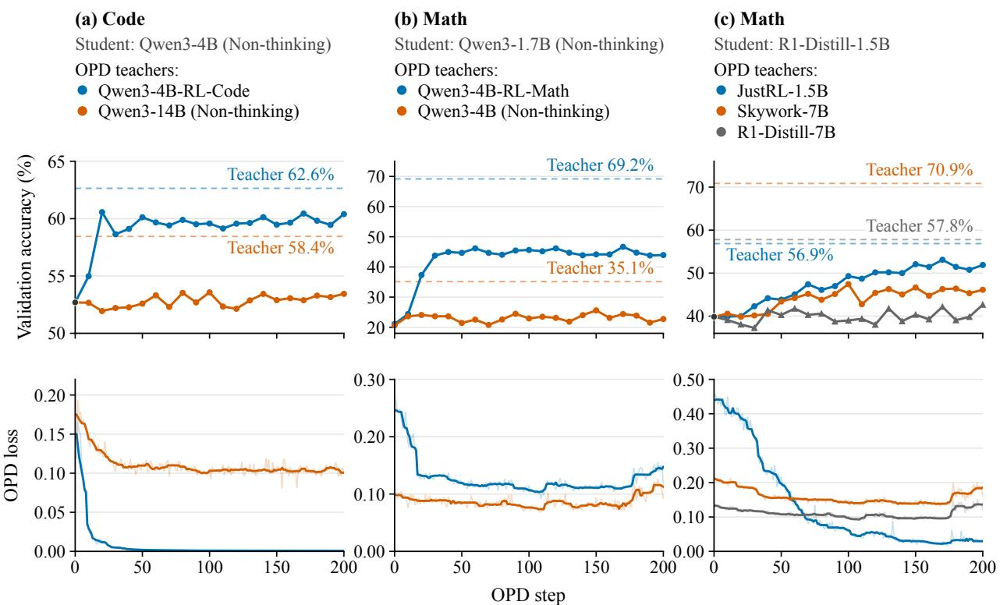  
Figure 1: Validation accuracy (top) and OPD loss (bottom) over 200 updates. The black point in panels (a) and (c) is the shared initial-student evaluation. Dashed lines mark teacher accuracies. Loss curves are centered 9-step rolling medians; raw losses are shown faintly. Qwen3 models use non-thinking mode.

Ablations of vocabulary support and rollout count. For the Qwen3-1.7B (Non-thinking) math student, ablations comparing top-16 with full-logit OPD, and one versus eight training rollouts per prompt, show similar training behavior and closely matched final results (Appendix E).

## 5 Vanishing Learning Signals: Loss Dynamics of OPD

Section 4.3 raises an optimization question: why does OPD with larger-scale teachers stop reducing its loss, while OPD with self-RL teachers continues to do so? Section 5.1 introduces a continuous-time framework for OPD and uses it to analyze the loss dynamics. Section 5.2 examines gradient-based diagnostics and their limitations. Section 5.3 gives a suficient local condition for loss reduction with teachers sharing the student’s parameterization.

Table 2: OPD outcomes over 200 updates: step-1 and minimum loss, loss reduction $( 1 - \widehat { \mathcal { L } } _ { \mathrm { m i n } } / \widehat { \mathcal { L } } _ { \mathrm { s t a r t } } ) \times$ 100% from unrounded losses, accuracy gain from the base student at step 0, and gap recovery (Section 4.2). Bold marks within-group maxima; † marks self-RL teachers.
<table><tr><td>Student</td><td>Teacher</td><td> $\widehat { \mathcal { L } } _ { \mathrm { s t a r t } } \widehat { \mathcal { L } } _ { \mathrm { m i n } }$ </td><td>Loss</td><td>Gain</td><td>Gap</td></tr><tr><td>Code</td><td>Qwen3-4B-RL-Code†</td><td>0.120 0.001</td><td>reduction 99.5%</td><td>(pp) +7.70</td><td>recovery 77.4%</td></tr><tr><td>Qwen3-4B (Non-thinking)</td><td>Qwen3-14B (Non-thinking)</td><td>0.136 0.081</td><td>40.5%</td><td>+0.75</td><td>13.0%</td></tr><tr><td>Math</td><td>Qwen3-4B-RL-Math</td><td>0.263 0.092</td><td>65.1%</td><td>+22.83</td><td>47.5%</td></tr><tr><td>Qwen3-1.7B (Non-thinking)</td><td>Qwen3-4B (Non-thinking)</td><td>0.099 0.069</td><td>30.4%</td><td>+2.07</td><td>14.3%</td></tr><tr><td rowspan="3">Math R1-Distill-1.5B</td><td>JustRL-1.5B†</td><td></td><td>96.3%</td><td></td><td></td></tr><tr><td></td><td>0.455 0.017</td><td>37.7%</td><td>+12.03</td><td>70.7%</td></tr><tr><td>Skywork-7B R1-Distill-7B</td><td>0.210 0.131 0.136 0.089</td><td>34.3%</td><td>+6.27 +2.80</td><td>20.2% 15.6%</td></tr></table>

## 5.1 Mean-Flow Formulation and Loss Dynamics

Write $\theta _ { 0 }$ for the student parameters at the start of OPD. By diferentiating $\mathcal { L } ( \boldsymbol { \theta } )$ , we get:

$$
\begin{array} { r } { \nabla \mathcal { L } ( \theta ) = \underbrace { \mathbb { E } _ { \tau \sim \pi _ { \theta } } \nabla _ { \theta } \widehat { \mathcal { L } } ( \theta ; \tau ) } _ { = : g ( \theta ) } + \underbrace { \mathbb { E } _ { \tau \sim \pi _ { \theta } } { \big [ } \widehat { \mathcal { L } } ( \theta ; \tau ) \nabla _ { \theta } \log \pi _ { \theta } ( y \mid x ) { \big ] } } _ { = : h ( \theta ) } , } \end{array}\tag{5.1}
$$

Here, the detached gradient g is the KL gradient evaluated at prefixes currently visited by the student, whereas the occupancy gradient h captures how changes in $\theta$ alter the prefixes the student visits (Mohamed et al., 2020).

At step m, OPD updates the parameters according to $\theta _ { m + 1 } = \theta _ { m } - \eta \widehat { g } _ { m }$ , where η is the learning rate and ${ \widehat { g } } _ { m }$ is an unbiased stochastic gradient of ${ \widehat { \mathcal { L } } } .$ , satisfying $\mathbb { E } [ \widehat { g } _ { m } \mid \theta _ { m } ] = g ( \theta _ { m } )$ . In the small-learning-rate limit, the sampling noise averages out. With the rescaled time t = mη, the iterates are then described by the ODE (Kushner and Yin, 2003; Borkar and Meyn, 2000)

$$
\dot { \theta } ( t ) = - g ( \theta ( t ) ) , \qquad \theta ( 0 ) = \theta _ { 0 } .\tag{5.2}
$$

See Appendix A.3 for the derivation and a discussion of the idealizations used here. Under this framework, we obtain the following exact loss dynamics, together with a factorization of the decay rate.

Proposition 5.1 (OPD loss dynamics). Under the regularity conditions of Appendix A.4, while the loss is positive, the flow in Eq (5.2) satisfies

$$
\frac { d } { d t } \mathcal { L } ( \theta ( t ) ) = - 2 \gamma ( \theta ( t ) ) \mathcal { L } ( \theta ( t ) ) , \qquad \gamma : = \frac { \langle \nabla \mathcal { L } , g \rangle } { 2 \mathcal { L } } = \mu ( 1 + \alpha ) ,\tag{5.3}
$$

where $\mu : = \left\| g \right\| ^ { 2 } / ( 2 \mathcal { L } )$ and $\alpha : = \left. h , g \right. / \left\| g \right\| ^ { 2 }$ , the last equality holding wherever $g \neq 0$

The proof is given in Appendix A.4.

Proposition 5.1 describes how fast the loss falls. The quantity $2 \gamma$ is the instantaneous fractional rate of loss reduction. The average of $\gamma$ over $[ 0 , t ]$ is $\begin{array} { r } { \overline { { \gamma } } ( t ) : = \frac { 1 } { t } \int _ { 0 } ^ { t } \gamma ( \theta ( u ) ) } \end{array}$ du. Integrating Eq. (5.3) gives $\begin{array} { r } { { \overline { { \gamma } } } ( t ) = { \frac { 1 } { 2 t } } \log \bigl ( \mathcal { L } ( \theta _ { 0 } ) / \mathcal { L } ( \theta ( t ) ) \bigr ) } \end{array}$ , so $\overline { { \gamma } } ( t )$ can be computed directly from the loss curve. A loss plateau, such as those observed in Section 4.3, corresponds to a small average of $\gamma$ over the plateau interval. The factorization $\gamma = \mu ( 1 + \alpha )$ splits this rate into two factors, so a small rate can arise in only two ways, through a small $\mu$ or through α near or below −1.

Here, $\mu = \left\| g \right\| ^ { 2 } / ( 2 \mathcal { L } )$ quantifies the learning signal relative to the remaining loss; a small $\mu$ indicates a weak signal. The coeficient $\alpha = \langle h , g \rangle / \| g \| ^ { 2 }$ measures how much of the occupancy gradient h points along the update $g .$ . So it indicates whether changes in the rollout distribution reinforce the update $( \alpha > 0 )$ or oppose it $( \alpha < 0 )$ . When $\alpha \leq - 1$ , the loss no longer decreases, even if $g \neq 0$

## 5.2 Premature Learning-Signal Collapse with Larger-Scale Teachers

Proposition 5.1 suggests two possible explanations for the loss plateau in Section 4.3: the learning signal may be weak $( \mu$ is small), or the occupancy gradient may oppose the update $( \alpha \leq - 1 )$ . We measure both quantities in the code setting with student Qwen3-4B (Non-thinking) and in the math setting with student R1-Distill-1.5B. At every training step m, we estimate $\mu$ from the training logs as $\widehat { \mu } _ { m } = \widehat { G } _ { m } ^ { 2 } / ( 2 \widehat { \mathcal { L } } _ { m } )$ , where $\widehat { G } _ { m }$ is the gradient norm and ${ \widehat { \mathcal { L } } } _ { m }$ is the loss. We estimate α using $\widehat { \alpha } _ { m }$ at checkpoints saved every 10 training steps. At each checkpoint, we use sampled responses to cross-fit $g$ and $h .$ See Appendix E for details. The measured $\widehat { \mu } _ { m }$ uses a noisy, pre-clipping minibatch gradient; it does not measure the size of an AdamW parameter update. Moreover, the squared minibatch gradient norm includes sampling variance, so a decline in this proxy alone does not establish a decline of the same magnitude in $\| g \| ^ { 2 }$

The logged learning-signal proxy declines while much of the loss remains. Figure 2 plots the estimated learning signal $\widehat { \mu } _ { m }$ against the remaining loss at each training step. With self-RL teachers, the loss decreases by more than 90% as the learning signal declines gradually. By contrast, with larger-scale teachers, the logged proxy drops by approximately an order of magnitude while over 60% of the loss remains. After this drop, the loss changes little. We call this pattern premature learning-signal collapse: the logged gradient weakens before the teacher–student mismatch has been substantially reduced. Here, “premature” describes the early timing and remaining disagreement; it does not establish that the student can achieve a lower loss under the same parameterization.

The occupancy gradient does not consistently explain the loss plateaus. Table 3 shows that, in the code setting, $1 + \widehat { \alpha } _ { m }$ is positive at 19 of 20 checkpoints for Qwen3-14B. These estimates provide little evidence for persistent occupancy cancellation in this run. In the math setting, $1 + \widehat { \alpha } _ { m }$ is positive at 12 of the 20 checkpoints for Skywork-7B and 13 of the 20 checkpoints for R1-Distill-7B. The other estimates are consistent with the occupancy gradient ofsetting or reversing loss reduction in the idealized flow. This may slow training further, alongside the collapse of $\mu .$

Across the code and math settings, an early drop in $\widehat { \mu } _ { m }$ is the common pattern. Cross-fitted estimates of $\| g \| ^ { 2 }$ decline from early to middle training in Math but remain roughly stable for Qwen3-14B after step 20. The occupancy estimates remain tentative, however, because α is measured at only 20 checkpoints per teacher in each setting.

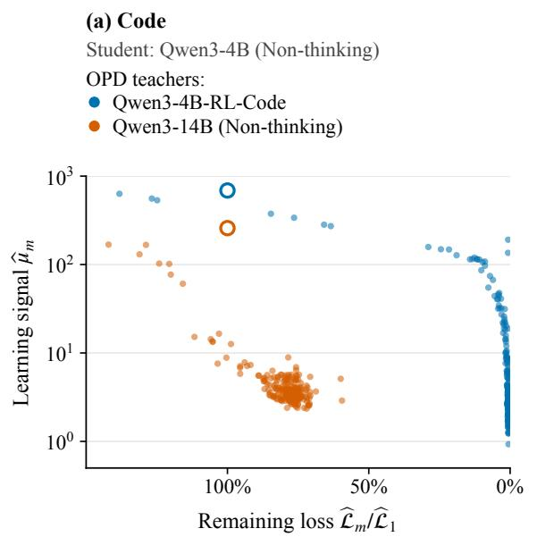

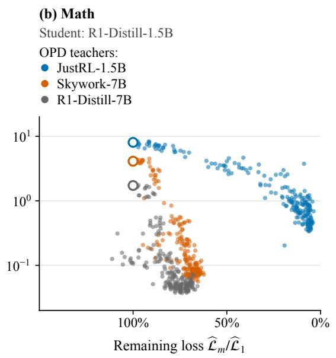  
Figure 2: Learning signal $\widehat { \mu } _ { m }$ versus remaining loss $\widehat { \mathcal { L } } _ { m } / \widehat { \mathcal { L } } _ { 1 }$ over 200 updates. Remaining loss decreases from left to right; the learning-signal axis is logarithmic. Each dot is one training step; open circles mark step 1. Colors and teachers match Figure 1. Appendix E gives the estimators and sources, and shows the corresponding time series in Figure 3.

Table 3: Occupancy factor $1 + \widehat { \alpha } _ { m }$ for larger-scale teachers: median, interquartile range (IQR), and counts above zero across 20 checkpoints (steps 10–200, every 10 steps). Quartiles use linear interpolation. The estimator is given in Appendix E.
<table><tr><td rowspan="2">Task</td><td colspan="3"> $1 + \widehat { \alpha } _ { m }$ </td></tr><tr><td>Teacher Median</td><td>IQR</td><td>Positive</td></tr><tr><td>Code</td><td>Qwen3-14B</td><td>1.10</td><td>[0.67, 1.38]</td></tr><tr><td>Math</td><td>Skywork-7B</td><td>0.13 [-2.28, 1.48]</td><td>19/20 12/20</td></tr><tr><td>R1-Distill-7B</td><td>0.41</td><td>[-0.83, 1.37]</td><td>13/20</td></tr></table>

## 5.3 Local Convergence with Self-RL Teachers

We now study a suficient local condition for continued loss reduction that is motivated by the self-RL teacher experiments. Since each such teacher is obtained by further RL training of the student (Section 4.1), it shares the parameter space of the student, and we write it as $\theta _ { T } = \theta _ { 0 } + \Delta$ . We also find that the teacher is close to the student in this space. As Table 4 shows, the relative distance $\| \Delta \| / \| \theta _ { 0 } \|$ is 0.030% for Qwen3-4B-RL-Code and 0.50% for JustRL-1.5B. As a supplementary run, we also apply OPD with the self-RL instruction-following teacher UltraData-IF-1.5B, whose distance is 0.037% (Appendix G). If the teacher is close enough, the OPD loss around it is approximately quadratic (Proposition D.1). On such a quadratic, the OPD flow keeps reducing the loss. Theorem 5.2 makes this precise and shows how the remaining loss depends on the distance.

Setting. We analyze OPD in the continuous-time ODE framework of Eq (5.2). We also use three regularity conditions that are standard in policy-gradient analysis, namely (i) bounded rollout length (Razin et al., 2025), (ii) a bounded and Lipschitz policy score (Fatkhullin et al., 2023; Barakat et al., 2022; Chakraborty et al., 2024), and (iii) a Lipschitz Hessian of $\mathcal { L }$ (Jaiswal et al., 2025). Appendix C states them in full. Our OPD experiments with self-RL teachers in Section 4.3 motivate this analysis but do not directly test its local, spectrum-dependent bound.

Slow directions and residual loss. The recovery bound depends on both the teacher–student distance $\rho = \| \Delta \|$ and the directions of $\Delta$ . We characterize these directions using the initial student’s Fisher matrix $H _ { 0 } = H ( \theta _ { 0 } )$ , which locally approximates the loss Hessian for nearby teachers (Appendix B). In the quadratic approximation, loss along an eigenvector $u _ { i }$ of $H _ { 0 }$ with eigenvalue $\lambda _ { i }$ decays as $e ^ { - 2 \lambda _ { i } t }$ , so directions with small eigenvalues are learned slowly (Appendix D). For a cutof $\delta > 0$ , their contribution to the initial loss is

$$
E _ { \Delta } ( \delta ) : = \frac 1 2 \sum _ { 0 < \lambda _ { i } \leq \delta } \lambda _ { i } ( u _ { i } ^ { \top } \Delta ) ^ { 2 } \leq \frac \delta 2 \rho ^ { 2 } .\tag{5.4}
$$

Theorem 5.2 (Abridged version of Theorem C.1). Let $\theta _ { T }$ be a self-RL teacher, with $\rho = \| \Delta \| > 0$ Under the conditions of Appendix C, the OPD flow in Eq (5.2) stays within distance $2 \rho$ of the teacher up to a time $T _ { \mathrm { l o c } } = \Omega ( 1 / \rho )$ . For every $\delta > 0$ and $0 \leq t \leq T _ { \mathrm { l o c } }$ 2

$$
\begin{array} { r } { \mathcal L ( \boldsymbol { \theta } ( t ) ) \le e ^ { - \delta t } \mathcal L ( \boldsymbol { \theta } _ { 0 } ) + E _ { \Delta } ( \delta ) + O \big ( \rho ^ { 3 } + \rho ^ { 4 } / \delta \big ) , } \end{array}\tag{5.5}
$$

where $\Omega ( \cdot )$ and $O ( \cdot )$ hide constants depending on the policy-score bounds, the rollout length and the Lipschitz constant of the Hessian of $\mathcal { L }$

The proof is given in Appendix C. Theorem 5.2 bounds the loss by an exponentially decaying term plus a residual determined by $E _ { \Delta } ( \delta )$ and higher-order errors in $\rho .$ This is consistent with Section 4.3, where the minimum loss reaches 0.5% and 3.7% of its starting value with the two self-RL teachers.

We emphasize that Theorem 5.2 does not suggest that only self-RL teachers are easy to learn from. Its proof does not use how the teacher was trained, so OPD can reach any teacher in the student’s parameter space that is close enough to the student and difers from it mostly along high-curvature directions. Rather, it explains why the self-RL teachers in our experiments, which lie close to their students, can be reached by OPD, as shown in Section 4.3. The larger-scale teachers are not covered, because their parameter dimensions difer from those of their students.

## 6 Parameter and Representation Changes in OPD

Section 5 shows that OPD can reach a teacher close to the student, but its learning signal collapses early with larger-scale teachers. A possible reason is that OPD only makes local changes to the student, which may not sufice when matching the teacher requires changes these updates do not make. We therefore measure how much OPD changes the student, both in its parameters and in its hidden representations.

Metrics. We use the relative parameter change $d _ { \mathrm { p a r } } = \lVert \theta _ { \mathrm { e n d } } - \theta _ { \mathrm { s t a r t } } \rVert / \lVert \theta _ { \mathrm { s t a r t } } \rVert$ to measure how far OPD moves the student in parameter space. Because parameter distances say little about what the model computes, we also use linear Centered Kernel Alignment (CKA) (Kornblith et al., 2019) to measure how much its hidden representations change. For a set of prompts, let X and Y be the hidden states of the starting and final checkpoints at one layer, with one row per prompt, averaged over its tokens and centered across prompts. Then CK $\operatorname { A } ( X , Y ) = \left\| Y ^ { \top } X \right\| _ { F } ^ { 2 } / ( \left\| X ^ { \top } X \right\| _ { F } \left\| Y ^ { \top } Y \right\| _ { F } )$ which equals 1 when the two representations agree up to rotation and scaling. We use the prompts of the evaluation benchmarks, namely AIME24, AIME25 and AMC23 in the math setting (143 prompts) and HumanEval+, MBPP+ and LiveCodeBench in the code setting (673 prompts). See Appendix F for details.

OPD changes the student’s parameters and representations only slightly. Table 4 reports both metrics for eight OPD runs after 200 updates. In every run, $d _ { \mathrm { p a r } }$ is between 0.025% and 0.098%, and CKA is at least 0.985 at every layer. Under this learning rate and training budget, the measured changes in parameters and representations are small. The displacement magnitude alone does not separate successful from stalled runs. Whether the direction of these small changes limits teacher matching remains a hypothesis for controlled interventions.

Table 4: Parameter and representation changes from the student’s initialization. OPD student is measured after 200 updates; Teacher compares the self-RL teacher (†). For teachers with a diferent parameterization, $d _ { \mathrm { p a r } }$ is undefined and teacher–student CKA was not computed (–). $d _ { \mathrm { p a r } }$ denotes relative parameter change; Min. CKA is the minimum layerwise CKA. IF details: Appendix G.
<table><tr><td></td><td></td><td></td><td colspan="2">OPD student</td><td colspan="2">Teacher</td></tr><tr><td></td><td>Task Student</td><td>Teacher</td><td> $d _ { \mathrm { p a r } }$ </td><td>Min. CKA</td><td> $d _ { \mathrm { p a r } }$ </td><td>Min. CKA</td></tr><tr><td></td><td>Code Qwen3-4B</td><td>Qwen3-4B-RL-Code† 0.032%</td><td></td><td>0.9979</td><td>0.030%</td><td>0.9993</td></tr><tr><td></td><td></td><td>Qwen3-14B</td><td>0.063%</td><td>0.9850</td><td></td><td></td></tr><tr><td>Math Qwen3-1.7B</td><td></td><td>Qwen3-4B-RL-Math</td><td>0.031%</td><td>0.9939</td><td></td><td></td></tr><tr><td></td><td></td><td>Qwen3-4B</td><td>0.025%</td><td>0.9973</td><td></td><td></td></tr><tr><td>Math R1-Distill-1.5B JustRL-1.5B†</td><td></td><td></td><td>0.098%</td><td>0.9904</td><td>0.497%</td><td>0.9674</td></tr><tr><td></td><td></td><td>Skywork-7B</td><td>0.063%</td><td>0.9988</td><td></td><td></td></tr><tr><td></td><td></td><td>R1-Distill-7B</td><td>0.050%</td><td>0.9986</td><td></td><td></td></tr><tr><td>IF</td><td>R1-Distill-1.5B</td><td>UltraData-IF-1.5B†</td><td>0.026%</td><td>0.9999</td><td>0.037%</td><td>0.9998</td></tr></table>

Self-RL teachers remain close to the initial student. The Teacher columns of Table 4 compare each self-RL teacher with the base model it was trained from. RL post-training moves the base model by 0.030% to 0.50%, and its minimum CKA is between 0.967 and 0.9998. These changes are comparable to or moderately larger than those made by OPD (up to about 5×, for JustRL). These measurements motivate the local recovery analysis of Section 5.3, but small relative distances alone do not verify its assumptions on absolute distance and curvature.

## 7 Conclusion

We study why OPD can plateau while substantial teacher–student disagreement remains. Across code generation and mathematical reasoning, our training logs show an early decline in a gradient-based learning-signal proxy while substantial loss remains, whereas self-RL teachers support sustained loss reduction. Our continuous-time analysis separates the efects of the learning signal and the changing rollout distribution, and provides a local recovery guarantee for suficiently nearby teachers under regularity conditions. Small parameter changes and largely preserved representations further suggest that limited adaptation may constrain learning from other teachers, although displacement magnitude alone does not separate successful from stalled runs. Our local guarantee assumes an idealized gradient flow and shared parameterization, while the experiments use AdamW and a noisy gradient proxy; connecting these diagnostics to actual updates remains future work. Controlled interventions across learning rates, training budgets, and seeds are also needed to distinguish optimization limitations from representational limits and to test the proposed role of limited adaptation.

## References

Agarwal, R., Vieillard, N., Zhou, Y., Stanczyk, P., Ramos Garea, S., Geist, M. and Bachem, O. (2024). On-policy distillation of language models: Learning from self-generated mistakes. In International Conference on Learning Representations, vol. 2024.

Armandpour, M., Ilhan, F., Harrison, D., Jaiswal, A., Hoang, D. N., Faghri, F., Zhang, Y., Cho, M. and Farajtabar, M. (2026). Unmasking on-policy distillation: Where it helps, where it hurts, and why. arXiv preprint arXiv:2605.10889 .

Barakat, A., Bianchi, P. and Lehmann, J. (2022). Analysis of a target-based actor-critic algorithm with linear function approximation. In International Conference on Artificial Intelligence and Statistics. PMLR.

Borkar, V. S. and Meyn, S. P. (2000). The ODE method for convergence of stochastic approximation and reinforcement learning. SIAM Journal on Control and Optimization 38 447–469.

Cai, Y., Cao, D., Lin, L., Luo, C., Xu, X., Yang, K., Liu, W., Yang, S., Zhao, T., Sun, G. et al. (2026). Learning to foresee: Unveiling the unlocking eficiency of on-policy distillation. arXiv preprint arXiv:2605.11739 .

Chakraborty, S., Bedi, A., Koppel, A., Wang, H., Manocha, D., Wang, M. and Huang, F. (2024). PARL: A unified framework for policy alignment in reinforcement learning from human feedback. In International Conference on Learning Representations, vol. 2024.

Cho, J. H. and Hariharan, B. (2019). On the eficacy of knowledge distillation. In 2019 IEEE/CVF International Conference on Computer Vision (ICCV). IEEE.

Cui, G., Yuan, L., Wang, Z., Wang, H., Zhang, Y., Chen, J., Li, W., He, B., Fan, Y., Yu, T. et al. (2025). Process reinforcement through implicit rewards. arXiv preprint arXiv:2502.01456

Elkabetz, O. and Cohen, N. (2021). Continuous vs. discrete optimization of deep neural networks. Advances in Neural Information Processing Systems 34 4947–4960.

Fatkhullin, I., Barakat, A., Kireeva, A. and He, N. (2023). Stochastic policy gradient methods: Improved sample complexity for Fisher-non-degenerate policies. In International Conference on Machine Learning. PMLR.

Fu, Y., Huang, H., Jiang, K., Liu, J., Jiang, Z., Zhu, Y. and Zhao, D. (2026a). Revisiting on-policy distillation: Empirical failure modes and simple fixes. arXiv preprint arXiv:2603.25562

Fu, Z., He, B., Zuo, Y., Huang, H., Zhang, J., Xiao, R., Qian, C., Luo, Q., Gao, H.-a., Wang, Y. et al. (2026b). Rethinking on-policy distillation of large language models II: One training example. arXiv preprint arXiv:2609.04172 .

Gu, Y., Dong, L., Wei, F. and Huang, M. (2024). MiniLLM: Knowledge distillation of large language models. In International Conference on Learning Representations, vol. 2024.

Guo, D., Yang, D., Zhang, H., Song, J., Wang, P., Zhu, Q., Xu, R., Zhang, R., Ma, S., Bi, X. et al. (2025). DeepSeek-R1: Incentivizing reasoning capability in LLMs via reinforcement learning. arXiv preprint arXiv:2501.12948 .

He, B., Qu, Z., Liu, Z., Chen, Y., Zuo, Y., Qian, C., Zhang, K., Chen, W., Xiao, C., Cui, G. et al. (2025a). JustRL: Scaling a 1.5B LLM with a simple RL recipe. arXiv preprint arXiv:2512.16649 .

He, J., Liu, J., Liu, C. Y., Yan, R., Wang, C., Cheng, P., Zhang, X., Zhang, F., Xu, J., Shen, W. et al. (2025b). Skywork Open Reasoner 1 technical report. arXiv preprint arXiv:2505.22312 .

He, Y., Jin, D., Wang, C., Bi, C., Mandyam, K., Zhang, H., Zhu, C., Li, N., Xu, T., Lv, H. et al. (2024). Multi-IF: Benchmarking LLMs on multi-turn and multilingual instructions following. arXiv preprint arXiv:2410.15553 .

He, Z., Liang, T., Xu, J., Liu, Q., Chen, X., Wang, Y., Song, L., Yu, D., Liang, Z., Wang, W. et al. (2026). DeepMath-103K: A large-scale, challenging, decontaminated, and verifiable mathematical dataset for advancing reasoning. In International Conference on Learning Representations, vol. 2026.

Jain, N., Han, K., Gu, A., Li, W.-D., Yan, F., Zhang, T., Wang, S., Solar-Lezama, A., Sen, K. and Stoica, I. (2025). LiveCodeBench: Holistic and contamination free evaluation of large language models for code. In International Conference on Learning Representations, vol. 2025.

Jaiswal, A. K., Wang, Y., Yin, L., Liu, S., Chen, R., Zhao, J., Grama, A., Tian, Y. and Wang, Z. (2025). From low rank gradient subspace stabilization to low-rank weights: Observations, theories, and applications. In Proceedings of the 42nd International Conference on Machine Learning, vol. 267 of Proceedings of Machine Learning Research. PMLR.

Jia, N., Yang, H., Ma, X., Lian, J., Zhang, S., Zhang, W., Zeng, K., Cai, X. and Sun, Z. (2026). Asymmetric on-policy distillation: Bridging exploitation and imitation at the token level. arXiv preprint arXiv:2605.06387 .

Jiang, Y., Li, R., Dipta, S. R., Li, D. and Yang, Z. (2026). Cornerstones or stumbling blocks? Deciphering the rock tokens in on-policy distillation. arXiv preprint arXiv:2605.09253 .

Karimi, H., Nutini, J. and Schmidt, M. (2016). Linear convergence of gradient and proximalgradient methods under the Polyak-Łojasiewicz condition. In Joint European Conference on Machine Learning and Knowledge Discovery in Databases. Springer.

Ko, J., Kim, S., Chen, T. and Yun, S.-Y. (2024). DistiLLM: Towards streamlined distillation for large language models. In Proceedings of the 41st International Conference on Machine Learning, vol. 235 of Proceedings of Machine Learning Research. PMLR.

Kornblith, S., Norouzi, M., Lee, H. and Hinton, G. (2019). Similarity of neural network representations revisited. In International Conference on Machine Learning. PMLR.

Kushner, H. J. and Yin, G. G. (2003). Stochastic approximation and recursive algorithms and applications. Springer.

Li, Y., Zuo, Y., He, B., Zhang, J., Xiao, C., Qian, C., Yu, T., Gao, H.-a., Yang, W., Liu, Z. et al. (2026). Rethinking on-policy distillation of large language models: Phenomenology, mechanism, and recipe. arXiv preprint arXiv:2604.13016 .

Lin, A., Wohlwend, J., Chen, H. and Lei, T. (2020). Autoregressive knowledge distillation through imitation learning. In Proceedings of the 2020 Conference on Empirical Methods in Natural Language Processing (EMNLP).

Liu, J., Xia, C. S., Wang, Y. and Zhang, L. (2023). Is your code generated by ChatGPT really correct? Rigorous evaluation of large language models for code generation. Advances in Neural Information Processing Systems 36 21558–21572.

Lu, K. and Thinking Machines Lab (2025). On-policy distillation. Thinking Machines Lab: Connectionism https://thinkingmachines.ai/blog/on-policy-distillation/.

Malladi, S., Wettig, A., Yu, D., Chen, D. and Arora, S. (2023). A kernel-based view of language model fine-tuning. In International Conference on Machine Learning. PMLR.

Mei, J., Xiao, C., Szepesvari, C. and Schuurmans, D. (2020). On the global convergence rates of softmax policy gradient methods. In International Conference on Machine Learning. PMLR.

Mirzadeh, S. I., Farajtabar, M., Li, A., Levine, N., Matsukawa, A. and Ghasemzadeh, H. (2020). Improved knowledge distillation via teacher assistant. In Proceedings of the AAAI Conference on Artificial Intelligence, vol. 34.

Mohamed, S., Rosca, M., Figurnov, M. and Mnih, A. (2020). Monte Carlo gradient estimation in machine learning. Journal of Machine Learning Research 21 1–62.

Mukherjee, S., Yuan, L., Hakkani-Tur, D. and Peng, H. (2025). Reinforcement learning finetunes small subnetworks in large language models. arXiv preprint arXiv:2505.11711 .

Razin, N., Wang, Z., Strauss, H., Wei, S., Lee, J. D. and Arora, S. (2025). What makes a reward model a good teacher? An optimization perspective. Advances in Neural Information Processing Systems 38 59162–59222.

Razin, N., Zhou, H., Saremi, O., Thilak, V., Bradley, A., Nakkiran, P., Susskind, J. and Littwin, E. (2024). Vanishing gradients in reinforcement finetuning of language models. In International Conference on Learning Representations, vol. 2024.

Ross, S., Gordon, G. and Bagnell, D. (2011). A reduction of imitation learning and structured prediction to no-regret online learning. In Proceedings of the Fourteenth International Conference on Artificial Intelligence and Statistics. JMLR Workshop and Conference Proceedings.

Runwal, B., Agrawal, A., Roy, A. and Panda, R. (2026). PRISM: Demystifying retention and interaction in mid-training. arXiv preprint arXiv:2603.17074 .

Shen, Z., Li, Y., Yin, Q., Leong, C. T., Wang, Z., Chen, Y., Han, R., Lee, S. and Fung, Y. R. (2026). On the geometry of on-policy distillation. arXiv preprint arXiv:2606.07082 .

Shenfeld, I., Pari, J. and Agrawal, P. (2026). RL’s razor: Why online reinforcement learning forgets less. In International Conference on Learning Representations, vol. 2026.

Sheng, G., Zhang, C., Ye, Z., Wu, X., Zhang, W., Zhang, R., Peng, Y., Lin, H. and Wu, C. (2025). HybridFlow: A flexible and eficient RLHF framework. In Proceedings of the Twentieth European Conference on Computer Systems.

Stanton, S., Izmailov, P., Kirichenko, P., Alemi, A. A. and Wilson, A. G. (2021). Does knowledge distillation really work? Advances in Neural Information Processing Systems 34 6906–6919.

Wang, R., Wang, H., Chen, Y., Xue, B., Fang, T., Yu, W. and Wong, K.-F. (2026a). Demystifying on-policy distillation: Roles, pathologies, and regulations. arXiv preprint arXiv:2607.13399

Wang, Y., Lu, S., Gu, Y., Wang, P., Yang, Y., Yan, Z., Xie, C., Wu, J. and Yang, H. (2026b). Not all disagreement is learnable: Token teachability in on-policy distillation. arXiv preprint arXiv:2605.26844 .

Xiao, B., Xia, B., Yang, B., Gao, B., Shen, B., Zhang, C., He, C., Lou, C., Luo, F., Wang, G. et al. (2026). MiMo-V2-Flash technical report. arXiv preprint arXiv:2601.02780 .

Yang, A., Li, A., Yang, B., Zhang, B., Hui, B., Zheng, B., Yu, B., Gao, C., Huang, C., Lv, C. et al. (2025). Qwen3 technical report. arXiv preprint arXiv:2505.09388 .

Yang, W., Liu, W., Xie, R., Yang, K., Yang, S. and Lin, Y. (2026). Learning beyond teacher: Generalized on-policy distillation with reward extrapolation. arXiv preprint arXiv:2602.12125 .

Yu, Q., Zhang, Z., Zhu, R., Yuan, Y., Zuo, X., Yue, Y., Dai, W., Fan, T., Liu, G., Liu, L. et al. (2025). DAPO: An open-source LLM reinforcement learning system at scale. Advances in Neural Information Processing Systems 38 113222–113244.

Zhang, H., Gai, J., Kim, J., Liu, B. and Risteski, A. (2026). When does online imitation learning help in LLM post-training? The role of (non-)realizability beyond horizon. arXiv preprint arXiv:2606.30445 .

Zhu, H., Zhang, Z., Huang, H., Su, D., Liu, Z., Zhao, J., Fedorov, I., Pirsiavash, H., Sha, Z., Lee, J. et al. (2025). The path not taken: RLVR provably learns of the principals. arXiv preprint arXiv:2511.08567 .

Zhu, S., Ye, X., Lu, H., Shi, W. and Liu, G. (2026). The many faces of on-policy distillation: Pitfalls, mechanisms, and fixes. arXiv preprint arXiv:2605.11182 .

## A OPD calculus and continuous-time identity

## A.1 Per-prefix reverse-KL gradient

Let

$$
r _ { \theta } ( a , s ) : = \log { \frac { \pi _ { \theta } ( a \mid s ) } { \pi _ { T } ( a \mid s ) } } .\tag{A.1}
$$

Write $\ell ( \theta ; s ) = D _ { \mathrm { K L } } ( \pi _ { \theta } ( \cdot \mid s ) \parallel \pi _ { T } ( \cdot \mid s ) )$ for the per-prefix loss in Eq (3.1). At a fixed prefix,

$$
\nabla _ { \theta } \ell ( \theta ; s ) = \sum _ { a } \pi _ { \theta } ( a \mid s ) { \big ( } r _ { \theta } ( a , s ) + 1 { \big ) } \psi _ { \theta } ( a , s )\tag{A.2}
$$

$$
= \mathbb { E } _ { a \sim \pi _ { \theta } ( \cdot | s ) } \left[ \left( r _ { \theta } ( a , s ) - \mathbb { E } _ { b \sim \pi _ { \theta } } r _ { \theta } ( b , s ) \right) \psi _ { \theta } ( a , s ) \right] .\tag{A.3}
$$

The second equality uses $\mathbb { E } _ { a \sim \pi _ { \theta } } \psi _ { \theta } ( a , s ) = 0 ;$ the centered baseline is optional. For the forward KL $D _ { \mathrm { K L } } ( \pi _ { T } ( \cdot \mid s ) \| \pi _ { \theta } ( \cdot \mid s ) )$ , the corresponding fixed-prefix gradient is $- \mathbb { E } _ { a \sim \pi _ { T } } \psi _ { \theta } ( a , s )$

## A.2 Population gradient split

Assume diferentiation may be interchanged with expectation in Eq (3.1). Since the prompt distribution does not depend on θ, the score of a trajectory ${ \boldsymbol \tau } = ( x , y )$ is $\nabla _ { \theta } \log \pi _ { \theta } ( y \mid x )$ , and the likelihood-ratio identity gives

$$
\nabla \mathcal { L } ( \theta ) = \mathbb { E } _ { \tau \sim \pi _ { \theta } } \nabla _ { \theta } \widehat { \mathcal { L } } ( \theta ; \tau ) + \mathbb { E } _ { \tau \sim \pi _ { \theta } } \left[ \widehat { \mathcal { L } } ( \theta ; \tau ) \nabla _ { \theta } \log \pi _ { \theta } ( y \mid x ) \right]\tag{A.4}
$$

$$
= g ( \theta ) + h ( \theta ) ,\tag{A.5}
$$

which proves Eq (5.1). Write $\mathcal { A } ( \theta ) : = \langle \nabla \mathcal { L } ( \theta ) , g ( \theta ) \rangle$ for the loss–update alignment, so that $\mathcal { A } = 2 \gamma \mathcal { L }$ in the notation of Proposition 5.1. Substituting the split gives

$$
\mathcal { A } ( \theta ) = \left\| g ( \theta ) \right\| ^ { 2 } + \left. h ( \theta ) , g ( \theta ) \right. .\tag{A.6}
$$

## A.3 From the OPD update to the ODE

Write the update of Section 5.1 as

$$
\theta _ { m + 1 } = \theta _ { m } - \eta \widehat { g } _ { m } , \qquad \widehat { g } _ { m } = g ( \theta _ { m } ) + \xi _ { m } ,\tag{A.7}
$$

where $\xi _ { m }$ is the sampling noise of the minibatch gradient, with $\mathbb { E } [ \xi _ { m } \mid \theta _ { m } ] = 0$ . Take a short interval of length $\Delta t$ that contains $n = \Delta t / \eta$ steps starting from step m. Summing Eq (A.7) over these steps gives

$$
\theta _ { m + n } - \theta _ { m } = - \eta \sum _ { k = m } ^ { m + n - 1 } g ( \theta _ { k } ) - \eta \sum _ { k = m } ^ { m + n - 1 } \xi _ { k } .
$$

Because the iterates move little over the interval and $g$ is continuous, the first sum equals $\Delta t g ( \theta _ { m } )$ up to a term of order $\Delta t ^ { 2 }$ . The second sum has mean zero and, for noise with bounded variance, a standard deviation of order $\sqrt { \eta \Delta t }$ , which is negligible next to $\Delta t$ when $\eta  0$ . Writing $\theta ( t ) = \theta _ { t / \eta } ,$ dividing by $\Delta t ,$ and letting first $\eta  0$ and then $\Delta t \to 0$ gives Eq (5.2). This is the standard ODE limit of a stochastic iteration (Kushner and Yin, 2003; Borkar and Meyn, 2000), and Proposition A. below bounds the loss after finitely many steps without taking the limit.

Our runs use AdamW, whereas Eq (5.2) idealizes detached-gradient descent. AdamW’s momentum, preconditioning, and weight decay can change the update direction; gradient clipping also rescales the gradient. Razin et al. (2025) make the same idealization in their continuous-time analysis of policy gradient. Finally, the analysis uses the full-vocabulary KL in $\operatorname { E q }$ (3.1), whereas our main runs optimize its top-16 version in Eq (3.2). The statistics measured in Section 5.2 are computed on the top-16 objective and serve as proxies for the corresponding full-KL quantities.

## A.4 Proof of Proposition 5.1

Regularity conditions. Proposition 5.1 uses two conditions. Diferentiation: diferentiation and expectation may be interchanged in Eq (3.1), so that the split in Eq (5.1) holds. Flow regularity: there is an open set $\mathcal { U } \ni \theta _ { 0 }$ on which $\mathcal { L }$ is $C ^ { 1 }$ and $g$ is locally Lipschitz, and Eq (5.2) has a solution that stays in $\mathcal { U }$ on $[ 0 , T _ { \star } ]$ for the horizon $T _ { \star }$ under consideration. Since $g$ is locally Lipschitz, this solution is unique and $C ^ { 1 }$ (Picard–Lindelöf), so $t \mapsto { \mathcal { L } } ( \theta ( t ) )$ is $C ^ { 1 }$ and the chain rule applies.

Proof of Proposition 5.1. Rate identity in Eq (5.3). By the chain rule and Eq (5.2), for $t \in [ 0 , T _ { \star } ]$ 2

$$
\frac { d } { d t } \mathcal { L } ( \theta ( t ) ) = \left. \nabla \mathcal { L } ( \theta ( t ) ) , \dot { \theta } ( t ) \right. = - \left. \nabla \mathcal { L } ( \theta ( t ) ) , g ( \theta ( t ) ) \right. = - \mathcal { A } ( \theta ( t ) ) .
$$

Wherever $\mathcal { L } ( \theta ( t ) ) > 0$ , the definition $\gamma = \mathcal { A } / ( 2 \mathcal { L } )$ rewrites the right-hand side as $- 2 \gamma ( \theta ( t ) ) \mathcal { L } ( \theta ( t ) )$ , which is Eq (5.3).

Integrated form. Let $t _ { 0 } : = \operatorname* { i n f } \{ t \in [ 0 , T _ { \star } ] : \mathcal { L } ( \theta ( t ) ) = 0 \}$ , with $t _ { 0 } : = T _ { \star }$ if the loss never vanishes. On $[ 0 , t _ { 0 } )$ the loss is positive, so log $\mathcal { L } ( \theta ( t ) )$ is $C ^ { 1 }$ with $\frac { d } { d t }$ log $\mathcal { L } ( \theta ( t ) ) = - 2 \gamma ( \theta ( t ) )$ by Eq (5.3). Integrating from 0 to $t < t _ { 0 }$ and exponentiating gives

$$
\mathcal { L } ( \theta ( t ) ) = \mathcal { L } ( \theta _ { 0 } ) \exp \biggl ( - 2 \int _ { 0 } ^ { t } \gamma ( \theta ( u ) ) d u \biggr ) ,\tag{A.8}
$$

which yields the run average $\overline { { \gamma } } ( t )$ of Section 5.1.

Factorization. Wherever $\mathcal { L } ( \theta ) > 0$ and $g ( \theta ) \neq 0$ , dividing Eq (A.6) by $2 { \mathcal { L } } ( \theta )$ gives

$$
\gamma = { \frac { \left\| g \right\| ^ { 2 } } { 2 { \mathcal { L } } } } + { \frac { \langle h , g \rangle } { 2 { \mathcal { L } } } } = { \frac { \left\| g \right\| ^ { 2 } } { 2 { \mathcal { L } } } } \left( 1 + { \frac { \langle h , g \rangle } { \left\| g \right\| ^ { 2 } } } \right) = \mu ( 1 + \alpha )
$$

by the definitions of $\mu$ and $\alpha .$

By Cauchy–Schwarz, $| \alpha | \leq \| h \| / \| g \|$ , so the factorization gives $\mu ( 1 - \left\| h \right\| / \left\| g \right\| ) \leq \gamma \leq \mu ( 1 + $ $\| h \| / \| g \| )$ .

Proposition A.1 (Finite-step stochastic decomposition). Suppose $\mathcal { L }$ is $\beta$ -smooth on a region containing the iterates, $\mathbb { E } [ \widehat { g } _ { m } \mid \mathcal { F } _ { m } ] = g ( \theta _ { m } )$ , and

$$
\sigma _ { m } ^ { 2 } : = \mathbb { E } \left[ \left\| { \widehat { g } } _ { m } - g ( \theta _ { m } ) \right\| ^ { 2 } | { \mathcal F } _ { m } \right] < \infty .\tag{A.9}
$$

Then

$$
\begin{array} { r l } { \displaystyle \mathbb { E } \mathcal { L } ( \theta _ { M } ) \leq \mathcal { L } ( \theta _ { 0 } ) - \sum _ { m = 0 } ^ { M - 1 } \eta _ { m } \mathbb { E } A ( \theta _ { m } ) } & { } \\ { \displaystyle \qquad + \frac { \beta } { 2 } \sum _ { m = 0 } ^ { M - 1 } \eta _ { m } ^ { 2 } \mathbb { E } \left[ \| g ( \theta _ { m } ) \| ^ { 2 } + \sigma _ { m } ^ { 2 } \right] . } \end{array}\tag{A.10}
$$

Proof. Smoothness and the update $\theta _ { m + 1 } = \theta _ { m } - \eta _ { m } \widehat { g } _ { m }$ imply

$$
\mathbb { E } _ { m } \mathcal { L } ( \theta _ { m + 1 } ) \le \mathcal { L } ( \theta _ { m } ) - \eta _ { m }  { \mathcal { A } } ( \theta _ { m } ) + \frac { \beta \eta _ { m } ^ { 2 } } { 2 } \left( \| g ( \theta _ { m } ) \| ^ { 2 } + \sigma _ { m } ^ { 2 } \right) .
$$

Take total expectations and sum over $m .$

## B Parameter diferences and the initial Fisher

Throughout this section, the teacher and student use the same architecture, parameter coordinates, tokenizer, vocabulary, temperature, and policy interface. Set $\theta _ { T } = \theta _ { \mathrm { R I } }$ and $\Delta = \theta _ { T } - \theta _ { 0 }$ . All expectations below are assumed finite, with $N ( \tau ) > 0$ almost surely. For a policy checkpoint $\vartheta ,$ write $\psi _ { \vartheta } ( a , s ) = \nabla _ { \vartheta } \log \pi _ { \vartheta } ( a \mid s )$ and define

$$
H ( \vartheta ) : = \mathbb { E } _ { \tau \sim \pi _ { \vartheta } } \left[ \frac { 1 } { N ( \tau ) } \sum _ { s \in \mathcal { S } ( \tau ) } \mathbb { E } _ { a \sim \pi _ { \vartheta } ( \cdot | s ) } \psi _ { \vartheta } ( a , s ) \psi _ { \vartheta } ( a , s ) ^ { \top } \right] .\tag{B.1}
$$

Thus $H _ { 0 } = H ( \theta _ { 0 } )$ . The teacher Fisher and its diference from the initial-student Fisher are

$$
H _ { T } : = H ( \theta _ { T } ) , \qquad \varepsilon _ { H } : = \left. H _ { T } - H _ { 0 } \right. _ { \mathrm { o p } } .\tag{B.2}
$$

Both matrices use the expectation of the token-normalized statistic, not a ratio of separate expectations of its numerator and denominator.

Lemma B.1 (Low-curvature endpoint energy). For $H _ { 0 } \succeq 0$ , let $P _ { \leq \delta }$ be its spectral projector onto eigenvalues in [0, δ]. Then

$$
\begin{array} { r } { E _ { \Delta } ( \delta ) = \frac 1 2 \Delta ^ { \top } H _ { 0 } P _ { \leq \delta } \Delta , \qquad 0 \leq E _ { \Delta } ( \delta ) \leq \frac { \delta } { 2 } \left. \Delta \right. ^ { 2 } . } \end{array}\tag{B.3}
$$

No restriction of $\Delta$ to the range of $H _ { 0 }$ is needed.

Proof. Write $d _ { i } = u _ { i } ^ { \top } \Delta$ in an orthonormal eigenbasis of $H _ { 0 }$ . Expanding the quadratic form gives $\begin{array} { r } { E _ { \Delta } ( \delta ) = \frac 1 2 \sum _ { 0 < \lambda _ { i } \leq \delta } \lambda _ { i } d _ { i } ^ { 2 } } \end{array}$ . Each retained eigenvalue is at most $\delta ,$ so the sum is bounded by $\delta \sum _ { i } d _ { i } ^ { 2 } / 2 = \delta \left\| \Delta \right\| ^ { 2 } / 2$ . Zero eigenvalues contribute no energy; nullspace components need not vanish. □

Lemma B.2 (Same-model root and Fisher identities). Assume positive conditional token probabilities and a rollout law with common support in a neighborhood of θ . Assume the smoothness and integrable domination needed to diferentiate $\mathcal { L }$ twice and g once. Then

$$
{ \mathcal { L } } ( \theta _ { T } ) = 0 , \qquad \nabla { \mathcal { L } } ( \theta _ { T } ) = 0 , \qquad g ( \theta _ { T } ) = 0 ,\tag{B.4}
$$

and

$$
\nabla ^ { 2 } \mathcal { L } ( \theta _ { T } ) = D g ( \theta _ { T } ) = H _ { T } .\tag{B.5}
$$

Proof. At $\theta _ { T }$ , every conditional KL and its first parameter derivative vanish for every fixed prefix. Its Hessian is the conditional policy Fisher. Hence $\widehat { \mathcal { L } } ( \theta _ { T } ; \tau )$ and its first parameter derivative vanish for every sampled trajectory $\tau$ . When diferentiating $\begin{array} { r } { \begin{array} { r } { \mathcal { L } ( \theta ) = \mathbb { E } _ { \tau \sim \pi _ { \theta } } \widehat { \mathcal { L } } ( \theta ; \tau ) } \end{array} } \end{array}$ twice, all terms involving derivatives of the rollout law multiply one of these vanishing quantities. The remaining term is $\mathbb { E } _ { \tau \sim \pi _ { \theta _ { T } } } \nabla _ { \theta } ^ { 2 } \widehat { \mathcal { L } } ( \theta _ { T } ; \tau ) = H _ { T }$ . Diferentiating $g$ once gives the same term because the derivative of the rollout law multiplies $\nabla _ { \boldsymbol { \theta } } \widehat { \mathcal { L } } ( \boldsymbol { \theta } _ { T } ; \boldsymbol { \tau } ) = 0 .$ . The denominator $N ( \tau )$ is held fixed conditional on $\tau ;$ its distributional dependence is already included in the law of $\tau \sim \pi _ { \theta }$ □

Score and sampling conditions. We impose boundedness and Lipschitz continuity of the policy score,

$$
\| \psi _ { \boldsymbol \theta } ( a , s ) \| \le B , \qquad \| \psi _ { \boldsymbol \theta } ( a , s ) - \psi _ { \boldsymbol \theta ^ { \prime } } ( a , s ) \| \le L _ { s } \| \boldsymbol \theta - \boldsymbol \theta ^ { \prime } \| ,\tag{B.6}
$$

uniformly over the relevant prefixes and tokens and over parameters near $\theta _ { T }$ . These conditions are standard in policy-gradient analysis (Fatkhullin et al., 2023, Assumption 1) and are also used by Barakat et al. (2022, Assumption 3.1) and in RLHF (Chakraborty et al., 2024, Assumption 3, Eq (19)). Prompts follow a fixed distribution. Each sampled trajectory uses at most M autoregressive token draws from the full student policy, with fixed stopping and masking rules and $N ( \tau ) = | S ( \tau ) | > 0$ Here M bounds all draws in $\tau ,$ including every response when $\tau$ collects a batch. A finite generation horizon is also used by Razin et al. (2025, Section 3.1). Lemma B.3 derives a quadratic update remainder with

$$
\begin{array} { r } { C _ { g } : = \frac { 3 } { 2 } B L _ { s } + ( M + 1 ) B ^ { 3 } . } \end{array}\tag{B.7}
$$

Lemma B.3 (Policy scores and the detached update). Let $\boldsymbol { B } _ { R }$ be a closed ball of radius R about $\theta _ { T }$ Assume positive diferentiable token probabilities and the uniform score bounds in $E q$ (B.6) on an open neighborhood of this ball. Prompts and auxiliary randomness have parameter-independent laws. Each trajectory is generated using at most M draws from $\pi _ { \boldsymbol { \theta } } ;$ stopping, masking, and postprocessing are fixed functions of the generated trajectory and auxiliary randomness. Suppose $N ( \tau ) = | S ( \tau ) | > 0$ almost surely. Then g is locally Lipschitz near the ball and

$$
\left\| g ( \theta _ { T } + e ) - H _ { T } e \right\| \le C _ { g } \left\| e \right\| ^ { 2 } , \qquad \theta _ { T } + e \in \mathcal { B } _ { R } ,\tag{B.8}
$$

with $C _ { g }$ from $E q$ (B.7). The self-Fisher map also satisfies

$$
\begin{array} { r } { \left\| \boldsymbol H ( \boldsymbol \theta ) - \boldsymbol H ( \boldsymbol \theta ^ { \prime } ) \right\| _ { \mathrm { o p } } \le L _ { H } \left\| \boldsymbol \theta - \boldsymbol \theta ^ { \prime } \right\| , \qquad L _ { H } : = 2 B L _ { s } + ( M + 1 ) B ^ { 3 } , } \end{array}\tag{B.9}
$$

for θ, $\theta ^ { \prime } \in B _ { R }$

Proof. Write $d = \| e \| , p _ { \theta } ( a ) = \pi _ { \theta } ( a \mid s )$ , and $b _ { s } ( \theta ) = \nabla _ { \theta } \ell ( \theta ; s )$ for a fixed prefix s. The score identity $\textstyle \sum _ { a } p _ { \theta } ( a ) \psi _ { \theta } ( a , s ) = 0$ gives

$$
b _ { s } ( \theta ) = \sum _ { a } p _ { \theta } ( a ) \psi _ { \theta } ( a , s ) \log \frac { p _ { \theta } ( a ) } { p _ { T } ( a ) } .
$$

Integrating along the segment from $\theta _ { T }$ to $\theta _ { T } + e$ yields

$$
\sum _ { a } | p _ { \theta } ( a ) - p _ { T } ( a ) | \leq G d ,\tag{B.10}
$$

$$
\left| \log \frac { p _ { \theta } ( a ) } { p _ { T } ( a ) } \right| \le G d ,\tag{B.11}
$$

$$
\begin{array} { r } { \left| \log \frac { p _ { \theta } ( a ) } { p _ { T } ( a ) } - \psi _ { T } ( a , s ) ^ { \top } e \right| \leq \frac { L _ { s } } { 2 } d ^ { 2 } . } \end{array}\tag{B.12}
$$

Let $\begin{array} { r } { H _ { T } ( s ) = \sum _ { a } p _ { T } ( a ) \psi _ { T } ( a , s ) \psi _ { T } ( a , s ) ^ { \intercal } } \end{array}$ . Subtracting $H _ { T } ( s ) e$ from $b _ { s } ( \theta )$ gives three terms: the change in the score, the remainder of the log-ratio, and the change from $p _ { T }$ to $p _ { \theta }$ . Their norms are bounded by $B L _ { s } d ^ { 2 } , B L _ { s } d ^ { 2 } / 2$ , and $B ^ { 3 } d ^ { 2 }$ , respectively. Hence

$$
\begin{array} { r l r } { \| b _ { s } ( \theta ) - H _ { T } ( s ) e \| \le C _ { \mathrm { p r e } } d ^ { 2 } , } & { { } } & { C _ { \mathrm { p r e } } : = \frac { 3 } { 2 } B L _ { s } + B ^ { 3 } . } \end{array}\tag{B.13}
$$

We next control the trajectory distribution. In this proof, write $Q _ { \theta }$ for the law of the recorded trajectory $\tau \sim \pi _ { \theta }$ . The likelihood score of the complete generated trajectory, including auxiliary randomness before postprocessing, is a sum of at most M token scores and has norm at most MG. Stopped sequences may be padded by absorbing states with zero score. Integrating the derivative of its law along the same segment, then applying the fixed postprocessing map, gives

$$
\| Q _ { \theta } - Q _ { \theta _ { T } } \| _ { 1 } \leq M G d , \qquad \| Q - Q ^ { \prime } \| _ { 1 } : = \int | q - q ^ { \prime } | .\tag{B.14}
$$

For $\begin{array} { r } { A _ { T } ( \tau ) : = N ( \tau ) ^ { - 1 } \sum _ { s \in S ( \tau ) } H _ { T } ( s ) } \end{array}$ , we have $\| A _ { T } ( \tau ) \| _ { \mathrm { o p } } \le B ^ { 2 }$ and $\mathbb { E } _ { \tau \sim \pi _ { \theta _ { T } } } A _ { T } ( \tau ) = H _ { T }$ . Averaging Eq (B.13) over scored prefixes and then over $\tau \sim \pi _ { \theta }$ therefore gives

$$
\begin{array} { r } { \| g ( \theta ) - H _ { T } e \| \le C _ { \mathrm { p r e } } d ^ { 2 } + B ^ { 2 } d \| Q _ { \theta } - Q _ { \theta _ { T } } \| _ { 1 } \le C _ { g } d ^ { 2 } . } \end{array}
$$

This averages each trajectory’s normalized statistic; the random denominator is not replaced by its expectation.

For any two parameters in the ball, the conditional-policy law changes in $L ^ { 1 }$ by at most $B \| \theta - \theta ^ { \prime } \|$ The outer product of two scores changes in operator norm by at most $2 B L _ { s } \| \theta - \theta ^ { \prime } \|$ . Combining these bounds with the trajectory-law bound gives Eq (B.9). Finally, the scores and log-ratios are bounded and Lipschitz on the ball. Applying the same distributional bounds to their product in $b _ { s }$ gives

$$
\left\| g ( \theta ) - g ( \theta ^ { \prime } ) \right\| \leq \left[ B ^ { 2 } + B L _ { s } R + ( M + 1 ) B ^ { 3 } R \right] \left\| \theta - \theta ^ { \prime } \right\| .
$$

The argument also applies on a slightly larger ball inside the open regularity neighborhood, proving the stated local Lipschitz property. □

The bounded-draw mechanism is part of this lemma’s scope: conditioning on accepted trajectories or resampling empty responses requires controlling the resulting law separately unless all retries obey the stated draw bound. Parameter-dependent top-k or top-p truncation is not included.

Proposition B.4 (Local approximation from endpoint geometry). Assume Lemma B.2 and the score and sampling conditions of Lemma B.3 on a neighborhood of a ball $\scriptstyle B _ { R }$ containing $\theta _ { 0 }$ . Suppose $\textit { L i s C } ^ { 2 }$ with an $L _ { \mathcal { L } ^ { - } } L i p s c h i t z$ Hessian there, measured in operator norm. For $e = \theta - \theta _ { T }$ and $\theta \in B _ { R } ,$

$$
\begin{array} { r } { \Big \vert \mathcal { L } ( \theta ) - \frac { 1 } { 2 } e ^ { \top } H _ { 0 } e \Big \vert \le \frac { \varepsilon _ { H } } { 2 } \left. e \right. ^ { 2 } + \frac { L _ { \mathcal { L } } } { 6 } \left. e \right. ^ { 3 } , } \end{array}\tag{B.15}
$$

$$
\left\| g ( \theta ) - H _ { 0 } e \right\| \leq \varepsilon _ { H } \left\| e \right\| + C _ { g } \left\| e \right\| ^ { 2 } .\tag{B.16}
$$

Consequently, uniform loss and update errors on $\boldsymbol { B } _ { R }$ are bounded by

$$
\begin{array} { r } { \varepsilon _ { \mathcal { L } } = \frac { \varepsilon _ { H } R ^ { 2 } } { 2 } + \frac { L _ { \mathcal { L } } R ^ { 3 } } { 6 } , \qquad \varepsilon _ { g } = \varepsilon _ { H } R + C _ { g } R ^ { 2 } . } \end{array}\tag{B.17}
$$

Proof. The segment from $\theta _ { T }$ to $\theta _ { T } + e$ lies in the ball. The root identities and the Hessian condition give

$$
\begin{array} { r } { \left| \mathcal { L } ( \theta _ { T } + e ) - \frac { 1 } { 2 } e ^ { \top } H _ { T } e \right| \le \frac { L _ { \mathcal { L } } } { 6 } \left\| e \right\| ^ { 3 } . } \end{array}
$$

Lemma B.3 gives the update remainder $\| g ( \theta _ { T } + e ) - H _ { T } e \| \leq C _ { g } \| e \| ^ { 2 }$ . Replacing $H _ { T }$ by $H _ { 0 }$ adds at most $\varepsilon _ { H } \| e \| ^ { \breve { 2 } } / 2$ to the loss error and $\varepsilon _ { H } \parallel e \parallel$ to the update error. Using $\| e \| \le R$ proves the uniform bounds. □

Lemma B.3 also yields $\varepsilon _ { H } \leq L _ { H } \| \Delta \|$ with $L _ { H }$ defined in Eq (B.9). For $R = c \| \Delta \|$ with a fixed $c \geq 1$ , the preceding constants satisfy

$$
\begin{array} { r } { \varepsilon \mathcal { L } \leq \left( \frac { L _ { H } c ^ { 2 } } { 2 } + \frac { L _ { C } c ^ { 3 } } { 6 } \right) \| \Delta \| ^ { 3 } , } \end{array}\tag{B.18}
$$

$$
\varepsilon _ { g } \leq \left( L _ { H } c + C _ { g } c ^ { 2 } \right) \left\| \Delta \right\| ^ { 2 } .\tag{B.19}
$$

These are uniform functional estimates on the stated ball. The following lemma establishes how long the exact OPD flow remains there for the choice $R = 2 \left\| \Delta \right\|$

Lemma B.5 (A local validity interval for the OPD mean flow). Let $\rho = \lVert \theta _ { T } - \theta _ { 0 } \rVert > 0$ and suppose $g$ is locally Lipschitz on an open neighborhood of the closed ball $B _ { 2 \rho }$ about $\theta _ { T }$ . Assume $g ( \theta _ { T } ) = 0$ $H _ { T } \succeq 0$ , and

$$
\begin{array} { r } { \left\| g ( \theta _ { T } + e ) - H _ { T } e \right\| \leq C _ { g } \left\| e \right\| ^ { 2 } \quad o n \ B _ { 2 \rho } . } \end{array}
$$

The score conditions in Lemma B.3 supply this bound. Define

$$
\begin{array} { r } { T _ { \mathrm { l o c } } : = \left\{ \begin{array} { l l } { ( 2 C _ { g } \rho ) ^ { - 1 } , } & { C _ { g } > 0 , } \\ { + \infty , } & { C _ { g } = 0 . } \end{array} \right. } \end{array}\tag{B.20}
$$

The exact OPD mean flow in Eq (5.2) exists uniquely and remains in $B _ { 2 \rho }$ for $0 \leq t \leq T _ { \mathrm { l o c } }$ . For $C _ { g } > 0$ 2

$$
\| \theta ( t ) - \theta _ { T } \| \leq \frac { \rho } { 1 - C _ { g } \rho t } \leq 2 \rho , \qquad 0 \leq t \leq T _ { \mathrm { l o c } } .\tag{B.21}
$$

When $C _ { g } = 0$ , the distance is nonincreasing. $I f \rho = 0$ and the field is locally Lipschitz at its root, the solution is stationary at $\theta _ { T }$

Proof. Set $e = \theta - \theta _ { T } , d = \| e \|$ , and $q ( e ) = g ( \theta _ { T } + e ) - H _ { T } e$ . For the original flow $\dot { e } = - g ( \theta _ { T } + e )$ 2 positivity of $H _ { T }$ and the remainder bound imply, whenever $d > 0$

$$
\dot { d } = - \frac { e ^ { \top } H _ { T } e + \langle e , q ( e ) \rangle } { d } \leq C _ { g } d ^ { 2 } .\tag{B.22}
$$

If the root is reached, uniqueness makes the trajectory stationary there. Otherwise, integrate the diferential inequality for $1 / d$ to obtain the first bound in Eq (B.21) up to any first exit. For $t < T _ { \mathrm { l o c } } .$ that bound is strictly below $2 \rho .$ , ruling out exit before $T _ { \mathrm { l o c } }$ . The solution stays in a compact ball contained in the open regularity neighborhood, so the ODE continuation theorem gives existence through $T _ { \mathrm { l o c } } ;$ continuity gives the closed-ball bound at its endpoint. If $C _ { g } = 0$ , Eq (B.22) gives $d ( t ) \leq \rho ;$ , and the same compact-continuation argument applies for every finite time. The case $\rho = 0$ follows from uniqueness at $g ( \theta _ { T } ) = 0$ □

## C Recovery bound from the parameter diference

Write $e ( t ) = \theta ( t ) - \theta _ { T }$ , where $\theta _ { T } = \theta _ { \mathrm { R L } }$ , and use the initial Fisher $H _ { 0 } = H ( \theta _ { 0 } )$ from Eq (B.1). Define the reference energy and its low-curvature part by

$$
\begin{array} { r } { E _ { 0 } ( e ) : = \frac 1 2 e ^ { \top } H _ { 0 } e , \qquad E _ { \leq \delta } ( e ) : = E _ { 0 } ( P _ { \leq \delta } e ) . } \end{array}\tag{C.1}
$$

Because $e ( 0 ) = - \Delta$ , Lemma B.1 gives $E _ { \le \delta } ( e ( 0 ) ) = E _ { \Delta } ( \delta )$ exactly. The theorem uses the error terms of Proposition B.4 with $R = 2 \rho$

$$
\begin{array} { l } { { \varepsilon _ { \mathcal { L } } ( \rho ) = 2 \varepsilon _ { H } \rho ^ { 2 } + \frac { 4 } { 3 } L c \rho ^ { 3 } , } } \\ { { \varepsilon _ { g } ( \rho ) = 2 \varepsilon _ { H } \rho + 4 C _ { g } \rho ^ { 2 } , } } \end{array}\tag{C.2}
$$

where $\varepsilon _ { H } = \| H _ { T } - H _ { 0 } \| _ { \mathrm { o p } }$ is defined in Eq (B.2).

Theorem C.1 (Local recovery for the nonlinear OPD mean flow). Consider exactly the flow in Eq (5.2) from Proposition 5.1, starting at $\theta _ { 0 }$ , and let $\theta _ { T } = \theta _ { \mathrm { R L } }$ with $\rho = \lVert \theta _ { T } - \theta _ { 0 } \rVert > 0$ . Assume:

(S1) The teacher and student share their architecture, parameter coordinates, tokenizer, vocabulary, temperature, and policy interface. The quantities ${ \mathcal { L } } , g ,$ and $H _ { 0 }$ are well defined. The common-support, positivity and dominated-diferentiation conditions of Lemma B.2 hold on a neighborhood of the closed ball $B _ { 2 \rho }$ about $\theta _ { T }$ . Thus $g ( \theta _ { T } ) = 0$ and $D g ( \theta _ { T } ) = H _ { T } \succeq 0$

(S2) The score and sampling conditions of Lemma B.3 hold on an open neighborhood of $B _ { 2 \rho }$ with constants $B , L _ { s } \geq 0$ and a finite total token-draw bound M. In particular, prompts have a fixed law, rollouts use the full student policy, stopping and masking rules do not depend on parameters, and $N ( \tau ) = | S ( \tau ) | > 0$ almost surely.

(S3) On an open neighborhood of $B _ { 2 \rho }$ , the function L is $C ^ { 2 }$ with an LL-Lipschitz Hessian in operator norm.

The root identities in (S1) follow from equality of student and teacher policies; they require no stationarity of the teacher’s RL objective. Condition (S2) gives $\begin{array} { r } { C _ { g } = \frac { 3 } { 2 } B L _ { s } + ( M + 1 ) B ^ { 3 } } \end{array}$ and local Lipschitz continuity of the detached update. Let $T _ { \mathrm { l o c } }$ be defined by Eq (B.20), and let $\varepsilon _ { \mathcal { L } } ( \rho ) , \varepsilon _ { g } ( \rho )$ be the endpoint-dependent quantities in Eq (C.2). The original OPD flow exists uniquely through $T _ { \mathrm { l o c } }$ and remains in $B _ { 2 \rho }$ . For every finite $T _ { \star } \le T _ { \mathrm { l o c } } ,$ every $\delta > 0$ , and $0 \leq t \leq T _ { \star }$ ,

$$
\begin{array} { r l } & { \boxed { \mathcal { L } ( \theta ( t ) ) \le e ^ { - \delta t } \mathcal { L } ( \theta _ { 0 } ) + E _ { \Delta } ( \delta ) } } \\ & { \qquad + \ 2 \varepsilon _ { \mathcal { L } } ( \rho ) + \varepsilon _ { g } ( \rho ) ^ { 2 } \left( \frac { t } { 4 } + \frac { 1 } { 2 \delta } \right) . } \end{array}\tag{C.3}
$$

The residual $E _ { \Delta } ( \delta )$ can be replaced by $\delta \left\| \theta _ { \mathrm { R L } } - \theta _ { 0 } \right\| ^ { 2 } / 2$ . In the exact quadratic case with zero approximation errors,

$$
\begin{array} { r } { \mathcal { L } ( \boldsymbol { \theta } ( t ) ) \leq e ^ { - 2 \delta t } \mathcal { L } ( \boldsymbol { \theta } _ { 0 } ) + E _ { \Delta } ( \delta ) . } \end{array}\tag{C.4}
$$

No lower bound on the smallest positive eigenvalue of either Fisher is required. $I f \rho = 0$ , local uniqueness at the root gives $\theta ( t ) = \theta _ { T }$ and $\mathcal { L } ( \boldsymbol { \theta } ( t ) ) = 0$

For a target tolerance $\varepsilon > 0$ , suppose some $\delta > 0$ and finite $T _ { \star } \leq T _ { \mathrm { l o c } }$ satisfy

$$
E _ { \Delta } ( \delta ) + 2 \varepsilon _ { \mathcal { L } } ( \rho ) + \varepsilon _ { g } ( \rho ) ^ { 2 } \left( \frac { T _ { \star } } { 4 } + \frac { 1 } { 2 \delta } \right) \leq \frac { \varepsilon } { 2 } .\tag{C.5}
$$

Define

$$
t _ { \varepsilon } : = \frac { 1 } { \delta } \log \operatorname* { m a x } \left\{ 1 , \frac { 2 \mathcal { L } ( \theta _ { 0 } ) } { \varepsilon } \right\} .\tag{C.6}
$$

If $t _ { \varepsilon } \leq T _ { \star }$ , then $\begin{array} { r } { \mathcal { L } ( \boldsymbol { \theta } ( t ) ) \leq \varepsilon } \end{array}$ for every $t \in [ t _ { \varepsilon } , T _ { \star } ]$

Proof. Lemma B.5 gives existence and confinement of the original OPD mean flow through $T _ { \mathrm { l o c } }$ Applying Proposition B.4 with $R = 2 \rho$ gives

$$
| \mathcal { L } ( \boldsymbol { \theta } ( t ) ) - E _ { 0 } ( e ( t ) ) | \leq \varepsilon _ { \mathcal { L } } ( \rho ) ,\tag{C.7}
$$

$$
\| g ( \theta ( t ) ) - H _ { 0 } e ( t ) \| \le \varepsilon _ { g } ( \rho ) , \qquad 0 \le t \le T _ { \star } .\tag{C.8}
$$

For brevity, write $\varepsilon _ { \mathcal { L } } = \varepsilon _ { \mathcal { L } } ( \rho )$ and $\varepsilon _ { g } = \varepsilon _ { g } ( \rho )$ in the rest of the proof. Let $E ( t ) = E _ { 0 } ( e ( t ) )$ and $r ( t ) = g ( \theta ( t ) ) - H _ { 0 } e ( t )$ . The identity ${ \dot { e } } = - H _ { 0 } e - r$ rewrites the original update. Young’s inequality and Eq (C.8) imply

$$
\begin{array} { r } { \dot { E } ( t ) = - \left\| H _ { 0 } e ( t ) \right\| ^ { 2 } - \left. H _ { 0 } e ( t ) , r ( t ) \right. \leq - \frac { 1 } { 2 } \left\| H _ { 0 } e ( t ) \right\| ^ { 2 } + \frac { 1 } { 2 } \varepsilon _ { g } ^ { 2 } . } \end{array}\tag{C.9}
$$

Write $E _ { \le \delta } ( t ) = E _ { \le \delta } ( e ( t ) )$ . The spectral projector commutes with $H _ { 0 }$ . With $a = \| H _ { 0 } P _ { \leq \delta } e ( t ) \|$ ∥,

$$
\dot { E } _ { \le \delta } ( t ) = - a ^ { 2 } - \langle H _ { 0 } P _ { \le \delta } e ( t ) , P _ { \le \delta } r ( t ) \rangle\tag{C.10}
$$

$$
\leq - a ^ { 2 } + \varepsilon _ { g } a \leq \frac { \varepsilon _ { g } ^ { 2 } } { 4 } .\tag{C.11}
$$

Using the endpoint value $E _ { \le \delta } ( 0 ) = E _ { \Delta } ( \delta )$ gives

$$
E _ { \leq \delta } ( t ) \leq E _ { \Delta } ( \delta ) + \frac { \varepsilon _ { g } ^ { 2 } t } { 4 } .\tag{C.12}
$$

The complementary eigenspace has eigenvalues greater than $\delta ,$ so

$$
\begin{array} { r } { \| \boldsymbol { H } _ { 0 } \boldsymbol { e } ( t ) \| ^ { 2 } \geq 2 \delta \big ( \boldsymbol { E } ( t ) - \boldsymbol { E } _ { \leq \delta } ( t ) \big ) . } \end{array}\tag{C.13}
$$

Combining these inequalities yields

$$
\dot { E } ( t ) \leq - \delta E ( t ) + \delta E _ { \Delta } ( \delta ) + \frac { \delta \varepsilon _ { g } ^ { 2 } t } { 4 } + \frac { \varepsilon _ { g } ^ { 2 } } { 2 } .\tag{C.14}
$$

Multiplying by $e ^ { \delta t }$ and integrating gives the convenient bound

$$
E ( t ) \leq e ^ { - \delta t } E ( 0 ) + E _ { \Delta } ( \delta ) + \varepsilon _ { g } ^ { 2 } \left( \frac { t } { 4 } + \frac { 1 } { 2 \delta } \right) .\tag{C.15}
$$

For example, the term linear in time follows by bounding $u \leq t$ in its convolution with $e ^ { - \delta ( t - u ) }$ the other forcing term contributes at most $\varepsilon _ { g } ^ { 2 } / ( 2 \delta )$ . By Eq (C.7), $E ( 0 ) \leq \mathcal { L } ( \theta _ { 0 } ) + \varepsilon _ { \mathcal { L } }$ and $\begin{array} { r l } { \mathcal { L } ( \boldsymbol { \theta } ( t ) ) \le } \end{array}$ $E ( t ) + \varepsilon _ { \mathcal { L } }$ . Since $e ^ { - \delta t } \leq 1$ , substitution proves Eq (C.3). Lemma B.1 gives the parameter-distance bound.

In the exact quadratic limit, ${ \dot { e } } = - H _ { 0 } e$ . Expanding in an eigenbasis, with $c _ { i } = u _ { i } ^ { \top } e ( 0 ) = - u _ { i } ^ { \top } \Delta$ gives $\begin{array} { r } { \mathcal { L } ( \boldsymbol { \theta } ( t ) ) = \frac { 1 } { 2 } \bar { \sum _ { i } \lambda _ { i } } c _ { i } ^ { 2 } e ^ { - 2 \lambda _ { i } t } } \end{array}$ . The terms with $\lambda _ { i } > \delta$ are bounded by $e ^ { - 2 \delta t } \mathcal { L } ( \theta _ { 0 } )$ and the remaining terms by $E _ { \Delta } ( \delta )$ , proving Eq (C.4). Finally, the error budget is bounded at T⋆ by Eq (C.5), and $e ^ { - \delta t } { \mathcal { L } } ( \theta _ { 0 } ) \leq \varepsilon / 2$ for $t \geq t _ { \varepsilon }$ . The claimed interval is nonempty when $t _ { \varepsilon } \ \leq \ T _ { \star }$ , completing the proof. □

Abridged form. Lemma B.3 gives $\varepsilon _ { H } \leq L _ { H } \rho$ . Hence $\varepsilon _ { \mathcal { L } } ( \rho ) = O ( \rho ^ { 3 } )$ and $\varepsilon _ { g } ( \rho ) = O ( \rho ^ { 2 } )$ in Eq (C.2). For $t \leq T _ { \mathrm { l o c } } = ( 2 C _ { g } \rho ) ^ { - 1 }$ , the last two terms of Eq (C.3) are therefore $O ( \rho ^ { 3 } + \rho ^ { 4 } / \delta )$ , with constants depending only on B, $L _ { s }$ , M and $L _ { \mathcal { L } }$ . Since $T _ { \mathrm { l o c } } = \Omega ( 1 / \rho )$ , this gives Theorem 5.2.

## D Local expansion and spectral specialization

Proposition D.1 (Local same-model Fisher expansion). Assume the conditions of Proposition B.4 on a neighborhood of $\theta _ { T }$ . Let $H _ { T }$ be the teacher Fisher in Eq (B.2). For $e = \theta - \theta _ { T }$ ，

$$
\begin{array} { r } { \mathcal { L } ( \boldsymbol { \theta } _ { T } + \boldsymbol { e } ) = \frac { 1 } { 2 } \boldsymbol { e } ^ { \top } H _ { T } \boldsymbol { e } + O ( \Vert \boldsymbol { e } \Vert ^ { 3 } ) , } \end{array}\tag{D.1}
$$

$$
g ( \theta _ { T } + e ) = H _ { T } e + O ( \left. e \right. ^ { 2 } ) ,\tag{D.2}
$$

$$
h ( \theta _ { T } + e ) = O ( \left\| e \right\| ^ { 2 } ) ,\tag{D.3}
$$

$$
\begin{array} { r } { A ( \theta _ { T } + e ) = e ^ { \top } H _ { T } ^ { 2 } e + O ( \| e \| ^ { 3 } ) . } \end{array}\tag{D.4}
$$

The full-logit forward KL has the same leading Hessian at the same-model root.

Proof. Lemma B.2 gives $\nabla ^ { 2 } \mathcal { L } ( \theta _ { T } ) = H _ { T }$ . The Lipschitz Hessian condition gives Eq (D.1) and $\nabla \mathcal { L } ( \theta _ { T } + e ) = H _ { T } e + O ( \left. e \right. ^ { 2 } )$ . Lemma B.3 gives Eq (D.2) directly from the policy scores. The identity $h = \nabla { \mathcal { L } } - g$ cancels their linear terms, proving Eq (D.3). Multiplying the expansions for ∇L and g gives Eq (D.4). At equality of the two policies, the conditional forward and reverse KL Hessians both equal the policy Fisher, yielding the final statement. □

This expansion is centered at the teacher and uses $H _ { T }$ . Using $H _ { 0 }$ as the reference requires controlling $\| H _ { T } - H _ { 0 } \| _ { \mathrm { o p } }$ in addition to the Taylor remainder. Proposition B.4 gives that comparison explicitly on the local ball. Lemma B.5 then supplies a validity interval for these estimates along the original nonlinear OPD flow.

## D.1 Fixed-Fisher specialization

Suppose the local model is exactly quadratic with the initial Fisher:

$$
\begin{array} { r } { \mathcal { L } ( \theta _ { T } + e ) = \frac { 1 } { 2 } e ^ { \top } H _ { 0 } e , g ( \theta _ { T } + e ) = \nabla \mathcal { L } ( \theta _ { T } + e ) = H _ { 0 } e . } \end{array}\tag{D.5}
$$

Then ${ \dot { e } } = - H _ { 0 } e$ and $e ( 0 ) = - \Delta$ . Let $H _ { 0 } u _ { i } = \lambda _ { i } u _ { i }$ and $c _ { i } = - u _ { i } ^ { \top } \Delta$ . The exact solution and loss are

$$
e ( t ) = \sum _ { i } c _ { i } e ^ { - \lambda _ { i } t } u _ { i } ,\tag{D.6}
$$

$$
\mathcal { L } ( \theta ( t ) ) = \textstyle { \frac { 1 } { 2 } } \sum _ { i } \lambda _ { i } c _ { i } ^ { 2 } e ^ { - 2 \lambda _ { i } t } ,\tag{D.7}
$$

$$
\gamma ( t ) = \frac { \sum _ { i } \lambda _ { i } ^ { 2 } c _ { i } ^ { 2 } e ^ { - 2 \lambda _ { i } t } } { \sum _ { i } \lambda _ { i } c _ { i } ^ { 2 } e ^ { - 2 \lambda _ { i } t } } , \qquad \mathscr { L } ( \theta ( t ) ) > 0 .\tag{D.8}
$$

For normalized weights $\omega _ { i } ( t ) \propto \lambda _ { i } c _ { i } ^ { 2 } e ^ { - 2 \lambda _ { i } t }$ 2

$$
\dot { \gamma } ( t ) = - 2 \operatorname { V a r } _ { \omega ( t ) } ( \lambda ) \leq 0 .\tag{D.9}
$$

Higher-curvature components decay first, so this decline need not represent a failure to fit the teacher if the remaining loss is already small.

For any cutof $\delta > 0$ , splitting the spectral sum yields

$$
\begin{array} { r } { \mathcal { L } ( \boldsymbol { \theta } ( t ) ) \leq E _ { \Delta } ( \delta ) + e ^ { - 2 \delta t } \mathcal { L } ( \boldsymbol { \theta } _ { 0 } ) . } \end{array}\tag{D.10}
$$

If ${ \cal E } _ { \Delta } ( \delta ) \le \varepsilon / 2$ , then loss at most ε is reached once $t \ge ( 2 \delta ) ^ { - 1 } \log \operatorname* { m a x } \{ 1 , 2 \mathcal { L } ( \theta _ { 0 } ) / \varepsilon \}$ , provided the quadratic model remains valid until that time. The residual is computed directly from the initial parameter diference and also satisfies $E _ { \Delta } ( \delta ) \leq \delta \left\| \Delta \right\| ^ { 2 } / 2$

Equal distances can have diferent relative decay rates. Take $H _ { 0 } = \mathrm { d i a g } ( 1 , \eta )$ with $0 < \eta < 1$ and compare parameter diferences $\Delta _ { 1 } = ( d , 0 ) ^ { \top }$ and $\Delta _ { 2 } = ( 0 , d ) ^ { \top }$ for $d > 0$ . Both have norm $d ,$ but Eq (D.7) gives

$$
\frac { F ^ { ( 1 ) } ( t ) } { F ^ { ( 1 ) } ( 0 ) } = e ^ { - 2 t } , \qquad \frac { F ^ { ( 2 ) } ( t ) } { F ^ { ( 2 ) } ( 0 ) } = e ^ { - 2 \eta t } .\tag{D.11}
$$

Thus even in the exact quadratic case, an arbitrarily small parameter distance does not specify a uniform relative convergence rate. The direction of the parameter diference matters alongside its magnitude.

## E Experimental details for the teacher comparisons

Figure layout. Each column of Figure 1 fixes the student named in its heading and identifies the teachers in its color key. The top row shows macro-averaged validation accuracy; the bottom row shows the recorded OPD training loss. Solid curves show the student runs, and colors identify the corresponding teachers. The reference lines, loss statistic, and comparison horizons are detailed below.

Models and training data. Table E.1 lists the three student/task groups, the seven teacher conditions, and the OPD training datasets used in Figure 1. For code, we distill Qwen3-4B-RL-Code (Yang et al., 2026) and Qwen3-14B (Yang et al., 2025) into Qwen3-4B. For math, we distill Qwen3-4B-RL-Math (Yang et al., 2026) and Qwen3-4B (Yang et al., 2025) into Qwen3-1.7B, and JustRL-1.5B (He et al., 2025a), Skywork-7B (He et al., 2025b), and R1-Distill-7B (Guo et al., 2025) into R1-Distill-1.5B. All Qwen3 models use non-thinking mode, and R1-Distill denotes DeepSeek-R1-Distill-Qwen. Qwen3-4B-RL-Code and Qwen3-4B-RL-Math are obtained by RL post-training Qwen3-4B (Non-thinking) on code and math tasks, respectively (Yang et al., 2026). JustRL-1.5B and Skywork-7B are obtained by RL post-training R1-Distill-1.5B and R1-Distill-7B, respectively, on math tasks (He et al., 2025a,b). For Qwen3-4B-RL-Code and Qwen3-4B-RL-Math, we use the released step-300 and step-500 checkpoints, respectively. The table separately identifies the teacher’s RL training data in the note and the student’s OPD prompts in the last column. In particular, Qwen3-4B-RL-Math is trained on filtered DeepMath, while both math OPD groups use DAPO-Math-17K.

The short names used in the text expand as follows: Qwen3-4B-RL-Code and Qwen3-4B-RL-Math denote Qwen3-4B-Non-Thinking-RL-Code and Qwen3-4B-Non-Thinking-RL-Math; R1-Distill-1.5B and R1-Distill-7B denote DeepSeek-R1-Distill-Qwen-1.5B and DeepSeek-R1-Distill-Qwen-7B; JustRL-1.5B denotes JustRL-DeepSeek-1.5B; and Skywork-7B denotes Skywork-OR1-Math-7B. Qwen3-4B-RL-Code and JustRL-1.5B are self-RL teachers for their corresponding students, whereas Qwen3-4B-RL-Math and Skywork-7B are RL-trained models larger than their students.

Training configurations. Table E.2 lists the settings for all seven main student–teacher runs, verified against their saved training configurations. The two Qwen3-1.7B runs share the same DAPO-Math-17K prompts and validation protocol; validation includes the initial checkpoint and every ten updates.

Validation protocol. Code validation covers HumanEval+ and MBPP+ (Liu et al., 2023) and LiveCodeBench (Jain et al., 2025); math validation covers AIME 2024, AIME 2025, and AMC 2023. We report the unweighted mean of the three benchmark scores, using avg@4 for code and avg@8 for math. These quantities average sampled outcomes; they are not the probability that at least one of k samples is correct, commonly denoted pass@k. The Code and R1-Distill standalone teacher references use the benchmarks, decoding parameters, and response-length limits of their corresponding student evaluations. For the completed Qwen3-4B-RL-Code run, the saved validation outputs contain eight responses per problem. We select four without replacement using a fixed seed of 0 and recompute avg@4. Selection depends only on the benchmark, prompt identity, and response index, not on correctness; each problem uses the same four response indices at every checkpoint. Color-matched dashed lines in Figure 1 show standalone teacher accuracy, with each reference line labeled directly. They provide reference levels, not upper bounds on student performance. For the Qwen3-1.7B math runs, validation uses 30 AIME 2024 problems, 30 AIME 2025 problems, and 83 AMC 2023 problems, with eight responses per problem, temperature 0.7, top-p = 0.95, and a response limit of 31,744 tokens. Each checkpoint therefore evaluates 1,144 responses over 143 distinct problems. The two Qwen-math teachers are evaluated under this same protocol, giving macro accuracies of 69.17% for Qwen3-4B-RL-Math (AIME 2024 63.75, AIME 2025 56.25, AMC 2023 87.50) and 35.13% for Qwen3-4B Non-thinking (25.42, 19.58, 60.39); the earlier archived scores under a 7,168-token limit are not used.

Table E.1: Student–teacher groups and OPD training data. Qwen3 models (Yang et al., 2025) use non-thinking mode; R1-Distill abbreviates DeepSeek-R1-Distill-Qwen (Guo et al., 2025).
<table><tr><td>Task / student</td><td>Teachers</td><td>OPD data</td></tr><tr><td>Code / Qwen3-4B (Non-thinking)</td><td>Qwen3-14B (Non-thinking) Qwen3-4B-RL-Code (Yang et al., 2026)</td><td>Eurus-2-RL-Data (code) (Cui et al., 2025)</td></tr><tr><td>Math / Qwen3-1.7B (Non-thinking)</td><td>Qwen3-4B (Non-thinking) Qwen3-4B-RL-Math (Yang et al., 2026)</td><td>DAPO-Math- 17K (Yu et al., 2025)</td></tr><tr><td>Math / R1-Distill-1.5B</td><td>R1-Distill-7B JustRL-DeepSeek-1.5B (He et al., 2025a) Skywork-OR1-Math-7B (He et al., 2025b)</td><td>DAPO-Math-17K</td></tr></table>

RL provenance. Qwen3-4B-RL-Code and Qwen3-4B-RL-Math are GRPO checkpoints of Qwen3-4B trained on ∼25K Eurus coding problems and 57K DeepMath problems (He et al., 2026) (dificulty ≥ 6), respectively. JustRL-1.5B and Skywork-7B are RL-post-trained from R1-Distill-1.5B and R1-Distill-7B, respectively.

Training-loss statistic. The plotted loss is the global token-mean student-top-16 OPD surrogate: the negative mean of the top-K advantage summed over K and averaged over valid response tokens. We use the logged statistic critic/advantages/mean\_sum\_over\_k with its sign reversed, which removes the packed-microbatch scaling present in actor/pg\_loss. This implementation-level surrogate is distinct from the full-vocabulary KL objective analyzed in Section 5. The training signa $\widehat { \mu } _ { m }$ of Section 5.2 uses the same $\widehat { \mathcal { L } } _ { m }$ together with the logged pre-clip gradient norm actor/grad\_norm. In Table E.3, the signal before the split step s is the median of $\widehat { \mu } _ { m }$ over steps 1 to s, the signal afte s is the median over steps s + 1 to s + 30, the last-50-steps column is the median over the run’s last 50 steps, and the loss left at s is the centered 9-step rolling median of $\widehat { \mathcal { L } } _ { m } / \widehat { \mathcal { L } } _ { 1 }$ (the smoothed curve of Figure 3) at step s. The signal gaps quoted in Section 5.2 are ratios of the after-s medians of the runs with self-RL and larger-scale teachers. Figure 1 draws the recorded $\widehat { \mathcal { L } } _ { m }$ faintly and overlays its centered 9-step rolling median, without normalization; all loss statistics use the raw records. Every loss panel displays its own numerical tick labels; vertical limits vary by student/task group. Fractional loss reduction is reported separately in Table 2.

Learning signal over training steps. Figure 3 shows the data of Figure 2 against the training step, and Table E.3 summarizes the learning signal before and after a split step s.

Table E.2: Training configurations for the seven main OPD runs. Each teacher condition is one training run; the three columns contain two, two, and three teacher conditions, respectively.
<table><tr><td>Setting</td><td>Code Qwen3-4B</td><td>Math Qwen3-1.7B (Non-thinking) (Non-thinking)</td><td>Math R1-Distill-1.5B</td></tr><tr><td>OPD objective</td><td></td><td>Reverse KL, Eq (3.1)</td><td></td></tr><tr><td>Vocabulary approximation</td><td></td><td>Student&#x27;s top 16 tokens</td><td></td></tr><tr><td>Token weights</td><td></td><td>Student probabilities</td><td></td></tr><tr><td>Loss normalization</td><td></td><td>Global mean over valid response tokens</td><td></td></tr><tr><td>Optimizer</td><td>AdamW</td><td>AdamW</td><td>AdamW</td></tr><tr><td>Learning rate</td><td> $1 0 ^ { - 6 }$ </td><td> $1 0 ^ { - 6 }$ </td><td> $1 0 ^ { - 6 }$ </td></tr><tr><td>Learning-rate schedule</td><td>constant</td><td>constant</td><td>constant</td></tr><tr><td>Warmup fraction</td><td>0</td><td>0</td><td>0</td></tr><tr><td>Adam  $( \beta _ { 1 } , \beta _ { 2 } )$ </td><td>(0.9,0.999)</td><td>(0.9,0.999)</td><td>(0.9,0.999)</td></tr><tr><td>Weight decay</td><td>0.01</td><td>0.01</td><td>0.01 1</td></tr><tr><td>Gradient clipping  $( \ell _ { 2 }$  norm)</td><td>1</td><td>1</td><td></td></tr><tr><td>Prompt batch size</td><td>64</td><td>64</td><td>64</td></tr><tr><td>Optimization minibatch size</td><td>64</td><td>64</td><td>64</td></tr><tr><td>Training rollouts per prompt</td><td>1</td><td>1</td><td>1</td></tr><tr><td>Optimization epochs per batch</td><td>1</td><td>1</td><td>1</td></tr><tr><td>Maximum prompt tokens</td><td>2,048</td><td>1,024</td><td>1,024</td></tr><tr><td>Maximum response tokens</td><td>16,384</td><td>7,168</td><td>21,000</td></tr><tr><td>Student sampling temperature</td><td>1</td><td>1</td><td>1</td></tr><tr><td>Teacher temperature</td><td>1</td><td>1</td><td>1</td></tr><tr><td>Student sampling top-p</td><td>1</td><td>1</td><td>1</td></tr><tr><td>Configured training updates</td><td>200</td><td>200</td><td>200</td></tr><tr><td>Validation interval (updates)</td><td>10</td><td>10</td><td>10</td></tr><tr><td>Checkpoint interval (updates)</td><td>10</td><td>10</td><td>10</td></tr><tr><td>Common comparison endpoint</td><td>200</td><td>200</td><td>200</td></tr></table>

Student rollouts provide the prefixes; the teacher is fixed during training. Merged entries apply to all three groups. The configured budget is 200 updates in every run, and all seven comparisons use the complete 200-update window. The Code run with Qwen3-4B-RL-Code is the completed reproduction described in the comparison-scope discussion below.

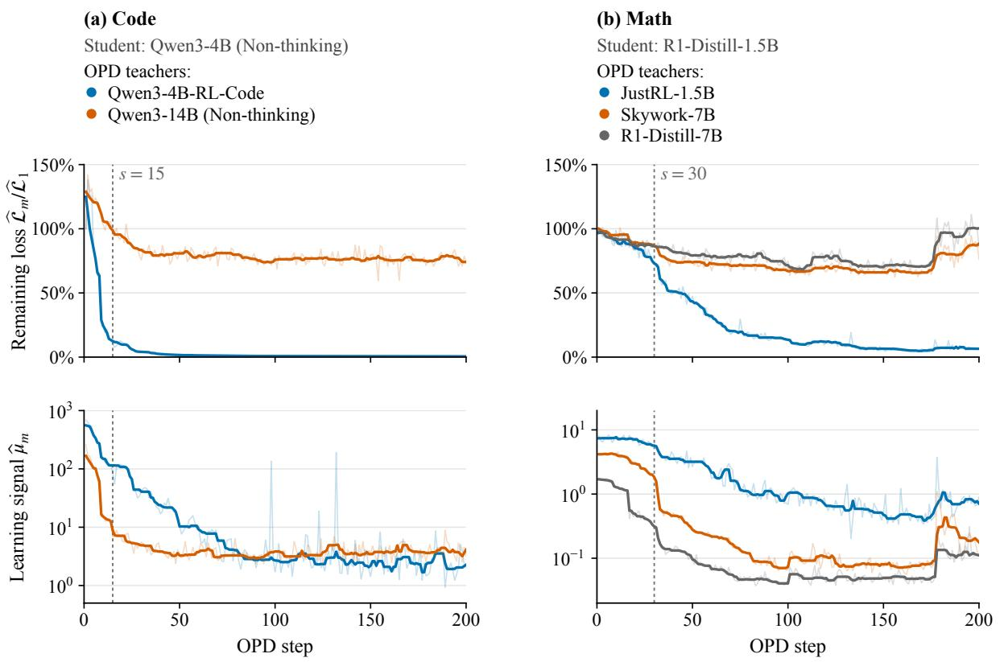  
Figure 3: Learning signal and remaining loss over training steps. Left column: the Code comparison; right column: the Math comparison. Top: remaining OPD loss $\widehat { \mathcal { L } } _ { m } / \widehat { \mathcal { L } } _ { 1 }$ . Bottom: learning signal $\widehat { \mu } _ { m }$ on a log scale. Both settings cover all 200 updates. Lines are centered 9-step rolling medians of the per-step values, which are drawn faintly behind them. The dotted vertical line marks the split step s of Table E.3.

Table E.3: Learning signal $\widehat { \mu } _ { m }$ around a split step s. For each run of Figure 3 we report the median learning signal $\widehat { \mu } _ { m }$ before the split step s (steps 1 to s), in the 30 steps after s, and in the last 50 steps of the run; the drop is the ratio of the first two; loss left is the smoothed remaining loss $\widehat { \mathcal { L } } _ { m } / \widehat { \mathcal { L } } _ { 1 }$ at step s. Here s = 15 for Code and s = 30 for Math. † marks self-RL teachers.
<table><tr><td>Teacher</td><td>Before s After s</td><td></td><td>Drop</td><td></td><td>Loss left at s Last 50 steps</td></tr><tr><td>Code, s = 15</td><td></td><td></td><td></td><td></td><td></td></tr><tr><td>Qwen3-4B-RL-Code†</td><td>272</td><td>40.9</td><td>6.7×</td><td>12.6%</td><td>2.37</td></tr><tr><td>Qwen3-14B</td><td>60.7</td><td>5.05</td><td>12.0×</td><td>98.8%</td><td>3.78</td></tr><tr><td>Math, s = 30</td><td></td><td></td><td></td><td></td><td></td></tr><tr><td>JustRL-1.5B†</td><td>7.11</td><td>3.37</td><td>2×</td><td>73.0%</td><td>0.56</td></tr><tr><td>Skywork-7B</td><td>3.73</td><td>0.38</td><td>10×</td><td>86.5%</td><td>0.090</td></tr><tr><td>R1-Distill-7B</td><td>1.14</td><td>0.121</td><td>9×</td><td>86.5%</td><td>0.056</td></tr></table>

Cross-fitted estimator of α. At each checkpoint m of Section 5.2, the eight rollouts per prompt are split into two folds. Let $g _ { m } ^ { ( 0 ) }$ and $g _ { m } ^ { ( 1 ) }$ be the detached top-16 loss gradients estimated from the two folds, and $h _ { m } ^ { ( 0 ) }$ and $h _ { m } ^ { ( 1 ) }$ the likelihood-ratio estimates of the occupancy gradient, each using the opposite fold to construct its per-prompt baseline. The estimators are

$$
\begin{array} { r } { \widehat { g } _ { m } ^ { 2 } : = \Bigl \langle g _ { m } ^ { ( 0 ) } , g _ { m } ^ { ( 1 ) } \Bigr \rangle , \qquad \widehat { X } _ { m } : = \frac { 1 } { 2 } \bigl ( \Bigl \langle h _ { m } ^ { ( 0 ) } , g _ { m } ^ { ( 1 ) } \Bigr \rangle + \Bigl \langle h _ { m } ^ { ( 1 ) } , g _ { m } ^ { ( 0 ) } \Bigr \rangle \bigr ) , \qquad \widehat { \alpha } _ { m } : = \widehat { X } _ { m } / \widehat { g } _ { m } ^ { 2 } . } \end{array}\tag{E.1}
$$

Conditional on the sampled prompts, the rollout folds are independent. Their cross-product removes the same-fold rollout-noise bias from $\widehat { g } _ { m } ^ { 2 }$ , but not uncertainty from prompt sampling. The baseline from the opposite fold does not bias $\dot { X _ { m } }$ . Code uses 16 prompts and Math 64 prompts per checkpoint; Table 3 uses all 20 diagnostic checkpoints at steps 10, 20, . . . , 200 in both settings. The Code learning-signal curves use all 200 updates of the same runs as Figure 1: the completed Qwen3-4B-RL-Code reproduction and the original Qwen3-14B run. The Qwen3-14B occupancy statistics use all 20 checkpoints of that original run.

Metric reporting. Accuracy gain and teacher–student gap recovery follow the definitions in Section 4.2. Loss minima in Table 2 use raw updates 1–200 and need not be sustained. For the five larger-scale runs and two self-RL runs, mean maximum reductions are 41.6% and 97.9%, respectively; mean final reductions $( 1 - \widehat { \mathcal { L } } _ { 2 0 0 } / \widehat { \mathcal { L } } _ { 1 } ) \times 1 0 0 \%$ are 25.1% and 96.2%.

Comparison scope. All seven main comparisons in Figure 1 and Table 2 use 200 training updates. For Code/Qwen3-4B, the Qwen3-4B-RL-Code curve comes from an independent reproduction on two H200 GPUs, with the same OPD hyperparameters and native checkpoint resumes. It replaces the earlier run that stopped at update 149; the two runs are not concatenated. Qwen3-14B uses its complete original 200-update run. Code accuracy uses four responses per problem, including the fixed-seed subsampling described above. Validation is recorded at steps 0, 10, . . . , 200 for the Qwen3-4B-RL-Code reproduction and the two Math/Qwen3-1.7B runs. The Qwen3-14B and three Math/R1-Distill-1.5B runs originally begin validation at step 10. We supplement their curves with evaluations of the same initial student under the corresponding validation protocol: Code shares the step 0 evaluation from the Qwen3-4B-RL-Code reproduction, and R1-Distill-1.5B shares a before-training evaluation from a separate full-logit OPD run with JustRL-1.5B. These are shared measurements of the initial model, not additional evaluations within each training run. The two Math/Qwen3-1.7B curves retain their own before-training evaluations of the same base checkpoint; their step 0 estimates difer slightly because of sampling. In all seven comparisons, accuracy gains and gap recovery use the base student model at step 0 as $\mathrm { A c c } _ { \mathrm { s t a r t } }$ . The loss and validation panels within each group both extend to step 200. Each panel uses a linear scale that contains all its plotted observations. Validation accuracy and loss use column-specific vertical limits, so their absolute magnitudes are compared within the corresponding student/task group. Each teacher condition comprises one training run; the curves therefore do not provide repeated-seed uncertainty estimates.

Additional completed Qwen-math comparisons. Table E.4 includes the two main top-16 runs, two full-logit runs with one training rollout per prompt, and a top-16 run with eight training rollouts per prompt for the Qwen3-4B teacher. All rows use the Qwen-math training and validation limits described above. The full-logit runs replace top-16 support with all 151,936 student vocabulary entries. Each loss reduction is computed using that run’s own objective at updates 1 and 200; top-16 and full-logit loss magnitudes are not identical objectives. With full logits, Qwen3-4B-RL-Math yields a 25.81-point accuracy gain and a 54.85% loss reduction, while Qwen3-4B yields a 1.22-point gain and an 11.60% loss reduction. The teacher ordering observed with top-16 OPD therefore also appears with full logits in these runs. For the Qwen3-4B teacher, the eight-rollout run gains 3.02 accuracy points and reduces its loss by 9.89%. This additional single run does not establish a general efect of rollout count across teachers. The additional runs are excluded from the seven-run averages in Section 4.3.

Table E.4: Completed 200-update Qwen3-1.7B (Non-thinking) math runs. n is the number of training rollouts per prompt; validation always uses eight responses per problem. Accuracies are percentages and gain is in percentage points. Final loss reduction is $( 1 - \widehat { \mathcal { L } } _ { 2 0 0 } / \widehat { \mathcal { L } } _ { 1 } ) \times 1 0 0 \%$ , using each run’s own objective. Each row is one training run.
<table><tr><td colspan="7"></td></tr><tr><td>Teacher</td><td>Support</td><td>n</td><td>Acc0</td><td> $\mathrm { A c c _ { 2 0 0 } }$ </td><td>Gain</td><td>Final loss reduction</td></tr><tr><td>Qwen3-4B-RL-Math</td><td>Top-16</td><td>1</td><td>21.10</td><td>43.94</td><td>22.83</td><td>55.37%</td></tr><tr><td>Qwen3-4B (Non-thinking)</td><td>Top-16</td><td>1</td><td>20.66</td><td>22.74</td><td>2.07</td><td>6.24%</td></tr><tr><td>Qwen3-4B-RL-Math</td><td>Full logits</td><td></td><td>20.55</td><td>46.36</td><td>25.81</td><td>54.85%</td></tr><tr><td>Qwen3-4B (Non-thinking)</td><td>Full logits</td><td>1</td><td>21.66</td><td>22.88</td><td>1.22</td><td>11.60%</td></tr><tr><td>Qwen3-4B (Non-thinking)</td><td>Top-16</td><td>8</td><td>21.85</td><td>24.87</td><td>3.02</td><td>9.89%</td></tr></table>

Scope of the additional experiments. The seven main OPD runs are supplemented by eight Math runs that vary vocabulary support or the number of training rollouts (Appendix H.2). Three of these eight runs already appear in Table E.4; they are not additional replications. Appendix H.1 reports four SFT runs and two subsequent OPD runs initialized from SFT checkpoints. Appendix G reports two instruction-following OPD runs. These comparisons use the specified single-run configurations; they do not constitute repeated-seed estimates. Checkpoint diagnostics and standalone model evaluations are reported separately from training runs.

## E.1 Additional Training-Dynamics Diagnostics

Gradient norms and clipping. Figure 4 separates the gradient norm from the loss-normalized learning signal in Figure 3. We use the logged pre-clipping norm at each of the 200 optimizer updates. The norm exceeds the clipping threshold of 1 at 24 updates with Qwen3-4B-RL-Code, 64 with Qwen3-14B, 56 with JustRL-1.5B, 22 with Skywork-7B, and none with R1-Distill-7B. These counts describe when clipping is active; they do not identify the efective AdamW update, which also depends on the optimizer’s moment estimates and weight decay. Accordingly, the ratio $\widehat { \mu } _ { m } = \widehat { G } _ { m } ^ { 2 } / ( 2 \widehat { \mathcal { L } } _ { m } )$ is an empirical diagnostic rather than a direct measurement of the population continuous-time loss derivative. A small gradient norm alone does not distinguish successful matching from a plateau; the remaining loss must also be considered. All recorded losses in these five diagnostic runs are positive. The truncated objective is not a nonnegative full-vocabulary KL in general; Appendix G reports a run in which it becomes negative and does not interpret the corresponding ratio as a loss-decay rate.

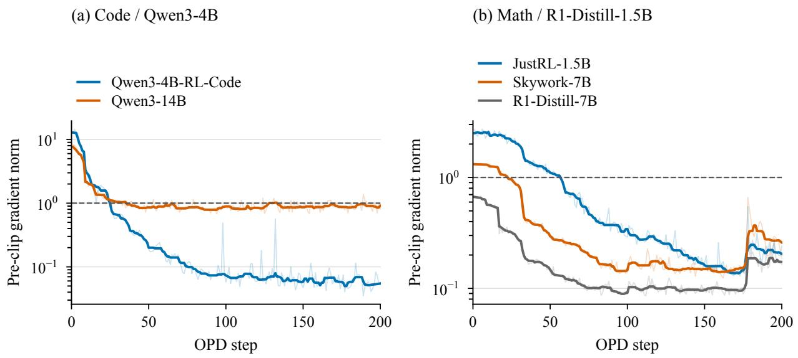  
Figure 4: Pre-clipping gradient norms in the five runs used for the learning-signal analysis. Curves use a logarithmic vertical axis. Solid lines are centered 9-step rolling medians; faint lines show all 200 recorded values. The dashed line marks the clipping threshold of 1. These are norms of the training gradients, not norms of the AdamW parameter updates.

Diagnostic sampling. The occupancy measurements are separate evaluations of saved checkpoints, not additional training runs. The prompt subset is fixed across the 20 checkpoints at steps 10, 20, . . . , 200, with eight sampled responses per prompt at each checkpoint. The Code subset contains 16 Eurus coding prompts; the Math subset contains the first 64 DAPO-Math-17K prompts after deterministic overlength filtering, without shufling. The Math diagnostic uses sampling seed 42 and FP32 model computations. Table E.5 summarizes the sampling budget. Four responses per prompt enter each fold of Eq (E.1); the opposite fold supplies the per-prompt baseline for the occupancy gradient.

Occupancy factor over training. Figure 5 shows every measured $1 + \widehat { \alpha } _ { m }$ , including the self-RL teacher JustRL-1.5B as a reference. All 80 cross-fold estimates of $\widehat { g } _ { m } ^ { 2 }$ are positive, so no checkpoint is removed on account of a nonpositive denominator. For the larger-scale teachers, $1 + \widehat { \alpha } _ { m }$ is positive at 19/20 checkpoints with Qwen3-14B, 12/20 with Skywork-7B, and 13/20 with R1-Distill-7B, reproducing Table 3. It is also positive at 13/20 checkpoints with JustRL-1.5B. The checkpoint estimates fluctuate and can become negative even in the self-RL run. They therefore do not establish the sign of the population loss derivative at every update. In particular, these finite-sample ratios should not be read as confidence intervals or as deterministic predictions of the subsequent AdamW trajectory. Their role is to test whether persistent occupancy cancellation is shared by the observed plateaus.

Table E.5: Sampling settings for checkpoint-level occupancy diagnostics. These rollout counts difer from the one-rollout training setting.
<table><tr><td>Setting</td><td>Code</td><td>Math</td></tr><tr><td>Student</td><td>Qwen3-4B</td><td>R1-Distill-1.5B</td></tr><tr><td>Prompt source</td><td></td><td>Eurus code DAPO-Math-17K</td></tr><tr><td>Prompts per checkpoint</td><td>16</td><td>64</td></tr><tr><td>Responses per prompt</td><td>8</td><td>8</td></tr><tr><td>Responses per fold</td><td>64</td><td>256</td></tr><tr><td>Maximum response length</td><td>16,384</td><td>21,000</td></tr><tr><td>Student vocabulary support</td><td>Top 16</td><td>Top 16</td></tr><tr><td>Checkpoints per teacher</td><td>20</td><td>20</td></tr></table>

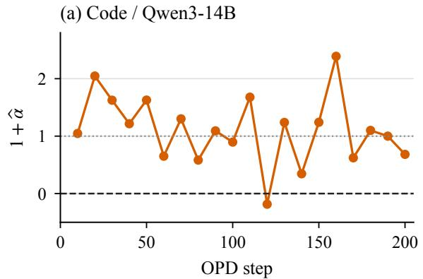

(b) Math / JustRL-1.5B  
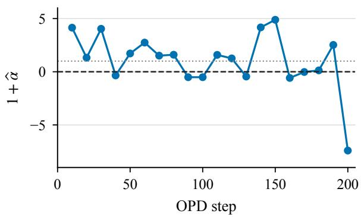

(c) Math / Skywork-7B  
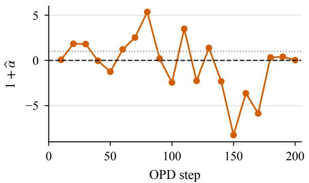

(d) Math / R1-Distill-7B  
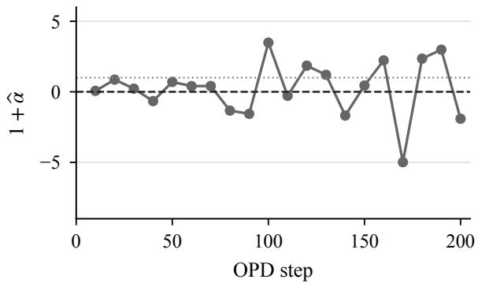  
Figure 5: Checkpoint-level occupancy factor $1 + \widehat { \alpha } _ { m }$ . Each point is one cross-fitted estimate, and lines connect consecutive checkpoints without smoothing. The dashed line is zero, the cancellation threshold of the idealized flow; the dotted line is one, corresponding to zero occupancy contribution. The Code panel uses a diferent vertical range from the three Math panels. No confidence intervals are implied.

## F Parameter and Representation Measurement Details

Checkpoint scope and parameter statistics. The eight OPD endpoints in Table 4 are fullparameter, student-top-16 reverse-OPD checkpoints at step 200. The three R1-Distill-1.5B runs use the same clean single-rollout runs as Figure 1: JustRL-1.5B, Skywork-7B, and R1-Distill-7B. The Qwen3-4B endpoints use Qwen3-14B Non-thinking and Qwen3-4B-RL-Code on Code. The Qwen3-4B-RL-Code endpoint comes from a 200-step reproduction on two H200 GPUs; the original run stopped at update 149. The two Qwen3-1.7B endpoints come from the Math runs of Figure 1, with teachers Qwen3-4B-RL-Math and Qwen3-4B. The IF endpoint comes from the supplementary run of Appendix G with the self-RL teacher UltraData-IF-1.5B. All parameter statistics compare exported model checkpoints, compute tensor diferences in FP32, and count tied embedding/head weights once. The global displacement aggregates the squared diferences and squared starting weights before taking their ratio and square root; it is not an unweighted average of per-layer relative changes.

Teacher–student parameter distance. The Teacher columns of Table 4 report the relative parameter distance $\lVert \theta _ { T } - \theta _ { 0 } \rVert _ { 2 } / \lVert \theta _ { 0 } \rVert _ { 2 }$ between each self-RL teacher and its student, which Section 5.3 uses. We compute it with the same protocol as $d _ { \mathrm { p a r } }$ above, comparing the released teacher checkpoint with the student checkpoint used in our runs. Most parameter entries are identical in BF16, namely 87.7% for Qwen3-4B-RL-Code, 34.4% for JustRL-1.5B and 83.4% for UltraData-IF-1.5B. In the JustRL-1.5B run, the OPD student moves by only 0.098%, much less than the teacher’s distance of 0.50%. OPD thus reduces the loss to 3.7% of its starting value without moving the student to the teacher’s parameters.

Representation extraction and CKA. Each checkpoint pair uses identical tokenizer vocabulary and prompt token IDs. The Math bank contains AIME24 (30 prompts), AIME25 (30), and AMC23 (83); the Code bank contains HumanEval+ (164), MBPP+ (378), and LiveCodeBench (131). A BF16 forward pass is performed separately for each prompt, without response generation. At each hidden-state index, token states are mean-pooled and stored in FP32. For the resulting representation matrices X and Y , centered across prompts, we compute

$$
\operatorname { C K A } ( X , Y ) = { \frac { \left\| Y ^ { \top } X \right\| _ { F } ^ { 2 } } { \left\| X ^ { \top } X \right\| _ { F } \left\| Y ^ { \top } Y \right\| _ { F } } }\tag{F.1}
$$

using FP64 accumulation (Kornblith et al., 2019). The Teacher columns of Table 4 use the same protocol and the prompt bank of the corresponding base model, so UltraData-IF-1.5B is also compared on the Math bank. The IF endpoint is likewise compared on the R1-Distill-1.5B Math bank. The Qwen3-1.7B endpoints use the Qwen3 Math bank, since Qwen3-1.7B and Qwen3-4B share the same tokenizer. The node that holds the Qwen3-4B-RL-Math endpoint had no free GPU, so its CKA is computed on CPU with standard attention instead of FlashAttention. On the Qwen3-4B endpoint, the two implementations difer by at most $3 \times 1 0 ^ { - 4 }$ in layerwise CKA. The figures report full-bank estimates. Existing stability checks use 20 bootstrap resamples, each drawing 100 prompts from the pooled bank; they quantify prompt-resampling variation rather than training-seed uncertainty. Subset variation is appreciable in Code: the minimum CKA is 0.9587 on HumanEval+, 0.9940 on MBPP+, and 0.8808 on LiveCodeBench. The LiveCodeBench minimum has bootstrap standard deviation 0.0459, so the pooled and subset estimates should be interpreted at their respective levels of aggregation. High CKA concerns the geometry of the pooled prompt representations rather than equality of individual activations, since CKA is invariant to orthogonal transformations and isotropic scaling (Kornblith et al., 2019). It also does not establish a fixed neural tangent kernel, whose use for language-model fine-tuning requires additional conditions (Malladi et al., 2023).

Layerwise profiles. Figure 6 expands the minimum-CKA summary in Table 4 into the complete layerwise profiles. Panels (a)–(c) contain the same eight step-200 OPD endpoints, and panel (d) compares the three self-RL teachers with their respective initial students. The horizontal coordinate divides the hidden-state index by its maximum, including the embedding and final normalized states. Qwen3-4B provides 37 hidden-state entries and the two smaller student architectures provide 29. We use the same pooled prompt banks and checkpoint comparisons described above, without smoothing or resampling the measured hidden-state indices.

The plots expose changes that a single minimum cannot localize: for example, the minimum CKA of the Qwen3-14B Code run is 0.9850, whereas the Qwen3-4B-RL-Code OPD endpoint stays above 0.9978. The self-RL teacher JustRL-1.5B reaches a minimum of 0.9674 relative to its initial student, while its OPD endpoint has minimum 0.9904. These are endpoint comparisons, not a time series of representation learning, and high CKA does not show that the teacher’s behavior has been reproduced.

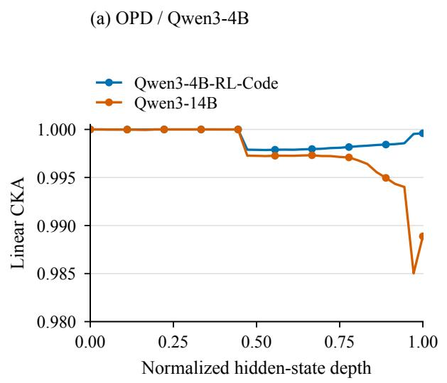

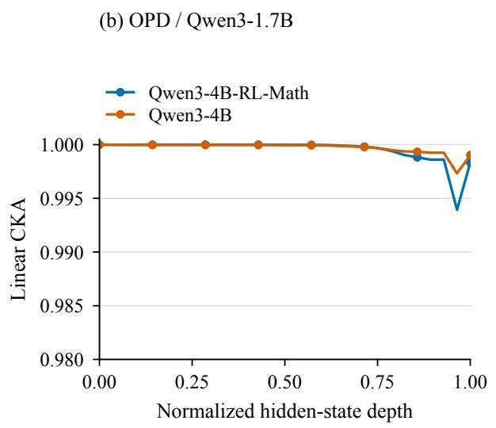

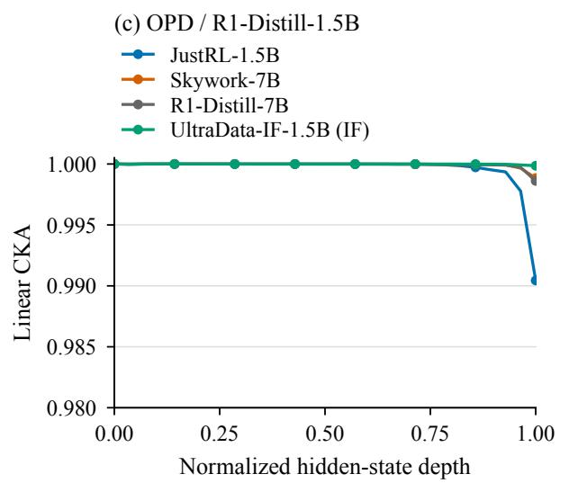

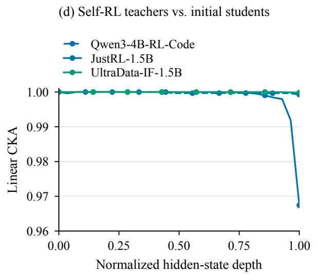  
Figure 6: Layerwise linear CKA for the checkpoints in Table 4. Panels (a)–(c) compare each OPD student after 200 updates with its initialization; the legend names the teacher. Panel (d) compares self-RL teachers with their initial students, using a wider vertical range. All R1-Distill 1.5B comparisons, including the IF endpoint and UltraData-IF teacher, use the same pooled Math prompt bank. Lines connect measured hidden-state entries; markers are placed every four entries for readability.

## G OPD on Instruction Following

Models and data. We compare two teachers for R1-Distill-1.5B: the self-RL teacher UltraData-IF-1.5B, obtained by further RL training of the student on instruction-following data (Fu et al., 2026b), and the larger R1-Distill-7B. The former is the instruction-following pair included in Table 4; the latter is an additional comparison reported here. Both OPD runs use the first-turn prompts of all 4,501 conversations in Multi-IF (He et al., 2024). All prompts remain after the 4,096-token length filter. Evaluation uses the 4,445 conversations with all three turns: 896 English, 518 French, 529 Hindi, 515 Russian, 454 Chinese, 493 Italian, 524 Portuguese, and 516 Spanish conversations. All evaluation conversations’ first-turn prompts occur in the training set. These results measure transfer on overlapping inputs, not held-out generalization; later-turn prompts are not used for OPD training.

Training. Both runs start from the same base checkpoint and use the settings in Table G.1. They use the student’s top-16 tokens with renormalized student weights and the original teacher–student log-ratio, as in Eq (3.2), averaged over valid response tokens. The instruction-checking reward is logged as a diagnostic and is not mixed into the distillation update. Each training update uses 64 prompts and eight rollouts per prompt, so the optimizer processes 512 responses in one update. The separate three-turn evaluation uses one response per turn.

Table G.1: Shared configuration of the two instruction-following OPD runs. Both runs use fullparameter updates on two H200 GPUs.
<table><tr><td>Setting</td><td>Value</td></tr><tr><td>Optimizer</td><td>AdamW, β = (0.9, 0.999)</td></tr><tr><td>Learning rate / schedule</td><td> $1 0 ^ { - 6 } ~ /$  constant, no warmup</td></tr><tr><td>Weight decay / gradient clip</td><td>0.01 / l2 norm 1</td></tr><tr><td>Prompt batch / configured minibatch (prompts) 64 / 64</td><td></td></tr><tr><td>Rollouts per prompt / optimization epochs</td><td>8/1</td></tr><tr><td>Training temperature / top-p</td><td>1/1</td></tr><tr><td>Teacher temperature</td><td>1</td></tr><tr><td>Maximum prompt / response tokens</td><td>4,096 / 7,168</td></tr><tr><td>Prompt order</td><td>Fixed, no shuffling</td></tr><tr><td>Updates / checkpoint interval</td><td>200 / 10</td></tr><tr><td>Evaluation responses per turn</td><td>1 (seed 0)</td></tr><tr><td>Evaluation temperature / top-p</td><td>0.6 / 0.95</td></tr><tr><td>Maximum evaluation response / context</td><td>16,384 / 32,768 tokens</td></tr></table>

Evaluation and score aggregation. We evaluate the base student, both standalone teachers, and every tenth OPD checkpoint on the same three-turn conversations. Each subsequent turn includes the model’s preceding answers with completed reasoning blocks removed; scoring also uses the text after the final </think> tag when present. Responses without this closing tag are scored as

generated. Overlong dialogue contexts receive an empty response rather than a truncated history.   
Responses that reach the output limit are retained for scoring.

For each language and turn, the Multi-IF instruction checkers provide four rates: strict and loose prompt-level success, and strict and loose instruction-level success. Prompt-level success requires all instructions to pass; instruction-level success divides the total passed instructions by the total number of instructions. Loose checks additionally allow variants removing boundary lines or asterisks. The reported three-turn composite score is the unweighted mean of these four rates over all eight languages and all three turns, expressed as a percentage. Thus, it averages 96 language–turn–metric rates rather than pooling conversations across languages. This is a composite benchmark score, not a single accuracy rate or an avg@8 estimate. Gain is the change from the common base-student score at step 0; gap recovery divides this gain by the corresponding teacher–base score gap. The configured single-turn diagnostic validation loop is disabled; all reported evaluation scores come from this separate three-turn protocol.

Table G.2: Instruction-following outcomes after 200 OPD updates. Top: raw signed top-16 objective at update 1, its minimum over updates 1–200, and its final value. Bottom: three-turn composite scores (%), gain from the shared base student (pp), and score-gap recovery (%). † marks the self-RL teacher.
<table><tr><td colspan="2">Teacher</td><td colspan="2">Initial objective</td><td colspan="2">Minimum</td><td colspan="2">Final</td></tr><tr><td colspan="3">UltraData-IF-1.5B† R1-Distill-7B</td><td colspan="2">0.00852 0.78025</td><td colspan="2">-0.00134 0.09804</td><td colspan="2">0.00124 0.11119</td></tr><tr><td></td><td></td><td></td><td></td><td></td><td colspan="2"></td><td colspan="2"></td></tr><tr><td>Teacher</td><td></td><td>Base</td><td>OPD</td><td>Teacher score</td><td></td><td colspan="2">Gain</td><td>Recovery</td></tr><tr><td>UltraData-IF-1.5B†</td><td></td><td>30.97%</td><td>40.86%</td><td colspan="2">41.38%</td><td colspan="2">+9.88</td><td>95.0%</td></tr><tr><td>R1-Distill-7B</td><td>30.97%</td><td>27.43%</td><td colspan="2"></td><td colspan="2">47.72% -3.54</td><td colspan="2">-21.2%</td></tr></table>

Results and interpretation. With the self-RL teacher, the three-turn composite score rises from 30.97 at initialization to 40.86 at update 200, compared with the teacher’s 41.38, closing 95.0% of the score gap. With R1-Distill-7B, the score falls to 27.43 despite the teacher’s stronger standalone score of 47.72 and a substantial decrease in the logged objective (Table G.2, Figure 7). The third-turn composite score follows the same pattern: 22.31 initially, 29.02 with UltraData-IF-1.5B, and 17.62 with R1-Distill-7B; the teachers score 29.45 and 35.84, respectively.

The top-16 surrogate in Eq (3.2) need not be nonnegative: its weights are renormalized on the retained support, but its log-ratio uses the original distributions. The UltraData run has four negative observations, with minimum −0.00134 at update 111. We therefore report its raw objective values rather than interpreting a percentage reduction above 100% as recovery of the full-vocabulary KL. The two runs illustrate that reducing this surrogate does not by itself ensure improvement in instruction following. Each curve is a single training run with one sampled dialogue per evaluation conversation, and the overlapping training and evaluation inputs limit conclusions about generalization.

$$
\begin{array} { r l } & { \mathrm { S t u d e n t : ~ R 1 \mathrm { - } D i s t i l l - 1 . 5 B } } \\ & { \mathrm { O p D ~ t e a c h e r s : } } \\ & { \bullet \quad \mathrm { U l t r a D a t a \mathrm { - } I F \mathrm { - } 1 . 5 B ~ ( s e l f \mathrm { - } R L ) } \qquad \bullet \quad \mathrm { R 1 \mathrm { - } D i s t i l l - 7 B } } \end{array}
$$

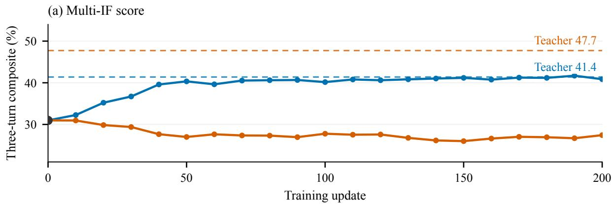

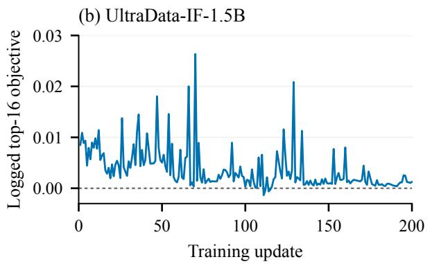

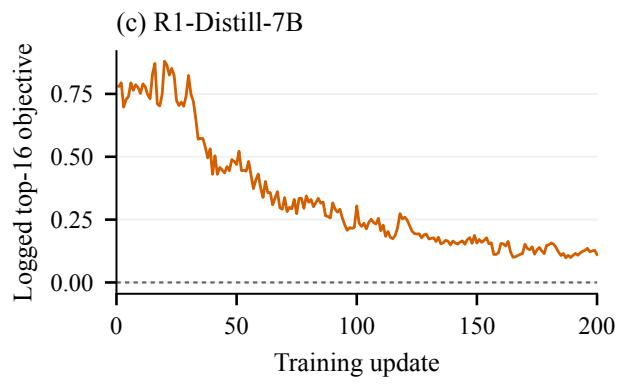  
Figure 7: Instruction-following dynamics over 200 updates. (a) Three-turn composite scores; the black point is the shared initial student, and dashed lines are the corresponding standalone teachers. $^ { ( \mathrm { b , c } ) }$ Raw signed top-16 objectives, without smoothing, on separate linear axes that include zero. Colors identify the teacher used for OPD.

## H Ablations

## H.1 SFT on Teacher Responses and Subsequent OPD

We evaluate SFT for four Math student–teacher pairs from Table 1: R1-Distill-1.5B learns from JustRL-1.5B or R1-Distill-7B, and Qwen3-1.7B (Non-thinking) learns from Qwen3-4B-RL-Math or Qwen3-4B (Non-thinking). We then continue OPD for 200 updates from the final SFT checkpoints associated with R1-Distill-7B and Qwen3-4B (Non-thinking), using the same respective teachers. Each setting is one training run. The Qwen3-4B-RL-Math teacher is its RL update-500 checkpoint. SFT, direct OPD, and SFT→OPD have diferent training budgets; the last includes the entire SFT stage before its 200 OPD updates.

Teacher-response collection. We use the project’s DAPO-Math-17K training file, containing 17,917 rows and 17,398 distinct question texts. We preserve each question body, replace the source file’s answer-format instructions with Please reason step by step, and put your final answer within \boxed{}., and apply the teacher’s chat template. Each teacher contributes 20,000 accepted responses. Since there are fewer than 20,000 distinct questions, collection traverses deterministically shufled cycles of the source rows, with shufle seed 42 + cycle and fresh generations on repeated questions. The candidate pool contains four cycles (71,668 slots). We draw one response per attempt, retry a candidate slot at most three times, and continue through the candidate pool until the accepted-response quota is reached.

Teacher generation uses temperature 0.7, top-p 0.95, no top-k truncation, repetition penalty 1, a 12,288-token response cap, and a 32,768-token context limit. Two vLLM workers use seeds 42 and 43, with generation batches of 128. The Qwen teachers generate in non-thinking mode; the R1 teachers retain their reasoning traces. We require the output to contain the \boxed marker and terminate normally, reject detected repetitive text, and additionally require a closing </think> tag for R1 responses. The repetition filters detect a stripped line of at least 20 characters appearing five times, a 100-character substring appearing three times when sampled every ten characters, or three consecutive repetitions of a 50-character block for outputs longer than 5,000 characters. We do not filter for answer correctness. A final student-tokenization check rejects examples longer than 14,336 tokens including prompt and response; all accepted examples fit this limit, so the admitted targets need not be truncated.

Table H.1: SFT response collection and row-split overlap. Every teacher supplies 20,000 accepted responses, split into 19,000 training and 1,000 held-out rows. Distinct questions counts the accepted pool. Shared held-out rows counts held-out examples whose question text also appears in the training split.
<table><tr><td>Teacher</td><td></td><td>Attempts Distinct questions Shared held-out rows</td></tr><tr><td>JustRL-1.5B</td><td>27,706</td><td>16,401</td></tr><tr><td>R1-Distill-7B</td><td>30,565</td><td>15,855</td></tr><tr><td>Qwen3-4B-RL-Math</td><td>32,034</td><td>15,481</td></tr><tr><td>Qwen3-4B (Non-thinking)</td><td>22,931</td><td>17,123</td></tr></table>

SFT objective and implementation. We perform full-parameter SFT with LLaMA-Factory, using cross-entropy on the teacher response and masking prompt and padding tokens. We use source revision ac26e38 of LLaMA-Factory. Sequence packing and label smoothing are disabled. The recorded templates are deepseekr1 for R1 and qwen3 for Qwen, with enable\_thinking=True in the SFT preprocessing configuration. For R1, a missing opening <think> tag is restored before training, preserving the generated reasoning and answer. For Qwen, the reasoning template prepends empty thinking tags to a response that has neither thinking tag; those tags are included in the supervised target. This preprocessing flag is distinct from the non-thinking teacher-generation and Qwen benchmark settings.

We use BF16 training, DeepSpeed ZeRO-2, FlashAttention-2, the Liger kernel, and gradient checkpointing on two H200 GPUs. Table H.2 gives the optimization settings. The response rows are split with seed 42 before preprocessing and shufled during SFT. This is a row-level split: repeated questions can occur on both sides (Table H.1). Consequently, held-out cross-entropy is a diagnostic of fitting these teacher responses, not an independent test of mathematical generalization. We measure mathematical capability separately on the benchmarks below.

Table H.2: Optimization settings for all four SFT runs and the two subsequent OPD runs. OPD response limits difer by student; the other listed settings are shared within each stage.
<table><tr><td>Setting</td><td>SFT</td><td>Subsequent OPD</td></tr><tr><td>Training examples</td><td>19,000 response rows</td><td>DAPO training prompts</td></tr><tr><td>Optimizer updates</td><td>297 (one epoch)</td><td>200</td></tr><tr><td>Global batch</td><td>64 examples</td><td>64 prompts, one rollout each</td></tr><tr><td>Per-GPU SFT batch</td><td>8, accumulated 4 times</td><td>Dynamic token batching</td></tr><tr><td>Trainable weights</td><td>All</td><td>All</td></tr><tr><td>Optimizer</td><td>Fused AdamW</td><td>AdamW</td></tr><tr><td>Learning rate</td><td>Peak 10−5</td><td>Constant 10-6</td></tr><tr><td>Schedule / warmup</td><td>Cosine / 5%</td><td>Constant / none</td></tr><tr><td>Adam (β1, β2) Adam €</td><td>(0.9,0.999) 10-8</td><td>(0.9,0.999) Library default (not</td></tr><tr><td></td><td></td><td>explicitly set)</td></tr><tr><td>Weight decay</td><td>0</td><td>0.01</td></tr><tr><td>Gradient clipping norm Prompt + response limit 14,336 tokens total</td><td>1</td><td>1 1,024 prompt tokens;</td></tr><tr><td></td><td></td><td>21,000 response tokens (R1), 7,168 (Qwen)</td></tr><tr><td>Random / data seed</td><td>42 /  42</td><td>Not explicitly set in saved configuration</td></tr><tr><td>Loss recording</td><td>Every 5 updates</td><td>Every update</td></tr><tr><td>Evaluation during training</td><td>g Row-heldout CE at 100, Math benchmarks at 200, 297</td><td>0, 10, . . . , 200</td></tr></table>

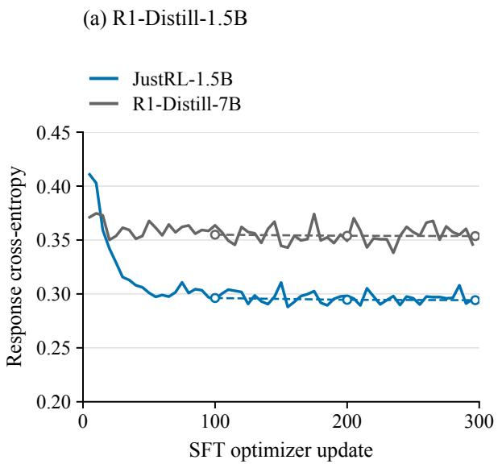

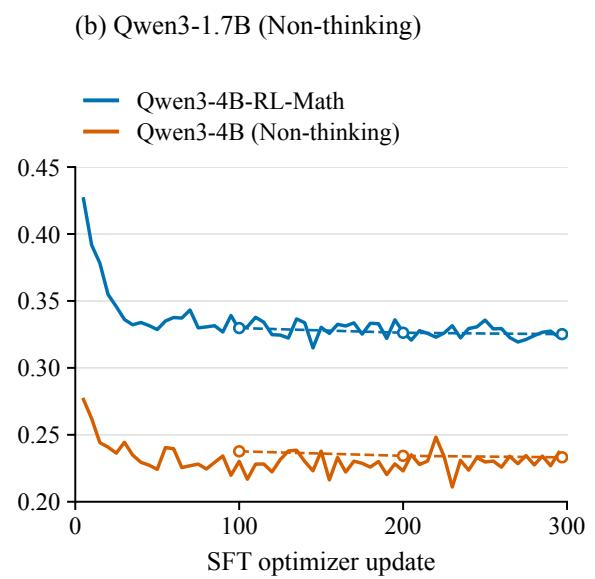  
Figure 8: SFT loss dynamics for all four teacher-response datasets. Solid lines join recorded training cross-entropies at updates 5, 10, . . . , 295; no update-0 loss is available. Dashed lines and hollow circles mark held-out response-row cross-entropy at updates 100, 200, and 297. The held-out split has question overlap with training and is not a mathematical benchmark. Colors identify teachers as in Figure 1. Each teacher contributes one run; no averaging across seeds is shown.

SFT loss dynamics. Figure 8 shows all four runs. The first logged training losses at update 5 are 0.4108, 0.3711, 0.4262, and 0.2764 for JustRL-1.5B, R1-Distill-7B, Qwen3-4B-RL-Math, and Qwen3-4B (Non-thinking), respectively. The last logged training losses, at update 295, are 0.2951, 0.3459, 0.3229, and 0.2368. Training finishes at update 297; the corresponding final held-out losses are 0.2942, 0.3537, 0.3252, and 0.2332. These cross-entropies concern diferent teacher-response datasets and are not the OPD objective. The final checkpoint is used for benchmarking and, where applicable, subsequent OPD; checkpoints are not selected by benchmark accuracy.

Mathematical benchmark evaluation. We evaluate each final SFT checkpoint on 30 AIME 2024, 30 AIME 2025, and 83 AMC 2023 problems. We sample eight responses per problem (1,144 responses total), with temperature 0.7, top-p 0.95, and a 31,744-token response cap, 1,024-token prompt limit, and 32,768-token context limit. We score answer correctness and report the unweighted mean of the three benchmark accuracies, using the same avg@8 convention as Section 4.1. R1 evaluation uses vLLM 0.11.0 and the archived R1/Modal benchmark prompts; Qwen uses SGLang, its non-thinking chat template, and the Qwen benchmark prompts. These benchmarks are separate from the 1,000-row SFT loss holdout. No benchmark-accuracy trajectory was recorded during the SFT stage; Figure 8 therefore reports only SFT cross-entropy.

Table H.3: Standalone evaluation of the four final SFT checkpoints. Every entry is a percentage; Mean is the unweighted mean of the three benchmark columns. These are the original SFT evaluations, not the subsequent OPD runs’ independent step-0 evaluations.
<table><tr><td>Teacher</td><td>AIME24 AIME25</td><td></td><td>AMC23</td><td>Mean</td></tr><tr><td>JustRL-1.5B</td><td>46.67%</td><td>35.83%</td><td>79.67%54.06%</td><td></td></tr><tr><td>R1-Distill-7B</td><td>21.67%</td><td>20.42%</td><td>55.57%32.55%</td><td></td></tr><tr><td>Qwen3-4B-RL-Math</td><td>31.25%</td><td>27.92%</td><td>64.01%</td><td>41.06%</td></tr><tr><td>Qwen3-4B (Non-thinking)</td><td>13.33%</td><td>12.92%</td><td>41.42%22.56%</td><td></td></tr></table>

Subsequent OPD. The two continuation runs use the final update-297 SFT models as their students and retain the corresponding teachers. We optimize the student-top-16 reverse-KL surrogate in Eq (3.2), with student-probability weighting and a global mean over valid response tokens. Both student and teacher temperatures are 1; training uses top-p = 1, no top-k sampling truncation, and repetition penalty 1. Each update uses 64 prompts, one student rollout per prompt, and one optimization pass. The training data are not shufled. Optimizer and length settings are listed in Table H.2. Benchmark decoding and aggregation follow the preceding paragraph, with an evaluation before training and every ten updates thereafter.

Both continuation runs use two H200 GPUs. The Qwen continuation uses SGLang, as does its direct-OPD comparison. The R1 continuation uses vLLM 0.11.0 in a diferent runtime from the four-GPU direct-OPD run; the global batch remains 64. Its validation sampling uses vLLM’s PyTorch sampler rather than the original FlashInfer sampler, so the random draws need not coincide. Checkpoints are saved every ten updates, with at most two retained, and the comparison uses the update-200 endpoint. The Qwen log includes an abandoned initial attempt at steps 0 and 1; the completed trajectory supersedes those records. Figures and loss summaries use the last recorded value at each step, yielding one evaluation at each scheduled checkpoint and 200 training-loss observations per continuation.

Separate post-SFT starting evaluations. The continuation runs independently evaluate their SFT starting checkpoints, obtaining 36.57% for R1 and 21.63% for Qwen, compared with the original standalone SFT scores of 32.55% and 22.56%. For Qwen, all 143 rendered inputs and ground truths match the original SFT benchmark in order; the responses are newly sampled. For R1, the archived standalone benchmark asks Let’s think step by step and output the final answer within \boxed{}., whereas the continuation uses Please reason step by step, and put your final answer within \boxed{}. The R1 scores therefore come from diferent prompt formats as well as diferent sampled responses and runtimes. They must not be treated as repeated evaluations under identical conditions or as the base student’s pre-SFT accuracy.

Accuracy comparison. Table H.4 compares the final outcomes. With the three larger-scale teachers tested, SFT alone does no better than direct OPD. For the self-RL teacher JustRL-1.5B, SFT reaches 54.1%, slightly above direct OPD. Continuing OPD after SFT reaches 40.2% with R1-Distill-7B and 22.6% with Qwen3-4B (Non-thinking), compared with 42.7% and 22.7% for direct OPD. Relative to their own post-SFT starting evaluations, the continuations gain 3.60 and 1.01 percentage points. Neither surpasses direct OPD at the final update. These single-run comparisons do not establish statistical significance for the accuracy diferences.

Table H.4: SFT on teacher responses, with and without subsequent OPD. Start is the base student’s step-0 accuracy before either training stage; OPD is its accuracy after 200 direct OPD updates. SFT is the original evaluation of the final SFT checkpoint; SFT→OPD is the accuracy after 200 additional OPD updates. All accuracies are percentages averaged across the three Math benchmarks. A dash indicates an untested setting. † marks the self-RL teacher. Qwen models use non-thinking mode for generation and evaluation.
<table><tr><td>Student</td><td>Teacher</td><td>Start OPD</td><td>SFT SFT→OPD Teacher</td><td></td></tr><tr><td rowspan="2"></td><td>R1-Distill-1.5B JustRL-1.5B†</td><td>39.9 51.9 54.1</td><td></td><td>56.9</td></tr><tr><td>R1-Distill-7B</td><td>39.9 42.7</td><td>32.6 40.2</td><td>57.8</td></tr><tr><td>Qwen3-1.7B</td><td>Qwen3-4B-RL-Math</td><td>21.1 43.9</td><td>41.1</td><td>69.2</td></tr><tr><td></td><td>Qwen3-4B</td><td>20.7 22.7</td><td>22.6 22.6</td><td>35.1</td></tr></table>

OPD loss dynamics after SFT. Figure 9 and Table H.5 show that neither continuation sustains loss reduction toward zero. The maximum observed reductions are 37.1% and 23.0%; the Qwen final loss is above its initial OPD loss. Thus, SFT initialization does not remove the limited loss reduction or the remaining performance gap in these two settings. This finding concerns the tested data, recipe, and budgets, rather than ruling out other SFT initializations.

Table H.5: Loss during the 200 OPD updates following SFT. The initial loss is measured at the first OPD update after SFT. Loss reduction is $( 1 - \widehat { \mathcal { L } } _ { \mathrm { m i n } } / \widehat { \mathcal { L } } _ { \mathrm { s t a r t } } ) \times 1 0 0 \%$ , computed from unrounded, unsmoothed losses.
<table><tr><td>Teacher</td><td> $\widehat { \mathcal { L } } _ { \mathrm { s t a r t } }$ </td><td> $\widehat { \mathcal { L } } _ { \mathrm { m i n } }$ </td><td> $\widehat { \mathcal { L } } _ { \mathrm { e n d } }$ </td><td>Loss reduction</td></tr><tr><td>R1-Distill-7B</td><td>0.1461</td><td>0.0919</td><td>0.1232</td><td>37.1%</td></tr><tr><td>Qwen3-4B (Non-thinking)</td><td>0.0805</td><td>0.0620</td><td>0.0861</td><td>23.0%</td></tr></table>

## H.2 Vocabulary support and training rollouts

We compare the main top-16, one-rollout configuration with full-logit OPD at one rollout per prompt and top-16 OPD at eight rollouts per prompt. These comparisons cover Qwen3-1.7B with Qwen3-4B-RL-Math and Qwen3-4B, and R1-Distill-1.5B with JustRL-1.5B and R1-Distill-7B. Table H.6 reports all twelve conditions: four main-run baselines and eight additional completed runs. The two Qwen full-logit runs and the Qwen3-4B eight-rollout run are the same runs already reported in Table E.4, not additional replications. JustRL-1.5B is a self-RL teacher for R1-Distill-1.5B; Qwen3-4B-RL-Math is an RL-trained larger model relative to Qwen3-1.7B.

Data and optimization. All additional runs use the same DAPO-Math-17K training file as their corresponding baselines, containing 17,917 prompts before prompt-length filtering. We apply the student’s chat template, filter prompts longer than 1,024 tokens, and keep the dataset order fixed. Qwen3 uses non-thinking mode. Training response limits are 7,168 tokens for Qwen3-1.7B and 21,000 for R1-Distill-1.5B. Each run has 200 optimizer updates, with 64 prompts per update, student sampling temperature 1, top-p = 1, no sampling top-k cutof, and teacher temperature 1. The optimizer is AdamW with constant learning rate 10−6, no warmup, $( \beta _ { 1 } , \beta _ { 2 } ) = ( 0 . 9 , 0 . 9 9 9 )$ weight decay 0.01, and gradient-norm clipping at 1. We use one optimization epoch per prompt batch and a global mean over valid response tokens. The teacher remains fixed; no task reward or format reward is added to the OPD update. The vocabulary top-16 restriction is separate from the unrestricted training sampling distribution.

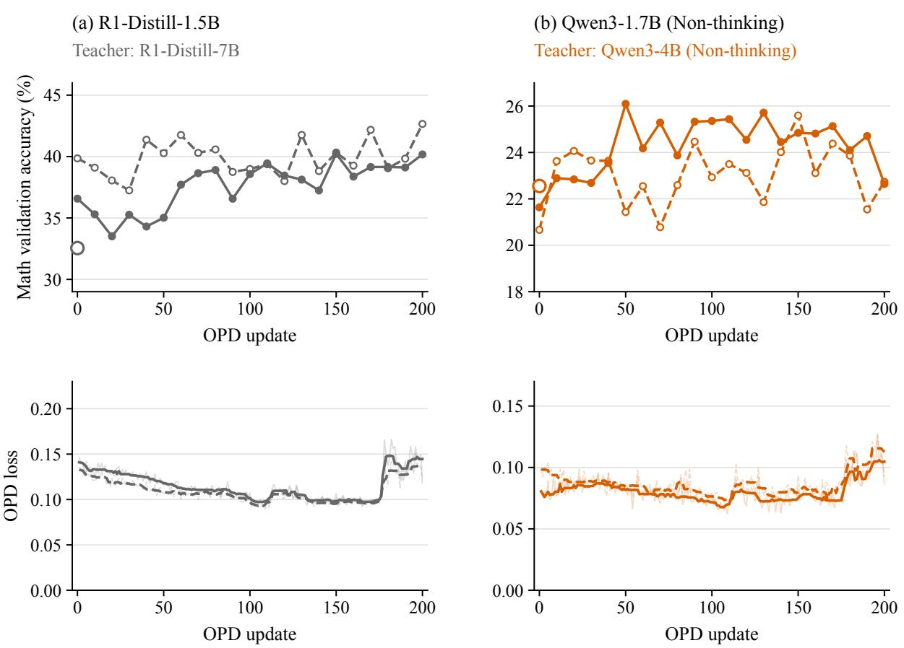  
Figure 9: Direct OPD and OPD after SFT with the two tested teachers. Top: benchmark accuracy from each run’s own recorded evaluations. The direct R1 curve’s step-0 point is the shared basemodel measurement described in Appendix E. Larger hollow circles separately show the original standalone SFT evaluations; they are not connected to either trajectory. The R1 standalone SFT evaluation uses a diferent prompt sufix. Bottom: raw per-update OPD loss in faint lines and centered nine-update rolling medians in stronger lines. Solid lines are continuations after SFT; dashed lines are direct OPD from the base student. Each panel uses a linear scale containing its observations. The two training stages have separate update counts, and the continuation does not include the SFT cost on its horizontal axis.

Increasing the rollout count from one to eight changes the number of sampled responses per update from 64 to 512. The optimization minibatch is expanded accordingly, so both settings still perform one optimizer update per batch. Thus, the total numbers of sampled training responses are 12,800 and 102,400, respectively, while both process 12,800 prompt instances. This is a comparison at fixed prompt and update budgets, not at fixed generation cost. We use dynamic microbatching with a 32,768-token per-GPU budget, FSDP, activation checkpointing, and bfloat16 rollout inference. The additional runs use two H200 GPUs, except the R1-Distill-7B top-16, eight-rollout run, which uses four. The Qwen Qwen3-4B-RL-Math top-16 baseline and both R1 top-16 baselines use four GPUs. All other Qwen conditions use two. Qwen runs use SGLang 0.5.3rc0 and Transformers 4.56.1; the additional R1 runs use vLLM 0.11.0 and Transformers 4.57.6. The additional runs use PyTorch 2.8.0 and Ray 2.49.2. No separate experiment-level seed is recorded in the saved data configuration. Each condition is a single stochastic training run; the comparisons are not paired-seed or repeated-seed estimates.

Full-logit implementation. Top-16 OPD selects the student’s sixteen highest-probability vocabulary entries at each visited prefix. Student probabilities are renormalized over these entries to form detached weights, while the log-probability ratio uses each model’s full-vocabulary normalization. Full-logit OPD instead includes all 151,936 student output entries. It retains the same detached student-weighted update and loss normalization, computing the output projection in chunks of 128 prefix states to limit memory use. No vocabulary truncation is applied in these full-logit runs. For R1-Distill-7B, whose output head has 152,064 entries, teacher logits are normalized over all 152,064 entries before selecting the 151,936 entries aligned with the student; the selected teacher probabilities are not renormalized. Token-ID compatibility is checked before training. Because the top-16 and full-logit objectives difer, we compare their loss reductions relative to their own update-1 losses, rather than treating their absolute losses as the same quantity.

Evaluation and run accounting. All additional runs are evaluated before training and every ten updates on AIME 2024 (30 problems), AIME 2025 (30), and AMC 2023 (83). Each evaluation contains 1,144 responses: eight per problem, sampled at temperature 0.7, top-p = 0.95, and a 31,744-token response limit within a 32,768-token context. We average correctness over responses within each benchmark and then average the three benchmark scores equally. The same answerextraction and mathematical-correctness scorer is used throughout; format reward is disabled. We retain each student group’s original prompt formatting: Qwen validation requests step-by-step reasoning and a boxed final answer under its non-thinking chat template, while R1 validation uses the corresponding R1 prompt and reasoning prefix. Dataset and rendered-prompt checks verify consistency within each student group. The two original R1 baselines use the shared initial-student evaluation described in Appendix E; every additional run uses its own step-0 evaluation. Variations in these initial estimates reflect sampling from the same initial checkpoint.

For each additional run, the loss record contains all 200 updates and the validation record contains all 21 evaluation checkpoints. Native optimizer and data-loader counters were checked against the saved checkpoints. We use the completed run’s canonical local records when an earlier attempt failed: in particular, the JustRL eight-rollout run was restarted from the initial checkpoint after an unsaved one-update attempt, and the discarded attempt is not concatenated with the completed trajectory. These eight additional runs are excluded from the seven-run averages in the main text.

Table H.6: Support and rollout comparisons after 200 updates. Accuracy is macro-averaged avg@8. Maximum and final loss reduction use $( 1 - \widehat { \mathcal { L } } _ { \mathrm { m i n } } / \widehat { \mathcal { L } } _ { 1 } ) \times 1 0 0 \%$ and $( 1 - \widehat { \mathcal { L } } _ { 2 0 0 } / \widehat { \mathcal { L } } _ { 1 } ) \times 1 0 0 \%$ , respectively. Each uses its own run’s objective. The four top-16, n = 1 rows are the main-run baselines; the other eight rows are additional runs.
<table><tr><td rowspan="3">Teacher</td><td rowspan="3">Support n</td><td colspan="2">Accuracy</td><td colspan="2">Loss reduction</td></tr><tr><td>Initial</td><td></td><td>Final Maximum</td><td>Final</td></tr><tr><td colspan="2"></td><td colspan="2"></td></tr><tr><td>Student: Qwen3-1.7B (Non-thinking) Qwen3-4B-RL-Math Top-16</td><td colspan="4">1 21.10%43.94%</td></tr><tr><td rowspan="4">Qwen3-4B</td><td>Full</td><td></td><td>1 20.55% 46.36%</td><td>65.08% 55.37% 62.68% 54.85%</td></tr><tr><td></td><td></td><td>822.95%45.21%</td><td>60.62%51.29%</td></tr><tr><td>Top-16</td><td></td><td>1 20.66% 22.74%</td><td>30.36% 6.24%</td></tr><tr><td>Top-16 Full</td><td>1 21.66% 22.88%</td><td></td><td>37.52%11.60%</td></tr><tr><td colspan="2">Top-16</td><td>8 21.85% 24.87%</td><td></td><td>33.02%</td><td>9.89%</td></tr><tr><td colspan="8">Student: R1-Distill-1.5B JustRL-1.5B</td></tr><tr><td rowspan="4">R1-Distill-7B</td><td>Top-16</td><td></td><td>1 39.85%51.88%</td><td></td><td>96.29% 92.95%</td><td></td></tr><tr><td>Full</td><td></td><td>1 39.85% 50.46%</td><td></td><td>96.22%91.80%</td><td></td></tr><tr><td>Top-16</td><td></td><td>8 39.85% 51.93%</td><td></td><td></td><td>96.18% 31.09%</td></tr><tr><td>Top-16</td><td></td><td>1 39.85% 42.66%</td><td></td><td>34.35%13.94%</td><td></td></tr><tr><td rowspan="3"></td><td>Full</td><td></td><td>1 39.85% 40.32%</td><td></td><td>30.77%-7.05%</td><td></td></tr><tr><td>Top-16</td><td></td><td>8 40.39% 38.87%</td><td></td><td>35.03%18.29%</td><td></td></tr><tr><td></td><td></td><td></td><td></td><td></td><td></td></tr></table>

Observed behavior. Figures 10 and 11 show validation accuracy and loss over the full training window. For Qwen3-1.7B, final accuracy with Qwen3-4B-RL-Math is 43.94%, 46.36%, and 45.21% for top-16 with one rollout, full logits with one rollout, and top-16 with eight rollouts, respectively. The corresponding final loss reductions are 55.37%, 54.85%, and 51.29%. With Qwen3-4B, accuracy remains much lower (22.74%, 22.88%, and 24.87%), and final loss reductions remain small (6.24%, 11.60%, and 9.89%). Thus, removing the vocabulary restriction or increasing the rollout count preserves the broad teacher-dependent behavior in these Qwen runs.

For R1-Distill-1.5B, JustRL-1.5B also produces higher final accuracy than R1-Distill-7B under all three configurations. With JustRL, final accuracies are 51.88%, 50.46%, and 51.93%, and maximum loss reductions are all approximately 96%. However, the eight-rollout run’s loss rises during its final updates, leaving a final loss reduction of 31.09%, compared with 92.95% and 91.80% in the one-rollout top-16 and full-logit runs. The R1-Distill-7B full-logit run ends with a loss 7.05% above its update-1 value; its maximum loss reduction is 30.77%. We therefore report both maximum and final loss reduction. These runs preserve the broad teacher ordering, but their detailed loss trajectories are not interchangeable, and a larger rollout count does not uniformly improve optimization. In the JustRL eight-rollout run, the pre-clip gradient norm and mean response length also rise during the last updates; the epoch counter remains zero throughout this interval. These logs establish the late increase but do not identify its cause.

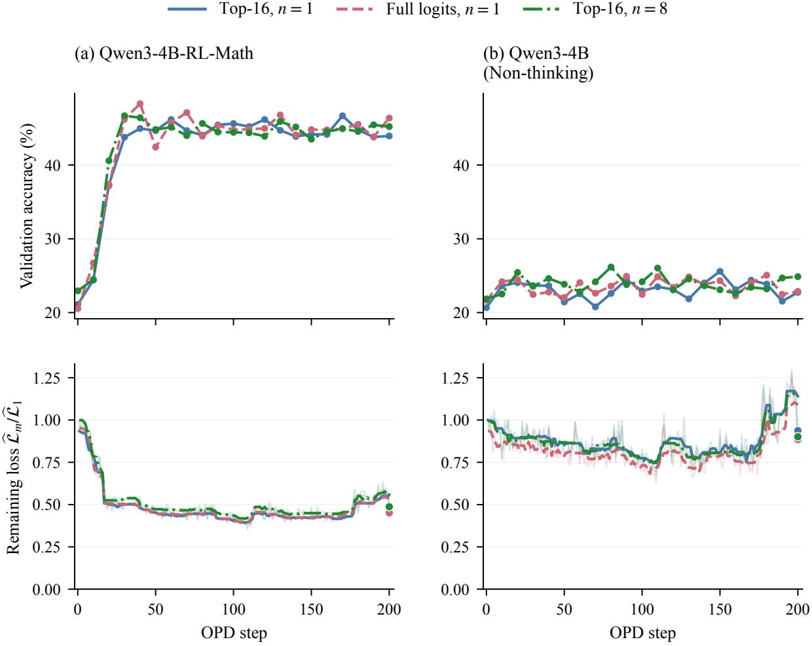  
Figure 10: Vocabulary-support and rollout comparisons for Qwen3-1.7B (Non-thinking). Each column fixes the OPD teacher. Top: validation accuracy. Bottom: loss divided by that run’s update-1 loss. Faint lines show all raw losses; thicker lines show centered nine-step rolling medians. Filled loss markers show the raw update-200 values. Here n is the number of training rollouts per prompt; all validation scores use avg@8.

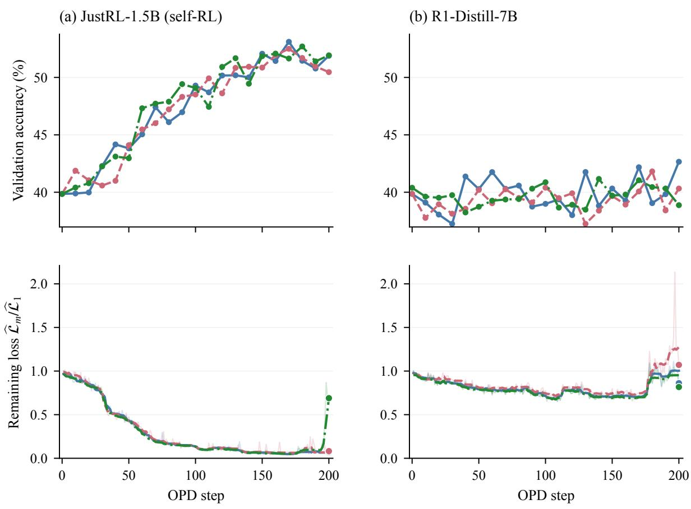  
Figure 11: Vocabulary-support and rollout comparisons for R1-Distill-1.5B, with the same plotting conventions as Figure 10. JustRL-1.5B is a self-RL teacher. The late loss increase in its eight-rollout run is retained, as is the loss increase in the full-logit R1-Distill-7B run.